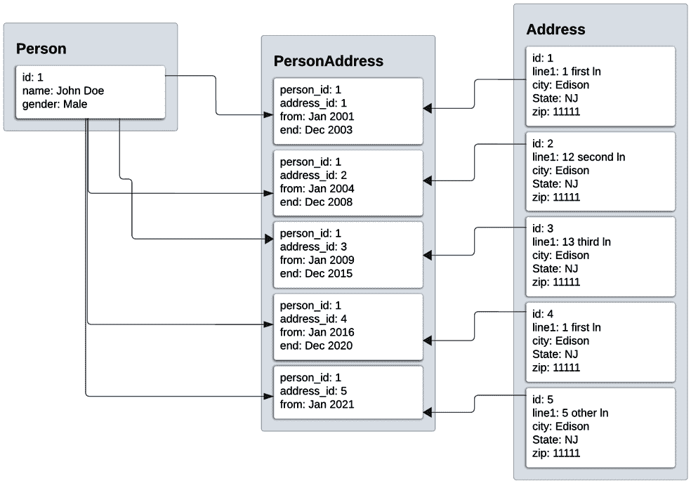
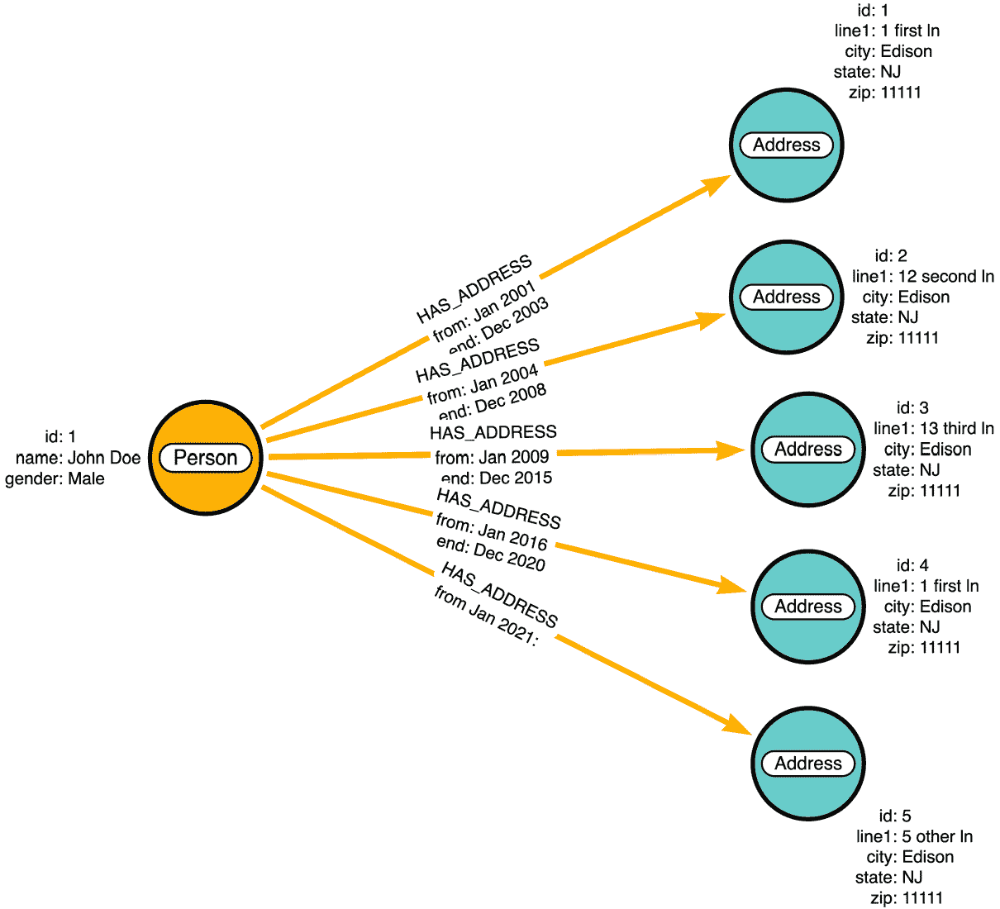
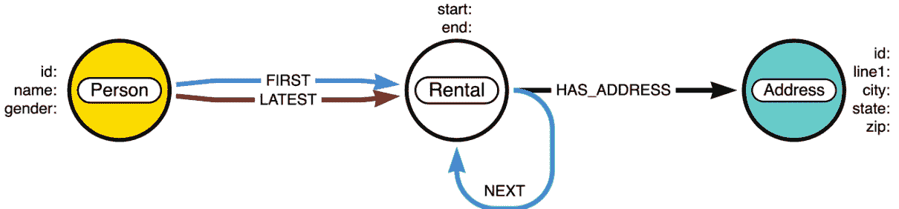
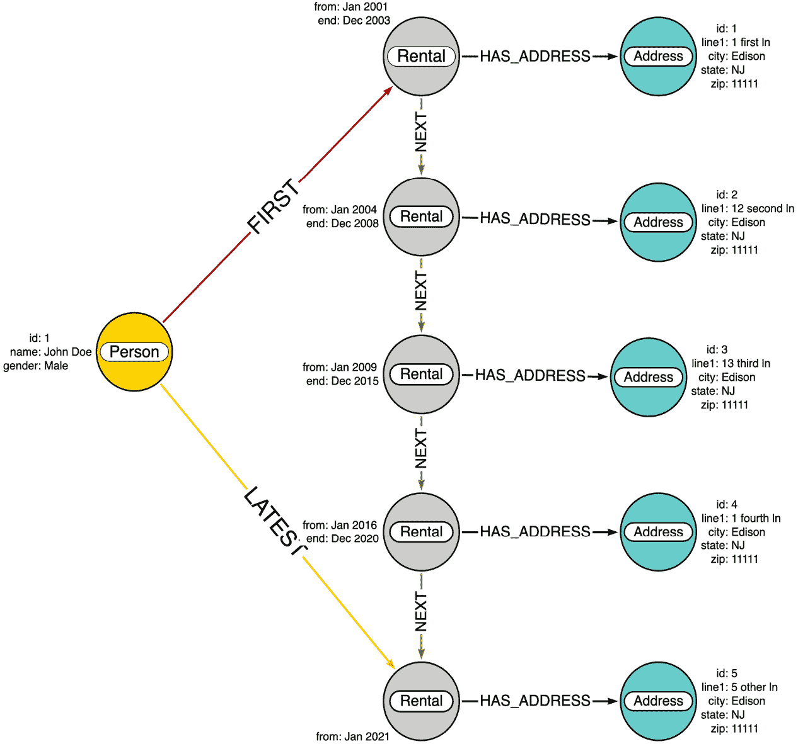
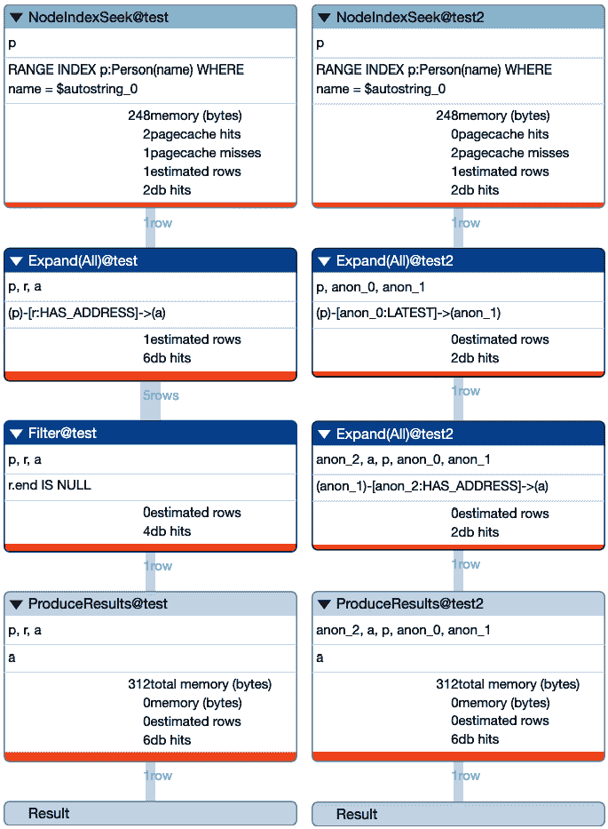
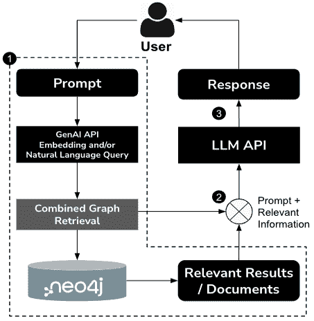

# 第三章：为智能应用建立知识图谱的基础理解

在上一章中，我们探讨了什么是 RAG 以及如何结合 LLMs 实现 RAG 流程的一些简单示例。在本章中，我们将探讨知识图谱是什么以及图如何使**检索增强生成**（**RAG**）更加有效。我们将探讨如何建模知识图谱以及 Neo4j 如何用于此目的。我们将探讨使用 Neo4j 数据持久化方法进行数据建模如何帮助构建更强大的知识图谱。我们还将探讨从**关系数据库管理系统**（**RDBMSs**）到 Neo4j 知识图谱的数据存储持久化方法，以更好地理解使用各种数据模型的数据。

我们将踏上激动人心的旅程，了解 RAG 模型与 Neo4j 强大的图数据库功能的融合如何使创建利用结构化知识库以增强性能和结果的应用程序成为可能。

在本章中，我们将涵盖以下主要内容：

+   理解图数据建模的重要性

+   结合 RAG 和 Neo4j 知识图谱的力量，使用 GraphRAG

+   增强知识图谱

# 技术要求

在我们深入探讨如何为与 Neo4j 集成构建知识图谱的实际方面之前，设置必要的工具和环境是至关重要的。以下是本章的技术要求：

+   **Neo4j 数据库**：您可以使用 Neo4j Desktop 进行本地设置或使用 Neo4j Aura 进行基于云的解决方案。从 Neo4j 下载中心下载 Neo4j Desktop：[`neo4j.com/download/`](https://neo4j.com/download/)。对于 Neo4j Aura，请访问 Neo4j Aura：[`neo4j.com/product/neo4j-graph-database/`](https://neo4j.com/product/neo4j-graph-database/)。Neo4j 提供两种主要的基于云的服务——AuraDB 和 AuraDS：

    +   **AuraDB**是一个为构建智能应用程序的开发者量身定制的完全托管的图数据库服务。它支持灵活的模式、关系的原生存储以及使用 Cypher 语言的高效查询。AuraDB 提供免费层，使用户能够在不产生成本的情况下探索图数据。在[`neo4j.com/product/auradb/`](https://neo4j.com/product/auradb/)了解更多关于 AuraDB 的信息。

    +   **AuraDS**是一个完全托管的 Neo4j 图数据科学实例，可用于构建数据科学应用程序。您可以在[`neo4j.com/docs/aura/graph-analytics/`](https://neo4j.com/docs/aura/graph-analytics/)了解更多信息。

+   **DB Browser for SQLite**：此工具用于轻松查询 SQLite 数据库。[`sqlitebrowser.org/`](https://sqlitebrowser.org/)。

+   **Cypher 查询语言**: 在开始本章之前，您需要熟悉 Cypher，Neo4j 的查询语言。Neo4j 提供了优秀的 Cypher 教程。如果您不熟悉 Cypher，Neo4j 提供了优秀的教程和 GraphAcademy 的基本课程 ([`graphacademy.neo4j.com/`](https://graphacademy.neo4j.com/))，以帮助您入门。您还可以阅读这本书来详细了解 Cypher：Graph Data Processing with Cypher ([`www.packtpub.com/en-us/product/graph-data-processing-with-cypher-9781804611074`](https://www.packtpub.com/en-us/product/graph-data-processing-with-cypher-9781804611074)).

+   **Python 环境**: 推荐使用 Python 3.8 或更高版本。请确保您已安装它。您可以从官方 Python 网站下载它 [`www.python.org/downloads/`](https://www.python.org/downloads/).

+   **Neo4j Python 驱动程序**: 这允许您从 Python 与 Neo4j 数据库交互。使用`pip`安装它：

    ```py
    pip install neo4j-driver 
    ```

+   **GitHub 仓库**: 本章的所有代码和资源都可在以下 GitHub 仓库中找到：[`github.com/PacktPublishing/Building-Neo4j-Powered-Applications-with-LLMs`](https://github.com/PacktPublishing/Building-Neo4j-Powered-Applications-with-LLMs)。导航到`ch3`文件夹以获取与本章相关的具体内容。

在继续之前，请确保您已安装并配置了所有这些工具和库。此设置将使您能够无缝地跟随示例和练习。

# 理解图数据建模的重要性

在我们继续查看 GraphRAG 流程如何与 Neo4j 协同工作之前，让我们退一步，了解我们如何建模知识图。我们将使用一些简单的数据，并尝试查看我们在 RDBMS 和图形中如何建模这些数据。我们还将看到这种建模如何根据我们看待数据的方式而有所不同。

图形迫使我们以不同的方式思考，并从不同的角度看待数据，这取决于我们试图解决的问题。虽然这看起来可能像是一个问题，但实际上它实际上打开了许多大门。长期以来，我们一直被教导用**实体-关系**（**ER**）图来思考 RDBMS 存储方法。当技术有限制且存储成本非常高时，这种方法对于表示/持久化数据是好的。随着技术的进步和硬件的降价，新的途径已经打开，新的数据建模方法成为可能。图形非常适合利用这一点。

要考虑新的数据建模方式，我们可能不得不放弃一些我们习惯于使用 ER 图表示数据的方法。虽然这看起来很简单，但在现实中可能有点困难。学习和放弃的过程类似于以下图中描述的神经可塑性棱镜眼镜实验。


图 3.1 — 神经可塑性棱镜眼镜实验

这个实验涉及佩戴棱镜眼镜执行一个简单的任务。大脑需要一段时间来调整视觉变化以正确完成任务。当参与者取下眼镜时，需要一段时间才能再次执行相同的任务。数据建模也是如此。我们可能需要放弃一些我们之前依赖的方法，才能构建更好的图数据模型。您可以在[`sfa.cems.umn.edu/neural-plasticity-prism-goggle-experiment`](https://sfa.cems.umn.edu/neural-plasticity-prism-goggle-experiment)上了解更多关于这个实验的信息。

我们将研究我们在现实生活中如何消费数据，以了解是否有其他方法可以帮助我们构建一个好的图数据模型。

例如，让我们考虑一个图书馆或书店来了解我们的数据或信息消费是如何驱动书籍布局的。在图书馆中，书籍是按照类别和作者姓氏排列的。这与我们利用索引查找数据的方式相似。但图书馆入口处可能还有其他区域突出显示新书和热门书籍。这样做是为了确保人们可以快速找到这些书籍。在关系型数据库管理系统（RDBMS）中尝试模拟这些方面是困难的。但 Neo4j 中的图数据库方法通过利用多个标签使这变得相当容易。这使得图数据库能够帮助我们构建一个有助于轻松高效消费数据的数据模型。使用图，我们可能需要尝试改变我们的思维方式，并尝试几种不同的数据建模方法。我们的初始方法可能并不完全正确，但我们需要不断调整数据模型，以达到一个对我们来说可接受的数据模型。在 RDBMS 和其他技术中，数据模型是固定的，如果做得不对，可能会产生巨大的影响。这正是 Neo4j 脱颖而出的地方。其可选的灵活模式方法帮助我们从一个可能最初并不理想的数据模型开始，但我们可以在不从头开始的情况下逐步调整它。

我们将使用一些小型、简单的数据，并查看使用 RDBMS 和图进行的数据建模。我们将尝试建模的数据如下所示：

+   一个具有以下必要细节的人：

    ```py
    firstName
    lastName 
    ```

+   以下格式中的人居住过的五个租赁地址：

    ```py
    Address line 1
    City
    State
    zipCode
    fromTime
    tillTime 
    ```

虽然这看起来很简单，但它足以让我们理解如何在关系型数据库管理系统（RDBMS）和图中表示这些数据的细微差别。

这些是我们希望通过这些数据来回答的问题：

+   约翰·多伊（John Doe）目前居住的最新地址是哪里？

+   约翰·多伊（John Doe）最初居住的地址是哪里？

+   约翰·多伊（John Doe）居住的第三个地址是哪里？

让我们看看这些数据如何在关系型数据库管理系统（RDBMS）中建模。

## 关系型数据库管理系统（RDBMS）数据建模

在本节中，我们将查看先前定义的样本数据的 RDBMS 数据建模方面。以下图表示数据模型作为一个实体关系图：


图 3.2 — 实体关系图

在这个数据模型中有三个表。`Person` 表包含个人详细信息。`Address` 表包含地址详细信息。`Person_Address` 表包含租赁详情，以及 `Person` 和 `Address` 表的引用。我们使用这个连接表来表示租赁详情，以避免重复 `Person` 或 `Address` 实体的数据。在构建这些数据模型时，我们需要格外注意细节，因为更改它们可能相当耗时，具体取决于我们更改了多少。如果我们把一个表拆分成多个表，那么数据迁移可能是一项相当大的任务。

您可以使用此教程创建 SQLite 数据库：[`datacarpentry.org/sql-socialsci/02-db-browser.html`](https://datacarpentry.org/sql-socialsci/02-db-browser.html)。我们将使用该 SQLite 数据库来加载数据并验证查询以回答我们之前定义的问题。

以下 SQL 脚本创建表：

```py
-- Person Table definition
`CREATE TABLE` IF NOT EXISTS `person` (
    `id` INTEGER PRIMARY KEY,
    `name` varchar(100) NOT NULL,
    `gender` varchar(20) ,
    UNIQUE(`id`)
) ;
-- Address table definition
`CREATE TABLE` IF NOT EXISTS `address` (
    `id` INTEGER PRIMARY KEY,
   `line1` varchar(100) NOT NULL,
    `city` varchar(20) NOT NULL,
    `state` varchar(20) NOT NULL,
    `zip` varchar(20) NOT NULL,
    UNIQUE(`id`)
) ;
-- Person Address table definition
`CREATE TABLE` IF NOT EXISTS `person_address` (
    `person_id` INTEGER NOT NULL,
    `address_id` INTEGER NOT NULL,
    `start` varchar(20) NOT NULL,
    `end` varchar(20) ,
    `FOREIGN KEY` (`person_id`) REFERENCES person (`id`)
        ON DELETE CASCADE ON UPDATE NO ACTION,
    `FOREIGN KEY` (`address_id`) REFERENCES address (`id`)
        ON DELETE CASCADE ON UPDATE NO ACTION
) ; 
```

以下 SQL 脚本将数据插入到表中：

```py
-- Insert Person Record
INSERT INTO person (id, name, gender) values `(1, 'John Doe', 'Male') ;`
-- Insert Address Records
INSERT INTO address (id, line1, city, state, zip) values `(1, '1 first ln', 'Edison', 'NJ', '11111') ;`
INSERT INTO address (id, line1, city, state, zip) values `(2, '13 second ln', 'Edison', 'NJ', '11111') ;`
INSERT INTO address (id, line1, city, state, zip) values `(3, '13 third ln', 'Edison', 'NJ', '11111') ;`
INSERT INTO address (id, line1, city, state, zip) values `(4, '1 fourth ln', 'Edison', 'NJ', '11111') ;`
INSERT INTO address (id, line1, city, state, zip) values `(5, '5 other ln', 'Edison', 'NJ', '11111') ;`
-- Insert Person Address (Rental) Records
INSERT INTO person_address `(person_id, address_id, start, end) values (1,1,'2001-01-01', '2003-12-31') ;`
INSERT INTO person_address `(person_id, address_id, start, end) values (1,2,'2004-01-01', '2008-12-31') ;`
INSERT INTO person_address `(person_id, address_id, start, end) values (1,3,'2009-01-01', '2015-12-31') ;`
INSERT INTO person_address `(person_id, address_id, start, end) values (1,4,'2016-01-01', '2020-12-31') ;`
INSERT INTO person_address `(person_id, address_id, start, end) values (1,5,'2021-01-01', null) ;` 
```

一旦我们加载了数据，它看起来会是这样。



图 3.3 — RDBMS 中存储的数据

现在，我们将看看如何从 RDBMS 中查询数据：

+   **查询 1 – 获取最新地址**

让我们查看以下 SQL 查询以回答第一个问题：

```py
SELECT line1, city, state, zip from
person p, person_address pa, address a
WHERE p.name = `'John Doe'`
    and pa.person_id = p.id
    and pa.address_id = a.id
    and pa.end is `null` 
```

从查询中，我们可以看到我们依赖于末列值为空来确定哪个是最新的地址。这是在 SQL 查询中确定最后一个地址的逻辑。

+   **查询 2** – 获取第一个地址

我们将查看 SQL 查询以回答第二个问题：

```py
SELECT line1, city, state, zip from
person p, person_address pa, address a
WHERE p.name = `'``John Doe'`
    and pa.person_id = p.id
    and pa.address_id = a.id
`ORDER BY pa.start ASC`
`LIMIT 1` 
```

从查询中，我们可以看到我们依赖于搜索-排序-过滤模式来获取我们想要的数据，SQL 查询中的逻辑。

+   **查询 3 – 获取第三个地址**

我们将查看 SQL 查询以回答第三个问题：

```py
SELECT line1, city, state, zip from
person p, person_address pa, address a
WHERE p.name = 'John Doe'
    and pa.person_id = p.id
    and pa.address_id = a.id
`ORDER BY pa.start ASC`
`LIMIT 2, 1` 
```

同样，在这个查询中我们也可以看到我们依赖于搜索-排序-过滤模式来获取我们想要的数据。

现在，我们将看看如何使用图来建模这些数据。

## 图数据建模：基本方法

为了说明目的，我们将使用在图中建模此数据最常见和最简单的方法。


图 3.4 — 基本图数据模型

这与我们通常用英语表达信息的方式一致：

**Person** *居住在* **Address**

在这个句子中，**名词**被表示为**节点**，而**动词**被表示为**关系**。这种数据模型方法相当简单，几乎类似于 RDBMS 数据模型的 ER 图。这里唯一的区别是，表示租赁的连接表被建模为关系。这种类型的数据持久化的优点是它减少了索引查找成本。在 RDBMS 中，数据检索方面最大的成本是连接表的索引查找成本。随着数据量的增加，这种查找成本会持续增加。我们可以通过这种方法来减少这种成本。

**注意**

如果你使用 Neo4j，你可以使用这个教程来创建 Neo4j 数据库。

桌面：[`neo4j.com/docs/desktop-manual/current/operations/create-dbms/`](https://neo4j.com/docs/desktop-manual/current/operations/create-dbms/).

或者，你可以使用这个教程在云中创建数据库：[`neo4j.com/docs/aura/auradb/getting-started/create-database/`](https://neo4j.com/docs/aura/auradb/getting-started/create-database/)。这里有一个免费选项可用。这对于可能不想或不需要在本地安装 Neo4j Desktop 的人来说可能是最佳选择。Neo4j Aura 是一个完全管理的图数据库即服务解决方案。

让我们看看以下图查询来理解这一点。

以下 Cypher 脚本设置了索引以加快数据加载和检索。这可以被视为一个模式：

```py
CREATE CONSTRAINT person_id_idx FOR (n:Person) REQUIRE n.id IS UNIQUE ;
CREATE CONSTRAINT address_id_idx FOR (n:Address) REQUIRE n.id IS UNIQUE ;
CREATE INDEX person_name_idx FOR (n:Person) ON n.name ; 
```

这个 Cypher 脚本创建了两个唯一约束，以确保我们不会有两个重复的**Person**和**Address**节点。我们还添加了一个索引，以加快使用名称查找人员的速度。

一旦设置好模式，我们就可以使用这个 Cypher 脚本来将数据加载到 Neo4j 中：

```py
CREATE (p:Person {`id:1, name:'John Doe', gender:'Male'`})
CREATE (a1:Address {`id:1, line1:'1 first ln', city:'Edison', state:'NJ', zip:'11111'`})
CREATE (a2:Address {`id:2, line1:'13 second ln', city:'Edison', state:'NJ',` `zip:'11111'`})
CREATE (a3:Address {`id:3, line1:'13 third ln', city:'Edison', state:'NJ', zip:'11111'`})
CREATE (a4:Address {`id:4, line1:'1 fourth ln', city:'Edison', state:'NJ', zip:'11111'`})
CREATE (a5:Address {`id:5, line1:'5 other ln', city:'Edison', state:'NJ', zip:'11111'`})
CREATE (p)-[:HAS_ADDRESS {`start:'2001-01-01', end:'2003-12-31'`}]->(a1)
CREATE (p)-[:HAS_ADDRESS {`start:'2004-01-01', end:'2008-12-31'`}]->(a2)
CREATE (p)-[:HAS_ADDRESS {`start:'2009-01-01', end:'2015-12-31'`}]->(a3)
CREATE (p)-[:HAS_ADDRESS {`start:'2016-01-01', end:'2020-12-31'`}]->(a4)
CREATE (p)-[:HAS_ADDRESS {`start:'2021-01-01'`}]->(a5) 
```

一旦我们加载了数据，在图中看起来就像这样。



图 3.5 — 使用图数据建模表示人员租赁的基本方法

现在，我们将创建与上一节中使用的 RDBMS 查询类似的 Cypher 查询：

+   **查询 1 – 获取最新地址**

以下 Cypher 查询获取我们最新的地址：

```py
MATCH (p:Person {name:`'John Doe'`})-[r:HAS_ADDRESS]->(a)
WHERE r.end is `null`
RETURN a 
```

如果我们查看这个查询，它比我们之前看到的 SQL 查询要简单得多。然而，结果取决于我们如何标记最后一个地址，即不设置关系的`end`属性。因此，确定最后一个地址的逻辑仍然是查询的一部分，就像在 SQL 查询中一样。我们可以看到，我们在检查关系中的值，并尝试在连接表上使用索引，如下面的代码所示：

```py
and pa.person_id = p.id
and pa.address_id = a.id 
```

仅避免这些索引本身就可以获得更好的性能。

+   **查询 2 – 获取第一个地址**

这个 Cypher 查询为我们获取了第一个地址：

```py
MATCH (p:Person {`name:'John Doe'`})-[r:HAS_ADDRESS]->(a)
WITH r, a
`ORDER BY r.start ASC`
WITH r,a
RETURN a
`LIMIT 1` 
```

从查询中，我们可以看到我们依赖于搜索-排序-过滤模式来获取我们想要的数据，类似于 SQL 查询。确定第一个地址的逻辑是 Cypher 查询的一部分。

+   **查询 3 – 获取第三个地址**

这个 Cypher 查询为我们获取第三个地址：

```py
MATCH (p:Person {`name:'John Doe'`})-[r:HAS_ADDRESS]->(a)
WITH r, a
`ORDER BY r.start ASC`
WITH r,a
RETURN a
`SKIP 2`
`LIMIT 1` 
```

与之前的查询类似，我们必须依赖搜索排序过滤来获取我们想要的数据。确定第三个地址的逻辑是 Cypher 查询的一部分。

接下来，我们将深入探讨图形数据建模的更细致的方法。

## 图形数据建模：高级方法

我们将用不同的方式查看这些数据并构建一个数据模型。这个模型受我们如何消费数据的影响。



图 3.6 — 使用图形数据建模表示 Person Rentals，消费方法

初看之下，这似乎更接近 RDBMS ER 图。我们有 **Person**、**Address** 和 **Rental** 节点。但相似之处到此为止。我们可以看到 **Person** 通过一个 **FIRST** 或 **LATEST** 关系与 **Rental** 节点连接。**Rental** 可能与另一个 **Rental** 节点有一个 **NEXT** 关系。**Rental** 节点也连接到一个 **Address**。模型可能看起来有点复杂。一旦我们加载数据并看到它是如何连接的，它就更有意义了。

这个 Cypher 脚本设置了索引以加快数据加载和检索：

```py
CREATE CONSTRAINT person_id_idx FOR (n:Person) REQUIRE n.id IS UNIQUE ;
CREATE CONSTRAINT address_id_idx FOR (n:Address) REQUIRE n.id IS UNIQUE ;
CREATE INDEX person_name_idx FOR (n:Person) ON n.name ; 
```

我们可以看到索引与之前的模型相同。我们没有为 **Rental** 节点添加任何索引或约束。

这个 Cypher 脚本将数据加载到 Neo4j 中：

```py
CREATE (p:Person {`id:1, name:'John Doe', gender:'Male'`})
CREATE (a1:Address {`id:1, line1:'1 first ln', city:'Edison', state:'NJ', zip:'11111'`})
CREATE (a2:Address {`id:2, line1:'13 second ln', city:'Edison', state:'NJ', zip:'11111'`})
CREATE (a3:Address {`id:3, line1:'13 third ln', city:'Edison', state:'NJ', zip:'11111'`})
CREATE (a4:Address {`id:4, line1:'1 fourth ln', city:'Edison', state:'NJ', zip:'11111'`})
CREATE (a5:Address {`id:5, line1:'5 other ln', city:'Edison', state:'NJ', zip:'11111'`})
CREATE (p)-[`:FIRST`]->(r1:Rental {`start:'2001-01-01', end:'2003-12-31'`})-[:HAS_ADDRESS]->(a1)
CREATE (r1)-[`:NEXT`]->(r2:Rental {`start:'2004-01-01', end:'2008-12-31'`})-[:HAS_ADDRESS]->(a2)
CREATE (r2)-[`:NEXT`]->(r3:Rental {`start:'2009-01-01', end:'2015-12-31'`})-[:HAS_ADDRESS]->(a3)
CREATE (r3)-[`:NEXT`]->(r4:Rental {`start:'2016-01-01', end:'2020-12-31'`})-[:HAS_ADDRESS]->(a4)
CREATE (r4)-[`:NEXT`]->(r5:Rental {`start:'2021-01-01'`})-[:HAS_ADDRESS]->(a5)
CREATE (p)-[`:LATEST`]->(r5) 
```

数据加载后，在图中将看起来像这样（*图 3.7*）。



图 3.7 — 使用图形数据建模表示 Person Rentals 的租赁序列图

我们可以看到，存储在图中的数据与之前大不相同。**Person** 只与第一个和最后一个租赁相关联。从第一个到最后的每个租赁都通过一个 **NEXT** 关系连接：

+   **查询 1 – 获取最新地址**

这个 Cypher 查询为我们获取最新的地址：

```py
MATCH (p:Person {name:`'John Doe'`})-[:`LATEST`]->()-[:HAS_ADDRESS]->(a)
RETURN a 
```

我们可以看到，这个查询与之前的图形和 SQL 查询非常不同。在之前的图形模型中，Cypher 查询在确定最后一个地址方面与 SQL 查询相似。在这里，查询看起来类似于一句英文（*Person’s latest address*）。

虽然查询看起来对大多数人来说更简单、更容易理解，但这种表示数据的方式值得吗？在这种情况下，我们将使用更多的存储空间来以更详细的方式表示数据。让我们分析从初始图形数据模型到这个数据模型的查询，看看是否有任何优势。



图 3.8 — 基本图形模型与高级图形模型 – 查询 1 分析

从 **查询配置文件** 中，我们可以看到初始图数据模型执行操作需要 18 **数据库访问**（访问）和 312 字节的内存。当前图数据模型执行操作需要 12 次数据库访问和 312 字节的内存。我们可以看到，新的数据模型能够更优化地执行这个查询。随着数据量的增长，之前的图数据模型将需要更多的时间来执行操作，数据库访问次数将与该人拥有的关系数量线性增长。使用当前数据模型，它将保持相对稳定。

现在我们来看查询 2。

+   **查询 2 – 获取第一个地址**

这个 Cypher 查询获取我们到第一个地址：

```py
MATCH (p:Person {name:`'John Doe'`})-[:`FIRST`]->()-[:HAS_ADDRESS]->(a)
RETURN a 
```

我们可以看到，这个查询与上一个查询几乎完全相同，只是我们遍历的关系不同。我们不再使用 *search-sort-filter* 模式。这是这种数据模型的最大优势。这种模型还使我们能够轻松地将图用作结构来检索数据。这也意味着确定我们正在查看的数据的逻辑并没有以某些属性比较的形式编码到查询中。让我们比较查询配置文件，看看这是否给我们带来任何优势。


图 3.9 — 基本图模型与高级图模型对比 – 查询 2 配置文件

我们可以看到，对于初始图数据模型，查询执行计划比当前数据模型更大、更复杂。使用初始图数据模型，执行操作需要 19 次数据库访问和 1,020 字节的内存。使用当前数据模型，计划几乎与查询 1 相似。执行操作需要 12 次数据库访问和 312 字节的内存。我们可以看到，排序导致我们使用了更多的内存，并将消耗更多的 CPU 周期。随着**Person**与更多地址的连接，初始图数据模型将需要更多的内存和数据库访问，性能将逐渐下降。使用当前数据模型，性能将保持相对稳定。

+   **查询 3 – 获取第三个地址**

这个 Cypher 查询获取第三个地址：

```py
MATCH (p:Person {name:`'John Doe'`})-[:`FIRST`]->()-[`:NEXT*2..2`]->()-[:HAS_ADDRESS]->(a)
RETURN a 
```

我们可以从查询中看到，它的编写方式是遍历到第一个租赁，跳过下一个租赁以到达第三个租赁。这是我们通常查看数据的方式，并以这种方式检索数据感觉自然。同样，我们不再依赖于 *search-sort-filter* 模式。让我们比较查询配置文件，看看这是否给我们带来任何优势。


图 3.10 — 基本图模型与高级图模型对比 – 查询 3 配置文件

从这些配置文件中，我们可以看到当前数据模型查询配置文件比之前的查询要复杂一些。初始图数据模型执行操作需要 19 次数据库访问和 1,028 字节。当前图数据模型执行操作需要 16 次数据库访问和 336 字节。

**注意**

**查询分析**是了解查询工作原理的最佳方式。如果我们对查询性能不满意，分析可以帮助我们了解哪些查询执行区域需要改进或更改以提高性能。你可以在 [`neo4j.com/docs/cypher-manual/current/planning-and-tuning/`](https://neo4j.com/docs/cypher-manual/current/planning-and-tuning/) 上了解更多相关信息。

通过分析查询和数据模型，我们可以看到，重新审视数据模型的定义可以在性能和执行相同操作的成本方面产生巨大影响。

当前数据模型的另一个优点是，如果我们确实想从地址的角度跟踪租赁情况，我们可以在同一地址的租赁之间添加另一个关系，比如说 **NEXT_RENTAL**。这将为我们提供同一数据的另一种视角。在 RDBMS 或其他数据持久化层中尝试以这种方式表示数据将是困难的。这正是 Neo4j 的优势所在，它具有灵活性，能够持久化关系以避免连接索引成本和可选模式，这使得它更适合构建知识图谱。

一个好的图数据模型可以使 RAG 流中的 **检索器** 更有效。它使得检索相关数据更快、更简单，正如我们在这里所探讨的。

我们将探讨如何将知识图谱作为 RAG 流的一部分来使用。

# 将 RAG 和 Neo4j 知识图谱的强大功能结合到 GraphRAG 中

在上一章中，我们讨论了 **检索器**，它是 RAG 流的核心。检索器利用数据存储来检索相关信息，以提供给 LLM 以获得对我们问题的最佳回答。检索器可以根据需要与各种数据存储一起工作。数据存储功能可以极大地决定检索到的信息的有用性、速度和有效性。这正是图发挥重要作用的地方。这就是 **GraphRAG** 产生的原因。

**注意**

你可以在 [`www.microsoft.com/en-us/research/blog/graphrag-unlocking-llm-discovery-on-narrative-private-data/`](https://www.microsoft.com/en-us/research/blog/graphrag-unlocking-llm-discovery-on-narrative-private-data/) 和 [`microsoft.github.io/graphrag/`](https://microsoft.github.io/graphrag/) 上了解更多关于 GraphRAG 及其如何有效利用的信息。为了全面了解 GraphRAG，你可以参考微软的研究论文《从局部到全局：基于图 RAG 的查询聚焦摘要方法》([`arxiv.org/abs/2404.16130`](https://arxiv.org/abs/2404.16130))。此外，微软已在 GitHub 上发布了 GraphRAG 项目([`github.com/microsoft/graphrag`](https://github.com/microsoft/graphrag))，提供了实施此方法所需资源和工具。

Neo4j 图数据库擅长以属性图的形式持久化数据，其中包含节点和关系。这使得以直观的方式存储和检索数据变得容易，并为 RAG 检索器提供数据存储。这种方法允许实现更准确、上下文感知和可靠的 AI 驱动应用程序。

我们现在将构建一个 GraphRAG 流程，结合 RAG 和知识图谱的力量以改善 LLM 响应。

## GraphRAG：通过 Neo4j 增强 RAG 模型

在上一章中，我们讨论了具有 RAG 模型的聊天应用中的信息流（参见图 3.5）。

现在，我们将看到如何增强此工作流程以生成改进的聊天应用响应。*图 3.11* 展示了 GraphRAG 的工作流程，其中用户的提示通过 LLM API 处理，从 Neo4j 中检索相关信息，然后与提示结合在一起，再发送到 LLM API。



图 3.11 — GraphRAG 的工作流程

LLM API 使用提示和来自 Neo4j 知识图谱的相关信息生成响应，为用户提供准确且上下文丰富的结果。通过结合 Neo4j 和 RAG 模型的功能，GraphRAG 通过更多的领域上下文增强了相关性。

让我们构建一个简单的图来展示这个 GraphRAG 流程。

## 为 RAG 集成构建知识图谱

对于此示例，我们将使用有限的数据进行演示，以构建图，重点关注电影及其剧情。

### Python 代码示例：在 Neo4j 中设置知识图谱

通过跟随提供的代码示例，您将学习如何设置 Neo4j 数据库，定义节点和关系，并使用 Cypher 执行基本查询：

1.  **设置 Neo4j 数据库**：在运行代码之前，请确保您有权访问 Neo4j 数据库。您可以使用以下任一选项：

    +   **Neo4j Desktop**：本地安装并运行它（下载 Neo4j Desktop：[`neo4j.com/download/`](https://neo4j.com/download/))

    +   **Neo4j AuraDB**：这是一个云托管选项（了解更多关于 AuraDB 的信息：[`neo4j.com/product/auradb/`](https://neo4j.com/product/auradb/))

1.  启动您的数据库实例并记录连接凭据（例如，URI、用户名和密码）。

1.  **安装必要的 Python 库**：您需要以下 Python 库：

    +   **Neo4j Python 驱动程序**：用于与数据库交互

    +   **Pandas**：用于处理数据结构和分析

    +   使用以下命令安装这些库：

        ```py
        pip install neo4j pandas 
        ```

1.  **连接到数据库并设置知识图谱**：一旦您的 Neo4j 数据库运行并且已安装所需的 Python 库，您可以使用以下 Python 脚本设置一个简单的知识图谱。在此示例中，我们将创建一个包含电影及其剧情的图，节点代表电影和剧情，关系表示哪个剧情属于哪部电影。

**注意**

我们将不会使用任何外部数据集，而是将使用硬编码的数据集来展示图模型和 GraphRAG 流程。我们将在第四章和第五章中探索完整的数据加载和 GraphRAG 流程。此示例仅用于展示 GraphRAG 流程的方面。

我们首先构建一个简单的图。我们将使用这个简单的图来展示 Neo4j 在 GraphRAG 流程中的位置和作用：

1.  导入`GraphDatabase`库并定义 Neo4j 连接性和凭证：

    ```py
    from neo4j import GraphDatabase
    uri = "bolt://localhost:7687"  # Replace with your Neo4j URI
    username = "neo4j"             # Replace with your Neo4j username
    password = "password"          # Replace with your Neo4j password 
    ```

1.  让我们创建一些节点：

    ```py
    def create_graph(tx):
        tx.run("CREATE (m:Movie {title: 'The Matrix', year: 1999})")
        ....
        # Create plot nodes
        tx.run("CREATE (p:Plot {description: 'A computer hacker learns from mysterious rebels about the true nature of his reality and his role in the war against its controllers.'})") 
    ```

1.  下一步是创建关系：

    ```py
    tx.run("""
        MATCH (m:Movie {title: 'The Matrix'}),
              (p:Plot {description: 'A computer hacker learns from mysterious rebels about the true nature of his reality and his role in the war against its controllers.'})
        CREATE (m)-[:HAS_PLOT]->(p)
        """) 
    ```

1.  如果我们可视化我们创建的数据，它将看起来如图 3.12 所示：

    ```py
    MATCH p=(:Movie)-[:HAS_PLOT]->()
    RETURN p
    LIMIT 5 
    ```


图 3.12 — 显示电影和剧情的示例图

5. 我们现在将使用 Cypher 查询检索数据：

```py
def query_graph(tx):
    # Query to retrieve movies and their plots
    result = tx.run("""
    MATCH (m:Movie)-[:HAS_PLOT]->(p:Plot)
    RETURN m.title AS movie, m.year AS year, p.description AS plot
    """)
    # Print the results
    for record in result:
        print(f"Movie: {record['movie']} ({record['year']}) - Plot: {record['plot']}") 
```

6. 如果我们运行它，我们可以看到如下所示的输出：

```py
Movie: The Matrix (1999) - Plot: A computer hacker learns from mysterious rebels about the true nature of his reality and his role in the war against its controllers. 
```

你可以在[`github.com/PacktPublishing/Building-Neo4j-Powered-Applications-with-LLMs/blob/main/ch3/imdb_kg.py`](https://github.com/PacktPublishing/Building-Neo4j-Powered-Applications-with-LLMs/blob/main/ch3/imdb_kg.py)找到完整的代码。

现在我们已经构建了基本的图，让我们在 GraphRAG 流程中使用它。

### 将 RAG 与 Neo4j 知识图谱集成

要将 RAG 模型与 Neo4j 集成，您需要配置模型以查询图数据库。这通常涉及设置一个 API 或中间件层，以促进 RAG 模型和 Neo4j 之间的通信。

这里提供了一个示例集成工作流程：

1.  **用户输入**：用户提供一个提示。在以下代码示例中，提示信息在脚本中预定义作为示例（`"The Matrix"`）。用户可以修改它以测试其他电影或提示：

    ```py
    prompt = "The Matrix" 
    ```

1.  **查询生成**：提示信息被处理，并生成一个 Cypher 查询以从 Neo4j 中检索相关信息。例如，查询可能会获取提示中提到的电影的剧情：

    ```py
    """
        Fetch relevant data (plots) for movies that match the user's prompt.
        """
        query = f"""
        MATCH (m:Movie)-[:HAS_PLOT]->(p:Plot)
        WHERE m.title CONTAINS '{prompt}'
        RETURN m.title AS title, m.year AS year, p.description AS plot
        """ 
    ```

1.  **数据检索**：执行 Cypher 查询，并从知识图谱中获取相关数据（例如，《黑客帝国》的剧情）：

    ```py
    with driver.session() as session:
            result = session.run(query)
            records = [
                {
                    "title": record["title"],
                    "year": record["year"],
                    "plot": record["plot"],
                }
                for record in result if record["plot"] is not None
            ]
            print(f"Retrieved Records: {records}")  # Debugging line
            return records 
    ```

1.  **RAG 模型处理**：检索到的数据与原始提示信息结合，并传递给 RAG 模型进行进一步处理，允许模型生成更丰富和上下文感知的响应：

    ```py
    """
        Combine the user's prompt with relevant data from the graph
        and generate a focused, non-repetitive response using the RAG model.
        """
        relevant_data = get_relevant_data(prompt)
        if not relevant_data:
            return "No relevant data found for the given prompt."
        # Combine dictionaries in relevant_data into a single string
        combined_input = (
          f"Provide detailed information about: {prompt}. " + 
          " ".join([
              f"{data['title']} ({data['year']}): {data['plot']}" 
              for data in relevant_data
        ])
        print(f"Combined Input: {combined_input}")
        if not combined_input.strip():
            return "No relevant data to process for this prompt."
        # Tokenize the combined input with truncation
        max_input_length = 512 - 50  # Leave space for output
        tokenized_input = tokenizer(combined_input, truncation=True, 
            max_length=max_input_length, return_tensors="pt") 
    ```

1.  **响应生成**：RAG 模型使用增强的提示信息（例如，“《黑客帝国》的剧情是：‘一个计算机黑客从神秘的叛军那里了解到他现实世界的真实性质以及他在对抗其控制者的战争中的角色。’”）生成响应：

    ```py
    # Generate response with tuned parameters
        outputs = model.generate(
            **tokenized_input,
            max_length=150,
            temperature=0.7,
            top_k=50,
            top_p=0.9,
            num_beams=5,
            no_repeat_ngram_size=3,
            early_stopping=True
        )
        # Decode the response with improved formatting
        response = tokenizer.decode(outputs[0], 
            skip_special_tokens=True, 
            clean_up_tokenization_spaces=True)
        return response 
    ```

下面的示例输出：

```py
Prompt: The Matrix
Response: : the matrix ( 1999 ) : a computer hacker learns from mysterious rebels about the true nature of his reality and his role in the war against its controllers. 
```

本章中代码的完整版本放置在：[`github.com/PacktPublishing/Building-Neo4j-Powered-Applications-with-LLMs/blob/main/ch3/neo4j_rag.py`](https://github.com/PacktPublishing/Building-Neo4j-Powered-Applications-with-LLMs/blob/main/ch3/neo4j_rag.py)。

```py
numpy versions < 2. If you are running numpy versions > 2, use the following commands on the terminal to create a clean virtual environment to isolate the issue:
```

```py
python3 -m venv my_env
source my_env/bin/activate
pip install numpy==1.26.4 neo4j transformers torch faiss-cpu datasets 
```

通过理解如何构建和查询基本知识图，以及如何将 RAG 模型与 Neo4j 集成，你现在已经具备了创建智能、上下文感知应用程序所需的基础技能。接下来，我们将探讨一些增强知识图的方法。我们在这里只是介绍这些概念，将在接下来的章节中更详细地探讨它们，以构建智能应用程序。

# 增强知识图

在上一节中，我们探讨了构建图和 GraphRAG 流程。我们所探讨的是一个简单的图。我们可以遵循一些方法来使知识图更有效。让我们来看看这些方法。我们将在接下来的章节中使用这些方法来增强我们的知识图：

+   **本体开发**：本体可以定义图的结构和内容。通过将本体持久化在图中，我们可能能够以更直观的方式解释数据和其连通性。这确保了图遵循最佳实践并与您的特定领域需求保持一致。本体还有助于在不同数据集之间保持一致性，并在随时间扩展图。在第五章中，我们将增强本章中创建的简单电影知识图。如果您想了解更多关于本体，可以查看[`neo4j.com/blog/ontologies-in-neo4j-semantics-and-knowledge-graphs/`](https://neo4j.com/blog/ontologies-in-neo4j-semantics-and-knowledge-graphs/)。

+   **图数据科学（GDS）**：虽然作为图加载数据可以作为一个有效的知识图，但还有一些其他方法可以使这个图更加有效。例如，我们可以执行一些链接预测或进行社区检测，以在图中基于现有数据推断出节点之间的额外关系。这可以帮助我们增强图中存储的智能，以便在查询时提供更好的答案。我们将在第十章中利用 KNN 相似性和社区检测算法来增强图，以获得更多的智能。

我们探讨了增强知识图的一些方法。现在，让我们总结一下我们对所探讨的概念的理解。

# 概述

在本章中，我们探讨了使用 Neo4j 构建知识图以实现 RAG 集成的基本方面。我们首先理解了 Neo4j 知识图的重要性及其在 GraphRAG 中的作用。我们还设置了 Neo4j 数据库，创建了节点和关系，并执行查询以检索相关信息。

我们还介绍了 RAG 模型与 Neo4j 的集成工作流程。你现在可以继续进入 *第二部分*，*将 Haystack 与 Neo4j 集成：构建 AI 驱动搜索的实用指南*。在下一部分，我们将在此基础上构建，探讨如何将 Haystack 与 Neo4j 集成以创建强大、AI 驱动的搜索功能。这一步将自然而然地扩展你的知识和技能，使你能够开发利用 Haystack 和 Neo4j 双方优势的复杂搜索应用。
