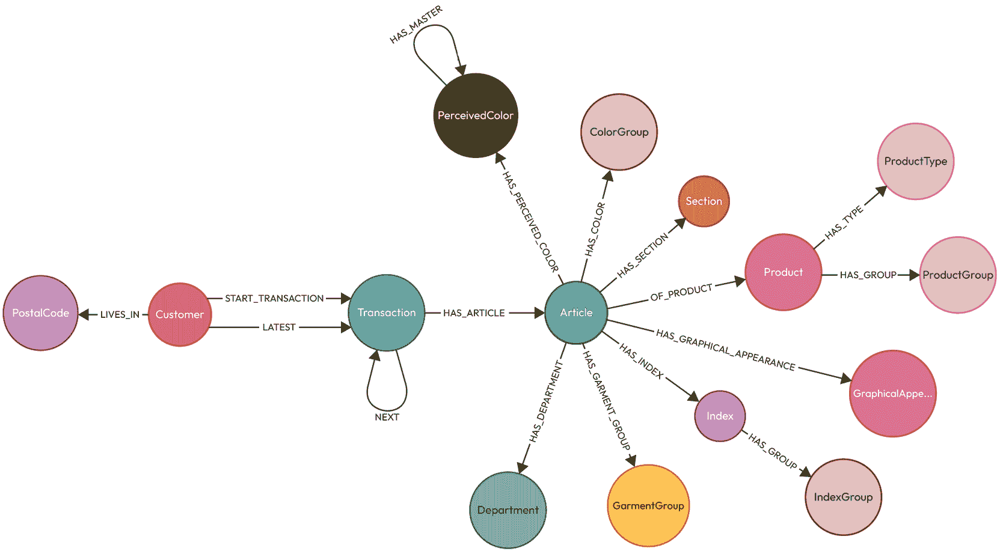

# 第八章：使用 H&M 个性化数据集构建推荐图

虽然 Neo4j 非常适合构建知识图谱，但审慎地考虑我们如何建模数据是很重要的。一个好的数据持久化模型可以使数据检索最优化并更好地处理大量负载。在本章中，我们将回顾一下构成**知识图谱**的内容，以及使用 Neo4j 数据持久化方法对数据建模的不同视角如何帮助构建更强大的知识图谱。您可能需要重新阅读*第三章*中定义的方法，这将使您能够使用个性化时尚推荐（H&M 个性化）数据构建知识图谱。

我们将在解决数据建模演变问题时涵盖这些主题：

+   使用 H&M 个性化数据集建模推荐图

+   优化推荐：图建模的最佳实践

# 技术要求

您需要熟悉 SQL 和 Cypher。我们将使用 SQLite 和 Neo4j 来理解数据建模的各个方面。在本章中，我们将使用以下工具：

+   Neo4j Desktop ([`neo4j.com/docs/desktop-manual/current/`](https://neo4j.com/docs/desktop-manual/current/)) 或 Neo4j Aura ([`neo4j.com/docs/aura/`](https://neo4j.com/docs/aura/))

+   用于创建推荐系统的 H&M 数据集：此数据集可在[`www.kaggle.com/c/h-and-m-personalized-fashion-recommendations/overview`](https://www.kaggle.com/c/h-and-m-personalized-fashion-recommendations/overview)（Carlos García Ling, ElizabethHMGroup, FridaRim, inversion, Jaime Ferrando, Maggie, neuraloverflow, 和 xlsrln. H&M 个性化时尚推荐。2022。Kaggle）找到。

记住从*第三章*中提到的，一个好的图数据模型可以使 RAG 流程中的*检索*部分更加有效。它使得检索相关数据更快、更简单。您可以重新阅读*第三章*以快速回顾图数据建模。在本章中，我们将时间作为一个维度来建模数据。以时间为维度的交易链使得数据检索非常高效和性能优良。

# 使用 H&M 个性化数据集建模推荐图

在本节中，我们将使用现实生活中的大规模 H&M 个性化数据集创建一个图数据模型。这个图数据模型将使我们能够增强我们在后续章节中创建的推荐引擎。

在 2022 年，H&M 发布了客户交易数据以及其他与客户、产品等相关联的元数据，作为构建推荐引擎竞赛的一部分。此数据集包含以前交易的数据以及客户和产品元数据。可用的元数据范围从简单的数据，如服装类型和客户年龄，到产品描述中的文本数据，再到服装图像中的图像数据。

我们将讨论数据集的特征，并逐步将数据加载到知识图谱中。

我们将查看此数据集中可用的数据：

+   `images/:` 这包含与给定`article_id.`关联的图片。数据集中并非所有文章都有与之关联的图片。我们不会使用这些数据来构建图。在图中存储图片不仅效率低下，而且对于我们要构建的图流程来说也不是必要的。

+   `articles.csv:` 该文件包含可供购买的商品的元数据。每一行代表一个独特的商品，包括产品系列、颜色、风格、商品所属的章节和部门。

+   `customers.csv:` 该文件包含数据集中每个客户的元数据，包括客户 ID、年龄、时尚新闻频率、活动标志、H&M 俱乐部会员状态和邮政编码。

+   `transactions_train.csv:` 该文件包含客户进行的交易。如果客户购买了同一件商品多次，数据可能以多行形式出现——每行代表一件购买的物品，包括交易日期、商品 ID、客户 ID、价格和销售渠道。

我们将在下一节查看这些数据的**图数据模型**，并加载数据以支持该模型。当我们为 H&M 个性化数据集构建推荐知识图谱时，我们将有一个客户进行的交易列表，将这些交易表示为按时间维度的交易链可能对我们非常有效。通过将我们对数据的理解添加到图数据模型中，可以使我们的推荐更有价值。例如，交易是一系列事件；因此，将它们建模为序列更有意义。与传统数据库不同，Neo4j 使得将这些交易作为通过关系顺序连接的图存储成为可能。

我们可以说，我们将对数据的了解持久化到图中，从而创建一个知识图谱。

## 构建您的推荐图

要构建推荐模型图，我们将查看数据集中每个文件中的数据以及它们如何贡献到图中。我们将应用之前讨论过的过程，在*第三章**,* 来构建图。在加载数据之前，我们需要使用 Neo4j Desktop 并执行以下步骤：

1.  创建本地数据库。您可以按照[`neo4j.com/docs/desktop-manual/current/operations/create-dbms/`](https://neo4j.com/docs/desktop-manual/current/operations/create-dbms/)中的说明执行此操作。

1.  将 H&M 推荐数据集的 CSV 文件复制到该数据库的`import`目录。如果您不确定如何操作，请访问[`community.neo4j.com/t/where-is-neo4j-home/6488/5`](https://community.neo4j.com/t/where-is-neo4j-home/6488/5)以获取参考。

现在，让我们将数据加载到图数据库中。

## 加载客户数据

客户数据包含以下元素：客户 ID、年龄、时尚新闻频率、活跃标志、H&M 俱乐部会员状态和邮政编码。

客户 ID 是客户的唯一 ID。为了确保我们有代表客户的唯一节点，我们需要有一个 `UNIQUE` 约束。此外，我们将邮政编码作为一个节点，因为我们可能想要轻松地按邮政编码隔离客户。

在加载这些数据之前，我们需要通过连接到我们创建的 Neo4j 数据库来创建这些唯一约束：

```py
CREATE CONSTRAINT customer_id_idx FOR (n:Customer) REQUIRE n.id IS UNIQUE ;
CREATE CONSTRAINT postal_code_idx FOR (n:PostalCode) REQUIRE n.code IS UNIQUE ; 
```

一旦创建了唯一约束，我们就可以使用这个 Cypher 将数据加载到数据库中：

**注意**

对于 `LOAD` `CSV` 查询，我们需要在它们前面加上 `auto` 前缀，以便能够在 Neo4j 浏览器中运行它们。

```py
LOAD CSV WITH HEADERS FROM "file:///customers.csv" as row
WITH row
CALL {
    WITH row
    MERGE (c:Customer {id:row.customer_id})
    SET c.age = row.age
    FOREACH( ignoreME in CASE WHEN row.fashion_news_frequency = 'Regularly'  THEN [1] ELSE [] END |
        SET c:FN_REGULAR
    )
    FOREACH( ignoreME in CASE WHEN row.club_member_status = 'ACTIVE'  THEN [1] ELSE [] END |
        SET c:CLUB_ACTIVE
    )
    FOREACH( ignoreME in CASE WHEN row.club_member_status = 'PRE-CREATE'  THEN [1] ELSE [] END |
        SET c:CLUB_PRE_CREATE
    )
    FOREACH( ignoreME in CASE WHEN row.Active <> 'ACTIVE'  THEN [1] ELSE [] END |
        SET c:INACTIVE
    )
    MERGE(p:PostalCode {code:row.postal_code})
    MERGE(c)-[:LIVES_IN]->(p)
} IN TRANSACTIONS OF 1000 ROWS 
```

这个脚本使用 1000 行作为一个批次提交，将客户数据加载到数据库中。在这个脚本中，我们可以注意到几个问题：

+   除了唯一的 ID `customer_id` 之外，`Customer` 节点上只有一个名为 `age` 的属性

+   我们将客户数据的其他属性映射到 `Customer` 节点的标签上

这种方法遵循我们之前讨论过的基于消费的数据建模方法。比如说，我们想要了解那些定期订阅时尚新闻的顾客的行为——这为我们提供了一个简单的方式来检索这些信息。Neo4j 通过基于标签的方法优化这种检索。我们可以将顾客行为（时尚新闻订阅）作为一个属性，并创建一个索引来检索这些数据，但这将需要更多的存储空间，以及索引查找的成本。如果我们想要使用那些活跃的俱乐部会员和定期消费时尚新闻的顾客——这种基于标签的方法与将它们作为属性存储相比，能更有效地检索这些信息。此外，当我们以图形的形式展示这些信息时，用户可以很容易地看到标签中的信息，而不是寻找属性。以这种方式消费数据感觉更自然，查询也更自然。

接下来，我们将加载文章数据。

## 加载文章数据

文章数据包含除了唯一的文章 ID 和描述之外的其他描述文章的类别。我们将创建其他描述文章本身的属性。

为了这个目的，我们需要创建这些唯一约束：

```py
CREATE CONSTRAINT product_code_idx FOR (n:Product) REQUIRE n.code IS UNIQUE ;
CREATE CONSTRAINT article_id_idx FOR (n:Article) REQUIRE n.id IS UNIQUE ;
CREATE CONSTRAINT product_type_id_idx FOR (n:ProductType) REQUIRE n.id IS UNIQUE ;
CREATE CONSTRAINT colour_group_idx FOR (n:ColorGroup) REQUIRE n.id IS UNIQUE ;
CREATE CONSTRAINT product_group_name_idx FOR (n:ProductGroup) REQUIRE n.name IS UNIQUE ;
CREATE CONSTRAINT graphical_appearance_id_idx FOR (n:GraphicalAppearance) REQUIRE n.id IS UNIQUE ;
CREATE CONSTRAINT perceived_colour_id_idx FOR (n:PerceivedColor) REQUIRE n.id IS UNIQUE ;
CREATE CONSTRAINT department_id_idx FOR (n:Department) REQUIRE n.id IS UNIQUE ;
CREATE CONSTRAINT section_id_idx FOR (n:Section) REQUIRE n.id IS UNIQUE ;
CREATE CONSTRAINT garment_group_id_idx FOR (n:GarmentGroup) REQUIRE n.id IS UNIQUE ;
CREATE CONSTRAINT article_index_id_idx FOR (n:Index) REQUIRE n.id IS UNIQUE ;
CREATE CONSTRAINT article_index_group_id_idx FOR (n:IndexGroup) REQUIRE n.id IS UNIQUE ; 
```

我们可以看到，我们已经将文章的大多数属性转换成了节点。这种类型的数据规范化在图中表示。这个 Cypher 将数据加载到图中：

```py
LOAD CSV WITH HEADERS FROM "file:///articles.csv" as row
WITH row
CALL {
    WITH row 
```

对于每一行，创建一个文章、产品以及产品组，并将它们关联起来：

```py
MERGE(a:Article {id:row.article_id})
    SET a.desc = row.detail_desc
    MERGE(p:Product {code:row.product_code})
    SET p.name = row.prod_name
    MERGE(a)-[:OF_PRODUCT]->(p)
    MERGE(pt:ProductType {id:row.product_type_no})
    SET pt.name = row.product_type_name
    MERGE(p)-[:HAS_TYPE]->(pt)
    WITH row, a, p
    MERGE(pg:ProductGroup {name:row.product_group_name})
    MERGE(p)-[:HAS_GROUP]->(pg) 
```

现在添加与文章相关的图形外观和颜色：

```py
WITH row, a
    MERGE(g:GraphicalAppearance {id:row.graphical_appearance_no})
    SET g.name = row.graphical_appearance_name
    MERGE (a)-[:HAS_GRAPHICAL_APPEARANCE]->(g)
    WITH row, a
    MERGE (c:ColorGroup {id: row.colour_group_code})
    SET c.name = row.colour_group_name
    MERGE (a)-[:HAS_COLOR]->(c)
    WITH row, a
    MERGE (pc:PerceivedColor {id: row.perceived_colour_value_id})
    SET pc.name = row.perceived_colour_value_name
    MERGE (a)-[:HAS_PERCEIVED_COLOR]->(pc)
    MERGE (pcm:PerceivedColor {id: row.perceived_colour_master_id})
    SET pcm.name = row.perceived_colour_master_name
    MERGE (pc)-[:HAS_MASTER]->(pcm) 
```

现在，让我们连接与之相关的部门：

```py
WITH row, a
    MERGE (d:Department {id:row.department_no})
    SET d.name = row.department_name
    MERGE (a)-[:HAS_DEPARTMENT]->(d)
    WITH row, a
    MERGE (i:Index {id: row.index_code})
    SET i.name = row.index_name
    MERGE (a)-[:HAS_INDEX]->(i)
    MERGE (ig:IndexGroup {id: row.index_group_no})
    SET ig.name = row.index_group_name
    MERGE (i)-[:HAS_GROUP]->(ig) 
```

最后，让我们将文章所属的章节和服装组连接起来：

```py
WITH row, a
    MERGE (s:Section {id: row.section_no})
    SET s.name = row.section_name
    MERGE (a)-[:HAS_SECTION]->(s)
    WITH row, a
    MERGE (gg:GarmentGroup {id: row.garment_group_no})
    SET gg.name = row.garment_group_name
    MERGE (a)-[:HAS_GARMENT_GROUP]->(gg)
} IN TRANSACTIONS OF 1000 ROWS 
```

从 Cypher 查询中，我们可以看到，在图中，我们正在持久化规范化数据，而没有对描述文章的各个方面重复值。

接下来我们将加载数据。

## 加载交易数据

`transaction_train.csv` 数据按照交易发生的顺序排列。这使得我们可以轻松地加载数据并保留图中数据的顺序。对于每一笔交易，我们都有以下数据：交易日期、商品 ID、客户 ID、价格和销售渠道。

**注意**

我们没有为每一笔交易分配一个唯一的 ID。

我们可以使用以下 Cypher 加载数据：

```py
LOAD CSV WITH HEADERS FROM "file:///transactions_train.csv" as row WITH row
CALL {
    WITH row
    MATCH (c:Customer {id:row.customer_id})
    MATCH (a:Article {id:row.article_id})
    WITH a, c, row
    CREATE (t:Transaction {date: row.t_dat, price: row.price, salesChannel: row.sales_channel_id})
    CREATE (t)-[:HAS_ARTICLE]->(a)
    WITH c, t
    CALL {
        WITH c, t
        WITH c, t
        WHERE exists((c)-[:START_TRANSACTION]->()) OR exists((c)-[:LATEST]->())
        MATCH (c)-[r:LATEST]->(lt)
        DELETE r
        CREATE (lt)-[:NEXT]->(t)
        CREATE (c)-[:LATEST]->(t)
        UNION
        WITH c, t
        WITH c,t
        WHERE NOT ( exists((c)-[:START_TRANSACTION]->()) OR exists((c)-[:LATEST]->()) )
        CREATE (c)-[:START_TRANSACTION]->(t)
        CREATE (c)-[:LATEST]->(t)
    }
} IN TRANSACTIONS OF 1000 ROWS 
```

从这个 Cypher 查询中，我们可以看到我们取给定客户的第一个交易，并使用一个 *START_TRANSACTION* 关系将其连接到客户。我们使用一个 *LATEST* 关系来跟踪客户所做的最后交易。随着我们为客户获取更多交易，我们将 *LATEST* 关系移动到最新的交易。我们使用 *NEXT* 关系将之前通过 *LATEST* 关系连接的交易和新的交易连接起来。因此，在这个图中，我们代表客户所做的交易就像 `transaction_train.csv` 数据集文件名所暗示的那样，是一个交易列车。

## 最终图

加载所有数据后，我们的图模型将如图 *图 8.1* 所示。



图 8.1 — 加载 H&M 数据后的图数据模型

从这个图中我们可以看到，商品属性已经分散到各个单独的节点中。**客户** 节点连接到邮政编码和第一笔和最后交易。**交易** 与 **商品** 关联。**交易** 节点还连接到给定客户可用的任何后续交易。

现在我们已经加载数据，让我们探索如何从这些数据中进一步增强图，将我们对数据的理解和想法添加到图中。

# 优化推荐：图建模的最佳实践

我们现在有一个图，数据以我们想要消费的方式加载，并代表数据的上下文。尽管如此，图仍然只代表提供的原始上下文。如果我们想按季节和年份消费数据，我们仍然需要构建查询来检索它。由于 Neo4j 是可选模式的，我们可能可以进行一些后处理并添加额外的关联，以便以这种方式消费数据。

在这个 Cypher 脚本中，我们正在创建季节性关系：

1.  对于每个客户，遍历交易并根据月份和年份分配一个季节值：

    ```py
    MATCH (c:Customer)
    WITH c
    CALL {
        WITH c
        MATCH (c)-[:START_TRANSACTION]->(s)
        MATCH (c)-[:LATEST]->(e)
        WITH c,s,e
        MATCH p=(s)-[:NEXT*]->(e)
        WITH c, nodes(p) as nodes
        UNWIND nodes as node 
    ```

1.  例如，如果月份是 `1` 且年份是 `2020`，我们将 `WINTER_2019` 作为该交易的季节名称作为上下文：

    ```py
    WITH c, node, node.date as d
        WITH c, node, toInteger(substring(d, 0,4)) as year, substring(d, 5,2) as month
        WITH c, node,
            CASE WHEN month="12" THEN year
                 WHEN month="01" OR month="02" THEN year-1
                ELSE
                    year
            END as year, 
    ```

1.  收集每个季节值对应的交易：

    ```py
    CASE WHEN month="12" OR month="01" OR month="02" THEN "WINTER"
                 WHEN month="03" OR month="04" OR month="05" THEN "SPRING"
                 WHEN month="06" OR month="07" OR month="08" THEN "SUMMER"
                 WHEN month="09" OR month="10" OR month="11" THEN "FALL"
            END as season
        WITH c, node, season+'_'+year as relName 
    ```

1.  获取每个季节值集合的第一个记录：

    ```py
    WITH c, relName, head(collect(node)) as start
        WHERE relName is not null 
    ```

1.  使用季节值作为关系名称，在客户和该交易之间创建一个关系。我们使用 `apoc` 方法创建关系，因为关系名称是动态的：

    ```py
    CALL apoc.create.relationship(c, relName, {}, start) YIELD rel
        WITH 1 as out
        return DISTINCT out
    } IN TRANSACTIONS OF 1000 ROWS
    WITH 1 as r
    RETURN DISTINCT r 
    ```

请注意，这是一个非常基础的途径。这表明我们可以根据我们对数据的理解在图中创建额外的上下文。这些方法使 Neo4j 非常适合构建知识图谱。当我们以这种方式轻松访问数据时，它可以开启更多关于如何以不同方式观察相同数据的想法，以简单、可追踪和可理解的方式提取更多*智能*。

如果您不想手动加载数据，您可以从以下网址下载数据库快照：  [`packt-neo4j-powered-applications.s3.us-east-1.amazonaws.com/Building+Neo4j-Powered+Applications+with+LLMs+Database+Dump+files.zip`](https://packt-neo4j-powered-applications.s3.us-east-1.amazonaws.com/Building+Neo4j-Powered+Applications+with+LLMs+Database+Dump+files.zip)

我们现在已经为数据添加了更多上下文。接下来，让我们看看图数据模型。


图 8.2 — 增强季节关系后的 H&M 图数据模型

让我们利用我们对数据的理解来编写一个查询，以获取 2019 年夏季随机客户购买的文章：

```py
MATCH (c:Customer)-[:SUMMER_2019]->(start), (c)-[:FALL_2019]->()<-[:NEXT]-(end)
WITH c, start, end SKIP 100 LIMIT 1
MATCH p=(start)-[:NEXT*]->(end)
WITH nodes(p) as nodes, relationships(p) as rels
UNWIND nodes as node
MATCH p=(node)-[:HAS_ARTICLE]->(a)
RETURN a.desc as article 
```

使用这个查询，我们找到在 2019 年夏季和秋季都购买过物品的客户，从那个列表中选取一个客户，并检索文章描述。

查询的输出将如下所示：


图 8.3 — 查询 SUMMER_2019 客户购买的 Cypher 查询

通过查看查询，可以很容易地理解查询正在做什么。我们使用 `SUMMER_2019` 作为起点，以及一个在 `FALL_2019` 关系之前的交易作为终点，从起点遍历到终点，并检索那些交易的物品。

我们可以看到，我们完全依赖于图遍历而不是基于属性的过滤器，这使得执行此查询非常高效。Neo4j 就是构建来高效执行这类查询的。

# 摘要

在本章中，我们探讨了如何观察图数据模型，以及如何根据我们消费数据的方式构建模型，使其更易于高效地检索数据。我们研究了 H&M 推荐数据集，并使用这些原则加载了它，还利用属性和我们对这些数据的理解对其进行了增强。这为图添加了更多上下文，并使得查询数据变得简单——查询更易于阅读和以更简单的方式向他人解释。

在下一章中，我们将在此基础上构建数据，使用 LLM 进一步增强它，并看看 LLM 如何为我们提供更强大的知识图谱。
