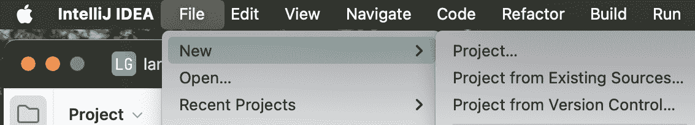
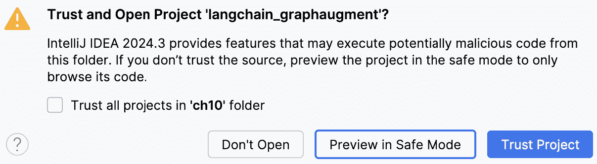
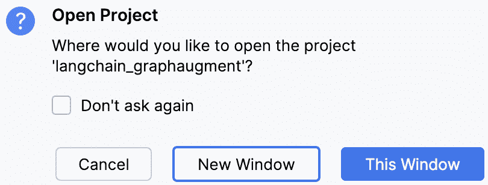
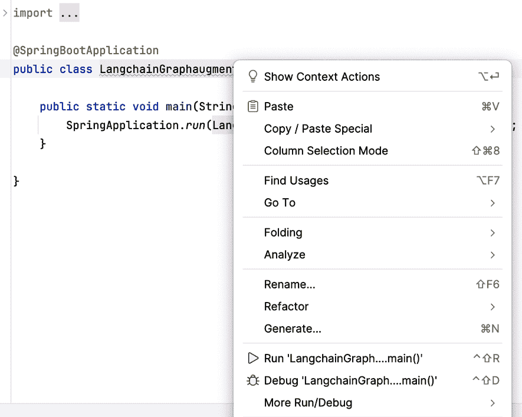

# 9

# 将 LangChain4j 和 Spring AI 与 Neo4j 集成

现在我们已经将数据加载到图中，在本章中，我们将探讨如何使用 LangChain4j 或 Spring AI 来增强图的功能并构建一个知识图谱。我们将研究如何将图与 LLMs 集成以生成客户购买的摘要，并创建该摘要的嵌入来表示客户购买历史。这些嵌入对于使机器学习和图算法能够理解和处理图数据至关重要。这些嵌入可以帮助我们构建知识图谱，通过理解购买行为为客户提供更个性化的推荐。我们还将探讨如何创建数据集中每个文章详细描述的嵌入。

在本章中，我们将涵盖以下主要主题：

+   设置 LangChain4j 和 Spring AI

+   使用 LangChain4j 构建你的推荐引擎

+   使用 Spring AI 构建你的推荐引擎

+   微调你的推荐系统

# 技术要求

我们将使用 Java IDE 环境来处理 LangChain4j 和 Spring AI 项目。你需要安装这些并了解如何使用它们。开始之前，你需要以下内容：

+   将使用 Maven 来构建项目和管理工作依赖。如果你打算使用 IntelliJ IDE（或 IntelliJ IDEA），那么 Maven 将与其一起安装，你无需单独安装。如果你是 Maven 的新手，你可以在[`maven.apache.org/`](https://maven.apache.org/)了解更多相关信息。

+   Java 17。

+   IntelliJ – 这些示例是用 IntelliJ IDE 构建和测试的。你可以使用你喜欢的 IDE，但我们将使用 IntelliJ IDEA 工具来构建和运行我们的项目。你可以从[`www.jetbrains.com/idea/`](https://www.jetbrains.com/idea/)下载该工具。你可以下载社区版本来运行本章的示例。你可以在[`www.jetbrains.com/idea/spring/`](https://www.jetbrains.com/idea/spring/)了解更多关于如何使用此 IDE 构建 Spring 应用程序的信息。

+   Spring Boot – 如果你是对 Spring Boot 新手，你可以访问[`spring.io/projects/spring-boot`](https://spring.io/projects/spring-boot)来了解更多。

+   安装了以下插件的 Neo4j Desktop。我们将从上一章构建的图数据库开始。你可以从[`neo4j.com/download/`](https://neo4j.com/download/)下载 Neo4j Desktop。如果你是 Neo4j Desktop 的新手，你可以在[`neo4j.com/docs/desktop-manual/current/`](https://neo4j.com/docs/desktop-manual/current/)了解更多。代码与数据库的 5.21.2 版本进行了测试。以下是需要安装的插件：

    +   APOC 插件 – 5.21.2

    +   图形数据科学库 – 2.9.0

下图展示了如何为数据库管理系统安装这些插件。


图 9.1 — 在 Neo4j Desktop 上安装插件

当你在 Neo4j Desktop 中选择 DBMS 时，在右侧会显示其详细信息。点击**插件**选项卡并选择所需的插件。在详细信息面板中，点击**安装并重启**按钮。

**注意**

您可以在[`github.com/PacktPublishing/Building-Neo4j-Powered-Applications-with-LLMs/tree/main/ch9`](https://github.com/PacktPublishing/Building-Neo4j-Powered-Applications-with-LLMs/tree/main/ch9)找到您需要的所有代码。这些是完整的项目，可以在 IDE 中运行。在本章中，我们只展示代码片段以展示其用法。因此，下载代码以遵循本章中的步骤可能是个好主意。

我们将从设置 LangChain4j 和 Spring AI 项目开始。

# 设置 LangChain4j 和 Spring AI

我们将查看如何使用**spring initializr**网站([`start.spring.io/`](https://start.spring.io/))设置 Spring AI 和 LangChain4j 项目。

我们将独立查看这些技术。LangChain4j 和 Spring AI 都是执行相同任务的选项。我们只需要其中一个框架来构建 GenAI 项目。LangChain4j 比 Spring AI 更早一些时间可用。在 API 和集成方面，它们的工作方式相当相似。我们将使用这两个框架构建相同的应用程序，并查看它们有多么相似。我们还将确定它们之间的差异。

我们需要遵循以下步骤来创建启动项目：

1.  设置 LangChain4j 项目：

    1.  访问网站，[`start.spring.io/`](https://start.spring.io/)。

    1.  在**项目**部分下选择**Maven**。

    1.  在**语言**部分下选择**Java**。

    1.  在**项目元数据**部分，填写以下值：

        +   **组**: `com.packt.genai.hnm.springai`

        +   **工件**: `springai_graphaugment`

        +   **名称**: `springai_graphaugment`

        +   **描述**: `使用 Spring AI 进行图增强`

        +   **包名**: `com.packt.genai.hnm.springai.graphaugment`

        +   **打包**: `Jar`

        +   **Java**: `17`

    1.  在**依赖项**部分，点击**添加依赖项**按钮并选择**Spring Web**依赖项。

        +   当前初始化器没有列出其他依赖项需要添加到项目中。我们将手动将 LangChain4j 依赖项添加到项目中。

    1.  下载并保存生成的 ZIP 文件。

1.  设置 Spring AI 项目：

    1.  访问网站，[`start.spring.io/`](https://start.spring.io/)。

    1.  在**项目**部分下选择**Maven**。

    1.  在**语言**部分下选择**Java**。

    1.  在**项目元数据**部分，填写以下值：

        +   **组**: `com.packt.genai.hnm.langchain`

        +   **工件**: `langchain_graphaugment`

        +   **名称**: `langchain_graphaugment`

        +   **描述**: `使用 Langchain4J 进行图增强`

        +   **包名**: `com.packt.genai.hnm.langchain.graphaugment`

        +   **打包**: `Jar`

        +   **Java**: `17`

    1.  在**依赖项**部分，点击**添加依赖项**按钮以选择以下依赖项：

        +   **Spring Web**

        +   **OpenAI**

        +   **Neo4j 向量数据库**

    1.  下载并保存生成的 ZIP 文件。

这只会给我们一个基本的项目框架，我们将在此基础上添加更多逻辑来构建应用程序。

在我们继续构建应用程序之前，让我们看看我们希望从应用程序中得到什么。在前一章中，我们将 H&M 的交易数据加载到了图数据库中。目前，它包含了客户、商品和交易，以及一些辅助关系，这些关系标记了给定季节和年份中的第一次交易。由于我们想要构建一个个性化推荐系统，我们希望增强图数据库以理解客户行为并提供推荐。为此，我们将采取以下方法：

1.  选择一个季节来了解购买行为。例如，假设我们想要找到在 2019 年夏天和秋天进行购买的客户，并使用这些季节之间的交易来理解客户行为。请注意，可能有一些客户在 2019 年的秋天没有进行任何交易，尽管他们可能在夏天进行了交易。为了使事情更简单，我们将忽略这些客户。

1.  获取这些交易中购买的商品。这些商品应满足条件（在 2019 年的夏天和秋天购买），并按照购买顺序排列。然后我们将使用 LLM 来总结这些购买。这种总结保留了购买商品的顺序。

1.  使用 LLM 为这篇总结文本生成嵌入。我们将利用 OpenAI 的 LLM 来完成这一部分。

1.  存储这些嵌入。我们将将这些嵌入存储在生成这些嵌入的季节关系上。例如，如果我们正在为 2019 年的夏天生成总结，我们将把生成的嵌入存储在`SUMMER_2019`关系上。我们将使用 OpenAI 的 LLM 来生成嵌入。

在下一节中，我们将探讨如何使用 LangChain4j 构建一个执行我们之前描述的功能的应用程序。

# 使用 LangChain4j 构建你的推荐引擎

在本节中，我们将探讨构建一个利用 LangChain4j 的图增强应用程序。在这个项目中，我们将使用 GraphRAG 方法为满足我们要求的交易链生成嵌入。我们将使用 Neo4j 图检索器检索满足我们要求的交易链，以及一个 LLM 生成这些交易的摘要以描述客户购买行为并生成嵌入。生成的嵌入将是一个向量表示，以机器学习或图数据科学算法可以利用的方式描述文本摘要。它也可以用于向量搜索。这篇文章很好地解释了 LLM 上下文中的嵌入：[`ml-digest.com/architecture-training-of-the-embedding-layer-of-llms/`](https://ml-digest.com/architecture-training-of-the-embedding-layer-of-llms/)。我们将从上一节下载的 ZIP 文件开始。我们需要解压我们下载的文件。一旦解压，我们将使用以下步骤将这些项目加载到 IntelliJ 平台：

1.  启动 IntelliJ IDE。

1.  点击 **文件** | **新建** | **从现有源创建项目…**。



图 9.2 — 创建新项目

3. 从我们解压的目录中选择 `pom.xml` 文件。


图 9.3 — 选择 pom.xml

4. 点击 **信任项目** 以加载项目。



图 9.4 — 信任项目

5. 当提示时，选择 **新窗口**。



图 9.5 — 选择新窗口

6. 一旦项目加载完成，您可以继续到下一节。

在下一节中，我们将更新项目依赖项。

## LangChain4j：更新项目依赖项

当我们使用 Spring 启动器准备启动项目时，我们只能添加由该工具识别的依赖项。我们需要编辑 `pom.xml` 文件来添加依赖项。

以下是我们需要添加到项目中的依赖项：

+   LangChain4j Spring Boot 启动器 – 这个依赖提供了 LangChain4j 的 Spring Boot 集成：

    ```py
    <!-- Langchain Springboot integration -->
    <dependency>
        <groupId>dev.langchain4j</groupId>
        <artifactId>langchain4j-spring-boot-starter</artifactId>
        <version>0.36.0</version>
    </dependency> 
    ```

+   LangChain4j OpenAI 集成 – 这个依赖提供了 OpenAI 集成：

    ```py
    <!-- Open AI integration -->
    <dependency>
        <groupId>dev.langchain4j</groupId>
        <artifactId>langchain4j-open-ai-spring-boot-starter</artifactId>
        <version>0.36.0</version>
    </dependency> 
    ```

+   LangChain4j Neo4j 集成 – 这个依赖提供了 Neo4j 集成：

    ```py
    <!-- Neo4j Vector Store integration -->
    <dependency>
        <groupId>dev.langchain4j</groupId>
        <artifactId>langchain4j-neo4j</artifactId>
        <version>0.35.0</version>
    </dependency> 
    ```

+   LangChain4j LLM 嵌入集成 – 这个依赖提供了 LLM 嵌入 API：

    ```py
    <dependency>
        <groupId>dev.langchain4j</groupId>
        <artifactId>langchain4j-embeddings-all-minilm-l6-v2</artifactId>
        <version>0.35.0</version>
    </dependency> 
    ```

最新集成选项和详细信息可以在 [`docs.langchain4j.dev/category/integrations`](https://docs.langchain4j.dev/category/integrations) 找到。

现在我们已经添加了项目依赖项，我们需要更新应用程序所需的配置属性。在下一节中，我们将探讨更新应用程序属性。

**注意**

当您对 `pom.xml` 文件进行了更改，可能需要重新加载

为 IDE 更新所有依赖项的项目。您可以在[`www.jetbrains.com/help/idea/delegate-build-and-run-actions-to-maven.html#maven_reimport`](https://www.jetbrains.com/help/idea/delegate-build-and-run-actions-to-maven.html#maven_reimport)了解更多关于如何在 IntelliJ IDEA 中与 Maven 项目一起工作的信息。

## LangChain4j：更新应用程序属性

在本节中，我们需要更新应用程序属性，以便利用我们上一节中添加的依赖项的 API。我们需要将此配置添加到项目的`application.properties`文件中。由于我们将使用 OpenAI LLM 作为聊天模型和嵌入，因此我们需要为此目的获取一个 API 密钥。我们需要访问以下网站以获取此目的的 API 密钥：[`platform.openai.com/docs/overview`](https://platform.openai.com/docs/overview)。

这些是我们需要添加的配置属性：

+   OpenAI 聊天模型集成 – 我们需要将此配置添加到`application.properties`：

    ```py
    # Open AI LLM Integration for Generating Summary using Chat Model.
    langchain4j.open-ai.chat-model.api-key=<`OPEN_AI_KEY`>
    langchain4j.open-ai.chat-model.model-name=gpt-4o-mini
    langchain4j.open-ai.chat-model.log-requests=true
    langchain4j.open-ai.chat-model.log-responses=true 
    ```

+   OpenAI 嵌入集成 – 我们需要将此配置添加到`application.properties`：

    ```py
    # Open AI LLM Integration for Generating Embeddings
    langchain4j.open-ai.embedding-model.api-key=<`OPEN_AI_KEY`>
    langchain4j.open-ai.embedding-model.model-name=text-embedding-3-large 
    ```

+   Neo4j 集成 – 这次我们将添加基本的 Neo4j 集成，而不是与 Neo4j 向量数据库相关的集成：

    ```py
    # Neo4j Integration
    neo4j.uri=bolt://localhost:7687
    neo4j.user=neo4j
    neo4j.password=test1234
    neo4j.database=hmreco
    config.batchSize=5 
    ```

现在我们已经查看完配置属性，让我们开始构建应用程序。我们将从 Neo4j 数据库集成开始，然后添加聊天模型集成来总结交易并生成摘要的嵌入。最后，我们将查看如何构建一个 REST 端点以按需调用这些请求。

## LangChain4j：Neo4j 集成

我们首先将查看 Neo4j 集成。我们将首先查看这一点，因为我们需要一种与数据库集成的手段来执行这些任务：

1.  设置连接以能够执行读取和写入事务。

1.  读取指定季节发生的交易的文章。

1.  一旦生成嵌入，就将其持久化（保存）。

在我们构建这个逻辑之前，我们需要为 Neo4j 连接创建一个**配置 Bean**。我们可以这样定义这个 Bean 来从`application.properties`中读取：

```py
@ConfigurationProperties(prefix = "neo4j")
public class Neo4jConfiguration { 
    private String uri; 
    private String user ; 
    private String password ; 
    private String database ; 
   */** Getter/Setters **/*
} 
```

类定义上方的`ConfigurationProperties`注解将读取`application.properties`并初始化 Bean 中的属性。`prefix`选项告诉我们只读取以该前缀开始的属性。例如，如果我们想填充`uri`字段，那么我们需要将`neo4j.uri`属性添加到配置中。我们没有在这里包含从该 Bean 读取属性所需的所有 getter 和 setter 代码。

现在，我们将定义一个服务，以提供与 Neo4j 数据库的集成，读取文章和客户交易数据，并根据需要更新嵌入：

1.  使用`@Service`注解定义服务类。我们还需要在这里注入`Neo4JConfiguration`：

    ```py
    @Service
    @Configuration
    @EnableConfigurationProperties(Neo4jConfiguration.class)
    public class Neo4jService {
        @Autowired
        private Neo4jConfiguration configuration ;
        private Driver driver ; 
    ```

1.  将`setup`方法添加到初始化与 Neo4j 数据库的连接：

    ```py
    public synchronized void setup() {
            if( driver == null ) {
                driver = GraphDatabase.driver(
                        configuration.getUri(),
                        AuthTokens.basic(
                                configuration.getUser(),
                                configuration.getPassword()));
                driver.verifyConnectivity();
            }
        } 
    ```

1.  添加一个方法来获取给定季节开始和结束值客户交易数据。根据提供的季节开始和结束值，它检索开始季节值的`elementId`值和购买顺序中的文章描述。我们需要这个`elementId`值来稍后保存嵌入。我们可以看到，我们正在尝试从文章属性中获取更多相关数据，而不仅仅是描述。这样，我们可以包括更多属性，如颜色，作为摘要的一部分，以便我们可以更准确地表示它们作为嵌入：

    ```py
    public List<EncodeRequest> getDataFromDB(String startSeason, String endSeason) {
        setup();
        String cypherTemplate = """
            --- Cypher query to get the transactions
        """;
        String cypher = String.format(cypherTemplate, startSeason, endSeason);
        SessionConfig config = SessionConfig.builder()
            .withDatabase(configuration.getDatabase())
            .build();
        try (Session session = driver.session(config)) {
            List<EncodeRequest> data = session.executeRead(tx -> {
                List<EncodeRequest> out = new ArrayList<>();
                var records = tx.run(cypher);
                while (records.hasNext()) {
                    var record = records.next();
                    String id = record.get("elementId").asString();
                    String articles = record.get("articles").asString();
                    out.add(new EncodeRequest(articles, id));
                }
                return out;
            });
            return data;
        } catch (Exception e) {
            e.printStackTrace();
        }
        return null;
    } 
    ```

1.  将获取数据库中文章的方法添加：

    ```py
    public List<EncodeRequest> getArticlesFromDB() {
        setup();
        String cypherTemplate = """
            -- Cypher query to get the articles.
        """;
        SessionConfig config = SessionConfig.builder()
            .withDatabase(configuration.getDatabase())
            .build();
        try (Session session = driver.session(config)) {
            List<EncodeRequest> data = session.executeRead(tx -> {
                List<EncodeRequest> out = new ArrayList<>();
                var records = tx.run(cypherTemplate);
                while (records.hasNext()) {
                    var record = records.next();
                    String id = record.get("elementId").asString();
                    String article = record.get("article").asString();
                    out.add(new EncodeRequest(article, id));
                }
                return out;
            });
            return data;
        } catch (Exception e) {
            e.printStackTrace();
        }
        return null;
    } 
    ```

1.  添加一个方法来保存客户选定季节的嵌入。我们将摘要保留在图中，以了解嵌入表示什么。一旦我们理解了这个方面，我们就不需要将摘要存储在数据库中：

    ```py
    public void saveEmbeddings(List<Map<String, Object>> embeddings) {
        setup();
        String cypher = """
            UNWIND $data as row
            WITH row
            MATCH ()-[r]->()
            WHERE elementId(r) = row.id
            SET r.summary = row.summary
            WITH row, r
            CALL db.create.setRelationshipVectorProperty(r, 'embedding', row.embedding)
        """;
        SessionConfig config = SessionConfig.builder()
            .withDatabase(configuration.getDatabase())
            .build();
        try (Session session = driver.session(config)) {
            session.executeWriteWithoutResult(tx -> {
                tx.run(cypher, Map.of("data", embeddings));
            });
        } catch (Exception e) {
            e.printStackTrace();
        }
    } 
    ```

1.  添加一个方法来保存`Article`节点上`Article`文本的嵌入：

    ```py
    public void saveArticleEmbeddings(List<Map<String, Object>> embeddings) {
        setup();
        String cypher = """
            UNWIND $data as row
            WITH row
            MATCH (a:Article)
            WHERE elementId(a) = row.id
            CALL db.create.setNodeVectorProperty(a, 'embedding', row.embedding)
        """;
        SessionConfig config = SessionConfig.builder()
            .withDatabase(configuration.getDatabase())
            .build();
        try (Session session = driver.session(config)) {
            session.executeWriteWithoutResult(tx -> {
                tx.run(cypher, Map.of("data", embeddings));
            });
        } catch (Exception e) {
            e.printStackTrace();
        }
    } 
    ```

从代码中我们可以看到，这个服务依赖于`Neo4jConfiguration`并提供了这些方法。

这里的代码流程简单，提供了与 Neo4j 数据库交互的实用方法。获取和保存数据的方法在这里嵌入 Cypher 查询。

接下来，我们将查看一个 OpenAI 聊天模型集成，它可以生成文章列表的摘要。

## LangChain4j：OpenAI 聊天集成

要集成聊天，我们需要定义`AiService`。这是 Langchain4J 暴露的 API，用于构建 Java 应用程序。

让我们看看我们如何做到这一点：

1.  当我们定义`AiService`时，LangChain4j Spring 框架在幕后提供了实现，使得调用聊天服务变得非常简单。让我们看看如何定义它：

    ```py
    @AiService
    public interface ChatAssistant {
        @SystemMessage(""" 
    ```

1.  我们为 LLM 聊天引擎设置了一个角色。这为引擎设置了处理数据的上下文，即使用什么指南来处理数据：

    ```py
    ---Role---

                 You are an helpful assistant with expertise in fashion for a clothing company. 
    ```

1.  我们在这里为 LLM 引擎设置了一个目标，说明它应该如何处理数据。这描述了输入数据是什么以及它的结构：

    ```py
    ---Goal---

                Your goal is to generate a summary of the products purchased by the customers and descriptions of each of the products.\s
                Your summary should contain two sections -\s
                Section 1 - Overall summary outlining the fashion preferences of the customer based on the purchases. Limit the summary to 3 sentences
                Section 2 - highlight 3-5 individual purchases.

                You should use the data provided in the section below as the primary context for generating the response.\s
                If you don't know the answer or if the input data tables do not contain sufficient information to provide an answer, just say so.\s
                Do not make anything up.

                Data Description:
                - Each Customer has an ID. Customer ID is a numeric value.
                - Each Customer has purchased more than one clothing articles (products). Products have descriptions.
                - The order of the purchases is very important. You should take into account the order when generating the summary. 
    ```

1.  LLM 的响应指令规定了响应应该如何结构化：

    ```py
    Response:
                ---
                # Overall Fashion Summary:

                \\n\\n

                # Individual Purchase Details:

                -- 
    ```

1.  `Data`部分定义了`{text}`变量，该变量用方法接收到的输入进行替换：

    ```py
    Data:
                {text}
        """)
        String chat(String text);
    } 
    ```

在这里，我们定义了一个带有`@AiService`注解的接口。在这个服务中，我们需要定义一个聊天方法。在这里，我们将使用一个简单的带有`System Message`选项的 AI 聊天服务。要了解`AIServices`提供的常见操作和高级操作，请阅读[`docs.langchain4j.dev/tutorials/ai-services/`](https://docs.langchain4j.dev/tutorials/ai-services/)中的文档。在这里，我们要求 LLM 扮演时尚专家的角色，并给出客户时尚偏好的摘要，并突出显示顶级购买，同时考虑到购买顺序。文本中的`input`参数被用作聊天助手的输入数据。

现在我们将看看如何调用这个聊天请求：

```py
@Service
public class OpenAIChatService
    private ChatAssistant assistant ;
    public OpenAIChatService(ChatAssistant assistant) {
        this.assistant = assistant;
    }
    public String getSummaryText(String input) {
        String out = assistant.chat(input) ;
        return out ;
    }
} 
```

```py
getSummaryText method invokes the chat request. It is as simple as that to integrate the chat services into the application.
```

我们将接下来看看嵌入模型集成。

## LangChain4j：OpenAI 嵌入模型集成

嵌入模型集成相当简单，因为我们已经为聊天服务启用了 `AiService`。嵌入模型的使用方式如下所示：

```py
@Service
public class OpenAIEmbeddingModelService {
    EmbeddingModel embeddingModel ;
    public OpenAIEmbeddingModelService(EmbeddingModel embeddingModel) {
        this.embeddingModel = embeddingModel;
    }
    Embedding generateEmbedding(String text) {
        Response<Embedding> response = embeddingModel.embed(text) ;
        return  response.content() ;
    }
} 
```

从代码中我们可以看到，这就像是将 `EmbeddingModel` 添加到类中并使用构造函数初始化它一样简单。当 Spring Boot 应用程序启动时，根据属性实例化并分配给这个变量的适当嵌入模型实现。此服务提供了一个为给定文本生成嵌入的方法。

现在我们已经查看所有定义的服务，让我们看看我们如何使用所有这些来构建增强客户交易图的程序。

## LangChain4j：最终应用

对于最终应用，我们将构建一个 REST 端点以发出执行增强的请求。由于该过程本身可能需要时间，它被分为两部分：

1.  发出请求以启动增强过程。这将返回一个请求 ID。

1.  我们可以使用步骤 1 中返回的请求 ID 来检查请求的进度。

让我们先看看 REST 控制器以发出请求：

1.  我们需要创建一个 REST 控制器来处理 HTTP 请求：

    ```py
    @Configuration
    @EnableConfigurationProperties(RunConfiguration.class)
    @RestController
    public class LangchainGraphAugmentController { 
    ```

1.  使用 `Autowired` 指令注入定义的各个服务：

    ```py
    @Autowired
        private OpenAIEmbeddingModelService embeddingModelService ;
        @Autowired
        private Neo4jService neo4jService ;
        @Autowired
        private OpenAIChatService chatService ;
        @Autowired
        private RunConfiguration configuration ; 
    ```

1.  定义全局变量以保存当前处理请求：

    ```py
    private HashMap<String, IRequest> currentRequests = new HashMap<>() ; 
    ```

1.  添加启动客户交易增强过程的方法。此方法接受季节的开始和结束值，并创建一个 `ProcessRequest` 对象。它启动一个请求并返回此请求的 `UUID` 的进程线程。我们保留 `UUID` 和 `ProcessRequest` 映射，以便在请求时提供状态：

    ```py
    @GetMapping("/augment/{startSeason}/{endSeason}")
        public String processAugment(
                @PathVariable (value="startSeason") String startSeason,
                @PathVariable (value="endSeason") String endSeason
        ) {
            String uuid = UUID.randomUUID().toString() ;
            ProcessRequest request = new ProcessRequest(
                    chatService,
                    embeddingModelService,
                    neo4jService,
                    configuration,
                    startSeason,
                    endSeason
            ) ;
            currentRequests.put(uuid, request) ;
            Thread t = new Thread(request) ;
            t.start();
            return uuid ;
        } 
    ```

1.  添加启动文章文本增强过程的方法：

    ```py
    @GetMapping("/augmentArticles")
        public String processAugmentArticles() {
            String uuid = UUID.randomUUID().toString() ;
            ProcessArticles request = new ProcessArticles(
                    embeddingModelService,
                    neo4jService,
                    configuration
            ) ;
            currentRequests.put(uuid, request) ;
            Thread t = new Thread(request) ;
            t.start();
            return uuid ;
        } 
    ```

1.  添加一个获取指定请求 ID 状态的方法：

    ```py
    @GetMapping("/augment/status/{requestId}")
        public String getStatus(
                @PathVariable (value="requestId") String requestId) {
            IRequest request = currentRequests.get(requestId) ;
            if( request != null ) {
                if( request.isComplete() ) {
                    currentRequests.remove(requestId) ;
                }
                return request.getCurStatus() ;
            } else {
                return "Request Not Found." ;
            }
        }
    } 
    ```

    **注意**

    图增强过程可能需要很长时间。特别是，使用 LLM 聊天 API 生成的摘要部分可能很耗时，并且增强所有符合要求的客户，比如 2019 年夏天的购买，可能需要相当多的时间。因此，包含完整增强的数据库转储仅覆盖大约 10,000 名客户。

现在，让我们看看处理请求的实现。这是我们将所有各种 API 绑定在一起以执行所需过程的地方：

1.  我们需要定义一个实现 `Runnable` 接口的 `ProcessRequest` 类。由于这些请求是长时间运行的，我们将启动一个线程。当创建此请求时，聊天服务、嵌入模型服务、Neo4j 服务和其他参数作为输入传递。此类跟踪当前处理状态：

    ```py
    public class ProcessRequest implements Runnable, IRequest {
        private OpenAIChatService chatService ;
        private OpenAIEmbeddingModelService embeddingModelService ;
        private Neo4jService neo4jService ;
        private RunConfiguration configuration ;
        private String startSeson ;
        private String endSeason ;
        private String curStatus = "0 %" ;
        private boolean isComplete = false ;
        public ProcessRequest(
                OpenAIChatService chatService,
                OpenAIEmbeddingModelService embeddingModelService,
                Neo4jService neo4jService,
                RunConfiguration configuration,
                String startSeson,
                String endSeason) {
            this.chatService = chatService;
            this.embeddingModelService = embeddingModelService;
            this.neo4jService = neo4jService;
            this.configuration = configuration ;
            this.startSeson = startSeson ;
            this.endSeason = endSeason ;
        }
        public String getCurStatus() {
            return curStatus ;
        }
        public boolean isComplete() {
            return isComplete;
        } 
    ```

`run` 方法实现了实际过程：

```py
@Override
    public void run() {
        try { 
```

1.  从 Neo4j 数据库中检索客户交易数据。输出是一个列表，其中每个记录包含起始季度的关系 ID 作为上下文，以及按购买顺序排列的文章描述：

    ```py
    System.out.println("Retrieving Data from Graph");
                List<EncodeRequest> dbData = neo4jService.getDataFromDB(startSeson, endSeason);
                System.out.println("Retrieved Data from Graph");
                int i = 0;
                int processingSize = dbData.size();
                List<Map<String, Object>> embeddings = new ArrayList<>();
                for( EncodeRequest request: dbData ) { 
    ```

一旦收集到所需的结果批次大小，将数据保存到 Neo4j 数据库中：

```py
if (i > 0 && i % configuration.getBatchSize() == 0) {
                    System.out.println("Saving Embeddings to Graph : " + i);
                    neo4jService.saveEmbeddings(embeddings);
                    embeddings.clear();
                    curStatus = ( ( i * 100.0 ) / processingSize ) + " %";
                }
                i++;
                Map<String, Object> embedMap = new HashMap<>(); 
```

1.  通过传递从图中检索到的交易列表，从 LLM 聊天服务中检索客户购买摘要：

    ```py
    String id = request.getId();
                    System.out.println("Retrieving Summary");
                    String summary = chatService.getSummaryText(request.getText());
                    System.out.println("Retrieving embedding"); 
    ```

1.  对于从 LLM 聊天服务获得的摘要，利用嵌入服务创建嵌入：

    ```py
    Embedding embedding = embeddingModelService.generateEmbedding(summary); 
    ```

1.  将摘要和嵌入以及关系上下文 ID 保存到记录中，然后将其保存到批次中：

    ```py
    embedMap.put("id", id);
                    embedMap.put("embedding", embedding.vector());
                    embedMap.put("summary", summary);
                    embeddings.add(embedMap);
                } 
    ```

1.  如果批次中还有任何数据，将其保存到 Neo4j 数据库中：

    ```py
    if( embeddings.size() > 0 ) {
                    System.out.println("Saving Embeddings to Graph");
                    neo4jService.saveEmbeddings(embeddings);
                    embeddings.clear();
                }
                curStatus = "100 %";
            }catch (Exception e) {
                e.printStackTrace();
            }
            isComplete = true;
        }
    } 
    ```

使用这种方法，我们可以增强图以执行理解客户购买行为的下一步，以便为他们提供更好的推荐。

以下代码可以处理文章增强。代码与`ProcessRequest`类非常相似。我们在这里只看差异：

```py
public class ProcessArticles implements Runnable, IRequest { 
```

`run`方法从 Neo4j 读取数据，并在调用批嵌入请求之前将其分割成批次：

```py
@Override
    public void run() {

            List<EncodeRequest> dbData = neo4jService.getArticlesFromDB();

            for( EncodeRequest request: dbData ) {
                if (i > 0 && i % batchSize == 0) { 
```

一旦收集到文章文本的批次，我们将将其传递给嵌入服务以获取嵌入。我们将生成的嵌入保存到 Neo4j 数据库中：

```py
List<Embedding> embedList = embeddingModelService.generateEmbeddingBatch(inputData);
                                                            neo4jService.saveArticleEmbeddings(embeddings);
                                    }
                                i++;
            } 
```

为任何剩余的文章文本生成嵌入，并将其保存到 Neo4j 数据库中：

```py
if( inputData.size() > 0 ) {
                                List<Embedding> embedList = embeddingModelService.generateEmbeddingBatch(inputData);
                 neo4jService.saveArticleEmbeddings(embeddings);
                            }
            curStatus = "100 %";
        }catch (Exception e) {
            e.printStackTrace();
        }
    }
} 
```

操作流程与`ProcessRequest`类中的类似。虽然我们使用了单一请求模式进行季节购买嵌入，但对于文章嵌入，我们使用的是*批处理模式*。使用单一请求模式（使用 API），我们一次只能生成一个摘要。然而，使用批处理模式，生成嵌入要快得多。

如果你想要尝试该项目，可以从[`github.com/PacktPublishing/Building-Neo4j-Powered-Applications-with-LLMs/tree/main/ch9/langchain_graphaugment`](https://github.com/PacktPublishing/Building-Neo4j-Powered-Applications-with-LLMs/tree/main/ch9/langchain_graphaugment)下载最新项目，而不是从头开始构建。

要运行项目，你可以右键单击`LangchainGraphaugmentApplication.java`文件，并选择**Run**菜单选项。

**注意**

如果你对自定义运行选项和其他方面感兴趣，则可以使用 IDE 提供的**Run**/**Debug**配置。要了解更多关于这些方面的信息，请访问[`www.jetbrains.com/help/idea/run-debug-configuration-java-application.html`](https://www.jetbrains.com/help/idea/run-debug-configuration-java-application.html)。

在下一节中，我们将探讨如何使用 Spring AI 构建相同的推荐引擎。

# 使用 Spring AI 构建你的推荐引擎

在本节中，我们将探讨利用 Spring AI 构建图增强应用程序。这种方法与我们使用 LangChain4j 构建的项目方法类似。我们将利用 GraphRAG 方法为满足我们要求的交易链生成嵌入。我们将从上一节下载的 ZIP 文件开始。我们需要解压我们下载的文件。一旦解压，我们将使用以下步骤将项目加载到 IntelliJ 平台。这与我们在上一节中做的是一样的。请按照*使用 LangChain4j 构建推荐引擎*部分开头列出的步骤导入项目。

与 LangChain4j 相比，更新 Spring AI 项目依赖项没有显著的步骤。让我们看看原因。

## Spring AI：更新项目依赖项

与 LangChain4j 项目不同，我们不需要更新任何依赖项。我们能够从 Spring 启动器项目中添加所有必需的依赖项。接下来，我们将查看更新应用程序属性。

## Spring AI：更新应用程序属性

在本节中，我们需要更新应用程序属性以利用 API。我们需要将此配置添加到项目中的`application.properties`文件。由于我们将使用 OpenAI LLM 作为聊天模型和嵌入，我们需要为此目的获取一个 API 密钥，这可以通过访问[`platform.openai.com/docs/overview`](https://platform.openai.com/docs/overview)来完成。

这些是我们需要添加的配置属性：

+   OpenAI 聊天模型集成 – 我们需要将此配置添加到`application.properties`。我们只需要添加 OpenAI API 密钥：

    ```py
    # Open AI LLM Integration for Generating Summary using Chat Model.
    spring.ai.openai.api-key=`<OPEN_AI_KEY>` 
    ```

+   OpenAI 嵌入集成 – 我们需要将此配置添加到`application.properties`。我们不需要再次添加 OpenAI API 密钥，因为它使用与 LLM 聊天配置相同的配置：

    ```py
    # Open AI LLM Integration for Generating Embeddings
    spring.ai.openai.embedding.options.model=text-embedding-3-large 
    ```

+   Neo4j 集成 – 我们将添加基本的 Neo4j 集成，而不是与 Neo4j 向量数据库相关的集成：

    ```py
    # Neo4j Integration
    neo4j.uri=bolt://localhost:7687
    neo4j.user=neo4j
    neo4j.password=test1234
    neo4j.database=hmreco
    config.batchSize=5 
    ```

现在我们已经查看配置属性，让我们开始构建应用程序。我们将首先进行 Neo4j 数据库集成，然后添加聊天模型集成以总结交易并生成摘要的嵌入。最后，我们将查看构建 REST 端点以按需调用这些请求。

## Spring AI：Neo4j 集成

我们首先考虑 Neo4j 集成，因为我们需要一种与数据库集成的手段来执行以下任务：

1.  设置连接以能够执行读取和写入事务。

1.  查看指定期间发生的交易文章。

1.  一旦生成嵌入，就将其持久化。

这里的实现与上一节*Langchain4J – Neo4j 集成*部分中讨论的 LangChain4j 项目完全相同。我们将查看一个 OpenAI 聊天模型集成，可以为文章列表生成摘要。

## Spring AI：OpenAI 聊天集成

要集成聊天功能，与 LangChain4j 略有不同。我们需要定义`Service`并初始化`ChatClient`。我们需要利用这个客户端并使用聊天 API 来发送请求。它没有像 LangChain4j 那样抽象。让我们看看这个服务：

```py
@Service
public class OpenAIChatService {
    private final ChatClient chatClient; 
```

现在让我们看看集成 OpenAI 聊天步骤：

1.  在 Spring AI 框架中，我们必须以不同的方式为 LLM 提供提示。在 LangChain4j 框架中，我们有一个单一的系统消息，定义了 LLM 扮演的角色、响应的目标以及作为消息参数的数据。在这里，我们必须将角色和目标拆分为系统提示模板，而`data`参数则传递到用户消息中。两种情况下结果相同：

    ```py
    private final String SYSTEM_PROMPT_TEMPLATE = """ 
    ```

1.  我们正在为 LLM 聊天引擎设置一个角色。这为引擎设置了处理数据的指导方针：

    ```py
    ---Role---

                 You are an helpful assistant with expertise in fashion for a clothing company. 
    ```

1.  我们在这里为 LLM 引擎设置一个目标，说明它应该如何处理数据。这描述了输入数据是什么以及它的结构：

    ```py
    ---Goal---

                Your goal is to generate a summary of the products purchased by the customers and descriptions of each of the products.\s
                Your summary should contain two sections -\s
                Section 1 - Overall summary outlining the fashion preferences of the customer based on the purchases. Limit the summary to 3 sentences
                Section 2 - highlight 3-5 individual purchases.

                You should use the data provided in the section below as the primary context for generating the response.\s
                If you don't know the answer or if the input data tables do not contain sufficient information to provide an answer, just say so.\s
                Do not make anything up.

                 Data Description:
                - Each Customer has an ID. Customer ID is a numeric value.
                - Each Customer has purchased more than one clothing articles (products). Products have descriptions.
                - The order of the purchases is very important. You should take into account the order when generating the summary. 
    ```

1.  LLM 的响应指令给出了关于响应应该如何构建的指导：

    ```py
    Response:
                ---
                # Overall Fashion Summary:

                \\n\\n

                # Individual Purchase Details:
        --
        """ ; 
    ```

1.  数据作为用户消息传递。它定义了`{text}`变量，这是用方法接收的输入替换的属性：

    ```py
    private final String userMessage = """
                Data:
                {text}
                """ ; 
    ```

1.  我们需要使用`ChatClient.Builder`初始化聊天客户端，该客户端由 Spring 框架注入到构造函数中：

    ```py
    public OpenAIChatService(ChatClient.Builder chatClientBuilder) {
            this.chatClient = chatClientBuilder.build();
        }
        public String getSummaryText(String input) 
    ```

1.  我们可以看到，使用方法与 LangChain4j 框架不同。在这里，我们需要使用系统模板创建一个提示，用数据替换传递用户消息，并调用`chatResponse`方法：

    ```py
    ChatResponse response = chatClient
                    .prompt()
                    .system(SYSTEM_PROMPT_TEMPLATE)
                    .user(p -> p.text(userMessage).param("data", input))
                    .call()
                    .chatResponse() ;
            return response.getResult().getOutput().getContent() ;
        }
    } 
    ```

我们将接下来看看嵌入模型集成。

## Spring AI：OpenAI 嵌入模型集成

嵌入模型集成相当简单。我们可以使用`Autowired`来初始化嵌入模型实例。嵌入模型的使用方法如下所示：

```py
@Service
public class OpenAIEmbeddingModelService {
    private EmbeddingModel embeddingModel ;
    @Autowired
    public OpenAIEmbeddingModelService(EmbeddingModel embeddingModel) {
        this.embeddingModel = embeddingModel;
    }
    float[] generateEmbedding(String text) {
        float[] response = embeddingModel.embed(text) ;
        return  response ;
    }
    List<float[]> generateEmbeddingBatch(List<String> textList) {
        List<float[]> responses = embeddingModel.embed(textList) ;
        return responses ;
    }
} 
```

从代码中我们可以看到，它就像将`EmbeddingModel`添加到类中并使用构造函数初始化它一样简单。当 Spring Boot 应用启动时，根据属性实例化并分配给这个变量的适当的嵌入模型实现。此服务提供了一个方法来为给定的文本生成嵌入。

现在我们已经查看所有定义的服务，让我们看看如何使用所有这些来构建一个图增强应用。

## Spring AI：最终应用

应用流程基本上与我们在*LangChain4j – 最终应用*部分讨论的 LangChain4j 应用相同。代码相似，所以我们不会在这里添加代码。唯一的区别将是 Java 包名。为了未来的参考，让我们看看应用流程。

构建的 REST 端点用于发出执行增强的请求。由于这个过程本身可能需要时间，这个过程被分为两部分：

1.  发起一个请求以启动增强过程。这将返回一个请求 ID。

1.  使用步骤 1 中返回的请求 ID 来检查请求的进度。

第一步启动一个线程并开始处理整个数据。请求过程遵循以下步骤：

1.  以起始季度的关系 ID 作为上下文，按购买顺序检索文章的描述。我们以记录列表的形式返回响应。

1.  对于我们从 Neo4j 检索的每个记录，我们执行以下步骤：

    1.  执行聊天请求以生成摘要。

    1.  对于聊天请求返回的摘要，使用 LLM 嵌入 API 生成嵌入。

    1.  将关系 ID、摘要和嵌入保存到映射中，以构建一个批次。

    1.  一旦批次大小达到配置中指定的尺寸，就将摘要和嵌入写入由关系 ID 标识的关系中。

使用这种方法，我们可以增强图以执行下一步来理解客户购买行为，以便为客户提供更好的推荐。

如果你想玩这个项目，你可以从[`github.com/PacktPublishing/Building-Neo4j-Powered-Applications-with-LLMs/tree/main/ch9/springai_graphaugment`](https://github.com/PacktPublishing/Building-Neo4j-Powered-Applications-with-LLMs/tree/main/ch9/springai_graphaugment)下载最新项目，而不是从头开始构建。

要运行项目，你可以右键单击`SpringaiGraphAugmentApplication.java`文件，并选择**运行**菜单选项。

**注意**

如果你感兴趣于自定义运行选项和其他方面，那么你可以使用 IDE 提供的**运行**/**调试**配置。要了解更多关于这些方面的信息，请访问[`www.jetbrains.com/help/idea/run-debug-configuration-java-application.html`](https://www.jetbrains.com/help/idea/run-debug-configuration-java-application.html)。

现在我们来看看我们如何使用我们构建的这个应用程序来增强图，并看看我们如何从中提供推荐。

# 微调你的推荐系统

现在项目已经准备好了，我们既可以直接在 IDE 中运行应用程序，也可以构建一个可运行的 JAR 文件。在这里，我们将直接从 IDE 运行它。我们将使用 LangChain4j 应用程序进行测试。Spring AI 应用程序将遵循相同的原则。我们将从上一章创建的数据库开始。如果你不想从头开始，你可以从[`packt-neo4j-powered-applications.s3.us-east-1.amazonaws.com/Building+Neo4j-Powered+Applications+with+LLMs+Database+Dump+files.zip`](https://packt-neo4j-powered-applications.s3.us-east-1.amazonaws.com/Building+Neo4j-Powered+Applications+with+LLMs+Database+Dump+files.zip)下载数据库转储文件，并从中创建一个数据库。

你可以双击 `LangchainGraphaugmentApplication`.`j``ava` 文件将其加载到 IDE 中。一旦加载，你可以在类名上右键单击以运行应用程序。*图 9.6* 展示了如何进行此操作。



图 9.6 — 从 IDE 运行应用程序

一旦你右键单击了类名，点击 **运行** 菜单项以启动应用程序。一旦应用程序准备就绪，你应该在 IDE 控制台中看到以下内容：

```py
2024-12-12T14:52:30.075+05:30  INFO 5296 --- [langchain_graphaugment] [           main] w.s.c.ServletWebServerApplicationContext : Root WebApplicationContext: initialization completed in 1271 ms
2024-12-12T14:52:31.347+05:30  INFO 5296 --- [langchain_graphaugment] [           main] o.neo4j.driver.internal.DriverFactory    : Direct driver instance 1567253519 created for server address localhost:7687
2024-12-12T14:52:31.388+05:30  INFO 5296 --- [langchain_graphaugment] [           main] o.s.b.w.embedded.tomcat.TomcatWebServer  : Tomcat started on port 8080 (http) with context path '/'
2024-12-12T14:52:31.398+05:30  INFO 5296 --- [langchain_graphaugment] [           main] g.h.l.g.LangchainGraphaugmentApplication : Started LangchainGraphaugmentApplication in 3.146 seconds (process running for 3.746) 
```

一旦应用程序启动并运行，我们就可以打开浏览器并输入 URL `http://localhost:8080/augment/SUMMER_2019/FALL_2019` 以开始对客户的 `SUMMER_2019` 购买进行增强过程。当我们发出此请求时，我们会得到一个 UUID，例如 `aff867bd-08fb-42fb-8a27-3917e0ce83d1` 作为响应。在过程运行期间，我们可以在浏览器中输入 URL `http://localhost:8080/augment/status/aff867bd-08fb-42fb-8a27-3917e0ce83d1` 来查询当前的完成百分比。

**注意**

注意，之前提到的 `aff867bd-08fb-42fb-8a27-3917e0ce83d1` 的 `UUID` 值是动态的。不能保证你会得到与前面文本中显示的相同的 UUID。这个 `UUID` 是针对本例中的运行特定的。你需要查看你运行请求返回的 `UUID` 并使用它来检查状态。

生成摘要和嵌入将需要时间。一旦这个过程完成，我们应该在文章上创建嵌入。过程与上一步类似。我们需要在浏览器中输入 `http://localhost:8080/augmentArticles`。它也会提供一个 `UUID` 作为响应。我们需要持续检查完成百分比，直到完成。

如果你不想等待整个过程的完成，你可以从 [`packt-neo4j-powered-applications.s3.us-east-1.amazonaws.com/Building+Neo4j-Powered+Applications+with+LLMs+Database+Dump+files.zip`](https://packt-neo4j-powered-applications.s3.us-east-1.amazonaws.com/Building+Neo4j-Powered+Applications+with+LLMs+Database+Dump+files.zip) 下载数据库。

现在，我们已经完成了增强，让我们看看这些嵌入的效果以及它们如何帮助我们提供推荐。为此，我们可以通过为创建的嵌入创建向量索引来进一步增强图。

你可以执行这个 Cypher 查询来为文章上的嵌入创建向量索引：

```py
CREATE VECTOR INDEX `article-embeddings` IF NOT EXISTS
FOR (a:Article)
ON a.embedding
OPTIONS { indexConfig: {
 `vector.dimensions`: 3072,
 `vector.similarity_function`: 'cosine'
}} 
```

这将在 `Article` 节点上创建一个名为 `article-embeddings` 的向量索引。

以下 Cypher 代码可以用来在 2019 年夏季购买的嵌入上创建向量索引：

```py
CREATE VECTOR INDEX `summer-2019-embeddings` IF NOT EXISTS
FOR ()-[r:SUMMER_2019]->() ON (r.embedding)
OPTIONS { indexConfig: {
 `vector.dimensions`: 3072,
 `vector.similarity_function`: 'cosine'
}} 
```

这将在 `SUMMER_2019` 关系上创建一个名为 `summer-2019-embeddings` 的向量索引。

让我们先看看如何使用 `Article` 向量索引。这个 Cypher 试图找到 ID 为 `0748579001` 的文章的前五条匹配项：

```py
MATCH (a:Article {id:'0748579001'})
WITH a
CALL db.index.vector.queryNodes('article-embeddings', 5, a.embedding)
YIELD node, score
RETURN score, node.id as id, node.desc as desc 
```

从结果（图 9.7）中，我们可以看到第一个匹配项是最好的匹配，正是我们寻找的`Article`节点：

| **评分** | **ID** | **描述** |
| --- | --- | --- |
| 1.0 | “0748579001” | “踝部长款 A 字沙滩裙，采用轻盈的图案编织，深 V 领，金色珠片装饰，长灯笼袖，袖口有弹性装饰和装饰性的抽绳。无衬里。” |
| 0.882 | “0748033001” | “长款沙滩裙，采用轻盈的皱褶雪纺，窄肩带，颈部后面有开口。无衬里。” |
| 0.873 | “0748582008” | “短款沙滩裙，采用轻盈的棉质编织，带有法式刺绣。前后 V 领，带有钩针蕾丝装饰，水平，颈部后面有流苏带，落肩，短袖。腰部有缝线，裙摆微微张开。无衬里。” |
| 0.866 | “0748025004” | “前襟有纽扣，侧面有高开叉的沙笼。” |
| 0.866 | “0747737004” | “轻盈编织的沙笼，尺寸 130x150 厘米。” |

图 9.7 — 给定文章的相似文章

此外，我们还可以看到彼此不太相似的物品具有较低的评分值。从这个结果来看，让我们选取 ID 为`0748582008`的`Article`，看看我们能找到什么：

```py
MATCH (a:Article {id:'0748582008'})
WITH a
CALL db.index.vector.queryNodes('article-embeddings', 5, a.embedding)
YIELD node, score
RETURN score, node.id as id, node.desc as desc 
```

当我们运行 Cypher 查询时，我们可以看到以下结果：

| **评分** | **ID** | **描述** |
| --- | --- | --- |
| 1.0 | “0748582008” | “短款沙滩裙，采用轻盈的棉质编织，带有法式刺绣。前后 V 领，带有钩针蕾丝装饰，水平，颈部后面有流苏带，落肩，短袖。腰部有缝线，裙摆微微张开。无衬里。” |
| 0.969 | “0748582001” | “短款沙滩裙，采用轻盈的棉质编织，带有法式刺绣。前后 V 领，带有钩针蕾丝装饰，水平，颈部后面有流苏带，落肩，短袖。腰部有缝线，裙摆微微张开。无衬里。” |
| 0.893 | “0848082001” | “短款沙滩开衫，采用轻盈的蕾丝装饰编织。短袖，宽袖，腰部有抽绳。” |
| 0.884 | “0854784001” | “短款沙滩裙，采用轻盈的棉质编织，含有闪亮线。圆领，V 领开口，前面有窄带，落肩，长灯笼袖，袖口有窄扣。下摆有褶皱层，增加宽度。” |
| 0.884 | “0850893001” | “开襟长款蕾丝开衫，开口处有钩针装饰，腰部有抽绳和扭曲的腰带，长袖。袖口和下摆有波浪形装饰。” |

图 9.8 — 给定文章的相似文章

从结果来看，当评分接近`0.9`时，文章非常相似。我们可以利用这些信息，根据客户已购买的物品提供相似文章作为推荐。

现在，让我们看看 ID 以`92f0`结尾的客户的夏季购买行为。我们可以称这位客户为 A：

```py
MATCH (c:Customer)-[r:SUMMER_2019]->() WHERE c.id='0002b7a7ab270a638fcb2eb5899c58696db24d9d954ddb43683dd6b0ffa292f0'
WITH r
CALL db.index.vector.queryRelationships('summer-2019-embeddings', 5, r.embedding)
YIELD relationship, score
MATCH (oc)-[relationship]->()
WITH oc, score, relationship
WITH oc, score, split(relationship.summary, '\n') as s
WITH oc, score, CASE when s[2] <> '' THEN s[2] ELSE s[3] end as desc
WITH score, oc.id as id, desc
RETURN round(score,3) as score, substring(id,0,4)+".."+substring(id,size(id)-4) as id, desc 
```

当我们运行这个 Cypher 查询时，我们可以看到以下结果：

| **Score** | **Id** | **Desc** |
| --- | --- | --- |
| 1.0 | “0002..92f0” | “客户表现出对鲜艳色彩和舒适休闲风格的强烈偏好，尤其是在泳装和牛仔布方面。他们的购买表明对既有趣又实用的服装的喜爱，适合海滩出行和日常穿着。泳装、短裤和休闲上衣的混合表明一个注重风格和舒适的多功能衣橱。” |
| 0.968 | “044d..d47e” | “客户表现出对泳装的强烈偏好，尤其是在浅橙色和深红色等鲜艳色彩中，表明一种有趣且活泼的风格。他们的选择也反映了倾向于高腰设计和支撑性上衣，表明对舒适和时尚的渴望。此外，购买多功能连衣裙和定制夹克表明对时尚且实用的日常穿着的欣赏。” |
| 0.967 | “07fe..a87f” | “客户表现出对泳装的强烈偏好，尤其是在橙色和黑色等鲜艳色彩中，表明对海滩和泳池边活动的喜爱。同时，对基本服装必备品，如无袖上衣和短裤的明显倾向，表明对舒适且时尚休闲装的渴望。泳装和基本服装的混合反映了适合休闲和日常穿着的多功能时尚感。” |
| 0.966 | “0247..74b3” | “客户表现出对鲜艳色彩和适合各种场合的服装的偏好，包括休闲装和泳装。泳装的重复购买表明对海滩或泳池边活动的浓厚兴趣。此外，包括连衣裙和配饰表明对时尚且舒适的服装组合的渴望。” |
| 0.965 | “0686..5220” | “客户表现出对鲜艳色彩的强烈偏好，尤其是橙色和白色，这在他们的泳装和休闲装选择中可见。他们的购买表明舒适和风格的结合，注重适合各种场合的多功能单品。包括泳装和日常服装表明一种既欣赏休闲又欣赏时尚的生活方式。” |

图 9.9 — 与给定客户相似的客户的购买摘要

从基本总结中，我们可以看到客户的购买行为相当相似。让我们从这个列表中挑选另一个客户（比如客户 B）来查看当我们运行相同的查询时是否返回了相同的客户。我们将选择以`74b3`结尾的客户 ID：

```py
MATCH (c:Customer)-[r:SUMMER_2019]->() WHERE c.id=' 0247b7b564909181b2e552fe3d5cec01056ebc1b3d61d38f1ff0658db69174b3'
WITH r
CALL db.index.vector.queryRelationships('summer-2019-embeddings', 5, r.embedding)
YIELD relationship, score
MATCH (oc)-[relationship]->()
WITH oc, score, relationship
WITH oc, score, split(relationship.summary, '\n') as s
WITH oc, score, CASE when s[2] <> '' THEN s[2] ELSE s[3] end as desc
WITH score, oc.id as id, desc
RETURN round(score,3) as score, substring(id,0,4)+".."+substring(id,size(id)-4) as id, desc 
```

让我们看看运行此查询的结果：

| **Score** | **Id** | **Desc** |
| --- | --- | --- |
| 1.0 | “0247..74b3” | “客户表现出对鲜艳色彩和适合各种场合的服装的偏好，包括休闲装和泳装。泳装的重复购买表明对海滩或泳池边活动的浓厚兴趣。此外，包括连衣裙和配饰表明对时尚且舒适的服装组合的渴望。” |
| 0.968 | “05de..29df” | “客户的时尚偏好表明他们强烈倾向于泳装和连衣裙，尤其是在鲜艳且活泼的颜色如粉色、橙色和蓝色。泳装和连衣裙的选择暗示了一种多变的风格，既包括休闲沙滩装也包括时尚的日常装。此外，反复购买高腰比基尼短裤展示了他们对于既美观又实用的泳装选择的偏好。” |
| 0.967 | “0322..3e92” | “客户对泳装表现出强烈的偏好，这从他们多次购买比基尼上衣和短裤中可以看出，展示了他们对于时尚沙滩装的渴望。此外，连衣裙和衬衫的选择反映了他们倾向于时尚且舒适的日常装。鲜艳的颜色和独特的设计元素表明他们喜欢现代且引人注目的单品。” |
| 0.966 | “0002..92f0” | “客户对鲜艳的颜色和舒适、休闲的风格表现出强烈的偏好，尤其是在泳装和牛仔装上。他们的购买表明他们喜欢既有趣又实用的服装，适合海滩出行和日常穿着。泳装、短裤和休闲上衣的混合选择表明他们有一个注重风格和舒适的多变衣橱。” |
| 0.965 | “0863..c454” | “客户对泳装表现出强烈的偏好，尤其是在鲜艳的颜色如深红和橙色，这表明他们喜欢沙滩装和夏季风格。此外，他们在日常服装，如宽松连衣裙和牛仔裙的选择，表明他们倾向于舒适且时尚的休闲装。重复购买特定商品也反映了他们在时尚选择上对一致性和可靠性的渴望。” |

图 9.10 — 与给定客户相似的其它客户的购买摘要

我们可以看到，客户 B 的前五名匹配与客户 A 的非常不同，尽管客户 B 的购买摘要出现在客户 A 的前五名相似客户购买中。

我们可以使用这种方法根据客户购买行为推荐商品。我们正在捕捉购买顺序，但如何通过嵌入来捕捉这些购买的摘要定义了谁将被视为相似客户。让我们看看这个查询会是什么样子：

```py
MATCH (c:Customer)-[r:SUMMER_2019]->() WHERE c.id='0247b7b564909181b2e552fe3d5cec01056ebc1b3d61d38f1ff0658db69174b3'
WITH c, r 
```

我们希望根据购买行为找到与这位客户相似的其它客户。我们将使用向量索引来获取前五名相似客户：

```py
CALL db.index.vector.queryRelationships('summer-2019-embeddings', 5, r.embedding)
YIELD relationship, score
MATCH (oc)-[relationship]->()
WITH c, collect(oc) as others
CALL { 
```

收集客户的购买商品：

```py
WITH c
    MATCH (c)-[:SUMMER_2019]->(start)
    MATCH (c)-[:FALL_2019]->(end)
    WITH start, end
    MATCH p=(start)-[:NEXT*]->(end)
    WITH p
    WITH nodes(p) as txns
    UNWIND txns as tx
    MATCH (tx)-[:HAS_ARTICLE]->(a)
    RETURN collect(a) as customerPurchases
}
WITH others, customerPurchases
CALL { 
```

收集与第一位客户相似的其它客户的购买商品：

```py
WITH others
    UNWIND others as a
    MATCH (a:Customer)-[:SUMMER_2019]->(start)
    MATCH (a)-[:FALL_2019]->(end)
    WITH start, end
    MATCH p=(start)-[:NEXT*]->(end)
    WITH nodes(p) as txns
    UNWIND txns as tx
    MATCH (tx)-[:HAS_ARTICLE]->(a)
    WITH DISTINCT a
    RETURN collect(a) as otherPurchases
}
WITH customerPurchases, otherPurchases 
```

从相似客户的购买商品中移除原始客户的购买商品：

```py
WITH apoc.coll.subtract(otherPurchases, customerPurchases) as others
UNWIND others as other
RETURN other.id as id, other.desc as desc
LIMIT 10 
```

此 Cypher 首先收集客户的购买，找到具有相似购买行为的其他客户，检索那些客户的购买，并向原始客户推荐 10 件他们之前未购买的商品。此查询的输出如下：

| **Id** | **Desc** |
| --- | --- |
| “0471714036” | “棉质编织的膝盖长度短裤，有纽扣飞翼，侧口袋和带纽扣的翻盖后口袋。” |
| “0699923078” | “柔软的印花棉质 T 恤。” |
| “0786663001” | “短款无肩带连衣裙，采用轻盈的缎子编织，顶部有弹性和小褶边装饰。长袖，袖口有弹性，腰部有弹性接缝，下摆有荷叶边。 jersey 衬里。” |
| “0728473001” | “三角形比基尼上衣，有激光切割的波浪边缘和轻微填充的罩杯，可拆卸的填充物。窄的可调节肩带，可以以不同的方式固定，背部有可调节的金属钩扣。” |
| “0689040001” | “全内衬比基尼下装，中腰，两侧宽，一侧宽腰带，后部中等覆盖。” |
| “0736046001” | “不同尺寸的金属圈耳环，三个带有各种设计的吊坠。直径 1-2 厘米。” |
| “0713200006” | “全内衬，腰高比基尼下装，两侧宽，后部中等覆盖。” |
| “0674606026” | “短款 A 字裙，高腰，前面有纽扣。” |
| “0562245064” | “五口袋牛仔裤，采用水洗超弹牛仔布，常规腰围，拉链和纽扣，细腿。” |
| “0557247005” | “宽松的上衣，采用耐用的运动衫面料，肩部下坠，领口、袖口和下摆有罗纹。内部柔软刷毛。” |

图 9.11 — 基于相似客户购买行为推荐的客户推荐

通过遵循解释的步骤微调您的图，我们现在可以通过找到相似客户及其购买或基于客户购买的商品的相似文章来根据客户购买行为提供推荐。这种方法简单且效果良好。但我们在确定相似客户是谁等问题上。我们可能想使用**图数据科学**算法或机器学习来更好地分组客户，以便我们可以提供更好的推荐。我们将在下一章中探讨这一方面。

# 摘要

在本章中，我们探讨了如何通过利用 LangChain4j 和 Spring AI 构建智能应用。我们使用这些应用来增强上一章中加载的 H&M 交易图，通过利用 LLM 聊天和嵌入功能。一旦图被增强，我们进一步通过利用向量索引增强了图，并看到了这些索引如何帮助我们根据客户的购买行为找到相似的文章或客户。

在下一章中，我们将步入**图数据科学**算法，看看我们如何进一步优化这些推荐。
