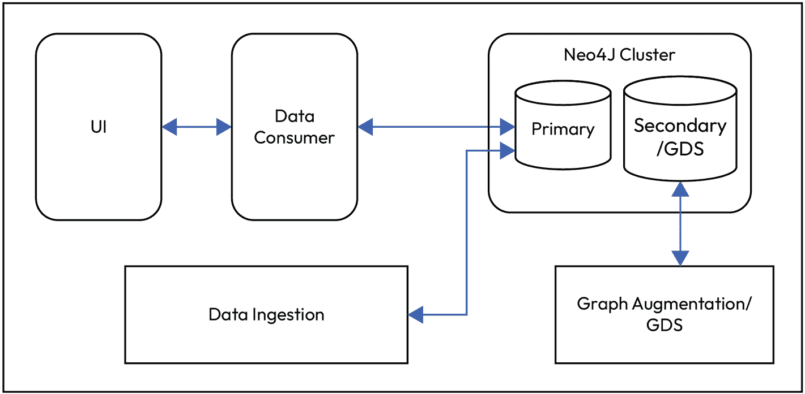

# 12

# 在 Google Cloud 上部署您的应用程序

您在设计和发展您的 GenAI 应用程序方面已经取得了长足的进步。现在，是时候迈出下一个关键步骤——部署。虽然真正的生产级部署涉及各种复杂性，如 CI/CD 管道、可扩展性考虑、可观察性、成本优化和安全加固，但本章旨在为您提供一个基于 Google Cloud Run 的云部署基础、动手实践介绍。**Cloud Run** 由 Google Cloud 提供，它提供了一种强大且对开发者友好的方式来部署容器化应用程序，无需管理基础设施，非常适合快速原型设计和小规模生产用例。

部署步骤和服务可能在不同云平台（如 AWS 或 Microsoft Azure）上略有不同，但我们将专注于 Google Cloud 以简化说明。然而，一旦您熟悉了这里的核心概念，我们鼓励您在其他提供商上尝试类似的流程，以拓宽您的云部署专业知识。

我们将逐步介绍如何将您在*第五章*中构建的 Haystack 聊天机器人作为无服务器应用程序部署到 Google Cloud。关于使用 Spring AI 部署智能推荐系统的步骤将在本章后面提及，并附有资源链接以便您跟随步骤进行。到本章结束时，您将拥有一个在云上运行的聊天机器人，并对此基础上的更高级部署充满信心。

在本章中，我们将涵盖以下主要主题：

+   使用 Haystack 准备您的搜索聊天机器人以进行部署

+   使用 Docker 容器化应用程序

+   设置 Google Cloud 项目和服务

+   部署到 Google Cloud Run

+   测试和验证部署

# 技术要求

要使用 Google Cloud Run 部署您的 Haystack 聊天机器人，您需要以下条件：

+   拥有一个已启用计费的活跃 Google Cloud 账户。如果您是 Google Cloud 的新用户，可以从[`console.cloud.google.com/`](https://console.cloud.google.com/)创建一个账户，并利用为新用户提供免费层和信用额度。

+   访问 Neo4j 数据库：

    +   如果您使用的是本地 Neo4j 实例，您必须使用 `ngrok` 或类似工具将其公开，以便部署的聊天机器人可以连接到它。以下是一个公开 Neo4j 的 `bolt` 端口的示例：

        ```py
        ngrok tcp 7687 
        ```

    +   使用 `ngrok` 公共 URL 更新您的 `.env` 文件：

        ```py
        NEO4J_URI=bolt://0.tcp.ngrok.io:XXXXX 
        ```

+   如果您使用 AuraDB Free，可以忽略前面的步骤。

# 准备您的 Haystack 聊天机器人以进行部署

我们将在 Google Cloud 上部署我们的应用程序。我们将讨论的部署方法在所有流行的云环境中从部署角度来看是相似的。我们将查看构建`docker compose`并在云中运行它。选择 Google Cloud 是因为它方便，而不是因为它有任何技术优势。一旦我们在 Google Cloud 上部署并运行了应用程序，将提供其他云部署相同`docker compose`的官方文档链接。仅仅重复书中的那些步骤并不会带来太大的不同。

在进行容器化和部署之前，确保您的 Haystack 聊天机器人代码以与无服务器部署兼容的方式组织非常重要。在本节中，您将适当地结构化代码库，并准备部署到 Google Cloud Run 所需的必要配置文件。

我们将通过创建主脚本（`search_chatbot.py`）的副本，将其重命名为`app.py`（因为这是许多云服务在提供 Python 网络应用程序时期望的默认入口点），并将其放置在一个简化文件夹中以准备容器化，来重用工作搜索聊天机器人。由于聊天机器人逻辑已经功能正常，我们将跳过本地测试，直接进行打包并将其部署到云端。

**注意**

这些步骤将帮助您将 Haystack 聊天机器人容器化和部署到 Google Cloud Run，这些步骤也在本书 GitHub 仓库的`README.md`文件中展示，网址为[`github.com/PacktPublishing/Building-Neo4j-Powered-Applications-with-LLMs/tree/main/ch12`](https://github.com/PacktPublishing/Building-Neo4j-Powered-Applications-with-LLMs/tree/main/ch12)。

接下来，准备一个`requirements.txt`文件，列出聊天机器人运行所需的全部 Python 依赖项。此文件允许容器在构建过程中安装所需的包。此文件的内容看起来可能如下所示：

```py
haystack-ai==2.5.0
openai==1.67.0
gradio==4.44.1
python-dotenv>=1.0.0
neo4j==5.25.0
neo4j-haystack==2.0.3 
```

为了安全地管理敏感凭证和环境特定的配置，建议使用`.env`文件。在 GitHub 仓库的`ch12`目录中，您将找到一个名为`example.env`的文件，它作为一个模板。此文件包括用于您的 OpenAI API 密钥和 Neo4j 数据库凭证等关键变量的占位符。要使用它，只需创建此文件的副本，将其重命名为`.env`，并用您的实际值填充。应用程序利用`python-dotenv`库在运行时加载这些变量，从而将秘密从代码库中排除，同时仍然使它们对应用程序可访问：

```py
OPENAI_API_KEY=<insert-your-openai-api-key>
NEO4J_URI=<insert-your-neo4j-uri>
NEO4J_USERNAME=neo4j
NEO4J_PASSWORD=<insert-your-neo4j-password> 
```

到目前为止，您已经设置了部署所需的核心组件——您的应用程序脚本、依赖项和环境变量。为了确保一切组织正确，以便进行容器化和部署，您的项目目录现在应遵循以下结构：

```py
haystack-cloud-app/
├── app.py                  # Renamed chatbot server file (originally search_chatbot.py)
├── requirements.txt        # Python dependencies
├── Dockerfile              # Will be created in the next step
├── .env                    # For storing configuration variables
├── example.env             # Template file for environment variables 
```

`example.env` 文件作为用户创建自己的 `.env` 文件的参考，其中包含有效的凭证和配置值。现在，所有核心组件都已就位——包括你的应用程序脚本、依赖项和环境设置——你现在可以为部署容器化你的应用程序。

让我们继续进行下一步，即使用 Docker 容器化你的应用程序。

# 使用 Docker 容器化应用程序

在将你的 Haystack 聊天机器人部署到 Google Cloud Run 之前，应用程序必须被打包到 Docker 容器中。**容器化**允许你将你的代码、依赖项和环境捆绑成一个单一、可移植的单位，该单位可以在不同的系统上（包括云端）一致地运行。

在本节中，你将创建一个 Dockerfile，它定义了构建你的聊天机器人 Docker 镜像所需的步骤。然后，这个镜像将被部署到 Cloud Run 作为无服务器网络服务。

这里是用于容器化你的 Haystack 聊天机器人的 Dockerfile：

```py
FROM python:3.11
EXPOSE 8080
WORKDIR /app
COPY . ./
RUN pip install -r requirements.txt
CMD ["python", "app.py"] 
```

让我们分解每一行的作用：

+   `FROM python:3.11`: 这将基础镜像设置为 Python 3.11，它包括运行 Python 应用程序所需的一切。

+   `EXPOSE 8080`: Cloud Run 预期应用程序在端口 `8080` 上监听。此行记录了容器在运行时将公开的端口。

+   `WORKDIR /app`: 这将容器内的工作目录设置为 `/app`。所有后续命令都将从这个目录运行。

+   `COPY . ./`: 这将你的本地项目目录的全部内容复制到容器的 `/app` 目录中。

+   `RUN pip install -r requirements.txt`: 这安装了你在 `requirements.txt` 文件中列出的所有 Python 依赖项。

+   `CMD ["python", "app.py"]`: 这指定了容器启动时要运行的命令——在这种情况下，它使用 `app.py` 运行你的聊天机器人应用程序。

一旦你的 Dockerfile 就位，你现在就拥有了一个完全容器化的 Haystack 聊天机器人版本，准备好部署到云端。下一步是配置你的 Google Cloud 环境，以便你可以推送你的容器并使用 Cloud Run 运行它。

让我们继续设置你的 Google Cloud 项目和服务。

# 设置 Google Cloud 项目和服务

Google Cloud 为部署现代应用程序（包括由 GenAI 驱动的解决方案）提供了一个强大且面向开发者的平台。借助 Cloud Run、Artifact Registry 和 Cloud Build 等工具，Google Cloud 使你能够从代码到可扩展的无服务器部署，同时最小化运营开销。

尽管你的 Haystack 聊天机器人使用 OpenAI 进行语言处理，但 Google Cloud 在托管应用程序、管理容器构建和安全性存储 Docker 镜像方面发挥着关键作用。在本节中，你将配置你的 Google Cloud 项目，仅启用必要的服务（如 Cloud Run、Cloud Build 和 Artifact Registry），并为部署准备你的环境。

到本节结束时，你的项目将准备好云部署，所有服务和权限都已就绪，以便使用 Google Cloud 的无服务器基础设施部署你的聊天机器人。

让我们开始设置你的项目并启用所需的 API。

## 创建一个项目

在 Google Cloud 控制台([`console.cloud.google.com/`](https://console.cloud.google.com/))的项目选择器页面，选择或创建一个 Google Cloud 项目([`cloud.google.com/resource-manager/docs/creating-managing-projects`](https://cloud.google.com/resource-manager/docs/creating-managing-projects))。

确保你的 Cloud 项目已启用计费。了解如何在项目中检查计费是否已启用，请参阅[`cloud.google.com/billing/docs/how-to/verify-billing-enabled`](https://cloud.google.com/billing/docs/how-to/verify-billing-enabled)。

## 启动 Google Cloud Shell

为了简化设置并避免在本地安装任何工具，我们将使用预装了 Docker、`gcloud` CLI 和 Git 的 Google Cloud Shell。以下是开始的方法：

1.  访问 Google Cloud 控制台([`console.cloud.google.com/`](https://console.cloud.google.com/))。

1.  点击导航栏右上角的 Cloud Shell 图标（终端图标）。

屏幕底部将打开一个终端窗口。这是一个功能齐全的 shell，可以访问你的 Google Cloud 项目和服务。

**注意**

Cloud Shell 提供了一个具有 5 GB 持久存储的临时 VM——对于这个教程来说已经足够了。

## 设置你的活动项目

确保你正在操作正确的 Google Cloud 项目。你可以创建一个新的项目或者使用现有的一个。使用以下步骤设置：

```py
gcloud config set project YOUR_PROJECT_ID 
```

你可以使用以下命令验证活动项目：

```py
gcloud config list project 
```

## 启用所需的服务

现在，启用部署你的容器所需的 Google Cloud 服务：

```py
gcloud services enable cloudresourcemanager.googleapis.com \
                       servicenetworking.googleapis.com \
                       run.googleapis.com \
                       cloudbuild.googleapis.com \
                       cloudfunctions.googleapis.com 
```

命令执行成功后，你应该会看到类似于以下的消息：

```py
Operation "operations/..." finished successfully. 
```

上述 `gcloud` 命令的替代方法是通过对控制台中的每个产品进行搜索。如果遗漏了任何 API，你可以在实施过程中启用它。请参阅 `gcloud` 命令和用法文档：[`cloud.google.com/sdk/gcloud/reference/config/list`](https://cloud.google.com/sdk/gcloud/reference/config/list)。

## 将你的项目文件添加到 Cloud Shell

在继续部署步骤之前，请确保你的 Haystack 聊天机器人文件已存在于你的 Google Cloud Shell 环境中。

你有两个选择来完成这个操作：

1.  **上传现有文件**：如果你已经在本地开发项目（例如，作为早期章节的一部分），你可以使用 Cloud Shell 编辑器的 **上传** 选项将工作目录上传到 Cloud Shell。只需点击 **打开编辑器** 按钮（铅笔图标），然后使用 **文件 | 上传文件** 或直接将文件夹拖放到编辑器中。

1.  **从 GitHub 克隆（推荐用于干净设置）**：或者，你可以使用以下命令直接从官方书籍仓库克隆 *第十二章* 的代码：

    ```py
    git clone [`github.com/PacktPublishing/Building-Neo4j-Powered-Applications-with-LLMs.git`](https://github.com/PacktPublishing/Building-Neo4j-Powered-Applications-with-LLMs.git)
    cd Building-Neo4j-Powered-Applications-with-LLMs/ch12 
    ```

一旦你进入 `ch12` 文件夹，你将找到所有必要的文件——`app.py`、`requirements.txt`、`Dockerfile` 和 `example.env`。

如果你决定克隆仓库，请确保遵循前面提到的步骤来生成 `.env` 文件。现在你的项目文件已经放置在 Cloud Shell 内并准备就绪，是时候进入最终阶段——将你的 Haystack 聊天机器人部署到 Google Cloud Run。

# 部署到 Google Cloud Run

在本节中，你将了解完整的部署工作流程——从设置环境变量和配置 Artifact Registry 到构建你的容器并使用 Cloud Run 部署它。让我们一步一步来分解：

1.  设置环境变量。首先，导出你的 Google Cloud 项目和部署区域的关键环境变量。用你的实际值替换占位符：

    ```py
    # Set your Google Cloud project ID
    export GCP_PROJECT='your-project-id'  # Replace with your actual
    roject ID
    # Set your preferred deployment region
    export GCP_REGION='us-central1'       # You can choose a different supported region 
    ```

1.  创建一个 Artifact Registry 实例并构建容器。配置你的 Artifact Registry 仓库并使用 Cloud Build 构建你的容器镜像：

    ```py
    # Set Artifact Registry repo name and Cloud Run service name
    export AR_REPO='your-repo-name'       # Choose a name like 'genai-chatbot'
    export SERVICE_NAME='movies-chatbot'  # Or any descriptive name 
    ```

    1.  创建 Docker 仓库：

        ```py
         gcloud artifacts repositories create "$AR_REPO" \
          --location="$GCP_REGION" \
          --repository-format=Docker 
        ```

    1.  使用 Artifact Registry 验证 Docker：

        ```py
        gcloud auth configure-docker "$GCP_REGION-docker.pkg.dev" 
        ```

    1.  然后，构建并推送你的容器镜像：

        ```py
        gcloud builds submit \
          --tag "$GCP_REGION-docker.pkg.dev/$GCP_PROJECT/$AR_REPO/$SERVICE_NAME" 
        ```

此命令使用你的 Dockerfile 打包应用程序，并将生成的容器镜像推送到 Artifact Registry。

1.  部署到 Cloud Run。在部署之前，请确保你的 `.env` 文件包含所有必需的环境变量，例如 `OPENAI_API_KEY`、`NEO4J_URI` 以及任何特定于项目的配置。

为了在部署期间传递这些变量，将你的 `.env` 文件转换为与 `--set-env-vars` 标志兼容的格式：

```py
ENV_VARS=$(grep -v '^#' .env | sed 's/ *= */=/g' | xargs -I{} echo -n "{},")
ENV_VARS=${ENV_VARS%,} 
```

+   现在，将你的应用程序部署到 Cloud Run：

    ```py
    gcloud run deploy "$SERVICE_NAME" \
      --port=8080 \
      --image="$GCP_REGION-
    docker.pkg.dev/$GCP_PROJECT/$AR_REPO/$SERVICE_NAME" \
      --allow-unauthenticated \
      --region=$GCP_REGION \
      --platform=managed \
      --project=$GCP_PROJECT \
      --set-env-vars="GCP_PROJECT=$GCP_PROJECT,GCP_REGION=$GCP_REGION,$ENV_VARS" 
    ```

一旦完成，Google Cloud Run 将返回一个 URL，你的聊天机器人可以通过网页实时访问。

恭喜——你的 Haystack 聊天机器人现在已成功部署，并在 Google Cloud 上作为一个无服务器应用程序运行！

让我们继续到最后一步：测试和验证部署，以确保一切按预期工作。

# 在 Google Cloud 上测试和验证部署

一旦你的部署完成，Google Cloud Run 将返回一个公共服务 URL，通常格式如下：

```py
https://movies-chatbot-[UNIQUE_ID].${GCP_REGION}.run.app 
```

在你的浏览器中打开此 URL。你应该能看到你的 Gradio 驱动的聊天机器人界面在网页上实时运行——其功能与本地版本完全相同。你现在可以与聊天机器人互动，提交查询，并像以前一样接收电影推荐，但这次它是完全在云端运行的。

如果某些事情没有按预期工作，请准备好以下清单进行故障排除：

+   **依赖性检查**：确保你的 Dockerfile 使用 `pip install -r requirements.txt` 正确安装所有依赖项。缺少依赖项可能导致 Cloud Run 上的构建或运行时错误。

+   **Cloud Shell 与本地环境**：如果您没有使用 Google Cloud Shell，请确保您的本地环境通过具有适当权限的 Google Cloud 服务账户进行认证，以便于 Cloud Run、Artifact Registry 以及（如果适用）Vertex AI。

+   **监控日志和指标**：您可以直接从 Google Cloud 控制台下的 **Cloud Run** 中监控您服务的日志、请求历史和性能指标。这对于调试和性能调整特别有用。

+   **Cloud Run 服务管理**：在云控制台中导航到 **Cloud Run**，您将看到已部署服务的列表。您的聊天机器人（例如，`movies-chatbot`）应该会出现在这里。点击服务名称将为您提供以下访问权限：

    +   公共服务 URL

    +   部署历史

    +   容器配置

    +   环境变量

    +   日志和错误报告

这种可见性使得跟踪和管理您的应用程序在部署后变得容易。

现在您的聊天机器人已经上线，部署在可扩展的无服务器平台上，并且公开可访问，您已经成功完成了部署之旅。您的基于 GenAI 的电影推荐聊天机器人现在可以使用了，可以分享，并且可以进一步改进。

## 将聊天机器人部署到其他云平台

如初始部分所述，一旦您准备好了 `docker compose`，您就可以遵循提供的说明将相同的应用程序部署到其他云平台：

+   **Azure 部署**：请参考以下链接中的说明：  [`techcommunity.microsoft.com/blog/appsonazureblog/how-to-deploy-a-local-docker-container-to-azure-container-apps/3583888`](https://techcommunity.microsoft.com/blog/appsonazureblog/how-to-deploy-a-local-docker-container-to-azure-container-apps/3583888).

+   **AWS 部署**：Docker 提供了将 `docker compose` 文件部署到 AWS 的清晰指南。请点击以下链接获取更多详细信息：[`www.docker.com/blog/docker-compose-from-local-to-amazon-ecs/`](https://www.docker.com/blog/docker-compose-from-local-to-amazon-ecs/).

当您遵循这些链接中的说明时，您会发现这与我们选择将应用程序容器化的部署方法有相似之处。

每个云平台的官方文档中都有大量信息，可以帮助您将 Spring Boot 应用程序部署到云平台。例如，如果您想运行我们在第 *9* 章和 *10* 章中创建的应用程序，您可以遵循各个云服务提供商提供的文档中的步骤：

+   **Google Cloud**：本文档 ([`cloud.google.com/run/docs/quickstarts/build-and-deploy/deploy-java-service`](https://cloud.google.com/run/docs/quickstarts/build-and-deploy/deploy-java-service)) 列出了在 Google Cloud Run 上部署的详细步骤

+   **Azure**：这篇文章([`learn.microsoft.com/en-us/azure/spring-apps/basic-standard/how-to-maven-deploy-apps`](https://learn.microsoft.com/en-us/azure/spring-apps/basic-standard/how-to-maven-deploy-apps))展示了如何在 Azure 上部署 Spring Boot 应用程序

+   **AWS**：对于 Azure，这里有一些参考资料文章。

    +   这篇文章([`community.aws/content/2qk6oFuOPiA4G0N83ocU0REbtdN/step-by-step-guide-to-deploying-a-spring-boot-application-on-aws-ec2-with-best-practices`](https://community.aws/content/2qk6oFuOPiA4G0N83ocU0REbtdN/step-by-step-guide-to-deploying-a-spring-boot-application-on-aws-ec2-with-best-practices))展示了如何在 AWS EC2 上部署 Spring Boot 应用程序

    +   这篇文章([`www.geeksforgeeks.org/deploy-a-spring-boot-application-with-aws/`](https://www.geeksforgeeks.org/deploy-a-spring-boot-application-with-aws/))展示了如何使用 AWS Elastic Beanstalk 部署 Spring Boot 应用程序

这些文章足以指导你部署我们的 GenAI 应用程序，因为它的核心是一个简单的应用程序，不需要这样的扩展，因为它只执行增强——而且，那也是一个批量过程。

这些应用程序的生产部署是一个更复杂的流程，需要你关注各种支持元素，如数据库、监控等。讨论整个部署超出了本书的范围，但我们将突出部署架构和关键考虑因素，以便在下一节中部署你的应用程序。

# 准备在生产环境中部署：关键考虑因素

在本节中，我们将查看智能应用程序的典型架构部署。当我们迁移到生产环境时，还有很多其他方面我们需要考虑。为了简单起见，我们将参考我们在*第九章*和*第十章*中构建的增强应用程序。

让我们看看从加载数据到审查结果的所有任务：

1.  我们将数据加载到图中。

1.  该图通过季节性关系进行了增强。我们使用增强应用程序——包括文章以及客户行为方面——来增强该图。

1.  我们还利用了 KNN 相似性和社区检测算法来增强图，并回顾了这种方法如何给我们带来更好的结果。

在生产部署中，所有这些方面可能都需要自动化并作为独立的应用程序部署。让我们简要地看看所有这些我们需要注意的方面。

当我们将智能应用程序部署到生产环境时，我们需要确保我们关注数据摄取、数据消费、用于增强图的 LLM 或 ML 管道，以及用于扩展的图数据库部署架构。

让我们先看看*图 12.1*中的部署架构。



图 12.1 — Neo4j 智能应用的部署架构

我们可以看到这里显示了两个不同的 Neo4j 数据库。在 Neo4j 的常规交互中，我们将拥有`Primary`，它可以执行`READ`和`WRITE`功能。对于分析、**图数据科学**（**GDS**）和其他用途，我们将使用`Secondary`，它只提供`READ`功能。我们可以拥有多个`Primary`数据库以提供高可用性，以及多个`Secondary`数据库以提供横向扩展性。我们可以从图中看到，所有常规交互，包括数据摄取和数据消费，都由`Primary`处理，而增强图的负载分析工作由`Secondary`处理。

这种部署架构也使得维护和监控系统变得容易。Neo4j 数据库附带**Neo4j Ops Manager** ([`neo4j.com/docs/ops-manager/current/`](https://neo4j.com/docs/ops-manager/current/))，用于部署和监控 Neo4j 服务器。它提供仪表板来监控系统的当前健康状况，并在出现错误时设置警报以通知用户。

对于其他应用程序，我们需要有类似的监控，特别是对于数据摄取和增强应用程序。当它们在中间失败时，我们应该能够从失败的地方重新启动。增强应用程序就是为此目的而构建的。

当我们构建数据摄取管道时，我们需要牢记这些方面：

+   我们的初始数据量是多少？

+   我们日常的更改（增量数据更改）及其大小是什么？

+   增量数据是如何来的？它是以接近实时的方式，定期作为一个批次到来，还是在一天结束时作为一个大批次到来，还是由最终用户通过用户界面进行的交互式更改？

我们将探讨这些场景的最佳实践。

## 初始数据加载

如果我们从其他数据源或数据库迁移，我们可能需要第一次将数据移动到 Neo4j。根据数据量，我们必须决定我们是否可以采取事务方法来加载数据，或者利用名为`neo4j-admin`的离线数据导入方法。

在*第九章*中，我们使用了事务方法来加载数据。如果我们加载的数据量不超过几百万条记录，比如说一亿条，我们可以在合理的时间内加载这些数据。当我们以事务方式加载数据时，Neo4j 数据库需要更新索引并保持事务日志分开，将数据提交到数据库。这给过程增加了相当多的开销。但这种方法给我们提供了更多的灵活性和可重用的代码，可以用于增量数据加载。如果我们正在将数据加载到集群中，我们可以使用这种方法来确保数据在集群中可用，因为 Neo4j 数据库服务器确保更改在集群中复制。我们使用了**LOAD CSV**选项来加载数据。您可以在[`neo4j.com/docs/cypher-manual/current/clauses/load-csv/`](https://neo4j.com/docs/cypher-manual/current/clauses/load-csv/)了解更多信息。

这种方法对于概念验证和临时数据加载目的来说很好，但对于生产系统，数据摄取应该通过连接到数据库的客户端使用 Neo4j 协议来执行。虽然**LOAD CSV**选项简单且吸引人，但它使用数据库堆来加载数据和执行数据摄取，这可能不是所希望的。您可以在[`github.com/neo4j-field/pyingest`](https://github.com/neo4j-field/pyingest)找到一个基本的 Python 客户端应用程序，它可以向图中摄取数据。请注意，这是一个示例客户端，您需要构建一个适合您生产需求的客户端。

如果数据量更大，那么使用**Neo4j Admin Import**过程会更好。为此，我们需要以特定格式准备节点和关系的 CSV 文件，并使用`neo4j-admin`工具准备数据库。您可以在[`neo4j.com/docs/operations-manual/current/tools/neo4j-admin/neo4j-admin-import/`](https://neo4j.com/docs/operations-manual/current/tools/neo4j-admin/neo4j-admin-import/)了解更多关于 CSV 文件格式和示例的信息。

## 增量数据加载

增量数据加载的方法取决于我们将用于加载数据的框架。如果有很多流数据，那么利用像 Apache Kafka 这样的框架可能是个好主意。此外，使用 Java、JavaScript、.NET 或 Python 等语言框架构建与数据库交互以摄取数据的应用程序也很容易。

您可以在[`neo4j.com/docs/create-applications/`](https://neo4j.com/docs/create-applications/)了解如何为 Neo4j 构建客户端应用程序。我们需要注意的一点是利用管理事务函数，以便在集群因网络故障或服务器故障导致集群拓扑变化时，驱动程序可以在集群中根据需要重试事务。您可以在[`neo4j.com/docs/java-manual/current/transactions/`](https://neo4j.com/docs/java-manual/current/transactions/)了解更多关于此的信息。此链接指向 Java 使用，但相同的功能适用于所有受支持的语言框架。

## 图增强

虽然我们将文章增强和客户增强作为 Spring Boot 应用程序构建，但我们还没有调查自动化其他方面。在为特定季节的客户生成嵌入后，我们运行了如 KNN 相似性和社区检测等独立的 ML 方面。我们可能也需要自动化这些方面。每当新数据被摄入到图中时，我们可能需要触发增强应用程序以生成嵌入以适应我们加载的新数据，然后在该完成后触发 GDS 算法。请注意，我们查看的 ML 管道是 KNN 相似性和社区检测的简单链式连接；根据需要，它们可以更加复杂。

如果您想了解更多关于 Neo4j 的 ML 管道，您可以访问[`neo4j.com/docs/graph-data-science/current/machine-learning/machine-learning/`](https://neo4j.com/docs/graph-data-science/current/machine-learning/machine-learning/)。

我们探讨了如何将推荐作为分析验证的一部分作为 Cypher 查询来查看。一旦我们对查询感到满意，我们可能需要构建一个应用程序，以便根据需要提供推荐。

我们的应用程序是基于 Spring 框架构建的，它提供了各种功能和选项来构建一个生产级的应用程序，这使得部署和监控应用程序变得更加容易。您可以在[`docs.spring.io/spring-boot/reference/packaging/index.html`](https://docs.spring.io/spring-boot/reference/packaging/index.html)了解更多关于我们如何为生产部署打包 Spring 应用程序的信息。您可以在[`docs.spring.io/spring-boot/reference/actuator/index.html`](https://docs.spring.io/spring-boot/reference/actuator/index.html)了解更多关于生产级特性，这些特性帮助我们监控应用程序。

这些是部署的关键原则和考虑因素；对于生产部署，需要考虑多个方面，包括适当的部署架构以及应用程序开发。需要部署多个流程以进行监控和性能评估，以确保应用程序随着数据和流量的增长而扩展。

# 摘要

在这一章的结尾，您学习了如何将 Haystack 驱动的 GenAI 聊天机器人从本地开发过渡到完全部署的、云托管的 Google Cloud Run 应用程序。我们一步步介绍了准备项目结构、使用 Docker 容器化应用程序、配置必要的 Google Cloud 服务，以及在可扩展和无服务器环境中部署聊天机器人。您还学习了如何验证部署、监控性能和解决常见问题——这些实用技能远超这个项目本身。

更重要的是，这一章节将所有内容串联起来。从理解知识图谱和向量搜索，到使用 Haystack 和 Neo4j 整合 GenAI 工作流程，最后将您的应用程序部署到云端——您现在拥有了构建智能、可扩展和现成生产环境的 GenAI 应用程序的完整端到端蓝图。

我们现在已经完成了使用 LLMs 构建 Neo4j 应用程序的旅程。接下来，我们将快速回顾这一旅程的关键收获。
