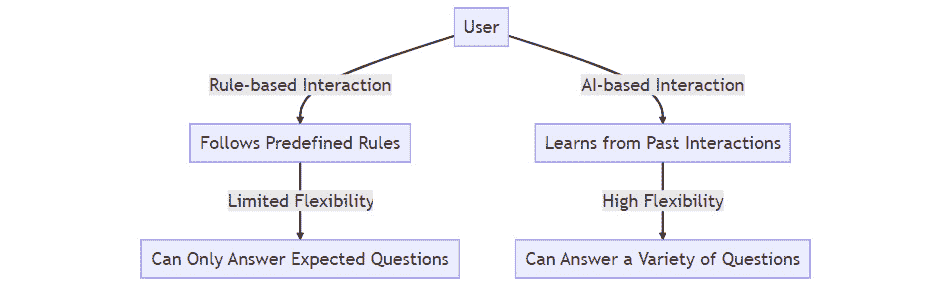
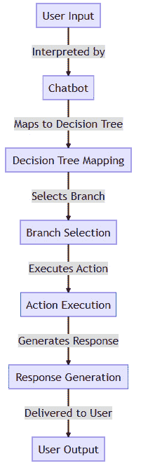
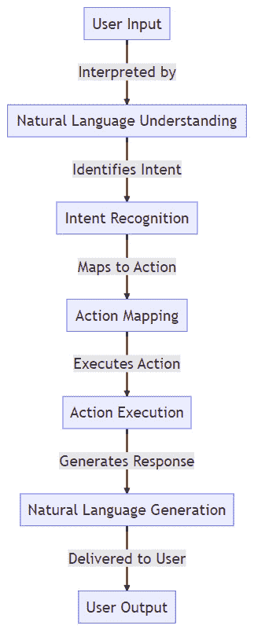
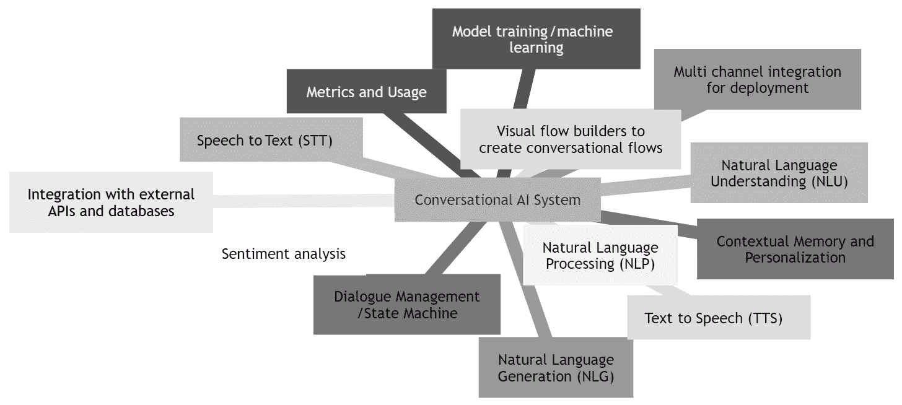
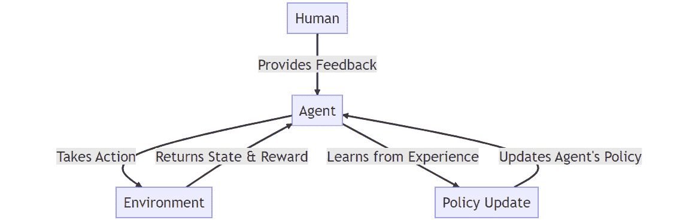

# 1

# 聊天机器人、对话式人工智能和 ChatGPT 简介

欢迎来到聊天机器人、**对话式人工智能**（**conversational AI**）和 ChatGPT 的激动人心世界！

在本章的介绍部分，我们将向您介绍聊天机器人和对话式人工智能。

我们的旅程将从探索聊天机器人的基础知识及其不同类型开始，追溯这些数字对话者的演变过程，并评估它们在多个行业（如电子商务、客户服务、医疗保健）中的影响。

接下来，我们将探讨对话式人工智能领域随着时间的推移而发生的变革，以及**大型语言模型**（**LLM**）技术的近期快速崛起，特别是 OpenAI 的 ChatGPT、**生成式预训练变换器 3**（**GPT-3**）和 GPT-4 模型的崛起。

在阅读本章的过程中，您将全面了解 OpenAI 的 ChatGPT。我们将揭开这一技术奇迹的神秘面纱，探讨其发展、功能和局限性。您将亲眼看到 ChatGPT 如何融入更广泛的对话式人工智能领域，以及它如何通过其多样化的应用彻底改变了各个行业。

为什么本章有价值？我们的目标是审视对话式人工智能的更广泛图景，并深入理解 ChatGPT，为本书后面将要学习的实用技能打下基础。到本章结束时，您将对聊天机器人和对话式人工智能有一个丰富的理解，特别是 ChatGPT 的现实应用和潜力，以及与早期对话式人工智能技术相比，ChatGPT 提供的机遇。这种洞察力将使您能够看到 ChatGPT 的对话式人工智能应用如何为您的组织带来实际利益，提升用户体验和业务流程，并为您的行业带来新的优势。让我们共同踏上这段启发性的旅程吧！

本章将涵盖以下主要内容：

+   什么是聊天机器人和对话式人工智能？

+   聊天机器人和对话式人工智能的演变

+   理解对话式人工智能应用

+   OpenAI 的 ChatGPT 是什么？

+   ChatGPT 的功能和应用

+   ChatGPT 的局限性

# 什么是聊天机器人和对话式人工智能？

当我们想到对话式人工智能时，我们指的是一个不断发展的 AI 领域，它使计算机系统能够以交互式的方式使用**自然语言**（**NL**）与人类进行交流。

在过去的十年中，由对话式人工智能驱动的基于语音和文本的助手已经融入我们的日常生活，在各种平台上提升了用户体验，并应对了广泛的使用案例。它们彻底改变了企业与客户互动的方式，已成为现代数字战略的关键组成部分。

本节旨在提供一个关于对话式人工智能领域的全面概述。它将深入探讨聊天机器人和对话式人工智能的历史，突出塑造从基本的基于规则的系统到复杂的 AI 驱动聊天机器人进步的关键里程碑。我们将研究技术进步，如**自然语言理解**（NLU）以及从基于规则的聊天机器人到 AI 聊天机器人的转变，强调它们的能力和局限性。总的来说，本节旨在为读者提供一个关于对话式人工智能在革命性地改变人类与计算机之间互动的重要性和潜力的清晰理解。

## 对话式人工智能的简要历史

第一个聊天机器人是在 20 世纪中叶创建的，第一个记录的例子 ELIZA 是在 1966 年从神圣的麻省理工学院（MIT）的殿堂中诞生的，这得益于约瑟夫·魏岑鲍姆的开创性工作。ELIZA 被设计成**模仿**心理治疗师的语言模式，能够与人类用户进行直接的互动。这一开创性的创造为后来更复杂的对话式人工智能系统的发展奠定了基础。

最初，这些基本的聊天机器人只能执行一组有限的预编程响应或决策树。然而，它们已经经历了显著的演变，扩展了它们对各种输入做出响应的能力。

革命性技术如**机器学习**（ML）、**自然语言处理**（NLP）和 NLU 的出现，促进了从基本的聊天机器人到复杂的对话式人工智能系统的转变。这些先进系统不仅能够以更自然、更本能的方式理解和回应人类的语言，而且还能进行更动态的对话。这些现代系统的一个关键特征是它们能够使用 ML 随着时间的推移进行学习和适应，从而不断提高它们的效率和用户接受度，因此也提高了它们的需求。

对话式人工智能的发展和演变被一系列重要的里程碑所标记，这些里程碑突出了它从基本的聊天机器人到能够模拟类似人类对话的高级人工智能系统的稳步进步。

这些里程碑中的每一个都代表了对话式人工智能发展中的一个重大进步，为今天我们所看到的复杂基于意图的系统铺平了道路。然而，说直到 2022 年 11 月对话式人工智能才真正起飞并不夸张。

为了强调 ChatGPT 的非凡增长，考虑这样一个事实：它在 2022 年 11 月发布后的短短 5 天内就积累了超过一百万用户。这种增长轨迹甚至超过了 Netflix、Facebook、Instagram 和 Zoom 等科技巨头。

## 聊天机器人和自动化助手概述

当我们谈论聊天机器人或数字助手时，我们究竟指的是什么？*聊天机器人*这个术语一直存在争议，有些人认为它在技术还处于萌芽阶段时，承担了过去的失望的主要责任。为了本书的目的，无论我们称它们为聊天机器人、数字助手还是其他任何术语，我们本质上都是在讨论一种与人类通过文本或语音进行交流的计算机程序。这种交互式通信可以在各种媒介上进行，例如网站、移动应用、消息平台、协作工具、智能音箱、数字人类头像或**交互式语音响应**（**IVR**）系统。

为了进一步区分，我们可以将这些实体分为两种主要类型的对话代理，它们具有不同的能力：

图 1.1 – 基于规则和人工智能驱动的聊天机器人的比较

### 基于规则的聊天机器人/数字助手

简单的基于规则的聊天机器人基于一组预定义的规则或常见问题解答（FAQs）。它们被设计用来回答常见问题、提供信息或引导用户完成特定任务。然而，它们处理交互的能力仅限于预编程的知识，并且它们可能会在偏离预定义脚本的要求时遇到困难：

图 1.2 – 与基于规则的聊天机器人的交互

简而言之，这些聊天机器人无法理解它们被编程去理解的任何语言之外的任何语言。这类聊天机器人不利用任何机器学习（ML）技术，在用例和功能上有限且脆弱。如果用户提出的要求超出了它们的对话能力或决策树的范围，那么它们往往会崩溃，导致用户体验不佳。

### 由对话式人工智能驱动的聊天机器人/数字助手

对话式人工智能是指使计算机或机器能够与用户进行自然和类似人类的对话的技术。它结合了自然语言处理（NLP）、自然语言理解（NLU）、机器学习（ML）和对话管理等多个领域，以对话的方式理解和响应用户输入。如今，对话式人工智能是涵盖聊天机器人和语音助手以及创建它们的系统和技术的领域的通用术语。

随着技术的进步，对话式人工智能已经发展到更加复杂，能够理解复杂的查询，提供有意义的、上下文相关的响应，并采用更加稳健、更加动态和适应性强的方法。

对话式人工智能聊天机器人的核心功能包括以下内容：

+   **对上下文的理解**：NLU 最显著的特征之一是其理解对话上下文的能力。这意味着它不仅独立处理单词，还考虑这些单词被使用的上下文。这允许 AI 正确地解释用户输入背后的含义，即使它是模糊的或复杂的。

+   **语义理解**：NLU 系统具有高度的语义理解能力。它们可以通过使用实体识别来理解用户话语背后的含义，包括同义词、俚语、地方方言和行业特定术语。

+   **处理歧义**：在人类交流中，歧义是常见的。我们经常使用模糊或不清晰的表述，这些表述可以有不同的解释。一个 NLU 系统可以通过使用上下文线索来推断意图的含义来处理这种歧义。例如，考虑这个句子，“*我看到了她的鸭子*。”这个句子可以有多个解释：它可能意味着说话者看到了一个女性躲避某物，或者它可能意味着说话者看到了属于女性的鸭子。如果之前的对话是关于避免飞行物体，系统就会推断第一个含义。如果对话是关于宠物或动物，它就会推断第二个含义。

+   **意图识别**：NLU 系统可以识别用户话语背后的意图。这意味着它们不仅处理用户所说的话，还理解用户想要实现的目标。这对于提供有帮助和相关的响应至关重要。

+   **实体识别**：实体识别是 NLP 中的一个关键技术。它是识别和分类文本输入中的命名实体（如人名、组织、地点、产品类型、日期和其他变量）的任务。

+   **槽填充**：槽填充是根据实体类型从输入中提取信息的功能。它高度依赖于实体识别，它涉及到从输入中识别和提取特定的信息片段，并将它们放入预先定义的**槽位**中供以后使用。例如，在一个酒店预订对话系统中，槽位可能包括房间类型、预订时间和人数。

+   **情感分析**：许多 NLU 系统可以分析用户话语背后的情感。这使得它们能够识别用户是高兴、沮丧、愤怒还是悲伤，并以对用户情绪状态敏感的方式做出响应。

+   **对话管理**：NLU 系统可以管理复杂的对话。它们可以跟踪对话的历史并使用这些信息来指导它们的响应。它们可以处理中断、后续问题和对话主题的变化，提供更类似人类的交互。

+   **多语言能力**：高级 NLU 系统可以理解和用多种语言进行交流。这使得企业能够为全球受众提供客户服务和支持。

+   **与外部系统的集成**：NLU 系统通常可以与其他系统集成，例如**客户关系管理**（CRM）系统、数据库或其他 API。这使得 AI 在与用户交互时能够检索和利用实时数据，提供更个性化和相关的响应。

以下图表展示了与现代对话式 AI 聊天机器人交互的步骤：

图 1.3 – 与 AI 聊天机器人的交互

在过去的 5 年里，对话式 AI 平台经历了巨大的增长，大小技术供应商都在努力构建最佳的低代码、无代码、专业代码解决方案。多年来在对话式 AI 领域工作过的每个人都对什么是最优秀或他们最喜欢的平台来构建对话体验有自己的看法。

所有这些系统的关键组成部分是它们都是基于意图的。AI 技术根据一组训练好的意图处理用户意图，并根据其对对话上下文的理解提供答案。

### 对话式 AI 平台

现代对话式 AI 系统采用几个功能来管理对话。这些功能通常包括以下内容：

+   能够通过文本或语音理解用户的 NL 输入

+   能够生成相关、连贯且引人入胜的 NL 输出

+   能够理解对话中的多个意图、实体和上下文

+   能够从用户反馈和数据中学习，以随着时间的推移提高它们的准确性和理解能力

+   能够在多个平台和渠道上提供一致和个性化的体验

图 1.4 – 现代对话式 AI 系统的元素

市场上有许多优秀的对话式 AI 系统，供应商从最大的技术提供商到专注于对话式 AI 解决方案的技术初创公司都有。

实际上，并不是这些系统之一创建的最终对话体验决定了成功的实施，而是系统中实际的功能以及这些功能的可用性，这些功能使得用户能够创建对话体验。

为了欣赏今天先进的对话式 AI，让我们回顾一下聊天机器人从其不起眼的起点的发展历程。

# 聊天机器人和对话式 AI 的演变

当聊天机器人最初进入场景时，它们被誉为技术领域的突破性进化，有望彻底改变企业与其客户沟通的方式。

然而，早期的版本并没有像许多人所期望的那样令人印象深刻。结合聊天机器人平台的发展以及任何人都能轻松创建聊天机器人的便利性，这导致了糟糕的用户体验和整体表现不佳，从而损害了它们的声誉。

早期聊天机器人的一个主要缺陷是它们在理解和回应人类语言方面缺乏复杂性和细微差别。这些基本的版本通常是基于规则的，严重依赖预先编写的脚本。这意味着它们只能处理非常具体的输入，并且很容易因为任何偏离脚本的内容而受到影响。因此，用户常常发现自己陷入令人沮丧的循环对话中，聊天机器人无法理解他们的查询，并持续提供无关或无意义的回应。

语音助手的旅程也充满了起伏。虽然它们在最初很受欢迎，尤其是在亚马逊的 Alexa、苹果的 Siri 和谷歌助手推出后，但随着时间的推移，它们的人气有所下降。这些语音助手的准确性和理解能力导致了一些用户的不满。此外，关于隐私和数据安全的担忧在下降中发挥了重要作用。设备“始终在监听”的想法让许多用户感到不舒服，不愿意使用这些助手。

早期聊天机器人和语音助手的炒作与它们局限性的现实形成了鲜明对比，导致这些技术出现了一种“AI 寒冬”。媒体迅速抓住这些失败，引发了一波负面报道。宣称聊天机器人和语音助手“死亡”的标题变得司空见惯，导致人们对这些技术的潜力普遍持怀疑态度。

更高级的 AI 技术，如自然语言处理（NLP）和机器学习（ML）的出现，使得更先进和强大的聊天机器人和语音助手得以开发。这些新一代的产品在理解和回应人类语言方面表现得更加出色，并且能够随着时间的推移学习和适应。正如基于意图的对话式 AI 超越了基于规则的代理一样，**大型语言模型（LLMs**）也寻求实现同样的目标。

大型语言模型（LLMs）已经开发了好几年。然而，直到最近几年，随着 OpenAI 推出的 GPT-3 技术的出现，这项技术才开始获得一些曝光并进入主流。但在 2022 年 11 月，这一切都发生了变化，ChatGPT 的爆炸式增长引发了技术竞赛，数百个组织都在努力创造最先进的 LLMs。随着 ChatGPT 和现在的 GPT-4 的领先，它们可以说是最具挑战性的。事实上，不仅仅是 LLM 技术正在进步，构成生态系统的其他相关技术也在不断发展。

对话式 AI 专业人士可以看到，随着 AI 驱动通信的巨大飞跃，其中存在机会。为聊天训练的 GPT 模型可以使聊天机器人和自动化助手之间的对话看起来极其像人类。在下一节中，我们将更详细地探讨这些应用。

# 理解对话式 AI 应用

在查看 ChatGPT 之前，考虑对话式人工智能应用的使用案例，并首先在传统对话式人工智能系统和技术的可能性背景下考虑它们是很重要的。

对话式人工智能已成为众多行业中的强大工具，从客户服务到医疗保健、银行、保险、零售和人力资源。通过自动化常规任务和增强用户交互，对话式人工智能应用已经改变了许多领域的格局。让我们看看一些现有的对话式人工智能的例子。

## 客户服务

对话式人工智能在客户支持用例中取得了巨大成功，以多种方式简化流程并改善用户体验。通过采用 AI 驱动的聊天机器人和虚拟助手，企业可以无缝且高效地处理大量客户互动。

在这个用例中，对话式人工智能提供了几个能力和改进。首先，代表可以同时与多个客户互动，即时解决查询。这消除了常见的客户不满来源——长时间的等待。

第二，AI 支持的全天候可用性极大地提升了客户体验。对话式人工智能可以随时处理客户咨询，包括节假日，确保持续的支持。

第三，AI 与 CRM 系统和其他数据库的集成提供了个性化的体验。对话式人工智能可以使用客户数据来了解他们的偏好和购买历史，提供定制化的解决方案或产品推荐，从而提高客户满意度并可能推动销售。

最后，对话式人工智能可以帮助企业节省资源。AI 可以处理常规、重复性的任务，让人类代表有更多时间处理更复杂和敏感的问题。这不仅提高了效率，还降低了运营成本。

loveholidays，一家位于英国的在线旅行社，实施了一个名为 Sandy 的聊天机器人。Sandy 被设计用来实时响应客户查询，减少等待时间并提升客户体验。这个机器人全天候处理大量互动，比人工代表更高效地解决简单问题。这是一个典型的例子，说明了对话式人工智能如何正在革命性地改变客户服务，从回答常规问题到主动的客户参与。

## 语言翻译

语言翻译系统，如 Google Translate 和 DeepL，使用对话式人工智能来促进实时翻译口头或书面交流。考虑一个场景，一个说法语的用户需要与一个说中文的同事沟通。使用 Google Translate，他们可以无缝沟通，每个人都在自己的母语中，从而打破语言障碍，实现顺畅的沟通。

## 教育

基于 AI 的教育平台，如卡内基学习，利用 AI 提供个性化的学习体验。这些平台根据学生的个人需求进行调整，提供定制化的指导和反馈。通过研究学生的习惯，这些算法个性化他们的学习体验，提供更有效、个性化的学习方法。

## 医疗保健

在医疗保健领域，对话式 AI 用于患者分诊和初步诊断。例如，Babylon Health 开发了一个聊天机器人，可以进行初步症状检查，根据检查结果推荐进一步医疗关注或家庭护理。此机器人还可以安排预约和续方，显著提高患者护理和满意度。

其他用例示例包括为心理健康应用创建的；例如，Woebot 是一个 AI 驱动的个人心理健康伴侣，旨在帮助用户维持他们的情绪健康。利用具有 NLP 能力的对话式 AI，它逐渐了解用户的心理状态，提供基于**认知行为疗法**（**CBT**）、**人际心理治疗**（**IPT**）和**辩证行为疗法**（**DBT**）的定制、经临床验证的策略。这种复杂 AI 和经证实治疗策略的独特组合创造了一个独特的心理健康聊天机器人，它使用智能对话能力和流畅的聊天**用户界面**（**UI**）。

## 银行和保险

银行和保险行业使用对话式 AI 进行常规查询、账户管理、账单支付、索赔处理和政策管理。一些机构，如摩根大通，使用对话式 AI 提供个性化的财务建议和推荐，创造更具吸引力的客户体验。

## 零售

在零售业，聊天机器人通过推荐产品、跟踪订单和回答常规查询来提升客户服务。例如，一个 AI 驱动的聊天机器人可以根据客户的浏览历史推荐产品，创造个性化的购物体验。它们还帮助定制营销活动，有助于增加销售额和客户保留率。

## 人力资源

在人力资源领域，AI 驱动的聊天机器人使招聘任务更加高效。例如，Mya 可以回答常见问题、筛选候选人、安排面试和管理简历。Mya 在最初的 10,000 次对话中与 92%的候选人进行了有效互动，显著减轻了招聘人员的负担。

总之，对话式 AI 的应用范围广泛且持续发展。无论是提高客户服务的效率、个性化教育、简化医疗保健、革命化银行、保险和零售，还是提升人力资源流程，对话式 AI 注定将在各个行业中继续发挥其变革性作用。

尽管旅程充满坎坷，但聊天机器人和语音助手的传奇故事远未结束。随着这些技术的持续发展，它们有潜力真正改变我们与机器以及彼此沟通的方式。与任何技术创新一样，关键是从过去的错误中学习并继续前进。

## 对话式人工智能作为培训工具——数字人的出现

随着对话式人工智能能力的不断发展，我们正在见证“数字人”的崛起，这些数字人是高度逼真的、由人工智能驱动的虚拟生物，以类似人类的方式与用户互动。这些数字人，结合对话式人工智能的力量，为许多组织在健康、教育、培训和客户服务领域开辟了新的前沿；例如，德国电信、沃达丰、契尔氏和瑞士信贷。

UneeQ 和 Soul Machines 等公司处于开发能够表达情感、根据情境调整反应并从每次互动中学习的数字人的前沿。这类创新界面可以直接集成到现代对话式人工智能系统中，处理**语音转文本**（**STT**）和**文本转语音**（**TTS**）功能，并支持**语音合成标记语言**（**SSML**）以及它们自己的动作编程语言，以展示人类情感和手势。

在教育和培训领域，由对话式人工智能驱动的数字人可以用来创建满足每位学习者需求的沉浸式学习体验。例如，一个数字人可以充当导师，提供各种学科的个性化一对一辅导，或在企业环境中充当培训助理，引导员工通过复杂的过程或系统。

数字人供应商是 LLM 和**生成式人工智能**（**GenAI**）的早期采用者。可能性真正令人着迷，并为 AI 领域的进一步探索和发展开辟了广泛的机会。许多公司已经意识到，结合高级数字人和由 LLM 驱动的对话式服务能够实现独特的品牌体验。

创建数字人形态的代理有助于创造更个人化、富有同理心的互动，并使应用范围更广泛。以下是一些显著的例子：

+   **心理健康应用**：南加州大学创意技术研究所开发的数字人 Ellie 被用于对人们进行访谈，以筛查抑郁症和创伤后应激障碍的迹象。

+   **医学教育**：可以使用数字病人来训练医学生进行病人互动和诊断。

+   数字训练师，为每位学习者量身定制沉浸式学习体验。想象一下你自己的私人导师或在企业环境中的一名培训助理，他们引导员工通过复杂的过程或系统。

在过去，即使是基于意图的最先进对话式人工智能系统也难以提供支持这些类型代理所需的对话体验的广度，尤其是在涉及多个回合和复杂上下文的对话中。LLM 技术能够提供更真实的对话。

## 结论

我们全面审视了对话式人工智能领域，探讨了其应用并承认了其局限性。现在，让我们将焦点转向 ChatGPT 的增强能力。这个强大的工具有可能在对话式人工智能领域带来根本性的转变，为更复杂的虚拟助手、聊天机器人和各种其他通信系统和设备铺平道路。

# OpenAI 的 ChatGPT 是什么？

ChatGPT 是 OpenAI 的特定聊天 LLM，它使用机器学习来生成对您的文本输入类似人类的响应。

在 2022 年 11 月推出仅一个多月后，ChatGPT 的用户数量就超过了 1 亿。到 2023 年 2 月，其总网站访问量飙升至 10 亿次。这种爆炸性的增长使 ChatGPT 成为历史上增长最快的消费级软件应用。

ChatGPT 可以以期望的风格或编程语言解释科学和技术概念，基本上可以头脑风暴任何你可以想到的问题……当然，当然可以举行复杂的对话！

## 理解 ChatGPT 背后的大型语言技术

ChatGPT 建立在一种称为 LLM 的人工智能类型之上。在 LLM 的领域内，有两种主要类型：基本 LLM 和指令优化 LLM。在检查 OpenAI 的 ChatGPT 时，理解这两种类型之间的区别非常重要。

### 探索基本的 LLM

基本 LLM 被编程为预测一串单词中的下一个单词，使用从各种在线来源获得的大量文本数据集。它们的主要功能是预测给定序列的单词之后最可能出现的单词。

到目前为止，实际上预测的不是单词，而是标记；关于这一点，稍后在本节中会进一步讨论。

为了说明预测的上下文，让我们看看一些例子，从叙事生成开始。如果我们向一个基本的 LLM 输入短语“Hey diddle diddle，the cat and the fiddle”，它可能会继续说“the cow jumped over the moon”。它使用从其庞大的语料库中学到的模式，根据其文本训练数据预测一个有趣且与上下文相关的下一个标记。

这里有一个例子，说明一个特定查询没有得到完美回答：如果你问“1988 年美国总统是谁？”基本 LLM，而不是提供直接答案（罗纳德·里根），可能会返回一个这样的声明：“美国总统在总统选举中每 4 年选举一次。”这个回答虽然与美国总统的主题相关，但并没有直接回答原始问题，这是基本 LLM 概率预测方法的一个潜在缺点。

### 理解指令优化的 LLM 和基于人类反馈的强化学习

与基础 LLM 相比，指令优化的 LLM 是专门开发来更准确地遵循指令的。因此，它们是当前 LLM 研究和应用的主要兴趣领域。

让我们看看这个过程，它可以分解为三个步骤：

1.  预训练**语言模型**（**LM**）

1.  收集数据和训练奖励模型

1.  使用**强化学习**（**RL**）微调 LM

要开始这个过程，指令优化的 LLM 最初是在与基本 LLM 相同的大型文本数据集上训练的。OpenAI 为其第一个流行的**基于人类反馈的强化学习**（**RLHF**）模型 InstructGPT 使用了 GPT-3 的一个较小版本。该模型通过特定的指令遵循数据进行更多的微调，从而产生更精确的响应。

因此，当被问及“谁在 2020 年赢得了普利策小说奖？”时，一个指令优化的 LLM 可能会直接回答：“2020 年的普利策小说奖授予了科尔斯顿·怀特黑德的《镍男孩》。”

为了提高 LLM 输出的质量，一个常见的做法是针对某些标准对许多不同 LLM 输出的质量进行人工评分；例如，如果输出是有帮助的、真实的和无害的。

这种指令学习通过一种称为 RLHF 的方法进一步精炼，这种方法本质上优化了 LM 使其更有用。RLHF 是一种关键的方法，它微调 LLM，尤其是指令优化的模型。RLHF 方法基于强化学习的原则，强化学习是机器学习的一个子领域，其中代理通过与环境的交互获得决策技能，并作为反馈获得奖励或惩罚。然而，在对话中定义明确的奖励或惩罚以区分好或坏的回答是复杂的，并且在大规模上可能不切实际。为了改进这些模型的响应，我们得到了人们的帮助。AI 训练师与模型进行对话。当模型给出不同的回答时，训练师决定哪些是最好的。他们将答案从最好到最差进行排名。这种排名给模型一种评分：好的答案得到高分。然后，模型使用这些评分来学习给出更好的答案，这个过程类似于通过分析你获得的分数来磨练你在游戏中的技能。

以下图表概述了 RLHF 的过程：

图 1.5 – RLHF 的过程

这个过程通常是迭代的，包括多轮交互、反馈收集和微调，以提高模型的响应。重要的是，RLHF 比传统的**监督学习**（**SL**）提供了更细致和上下文相关的反馈，导致与人类价值观的更好对齐，并减少了有害或不适当的响应。

### RLHF 的挑战

尽管 RLHF 有其好处，但它也伴随着挑战，可能会产生有害或不准确的事实性文本。

收集人类偏好数据的过程，RLHF（强化学习与人类反馈）的一个基本组成部分，可能因为需要包含人类工作者而变得成本高昂。RLHF 的有效性取决于其人类标注的质量，这包括人类生成的文本和模型输出之间的人类偏好标签。这种数据收集通常需要雇佣额外的工作人员，这使得它对于学术实验室来说既昂贵又具有挑战性。此外，人类标注者可能存在分歧，这可能会给训练数据带来潜在的变异性。

RLHF 是创建有效、安全和用户友好的指令优化 LLMs 的重要工具，但它需要谨慎实施和持续改进。

对于进一步提高 RLHF 性能的研究仍有相当大的空间。在开源或众包人类协助训练这些模型方面也存在潜力。在撰写本文时，一个成功的开源 RLHF 示例是 LAION 创建的 Open Assistant 模型，贡献者可以协助排名、标注和制作回应：[`open-assistant.io/`](https://open-assistant.io/)。

## 标记在 LLMs 中的作用

OpenAI 的 GPT-3 等 LLMs 在技术上并不预测单词；相反，它们预测标记。要理解这个概念，重要的是要认识到标记是什么以及标记化是如何工作的。

标记化是 NLP（自然语言处理）中的一种常见过程，涉及将文本分解成更小的单元，称为标记。根据标记化策略，这些标记可以代表整个单词、单词的一部分，甚至标点符号。

在英语中，标记通常等同于单词，但这并不总是如此。一些标记化方法，如 GPT-3 等模型使用的 WordPiece、**字节对编码（BPE**）或单语 LM，将单词分解成更小的子单词单元。例如，“conversational ai”这个单词可能被分成五个标记：*[“con”, “versa”, “**ational”,” a”,”i”]*。

当我们说 LLMs 预测标记时，这意味着模型的任务是根据先前标记序列预测最可能的下一个标记。这种标记级预测使模型能够处理广泛的词汇，包括罕见单词、人名甚至新词。它还有助于模型更有效地处理除英语以外的语言，因为许多语言具有复杂的形态学，这些形态学在简单的单词级别上无法得到充分表示。

这对于 LLMs（大型语言模型）生成连贯且上下文适当的文本的能力至关重要。通过预测序列中的下一个标记，模型可以构建句子并完成思想，给人一种理解和生成自然语言（NL）的假象。然而，理解这些模型并不真正理解它们生成的文本是至关重要的；它们是基于在训练期间学习到的模式进行序列生成的概率模型。

令牌成本是确定 OpenAI 的语言模型（包括 ChatGPT）成本的基础，这些模型具有不同的能力和价格选项，我们将在后续章节中介绍。

## 理解 OpenAI 的语言模型

OpenAI 凭借其开创性的语言模型 GPT，已成为对话人工智能领域的先驱。

### OpenAI 的语言模型演变

OpenAI 的 GPT-3 作为 ChatGPT 的基础架构，自 2020 年发布以来已经经历了多次改进。

#### GPT-3

2020 年 6 月发布的 GPT-3，凭借其不同的基础模型：Ada、Babbage、Curie 和 Davinci，为语言生成能力设定了新的标准。每个变体都有其独特的特点。

#### GPT-3.5

GPT-3.5 作为文本补全任务的优化版本被引入，其中一个模型专门用于代码补全任务。这一系列中的最新版本 `gpt-3.5-turbo` 于 2023 年 3 月推出。`gpt-3.5-turbo` 是最先进的 GPT-3.5 模型，专门针对聊天应用进行了优化。最重要的是，它的成本仅为 `text-davinci-003` 模型的十分之一。该模型可以处理高达 4,096 个令牌，其知识更新至 2021 年 9 月。还创建了 `gpt-3.5-turbo-16k` 模型。这个模型与标准 `gpt-3.5-turbo` 模型具有相同的性能，但提供了四倍的上下文，允许进行更长和更复杂的对话。

#### GPT-4

2023 年 3 月 14 日推出的 GPT-4 被誉为 OpenAI 语言模型中最先进的。它拥有更高的事实准确性、多模态图像处理能力和创意输出。它提供两种模型变体：`gpt-4-8k` 和 `gpt-4-32k`，它们由其上下文窗口大小区分。

#### GPT-3、GPT-3.5 和 GPT-4 之间的关键差异

在提供各种能力、上下文容量和输入类型的可用模型之间有一些关键差异：

+   **能力**：GPT-4 在可靠性、创造力、协作和细微指令处理方面显著优于其前辈。OpenAI 在不同基准上进行的测试比较证明了 GPT-4 在各个领域的优越性。

+   **上下文长度**：GPT 版本之间最显著的差异之一是上下文长度。虽然 GPT-3 模型可以处理最多 2,049 个令牌，但 GPT-3.5 将此提升至 4,096 个令牌。GPT-4 实现了巨大的飞跃，其两个模型分别可以处理 8,192 和 32,768 个令牌。

+   **输入类型**：GPT-4 不仅能够处理文本输入，还具有处理图像的能力。这种独特的能力可以彻底改变其在各个领域的应用。

+   **成本影响**：更高的能力伴随着更高的价格。GPT-4 的先进功能使得每 1K 令牌的提示和完成成本更高。由于输入和输出令牌的不同成本，使用成本不仅更高，而且也更不可预测。

虽然 GPT-4 无疑在对话人工智能领域设定了新的基准，但重要的是要记住，它并没有使 GPT-3 和 GPT-3.5 过时。每个模型都提供了独特的功能和潜在的应用。

## 结论

总之，ChatGPT 模型基于强化学习（RLHF）和 OpenAI 的 GPT 系列模型，这些模型本身是在大量数据上训练的。

为了创建 ChatGPT，最新的 GPT-3.5 指令模型通过对话示例进行了微调，而不是整个互联网，以集中提高模型的专业对话能力。然后使用强化学习（RL）使模型能够练习其对话技能并改进其响应。

在接下来的章节中，我们将更详细地探讨其能力、用例以及对对话人工智能领域格局的变革性影响。

# ChatGPT 的能力和应用

大型语言模型（LLMs）提供了大量的实用用途，ChatGPT 通过其先进的自然语言处理（NLP）能力脱颖而出。在本节中，我们将探讨这项技术带来的各种应用，以及 ChatGPT 在最具潜力的行业领域中的突出表现。虽然许多这些用例对于对话人工智能应用来说并不一定新颖，但 ChatGPT 确实有可能承担更高级的任务。

## ChatGPT 的能力

在接下来的章节中，我们将探讨 ChatGPT 的各种应用，从 NLU 和**自然语言生成（NLG**）用于聊天机器人和虚拟助手开始。然后，我们将继续探讨其在机器翻译、摘要、情感分析和内容创作方面的能力。其他主题包括其在垃圾邮件过滤、语言教学和软件开发中的应用。最后，我们将讨论通过 ChatGPT 插件提供的扩展功能。

### NLU 和 NLG 用于聊天机器人和虚拟助手

对话能力是本书的核心焦点，我们将更详细地探讨这些内容。

ChatGPT 的革命性能力，尤其是其能够在不同主题和风格中维持复杂的多轮对话的能力，标志着对话人工智能领域的重大里程碑。ChatGPT 可以用来完成大多数对话人工智能系统和体验经常难以实现的事情。对于一直使用基于意图的系统并了解挑战的资深从业者来说，ChatGPT 的出现确实具有变革性。

必须指出，看到对话人工智能现在在各种媒体平台上获得的关注，包括电视、广播和报纸，也是非常令人兴奋的。

除了支持对话之外，一个不那么明显用例是 ChatGPT 还可以用作创建和管理基于意图系统的对话人工智能应用的工具。我们将在*第二章*中更详细地探讨这些应用。

### 机器翻译之间的语言

ChatGPT 支持 95 种语言。模型如 ChatGPT 中的语言翻译技术，在教育、旅行等行业中架起了语言障碍。通过学习过去的交互，这些系统提供准确的实时翻译，增强了跨文化交流。

### 文章、报告或其他文本文档的总结

ChatGPT 模型擅长将复杂主题压缩成简洁、易于理解的摘要。它们可以快速处理大量文本，为用户提供精确、易于消化的信息，并消除手动研究的需求。

### 市场研究或社交媒体监控的情感分析

通过理解和生成类似人类的响应，工具如 ChatGPT 为企业提供了对客户情绪的更深入洞察。它们可以集成到分析并标记可能存在欺诈活动的系统中，尤其是在银行等领域的应用。

### 为营销、社交媒体或创意写作生成内容

内容创作者可以利用 ChatGPT 高效地生成引人入胜的内容。从博客文章和营销材料到社交媒体帖子，该模型可以生成独特、用户定制的内容。它甚至可以提供主题建议、校对和编辑服务。

### 邮件过滤、主题分类或文档组织

在任何行业中，ChatGPT 都可以用于分类客户咨询、检测可疑交易和分析内容。

### 定制化语言学习和辅导工具

模型如 ChatGPT 提供的语言支持，理解超过 40 种语言，扩展到个性化语言学习工具。它们可以处理多语言查询并提供帮助，从而增强了语言学习的可访问性和用户体验。

### 代码生成和软件开发辅助

ChatGPT 可以理解和生成多种语言的代码，包括以下：

+   Python

+   JavaScript

+   C++

+   C#

+   Java

+   Ruby

+   PHP

+   Go

+   Swift

+   TypeScript

+   SQL

+   Shell

    ChatGPT 简化了调试和代码重构任务，为复杂的编码问题提供高效解决方案。它可以快速定位潜在问题，自动化手动任务，并提供高度准确的结果，使其成为软件开发人员的宝贵工具。

    ChatGPT 插件通过创建自己的代码解释器插件来扩展这些功能，旨在处理一些特定任务：

+   解决数学问题

+   执行数据分析与可视化

+   在不同格式之间转换文件

### 与图像一起工作

ChatGPT 无法生成图像。然而，当与 GPT-4 结合使用时，它可以分析信息图表和图像，并根据输入回答问题。例如，您可以输入食品成分的图片，它将提供食谱，或者它可以描述信息图表。

通过使用新插件功能与其他技术结合使用，还可以通过传递图像描述到这些服务中来创建图形。

### ChatGPT 插件

ChatGPT 插件于 3 月份发布，是 OpenAI 的一项创新发展，旨在扩大 GPT-4 和 ChatGPT 的现实世界应用、影响和安全。

ChatGPT 插件作为专门的扩展，旨在增强语言模型的功能。它们使 ChatGPT 能够访问实时信息，执行计算任务，并与第三方服务交互。

开发者可以为 ChatGPT 设计插件，并且模型通过全面的文档提供了如何利用每个插件的具体说明。从概念上讲，插件作为语言模型（LM）的感觉输入，使它们能够获取太新、太个人化或太特定于上下文的信息，这些信息原本不可能成为原始训练数据的一部分。它们还允许模型在用户的明确请求下执行安全、有限的操作。

插件提供了丰富的优势。它们解决了与 LLMs 相关的内在挑战，例如幻觉（我们将在本章后面讨论）、跟上最新发展以及访问需要权限的专有信息源。通过促进对外部数据的明确访问，LLMs 可以使用基于证据的参考来丰富其响应，增强模型的效用，并使用户能够交叉验证输出的准确性。

插件不仅解决了当前的局限性，还为几乎任何用例铺平了道路。OpenAI 与来自不同行业的公司之间的合作正在改变我们与技术互动的方式，从浏览产品目录和预订航班到直接从组织订购产品。

随着 ChatGPT 插件生态系统的持续发展，我们可以期待看到更多利用 ChatGPT 力量的创新应用和解决方案。

OpenAI 发布了自己的插件，包括网页浏览器和代码解释器，以及来自受信任提供商的几个第三方插件。

## ChatGPT 有多聪明？

AI，尤其是像 ChatGPT 这样的语言模型，在传统的人类意义上并不一定“聪明”。所以，基本上，它没有意识或自我意识。相反，它在理解和生成类似人类的文本方面表现出高水平的能力，从而显得聪明。

最近的研究试图通过进行智商测试和现实世界应用来量化 ChatGPT、GPT-3 和 GPT-4 等 AI 模型的智能程度。

OpenAI 对 GPT-3.5 和 GPT-4 进行了多项专业和学术基准测试，以及为机器学习模型设计的基准测试。

结果在此处有详细记录：[`openai.com/research/gpt-4`](https://openai.com/research/gpt-4)。

结果表明，这些 GPT 模型在各个领域的表现水平与平均水平相当，在某些情况下甚至超过了平均水平。例如，ChatGPT 在语言智力测试和雷文测试（衡量抽象推理和解决问题的能力）中取得了分数，使其位于 99.9 百分位。

ChatGPT 令人印象深刻的成就不止于此。它成功通过了西班牙医学考试和**美国医学执照考试**（**USMLE**），在雷文渐进矩阵能力测试中优于大学生，甚至通过了沃顿商学院的 MBA 学位考试。此外，GPT-3.5，GPT-3 的一个后续版本，成功通过了美国律师资格考试和美国**注册会计师**（**CPA**）考试。

ChatGPT 也已经在现实世界中得到了应用。它在哥伦比亚协助法官做出裁决，在美国撰写了几个法案，甚至登上了《*时代*》杂志的封面。这些 AI 模型的成就为这项技术的潜力提供了令人瞩目的证明。

ChatGPT 及其变体的成就展示了这些 AI 模型的强大能力。然而，尽管这些分数和成功凸显了它们在理解和生成文本方面的熟练程度，但我们必须记住，它们并不等同于人类的智能或意识。AI 的“智能”在于其编程以及根据该编程处理和生成文本的能力。ChatGPT 的“智能”，正如其高智商分数和现实世界应用所证明的，是对话式人工智能领域取得的令人印象深刻的进步的证明。

## ChatGPT 的应用

从传统对话式人工智能方法的运用，特别是更基于意图的方法，过渡到 ChatGPT 的一些实际应用，让我们来看看 ChatGPT 在现实世界中的应用。

### 商业和金融

近年来，商业和金融领域对 AI 的采用显著增加。从自动化财务报告生成到识别潜在的金融风险，ChatGPT 已被证明是简化运营和促进数据驱动决策的有价值工具：

+   **客户服务聊天机器人**：ChatGPT 的一个关键应用，对话式人工智能可以在任何需要智能和大规模处理客户支持的职位中得到利用。ChatGPT 提供了一个前线交互平台，创建能够处理客户咨询、处理交易甚至提供个性化产品推荐的代理。

+   **市场分析和预测**：ChatGPT 的能力扩展到市场分析和预测领域，它可以分析大量财务数据以识别模式和趋势，并对市场状况提供见解。它可以生成分析摘要，提供对金融格局的全面理解。

+   **投资管理**：ChatGPT 的数据分析能力也使其成为投资管理的宝贵工具。它可以通过提供个性化的投资建议，考虑个人风险特征和财务目标，帮助企业和投资者做出明智的决策。

+   **欺诈检测**：在金融安全领域，ChatGPT 可以用来检测欺诈活动。通过分析交易数据并识别欺诈活动的指示性模式，ChatGPT 可以提供强大的欺诈检测机制。

+   **风险管理**：ChatGPT 在风险管理中也发挥着重要作用。通过分析财务数据并识别潜在风险，它可以帮助企业和金融机构制定减轻这些风险的策略。

+   **财务报告**：通过分析数据和提供对财务表现的见解，ChatGPT 可以用于自动化生成财务报告。

总结来说，ChatGPT 在商业和金融领域的应用广泛且具有变革性。从通过聊天机器人增强客户服务到识别风险和欺诈，这个 AI 模型提供了众多功能，颠覆了传统的业务运营，并为由智能、数据驱动策略主导的未来铺平了道路。

### 医疗和医学应用

可能是充满最多伦理和监管挑战的领域。在医疗保健领域，ChatGPT 强大的对话体验可以应用于医疗和医学应用。从帮助诊断和治疗计划到推动患者参与，这个领域有许多用例：

+   **患者分诊聊天机器人**：ChatGPT 可以成为开发用于患者分诊的聊天机器人的重要工具。这类系统有助于医疗保健提供者评估患者状况的紧迫性，并找到最合适的行动方案。

+   **医学诊断和治疗建议**：ChatGPT 的一个令人信服的应用在于协助医学诊断和治疗建议，以帮助提高治疗计划的准确性和有效性。通过分析患者数据、症状和医疗史，ChatGPT 可以为医疗专业人员提供有价值的见解和建议，用于诊断和治疗。

+   **医学教育**：ChatGPT 提供准确和全面信息的能力使其成为医学教育的宝贵工具。它可以作为医疗保健提供者和患者的信息资源，提供关于各种医疗状况和治疗选项的信息。

将 ChatGPT 应用于培训师或面试官的角色也是该技术可以大放异彩的领域：

+   **心理健康咨询**: ChatGPT 可以作为设计用于提供心理健康咨询的聊天机器人的基础。通过分析患者数据并提供个性化建议，这些聊天机器人可以帮助患者管理他们的心理健康状况。尽管不能替代专业咨询，但这些人工智能平台可以提供初步的支持和指导。

    我们已经看到，会话式人工智能技术在多个聊天机器人产品中成功应用，例如 Woebot ([`woebothealth.com`](https://woebothealth.com)) 和 Wysa ([`www.wysa.com`](https://www.wysa.com))。

+   **患者参与和依从性**: ChatGPT 还可以用来加强患者参与和治疗方案的依从性。它可以生成个性化的提醒和建议，帮助患者遵守他们的处方方案。这种由人工智能驱动的患者参与方式对于慢性病管理尤其有益，因为药物依从性至关重要。

ChatGPT 在医疗和医学领域的应用是多方面的，并且具有深远的影响。通过在诊断、患者参与和研究方面提供可靠和基于数据的解决方案，ChatGPT 正在为人工智能辅助医疗的新时代铺平道路。

### 法律和法律服务

人工智能正在越来越多地渗透到各个领域，法律领域也不例外。ChatGPT 的应用范围从总结法律文件、协助起草法律简报到提供法律研究和促进法律专业人士之间高效沟通的见解：

+   **合同审查**: ChatGPT 在审查合同时可以发挥关键作用，能够发现需要进一步审查或修改的法律问题，如不一致或含糊不清的条款。

+   **法律咨询聊天机器人**: 再次，这是另一个特定于会话式人工智能的应用场景。ChatGPT 可以作为法律咨询聊天机器人的基础，能够帮助客户处理法律咨询。由 ChatGPT 驱动的代理可以分析法律数据，并提供个性化的建议，帮助客户了解他们的选择。

+   **文档起草**: ChatGPT 可以通过分析相关法律数据，提出有见地的内容和建议，从而简化复杂法律文件（如合同和简报）的起草过程。

+   **尽职调查和电子发现**: ChatGPT 可以成为进行尽职调查和电子发现的有力工具，能够评估法律文件、执行背景调查、识别可能的法律挑战，以及通过审查文本数据、识别主导趋势和模式，帮助在法律纠纷中确定相关的文件和数据。

总之，ChatGPT 对法律和法律服务的影响是深远的。它提供了变革性的解决方案，增强了法律专业人士的能力，使他们能够更高效、更有效地履行职责。从促进法律研究和合同审查，到简化法律文件的起草和加快电子发现，ChatGPT 确实正在改变法律服务领域，塑造一个 AI 和法律实践内在交织的未来。

### 教育和培训

教育和培训是关于 ChatGPT 以及一般 LLMs 的热门话题。随着 LLMs 变得越来越智能，它们在教育领域的应用也变得更加广泛，从提供实时反馈、生成吸引人的教育内容、协助教育工作者和创建适应性学习环境：

+   **个性化学习**：ChatGPT 在个性化学习体验中可以发挥关键作用。通过使用关于学习者偏好的数据、优势、劣势或能力水平，ChatGPT 可以生成学习材料和活动的建议，遵循任何特定领域的个性化计划。

+   **教师支持**：同样，ChatGPT 可以通过根据特定年龄、课程或水平提出针对性的课程计划建议，以及提供不同的课堂管理和教学方法，显著地协助教育工作者。

+   **考试准备**：ChatGPT 可以成为考试准备的重要工具。它可以提供学习材料的建议，以及创建练习考试和试卷。

这些能力还可以通过与新的媒介，如数字人相结合，实现丰富的学习体验。

总之，AI 与教育的交汇点开辟了无数的可能性。在教育领域使用 AI 语言模型如 ChatGPT 对教学和学习实践产生了深远的影响。从个性化学习、教师支持到语言学习、考试准备和在线辅导，ChatGPT 的应用正在帮助重塑教育格局，使其更加个性化、吸引人、有效。随着我们继续前进，我们可以期待在教育中看到更多创新的 AI 应用，引领一个由技术赋能的新学习时代。

这里列出的许多应用与本章早期部分“理解对话式 AI 应用”中涵盖的使用案例类似。过去，许多对话式 AI 解决方案已经针对它们开发，并取得了不同程度的成功，这并不令人惊讶。

# ChatGPT 的局限性

与其他 LLMs 一样，ChatGPT 并非完美无缺，它存在一些重要的风险、局限性和安全考虑，如果你打算在生产对话式 AI 用例中使用 ChatGPT，这些是需要注意的。

## 局限性

毫无疑问，ChatGPT 拥有一些令人难以置信的能力，但让我们来看看事情可能出错的地方。

### 准确性和深度

可能最著名的限制，也是人们投入最多努力去克服的，就是 ChatGPT 的“*信息截止日期*”。早期的 GPT-4 模型是在公开可用的互联网数据上训练的，截止日期可以追溯到 2021 年。最新的 GPT 模型已经显示出改进。根据 OpenAI 的说法，最新的 GPT-4 Turbo (`gpt-4-turbo`)的知识截止日期是 2023 年 12 月。然而，在此之后，它并没有更新最新的信息或事件。这种限制意味着，使用 ChatGPT 实现的对话式 AI 应用无法原生支持 2023 年 12 月之后发生的数据或事件，至少直到发布新的模型。

ChatGPT 回答关于私人数据或更近期的信息的能力，当然是许多对话式 AI 应用的核心要求之一，我们将在稍后更详细地探讨这一点。

### 幻觉与准确性

在 LLM 的背景下，“*幻觉*”指的是模型生成的不连贯、不相关或不准确的文本。ChatGPT 等 AI 系统中的幻觉问题是一个复杂的问题。这可能会发生，因为 ChatGPT 在数据中学习了某些模式，这些模式并不适用于任务的特定上下文。在其他情况下，LLM 可能会生成与输入或任务完全不相关的文本，这可以描述为“*幻觉*”文本。对于 ChatGPT 来说，幻觉是其中最令人担忧的问题之一。

这不仅仅是 AI 编造事情的问题；这是 AI 生成可能有害或误导性信息的问题。在 AI 的输出被用于做出重要决策或向人们通报关键问题时，这个问题尤其严重。

主要担忧之一是 ChatGPT 生成的输出的准确性。OpenAI 承认，输出有时可能是不准确的、不真实的或误导性的。这对那些希望依赖由 ChatGPT 驱动的生产应用的公司来说是一个复杂的问题。

准确性不仅仅是 ChatGPT 对话式 AI 应用中的一个考虑因素。任何生成的内容都需要经过审查，并确保其真实性，这可能会出现问题。2023 年 6 月，两名美国律师因提交来自 ChatGPT 的虚假法庭引证而被罚款。律师的事务所在虚假引证和引证是由 ChatGPT 创建并作为航空伤害索赔的一部分提交的事实曝光后受到了惩罚。

虽然 ChatGPT 擅长生成看似连贯和逻辑的文本，但其回答可能并不总是正确或足够详细。输出通常需要人工审查和强大的验证机制。解决幻觉问题并始终保持 ChatGPT 无法辨别事实准确性的认识，对于确保 ChatGPT 应用的可靠性和安全性至关重要。

### 上下文限制

ChatGPT 通过使用每次对话新回合之前的对话信息来管理对话上下文。这样，它知道之前说了什么，并可以利用这些信息作为其决定接下来说什么的过程的一部分。

尽管上下文理解能力有所提高，但 GPT-3.5 和 GPT-4 都有上下文限制，GPT-4 的限制明显更大。这种限制可能导致 ChatGPT 只考虑其最新的输出，而忽略了互动中较早的上下文。OpenAI 最近也发布了一个新的针对聊天的特定模型：`gpt-3.5-turbo-16k`，其上下文容量是早期模型的四倍。上下文限制是一个可以通过摘要策略和书中后面提到的方法进行改进的领域。

## 风险和安全

ChatGPT 的快速采用和广泛使用引发了重大的安全和**知识产权**（**IP**）担忧，担心这项技术可能被犯罪企业滥用。

### 财产权

另一个复杂问题是公司的知识产权，尤其是在声称对 ChatGPT 生成的内容或部分由 AI 生成的内容拥有权利时。

根据 OpenAI 的使用条款，用户拥有输入内容，而 OpenAI 将所有其权利、所有权和利益转让给输出内容。然而，OpenAI 无法转让其最初不拥有的内容的权利。这导致了关于 AI 生成知识产权及其所有权的未解决疑问。

### 安全性

这并不是与 AI 和 ChatGPT 功能本身相关的安全问题，但考虑到 OpenAI 的用户数量，这是一个非常现实的问题。2023 年，OpenAI 确认了一起由代码开源库中的漏洞引起的数据泄露事件，这测试了 ChatGPT 自身的安全性。这次泄露允许用户看到其他活跃用户的聊天历史，引发了关于用户数据安全性的担忧。漏洞很快被修补，但它突显了使用 AI 技术可能带来的潜在风险。

在另一起事件中，更深入的调查发现，同样的漏洞可能在 ChatGPT 下线之前暴露了几个小时的用户支付信息。这一事件进一步引发了关于敏感用户数据安全性的担忧。

ChatGPT 插件的日益流行也可能通过无意中启用有害或未预期的行为来放大安全风险，尽管 OpenAI 做出了最大努力。

### 教育方面的担忧

如前所述，ChatGPT 可以通过教育测试并执行现实世界的应用。这导致了教育专家和学术界对伦理问题、作弊和学校中的滥用表示担忧。

许多学术机构已经在其网络上禁止了这项技术，这是一个徒劳的措施，但也表明人们确实担心学生可能会利用 ChatGPT 来撰写论文、作弊并规避学习过程。这引发了关于学术机构诚信以及学习和教育本质的问题。随着 LLM 能力的增长，这些问题只会随着其他 LLM 技术在识别 AI 生成内容方面的增长而增加。

### 隐私担忧

使用 ChatGPT 等 AI 语言模型也引发了隐私担忧。这些模型存储了大量的数据，并使用这些信息来生成回应。

已用于训练模型的内容是一个主要问题，但另一个更紧迫的问题是 ChatGPT 对话数据会发生什么。

如果将敏感数据，如组织的知识产权或敏感客户信息输入到聊天机器人中，它就会进入聊天机器人库，并超出用户的控制。

针对这些担忧，一些企业和国家已经加强了对人工智能使用的限制。例如，摩根大通和苹果公司因安全担忧而限制了员工使用 ChatGPT。

意大利因**通用数据保护条例**（**GDPR**）合规问题而暂时在全国范围内封锁了该应用程序。

值得注意的是，ChatGPT 允许用户停止记录聊天历史，但如果用户将内部数据（如病历）作为其提示工程的一部分，这是一个重要的考虑因素。

### 恶意使用

ChatGPT 的许多优势，如逼真的对话能力和文本生成，很可能会被用于犯罪目的，从工业规模的增强钓鱼到有针对性的虚假信息传播。

犯罪分子也将能够使用不太传统的媒介，如消息平台，来进行针对性攻击。

在过去，钓鱼邮件通常具有语法差和句子结构不寻常的特点，这使得它们很容易被识别。犯罪分子将利用 ChatGPT 来开发令人信服的钓鱼邮件。这些邮件现在可以模仿母语人士并传递定制信息。ChatGPT 无缝翻译语言的能力预计将大大增强外国犯罪分子进行全球攻击的能力。

### 偏见

与许多其他 LLM 一样，ChatGPT 是在互联网上的人类生成内容上训练的。因此，ChatGPT 容易受到各种偏见的影响，包括性别、种族、文化、语言、意识形态和商业偏见，以及其他一些偏见。

偏见问题范围广泛；以下是一些例子：

+   生成内容未能融入对多样化个人经验和语言细微差别的全面视角

+   制定基于性别或种族分配角色或工作的回应，从而加强现有的刻板印象

+   创建描述对某些社会哲学或政治意识形态有微妙偏见的文本

+   产生与训练数据中存在的占主导地位叙事相匹配的内容，导致产生耸人听闻或寻求关注的标题和声明

即使有安全措施，这些模型有时也会说出性别歧视/种族歧视/恐同的话。在使用面向消费者的 LLM 应用时请小心，当使用 ChatGPT 进行研究时也需要格外小心。

# 摘要

总之，在本章中，我们看到了从基于规则的到基于 AI 驱动的意图系统的对话 AI 如何稳步发展。通过观察 ChatGPT 的应用，我们看到随着现代对话 AI 系统能力的增长，对话体验的使用案例的广度和深度也在增加。有成千上万的这些系统，在多个行业中执行复杂任务。

从我们最初对 ChatGPT 的关注来看，我们看到它是一个强大的工具，具有通过承担更多复杂任务和使用案例来颠覆对话 AI 领域的潜力，这些任务和使用案例直到最近都难以用现代对话 AI 平台实现。它在许多行业中提供了广泛的应用，包括客户服务、医疗保健、金融、法律、教育等。

然而，本章也强调了了解其局限性和风险的重要性，包括准确性和深度限制、幻觉、上下文限制、安全问题、隐私问题以及偏见。这些挑战在开发和使用 ChatGPT 应用时需要仔细考虑和缓解策略。随着我们继续前进，解决这些限制并确保 ChatGPT 被负责任、道德地使用，并采取适当的保护措施至关重要。

在我们开始探讨使用 ChatGPT 创建对话应用之前，让我们看看这项技术如何在传统的对话设计中得到应用。

在下一章中，我们将更深入地探讨 ChatGPT 的对话设计应用。我们将探讨如何使用 ChatGPT 设计有效且吸引人的对话，涵盖对话流程、用户提示、系统响应、上下文管理等多个方面。加入我们，一起揭示创建强大且富有意义的对话 AI 体验所需的实用技能。

# 进一步阅读

要了解更多与本章节相关的话题，您可以访问以下链接：

+   企业对话 AI

    [`www.gartner.com/reviews/market/enterprise-conversational-ai-platforms`](https://www.gartner.com/reviews/market/enterprise-conversational-ai-platforms)

+   *弥合差距：关于自然语言生成中（人类）反馈整合的调查*

    [`arxiv.org/abs/2305.00955`](https://arxiv.org/abs/2305.00955)
