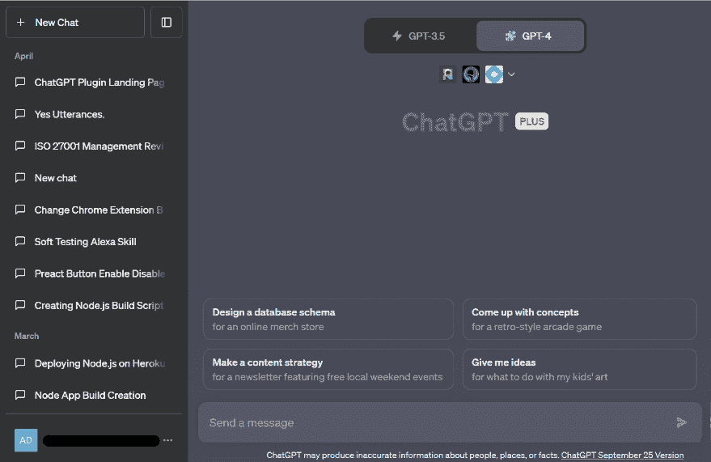
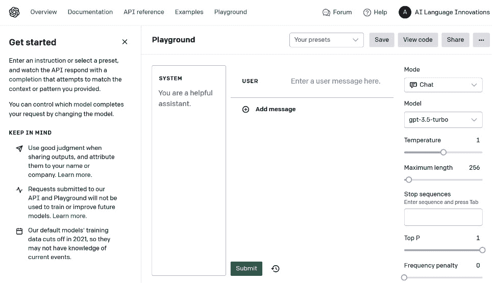
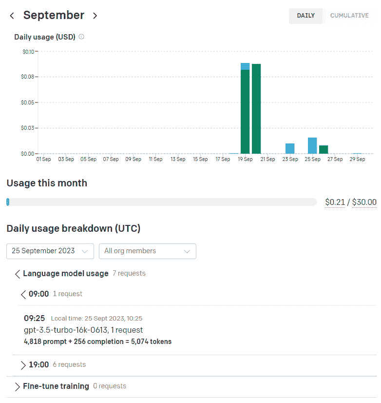

# 3

# ChatGPT 精通 – 解锁其全部潜力

在本章中，我们将深入探讨使用 ChatGPT 的技术方面，以便你能充分利用这项技术，并使用几种不同的技术有效地与 OpenAI 模型互动。我们将详细介绍与 ChatGPT 互动的四种不同方式——即通过网页聊天界面、OpenAI 游乐场、直接使用**应用程序编程接口**（**API**）或使用官方 OpenAI 库之一，所有这些我们都会更详细地探讨。

你将牢固理解 ChatGPT 界面以及免费版和 Plus 版之间的差异，以及自定义指令的力量。接下来，你将了解如何使用 AI 游乐场。最后，我们将介绍如何直接与 API 互动，并探讨 OpenAI 的 Python 和 Node.js 库。

到本章结束时，你将牢固掌握与 ChatGPT 交互的不同方式，并能够就使用哪些技术做出明智的决定。

在本章中，我们将涵盖以下主要主题：

+   掌握 ChatGPT 界面

+   探索 OpenAI 游乐场

+   学习使用 ChatGPT API

# 技术要求

在本章中，我们将广泛使用 ChatGPT，因此你需要注册一个免费账户。如果你还没有创建账户，请访问[`openai.com/`](https://openai.com/)，点击页面右上角的**开始使用**，或访问[`chat.openai.com`](https://chat.openai.com)。

对于入门示例，根据你的编程语言，你需要一个已安装 Python 的环境。

# 掌握 ChatGPT 界面

使用 ChatGPT 界面是大多数用户开始使用 ChatGPT 的方式，也是与这项技术互动的最简单方法。在撰写本文时，你可以在 iOS 和 Android 上使用 ChatGPT，也可以通过网页使用。

## ChatGPT 的免费版和 Plus 版

在撰写本文时，ChatGPT 有免费版和 Plus 版。免费版允许你在一些限制下使用 ChatGPT，而 Plus 版包括一些更强大的功能和访问最新的 GPT-4 模型。

让我们来看看两个版本之间的差异以及它们在设备上的可用性。

+   **免费版 – 基本 ChatGPT 功能**：

    +   **模型**: GPT-3.5

    +   **功能**: 不支持插件

    +   **成本**: 免费

    +   **支持**: 无客户支持

    +   **响应时间**: 相比 Plus 版本，响应时间更低

+   **ChatGPT Plus – 带有** **高级访问权限** 的扩展功能：

    +   **模型**: GPT-3.5 和 GPT-4

    +   **功能**: 访问包括**浏览**、**插件**和**高级** **数据分析**在内的测试版功能

    +   **成本**: 每月 24.00 美元

    +   **支持**: 客户支持

    +   **响应时间**: 相比免费版，响应时间更快，尽管 GPT-4 目前每 3 小时有 50 条消息的上限

### 你应该选择免费版还是 Plus 版？

你是否选择 Plus 版本取决于你的预算以及你是否需要额外的功能。Plus 版本确实提供了更快的响应时间和访问最新 GPT-4 模型的能力，这使得它物有所值。如果你想要完成更复杂的任务，那么 GPT-4 会提供更好的输出，并能处理更复杂的任务。

此外，由于 Plus 版本提供了测试版功能，你可以使用插件，这极大地扩展了 ChatGPT 的功能。

## ChatGPT 界面

在本节中，我们将详细说明您在使用主 ChatGPT 界面时将看到的特性，并使用图像作为参考。尽管大部分内容都是自我解释的，但某些区域需要进一步说明。以下截图显示了当前的 ChatGPT 界面：



图 3.1 – ChatGPT 界面

一旦您登录到您的 OpenAI 账户，您就可以开始使用 ChatGPT ([`chat.openai.com/`](https://chat.openai.com/))界面。让我们熟悉这个 AI 工具的界面。

### 侧边栏

在屏幕的左侧是侧边栏，其中包含以下功能，用于管理对话和您的账户：

+   **新聊天**：这允许您开始新的对话。如果您想要在没有先前讨论的上下文中开始新的对话，请使用此按钮。请记住，ChatGPT 模型会保留对过去对话的记忆，以提供上下文相关的回复。因此，如果您想要改变对话的主题，开始一个新的对话是明智的。

+   **聊天历史**：左侧侧边栏存储了您所有的过去对话，允许您在必要时重新访问它们。您也可以在**设置** | **数据控制**中关闭此功能。

+   **账户选项**：点击侧边栏底部的电子邮件地址或姓名，会弹出一个窗口，提供以下选项的访问权限：

    +   **我的计划**

    +   **自定义指令**

    +   **设置** **和测试版**

如果你没有 ChatGPT Plus，你也可以升级。

### 聊天视图

聊天屏幕是您与 ChatGPT 互动的地方。它设计成模仿一个消息平台，提供了一个用户友好的环境，您可以在此输入您的查询并从 AI 那里获得响应：

+   **从下拉菜单中选择一个模型**：对于 Plus 用户，你可以选择你想要与之交互的 GPT 模型：**GPT 3.5**、**GPT 4**或**插件**。

+   **提示示例**：还有四个按钮可供选择，以及尝试的提示示例

+   **文本输入区域**：在这里，您可以输入您的问题和回复

+   **回复**：当 ChatGPT 对您的查询做出回应时，您可以通过选择**点赞**和**踩**按钮，并将回复复制到剪贴板来提供反馈。

+   **底部栏**：这会告诉您您正在使用 ChatGPT 的哪个发布版本，并包括指向发布说明的链接。这对于检查最新功能以及它们是否在您的地区可用非常有用。

### 自定义指令

直到最近，ChatGPT 的一个问题是需要在每个会话中重复上下文和指令。你不得不将你的提示存储在某个地方，并记住你之前使用过哪些。

**自定义指令**功能解决了这个问题，因为它允许用户通过提供特定的指令来个性化他们与 AI 的互动，AI 将记住所有未来的对话中。

自定义指令是 ChatGPT 的指南，帮助它理解你的偏好和需求，而无需你在提示中包含所有这些内容。你可以提供指令，涵盖你希望 ChatGPT 了解的有关你的信息，以便它能提供更好的回复。

让我们看看这个主题的一个具体例子：为对话 AI 专业人士的指令。

**对话设计师指令示例**

我是一名对话设计师，正在为虚拟助手创建引人入胜且自然的对话。我经常需要帮助构思对话流程、生成自然回复以及理解对话设计的最佳实践。

使用此指令，ChatGPT 将以以下几种方式提供协助：

+   **设计流程**：每当设计师请求帮助创建对话流程时，ChatGPT 可以提供符合行业标准的结构和详细对话序列。

+   **自然回复**：ChatGPT 可以帮助生成自然且引人入胜的回复，这些回复可以用在虚拟助手的脚本中，节省设计师的时间和精力，并在他们想要提供不同变体时提供多样性。

+   **最佳实践**：设计师可以询问对话设计的最佳实践，ChatGPT 将基于最新的行业标准和趋势提供见解。

+   **反馈和审查**：设计师可以要求 ChatGPT 审查他们创建的对话，并获得建设性反馈以提升他们的工作。

+   **资源推荐**：ChatGPT 可以建议书籍、课程和其他资源，帮助设计师进一步拓展他们在对话设计方面的知识和技能。

通过设置自定义指令，对话设计师可以拥有一个了解他们专业需求的个性化助手，并高效地协助他们工作。它本质上成为一个理解对话设计细微差别并提供定制化协助的工具，无需在后续会话中输入这些信息。

#### 如何设置自定义指令

设置**自定义指令**是一个简单的过程，并且对免费用户和 ChatGPT Plus 用户都可用，他们可以在网页上或通过 Android 和 iPhone 应用程序使用它。

简单地点击肉丸菜单（**…**）并选择**自定义指令**选项。您将看到两个文本框：一个用于添加有关自己的详细信息（例如年龄、位置、爱好、行业和职业类型），另一个用于指定 ChatGPT 应遵循的指令（例如回复的语气和长度）。

**提示**

需要注意的是，在使用 API 时不支持自定义指令。相反，这可以通过将自定义指令放入系统提示消息中来实现。

## GPT

GPT 是为特定任务或目的构建的 ChatGPT 的定制版本。您可以通过给出指令、添加额外知识和创建动作来创建自己的 GPT，而无需编码。动作允许您从 ChatGPT 外部获取信息，使您能够调用外部 API 并将返回的数据用于 GPT 的知识库。创建 GPT 界面将引导您完成此过程，使其易于构建自己的 GPT。

将 GPT 视为 ChatGPT 的专业版本，根据您的需求定制。例如，您可以创建一个 GPT 来帮助您学习棋盘游戏规则，教您的孩子数学，或设计贴纸。您甚至可以将这些 GPT 与 GPT 市场中的其他人分享，如果它们受到欢迎，您可能还能赚钱。

ChatGPT 社区正在积极构建和分享用于各种目的的 GPT。 “GPT 商店”使得查找和使用这些创作变得容易。GPT 代表了一种新的定制 ChatGPT 和解锁其在特定应用中潜力的方式。

到目前为止，您已经很好地理解了如何使用 ChatGPT 界面。在下一节中，我们将探讨我们使用 ChatGPT 和其他 GPT 模型的三种方法中的第二种：OpenAI 游乐场。

# 探索 OpenAI 游乐场

OpenAI 游乐场提供了一个免费使用的基于网页的沙盒环境，使用户能够轻松测试和实验 ChatGPT 和 GPT 系列语言模型。该平台还提供了使用这些模型可以执行的有用指南和示例任务。用户可以与各种模型进行交互，并保存他们的游乐场会话，以便他们可以返回或与其他用户分享。

## 入门

在此阶段，我假设您已经创建了一个免费的 OpenAI 账户。一旦登录，您可以通过点击页面顶部的 **游乐场** 链接来访问 OpenAI 游乐场。

以下截图显示了 OpenAI 游乐场的登录页面：



图 3.2 – OpenAI 游乐场

主要文本区域是您可以与模型交互的地方。尝试使用本书早期部分中的一个提示输入一个问题。您还可以加载预设。OpenAI 内置了数十个预制的提示。点击 **您的预设** | **浏览示例** 并从列表中选择一个。查看这些示例是值得的，这样您就可以了解您可以执行的任务类型以及实现它们所需的条件。

## 用户界面功能

OpenAI 游乐场易于理解，但让我们快速看一下核心功能，所有这些功能都提供了几个有用的功能。

### 保存您的预设

你可以通过点击**保存**按钮来保存游乐场的状态。此时，你可以切换是否希望预设对任何拥有链接的人开放。这些预设也将显示在**预设**下拉菜单中，以便以后使用。

### 模式

**模式**设置允许你决定系统如何响应你的提示。最好将其设置为**聊天**，因为其他两个选项现在已弃用。

### AI 模型

你可以通过使用**模型**下拉菜单来选择你希望与之交互的模型。列表包含所有最新的 GPT-3 和 GPT-4 模型，以及一些旧版本。

### 参数

在这里，你可以配置以下新参数，以获得不同结果的提示。当我们在提示工程部分进行详细说明时，我会详细介绍这些内容。

+   **温度**：这可以在 0 到 1 之间设置，决定了 AI 的创造力水平。默认设置为**0.7**，这通常对我的创意任务提供了更好的性能。

+   **最大长度**：这决定了输入提示和结果输出的范围，以“标记”而不是单词或字符来衡量。一个标记大约相当于四个英语字符。

+   **停止序列**：这指示 AI 在指定点停止生成。通常，在对话式 AI 用例设置中，模型在生成一行回复后停止是有用的。

+   **Top P**：此参数通过根据标记与现有提示的相关性进行排名，为生成内容的随机性和创造力提供另一种引导输出的方式。

### 内容过滤器偏好

点击菜单上的三个点可以显示选择游乐场会话内容过滤器偏好的选项。开启此功能，如果发现涉及性主题、仇恨言论、暴力或自残的内容，将会显示警告。

### 历史

点击**历史**按钮可以加载你过去 30 天的使用记录。选择你的任何一次会话，你可以查看会话，并选择恢复此版本，这将覆盖你当前会话。

### 查看代码

对于我来说，游乐场的一个关键特性是能够看到驱动操作和生成输出的底层代码。点击菜单顶部的**查看代码**选项，可以检查你在与所选模型交互时执行的代码。

在顶部选择**库**下拉菜单时，你可以从以下选项中选择，以查看如何与 OpenAI 模型交互的示例：

+   **API**使用 curl 和 JSON 有效载荷

+   **SDKs**使用 Python 和 Node.js

在下一节中，我们将更详细地介绍这些使用 ChatGPT 技术的方案。

## API 和游乐场的定价

OpenAI 的定价基于按需付费模式。在初始注册时，用户将获得一个包含有效期为前 3 个月的增值试用积分；在此期间之后，积分将过期。

信用消费因每个模型而异，这些成本已在 OpenAI 网站上记录。计费指标基于使用的令牌数量，每 1K 个令牌相当于大约 750 个单词，产生费用。

小贴士

当您使用沙盒环境时，您仍然调用的是与直接调用 OpenAI 端点时相同的 API 端点。因此，沙盒环境和 API 调用成本相同。

### 如何跟踪和控制令牌使用

您可以通过以下仪表板查看您的 LLM 使用跟踪：



图 3.3 – OpenAI 使用仪表板

点击页面右上角的用户名以显示主菜单，然后转到**管理账户** | **使用情况**。

您可以查看在当前和过去的计费周期中使用了多少令牌，以及每个请求的令牌细分。您还可以查看其他统计数据，例如您还剩下多少信用可以消费。

为了让您放心，设置使用限制也是一个好主意，这样您可以管理您的支出。您可以通过访问**组织计费** | **使用限制**来实现这一点。在这里，您可以设置硬限制和软限制。

如果您有多个团队成员使用该 API，这一点尤为重要。建议您定期检查使用跟踪仪表板。

# 学习使用 ChatGPT API

对于我们在*第二章*中讨论的许多用途，使用 ChatGPT 网页界面或交互式沙盒环境是有意义的。

然而，OpenAI 提供了一个广泛的 API，允许您使用他们的模型执行多个任务，包括使用代码与 ChatGPT 及其其他模型进行交互。所以，如果您想创建复杂的 ChatGPT 应用程序，并且我希望您是这样的，那么使用 API 是您的最佳选择。

在本节中，我们将更深入地探讨您可以使用来与 ChatGPT API 交互的不同技术。这些技术将在剩余的章节中得到应用。

## 开始使用

您可以通过任何语言的常规 HTTP 请求轻松与 API 交互，通过官方的 Python 或 Node.js 库，或社区维护的库。查看 Playground 并点击代码选项以查看每个库或`curl`请求的示例代码是有用的。或者，您可以查看 API 文档，其中包含各种示例。认证、模型名称、消息和超参数是在与 API 和库进行交互时必须理解的因素。

### 认证

在使用任何可用方式与 OpenAI API 交互之前，你需要使用 API 密钥进行身份验证，该密钥可以在控制台中创建。登录到 OpenAI 仪表板后，点击右上角的用户名。从下拉菜单中选择**查看 API 密钥**。然后，点击**创建新的秘密密钥**并为其命名。确保你记下你的 API 密钥，因为你将无法再次看到它。

### 可用模型

在**可用模型**下，你可以指定要使用哪个模型。在这种情况下，是 GPT-3.5 Turbo，这是 ChatGPT 界面的动力模型，除非你选择了 GPT4。在撰写本文时，以下模型可用于聊天完成：

+   `gpt-4`

+   `gpt-4-0613`

+   `gpt-4-32k`

+   `gpt-4-32k-0613`

+   `gpt-3.5-turbo`

+   `gpt-3.5-turbo-0613`

+   `gpt-3.5-turbo-16k`

+   `gpt-3.5-turbo-16k-0613`

游戏场提供了你可以使用的其他 GPT 模型的名称，尽管你可以参考模型页面以获取更多详细信息：[`platform.openai.com/docs/models`](https://platform.openai.com/docs/models)。

### 消息

消息数组是由角色和内容形成的一系列消息对象。角色可以是以下类型之一：

+   **系统消息**: 系统消息描述了在整个对话期间 AI 助手的行为了例，“*你是一位像电影《好家伙》中的角色一样的 Python 专家程序员。”

+   **用户消息**: 用户消息本质上是你将发送给 API 的提示。在本教程中，我们将涵盖用户消息的示例。

+   **助手消息**: 助手消息是会话中的先前响应。

发送的第一条消息应该是系统消息。随后的消息应在用户和助手之间交替，并包含内容。

小贴士

消息数组是你在 API 集成中持久化对话中过去消息的地方。API 不会神奇地记住对话的上下文。这个机制是 ChatGPT 在底层使用的。

### 超参数

通过微调这些值，你可以显著影响模型输出：

+   `temperature`: 这是模型输出的随机程度

+   `max_tokens`: 生成标记的最大数量

+   `top_p`: 这控制着生成文本的多样性

+   `frequency_penalty`: 这影响基于训练数据中它们的频率出现的标记的可能性

+   `presence_penalty`: 这影响表示“*存在*”的某些实体或概念在生成文本中的可能性

通过微调这些参数，你可以影响模型输出，使其更加确定、有创意或具有上下文意识。

## 直接调用 API

API 端点提供其他功能，例如嵌入和微调模型，以及生成任务。然而，对于本书，我们只关注与与我们的模型聊天相关的功能，即聊天/完成端点。

要直接与 ChatGPT API 交互，您可以发出一个 `POST` 请求到 [`api.openai.com/v1/completions`](https://api.openai.com/v1/completions)。

包含一个带有 API 密钥和其他您想要发送到 API 的参数的认证头：

```py
curl --location 'https://api.openai.com/v1/chat/completions' \--header 'Content-Type: application/json' \--header 'Accept: application/json' \--header 'Authorization: Bearer OPEN_AI_KEY' \
--data '{
  "model": "gpt-3.5-turbo",
  "messages": [{
    "role": "user",
    "content": "Provide 3 names for dog training chatbot"}],
  "temperature": 1,
  "top_p": 1,
  "n": 1,
  "stream": false,
  "max_tokens": 250,
  "presence_penalty": 0,
  "frequency_penalty": 0
}'
```

API 的响应包括生成的文本以及其他元数据，如下所示：

```py
{
  "id": "chatcmpl-84DaAYWLg69y4XUD86YbXgD4iuI5j",
  "object": "chat.completion",
  "created": 1696016214,
  "model": "gpt-3.5-turbo-0613",
  "choices": [{
    "index": 0,
    "message": {
      "role": "assistant",
      "content": "1\. \"Pawsitive PupBot\"\n2\. \"Canine Companion Coach\"\n3\. \"Smart Bark Assistant\""},
   "finish_reason": "stop"}],
  "usage": {
  "prompt_tokens": 17,
  "completion_tokens": 25,
  "total_tokens": 42
  }
}
```

返回的有效负载包括聊天的完成细节，包括响应本身和使用数据。

这种直接的方法提供了对与 OpenAI 模型交互的细粒度控制，这对于理解 API 端点的请求和响应是理想的。

直接使用类似 `curl` 的工具调用 OpenAI API 是直接的，但可能会有些烦人。使用 Postman 这样的 API 工作流程工具来简化调用端点是个好主意。有一个非官方的 Postman 收藏夹，您可以将其分支并使用它来简化流程。

现在我们已经介绍了直接调用 API，在下一节中，我们将探讨如何开始使用 Python 和 Node.js 库。

## 使用 OpenAI Python 库进行设置

设置环境以使用 OpenAI Python 库是一个简单的过程。以下是开始步骤：

1.  首先，使用以下命令安装库：

    ```py
    $ pip install openai
    ```

1.  创建一个 Python 文件，并向其中添加以下代码。导入 OS 和 OpenAI Python 包。然后，从环境变量中加载您的密钥，以便您可以使用它与包一起使用：

    ```py
    import os
    import openai
    openai.api_key = os.getenv("OPENAI_API_KEY")
    ```

1.  要调用 ChatGPT API，您需要调用 `openai.ChatCompletion.create()`。这是您必须调用来与聊天完成端点交互的方法。以下是如何调用此方法的示例。为了使您的代码更具可重用性，将其包装在辅助函数中。它将接受您想要发送的消息和其他传递给 `create()` 函数的参数，并返回 API 的响应：

    ```py
    import os
    import openai
    openai.api_key = os.getenv("OPENAI_API_KEY")
    print(openai.api_key)
    def chat_with_gpt( model, user_message,
        top_p=1,frequency_penalty=0,presence_penalty=0,
        temperature=0
    ):
        try:
            response = openai.ChatCompletion.create(
                model=model,
                messages=[
                    {
                        "role": "system",
                        "content": "You are a helpful conversational 
                            AI expert."
                    },
                    {"role": "user",
                        "content": user_message},
                ],
            top_p=top_p,
            frequency_penalty=frequency_penalty,
            presence_penalty=presence_penalty,
            temperature=temperature)
            return response
        except Exception as e:
            return str(e)
    ```

以下辅助函数允许您轻松自定义与 ChatGPT API 的交互。您可以按如下方式调用该函数并打印响应：

```py
response = chat_with_gpt(
    "gpt-3.5-turbo",
    "Suggest a good name for a customer support chatbot working for a holiday company",
    top_p=0.9,
    frequency_penalty=-0.5,
    presence_penalty=0.6,
    temperature=0.5)
print(response)
```

这使我们能够发送我们想要的任何超参数并更改模型。

### 运行程序

让我们看看如何运行程序：

1.  `YOUR_API_KEY` 使用您的实际 API 密钥）：

    ```py
    export OPENAI_API_KEY='YOUR_API_KEY'
    ```

1.  **执行 Python 脚本**：将代码保存到文件中，例如 chatgpt_interaction.py，然后从您的终端运行脚本：

    ```py
    python chatgpt_interaction.py
    ```

这种设置允许您发送任何消息并调整参数以微调 GPT 模型的行为，并比较不同模型之间的响应。

## 使用 OpenAI Node.js 库进行设置

OpenAI 提供了一个 TypeScript 编写的 Node.js 库，这使得它成为 TypeScript 项目的绝佳选择，因为库包括 TypeScript 定义。让我们开始使用这个库：

1.  首先，使用以下命令安装库：

    ```py
    .env file to store your environment variables (make sure you add this file to .gitignore to avoid committing it to your version control). You can use a package such as dotenv to load these environment variables in your application:

    ```

    import * as dotenv from 'dotenv';

    dotenv.config();

    const mySecret = process.env['OPENAI_API_KEY']

    ```py

    Reference your OpenAI API key stored in an environment variable.
    ```

1.  创建一个辅助函数以获得更大的灵活性也是合理的：

    ```py
    import OpenAI from 'openai';
    const openai = new OpenAI({
        apiKey: mySecret, // defaults to process.env["
            OPENAI_API_KEY"]
    });
    async function chatWithGPT(
        model,
        userMessage,
        topP = 1,
        frequencyPenalty = 0,
        presencePenalty = 0,
        temperature = 0
    ) {
        try {
            const prompt = userMessage;
            const maxTokens = 100;
            const chatResponse = \
                await openai.chat.completions.create({
                model: model,
                messages: [{
                    role: "user",
                    content: prompt
                }],
                temperature: temperature,
                top_p: topP,
                frequency_penalty: frequencyPenalty,
                presence_penalty: presencePenalty,
                max_tokens: maxTokens
            });
            return chatResponse;
        } catch (error) {
            return error.toString();
        }
    }
    ```

1.  辅助函数允许你轻松自定义与 ChatGPT API 的交互。你可以这样调用它：

    ```py
    async function main() {
        try {
            const response = await chatWithGPT("gpt-3.5-turbo",
                "Hello world", 0.9, -0.5, 0.6);
            console.log("ChatGPT Response:", response.data);
        } catch (error) {
            console.error("Error:", error);
        }
    }
    ```

模型、消息和超参数与 Python 库中使用的相同。

### 处理错误

如果库无法与 API 建立连接或收到非成功状态码，例如 4xx 或 5xx 响应，它将抛出一个从`APIError`类派生的异常。

在这种情况下，处理从服务返回的错误很容易，你可以根据需要选择处理这些错误。在我们的辅助函数中，我们正在寻找`APIError`：

```py
if (error instanceof OpenAI.APIError) {
    // Do something with the APIError
    console.log(error.status); // 400
    console.log(error.name); // BadRequestError
    throw error;
} else {
    throw error;
}
```

返回的错误代码如下：

+   `400`: `BadRequestError`

+   `401`: `AuthenticationError`

+   `403`: `PermissionDeniedError`

+   `404`: `NotFoundError`

+   `422`: `UnprocessableEntityError`

+   `429`: `RateLimitError`

+   `>=` `500`: `InternalServerError`

+   `N/A`: `APIConnectionError`

通过理解这些错误代码及其处理方法，你可以使用 OpenAI Python 库创建更健壮且具有错误恢复能力的应用程序。

### 请求和响应结构

该库包含所有请求参数和响应字段的 TypeScript 定义。它们可以按如下方式导入和使用：

```py
const parameters: OpenAI.Chat.ChatCompletionCreateParams = {
    model: model,
    messages: [{
        role: "user",
        content: prompt
    }],
    temperature: temperature,
    top_p: topP,
    frequency_penalty: frequencyPenalty,
    presence_penalty: presencePenalty,
    max_tokens: maxTokens
};
const chatResponse: OpenAI.Chat.ChatCompletion = \ 
    await openai.chat.completions.create(parameters);
```

通过在`OpenAI`库中使用请求参数和响应字段的 TypeScript 定义，你可以确保你的代码是类型安全的，并与 API 预期的结构保持一致。这种方法简化了请求构建和响应解释的过程，并在与 OpenAI API 交互时确保更高效和更健壮的开发体验。

### 重试和超时

API 抛出的以下错误会自动重试两次，默认情况下带有短指数退避：

+   `408`、`409`和`429`

+   `>=500`

你可以使用`maxRetries`选项配置或禁用所有 API 调用，如下所示：

```py
const openai = new OpenAI({
    maxRetries: 0, // default is 2
});
```

或者，你可以为每个调用设置以下参数：

```py
await openai.chat.completions.create({
    messages: [{
        role: 'user',
        content: 'How can I...?'
    }], model: 'gpt-3.5-turbo' }, {
        maxRetries: 5
});
```

类似地，API 超时可以通过`timeout`选项进行配置。默认超时时间为 10 分钟。你可以为所有请求设置默认值：

```py
const openai = new OpenAI({
    timeout: 20 * 1000, // 20 seconds (default is 10 minutes)
});
```

你也可以为每个请求设置超时：

```py
await openai.chat.completions.create({
    messages: [{
        role: 'user',
        content: 'How can I......?' }],
    model: 'gpt-3.5-turbo' },
    {timeout: 5 * 1000,}
);
```

使用哪种语言是个人喜好。也有几个开源库可用。

## 其他 ChatGPT 库

如果你想要使用其他语言与 OpenAI API 交互，有很多选择。开源社区已经为各种编程语言开发了与 OpenAI 服务交互的库。这些库涵盖了多种编程语言，并为使用 OpenAI API 提供了绑定和便捷的方法。

如果你正在使用微软的 Azure，提供了特定的库来与 Azure 上的 OpenAI 服务交互，例如 Java 和.NET 的 Azure OpenAI 客户端库，这些库是 OpenAI REST API 的适配版本。

这些库共同形成了一个丰富的生态系统，开发者可以利用它直接或通过云平台（如 Azure）与 OpenAI 服务和模型交互。

# 摘要

在本章中，我们重点关注了与 ChatGPT 交互的各种方法，每种方法都有其独特的优势，满足不同用户的需求和技术水平。最初，我们探讨了 ChatGPT 界面，区分了免费版和 Plus 版，并突出了后者增强的功能，包括更快的响应时间和访问 GPT-4 模型，这对于更复杂的任务至关重要。我们还介绍了自定义指令这一新颖功能，它通过在会话间保留指定指令，显著优化了用户交互。

接下来，我们转向 OpenAI Playground，探讨了这个沙盒如何成为实验 OpenAI 模型的绝佳平台。它拥有用户友好的界面，允许用户亲手探索模型，保存和分享会话，并查看底层代码，充当点对点操作和更代码驱动方法之间的桥梁。

在最后一节中，我们介绍了您与 OpenAI API 交互的不同方式。

API 是开发者使用 ChatGPT 的主要手段。您通过直接通过 HTTP 使用 API 或使用 OpenAI 的 Python 和 Node.js 库来了解如何这样做。我们解释了进行 API 调用、处理错误以及配置重试和超时的过程，为开发者提供了一本全面的指南。

到目前为止，您可能想知道何时应该使用 API 而不是网页界面或 Playground。对于日常交互以及我们迄今为止查看的许多对话设计任务，使用广受欢迎的聊天界面是有意义的，它能很好地处理您的对话上下文、自定义指令和插件交互。

如果您想开始查看其他模型并了解与 API 交互背后的代码，那么 OpenAI Playground 是一个不错的选择。

然而，如果您想在您的对话式 AI 应用程序、内部服务或数据管道中包含 ChatGPT，或者您只是想对您与模型交互有更多的控制，那么 API 是更合适的选择。通过 OpenAI 的库或您团队选择的语言的社区驱动库利用 API 是一条可行的道路。无论您的选择如何，在这个阶段，您应该对所有这些方法都感到舒适。

到目前为止，您在*第二章*中广泛使用了提示词，学习如何使用 ChatGPT 进行对话设计任务。在下一章中，我们将更深入地探讨提示工程这一新兴领域。

# 进一步阅读

以下链接是一份精选资源列表，可以帮助您使用 ChatGPT：

+   [`platform.openai.com/playground`](https://platform.openai.com/playground)

+   [`beta.openai.com/account/usage`](https://beta.openai.com/account/usage)

+   [`platform.openai.com/docs/models/gpt-4`](https://platform.openai.com/docs/models/gpt-4)

+   [`platform.openai.com/docs/models/gpt-3`](https://platform.openai.com/docs/models/gpt-3)

+   [`community.openai.com`](https://community.openai.com)

+   [`platform.openai.com/docs/models/overview`](https://platform.openai.com/docs/models/overview)

+   [`openai.com/policies/usage-policies`](https://openai.com/policies/usage-policies)

+   [`github.com/openai/openai-cookbook/`](https://github.com/openai/openai-cookbook/)

+   [`platform.openai.com/docs/api-reference/chat/create`](https://platform.openai.com/docs/api-reference/chat/create)

+   [`www.postman.com/devrel/workspace/openai/overview`](https://www.postman.com/devrel/workspace/openai/overview)
