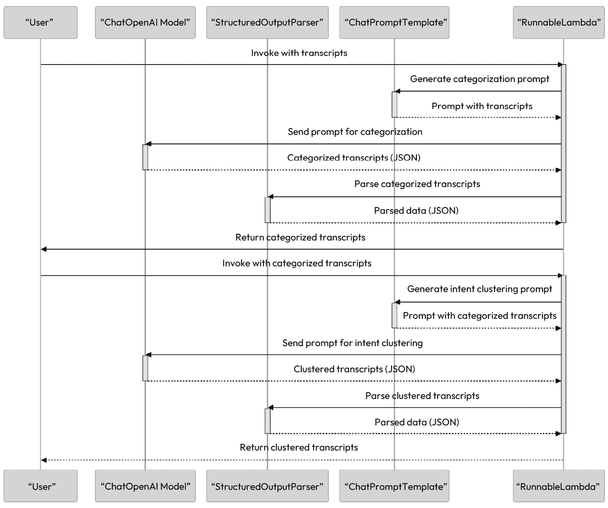
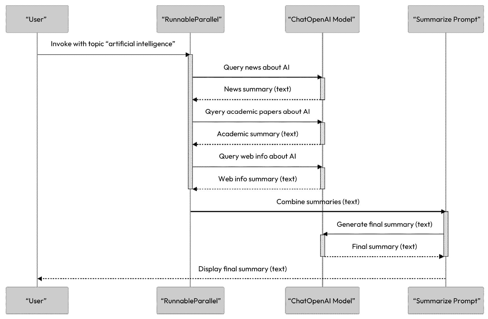

# 5

# LangChain 入门

在本章中，我们将探讨 LangChain 以及这个框架如何使用户能够构建复杂的 LLM 应用。您将了解 LangChain 及其解决的问题，以及 LangChain 的核心组件、LangChain 表达式语言和您可以创建的不同类型的链的介绍。

在其核心，LangChain 是一个开源的开发框架，旨在构建 LLM 应用。到本章结束时，您将具备构建 LangChain 应用和使用下一章中介绍的高级功能和能力的技能。

在本章中，我们将涵盖以下关键领域：

+   LangChain 简介

+   LangChain 的核心组件

+   理解 LangChain 表达式语言

+   创建不同的 LangChain 链

本章旨在为您介绍核心概念，为您掌握 LangChain 打下坚实的基础，使您能够继续学习更复杂的 LangChain 应用。

# 技术要求

在本章中，我们将广泛使用 ChatGPT，因此您需要注册一个免费账户。如果您还没有创建账户，请访问 https://openai.com/，然后在页面右上角点击**开始使用**，或者访问 https://chat.openai.com。

为了执行示例，除非另有说明，否则建议您通过网页或移动应用使用 ChatGPT。

最后一个示例技术需要安装 Python 3.9 和 Jupyter Notebook（https://jupyter.org/try-jupyter/lab/index.html）。

# LangChain 简介

随着我们进一步深入 LLM 应用开发的领域，您会开始注意到这类应用很快就会变得复杂，并需要越来越复杂的提示。一个提示可以包括基本的系统指令、用户输入、主题元数据、用户个性化、之前的交互数据以及其他来自其他系统的信息。因此，一个典型的应用可能需要多次提示 LLM，并解析其输出，从而需要大量的辅助代码。这就是 Harrison Chase 创建的 LangChain 发挥作用的地方，为您的 LLM 应用添加结构，并简化开发过程。

LangChain 的出现是由于在开发蓝图中使用常见抽象的同时，需要构建复杂的 LLM 应用。它是一个拥有强大社区和许多活跃贡献者的开源框架。

LangChain 的诞生是由简化开发流程的愿望驱动的，使开发者与 LLM 合作时不再感到那么困难。实际上，这正是我开始使用 Langchain 的主要原因——作为一种简单的方式来部署一个潜在客户的原型，展示一个能够就客户自己的数据进行聊天的聊天机器人。

LangChain 是一个针对构建由语言模型驱动的应用程序的框架。它通过接口与语言模型和应用特定数据，强调上下文感知和推理。它提供模块化组件和现成的链，以简化使用和定制，便于以结构化的方式组装组件以执行高级任务。该框架还封装了各种模块，如模型 I/O、检索、链、代理、内存和回调，以满足 LLM 应用程序中交互和数据处理的各个方面。

## LangChain 库

LangChain 框架支持两种不同的脚本语言：Python 和 JavaScript（TypeScript）。LangChain 的精髓在于其对组合和模块化的强调，包含众多单个组件。这些组件可以合并使用，也可以独立使用，展示了框架的灵活特性。

两个库都易于使用。虽然 Python LangChain 库更加成熟且功能丰富，但 TypeScript 库较新，但正在开发中，以紧密模仿 Python 版本的特性。两者都旨在易于使用，重点在于简化 LLM 在各种应用程序中的集成和使用。

由于拥有如此强大的社区，两个库中都有大量的贡献者，从文档加载器到代理蓝图，再到内存提供者，以及来自大小技术提供商的集成。

但为了最好地利用 LangChain，从其基础知识开始是很好的。在下一节中，我们将探讨 LangChain 的核心组件。

# LangChain 的核心组件

LangChain 提供了各种模块，可用于创建语言模型应用程序。这些模块可以单独用于简单应用，也可以组合起来创建更复杂的应用。灵活性是这里的关键！

任何 LangChain 链最常见的基本组件如下：

+   **LLM 模型**：LangChain 的核心推理引擎是你的语言模型。LangChain 使得使用多种不同类型的 LLM 变得容易。

+   **提示模板**：这些为 LLM 提供指令，控制其输出。理解如何构建提示和不同的提示策略至关重要，因此我们很高兴在上一章中已经涵盖了这一点。

+   **输出解析器**：这些将 LLM 的原始响应转换为更可用的格式，简化了下游处理。

让我们更详细地看看这些核心组件。

## 在 LangChain 中与 LLMs 一起工作

LangChain 中有两种不同的 LLM 模型，称为 LLMs 和 ChatModels。这些模型用于与不同的 LLM 模型进行接口。LangChain 支持许多不同类型的 LLMs，因此是尝试不同类型 LLMs 和比较结果的强大推动者。

+   **LLMs**：这是一个以字符串作为输入并返回字符串的语言模型

+   **ChatModel**: 这是一个以消息列表为输入并返回消息的语言模型

### LLMs

LangChain 中的 LLM 指的是它们与之交互的纯文本完成模型——例如，GPT-4。这些模型接受简单的字符串输入并输出字符串。

### Chat 模型

相比之下，Chat 模型是针对对话进行调优的。LLM API 使用与纯文本完成模型不同的接口。它们不是接受单个字符串，而是接受一个带有特定角色标签的聊天消息列表：系统、助手和用户。您已经在*第三章*的*学习使用* *ChatGPT API*部分中了解了与聊天消息列表一起工作的概念。ChatGPT 的完成端点期望这种输入。

由于我们专注于使用 ChatGPT 和通过 LangChain 创建对话体验，所以本章的其余部分我们将更多地关注 Chat 模型。如果您对执行生成任务感兴趣，那么使用 LLM 模型可能更适合。

在 LangChain 中，聊天模型支持一个 ChatMessages 列表，它有两个属性：

+   `content`: 消息的内容

+   `role`: `ChatMessage`来源实体的角色

支持的角色如下：

+   `AIMessage`

+   `HumanMessage`

+   `SystemMessage`

+   `FunctionMessage`

您也可以在`ChatMessage`类中手动创建角色。

ChatModel 提供了一个`predict_messages()`方法，通过消息列表与模式进行交互。这看起来可能如下所示：

```py
from langchain.schema import HumanMessage
text = " Im looking to book a direct flight from New York to London departing on December 10th and returning on January 5th. Can you provide me with the available options, including airlines, flight times, and prices?"
messages = [HumanMessage(content=text)]
chat_model.predict_messages(messages)
```

这应该输出以下类似的内容：

```py
AIMessage(content='Certainly! Here are some available options for direct flights....')
```

现在我们来看如何使用 LLM 的提示模板。

## 提示模板

正如我们所见，提示词可以很快变得详细和长。我们也经常希望重用我们的提示词。这就是 LangChain 提示模板能大量帮助的地方。它们作为结构化的蓝图，用于为我们要执行的所有不同任务创建提示词。

提示模板可以组合，LangChain 还提供了常见任务的提示，如问答和摘要。

从本质上讲，我们不必直接用指令操作提示字符串，只需传递特定提示的变量，让 LangChain 处理其余部分。我们还可以使用 LangChain 提示来处理我们的 Chat Model 提示，让我们看一下。

LangChain 中的`PromptTemplate`类充当字符串提示的模具，可以用用户定义的参数填充。

让我们来看一个例子。您正在尝试构建一个应用程序，该应用程序可以分析您的聊天记录，以便您能够了解不同部门之间对话的情感。

我们导入`PromptTemplate`，然后使用`from_template`函数创建模板和相应的变量占位符：

```py
from langchain.prompts import PromptTemplate
prompt_template = PromptTemplate.from_template(
    "Look at the following conversation {conversation} from the following service area {service_area} on {event_date_time} and returna sentiment"
)
conversation = """Customer: My new bike is missing a wheel!\
Chatbot: I'm sorry to hear that. Could I have your order number, please? ….
"""
conversation_analysis = prompt_template.format(
    conversation=conversation,
    service_area="complaints",
    event_date_time="2023-10-19 14:30:00"
)
```

如果您在模板上调用`format`方法并输出`conversation_analysis`，您应该得到以下类似的内容：

```py
"Look at the following conversation Customer: My new bike is missing a wheel!Chatbot: I'm sorry to hear that. Could I have your order number, please?... from the following service area complaints on 2023-10-19 14:30:00 and return a sentiment"
```

注意，您已经完成了一个由模板和传递的变量组成的完整提示。

### 聊天提示模板

`ChatPromptTemplate`与聊天模型一起工作，允许创建对话提示，封装一系列具有指定角色（如`'system'`、`'human'`和`'AI'`）的聊天消息。

让我们来看一个例子。我们正在创建一个健康诊所聊天机器人，以协助处理一般健康相关咨询。我们导入`ChatPromptTemplate`，然后通过调用`from_messages`函数创建模板：

```py
from langchain.prompts import ChatPromptTemplate
chat_template = ChatPromptTemplate.from_messages(
    [
    ("system", "You are a health advisory bot for HealthHub Clinic. You can answer questions from the patient called {name}"),
    ("ai", "Hi, {name} please ask me your question."),
    ("human", "{user_input}"),
    ]
)
```

然后，您可以使用此模板如下；这将创建我们的消息列表，并用我们分配的变量填充：

```py
messages = chat_template.format_messages(name="Lucy",
    user_input="What are the symptoms of the flu?")
```

这些消息现在已正确格式化为以下形式：

```py
[SystemMessage(content='You are a health advisory bot for HealthHub Clinic. You can answer questions from the patient called Lucy'),
AIMessage(content='Hi, Lucy please ask me your question.'),
HumanMessage(content='What are the symptoms of the flu?')]
```

您现在可以使用这些内容在调用您的聊天模型时传递格式化的提示列表：

```py
chat_model= ChatOpenAI()
Chat_model(messages)
```

此外，还有一些现成的提示，例如使用少量示例的提示模板。少量示例模板的主要组成部分是示例，这是一个要传递到提示中的示例列表，以及示例提示本身。提示模板为您提供了许多提示类型的选择；然而，有时您可能想创建自己的提示模板。LangChain 也通过自定义提示模板使这一过程变得简单。让我们在下一节中看看这些内容。

### 自定义模板

LangChain 中的自定义提示模板通过允许用户为超出标准模板范围的任务创建定制提示，提供了灵活性。当任务需要特定的提示格式或特定细节来引导语言模型朝预期方向时，这些自定义模板变得非常有用。让我们来看一个例子：

```py
Consider a scenario where you want to generate responses for a learning productivity assistant in a chat interface. This assistant might need to consider the specific task the user is asking about, the time available, and any particular user preferences or constraints.
Here's an example of what the custom prompt template for this productivity assistant could look like:
from langchain.prompts import StringPromptTemplate
from pydantic import BaseModel, validator
class ProductivityAdvicePromptTemplate(
    StringPromptTemplate, BaseModel
):
    @validator("input_variables")
    def validate_input_variables(cls, v):
        required_vars = {"task", "time_available",
            "user_preferences"}
        if not required_vars.issubset(v):
            raise ValueError(
                f"Input variables must include: {required_vars}")
        return v
    def format(self, **kwargs) -> str:
        prompt = f"""
        As a virtual productivity assistant, provide advice on:
        Task: {kwargs['task']}
        Time Available: {kwargs['time_available']}
        User Preferences: {kwargs['user_preferences']}
        Advice:
        """
        return prompt
```

此模板的示例用法可能如下所示，通过在定义提示时传递输入变量，并使用您所需的变量调用`format`函数：

```py
productivity_advisor = ProductivityAdvicePromptTemplate(
    input_variables=[
        "task", "time_available", "user_preferences"])
# Generate a prompt for the virtual assistant
prompt = productivity_advisor.format(
task="write a research paper",
time_available="2 hours",
user_preferences="focus on quality over quantity")
```

您现在拥有了一个可以重复使用和分享的生产力建议提示模板。

## 使用输出解析器

现在我们已经了解了 LLM 和我们的提示，LangChain 应用的核心组件的最后一个是输出解析器。

通常，一旦我们从我们的 LLM 中提取出响应，我们会对某种格式有特定的要求。我们的示例用例基于我们在*第二章*中执行的一些任务，在名为*创建话语*的部分。我们可以使用我们的 LLM 来创建意图和话语。在这些例子中，尽管看起来是以 JSON 格式响应，但实际上是一个字符串。更有用的情况是将 LLM 的输出字符串解析为 Python 字典。

首先，我们导入所有必需的库，然后通过提供名称和描述来创建我们的`ResponseSchema`。我们可以根据需要创建多个此类方案，以匹配我们的输出变量，然后通过调用`StructuredOutputParser.from_response_schemas`函数来创建输出解析器。

我们可以通过在输出解析器上调用`get_format_instructions()`来创建我们的指令，以便包含在我们的提示模板中。然后，这些指令将用于我们的提示模板。请记住将我们的意图格式指令传递到我们的提示中。让我们在下面的代码示例中看看我们如何做：

```py
intent_schema = ResponseSchema(name="intents",
    description="Format the output as JSON object consisting of a key: intents, the intents key will be a list of objects with the following keys: intent, utterance, category")
response_schemas = [intent_schema]
intent_output_parser = StructuredOutputParser.from_response_schemas(
    response_schemas)
intent_format_instructions = \
    intent_output_parser.get_format_instructions()
print(intent_format_instructions)
intent_template = """ 
Create intents and utterances for a chatbot which will answer questions about a college, \
Create 10 examples of intents for the following categories: facilities and course_information \
ensure that each intent has 10 utterances, create 5 long tail and 5 more common utterances \
{intent_format_instructions}
""" 
prompt_template = ChatPromptTemplate.from_template(intent_template)
messages = prompt_template.format_messages(
    intent_format_instructions=intent_format_instructions)
#messages = prompt_template.format_messages(intent_examples=intents)
chat = ChatOpenAI(temperature=0.0, model="gpt-4")
response = chat(messages)
output_dict = intent_output_parser.parse(response.content)
output_dict.get('intents')
```

一旦我们从 LLM 那里得到响应，我们只需将我们的响应传递到我们的解析函数中，以格式化我们的结果 - `output_dict = intent_output_parser.parse(response.content)` - 现在，它将是一个我们可以像通常一样交互的字典。

在这里使用输出解析器有很多好处，因为它可以管理在提示中使用的大量特定指令，并且可以根据需要解析生成的响应，而无需手动格式化每个响应。输出解析器是 LangChain 应用的核心组件之一。

在下一节中，我们将探讨链的概念以及用于操作它们的语言。

# 理解 LangChain 表达式语言

我们已经涵盖了核心 LangChain 组件。现在，我们将关注一个关键概念，该概念可用于创建和执行这些组件：**LangChain 表达式语言**（**LCEL**）。让我们深入了解 LCEL 是什么，并理解它在 LangChain 框架中的重要性。

## 什么是 LCEL？

链的概念是它们是 LangChain 的关键构建块。链是一系列功能块的集合，在其最简单的形式中，一个链将包括一个提示、对 LLM 的调用以及结果的处理。我们在上一节中看到了这些功能块。在最复杂的情况下，链可以由数百个步骤组成。

LCEL 提供了一个声明性语法和编排框架，它是为了使用户能够以标准化的方式定义和调用功能链，使其尽可能容易运行以及创建自定义链而创建的。

## LCEL 的关键组件

LCEL 提供了许多开箱即用的功能，并基于管道化和模块化，以及一些特定功能和每个组件的可运行协议，每个对象都提供了一个通用接口，因此您可以以相同的方式与每个对象交互。

以下列出了 LCEL 的关键特性：

+   **流支持**：LCEL 通过减少第一个输出产生前的延迟来提高流效率。它从 LLM 流式传输令牌到输出解析器，以便在实时中进行快速、逐步的解析。

+   **异步和同步支持**：使用 LCEL 构建的链可以使用同步（例如，在 Jupyter 笔记本中进行原型设计）和异步（例如，在 LangServe 服务器上）API 进行调用。

+   **优化并行执行**：LCEL 通过按顺序执行并行步骤，如同时从多个来源检索文档以最小化延迟，有效地处理任务。

+   **重试和回退**：为了确保您的应用程序是可靠的，您可以在 LCEL 链的任何部分配置重试和回退。

+   **输入和输出模式**：为了帮助进行输入和输出验证、文档编写和错误处理，LCEL 链包括 Pydantic 和 JSON Schema，这些都可以用于验证。

+   **可观察性**：LCEL 默认记录链中每个步骤的输入和输出以及步骤序列的详细信息，然后可以使用 LangSmith 服务器查看，我们将在后面的章节中介绍。

+   **集成**：对于复杂的链，访问每个步骤的结果对于反馈或调试通常至关重要。LCEL 为 LangSmith 提供了易于集成的功能，用于监控和调试。

## Runnable 协议

LCEL 的 Runnable 协议对于自定义链的创建非常重要。LCEL 采用“Runnable”协议来简化自定义链的开发。

LCEL 中的 Runnable 协议旨在使构建和使用自定义处理链更加容易。简单来说，它就像一套规则或指南，有助于组织这些链的创建和运行。此协议包括用于流式传输数据和批量处理等任务的特定方法，以及它们的高级版本，用于更复杂的操作。本协议的主要目的如下：

+   **标准化**：它创建了一种统一的方式来定义和使用系统的不同部分。这意味着无论您处理的是哪个组件（例如模型或工具），您都使用相同的一组规则来与之交互。

+   **灵活性**：通过采用标准方法，混合和匹配不同组件变得更加容易。您可以将不同的部分插入到链中，它们将协同工作得很好。

+   **清晰性**：它提供了关于每个组件输入和输出的清晰指南。这有助于理解和检查系统的每个部分是如何工作的。

+   **效率**：它简化了构建和修改链的过程，节省时间，并减少了出错的可能性。

因此，本质上，Runnable 协议就像是一种通用语言或蓝图，它有助于在 LCEL 中有效地构建、修改和理解自定义链。

### LCEL 语法

在 LCEL 中，我们使用 **管道操作符**（**|**）而不是 **Chain** 来创建我们的链。

```py
Chain = x | y
```

当 LangChain 遇到两个对象之间的管道操作符时，它会尝试将 `x` 传递给 `y`。

## LCEL 的一个简单示例

为了帮助您看到使用 LCEL 和传统方法之间的差异，让我们比较创建简单链的两种方法。

这两个示例实现了相同的结果：设置一个包含语言模型和默认提示的链。让我们探索每个示例：

1.  按照以下方式使用 `LLMChain` 类。在这种方法中，您明确创建 `LLMChain` 类的一个实例：

    ```py
    llm = ChatOpenAI(()
    second_prompt = ChatPromptTemplate.from_template("tell me a joke"))
    chain = LLMChain(llm=llm, prompt=default_prompt)
    ```

    这涉及到将语言模型（`llm`）和默认提示（`default_prompt`）作为参数传递。

1.  通过使用管道操作符（`|`）将每个步骤连接起来，使用 LCEL 创建链：

    ```py
    chain = llm | default_prompt
    ```

    此方法使用管道操作符（`|`）将语言模型（`llm`）和默认提示（`default_prompt`）链接在一起。管道操作符有效地将一个组件（LLM）的输出“管道”到下一个组件（默认提示处理器）。

### LCEL 的关键差异和优势

这里有一些关键差异和优势需要指出：

+   `LLMChain`实例化可能更易于阅读和理解。虽然管道操作符简洁，但可能需要一些时间来适应。

+   `LLMChain`类，您可以通过子类化或修改类来扩展功能。使用管道操作符，您通过向管道添加更多组件来扩展。

+   **底层机制**：虽然两者都实现了类似的结果，但底层机制可能略有不同。

+   **高级功能**：LCEL 在 Python 和 Typescript 中提供了优化并行执行和通过重试和回退处理错误的支持等好处。LCEL 还提供了在最终链完成之前输出链的各个部分结果的能力，这对于调试和向最终客户端发送更新非常有用——例如，如果您想在长时间执行期间发送聊天界面更新。

小贴士

初始时，LLMChain 接口是标准方法。然而，更现代的方法是 LCEL。LLMChain 仍然有效，但对于新的应用程序开发，建议使用 LCEL 来组合链。

在本章的后续示例和本书的其余部分，我们将尽可能使用 LCEL。在下一节中，我们将深入探讨创建不同类型的 LangChain 链。

# 创建不同的 LangChain 链

在本节中，我们将探讨如何在 LangChain 中创建一些可以创建的各种链。我们的目标是指导您从基本链到更高级链。

我们将从示例开始，介绍简单链的基本概念。这将为我们理解 LangChain 中链的工作原理打下基础。接下来，我们将学习如何创建顺序链、并行链，最后是路由链。

到本节结束时，您将清楚地了解如何创建和利用不同的 LangChain 链，并具备将这些技能应用于您未来 LangChain 项目的技能。让我们深入探讨。

## 基本链示例

在这个基本示例中，我们将展示使用提示和 LLM 组件的最简单链，这构成了许多更复杂实现的基石。在这个例子中，我们正在使用我们的模型将文本翻译成任何语言：

```py
prompt = ChatPromptTemplate.from_template("""
    Translate this text: {text} to {language}
""")
language = "Spanish"
text = "what is the capital of england"
runnable = prompt | ChatOpenAI() | StrOutputParser()
runnable.invoke({"text":text,"language":language})
```

通过查看代码，你可以看到这是一个简单的链。我们从一个模板字符串创建一个`ChatPromptTemplate`实例。模板字符串定义了将呈现给语言模型的提示。提示要求模型将文本翻译成指定的语言：

```py
prompt = ChatPromptTemplate.from_template("""
    Translate this text: {text} to {language}
""")
```

提示模板是一个包含以下占位符的字符串：

+   `{text}`：这个占位符将被要翻译的文本替换

+   `{language}`：这个占位符将被目标语言替换

然后，我们可以创建 `runnable`，这是我们实现 `runnable` 接口并设计成可以串联在一起的组件链，这是 LCEL 的核心概念。这一行代码使用 `|` 运算符创建了 `runnable` 链：

```py
runnable = prompt | ChatOpenAI() | StrOutputParser()
```

`runnable` 是由三个组件组成的链：

+   `prompt`：这个组件将聊天提示模板应用于输入数据

+   `ChatOpenAI`：这是一个将提示文本发送到 `ChatOpenAI` 聊天模型的模型

+   `StrOutputParser`：这个模型将 `ChatOpenAI` 聊天模型的输出解析为字符串，便于轻松集成到各种应用程序中。

很可能你会在实例化 `LLMChain` 类的链中遇到这种情况。这相当于我们在这个例子中的可运行代码：

```py
llm_chain =LLMChain(llm=llm,
    prompt=PromptTemplate.from_template(prompt_template))
```

`LLMChain` 现在是一个过时类，因此最好使用 LCEL。

在下一节中，我们将探讨创建一个简单的顺序链，用于更复杂的特定于对话人工智能的用例。

## 创建一个用于调查对话数据的顺序链

让我们先看看一个简单的顺序链。顺序链依次运行一系列链，当你有预期的输入和输出以执行下游处理时，它工作得很好。

对于这个例子，假设我们有一个名为 GreenRide 的电动汽车订阅公司，它使用实时聊天在其网站上处理客户查询。它有兴趣创建一个聊天机器人来自动化其部分客户对话。它有很多未分类的聊天记录。它希望将这些聊天记录分类到 **常见问题**（**FAQs**）和交易性查询中，以便了解哪些查询是复杂的，哪些是简单的。它对使用基于意图的 **自然语言理解**（**NLU**）平台来处理交易性查询以及使用大型语言模型（LLM）来处理 FAQs 感兴趣。对于交易性查询，它希望根据意图对对话进行聚类，以便它可以更详细地查看每个用例，并查看哪些团队需要参与。

你被分配去查看这些转录数据并执行这些任务。因此，让我们来分解一下：

1.  将每个对话分类，并将其分为两个列表：FAQs 和交易性对话。

1.  看一下交易性对话列表，并根据意图对这些对话进行聚类。

为了实现这一点，我们将使用 LangChain 通过一系列操作处理聊天记录。这些过程在以下图中突出显示：



图 5.1 – 调查对话数据的顺序链过程

你需要两个链来完成分类和聚类。第一个链，使用一个 LLM 和一个提示，将接受会话记录列表并返回两个对话列表。第二个链也将由一个 LLM 和一个提示组成，并将接受交易对话列表并按意图类型进行聚类。

在这个例子中，我们将使用 LCEL 并将一个链的结果传递给另一个链以进行进一步处理：

1.  首先，从`langchain`导入必要的模块，并使用温度`0`初始化我们的`ChatOpenAI`模型，因为这不是一个创意任务：

    ```py
    import json
    from langchain.output_parsers import (
        ResponseSchema, StructuredOutputParser)
    from langchain.prompts import (
        SystemMessagePromptTemplate,
        HumanMessagePromptTemplate, ChatPromptTemplate)
    from langchain.chat_models import ChatOpenAI
    chat_model = ChatOpenAI(
        temperature=0, model="gpt-3.5-turbo-1106")
    ```

1.  会话记录从 JSON 文件中加载，这将是处理的数据源：

    ```py
    with open('transcripts.json', 'r') as file:
        transcripts = json.load(file)
    ```

1.  设置我们的输出模式以将两个对话分类到`transactional_transcripts`和`faq`：

    ```py
    response_schemas = [
        ResponseSchema(name="transactional_transcripts", description="Format the output as JSON list of conversations with the same JSON format as the input,add a category key to each conversation", type="list"),
        ResponseSchema(name="faq", description="Format the output as JSON list of conversations with the same JSON format as the input, add a category key to each conversation ", type="list"),
    ]
    ```

    你会注意到，尽管你为你的两个分类会话记录列表有一个响应模式，但你将只使用一个，即`transactional_transcripts`，来完成这个处理任务。

1.  设置你的提示模板以分类会话记录，包括动态内容的占位符：

    ```py
    transcript_template = "Look at the following chat transcripts {transcripts} and categorize them into FAQ and transactional in the following format {format_instructions}"
    ```

1.  配置一个输出解析器来结构化语言模型的输出，并设置一个`ChatPromptTemplate`用于分类任务：

    ```py
    output_parser = StructuredOutputParser.from_response_schemas(
        response_schemas)
    format_instructions = output_parser.get_format_instructions()
    prompt = ChatPromptTemplate(
        messages=[transactional_categorization_prompt_template],
        input_variables=["transcripts"],
        partial_variables={"format_instructions": 
            format_instructions},
    )
    ```

1.  创建你的交易分类处理链，结合提示、ChatGPT 模型和输出解析器来分类会话记录。这是使用 LangChain 的链机制组成的，其中每个组件都通过管道运算符（`|`）连接：

    ```py
    chain_one = prompt | chat_model | output_parser
    ```

    这是第一个完成的链，所以现在你可以继续创建下一个链。

1.  对于第二个意图聚类阶段，你将创建新的响应模式和一个意图聚类提示模板：

    ```py
    intent_response_schemas = [
        ResponseSchema(name="transactional_intents", description="Format the output as JSON list of conversations, add an intent key to each conversation", type="list"),
    ]
    intent_transcript_template = "Look at the following chat transcripts {transactional_transcripts} Cluster these conversations by intent {intent_format_instructions}"
    ```

1.  首先设置第二个处理链进行意图聚类，通过创建一个新的提示和意图输出解析器。我们可以使用与第一个链相同的聊天模型，尽管根据你的任务，这些可能不同。LangChain 的美丽之处在于所有组件都是可互换的。

    ```py
    intent_clustering_prompt_template = \
        HumanMessagePromptTemplate.from_template(
            intent_transcript_template)
    intent_output_parser = \
        StructuredOutputParser.from_response_schemas(
            intent_response_schemas)
    intent_format_instructions = \
        intent_output_parser.get_format_instructions()
    prompt_two = ChatPromptTemplate(
        messages=[intent_clustering_prompt_template],
        input_variables=["transactional_transcripts"],
        partial_variables={
            "intent_format_instructions": 
                intent_format_instructions},
    )
    ```

1.  代码的最后部分帮助你使用你创建的元素创建第二个链。`chain_one`的会话记录输出被传递进去：

    ```py
    chain2 = (
        {"transactional_transcripts": chain_one}
        | prompt_two
        | chat_model
        | intent_output_parser
    )
    chain_two_result = chain2.invoke({"transcripts": transcripts})
    ```

    输出应该是一个字典，由会话记录列表和意图及类别属性组成。你可以如下访问第一个：

```py
print(chain_two_result.get('transactional_intents')[0])
```

这里还有其他你可以尝试的改进。如果你将要处理大量的会话记录，循环处理数据块可能是个好主意，这样你就不太可能遇到标记问题。

你还可以通过添加另一个链元素进行进一步处理，例如，为意图创建话语或为特定部门分类意图。

使用 LangChain，我们还可以并行运行链。在下一节中，让我们看看一个例子。

## 利用 LangChain 中的并行链进行高效的多源信息收集

可能会有这样的情况，你想要将链作为序列的一部分并行运行。例如，想象一个场景，我们想要同时查询多个信息源。这种能力在用户提出需要从不同类型的内容中获取数据的问题时特别有用，例如新闻文章、科学论文和一般网络信息。以下图概述了并行链中涉及的过程：



图 5.2 – 在序列中使用并行链

以下代码示例说明了如何实现这种方法：

1.  创建我们的模型，然后创建三个我们将要在链中使用单独的提示（`news_chain`、`academic_chain`和`web_info_chain`），每个提示都使用一个模板来查询特定类型的内容（新闻、学术论文和一般网络信息）关于一个给定主题：

    ```py
    model = ChatOpenAI(model="gpt-4-1106-preview")
    news_prompt = ChatPromptTemplate.from_template(
        "summarize recent news articles about {topic}")
    academic_prompt = ChatPromptTemplate.from_template(
        "summarize recent scientific papers about {topic}")
    web_info_prompt = ChatPromptTemplate.from_template(
        "provide a general overview of {topic} from web sources")
    ```

1.  使用`RunnableParallel`类创建我们的可运行并行链，因为它用于并行运行这些链：

    ```py
    parallel = RunnableParallel(
        news = news_prompt | model,
        academic = academic_prompt | model,
        web_info = web_info_prompt | model
    )
    ```

1.  使用主题（例如，“人工智能”）调用并行链，每个链将根据其配置检索相关信息：

    ```py
    results = parallel.invoke({"topic": "artificial intelligence"})
    ```

    这将实现你预期的效果。所有链都并行运行，并以`results['web_info'])`的形式返回它们的结果。

    创建所有三个结果的总结可能更有用，以回答用户的问题。为了实现这一点，你需要运行并行链，然后将其作为序列链的一部分使用。

1.  创建总结提示：

    ```py
    summarise_prompt = ChatPromptTemplate.from_template("""
    summarize the following information from these different sources:
    News source: {news}
    Academic: {academic}
    Web: {web_info}
    Summary:
    """)
    ```

1.  创建我们的`RunnableSequence`并使用`invoke()`调用我们的链：

    ```py
    summarise_chain = parallel | summarise_prompt | model
    summarise_output = summarise_chain.invoke(
        {"topic": "artificial intelligence"})
    ```

总结来说，`RunnableParallel`会输出一个包含每个并行链结果的字典。

我们可以使用我们给并行链提供的键来访问这些结果（例如，新闻、学术和网页信息）。

我们将整个输出字典传递给`RunnableSequence`。

然后，我们的`summarise_prompt`提示可以通过键访问这些结果来填充其模板。因此，这允许将并行过程的输出平滑地传递到序列链中。

让我们继续一个稍微复杂一点的例子，其中我们智能地路由我们的请求到不同的链。

## 路由链以有效回答问题

在创建一个由 LLM（大型语言模型）驱动的应用程序时，你可能需要根据需要提供的问题或信息类型调用不同的链。`RunnableBranch`允许你这样做。

对于这种类型实现的示例，让我们回到我们的汽车订阅公司：GreenRide。我们有一个需要处理的各种查询类型的想法，这些类型可以分为三类：维护、汽车信息和账户。然而，我们需要使用不同的链来回答这些问题。让我们看看这是如何实现的：

1.  首先，我们从`langchain`库导入必要的类，然后初始化我们的模型：

    ```py
    from langchain.chat_models import ChatOpenAI...
    llm = ChatOpenAI(temperature=0, model="gpt-4-1106-preview")
    ```

1.  接下来，我们需要为每个部门创建提示。我们为不同类型的查询（维护、车辆信息和账户）创建模板。每个模板都旨在引导语言模型在特定上下文中回答：

    ```py
    maintenance_template = "You are an expert in car maintenance     {input}"
    maintenance_prompt = PromptTemplate.from_template(
        maintenance_template)
    car_info_template = "You are knowledgeable about various car models    {input}"
    car_info_prompt = PromptTemplate.from_template(
        car_info_template)
    accounts_template = "You are well-versed in account management    {input}"
    accounts_prompt = PromptTemplate.from_template(
        accounts_template)
    ```

1.  我们还需要一个通用的模板：

    ```py
    general_prompt = PromptTemplate.from_template(
        "You are a helpful assistant. Answer the question... {input}"
    )
    ```

    这是一个适用于不符合特定部门查询的回退模板。

1.  接下来，我们使用 `RunnableBranch` 创建分支逻辑：

    ```py
    prompt_branch = RunnableBranch(
        (lambda x: x["topic"] == "maintenance", maintenance_prompt),
        general_prompt,
    )
    ```

    这一部分定义了基于主题决定使用哪个模板的逻辑。它检查输入的主题并将其与相应的模板匹配。

1.  然后，我们需要创建主题分类器和分类器链：

    ```py
    class TopicClassifier(BaseModel):
        topic: Literal["maintenance", "car_info", "accounts", 
            "general"]
    ```

    `TopicClassifier` 类定义了一个 Pydantic 数据模型，它表示主题分类过程的输出。它有一个字段，`topic`，它是一个枚举值，表示用户问题的分类主题。

1.  接下来，我们使用 `convert_pydantic_to_openai_function` 函数将 `TopicClassifier` Pydantic 模型转换为可以与 `ChatOpenAI` API 一起使用的 OpenAI 函数：

    ```py
    classifier_function = \
        convert_pydantic_to_openai_function(TopicClassifier)
    parser = PydanticAttrOutputFunctionsParser(
        pydantic_schema=TopicClassifier, attr_name="topic"
    )
    ```

1.  然后，我们使用 `bind` 方法将转换后的 `TopicClassifier` 函数添加到 `ChatOpenAI` 对象中。这有效地使主题分类函数在 `ChatOpenAI` 上下文中作为一个可调用的函数可用。`PydanticAttrOutputFunctionsParser` 类用于解析主题分类函数的输出，它是一个 JSON 对象。`pydantic_schema` 参数指定用于解析 JSON 对象的 Pydantic 模型，在这种情况下是 `TopicClassifier` 模型。`attr_name` 参数指定从 Pydantic 模型中提取分类主题的属性，即主题属性。

OpenAI 函数

我们在这里使用 OpenAI 函数调用以确保我们接收正确的 JSON 格式和模式。值得注意的是，使用 OpenAI 模型的最新版本（`gpt-4-1106-preview` 或 `gpt-3.5-turbo-1106`），可以将 `response_format` 设置为 `{ "type": "json_object" }` 以启用 JSON 模式。当启用 JSON 模式时，模型将仅生成可以解析为有效 JSON 对象的字符串。然而，这并不保证正确的模式。

1.  然后，我们将这些整合到我们的链中：

    ```py
     classifier_chain = llm | parser
    ```

    当使用用户问题调用 `classifier_chain` 时，问题首先被传递到 `ChatOpenAI` 函数进行主题分类。然后，主题分类函数的输出被 Pydantic 属性输出函数解析器解析，并返回提取的分类主题，使我们能够定义要调用的模板。

1.  最后，我们创建我们的主链管道，将所有这些整合在一起：

    ```py
    final_chain = (
        RunnablePassthrough.assign(topic=itemgetter("input") 
        | classifier_chain)
        | prompt_branch
        | ChatOpenAI()
        | StrOutputParser()
    )
    ```

    最终链首先对输入进行分类，然后选择适当的模板，使用语言模型处理输入，并解析输出。最后，调用我们的链变得很容易：

    ```py
    final_chain.invoke( {"input": "How do I update my payment method for my car subscription?"})
    ```

现在，你应该有一个可以工作的示例，它设置了一个能够智能地将客户支持查询路由到特定部门（如维护、车辆信息和账户）的聊天机器人。

目前，我们正在考虑不同的提示。我们可以扩展 `RunnableBranch` 以将输入路由到不同的提示，甚至完全不同的链。这允许根据输入的主题或其他标准进行更复杂和专业的处理。

假设除了处理维护、车辆信息和账户查询外，你还想将一些查询路由到不同的链进行特殊处理。例如，你可能有一个处理信用控制查询（如支付）的链，这需要访问支付服务和用户历史记录，因此链更加复杂。这只是创建链并在 `RunnableBranch` 配置中的分支逻辑中添加的一个简单案例：

```py
credit_control_template = PromptTemplate.from_template(
    "You are a credit control assistant. Provide immediate and useful credit control advice for GreenRide customers and allow them to pay their bills .\n\n{input}"
)
credit_control_chain = llm | access_stripe_details credit_control_template
prompt_branch = RunnableBranch(
    (lambda x: x["topic"] == "credit_control", credit_control_chain),
    general_prompt,
)
```

这是一个相当简单的链和理论示例，它使用文档加载组件来查找用户支付账户详情。这介绍了 LangChain 中可用的许多不同模块之一，我们将在下一章中探讨。

# 摘要

在本章中，我们首次了解了 LangChain，你应该对其是什么、解决的问题以及它在简化复杂 LLM 应用程序开发中的作用有良好的理解。

我们已经探讨了 LangChain 的核心组件，例如 LLM 模型、提示模板和输出解析器。你应该对 LCEL 有良好的理解，包括其关键特性和在 LangChain 框架中创建和执行链的作用。最后，本章还涵盖了 LangChain 链的多种示例，从基本到复杂，以展示所讨论概念的实际应用。

在本章中，我们只是对 Langchain 进行了初步探讨，但希望我们已经为你建立了一个坚实的基础，以便构建 LangChain 应用程序，并使你能够继续学习 LangChain 库的更复杂概念和应用。在下一章中，我们将探讨其他概念，如内存以及代理、模块和其他工具，特别是 LangSmith。

# 进一步阅读

以下链接是经过精选的资源列表，可以帮助你了解本章讨论的主题：

+   [`www.chatsplitter.com/`](https://www.chatsplitter.com/)

+   [`jupyter.org/`](https://jupyter.org/)

+   [`docs.pydantic.dev/latest/`](https://docs.pydantic.dev/latest/)

+   [`platform.openai.com/docs/guides/text-generation/function-calling`](https://platform.openai.com/docs/guides/text-generation/function-calling)

+   [`python.langchain.com/docs/get_started/introduction`](https://python.langchain.com/docs/get_started/introduction)

+   [`js.langchain.com/docs/get_started/introduction`](https://js.langchain.com/docs/get_started/introduction)
