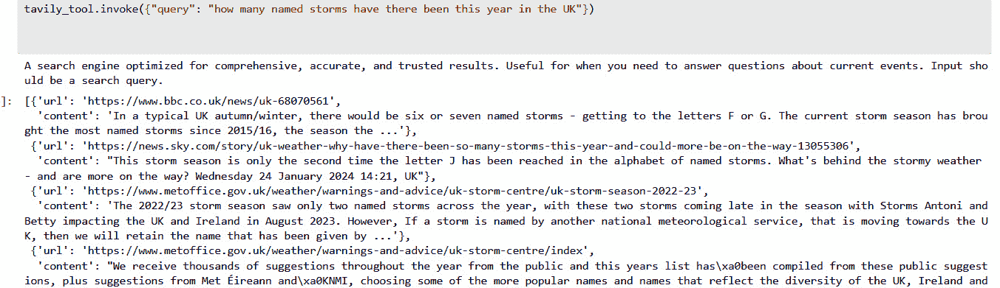
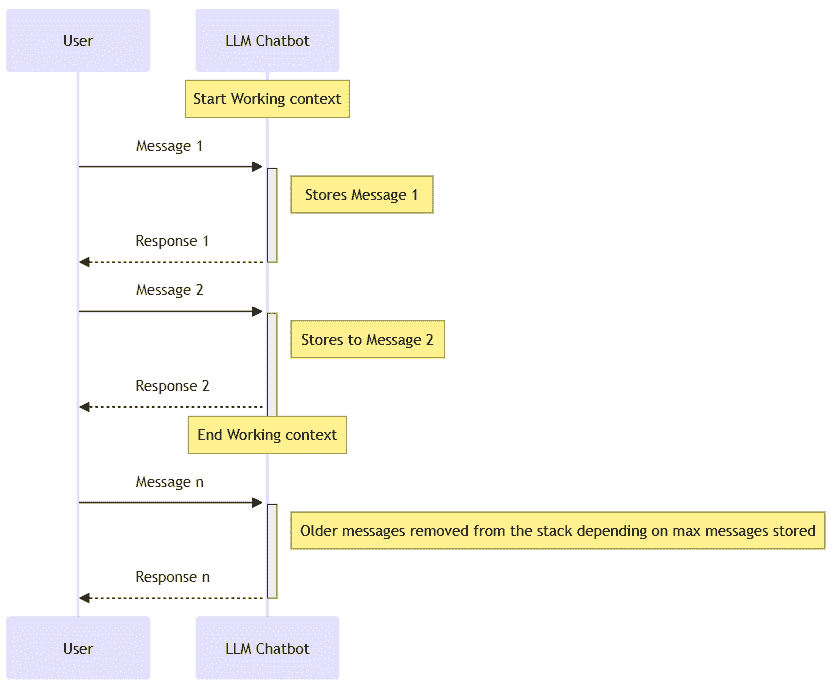
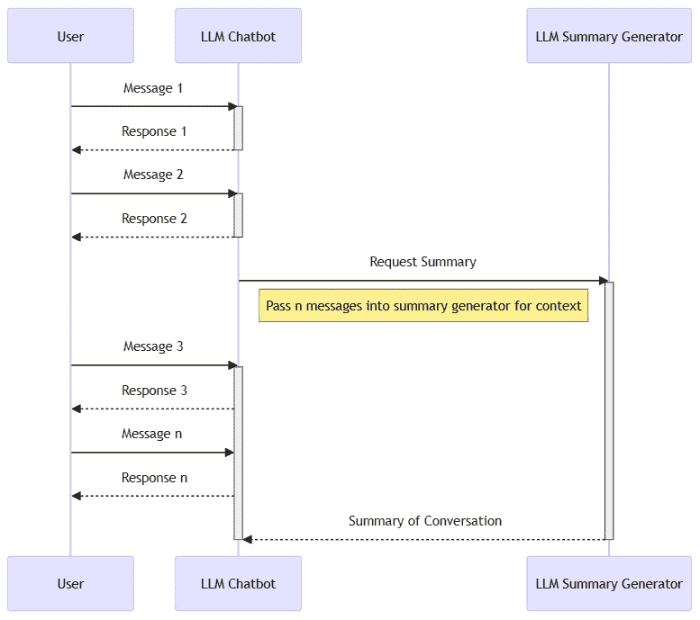
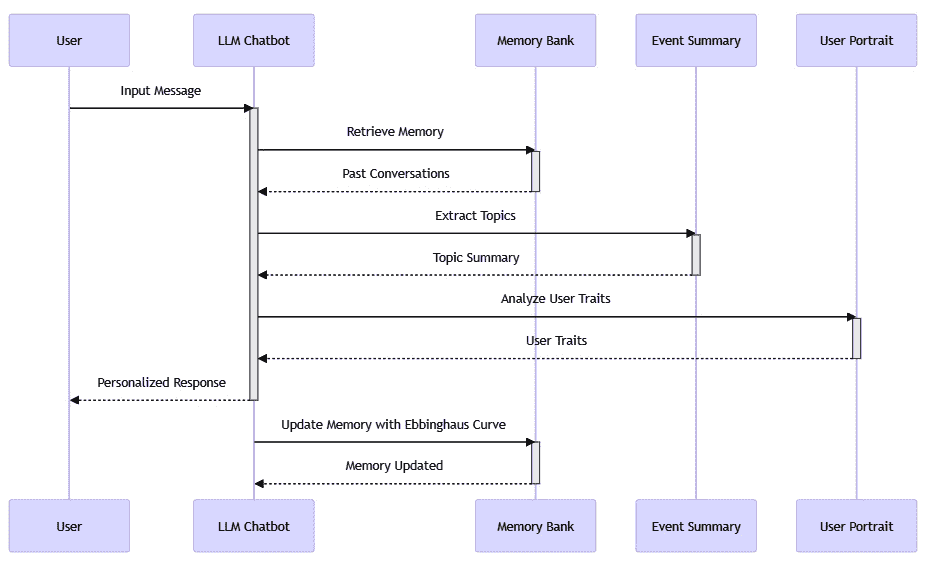

# 6

# 使用 LangChain 进行高级调试、监控和检索

在本章中，我们将探讨一些更高级的 LangChain 主题及其应用。你将了解一些重要过程，例如调试 LangChain 和使用新的 LangSmith 平台。你将了解代理和工具的力量，并了解它们如何被用来赋予你的代理超级能力。你将查看现成的工具，并为代理创建一个自定义工具。然后，你将了解在创建由**大型语言模型**（**LLM**）驱动的对话体验的背景下内存，并了解如何使用 LangChain 实现这一点。

本章旨在在前一章的基础上，通过探讨更高级的概念，使你能够创建更复杂的 LangChain 应用程序。

在本章中，我们将涵盖以下主题：

+   调试和监控 LangChain

+   利用 LangChain 代理

+   探索 LangChain 内存

# 技术要求

在本章中，我们将广泛使用 ChatGPT，因此你需要注册一个免费账户。如果你还没有创建账户，请访问[`openai.com/`](https://openai.com/)，点击页面右上角的**开始使用**，或访问[`chat.openai.com`](https://chat.openai.com)。

这些示例需要 Python 3.9 和 Jupyter Notebook，你都可以从[`jupyter.org/install`](https://jupyter.org/install)下载。Jupyter Notebook 也包含在 Anaconda 中。你可以在这本书的 GitHub 仓库中找到本章的代码：[`github.com/PacktPublishing/ChatGPT-for-Conversational-AI-and-Chatbots/chapter6`](https://github.com/PacktPublishing/ChatGPT-for-Conversational-AI-and-Chatbots/chapter6)。

# 调试和监控 LangChain

到目前为止，你可能已经意识到，即使是在简单的链中，LangChain 内部仍然有很多事情在进行。通常，当你从不同的来源构建你的提示时，你需要查看你的语言模型的输入和输出，以便理解和迭代它们。

因此，了解你应用程序内部发生的事情非常重要，这样你才能构建、监控和调试你的应用程序。LangChain 提供了几种不同的方式来实现这一点。

让我们探索这些选项，以更清楚地了解它们如何增强你应用程序的功能。我们将从最简单的选项开始，逐步过渡到最全面的选项：LangSmith。

## 理解跟踪技术

LangChain 提供了一些简单的方法来输出链的不同步骤。

如果你正在使用 Jupyter Notebook 或简单地运行 Python 脚本来使用本书中提供的示例，你有几种方法可以提供跟踪输出：

+   将`verbose`设置为`True`创建一个全局设置，并将以最高级别输出链的步骤，这样我们就可以看到正在发生的不同 LLM 调用。你可以这样设置：

    ```py
    from langchain.globals import set_verbose
    set_verbose(True)
    ```

+   将`debug`设置为`True`创建一个全局设置，输出所有具有回调支持的组件（链、代理、模型、工具和检索器）生成的输入和输出，并给出最全面的信息：

    ```py
    from langchain.globals import set_debug
    set_debug()
    ```

+   **详细日志**：您可能还希望在特定链上激活详细日志，因为如果您正在处理多个链，全局输出可能会太多。如果您使用链对象，则可以按以下方式实现：

    ```py
    conversation_with_summary = ConversationChain(
        llm=llm,
        verbose=True,
    )
    ```

+   将`verbose`设置为`True`后，您需要使用回调。在以下代码示例中，我们在调用`chain`上的`invoke`时传递了包含`ConsoleCallbackHandler`的配置：

    ```py
    from langchain.callbacks.tracers import ConsoleCallbackHandler
    from langchain.schema.runnable import RunnableLambda
    def fun_1(x: int) -> int:
        return x + 1
    def fun_2(x: int) -> int:
        return x * 2
    runnable = RunnableLambda(fun_1) | RunnableLambda(fun_2)
    runnable.invoke(1, config={'callbacks': 
        [ConsoleCallbackHandler()]})
    ```

    上述代码创建了一个可运行对象的链，然后调用它。我们使用`|`运算符来连接两个可运行对象。这意味着`fun_1`的输出将被作为`fun_2`的输入。在这里，`runnable.invoke(1, config={'callbacks': [ConsoleCallbackHandler()]})`从输入 1 开始调用链。配置指定使用`ConsoleCallbackHandler`。

    输出将显示链运行过程中的每个步骤。部分输出如下所示：

    ```py
    [chain/start] [1:chain:RunnableSequence] Entering Chain run with input:
    {
      "input": 1
    }
    [chain/start] [1:chain:RunnableSequence > 2:chain:fun_1] Entering Chain run with input:
    {
      "input": 1
    }
    ```

如果您仍在使用笔记本或 Python 脚本进行开发，这些技术是很好的。然而，如果您想持久化日志，则需要更细粒度的信息和直观的界面，或者您想将应用程序投入生产，那么可能是时候考虑使用 LangSmith 了。我们将在下一节中介绍这一点。

## 介绍 LangSmith

LangSmith 目前是一个处于测试阶段的早期产品。除了是早期发布之外，它还是处理 LangChain 的新工具，您可能会经常使用它。它简化了调试、测试、监控和评估您的 LangChain 项目。本节将简要介绍 LangSmith，因此鼓励您查看文档，因为它正在不断更新。

### 设置 LangSmith

开始使用 LangSmith 涉及几个简单的步骤：

1.  首先，您需要创建一个 LangSmith 账户并生成一个 API 密钥。

    1.  访问 LangChain 网站[smith.langchain.com](http://smith.langchain.com)。按照网站上的说明注册并创建一个新账户。

    1.  账户创建后，使用新凭据登录 LangSmith 控制台。

    1.  登录后，导航到 LangSmith 控制台中的**设置**页面。在这里，找到创建 API 密钥并生成一个的选项。

1.  接下来，您需要配置您的开发环境，以便它们可以与 LangSmith 集成。这只是一个设置以下变量的简单问题：

    ```py
    os.environ['LANGCHAIN_TRACING_V2'] = "true"
    os.environ['LANGCHAIN_ENDPOINT'] = "https://api.smith.langchain.com"
    os.environ['LANGCHAIN_API_KEY'] = "Your Langchain API key"
    ```

一旦您设置了这些，每次运行都意味着相应的跟踪将被记录到您的默认项目中。**运行**代表应用程序中的单个工作单元。

通过设置以下命令可以轻松地针对特定项目：

```py
os.environ[' LANGCHAIN_PROJECT'] = "Your project name"
```

然后，您可以查看每个运行情况，并深入了解每个步骤的具体情况，以确切了解每个步骤中发生了什么。

# 利用 LangChain 代理

LLM 非常强大，但它们也有一些基本缺陷。我们已经广泛讨论了它们的局限性；记住，它们的知识只到 2021 年底 ChatGPT 训练数据截止时为止。令人惊讶的是，这种先进的技术在其他计算任务上也不太擅长，例如基本的数学、逻辑，甚至查找它们不知道的其他信息的能力。

为了弥补这些缺点，我们需要另一种技术或方法来帮助我们的 LLM 在需要帮助的地方。这些解决方案被称为 **代理**，在本节中，我们将探讨它们是什么，如何工作，以及如何使用 LangChain 来使用它们。

## 什么是代理？

代理为 LLM 提供工具，以便它们能够执行自己无法有效执行的任务。有几种不同类型的代理，旨在与不同的模型（如 OpenAI LLM）一起工作，并提供对不同的任务和用例的支持，例如 XML 或 JSON 处理。

每种类型都有特定的用例，因此查看每个代理的 LangChain 信息是值得的，这样你可以决定哪个最适合你的用例。

要创建一个代理，我们需要考虑三个不同的组件：

+   LLM

+   执行任务的工具

+   控制任务的代理

LLM 将处理理解和生成响应，专用工具将执行特定任务，而代理将协调这些任务。

## 什么是 LangChain 工具？

LangChain 工具允许代理通过与其他系统交互来执行其定义的任务。一个工具由一个工具模式组成，其中包含有关工具期望的输入信息，以及一个用于执行任务的函数。LangChain 提供了许多内置工具，并允许你创建自定义工具，你可能会在某个时候想要这样做。除了单个工具之外，LangChain 还提供了工具包的概念，你可以使用这些工具包来执行特定任务。

让我们看看构成工具的要素：

+   一个名称和描述来记录其预期用途

+   一个 JSON 模式来定义输入参数

+   一个运行函数，它将带有输入被调用

+   一个 `return_direct` 标志，指示输出是否应发送给用户

重要的是尽可能包含这些信息，并保持工具简单，以便 LLM 能够轻松使用。名称、描述和模式都将用于向 LLM 的提示中，以便它知道要采取什么行动。这些需要清晰简洁。

## OpenAI 工具调用的介绍

在我们深入研究下一个示例之前，了解 OpenAI 函数/工具非常重要，这样我们才能理解它们为什么存在以及如何使用它们。只是为了混淆，这些曾经被称为 **函数**，但现在它们被称为 **工具**，这更有意义。

在函数调用发布之前，你会向 ChatGPT 提出一个像“*伦敦的最新新闻是什么？*”这样的问题，而且你不会得到一个有用的回答。正如我们所知，它不擅长返回最新信息，因为它没有连接到互联网，无法拉取或抓取数据。

我们可以编写一些代码去调用新闻服务，但我们需要传递位置和其他任何参数，然后回到我们的对话中。这并不容易做到，尤其是如果我们想使用对话中的参数来调用我们的服务。

函数调用是由 ChatGPT Turbo 和 GPT4 模型创建并支持的，以克服这些问题，并通过轻松调用外部 API 和提取结构化数据来提供轻松回答问题的简单方法。这些模型被训练来查看函数，并智能地决定何时调用它们。实现函数的基本过程如下：

1.  使用用户查询和预定义的函数来触发模型。模型可能会调用函数，生成一个包含可能假设参数的 JSON 对象。

1.  在你的代码中解码 JSON 并使用任何给定的参数执行函数。

1.  将函数的响应输入回模型，以便它可以对用户进行总结。

让我们看看一个简单的例子。

### 查看一个简单的 OpenAI 工具示例

我们通过聊天完成调用中的 `tools` 参数将我们的函数定义传递给聊天完成，该参数接受一个表示为标准 **JSON** 格式的工具数组。以下是一个定义，ChatGPT 希望考虑并调用以获取特定主题的最新新闻文章：

```py
  tools = [{
      "type": "function",
      "function": {
        "name": "get_news_articles",
        "description": "Retrieve news articles based on a specific topic and date range",
        "parameters": {
          "type": "object",
          "properties": {
            "topic": {
              "type": "string",
              "description": "The topic or subject of interest for the news articles"
            },
          "required": ["topic"]
        }
      }
    }
  ]
```

我们提供工具的名称，这将强制模型调用我们的函数，并尽可能提供详细的描述。记住，这个描述将在提示的上下文中使用，所以越准确、越详细越好。当涉及到工具时，尽量描述你的函数将要做什么，因为这是模型被训练的方式。然后，我们添加将要发送给函数的参数描述。在我们的例子中，我们传递一个 `topic` 字符串。

现在，当我们尝试通过询问我们的 ChatGPT 模型关于伦敦的最新新闻来进行聊天完成时，模型将知道使用我们在工具定义中定义的特定参数来调用我们的函数。如果我们定义了更多的参数在我们的工具中，ChatGPT 会询问澄清问题，直到它获得所需的所有信息。

工具如下传递到我们的完成调用中：

```py
response = client.chat.completions.create(
        model="gpt-3.5-turbo-0125",
        messages=messages,
        tools=tools,
        tool_choice="auto",
    )
```

注意，我们已经将 `tool_choice` 设置为 `auto`，这告诉 ChatGPT 决定是否使用工具。

这应该输出类似以下内容，显示没有指定内容的 `ChatCompletionMessage`。然而，在我们的工具调用中应该有 `ChatCompletionMessageToolCall`，用于我们的函数。我们还有 `topic` 参数和我们的函数名称：

```py
ChatCompletionMessage(content=None, role='assistant', 
    function_call=None, 
    tool_calls=[
        ChatCompletionMessageToolCall(
            id='call_ewHp8R8GUAHY6Dy4UXdEej3B',
            function=Function(
                arguments='{"topic":"London"}', 
                name='get_news_articles'), 
            type='function')])
```

在这里，我们可以看到 ChatGPT 决定调用我们的函数；如果它决定不这样做，我们可以进行一些测试。如果我们把问题改为“*解释量子物理*”，那么我们应该得到包含回答问题的内容的 `ChatCompletionMessage`：

```py
ChatCompletionMessage(content="Chess is a classic strategy board game played ....
```

如我们所见，ChatGPT 决定使用哪些工具来满足这个问题，并将这些工具列在我们的 `tool_calls` 列表中。如果我们循环遍历这个列表，并且 ChatGPT 从我们的问题中提取了这些参数，我们可以调用每个函数。之后，我们可以将结果添加到我们的消息列表中，并让 ChatGPT 为用户总结结果。

不要忘记，你还可以在我们的聊天完成调用中设置 `tool_choice={"type": "function", "function": {"name": " another_response_function"}}`，以强制 ChatGPT 使用特定的函数，而不是让它自己决定。

函数/工具的另一个强大应用是让 ChatGPT 创建确定性、完美形成的数据变得容易。在*第二章*中，我们是在提示用户话语或数据集为 JSON。现在，我们可以通过创建一个函数定义来为我们完成这项工作，从而使用工具来创建完美的输出。我建议你查看*第二章*中的一些训练数据创建任务，并创建一个工具来实现相同的结果。

OpenAI 函数目前正在进行许多工作，但这至少应该能让你对使用它们的益处和涉及步骤有足够的了解。现在，让我们来看看 LangChain 工具，看看 LangChain 如何简化 OpenAI 函数的使用。

## 插件式 LangChain 工具，立即集成

LangChain 提供了许多现成的工具，这使得为你的代理提供工具变得容易。你可以在文档中找到这些工具的列表，网址为 [`python.langchain.com/docs/integrations/tools/`](https://python.langchain.com/docs/integrations/tools/)，这些工具由供应商和社区成员创建和维护。它们涵盖了从搜索引擎到与文件系统交互以及与像 Google Drive 这样的大型云服务供应商交互的广泛功能。

## 一个现成的工具示例

让我们来看看我最喜欢的工具之一：Tavily 搜索 API。Tavily 搜索是一个针对 LLM 优化的搜索引擎，以提供最佳搜索结果。因此，它是一个很好的 LLM 工具示例，你可能会用到。在查看如何创建这个工具的同时，了解其细节也很有用，这样我们就可以了解构成有效工具的组件。首先，我们需要安装所需的库：

```py
pip install -U langchain-community tavily-python
```

接下来，导入库并创建我们需要的 API 密钥：

```py
os.environ['OPENAI_API_KEY'] = OPENAI_KEY
os.environ["LANGCHAIN_API_KEY"] = "TAVILY_API_KEY "
```

现在，我们可以通过创建 `TavilySearchAPIWrapper` 类的实例来创建工具，该类作为 Tavily 搜索 API 的包装器。我们可以将此实例传递给我们的 `TavilySearchResults` 类：

```py
tavily_search = TavilySearchAPIWrapper()
tavily_tool = TavilySearchResults(api_wrapper=tavily_search)
```

你可以通过 `print(tavily_tool.name), print(tavily_tool.description), print(tavily_tool.args)` 打印出工具的不同属性，最重要的是通过调用 `invoke()` 来执行搜索：

```py
tavily_tool.invoke({"query": "how many named storms have there been this year in the UK"})
```

当你运行这个程序时，你应该得到一个包含搜索最新信息的响应。你应该看到以下类似的输出：



图 6.1 – Tavily 搜索输出

在下一节中，我们将探讨如何使用代理和工具。

## 使用代理和我们的工具

到目前为止，我们已经创建了一个工具，但还没有使用它。为了做到这一点，我们需要创建一个代理。在我们的示例中，我们使用的是 OpenAI Functions 代理。我们在上一节中介绍了 OpenAI 函数；在本节中，我们将看到使用 LangChain 实现这一点是多么简单。代理可以通过 `create_openai_functions_agent()` 函数创建，该函数接受三个参数：

+   `llm`：支持 OpenAI 函数调用 API 的语言模型

+   `tools`：代理可以使用的工具列表

+   `prompt`：代理将使用的提示

我们传递这三个参数来创建我们的代理：

```py
open_ai_agent = create_openai_functions_agent(llm, tools,prompt)
```

现在我们有了这个代理，我们需要创建一个 `AgentExecuter` 类来运行它：

```py
open_ai_agent_executor = AgentExecutor(agent=agent, tools=tools)
```

然后，我们应该能够调用 `invoke()` 函数并返回包含最新信息的一些结果：

```py
result = open_ai_agent_executor.invoke({"input": "how many named storms have there been in 2024 in the UK"})
```

如果你打印出结果，你应该得到一个包含最新信息的答案，显示我们的代理和工具正在正确工作。请记住查看 Langsmith 中的日志，以便你可以了解那里发生了什么。

你可以通过使用 LangChain 生态系统提供的工具包来进一步使用 LangChain 的即插即用工具。这些工具包提供了专为特定任务设计的工具集合。

现在我们已经查看了一个预构建的工具箱并介绍了代理，你可以看到 LangChain 代理是多么强大。我们鼓励你查看 [`python.langchain.com/docs/integrations/tools/`](https://python.langchain.com/docs/integrations/tools/) 上的其他工具和代理类型。

你可能需要一种不同类型的工具来满足特定的需求。好消息是创建自定义工具也很容易。让我们深入探讨一个具体的例子，以便你了解涉及的步骤。

## 创建自定义天气工具

对于我们的示例，我们将创建一个自定义工具，使用 Open-Meteo（免费天气 API Meto）获取位置的当前天气。

我们的工具将接受两个参数，`latitude` 和 `longitude`，这样我们就可以查找特定位置的天气。这两个参数都是必需的。

首先要考虑的是，我们需要一个支持多个输入的代理类型。所以，我们选择 `StructuredChatAgent`。让我们直接进入代码：

1.  首先，导入必要的模块。该脚本导入了各种 Python 模块，包括用于制作 HTTP 请求、处理数据和特定 LangChain 组件（用于工具和代理创建）的模块：

    ```py
    import os
    from langchain.tools import BaseTool
    from typing import Union
    from langchain.agents import (AgentExecutor, 
        create_structured_chat_agent)
    from langchain import hub
    from langchain_openai import ChatOpenAI
    ```

1.  设置 OpenAI 和 LangChain API 所需的环境变量，你的 LangSmith 密钥用于日志记录，以及其他配置细节。

1.  LangChain 工具只是我们从代理中调用的函数。要创建一个工具，我们必须遵循相同的基本模式。这涉及到从 `BaseTool` 继承，实现 `run()` 方法，并在创建代理时传递我们工具的实例。自定义工具类 `GetWeatherByLocationTool` 扩展了 `BaseTool` 类，为其提供了基于纬度和经度获取天气信息的具体功能。我们还必须提供一个名称和描述，以便我们的 LLM 了解如何以及何时使用该工具：

    ```py
    class GetWeatherByLocationTool(BaseTool):
        name = "Weather service"
        description = " A weather tool optimized for comprehensive up to date weather information. Useful for when you need to answer questions about the weather.  Use this tool to answer questions about the weather for a specific location. To use the tool, you must provide at the following parameters"
     "['latitude', 'longitude']. "
    def _run(self, latitude: Union[int, float], longitude: Union[int, float]) -> str:
            ...
                return result_string
            else:
                return "Failed to retrieve weather data."
    ```

    这个工具的 `_run()` 方法执行实际的逻辑，使用 Open-Meteo API 获取天气信息，并将结果作为字符串返回。

1.  现在我们已经创建了我们的工具，我们可以初始化语言模型和自定义工具，然后使用 `create_structured_chat_agent()` 函数创建代理，该函数将语言模型与工具结合起来以处理特定查询：

    ```py
    llm = ChatOpenAI(model="gpt-3.5-turbo-1106")
    tools = [GetWeatherByLocationTool()]
    prompt = hub.pull("hwchase17/structured-chat-agent")
    agent = create_structured_chat_agent(llm, tools, prompt)
    ```

1.  创建一个 `AgentExecutor` 类，它负责使用提供的工具执行代理。然后，使用特定的查询调用代理，如下所示：

    ```py
    executor = AgentExecutor(agent=agent,
        tools=tools,,handle_parsing_errors=True)
    output = executor.invoke({"input": "What's the weather like in waddesdon"})
    print(output)
    ```

    希望当你运行这个程序时，你会得到以下类似的结果：

    ```py
    {'input': 'whats the weather like in waddesdon', 'output': 'The current weather in Waddesdon is 5.6°C with no rain.'}
    ```

好玩的是，我们传递了一个位置，LLM 知道该位置使用的纬度和经度坐标，并在调用自定义工具时使用这些坐标。

通过这个例子，你看到了 LangChain 代理在创建自定义工具以及依赖一些强大的内置工具时的强大之处。可能性是无限的！

在下一节中，我们将探讨为你的 ChatGPT 驱动的代理提供更高级要求，即为其提供内存。我们将学习如何使用 LangChain 实现这一点。

# 探索 LangChain 内存

随着我们与 LLM 一起工作，一个关键挑战出现了，因为它们无法天生地回忆起过去的交互。因此，本质上，它们是无状态的。无状态的操作不会将信息从一次请求持久化到下一次请求，如果你想要创建一个聊天机器人，这就会成为一个问题。解决这个问题的方法是将整个对话添加到上下文中。ChatGPT 客户端本身会在对话进行过程中将整个对话传递到每个提示中。

我们希望我们的 ChatGPT 应用能够提供有状态的交互，其中信息在请求和会话之间被记住。为了实现这一点，我们需要使用记忆机制。然后，不同的记忆表示将包含在 LLM 提示中。本节致力于探讨 LLM 上下文中的记忆概念。我们将深入研究不同类型的记忆以及在使用 LLM 时面临的挑战，然后再深入探讨如何使用 LangChain 为 ChatGPT 驱动的应用提供记忆功能。

小贴士

ChatGPT UI 在底层使用记忆，通过在每次提供提示时传递消息历史来引入状态。这也允许你选择并重新启动之前的对话。

## 探索不同类型的记忆应用

如果你考虑进行一次对话——无论是只是就某个主题聊天，还是更私人的对话，或者是为了实现交易结果而进行的对话——很快就会变得明显，可能会有不同类型的记忆在发挥作用。对记忆的明显需求是存储在活跃对话中说过的内容。然而，可能还需要其他类型的记忆，比如历史对话的记忆、与特定用户相关的特定信息的记忆，或者与用户或应用相关的特定主题知识的记忆。让我们在有效对话的背景下看看不同的记忆类型。

### 活跃对话中的记忆

在活跃对话中，以下形式的记忆会发挥作用：

+   **对话缓冲记忆**：这种记忆类型存档了正在进行中的对话的整个文本，包括所有输入和响应。它保留了对话的全部上下文，以便可以将每个提示传递给 LLM。

+   **对话缓冲窗口记忆**：这是缓冲记忆的更复杂版本，它仅维护最近指定数量的交互，丢弃较旧的交互或将它们作为摘要合并。它作为短期记忆，随着对话在多个回合中进展，优化标记的使用。

### 历史记忆

历史记忆可以分为两种类型：

+   **过去对话**：这包括长期记忆，可能是之前与特定用户的对话和会话。这个用户可能会通过身份验证被你的代理所知。历史对话可能只是之前交互的列表，或者可能是更复杂的实现，其中在使用之前会查询交互。

+   **过去对话摘要**：这种方法基于历史记忆，并压缩之前的交互，在将其整合到模型的历史中之前。它旨在减少标记的使用并简化内存管理，同时保留对话的精华元素。

### 个性化记忆

**个性化记忆**可能包括更广泛的信息，例如用户偏好和历史数据，这些数据可以是结构化格式（如知识图谱）或非结构化格式（如文档集合）。这种类型的记忆还可能提供记忆库机制，以微调记忆，为 LLM 提供最佳支持。

## 理解记忆挑战

对于所有这些不同类型的记忆，我们必须考虑的关键资源是我们使用的 LLM 的上下文窗口大小。这将决定工作对话的大小，包括提示和结果，因此您选择的每种类型的记忆都需要在上下文窗口的整体大小中进行考虑。作为 ChatGPT 开发者，您需要将这个上下文窗口大小视为有限资源，因此决定哪些信息应该包含在这个窗口内可能成为创建复杂 LLM 应用的一个挑战性方面。

对于您 ChatGPT 应用的发展来说，好消息是 OpenAI 已经为他们的模型发布了越来越大的上下文窗口。例如，最新的 GPT-4 模型支持超过 32k 个标记，这大约是 24k 个单词。

坏消息是，拥有更大、越来越大的上下文并不能保证性能的改善。以下是一些可能影响响应准确性或产生其他影响的其他因素：

+   **位置**：信息的相对位置可能会影响结果，因此将最重要的信息有策略地放置在上下文窗口的开始或结束处可能会提高模型的输出。

+   **清晰度**：更大的上下文可能意味着准确性下降。明智的做法不是认为上下文越大，您就能添加的内容就越多。尽可能多地加载信息可能会导致响应不够准确或不相关。

+   **知识优先级**：许多 LLM 实现将涉及特定领域的知识。作为 LLM 开发者，您可能需要决定当上下文记忆资源有限时，这种知识是否应该优先于对话记忆。

+   **成本**：尽管 OpenAI 试图通过每次发布的 GPT 模型来降低成本，但这些更大的上下文使您能够使用更多的标记，如果不小心，成本可能会飙升。

**提示**

在使用记忆时，不仅要考虑选择适当的信息，还要以增强模型性能的方式对信息进行结构化。

## **介绍记忆使用技术**

您可以使用几种不同复杂度和实施难度的记忆管理技术，其中一些旨在简化活跃对话记忆，而另一些则有助于历史和知识。让我们看看我们可以使用的不同记忆使用技术：

+   **滚动活跃对话记忆**：滚动窗口技术维护一个动态窗口，包含最近的交互或消息，确保模型始终关注最新的上下文。以下图展示了这种类型记忆实现的流程：



图 6.2 – 滚动对话记忆过程

当新消息到达时，旧数据将从窗口中移除，从而有效地限制模型对过去消息的暴露。这种方法既简单又高效。然而，这是一个基本的方法，它存在丢弃有价值消息历史记录的风险，而在这种情况下，我们无法知道刚刚移除了什么，以及这将对对话产生怎样的影响。

+   **活跃对话记忆的增量摘要**：这种方法将对话的关键要点作为摘要提取出来，并将其与最新的消息一起输入上下文，而不是整个对话。这种方法降低了数据丢失的风险，并允许进行简洁的摘要，同时仍然保持对话的主题。以下图展示了增量记忆实现的过程：



图 6.3 – 增量摘要技术

然而，如果你在多个对话调用中总结内容，这可能会导致对话细微差别的持续稀释。此外，创建这些摘要还需要进一步的 LLM 调用，从而增加计算成本。

+   **使用记忆库增强上下文**：有一种新兴的技术称为记忆库，这是一种为 LLM 量身定制的记忆机制。这种类型的实现将回忆多轮对话、个人信息和总结事件，从其记忆存储机制中。以下图概述了使用记忆库所涉及的过程：



图 6.4 – 记忆库技术

应用程序将通过使用受 Ebbinghaus 遗忘曲线理论启发的记忆更新器来管理存储和遗忘的内容，同时使用其 LLM 调用决定当前对话中要使用的内容，从而不断进化其上下文。将这些内容整合在一起，希望可以提供更加个性化的体验。实现一个具有记忆库的应用程序将是一项复杂的任务。

在“理解记忆挑战”部分，我们概述了可能存在一些与较大上下文相关的问题。可能的情况是，具有 4k 令牌限制的模型根本不足以支持所有需要放入上下文的内容，因此查看具有更大上下文的 GPT 模型可能是一个好主意。

克服记忆约束的最简单方法之一是将更复杂的任务分解成更小的提示。这种技术有助于简化复杂的提示，并且通常能获得更好的结果。

希望你现在能够从创建对话体验的角度理解记忆，了解一些可用的技术，并能够欣赏到添加记忆所面临的挑战和复杂性。在下一节中，我们将看到 LangChain 如何被用来向 LLM 应用添加记忆功能。

## 理解在 LangChain 中使用记忆的示例

在其最简单的形式中，一个对话系统必须能够直接访问一系列过去的交互，以便它们可以在聊天界面中显示对话历史，或者在我们的情况下传递给 LLM。在这个示例中，我们将探讨使用 LangChain 记忆来为现场音乐助手创建一个简单的对话界面。主要目的是展示我们如何在简单的对话应用中使用记忆。

LangChain 提供了多种不同的集成方式来支持记忆功能，从内存到持久数据库。在下面的示例中，我们将使用`ConversationBufferMemory`类，这是 langChain 中最基本的记忆形式。

基本上，我们的记忆系统应该促进两个主要功能：读取和写入记忆。

在接收用户初始输入并在启动其核心逻辑之前，链从其记忆系统中读取，以便以前交互可以用于提示。

在核心逻辑执行完毕但在发送响应之前，链将输出和输入写入记忆。这一动作确保了这些信息可以在未来的交互中供参考。本质上，这与传统对话人工智能平台管理对话的方式相似。

这些过程在以下示例中得到了说明：

1.  首先，我们必须从`langchain`库中导入必要的类，然后初始化我们的模型：

    ```py
    llm = ChatOpenAI(temperature=0.0,
        openai_api_key=os.getenv("OPENAI_API_KEY"),
        model="gpt-4-1106-preview")
    ```

1.  接下来，必须初始化一个`ConversationBufferMemory`对象来管理对话历史。`return_messages=True`参数确保在查询时记忆返回一个消息列表。默认情况下，这些是单个字符串：

    ```py
    memory = ConversationBufferMemory(return_messages=True)
    ```

1.  现在，我们必须设置一个`ChatPromptTemplate`模板来结构化对话。它包括一个系统消息，定义了机器人的角色（一个音乐粉丝活动聊天机器人），一个用于历史消息的占位符，以及接收人类输入的结构。

    ```py
    prompt = ChatPromptTemplate.from_messages([...])
    ```

1.  到目前为止，我们可以使用 LCEL 创建链。链由一系列操作组成。链结合了记忆加载、提示处理和语言模型响应生成：

    ```py
    chain_with_memory = (
        RunnablePassthrough.assign(
            conversation_history=RunnableLambda(
                memory.load_memory_variables) | 
                itemgetter("conversation_history")
        )
        | prompt
        | llm
    )
    ```

小贴士

使用`RunnablePassthrough`允许你在链的步骤中按顺序继续添加数据字典。在这个示例中，我们将其加载到历史键中，用于提示。

在这里，使用`RunnablePassthrough.assign(...)`创建了一个额外的键，之后将对话历史分配给这个键。然后，`RunnableLambda(memory.load_memory_variables) | itemgetter("history")`检索对话历史。

链接随后应用提示模板，并将处理后的输入发送到 LLM 以生成响应。

我们可以通过输入`hi`并等待响应来启动第一次交互。然后我们可以将输入和输出保存在内存中，以便在未来的交互中提供上下文：

```py
inputs = {"input": "hi"}
response = chain_with_memory.invoke(inputs)
 memory.save_context(inputs, {"output": response.content})
```

后续交互继续。对于每个新的用户输入都会重复这个过程，从而保持对话的上下文：

```py
inputs = {"input": "My name is Adrian and I like the high flying birds"}
response = chain_with_memory.invoke(inputs)
memory.save_context(inputs, {"output": response.content})
inputs = {"input": "I'm looking for gigs in London this summer"}
response = chain_with_memory.invoke(inputs)
memory.save_context(inputs, {"output": response.content})
```

记得检索对话历史，以便我们可以加载存储的对话变量以供审查或进一步处理：

```py
memory.load_memory_variables({})
```

这个例子很简单，因为`ConversationBufferMemory`是一个内存存储，它存储了所有的交互。LangChain 提供了几种不同的记忆集成。在下一节中，我们将探讨这些集成如何提供更好的记忆支持。

### 探索更多高级的记忆类型

让我们看看 LangChain 中可用的更多高级记忆类型。

#### 内存存储

由于我们正在学习使用 ChatGPT 创建对话体验以支持更多复杂性，我们可能需要支持多轮对话。随着对话的延长，你可以想象缓冲区大小可能会成为一个问题。考虑使用`ConversationBufferWindowMemory`可能是个明智的选择，它允许你通过在创建时传递`k`值来存储特定数量的交互：

```py
memory_with_5_interactions = ConversationBufferWindowMemory( k=5)
```

这样，你将保持一个包含`5`个最新交互的滑动窗口，以防止缓冲区过大。

将你的对话交互固定在记忆中的特定数量可能会限制你的能力，因此你可以考虑使用`ConversationSummaryMemory`来帮助总结对话。这种类型的记忆可以按照以下方式实例化：

```py
memory = ConversationSummaryMemory(llm=llm, return_messages=True)
memory.save_context({"input": "hi I'm adrian"}, 
    {"output": "whats up"})
memory.load_memory_variables({})
```

在这里，`ConversationSummaryMemory`收集和更新正在进行的对话的概述。这个存储在内存中的摘要可以随后在提示或链中使用，以提供对话到目前为止的快速回顾。

你可以通过结合对话缓冲区和对话摘要的两种概念，使用`ConversationSummaryBufferMemory`来进一步扩展这一功能。

这种类型的记忆根据你在实例化记忆时设置的标记长度存储最新的交互。而不是仅仅在交互超出标记限制时删除它们，记忆将它们存储为摘要，并在后续交互中使用它们。这种记忆可以在`ConversationChain`中如下使用：

```py
conversation_with_summary = ConversationChain(
    llm=llm,
    # Notice the max_token_limit is very low so you can see the output of the summary
    memory=ConversationSummaryBufferMemory(
        llm=llm, max_token_limit=150),
    verbose=True,
)
response = conversation_with_summary.predict(input = "My name is Adrian and I like 1990s music, can you remember my 3 favourite bands, Nirvana, Offspring and Underworld")
response = conversation_with_summary.predict(input = "What's my second favourite band")
```

注意，我们设置了`verbose=True`和`max_token_limit=150`，这样我们可以在内存中看到摘要和消息历史。如果我们输出内存，

`memory.load_memory_variables({})`，我们应该得到以下类似的结果：

```py
{'history': [SystemMessage(content='Adrian, who likes 1990s ...'),
  HumanMessage(content="What's my second favourite band"),
  AIMessage(content="Your second favorite band is Offspring, Adrian...")]}
```

注意，摘要被加载到系统内存中，并且有一个包含`HumanMessage`和`AIMessage`对象交互的列表存储在内存中。

#### 使用持久化记忆

我们之前查看的 LangChain 内存实现类型非常适合处理实时对话。然而，这种内存不会在会话之间持久化。我们在“介绍内存使用技术”部分提到了这种类型的方法，即你可以将历史对话作为你上下文的一部分使用。那么，让我们看看如何使用 LangChain 来实现这一点。

在这个例子中，我们将使用向量存储和嵌入。现在不必担心这些概念的具体细节——我们将在下一章中深入探讨，当我们探索**检索增强生成**（**RAG**）时。在这里，我们使用嵌入和向量存储来跟踪过去的对话轮次，以便我们可以搜索它们。

当向 LLM 发送提示以提供对话历史作为上下文时，我们可以引用早期交互中的相关信息。让我们开始吧：

1.  首先，我们必须安装所需的包，最值得注意的是 ChromaDB，这是我们用于存储嵌入的数据库：

    ```py
    pip install -U chromadb langchain-openai tiktoken
    ```

    我们还必须添加我们的导入，并创建我们的环境变量以存储 API 密钥和 LangChain 配置：

    ```py
    from langchain_openai import OpenAI, (ChatOpenAI, 
        OpenAIEmbeddings)
    ...
    # Environment variables for API keys and LangChain configurations
    os.environ['OPENAI_API_KEY'] = 'your-openai-api-key'
    ...
    os.environ['LANGCHAIN_API_KEY'] = 'your-langchain-api-key'
    ```

1.  接下来，我们必须初始化 `ChatOpenAI` 和 `OpenAIEmbeddings`，这样我们就可以生成响应和嵌入：

    ```py
    llm = ChatOpenAI(temperature=0.0, model="gpt-4-1106-preview")
    embeddings = OpenAIEmbeddings()
    ```

1.  现在，我们可以设置 ChromaDB 和我们的向量存储。ChromaDB 是一个用于管理嵌入的开源数据库，允许我们存储和搜索我们的嵌入。向量存储使得基于这些嵌入高效检索过去的对话轮次成为可能。注意，我们已经创建了 `PersistentClient`，Chroma 数据库已经被存储在当前 Jupyter Notebook 文件夹下的 `embeddings` 文件夹中：

    ```py
    chroma_client = chromadb.PersistentClient(path="./embeddings")
    history_vectorstore = Chroma(
        persist_directory="embeddings/",
        collection_name="conversation_history",
        client=chroma_client,
        embedding_function=embeddings)
    ```

1.  现在，我们必须创建内存和检索对象。内存对象存储对话轮次，检索器通过向量存储的默认相似度搜索帮助我们获取相关的过去轮次：

    ```py
    retriever = history_vectorstore.as_retriever(
        search_kwargs=dict(k=2))
    memory = VectorStoreRetrieverMemory(
        retriever=retriever,
        memory_key="conversation_history",
        input_key="input")
    ```

1.  接下来，我们必须将一些示例对话保存到内存中，这样我们就可以检查它们是否包含在对话的上下文中：

    ```py
    memory.save_context({"input": "Hi, my name is Adrian, how are you?"}, {"output": "nice to meet you Adrian"})
    memory.save_context({"input": "My favourite sport is running"}, {"output": "that's a good thing to be doing"})
    ```

1.  现在，我们必须定义我们的对话模板，其中包括过去的对话作为上下文和当前输入：

    ```py
    _DEFAULT_TEMPLATE = """
    ```

    下面是一个人类和 AI 体育助手之间的友好对话。AI 很有帮助，并从其上下文中提供具体细节以支持聊天。如果 AI 不知道问题的答案，它会诚实地表示不知道：

    ```py
    Relevant pieces of previous conversation:
    {conversation_history}
    (Don't use these pieces of information if not relevant)
    Current conversation:
    Human: {input}
    AI:"""
    PROMPT = PromptTemplate(
        input_variables=["conversation_history", "input"],
        template=_DEFAULT_TEMPLATE
    )
    ```

1.  最后，我们必须创建 `ConversationChain`，它结合了所有这些组件并发送聊天输入：

    ```py
     conversation_with_history = ConversationChain(
        llm=llm,
        prompt=PROMPT,
        memory=memory,
        verbose=True)
    response = conversation_with_history.invoke({
        "input":"what gear do i need to buy to get started in my sport"})
    print(response)
    ```

    在这里，`verbose` 被设置为 `True`，这样我们就可以看到 LLM 的输出。我们会看到对话历史被包含在提示中。如果我们重新启动我们的 Jupyter Notebook 内核并再次运行代码，对话应该会被持久化。

小贴士

如果你想要查看存储在你的 Chroma 向量存储中的文档及其嵌入，你可以通过运行 `print(vector_store._collection.get(include=['embeddings']))` 来输出整个集合。

你也可以通过运行 `similar_documents = vector_store.similarity_search(query="your` `question", k=1)` 来尝试你自己的相似度搜索。

# 摘要

在本章中，我们深入探讨了 LangChain，研究了一些更高级的主题。我们首先探讨了调试技术，并介绍了 LangSmith，这是 LangChain 应用高级日志记录和监控的必备工具。我们还研究了 LangChain 代理，了解了如何使用它们为我们的大型语言模型项目提供不同的功能，以及它们如何与 OpenAI 函数调用相结合。我们专注于 LangChain 提供的现成工具，并通过查看实际示例来创建自定义工具，帮助我们的 ChatGPT 应用回答有关实时新闻和天气的问题。最后，我们讨论了为我们的代理提供内存的概念，同时探讨了不同类型的内存、挑战以及 LangChain 中提供内存的技术。

在下一章中，我们将探讨 RAG。你将了解它是什么，涉及的概念和过程，以及如何在 LangChain 中实现检索。

# 进一步阅读

以下链接是一份精心挑选的资源列表，可以帮助你理解本章内容：

+   *LangChain*: [`www.langchain.com`](https://www.langchain.com)

    *LangSmith*: [`smith.langchain.com`](https://smith.langchain.com)

    *ChromaDB*: [`docs.trychroma.com`](https://docs.trychroma.com)

+   *迷失在中间：语言模型如何使用长上下文*，作者 F. Liu: [`arxiv.org/abs/2307.03172`](https://arxiv.org/abs/2307.03172)

+   *MemoryBank: 通过长期* *内存* *增强大型语言模型*: [`ar5iv.labs.arxiv.org/html/2305.10250`](https://ar5iv.labs.arxiv.org/html/2305.10250)

+   *艾宾浩斯遗忘* *曲线*: [`www.mindtools.com/a9wjrjw/ebbinghauss-forgetting-curve`](https://www.mindtools.com/a9wjrjw/ebbinghauss-forgetting-curve)

    *虚拟上下文管理* *实现*: [`memgpt.ai/`](https://memgpt.ai/)

+   *LangChain* *代理*: [`python.langchain.com/docs/modules/agents/`](https://python.langchain.com/docs/modules/agents/)

    *LangChain* *工具*: [`python.langchain.com/docs/integrations/tools/`](https://python.langchain.com/docs/integrations/tools/)

# 第三部分：构建和增强 ChatGPT 应用

在本部分，我们将探索**检索增强生成**（**RAG**）系统，展示如何使用向量存储作为知识库。然后，我们将结合到目前为止所涵盖的所有概念，构建和增强 ChatGPT 应用。你将进行自己的实际项目，创建一个能够处理复杂任务并提供个性化交互的聊天机器人。最后，我们将探讨对话式 AI 和**大型语言模型**（**LLMs**）的未来，讨论将 ChatGPT 应用推向生产的挑战，并考察该领域的替代技术和新兴趋势。

本部分包含以下章节：

+   *第七章*, *向量存储作为检索增强生成的知识库*

+   *第八章*, *创建您自己的 LangChain 聊天机器人示例*

+   *第九章*, *使用大型语言模型（LLMs）的对话式 AI 的未来*
