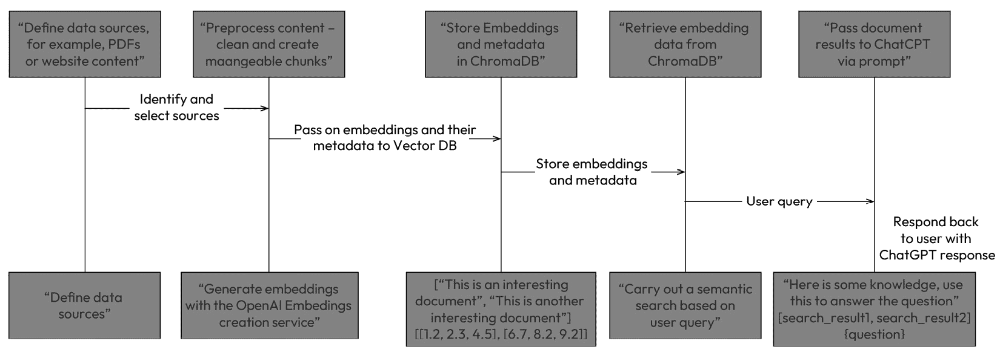
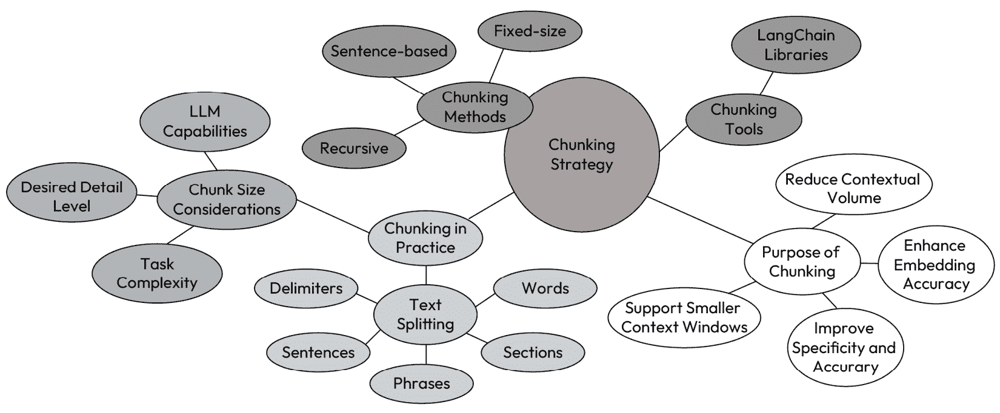
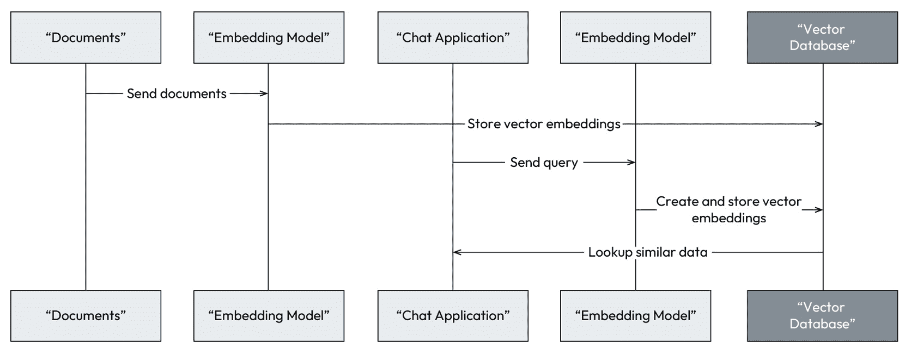
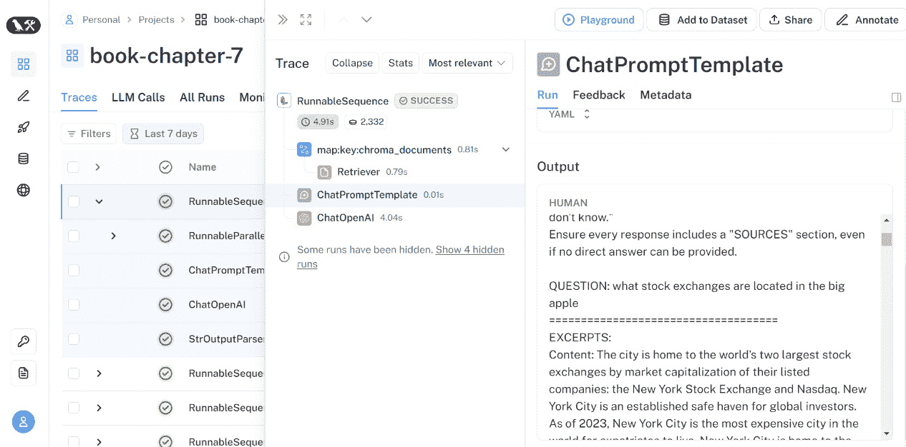

# 7

# 向量存储作为检索增强生成的知识库

**检索增强生成**（**RAG**）无疑是自 ChatGPT 爆发以来最常见的一种 LLM 应用场景。在本章中，我们将探讨创建 RAG 系统所涉及的关键步骤和概念。一旦您理解了每个步骤所涉及的内容，我们将探讨如何使用 LangChain 来执行这些过程和技术。进一步来说，我们将通过一个真实世界的例子来构建我们自己的 RAG 系统。

本章旨在介绍 RAG 的核心概念，以便您有一个坚实的基础来掌握它。

在本章中，我们将涵盖以下主题：

+   我们为什么需要 RAG？

+   理解创建 RAG 系统所需的步骤

+   使用 LangChain 工作通过一个 RAG 示例

# 技术要求

在本章中，我们将广泛使用 ChatGPT，因此您需要注册一个免费账户。如果您还没有创建账户，请访问 [`openai.com/`](https://openai.com/) 并点击页面右上角的**开始使用**，或者访问 [`chat.openai.com`](https://chat.openai.com)。

这些示例需要安装 Python 3.9 和 Jupyter Notebook，这两个都可以在 [`jupyter.org/try-jupyter/notebooks/?path=notebooks/Intro.ipynb`](https://jupyter.org/try-jupyter/notebooks/?path=notebooks/Intro.ipynb) 找到。

我们将使用 ChromaDB 作为我们的开源向量数据库，因此建议您先了解一下它，并熟悉 Chroma ([`www.trychroma.com`](https://www.trychroma.com))。然而，对于向量存储提供商，还有很多其他不同的选择。

您可以在本书的 GitHub 仓库中找到本章的代码：[`github.com/PacktPublishing/ChatGPT-for-Conversational-AI-and-Chatbots/chapter7`](https://github.com/PacktPublishing/ChatGPT-for-Conversational-AI-and-Chatbots/chapter7)。

# 我们为什么需要 RAG？

LLM 受限于其训练数据中的世界知识，因此 ChatGPT 不了解最近的事件或您自己的数据，这严重限制了其提供相关答案的能力。由于幻觉，LLM 没有任何知识来支持一个问题，因此它编造了事情。

因此，当我们谈论一个 LLM 的知识时，有两种类型：

+   来自 LLM 在训练期间使用的知识的知识。

+   来自在对话上下文中通过提示传递给 LLM 的信息的知识。我们可以称之为上下文特定知识。

因此，LLM 应用的一个突出用例，也是我最常被问到的一个，就是如何让 LLM 解释和讨论其训练数据集之外的数据。这包括访问实时信息或其他外部数据源，例如公司文档存储库或数据库中包含的专有信息。实际上，我们需要提高 LLM 的上下文特定知识，而 RAG 正是我们实现这一目标的手段。

任何可能需要基础语言模型具备所需知识广度和深度的要求，意味着我们需要从某处获取上下文信息，以便将其传递给我们的 LLM。我们还要注意 ChatGPT 的上下文窗口限制以及更大上下文窗口的成本。如果你有大量数据，那么向 ChatGPT 发送大量数据块将会增加你的令牌使用量和成本。因此，我们的上下文特定知识越小、越相关，就越好。

尽管在本章中我们将专注于为我们的 ChatGPT 应用提供其他特定主题的上下文特定知识，但请记住，上下文特定知识可以指与对话相关的任何内容。当我们在上一章中查看持久化记忆时，你已经了解了 RAG 系统的机制。让我们更详细地看看 RAG 的不同元素。

# 理解创建 RAG 系统所需的步骤

要实现 RAG，需要执行一系列步骤。首先，我们需要定义数据检索的来源。这可能包括在线数据库、特定网站，甚至根据系统需求定制的数据存储库。然后，我们需要优化并存储这些信息以供检索。一旦完成这些，我们就可以使用检索系统根据查询上下文检索相关信息。然后，在提示过程中将这些信息传递给语言模型。以下图概述了不同的步骤：



图 7.1 – 创建 RAG 系统的步骤

我明白这里有很多事情在进行中，所以让我们更详细地看看每个步骤。

## 定义你的 RAG 数据源

在我们的第一步中，我们必须识别和选择我们的知识数据检索来源。这可能包括在线数据库、特定网站，或根据系统需求定制的定制数据存储库。我们的来源可能以不同类型的文件格式存在，如原始 HTML、PDF、PowerPoint、Word 文档，或整个网站——这完全取决于你的用例。

为了获得最佳结果，你需要在开始分块过程和其他下游任务之前预处理你的数据，以确保最佳质量。

在创建嵌入之前，你可以做很多事情来提升你的内容。这个过程可能会产生一些成本，但这是值得投资的。一旦完成，你就可以在多个下游任务中使用处理过的内容。

理想情况下，你不需要关心你的内容来自哪里，无论是文件类型；你希望能够处理它们，无论来源格式如何，这样你就可以以相同的方式处理它们。为此，你需要将它们分解成常见的元素，如标题和可读的叙事文本。最常见的形式是 JSON，因为它是一个常见且易于理解的格式。这样，你可以序列化内容并提取和存储元数据，如页码、文档名称和关键词。

每种文档类型都不同，并使用不同的元素来区分不同类型的信息。例如，HTML 有标签，或者我们可以使用 NLP 来理解文本；较短的句子可能是标题。对于 PDF 和图像，我们可以使用更高级的技术，如文档布局检测或视觉转换器。

内容处理可能涉及复杂任务，因此考虑使用像 Unstructured 这样的库或服务是值得的。它们提供了一些非常强大的核心开源工具和优秀的文档，以及执行更复杂任务（如内容提取）的 API。它们还计划推出企业级服务。查看他们的文档并遵循他们的快速入门指南以获取更多信息。

## 预处理我们的内容并生成嵌入

一旦我们确定了将要使用的数据集，我们需要通过将其分割成可管理的块并从这些块中创建嵌入来清理和准备我们的数据。

## 为有效与 LLM 交互进行分块

你的数据集可能包含许多文档和字符，因此索引你的数据的第一个步骤是通过文本分割将其缩小到合理的尺寸。我们这样做有几个原因：

+   通过提高嵌入的准确性来增强后续处理的成果相关性。

+   以支持较小的上下文窗口，这是嵌入模型通常支持的。

+   这样我们就可以通过缩小更大的文本来源到更小、更专注的片段来提供更准确和具体的信息。

+   为了减少我们将要传递给 LLM 的上下文知识量。这保持了相关性，影响了响应的质量，并降低了成本。它还允许我们使用更大的文档。

当你分块你的文本数据时，文本的大块被分割成更小的块，如部分、句子、短语、分隔符，甚至单词。通过有效的分块策略，我们的目标是把大内容分解成有意义的片段，我们可以用它们来准确回答用户的查询。以下图展示了分块策略的不同元素：



图 7.2 – 分块策略

然而，分块并不是万能的解决方案。设计一个有效的策略需要仔细考虑你要分块的 内容以及你的应用程序的使用场景。让我们更仔细地看看这些元素：

+   **块大小**：将其视为你 LLM 的“一口大小”。较小的块（句子、短语）提供了更细粒度的控制，但可能导致信息丢失和上下文碎片化。相反，较大的块（段落、章节）保持了上下文，但可能会超出 LLM 的容量。找到最佳平衡点取决于以下因素：

    +   **LLM 能力**：不同的嵌入模型有不同的处理能力。请参考文档以获取推荐的上下文大小。别忘了，当块被检索时，我们仍然需要将这些添加到我们的上下文中，因此我们还需要考虑 LLM 上下文限制。请注意，如果你使用的是带有 32k 内容窗口的 GPT-4，这问题就不那么严重了。

    +   **任务复杂度**：你打算使用什么类型的内容？是较长的文档，例如文章，还是较短的文档，例如聊天记录？简单的任务，如情感分析，可能可以处理更大的块，而细微的任务，如摘要，则从较小的块中受益。

    +   **所需细节级别**：你需要一个广泛的概述还是深入的研究？你希望支持哪些类型的问题？相应地调整块的大小。

+   **分块方法**：你如何切割文本很重要。流行的方法有不同的优缺点，所以我鼓励你尝试不同的方法，看看你能达到什么样的结果。LangChain 支持所有这些方法的不同库。以下是一些流行的方法：

    +   **固定大小分块**：简单且高效，但可能会破坏句子并丢失上下文。我们在本书的例子中最常用固定大小分块。

    +   **基于句子的分块**：内容感知分块允许你将文本分割成单独的句子。

    +   **递归分块**：这个分块过程通过使用不同的标准迭代地将文本分割成更小的部分，直到达到相似但并非完全相同的块大小，从而允许结构灵活性。

记住，最佳的分块策略是针对你的 LLM、任务和期望结果独特的。尝试不同的方法，监控性能，并优化你的策略以充分发挥 LLM 交互的潜力。

关键要点是 LangChain 提供了一些强大的开箱即用的分块工具。现在我们有了分块数据，我们就可以创建我们的嵌入。

### 理解嵌入 - 将文本转换为有意义的向量

在机器学习和自然语言处理的情况下，**向量**和**嵌入**这两个术语密切相关，但它们指的是不同的概念。首先，让我们看看什么是向量：

+   **什么是向量**？：向量是数据在由维度定义的空间中的数学表示。它本质上是一个浮点数数组。类似于将物品打包进手提箱，我们将数据的各种属性，如高度、重量、颜色或词频，存储在这个列表中。这使得我们可以将复杂的信息输入仅理解数字的机器学习算法。这使计算更高效，允许算法有效地处理大量现实世界的数据。

+   **不同类型的向量**：有不同类型，例如特征向量和嵌入（我们感兴趣用于 RAG 的向量类型）。

+   **它们代表不同的事物**：向量可以表示各种数据类型，从简单的数值特征（如图像像素值）到复杂的概念，如词义或文档主题。

+   **带有意义的编码**：向量值不是随机的；它们包含意义！例如，在词嵌入中，向量空间中单词之间的距离反映了它们的语义相似度。

+   **从输入到输出**：向量可以表示输入算法的数据和其输出预测。例如，一个向量（稍后会更详细地介绍）可能输入一些文本作为向量，并输出一个表示最接近问题的答案的向量。

#### 词嵌入解释 – 从文本到有意义的数字

我们可以创建各种单词或句子嵌入。然而，在 RAG 的上下文中，我们感兴趣的是分块句子，并希望理解它们之间的关系。为此，我们可以使用句子嵌入。

句子嵌入将整个句子转换成固定大小的密集向量，捕捉整体语义意义。与表示单个单词的词嵌入不同，句子嵌入考虑了句子中单词的上下文和关系。我们可以通过测量向量之间的距离来展示它们的相关性。

让我们想象我们正在为句子“*我喜欢吃蛋糕*”和“*我对烘焙感兴趣*”创建嵌入，每个句子使用一个五维向量。请注意，现实世界的嵌入比这要大得多：

+   句子：“*我喜欢吃蛋糕*：”

    +   `[0.45, -0.2, 0.33,` `0.1, -0.4]`

+   句子：“*我对烘焙感兴趣*：”

    +   `[0.4, -0.15, 0.35,` `0.05, -0.3]`

在这个假设的例子中，每个向量在五维空间中代表整个句子的意义。维度是抽象的，不能直接解释，但它们以这种方式组织，使得具有相似意义的句子在这个多维空间中更接近。

想象每个句子都是一个有五个无形墙壁（维度）的巨大房间中的点。具有相似意义的句子在这个房间里会靠得更近，尽管你无法直接看到那些意义。

将“*我喜欢吃蛋糕*”和“*我对烘焙感兴趣*”想象成房间里的两个人。当然，他们正在做不同的事情（吃与烘焙），但他们都对食物有着共同的热爱，就像在房间里的同一个“*食物区域*”里一样。这反映在他们点之间的接近程度，尽管房间本身是看不见的。

在现实世界的应用中，这个“*房间*”会有更多墙壁（维度）来捕捉意义的更细微细节。维度的数量可以从 50 到 1,024，其中 300 是一个常见的选项。

创建嵌入最简单的方法是使用预训练模型。我们将在下一节中查看一些这些模型以及我们如何创建嵌入。

#### OpenAI 的文本嵌入模型

OpenAI 的文本嵌入模型一直是最受欢迎的，其中 **text-embedding-ada-002** 是最广泛使用的。然而，这些模型已经被更优秀的嵌入模型所取代。**text-embedding-3-small** 和 **text-embedding-3-large** 是最新且性能最出色的嵌入模型。

OpenAI 的最新进展，文本嵌入 v3，代表了人工智能能力的重大飞跃。这个模型，其“小型”和“大型”的变体，展示了性能的显著提升，尤其是在多语言嵌入和英语语言处理方面。它引入了一种更有效的方法来处理数据维度性，同时不牺牲准确性，这得益于创新的套娃表示学习。通过以层状结构化数据，就像俄罗斯套娃一样，这优化了嵌入过程，提高了语言模型的效率和准确性。

除了 OpenAI 之外，还有许多其他嵌入模型，例如 Google 的 BERT 和 T5，Facebook 的 RoBERTa，以及多语言的 XLM-R。LangChain 通常会简化使用不同模型的过程。对于本章，我们将专注于使用 OpenAI 嵌入模型。在下一节中，我们将看到这是如何实现的。

## 使用 OpenAI 模型创建嵌入

使用 OpenAI 嵌入模型有几种不同的方式。一种选择是直接调用 `embeddings` API 端点：

```py
curl https://api.openai.com/v1/embeddings \
  -H "C OpenAI content-Type: application/json" \
  -H "Authorization: Bearer $OPENAI_API_KEY" \
  -d '{
    "input": ["I like eating cake"," I'm interested in baking"],
    "model": "text-embedding-3-small"
  }'
```

或者，LangChain 提供了一个简单的 `OpenAIEmbeddings` 包装类，用于使用 OpenAI API 创建嵌入。以下是一个简单的示例：

```py
import ...
os.environ['OPENAI_API_KEY'] = 'KEY'
embeddingsService = OpenAIEmbeddings()
embeddings = embeddingsService.embed_documents(["I like eating cake",
    " I'm interested in baking"])
```

通常，没有必要直接使用嵌入创建服务。许多矢量存储提供了同时嵌入和存储文档的简化方法。我们将通过检查 ChromaDB 中的过程来展示这一点。现在我们已经涵盖了矢量和嵌入，我们可以继续进行 RAG 流程的下一步：使用矢量存储存储和搜索我们的嵌入。

## 使用矢量存储存储和搜索我们的嵌入

现在我们有了我们高维数据向量嵌入，我们需要能够有效地存储和搜索它们。我们的向量数据库将在存储和搜索我们的数据中扮演重要的角色。以下图表说明了这个过程：



图 7.3 – 索引我们的数据

我们向量数据库是一种特定类型的数据库，它已被优化以与多维向量一起工作。让我们看看使用这种存储类型的优势。

### 向量数据库的主要优势

向量数据库专门设计用于管理向量嵌入，因此它们提供了以下优势：

+   **直观的数据管理**：向量数据库提供了我们期望的数据库的所有**创建、读取、更新、删除**（**CRUD**）操作。向量数据库还提供了简单的方法来执行元数据存储和过滤，以便我们可以使用额外的元数据过滤器进行更细粒度的查询。

+   **相似度搜索**：使用向量数据库的主要优势是它允许我们根据向量中表示的意义的相似性来搜索我们的嵌入。因此，虽然传统数据库是基于精确匹配或标准进行查询的，但我们可以使用向量数据库根据语义或上下文意义找到最相似或相关的数据。

+   **可扩展性**：在大多数用例中，我们可能会处理大量向量。随着数据量的增长，向量数据库可以通过在多台机器之间分配数据来实现水平扩展，确保即使在大数据集上也能保持高效性能。

### 向量数据库是如何工作的？

虽然传统数据库以行和列的形式存储数据，以适应字符串和数字等标量数据类型，但向量数据库的设计是为了管理向量。这种基本差异也扩展到它们的优化和查询机制。

在传统的数据库设置中，查询通常基于指定的标准在行之间寻找精确匹配。然而，向量数据库却采用相似度指标来识别与查询密切相似的向量，这与精确匹配的方法不同。

向量数据库的核心是**近似最近邻搜索**（**ANN**），它利用一系列算法来优化和加速搜索过程。这些算法包括哈希、量化以及基于图的搜索等方法，被编排成一个流水线，以返回快速、准确的结果。

由于向量数据库产生近似结果，一个关键考虑因素是在准确性和查询速度之间的平衡。更高的准确性水平通常会导致搜索速度变慢。然而，一个经过良好优化的向量数据库可以在不显著降低准确性的情况下实现非常快的搜索，为许多应用提供了最佳平衡。向量数据库采用多种不同的技术或相似度度量来比较数据库内的向量，以便它们可以识别最相关的结果。

相似度度量是用于量化向量空间中两个向量之间相似度的数学技术。这使得数据库能够评估存储的向量与查询向量的相似度。有几种相似度度量，以下是一些突出的例子：

+   **余弦相似度**：这个度量计算两个向量之间角度的余弦值，值范围从-1 到 1。在这里，1 的值表示向量完全相同，0 表示正交（独立）向量，-1 表示完全相反的向量。

+   **欧几里得距离**：这衡量两个向量之间的直接线距离，范围从 0 到无穷大。0 的值表示向量完全相同，随着值的增加，表示向量之间的相似性逐渐降低。

+   **点积**：这表示两个向量的模长乘积以及它们之间角度的余弦值。正值表示向量指向同一方向，0 表示正交向量，负值表示相反方向。

现在您已经了解了向量数据库的基本工作原理，下一步是选择适合您项目的正确数据库。

## 决定使用哪个向量数据库

许多向量数据库和供应商提供开源、托管、可扩展的解决方案，满足每个价格点和需求。

就像选择任何持久层一样，为 RAG 系统和 LangChain 应用选择正确的向量数据库需要仔细考虑几个关键因素，这些因素针对这些高级 AI 框架进行了定制。

对于 RAG 系统，向量数据库必须在快速和精确的检索能力上出类拔萃，并且必须易于使用。向量数据库通常提供特定编程语言的 SDK，这些 SDK 封装了 API，这将使您在应用程序中与数据库交互变得更加容易。

在 LangChain 的背景下，大多数主要的向量提供商已经在 LangChain 库中创建了集成，并成为`langchain-community`包的一部分。只需查看集成页面，就可以了解哪些供应商创建了现成的集成和详尽的文档。

预算考虑也起着至关重要的作用；开源向量数据库可能为愿意投资设置和维护的团队提供成本节约和可定制性。然而，对于需要无缝可扩展性和最小操作开销的项目，基于云的托管向量数据库可能更为合适，尽管可能成本更高。项目的范围和规模在这里很重要；可能你有选择提供商的奢侈，也可能你被要求查看你选择的云提供商提供的科技。

### 杰出的向量数据库提供商

当涉及到向量数据库时，既有开源选项，也有托管选项可用。让我们看看一些例子：

+   ChromaDB 是一个可靠的开源向量数据库。我们已经在本书中使用过它，并且我们将将其作为本书剩余部分的首选向量数据库。Chroma 是一个开源嵌入数据库，允许你轻松管理文本文档，将文本转换为嵌入，并进行相似性搜索。是的，有一个 ChromaDB LangChain 包装器和检索类用于查询。其他值得提及的杰出开源向量存储包括 Qdrant 和 Weaviate。

+   **Pinecone** 是一个专为解决与向量相关独特挑战而构建的托管向量数据库平台，它提供了进入生产所需的一切。

+   由 Meta 提供的 **Facebook AI Similarity Search**（**FAISS**）是一个开源库，用于快速搜索相似性和聚类密集向量。它并不完全是一个向量数据库；它是一个向量索引，也称为向量库。它包含了能够搜索不同大小和复杂度向量集的算法。FAISS 在 LangChain 中得到了良好的支持。

这些只是可用的向量数据库选项中的一部分。我强烈建议进行彻底的研究，以确定最适合你项目的选择。此外，考虑探索 LangChain 集成中特色展示的向量提供商，以更全面地了解可用的内容。

到目前为止，我们理解了我们的 RAG 中的步骤顺序。我们已经学习了如何定义我们的数据源，将我们的数据预处理为块，以及如何使用专业模型创建我们的嵌入，以及我们如何利用向量数据库进行存储和搜索。在下一节中，我们将查看一个端到端示例，使用 LangChain 框架将所有这些技术结合起来。

# 使用 LangChain 通过 RAG 示例进行工作

LangChain 提供了执行我们所概述的所有步骤的功能。因此，让我们在更详细地查看如何使用 LangChain 实现这些步骤的同时，看看一个 RAG 示例。

对于我们的用例，我们将探讨使用非结构化网站数据作为我们 RAG 系统的基石。这是一个常见的 RAG 应用示例，因为大多数组织都有网站和希望使用的非结构化数据。想象一下，如果你的组织要求你创建一个由 LLM 驱动的聊天机器人，能够回答关于组织网站内容的问题。

在我们的场景中，我们将探索利用非结构化网站数据作为我们 RAG 系统的基石。鉴于大多数组织都拥有他们希望使用的充满数据的网站，利用网站上的非结构化数据是 RAG 应用中的一种常见方法。想象一下，如果你的组织要求你开发一个能够回答与公司网站内容相关的查询的聊天机器人。

对于我们的示例，我们将创建一个能够提供关于纽约经济最新信息的聊天机器人。对于我们的数据源，我们将使用维基百科。你可以根据自己的主题领域来跟随这个示例，甚至可以使用你自己的网站页面。

第一步是使用文档加载器加载我们的数据集。那么，让我们开始吧。

## 集成数据 - 选择你的文档加载器

LangChain 文档加载器旨在轻松地从不同来源获取文档，作为数据检索过程的初始步骤。LangChain 提供了超过 100 种不同的文档加载器，可以满足各种数据源的需求，例如私有云存储、公共网站，甚至是特定的文档格式，如**HTML**、**CSV**、**PDF**、**JSON**和代码文件。

你需要的文档加载器将取决于你的用例和需求。有了这些选项，你可以将来自几乎任何来源的数据集成到你的 ChatGPT 应用中，无论是来自网站的非结构化公共或私有数据，还是来自 Google Drive 等云存储。你也可以从许多不同的数据库类型或数据存储提供商加载更多结构化的信息。

除了它们的通用性之外，LangChain 中的文档加载器还设计得易于使用。它们提供了直观的接口，允许开发者快速设置并开始以最小的配置获取文档。这种简单性加速了开发过程，尤其是在你创建概念验证以尝试不同的数据源时。希望这能给你更多时间专注于应用程序更复杂的功能。

让我们看看文档加载器的一个简单示例。记住，我们想要回答关于纽约的问题，因此我们的数据集需要满足这些要求。维基百科是一个提供最新信息的绝佳来源，所以这在这个例子中就足够了。让我们看看如何使用`WebBaseLoader`，一个**HTML**文档加载器，从维基百科中提取一些信息作为数据集的基础：

```py
from langchain_community.document_loaders import WebBaseLoader
loader = WebBaseLoader(
    ["https://en.wikipedia.org/wiki/New_York_City#Economy"])
docs = loader.load()
print(len(docs))
print(docs)
```

打印出`docs`变量应该会产生类似于以下内容的结果，其中`page_content`是我们将要使用的数据文本：

```py
[Document(page_content='\n\n\n\nNew York City – Wikipedia
...
 metadata={'source': 'https://en.wikipedia.org/wiki/New_York_City#Economy', 'title': 'New York City - Wikipedia', 'language': 'en'})]
```

考虑到我们所拥有的非结构化 HTML 数据，也许使用`documentTransformer`来清理我们的 HTML 成纯文本，例如`AsyncHtmlLoader`，也是值得考虑的。

许多其他 LangChain 文档加载器选项是为特定用例专门构建的，因此始终值得检查 Python 或 TypeScript 中可用的选项。

在我们的例子中，我们将使用`WikipediaLoader`，这是我们在此章节中之前使用过的。请注意，为了这个例子的目的，我将`load_max_docs`保持得较低：

```py
docs = WikipediaLoader(query="New York economy",
    load_max_docs=5).load()
```

使用此方法的优点是，我们现在有了来自多个维基百科页面的数据。`WikipediaLoader`的结果应该看起来相当不错，列出的文档结构与`WebBaseLoader`的结果相似。

现在我们有了我们的数据集，下一步是对其进行索引。

## 通过文本分割创建可管理的块

正如我们在关于有效 LLM 交互的块分割部分所讨论的，文本分割的过程可能相当复杂，需要关于块大小和适当方法的仔细决策。幸运的是，LangChain 提供了易于使用的接口和集成，用于几个模块，可以将我们的文档数据集“块化”或分割，以便进行进一步处理。

LangChain 的文本分割算法旨在灵活高效，确保在优化检索的同时，保持原文的完整性和上下文。这涉及到考虑诸如文本的性质和格式、文档内的逻辑划分以及当前检索任务的具体要求等因素。

在 LangChain 中实现文本分割可以通过使用现成的分割器之一来完成，这些分割器根据数据集本身提供不同的分割方式。

小贴士

一个理解不同的块分割策略并评估文本块分割结果的绝佳工具是[`chunkviz.up.railway.app`](https://chunkviz.up.railway.app)。这是一个查看基于 LangChain 实用程序和不同参数（如块大小和重叠）如何分割文本的绝佳方式。

对于这个用例，我们将使用`RecursiveCharacterTextSplitter`来分割我们的文本。`RecursiveCharacterTextSplitter`实用程序旨在高效地将文本分割成可管理的部分。它寻找预定义的分隔符字符，如换行符、空格和空字符串。结果应该是分割成段落、句子和单词的块化文本，其中文本段保留了相关文本段的意义。该实用程序动态地将文本分割成块，以字符计数为目标大小。一旦块达到这个预定的尺寸，它就被标记为输出段。为了确保这些段之间的连续性和上下文保持一致，相邻的块具有可配置的重叠程度。

它的参数可以完全自定义，提供灵活性以适应各种文本类型和应用需求。

这是一个将大量文本分解成更小、语义上有意义的单元的好方法。

下面是我们的示例代码，它使用了`RecursiveCharacterTextSplitter`。这适用于通用文本：

```py
from langchain.text_splitter import RecursiveCharacterTextSplitter
text_splitter = RecursiveCharacterTextSplitter(
    chunk_size=500, chunk_overlap=100)
split_documents = text_splitter.split_documents(docs)
print(len(split_documents))
```

我们可以创建我们的`RecursiveCharacterTextSplitter`类，并设置我们希望控制的属性，包括`chunk_size`，这确保了处理的可管理大小，以及`chunk_overlap`，它允许块之间有字符重叠，保持上下文连续性。如果您更改块大小，您将能够创建一个包含更多条目的文档列表。您可以通过运行以下命令查看其中一个分割的文档：

```py
print(documents[5])
```

使用`RecursiveCharacterTextSplitter`，我们已经将我们的大型文本内容分解成更小的、有意义的单元。这为我们的数据处理和分析做好了准备。现在，我们已经探讨了文本分割，让我们深入了解如何使用我们的块来创建嵌入：

## 创建和存储文本嵌入

现在我们有了可管理的数据块，是时候从这些块中创建嵌入并将它们存储在我们的向量数据库中。在这个例子中，我们将使用 ChromaDB 作为我们的向量存储。

在这里，我们将从`langchain_openai`和`langchain.vectorstores`库中创建我们的嵌入，这些库允许我们调用 OpenAI 嵌入服务并将它们存储在 ChromaDB 中。按照以下步骤操作：

1.  首先，我们必须使用我们的特定模型`text-embedding-3-small`初始化`OpenAIEmbeddings`类的实例：

    ```py
    from langchain_openai import OpenAIEmbeddings
    from langchain.vectorstores.chroma import Chroma
    embeddings_model = OpenAIEmbeddings(
        model=" text-embedding-3-small")
    ```

1.  `docs_vectorstore = Chroma(...)`这一行创建了一个 Chroma 类的实例，用于存储文档向量。以下参数被提供给 Chroma：

    +   `collection_name="chapter7db_documents_store"`：这指定了 Chroma 中存储文档向量的集合名称。将其视为在数据库中命名一个表，其中将保存您的数据。

    +   `embedding_function=embeddings_model`：在这里，之前创建的`embeddings_model`被用作嵌入函数。这告诉 Chroma 在存储文档之前使用`OpenAIEmbeddings`实例来生成文档的嵌入。本质上，每当文档被添加到 Chroma 时，它将通过这个嵌入模型转换成向量。

    +   `persist_directory="chapter7db"`：此参数指定 Chroma 将持久存储其数据的目录。这允许向量存储在程序运行之间保持其状态。在我们的情况下，它将是我们运行 Jupyter Notebook 的文件夹：

        ```py
        documents_vectorstore = Chroma(
            collection_name="docs_store",
            embedding_function=embeddings_model,
            persist_directory="chapter7db",
        )
        ```

1.  然后，我们可以通过调用`add_documents()`将我们之前分割的文档传递进去。之后，我们可以通过在 Chroma 实例上调用`persist()`来持久化所有内容：

    ```py
    chroma_document_store.add_documents(split_documents)
    chroma_document_store.persist()
    ```

1.  现在，我们可以进行搜索以查看是否有任何结果返回。我们将通过在 Chroma 实例上执行相似性搜索，并使用我们的文本查询调用`similarity_search`来实现这一点。尝试一个与纽约经济相关的问题：

    ```py
    similar_documents = chroma_document_store.similarity_search(
        query="what was the gross state product in 2022")
    print(similar_documents)
    ```

你应该能够打印出查询的搜索结果。现在，让我们看看如何将我们的 RAG 系统与 LangChain 结合在一起。

## 使用 LangChain 整合一切

现在我们已经让 Chroma 文档存储返回结果，让我们学习如何使用 LangChain 将所有我们的 RAG 元素整合在一起，以便我们可以创建一个能够根据我们文档中的信息回答问题的系统：

1.  我们将首先从`langchain_openai`和`langchain_core`库中导入必要的类，以及我们需要登录 LangSmith 的变量。然后，我们需要创建`ChatOpenAI`类的实例，以便我们可以利用 GPT-4 生成我们的答案：

    ```py
    from langchain_openai import ChatOpenAI
    from langchain_core.prompts import ChatPromptTemplate
    from langchain_core.runnables import (
        RunnableParallel, RunnablePassthrough)
    os.environ['LANGCHAIN_API_KEY'] = ''
    os.environ['LANGCHAIN_PROJECT'] = "book-chapter-7"
    os.environ['LANGCHAIN_TRACING_V2'] = "true"
    os.environ['LANGCHAIN_ENDPOINT'] = "https://api.smith.langchain.com"
    from langchain_core.output_parsers import StrOutputParser
    llm = ChatOpenAI(model="gpt-4", temperature=0.0)
    ```

    将温度设置为`0.0`使模型的响应确定性，这对于一致的问答性能通常是期望的。

1.  现在我们已经设置了 Chroma 文档存储，我们可以初始化一个检索器来根据我们的查询检索相关文档：

    ```py
    retriever = chroma_document_store.as_retriever(
        search_kwargs={"k": 5})
    ```

    检索器被配置为返回与查询匹配的前`5`个文档。

1.  接下来，我们需要创建一个提示模板，告诉语言模型如何利用检索到的文档来回答问题：

    ```py
    template = """
    You are an assistant specializing in question-answering tasks based on provided document excerpts.
    Your task is to analyze the given excerpts and formulate a final answer, citing the excerpts as "SOURCES" for reference. If the answer is not available in the excerpts, clearly state "I don't know."
    Ensure every response includes a "SOURCES" section, even if no direct answer can be provided.
    QUESTION: {question}
    ==========================
    EXCERPTS:
    {chroma_documents}
    ==========================
    FINAL ANSWER(with SOURCES if available):
    """
    prompt = ChatPromptTemplate.from_template(template)
    ```

    此模板帮助模型从我们的数据中提供有来源的答案，或者指导我们在信息不可用时进行指示：


图 7.4 – 传递给 LLM 的提示

1.  接下来，实现一个函数来格式化检索到的文档，以便它们可以包含在提示中：

    ```py
    def format_chroma_docs(chroma_docs) -> str:
        return "\n".join(
            f"Content: {doc.page_content}\nSource: {doc.metadata['source']}" for doc in chroma_docs
        )
    ```

    我们将使用此函数在提示中包含文档内容和来源时，将它们组织成可读的格式。

1.  现在，我们必须使用 LCEL 来创建我们的问答管道。这种设置允许我们直接对检索到的文档进行格式化，并简化了提示生成和答案生成阶段的流程：

    ```py
    rag_chain_from_docs = (
        {"chroma_documents": retriever | format_docs,
            "question": RunnablePassthrough()}
        | prompt
        | llm
        | StrOutputParser()
    )
    ```

    下面是这个管道的每个部分所做的工作：

    1.  使用`RunnablePassthrough`和文档检索进行处理：`{"chroma_documents": retriever | format_docs, "question": RunnablePassthrough()}`：此字典设置两个并行流。对于`chroma_documents`，文档通过`retriever`检索，然后立即使用`format_docs`进行格式化。对于`question`，使用`RunnablePassthrough()`简单地将问题传递过去，不做任何修改。这种方法有效地为下一步准备格式化的文档和问题。

    1.  提示应用：`| prompt`：处理过的信息（问题和格式化的文档）随后被导入提示。此步骤利用`ChatPromptTemplate`根据预定义的模板将问题与格式化的文档结合，为 LLM 生成答案做好准备。

    1.  语言模型生成：`llm`: 在这里，将上一阶段的综合输入输入到之前初始化的语言模型（GPT-4）中。模型根据提示生成响应，有效地通过从检索到的文档中提取的信息来回答问题。

    1.  输出解析：`| StrOutputParser()`: 最后，语言模型输出的内容通过`StrOutputParser()`解析成字符串格式。这一步骤确保最终答案是易于阅读且格式正确的。

1.  最后，我们可以用一个问题和打印答案来调用管道：

    ```py
    question = "what stock exchanges are located in the big apple"
    rag_chain_from_docs.invoke(question)
    ```

    此搜索应返回类似以下内容，包括答案和来源：

    ```py
    The stock exchanges located in New York City, often referred to as the "Big Apple", are the New York Stock Exchange and Nasdaq. These are the world\'s two largest stock exchanges by market capitalization of their listed companies. \n\nSOURCES: \n- https://en.wikipedia.org/wiki/New_York_City\n- https://en.wikipedia.org/wiki/Economy_of_New_York_City'
    ```

通过遵循这些步骤，您已经构建了一个能够用维基百科的最新信息回答关于纽约经济问题的 RAG 系统。尝试一些其他问题，看看 FAQ 的表现如何。

记住，查看 LangSmith 中的调试输出是有用的，这样您就可以看到 LangChain 的每个步骤中发生了什么。在下面的屏幕截图中，我们深入到了 LangSmith 提示模板输出，以便我们可以看到我们检索并传递给 LLM 提示的文档：



图 7.5 – 使用 LangSmith 查看内部运作情况

首先，我们根据我们的主题标准从维基百科加载了我们的文档，将数据分块，并创建了存储在我们向量存储中的嵌入。然后，我们定义了一个检索器来查询我们的存储库，将文档搜索结果传递给 LLM 提示，并将其交给我们的 LLM 以获取对问题的准确响应，同时列出来源并防止幻觉。这是通过在 LCEL 中定义的 LangChain 实现的。

# 摘要

在本章中，我们探讨了 RAG 系统是什么以及为什么我们需要它们。然后，我们详细介绍了创建 RAG 系统必须遵循的步骤。到这一点，您应该知道如何使用分块选择和预处理数据，以及向量和嵌入是什么以及如何使用专用模型创建它们，以便您可以将它们存储在用于存储向量的特定类型的数据库中。最后，我们创建了一个 RAG 系统，通过每个步骤使用真实世界的例子，并在 LangChain 中将它们全部整合在一起。

在下一章中，我们将更详细地探讨一个由 ChatGPT 驱动的更复杂的真实世界 LangChain 应用。我们将利用前几章的核心概念以及本章中我们关于如何实现 RAG 所学到的东西。我们的目标是创建一个更复杂的聊天机器人，它支持记忆、RAG 以及由 LangChain 工具驱动的更多特定功能。

# 进一步阅读

以下是一个精心挑选的资源列表，旨在帮助您理解本章提供的内容：

+   LangSmith: [`smith.langchain.com/`](https://smith.langchain.com/)

+   嵌入模型：[`python.langchain.com/docs/integrations/text_embedding`](https://python.langchain.com/docs/integrations/text_embedding) 和 [`platform.openai.com/docs/guides/embeddings/embedding-models`](https://platform.openai.com/docs/guides/embeddings/embedding-models)

+   ChromaDB：[`docs.trychroma.com/`](https://docs.trychroma.com/)

+   非结构化：[`docs.unstructured.io/welcome`](https://docs.unstructured.io/welcome)
