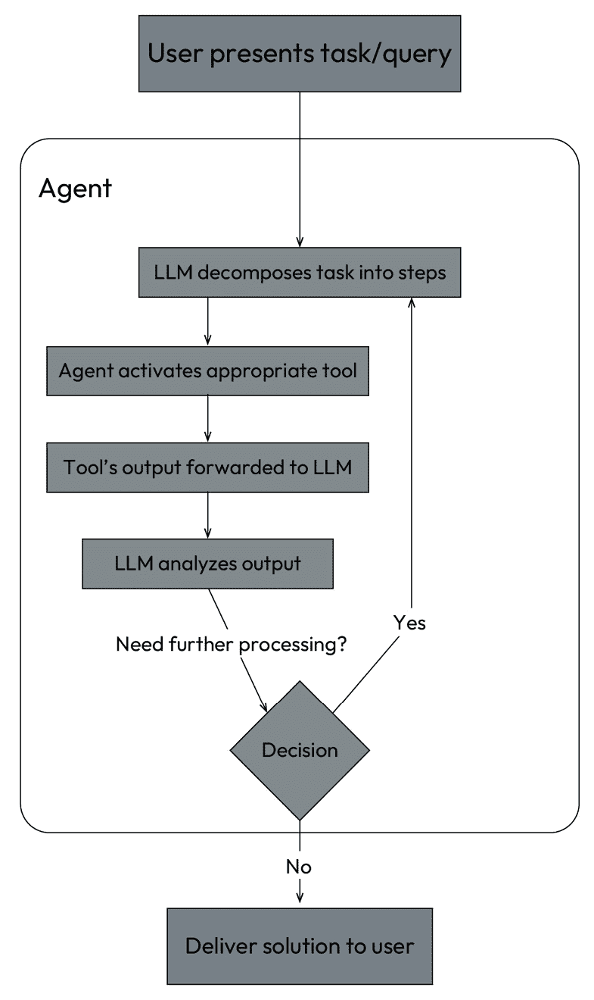
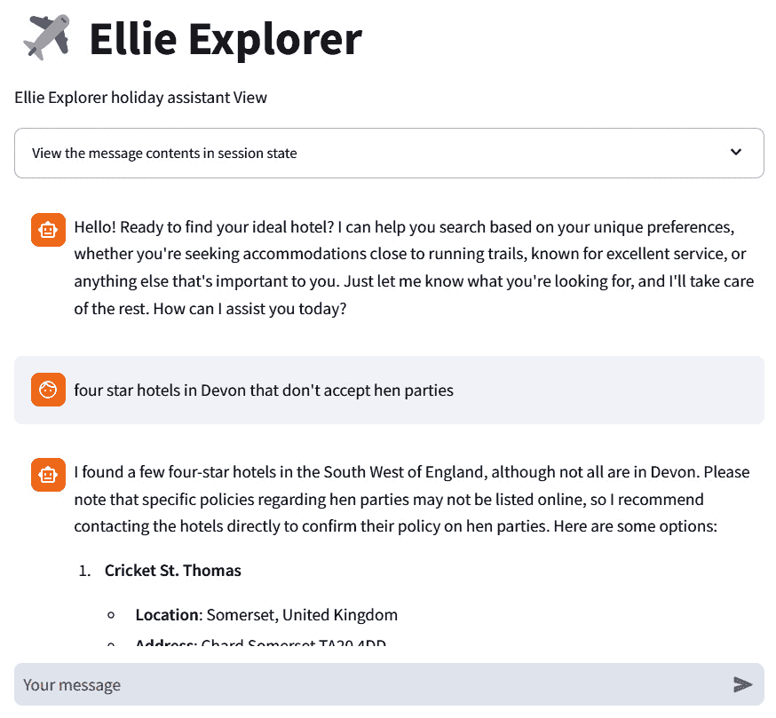
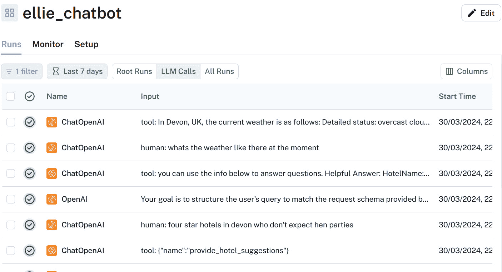
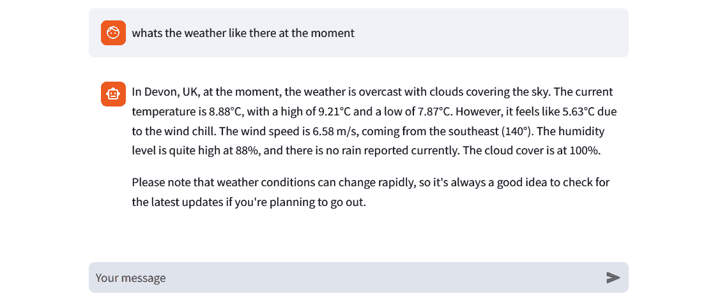

# 8

# 创建您自己的 LangChain 聊天机器人示例

在本章中，我们将结合前几章的关键概念，将其应用于一个实际项目。到目前为止，我们已经涵盖了大量的内容，从对话人工智能基础和提示工程到利用 LangChain 创建 RAG 系统。现在，我们准备通过构建一个由 ChatGPT 驱动的聊天机器人来应用这些知识。

这个项目将展示如何在实际、真实世界的对话人工智能场景中应用 ChatGPT 技术。我们的目标是创建一个自动助手，它不仅能回答关于我们自己的数据的问题，还能处理更复杂的任务并提供个性化服务。

到本章结束时，你不仅将拥有一个功能齐全的 ChatGPT 聊天机器人，而且还将对如何构建更复杂的对话代理有一个扎实的理解。你还将获得洞察力，以更好地评估将 LLM 驱动的代理集成到你的业务运营中的可行性，并确定是否是过渡到现有 NLU 系统的正确时机。

在本章中，我们将涵盖以下关键领域：

+   确定我们的 ChatGPT 项目范围

+   准备我们的聊天机器人数据

+   创建我们的复杂交互代理

+   将所有内容整合在一起——使用 Streamlit 构建您自己的 LangChain 聊天机器人

让我们开始构建我们的聊天机器人，但首先，我们需要考虑我们的对话代理的使用案例和范围。

# 技术要求

在本章中，我们将广泛使用 ChatGPT，因此你需要注册一个免费账户。如果你还没有创建账户，请访问[`openai.com/`](https://openai.com/)，然后在页面右上角点击**开始使用**，或者访问 https://chat.openai.com。

这些示例需要 Python 3.9 和一个安装了 Jupyter 笔记本的环境：[`jupyter.org/try-jupyter/notebooks/?path=notebooks/Intro.ipynb`](https://jupyter.org/try-jupyter/notebooks/?path=notebooks/Intro.ipynb)。

我们将使用 Chroma DB 作为我们的开源向量数据库，因此建议查看并熟悉 Chroma ([`www.trychroma.com`](https://www.trychroma.com))，尽管还有许多其他不同的向量存储提供商选项。

# 确定我们的 ChatGPT 项目范围

每个人都喜欢假期，帮助旅行者通过智能对话自动化是我非常热衷的领域，因此对于我们的用例，我们将创建我们自己的 ChatGPT 驱动的旅行助手。

在这一点上，我们必须对范围保持现实；一个在线旅行代理可能能够执行数千种不同任务，复杂程度各异，但让我们选择一些既有趣又能够结合我们在本书中迄今为止所涵盖的技术的方法。

## 假日助手用例

你为在线旅行社工作，并被指派创建一个由大型语言模型（LLM）驱动的假日助手，旨在彻底改变旅行者选择住宿的方式。在线旅行社在住宿搜索方面往往受限，因此你的挑战是提供更个性化的细致搜索。利用包含描述、评论和其他可能的信息来源（如天气和位置）的酒店数据集，你的目标是构建一个由 ChatGPT 驱动的聊天机器人，能够引导用户找到理想的酒店选择。让我们称我们的代理为艾莉探险者，并深入挖掘她的角色。

## 艾莉探险者的角色轮廓

首先，让我们考虑艾莉的个性和她将向用户提供的能力。

### 艾莉的个性

艾莉热情、友好，知识渊博。她以积极的态度和真诚的帮助意愿对待每一次互动。她的回答深思熟虑且个性化，反映了她对每个用户独特偏好和需求的了解。艾莉不仅仅是一个聊天机器人；她是一个兴奋地帮助用户规划旅行的旅行伴侣，会像朋友一样提供建议。

艾莉的互动以其温暖和热情为特点。她以对话的语气进行沟通，让复杂的旅行规划感觉像与知识渊博的朋友聊天。她的回答迅速、信息丰富，始终考虑用户的需求和偏好。

### 艾莉的能力

让我们概述一下艾莉在处理用户查询时将具备的能力：

+   **学习用户偏好**：艾莉警觉且观察力敏锐，能够迅速捕捉到关于用户旅行偏好、家庭动态和最喜欢的假日活动的微妙暗示。她会在互动中记住这些细节，不断改进对每个用户喜好的理解。

+   **个性化推荐**：利用她对酒店数据集的全面知识，艾莉超越了简单的关键词搜索。她理解自由文本问题，并深入数据库提供与每个用户愿望完美匹配的推荐，无论他们是在寻找家庭友好的度假村、浪漫的度假胜地，还是充满冒险的旅舍。

+   **目的地信息**：艾莉拥有无数目的地的宝贵信息。她可以告诉你何时是访问某个地方的最佳时间，分享当地景点的见解，提供安全建议，甚至教你一些文化小贴士，帮助你更好地融入当地。她的建议总是最新的，确保旅行者拥有最佳的旅行体验。

+   **天气状况**：艾莉密切关注全球的天气状况。她可以提供任何目的地的当前和预报条件，并就天气可能如何影响旅行计划提供建议。无论是建议最适合海滩游玩的最佳日子，还是警告因恶劣天气可能导致的旅行中断，艾莉的指导是无价的。

现在我们已经了解了 Ellie 的能力，让我们看看她的对话能力和我们想要支持的交互类型。

## Ellie 的对话范围

让我们概述 Ellie 将能够进行的对话。她希望能够执行以下类型的交互：

+   **个性化推荐**：根据酒店的数据库，基于用户偏好和以往互动，聊天机器人可以提供个性化的酒店推荐，以满足每个用户的特定需求。我们希望提供比仅针对设施等参数的关键词搜索更多的服务。我们希望支持基于酒店描述和假日制造者评论的免费文本问题，使我们能够向用户提供更细致的建议。

+   **目的地信息**：关于目的地的查询，包括最佳访问时间、当地景点、安全建议和文化提示。

+   **天气状况**：关于特定目的地的当前和预报天气状况，或天气可能如何影响旅行计划的问题。

希望我们的**概念验证**（**POC**）一旦运行正常，我们就能做出明智的决定，是否要制作一个具有更全面功能、包含更大酒店数据集的代理。

## 技术特性

为了创建 Ellie 这个探险家和达到我们概述的对话范围，我们将实现以下功能：

+   一个 RAG 系统来存储关于我们酒店描述的信息，我们可以用它来提供我们的建议

+   LangChain 代理提供与外部数据源交互的工具，以获取最新信息

+   使用 LangSmith 进行性能监控，以便我们可以看到我们的助手的表现

+   一个工作的基于 Web 的聊天机器人界面，我们可以看到我们的对话并与代理交互，同时跟踪正在进行的对话

# 为聊天机器人准备我们的数据

为了使我们的数据准备就绪，我们首先需要获取并处理它，使其处于最干净的状态，以便使用。

## 选择我们的数据源

对于这个项目，我们需要向我们的 LLM 代理提供多种不同类型的特定上下文知识，以便我们可以服务预期的问答类型：

+   **酒店信息**：这将从我们的在线旅行社酒店数据集中获得，因此我们需要一些酒店数据来代表我们想要向用户推荐的酒店。我们将使用的数据集是[`www.kaggle.com/datasets/raj713335/tbo-hotels-dataset`](https://www.kaggle.com/datasets/raj713335/tbo-hotels-dataset)数据集的一个小子集，以提供酒店推荐。这个数据集包含来自不同国家和地区的超过 1,000,000 家酒店的信息，例如它们的费用、评论、设施、位置和星级评定。数据是从各种来源收集的，例如酒店网站、在线旅行社和评论平台。我们将使用这个数据集的一个更小的版本，以降低我们的模型交互成本。

+   **位置天气**：用户可能会询问特定位置的天气，因此我们将使用免费的天气 API Open-Meteo。

+   **详细位置信息**：为了提供最新的位置信息，我们将使用维基百科，这样我们就可以通过位置进行搜索。

## 准备酒店数据

我们将要使用的酒店数据集`hotel-info-chapter8-001.csv`是一个包含约 900 条来自世界各地酒店的**CSV**文件，以提供一些多样性。这些数据包含以下列：

`countryCode`、`countryName`、`cityCode`、`cityName`、`HotelCode`、`HotelName`、`HotelRating`、`Address`、`Attractions`、`Description`、`HotelFacilities`、`Map`、`PhoneNumber`、`PinCode`、`HotelWebsiteUrl`和`Reviews`

这些内容都比较容易理解；我们最感兴趣的列是`Description`和`Reviews`列，因为我们打算使用这些数据作为我们 RAG 系统的基石，以帮助艾莉提供酒店推荐。所以，为了总结，我们需要做什么来使这些数据对 RAG 可用？我们需要*清洗数据、分块创建嵌入，并将数据作为嵌入存储，以便我们以后可以检索它？。

### 清洗和标准化数据

在创建嵌入之前，我们需要确保我们的`Description`和`Reviews`列中的数据是干净和标准化的。这涉及到移除任何 HTML。如果你查看`descriptions`字段，你会注意到其中包含带有 HTML 标签的文本，所以我们应该做的第一件事就是清理这些内容。为此，我们可以使用 Python 的`bs4`包中的`BeautifulSoup`库。在下面的代码中，我们将使用`remove_html_tags`函数移除`Descriptions`和`Attractions`中的任何 HTML：

```py
def remove_html_tags(text):
    if pd.isna(text):
        return ""  # Return an empty string for NaN values
    elif isinstance(text, str):
        return BeautifulSoup(text, "html.parser").get_text()
    else:
        # Convert non-string, non-NaN values to string
        return str(text)
df['Description'] = df['Description'].apply(remove_html_tags)
df['Attractions'] = df['Attractions'].apply(remove_html_tags)
```

我们清洗过程的其它改进可能包括标准化缩写（例如，将`Rest.`改为`Restaurant`）和纠正拼写错误。标准化数据有助于减少嵌入的方差，从而提高推荐的准确性。

### 创建我们的数据块

让我们看看如何从`Description`和`Reviews`列创建我们的块。你可以用多种不同的方式来做这件事；我们使用 LangChain 文档加载器，但在一个可能拥有大量数据集的生产环境中，你可能会发现使用我们在上一节中用来清理数据的`pandas`库更高效。在我们的方法中，我们从 CSV 文件中读取数据，从每一行创建一个字典，以便我们可以访问列值，查看每个文档，然后从`Description`和`Reviews`列创建块：

1.  `CSVLoader`类用于此目的。指定文件路径、包含酒店名称的列以及任何其他元数据列。我们使用`HotelName`作为源列：

    ```py
    loader = CSVLoader(
        file_path="hotel-info-chapter8-001_cleaned.csv",
        source_column="HotelName",
        metadata_columns=["countyCode", "countyName",
            "cityCode", "cityName", "HotelCode", "HotelName",
            "HotelRating", "Address", "Attractions",
            "HotelFacilities", "Map", "PhoneNumber",
            "PinCode", "HotelWebsiteUrl"]
    )
    docs = loader.load()
    ```

1.  使用`RecursiveCharacterTextSplitter`进行此操作，设置块大小和重叠以确保文本分析的连续性。描述实际上并不大，但为了我们的示例，目标是将它们分解成足够小的块，以提供有关每个酒店的某些粒度信息：

    ```py
    splitter = RecursiveCharacterTextSplitter(
        metadata  and page_content, ready for downstream processing:

    ```

    chunked_docs = []

    for doc in docs

    content_dict = {}

    pairs = doc.page_content.split('\n')

    for pair in pairs

    if ': ' in pair:

    key, value = pair.split(': ', 1)

    content_dict[key.strip()] = value.strip()

    for column in content_columns:

    if column in content_dict and content_dict[column]:

    chunks = splitter.split_text(content_dict[column])

    chunked_docs.extend(

    [

    Document(page_content=doc_part,

    metadata=doc.metadata)

    for doc_part in chunked_doc_parts

    ]

    )

    ```py

    ```

我们希望遍历每个 CSV 记录，并选择`Description`和`Review`，然后分别分块处理，这样每个包含原始 CSV 元数据的块就添加到我们的`chunked_docs`列表中，以便创建嵌入。

### 创建我们的嵌入

一旦我们得到了分块文本，我们希望创建我们的嵌入。对于我们的向量数据库，我们将使用 Chroma DB 和 OpenAI 模型来创建嵌入。我们将数据库存储在本地，并使用最新的 OpenAI 嵌入模型`text-embedding-3-small`来创建嵌入。为了降低我的 OpenAI 嵌入成本，我只会从前 100 个块中创建嵌入；至于你想要为你的项目创建多少，那就取决于你了：

```py
embeddings_model = OpenAIEmbeddings(
    model="text-embedding-3-small")
chroma_document_store = Chroma(
    collection_name="chapter8db_hotel_store",
    embedding_function=embeddings_model,
    persist_directory="chapter8db",
)
chroma_document_store.add_documents(chunked_docs[:100])
```

我们可以通过查看具有`count()`的记录数或进行相似度搜索来测试我们是否在存储中有了记录：

```py
print("There are",
    chroma_document_store._collection.count(),
    "in the collection")
similar_documents = chroma_document_store.similarity_search(
    query="I'm interested in going trail running",k=1)
similar_documents
```

现在我们已经将酒店嵌入及其元数据存储好了，我们可以开始创建我们的代理将用来与这些数据和其他来源交互的工具。

# 创建我们的代理以进行复杂交互

我们代理将要由提供满足我们需求功能性的工具驱动。主要概念是代理将能够接收我们的问题，并使用一个 LLM 调用进行推理，将这个任务分解成更小的任务，同时决定使用哪些工具来满足我们的请求并给出问题的答案。代理使用的推理过程在以下图中展示：



图 8.1 – 代理的推理过程

首先，创建一个专门的文件夹，将包含我们代理的所有代码。这将帮助我们组织项目文件，并使代码库更容易导航。我将把这个文件夹命名为 `streamlit`，因为我们将在那里创建我们的 Streamlit 应用。

将我们创建的用于存储向量的 Chroma 数据库复制到这个文件夹中：`path to` `your project\streamlit\chapter8db\`。

接下来，创建一个名为 `tools` 的文件夹，这样我们就可以开始创建代理的工具。

## 创建代理工具

在我们创建 LangChain 代理之前，我们需要创建 LangChain 工具以满足我们的需求。我们将尝试使用代理工具实现所有我们的功能，包括 RAG 功能：

+   酒店信息

+   天气信息

+   位置信息

每个工具都将具备执行其自身任务的能力。让我们逐一处理；目前，创建一个名为 `tools` 的文件夹，我们将在这里保存用于最终项目的工具。

### 定制酒店推荐

第一个工具可以说是对我们应用最重要的，因为这个工具将与我们向量存储交互，构成我们 RAG 系统的检索部分。我们将创建一个自定义工具来完成这项任务。当我们开始思考代理如何执行这些搜索时，有几个挑战需要克服。

我们目前将嵌入存储在我们的向量存储中，因此我们需要创建一个检索器，它将接受查询以在这些嵌入中搜索，例如“*你能推荐一些有* *美食* *的酒店吗？*”

记住我们已经将我们的文本嵌入与其元数据一起存储。更有用的事情是，如果我们能够像使用关系数据库一样过滤我们的嵌入元数据。例如，`hotel countryName` 和 `HotelRating` 都在我们的元数据中有所表示。所以，如果我们想寻找特定国家特定评分的酒店相似文档，我们的问题可能类似于“*你能推荐一家在英国有* *美食* *的四星级酒店吗？*”

幸运的是，Chroma DB 提供了在元数据上过滤查询的能力，因此我们知道我们可以通过我们的向量存储实现这一点。

接下来要考虑的是如何在我们的 LangChain 工具中实现这一点。第一个挑战是我们希望从问题中提取参数，以便我们可以将这些参数用于下游，特别是在我们的 chroma 查询中。

一种方法是与 LLM 交互，从用户交互中提取相关的搜索参数，然后将这些参数输入到您的检索器中，以对 Chroma DB 执行搜索。然而，在深入之前，查看 LangChain 生态系统已经提供的功能总是最好的实践。事实上，我们已经有一些可以利用的东西，那就是`SelfQueryRetriever`，这是一个专门构建来执行此任务的检索器。让我们将其分解为详细的步骤，解释每个组件的作用以及它们是如何集成的。

1.  `hotel_search.py`。

1.  `OpenAI Embeddings`。这个模型负责将文本转换为向量表示，这些表示用于语义搜索，并且这是我们创建嵌入时使用的相同模型：

    ```py
    from langchain_openai import OpenAIEmbeddings
    embeddings_model = OpenAIEmbeddings(
        model="text-embedding-3-small")
    ```

1.  使用`embeddings_model`来执行语义搜索。存储在 Chroma 中的文档可以根据其与查询字符串的语义相关性检索：

    ```py
    from langchain.vectorstores.chroma import Chroma
    chroma_document_store = Chroma(
        collection_name="chapter8db_hotel_store",
        embedding_function=embeddings_model,
        persist_directory="chapter8db",
    )
    ```

1.  `HotelRating`、`cityName`和`CountryName`。您可以随意添加任何其他您想要搜索的参数：

    ```py
    from langchain.chains.query_constructor.base import AttributeInfo
    metadata_field_info = [
        AttributeInfo(name="HotelRating",
            description="Hotel rating", type="string"),
        AttributeInfo(name="cityName",
            description="Name of the city", type="string"),
        AttributeInfo(name="countryName",
            description="Name of the country", type="string"),
    ]
    ```

1.  `SelfQueryRetriever`使用语言模型、文档存储和我们在上一步中定义的元数据信息初始化。它被配置为在其索引内容内执行基于相似度的搜索，找到与用户查询在语义上相关的文档：

    ```py
    from langchain_openai import OpenAI
    from langchain.retrievers.self_query.base import SelfQueryRetriever
    # Initialize the language model with a specific temperature
    llm = OpenAI(temperature=0.0)
    retriever = SelfQueryRetriever.from_llm(
        llm=llm,
        document_store=chroma_document_store,
        document_content_description="Reviews and Descriptions of hotels",
        metadata_field_info=metadata_field_info,
        verbose=True,
        search_type='similarity',
        search_kwargs={'k': 10}
    )
    ```

    我们还限制了返回的文档数量为 10，并设置`verbose=True`，以便我们可以查看输出。让我们继续创建我们的提示。

1.  `PromptTemplate`被定义出来，以确保从文档中检索到的信息在回答用户查询时对 LLM 呈现得清晰：

    ```py
    from langchain_core.prompts import PromptTemplate
    template = """you can use the info below to answer questions. Helpful Answer: HotelName: {HotelName} CountryName: {countryName} CityName: {cityName} Address: {Address} HotelRating: {HotelRating} HotelWebsite: {HotelWebsiteUrl}\n\n{page_content}"""
    prompt = PromptTemplate(
        input_variables=["HotelName", "HotelRating",
            "countryName","cityName","Address", "HotelWebsiteUrl"],
        template=template,
    )
    ```

    现在我们已经创建了我们的提示，我们可以将所有这些整合在一起来创建我们的工具：

1.  使用`create_retriever_tool`，传入工具的标题、传递给检索器的描述以及我们创建的文档提示：

    ```py
    retriever_description = """
    "Searches and provides hotel suggestions by searching by question, return the Hotel name, Hotel Rating, Hotel City, Description, Website and a short summary from the metadata. If there are no hotels matching, state that it can't find any hotels with this criteria
    """
    hotel_search = create_retriever_tool(
        retriever,
        "search_hotel_suggestions",
        retriever_description,
        document_prompt=prompt
    )
    ```

`create_retriever_tool`返回我们的工具类型为`Tool`。最后一步是将`hotel_search`集成到我们的 LangChain 对话代理中，我们将在创建代理时通过将其传递给`AgentExecutor`来实现。为了回顾，这个代理将处理关于酒店推荐的用户查询，利用`SelfQueryRetriever`的语义搜索能力，该检索器现在理解在酒店问题中查找和处理的元数据，为用户提供有用的酒店推荐。

### 天气信息

我们可以创建一个自定义工具来提供我们的天气信息。创建自定义工具最简单的方法是使用`@tool`注解一个函数。

因此，对于我们的天气工具，构建起来很简单。我们创建了一个名为 `search_weather` 的函数，装饰器使用该函数作为工具名称，描述是从文档字符串中提取的。对于天气数据，我们将使用 `OpenWeatherMap`，为了使调用此 API 的过程既简单又方便，我们将使用 Langchain 实用工具，`OpenWeatherMapAPIWrapper`。再次强调，如果您想为您的 ChatGPT 应用消费某个服务，在构建任何定制工具之前，总是先在 LangChain 生态系统中四处看看。创建一个名为 `search_weather.py` 的文件，并添加以下内容：

```py
from langchain.tools import BaseTool, StructuredTool, tool
from langchain_community.utilities import OpenWeatherMapAPIWrapper
os.environ["OPENWEATHERMAP_API_KEY"] = st.secrets.OPENAI_API_KEY
@tool
def search_weather(query: str) -> str:
    """A weather tool optimized for comprehensive up to date weather information.
    Useful for when you need to answer questions about the weather, use this tool to answer questions about the weather for a specific location.
    Look in context for the location to provide weather for"""
    weather = OpenWeatherMapAPIWrapper()
    weather_data = weather.run(query)
    return weather_data
```

前往 [`openweathermap.org/api/`](https://openweathermap.org/api/) 并注册一个账户以获取您的 API 密钥。这需要作为一个环境变量可用。我们将在创建聊天应用时查看如何设置环境变量。

### 位置信息

我们希望创建一个工具，用最新的数据回答有关酒店位置的问题，这样我们就可以将这些结果添加到我们的上下文中。有几种选择。我们可以使用 Tavily 搜索引擎，这是为 LLMs 定制的搜索引擎，LangChain 中也有一个现成的工具，`TavilySearchResults`。

然而，一个寻找信息的好地方是维基百科，所以让我们将其作为我们工具的信息来源。

我们将使用一个现成的 LangChain 工具与维基百科进行交互，`WikipediaQueryRun`。您需要通过运行 `pip install --upgrade --quiet Wikipedia` 来安装 Wikipedia Python 包。

创建这个工具很简单——创建一个名为 `wikipedia.py` 的文件，并添加以下内容以创建 Wikipedia API 包装器：

```py
from langchain.tools import WikipediaQueryRun
from langchain_community.utilities import WikipediaAPIWrapper
api_wrapper = WikipediaAPIWrapper(top_k_results=5,
    doc_content_chars_max=500)
```

包装器提供了一些微调维基百科搜索结果的有用方法，因此我们已将返回的结果数量限制为 5，并将每个返回文档的内容限制为 500 个字符。

接下来，通过传递我们的包装器并给出工具描述来创建工具：

```py
wikipedia_search = WikipediaQueryRun(
    api_wrapper=api_wrapper,
    description="look up tourist information for locations")
```

现在，我们将在我们的代理中使用这个工具。在下一节中，我们将探讨如何使用我们创建的工具来创建我们的 LangChain 代理。在下一节中，我们将通过创建一个能够利用我们创建的工具的代理来将这些所有元素结合起来。

# 整合所有元素——使用 Streamlit 构建您自己的 LangChain 聊天机器人

让我们开始构建我们的基于 Web 的聊天机器人，以便我们可以使用 LangChain 与 ChatGPT 交互。为了实现这一点，我们将使用 Streamlit Python 库来构建界面。Streamlit 丰富的现成组件和实用工具，以及出色的文档，使我们能够迅速开发一个功能性的基于 Web 的聊天机器人。它简单而强大的功能支持快速原型设计和迭代改进，非常适合我们的聊天机器人项目。Streamlit 简化了交互元素的集成，并提供了许多现成的功能，这将缩短我们的开发时间，并使我们能够专注于 LangChain 项目。

确保您已使用 `pip install streamlit` 或其他许多其他方式安装了 Streamlit。我使用 Anaconda，所以我使用这个发行版。您可以通过运行 `streamlit hello` 来测试您是否已正确安装 Streamlit。

在我们的项目文件夹中，创建一个名为 `app` 的文件夹，我们将在此文件夹中存储我们的应用程序代码。将您之前创建的工具复制到 `app`/`tools` 下的工具文件夹中。接下来，让我们看看如何管理我们的 API 密钥。

## 创建密钥和配置管理

Streamlit 的第一个魔法技巧将是使用现成的密钥管理器。Streamlit 提供了基于文件的密钥管理功能，使我们能够轻松存储和安全管理我们的 API 密钥并管理项目。创建一个名为 `.streamlit` 的文件夹和一个名为 `secrets.toml` 的文件，然后添加本项目所需的 API 密钥：

+   `OPENAI_API_KEY="YOUR KEY"`

+   `LANGCHAIN_API_KEY="YOUR KEY"`

+   `OPENWEATHERMAP_API_KEY="YOUR KEY"`

在开发过程中，Streamlit 会自动将 `secrets.toml` 中的密钥加载到您的项目目录中，并提供选项，如果您想通过 Streamlit Cloud 界面部署或使您的应用程序公开可用。接下来，让我们继续创建我们的代理代码。

## 创建我们的代理服务

让我们在一个专门的 LangChain 服务文件中组织我们的 LangChain 服务代码。

1.  **创建 LangChain 服务**：首先创建一个用于 LangChain 服务的 Python 文件，并将其存储在应用文件夹中。这个文件可以命名为 langchain_service.py。这个文件将包含设置和运行您的代理所需的所有必要代码。

1.  `ChatOpenAI` 模型，`AgentExecutor` 用于管理提示和对话记忆，以及我们在早期步骤中创建的工具（`weather_search`、`wikipedia_search` 和 `hotel_search`），这些工具旨在为特定的聊天机器人功能设计。

1.  `setup_agent` 创建一个 `AgentExecutor` 实例，配备特定的工具和设置以用于聊天机器人：

    ```py
    def setup_agent(msgs: list, openai_api_key: str, 
        langchain_api_key: str, openweathermap_api_key: str
    ) -> AgentExecutor:
    os.environ["OPENAI_API_KEY"] = openai_api_key
    os.environ['LANGCHAIN_TRACING_V2'] = "true"
    os.environ['LANGCHAIN_ENDPOINT'] = "https://api.smith.langchain.com"
    os.environ['LANGCHAIN_PROJECT'] = "ellie_chatbot"
    ```

    前面的参数包括来自 Streamlit 应用和 OpenAI、LangChain 以及 `OpenWeatherMap` 服务的 API 密钥的消息列表，用于会话历史。然后我们设置环境变量，以便 LangChain 可以访问它们。我还设置了环境变量，以便我们可以在 LangSmith 中跟踪一切，以及一个项目名称，这样我们就可以轻松跟踪我们与 Ellie 的所有交互。

1.  创建 `ChatOpenAI` 时指定了特定的温度和模型参数。我们还创建了我们的工具列表：

    ```py
    llm = ChatOpenAI(temperature=0.0, model='
        gpt-4-1106-preview',verbose=True)
    tools = [hotel_search,weather_search,wikipedia]
    hub_prompt = hub.pull("hwchase17/openai-tools-agent")
    ```

    预定义的工具（`hotel_search`、`weather_search` 和 `wikipedia`）将添加我们的专用功能，代理将根据提出的问题决定使用哪些功能。`hub_prompt` 是通过 `hub.pull` 获取的，它从 LangChain hub 中获取一个预定义的提示模板。如果您想有更多的控制权，可以手动创建，但对我们这个例子来说，这已经足够完美。

1.  `ConversationBufferWindowMemory`，它将为我们的聊天机器人提供对话记忆，并允许它提供上下文感知的回复。注意，我们通过设置 `k=20` 来保留最后 20 个交互的记忆，并且我们还从我们的 Streamlit 代理中传递一个消息列表 (`msgs`) 到 `chat_memory`，这使得我们可以将代理记忆与 Streamlit 会话状态联系起来。

1.  `create_openai_tools_agent` 函数。这个 LangChain 函数创建了一个能够使用 OpenAI 的 `tools` 功能的代理：

    ```py
    agent = create_openai_tools_agent(llm, tools, hub_prompt)
    ```

    使用语言模型 (`llm`)、工具列表和 `hub_prompt` 调用 `create_openai_tools_agent` 来创建一个配置好的代理。

1.  `AgentExecutor`，它使用创建的代理、工具、内存配置和详细设置进行实例化。这个执行器管理聊天机器人的执行流程，处理输入，并根据集成的工具和对话记忆生成响应。`setup_agent()` 函数返回 `AgentExecutor` 实例，现在它已准备好在 Streamlit 聊天机器人应用程序中使用。我们将在下一节中查看如何创建这个应用程序以及如何使用我们的 LangChain 服务：

## 构建我们的 Streamlit 聊天应用

现在我们所有的组件都已准备就绪，是时候构建我们的聊天机器人了。首先创建一个名为 `main.py` 的文件；这个文件将作为主要的 Streamlit 脚本。在这个脚本中，我们将开发 Ellie 的聊天机器人界面。让我们一步步来创建这段代码：

1.  使用 `streamlit (as st)` 为我们的聊天机器人元素。我们还导入 `setup_agent()`。这个函数来自我们创建的 `langchain_service.py`，它使用必要的配置和 API 密钥初始化聊天机器人的代理。

1.  `init_streamlit()` 函数；这个函数使用 `st.set_page_config` 设置 Streamlit 页面配置，指定页面标题和图标。我们还使用 `st.title("✈️ Ellie the explorer ")` 给我们的页面一个标题。

1.  `StreamlitChatMessageHistory` 是一个类，允许您在 Streamlit 应用中存储和使用聊天消息历史，

    `msgs = StreamlitChatMessageHistory()`。

    它与 LangChain 无缝工作，允许您将聊天消息历史集成到您的 LangChain 链中。它通过在指定的键（默认为`langchain_messages`）中存储消息来实现。然后，我们将此内存的引用传递给我们的代理。

1.  `prepare_agent`和`setup_agent`使用存储在`st.secrets`中的聊天消息历史和 API 密钥，返回一个配置好的`AgentExecutor`。

1.  `AgentExecutor`和`prepare_agent()`用于创建我们的`agent_executor`

    `agent_executor: AgentExecutor = prepare_agent(msgs)`，将聊天消息历史和从`st.secrets`获取的 API 密钥传递给从我们的 LangChain 服务代码`langchain_service.py`导入的`setup_agent()`函数，该函数返回为聊天机器人配置的`AgentExecutor`实例。

1.  **显示欢迎消息**：在对话开始时向用户添加欢迎词，指导他们如何与聊天机器人交互：

    ```py
    if len(msgs.messages) == 0:
        msgs.add_ai_message(welcome)
    ```

    如果是初始加载（即，历史中没有消息），则定义并添加消息到聊天历史。

1.  **用户交互和响应处理**：接下来，我们想要处理用户输入。如果用户输入一个新的提示，我们将生成并绘制一个新的响应：

    ```py
    if prompt := st.chat_input():
        st.chat_message("human").write(prompt)
        try:
            response = agent_executor.invoke({"input": prompt})
            if 'output' in response:
                st.chat_message("ai").write(response['output'])
            else:
                st.error("Received an unexpected response format from the agent.")
        except Exception as e:
            st.error(f"An error occurred: {str(e)}. Please try again later.")
    ```

    可以添加一个可选组件，以便您可以轻松查看存储在`st.session_state.langchain_messages`中的内容。这是一个展开小部件（`st.expander`），用于以 JSON 格式显示消息历史。

    应用程序通过`st.chat_input()`监听用户输入。当接收到输入时，它使用`st.chat_message()`将其显示为`human`消息。

    然后将输入传递给`agent_executor.invoke()`以处理响应，如果成功，则将响应作为`ai`消息显示给用户。

    我们还处理响应格式错误以及从我们的代理调用返回的错误；如果有错误，则使用`st.error()`显示此消息。

    如果脚本是主程序（即，不是作为模块导入），则调用`init_streamlit()`以启动应用程序：

    ```py
    if __name__ == "__main__":
        init_streamlit()
    ```

就这些了！现在，一切应该都已经就绪，可以创建一个功能性的聊天机器人。在下一节中，让我们来试一试。

## 运行和测试我们的聊天机器人应用程序 Ellie

要运行这个 Streamlit 应用程序，请确保您已经在 Python 环境中安装了 Streamlit 以及所有必要的包。然后，导航到包含`main.py`文件的目录，并在您的终端中运行以下命令：

```py
streamlit run app/main.py
```

此命令启动 Streamlit 网络服务器，并在您的默认网络浏览器中打开应用程序，允许您与聊天机器人交互。如果存在问题，请检查您的 API 密钥和任何其他必需的配置是否已正确设置在`st.secrets`中，并且已适当地传递给`setup_agent()`函数，以便应用程序按预期运行。您还应该能够在开始与聊天机器人交互后看到您的日志出现在 LangChain 中，这使您能够深入了解每次运行。

让我们尝试我们的第一个酒店推荐搜索。我们得到了一个有用的结果，如以下输出截图所示：



图 8.2 – 向我们的代理请求酒店推荐

代理查看问题并选择使用哪个工具来满足请求。这个问题是针对酒店的，因此代理调用我们的`hotel_search`工具来回答我们的问题。记得查看 LangSmith 中的调试输出以查看项目的单个运行。这将允许你看到对 LLMs 的单独调用，从而深入了解你的代理如何与不同的 LLMs 交互以决定使用哪个工具，并返回我们的响应，以及针对单个工具的其他特定任务 – 例如，提取用于过滤我们的向量搜索的参数。以下 LangSmith 截图显示了这一点：



图 8.3 – 查看 LangSmith 中我们的代理对 LLMs 的调用

随意尝试你自己的问题，任何与你的数据相关的问题。

我们还应该能够提出后续问题，以便代理练习其他工具。在以下截图中，我们还询问了天气，你可以看到 Ellie 使用我们的天气搜索工具提供数据。



图 8.4 – 我们提出一个特定于天气的问题来测试我们的天气工具

通过询问关于该地区的具体信息来尝试使用`wikipedia_search`工具。

因此，我们现在有一个基于 ChatGPT 的运行良好的代理，这可以作为一个更高级代理的良好基础。让我们看看你可以实施的其他改进。

## 改进 Ellie 的方法

你可以实施许多不同的增强来改进 Ellie 的旅行助手功能：

+   改进聊天界面 – 例如，实现流式回答

+   通过增强我们的 LangChain 代理，提供更复杂的交互，以便我们可以执行更复杂的交易任务

+   学习用户偏好 – 他们的兴趣、家庭状况以及他们喜欢在假期做什么

+   通过向量存储增强聊天机器人内存，以便在会话之间持久化对话，以便可以使用

+   查看分块策略以改进向量嵌入，以实现更好的搜索

到目前为止，你所创建的只是一个起点，是创建更复杂的 ChatGPT 代理的良好基础。这些增强中的任何一个都值得实施以改进 Ellie 的能力。

# 摘要

在本章中，我们探讨了创建一个由 ChatGPT 驱动的对话代理的真实世界示例，使用了我们在前几章中介绍的一些技术和方法。我们的示例经过精心设计，涵盖了聊天机器人的用例、功能和特性，使我们能够有效地应用我们对 LangChain、RAG 系统和相关工具的知识。您还介绍了 Streamlit 库来创建丰富的聊天界面，并看到了如何将其与 LangChain 结合使用。希望我们已经实现了我们的代码库，使我们的代理可扩展，并且可以用于更复杂的项目。我们已经实现了我们的目标，即创建一个具有我们自己的数据知识并能够使用外部信息和来源的 ChatGPT 对话代理。

我们已经创建了我们的原型并验证了我们的概念。这是一个开始，但在创建更广泛的应用程序并上线之前，还有很多事情需要考虑。在我们的最后一章中，我们将考虑使用到目前为止所学的内容进入生产，以及我们需要创建哪些其他核心功能来实现这一目标。我们还将考虑 ChatGPT 的其他替代方案以及小型语言模型的兴起和重要性。最后，我们将得出一些结论，并探讨在当前技术状态下我们将如何继续前进。

# 进一步阅读

以下链接是本章中使用的资源精选列表：

+   Streamlit:

    [`streamlit.io/`](https://streamlit.io/)

+   LangSmith:

    [`smith.langchain.com/`](https://smith.langchain.com/)

+   嵌入模型：

    [`python.langchain.com/docs/integrations/text_embedding`](https://python.langchain.com/docs/integrations/text_embedding) 和 [`platform.openai.com/docs/guides/embeddings/embedding-models`](https://platform.openai.com/docs/guides/embeddings/embedding-models)

+   Chroma DB:

    [`docs.trychroma.com/`](https://docs.trychroma.com/)
