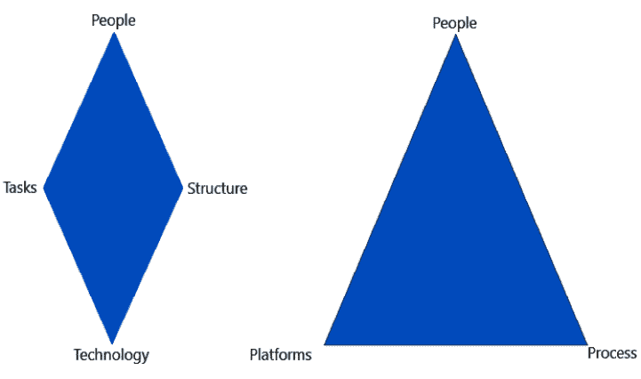
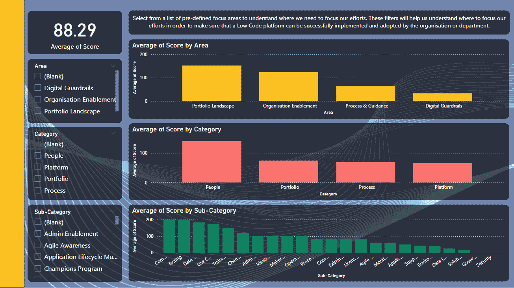
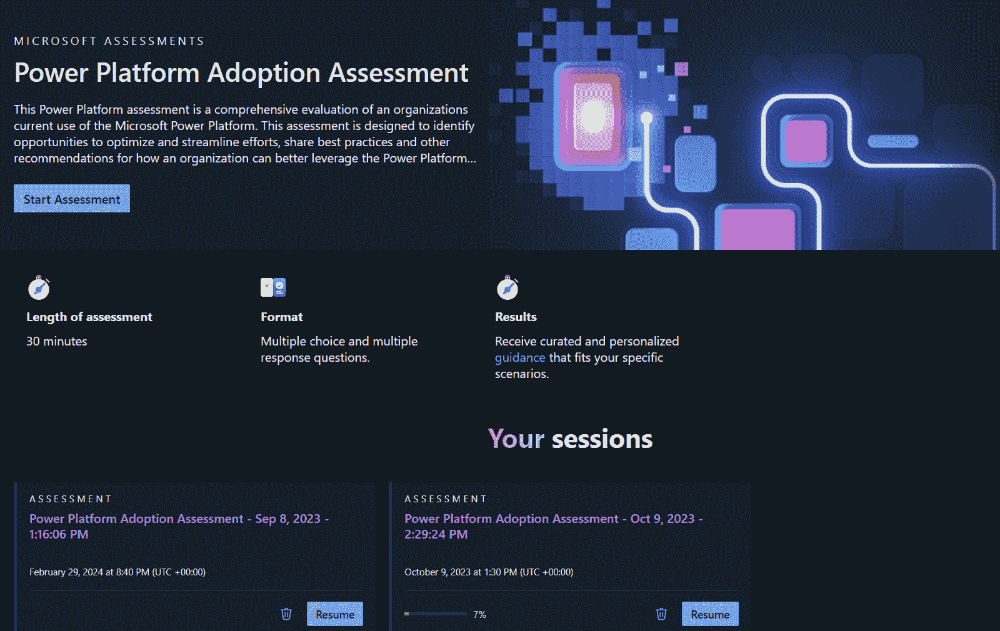
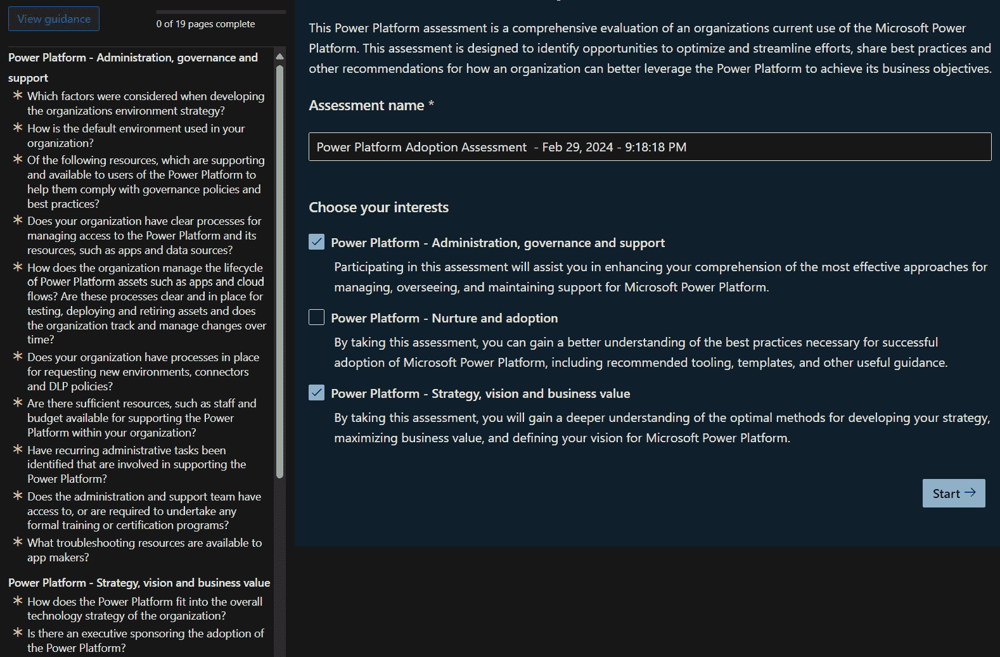
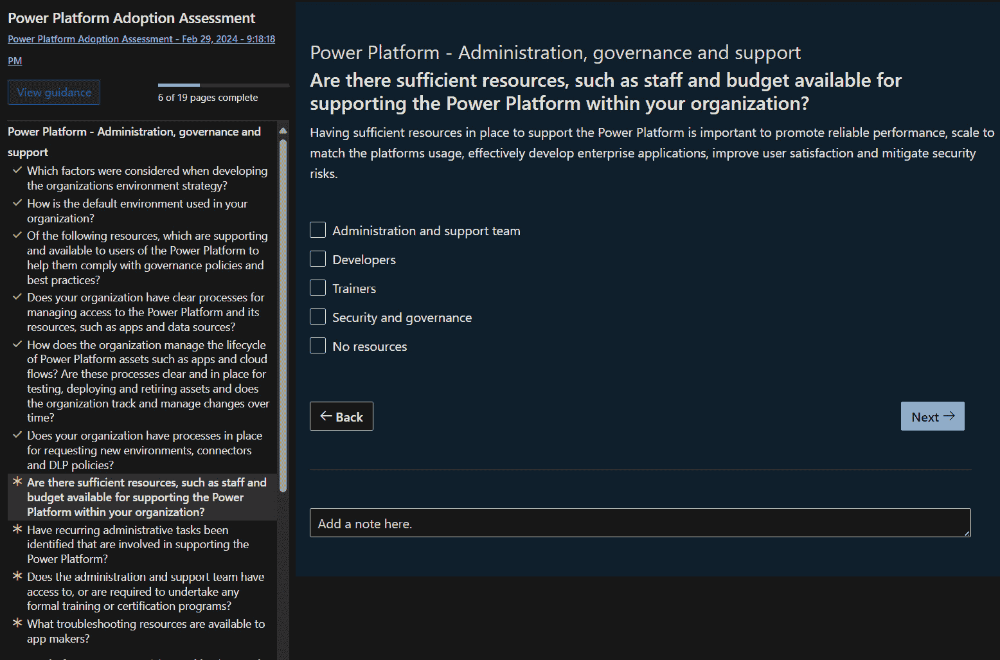
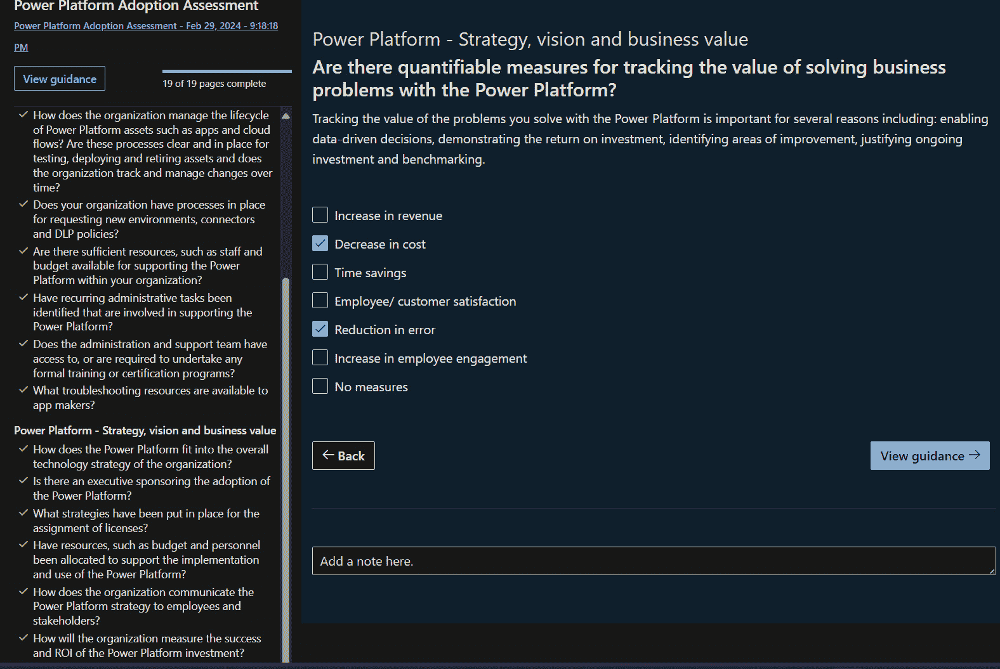
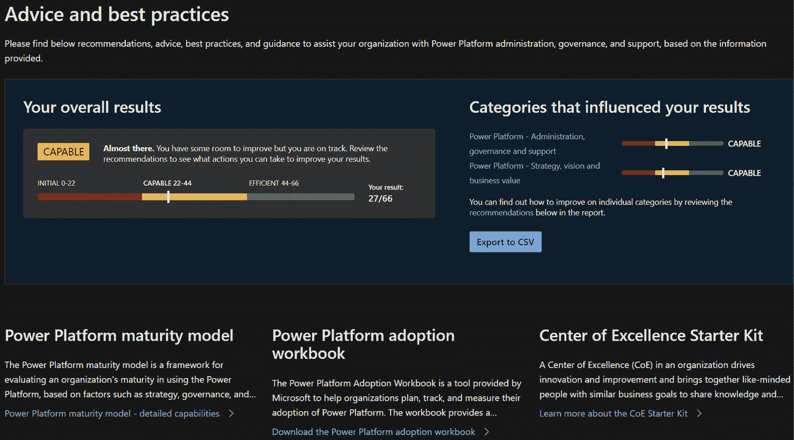
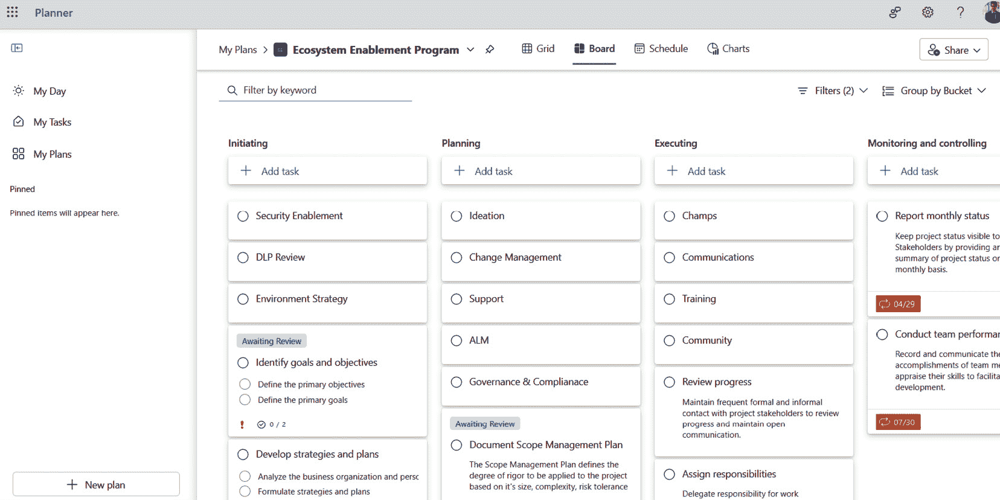

# 2

# 衡量增长：评估数字成熟度以实现战略进步

对于寻求在 Power Platform 内部实现战略进步的组织来说，衡量增长和评估数字成熟度至关重要——这是微软为低代码应用开发和流程自动化提供的一套综合工具。为了评估数字成熟度，组织通常采用一个框架，该框架将不同维度的成熟度水平进行分类。

一种常见的数字成熟度评估框架包括基础、发展、高级和领先等层次。在基础层次，组织处于采用 Power Platform 的早期阶段，对平台的认知和利用有限。在发展阶段，组织开始扩大其使用范围，并熟练利用平台的功能。高级成熟度表明了更高的熟练度水平，其中组织在流程、治理和跨部门的成功采用方面已经建立了良好的基础。最后，在领先层次，组织处于创新的前沿，通过 Power Platform 推动持续改进，并通过卓越的结果展示其能力。

**卓越中心**（**CoE**）和**赋能中心**（**C4E**）在评估和提升 Power Platform 内部的数字成熟度方面发挥着至关重要的角色。卓越中心负责评估组织当前的成熟度水平，识别差距，并制定战略路线图以推动进步。它建立了 Power Platform 采用的最佳实践、治理框架和标准，确保了数字化转型的方法结构化。赋能中心专注于构建能力，并使用户能够充分发挥 Power Platform 的潜力。它提供培训、资源和支持，以提升技能和熟练度，使员工能够有效地为组织的数字成熟度之旅做出贡献。

通过采用成熟度框架和利用 Power Platform 内部的 CoE 和 C4E 的专长，组织可以系统地评估其在各个维度的数字成熟度，并战略性地提升其能力。这种全面的方法确保了对当前状态的清晰理解，确定了改进领域，并引导组织向更高的数字成熟度水平发展。随着组织通过成熟度层次的发展，它们能够推动创新，简化流程，并在 Power Platform 生态系统内实现可持续增长。

在本章中，我们将涵盖以下主题：

+   理解 Power Platform 中的数字成熟度

+   Power Platform 采用中的成熟度层次导航

+   通过 CoE 推动数字成熟度

+   赋能 Power Platform 中的数字成熟度

# 理解 Power Platform 中的数字成熟度

各种机制允许组织在中央或各个部门或实践社区中测量其 Power Platform 生态系统的成熟度。通常，根据我们可能与之合作的组织或部门，“成熟度”这个词可能相对负面，因此行业利用“就绪”这个词来推动进程。确保无论哪个组织部门，或者整个组织本身，都“就绪”承担拥抱、采用和管理低代码生态系统的责任是很重要的。

对于“就绪”这一概念，有许多不同的解释。有时，对“就绪”这一概念的实际定义需要被明确界定。这里的“就绪”是指你已经建立了技术基础设施并定义了环境策略，还是指你已经安装了 Microsoft CoE Starter Kit 并决定就这样了？有定义的多种就绪状态，实际上，即使是大多数 Microsoft Power Platform 合作伙伴对“良好的就绪状态”的看法也可能不同。通常，这种观点或视角可能与微软的说法有所不同。最终，将会有几种不同的“就绪”模型。根据你组织的规模和复杂性，对就绪评估深度的需求也会有所不同。

例如，如果你是一个刚刚起步的五人团队，并且希望使用 Power Platform 来构建和运行帮助你在日常工作中提高业务生产力的解决方案，你可能不需要走一条包含 500 个问题的评估路线，这个评估侧重于所有低代码技术护栏、用户接受度、制作者赋能和流程自动化的各个方面。这并不符合你真正需要的，最终会过于繁重。你希望快速开始，并尽快建立基础。

如果你是一个拥有全球影响力、多个部门、实践社区和不同子公司的五十万人的组织，那么根据被评估的业务层级，你肯定需要考虑一个更深入的评估。这很重要，因为将存在更多的流程，并且许多不同的团队将受到广泛工具发布的冲击，这些工具将推动生产力。

最终，没有一种方案适合所有人，那么最好的方法是什么？

## 人员、流程、平台（技术）

在我们决定开始评估一切之前，让我们回顾一下。找到至少大多数组织都有共同点的共同点（或共同*点*）是很重要的。这使得更加专注变得容易。大约在 20 世纪 60 年代，一个名叫哈罗德·莱维特的人提出了一个名为*莱维特钻石*的模型。钻石的四个角代表**人员**、**结构**、**技术**和**任务**。后来在 20 世纪 90 年代，结构和任务角被合并为一个代表**流程**的单个角。在最近的改编中，技术被更新为**平台**。这如图*2.1*所示：

图 2.1：莱维特钻石及其最近以三角形形式的一种改编

当观察核心的大多数组织时，大多数组织由人员组成。人员是大多数企业的核心，将推动增长。提高人员生产力是确保在更短的时间内更准确、完成更多工作的关键。事实上，*许多*企业都吹嘘人员是他们的核心，对他们来说是最重要的。

为了确保事情被正确完成，制定了一套规则。这些规则被称为流程。流程定义了“*我们在这里是如何做事的*”。流程考虑得越好，制定得越完善，人们的工作就越容易进行。

良好的流程是可重复的。人员和流程需要工具来高效工作。在这个现代世界中，有些人将这些工具称为*应用*或*自动化*，但当然，范围*远不止*这两件事。这些工具最终的目标是使人们的生活更轻松，从而提高工作效率，节省时间。实际上，其中一些流程可以完全自动化，以至于甚至不需要人在其中。平台通常提供这些工具，使人们能够更高效地遵循这些流程。

如果准备评估可以集中在这些核心领域，那么为许多组织设定一个共同的基准准备分数就会容易得多。这是因为大多数公司都会以某种形式将这三个核心领域作为重点。

## 建立基准的重要性

进行准备情况评估最重要的方面之一是设定基准的能力。这个过程被称为*基准化*，在*许多*变革和项目管理方法中极为常见。本质上，基准化的行为设定了组织在“好”或“最佳实践”感知水平上的标准。为了进行基准化，需要有一套被认为与“好”相关的级别、规则和指标。通常，会遵循一种框架，以确保所有实施特定产品的人都遵循相同的流程并最终成功。

在实施 Power Platform 的过程中，基准化过程至关重要。这是因为它设定了标准，然后使组织能够在项目进行和最终完成时进行*重新基准化*，以展示进步的水平。这里的关键问题是：“*我们当时在哪里，现在在哪里？*”

基准化过程应该在平台实施和采用期间定期进行。这是因为它将为跟踪和采用提供出色的报告和结构机制。重要的是要确保*所有*更新和指标都持续跟踪。例如，图*2**.2*中的报告显示了一个定制的基准报告，当前准备情况指标侧重于人员、流程和平台作为主要类别，围绕几个核心子类别。

图 2.2：一个基准报告示例，显示了各种类别和子类别的当前评分

这里的分数是 500 分的总分，将根据每个类别下的各个子类别进行汇总。在示例中，使用了微软的 Power BI 作为报告机制，因为它具有交互性，是项目参与者了解增长点的绝佳方式。在这个报告中，这些点通过得分最低的区域突出显示。在实施治理时，这些区域将成为关注的焦点。

另一个原因是，将基准和跟踪这些分数与框架相对比极为重要，因为通常情况下，*治理*（或者，如我们在这里所说的，*生态系统赋能*）可以被视为*无形*的，因为在战略和运营层面上的工作很多。通常不会有一个具体的*应用*被发布。核心输出是降低生态系统的风险，并使其对创造者以更合规的方式创造解决方案变得更加安全。将需要有一个可量化的指标和目标实现的输出。

## 准备情况类别和子类别

Power Platform 极其多样化，有很多方面需要考虑，因为其技术生态系统极其庞大，并触及到 Microsoft 堆栈的许多其他领域。当谈到诸如*安全*这样的概念时，重要的是要意识到这不仅仅局限于 Power Platform，还包括 Microsoft 365 以及 Microsoft Azure 中的许多其他领域。Power Platform 是堆栈中最相互关联的 Microsoft 产品集之一，这似乎是设计上的考虑。

在进行准备情况评估时，这通常很困难，因为有许多方面需要考虑，而这些方面并不一定集中在技术上。仅仅因为一个组织理解了 Power Platform 环境中的核心安全区域，并不意味着他们在安全类别中会有一个高的准备情况评分。还需要考虑其他方面，例如以下内容：

+   Power Platform 团队与安全团队之间的关系

+   请求新的 Entra 安全组所涉及的过程

+   将用户添加到该组的流程

+   新连接器如何被审查并通过安全团队

这些只是当理解一个组织、部门或实践社区准备采用 Power Platform 时的必要问题示例。再次提到，这一层次的深度可能不是必需的，但了解这一点绝对很重要。

从本质上讲，当我们查看所提到的例子时，可以看到人员、流程和平台类别的组合，重点是安全子类别。

如果你探索 Power Platform 的更广泛的子类别，你会找到很多。几篇白皮书、网站甚至 Microsoft Learn 都会涉及这些子类别的不同详细程度。以下列出的一些方面包括但不限于以下内容：

+   环境管理

+   数据政策

+   安全

+   支持

+   运营

+   实践社区

+   榜样项目

+   灵感

+   项目接收

+   登陆区域

+   协作者/AI

+   发布环

+   沟通与协作

重要的是要注意，并非所有这些提到的方面都会与你的业务相关，因此准备评估需要在一定程度上具有灵活性。并非所有组织都可以或应该被视为复杂的大型企业。

总之，Power 平台生态系统的准备度评估应根据组织的规模和复杂性进行定制。评估应集中在人员、流程和平台，并应设定一个基线准备度得分，并定期跟踪。基线化的过程很重要，因为它使组织能够展示进展并确定增长领域。Power 平台是多样化的，有许多方面需要考虑，包括安全，这需要一种全面的方法。评估所需的深度可能因组织的认知而异。总体而言，评估应侧重于人员、流程和平台类别，重点关注如安全等子类别。在下一节中，我们将讨论使用评估框架的准备度路径。

# 在 Power 平台采用中导航成熟度级别

在您的组织中使用 Power 平台推动增长和进步可能是一个具有许多移动部件的艰巨任务。幸运的是，有定义的路径可以帮助组织在这一旅程中。这不仅仅是随机的猜测。许多合作伙伴以及微软自身都基于详细的经验开发了评估。随着平台的发展，许多专家和组织向微软提供了详尽的细节和经验，这些最终帮助更广泛的社区理解最佳实践。在执行这些准备度评估时，理解和设定成熟度级别很重要。级别越好、定义越清晰，每个组织对其准备度水平和所需步骤的理解就越深入。

## 微软 Power 平台采用成熟度模型

在多个组织实施 Power 平台后，以及随着世界上最大的低代码采用工具如 Power Apps，微软能够为组织生成一个很好的机制，以基线其准备度水平并获得对其 Power 平台旅程中位置的清晰认识。

框架的创建方式利用了几个主要类别，这些类别被细分为五个成熟度级别。通常，这是一个了解您的组织在 Power 平台旅程中位置的绝佳方式。然而，您可能会发现，如果您的组织性质更为复杂，您可能需要进行更深入的评估。通常，微软合作伙伴网络是一个利用专业知识进行此类评估的绝佳场所。

### 主要类别和级别

微软的模型分为七个级别，这些级别全面关注组织内的多个领域。这不仅仅是一个以技术为重点的模型，如本章第一部分所建议的。这些类别如下：

+   策略和愿景

+   商业价值

+   管理和治理

+   支持

+   培育和公民创造者

+   自动化

+   融合团队

此处的首要目标是考虑采用更广泛的计划，而不仅仅是创建应用程序和流程。这很重要，因为 Power Platform 是一套业务生产力工具，它不是设计来解决单一问题。要将此工具集与微软 Office 进行比较，您几乎不可能购买 Office 只是为了发送一封电子邮件或创建一个单一的 Excel 电子表格。可能性更大的是，您购买 Office 是为了提高生产力。这就是为什么这种对 Power Platform 和低代码的总体方法对于实现真正的投资回报至关重要。

每个这些关键类别都被细分为五个级别，总结如下：

+   **级别** **100**：初始

+   **级别** **200**：可重复

+   **级别** **300**：定义

+   **级别** **400**：有能力

+   **级别** **500**：高效

这里要提出的一个有趣的观点是，以这种方式进行分级的概念实际上与其他低代码供应商（如 Mendix）并无不同，他们有类似的理解成熟度的方法。

## 微软采用评估

微软付出了巨大的努力，创建了一个相对通用的采用评估，该评估将给组织提供一个初始基准，了解他们在旅程中的位置，以及一些达到他们期望基准所需完成的建议事项。采用评估利用了之前提到的模型元素，并引导用户通过一系列相对开放的问题。您可以通过微软学习网站访问评估。从**发现**菜单中选择**评估**。

简单搜索**Power Platform**，您将在列表中看到**Power Platform 采用评估**出现。

您会注意到一个评估摘要，您可以简单地选择**开始评估**，前提是您已登录。您所有的过去评估都将被保存，以便您可以在稍后用于基准参考。正如您在*图 2.3*中看到的那样，此用户配置文件中有从过去日期的过去评估可用。如果您无法完成评估，那完全没问题，因为它会保存您的进度，并允许您在您自己的时间继续。

图 2.3：带有过去 Power Platform 评估的用户配置文件

为了推进评估，您可以从三个选项列表中选择您特定的兴趣。随着您选择兴趣，每个兴趣类别下将添加更多问题，这样您就可以根据需要集中精力，甚至有针对特定兴趣的特定评估。正如*图 2.3*所示，已经捕捉到了三个兴趣中的两个，以便将此评估集中在这两个主要兴趣上。当您从*图 2.4*中显示的列表中选择兴趣时，您将在左侧看到问题数量的增加。

图 2.4：Power Platform 采用评估侧重于管理、治理、支持、战略、愿景和业务价值

在您跟踪评估的过程中，您可以在左侧看到您的进度，以及还需要回答的内容。这可以在*图 2.5*中看到。

图 2.5：Power Platform 评估进度可见性

通过评估的跟踪相对简单，可以清晰地看到您当前的位置、过去的位置以及如何回答问题。您可以在*图 2.6*中看到。6* 用户即将完成此评估并获得下一步行动的指导。

图 2.6：用户完成评估，即将获得指导

评估完成后，您会注意到有三个级别，而不是最初模型中提到的五个级别。这只是一个初步评估，只使用了五个类别中的三个。正如您在*图 2.7*中的模型中可以看到的那样，这个评估表明要达到效率还需要做大量的工作。

图 2.7：带有组织指导的最终评估结果

这是一种很好的开始方式，可以了解即时的差距。然而，如您所注意到的，为了建立对组织采用 Power Platform 准备情况的更详细看法，可能需要进行更彻底的评估。

在整个组织、部门或实践社区中设置成熟度或准备级别的概念对于实现业务中的治理和采用非常有帮助。这个想法是，人们可以在一个良好治理的空间中安全地创建解决方案，同时也为用户提供自由以保持生产力。这些评估旨在为组织设定一个更清晰的路径，以便真正以最适合他们及其人员的方式采用 Power Platform。

本节讨论了如何在组织中利用 Power Platform 推动增长和进步。它首先强调了可用的定义路径，以帮助组织在这一旅程中。这些路径基于微软及其合作伙伴开发的详细经验和评估。然后，本节介绍了微软 Power Platform 采用成熟度模型，这是一个利用几个主要类别并分解为五个成熟度级别的准备模型。主要类别不仅关注技术，还涵盖更广泛的采用计划。本节探讨了微软采用评估，这是一个相对通用的评估，为组织提供了一个他们在旅程中的起点，以及达到他们首选基线所需采取的建议。在组织中设定成熟度或准备级别的目的是为了在业务中实现治理和采用。接下来，我们将探讨组织如何推动这一进程，以鼓励更广泛的采用。

# 利用 CoE 推动数字化成熟度

在解决方案和平台采用的世界中，能力中心（CoE）的概念已经存在很长时间了。在 Power Platform 的世界里，CoE 的概念最初完全与微软某个团队构建的技术工具包相关联。卓越中心启动套件是一个卓越的工具，它帮助组织管理和监控 Power Platform 生态系统内的大量用户和创作者的互动。这个工具在技术上非常专注，是建立完整 CoE 的一个很好的起点。然而，它不仅仅是一个技术工具集。

## 能力中心

随着我们关于低代码工具，特别是 Power Platform 的思考不断深入，我们意识到我们需要将我们的努力集中在不仅仅是技术上。再次强调，人和流程同样重要。随着组织开始更广泛地采用 Power Platform，很快意识到，没有人员、流程和技术这三者，一个合适的 CoE 几乎不可能建立。此外，没有这三者，不可能在整个组织中推动适当的采用，为更广泛的用户和创作者社区提供价值。

随着时间的推移，思维模式开始有所改变。对变革管理和采用的关注变得比最初预期的更为突出。转向 Power Platform 不仅仅是一个人们所做的技术问题；它远不止于此。组织开始因拥有繁荣的创作者社区而闻名。一个典型的例子是一个以英国为基础的铁路组织，其能力中心是自然生成和管理的。在撰写本文时，Power Platform 已经自然增长到近 28,000 个资产；这主要是自然增长。创作者社区自然出现，人们开始自然地合作。

现在，这是一个罕见的情况，因为大多数组织都需要努力才能达到这个采用水平。最终，社区在平台的采用中扮演着巨大的角色，这是基于经过验证的技术解决问题，典型的口碑传播。这是许多公司中一个例子，这些公司拥有繁荣的制造者社区，他们利用 Power Platform 作为他们首选的技术平台来解决这些问题。

一个变得极其明显的事实是，人们是 Power Platform 生态系统的中心。我们越能通过技术和流程赋能人们解决问题，平台的使用范围就越广泛。这意味着人们将拥有更好的工具来优化他们的工作方式。

看看 Microsoft Office 套件中的工具。没有多少“Excel 卓越中心”；人们只是自然地使用电子表格，因为它们似乎适合人们遇到的使用案例。这与其他 Office 产品类似，因此，采用率非常高。那么，为什么 Power Platform 工具不能像 Microsoft Office 工具一样被对待呢？它们都是为了提高商业生产力和优化人们工作方式而构建的！

这种精确的场景正是随着人们意识到他们可以使用低代码工具更好地完成工作角色，但同时也需要指导和帮助，这种情况越来越普遍。这就是赋能中心的作用所在。赋能中心是一个伟大的集中机制，旨在帮助人们与 Power Platform 互动，解决业务问题。它不仅关注技术方面；它的范围比这要广得多，包括人和流程方面，同时强烈关注*赋能*和*采用*。

你会注意到，原始的准备工作评估建议需要关注人、流程和平台。这样做的原因是为了在整个组织中推动更广泛的赋能计划。这通常被称为生态系统赋能。

## 如何开始

最困难的部分是开始！Power Platform 非常广泛，开始你的赋能之旅可能会很艰难。有如此多的内容，以及如此多的不同意见，所有这些信息可能会变得混乱，实际上并不容易理解，这可能会变得难以管理。在这种情况下，有一个成功的秘诀，而且启动起来并不像看起来那么困难。

### 利益相关者映射

第一步是找到你的团队！在组织中，哪些人可能会支持这样的赋能计划，并且最有可能从中受益？组织中总是有一些人希望优化流程、更聪明地工作，以及提高生产力。这很好！然而，有人需要提供资源来完成所有这些工作，这通常是以人们的时间以及金钱的形式。你需要找到并建立一个支持工作计划的利益相关者群体。这可能就是你，或者可能是你业务中的一群人，但最终，需要有人对工作的整体输入和输出负责。

为了实现这一点，需要进行利益相关者映射练习。这是过程的起点，你将寻找有预算和意愿参与此计划的个人。

### 组建团队

这一步有时在利益相关者映射之前发生，有时在之后！这非常依赖于具体情况；然而，这仍然很重要。这些工作计划不能由一个人完成，因为有许多需要关注的领域和许多需要填补的角色类型。重要的是也要理解，这些角色**并非**都是技术性的，而且许多角色都是以人为本的。你需要一系列技能，而且并非每种技能都与一个人相关。此外，如果你是一个较小的组织，其中一些技能可能完全不相关，因为你不需要相同水平的治理、管理和赋能。

在组织中实施 C4E 的典型角色如下：

+   **项目赞助人**：此人的职责是赞助工作计划和整体核心团队。通常，这个人控制着预算。

+   **核心团队负责人**：总体而言，Power Platform 核心团队负责人在确保组织内成功采用和有效使用 Power Platform、推动业务价值以及实现数字化转型举措方面发挥着关键作用。

+   **变革管理和采用**：在 Power Platform 核心团队中，变革管理者的角色是规划、管理和实施与组织内 Power Platform 的采用和利用相关的变革计划。变革管理者负责推动成功的变革管理实践，并确保变革得到良好接受并在组织中有效整合。

+   **Power Platform 管理员**：Power Platform 管理员的职责是负责运营维护和管理 Power Platform 生态系统。此角色侧重于 Power Platform 的许多技术方面，包括环境、数据丢失预防、安全和监控。这个人将密切与核心团队负责人合作。

+   **解决方案架构师**：解决方案架构师使用 Power Platform 中的工具设计和实施解决方案。他们将业务需求转化为技术规范，确保解决方案安全、可扩展并与组织目标一致。他们在将平台组件集成以创建高效的工作流程和有价值的见解方面发挥着至关重要的作用。解决方案架构师是负责解决方案设计的专业技术专家。

+   **支持负责人**：Power Platform CoE 中支持部门的主管负责监督 CoE 内的应用和平台支持功能。这个角色包括管理平台和应用支持专业人员团队。它还涉及确保使用 Power Platform 构建的应用程序正常运行并满足业务需求，以及确保平台支持团队与运营团队合作。

随着你的赋能计划的发展，你的团队将随着时间的推移而增长。你可以期待添加更多的人，或者将这些角色拆分到其他领域，如能力管理、运营、技术架构等。

### 确定你的目标

开始最重要的方面仅仅是与你的同事开始沟通。我们称之为*设定目标*。你到底想实现什么？答案不能仅仅是“制作应用程序和流程”。这远不止于此。确保组织中的相关利益相关者处于同一立场，并且每个人都同意启动 Power Platform 生态系统赋能计划的目标。

通常，重点应放在通过集中的赋能和治理框架推动组织范围内的生产力上，该框架保护数据并允许人们安全地使用和创建 Power Platform 资产。我们将在*第五章*中更详细地探讨这个过程。

### 定义成功和投资回报率

当利益相关者都处于同一立场，并且明显且一致地认为某个级别的赋能中心对于提高生产力很重要时，是时候再次开始基准化流程了。这次，考虑一下**投资回报率**（**ROI**）。什么会使这个项目成功？什么是“好”的样子？你如何确保实现实际结果？

在任何形式的 Power Platform 实施中，拥有这些类型的目标非常重要，尤其是因为有人可能会在这个项目上投入一些金钱和时间。即使数据是通过 CoE 启动套件中生成的信息手动捕获的，而不是自动生成，达成一致意见在这里也是至关重要的。这些数据只能带你走这么远。你需要让人们在与产品互动时通过反馈循环进行汇报。

重要的是要记住，投资回报率并不总是金钱或时间。将你的指标和成功标准分解为定性和定量指标是至关重要的。

#### 定性指标

术语*定性*指的是描述特征或特性的信息类型。定性指标关注绩效评估的主观方面。它们通过调查、访谈或观察收集，通常以故事的形式呈现。定性指标提供了对影响整体绩效的各个因素的深入了解。它们在理解现象或行动如何影响个人和群体方面特别有帮助。虽然通过定性测量收集和分析数据可能具有挑战性，但项目结束时获得的见解通常值得付出的努力。它们提供了不一定以数值形式存在的见解，例如客户反馈或产品评论。定性指标帮助你看到模式和趋势，以便你可以做出可操作的改变。它们还可以回答你的项目提出的问题，以便你可以向公司利益相关者提供有用的信息和见解。

#### 定量指标

术语*定量指标*指的是与某些商业选择和行动相关的可衡量影响。它们以数字形式表示，专家可以分析它们以提供对其商业评估的意义和支持。这些指标通常使用图表和图形等视觉工具进行传达，这些工具可以帮助专业人士理解其重要性以及测量如何相互关联。它们通常用于评估、比较和跟踪绩效或生产。它们提供可用于做出更好数据驱动决策的数值数据。

### 你计划的重点领域

你现在可以定义一个生态系统赋能计划的计划了。这对于成功至关重要。确保你的计划考虑了基准线和成功指标，并在正确的时间包括你的团队是很重要的。这看起来很明显，但实际上，将流程映射到整体时间表可能很困难。

计划中也有多个方面需要考虑。然而，通过使用成熟度评估和了解人员、流程和平台映射，在设计计划时可以采用一定的策略。

这种具体的分解在*许多*客户和合作伙伴组织中相对常见。在明确你需要首先做什么时，这是一个很好的开始方式。

#### 数字护栏

开始的最佳方式是确保 Power Platform 的安全，并确保实际技术得到保护，以便人们可以安全地构建。在生态系统赋能计划中，需要审查的几个工作流或类别在数字护栏支柱内。这些领域包括但不限于以下内容：

+   环境策略

+   数据政策

+   安全

+   监控

你可能希望在护栏部分更加关注某些领域，例如租户隔离、许可等。然而，这是你开始所需的核心。这些将在*第五章*的*你的计划是什么*部分进一步探讨。

#### 流程

你实施的过程本质上依赖于已经配置的技术领域。在定义任何流程之前，必须完成护栏设置。你可能会在护栏和某些流程之间注意到模糊的界限。然而，这是有意为之的。以下是一些初始关注的领域：

+   **应用程序生命周期管理**（**ALM**）

+   支持

+   变更管理

+   治理

+   灵感

在这里还有许多其他可以审查的领域，例如流程和自动化、反馈、项目接收、运营等。在主要领域开始并扩展出去很重要。随着你在工作计划中的成熟，你实施的流程也会成熟。流程越好，自动化程度越高，团队管理 CoE 就会越容易。在*第五章*的*你的计划是什么*部分，将重点关注更多与流程相关的问题。

#### 人员 - 组织赋能

这个要素通常被称为*组织赋能*。这本质上意味着我们通过 CoE 找到方法，让组织中的员工更加高效，同时建立结构来管理项目。有几个工作流可以集中关注。然而，建议最初从以下工作流开始：

+   社区

+   培训

+   沟通

+   社区倡导者

随着你 CoE 的成长，你的团队也会成长，人们的角色也会随之增长。参与平台的人数越多，就越需要确保事情顺利进行。有许多组织拥有成千上万的创作者。因此，当他们在构建解决方案和支持他们的创作时，这些人将需要支持。在*第五章*的*你的计划是什么*部分，将重点关注更多与流程相关的问题。

### 制定你的计划

一旦你确定了你想要专注的工作流和/或类别，你就可以开始确定你将如何执行它们的顺序。强烈建议你首先通过数字护栏来确保平台的安全，因为这将帮助你走上正确的方向。之后，在确保你的平台被认为是安全的同时，关注流程和人员要素。

一旦你选择了关键工作流，建议你设置一个时间表或甘特图，就像在常规项目中做的那样，以便可以精确地管理任务和时间线。这意味着每个选择的工作流都将有子操作和任务。在 Azure DevOps 或 Microsoft Planner 中管理这是一个很好的方法，正如你在*图 2.8*中看到的示例。工作计划旨在是协作的。因此，你需要确保人们持续地共享和沟通。

图 2.8：Microsoft Planner 中关于生态系统启用简单项目计划的基本示例

总之，Power Platform 生态系统 CoE 的概念已经发展到不仅仅关注技术工具。它已经演变成一个启用中心。人员和流程对于创建一个适当的 CoE 以及推动整个组织的采用变得同等重要。建立 CoE 需要找到赞助启用计划的利益相关者，组建具有各种角色的团队，并使用定性和定量指标来定义成功衡量标准。计划应包括数字护栏以确保平台安全，管理平台的有效流程，以及人员启用以提高生产力。建立时间表并协作管理任务对于确保计划的成功至关重要。

# 授权 Power Platform 的数字成熟度

我们在本章中讨论了生态系统启用概念。这是推动组织中启用中心最重要的方面之一；这是一种新的思维方式。这是有意为之，因为过去，我们完全专注于技术作为任何实施或工作计划的主要部分。

随着我们逐步理解从准备角度成熟化的机制，我们不能仅仅关注一个领域。我们也提到了人员、流程和平台的三合一，这些本质上为我们提供了多个角度来观察构成启用中心的区域、类别和子类别。

目前，任何组织的关键焦点都是确保 Power Platform 在组织内得到更广泛的应用，并且人们发现它是一个优化日常任务和流程的有用工具。这不是自然而然发生的；实际上，这可能相当复杂，因为每个人都是不同的。每个人与 Power Platform 生态系统互动的方式都不同，因此我们需要广泛思考如何支持我们组织的各个部分，以确保有更广泛的应用。

## 赋能和采用之间的区别

这在组织中经常出现，因为这两个领域之间可能有一条非常细微的界限。为了确保 Power Platform 在组织中充分发挥其潜力，理解这两个概念是很重要的。

### 赋能

赋能是确保在赋能中心有适当的工具、流程和人员，以便创造者能够自由地学习和在安全、受支持的空间中创造解决方案，以及人们可以在安全、受支持的空间中访问和使用这些解决方案的方法。这意味着以下内容：

+   需要建立护栏来提供安全保障

+   流程需要以精细的方式建立和自动化

+   组织赋能需要执行得让人们能够自由、安全、高效地获取他们需要的信息来创造

在这个场景中，*许多*细微的界限需要把握，因为这里需要走一条艰难的钢丝。你不想“过度管理”以至于人们无法完成他们需要做的事情，但你绝对不能让它变得毫无限制，以免出现合规问题。为人们提供恰到好处的空间，让他们能够创造性地、安全地工作是很重要的。赋能就是帮助人们更高效地完成工作。

### 采用

采用通常是良好规划和定位的赋能的结果。赋能越好，Power Platform 的采用范围就越广。在定义了生态系统赋能计划之后，定义一个采用计划是很重要的。

我们需要提出一个关键问题。为了帮助我们的员工提高生产力，我们能实施的最佳流程是什么？

Power Platform 是一套令人惊叹的工具。当在良好的治理、安全的空间中利用时，这些工具非常有效。良好的治理是人们不知道它在发生，他们使用工具时感到舒适，不用担心破坏东西或违反规则。

## 推动赋能

为了在组织内推动更广泛的赋能，关键是要确保你为广泛的采用做好了准备，因为如果人们有机会，他们会使用这些工具。一旦你发布了 Power Platform 的推广沟通，确保护栏已经建立，流程已经到位，赋能基础设施已经搭建并准备就绪，通常按照这个顺序进行。

为了实现这一点，构建增长成熟度的能力至关重要。这只能通过积极扩大更广泛的赋能团队和工作计划来实现。在推动这一级别的赋能时，您可以关注一些关键领域。

### 社区

社区是推动赋能最重要的方面之一，随着您在业务中扩大 Power Platform 的采用，它将形成核心、关键的关注领域之一。社区是人们聚集分享经验的核心地点。一个优秀的社区将包括极其强大的社区倡导者和一个高度协作的网络，这些人遵循相同的理念，并致力于互相帮助。

如果社区被正确设置和管理，它将作为您解决问题的中心、支持、反馈、协作和集中沟通的核心。

### 培训

一个周到的培训计划对于用户和制作者都至关重要。人们以多种方式学习，因此考虑这一点很重要。人们会假设培训和赋能内容将通过集中的社区门户提供。这是正确的，因为这应该作为人们沟通和学习的中心枢纽。一个精心设计的培训计划，配合适当的材料和内容，将真正激发人们的参与。花时间在这上面，并尽可能频繁地从您的受众那里获取反馈至关重要。

### 社区倡导者

这些人是社区的心脏和灵魂！他们是您的主要倡导者，通常对解决问题和参与他人充满热情。确保这些人因其工作而得到认可，并被视为变革推动者至关重要。这关乎可见性和明显奖励那些增长 Power Platform 社区的人。变革推动者得到越多认可，他们就越能广泛地推动增长和解决问题的热情。这种英雄网络对于采用和赋能至关重要。

### 沟通

沟通是您将声音传达给社区以及您的整个英雄、制作者和用户群体的中心。在大型组织中，CoE 团队通常只有一次机会来确保沟通的正确性。因此，赋能基础设施需要准备好，以便人们能够以安全和受控的方式访问和参与。

推动这些赋能流程最终将提高您组织内的采用率和能力，从而提高您在 Power Platform 生态系统中的成熟度。

总之，生态系统赋能是推动组织中赋能中心的关键方面。它涉及合适的工具、流程和人员的可用性，以确保创造者能够在安全和受支持的空间中学习和创造解决方案。Power Platform 的采用是精心规划和定位赋能的结果，并且构建增长准备成熟度的能力至关重要。这可以通过社区培训、社区领袖和有效的沟通来实现。通过推动这些赋能流程，组织可以提高全面采用和能力的水平，从而在 Power Platform 生态系统中提高准备成熟度。

# 摘要

在本章中，我们探讨了希望采用 Power Platform 并建立一个以赋能和采用为中心的繁荣生态系统的组织的数字准备方面的各个方面。我们了解到，采用 Power Platform 不仅需要技术技能和工具，还需要一种全面的方法，该方法考虑了人员、流程和平台。

本章介绍了一个评估组织采用 Power Platform 的准备和成熟度的框架。它还提供了关于如何建立一个可以推动组织内采用和治理的赋能中心的指导。

准备的概念以及如何使用各种类别和级别来衡量它，是本章的中心主题。我们了解到，在建立赋能中心时，这是一个重要的影响领域。我们还介绍了微软 Power Platform 采用成熟度模型和采用评估。

我们关注了如何在组织中使用 Power Platform 推动增长和进步。我们探讨了基于微软及其合作伙伴开发的详细经验和评估的可用路径，以帮助组织在这一旅程中前进。

赋能中心是 Power Platform 生态系统的一个核心主题，以及它是如何发展到不仅仅关注技术工具的。它概述了建立 CoE（赋能中心）涉及的步骤和角色，例如寻找利益相关者、组建团队、定义成功指标和规划项目。我们也在本章中讨论了这一主题。

我们关注了生态系统赋能的重要性以及它如何涉及合适的工具、流程和人员的可用性，以确保创造者能够在安全和受支持的空间中学习和创造解决方案。我们还强调了在推动赋能时需要关注的重点领域，例如社区培训、社区领袖和沟通。

在下一章中，我们将关注利用 Power Platform 中的工具增强运营的可能性以及如何进一步优化针对您组织的特定流程。

# 进一步阅读

以下提供的进一步阅读资料将在进行研究和开发您的赋能中心时非常有用。

你可以在以下位置找到更多信息：

+   Microsoft Learn: [`learn.microsoft.com/en-us/power-platform/guidance/adoption/maturity-model-details`](https://learn.microsoft.com/en-us/power-platform/guidance/adoption/maturity-model-details)

+   Power Platform 采用框架: [`github.com/PowerPlatformAF/PowerPlatformAF`](https://github.com/PowerPlatformAF/PowerPlatformAF)

+   现可公开使用的准备（成熟度）模型示例，由微软发布：[`learn.microsoft.com/en-us/power-platform/guidance/adoption/maturity-model-details`](https://learn.microsoft.com/en-us/power-platform/guidance/adoption/maturity-model-details)

# 加入我们的 Discord 社区

加入我们社区的 Discord 空间，与作者和其他读者进行讨论：

[`packt.link/powerusers`](https://packt.link/powerusers)

