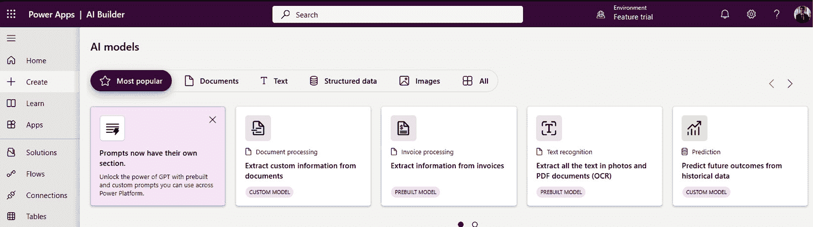
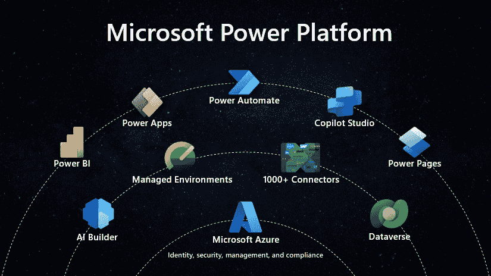
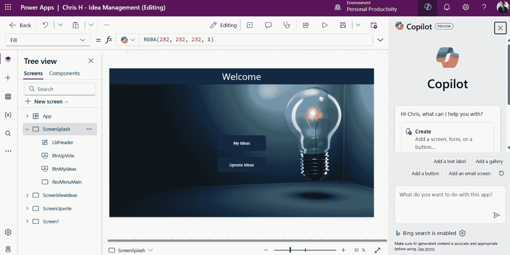
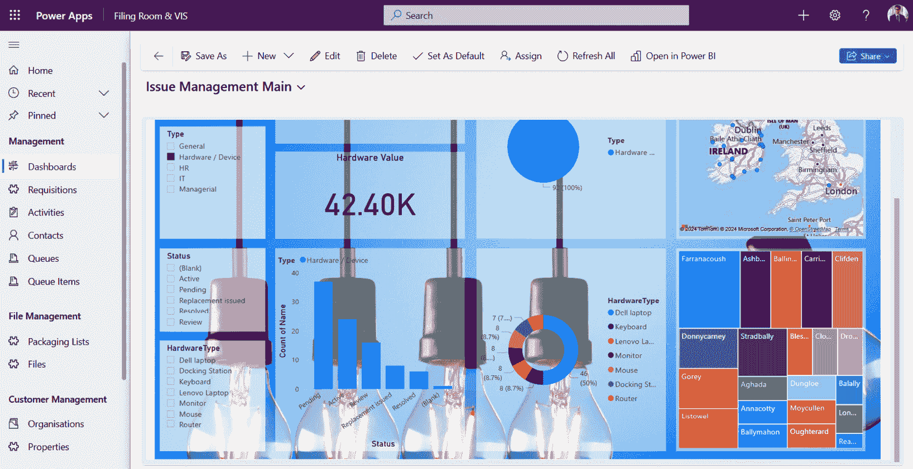
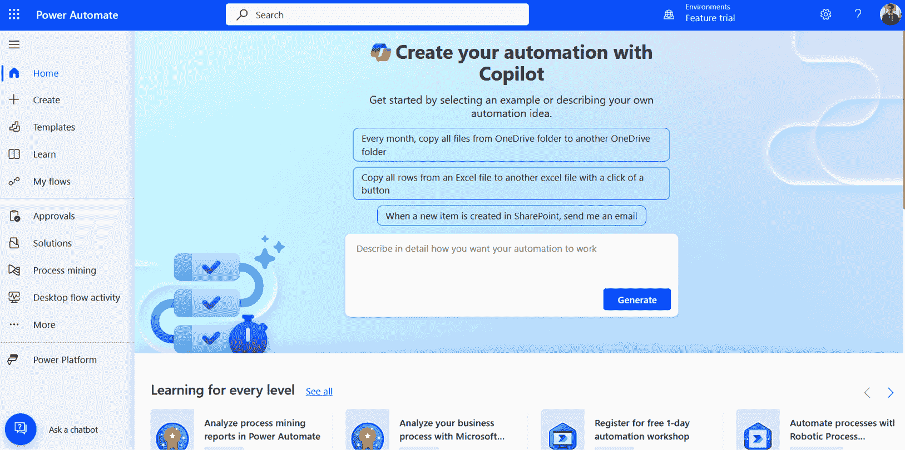
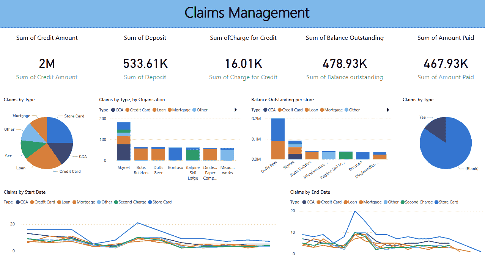
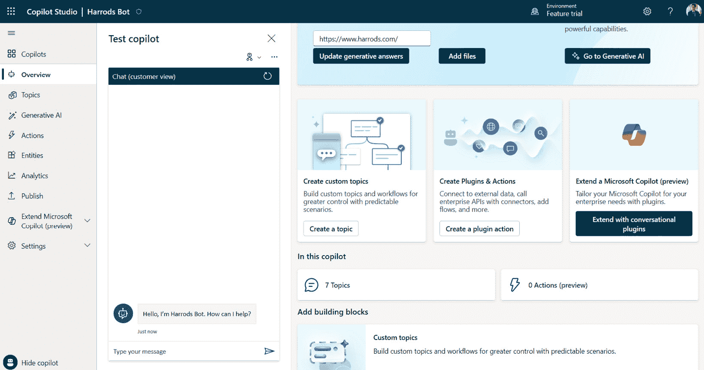
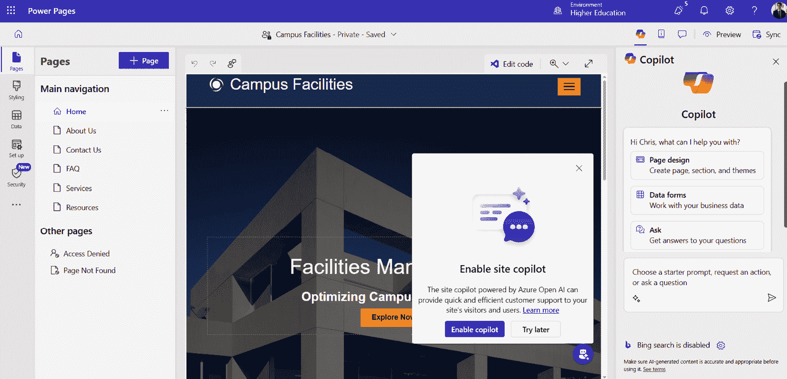

# 3

# 解锁潜力：用 Power Platform 提升运营

Power Platform 是微软提供的一套低代码/无代码工具集，为组织提供了变革其运营和释放潜在能力的机会。凭借其用户友好的界面和直观的设计，Power Platform 赋予了专业开发者和公民开发者创建应用程序、自动化流程和推动数字化转型而不需要广泛的编码专业知识的能力。这种低代码/无代码的方法带来了许多优势，例如加速的开发周期、提高的灵活性和减少对传统软件开发方法的依赖。

在 Power Platform 中，公民开发者扮演的关键角色之一是他们能够弥合业务需求与技术实施之间的差距。这些公民开发者对业务流程拥有深入的了解，但可能没有正式的编码背景，他们可以利用 Power Platform 的工具快速构建和部署满足特定运营需求的应用程序。这种应用开发的民主化使得快速迭代、频繁的反馈循环以及业务用户与 IT 团队之间的协作成为可能。

在 Power Platform 中，各种工具可用于提升运营和推动效率。Power Apps 允许创建定制应用程序，使用户能够设计直观的界面并无缝连接数据源。Power Automate 提供了一个可视化界面，用于自动化重复性任务和简化工作流程，减少人工努力并实现高效流程。Power BI 使组织能够可视化和分析数据，从而获得有价值的见解以推动明智的决策。这些 Power Platform 中的工具共同赋予组织优化运营、提高生产力和在快速变化的数字领域中充分发挥其全部潜力的能力。

总结来说，Power Platform 通过利用其低代码/无代码优势、赋权公民开发者和利用可用的工具范围，解锁了组织提升运营的潜力。通过快速开发应用程序、自动化流程和从数据中获得见解的能力，组织可以推动数字化转型并实现运营卓越。通过利用 Power Platform，企业可以转型其运营，提高灵活性，并在日益竞争的市场中保持领先。

在本章中，我们将涵盖以下主题：

+   用 Power Platform 重新构想运营

+   赋能开发者：Power Platform 的低代码/无代码优势

+   连接公民开发者：对齐业务需求和科技解决方案

+   利用 Power Apps、Power Automate 和 Power BI 实现运营收益

+   推进转型：用 Power Platform 提升运营

# 用 Power Platform 重新构想运营

Power 平台是由 Microsoft 开发的一套工具，它使用户能够无需编写代码即可构建和部署应用程序、自动化工作流、分析数据和创建共飞行员。Power 平台由几个主要组件组成：Power Apps、Power Automate、Power BI、Power Pages 和自定义共飞行员，以前称为 Power Virtual agents。

Power 平台旨在快速应用开发，并设计为一个业务生产力工具，它使制作者能够快速构建解决业务问题的解决方案。Power 平台可以被描述为一套预构建的数字构建块，它们可以相互连接，使制作者能够构建和设计软件解决方案以解决业务问题，而无需具备太多的编码或软件开发经验。在市场上，Power 平台被称为低代码软件开发平台。

平台通常分为两层；“交互层”和“数据与管理层”，这两层最终整合到更广泛的 Microsoft 产品堆栈中。

## 交互层

第一层是交互层，人们将通过某种用户体验与数据互动。这种体验可能是直接的，也可能不是，但它通常是由用户操作触发的。重要的是要指出，这是大多数制作者首次与之互动的层，并且将基本驱动 Power 平台中资产的创作。

交互层包括 Power Apps、Power Automate、Power BI、Power Pages 和 Copilot studio（以前称为 Power Virtual Agents）。一些组件有多个子组件，这些将在本章后面更详细地探讨。

要真正提高效率并真正改变组织内部利用 Power 平台的方式，首先关注数据和治理是绝对关键的。稍后进行返工将变得困难。

## 数据与管理层

数据与管理层是 Power 平台最强大的方面，也是最重要的部分。可能有无数的应用程序、自动化和共飞行员，但如果数据和管理不当，这些资产将永远不会投入生产。这一层由几个组件组成，我们将详细探讨。

### Dataverse

Dataverse 是一个低代码数据平台，允许用户存储和管理其 Power Platform 解决方案的数据。Dataverse 提供一个安全且可扩展的云关系型和安全数据存储设施，可以与各种数据源集成，例如 SharePoint、Excel 或外部系统。Dataverse 还允许用户为其数据定义业务规则、逻辑和工作流，以及创建具有关系、验证和元数据的丰富数据模型。Dataverse 之所以重要，是因为它简化了数据管理过程，并确保了 Power Platform 中的数据质量、一致性和合规性。一个对数据建模有基本知识的人可以相对容易地设计复杂的数据结构。

### 管理环境

管理环境是容器，用于托管特定解决方案或项目中的 Power Platform 资源，例如应用、流程、连接器和数据。管理环境允许用户控制其 Power Platform 解决方案的安全性、访问和部署，以及监控和管理其性能和用法。管理环境之所以重要，是因为它们使用户能够在隔离的环境中创建和测试他们的解决方案，而不会影响其他环境或用户。它们还使用户能够选择最适合他们需求的类型和大小环境，从用于实验的试用环境到用于实时部署的生产环境。管理环境帮助用户确保其 Power Platform 解决方案的质量、可靠性和治理。

### AI Builder

AI Builder 是 Power Platform 的一个功能，允许用户在不编写任何代码的情况下创建和使用人工智能模型。AI Builder 使用户能够自动化流程、分析数据、提取见解，并利用人工智能的力量增强他们的 Power Platform 解决方案。用户可以从一系列预构建的 AI 模型中进行选择，例如情感分析、对象检测和表单处理，或者使用引导式、无代码界面构建自己的自定义模型。AI Builder 与其他 Power Platform 组件，如 Power Apps、Power Automate 和 Power BI，无缝集成，使用户能够轻松地将 AI 功能添加到他们的应用、流程和报告中。AI Builder 是一个强大的工具，可以民主化人工智能，并使用户能够轻松解决复杂问题。*图 3.1* 展示了可用的预构建 AI Builder 模型：

图 3.1：AI Builder 选项

### 连接器

连接器是 Power 平台的关键特性，它允许用户将他们的解决方案连接到各种数据源和服务，无论是 Microsoft 生态系统内还是外部。连接器使用户能够访问和操作数据，触发操作，并在不同的应用程序和平台之间自动化工作流程。例如，用户可以使用连接器从 Outlook 发送电子邮件，在 Salesforce 中创建记录，或在 Power BI 中分析数据，所有这些都可以在他们的 Power 平台解决方案内完成。连接器为用户提供了一系列的可能性和功能，而无需编写任何代码或处理复杂的集成问题。连接器对于创建强大且灵活的解决方案至关重要，这些解决方案可以利用云提供的最佳功能。连接器是平台中最重要的部分，因为它们为所有 Power 平台资产提供了所需的数据，它们需要是可用的。

### Power FX

Power FX 是 Power 平台的低代码编程语言，它允许用户创建公式和表达式来定义他们解决方案的逻辑和行为。Power FX 基于 Microsoft Excel，这使得它对全球数百万用户来说既熟悉又易于使用。Power FX 还是一种开源语言，可以由开发者和社区成员扩展和定制。在 Power 平台生态系统中，Power FX 非常重要，因为它使用户能够构建动态、交互式和响应式的解决方案，而无需编写复杂的代码或学习新的语法。Power FX 是连接 Power 平台各个组件的通用语言，例如 Power Apps、Power Automate、Copilot Studio 和 Power BI，并允许用户在这些组件之间创建无缝和集成的体验。Power FX 是公民开发者和专业开发者的语言，他们可以使用它来加速和增强他们的开发过程。Power FX 是解锁 Power 平台力量并创建能够解决现实世界问题和挑战的解决方案的关键。

## Power 平台深入植根于 Microsoft 产品

*图 3.2* 展示了 Power 平台的整合视图以及它在 Microsoft Azure 平台中的深厚根基。事实上，如果你正在使用任何 Microsoft 产品，那么你组织内部很可能已经在某种程度上使用了 Microsoft Power 平台。

图 3.2：Power 平台各个组件的分解

通过使用 Power Platform，用户可以利用微软的云服务，如 Azure、Dynamics 365 和 Office 365，创建创新和可扩展的解决方案，从而改变他们的运营并释放其潜力。Power Platform 还赋予组织内所有类型用户，从开发者到商业用户，无需依赖 IT 或外部供应商进行协作和创新。Power Platform 是推动数字化转型和实现运营卓越的变革者。

## Power Platform 是如何改变运营的？

Power Platform 通过以下方式在组织内部革命性地改变了运营：使所有类型的人，从开发者到商业用户，都能够创建和使用满足他们需求和目标的应用程序、工作流、报告和 Copilots（聊天机器人）。平台中的组件允许用户使用可扩展的方法构建和部署解决方案，从高代码到无代码，这意味着他们可以使用类似 Visual Studio 的高代码界面、图形界面、拖放功能、预构建模板和连接器来访问各种数据源和服务，这些数据源和服务适合他们首选的解决方案创建方法。

通过使用低代码或无代码工具，用户可以享受以下优势：

+   加快开发和部署：用户可以在几小时或几天内创建和推出解决方案，而不是几周或几个月，节省时间和资源。

+   减少对 IT 或供应商的依赖：用户可以自行解决问题和挑战，无需等待 IT 支持或外部帮助，从而提高他们的自主性和灵活性。

+   提高创新和创造力：用户可以尝试不同的想法和功能，快速测试和迭代，并定制解决方案以满足他们的特定需求和偏好，培养创新和创造力的文化。

+   改善协作和沟通：用户可以与组织内的其他用户以及外部合作伙伴和客户共享和共同创建解决方案，从而增强协作和沟通。

+   激励各类创作者：使用数字工具解决业务问题的门槛显著降低，这意味着具有多种技术素养水平的人可以创建解决方案。虽然 Power Platform 旨在为非技术用户提供易用性和友好性，但它也为希望利用其功能和扩展其功能的开发者提供了许多好处和机会。

开发者可以使用 Power Platform 来：

+   加速和简化开发：开发者可以使用 Power Platform 的低代码或无代码工具来构建他们解决方案的核心功能和使用界面，然后使用代码添加自定义逻辑、集成或高级功能。这样，他们可以减少需要编写和维护的代码量，并专注于他们解决方案最复杂和最有价值的方面。

+   提升和优化性能：开发者可以使用 Power Platform 来监控和分析他们解决方案的性能、使用情况和质量，并识别和解决任何问题或瓶颈。他们还可以使用 Power Platform 来优化他们的解决方案以适应不同的设备、平台和环境，并确保它们符合他们组织和行业的安全和合规标准。

+   扩展和扩展他们的解决方案：开发者可以使用 Power Platform 将他们的解决方案连接到各种数据源和服务，无论是微软云生态系统内部还是外部，如 Azure、Dynamics 365、Office 365、SharePoint、SQL Server 等。他们还可以使用 Power Platform 利用人工智能、机器学习和自然语言处理的力量，为他们的解决方案添加智能和自动化。此外，他们可以使用 Power Platform 将他们的解决方案分发和共享给其他用户和组织，并根据需要扩展它们。

这些观点的版本还有很多。重要的是要记住，每个组织都会找到自己的方法来改进做事的方式和实现结果。关键在于要开放心态，愿意改变人们工作的方式，并准备好采用不同的解决问题的方法。在安全空间中能够解决问题的人数越多，解决的问题就越多，组织成功的可能性就越大，并且更有可能实现数字化。

# 启用开发者：Power 平台的低代码/无代码优势

开发者已经在数字生态系统中存在了很多年，并且拥有许多不同的头衔和角色。软件工程师、专业开发者或“pro-dev”、编码者、全栈开发者、前端开发者、后端开发者、软件开发工程师。最终，开发的概念与创造者或制造者的概念是同义的。

## 开发者的典型角色

通常，开发者是那些创建解决问题的关键部分的数字解决方案的人。在所有组织中，“*请为我制作一个用于……的应用程序*”的概念非常普遍，很多时候都是由开发者完成的。在大型组织中，拥有由业务共享的需求列表并由开发者团队工作的团队非常普遍。事物的流通常是永无止境的。如果组织中存在业务挑战，开发者将需要使用技术来解决这些问题。

开发者通常是维护和改进推动组织并帮助他们实现目标的软件解决方案的人。他们拥有编写代码、使用各种技术和框架以及遵循最佳实践和标准的技能和专业知识。

然而，开发者在其工作中也面临着许多挑战和限制，例如资源有限、时间紧迫、复杂的需求、不断变化的需求、安全风险和技术债务。此外，他们可能无法始终访问他们需要的资料和系统，或者他们可能必须依赖不完全兼容或不可靠的三方服务和 API。随着时间的推移，由于不断变化的生态系统不断提出新的和更复杂的挑战，开发者创建解决方案的速度变得越来越困难。这是因为我们感知和实现业务问题和挑战的方式已经改变，并变得更加先进。

## 如何 Power Platform 可以帮助开发者

Power Platform 可以帮助开发者克服许多挑战，并提高他们的生产力和创造力。开发者不一定是创建应用程序或自动化的那个人，但他们可能是构建这些资产所需的定制组件或集成的人。开发者还可以利用微软生态系统中的现有数据和服务，例如 Azure、Office 365、Dynamics 365 和 SharePoint，并将它们与其他来源和平台集成。此外，他们可以使用诸如 Visual Studio、C#、JavaScript 和 Power Fx 之类的专业代码工具和语言来定制和扩展 Power Platform 的功能。他们还可以使用平台的管理和治理功能来确保其解决方案的安全性、合规性和性能。这些开发者可能会将前端应用程序用户体验或简单的流程流程留给组织内的其他人。

Power Platform 使开发者能够更快、更高效地交付价值，同时允许他们创新和实验新的想法和解决方案。它赋予他们解决大规模问题的能力，与其他制作人用户协作，并为他们的客户和利益相关者提供更好的体验和结果。

最终，在典型的“编码”意义上，开发者可以花更少的时间在他们认为不太复杂的部分，或者将这些工作外包给组织内的其他制作人，他们可以专注于他们更熟悉且更复杂的部分。

## 以速度推动价值实现

快速失败！可能不是每个人都会期待听到的话，但最终这个概念在许多需要为解决方案得出结果的情况下是正确的。

使用 Power Platform 的一个优势是它使开发者能够比传统方法更快、更高效地交付解决方案。通过利用平台的低代码或无代码功能，开发者可以构建应用程序、工作流、聊天机器人、仪表板和其他组件，而无需编写大量代码或依赖复杂的基础设施。这允许开发者快速构建解决方案，甚至作为一个工作原型，然后随着项目的进行添加他们需要的部分。本质上，这就像开发团队正在将一系列数字积木拼接在一起以生成一个工作解决方案。这种类型的做法在 Power Platform 和低代码领域极为常见。

Power Platform 还支持一种协作和迭代的解决方案开发方法，开发者可以与其他制作人，如业务分析师、领域专家或最终用户合作，共同创建和验证解决方案。该平台提供用于在不同环境和设备上测试、调试、部署和监控解决方案的工具，确保质量和性能。这是借助最接近理解问题的人来推动融合团队开发概念的一个很好的方法。

通过使用 Power Platform，开发者可以快速提供价值，交付满足客户和利益相关者需求和期望的解决方案。该平台赋予开发者敏捷和灵活地创新和解决问题的能力，同时降低成本和风险。

## 使用其余的堆栈

Power Platform 是少数几个能够跨越 Microsoft 生态系统中的许多工具的平台之一。如果你正在使用 Dynamics 365、Office 365 或 Azure 工具，你将以某种形式遇到 Power Platform。这对所有类型的制作人来说都是一件好事，但对于那些将自己视为与复杂云产品一起工作并编写代码的开发者来说，这甚至更为基本重要。

当查看 Power Platform 内部可用的跨堆栈集成和接口时，我们很快就会意识到，该平台被设计成一种用于扩展其他解决方案的工具，但同时也被设计成可以扩展其直接构建在其之上的复杂微软平台。

Power Platform 的一个关键优势在于其能够利用微软 Azure 的力量，Azure 是一个提供广泛服务和能力的云计算平台，用于构建、部署和管理应用程序。Azure 提供了许多工具，可以增强和扩展 Power Platform 的功能，例如 Azure Functions 和 Logic Apps。

Azure Functions 是一种无服务器计算服务，允许开发者按需运行代码，而无需配置或管理服务器。Azure Functions 可以由各种事件触发，例如 HTTP 请求、定时器、队列或消息。Azure Functions 可以用于执行自定义逻辑、与其他系统集成或根据 Power Platform 事件操作数据。例如，一个 Azure Function 可以由 Power App 按钮点击、Power Automate 流或 Power BI 报告刷新触发，并执行一些执行复杂计算、调用外部 API 或发送电子邮件通知的代码。

Logic Apps 是另一种无服务器服务，它使开发者能够创建跨多个系统和服务的业务流程和工作任务的编排和自动化。Logic Apps 提供了一个图形设计器，允许用户拖放连接器和操作来构建他们的工作流程。Logic Apps 还可以通过各种事件触发，例如 HTTP 请求、计划或消息。Logic Apps 可以用于连接 Power Platform 与数百个其他服务，例如 Office 365、Salesforce、X（前身为 Twitter）或 Dropbox。例如，一个 Logic App 可以由 Power Automate 流、Power App 表单提交或自定义 Copilot 聊天机器人对话触发，并执行创建文档、更新记录或发布推文等操作。

通过使用 Azure Functions 和 Logic Apps，Power Platform 开发者可以扩展他们解决方案的功能，并将它们与其他系统和服务集成。Azure Functions 和 Logic Apps 还可以帮助开发者克服 Power Platform 的一些限制，例如代理限制、连接器限制或许可成本。此外，Azure Functions 和 Logic Apps 可以使开发者重用现有的代码和工作流程或创建可重用的组件，这些组件可以在多个 Power Platform 解决方案之间共享。Azure Functions 和 Logic Apps 还可以受益于 Azure 平台的安全性、可扩展性和可靠性，以及 Azure 提供的监控和调试工具。

有许多其他工具可以用来扩展 Power Platform 增强解决方案或从头开始构建自定义解决方案的方式。上述示例只是展示了可以完成的一小部分。

开发者在数字生态系统中扮演着至关重要的角色，他们创建和维护软件解决方案以解决问题。然而，他们面临着资源有限、时间紧迫和不断变化的业务需求等挑战。Power Platform 通过赋权开发者提高生产力和创造力来解决这些挑战。它提供了低代码或无代码能力来构建应用程序和工作流程，并与 Microsoft Azure 集成以扩展其功能。这使得开发者能够更快地交付解决方案，敏捷地进行创新，并为客户和利益相关者提供更好的体验。在下一节中，我们将探讨公民开发者如何在更广泛的 Power Platform 和制作者社区中工作，以构建解决业务问题的解决方案。

# 连接公民开发者：使业务需求和科技解决方案保持一致

Power Platform 的一个关键优势是它能够使一类新的制作者：公民开发者成为可能。公民开发者是非专业开发者，他们可以无需编写代码或仅用少量代码来创建应用程序和工作流程。他们通常是商业用户或领域专家，了解他们组织的问题和需求，并可以利用 Power Platform 创建解决这些问题的解决方案。公民开发者还可以与专业开发者协作，后者可以为他们的项目提供指导、支持和治理。通过赋权公民开发者，Power Platform 可以弥合业务需求和技术实施之间的差距，并加速数字化转型。

## 讨论不同类型的制作者——制作者原型

我们经常谈论公民开发者，但在组织中还有许多其他类型的“开发者”或“制作者”将利用 Power Platform。制作者是指使用 Power Platform 来构建解决方案的人，并不是所有制作者都可以被归类为同一类型。一个深刻理解自定义代码工作方式的人不能以与仍在学习技术并能够制作三屏画布应用程序的人相同的方式进行互动。这些人需要得到他们自己的规则和互动旅程，以便成长和构建有用的解决方案，因此有了“制作者原型”的概念。

制作者原型通常会决定制作者路径和人们将被赋予用于创建问题解决方案的工具。确保正确级别的人能够访问与他们的技能集相匹配的工具是很重要的。例如，我们可能不会给处于早期旅程的制作者提供 Visual Studio Code 的访问权限，但我们希望新制作者能够访问画布应用程序和 Power Automate。

实际上，最容易对制作者进行分类的方法是设置一套标准，定义什么是制作者以及他们需要做什么才能达到下一个水平。这可能包括他们通过某些考试，如 Power 平台的 PL-900 或 PL-200，或者他们已经产生了一定数量的可用解决方案。典型的制作者原型可能包括：

+   初学者制作者：通常在旅程的开始阶段，需要学习如何使用 Power Platform 构建解决方案。

+   中级制作者：相对技术，对平台的基本元素有所了解。可以使用低代码解决问题，可能是自给自足的。这些制作者被称为公民开发者。

+   高级制作者：精通 Power 平台的大部分组件，并能构建相对复杂的解决方案来解决业务问题。这些制作者不是 IT 团队的一部分，但具有非常高的技术技能。他们被称为业务技术专家。

+   专业开发者：作为企业 IT 团队的一部分担任开发者。可以编写代码并利用 Power 平台的所有区域。这些人被称为“ProDevs”。

## 入门门槛

Power 平台的主要好处之一是降低了那些想要为其业务需求创建解决方案的人的入门门槛。Power 平台中的工具旨在供不同类型的制作者使用，从公民开发者到专业开发者，根据他们的技能水平和需求而定。Power 平台使制作者能够构建应用程序、自动化流程、分析数据和创建聊天机器人，而无需编写代码或依赖 IT。这使最接近问题的人能够自己解决问题，利用他们的领域知识和创造力。

Power 平台还提供了一个辅助功能，指导制作者完成创建解决方案的步骤，并在过程中提供提示和最佳实践。Copilot 在 Power 平台工具集中越来越受欢迎，允许人们使用自然语言提示来开发解决方案，这使其创建解决方案变得极其容易。通过降低入门门槛，Power 平台使创新民主化，并帮助企业更快、更有效地实现目标。*图 3.3*显示了直接嵌入画布应用中的 Copilot：

图 3.3：在画布应用中启用了 Copilot

## 最接近问题的人

最接近问题的人真正理解其复杂性和影响。他们是最终用户、客户或对找到有效解决他们需求的解决方案投入深厚的利益相关者。他们的第一手经验使他们能够深入了解问题的原因和后果，使他们处于独特的位置，带头开发合适的解决方案。

当利用 Power Platform 时，这些个人可以转变为解决方案的创作者。借助 Power Platform 提供的直观且用户友好的工具，如 Power Apps、Power Automate 和 Power BI，他们可以开发并部署针对其特定挑战和需求的应用程序、工作流、仪表板和聊天机器人。这些工具使他们能够在无需广泛编码知识的情况下设计、构建、测试和部署解决方案，将解决方案创建的权力直接交到他们手中。此外，他们可以与其他创作者合作，包括公民开发者、专业开发人员或 IT 专业人员，以交流专业知识和反馈。这种合作提高了解决方案的质量和功能，利用了不同利益相关者的不同视角和技能。

通过赋予最接近问题的人对解决方案的控制权，Power Platform 使他们能够比传统开发方法更快、更有效地创建定制和高效的解决方案。这种方法不仅产生了符合他们特定需求和期望的解决方案，而且还在解决方案创作者中培养了一种所有权和赋权感。

## 实现目标

使用 Power Platform 快速取得成功！在构建解决方案时，记住“快速失败”的方法是很重要的。另一个概念是，并非所有事情都需要完美。在构建解决方案的过程中，范围往往会扩大，你的创作可能需要添加新内容，甚至可能比预期的更大。这是可以的，如果使用了正确的工具来实现预期的结果。想想看一个 Excel 文档，你可以在其中添加新的行、新的数据，甚至可以即时构建数据透视表。构建 Power Platform 解决方案也有类似的方法，根据需要更改事情是完全正常的，如果文档和计划支持这种变化。

在 Power Platform 中构建事物最好作为一种团队运动。许多不同技能的人可以共同工作在 Power Platform 解决方案上，并在合作中完成构建。实际上，甚至那些不专注于技术的人也可以作为项目的一部分做出贡献。这使得解决方案的产生越来越有可能，因为最接近问题的人可以在构建结果时真正动手操作。

解决方案也呈现出各种形状和大小。并非所有事情都是复杂且永久的。有时，使用 Power Platform 可以快速生成更小的解决方案，这使得实现结果变得极其容易。许多这些较小的解决方案甚至不需要任何形式的**应用程序生命周期管理**（**ALM**），并且可以留在它们被创建的地方，由它们的创作者进行管理和支持。

最终，这里的目的是尽可能快地构建一些有用的东西，而 Power Platform 确实允许各种类型的创作者实现这一点。

开发者在数字生态系统中扮演着至关重要的角色，他们创建和维护软件解决方案以解决问题。Power Platform 旨在通过提高开发者的生产力和创造力来帮助他们克服挑战。此外，它还使一类新的制造者——公民开发者得以出现，他们可以不编写代码或仅用少量代码来创建应用程序和工作流程。该平台降低了这些制造者的入门门槛，使他们能够利用自己的领域知识和创造力来解决业务问题。最终目标是尽可能快速地构建有用的解决方案，而 Power Platform 为所有类型的制造者提供了便利。在下一节中，我们将讨论如何使用 Power Platform 中的工具推动运营改进。

# Canvas 应用程序

当我们探索 Power Platform 内部的各种组件时，我们需要深入了解交互层，揭开人们可以用来创建解决方案的可用性的面纱。每个工具都以不同的方式与其他工具集成，这使得 Power Platform 在各种组织中的各种制造者原型中得到了越来越广泛的应用。

## Power Apps 概述

Power Apps 是一个低代码/无代码平台，允许用户使用预构建模板、拖放功能和用户友好的界面来创建针对网页和移动设备的自定义应用程序。用户可以将他们的应用程序连接到各种数据源，例如 Dataverse、Dynamics 365、SharePoint、Excel 或 Salesforce，并使用 AI Builder 为他们的应用程序添加人工智能功能。

Power Apps 分为两种类型的应用程序，这些是：

### 利用 Power Apps、Power Automate 和 Power BI 实现运营收益

Canvas 应用程序是一种 Power Apps，允许用户从头开始或使用预构建组件（如按钮、画廊、表单或图表）创建自定义用户界面。用户可以通过在画布上拖放元素来设计应用程序的布局和外观，并通过使用类似于 Excel 的公式和表达式来添加逻辑和交互性。Canvas 应用程序适用于用户需要完全控制应用程序设计和功能，并希望为他们的目标受众创建个性化且引人入胜的体验的场景。Canvas 应用程序可以在网页浏览器、移动设备或桌面上运行，并可以访问设备功能，如相机、麦克风或位置。

### 模型驱动应用程序

模型驱动应用程序是另一种类型的 Power Apps，允许用户创建遵循预定义模型和结构的数据驱动应用程序。用户可以使用 Power Apps Studio 或 Dataverse 等工具定义其应用程序的数据源、实体、关系、表单、视图和业务逻辑。模型驱动应用程序适用于用户需要处理大量数据和复杂流程，并希望在设备之间创建一致和标准化的体验的场景。模型驱动应用程序可以在网络浏览器、移动设备或桌面上运行，并可以利用 Power Platform 的功能，如 Power Automate、Power BI 或 Copilot Studio。Dynamics 365 客户参与或**客户关系管理**（CRM）的第三方应用程序是极其复杂的、以业务流程为重点的模型驱动应用程序。*图 3.4* 展示了一个相对简单的模型驱动应用程序，该应用程序被构建来管理索赔。这是由一个中级制作者和索赔代理作为主题专家设计和编写的。

图 3.4：嵌入在模型驱动应用程序中的 Power BI 报告

## Power Automate 概述

Power Automate 是一种工具，帮助用户在不同应用程序和服务中自动化重复性和耗时的工作。用户可以创建基于特定条件、事件或计划的流程或工作流。例如，用户可以创建一个当 Dropbox 文件夹中添加新文件时发送电子邮件通知的流程，或者当发布带有特定标签的新推文时向 Teams 频道发布消息的流程。Power Automate 有点像风，它在我们的周围运作，而我们不一定能看到它在运作。你可能看不到 Power Automate 的实际运行，但你可能会看到 Power Automate 的结果。在 Power Automate 框架内可以构建两种类型的自动化。这些是：

### Power Automate 云流程

Power Automate 云流程是在云上运行的流程，可以连接到不同的在线服务，例如 Office 365、SharePoint、Dynamics 365、X（前身为 Twitter）、Dropbox 等。用户可以从头开始创建云流程，使用图形界面或基于代码的编辑器，或者从 Power Automate 画廊中可用的数百个模板中选择。云流程可以手动触发，按计划触发，由事件触发或由按钮触发。云流程可以执行各种操作，例如发送电子邮件、创建任务、更新记录、发布消息等。云流程有助于自动化常见的业务流程，简化工作流程，并提高生产力。*图 3.5* 展示了 Power Automate 用户界面，其中可以构建流程。

图 3.5：Power Automate 用户界面

### Power Automate 机器人流程自动化 (RPA)

Power Automate 机器人流程自动化 (RPA) 是一个允许用户自动化涉及与旧系统、桌面应用程序或网络浏览器交互的重复性和手动任务的工具。用户可以使用桌面录制器记录他们的操作，或使用基于代码的编辑器创建脚本，然后作为 UI 流运行它们。UI 流可以与云流集成，以创建跨越不同环境和平台的全端自动化解决方案。RPA 在各种业务场景中很有用，例如数据输入、表格填写、发票处理或报告生成。

## Power BI 概述

Power BI 是一个多才多艺且强大的商业智能平台，旨在赋予用户无缝连接、可视化和分析来自广泛来源的数据的能力，包括但不限于 Excel、SQL Server 和 Azure。通过其用户友好的界面，个人可以利用数据的力量制作交互式报告和动态仪表板，不仅展示关键见解和趋势，而且促进组织内部或在线的共享。此外，Power BI 还为用户提供构建复杂数据模型、进行高级分析和将可视化无缝嵌入其他应用程序的能力，从而提高平台的整体可访问性和实用性。

关于 Power BI，一个重要的观点是 Power BI 不使用与 Power Platform 其他部分相同的连接器，也不遵循相同的规则集。它在功能上与更广泛的平台集成，但与数据交互的方式略有不同。*图 3.6* 展示了一个包含 Copilot 统计数据的 Power BI 报告。

图 3.6：Power BI 中的 Copilot 报告

## Copilot Studio

Copilot Studio，之前被称为 Power Virtual Agents，是一个允许用户创建自定义自然语言体验（聊天机器人，现称为 Copilot）的工具，这些体验可以通过自然语言与客户、员工或合作伙伴互动。用户可以设计对话或主题，引导聊天机器人回答问题、提供信息或执行操作。用户还可以将他们的聊天机器人与其他服务集成，例如 Power Automate，以实现更复杂的场景。

例如，用户可以创建一个聊天机器人，它可以预订航班、查看天气或发送电子邮件确认。*图 3.7* 展示了重新品牌为 Copilot Studio 的 Power Virtual Agents 用户界面。

图 3.7：Copilot studio

## Power Pages

Power Pages 允许制作者创建和发布包含动态内容和交互元素的网页。Power Pages 利用了 Microsoft Dataverse 的力量，这是在 Power Platform 中存储和管理数据的通用数据服务。用户可以使用 Power Pages 创建网站、博客、着陆页、通讯稿等，无需编码或托管。借助 Power Pages，用户可以轻松创建和分享推动业务成果和数字化转型的内容。*图 3.8*展示了 Power Pages 的构建体验。

图 3.8：Power Pages 构建体验

# 利用 Power Platform 提升转型：提升运营

要在 Power Platform 中实现运营卓越，组织不仅需要关注平台中的工具，还需要包括人员和流程。这种人员、平台和流程的方法至关重要，因为最终，成功将由人员推动。

## 谈论赋能时代

当今社会正处于所谓的“*赋能时代*”阶段，组织不再需要雇佣昂贵的合作伙伴和承包商来构建他们的解决方案，他们可以自己完成。这并不是说不能使用承包商和合作伙伴。有些组织可能没有足够的资源，也没有自己的团队来构建解决方案。关键是，Power Platform 提供了易于被各种类型的制作者采用的工具，因此组织内部的人员可以简单地构建他们自己的解决方案。这类似于微软 Office 发布时的情景。我们过去需要支付人们来制作电子表格，而现在我们简单地自己完成，因为我们已经数字化地进化了。

事实上，赋能时代是一个由像微软这样的供应商推动人们实现自给自足，并发布允许我们这样做平台的时期。这是一个技术领域的美好时光，因为我们看到公司内部的人们正在利用这些平台推动运营卓越。

这种方法确实存在一些缺陷或风险，最终，组织在看待技术和其使用方式上需要进行文化转变。

## 允许人们优化他们工作的方式

我们在组织中面临的最大文化转变是说服 IT 部门允许人们自己构建解决他们问题的方案！通常，IT 部门非常严格，并锁定他们的生态系统，以防数据泄露和恶意行为者的攻击，这是正确的做法。然而，在 Power Platform 中，我们可以在确保生态系统安全的同时，让人们有自由构建他们需要的方案。

想想微软的 Office。全世界的人们都在使用 Office 套件来创建各种东西，许多组织并没有停止或阻止这种行为，因为 Office 是推动生产力的工具。为什么 Power Platform 会与此不同呢？人们在 Excel 中存储了大量的数据，而大多数组织并不知道那里有什么，至少在 Power Platform 中，有方法可以跨生态系统和已创建的资产获得可见性。

这是在允许人们发挥创造力和抑制创造力之间走一条细线。更成熟的组织理解这一点，并允许人们创造事物，但也尊重他们的数据，并鼓励人们利用正确的数据存储设施来存储他们的数据，同时通过利用 Power Platform 数据策略来管理人们可以访问的连接器。重要的是人们感到有权力去构建，同时也感到安全。

## 通过让人们用更多的时间来做事情来推动运营卓越

利用技术来提高效率和生产力并不是一个新概念。事实上，你可以说这是技术的一个核心目标。在这个时代，人们一直在寻找更智能的做事方式，事实上我们已经如此专注于效率，以至于我们甚至有像 Microsoft 365 Copilot 这样的工具，可以为我们写电子邮件。

在所有角色和所有情况下，人们的工作中都有一些是手工操作或繁琐的。随着社会的进步，我们希望减少手工任务，因此我们总是会寻找更聪明的工作方式。有一天，我们现在认为可以节省时间的自动化和应用程序，将会被认为是过时的和“旧闻”。目前，许多组织正在努力从他们的组织中消除微型数据库和电子表格的泛滥，并集中数据。在当时，这些工具被认为是非常创新的。我们只是继续前进。

目前，Power Platform 中的工具提供了惊人的功能，让人们能够自动化和数字化他们的任务、流程甚至一些交互。手动数据捕获、文件移动、旋转椅集成等许多场景被认为是日常的、手工的任务，可以通过利用 Power Platform 等工具进行数字化和自动化。我们可以把更多的时间还给人们去做有意义的事情，这会更好，即使每次只节省 1 分钟。最终，这会带来效率的提升和生产力增加，当然前提是这是我们的目标。

## 在管理这些操作时，治理是关键

优化整个生态系统是一个很好的想法，并且绝对可以实现。然而，权力越大，责任越大。治理是绝对必要的。治理将保护您的生态系统（人员、流程和平台）免受损害或滥用。本质上，治理提供了“我们在这里如何做事”的规则。我们并不总是称之为“治理”，因为最好的治理是在人们不知道自己被治理时实施的。我们的想法是为人们创造一个安全和可靠的空间，让他们能够高效地工作并构建令人惊叹的事物，而不会以任何方式损害您的生态系统。

Power Platform 包含多个工具，使我们能够治理人们使用工具的方式。这包括诸如租户隔离、数据政策、监控、数据审计以及更多功能。作为管理员，在管理控制台中有多种选项可以帮助确保您的生态系统得到保护。

此外，还有一些附加选项，例如卓越中心入门套件，它允许管理员更细致地了解在 Power Platform 内部正在构建的内容以及制作者和用户正在做什么。最终，管理员在生态系统中的可见性非常重要，而 Power Platform 治理工具提供了这一点。

Power Platform 通过关注人员、平台和流程来实现运营卓越。它与“赋能时代”相一致，在这个时代，组织可以构建自己的解决方案，而不必依赖外部合作伙伴。这种转变需要文化变革，使个人能够优化他们的工作并提高效率。然而，治理对于保护生态系统免受滥用至关重要。Power Platform 提供了监控、数据政策和审计工具，以确保负责任和高效的使用。

# 摘要

在本章中，您已经了解了 Power Platform，这是一套低代码/无代码工具集，允许用户在不编写复杂代码的情况下构建自定义应用程序、工作流、聊天机器人和仪表板。您已经看到了 Power Platform 如何通过帮助您解决业务问题、提高效率和提升客户满意度来帮助您实现运营卓越。您还了解了治理的重要性以及可用于监控、管理和保护 Power Platform 环境的工具。您还学习了如何使用 Power Platform 管理中心、卓越中心以及 Microsoft Cloud App Security 来确保您的 Power Platform 解决方案符合合规性、安全性和质量标准。通过阅读本章，您已经了解了 Power Platform 的功能和好处，以及确保其负责任和高效使用的最佳实践。如果您对探索 Power Platform 作为优化工作、自动化流程和利用数据的方式感兴趣，这些信息可能对您有所帮助。

在下一章中，我们将探讨如何创建一个赋能中心，使其成为核心枢纽，将组织内的人员、流程和平台汇集在一起，并能够创建一个解决业务问题的有用解决方案组合。

# 加入我们的 Discord 社区

加入我们的 Discord 空间，与作者和其他读者进行讨论：

[`packt.link/powerusers`](https://packt.link/powerusers)

