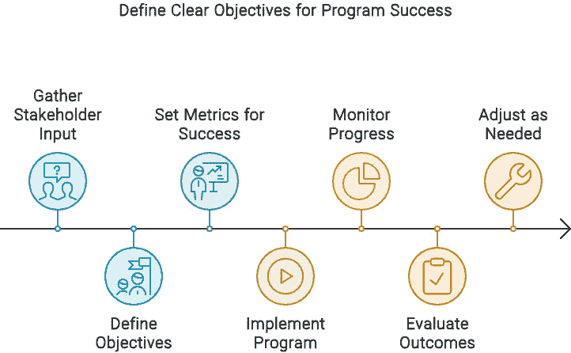
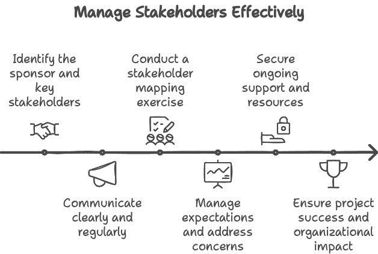
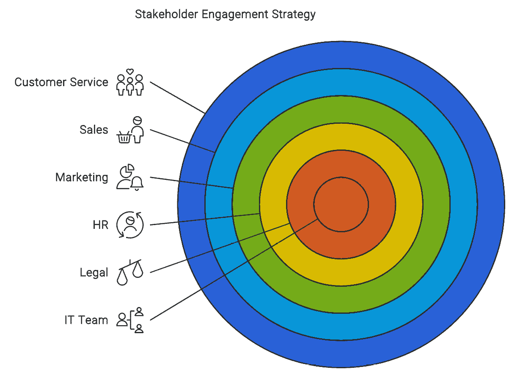
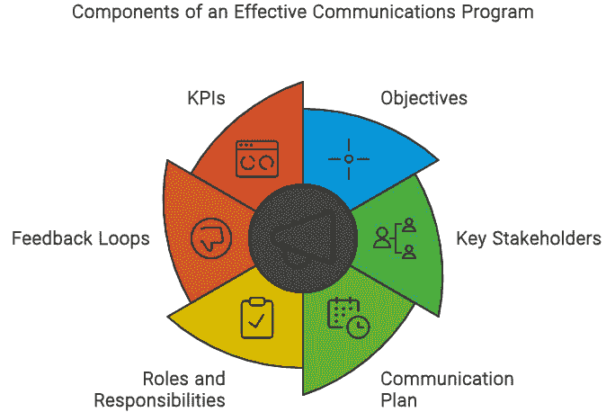
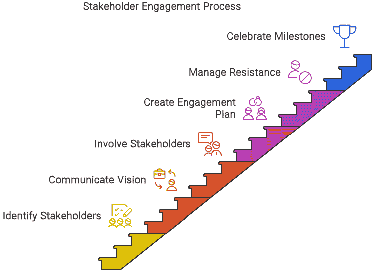
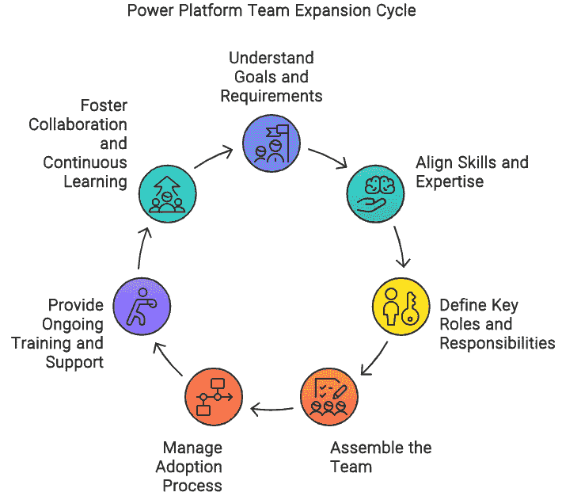
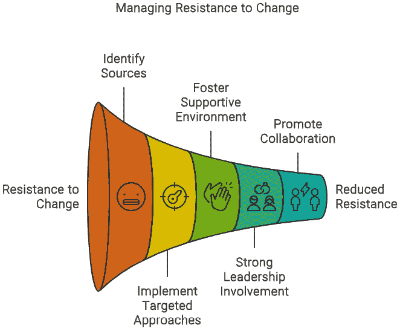
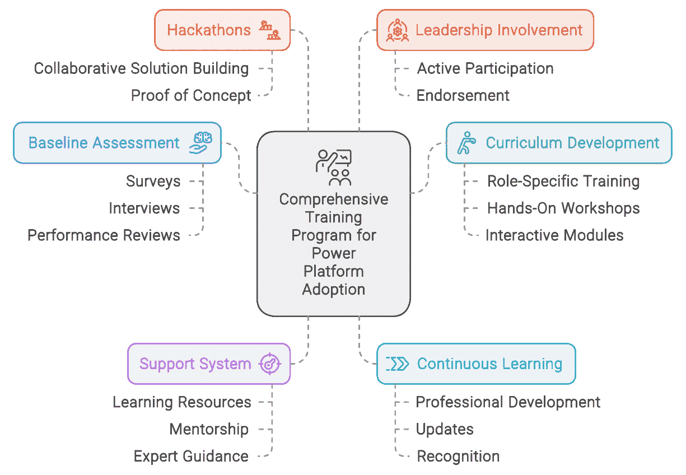
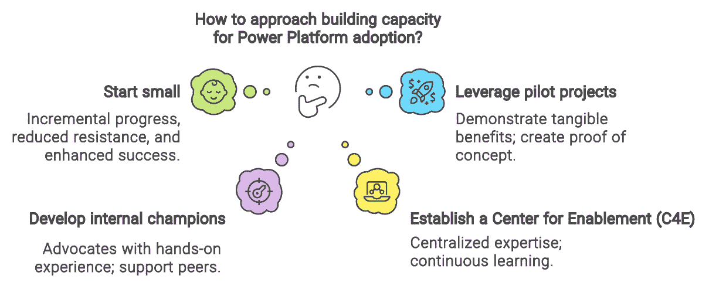

# 6

# 协调成功：使用 Power Platform 进行数字化转型策略的关键考虑因素

使用 Power Platform 进行数字化转型需要一种结构化的方法，分为三个阶段：愿景、上线和扩展。在愿景阶段，有几个关键考虑因素是必不可少的。

组织应明确阐述其目标和目标，制定愿景，并建立一个专门的项目团队。高层支持对于确保资源和支持采用文化至关重要。

采用策略是必要的，以指导努力，包括概述路线图、设定里程碑并与业务目标保持一致。建立成功标准可以确保可衡量的成果。

管理阻力涉及积极主动地识别和解决挑战，以确保更平稳的过渡。评估技术能力、基础设施和数据治理对于准备至关重要。一个全面的培训策略将使员工能够有效地利用平台。

在愿景阶段考虑这些方面，组织可以为使用 Power Platform 的成功数字化转型奠定坚实的基础。

在本章中，我们将讨论以下主题：

+   规划 Power Platform 采用的路径

+   通过高层支持和承诺赋能成功

+   在采用过程中导航 IT 和领导力挑战

+   通过 Power Platform 技能赋能团队

+   变革管理

+   加速采用之旅

# 规划 Power Platform 采用的路径

在*第五章*中，我们讨论了“确定您的目的”以及在整个组织中需要一个清晰的愿景。这很重要，因为它是对整体战略愿景的集体看法。同样重要的是制定一个您将需要执行的计划。这个计划将与您的愿景相匹配，并允许您建立一个令人惊叹的 Power Platform 赋能中心，为人们提供一个安全的空间来创造惊人的事物。

在设置您的赋能计划时，您已经通过了*第五章*中提到的多个工作流，即*您的计划是什么？*部分。这创造了一个出色的中央生态系统，您将能够推动整个组织对平台的更广泛采用。

确定您计划的工作范围可能会有难度。我们现在将探讨如何定义您的工作计划范围，最重要的是，如何开始。

## 确定您的采用范围

在审查您的目的声明时，重要的是它能够推动您的采用计划并充当“北极星”，换句话说。可以应用于任何采用计划的多种范围，重要的是确保您为成功而不是失败做好准备。

一个精心设计的采用计划的一个出色品质是明确定义的范围。如果范围设定得早且明确，并与您的目的和愿景相一致，那么 Power Platform 的推广将更加顺畅且易于管理。

在您的采用计划开始之前，需要审查一些方面，这将帮助您清楚地定义和细化范围。我们将在以下章节中讨论这些方面。

### 明确的目标

需要立即定义和设定一个明确的目标集。这些目标需要所有参与项目的人同意，因为它们将是衡量整体成功的一个指标。目标越明确，管理项目成果就越容易。将目标和目标尽可能简化，并尽可能多地拥有定量或二元（是/否）的结果，这是一个创新的想法。请注意，这并不总是会发生。一个强有力的目标示例可能是确保组织中的每个人都能够访问 Power Platform 上的工具。这是正确还是错误？另一个例子是，IT 部门的所有人都能够访问 Power Platform 中的工具，并积极使用这些工具构建解决方案。项目成功的步骤在**图 6.1**中可见。通常，这些目标是由更广泛的 Power Platform 利益相关者团队定义的，项目经理是负责人。

图 6.1：定义项目成功明确目标的过程

当谈到战略目标和指标时，Microsoft 在 Microsoft Learn 网站上提供了几个出色的资源。这些资源可以在以下位置找到：

[`learn.microsoft.com/en-us/power-platform/guidance/adoption/strategy-best-practices`](https://learn.microsoft.com/en-us/power-platform/guidance/adoption/strategy-best-practices)

在**所有**项目中，时间和里程碑都非常重要。这些越清晰，越能聚焦，管理项目成果就越容易。通常，这个采用时间表将与项目团队设定的目标相对应。例如，您可能希望在 X 月底之前推出 Power Platform 到人力资源部门。然后您将努力确定如何实现这一点以及如何让人力资源部门参与进来。您为采用设定的计划将包含许多与日期相关的里程碑，每个里程碑都将有需要完成的行动，以实现里程碑和整体目标。

### 利益相关者管理

在*任何*工作计划中，都需要有一个赞助人。有人支付账单。有人同意项目正在顺利运行，一切都在正轨上。赞助人是最重要的利益相关者之一；然而，这还扩展到组织中的其他领域的领导者。与所有这些人保持清晰的沟通并管理所有利益相关者的期望非常重要。进行利益相关者映射练习是一个特别好的主意，以确保您了解您的项目将如何影响组织中的个人。*图 6.2*显示了可以采取的一些基本步骤，以有效地管理利益相关者。

图 6.2：一个定义成功管理利益相关者关键点的流程

需要注意的是，利益相关者管理应由一个规模较小但定义明确的 Power Platform 生态系统团队来执行。这一点在*第二章*的*通过 CoE 推动数字成熟度*部分中提到。

### Baselining

这是一个极其重要的练习。它涉及建立一个清晰且可衡量的起点，这作为跟踪进度和评估采用努力的影响的参考。以下是为什么基准线如此重要的几个关键原因。您可能希望对组织进行基准线分析，以了解 Power Platform 的使用和采用情况，然后根据您如何定义受影响的群体，逐部门进行评估。然后，您从那里开始工作，确保组织的每个部分都采用这些工具，然后在采用计划之后，您还需要进行一次比较基准线审查，以检查数字是否有所增加。这将涉及监控/审计作为了解利用和采用的一种机制。

如*第二章*中*在 Power Platform 采用成熟度级别中导航*部分所述，Power Platform 成熟度模型是一个很好的起点。您可能希望将其扩展到更详细的成熟度和基准线评估。这可以在以下链接找到：

[`learn.microsoft.com/en-gb/power-platform/guidance/adoption/maturity-model`](https://learn.microsoft.com/en-gb/power-platform/guidance/adoption/maturity-model)

利用 Power Platform CoE 入门套件是一个为组织投资组合景观进行基准线分析的优秀机制。这个工具允许管理团队能够获得他们需要的对投资组合和制造商景观的可见性，并真正了解是谁创建了什么。更多信息可以在 Microsoft Learn 网站上找到，位置如下：

[`learn.microsoft.com/en-gb/power-platform/guidance/coe/starter-kit`](https://learn.microsoft.com/en-gb/power-platform/guidance/coe/starter-kit)

### 管理框架

在企业中推动 Power Platform 的采用之前，建立一个稳健的治理框架至关重要。这个框架作为骨干，确保采用过程是有结构的、合规的，并与组织的战略目标保持一致。治理框架应做到以下几点：

+   提供一致和标准化的 Power Platform 使用指南和政策

+   通过定义角色、责任和访问级别来促进资源分配

+   提前识别潜在风险并制定缓解策略

+   建立清晰的报告、反馈和决策结构

+   设定基准并监控绩效以实现持续改进

在推动 Power Platform 的采用之前建立治理框架是实现无缝、安全且成功的集成，并与组织的更广泛战略目标保持一致的基本要素。该框架是采用计划的一部分，并为人们遵循的一套规则。实施治理框架可能是一个相当复杂的过程；然而，有一些出色的工具，如 CoE Starter Kit，可以提供所需的可见性。Power Platform 治理团队负责确保这一点到位，并需要与组织范围内的治理团队合作，推动框架和流程向前发展。团队结构可以在 *第二章* 的 *使用 CoE 提升数字成熟度* 部分找到。

微软团队提供了一些出色的治理资源，这些资源可以在微软学习网站上找到：

[`learn.microsoft.com/en-gb/power-platform/guidance/adoption/admin-best-practices`](https://learn.microsoft.com/en-gb/power-platform/guidance/adoption/admin-best-practices)

### 资源分配

在任何 Power Platform 采用项目中，资源分配都是至关重要的，原因有几个。它确保了正确的人力、财务或技术资源在正确的时间可用。这种资源的战略协调避免了瓶颈，并确保项目按计划进行，并控制在预算范围内。

有效的资源分配通过确保团队成员拥有完成任务的工具和支持，以及明确界定角色和责任，也能提高生产力。这一点将在 *扩展团队* 部分进一步探讨。

资源分配对于风险管理至关重要。通过确定项目每个阶段所需的资源，可以主动识别并解决潜在差距。这种前瞻性有助于减轻与资源短缺或配置不当相关的风险，这些风险可能会破坏项目。

一个结构良好的资源分配计划可以促进责任感和透明度。当团队成员了解他们的具体责任和可用的资源时，它促进了所有权感和对实现项目目标的承诺感。这种清晰度对于保持动力和确保所有利益相关者与项目目标保持一致至关重要。

有效的资源分配支持持续改进。通过定期根据项目需求和绩效指标审查和重新分配资源，治理框架可以适应不断变化的情况，并确保 Power Platform 采用持续成功。

### 受影响群体管理

受影响群体管理通常是考虑采用时需要关注的难点之一。这个领域有助于定义组织内人员将如何获得访问权限以及在你采用计划中的哪个时间段内。

您可能不想采取大爆炸的方法，立即将所有工具发布给所有人；更好的方法是将其分批分部门进行，并有一个更有针对性的采用重点。许多人将这种方法称为“发布环”。这个比喻是当你把鹅卵石扔进池塘时，会有波纹；这就是更针对性的采用计划是如何工作的。您从一个目标群体开始，随着项目的进行，您的存在范围会越来越广。这在*图 6**.3 中得到了强调，展示了如何从一个小的核心群体开始，随着时间的推移逐步扩大发布范围。

图 6.3：特定组织受影响群体管理计划的发布环

这种方法也有助于您在本采用计划中针对特定群体本地化和减轻任何可能出现的风险。有些人群体更难推动采用，这是一个事实，因此保持您的计划专注是很重要的。

您受影响的群体将是定义您 Power Platform 采用计划整体范围的一个大因素。

### 风险管理

在 Power Platform 采用计划中进行有效的风险管理涉及在整个项目过程中识别、评估和减轻风险。首先，识别潜在风险，如技术挑战、资源限制、利益相关者的抵制和安全漏洞。在这个阶段与关键利益相关者进行沟通至关重要。根据其影响和可能性评估风险。优先考虑它们，重点关注最关键的风险。使用您的风险登记册来记录和跟踪已识别的风险。

制定管理风险的策略，这可能包括以下内容：

+   **风险规避**：调整项目计划以消除风险

+   **风险转移**：外包某些项目组件

+   **风险缓解**：通过额外培训等方式降低风险的可能性或影响

+   **风险接受**：在密切监控风险的同时推进项目

持续监控风险并报告其状态，以保持利益相关者了解情况。这有助于建立信任和协作解决问题。准备应急计划以应对尽管采取了缓解措施但仍可能出现的风险。为意外问题分配备用资源。根据所学经验定期审查和调整风险管理流程，确保持续改进和弹性。

通过采用这些实践，您可以保护您的 Power Platform 采用计划并推动其整体成功。

### 沟通计划

在定义 Power Platform 采用计划的范围时，建立和管理沟通计划至关重要。清晰的沟通确保所有利益相关者在整个项目期间保持一致、充分了解并积极参与。

首先明确界定您的沟通努力的目标。确定关键利益相关者，包括执行赞助商、项目经理、IT 团队、最终用户和外部合作伙伴。了解他们的需求和期望将有助于定制您的沟通策略。

制定一个全面的沟通计划，概述沟通的方法、频率和渠道。确定要共享的信息类型，例如项目更新、里程碑、风险状态和成功故事。利用电子邮件、会议、通讯和内部门户网站等不同渠道，确保信息有效地传达给所有利益相关者。

为沟通任务分配具体的角色和责任。指定一名沟通经理或团队来监督计划的执行。确保所有团队成员了解他们在传播信息和收集反馈中的角色。

实施反馈循环以捕捉利益相关者的意见和建议。经常使用调查、焦点小组和个人会议收集反馈。将此反馈应用于完善沟通策略并迅速解决任何问题。

通过设置**关键绩效指标**（**KPIs**），如利益相关者参与度、反馈响应时间和信息保留率，来跟踪您沟通工作的有效性。定期审查这些指标，并根据需要调整沟通计划，以确保持续改进。

所提到的所有组成部分已在*图 6.4*中总结，显示沟通计划不仅仅是发送电子邮件，而需要明确思考。

图 6.4：有效沟通计划的组成部分

### 平台

在开始 Power Platform 采用计划之前，必须建立几个基础平台以确保顺利且成功实施。这些平台构成了整个计划基础设施和策略的基石。这些平台通常在构建赋能工作流中心时被选中。

必须实施一个高级协作平台，以实现跨不同部门和利益相关者的有效沟通和团队合作。这个平台应支持各种交互模式，如即时消息、视频会议和文档共享，提高生产率并支持协作文化。人们需要被引导到一个中心位置，以与各种可用的资源互动，并利用治理和指导材料。一个值得注意的例子是利用 Microsoft Teams 或 Viva Engage。

一个全面的项目管理平台对于跟踪进度、管理任务和确保时间表和里程碑得到满足至关重要。这个平台应包括甘特图、资源分配工具和实时报告等功能，以提供对项目状态和绩效的清晰可见性。用于此类计划的一种流行工具是 Microsoft Project。

一个培训和开发平台对于让所有用户掌握有效利用 Power Platform 所需的基本技能和知识至关重要。这个平台应提供一系列学习资源，包括教程、网络研讨会和实操研讨会，针对不同的用户角色和专业水平进行定制。通过您的协作门户（如 Microsoft Teams 或 Viva Engage）展示培训和采用平台是一个巧妙的想法。

通过关注本节中提到的所有方面并明确界定您的范围，您就准备好在您的组织中推动更广泛的 Power Platform 采用。

在本节中，我们强调了在构建您的 Power Platform 采用计划时需要更明确的作业范围。确保您对将要交付的内容以及具体的时间表尽可能清晰是很重要的。为 Power Platform 采用做好准备将使您取得成功，并确保您的员工、平台和流程为更广泛、规模化的平台使用做好准备。在下一节中，我们将重点关注管理利益相关者的期望并围绕您的采用计划组建团队。

# 通过高管赞助和认可来赋予成功力量

在*第二章*的*组建团队*部分，分享了赋能中心的基本团队结构。在为 Power Platform 准备您的数字生态系统时，这种团队结构至关重要。在同一部分中，还有关于利益相关者映射和正确对齐利益相关者重要性的简要摘录，这是您为准备赋能中心时需要考虑的。

Power Platform 成功采用的一个关键要素是获得高管支持并组建正确的团队。高管支持至关重要，因为它提供了推动计划向前发展的必要权限和资源，确保组织目标与项目目标保持一致。有影响力的赞助者可以倡导事业，影响关键利益相关者，并促进移除可能阻碍进展的障碍。

同样重要的是负责引领这一变革的团队组成。这个团队应该是一个由技能娴熟的专业人士组成的紧密融合体，包括项目经理、IT 专家和业务分析师，他们各自带来独特的视角和专业知识。这种多样性确保了实施的所有方面都得到覆盖，从技术复杂性到战略对齐和用户接受度。

## 与利益相关者合作以获得支持

吸引利益相关者并确保他们的支持对于您 Power Platform 采用计划的成功至关重要。这个过程从识别和绘制所有相关利益相关者开始，可能包括高管、部门负责人、IT 人员、最终用户和外部合作伙伴。每个群体都有独特的兴趣、关切和目标，必须解决这些问题以确保他们的支持。

与利益相关者合作的第一步是明确传达 Power Platform 采用愿景和好处。这包括阐述平台将如何解决现有问题、提高效率和推动组织内的创新。针对不同利益相关者群体的具体需求和痛点定制此信息可以显著提高他们的参与度和支持该计划的意愿。此信息应与*第五章*的*开始您的愿景*部分中定义的宗旨和愿景声明相一致。

重要的是让利益相关者参与规划和决策过程。这可以通过举办研讨会、会议和焦点小组来实现，让利益相关者可以对实施计划提供反馈和意见。通过积极参与，您表明他们的意见受到重视，这可以培养对项目成功的感觉和承诺。利益相关者需要感觉到自己是这个过程的一部分。

制定详细的干系人参与计划是另一个关键组成部分。此计划应概述在整个项目生命周期中保持干系人知情和参与所需的沟通策略、频率和渠道。定期的更新、进度报告和成功故事可以帮助保持势头并加强该举措的价值。尽可能保持开放和透明非常重要。

处理和管理可能出现的任何阻力非常重要。这可以通过早期识别潜在的阻力来源并制定缓解策略来实现。你可能会遇到的典型阻力来源通常是基于缺乏理解和支持。通常，人们只是害怕他们需要做或学习的新事物，这可能导致对变革的高度抵制。为干系人提供所需的培训和资源可以缓解担忧并提高他们对新平台信心的提升。

与组织内部的关键影响者建立强大的关系可以进一步帮助获得支持。这些人可以作为项目的倡导者，帮助传播积极信息并鼓励他们的同事和下属提供支持。

认可和庆祝里程碑和成就对于维持干系人参与至关重要。认可他们的贡献和取得的进展可以提振士气并加强他们对项目成功的承诺。

成功的干系人管理计划的步骤总结在*图 6.5*；重要的是要理解这是一个过程。每个步骤都需要规划和行动，以确保干系人保持参与并保持活跃。

图 6.5：干系人管理的过程包括多个步骤

## 扩展团队

在 Power Platform 采用计划期间，为了构建、增长和扩展 Power Platform 团队，遵循结构化和战略的方法至关重要。这始于理解该活动的目标和需求，并将它们与团队内所需的技能和专业知识相一致。例如，如果你的目标之一是确保 HR 团队的所有成员都接受过使用 Power Platform 创建解决方案的培训，那么你需要能够帮助这一过程的人，或者一个培训团队。

考虑到专注于采用的项目团队将是提到的更广泛的**能力中心团队**的一部分，即**组建团队**部分。在这个时候，能力中心应该正处于创建过程中，这些角色应该已经确定。

定义成功采用 Power Platform 所需的关键角色和职责。这些角色可能包括以下内容：

+   **项目经理**：监督整个采用过程，确保时间表、预算和交付成果得到满足。

+   **项目经理**：管理与利益相关者的关系，并确保项目朝着成功的方向发展。

+   **Power Platform 管理员团队**：管理 Power Platform 的数字生态系统，并确保平台的技术元素运行正确。

+   **培训师和支持人员**：为最终用户提供持续的教育和帮助，确保平台顺利采用和有效利用。这一点不容忽视。参与社区和使用平台的人数越多，所需的支撑人员就越多。

+   **变革经理**：了解组织中的更广泛变革文化，并管理团队间的变革方面。

鼓励团队内部的合作和持续学习文化。这可以通过组织定期的团队会议、研讨会和培训课程来实现，团队成员可以在这些活动中分享知识、讨论挑战和头脑风暴解决方案。促进开放沟通，为团队成员提供表达想法和担忧的平台。

投资于持续培训和开发计划，以使团队了解 Power Platform 的最新功能、最佳实践和行业趋势。这可能包括参加会议、报名参加在线课程、参与网络研讨会和社区活动。鼓励团队成员追求相关认证，以提升他们的技能和知识。许多组织投资于创建内部短小精悍的视频，展示人们执行任务或使用 Power Platform 解决问题。这被称为“纳米培训”。

随着采用计划的推进，持续评估团队的能力和技能。这可能以与基准评估相同的方式进行。准备好通过招聘额外人员或聘请外部顾问来填补任何差距或增加的工作量来扩大团队规模。确保团队结构保持灵活和适应性强，以满足项目不断变化的需求。

与关键利益相关者保持开放的沟通渠道，包括高管、部门负责人和最终用户。定期更新他们关于采用计划的进展情况，并征求他们的反馈和建议。让利益相关者参与决策过程有助于建立信任，并确保团队的努力与组织的整体目标保持一致。

定义具体的指标和 KPI 来评估团队的进步和成就。定期审查这些指标，以确定改进领域并庆祝成就。认可和奖励团队的努力和成就可以提升士气，并激励他们继续提供高质量的结果。

通过遵循*图 6*中突出的步骤，您可以构建、发展和扩展一个高度有效的 Power Platform 团队，该团队配备齐全，能够推动组织内平台的成功采用和长期利用。

图 6.6：推动组织中团队扩展的过程

组建合适的团队并为 Power Platform 的成功采用获得高管支持非常重要。合适的团队应包括具有不同技能和专长的专业人士，以涵盖实施的所有方面。

吸引利益相关者并确保他们的支持也是至关重要的，包括清楚地传达 Power Platform 采用的愿景和好处，让他们参与规划过程，制定利益相关者参与计划，并解决可能出现的任何阻力。

此外，通过定义关键角色和责任、吸引顶尖人才、促进协作和持续学习、投资于持续培训和开发、评估团队能力以及与关键利益相关者保持开放沟通，战略性地扩大团队是至关重要的。这些步骤对于构建一个高效能的 Power Platform 团队并在组织中推动成功的采用至关重要。在下一节中，我们将关注如何在采用计划期间应对 IT 和领导挑战。

# 在采用过程中应对 IT 和领导挑战

成功采用技术的道路往往暴露出各种挑战，尤其是在导航 IT 领导和处理组织内部的阻力时。采用并不容易，因为它涉及到人，而人在最好的时候也是复杂的。

有效的沟通在采用计划的成功中扮演着重要角色。与所有利益相关者，从高管到最终用户，进行透明和一致的沟通，确保每个人都与计划的目标和进度保持一致。这种一致性不仅建立信任，还在整个组织中培养了一种所有权和协作感。

明确定义清晰的指标和 KPIs 对于监控进度和庆祝成就至关重要。定期审查这些指标使领导者能够确定改进领域，并认可他们团队的努力和成就，从而提升士气和动力。

指标和 KPIs 可以通过多种方式跟踪。许多组织将简单地使用电子表格来完成这项工作；然而，像 Power BI 这样的工具则更为有效，并以更有意义的方式展示数据。建议将监控输出输入到中央位置，如 Dataverse，然后可以使用 Power BI 来可视化数据。

另一个重要方面是清楚了解当前团队的容量和能力。可能需要额外的人员/人才，这可能意味着将更多人纳入团队。通常，这些团队成员来自其他部门。许多组织通过包括对平台有深厚兴趣并希望成为更广泛计划一部分的其他部门的倡导者/英雄来扩大 Power Platform 团队。投资于持续培训和开发计划也被视为成功采用的基础。通过让团队了解与技术和行业趋势相关的最新功能、最佳实践和行业趋势，确保他们在角色中保持熟练和创新。鼓励协作和持续学习的文化进一步增强了团队应对挑战和制定创新解决方案的能力。这可以通过对扩大 Power Platform 生态系统有积极兴趣的倡导者来管理。

## 定义和管理阻力

对变化的阻力是人的自然反应，尤其是在采用像 Power Platform 这样的技术时。有效理解和应对这种阻力对于任何采用计划的成功至关重要。

管理阻力的第一步是确定其来源。可能有多个来源，包括根深蒂固的工作习惯、对未知的恐惧或对工作安全性的担忧。员工可能会担心他们学习新技能的能力或工作量增加的可能性。通过认识到这些担忧，IT 领导者可以制定针对性的策略来应对这些问题。

为了减轻阻力，实施针对特定问题量身定制的策略至关重要。例如，如果员工担心他们学习新技能的能力，提供全面的培训计划和资源可以缓解这些担忧。定期的研讨会、在线课程和实操环节可以帮助建立信心和技能。

建立一个支持性的环境是另一个关键策略。这包括关于 Power Platform 的好处及其如何积极影响组织和员工的透明沟通。突出成功案例和案例研究可以帮助说明平台的价值。提供采用过程的明确路线图和时间表也可以减少不确定性并建立信任。这通常由倡导者和已经建立的实践社区来完成。

强有力的领导参与对于管理阻力至关重要。领导者应积极倡导采用计划，展示他们的承诺和支持。他们还应该保持可见性和可接触性，解决任何担忧并提供保证。邀请来自不同部门的领导者参与可以帮助形成统一战线，并强化采用是整个组织战略重点的信息。

促进协作文化和持续学习可以进一步缓解抵制。鼓励知识共享和团队合作可以帮助员工感到更加投入和参与采用过程。创建反馈和建议论坛也可以让员工有一种所有权和参与感，使他们更有可能接受变革。看到更多的人在公共场合学习，其他人加入运动和参与的可能性就越大。

通过遵循*图 6.7*中突出显示的步骤，并鼓励人们感到被包括和成为其中一部分，他们抵制变革的可能性就会降低。将一个抵制变革的人转变为粉丝是可能发生的最令人惊奇的事情之一，因为那个人将终身成为粉丝。

图 6.7：降低阻力

## 理解和应对挑战

理解采用 Power Platform 固有的挑战对于确保平稳过渡和最大化技术潜力至关重要。挑战可能来自各种来源，每个都需要一种细致入微的方法来有效解决。

如*定义和管理抵制*部分所述，主要挑战之一是对变革的抵制。领导者应花时间了解员工可能有的具体焦虑和保留意见。这种理解将允许达到一定程度的同理心，并采取更有针对性的帮助方法。“*你具体担心什么？*”在与采用计划进行互动时，与个人或团队进行的有用对话。

另一个重要的挑战是组织的技术准备情况。这包括确保现有的 IT 基础设施能够支持 Power Platform，并且团队中拥有足够的技术专长来管理和维护新系统。对当前技术环境进行全面的基础评估至关重要。这项评估应识别基础设施或技能方面的任何差距，并概述通过投资技术升级和员工培训来填补这些差距的计划。基础评估在*第二章*部分，*基准的重要性* *中进行了重点介绍*。

文化准备也是理解采用过程中挑战的一个关键方面。组织文化在创新技术的接受和整合中起着至关重要的作用。一种促进创新、持续学习和协作的文化更有可能接受 Power Platform。相反，抵制变革的文化可能会设置重大障碍。领导者应努力营造一个支持和鼓励适应、学习和公开沟通的环境。这可以通过鼓励协作文化、促进知识共享以及创建反馈和建议论坛来实现。

在导航 Power Platform 采用挑战中，强有力的领导参与至关重要。领导者应积极倡导采用计划，展示他们的承诺和支持。他们还应该保持可见性和可接触性，解决任何担忧并提供保证。从不同部门吸引领导者可以帮助创造统一战线，并加强采用是整个组织战略优先事项的信息。通过理解和解决这些挑战，组织可以更好地导航 Power Platform 采用的复杂性，并确保顺利过渡。

方法越统一，愿景越清晰，采用计划就越有针对性，范围也越明确。

总结来说，我们关注了业务某些部分可能出现的阻力以及可能面临的挑战。对这些表示同情并理解，有时人们只是需要更多的信息。如果有强有力的领导和实际计划以及支持这些领导者的团队，风险可以减轻，挑战可以解决。在下一节中，我们将探讨如何制定培训策略，以便使用平台的人能够获得他们成功所需的技能。

# 通过 Power Platform 技能赋能团队

制定稳健的培训策略是确保员工不仅具备必要的技能，而且有动力拥抱这一变革的基础性步骤。

许多人认为培训的重点是如何技术性地使用一系列工具，但实际情况远不止于此，当深入到培训和教育计划的各个领域和方面时，它可能会变得复杂。思考技术尤其重要，但同样关键的是帮助人们从文化上理解“我们在这里做事的方式”正在发生变化。过去可以接受的工作方式现在正在改变，人们应该对此感到兴奋，并加入其中。

如同在*定义和管理风险*章节中提到的，人们往往习惯于以某种特定方式做事，而不会去思考如何改进*他们做事的方式*。这并不是他们的错。学习与适应是人的天性，因此在本培训中，确保任何采用该平台的人都理解*为什么*要这样做，而不仅仅是*他们在做什么*，这一点将非常重要。例如，在日常工作中，人们习惯于使用诸如电子表格等工具来管理数据。相反，通过利用 Power Platform，你可以在 SharePoint 列表上创建一个画布应用程序，以更精细的方式与这些数据进行交互。制作画布应用程序很简单，但*为什么*我们要这样做而不是使用 Excel 表格？很多时候，培训忽略了这一点极其宝贵的观点。如果人们理解了原因，那么他们接受起来会容易得多。

# 变革管理

变革管理在成功实施 Power Platform 采用计划中极为重要。它涉及一种结构化的方法，将个人、团队和组织从当前状态过渡到期望的未来状态。接受变革管理确保新技术的采用尽可能平稳和有效，最小化阻力并最大化成功潜力。

变革管理的一个关键方面是沟通。开放、透明和频繁的沟通有助于缓解恐惧和不确定性，提供清晰的愿景，展示利益和未来的路线图。这种沟通应解决变革背后的*原因*，帮助每个人理解战略重要性及其对工作和整个组织产生的积极影响。

在规划和实施过程中让所有层面的利益相关者参与，可以促进所有权感和承诺感。当人们觉得自己是运动的一部分时，他们更有可能支持和参与新的系统和实践。这种包容性方法也有助于及早识别潜在问题并共同制定解决方案。

提供充足的培训和资源是另一个关键要素。确保员工拥有有效使用 Power Platform 所需的技能和知识可以减少挫折感并提高生产力。持续的学习机会和支持系统有助于保持势头并鼓励持续发展。

在过程中认可和庆祝成功可以强化积极行为并激励团队。承认个人和团队的付出和成就可以加强他们的承诺并鼓励持续改进的文化。

通过将变革管理原则融入 Power Platform 采用计划，组织可以更有信心地应对数字化转型中的复杂性，并实现持久、有影响力的成果。

## 制定培训策略

设计和创建一个全面的培训计划，赋予团队权力，培养持续学习的文化，并推动 Power Platform 的成功采用，这通常成为企业采用计划的核心方面。

该过程从全面的基础评估开始，以了解组织内的当前技能水平和知识差距。这次评估应包括调查、访谈和绩效评估，以收集有关哪些具体领域需要关注的详细信息。

一旦确定了需求并建立了基线，下一步就是开发一个结构化的课程或项目，涵盖 Power Platform 的基础功能和高级功能，以及任何已确定的文化领域。课程应根据组织内的不同角色进行定制，提供针对特定角色的培训，确保每个团队成员都能在其环境中有效地利用该平台。结合实际工作坊、现实世界场景和互动模块可以使学习体验更加吸引人和实用。

通过黑客马拉松或制作马拉松也是推动采用和培训的另一个出色机制。这些活动允许各种类型的制造者聚集在一起，构建组织可能需要的解决方案。通常，他们将专注于概念验证类型的解决方案，这些解决方案可以进一步丰富。重要的是人们一起构建以实现共同目标。

建立支持系统对于保持动力和解决培训过程中可能出现的任何挑战至关重要。这可以包括创建学习资源库、建立导师计划以及提供专家指导的访问权限。应定期进行反馈会议，以评估进度并对培训方法进行必要的调整。

建立持续学习的文化是培训策略的另一个关键方面。鼓励员工参与持续的专业发展，并让他们了解 Power Platform 的最新更新和功能，可以帮助维持他们的参与度和熟练度。认可并奖励那些表现出卓越承诺和改进的人可以进一步激励团队。

领导层的参与也是至关重要的。领导者应积极参与培训活动，展示他们的承诺并为整个组织树立榜样。他们的认可和参与可以显著提高培训计划的信誉和重要性。

一个精心设计的培训策略不仅为团队配备了必要的技能，而且营造了一个持续改进和创新根植于组织文化的环境。通过投资全面有效的培训，组织可以最大化 Power Platform 的益处，并推动成功的数字化转型。*图 6.8*中的步骤总结了开始实施精心设计的培训策略所需采取的步骤。

图 6.8：Power Platform 采用的全面培训计划

## 培养学习文化

在采用 Power Platform 时，建立和培养学习文化涉及几个关键步骤。首先，组织必须创建一个引人入胜且全面的培训策略，该策略与他们的数字化转型目标相一致。这个策略应该设计用来为团队提供必要的技能，并鼓励持续学习和创新的心态。

一个发展良好的课程和强大的领导层支持在这个过程中扮演着至关重要的角色。领导者不仅是倡导者，也是学习旅程中的积极参与者，展示了他们对项目的承诺。他们营造了一个重视并鼓励学习的环境，使资源易于获取和访问。

为了有效地实施培训计划，应该先在一个精选的小组中进行试点，以收集反馈并完善方法。一旦经过测试和改进，该计划就可以扩展到不同的部门，确保广泛采用和熟练度。

在公共领域支持学习文化的一个绝佳方式是确保建立一个导师计划。在组织中，导师制是一种帮助人们学习并成长到他们渴望的职位或角色的绝佳方式。正确实施这一计划的关键是通过指导和教学。这对导师和被指导者都有很大帮助。

鼓励持续的专业发展和让员工了解 Power Platform 的最新更新和功能，可以进一步维持他们的参与度和熟练度。认可并奖励那些表现出卓越承诺和进步的人，可以激励他们继续参与和努力。

总之，通过创建持续学习的文化和实施战略培训计划，组织可以推动 Power Platform 的成功采用，确保长期可持续性和增长。

我们理解制定稳健的培训策略来赋能员工的重要性。这里的首要目标是提供人们拥抱 Power Platform 带来的变革所需的技能。我们讨论了培训不应仅关注技术方面，还应关注组织内部的文化变革。

制定培训策略的过程包括评估当前技能水平、设计定制课程，并建立一个支持系统来应对挑战并保持动力。它还强调了培养持续学习文化和领导层参与推动 Power Platform 成功采用的重要性。总的来说，文章强调了投资全面有效的培训以最大化 Power Platform 的好处并促进成功数字化转型的重要性。在下一节中，我们将探讨如何通过从小规模开始并逐步扩大规模来加速您的 Power Platform 采用之旅。

# 加速采用之旅

实现全面采用和能力建设的过程很少是直截了当的。它需要一种战略方法，在短期需求和长期目标之间取得平衡，并营造一个有利于持续学习和创新的氛围。重要的是要理解，能力建设并非自然而然发生，它依赖于建立强大、稳健的框架，以及向学习和成长的文化转变。

采用生态系统赋能方法，并确保组建正确的赋能团队，是良好的开端，也是确保采用在组织中增长的正确方向的一步。

## 从小处着手

在构建加速 Power Platform 采用能力时从小处着手，不仅是一种战术方法，更是一种战略必要性。这种方法遵循渐进式进步的原则，允许组织以可管理的速度实施变革，从而减少阻力并提高成功的可能性。

初始阶段涉及识别适合展示 Power Platform 实际效益的试点项目。这些项目应根据其潜在影响和参与团队的准备情况仔细选择。通过从小型、可管理的项目开始，你可以创建一个概念验证，突出平台的功能和价值，为组织其他部分提供一个激励的例子。

通过平台的实际操作和构建较小的解决方案，是人们学习和产生实际成果的绝佳方式。

随着这些试点项目的进展，记录所学到的经验和最佳实践至关重要。这一持续评估和改进的过程确保后续的举措能够建立在成功的基础上，避免早期努力的陷阱。这种迭代方法提高了采用计划的成功率，并促进了持续改进和学习。

从小处着手可以培养出内部倡导者，他们能够为 Power Platform 发声，并在采用过程中支持他们的同事。这些倡导者凭借实践经验和对平台的深入理解，成为组织内部培训和指导他人的宝贵资源。他们的热情和专业知识有助于形成势头，推动跨部门的更广泛采用。

随着对 Power Platform 的信心增强，以及初始项目展示出成功，组织可以逐步扩大采用努力的范畴。这可能包括扩大项目规模，纳入更复杂的项目和更多的部门。在整个过程中，持续学习和改进的焦点至关重要，确保组织保持敏捷并能够应对新的挑战和机遇。

从小做起，逐步建立能力为 Power Platform 的成功采用提供了一个坚实的基础。通过利用试点项目，培养内部倡导者，建立**赋能中心**（**C4E**），并保持清晰的沟通，组织可以创造一条可持续的数字化转型和长期成功的路径。*图 6.9*展示了你可以关注的关键方面，以推动你的 Power Platform 团队中的能力增长。

图 6.9：在您的业务中建立能力的关键点

## 理解真正的采用

在组织中理解真正的 Power Platform 采用涉及认识到增量能力增长的重要性。通过从较小的项目开始，并逐渐增加 Power Platform 项目的复杂性和范围，组织可以建立一个广泛的采用的坚实基础。这也意味着对这些较小项目有一个专注的方法，这使得支持人们变得更加容易。

真正的采用不仅仅是制作一个应用程序或自动化，而是使用 Power Platform 中的工具以规模解决业务问题。

能力增长在这个旅程中扮演着至关重要的角色。它包括开发必要的技能、知识和资源，以有效地利用 Power Platform。这包括投资培训计划，鼓励持续学习的文化，并为员工提供持续的支持。随着个人和团队对平台更加熟练，他们可以处理更复杂的项目，并在整个组织中推动创新。

大多数时候，培训相对由自给自足的制作者和用户驱动，然后由中央 Power Platform 采用和赋能团队（或管理团队）管理。然而，有时对培训的需求要高得多，也更正式，在这些情况下，可能需要引入供应商来开展更明确的培训计划。

能力增长使组织能够适应不断变化的企业需求，并保持竞争优势。通过持续增强其 Power Platform 能力，组织可以利用新功能，简化流程，并为客户创造更大的价值。这种迭代方法确保组织保持敏捷并对市场动态的变化做出响应。

最终，理解真正的 Power Platform 采用是认识到能力增长的战略重要性。通过从小处着手，逐步建立能力，并倾向于持续改进的文化，组织可以释放 Power Platform 的全部潜力，并在其数字化转型旅程中实现长期成功。

## 扩大你的策略

随着能力的提升而扩展 Power Platform 采用计划需要战略性和分阶段的方法。随着组织发展必要的技能、知识和资源，它们可以开始承担更雄心勃勃的项目并扩展 Power Platform 的倡议。首先，识别并培训内部倡导者，他们可以为平台辩护并为同事提供支持。这种扩展方法完全由**C4E**内部促进，治理和采用计划以定义的方式成功管理。

随着对 Power Platform 的信心通过成功的试点项目增长，逐步扩大计划范围，涵盖更复杂的项目和更多部门。与所有利益相关者保持清晰和定期的沟通，让他们保持知情并参与其中，建立一个持续学习和改进的环境。

这种迭代方法不仅能够提升能力，还确保组织保持敏捷、响应迅速，并能够充分利用 Power Platform 的全面潜力。

## 可能的陷阱

尽管 Power Platform 提供了巨大的机会，但一些常见的陷阱可能会阻碍采用计划的顺利实施。一个重大的挑战是低估组织内部所需的文化转变。对变化的抵制是人的自然反应，如果没有共同努力来维护学习和成长的文化，员工可能会对新工具和流程持保留态度。不要低估周到变革管理的必要性。

不充分的培训和支援可能导致员工在使用平台时缺乏熟练度和信心，从而无法充分利用其功能。投资于全面的培训计划并提供持续的支持，确保员工能够有效地利用平台，这一点至关重要。

另一个常见的陷阱是缺乏明确和战略性的计划。如果没有从小项目开始并逐步扩大的分阶段方法，组织可能会发现自己被倡议的复杂性和范围所淹没。这可能导致项目延误、预算超支，最终无法实现预期的成果。

缺乏治理和监督可能导致不同部门之间实践不一致和努力分散。建立一个 C4E 以提供治理并以结构化的方式管理采用计划，对于保持一致性和与组织目标保持一致至关重要。

无法与所有利益相关者保持定期沟通可能导致参与度下降和缺乏承诺。在整个过程中保持每个人都被通知并参与其中，培养持续学习和改进的环境至关重要。在本节中，我们了解到建立能力依赖于强大的框架和文化向学习和成长转变的转变。从小规模开始并逐步构建能力是必要的，这允许实现渐进式进步并减少阻力。这种方法有助于培养内部倡导者并促进持续改进和学习的文化。扩展 Power Platform 采用计划涉及战略性和分阶段的方法，识别和培训内部倡导者，并逐步扩大计划。定期沟通对于培养持续学习和改进的文化至关重要。

# 总结

总结来说，在组织内部建立能力高度依赖于建立稳健的框架和培养学习与成长的文化。这个过程应该从小规模开始，逐步构建能力，以实现稳步进步和减少阻力。这种方法有助于培养内部倡导者和建立持续改进的文化。采用战略性和分阶段的方法对于扩展 Power Platform 采用计划至关重要，其中识别和培训内部倡导者扮演着关键角色。定期和清晰的沟通对于确保所有利益相关者都得到通知并参与其中，营造持续学习和改进的环境至关重要。

随着组织通过成功的试点项目对 Power Platform 建立信心，它们应逐步扩大计划，包括更复杂的倡议和更多部门。这种渐进式方法不仅构建了能力，还确保了组织保持敏捷、响应迅速，并能够充分利用 Power Platform 的潜力。C4E 以结构化的方式提供治理并管理采用计划，从而促进这种扩展方法。

能力增长对于保持竞争优势和适应不断变化的企业需求至关重要。通过持续提升 Power Platform 的能力，组织可以利用新功能，简化流程，并为客户创造更大的价值。这种迭代方法确保了对市场变化的灵活性和响应性。投资于培训计划，鼓励学习文化，并提供持续支持，是发展有效平台利用所需技能和资源的关键。

真正的 Power Platform 采用不仅仅局限于创建单个应用或自动化，而是涉及大规模使用工具来解决业务问题。通过从较小的项目开始，并逐渐增加其复杂性和范围，组织可以建立一个坚实的广泛采用基础。这种专注于增量能力增长的方法使得支持和个人团队指导变得更加容易，从而在组织内成功和广泛地实施 Power Platform。

在下一章中，我们将更详细地探讨如何将 Power Platform 定位给不同的利益相关者，以及如何在 Power Platform 采用计划中应用变革管理方面的各个方面。

# 加入我们的 Discord 社区

加入我们社区的 Discord 空间，与作者和其他读者进行讨论：

[`packt.link/powerusers`](https://packt.link/powerusers)

