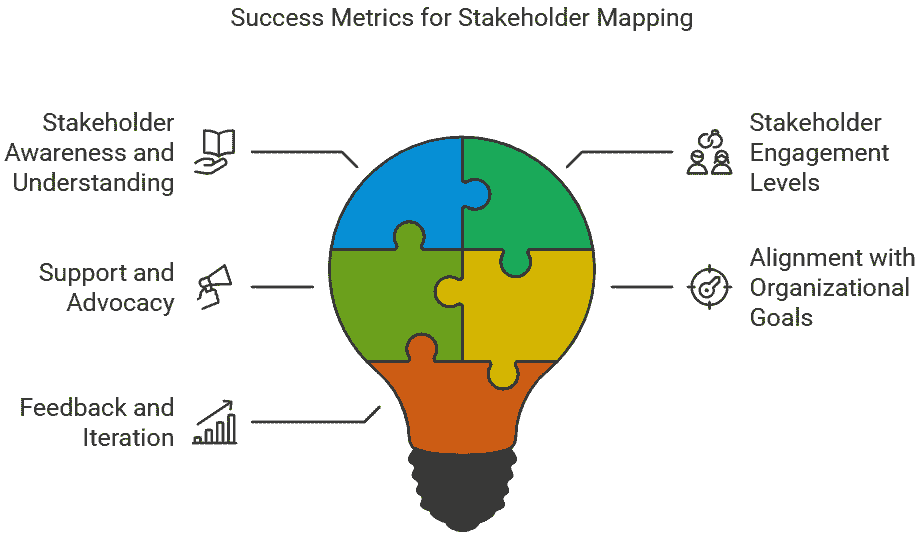
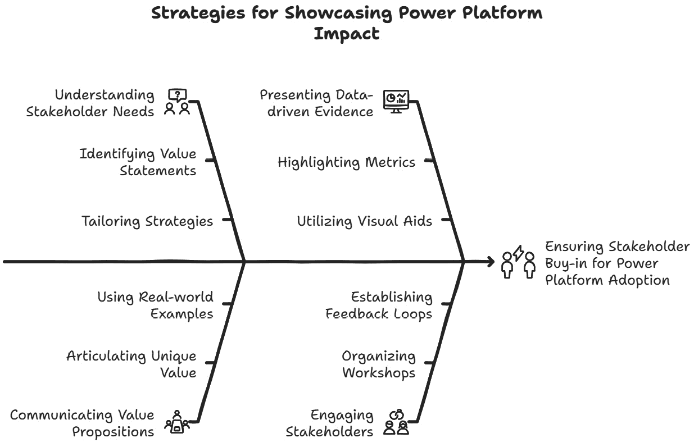
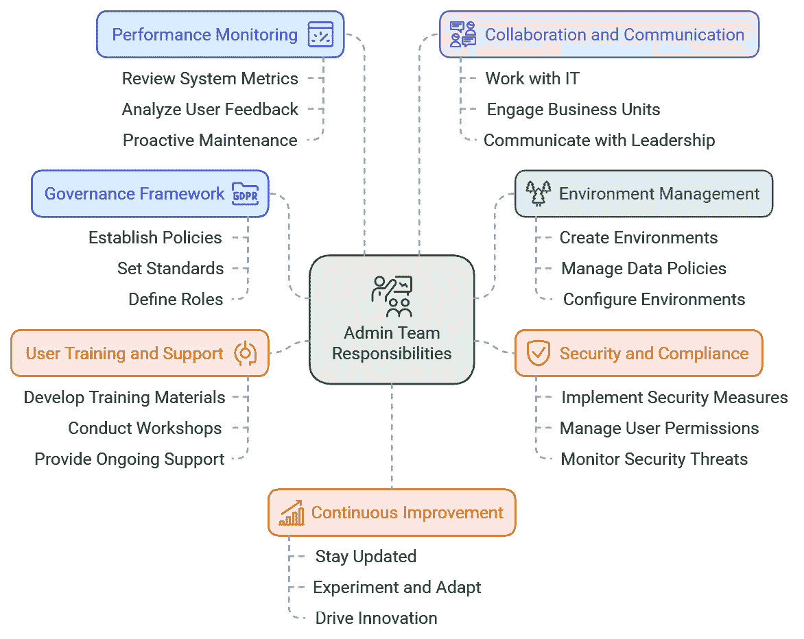
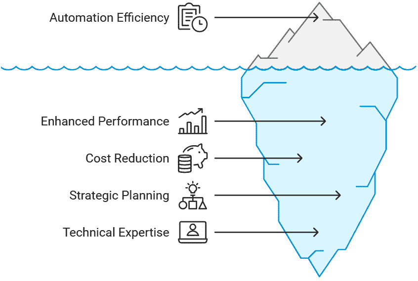
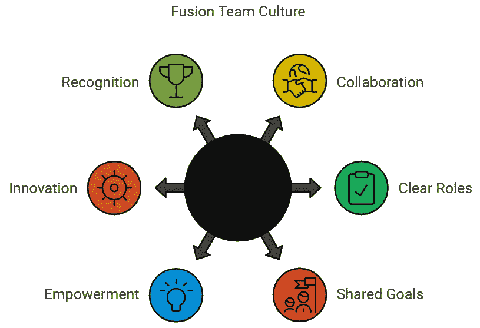
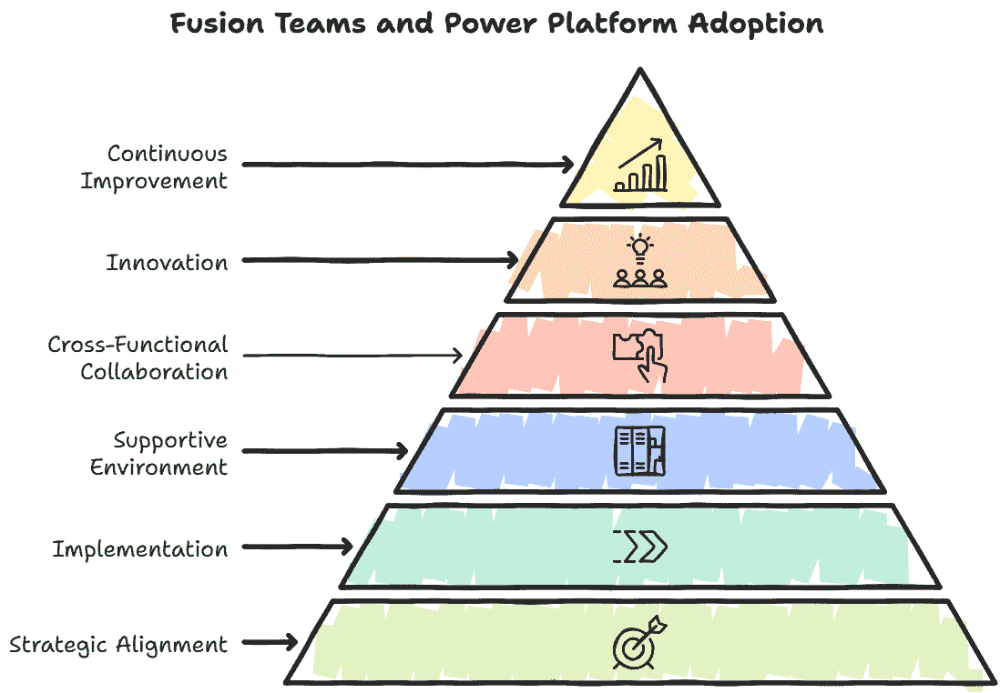
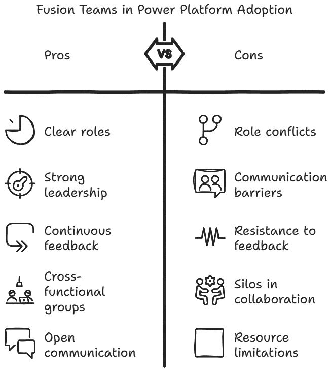
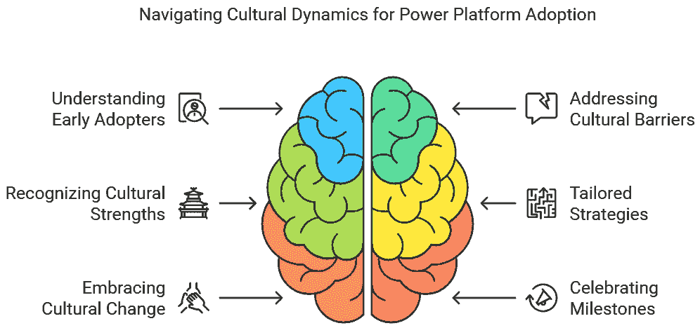

# 7

# 数字化转型中的协作与变革

在本章中，我们将重点关注利益相关者分析、对齐和有效变革管理在数字化转型时代的重要性。我们将深入研究不同利益相关者的角色，包括执行赞助人、成功所有者、倡导者、培训负责人、部门负责人、沟通负责人、Power Platform 管理员团队和 Power Platform 培育团队，以及他们在组织内部成功采用 Power Platform 中的作用。我们还将探讨公民开发者如何从各个部门贡献创新想法，超越传统的 IT 角色。

获得管理层和执行人员的认可对于这些个人有效地使用 Power Platform 至关重要。我们将讨论通过展示 Power Platform 对其角色可能产生的积极影响来获得不同利益相关者认可的策略。管理层关注成本降低，经理关注时间节省，个人关注学习机会。我们还将强调解决担忧和阐明转型如何从短期和长期影响组织的各个方面的重要性。为了促进这一转型，组织依赖于他们的 Microsoft Power Platform 管理员团队。我们将探讨管理员团队的责任，包括建立环境策略、实施数据丢失预防政策、管理用户、容量和许可，并通过连接器和集成启用数据访问。

本章将探讨以下主题：

+   利益相关者分析和对齐

+   利益相关者认可策略

+   Power Platform 管理员团队的作用

+   融合团队协作及其他

+   建立数字文化

# 利益相关者分析和对齐

任何 Power Platform 采用项目的成功都依赖于利益相关者的有效参与。利益相关者映射是这个过程中的关键第一步，使组织能够识别、分析和分类所有对项目感兴趣或受其影响的个人和团体。通过了解他们的需求、担忧、动机和影响力，组织可以调整他们的参与策略，以确保广泛的支持并最小化阻力。本介绍提供了对利益相关者映射重要性的洞察，以及它是如何为成功采用 Power Platform 奠定基础的。让我们探讨如何有效地映射和管理利益相关者，以确保成功。

## 利益相关者映射

利益相关者映射是任何 Power Platform 采用计划的关键初始步骤，它是成功实施和长期可持续性的基石。它涉及识别、分析和分类所有对计划感兴趣或受其影响的个人和群体。通过了解他们的需求、关注点、动机和影响力，你可以定制参与策略，以确保广泛的支持并最小化阻力。

利益相关者映射的第一阶段是确定所有潜在的利益相关者。这包括不仅限于 Power Platform 的主要用户，还包括可能间接受到影响的其他次要利益相关者。重要的是要理解，利益相关者不仅仅是组织中的高级人员。利益相关者可以是**任何人**，只要他们正在使用该平台。典型的利益相关者可能包括以下人员：

+   **执行领导层**：他们的支持和持续支持对于资源分配和推动组织变革至关重要

+   **IT 部门**：他们在平台的技术启用和维护中扮演着关键角色

+   **最终用户**：将每天使用该平台的员工——他们的反馈和用户体验对于迭代改进至关重要

+   **业务单元经理**：他们需要看到平台将为他们运营带来的战略优势和效率

+   **代码和低代码开发者**：两组都需要有效合作，以充分发挥平台潜力

+   **外部合作伙伴**：可能参与实施和支持阶段的第三方供应商和顾问

一旦确定了利益相关者，下一步就是分析他们对 Power Platform 采用的影响力及兴趣。这可以通过利益相关者矩阵来可视化，它有助于根据他们的影响力和兴趣水平将利益相关者分类到不同的群体中。*表 7.1* 中的表格是跟踪利益相关者影响力的一个示例。

| **影响力/兴趣** | **高影响力，高兴趣** | **高影响力，低兴趣** | **低影响力，高兴趣** | **低影响力，低兴趣** |
| --- | --- | --- | --- | --- |
| 示例 | 执行领导层，业务单元经理 | IT 部门 | 最终用户，公民开发者 | 外部合作伙伴 |

表 7.1：利益相关者影响力映射表

不同的利益相关者群体需要定制化的参与策略来满足他们独特的需求和关注点。例如，你不会与高级执行人员和最终用户分享相同的信息。他们都需要在不同时间获取不同类型的数据。以下是每个类别的策略：

+   **高影响力，高兴趣**：通过定期更新、战略讨论和参与关键决策过程来与他们互动。他们的支持和倡导可以推动平台在整个组织中的采用。

+   **影响力高，兴趣低**：专注于展示平台的战略价值和它如何与他们的目标一致。使用简洁、有影响力的沟通来吸引他们的注意。

+   **影响力低，兴趣高**：提供全面的培训和资源，让他们掌握有效使用平台的知识和技能。他们的积极体验可以创造基层支持。

+   **影响力低，兴趣低**：通过一般通讯和更新让他们保持知情。他们的支持可能不是关键的，但他们的意识是有益的。

利益相关者映射不是你做一次的事情；它是你在交付计划中持续执行的行动。随着 Power Platform 的采用进展，利益相关者的角色、兴趣和影响力可能会变化。定期回顾和更新利益相关者分析，以确保持续一致和支持。

通过持续映射和参与利益相关者，组织可以导航 Power Platform 采用中的复杂性，促进一个推动创新和变革的协作环境。

例如，在组织 X 中，可能为许多不同级别的利益相关者完成利益相关者映射，但利益相关者移动和角色转换是非常典型的。确保这些利益相关者的移动和管理得到跟踪是很重要的。

## 定义成功

在利益相关者映射练习中定义成功需要清楚地了解 Power Platform 采用项目的目标和目标。成功可以通过利益相关者参与策略促进协作、推动创新和促进组织变革的程度来衡量。

利益相关者参与度越高，你收到的反馈越多，项目成功的可能性就越高。参与度高的利益相关者推动更明确的输出。

一个成功的利益相关者映射练习应识别所有相关的利益相关者，并根据前一部分中提到的他们的影响力和兴趣进行分类。这种分类有助于定制参与策略，确保每个利益相关者群体得到有效应对。以下是一些需要考虑的关键指标：

+   **利益相关者意识和理解**：衡量利益相关者对 Power Platform 功能和优势的意识和理解的提高。这可以通过调查、反馈会议和培训项目的参与率来完成。

+   **利益相关者参与程度**：跟踪不同利益相关者群体的参与程度。在战略讨论、反馈会议和决策过程中的参与度提高表明参与成功。

+   **支持和倡导**：评估关键利益相关者（特别是那些具有高影响力和高兴趣的人）的支持和倡导程度。他们在组织内部对平台的认可和积极推广对于广泛采用至关重要。

+   **与组织目标的一致性**：确保利益相关者映射和参与策略与更广泛的组织目标和目标保持一致。定期审查和调整策略，以保持一致性并解决任何新兴的担忧或机会。

+   **反馈和迭代**：从利益相关者那里收集持续的反馈，以完善和改进参与策略。成功是一个迭代的过程，涉及持续的学习和适应。

通过系统地定义和衡量图 *7.1* 中所示的成功指标，组织可以有效地应对 Power Platform 采用的复杂性。一次执行良好的利益相关者映射练习不仅推动了平台的采用，还促进了创新和持续改进。

图 7.1：利益相关者映射的成功指标

利益相关者映射和管理对于成功的实施和长期可持续性至关重要。这包括识别和分析所有潜在的利益相关者，包括高管领导层、IT 部门、最终用户、业务单元经理、专业编码和低代码开发者以及外部合作伙伴。一旦确定了利益相关者，就可以使用利益相关者矩阵分析他们的影响力和兴趣，从而制定更精细的参与策略，以满足他们的独特需求。

利益相关者映射是一个持续的过程，需要定期回顾和更新，因为利益相关者的角色和影响力可能会发生变化。需要考虑的成功指标包括利益相关者的认知和理解、参与度、支持和倡导、与组织目标的契合度，以及反馈和迭代。通过系统地定义和衡量这些成功指标，组织可以有效地应对 Power Platform 采用的复杂性。在下一节中，我们将探讨管理和推动利益相关者接受度的策略。

# 利益相关者接受策略

在进行任何工作计划时，确保你的利益相关者接受并支持它至关重要。你从各个利益相关者那里获得的接受度越高，工作计划的成功率就越高。关键在于理解你的利益相关者所寻求的是什么，以及成功和影响对他们来说意味着什么。如果你能展示出影响和实际可量化的成果，你的利益相关者的需求将得到满足，他们将会更加支持。让我们看看你如何突出影响。例如，一个制造者真正希望尽可能快地得到一个可行的解决方案，而首席信息官则希望看到在更广泛的群体中节省时间和提高生产力的效果。

## 展示影响

向利益相关者展示 Power Platform 的影响对于其在组织中的成功采用和集成至关重要。展示平台的价值需要一种战略性的方法，包括清晰的沟通、可衡量的成果和持续的参与。

一旦确定了利益相关者和他们的利益，就可以根据每个组的需求和关注点定义和细化策略，以确保全面的参与。不同级别的利益相关者可能对影响和价值有不同的看法，因此确保这一点被理解并设置相关指标非常重要。例如，高级管理层中的利益相关者可能希望了解解决问题时节省的小时数，而开发者可能希望从平台中获得更广泛的技术广度。

在确定每个组的价值观陈述后，明确阐述 Power Platform 的独特价值主张。这包括其提高生产力、自动化流程和推动创新的能力。使用真实世界的例子和案例研究来有说服力地说明这些观点。

展示平台影响的基于数据的证据。应突出显示节省的时间、成本降低和效率改进等指标。图表、图表和仪表板等视觉辅助工具可以使这些成果更具说服力。一种很好的方法是跟踪 Power BI 数据模型中的任何监控和反馈数据，这样数据就可以直观地理解。

实现这一目标的一个好方法是通过对创建的资产进行主动监控，然后跟踪用户反馈，例如每个资产节省的时间。来自制造者和用户的监控和积极反馈将允许进行更详细的报告。一个实际的例子是，自动化工具的制造者可以分享每个流程节省的分钟数，以及可以统计的流程运行次数，以了解节省的分钟数。如果 1 个流程为用户节省了 10 分钟，而这个流程每天运行 10 次，那么每天可以节省 100 分钟。

分享来自组织内部或类似行业的成功故事。早期采用者或关键用户的证词可以提供对 Power Platform 益处的真实见解，促进信任和信誉。微软建立的 Power Platform 客户故事网站是分享您的成功故事的好地方。微软网站上有一个很好的例子是雪佛龙的案例，他们如何成功地使用 Power Platform。您可以通过此 URL 访问客户故事：[`www.microsoft.com/en-us/power-platform/blog/power-apps/power-platform-stories`](https://www.microsoft.com/en-us/power-platform/blog/power-apps/power-platform-stories)。

组织互动研讨会和现场演示以展示平台的功能。让利益相关者亲身体验 Power Platform 如何解决特定的业务挑战和简化运营——越直观和互动越好。

建立一个持续反馈流程，以收集利益相关者的意见并进行迭代改进。定期的调查、反馈会议和参与活动确保利益相关者的关切能够得到及时有效的处理。一个积极参与的利益相关者，主动分享，总意味着项目进展顺利。其中一种行之有效的方法是一对一的利益相关者电话和讨论。通常，利益相关者可能更倾向于在私密论坛中分享；然而，这可能需要花费大量时间，因此，重要的是要针对你采访的*对象*进行有针对性的选择。

确保展示的影响与更广泛的组织目标和目标一致。这有助于加强 Power Platform 在实现战略重点中的相关性，并增强利益相关者的支持。

吸引并赋权有影响力的利益相关者，让他们成为平台的倡导者。他们的认可和主动推广可以显著提高采用率并推动组织变革。创造英雄故事并将人们置于聚光灯下通常能激励他人加入更广泛的运动。

承认展示影响是一个持续的过程。根据反馈和不断变化的组织需求持续优化你的策略可以增强利益相关者对 Power Platform 的信心。

通过采用*图 7.2*中总结的策略，组织可以有效地向利益相关者展示 Power Platform 的变革性影响，推动参与并鼓励创新和协作的文化。

图 7.2：展示 Power Platform 影响的策略

在实施工作计划时，获得利益相关者的支持对于成功至关重要。针对每个利益相关者群体优化你的方法确保全面参与。提供数据驱动的证据，分享成功故事，并将影响与组织目标对齐，可以增强利益相关者的支持。赋予有影响力的利益相关者作为倡导者的权力可以显著提高采用率。根据反馈持续优化策略对于增强利益相关者对 Power Platform 的信心至关重要。在下一节中，我们将探讨 Power Platform 管理员团队在 Power Platform 工作计划中的作用。

# Power Platform 管理员团队的作用

在本节中，我们将重点关注 Power Platform 采用计划中管理团队的基本角色和责任。了解他们的战略规划、技术熟练度和持续支持如何构成成功执行的基础，并为生态系统的扩展和增长做好准备。探索管理团队积极主动的方法如何通过自动化提高效率，并为 Power Platform 采用计划带来持久的价值。

## 管理团队的职责和责任

在 Power Platform 采用计划中，管理团队的职责是多方面的，包括战略规划、技术专长和持续支持。管理团队的任务是为成功实施奠定基础，并确保平台在一段时间内的可持续性和可扩展性。

通常，Power Platform 生态系统中的主要用户或制作者最终会成为 Power Platform 管理员，这可能证明是困难的，因为平台可以迅速有机增长。明确管理团队中人员的角色对于推动某种结构至关重要。一个人不能负责一切。有些组织中，平台基本上是战术性的，随着平台的发展，平台所有者会陷入任务中。这不是一个可扩展的解决方案。

管理团队的主要责任之一是建立一个与组织整体战略目标一致的管理框架。这包括制定政策、标准和最佳实践，以确保 Power Platform 的有效和安全使用。团队还必须定义角色和责任，确保有明确的问责制和监督。

管理团队负责在 Power Platform 中创建和管理各种环境。这包括设置开发、测试和生产环境（与确定的环境策略相关），管理数据策略，并确保环境正确配置以支持业务需求，同时维护安全和合规要求。

确保 Power Platform 的安全和合规是一个关键责任。管理团队必须实施强大的安全措施来保护敏感数据并防止未经授权的访问。这包括配置安全角色、管理用户权限和定期监控任何潜在的安全威胁。必须持续评估和维持符合行业标准法规。例如，在管理环境中的安全时，一个关键考虑因素是确定是否需要 Dataverse。Dataverse 为环境安全管理提供了一个*更加*细粒度的方法。这将成为更广泛的环境战略的一部分。

为了推动 Power Platform 的采用和有效使用，管理员团队（以及更广泛的赋能团队）必须为最终用户和公民开发者提供全面的培训和支援。这包括开发培训材料、举办研讨会，以及提供持续的支持以解决任何出现的问题或疑问。通过赋予用户所需的知识和技能，管理员团队有助于建立一个创新和自给自足的文化。在推动组织内的采用时，这一点尤为重要。

与其他部门和利益相关者的有效协作和沟通对于 Power Platform 采用计划的成功至关重要。管理员团队必须与 IT 部门、业务单元和高级管理层紧密合作，以确保一致性和解决任何跨职能挑战。清晰和一致的沟通有助于建立信任，并确保平台的优势在整个组织中得到充分实现。

管理团队必须紧跟 Power Platform 和相关技术的最新发展、创新和最佳实践。这涉及到持续学习、实验和适应，以推动组织内的持续改进和创新。通过推广持续改进的文化，管理员团队可以确保 Power Platform 始终是一个有价值且动态的工具，用于推动业务转型。*图 7.3*展示了 Power Platform 管理员团队的职责和责任概述。需要注意的是，团队可能会被分配更多的工作，因此从一开始就建立一些限制条件非常重要，以确保团队不会承担过多的工作。

图 7.3：Power Platform 管理员团队的职责和责任概述

管理团队是 Power Platform 太阳系的中心，许多任务和活动围绕着他们展开。随着生态系统的增长，从数十个资产到数百个再到数千个资产，这些任务和活动将会增加。同时，确保团队与这些责任并行增长也非常重要，这样其他人可以接手这些责任，避免出现单点故障。

考虑到在采用 Power Platform 的组织中实施持续改进的概念是关键。最终，管理员团队应希望制作者能够自给自足并支持自己的创作。管理员团队不可能总是负责解决每个问题的解决方案和每个人的学习；因此，建立持续改进的文化是关键。帮助制作者理解在公共场合和他人一起学习是一个很好的开始，并通过社区网站和门户推动这种信息将有所帮助。不知道所有事情是可以的，但让我们分享我们所学的知识和*如何*找到解决方案。这为他人提供了一个开放学习并*希望*成为更好的制作者的环境。

## 为您的生态系统准备以实现规模和增长

为了准备您的生态系统以实现规模和增长，您的平台管理员团队需要确保与其他部门和利益相关者的开放和有效协作与沟通是工作计划的核心。管理员团队必须与 IT 部门、业务单元和高级管理层紧密合作，以确保一致性和解决任何跨职能挑战。清晰且一致的沟通有助于建立信任并确保平台的优势在整个组织中得到充分实现。

持续监控平台性能和用法对于识别改进和优化的领域至关重要。管理员团队必须定期审查系统指标、用户反馈和其他数据源，以确保平台高效且有效地运行。采取主动维护和更新是解决任何问题并利用新功能和能力所必需的。这和微软 365 项目并无不同，了解用户如何使用工具以及为何使用这些工具将有助于应用治理和合规策略。监控通常可在管理员中心和微软 365 合规中心进行；然而，确保已安装微软 CoE 入门套件以进行更细致的监控是至关重要的。

随着 Power Platform 生态系统在组织中的扩展，赋权不同级别的制作者至关重要。通过为他们提供适当的工具、培训和支援，他们可以创建满足其特定需求的解决方案，减少对 IT 的依赖。推广融合团队协作的文化——其中 IT 和业务单元共同工作——可以推动创新并确保解决方案与业务目标保持一致。

在组织中建立融合团队文化可以增强协作和沟通，从而实现更有效的解决问题和创新。融合团队的作用是弥合 IT 和业务单元之间的差距，确保技术视角和业务视角都得到考虑。

在扩展和增长 Power Platform 生态系统时，管理员团队可能会面临几个挑战，包括对变化的抵制、技能差距和集成问题。在讨论这种场景下的集成时，我们指的是团队和人员的集成，而不是技术的集成。解决这些挑战需要采取主动的方法，包括持续学习、利益相关者参与和利用最佳实践。通过克服这些障碍，组织可以充分实现 Power Platform 的益处，并在整个业务中推动更广泛的采用。

通过为 Power Platform 管理员团队和生态系统准备规模和增长，组织可以确保他们处于推动业务转型和创新的良好位置。管理员团队的战略规划、技术专长和持续支持对于平台的长远成功和可持续性至关重要。

除了提到的角色外，自动化在扩展和增长中也发挥着重要作用。自动化常规任务和工作流程可以节省时间，减少错误，并确保平台上的一致性。管理员团队应利用 Power Automate 和其他工具来简化流程，使团队成员能够专注于更具战略性的项目。本质上，自动化更多的任务，团队需要进行的手动工作就越少。

## 自动化和效率

在您的 Power Platform 生态系统中通过自动化提高效率需要一种结合技术工具、结构化流程和授权团队的协调一致的策略。在 Power Platform 采用计划期间，管理员团队在识别和实施自动化机会方面发挥着关键作用，这可以显著提高组织绩效。正如你在*图 7**.4*中看到的，通过自动化提高效率还有许多其他益处。实现自动化真正益处可能需要前期资源投入。

图 7.4：提高驾驶自动化效率可带来许多其他可实现的益处

提高效率的第一步是对现有的工作流程和流程进行彻底的分析。管理员团队应与各个业务部门合作，绘制常规任务图，识别瓶颈，并确定自动化可以带来最大影响的领域。这需要深入了解 Power Platform 的技术能力以及组织的运营需求。

管理团队应专注于开发自动化解决方案，以简化重复性任务，例如数据录入、审批流程和通知。通过使用 Power Automate 中可用的模板和连接器，团队可以快速部署与现有系统无缝集成的自动化解决方案。尽可能多的自动化意味着管理团队能够专注于推动平台更广泛的应用。这类场景下，像 Power Automate 这样的工具非常出色，可以帮助企业实现极快的价值实现。

为了确保自动化项目的成功和可持续性，建立最佳实践至关重要。这包括为设计、评估和部署自动化工作流制定指南。管理团队应创建一个可重用组件和模板的存储库，这可以加速新自动化解决方案的开发并促进组织内的统一性。

自动化是对您已经创建或正在创建的流程的持续改进。管理团队必须实施监控机制以跟踪自动化工作流的性能并确定改进领域。与利益相关者的定期审查和反馈会议可以为自动化解决方案的有效性提供宝贵的见解，并帮助进一步优化它们。这不仅仅是“一次性”自动化——流程的自动化是一个持续的过程。

由于自动化触及业务的各个方面，确保安全和合规变得至关重要。管理团队应实施严格的访问控制并定期审计自动化工作流，以防止未经授权的操作并确保它们符合监管要求。此外，维护自动化工具和数据的 secure 环境对于保护敏感信息至关重要。

通过在 Power Platform 生态系统内战略性地利用自动化，组织可以实现显著的效率提升，降低运营成本，并提高整体生产力。管理团队凭借其专业知识和主动进取的态度，是推动这些成果并确保 Power Platform 采用计划带来长期价值的关键。

Power Platform 采用计划中的管理团队负责战略规划、技术专长和持续支持，以确保平台的成功实施和可持续性。其角色包括建立治理结构、管理环境、确保安全和合规、提供培训和支援、监控性能，并保持对最新最佳实践的更新。他们还在通过促进协作、赋权公民开发者以及通过自动化提高效率来为生态系统准备规模和增长方面发挥关键作用。管理团队的主动进取方法对于维持长期价值并推动业务转型至关重要。在下一节中，我们将探讨组织如何随着 Power Platform 在业务中的扩展构建和维护融合团队文化。

# 融合团队协作及超越

在组织中成功采用 Power Platform 的关键是构建融合团队文化。融合团队由 IT 专业人员和业务用户组成，鼓励协作、创新和共享数字化转型项目和资产的所有权。

通过采用这些策略，组织可以为构建统一和有效的融合团队奠定基础，推动解决方案的成功实施，并为组织的整体数字化转型之旅做出贡献。

## 构建融合团队文化

在您的组织中构建融合团队文化可能对人们习惯的做法有所改变。通常，融合团队由来自整个业务领域的不同人员组成。其中一些人可能比其他人更技术化；然而，主要目标是让他们共同工作，利用 Power Platform 提供的工具构建有用的解决方案。

鼓励 IT 部门和业务单元之间开放沟通渠道至关重要。定期的会议、研讨会和协作平台有助于打破壁垒，促进思想和专业知识的交流。通过促进透明度和相互尊重的文化，团队可以更有效地合作，开发和实施自动化解决方案。这有时可能是一个挑战，因为 IT 部门历史上并没有与业务共同开发解决方案。他们可能收到了业务提出的需求列表，但这可能被认为与需要解决的实际情况脱节。

为融合团队的每个成员建立明确的角色和责任非常重要。这确保了每个人都了解他们对项目的贡献，并可以利用他们独特的技能和知识。通过早期定义这些角色，团队可以更顺畅地运作，避免潜在的冲突或责任重叠。例如，一个非技术但清楚地理解业务领域的个人可能被视为领域专家，而一个更技术且擅长编写代码的人可能被称为“开发者”。

共同的愿景和目标对于团结融合团队至关重要。通过将团队的目标与组织的整体战略对齐，成员可以朝着共同的目标努力并保持动力。回顾和精炼这些目标可以帮助在整个采用计划中保持专注并推动进步。

赋予团队成员必要的技能和资源是构建一支有能力的融合团队的关键。提供培训课程、访问知识库和动手工作坊可以帮助 IT 和商业用户熟练使用 Power 平台。这种对教育的投资不仅提高了个人能力，也增强了团队的整体表现。

创新应该是融合团队文化的核心。通过创造一个鼓励实验和创造性解决问题的环境，团队可以开发出解决商业挑战的新颖方案。庆祝成功，从失败中学习，并持续迭代想法，可以帮助维持创新文化。

通过将多样化的利益相关者纳入采用计划，融合团队可以全面了解组织的需求和优先事项。这种跨职能方法确保自动化倡议与业务目标一致，并实现最大价值。

承认融合团队成员的努力和成就对于维持士气和动力很重要。实施认可和奖励计划可以帮助强化积极行为并鼓励持续参与。无论是通过正式奖项、公开认可还是非正式的感谢行为，认可贡献可以加强团队的归属感和承诺感。*图 7.5*总结了在您的组织中构建强大的融合团队文化的六个关键方面。

图 7.5：融合团队文化的六个关键方面

许多组织已经采用了融合团队文化，甚至没有意识到这一点。通过关注*图 7.5*中提到的领域类型，可以给这个过程增加一些流程和正式性。

创建一个让团队成员感到受重视和赋权的支持性环境对于融合团队的成功至关重要。提供导师资源、推广持续学习的文化以及促进工作与生活的平衡可以帮助确保团队成员保持参与和高效。支持性环境还鼓励团队成员敢于冒险和创新，无需担心失败。

这种协作和赋权的方法不仅提高了自动化活动的有效性，而且也为组织的整体数字化转型之旅做出了贡献。

## 融合团队的作用

融合团队在推动组织内部成功采用 Power Platform 方面发挥着关键作用。通过将 IT 专业人员和业务用户整合成一个统一的单元，融合团队利用多样化的技能和视角来解决数字化转型中的复杂挑战。他们的角色多样，包括在采用计划的各个阶段进行战略规划、执行和持续改进。

在一开始，融合团队在将 Power Platform 采用计划与组织的战略目标对齐方面发挥着关键作用。他们促进了识别可以从自动化和低代码/无代码解决方案中受益的关键业务流程。这种战略重点确保采用努力不仅与业务目标一致，而且能带来实际价值。通过吸引来自不同部门的利益相关者，融合团队制定了一个全面的路线图，突出了优先事项、时间表和资源需求。

在实施阶段，融合团队是自动化解决方案开发和部署背后的推动力量。他们的协作性质使得技术专长和商业洞察力的无缝整合成为可能，从而产生了既技术稳健又符合业务需求解决方案。融合团队负责配置和定制 Power Platform 及相关工具以满足特定的组织需求，并监督开发提高运营效率的应用程序、工作流和仪表板。

创建支持性环境的重要性不容忽视。融合团队在成员感到受重视和赋权的环境中蓬勃发展。这是通过提供导师资源、推广持续学习的文化和促进工作与生活的平衡来实现的。这样的环境鼓励创新和冒险，使团队成员能够无惧失败地探索创造性解决方案。支持性文化还确保了持续的参与和高效，这对于采用计划的长期成功至关重要。

创新是融合团队的核心。通过营造鼓励实验和创造性解决问题的环境，融合团队推动了对商业挑战的新解决方案的开发。庆祝成功、从失败中学习以及迭代想法是维持创新文化的关键实践。这种对持续改进的关注确保了组织保持敏捷并能够适应不断变化的商业需求。

赋予团队成员必要的技能和资源至关重要。融合团队投资于培训和开发，以提升个人能力和整体团队表现。提供培训课程、访问知识库和动手研讨会，使 IT 和业务用户都能熟练使用 Power 平台。这种对教育的投资不仅提升了技术能力，还培养了一种自力更生和持续学习的文化。

共同的愿景和共同的目标将融合团队团结在共同的目标周围。通过将团队目标与组织的战略目标对齐，融合团队能够确保所有成员都在朝着同一个目标努力。这种对齐产生了所有权和承诺感，推动了整个采用计划中的进步并保持了专注。定期回顾和细化这些目标有助于保持团队的对齐和动力。

明确的角色和责任对于融合团队的顺畅运作至关重要。通过早期建立明确的角色，融合团队能够利用每个成员的独特技能和知识，避免潜在的冲突或重叠。这种清晰度确保了每个人都了解他们对项目的贡献，促进了高效的协作和执行。*图 7.6*总结了融合团队的角色。

图 7.6：融合团队角色的关键方面

组织可以建立一个强大的融合团队文化，推动 Power 平台的成功采用。这种协作和赋权的方法不仅增强了自动化倡议的有效性，还促进了组织的整体数字化转型之旅。

## 协作与沟通

开放沟通渠道对于融合团队的成功和构建协作文化至关重要。定期的会议、研讨会、黑客马拉松和协作平台促进了想法和专长的交流，打破了信息孤岛，并促进了透明度。开放沟通和相互尊重的文化使团队能够更有效地协作，确保自动化解决方案得到一致的开发和实施。

驱动融合团队之间的协作和沟通的一个有效方法是建立指定的协作平台。这些平台可以包括诸如 Microsoft Teams、Slack 或其他数字工作空间等工具，允许团队成员实时分享更新、讨论挑战和头脑风暴解决方案。此外，建立定期的接触点，如每日站立会议、每周同步或双周回顾，确保沟通保持一致，并迅速解决任何问题。

融合团队可以通过创建跨职能工作组、小组或任务小组来受益。这些小组可以由来自 IT、业务单元和其他利益相关者的成员组成，他们带来不同的观点和专业知识。通过共同完成特定任务或项目，这些跨职能团队可以更深入地理解不同的角色和责任，从而产生更协调和综合的解决方案。

应鼓励融合团队之间分享他们的经验、所学教训和最佳实践。这可以通过定期的反馈会议、同行评审和知识共享研讨会来实现。通过创造一个重视反馈并采取行动的环境，团队可以持续优化其流程并提高其表现。

最后，领导在促进融合团队内部的协作和沟通中扮演着关键角色。领导者应积极推广并树立开放沟通、透明度和包容性的榜样。他们还应提供必要的支持和资源，以确保团队成员能够有效协作。这包括投资于培训计划、提供协作工具访问权限以及营造信任和相互尊重的文化。

明确的角色和责任对于融合团队的顺利运作至关重要。通过早期建立明确的角色，融合团队可以利用每个成员的独特技能和知识，避免潜在的冲突或重叠。这种清晰度确保了每个人都了解他们对项目的贡献，从而促进高效的协作和执行。

## 挑战与解决方案

在 Power Platform 采用计划中开发融合团队期间，组织通常会面临一些挑战。有效解决这些挑战对于确保该项目的成功和可持续性至关重要。

其中一个主要挑战是确定“谁做什么”。如果这一点没有定义，将*会*产生沟通障碍，甚至可能没有明确的领导和支持。通过早期建立明确的角色，融合团队可以利用每个成员的独特技能和知识，避免潜在的冲突或重叠。这种清晰度确保了每个人都了解他们对项目的贡献，从而促进高效的协作和执行。

为了继续讨论角色和责任，领导在促进融合团队内的协作和沟通中发挥着关键作用。领导者应积极推广并树立开放沟通、透明度和包容性的典范。融合团队的概念相对较新，因此为团队中的每个人确立明确的方向很重要。如果没有明确的领导，融合团队将像没有舵的船一样——没有方向。

沟通是*关键*！一个沟通明确且成员活跃的融合团队将表现出色。这意味着需要建立流程和渠道，以便人们进行沟通。尽早建立这些框架将避免许多后续的挑战。一个关键挑战是当技术成员和非技术成员分裂成更小的团队时。如果发生这种情况，融合团队就失败了。*图 7.7* 突出了利用融合团队的利弊。

图 7.7：融合团队 Power Platform 采用的利弊

总之，在组织内部成功采用 Power Platform，建立强大的融合团队文化至关重要。融合团队，即整合 IT 专业人员和业务用户，在推动协作、创新和数字化转型项目中的共同责任方面发挥着关键作用。为了构建这样的团队，组织必须优先考虑几个策略。将团队目标与组织的战略目标对齐有助于保持动力和专注。投资必要的技能和资源，如培训和访问知识库，可以提升个人和团队的表现。通过鼓励实验和从成功与失败中学习来促进创新文化，推动创造性解决方案的发展。通过认可计划和积极的工作环境来认可和支持团队成员，可以提升士气和生产力。通过解决这些方面，组织可以建立一个融合团队，它不仅增强了自动化项目的有效性，而且对整体数字化转型之旅做出了重大贡献。在下一节中，我们将探讨在您的组织中建立数字文化的方 法。

# 建立数字文化

在采用 Power Platform 的过程中，审视您的组织文化是一个关键步骤。它始于对当前状态的真诚评估，识别可能影响项目成功的文化规范、价值观和行为。调查、访谈和焦点小组可以是收集来自各个层级员工洞察力的有效工具。这些方法有助于揭示人们的看法、态度以及可能对创新技术的潜在抵制。

理解组织文化的潜在动态使领导者能够调整他们的策略以解决具体的文化障碍并利用优势。例如，如果创新和协作的文化已经存在，重点可以放在增强这些特质以支持 Power 平台的采用。如果存在隔阂和变革的阻力，则应致力于开放和跨职能协作。

审查组织文化包括认可和庆祝早期采用者、倡导者和成功案例。突出这些例子可以为组织中的其他人提供强大的动力，强调可衡量的好处，并促进围绕采用过程的积极叙事。

对组织文化的彻底审查不仅有助于使过渡过程更加顺畅，而且为可持续的数字化转型奠定了基础。通过理解和培养与 Power 平台项目目标一致的文化要素，组织可以推动更有效和持久的变革。

## 文化变革管理

成功采用 Power 平台的关键在于组织内部细致的文化变革管理。这涉及一种从评估当前文化景观开始的策略。

一旦理解了这些文化要素，下一步就是积极培养一种支持并增强 Power 平台采用的文化。解决具体的文化障碍至关重要。如果组织已经拥有创新和协作的文化，这些特质可以进一步放大以支持 Power 平台的实施。相反，如果组织遭受隔阂或变革的阻力，则应专注于在隔阂之间建立桥梁。

领导者调整他们的策略以利用组织的现有优势并解决其弱点是至关重要的。这可能涉及有针对性的培训计划、研讨会和其他旨在在员工中建立必要技能和信心的举措。通过战略性地关注这些领域，组织可以建立一个强大的融合团队文化，推动 Power 平台的顺利采用。这种协作和赋权的方法不仅增强了自动化计划的有效性，而且有助于组织整体的数字化转型之旅。

## 赢得人们的支持

在采用 Power 平台的过程中，赢得人们对数字变革管理计划的认同需要一种战略性的方法。这始于领导者理解他们组织的独特文化动态。通过利用现有优势并解决弱点，可以创建一个与团队需求和愿望产生共鸣的精炼策略。

解决具体的文化障碍同样至关重要。如果组织已经拥有创新和协作的文化，这些特质可以被放大以支持 Power Platform 的实施。如果存在隔阂或对变革的抵制，这些领域应进一步探索，并通过各种项目来解决这个问题和通过教育人们。

认识和庆祝里程碑和采用非常重要。突出这些积极例子是一种强大的激励因素，展示了平台的有形效益，并围绕其采用创造了积极的叙事。

成功采用 Power Platform 的关键在于谨慎的文化变革管理。这涉及到对当前文化景观的全面评估。必须识别出可能推动或阻碍实施过程的现有规范、价值观和行为。调查、访谈和焦点小组等工具可以提供有价值的见解，了解员工对创新技术的看法和态度，帮助确定抵制区域和参与机会。

对组织文化的彻底审查不仅有助于使过渡更加顺畅，还为可持续的数字化转型奠定了基础。通过理解和培养与 Power Platform 项目目标一致的文化元素，组织可以推动更有效和持久的变化。*图 7.8*展示了在审查组织的数字文化时应探索的六个核心支柱。

图 7.8：理解在导航数字文化时的各种动态

重点在于组织文化在成功采用 Power Platform 中的关键作用。它强调了使用调查、访谈和焦点小组等工具进行当前文化状态诚实评估的必要性，以揭示现有的规范、价值观和潜在的抵制。理解这些文化动态使领导者能够调整他们的策略，要么通过加强现有的优势，如创新和协作，要么通过解决隔阂和对变革的抵制等障碍。庆祝早期采用者和成功案例可以激励他人，并围绕现代技术构建积极的叙事。有效的文化变革管理涉及开放沟通、有针对性的培训和战略调整，以支持采用过程。通过将文化元素与 Power Platform 的目标对齐，组织可以促进更顺畅的过渡并促进可持续的数字化转型。

# 摘要

Power Platform 的成功采用取决于一种战略性的变革管理方法，该方法利用组织的优势并解决其弱点。领导者必须了解他们组织的独特文化动态，并相应地调整他们的策略，这可能包括有针对性的培训计划和倡议，以在员工中建立必要的技能和信心。

解决具体的文化障碍至关重要。如果组织具有创新和协作的文化，这些特质应该被放大以支持 Power Platform 的实施。相反，如果存在隔阂或对变革的抵制，这些领域必须通过教育项目进行探索和解决。认可和庆祝里程碑和采用情况很重要，因为它作为激励因素，并在平台采用方面创造积极的叙事。

使用调查、访谈和焦点小组等工具对当前的文化景观进行全面评估是必要的，以了解现有的规范、价值观和潜在的抵制。有效的文化变革管理涉及开放沟通、有针对性的培训和战略调整。将文化元素与 Power Platform 的目标对齐，有助于更顺利的过渡并促进可持续的数字化转型。

最终，理解和培养与 Power Platform 项目目标一致的文化元素可以推动更有效和持久的变革，增强自动化倡议的有效性，并为组织的整体数字化转型之旅做出贡献。

在下一章中，我们将探讨组织如何拥抱 Power Platform，并在成熟度模型级别的发展过程中构建有用的解决方案。

# 加入我们的 Discord 社区

加入我们社区的 Discord 空间，与作者和其他读者进行讨论：

[`packt.link/powerusers`](https://packt.link/powerusers)

