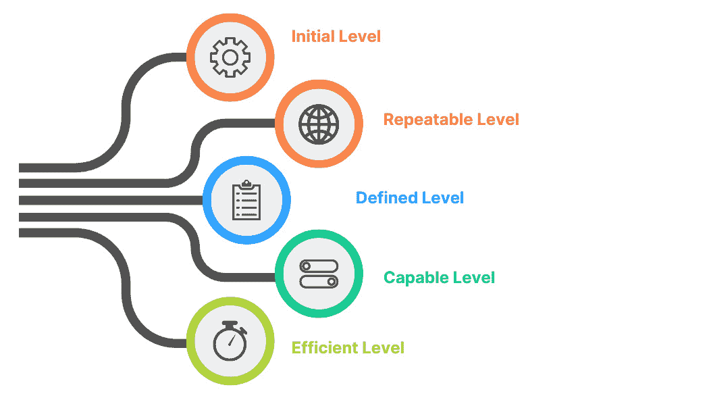

# 8

# 数字化转型解决方案的 Power Platform

在数字化转型动态环境中，组织越来越认识到 Power Platform 在促进创新和推动增长中的关键作用。Power Platform 由 Power BI、Power Apps 和 Power Automate 等 Microsoft 技术组成，为解决复杂商业挑战提供了无与伦比的可能性。然而，有效集成和利用 Power Platform 需要战略方法，考虑到组织的成熟度水平和不同利益相关者的协调一致。在本章中，我们将探讨以下内容：

+   利益相关者分析和协调的关键要素

+   使用能力成熟度模型集成（CMMI）指导成功的数字化转型

+   获得利益相关者支持的策略

+   建立融合团队协作

# 利益相关者分析和协调 – 推动 Power Platform 的成功采用

## 探索能力成熟度模型集成（CMMI）

**能力成熟度模型集成（CMMI）**作为评估组织在管理和实践方面成熟度的框架。此模型提供了一条路线图，以了解组织有效利用 Power Platform 的准备情况和能力。CMMI 概述了五个成熟度级别，每个级别都表明组织在采用最佳实践和取得成功方面的进展。以下图显示了根据 CMMI 的成熟度级别及其各自的能力。领导者应意识到他们的组织在这个谱系中的位置。

图 8.1 – CMMI 成熟度级别

+   **初始级别**：在这一阶段，组织在 Power Platform 上取得了零星的成功，尽管没有统一的策略或治理。重点是探索能力，而不是系统地利用它们。利益相关者可能不知道平台潜力，阻碍了其更广泛的采用。

+   **可重复级别**：进入这一阶段涉及实施初始控制和识别广泛使用的应用程序。然而，可能仍然存在无序使用的感觉。利益相关者开始意识到平台的价值，但需要更多结构化的方法。

+   **定义级别**：处于这一级别的组织标准化可重复的实践，并在数字化转型中取得可衡量的成功。建立一个 Power Platform **卓越中心（CoE**）团队变得至关重要，这表明对平台影响的了解日益增长。然而，有机增长可能仍然掩盖了正式策略。

+   **能力级别**：沿着成熟度曲线进一步前进，组织标准化实践并利用 Power Platform 的能力进行更广泛的企业转型。企业关键应用程序和集成依赖于该平台，并涌现出平台冠军，创建重要的沟通渠道。

+   **高效级别**：在成熟度模型的顶峰，组织已经利用了 Power Platform 的潜力来转型关键任务功能。一个专家社区蓬勃发展，融合团队出现以整合遗留能力与现代云架构，确保最佳效率。

## **战略利益相关者分析**

**利益相关者分析是 Power Platform 采用旅程中的关键要素，因为它帮助组织识别和参与受该倡议影响的个人和群体。有效的利益相关者参与确保在整个过程中获得认可、支持和一致。识别利益相关者始于了解他们的角色、责任和期望**。

+   **高管领导**：这些决策者拥有分配资源和批准战略倡议的权力。展示 Power Platform 推动转型的潜力使他们的利益与采用目标一致。

+   **业务单元和部门**：不同的部门有着独特的需求和挑战。与这些单元的领导和团队进行互动有助于量身定制解决方案，直接解决他们的痛点，从而激发对平台的热情。

+   **IT 部门**：IT 团队在实施、集成和支持中扮演着关键角色。尽早与 IT 合作确保顺利的采用过程，并解决与安全、合规和治理相关的任何问题。

+   **最终用户**：这些人将直接与基于 Power Platform 构建的解决方案互动。在设计和测试阶段涉及最终用户可以增强可用性并推动参与度。

+   **Power Platform CoE 团队**：这个团队在定义和能力级别上成为最佳实践和知识共享背后的驱动力。他们的意见在指导利益相关者和确保与平台目标一致方面极为宝贵。

## **每个成熟级别的对齐策略**

**实现 Power Platform 成熟度的旅程涉及一系列战略对齐阶段，每个阶段都是在前一个基础上逐步构建的。在初始级别对齐中，目标是通过对突出快速胜利和内部成功故事来激发早期热情和支持，强调平台潜力。转向可重复级别对齐时，重点转向发展治理并吸引 IT 以确保平台的可持续、安全使用**。

当组织达到定义层级对齐时，与 CoE 合作并获得高管支持变得至关重要，专注于标准化和战略资源分配。在能力层级对齐中，强调了 Power Platform 在关键操作和集成中的重要性，平台冠军在决策中扮演更中心的角色。最后，在高效层级对齐中，重点是充分利用平台来革命性改变核心功能，利用专家社区展示高级应用，并实现与遗留系统的无缝集成。每个层级都是朝着与 Power Platform 的转型潜力完全对齐的垫脚石。

+   **初始层级对齐**：在此阶段，重点是提高利益相关者的意识。展示快速胜利和展示 Power Platform 的潜力有助于获得初步支持。在组织内突出成功案例可以展示平台的能力。

+   **可重复层级对齐**：随着组织的进步，利益相关者对齐涉及展示平台对效率和生产力的影响。制定治理框架并让 IT 参与讨论解决与无监管使用相关的担忧。

+   **定义层级对齐**：在此，重点转向与 CoE 团队的协作。参与高管领导层变得至关重要，以确保为 CoE 项目提供资源。展示 CoE 在标准化实践中的作用可以进一步对齐利益相关者。

+   **能力层级对齐**：在此阶段，强调平台的战略影响至关重要。与平台冠军合作并让他们参与决策强化了对齐。展示关键应用和集成如何依赖于平台，进一步强化了其重要性。

+   **高效层级对齐**：重点在于展示 Power Platform 在转型核心功能方面的能力。利用专家社区展示创新用例以及整合遗留系统，强化了在此阶段利益相关者的对齐。

在通过采用 Power Platform 实现数字化转型之旅中，利益相关者分析和对齐是成功的基本支柱。通过使用 CMMI 评估组织的成熟度水平，并在每个阶段战略性地参与利益相关者，组织可以确保其 Power Platform 项目结构合理、得到支持，并定位以实现最佳影响。在利益相关者的角色和视角与平台潜力对齐的同时认识到其重要性，是成功采用 Power Platform 和最终实现数字化转型的关键驱动力。

# Power Platform 梦幻团队

在 CMMI 的背景下，角色是在过程改进和组织成熟度的框架内定义的。这些角色并不特定于特定的技术采用，而是专注于改善组织在各个领域的流程和实践。成功的 Power Platform 采用需要特定的角色和职责。

## 执行赞助人 – 具有远见卓识的领导

在梦想团队的中心是执行赞助人——高级愿景和价值观的灯塔。这位有影响力的领导者向整个组织传达 Microsoft Power Platform 的战略意义。通过描绘令人信服的转型旅程图景，他们激发承诺并确保必要的资源。执行赞助人作为组织对采用过程的持续支持和对齐的驱动力。

## 成功负责人 – 培育业务目标

成功负责人承担确保组织业务目标不仅在过程中得到认可，而且通过采用过程得以实现的职责。这个人将战略目标转化为可执行的步骤，引导团队朝着可衡量的成果前进。通过保持对业务成果的激光般专注，成功负责人保证 Power Platform 的采用不仅仅是一个技术倡议——它是实现具体成功的工具。

## 拥护者 – 宣传的催化剂

拥护者成为 Power Platform 宣传的重要催化剂。这些充满热情的倡导者帮助在组织内部创造一个影响力圈，积极推广平台潜力。他们的角色不仅限于热情的推荐；他们作为最终用户和采用团队之间的桥梁。拥护者提供关键反馈，分享有效和无效的见解，最终塑造采用策略。

## 培训负责人 – 知识传播大师

培训负责人在管理和传达关于 Power Platform 的培训内容方面扮演着核心角色。无论是通过内部资源还是外部供应商，这个角色确保知识传播是有组织的、有效的和可访问的。通过为用户提供必要的技能，培训负责人使他们能够自信地利用 Power Platform 的能力，从而增强参与度和采用率。

## 部门负责人（利益相关者） – 参与倡导者

部门负责人是关键的利益相关者，他们架起了 Power Platform 和特定运营需求之间的桥梁。他们的角色包括确定各自的部门如何有效地利用平台的功能。这些参与倡导者将业务流程与平台的能力相一致，确保采用之旅解决特定部门的挑战，并从基层培养热情。

## 沟通负责人 – 意识的放大器

沟通是成功采用的生命线，沟通负责人承担着监督公司范围内关于 Power Platform 的沟通的至关重要的责任。此角色确保信息清晰、一致，并与转型叙事保持一致。通过有效传播信息，沟通负责人培养了一种开放沟通的文化，消除了误解并促进了理解。

## Power Platform 管理员团队 – 技术赋能的守护者

Power Platform 管理员团队是技术赋能的守护者。他们的领域包括建立环境策略、实施**数据丢失预防**（**DLP**）策略、管理用户和许可，并通过连接器、集成或迁移促进数据可用性。他们的专业知识为创作者提供了将想法转化为有影响力的解决方案所需的工具。

## Power Platform 培育团队 – 创新的播种者

Power Platform 培育团队代表了创新传教士，他们在组织中播撒创造力的种子。他们组织一天一应用活动、黑客马拉松，并为创作者提供指导。通过培育新人和引导他们通过初期阶段，培育团队营造了一个实验和学习盛行的文化，最终推动 Power Platform 的采用。

Power Platform 梦幻团队代表了一个和谐的阵容，每个角色都贡献了独特的专业知识，创造了一个成功采用的交响乐。组建这个团队不仅仅是组织结构的问题；它关乎培养协作、对齐和共同致力于推动数字化转型。通过认识到每个利益相关者带来的价值并拥抱他们的独特贡献，组织可以清晰地、有目的地、有信心地应对 Power Platform 采用的复杂性。

在本章中，我们探讨了两个对 Power Platform 成功采用至关重要的关键方面：理解 CMMI 和组建 Power Platform 梦幻团队。通过我们对 CMMI 的考察，我们获得了宝贵的见解，了解了组织在有效利用 Power Platform 的道路上可能经历的各个成熟度级别。从以缺乏连贯策略的零星成功为标志的初始级别，到以充分利用平台来转型核心功能为特征的效率级别，每个阶段都提出了独特的挑战和机遇。

此外，我们还深入探讨了 Power Platform 梦幻团队中的关键角色，每个成员都贡献了独特的专业知识，以促进成功的采用。从执行赞助者的远见卓识领导到 Power Platform 培育团队的创新促进努力，每个角色都在推进数字化转型中发挥着至关重要的作用。

重要的是要认识到，理解 CMMI 和组建 Power Platform 梦之队是全面采用方法中相互关联的组成部分。通过掌握组织的成熟度水平并有效地协调利益相关者，我们为结构化、受支持且具有影响力的数字化转型之旅奠定了基础。

在接下来的部分，将探讨 *利益相关者支持策略——展示 Power Platform 的影响*。这一部分对于 Power Platform 采用之旅的成功至关重要。通过有效地向关键个人和群体展示平台潜力，组织可以确保其倡议不仅结构良好，而且能够推动实质性变革。我们将深入研究在各个成熟度级别吸引利益相关者和协调他们观点的策略，从而增强我们对成功导航 Power Platform 采用复杂性的理解。

# 利益相关者支持策略——展示 Power Platform 的影响

在数字化转型之旅中，组织常常需要获得利益相关者的支持，以有效地实施 Power Platform 解决方案。这些由公民开发者推动的解决方案，有潜力彻底改变业务流程，提高生产力和简化运营。然而，为了实现这些好处，从高管领导到个人贡献者，获得各利益相关者的支持至关重要。本节深入探讨了通过展示 Power Platform 在组织不同层面的影响，获得利益相关者支持的策略和途径。

## 利益相关者支持的动态

公民开发者，他们拥有领域专业知识，但可能与传统 IT 角色不直接相关，是 Power Platform 变革潜力的基石。然而，由于这些个人向对其主要职责有投入的管理者汇报，获得支持的过程变得复杂多样。挑战在于说服高管、经理和个人贡献者认识到 Power Platform 的价值，并为其实施分配时间和资源：

+   **高层支持**：为了吸引高层领导的关注，将 Power Platform 的潜力转化为可衡量的商业价值至关重要。高层领导通常受成本降低、提高效率和竞争优势等因素的驱动。通过展示基于数据的预测，说明 Power Platform 如何导致重大成本节约、流程简化以及客户体验提升，你可以为高层领导创造一个有说服力的案例。此外，突出成功故事和现实世界的例子可以展示平台在战略层面的变革性影响。高层支持对于推动变革性举措至关重要。为了确保对 Power Platform 采用的这一关键支持，最有力的论点之一是它能够带来的巨大财务收益。以 Power Platform 为例的低代码开发的演变，已经极大地重塑了应用开发市场。本节深入探讨了如何通过展示 Power Platform 对财务收益的影响，以及基于低代码开发显著增长的数据，来引起高层领导的共鸣。

+   **管理层支持**：管理者负责其团队的生产力和绩效。他们关注优化流程并确保资源得到有效利用。在寻求管理层支持时，强调 Power Platform 解决方案如何节省宝贵时间并赋予团队专注于战略任务的能力。展示自动化、数据集成和自助服务功能如何减轻重复性任务并使管理者能够做出基于数据的决策，可以产生强烈共鸣。此外，强调管理者在其部门内成为创新倡导者的潜力，可以鼓励他们的支持。

+   **个人支持**：对于个人贡献者来说，参与创建应用程序、流程和聊天机器人的前景为学习和个人成长提供了令人兴奋的机会。通过强调平台的用户友好界面和获得有价值的技能的潜力，你可以激发那些渴望拓展视野的人的兴趣。展示个人从终端用户转变为公民开发者的成功故事可以激励他人以热情拥抱平台。虽然展示 Power Platform 的积极影响是至关重要的，但同样重要的是解决潜在的担忧和不确定性。人们常常害怕变革，新技术的引入可能会引发对工作安全、责任变化和既定常规中断的担忧。通过积极解决这些担忧并说明 Power Platform 的实施如何与组织目标一致，你可以培养一种安全感并鼓励更平稳的过渡。

### 短期和长期影响

在获得利益相关者支持时，讨论短期和长期影响至关重要。强调 Power Platform 如何快速解决即时痛点并提供快速的投资回报。同时，讨论平台长期潜力激发组织持续创新、适应性和敏捷性。展示平台如何与组织共同成长并作为未来进步的基础，可以引起对可持续性担忧的利益相关者的共鸣。

获得利益相关者对 Power Platform 项目的支持是数字化转型旅程中的一个关键方面。通过调整你的方法以适应高管、经理和个别贡献者的独特动机和担忧，你可以建立一个支持联盟，推动平台的采用和成功。通过展示 Power Platform 的变革性影响，解决担忧，并强调它提供的学习和成长机会，你可以应对利益相关者参与的复杂性，并为成功的数字化转型旅程奠定基础。

## 范式转变——低代码开发的兴起及其财务影响

传统的应用程序开发一直与复杂的编码、漫长的开发周期和高成本同义。以 Power Platform 为代表的低代码开发平台的兴起，彻底改变了这一格局。低代码平台赋予公民开发者使用最少编码知识创建功能应用的能力，显著减少了开发所需的时间和资源。这种范式转变与高管追求的效率和成本降低目标完美契合。

为了强调 Power Platform 带来的潜在财务收益，考虑低代码开发市场的爆炸性增长。到 2030 年，超过 85%的新企业应用将使用低代码或无代码构建，而 2020 年这一比例不到 25%。AI 驱动的工具将进一步加快开发速度，自动化近 50%的重复性编码任务。这种增长表明，随着组织寻求简化和成本效益高的应用开发方式，低代码平台越来越受到认可和采用。

此外，研究表明，低代码开发可以带来显著的节省。采用低代码平台的组织据报道，与传统方法相比，应用程序开发时间可减少高达 90%。这种加速的开发过程通过最小化劳动力和资源支出直接转化为成本节约。此外，低代码平台提供的敏捷性允许组织迅速应对市场变化和新兴机会，进一步增强了它们的财务弹性。

### Power Platform 的贡献——将潜力转化为现实

作为低代码领域的领军人物，Power Platform 通过展示可证明的结果，为高管支持提供了一个令人信服的案例。分享那些利用 Power Platform 在创纪录的时间内开发应用程序、显著降低开发成本的组织案例研究和成功故事。突出那些技术背景有限的公民开发者如何创建有影响力的解决方案，这些解决方案直接促进了收入增长或运营效率。

当与高管交流时，将讨论的重点放在 Power Platform 的低代码能力如何直接与他们的财务目标相一致。强调开发时间的减少、相关的成本节约以及快速响应市场需求的灵活性。以低代码增长统计数据作为证据，表明广泛转向如 Power Platform 这样的平台，强调其在当前商业环境中的相关性。

通过展示 Power Platform 对财务收益的影响，可以显著增强赢得高管对 Power Platform 的支持。低代码开发平台的兴起已经重塑了应用程序开发市场，为组织提供了显著的成本节约和敏捷性的潜力。通过展示低代码开发的增长统计数据，并辅以 Power Platform 实施的真实世界成功案例，您可以描绘出一个令人信服的财务影响画面。将平台的功能与高管目标对齐，并突出其推动投资回报的潜力，Power Platform 是组织财务成功的重要工具。

## 赢得公民开发者的支持 - 展示 Power Platform 对职业前景和增长的影响

在当今快节奏的商业环境中，职业前景和增长对于寻求提升技能和机会的专业人士至关重要。对于公民开发者——他们拥有领域专业知识但可能没有传统的 IT 背景——拥抱 Power Platform 提供了一条独特的途径，不仅能够为他们的组织做出有意义的贡献，还能提升他们自己的职业生涯。本节深入探讨了如何通过展示 Power Platform 对职业前景和增长的影响，并辅以反映低代码开发稳健增长的薪资统计数据，成为公民开发者支持的强大催化剂。

### 激发职业抱负 - Power Platform 的优势

Power Platform 通过民主化应用程序开发，为公民开发者打开了大门。这种赋权与渴望扩展技能集、拥抱创新角色和在组织内探索新领域的专业人士产生了强烈的共鸣。通过使他们能够以最少的编码专业知识创建应用程序、流程和聊天机器人，Power Platform 培养了持续学习和技能发展的文化，这对于在快速发展的技术驱动环境中职业成长至关重要。

### 职业规划——把握机遇

对于公民开发者来说，拥抱 Power Platform 不仅是为了解决眼前的业务需求，也是为了利用职业规划的机会。通过展示平台创造有价值的、以用户为中心的解决方案的潜力，组织可以鼓励公民开发者进入涉及创新和领导的职位。突出那些从最终用户开始，转型为有影响力的公民开发者的个人案例，可以激励他人展望自己的职业发展。

### 应用开发增长——统计数据讲述故事

应用开发领域受到了像 Power Platform 这样的低代码平台崛起的显著影响。根据行业数据，低代码开发市场预计将经历显著增长，预计未来几年的复合年增长率（CAGR）将超过 20%。这种增长反映了低代码加速开发和推动数字化转型潜力的日益认可。

薪资统计数据进一步强调了这种增长对职业规划的影响。具有低代码开发技能的专业人士的薪资正在上升，反映了能够利用这些平台创建高效和创新的解决方案的个人需求。随着组织越来越重视数字化转型，掌握 Power Platform 技能的公民开发者将处于有利位置，成为推动技术和商业成功的重要资产。

### 培养成长心态——构建讨论框架

当与公民开发者互动时，围绕 Power Platform 如何作为职业发展的跳板来构建讨论。展示平台的用户友好界面以及其快速创建功能性解决方案的能力，如何完美地与他们的成长愿望相契合。展示低代码专业人士的薪资统计数据，作为行业对这些技能认可的有形证据，强调提高收入和职业轨迹的潜力。

### 提升技能组合——赋能职业成长

Power Platform 不仅赋予公民开发者创建功能性解决方案的能力，还为他们提供了一组宝贵的技能，这些技能可以增强他们的整体职业轨迹。随着组织认识到公民开发者对促进创新所起的作用，这些人可以成为跨职能团队中备受追捧的贡献者。使用 Power Platform 进行概念化、设计和实施解决方案的能力使他们脱颖而出，并将他们定位为推动数字化转型项目的关键玩家。

### 构建讨论框架——导航职业成长

当与公民开发者互动时，围绕 Power Platform 如何促进他们的职业成长来构建讨论至关重要。强调这些个人从终端用户转变为变革催化剂的潜力。将低代码开发市场的薪资统计数据和增长趋势作为他们技能集价值的指标。

赢得公民开发者对 Power Platform 的支持是一项战略举措，这对组织的数字化转型之旅可能产生深远的影响。通过展示平台对职业预测和成长的影响，并辅以令人信服的薪资统计数据和低代码开发市场的增长趋势，组织可以挖掘这些个人的抱负。赋权公民开发者不仅有利于组织，而且推动这些个人走向充实和有回报的职业道路，他们在塑造企业未来方面发挥着关键作用。

## 赢得 IT 专业人士的支持——Power Platform 对系统管理员职业预测和成长的影响

在技术快速发展的领域中，IT 专业人士，尤其是系统管理员，在维护和优化组织数字基础设施方面发挥着至关重要的作用。通过展示这个低代码平台如何推动他们的职业预测和成长，即使在他们传统的角色中，也可以赢得他们对 Power Platform 的支持。通过展示平台扩展技能集和责任的能力，并辅以反映低代码应用开发市场强劲增长的薪资统计数据，组织可以有效地吸引并征得他们的 IT 专家的支持。

### 扩展视野——从系统管理到创新

系统管理员是组织 IT 基础设施的支柱，确保平稳运行和解决技术问题。然而，在当今技术驱动的环境中，他们的角色可以超越传统的系统维护。Power Platform 为系统管理员提供了一个拥抱创新和拓宽技能集的机会。通过使他们能够使用低代码方法设计和实施解决方案，该平台使他们能够为数字化转型项目做出贡献，并成为积极变革的催化剂。

### 通过多功能性实现职业成长——释放 Power Platform 的潜力

Power Platform 的低代码环境为系统管理员提供了独特的优势——无需广泛的编码专业知识即可开发应用程序和自动化流程。这种多功能性不仅简化了运营效率，还扩大了职业可能性。随着组织越来越多地采用 Power Platform，掌握其功能的系统管理员成为宝贵的资产，能够弥合传统 IT 角色和新兴技术需求之间的差距。

### 统计现实——低代码的显著增长及其对薪酬的影响

为了强化职业前景和增长的潜力，考虑低代码开发市场的显著增长轨迹。如前所述，行业报告预测，从 2021 年到 2027 年，低代码市场的复合年增长率（CAGR）将超过 20%。这种指数级增长反映了低代码平台作为数字化转型关键驱动力的日益认可。此外，薪资统计数据证实了这一趋势，擅长低代码开发的专业人士见证了需求量和薪酬的增长。

激增的低代码应用开发市场直接影响了薪酬趋势，有利于接受这种变革性方法的 IT 专业人士。随着组织越来越多地依赖像 Power Platform 这样的低代码平台，对能够利用这些工具的专业人才的需求日益加剧。因此，掌握 Power Platform 能力的系统管理员可以为自己定位薪酬增长和新职业机会。这些薪资统计数据是 Power Platform 熟练度如何积极影响职业发展的有形证明。

### 接受变革——培养职业弹性和促进职业发展

通过鼓励系统管理员接受 Power Platform，组织赋予他们与不断变化的科技环境同步发展的能力。该平台不仅提供了新的技能获取机会，而且展示了组织培养人才的承诺。这创造了一个让系统管理员感到受重视、受支持并能够为组织增长做出贡献的环境。

在与 IT 专业人士，尤其是系统管理员互动时，强调 Power Platform 如何与他们的职业前景和增长愿望相一致。突出这些专业人士在数字化转型项目中可以发挥的日益扩大的作用。展示低代码市场增长的相关统计数据，以及它与薪酬提升和新机会的直接相关性。

从 IT 专业人士，尤其是系统管理员那里获得认可，对于成功采用 Power Platform 是一项战略性的必要条件。通过展示该平台在推动职业前景和增长方面的潜力，并辅以令人信服的薪资统计数据和低代码开发市场的发展趋势，组织可以激发其技术专家的热情和承诺。赋予这些专业人士利用 Power Platform 的能力，不仅能够放大他们个人的职业旅程，而且也有助于组织整体数字化转型成功的实现。

### 微软 Power Platform 管理员团队——赋能变革性能力

在数字化转型不断演变的领域中，组织越来越多地转向微软 Power 平台以推动创新、简化流程和增强协作。随着组织采用这个平台，微软 Power 平台管理员团队的作用变得至关重要。让我们来看看管理员团队的关键职责，重点关注安全用户启用以及他们的行动如何与组织根据 CMMI 定义的不同成熟度级别相一致。

## 初始成熟度级别 – 建立基础

在初始成熟度级别，组织可能在 Power 平台上有一些成功的领域，但缺乏治理和战略的全面方法。微软 Power 平台管理员团队负责建立安全用户启用的基础。这包括制定环境策略，概述开发、测试和生产环境的结构和范围。

此外，管理员团队为数据丢失预防（DLP）政策奠定基础。这些政策旨在保护敏感信息并符合数据保护法规。团队的行动确保用户能够在遵守安全最佳实践的同时探索 Power 平台的功能。

## 可重复成熟度级别 – 实施控制和指导

当组织进步到可重复成熟度级别时，它们开始实施控制并识别广泛使用的应用程序。微软 Power 平台管理员团队介入，为安全用户启用提供必要的指导。他们为制作者制定指导方针，确保解决方案在合规性和安全性的范围内开发。

在这个阶段，管理员团队在管理用户、容量和许可方面采取积极主动的角色。通过有效管理这些方面，他们确保组织优化其资源的同时遵守许可协议。管理员团队的行动为 Power 平台使用的结构化方法奠定了基础，这种方法既受控又富有成效。

## 定义成熟度级别 – 标准化以实现成功

在定义成熟度级别的组织中，已经在数字化转型之旅中取得了可衡量的成功。现在，微软 Power 平台管理员团队的角色转向标准化安全用户启用实践。他们与制作者紧密合作，制定符合组织目标和合规要求的指导方针和最佳实践。

为了确保数据可用性，管理员团队利用连接器、集成或迁移策略使相关数据对制作者可访问。通过有效管理数据集成，他们赋予制作者创建信息丰富且数据驱动的解决方案的能力。这种协作方法促进了负责任和有效解决方案开发的氛围。

## 能够成熟度级别 – 推动企业转型

达到能力级别意味着 Power Platform 正在推动更广泛的转型。管理员团队的角色演变为支持企业级应用和集成。这包括部署高级治理机制，如高级数据丢失预防策略、条件访问和多因素认证。此外，管理员团队与平台冠军建立沟通渠道，以解决担忧并分享最佳实践，确保安全用户赋能与组织目标保持一致。

## 高效成熟度级别 - 协调关键任务功能

在高效级别，Power Platform 已经证明了其在转型关键任务功能方面的能力。管理员团队现在专注于培养一个成熟的专家社区。他们促进了对遗留功能的利用和现代云架构的整合，以实现无缝的数据访问和集成。管理员团队与融合团队（包括商业和 IT 专家）协同工作，以实现安全、高影响力的解决方案，推动整个组织的创新和效率。

在数字化转型之旅中，微软 Power Platform 管理员团队的作用不容小觑。随着组织从初始到高效的不同成熟度级别的发展，管理员团队从奠定基础发展到协调关键任务功能。通过启用安全用户赋能、与组织目标保持一致以及建立强大的治理机制，管理员团队赋予 Power Platform 推动转型能力。本质上，管理员团队是支撑创新、效率和实现组织数字化转型愿景的骨干。

## 构建培养和赋能 Power Platform 管理员团队的行动计划

构建培养和赋能有效的 Power Platform 管理员团队对于确保 Microsoft Power Platform 环境的成功实施、治理和安全至关重要。遵循此行动计划，指导您的团队完成这个过程：

### 第 1 步：建立坚实基础

首先，在您的 Power Platform 管理员团队中建立强大的基础知识库。这些初步步骤将为团队成员提供对平台核心原则和最佳实践的基本洞察，以实现安全、有效的治理：

+   **PL-900 考试**：鼓励团队成员完成 PL-900 Power Platform 基础知识考试。这将使他们全面了解 Power Platform 的核心概念、功能和组件。

+   **学习路径**：让团队成员参加专注于识别保护和管理 Power Platform 环境最佳实践的微软学习路径。这条路径将使他们具备建立强大治理措施所需的知识。

### 第 2 步：实施最佳实践

在建立基础知识之后，下一步是实施经过验证的最佳实践，以增强您的 Power Platform 环境的安保、治理和效率。这些资源将为您的团队提供针对组织需求量身定制的实用工具和深入策略：

+   **管理和治理最佳实践清单**：指导您的团队使用 Microsoft 提供的管理和治理最佳实践清单。此清单将帮助他们将所学知识应用于您组织的特定 Power Platform 环境中。鼓励他们遵循数据丢失预防、基于角色的访问控制和安全共享的指南。

+   **深入白皮书**：鼓励您的团队阅读 Power Platform 管理员白皮书。此资源将为他们提供对高级管理员策略、治理框架和安全考虑的更深入理解。

### 第 3 步：组建和培养

为了建立一个统一和有效的 Power Platform 管理员团队，关注收集具有互补技能和明确角色分配的个人。这种结构，结合定期会议，将促进协作、增强知识共享，并推动持续改进：

+   **组建管理团队**：组建一个由具有不同技能的人员组成的 Power Platform 管理团队，包括技术知识、数据管理和沟通技能。

+   **分配角色**：在管理团队中指定特定的角色，如治理负责人、安全负责人、集成负责人等。每个角色都应与团队成员的优势和专业知识相一致。

+   **定期会议**：为管理团队安排定期会议，讨论正在进行的项目、挑战和更新。这将促进协作、知识共享和持续改进。

### 第 4 步：赋权和增长

在管理团队中培养增长和赋权的文化对于维持长期成功至关重要。通过鼓励持续学习、技能发展和领导机会，您使团队成员能够保持最新状态，有效地应对挑战，并为团队的整体影响做出贡献：

+   **鼓励持续学习**：在管理团队中推广持续学习的文化。鼓励团队成员保持对最新的 Power Platform 功能、安全增强和行业趋势的了解。

+   **技能提升**：通过研讨会、在线课程和动手实验室支持团队成员提升他们的技术技能。这将使他们能够自信地应对复杂挑战。

+   **领导机会**：为团队成员提供在管理 Power Platform 环境特定方面的领导角色的机会。这不仅赋予他们权力，也提高了团队的有效性。

### 第 5 步：监控和适应

在 Power 平台环境中保持一致性和适应性需要持续评估。定期的审计和强大的反馈循环使管理员团队能够确保合规性，完善策略，并在治理实践中促进持续改进：

+   **定期审计**：定期对 Power 平台环境进行审计，以确保符合治理政策。利用这个机会让管理员团队评估其策略并进行必要的调整。

+   **反馈循环**：建立一个反馈循环，让团队成员可以公开分享他们的见解、担忧和建议。这种协作方法将导致管理员实践的不断改进。

组建、培养和赋能 Power 平台管理员团队是一项具有战略意义的投资，它能在增强安全性、有效治理和成功的数字化转型项目中带来回报。通过遵循此行动计划，您的团队将能够有效地管理 Power 平台环境，积极应对挑战，并在组织中推动持续创新。

# 赋能公民开发者——融合团队协作及其他

组织越来越认识到微软 Power 平台变革潜力。这套工具集使组织中的个人能够成为公民开发者——非技术性人员，他们可以创建、部署和管理应用程序和工作流程。本节探讨了公民开发者的兴起、职场需求的增长、Power 平台所需的技能以及提升技能的迫切需求。

## 公民开发者的出现

传统上，软件开发局限于 IT 部门，往往导致瓶颈、延误和错失创新机会。然而，Power 平台却使应用开发民主化，使具有领域专业知识的人员能够掌握主导权。公民开发者利用低代码和无代码工具创建解决特定业务挑战的解决方案，从而提高敏捷性和效率。

## 对公民开发者的职场需求

随着组织意识到分配应用开发能力的重要性，对公民开发者的需求正在上升。公司正在积极寻找能够弥合业务需求和技术解决方案之间差距的人员。职场市场正在演变，以接纳这些新角色，提供如业务分析师开发者或低代码应用专家等职位。

## Power 平台所需的技能

虽然成为公民开发者不需要广泛的编码知识，但仍然需要一定的技能集：

+   **领域专业知识**：公民开发者需要深入了解他们部门的流程和需求，以创建定制解决方案

+   **问题解决能力**：分解挑战并构想创新解决方案的能力是必不可少的

+   **数据素养**：理解和操作数据的能力至关重要，尤其是在使用 Power BI 时

+   **视觉思维**：创建直观的界面需要设计用户友好体验的技巧

+   **基本逻辑思维**：尽管这不是复杂的编码，但理解基本逻辑有助于简化流程

## 公民开发者的提升技能

对于愿意担任公民开发者角色的员工，提升技能是必须的：

+   **Power 平台培训**：在 Power Apps、Power BI 和 Power Automate 方面的全面培训提供了一个坚实的基础

+   **最佳实践**：学习如何设计有效的解决方案并遵循最佳实践确保效率

+   **数据处理**：掌握数据转换、清洗和建模对于准确洞察至关重要

+   **安全和合规性**：了解如何在遵守数据保护法规的同时构建安全的应用程序至关重要

+   **问题解决研讨会**：参与黑客松或问题解决研讨会可以磨练实际技能

## 公民开发的益处

公民开发者的兴起为组织带来了许多好处：

+   **更快地创新**：赋权非技术员工创建解决方案可以加速创新周期

+   **减少 IT 瓶颈**：将开发任务从 IT 部门卸载，使他们能够专注于更复杂的项目

+   **定制解决方案**：领域专家精心打造与业务需求精确匹配的解决方案

+   **成本效益**：内部开发应用程序减少对外部开发团队的依赖

公民开发者的出现正在重塑组织如何处理应用程序开发和数字化转型。利用 Power 平台，具有领域专业知识的人士正在推动创新、简化流程并提高效率。随着对这些角色的需求持续增长，那些接受提升技能并磨练必要技能的个人将能够塑造商业应用程序开发的未来。

## 融合开发团队——在 Power 平台采用中释放协同效应

在 Power 平台采用和数字化转型的大背景下，融合开发团队的概念作为一个动态力量出现，它催化创新、优化传统能力，并融合现代云架构。这些团队在达到 CMMI 高级“高效”水平的组织中扮演着关键角色，其中 Power 平台的能力被利用来转型关键任务功能。本节探讨了融合开发团队的精髓以及 Power 平台采用背景下的潜在职位名称、角色和职责。

### 理解融合开发团队

融合开发团队是多学科团队，将来自各个领域的个人联合起来，结合多样化的专业知识，以最大化 Power Platform 的潜力。这些团队作为创新催化剂，协调遗留系统和现代云架构的集成。他们弥合传统应用程序和尖端解决方案之间的差距，促进无缝交互，推动核心业务功能的转型。

### 潜在的职位名称和角色

构建一个强大的融合开发团队以实现 Power Platform 的成功，涉及选择涵盖一系列专业技能的职位。以下角色贡献了独特的专业知识，从解决方案设计和集成到用户体验和变革管理，确保 Power Platform 的实施与战略目标保持一致：

+   **解决方案架构师**：融合开发团队中的解决方案架构师对组织的科技格局拥有全景视图。他们设计蓝图，将 Power Platform 解决方案与遗留系统集成，确保可扩展性、安全性和与战略目标的契合度。

+   **Power Platform 专家**：这些个人精通 Power BI、Power Apps 和 Power Automate。他们负责创建、定制和优化应用程序，以提高各部门的效率、自动化和决策能力。

+   **遗留系统集成专家**：这些专家专注于将现有的遗留系统集成到现代 Power Platform 解决方案中。他们确保遗留系统和现代组件之间的数据一致性、无缝通信和最佳性能。

+   **云架构师**：云架构师在设计和支持 Power Platform 应用程序的云基础设施中扮演着关键角色。他们优化云资源、安全措施和可扩展性，以满足组织不断变化的需求。

+   **数据工程师**：数据工程师负责数据管理、集成和转换。他们确保数据在系统之间流畅流动，从而实现准确的分析和明智的决策。

+   **用户体验（UX）设计师**：UX 设计师提升 Power Platform 应用程序的用户体验，确保它们直观、用户友好，并与用户期望保持一致。

+   **变革管理专家**：变革管理专家引导利益相关者接受新解决方案，促进平稳过渡并最小化中断。

### 角色和职责

Power Platform 生态系统内的融合开发团队承担着广泛的职责，这些职责推动着组织的现代化、协作和创新。从无缝集成和跨部门协作到安全、培训和持续改进，这些角色和职责确保 Power Platform 解决方案有效、安全，并能适应不断变化的企业需求：

+   **集成和现代化**：融合开发团队在将传统系统与现代 Power Platform 解决方案集成方面发挥主导作用。他们设计连接器、API 和工作流程，使不同应用程序之间的数据流和功能无缝连接。

+   **协作**：这些团队促进部门间的协作，通过集成解决方案打破壁垒，实现跨职能协同效应。

+   **创新**：融合开发团队通过利用 Power Platform 的能力创造新的商业模式、优化流程并向最终用户提供价值来推动创新。

+   **安全和合规**：确保数据安全和符合行业法规是这些团队的首要责任。他们实施必要的控制和措施来保护敏感信息。

+   **培训和支援**：融合开发团队为最终用户提供培训和支援，确保他们能够有效地利用 Power Platform 解决方案。

+   **持续改进**：这些团队参与持续改进工作，根据用户反馈、性能指标和不断变化的企业需求来完善解决方案。

融合开发团队代表着创新的先锋，熟练地将传统系统和现代技术相结合，以推动数字化转型。在“高效”阶段采用 Power Platform 时，这些团队展示了组织利用平台能力执行关键任务的能力。通过协作、集成和专业知识，融合开发团队使组织能够实现传统技术与尖端技术之间的最佳协同效应，推动他们进入数字进步的前沿。

构建数字文化——协作、学习和探索以实现转型（能力建设——爬行、行走、奔跑）

真正的转型催化剂在于培养一个充满活力的数字文化——一种促进协作、持续学习和无畏探索的文化。让我们探讨构建数字文化的关键要素，强调创建冠军社区和能力建设的逐步旅程，与 CMMI 框架相一致。

## 冠军社区的本质

组织增长和转型的核心是冠军社区——一个培养协作、知识共享和创新思维的动态生态系统。这个社区是一个平台，个人可以不受地理或部门界限的限制而聚集在一起，进行协作、寻求答案和交流想法。它是一个安全的天堂，一个知识无界限的地方。

在倡导者社区内，数字文化的精髓蓬勃发展。这是一种包容思想多样性的文化，鼓励开放对话，并认识到每个人都可以为变革之旅做出贡献。这个社区不仅仅是一个平台；它是一种心态——一种相信探索、学习和创新集体力量的心态。

## “爬行” - 奠定基础

在能力建设的领域， “爬行”阶段代表着建立强大数字文化的第一步。组织通过认识到协作和学习的价值开始这段旅程。早期采用者和爱好者成为倡导者社区的先驱，创造了一个对话、知识交流和友谊的空间。

在这一阶段，组织建立论坛、虚拟空间和沟通渠道，以促进互动。定期的活动，如网络研讨会、研讨会和聚会，成为社区的脉搏。目标是培养归属感，并鼓励个人站出来分享他们的经验和见解。

## “行走” - 培育增长

随着数字文化的演变，组织从“爬行”阶段过渡到“行走”阶段的能力建设。在这一阶段，倡导者社区获得动力并扩大其影响力。重点从偶然的互动转向有意的参与。定期活动成为常态，社区的影响开始渗透到各个部门和地区。

在“行走”阶段，领导者扮演着放大文化影响力的关键角色。他们推广并鼓励参与，认可贡献，并为新兴的声音提供平台。协作成为组织 DNA 的一部分，倡导者社区发展成为寻求专业知识、分享成功故事和激发创新讨论的首选中心。

## 运行 - 推动变革

能力建设的巅峰是“运行”阶段，此时倡导者社区成为推动变革的驱动力。数字文化已经成熟为一种生活方式，超越了等级和组织界限。组织的各个角落的个人都积极参与，为集体智慧贡献力量，并推动创新。

在“奔跑”阶段，冠军社区不仅限于虚拟空间——它在实体活动、黑客马拉松和创新展示中蓬勃发展。领导者认识到，变革不仅限于技术；它是一种需要持续学习和无止境好奇心的心态转变。社区赋权个人担任领导角色，倡导变革，并支持新倡议。冠军社区不应仅限于企业员工所在的企业。它可以超越公司界限，促进不同组织之间，包括供应商、客户和知名专家（包括微软最有价值专业人士）之间的协作。

建立一种繁荣于协作、学习和探索的数字文化，并非奢侈品；对于追求有意义的数字化转型组织来说，这是必需品。冠军社区作为集体智慧力量的见证，超越了界限，培育了一种庆祝创新的氛围。随着组织在能力建设阶段——爬行、行走、奔跑——的进展，它们巩固了一个培育变革精神、赋权个人并推动组织向无限可能未来迈进的基础。

## 识别潜在冠军

拥抱 Power 平台是组织踏上数字化转型之旅的关键一步。推动平台成功采用的关键因素之一是识别和培养组织内部的 Power 平台冠军。这些人不仅对技术充满热情，而且天生具有激励、引导和鼓励同事探索和利用 Power 平台潜力的能力。本节深入探讨了发现这些冠军的过程，为他们提供适当的培训，并赋权他们成为推动变革性变革的传教士。

冠军通常是那些已经表现出对探索技术兴趣和天赋的个人。如果你的组织使用 Microsoft 365，那么一些员工可能已经通过其与 Microsoft Teams、SharePoint 和 OneDrive 的集成接触到了 Power Apps。这些早期采用者正是那些倾向于使用促进创新和提升效率的工具的人。

虽然有机采用可能已经发生，但主动识别这些潜在冠军并在你的采用策略中为他们提供一个结构化的角色是至关重要的。他们可能是精通 Excel、Access 或 SharePoint 的个人，或者那些以推动边界和探索新工具而闻名的人。识别这些个人可以帮助你为培养创新文化奠定基础。

## 培训和指导

一旦确定了潜在的冠军，下一步就是提供全面的培训，使他们能够全面理解和有效使用 Power Platform。在这一点上，Microsoft Learn 门户是一个无价的资源。该门户提供了大量教程、课程和资源，涵盖了 Power Platform 的各个方面。从构建应用程序到自动化工作流程和创建有洞察力的报告，该门户满足不同的学习风格和技能水平。

作为培训过程的一部分，鼓励冠军探索 Microsoft Learn 门户，以深入了解平台的功能。这种自我定速学习允许冠军深入研究与他们兴趣和专业知识产生共鸣的领域。此外，提供针对组织特定需求的专门培训课程也很重要。这些课程可以由内部专家或精通 Power Platform 的外部培训师主持。

## 赋予冠军传教士的权力

训练只是第一步；真正的冠军不仅要在平台上表现出色，而且愿意与同行分享他们的知识和经验。赋予这些冠军成为 Power Platform 的传教士的权力。鼓励他们开展知识分享会、研讨会和演示，以展示平台潜力并展示它如何推动各种业务流程的创新。

利用内部协作工具、公司通讯和市政厅会议等平台，为冠军提供分享见解的机会。通过突出他们的成功和贡献，你不仅认可了他们的努力，还激励他人探索 Power Platform。

## 利用微软 MVP 和社区

除了内部冠军外，还应考虑利用外部资源。微软**最有价值专家**（**MVP**）计划认可那些在微软技术领域表现出卓越专业知识的人。MVP 网站可以帮助你识别在 Power Platform 相关领域表现出色的专家。与这些 MVP 建立联系可以为你的冠军提供行业专家的见解，并使他们能够接触到分享经验和最佳实践的更广泛的社区。

Power Platform 的冠军是组织成功采用和转型的驱动力。通过识别那些对技术有自然倾向的个人，全面培训他们，并赋予他们成为传教士的权力，组织可以培养创新和高效使用 Power Platform 的文化。随着这些冠军分享他们的知识和经验，他们激励着他们的同行，积累动力，并为组织的数字化转型之旅做出重大贡献。

# 摘要

在本章中，您已经了解了利益相关者分析和对齐对于推动 Power Platform 成功采用的重要性。您已经了解了通过**能力成熟度模型** **集成**（**CMMI**）评估的利益相关者角色、利益和组织的成熟度水平的重要性。

本章提供的信息对您来说非常有价值，因为它为您提供了识别利益相关者、分析他们与组织目标的契合度以及相应调整采用策略的战略方法。了解组织的成熟度水平使您能够实施有效的对齐策略，从而在采用的不同阶段中实现更顺畅的导航。

在下一章中，您将深入了解“通过使用 Power Platform 构建的解决方案简化操作：自动化流程”这一主题。在那里，您将学习如何利用 Power Platform 自动化流程和简化操作，进一步提高组织的效率和效果。

# 问答

1.  利益相关者分析如何有助于成功采用 Power Platform？

    利益相关者分析有助于识别关键个人及其角色，从而实现有针对性的参与和对组织目标的对齐。

1.  能力成熟度模型集成（CMMI）是什么，它如何应用于 Power Platform 的采用？

    CMMI 是一个评估组织成熟度水平的框架。在 Power Platform 采用的情况下，它帮助组织了解其准备情况，并相应地调整采用策略。

1.  不同成熟度水平有哪些对齐策略？

    对齐策略根据成熟度水平而有所不同，但可能包括高管支持、培训倡议以及培养创新和协作的文化。

1.  Power Platform 梦幻团队包括哪些角色？

    Power Platform 梦幻团队包括如高管支持者、成功负责人、倡导者、培训负责人、部门负责人、沟通负责人、Power Platform 管理员团队和 Power Platform 培育团队等角色。
