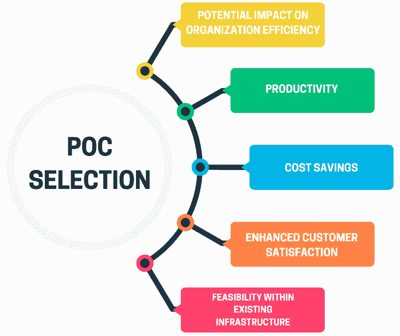
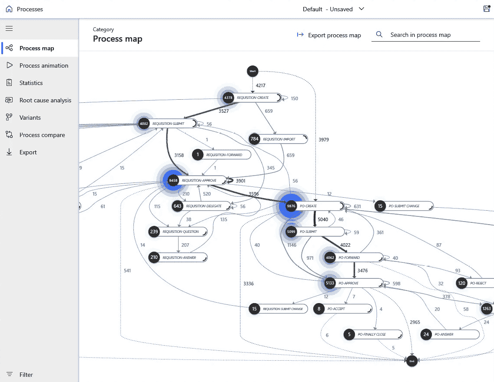
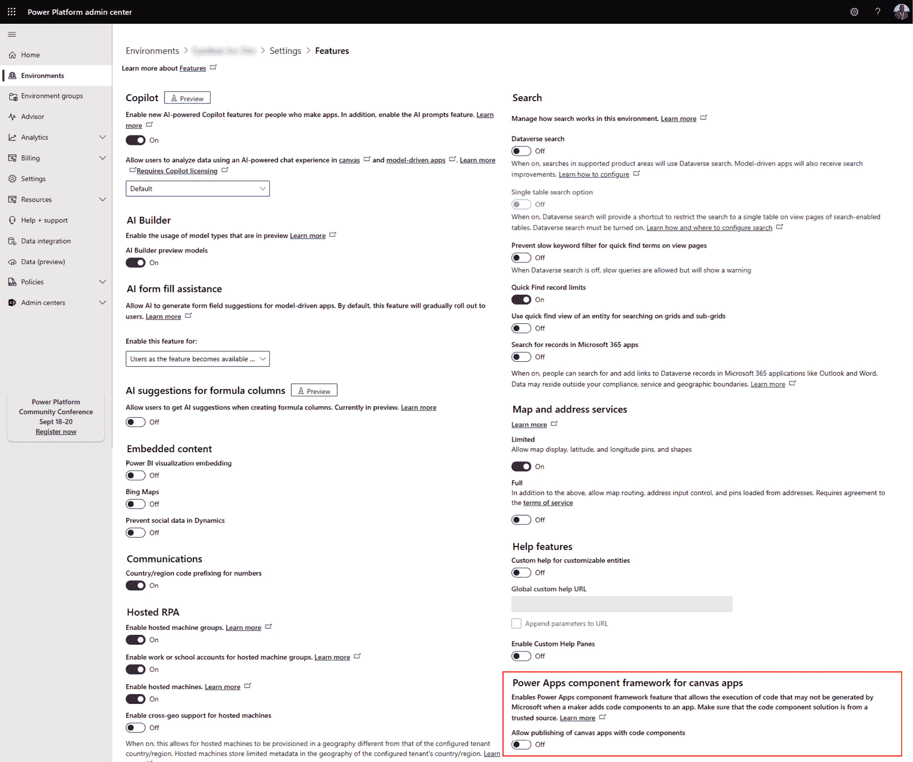
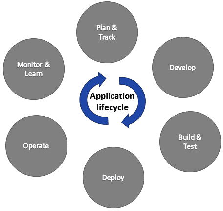
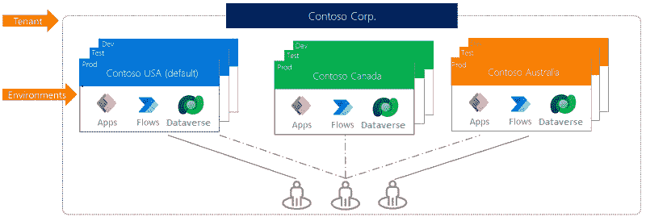
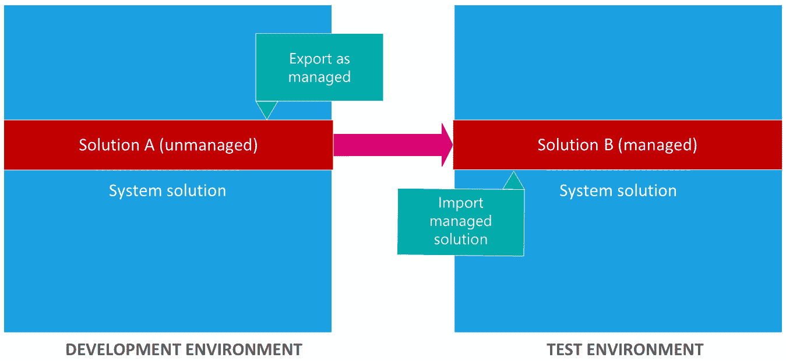
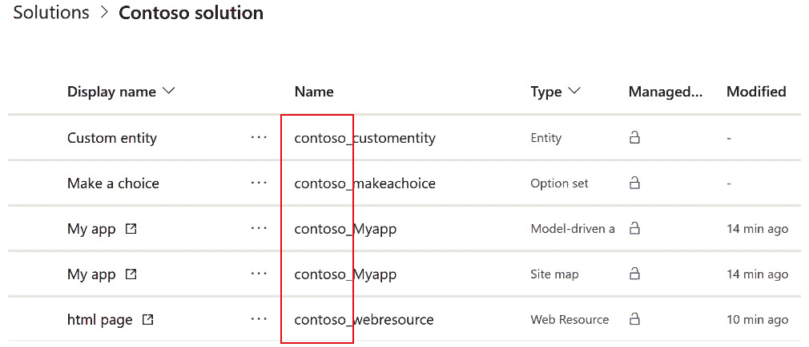
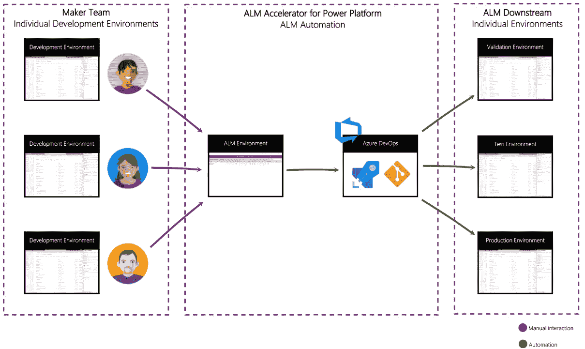
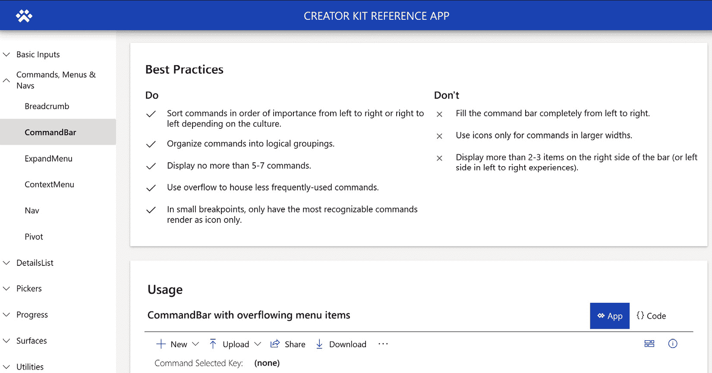
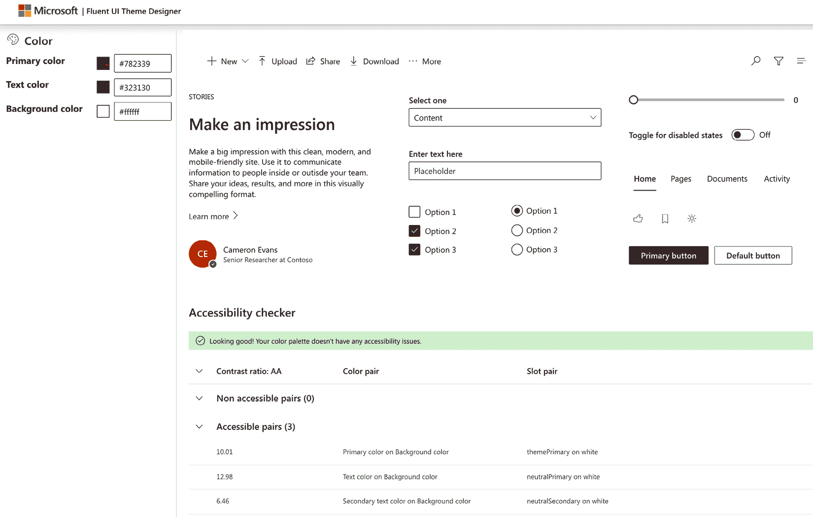

# 9

# 通过使用 Power Platform 构建的解决方案自动化流程，简化运营

在今天快速发展的商业环境中，通过自动化优化运营对于实现更高的效率和生产力至关重要。Power Platform 作为一个强大的武器库，提供了一系列工具，可以构建能够自动化各种任务和工作流程的解决方案。然而，开始这段旅程需要战略性地选择**概念验证**（**POC**）候选者，以解决特定的组织需求和痛点。本介绍部分强调了识别那些具有重复性、时间效率低下或易出错特性的流程作为利用 Power Platform 进行自动化的理想候选者的必要性。此外，为了确保无缝实施和可扩展性，对**应用程序生命周期管理**（**ALM**）原则的基础理解是必不可少的。

在本章中，您将了解以下内容：

+   确定适合 Power Platform 自动化的 POC 候选者

+   分析流程以寻找自动化机会

+   使用 ALM 和 Creator Kit 加速解决方案开发

+   使用 Creator Kit 进行动手体验

# 确定合适的 POC 候选者

在数字转型的领域，确定合适的 POC 候选者是利用 Power Platform 进行组织提升的关键第一步。Power Platform 提供了一套灵活的工具套件，旨在赋予用户自动化流程、分析数据和构建应用程序的能力，而无需广泛的编码知识。然而，在全面实施之前，组织必须战略性地选择与他们的特定需求、目标和数字化转型计划相一致的 POC 候选者。在确定和选择 POC 候选者之前，有两个主要领域需要理解，我们将在下一部分讨论。

## 理解组织痛点

在进行 POC 候选者的选择之前，组织需要对当前的运营环境进行彻底分析，并确定需要改进的领域。这意味着仔细审查他们的流程、工作流程和痛点，并评估它们在提高效率、生产力和质量方面的潜在机会。为了实现这一目标，他们需要与来自各个部门的重点利益相关者进行接触，并鼓励他们分享他们的观点和经验。通过这些协作对话，他们可以更深入地了解组织不同部门面临的挑战，例如低效率、手动工作、数据孤岛和重复任务。有了这种全面和细致的理解，他们可以有效地确定哪些流程最适合通过 Power Platform 的创新功能进行转型、优化或增强。这种积极主动的方法使组织能够确定有希望的 POC 候选者，并培养持续改进和数字创新的文化。

## POC 选择标准

几个标准指导着选择 Power Platform 实施候选者的 POC（Proof of Concept，概念验证），包括它们对组织效率、生产力、成本节约或客户满意度的影响，以及现有基础设施中的技术可行性。选择可管理的复杂性确保了快速的成功，同时避免了复杂或任务关键型项目；确保能够访问必要的数据源对于在 Power Platform 环境中进行分析和自动化至关重要。此外，从一开始就涉及最终用户和利益相关者确保了一致性、相关性和承诺，从而促进了 Power Platform 解决方案的更平滑采用和集成。让我们深入了解以下图和列表中的具体标准：

图 9.1 – POC 选择标准

+   **对组织效率的影响**：这一标准评估 POC 候选者简化流程、减少人工努力和优化组织资源利用的潜力。它涉及分析与效率相关的**关键绩效指标（KPIs**），如周期时间、吞吐量和资源利用率率。通过实施 Power Platform 解决方案，组织旨在自动化重复性任务，消除瓶颈，提高工作流程效率，最终推动生产力并降低运营成本。

+   **生产力**：生产力衡量的是从输入资源（包括时间、劳动力和材料）产生的产出。具有高生产力潜力的 POC 候选人展示了自动化手动任务、简化工作流程并使员工能够专注于增值活动的能力。通过 Power Platform 的实施，组织可以为员工提供自动化常规流程、更高效协作和基于数据做出决策的工具，从而提高各部门的生产力。

+   **成本节约**：对于寻求优化其运营的组织来说，成本节约是一个关键的考虑因素。具有潜在成本节约效益的 POC 候选人展示了降低运营成本、消除浪费和优化资源配置的能力。这一标准涉及到进行成本效益分析，以评估实施 Power Platform 解决方案相关的潜在**投资回报率**（ROI）。通过自动化手动任务、减少错误和提高运营效率，组织可以在劳动力、材料和时间等领域实现显著的成本节约。

+   **提升客户满意度**：客户满意度是组织成功和增长的关键驱动力。能够提升客户满意度的 POC 候选人展示了提高服务质量、响应速度和整体客户体验的能力。这一标准涉及到评估 Power Platform 解决方案如何使组织更好地理解客户需求、提供个性化的体验，并更有效地处理询问和问题。通过实施简化客户接触流程的解决方案，组织可以提升客户满意度、忠诚度和保留率。

+   **现有基础设施内的可行性**：现有基础设施内的可行性评估了 POC 候选人与组织当前技术堆栈、系统和架构的兼容性。这一标准涉及到评估诸如集成能力、可扩展性、安全性和合规性要求等因素。组织必须确保 Power Platform 解决方案可以无缝集成到现有系统和流程中，同时满足安全和合规标准。通过选择与组织的技术路线图和基础设施能力相一致的 POC 候选人，组织可以最小化实施风险并确保 Power Platform 解决方案的成功采用和集成。

选择合适的 POC 候选人是在利用 Power Platform 进行数字化转型过程中的第一步。这涉及到分析组织流程以确定改进的区域。识别痛点有助于突出自动化可以产生最大影响的领域。与跨部门的利益相关者进行交流可以全面了解这些挑战。让我们回顾与 POC 选择相关的关键方面。

选择 POC 候选人的关键标准包括以下内容：

+   **组织效率**：简化流程和优化资源利用

+   **生产力**：自动化任务和提高工作流程效率

+   **成本节约**：降低运营成本并提高投资回报率

+   **客户满意度**：提升服务质量和服务响应速度

+   **可行性**：确保与现有基础设施和系统的兼容性

通过战略性地选择合适的 POC 候选人，组织可以有效地利用 Power Platform 自动化流程并实现其数字化转型目标。这种积极主动的方法不仅确定了正确的候选人，还为持续改进和创新奠定了坚实的基础。

在下一节中，我们将深入探讨检查您当前工作流程和流程的方法。这将帮助您识别额外的自动化机会，进一步利用 Power Platform 优化您的运营。理解您的运营环境复杂性对于揭示隐藏的低效并最大化自动化努力潜力至关重要。

# 分析流程以寻找自动化机会

在追求效率和优化的过程中，组织通常会转向自动化作为简化运营流程的手段。然而，在投身于自动化项目之前，对现有流程进行彻底的分析是必不可少的，以确定哪些领域适合改进。这种分析包括深入了解组织工作流程的复杂性，并仔细审查每个步骤以发现低效、瓶颈和改进机会。通过利用商业分析的一般原则和 Power Platform 生态系统中的特定工具，如 Power Automate 中的流程挖掘和任务挖掘，组织可以获得宝贵的见解并确定自动化能够带来最大影响的领域。

## 通用商业分析技术

商业分析，借鉴**能力成熟度模型集成**（**CMMI**）和**商业分析知识体系**（**BABOK**），为在运营流程中确定适合自动化的领域奠定基础。将 CMMI 和 BABOK 的原则相结合，增强了分析的有效性和全面性，为组织提供了一个强大的框架来识别和解决流程低效问题：

+   CMMI 强调在实现组织目标过程中过程改进和成熟度的重要性。通过遵循 CMMI 原则，业务分析致力于评估运营过程的成熟度并识别改进的机会。CMMI 过程改进方法的核心技术，如流程图和价值流图，使组织能够全面可视化和分析工作流程。流程图涉及对流程中每一步的细致文档记录，捕捉输入、输出和依赖关系，以揭示冗余和低效。同样，价值流图专注于活动的端到端流程，揭示了浪费和非增值活动，这些活动阻碍了流程效率。

+   另一方面，BABOK 为业务分析实践提供了一个全面的指南，提供了分析和改进业务流程的技术和方法。根本原因分析是 BABOK 中的一个基本技术，在识别导致流程低效的根本因素方面发挥着关键作用。通过深入研究问题的根本原因，组织可以解决根本问题，而不仅仅是治疗症状。这种方法与 CMMI 对持续改进的强调紧密一致，使组织能够提高过程成熟度并推动运营卓越。

通过整合 CMMI 和 BABOK 的原则，组织可以对运营过程进行全面的综合分析，以有效地识别自动化领域。这种结合的方法使组织能够利用每个框架的优势，确保对过程低效有彻底的理解，并为有针对性的自动化项目铺平道路。最终，通过将业务分析实践与 CMMI 和 BABOK 的原则相一致，组织可以在运营效率、生产力和整体业务绩效方面实现显著的改进。例如，通过流程图，领导者可以直观地记录流程的每一步，识别可以通过自动化解决的问题，如低效、冗余和瓶颈。同样，价值流图有助于突出端到端流程流，使领导者能够识别适合自动化的浪费和非增值活动领域。

## 特定的 Power Platform 工具

在 Power Platform 生态系统中，Power Automate 中的流程挖掘和任务挖掘等工具提供了分析运营过程和识别自动化机会的专门功能。流程挖掘涉及分析 IT 系统的事件日志和数据，以可视化和理解组织内部流程的实际流程。通过检查时间戳、用户交互和系统活动，流程挖掘工具可以揭示流程执行中的偏差、瓶颈和变化，为改进和自动化提供见解。

任务挖掘，Power Automate 中的一个功能，专注于分析数字系统内的用户交互和行为，以识别重复性任务和低效之处。通过记录和分析用户与应用程序和系统的交互，任务挖掘工具可以识别模式、瓶颈和自动化机会。这种对用户行为的细致理解使组织能够优先考虑直接影响生产力和效率的自动化倡议。

### 探索流程挖掘和低代码开发如何携手合作

寻求更快结果的业务正在采用低代码开发，避免复杂的编码和大型开发者团队。流程挖掘确定了哪些业务流程最适合低代码方法。

#### 低代码开发简化版

低代码开发允许在不具备广泛编码知识的情况下创建软件，使开发者和非开发者都能快速使用预制组件、模板、拖放工具和自动化来构建应用程序和产品。这加速了网站、应用程序和其他数字解决方案的生产。

#### 流程挖掘的作用

流程挖掘帮助公司确定哪些流程可以快速适应低代码，指导他们在低代码或更注重代码的项目上集中精力。它确保了低代码的平稳过渡，避免了瓶颈，并通过清晰、数据驱动的计划优化工作流程。

#### 实际应用

组织可以将通用商业分析技术与 Power Platform 工具结合使用，全面分析运营流程，从流程和价值流映射开始，以可视化工作流程。流程挖掘工具分析事件日志以揭示低效之处，而 Power Automate 中的任务挖掘则提供了对用户行为和自动化机会的洞察。这种集成方法提供了对运营的整体视角，确定了自动化领域，从而简化任务、优化工作流程并推动数字化转型。

图 9.2 – 利用 Power Platform 的 ALM 加速器和 Creator Kit 加速 Power Automate 流程挖掘的解决方案开发

在现代商业的快节奏世界中，敏捷性和创新是保持领先的关键。组织不断寻求加速解决其不断变化需求的方法，同时保持高质量和可靠性标准。微软 Power Platform 应运而生——一套低代码工具，使用户能够轻松构建自定义应用程序、自动化工作流程、分析数据和创建聊天机器人。

注意

在您下载并安装 Creator Kit 之前，请确保首先在您的环境中启用代码组件，以便环境能够在其应用程序中使用代码组件。

图 9.3 – 环境级别的启用控制

这些工具和功能旨在简化并优化 Power Platform 用户的 ALM 流程，无论其技能水平或角色如何。通过利用这些工具和功能，组织可以加速其解决方案的开发，并使用 Power Platform 实现更好的成果。以下章节将帮助我们理解 ALM 的概念以及如何将其应用于我们自己的组织。

## 什么是 ALM？

ALM 是一种战略方法，涵盖了应用程序的治理、开发和维护，这对于确保运营卓越和组织目标的一致性至关重要。ALM 整合了一系列学科，包括需求管理、软件架构、开发、测试、维护、变更管理、支持、持续集成、项目管理、部署、发布管理和治理。

ALM 工具，可在 ALM 加速器和 Creator Kit 中找到，作为关键资产，促进跨职能团队（包括软件开发、质量保证和运营部门）之间标准化的框架，实现无缝沟通和协作。这些工具旨在通过自动化软件开发和交付的关键方面来简化流程、提高生产力和降低风险。治理是 ALM 的基石，涉及管理需求、资源和系统管理任务，如数据安全、用户访问、变更跟踪、审查、审计、部署控制和回滚。这确保了合规性、风险缓解和资源分配优化。

在 ALM 框架内进行应用程序开发涉及一种战略方法，以识别当前挑战，精心规划、设计、开发、并严格测试应用程序。这包括传统开发者和应用制作者的角色，促进解决方案交付中的创新和敏捷性。维护是 ALM 的另一个关键方面，涉及应用程序的无缝部署和持续管理可选和依赖技术。这确保了应用程序在其生命周期中的长期性、性能优化和可扩展性。

图 9.4 – ALM 概述

由 ALM 原则管理的应用程序生命周期遵循一个循环的软件开发过程，包括规划与跟踪、开发、构建与测试、部署、运营、监控和持续改进等阶段。通过遵循 ALM 最佳实践，组织可以在其数字化转型之旅中推动效率、提高敏捷性并实现可持续的成功。

### Power Platform 中的 ALM

在 Microsoft Power Platform 中，Dataverse 作为安全管理和存储业务应用程序所使用的数据和流程的强大仓库。与 Dataverse 的集成对于充分利用 Power Platform 的 ALM 功能和工具至关重要。

在 Microsoft Power Platform 中理解 ALM 的关键概念包括以下内容：

+   **环境**：这些是专门设计用于存储、管理和共享组织业务数据、应用程序和工作流程的区域。这些环境作为容器，根据不同的角色、安全要求或目标用户群体来隔离应用程序。每个环境都能托管单个 Microsoft Dataverse 数据库，确保在特定操作环境中进行有序和安全的数据库管理。

+   **解决方案**：这些是实施 ALM 的基础，通过导出和导入功能，使组件能够在不同环境中分发。组件代表在应用程序中使用的各种工件，从表、列、画布和模型驱动应用程序、Power Automate 流程、聊天机器人和图表到插件。

+   **自动化**：在应用程序生命周期中发挥着关键作用，增强了 ALM 过程中的生产力、可靠性、质量和效率。使用自动化工具和任务可以促进解决方案的验证、导出、打包、解包和部署，同时还能创建和重置沙盒环境。Microsoft 提供了一套工具，以实现各种功能的自动化。Microsoft Power Platform Build Tools 可用于同步解决方案元数据、生成构建工件、将解决方案部署到下游环境、配置或取消配置环境，并对解决方案执行分析检查。

+   **源代码控制**：在进行项目开发时，考虑开发团队内的协作至关重要。通过打破隔阂并鼓励开放沟通，团队可以提升软件交付效率。Git、GitHub 和 Azure DevOps 等工具和流程专门设计用于促进沟通和提升软件质量。然而，在解决方案系统中管理配置可能会给团队开发带来挑战。组织必须仔细协调多个开发者的变更，以最小化合并冲突，因为源代码控制系统在处理合并方面存在限制。建议避免多人同时修改复杂组件的情况，例如表单、流程和画布应用。

+   **持续集成和持续交付**（**CI/CD**）：这是一种旨在提高应用程序交付效率、可靠性和速度的软件开发实践。它涉及自动化开发生命周期的各个阶段，从代码集成和测试到部署和交付。CI 包括频繁地将代码更改集成到共享存储库中，通常每天多次。每次集成都会触发自动构建和测试以验证更改。通过持续集成代码，开发者可以快速识别和解决集成错误，确保软件在整个开发过程中保持功能性和稳定性。CD 通过自动化部署过程扩展了 CI 的原则，使团队能够可靠且高效地将软件更新部署到生产环境中。使用 CD，每个成功的构建都有可能部署到生产环境，从而减少了发布新功能或修复所需的时间和精力。

    在 Power Platform 开发领域，有两种主要的 DevOps 管道类型可用：Azure DevOps 管道和产品内管道。此外，GitHub Actions 作为一种灵活的选项，使团队能够直接从他们的存储库自动化构建、测试和部署任务：

    +   **Azure DevOps 管道**: 这些提供了一种强大的平台，用于编排针对 Power Platform 解决方案的 CI/CD 管道。使用 Azure DevOps 管道，开发者可以自动化构建、测试和部署过程，确保应用程序的高效和一致交付。这些管道与 Power Platform 环境无缝集成，使团队能够简化开发工作流程并加快上市时间。Azure DevOps 提供广泛的定制选项，允许团队配置管道以满足其特定的需求和偏好。

    +   **产品内管道**: 除了 Azure DevOps 管道外，Power Platform 还提供内置的或产品内管道，这些管道紧密集成在 Power Platform 环境中。这些产品内管道使用户能够直接从 Power Apps、Power Automate 和 Power BI 内部自动化部署任务。利用产品内管道，开发者可以在无需外部工具或平台的情况下自动化解决方案、流程和报告的部署。这种原生集成简化了部署过程，并通过消除在不同环境之间切换的需要，增强了开发团队的敏捷性。

    +   **GitHub Actions**：GitHub Actions 提供了一个灵活的工作流程自动化工具，支持 Power Platform 的 CI/CD 管道。通过集成 Power Platform 环境，GitHub Actions 允许开发者直接从他们的仓库自动化构建、测试和部署任务。该工具的开源性质和广泛的社区支持使其适应性强，非常适合希望简化开发并在项目间高效协作的团队。

### ALM 策略

在遵循 ALM 原则时，为应用开发和生产建立不同的环境是至关重要的。虽然仅通过分离的开发和生产环境就可以实现基本的 ALM 实践，但建议至少维护一个单独的测试环境。这个额外的测试环境有助于全面端到端验证，包括解决方案部署和应用测试。根据组织的具体需求，可能还需要额外的环境，例如**用户验收测试**（**UAT**）、**系统集成测试**（**SIT**）和培训环境。

图 9.5 – ALM 策略（Microsoft Learn）

分离的开发环境旨在隔离变更，防止未完成的变化影响开发过程。此外，不同的开发环境有助于减轻单个个体的修改对他人工作产生负面影响的情况。

考虑到每个组织的独特需求，仔细评估和确定具体的环境需求对于有效支持 ALM 实践至关重要。

在为 Power Platform 设置 ALM 策略时，常见的问题包括以下内容：

1.  **我应该使用哪些类型的环境？需要多少个？**

    +   **生产环境**：这些是为永久性组织使用而设计的。它们可以由管理员或任何拥有 Power Apps 许可证的普通用户创建和管理，需要至少 1 GB 的可用数据库容量。这些环境也会为升级的 Dataverse 数据库自动生成。它们作为组织基本运营的主要平台。

    +   **沙盒环境**：这些是非生产环境，提供复制和重置等功能。沙盒环境用于开发和测试，与生产环境分离。

    +   **开发者环境**：开发者环境是由拥有开发者计划许可证的用户创建的。这些环境是专门为所有者使用，仅用于开发目的的特殊环境。

    +   **默认环境**：这是一种特殊的生产环境。每个租户都有一个自动创建的默认环境。它们不建议用于生产功能。

    +   **试验环境**：这些环境旨在满足短期测试需求，并在一段时间后自动清除。它们的有效期为 30 天，并且每个用户仅限一个。

    +   **Microsoft Dataverse for Teams 环境**：当你在 Teams 中创建应用程序或首次从应用目录安装应用程序时，会自动为相应的团队生成一个 Dataverse for Teams 环境。

1.  **如何从源代码自动配置环境**？

    ALM 策略是否需要自动化不同类型环境的配置以满足组织的需要？如果是这样，策略必须概述必要的自动化任务以及**Microsoft Power Platform Build Tools（PPBT**）如何促进这一过程。如果 PPBT 提供所需的自动化功能，Azure DevOps 可以帮助编排环境设置。

1.  **我的环境中有哪些依赖项**？

    当将各种解决方案导入目标环境时，你实际上是在构建层，现有的解决方案作为导入解决方案的基础。避免跨解决方案依赖对于确保解决方案层顺利至关重要。应避免在同一环境中使用相同组件（尤其是表）的多个解决方案。为了减轻跨依赖风险，建议根据组件类型对解决方案进行分段。

### 解决方案概念

在 Power Platform 中，解决方案是一组用于构建、自定义和部署业务应用的组件集合。它们作为容器，用于组织和管理工作平台生态系统中各种元素，如表、列、视图、表单、工作流和其他资源。解决方案允许用户将他们的自定义、配置和应用程序打包并分发到不同的环境中，从而促进协作、版本控制和部署管理。它们在 ALM 中发挥着关键作用，通过提供一种结构化的方法来构建和管理 Power Platform 环境中的应用程序。

#### 未管理解决方案和管理解决方案

解决方案对于在不同环境中组织、运输和管理应用程序组件至关重要。有两种类型的解决方案：管理型和非管理型。

图 9.6 – 解决方案类型

+   **未托管解决方案**：这些解决方案在开发阶段创建。这些解决方案仅用于开发环境，在修改应用程序时使用。未托管解决方案可以以未托管或托管状态导出。建议导出解决方案的未托管版本，然后将其存储在源代码控制系统中。未托管解决方案应被视为 Microsoft Power Platform 资产的主要来源。当删除未托管解决方案时，仅删除包含其中的任何自定义项的解决方案容器；所有未托管自定义项都持续存在并保留与默认解决方案的关联。

+   **托管解决方案**：这些解决方案部署到除特定解决方案的开发环境之外的其他环境。这包括测试、UAT、SIT 和生产环境。托管解决方案可以在环境中独立于其他托管解决方案进行维护。在 ALM 的最佳实践中，托管解决方案应通过将未托管解决方案导出为托管解决方案并作为构建工件来生成。

注意

当你在开发环境中进行自定义时，你是在未托管层中操作。随后，当从未托管层导出自定义解决方案以将其分发到另一个环境时，该解决方案被导入该环境的托管层。

#### 解决方案生命周期

解决方案提供支持各种应用程序生命周期过程中关键操作的基本功能：

+   **创建**：这允许用户创建和导出未托管解决方案，为定制和开发提供初始框架。

+   **更新**：这有助于创建对托管解决方案的更新，然后部署到父托管解决方案。需要注意的是，组件不能通过更新进行删除。

+   **升级**：这使可以将解决方案作为升级导入现有托管解决方案。此过程涉及删除未使用的组件、实现升级逻辑并将所有补丁汇总到解决方案的新版本中。在升级过程中，可能不再包含在升级版本中的组件可能会被删除。用户可以选择立即执行升级或在完成前将其安排为其他操作。

+   **补丁**：这允许用户创建仅包含父托管解决方案更改的补丁，例如添加或编辑组件和资产。补丁通常用于进行类似热修复的小更新。当导入补丁时，补丁会叠加在父解决方案之上，并且不能通过补丁删除组件。

#### 解决方案发布者

解决方案中的每个应用程序和其他组件，如表和自定义项，都与解决方案发布者相关联。建议创建自己的发布者而不是使用默认的发布者。在最初创建解决方案时指定发布者。

解决方案发布者，作为组件所有者，管理其他解决方案发布者允许的更改。虽然同一发布者内部的拥有权转让是可行的，但跨发布者则不可行。一旦分配给管理解决方案，更改发布者就变得不切实际，强调了需要一个单一发布者以进行潜在的分层调整。选择一个有意义的解决方案发布者名称以提高清晰度。

发布者还包括一个前缀以防止命名冲突，允许不同发布者的解决方案在环境中顺利共存。例如，Contoso 的解决方案使用前缀 `contoso`。

图 9.7 – 解决方案发布者前缀

注意事项

当更改解决方案发布者前缀时，请确保在创建任何新的应用或元数据项之前进行更改，因为一旦元数据项被创建，其名称就不能更改。请参阅[`learn.microsoft.com/en-us/power-platform/alm/solution-concepts-alm`](https://learn.microsoft.com/en-us/power-platform/alm/solution-concepts-alm)。

#### 解决方案依赖项

由于管理解决方案的层次结构，某些管理解决方案可能依赖于其他管理解决方案的组件。一些解决方案发布者利用这一点来创建模块化解决方案。在这种情况下，您可能需要在安装进一步自定义其组件的二级解决方案之前安装一个基础“基础”管理解决方案。二级解决方案依赖于第一个解决方案的组件。

系统积极跟踪这些解决方案间的依赖关系。尝试安装需要缺失的基础解决方案的解决方案将导致安装失败，并伴随一条提示先安装所需解决方案的消息。同样，由于这些依赖关系，当依赖的解决方案安装时，禁止卸载基础解决方案。要卸载基础解决方案，您必须首先删除任何依赖的解决方案。

### Power Platform 的 ALM 加速器

Power Platform 的 ALM 加速器作为一个画布应用，提供了一个简化的界面，用于访问 Azure Pipelines 和 Git 源代码控制，从而促进应用生命周期管理（ALM）。它代表了 ALM 方法的参考实现，利用 Power Platform 的固有功能来有效地启动 ALM 流程。通过结合为制作者和管理员量身定制的低代码画布应用、Azure Pipelines YAML 和 PowerShell 模板，ALM 加速器简化了 ALM 的采用过程。

通过 Power Platform 的 ALM 加速器，制作者能够进行源代码控制、维护版本历史记录以及在 Power Platform 环境中部署解决方案。使用 ALM 加速器要求所有 Power Platform 组件（如应用、流程和自定义）都封装在解决方案中。

虽然 ALM 加速器不需要高级 ALM 专业知识，但用户应具备在 Power Platform 生态系统内使用解决方案的基本理解，如本书中所述。

#### 谁应该使用 ALM 加速器？

ALM 加速器面向 Power Platform 制作人和制作人团队：

+   对于新接触 ALM 概念但希望保留他们的工作、跟踪更改并与其他用户协作的制作人来说。

+   精通高级 Git 概念，如拉取请求、分支和合并，并希望利用熟悉的 Git 工作流程进行源代码控制和部署自动化的制作人

注意

配置和实施 ALM 加速器需要管理员级别的 Power Platform 环境、解决方案和 Azure Pipelines 的专业知识。此外，熟悉 Microsoft Power Platform 和 Dataverse 管理也是必不可少的。请参阅[`learn.microsoft.com/en-us/power-platform/guidance/alm-accelerator/overview`](https://learn.microsoft.com/en-us/power-platform/guidance/alm-accelerator/overview)。

下图展示了 ALM 加速器如何促进制作团队与各种环境之间的协作，包括开发、验证、测试和生产。

图 9.8 – Power Platform 的 ALM 加速器

Power Platform 的 ALM 加速器通过自动化和增强版本控制、CI 和部署等流程来简化 ALM。当与提供预构建组件和模板的创建工具包结合使用时，ALM 加速器使开发者能够更快、更可靠地构建高质量的应用程序。在下一节中，我们将探讨创建工具包中可用的组件。

## 创建工具包

创建工具包是制作 Power Apps 体验的宝贵资源，这些体验针对 Web 和移动平台，利用了一系列在当代软件设计中必不可少的便捷组件。在这个工具包中，有一个丰富的组件库，包括众多广泛使用的 Power Apps 组件框架控件，这些控件经过精心挑选，旨在简化开发流程。此外，开发者还可以从精心设计的模板和辅助工具中选择，这些工具旨在提高生产力和效率。

创建工具包提供的服务中，重要的是采用了 Fluent UI 框架，确保了控件和组件的无缝集成。这个框架在促进创建具有一致性、美观和功能性的用户体验方面发挥着关键作用，这些体验在各种设备和平台上保持一致。通过利用 Fluent UI 框架的能力，开发者可以轻松地制作出吸引人、直观和有效的界面，这些界面与现代设计原则和用户期望无缝对接。

### 实施创建工具包

在将 Creator Kit 提供的组件集成到您的应用之前，建议您使用参考应用熟悉这些组件的行为和实现模式。通过参考应用，您将深入了解组件使用的细微差别，并学习有效的方法将它们集成到您的应用中。

Creator Kit 包含一套全面的资产，精心组织并分布在三个不同的解决方案中。这些解决方案包含各种组件、控件、模板和实用工具，旨在提高开发者的生产力和促进引人入胜的用户体验的创建。套件包括以下解决方案：

| **解决方案名称** | **内容** |
| --- | --- |
| `CreatorKitCore` | 24 个 Power Apps 组件框架和画布组件 |
| `CreatorKitReference` (模型驱动应用) | 一个允许用户交互式学习的参考应用（模型驱动，带有自定义页面）**画布页面模板** |
| `CreatorKitReference` (画布) | **交互式学习应用**：一个允许用户无需独立 Power Apps 许可证即可交互式学习的参考应用（画布）**画布模板应用**：一个预构建的模板应用，用于简化新应用的创建**主题编辑器**：一个生成 Theme JSON 的工具，使组件的样式化既简单又一致 |

表 9.1 – Creator Kit 组件详细信息

### 参考应用

一旦安装了 Creator Kit，您将能够访问一个名为 **参考应用** 的示例应用。利用此应用深入了解每个组件的功能，获取实现最佳用户体验的推荐最佳实践，亲自与组件交互，并深入研究驱动它们行为的实现代码。我们强烈建议在将这些组件集成到您的实际应用之前，先在参考应用中探索这些组件。

观察每个组件的行为和渲染数据，并访问 **代码** 选项卡来检查负责其功能的底层 Power Fx 公式。此外，您还可以从应用内提供的内联指导中受益，这些指导提供了与每个控件相关的最佳实践的有价值见解。

图 9.9 – 参考应用

### 模板

这些模板旨在帮助您快速启动使用 Fluent UI 创建响应式应用。它们预装了自定义组件，并链接到 Theme JSON 变量，简化了开发启动过程。这些模板对于简化 Canvas 应用和自定义页面的开发至关重要。

### Fluent 主题设计器应用

主题化是一种机制，可以通过它将一致的外观和感觉应用于页面上的所有组件。目前，这意味着在整个页面上共享一套颜色方案。Fluent 主题设计器应用程序为 Power Platform 制作者、用户和管理员带来了重大改进：

+   **制作者**现在可以凭借一致性的 Fluent UI 设计将精力集中在构建应用程序的核心功能上。这种设计一致性简化了创建自定义页面的过程，使它们看起来更加一致，类似于模型驱动应用程序。借助套件的帮助，即使没有高级前端技能或无法访问设计资源的用户也可以轻松制作出具有现代设计的精美应用程序。

+   **用户**将受益于与一组直观且熟悉的组件进行交互，因为这些组件与所有现代 Microsoft 应用程序中找到的组件一致。值得注意的是，这些组件提供了性能提升，有助于在应用程序使用过程中提供更流畅的用户体验，从而提高生产力。

+   负责确保其组织 UI 一致性的**管理员**会发现 Fluent UI 组件中固有的现代主题架构很有价值。这些组件由 Microsoft 专门的工程团队开发和支持，为维护 UI 一致性提供了一种可靠的解决方案。因此，公司可以放心地将具有 Creator Kit 组件的应用程序部署到生产环境中。

图 9.10 – Fluent 主题设计器应用

Creator Kit 中的 Fluent 主题设计器应用程序使开发者能够轻松自定义并应用一致的主题到 Power Platform 应用程序中。它简化了调整颜色、字体和其他视觉元素的过程，确保了统一且专业的外观，与组织品牌保持一致。

### 使用 Power Platform 进行 POC 选择和开发的实际示例

一家在线零售商希望使用 Power Platform 来改善其客户服务运营，该运营面临一些挑战，例如缺乏统一的客户视图、高人工成本、漫长的等待时间、服务质量不一致以及客户满意度低。零售商确定了四个潜在的 POC 候选人：

+   用于访问和更新客户数据以及订单详情的单个界面的 Power Apps 解决方案

+   用于自动化客户服务工作流和任务的 Power Automate 解决方案

+   用于分析和可视化客户服务数据和指标的 Power BI 解决方案

+   为创建用于常见客户问题和自助服务的聊天机器人而设计的定制 Copilots（之前称为 Power Virtual Agents）解决方案

零售商根据影响和可行性标准评估每个 POC 候选人。以下表格显示了评估结果：

| **POC** **候选人** | **对效率的影响** | **对生产率的影响** | **对成本节约的影响** | **对客户满意度的影响** | **在基础设施中的可行性** |
| --- | --- | --- | --- | --- | --- |
| Power Apps | 高：简化流程并减少人工努力 | 高：提高输出和服务质量 | 中：降低运营成本和错误 | 高：提高服务的响应性和准确性 | 高：易于与现有系统和数据源集成 |
| Power Automate | 高：消除瓶颈并优化资源利用 | 高：使代理能够专注于增值活动 | 高：在劳动力、时间和材料方面实现显著的成本节约 | 中：提高服务速度和一致性 | 高：易于与现有系统和工作流程集成 |
| Power BI | 中：提供效率改进的见解和建议 | 中：实现数据驱动的决策和绩效管理 | 低：投资和维护成本最低 | 低：通过提高服务质量间接影响客户满意度 | 中：与现有数据源集成，但需要数据准备和转换 |
| Custom Copilot | 低：需要人工干预解决复杂问题 | 低：减少简单查询的工作量但增加升级问题的复杂性 | 中：减少基本查询的劳动力成本，但增加聊天机器人的开发和维护成本 | 中：提高自助选项和可用性，但可能减少个性化和同理心 | 低：需要与现有系统和数据源集成，以及考虑安全和合规性 |

表 9.2 – POC 候选人评估速查表

根据评估结果，组织决定将 Power Apps 和 Power Automate 解决方案作为最有希望的 POC 候选人进行优先考虑，因为它们对组织效率、生产率、成本节约和客户满意度具有最高潜力的影响，同时在现有基础设施中具有高度的可行性。然后，组织继续规划和执行这两个解决方案的 POC，在整个过程中涉及最终用户和利益相关者，以确保一致性、相关性和承诺。

# 摘要

总结来说，本章探讨了使用 Power Platform 简化操作和加速解决方案开发的必要策略。我们首先讨论了确定合适的 POC 候选人的重要性，强调选择与组织目标一致并展示潜在实际效益的项目的必要性。接下来，我们深入分析了分析运营流程以确定自动化成熟区域的过程，强调了通过有针对性的自动化努力优化效率和生产力的重要性。

您可以利用从 POC 选择和运营流程分析中获得的认识，有效地利用创作者工具包，包括参考应用和 Fluent 主题设计师应用，来创建 POCs 和 MVPs。

+   **POC 选择**：利用 POC 选择期间建立的准则来识别运营流程中可以受益于自动化或增强的特定区域。关注具有高改进潜力或与战略目标一致的流程。

+   **运营流程分析**：对已识别的流程进行全面分析，以了解其复杂性、痛点以及潜在的优化区域。利用这次分析来优先考虑哪些流程最适合 POC 开发和 MVP 创建。

+   **利用创作者工具包功能**：利用创作者工具包内的参考应用来探索和实验各种组件和设计模式。这种动手经验将使用户能够可视化这些组件如何集成到他们的应用程序中，以解决特定的流程挑战。

+   **Fluent 主题设计师应用**：利用 Fluent 主题设计师应用为 POCs 和 MVPs 创建统一且视觉上吸引人的主题。通过自定义颜色方案和视觉元素，用户可以增强用户体验并确保其应用程序的一致性。

+   **创建 POCs 和 MVPs**：通过 POC 选择和运营流程分析的见解，利用创作者工具包的资源来开发解决已识别流程挑战或自动化机会的 POCs 和 MVPs。根据反馈和测试结果对这些原型进行迭代，以完善和验证其有效性。

通过整合 POC 选择、运营流程分析和创作者工具包功能的利用，您可以有效地利用 Power Platform 来创建有影响力的 POCs 和 MVPs，从而推动组织内的创新和运营卓越。

在下一章中，您将学习如何建立一个稳固的安全框架来保护您的数据和应用程序。您将发现如何在整个组织中推广以安全为首要考虑的心态。此外，您将了解持续监控和风险管理对于保护您的运营的重要性，并探索在保持安全和合规的同时不断改进和创新的方法。

# 加入我们的 Discord 社区

加入我们的社区 Discord 空间，与作者和其他读者进行讨论：

[`packt.link/powerusers`](https://packt.link/powerusers)

