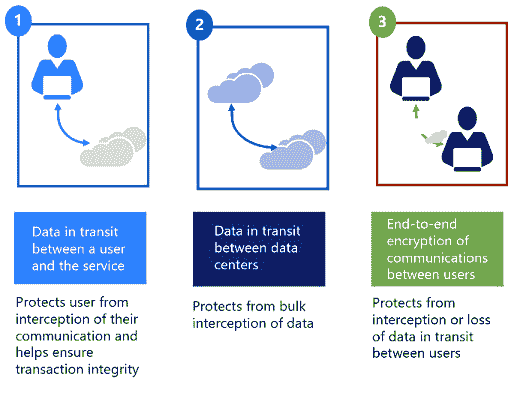
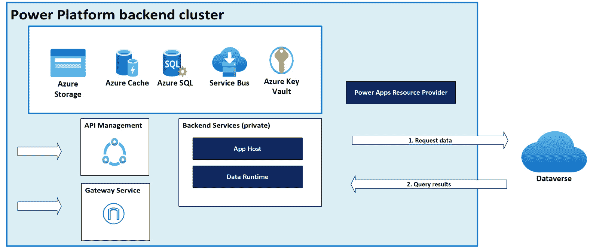
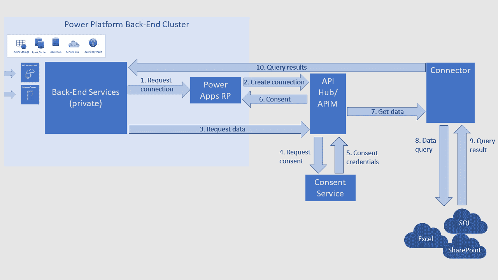

# 12

# 指导合规：在 Power Platform 部署中满足行业法规

确保所有规模的组织遵守行业法规至关重要。随着数据泄露和隐私问题日益普遍，遵守监管要求不仅保护敏感信息，还有助于维护客户信任并避免巨额罚款。**Power Platform**凭借其强大的开发和自动化业务解决方案的能力，是满足这些合规要求组织的强大工具。然而，有效地利用这个平台需要深入了解监管环境以及需要实施的特定合规措施。

在本章中，我们将向您展示如何确保您的 Power Platform 解决方案遵循关键行业法规。我们将首先解释合规为何重要，以及如果您不遵守合规会发生什么。然后，我们将探讨具体法规，例如**通用数据保护条例**（**GDPR**）、**健康保险可携带性和问责法案**（**HIPAA**）和**加利福尼亚消费者隐私法案**（**CCPA**），并告诉您它们对您的组织意味着什么。以下是我们将进一步探讨的主题：

+   安全合规与法规

+   在 Power Platform 部署中建立地理位置和环境

+   微软信任中心——您的合规与透明度资源

+   在 Power Platform 部署中确保数据传输和 API 访问的安全性

## 安全合规与法规

在本节中，我们将探讨全球信息安全法规与 Power Platform 之间错综复杂的关系。我们提供了对关键监管框架，如 GDPR、HIPAA 和 CCPA 的全面概述，并检查这些框架如何影响 Power Platform 上解决方案的开发和部署。通过详细说明具体的合规要求和最佳实践，我们展示了如何使您的 Power Platform 项目与这些法规保持一致，确保您的组织的数据处理流程既安全又合法。在商业界导航日益复杂的监管环境中，了解这一背景至关重要，因为适应和遵守严格的网络安全标准对于保护敏感信息和维护运营完整性至关重要。此外，我们还将检查主要全球地理区域内的 IT 合规与法规，并讨论微软提供支持和指南以应对这些问题的策略。

### 欧洲

在欧洲，例如 GDPR 等法规对数据处理和保护提出了严格的要求，影响了企业在 Power Platform 上开发和管理的应用程序。遵守 GDPR 至关重要，尤其是在用户同意、数据最小化和跨境数据传输方面：

+   **通用数据保护条例（GDPR）**：GDPR 在欧盟范围内设定了数据保护的高标准。欧洲的 Power Platform 用户必须确保个人数据合法、透明且具有特定目的的处理。解决方案必须包括数据匿名化、加密和安全的传输功能，以符合 GDPR。

+   **电子隐私指令**：也称为“Cookie 法”，电子隐私指令通过关注电子通信来补充 GDPR。使用 Cookie 或类似技术的 Power Platform 解决方案必须获得用户同意并确保通信的保密性。

### 北美

在北美，几个关键的信息安全法规规定了组织如何处理和保护数据。这些法规影响了 Power Platform 内商业应用程序的开发和使用，需要特定的合规措施以确保数据安全和隐私：

+   **通用数据保护条例（GDPR）**：尽管是欧盟法规，但 GDPR 影响了处理欧盟公民数据的许多北美公司。GDPR 强制执行严格的数据保护措施，包括数据最小化、数据处理同意和被遗忘的权利。Power Platform 解决方案必须纳入这些原则，确保数据加密、安全数据存储和强大的访问控制。

+   **健康保险携带和责任法案（HIPAA）**：HIPAA 对于处理美国（US）**受保护健康信息（PHI）**的组织至关重要。在医疗保健中使用的 Power Platform 解决方案必须确保符合 HIPAA 对数据保密性、完整性和可用性的要求。这包括实施加密、访问控制和审计日志以跟踪数据访问和修改。

+   **CCPA**：加州消费者隐私法案（CCPA）增强了加州居民的隐私权和消费者保护。使用 Power Platform 的组织必须提供关于数据收集实践的透明度，允许消费者选择退出数据销售，并确保个人信息的安全处理。Power Platform 解决方案遵守 CCPA 的要求涉及严格的数据保护政策和用户权利管理。

+   **萨班斯-奥克斯利法案（SOX）**：SOX 影响了美国上市公司的财务数据，要求严格的控制以防止欺诈。管理财务数据的 Power Platform 解决方案必须包括审计跟踪、数据完整性检查和访问控制，以符合 SOX 要求。

### 亚洲-太平洋地区

在亚太地区，澳大利亚和新加坡等国家实施了它们自己的数据保护法律，例如澳大利亚隐私法案和新加坡的**个人数据保护法案（PDPA）**。这些法规要求组织在使用 Power Platform 等平台时实施强大的安全措施，以确保个人数据得到安全处理并符合当地法律：

+   **PDPA – 新加坡**：PDPA 规范了新加坡的个人数据的收集、使用和披露。Power Platform 解决方案必须遵守 PDPA，通过实施数据保护政策、确保数据准确性和为数据处理获取同意来符合 PDPA。

+   **1988 年隐私法 – 澳大利亚**：该法案规范了澳大利亚的个人信息的处理。Power Platform 用户必须通过保护数据、在请求时提供个人信息以及实施数据更正和违规通知政策来遵守此法案。

+   **中国的网络安全法**：该法律对个人信息和重要数据的数据本地化和安全措施提出了严格的要求。Power Platform 在中国的解决方案必须确保数据本地存储并实施强大的网络安全措施。

### 中东

阿联酋、沙特阿拉伯和其他中东国家已经引入了数据保护法规，例如阿联酋数据保护法以及沙特阿拉伯的**个人数据保护法**（**PDPL**）。这些法规要求特定的安全实践和合规措施来保护数据隐私，影响了该地区在 Power Platform 上开发和使用商业应用的方式：

+   **迪拜国际金融中心（DIFC）数据保护法 – 阿联酋**：该法律规范了 DIFC 内的数据保护。在 DIFC 使用的 Power Platform 解决方案必须确保数据处理透明度、获取用户同意并实施数据安全措施。

+   **PDPL – 沙特阿拉伯**：自 2022 年起生效，该法律规范了沙特阿拉伯的个人数据处理。Power Platform 用户必须通过保护个人数据、确保数据准确性和为个人提供其数据访问来遵守此法律。

在这些地区，遵守当地法规对于确保 Power Platform 的使用与全球数据安全和隐私标准保持一致至关重要。

## 在 Power Platform 部署中建立地理位置和环境

组织必须应对复杂的数据隐私和监管要求。在 Power Platform 部署中建立地理位置和环境对于确保不同地区遵守这些法规至关重要。本节探讨了如何在 Power Platform 中战略性地设置地理环境以满足合规和监管标准，重点关注世界各地的关键地区。

### 地理位置在合规中的重要性

数据存储和处理的地理位置可以显著影响对当地和国际法规的遵守。各种法规，如欧洲的 GDPR 和加州的 CCPA，对数据存储和处理的如何以及在哪里提出了严格的要求。通过在特定地理位置战略部署环境，组织可以更好地管理数据主权、隐私和安全。

### Power Platform 环境策略

+   **区域数据中心**：Microsoft 的 Power Platform 在全球多个地区提供数据中心，允许组织选择其数据存储和处理的地点。这种能力对于遵守数据居住要求至关重要，例如 GDPR 规定的，除非满足某些条件，否则欧盟公民的个人数据必须在欧盟内处理。

+   **多区域部署**：组织可以在多个区域部署环境，以确保遵守当地法律和法规。这种方法有助于解决数据居住要求，并提供冗余和灾难恢复能力。例如，跨国公司可以在欧洲、北美和亚洲设置环境，以服务于其全球运营，同时确保每个区域的数据合规性。

+   **环境类型**：Power Platform 允许创建各种环境类型，如生产、沙盒和试用。每种环境类型都可以部署在特定区域，根据合规需求隔离数据和应用程序。生产环境可以位于具有严格数据保护法律的区域，而用于开发和测试的沙盒环境可以放置在具有更灵活法规的区域。

### 在 Power Platform 中实施合规性

为了确保遵守各种区域法规，组织应考虑以下最佳实践：

+   **数据居住和主权**：选择适当的地理位置部署 Power Platform 环境，以符合数据居住要求。使用 Microsoft 的区域数据中心确保数据保持在指定的区域内。

+   **数据保护和隐私**：实施全面的数据保护措施，包括加密、访问控制和**数据丢失预防**（DLP）策略。确保 Power Platform 解决方案配置为支持用户同意管理和数据主体权利。

+   **定期审计和评估**：定期进行合规性审计和评估，以确保 Power Platform 环境遵守相关法规。使用 Microsoft 的合规性工具和资源来监控和报告合规状态。

+   **文档和透明度**：维护详尽的数据保护政策、程序和合规性措施的文档。确保与利益相关者就数据处理实践和合规性努力保持透明度。

### 微软政府云和 Power Platform – 确保全球信息安全合规

微软政府云提供了一种强大且安全的云环境，旨在满足全球政府机构严格的合规性和安全要求。将 Power Platform 与微软政府云集成，为组织提供了构建应用程序、自动化工作流程和从数据中获取洞察力的强大工具，同时确保遵守各种信息安全合规政策。本节探讨了微软政府云的功能、其与 Power Platform 的关系以及如何满足不同地区的合规需求。

#### 微软政府云概述

微软政府云针对政府实体的特定监管和安全要求进行了定制。它包括 Azure Government、Microsoft 365 Government 和 Dynamics 365 Government，每个都提供了一套全面的服务，旨在支持公共部门组织的独特需求。微软政府云的关键特性包括以下内容：

+   **增强的安全和合规性**：内置的安全控制和合规认证，以满足政府标准

+   **数据驻留和主权**：确保数据在特定的地理边界内存储和处理，以符合当地法规

+   **隔离和专用基础设施**：从商业云实例中物理和逻辑隔离，以提供更高层次的安全和合规性

#### Power Platform 在微软政府云上

Power Platform，包括 Power BI、Power Apps、Power Automate、Power Pages 和 Copilot Studio，可以在微软政府云上部署，以利用其安全和合规的环境。这种集成提供了以下好处：

+   **符合政府法规**：通过在微软政府云上部署 Power Platform 解决方案，组织可以确保其应用程序和工作流程符合政府机构强加的严格监管要求。这对于处理敏感的政府数据和个人信息尤为重要。

+   **增强的安全措施**：Power Platform 在微软政府云上继承了云环境的强大安全功能，包括高级威胁保护、数据加密和身份管理。这些措施有助于保护数据并维护政府信息的完整性和机密性。

+   **与政府服务的无缝集成**：Power Platform 能够与其他微软政府云服务（如 Azure Government 和 Dynamics 365 Government）集成，实现不同政府系统之间的无缝数据共享和协作，提高运营效率和决策能力。

### **区域合规覆盖**

微软政府云旨在满足世界各地不同地区的合规需求。以下各节包括一些示例，说明它如何与不同国家的特定信息安全合规政策相一致。

#### 美国（FedRAMP、CJIS 和 DoD SRG）

+   **联邦风险和授权管理计划（FedRAMP）**：微软政府云符合 FedRAMP，该计划为联邦机构使用的云服务设定了严格的安全标准。这包括保持高水平的数据保护和持续监控。

+   **刑事司法信息服务（CJIS）**：对于执法机构，遵守 CJIS 安全策略至关重要。微软政府云满足 CJIS 要求，确保对刑事司法信息的妥善处理。

+   **国防部（DoD）安全要求指南（SRG）**：DoD SRG 对处理 DoD 数据的安全控制提出了严格的要求。微软政府云达到了支持 DoD 任务的必要合规水平。

#### 英国（G-Cloud）

+   **G-Cloud**：英国政府的 G-Cloud 框架为公共部门组织提供了一个合规的云服务市场。微软政府云是框架的一部分，确保它符合英国政府的安全和合规标准，如 GDPR 和其他当地数据保护法律。

#### 阿联酋（UAE）

+   **UAE 迪拜电子安全中心（DESC）**：DESC 为迪拜的政府实体制定了安全要求。微软政府云符合 DESC 规定，为阿联酋处理和存储数据提供了一个安全和合规的环境。

#### 欧洲（GDPR）

+   **GDPR**：GDPR 对处理欧盟公民数据的组织施加了严格的数据保护要求。微软政府云通过在欧盟内提供数据居住选项、强大的数据保护措施和对数据主体权利的支持，确保符合 GDPR。

#### 澳大利亚（IRAP）

+   **信息安全注册评估员计划（IRAP）**：IRAP 为澳大利亚政府机构设定了安全标准。微软政府云满足 IRAP 要求，为澳大利亚存储和处理政府数据提供了一个安全的环境。

### 在微软政府云上实施 Power Platform

为了利用微软政府云上 Power Platform 的优势，组织应考虑以下步骤：

1.  **评估合规要求**：了解您所在地区和行业的具体合规要求。这包括当地数据保护法律、安全标准和政府法规。

1.  **选择正确的环境**：选择与您的合规需求相一致的正确微软政府云环境（例如，Azure Government、Microsoft 365 Government）。确保该环境提供必要的认证和合规保证。

1.  **配置安全控制**：在 Power Platform 中实施安全控制和配置，以增强数据保护。这包括设置加密、访问控制和针对您组织需求的定制合规策略。

1.  **定期合规审计**：定期进行审计和评估，以确保持续符合相关法规。使用微软的合规工具和资源来监控和报告合规状态。

1.  **培训和意识提升**：教育员工和利益相关者关于合规要求和使用 Power Platform 的最佳实践，以确保安全和合规。这包括数据处理、安全协议和监管义务的培训。

#### 微软合规服务概述

以下是针对各种行业和全球地区的合规服务摘要：

| **类别** | **合规标准** |
| --- | --- |
| 全球 | CIS 基准，CSA-STAR 认证，CSA-STAR 认证，CSA-STAR 自我评估，CyberGRX，ISO 20000-1:2011，ISO 22301，ISO 27001，ISO 27017，ISO 27018，ISO 27701，ISO 9001，SOC 1，SOC 2，SOC 3，WCAG |
| 美国政府 | CJIS，CNSSI 1253，DFARS，DoD IL2，DoD IL5，DoE 10 CFR Part 810，EAR，FedRAMP，FIPS 140-2，IRS 1075，ITAR，NIST 800-171，NIST CSF，第 508 条 VPATS |
| 行业 | 23 NYCRR Part 500，AFM + DNB (荷兰), APRA (澳大利亚), AMF 和 ACPR (法国), CDSA，DPP (英国), EBA (欧盟), FACT (英国), FCA + PRA (英国), FDA CFR 第 21 卷第十一部分，FERPA，FFIEC (美国), FINMA (瑞士), FISC (日本), FSA (丹麦), GLBA (美国), GSMA，GxP，HDS (法国), HIPAA / HITECH，HITRUST，KNF (波兰), 了解第三方 (KY3P)，MARS-E (美国)，MAS + ABS (新加坡)，MPA，NBB + FSMA (比利时)，NEN-7510 (荷兰)，NERC，OSFI (加拿大)，PCI-3DS，PCI-DSS，RBI + IRDAI (印度)，SEC 17a-4，SEC 18a-6，FINRA 4511，& CFTC 1.31，SEC 规则 SCI (美国)，共享评估，SOX，TISAX |
| 区域 | ABS OSPAR (新加坡), BIR 2012 (荷兰), C5 (德国), 加拿大隐私法, CCCS 中等 (加拿大), CCPA (美国-加利福尼亚), Cyber Essentials Plus (英国), IRAP (澳大利亚), DJCP (中国), EN 301 549 (欧盟), ENISA IAF (欧盟), ENS (西班牙), 欧盟模型条款, GB 18030 (中国), GDPR (欧盟), G-Cloud (英国), IDW PS 951 (德国), ISMAP (日本), ISMS (韩国), IT-Grundschutz 工作簿 (德国), LOPD (西班牙), MeitY (印度), MTCS (新加坡), My Number (日本), 国家信息安全 (卡塔尔), NZ CC 框架 (新西兰), PASF (英国), PDPA (阿根廷), 个人数据本地化 (俄罗斯), TRUCS (中国), VCDPA (美国-弗吉尼亚) |

表 12.1 – 每个类别的合规标准

这种全面的合规覆盖使 Power Platform 成为在复杂监管环境中导航的组织的一个多用途且安全工具。有关更多详细信息，请参阅[`learn.microsoft.com/en-us/compliance/regulatory/offering-home`](https://learn.microsoft.com/en-us/compliance/regulatory/offering-home)。

## 微软信任中心 – 您的合规性和透明度资源

**微软信任中心**是寻求确保合规性和维护 Power Platform 使用透明度的组织的宝贵资源。随着监管要求的发展和变得更加严格，信任中心提供了必要的工具和信息，以帮助企业在这些复杂性中导航。

### 微软信任中心概述

微软信任中心旨在成为有关微软安全、隐私和合规性实践的全面信息中心。它提供了涵盖广泛全球标准和法规的详细文档、合规性指南和认证信息。这个集中资源对于旨在满足特定行业合规性要求并利用微软云服务的企业来说是无价的。

### 关键功能和产品

+   **合规性文档**：信任中心提供了关于微软产品和服务如何符合各种监管标准的广泛文档，例如 GDPR、HIPAA 和 ISO/IEC 27001。这包括详细的白皮书、审计报告和常见问题解答，帮助组织了解微软为确保合规性所采取的措施。Power Platform 的合规性和数据隐私管理指南进一步详细说明了平台如何支持跨各种司法管辖区内的合规性工作。

+   **认证和声明**：组织可以访问微软认证和声明的最新信息。这包括独立的第三方审计报告，这些报告验证微软遵守国际标准和监管要求。这些认证可用于支持组织的合规性声明，并向审计人员和利益相关者证明尽职调查。

+   **隐私和数据保护**：信任中心概述了微软对隐私和数据保护的承诺。它提供了关于微软如何处理数据的见解，包括数据居住地、数据传输机制和数据处理协议。这种透明度有助于确保组织的数据按照监管预期得到管理。对于 Power Platform 来说，具体措施包括数据加密、访问控制和遵守数据保护法律，如 GDPR 和 CCPA。

+   **安全实践**：有关微软安全实践的详细信息，包括威胁管理、安全监控和事件响应，可通过信任中心获取。了解这些实践可以帮助组织将自身的安全措施与微软的安全措施相一致，从而创建一个统一且强大的安全态势。Power Platform 遵循微软全面的安全框架，确保解决方案建立在安全的基础上。

+   **合规性管理器**：Microsoft 合规性管理器是通过信任中心提供的一个基本工具。它提供全面的合规性评分和可操作的见解，以帮助组织管理和改进其合规性立场。该工具对您符合各种标准和法规的情况进行详细评估，并提供有关如何填补差距和增强合规性努力的指导。

Microsoft 信任中心是组织确保合规性和在使用 Power Platform 时保持透明度的重要资源。随着监管要求的日益复杂，信任中心提供了必要的工具和信息，以帮助企业有效地应对这些挑战。了解如何利用这一资源对于保持合规至关重要。接下来，我们将探讨在 Power Platform 部署中保护数据传输和 API 访问，这是维护数据完整性和安全性的关键方面。

## 在 Power Platform 部署中保护数据传输和 API 访问

Power Platform 能够实现快速应用开发、数据分析和企业流程自动化。然而，如果数据传输和 API 访问没有得到适当的安全保障，这些功能也带来了重大风险。在今天的数字环境中，攻击者可以利用这些领域的漏洞来破坏 Power Platform 部署中敏感信息的完整性和机密性。因此，Power Platform 的技术权威和信息安全人员遵循本节中概述的最佳实践和基本策略至关重要。本节将帮助您实施强大的安全措施，以保护您的数据和应用程序免受未经授权的访问和篡改。

### 静态数据保护

保护您的数据免受未经授权访问的一种方法，即使有人突破您的防火墙、渗透您的网络、获得对您的设备的物理访问权限，或者覆盖您本地机器上的权限，也是对其进行加密。这使得没有适当密钥的人无法阅读。Power Platform 使用各种存储类型来存储数据。数据分布在不同的存储类型中：

+   用于关系数据的 Azure SQL 数据库

+   用于二进制数据（如图像和文档）的 Azure Blob 存储

+   用于搜索索引的 Azure 搜索

+   用于审计数据的 Microsoft 365 活动日志和 Azure Cosmos DB

+   用于分析的 Azure 数据湖

Power Platform 数据库，也称为 Dataverse，使用符合 FIPS 140-2 标准的 SQL**透明数据加密**（**TDE**）来提供数据和日志文件的真实时加密和解密，确保静态数据加密。对于存储在 Azure Blob Storage 中的数据，使用 Azure 存储加密，采用 256 位 AES 加密，也符合 FIPS 140-2 标准。默认情况下，Microsoft 为使用 Microsoft 管理的密钥的环境管理数据库加密密钥。然而，对于那些寻求更大数据保护控制权的人来说，Power Platform 提供了使用**客户管理的加密密钥**（**CMK**）的选项。此选项允许您在您的 Azure 密钥保管库中管理您的加密密钥，让您能够根据需要旋转或更改密钥，并通过在任何时候限制密钥访问来撤销 Microsoft 对您数据的访问。

### 传输中数据保护

Power Platform 利用 Azure 的能力来保护数据在传输中的安全，无论是外部还是内部。传输中的数据指的是从一处移动到另一处的数据，例如从用户设备到数据中心，或从一个虚拟网络到另一个虚拟网络。Power Platform 使用行业标准传输协议，如 TLS，来加密传输中的数据，防止未经授权的访问或拦截。它还使用行业标准协议，如**传输层安全性**（**TLS**），来加密传输中的数据。这确保了客户端和服务器之间或不同服务之间交换的任何数据都受到保护，免受拦截和窃听。此外，Power Platform 使用 Microsoft 自己的骨干网络进行 Microsoft 服务之间的内部通信，这减少了数据对公共互联网的暴露。

Microsoft 使用各种加密方法、协议和算法来保护静态数据——存储在基础设施中的数据。Power Platform 采用行业领先的加密协议，如**AES**、**RSA**和**SHA**，以确保静态数据的机密性和完整性。此外，Power Platform 遵循最佳密钥管理实践，包括加密密钥的生成、存储和使用。该平台确保加密密钥得到适当的安全保护、轮换和审计，并且访问权限仅限于授权实体。

*图 12.1*展示了不同存储或传输状态下的安全级别。

图 12.1 – 每个状态的数据加密

*图 12.1*展示了应用于数据不同状态下的安全级别，包括静态数据、传输中和使用中的数据。每个状态代表数据生命周期中的关键阶段，需要定制的安全措施来保护敏感信息。

### 通过连接器进行 API 访问

Power Platform 服务和数据源使用不同的身份验证方法来确保安全性。首先，让我们研究一下 Power Platform 服务如何访问外部数据源。对于所有数据源，一般过程是相似的。接下来，我们将深入了解如何确定身份验证凭据。它们可能因应用程序和数据源而异。Power Platform 的主要数据源称为**Dataverse**，这是一个基于云的数据平台，为 Power Platform 和其他应用程序提供安全且可扩展的存储。

### 连接到 Microsoft Dataverse

Power Apps 和 Power Automate 是 Power Platform 的两个主要组件，它们允许用户创建和自动化业务流程。它们可以根据应用程序类型和使用的连接器以不同的方式访问 Dataverse 数据。

### Power Apps 和 Dataverse

Power Apps 允许用户构建两种类型的应用程序：画布应用和模型驱动应用。画布应用提供了一个拖放界面，允许用户从头开始设计，而模型驱动应用则是围绕 Dataverse 提供的底层数据模型和业务逻辑构建的。这两种应用程序类型都可以直接连接到 Dataverse，无需额外的连接器。然而，画布应用需要在 Power Apps 的**资源提供者**（**RP**）中存储与其他环境交互的同意，这是一个负责管理 Power Apps 中的权限和资源的服务。以下图表提供了画布应用如何与 Dataverse 集成的视觉概述：

图 12.2 – Power Apps 连接到 Dataverse（参考：https://learn.microsoft.com/en-us/power-platform/admin/security/overview）

在理解了画布应用和模型驱动应用如何与 Dataverse 集成之后，我们现在可以探索 Power Automate 如何与 Dataverse 交互以简化工作流程和自动化业务流程。

### Power Automate 和 Dataverse

**Power Automate**是一种服务，它允许用户在不同应用程序和服务之间创建工作流程并自动化任务。Power Automate 可以使用两种方法访问 Dataverse 数据：API Hub 和旧版连接器。API Hub 是一种服务，为 Power Platform 和其他 Microsoft 服务提供统一的身份验证和发现机制。Power Automate 使用 API Hub 对 Dataverse 进行身份验证，但之后它直接与 Dataverse 进行数据操作。旧版连接器是较老的连接器，它们使用**Common Data Service**（**CDS**）端点来访问 Dataverse 数据。它们仍然受到支持，但与 API Hub 方法相比，它们有一些限制和缺点。

### 连接到其他数据源

Power Platform 服务利用连接器与 Dataverse 之外的外部数据源进行接口交互。以下图展示了使用 Azure **API 管理服务**（**APIM**）连接器的典型架构。

*图 12.3* 展示了 Power Platform 后端服务如何与 API Hub / APIM 连接器通信以访问外部数据源。

图 12.3 – Power Platform 连接器执行

+   **Power Platform 服务**: 这向 Power Apps RP 发起连接请求。

+   **Power Apps RP**: 这将请求 API Hub 建立连接并管理身份验证令牌交换。

+   **Power Platform 服务**: 这向 APIM 连接器发送数据查询请求。

+   **APIM 连接器**: 这从同意服务请求授权以访问数据源。

+   **同意服务**: 这为 APIM 连接器提供授权凭证。

+   **APIM 连接器**: 这将同意凭证转发给 Power Apps RP，以便在未来的数据请求中绕过重新同意。

+   **APIM 连接器**: 这将数据查询转发给外部连接器。

+   **外部连接器**: 这将查询发送到数据源。

+   **数据源**: 这将请求的数据返回给外部连接器。

+   **外部连接器**: 这将数据传递回 Power Platform 后端集群。

APIM 连接器将同意凭证发送给 Power Apps RP。这些凭证存储在 RP 中，确保 Power Apps 在下次访问数据时不会再次提示同意。

### **数据源身份验证**

Power Platform 通过连接器连接到各种数据源，这些连接器是预构建或定制的接口，便于数据交换。为确保数据安全和合规性，Power Platform 及其连接器需要不同级别的身份验证。

### Power Platform 身份验证

第一层身份验证是在用户和 Power Platform 服务之间进行的。用户需要使用有效的 Microsoft 账户或 Microsoft Entra 账户登录到 Power Platform 服务。这种身份验证验证了用户的身份，并授予访问 Power Platform 工具和功能的权限。

### **数据源身份验证**

第二层身份验证是在用户和数据源之间进行的。用户需要提供连接器访问数据源所需的凭证。这些凭证由 API Hub 凭证服务存储和管理，这是一个安全的保险库，它加密并保护凭证。用户可以通过 Power Platform 门户或 Power Apps 应用程序管理凭证。

一些连接器支持多种身份验证方法。例如，SharePoint 连接器支持 OAuth 2.0、Windows 和基本身份验证方法。身份验证方法决定了连接器如何获取和使用凭据。身份验证方法针对每个数据源实例是特定的，并且基于应用程序创建者在创建连接时的选择。

### 显式和隐式身份验证

在 Power Apps 中，有两种主要的身份验证数据源的方法：显式和隐式身份验证。具体如下：

+   **显式身份验证**涉及使用应用程序用户的凭据来访问数据源。这种方法确保数据访问与用户的特定权限和角色相一致。例如，如果用户对 SharePoint 列表只有只读权限，则应用程序将限制他们编辑或删除任何数据。

+   **隐式身份验证**使用在连接设置期间由应用程序创建者提供的凭据。在这种情况下，数据访问权限基于应用程序创建者的角色。例如，如果应用程序创建者对 SharePoint 列表拥有完全控制权，则应用程序将允许任何用户查看、编辑或删除数据。

在可能的情况下，建议使用显式身份验证，因为它更安全，并遵循最小权限原则，确保用户只有完成任务所需的访问权限。

### 数据源权限

即使在显式身份验证的情况下，也要记住，是用户在数据源上的权限决定了用户可以看到和编辑的内容。应用程序界面不会覆盖或限制用户拥有的数据源权限。

例如，假设你有一个包含 `Name` 和 `Salary` 列的 SharePoint 列表。然后你构建一个只公开 `Name` 列的应用程序。这意味着用户只能访问你应用程序中的 `Name` 列。

然而，假设你的用户拥有允许他们查看和编辑 `Name` 和 `Salary` 列的 SharePoint 列表权限。现在，假设一个特定用户拥有对该 SharePoint 列表的 Power Apps 制作权限。在这种情况下，没有任何东西阻止该用户创建一个新的应用程序来访问 `Salary` 列。你通过应用程序用户界面授予的权限不会否认用户拥有的数据源权限。

因此，你应该始终确保数据源权限与业务需求和应用程序功能相一致。你还应该教育你的用户关于数据安全性和合规性政策和最佳实践。

# 摘要

随着我们结束对在 Power Platform 部署中导航合规性的讨论，很明显，遵守行业法规对于维护信任、安全和运营完整性是至关重要的。本章提供了对行业和地区监管格局和合规标准的全面概述，强调了确保 Power Platform 解决方案满足数据分类、保护、保留和治理要求的策略。它涵盖了访问数据源的认证级别，强调了它们对安全和合规性的影响。解释了 Power Apps 中显式认证和隐式认证之间的区别，并提供了选择正确方法的指导。最后，它概述了 APIM 在监控和控制 Power Platform 内部数据访问中的作用。在下一章中，我们将探讨如何衡量您的 Power Platform 项目的成功。我们将讨论如何定义和跟踪与您的业务目标和成果一致的**关键绩效指标**（**KPIs**）。我们还将向您介绍 Power Platform 中可用的工具和资源，以帮助您监控和改进您的应用性能、用户采用率和投资回报率。您将学习如何使用 Power Platform Starter Kit 和卓越中心来创建仪表板、报告和警报，这些仪表板、报告和警报可以为您提供有关您的 Power Platform 环境的可操作见解。

# 加入我们的 Discord 社区

加入我们的 Discord 空间，与作者和其他读者进行讨论：

[`packt.link/powerusers`](https://packt.link/powerusers)

