# 15

# 拥抱 AI 驱动的共飞行员和代理在数字化转型中的应用

人工智能（AI）正在改变数字化转型，AI 驱动的共飞行员是这一变革的前沿。这些智能助手利用先进的机器学习算法和自然语言处理来解释用户输入，提供上下文感知的建议，并自动化复杂的工作流程。通过无缝集成到各种平台，AI 共飞行员增强了用户能力，使高级技术对技术用户和非技术用户都变得可访问。这种人工智能工具的民主化使组织能够优化运营，减少人工努力，并加速创新。

在本章中，我们探讨 AI 驱动的共飞行员如何重塑数字化转型策略。这些助手不仅仅是自动化工具；它们作为协作伙伴，帮助用户更高效地起草内容、分析数据、生成见解和管理项目。它们集成到 Microsoft 365 等平台中，展示了 AI 如何在日常任务中提高生产力，例如撰写文档、创建演示文稿和管理电子邮件通信。除了个人生产力之外，AI 共飞行员通过促进协作、实现数据驱动的决策和简化团队间的工作流程，对组织效率产生了变革性影响。

以下主题将涵盖：

+   从自动化到与共飞行员一起生成智能

+   Power Platform 中的共飞行员

+   使用 Power Apps 计划设计器进行解决方案规划

+   什么是 AI 代理

+   微软对 AI 代理的回应

# 从自动化到与共飞行员一起生成智能

AI 驱动的共飞行员是高级助手，它们利用大型语言模型（LLMs）来理解上下文、生成内容并提供可操作见解。这些共飞行员代表了人工智能能力的重大进步，从基于规则的系统转变为高度自适应的工具，能够解释自然语言输入。与传统自动化工具不同，共飞行员使交互更加直观和用户友好。通过协助起草文档、分析数据、生成报告和自动化工作流程，它们提高了生产力，支持数据驱动的决策，并为更广泛的受众普及了技术。

LLMs 的发展推动了人工智能达到前所未有的复杂程度。例如，OpenAI 的 GPT 系列在庞大的数据集上进行训练，使它们能够生成类似人类的文本、回答复杂问题并适应各种任务。生成式 AI 是 LLM 应用程序的一个子集，引入了一种新的范式，其中 AI 系统不仅能够分析和响应，还能够创建——无论是起草文本、生成代码，甚至创作音乐。这种产生连贯、上下文相关输出的能力颠覆了用户对人工智能的期望和应用。

OpenAI 作为该领域的先驱，通过 ChatGPT 等产品加速了 AI 的采用。ChatGPT 的发布突出了对话式 AI 的力量，为用户提供了一种易于接近且有效的与 AI 系统交互的方式。其用户友好的设计和非凡的通用性引发了广泛关注，迅速积累了数百万用户，并推动了全球生成式 AI 技术的采用。OpenAI 的成功证明了 LLMs 不仅在专业和学术环境中具有潜力，而且在日常任务中也同样适用，从学习新概念到简化工作流程。

LLM 的使用增长呈指数级，这得益于计算能力的提升、大规模数据集的可用性和改进的训练技术。AI 副驾驶是这些发展的直接受益者，已经成为 Microsoft 365 等平台不可或缺的一部分，在这些平台上，它们帮助用户起草电子邮件、总结内容、分析趋势和自动化常规活动。它们与企业生态系统的集成弥合了技术能力与用户需求之间的差距，使高级技术对专业人士、学生和公民开发者 alike 可及。

由大型语言模型（LLMs）驱动的生成式 AI，已经将 AI 的角色从被动工具转变为主动协作者。通过理解上下文、提供推荐和自动化复杂的工作流程，AI 副驾驶放大了人类潜能，并使个人能够专注于创造性和战略性的任务。这种转变不仅仅是关于更快地完成任务，而是关于重新定义工作的本质，使用户能够更加轻松高效地实现更多目标。

由 AI 驱动的副驾驶是高级助手，它们利用 LLMs 来改善用户交互并支持诸如起草和数据分析等任务，从而提高生产力和可访问性。这一进化始于早期的 AI 努力，经过机器学习到复杂的 LLMs。OpenAI 的 ChatGPT 突出了这一转变，强调了对话式 AI 的潜力。这些副驾驶将 AI 转变为一个主动的协作者，使用户能够专注于创造性任务，并重塑工作的本质。

## 集成到 Microsoft 365

Microsoft 365 Copilot 是 AI 驱动的助手如何改变个人和组织处理日常工作的一个典型案例。Copilot 无缝嵌入到核心应用程序，如 Word、Excel、PowerPoint、Outlook 和 Teams 中，通过利用用户已经熟悉并信任的工具中的高级 AI 能力，提高生产力和简化工作流程。这种集成消除了在应用程序之间切换或学习全新界面的需要，使用户能够在不破坏现有习惯的情况下最大化效率。让我们来看看一些已经融入 Copilot 功能的 Microsoft 工具：

+   在 Microsoft Word 中，Copilot 通过从简单的用户提示生成内容来革新写作过程。无论是起草提案、总结长篇报告还是创建正式信函，Copilot 都会解释用户的意图并提供一个起点，节省宝贵的时间。用户可以对建议进行精炼和调整，使整个过程既协作又直观。在*图 15.1*中，您可以看到 Copilot 在 Microsoft Word 中被用于生成文档中的内容。

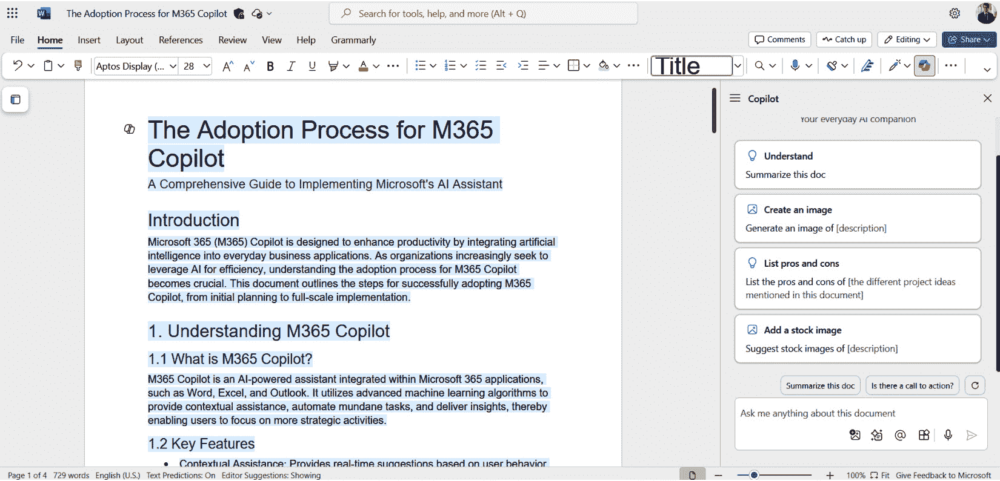

图 15.1：在 Microsoft Word 中使用 Copilot 生成内容

+   在 Excel 中，Copilot 作为数据分析师，帮助用户以最小的努力发现趋势和洞察。通过以自然语言解释查询，它简化了创建复杂公式、生成数据透视表和可视化数据模式等任务。这一功能使数据分析民主化，赋予不同技术水平的用户提取可操作见解的能力。

+   PowerPoint 用户受益于 Copilot 将大纲或文档转换为精美演示文稿的能力。通过推荐幻灯片布局、添加视觉元素并确保设计的一致性，Copilot 加速了专业级幻灯片的创建。对于可能觉得演示设计令人畏惧的用户，Copilot 提供指导，确保重点始终放在内容和故事叙述上。

+   在 Outlook 中，Copilot 通过起草回复、总结长篇线程和优先处理消息来减轻电子邮件管理的负担。这种能力帮助用户保持对高优先级任务的关注，而不会被日常沟通所拖累。Copilot 还协助安排和会议准备，提供先前讨论的总结，以确保连续性和清晰性。

+   Microsoft Teams 集成了 Copilot 以增强协作并简化会议工作流程。Copilot 可以准备会议议程，实时捕捉行动项目，并生成确保团队成员之间保持一致的会议总结。通过充当虚拟助手，它减少了行政负担，并使团队能够专注于实现他们的目标。在*图 15.2*中，我们可以看到 Copilot 在 Microsoft Teams 中用于生成会议议程。

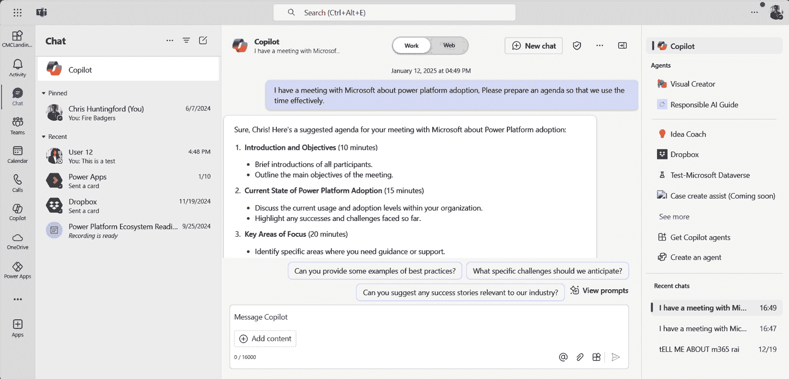

图 15.2：在 Microsoft Teams 中使用 Copilot

除了单个应用程序之外，Copilot 在 Microsoft 365 生态系统中的集成允许实现互联功能。例如，在 Excel 中分析的数据可以无缝地整合到 Word 文档或 PowerPoint 演示文稿中，Copilot 在整个过程中提供上下文感知的建议。这种互联性促进了统一和高效的工作环境，其中 AI 不仅提高了个人生产力，还推动了团队合作和组织效率。

Microsoft 365 协同助手的设计优先考虑了可访问性和易用性。通过理解自然语言命令，它降低了未经练习的用户的学习曲线，同时使经验丰富的专业人士能够更快、更智能地工作。Copilot 与 Microsoft 365 的无缝集成反映了将 AI 视为生产力伙伴的更广泛愿景，使用户能够专注于战略和创造性工作，而日常任务则轻松管理。

Microsoft 365 协同助手展示了 AI 助手对个人和组织日常工作的变革性影响。它集成到熟悉的应用程序中，如 Word、Excel、PowerPoint、Outlook 和 Teams，通过简化工作流程，使用户能够轻松生成内容、分析数据、创建演示文稿和管理电子邮件，从而提高生产力。这种无缝的功能促进了协作和组织效率，因为用户可以利用 AI 能力而无需切换应用程序或学习新界面。通过解释自然语言命令，Copilot 使这些工具对所有技能水平的人都可访问，优先考虑用户体验，并使专业人士能够专注于战略任务，同时将常规功能自动化。在下一节中，我们将检查 Power Platform 工具中可用的协同助手功能。

# Power Platform 中的协同助手

AI 驱动的协同助手正在通过使用户能够以前所未有的轻松和高效的方式构建、自动化和管理解决方案，从而彻底改变 Power Platform 生态系统。这些协同助手利用先进的 AI 模型来解释用户输入，提供智能建议，并自动化复杂任务，使开发过程对技术用户和非技术用户都更加容易。这些协同助手在 Dataverse、Power Apps、Power Automate 和 Power Pages 等组件中的集成展示了 Power Platform 致力于民主化技术和赋权所有技能水平的制作者。这些协同助手执行比制作者通常手动执行更多的任务，从而大大缩短了构建时间。事实上，协同助手在 Power Platform 制作体验中如此普遍，以至于当用户打开制作者门户时，他们就有机会利用协同助手。这在*图 15.3*中很明显。

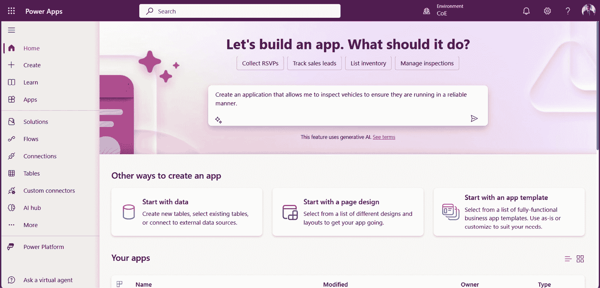

图 15.3：Power Platform 制作体验中的协同助手

## Dataverse 模型创建

Dataverse 是 Power Platform 的基础数据平台，其与 AI 协同助手的集成简化了创建和管理数据模型的过程。传统上，设计关系型数据模型需要大量的技术专业知识，从定义实体/表到建立关系和实施数据验证。Dataverse 中的协同助手通过自动化大部分基础工作来减少这种复杂性。

使用自然语言，用户可以描述他们想要构建的应用类型或需要管理的数据，飞行员将这些描述转换为结构化数据模型。例如，用户可能会提示飞行员：“创建一个用于跟踪客户互动和支持票务的数据模型”，飞行员将生成相关的表、关系和属性，包括数据类型和字段验证的建议。在*图 15.4*中，已经使用自然语言请求创建设施管理数据模型。

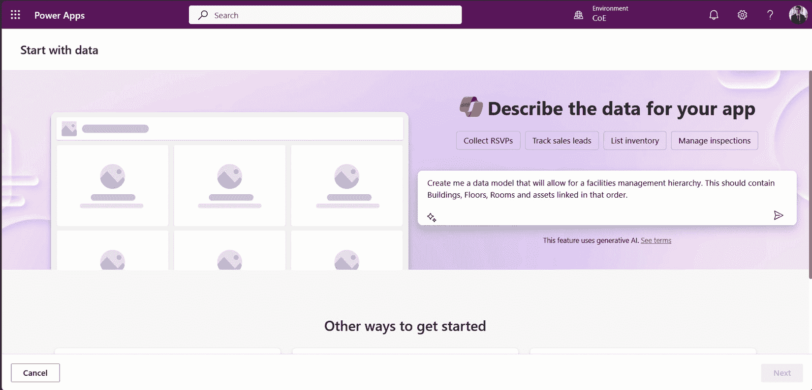

图 15.4：使用自然语言设置设施管理数据模型的起点

一旦创建模型，就可以在制作者的经验中进行细化。在*图 15.5*中，可以看到*图 15.4*中使用的提示的结果。已经创建了包含一些基础列的四个表，这些表已经相互链接，形成了数据模型。

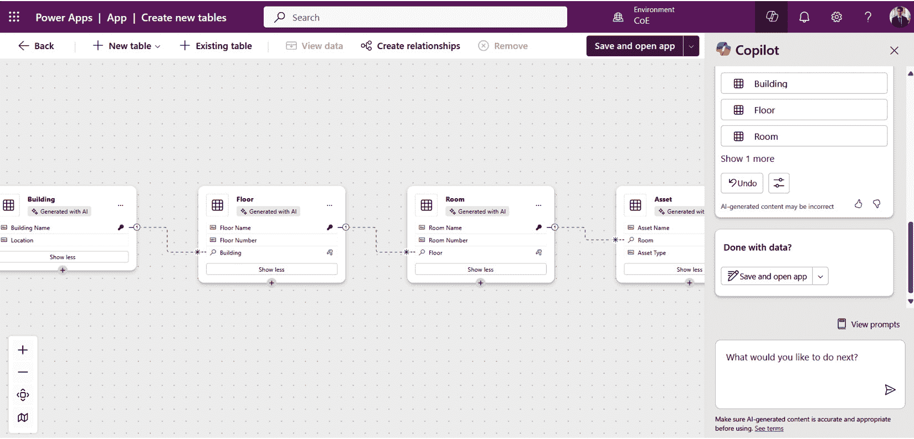

图 15.5：由于设施管理提示而创建的数据模型

飞行员（copilot）还通过分析数据模式和用法趋势来协助优化和改进模型。它可以推荐改进措施，例如为频繁查询的字段添加索引或规范化数据结构以提高性能。这种能力使得制作者可以专注于更高层次的设计考虑，同时确保底层数据平台稳健高效。

### 画布应用

画布应用是 Power 平台的核心，提供高度可视化的拖放界面来构建应用。画布应用中的飞行员通过引导用户创建应用布局、添加功能以及优化用户体验，使应用构建过程更加直观。

例如，用户可以描述应用的目的，例如“我需要一个应用来管理员工考勤表”，飞行员将生成一个包含时间输入、审批流程和报告屏幕的初步布局。飞行员还根据应用的功能提供智能建议，例如日期选择器、下拉菜单或文件上传字段。在*图 15.6*中，可以通过嵌入的飞行员功能扩展和配置画布应用。

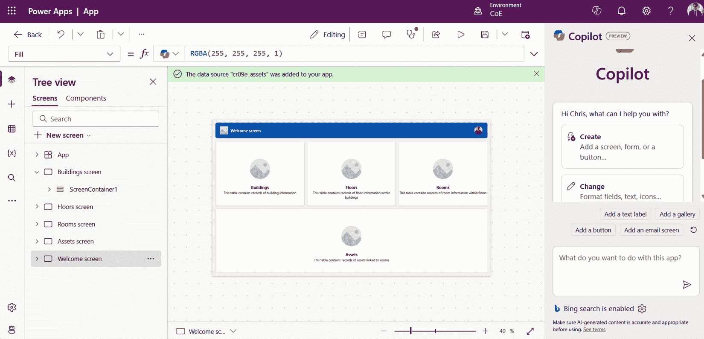

图 15.6：在画布应用中利用飞行员协助创建应用

在画布应用程序中的协同导航员帮助创建公式，降低了平台低代码编程语言 Power FX 的复杂性。用户可以用普通语言描述他们的需求——例如“计算每位员工本周的总工作时间”——协同导航员将生成相应的 Power FX 公式。这显著降低了新制作者的学习曲线，同时提高了经验丰富的开发者的生产力。

### Power Automate

Power Automate 协同导航员通过允许用户通过对话输入设计自动化来简化工作流程的创建。用户不必手动选择触发器和操作，他们可以用自然语言描述他们的流程，协同导航员将相应地构建一个流程。例如，用户可能会说：“设置一个流程，每当有新的销售线索添加到 Dataverse 时，就向我的经理发送电子邮件，”协同导航员将生成相应的自动化。

协同导航员还提供优化工作流程的建议，例如建议错误处理机制或识别合并冗余步骤的机会。此外，它分析工作流程性能并提供见解以提高效率，例如使用批量处理大型数据集或调整触发器以减少不必要的执行。在 *图* *15**.7* 中，协同导航员功能被用来理解此流程的功能。

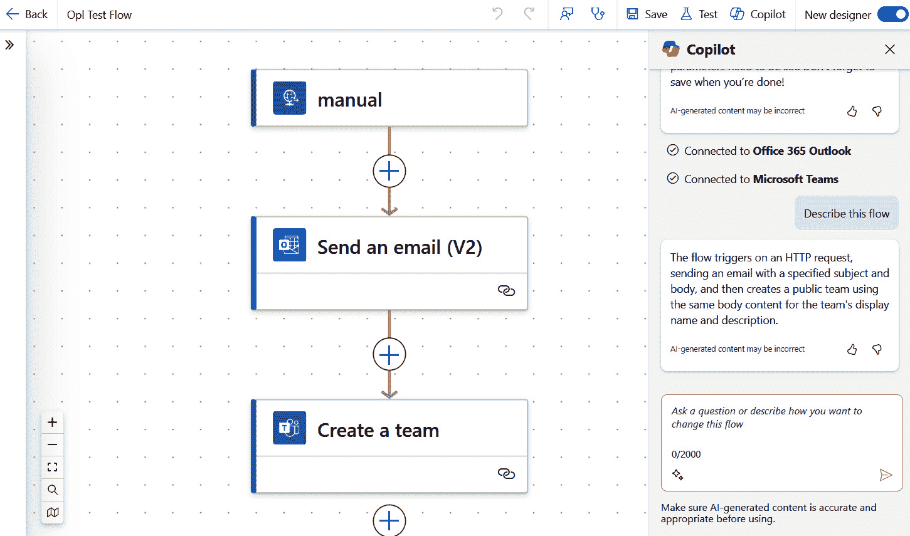

图 15.7：在 Power Automate 中利用协同导航员作为理解此云流程功能的机制

Power Automate 协同导航员通过集成广泛的连接器来增强可访问性，使用户能够自动化跨越多个系统的流程。通过简化流程创建和优化，协同导航员使制作者能够自信且精确地自动化复杂任务。

### Power Pages

Power Pages 协同导航员将人工智能的力量带入网站创建和管理，使用户能够以最小的努力设计、构建和定制网络门户。用户可以从描述他们的网站需求开始，例如：“创建一个客户门户，用于提交和跟踪支持工单。”协同导航员将生成一个包含相关页面、导航和预配置表单的起始模板。

除了布局生成之外，协同导航员通过起草页面副本、建议 SEO 关键词和优化可访问性功能来协助内容创作。它还帮助用户配置后端集成，例如将表单连接到 Dataverse 以进行数据存储或设置基于角色的访问控制以保护敏感信息。在 *图* *15**.8* 中，协同导航员被用来帮助进行网站设计和导航。

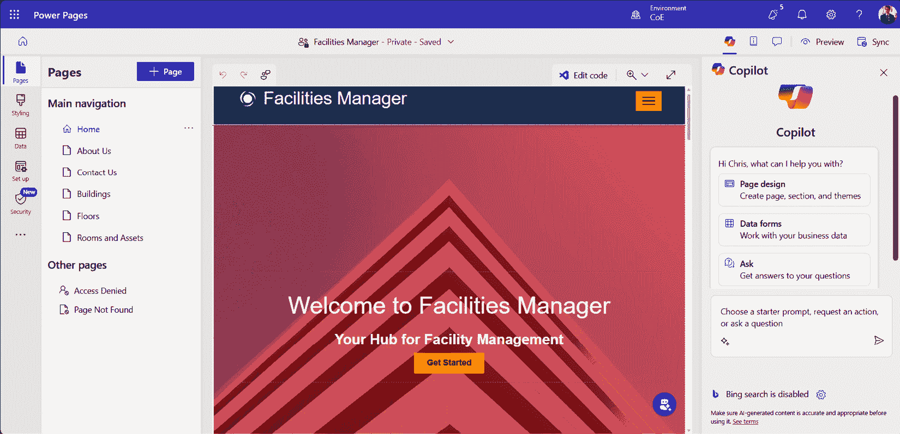

图 15.8：Microsoft Power Pages 中的协同导航员功能

对于开发者来说，副驾驶通过提供代码片段或配置来简化高级功能的定制过程，例如添加自定义 API 或嵌入 Power BI 仪表板。这使得用户能够根据特定业务需求定制他们的网络门户，同时保持高水平的可用性和设计一致性。

我们看到副驾驶越来越多地被添加到 Power Platform 产品中，并且这一功能正在得到巨大提升。在撰写这本书时，我们了解到许多副驾驶相关的功能处于公开预览阶段，例如利用副驾驶生成模型驱动应用程序。我们预计随着技术的进步，这一功能将变得更加普遍和常见。

在这里要强调的一个关键点是，副驾驶可以帮助制作者构建解决方案并极大地提升创作体验，然而，我们还没有深入探讨用户在已创建的解决方案中使用副驾驶的能力。目前这一功能在 Power Apps 和 Power Pages 中可用，并允许用户通过副驾驶面板使用自然语言与用户体验和数据进行交互。

AI 驱动的副驾驶正在通过简化解决方案的开发和管理，为所有技能水平的 Power Platform 用户带来革命。它们通过自然语言处理自动化复杂任务，使用户能够轻松地在 Dataverse 中创建数据模型，在画布应用程序中构建应用程序，在模型驱动应用程序中建模，在 Power Automate 中设计工作流，以及在 Power Pages 中开发网站。通过提供智能建议和优化流程，这些副驾驶提高了生产力并促进了可访问性，使制作者能够专注于更高层次的设计，同时高效地利用技术。在下一节中，我们将探讨 Power Apps 计划设计师如何使用 AI 帮助您开始 Power Platform 项目。

# 使用 Power Apps 计划设计师进行解决方案规划

PowerApps 计划设计师是一个开创性的工具，它利用 AI 引导制作者完成设计以用户为中心、智能解决方案的初始阶段。认识到规划是应用开发中一个关键但往往具有挑战性的步骤，微软推出了计划设计师以简化并优化这一过程。通过集成 AI 能力，它使制作者能够以最小的努力打造符合其独特业务需求的有效解决方案。

## 计划设计师的工作原理

计划设计师通过结合自然语言输入和上下文 AI 推荐来简化规划过程。制作者首先描述他们的业务问题、目标和预期结果。例如，用户可能会输入：“我需要一个应用程序来跟踪和管理我组织内的设施和资产。”计划设计师使用这些信息为应用程序生成一个全面的起点。在*图* *15**.9 中，计划设计师正在被用来促进设施管理解决方案的创建。

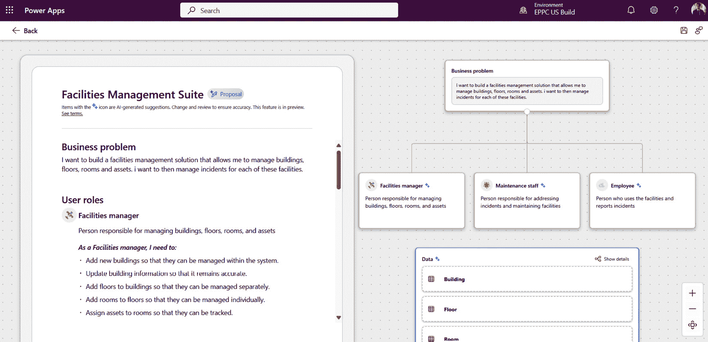

图 15.9：利用计划设计器促进设施管理解决方案的创建

计划设计器使我们能够创建这些令人惊叹的、有文档记录的、捆绑的解决方案，为有用的解决方案提供一个良好的起点。这是我们迄今为止在 Power 平台工具集中看到的最具创新性的功能集之一，我们相信它极大地加速了开始构建强大解决方案的差距。

## 使用人工智能的解决方案规划的未来

Power Apps 计划设计器代表了向智能、用户导向的应用开发转变。通过利用人工智能，它将传统上复杂的阶段转变为直观且高效的过程。随着 Power 平台不断进化，计划设计器将集成更多先进的功能，如预测分析和更深入的自动化建议，进一步赋予制作者轻松构建有影响力的解决方案的能力。

计划设计器展示了人工智能如何增强应用开发生命周期的每个阶段，使其成为旨在快速有效创新的组织不可或缺的工具。

### 关键功能

以下是一些计划设计器的关键功能：

+   **上下文分析**：人工智能分析提供的输入、业务背景以及任何附加的流程图或数据模型，以全面理解需求。

+   **角色识别**：根据描述的解决方案识别并推荐用户角色，例如人力资源经理、培训师和新员工。

+   **数据模型推荐**：计划设计器提出在 Dataverse 中使用的相关数据表、字段和关系，确保数据结构与应用目的相匹配。

+   **自动化建议**：它建议使用 Power Automate 工作流来增强解决方案，例如在培训完成或入职进度跟踪时触发电子邮件通知。

通过自动化这些初始步骤，计划设计器减轻了制作者的认知负担，使他们能够专注于完善和个性化他们的解决方案。

### 优势

现在，让我们来探讨使用计划设计器的一些好处：

+   **简化规划**：通过自动化复杂任务，如数据建模和工作流程设计，计划设计器消除了解决方案规划中的许多猜测。

+   **以用户为中心的方法**：其推荐用户角色的能力确保了应用设计与其目标受众的需求相一致，从而促进更好的采用率和可用性。

+   **一致性和最佳实践**：人工智能将其建议纳入到其推荐中，确保最终解决方案既高效又可扩展。

+   **加速开发**：通过提供一个坚实的基础，计划设计器缩短了开发周期，使制作者能够快速从概念到实施。

总之，Power Apps 计划设计师通过使用 AI 来简化规划和提高效率，从而改变了应用程序开发过程。通过使创作者能够轻松表达他们的业务需求，它确保了以用户为中心的解决方案的设计。随着其不断进化，这个工具将在帮助组织快速有效地创新中发挥关键作用。使用这个工具允许制作者真正利用 Power Platform 中 AI 的力量，以帮助项目规划和执行成功。在下一节中，我们将探讨另一种形式，即 AI 代理，它被注入到 Copilot Studio 中，与 Power-Platform 相关。

# 什么是 AI 代理？

我们现在正处于“AI 代理”的时代。代理是 AI 驱动的系统，旨在以精确和高效的方式执行特定任务或功能。它们根据预编程的规则、复杂的机器学习算法或高级自主决策能力进行操作。这些 AI 代理是 AI 集成的基石，无缝地连接人类意图和可执行的结果。

AI 代理可以分为几种类型，每种类型都提供独特的功能和自主程度。这些从遵循严格指南的简单基于规则的代理到能够做出独立决策并适应新情况的复杂完全自主代理。通过利用不同 AI 代理的优势，组织可以提高运营效率、改善客户服务，并在医疗保健、物流和金融等行业推动创新。

AI 代理的通用性允许它们在多样化的应用中部署，从自动化常规任务到提供个性化的建议和见解。随着技术的不断发展，AI 代理在改变各个部门和创造新机会方面的潜力是无限的。

## AI 代理的类型

让我们来看看以下几种 AI 代理类型。

### 基于规则的代理

这些代理严格根据预定义的规则和指令操作，这使得它们在特定任务中高度可预测和可靠。它们不具备从以往经验中学习或适应新情况的能力。基于规则的代理的理想应用包括简单的重复性任务，如过滤垃圾邮件、调节恒温器和管理库存水平。由于它们的范围有限，它们最适合条件和要求保持稳定且不需要复杂决策的环境。

### 半自主代理

这些代理结合了编程规则和学习能力。它们可以分析数据并根据以往经验调整其行为，尽管它们仍然需要人工监督。半自主代理通常用于**机器人流程自动化**（**RPA**）等应用中，它们可以自动化重复性任务，同时能够根据新数据调整操作。此外，这些代理还用于自动驾驶车辆，它们可以通过学习实时交通数据和历史模式来导航和做出驾驶决策。通过将基于规则的行动与适应性学习相结合，半自主代理为处理需要一致性和灵活性的任务提供了一种平衡的方法。

### 完全自主代理

完全自主代理独立运行，无需人工干预，随着时间的推移做出决策并改进其行为。这些代理利用先进的机器学习算法和深度神经网络来分析大量数据，识别模式并做出明智的决策。它们从经验中学习并适应新情况的能力使它们在动态环境中非常灵活且有价值。

在*图* *15**.10*中，我们可以看到三种代理类型的分解以及何时选择每种类型的简单总结。

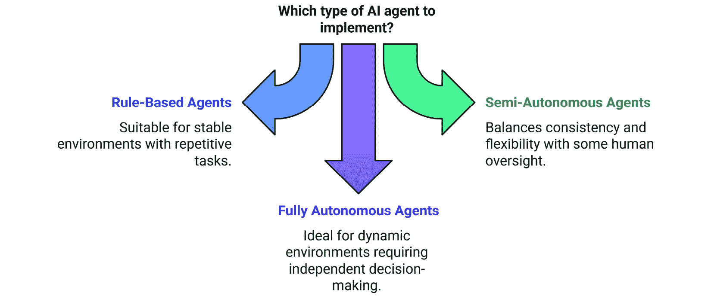

图 15.10：各种代理类型的总结以及简单说明何时选择每个类型

在医疗保健领域，完全自主的代理可用于持续患者监测、实时诊断和个性化治疗建议。在物流领域，这些代理优化供应链运营、管理库存水平并提高配送效率。此外，它们还在自动驾驶等领域被探索，在这些领域，它们可以导航复杂交通场景，做出瞬间决策，并提高整体道路安全。

虽然仍在发展中，但这些代理代表了人工智能的未来，有潜力颠覆行业并创造前所未有的效率和创新能力。

## 人工智能代理的实际应用

让我们了解一些人工智能代理的实际应用：

+   **客户服务**：聊天机器人和虚拟助手通过提供即时、准确响应来简化客户互动

+   **医疗保健**：人工智能代理协助诊断、个性化治疗计划和患者远程监测

+   **金融**：欺诈检测系统和自动化交易代理优化安全和效率

+   **教育**：智能辅导系统根据学生表现和需求提供定制化学习体验

+   **家庭自动化**：智能设备如恒温器和安全摄像头使用人工智能代理来提高舒适性和安全性

+   **制造**：人工智能代理优化生产流程、预测维护需求并确保质量控制

+   **零售**：通过分析客户行为，AI 代理增强了个性化的购物体验和库存管理

+   **能源管理**：AI 代理通过控制电力使用和预测能源需求来提高能源效率

+   **交通**：由 AI 代理管理公共交通系统的路线优化和预测性维护

+   **农业**：AI 代理通过监测作物健康、预测产量和优化资源使用来帮助精准农业

+   **娱乐**：AI 代理创建个性化的内容推荐，并增强游戏和流媒体服务中的用户体验

*图* *15**.11* 以更连贯的方式总结了各种行业示例，展示了智能代理作为流程优化和转型的中心。

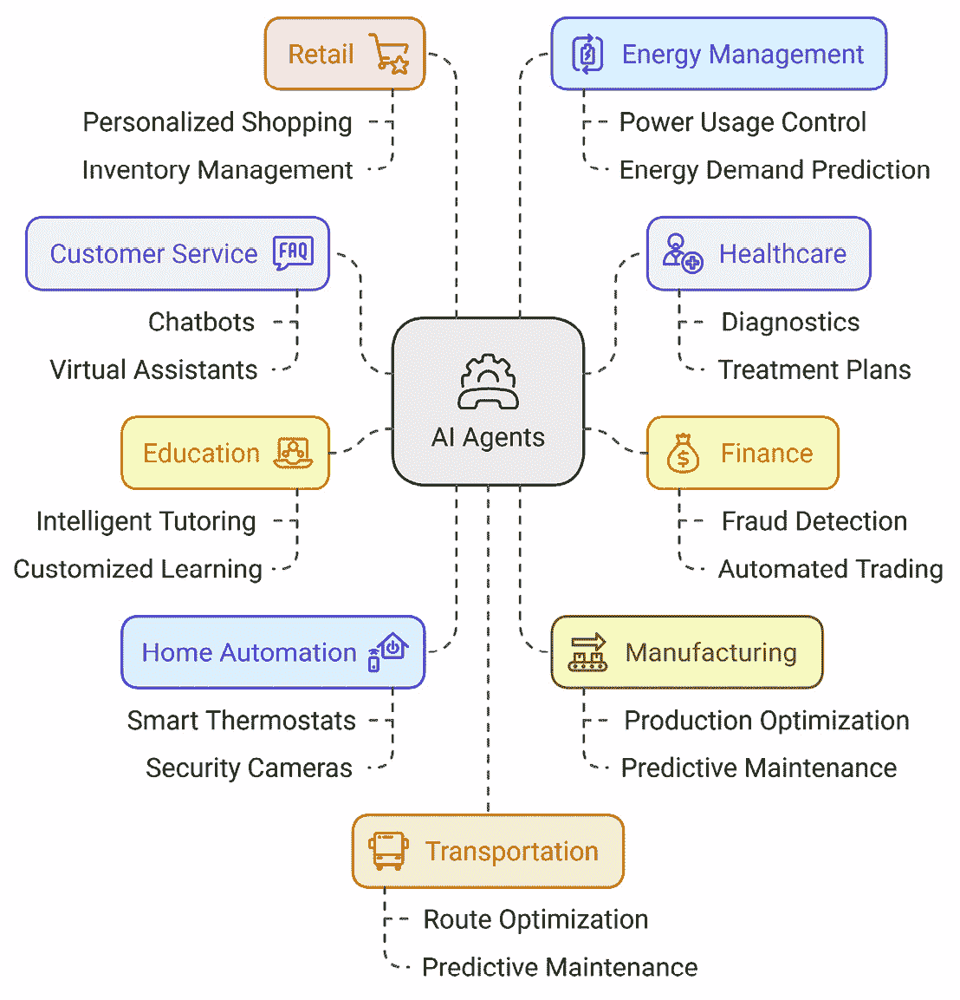

图 15.11：以智能代理为中心的各种行业示例总结

AI 代理是高级的、AI 驱动的系统，旨在高效地执行特定任务，利用预编程的规则、学习算法或自主决策。它们的复杂性从简单的基于规则的代理到完全自主的代理不等，后者可以独立学习和适应。这些代理在包括医疗保健、物流、金融和客户服务在内的多个行业中提高了运营效率和创新能力，实际应用包括聊天机器人、个性化医疗和自动化交易。随着技术的进步，AI 代理的多样性和潜力继续扩大，有望革命性地改变各个行业。在下一节中，我们将探讨微软对 AI 增强代理的回应。

# 微软对代理的回应

微软通过 Power Platform 在 AI 代理的开发和集成方面取得了巨大进展。Power Platform 使组织能够构建、分析、自动化并与定制的 AI 驱动解决方案进行聊天，从而提高各行业的生产力和效率。

## Copilot Studio – 创建 AI 驱动的智能代理

**Copilot Studio** 是一个工具，允许用户在不需广泛编码知识的情况下创建智能代理。这些代理可以与客户互动，回答查询，并根据预定义的规则和 AI 能力执行任务。例如，一家零售公司可能会部署一个代理来帮助客户进行产品推荐、订单跟踪和退货处理。代理可以利用 AI 理解自然语言查询，并根据客户历史和偏好提供个性化响应。另一个例子是医疗保健提供者使用代理来安排预约、提供药物提醒和回答常见的健康问题，从而提高患者参与度和满意度。

重要的是要理解，代理行为不仅仅是注入了 AI 的聊天机器人或辅助工具；它远不止于此。代理解决方案包含高级别的自动化，以高度智能的方式协助信息和流程的流动。

考虑到客户支持行业的一个场景，其中一家公司正在处理大量客户咨询，导致等待时间过长和客户满意度下降。通过部署使用 Microsoft 的 Copilot Studio 创建的代理，该公司可以显著提升其客户服务运营。

这些智能代理可以处理各种客户互动，从回答常见问题到处理退货和跟踪订单。通过理解自然语言查询，这些代理可以提供针对每个客户需求的即时、准确的响应。例如，代理可以通过引导客户逐步解决问题来协助客户解决技术问题，从而减少对人工干预的需求并加快解决时间。

这些代理可以从过去的互动中学习，以持续改进其性能。他们可以分析客户咨询中的模式，以识别常见问题并主动解决它们，进一步改善客户体验。这种自动化水平不仅减轻了人工支持人员的工作负担，还确保客户能够及时高效地获得服务，从而提高满意度和忠诚度。

这里要强调的关键点是，这些代理会随着时间的推移学习和变得更好，这推动了智能自动化的新水平，这对组织在看待流程自动化和生产率方面的发展大有裨益。

## 创建代理

制造商可以在 Power Platform 中轻松创建代理。根据您在生态系统中所拥有的当前工具，有两种主要方法来完成这项工作。代理可以直接通过 Copilot Studio 制造商门户创建。这可以在*图* *15**.12*中看到，其中使用了简单的对话用户体验来创建代理。

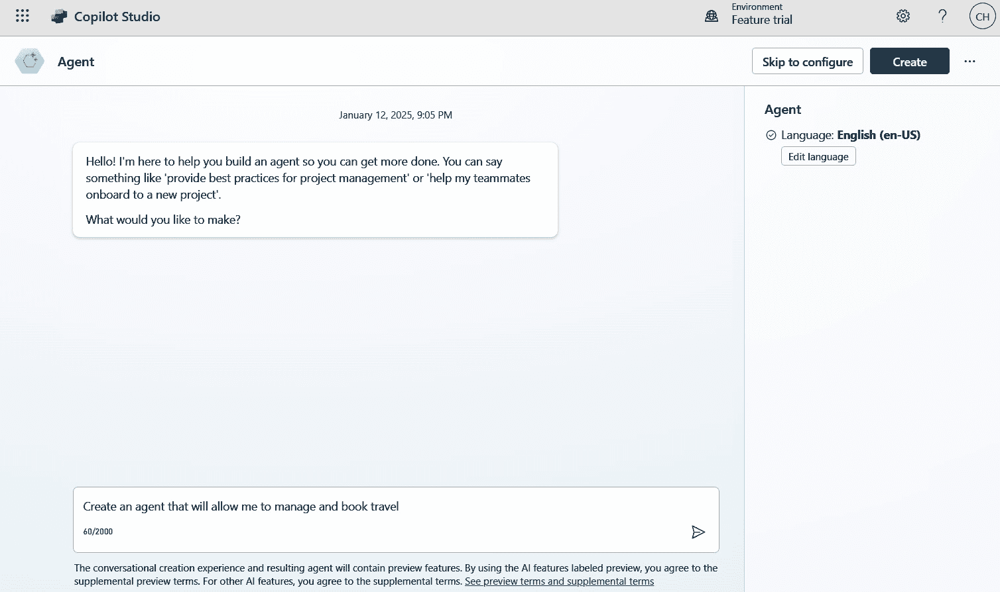

图 15.12：在 Copilot Studio 制造商门户中创建代理

在您继续处理流程的过程中，您将有机会添加更多内容，例如进一步的说明，这些说明作为初始提示，有助于设定上下文和某些边界条件，知识来源，确定性主题和操作。这可以在*图* *15**.13*中看到，其中代理正在进一步细化和配置。

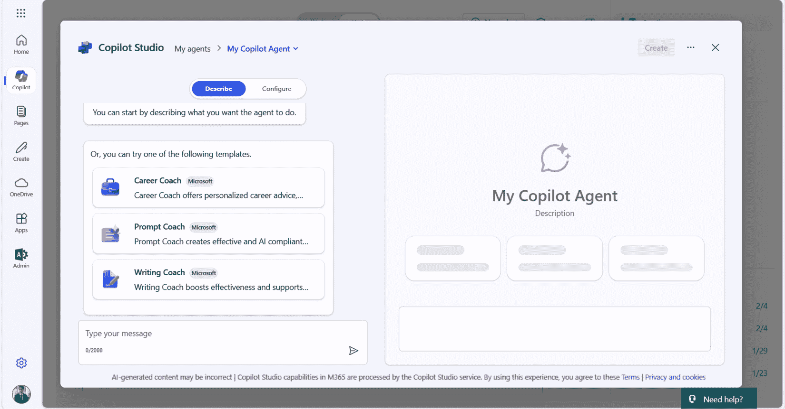

图 15.13：在 Copilot Studio 中配置代理

新的代理设计器直接嵌入到 Microsoft 365 Copilot 用户界面中，制作者可以在这种体验中创建代理。然后，这些代理可以直接通过 Microsoft 365 Copilot 体验启动。*图* *15**.14*显示，这些代理可以由制作者相对容易地构建。

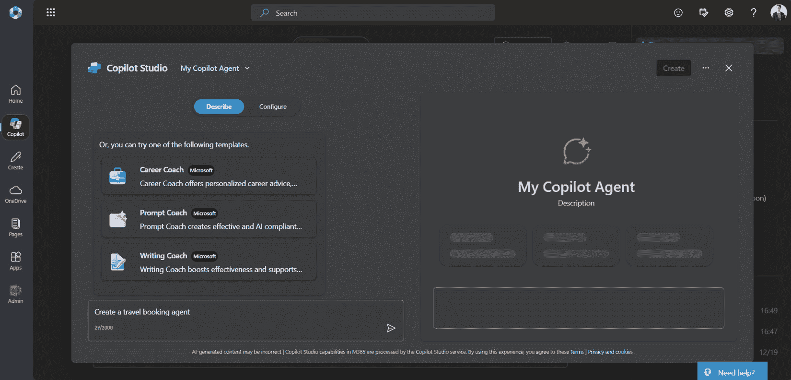

图 15.14：直接从 Microsoft 365 Copilot 用户体验创建代理

在创建这些代理时需要考虑的一些关键点，以及使这些共飞行员真正具有代理性的因素如下：

+   这个智能代理基于哪些数据？确保代理与其关联的正确知识源，以便其在可靠的数据上建立基础，这一点非常重要。数据越好、越精细，响应就会越好。

+   行动和自动化！一个标准的共飞行员可能能够生成内容，但实际上并不执行或执行行动。代理将通过自动化执行行动。在共飞行员工作室中，执行这些行动的主要方法之一是利用 Power Automate。如图*15**.15*所示，利用 Power Automate 是创建共飞行员工作室行动的绝佳方式。

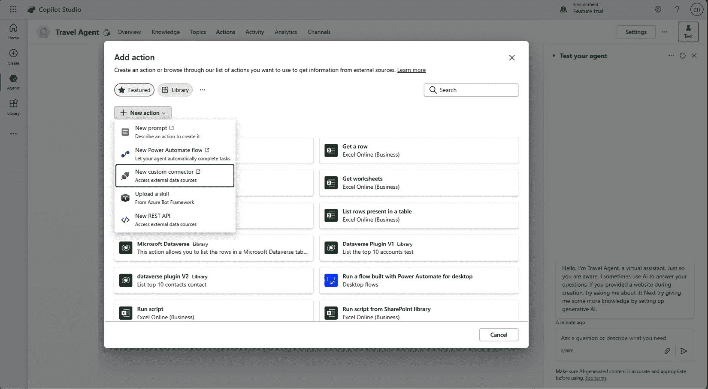

图 15.15：在 Copilot Studio 代理中创建行动

最终，Copilot Studio 代理非常强大，允许制作者利用他们当前的 Power Platform 技能来创建 AI 代理。理解 Copilot Studio、连接器、Power Automate、插件和 Dataverse 在这个过程中非常有价值，而且 Power Platform 用户过去学到的技能现在也非常有价值。要了解更多关于使用 Copilot Studio 创建代理的信息，请访问 Microsoft Learn 获取更多信息：[`learn.microsoft.com/en-us/training/modules/power-virtual-agents-bots/`](https://learn.microsoft.com/en-us/training/modules/power-virtual-agents-bots/)。有一些出色的学习路径可供选择。

微软通过 Power Platform 在 AI 代理方面的进步，对于希望提高生产力的组织来说是一个重大的飞跃。Copilot Studio 工具赋予用户，无论其编码经验如何，都能开发出能够与客户互动、回答问题和自动化各种任务的智能代理。我们相信这些代理有潜力极大地改善组织的许多领域，例如客户服务，通过高效管理查询、提供个性化响应以及从以往互动中学习来提升其性能。得益于 Microsoft 365 Copilot 中集成的代理设计器，创建过程非常友好，这些代理基于可靠的数据，并且可以通过 Power Automate 执行操作。这种方法正在改变组织管理自动化和推动效率的方式。

负责任的人工智能

在开发 AI 解决方案时，考虑微软的负责任 AI 原则至关重要，这些原则旨在确保 AI 技术以道德、透明和负责任的方式进行开发和实施。这些原则包括公平性、可靠性和安全性、隐私和安全、包容性、透明性和问责制。

公平性确保人工智能系统对所有人群体和群体公平对待，防止歧视和偏见。可靠性和安全性侧重于创建强大和安全的 AI 系统，在各种条件下都能持续和稳定地运行。隐私和安全强调保护个人数据和尊重用户隐私，确保 AI 解决方案符合数据保护法规。

包容性强调了设计对所有人群体都有益且易于访问的 AI 系统的重要性，包括边缘化和代表性不足的群体。透明性涉及使 AI 系统对用户可理解和可解释，使用户能够信任并有效地与这些技术互动。最后，问责制确保开发、部署 AI 系统的个人和组织对其影响和结果负责。

通过遵循这些原则，开发者和组织可以构建既创新高效又符合伦理和值得信赖的 AI 解决方案，从而促进更广泛的接受度并对社会产生积极影响。

# 摘要

Power Platform 中代理的演变标志着智能自动化的重大转变，使组织能够提高生产力和简化流程。这一旅程始于 Copilot Studio 制作门户和 Microsoft 365 Copilot 用户体验的引入——这些工具为制作者提供了轻松创建和配置代理的能力。这些代理基于可靠的数据，确保准确性和效率，并通过 Power Automate 执行复杂操作，从而将常规任务转化为自动化流程。

这些代理最显著的特点之一是它们通过机器学习算法和持续的数据输入学习并随着时间的推移而改进的能力，使它们能够适应新的场景并优化性能。这种能力改变了智能自动化，并改变了组织看待流程自动化的方式。了解现有的 Power Platform 技能对于创作者来说是无价的，他们可以构建 AI 代理，通过准确处理查询、无缝管理工作流程和提供前所未有的洞察力来增强客户服务和运营效率。然而，这些 AI 解决方案的开发必须与微软的负责任 AI 原则相一致，这些原则强调公平、可靠性、安全性、隐私、安全、包容性、透明度和问责制。这些原则指导道德 AI 的发展，确保技术对社会的所有部分都是公平的、安全的和有益的，同时通过清晰和负责任的运营来培养信任。

在 Power Platform 内创建智能代理的旅程是对 AI 变革力量的证明。它承诺一个自动化和效率与道德原则和谐融合的未来，确保技术进步对社会进步做出积极贡献。随着组织继续创新并在此基础上构建，AI 革命行业和改善生活的潜力变得越来越明显。

随着我们完成这 15 章，并思考我们自己和我们的组织可能实现的目标时，我们必须始终牢记，在变革和采纳过程中，人是最重要的。技术仅仅是能够物理上看到以促进变革的催化剂，但真正重要的是人。当我们进入这个 AI 时代，记住 Power Platform 教给我们的关于如何为人们创造一个既可使用又可构建 AI 解决方案的安全空间的一些惊人的基本原理是很重要的。今天你在本书中学到的所有内容都可以在推动你业务跨多种技术进行数字化转型计划时重新应用。

维克多和我感谢您花时间阅读这本书。

# 加入我们的 Discord 社区

加入我们的社区 Discord 空间，与作者和其他读者进行讨论：

[`packt.link/powerusers`](https://packt.link/powerusers)

