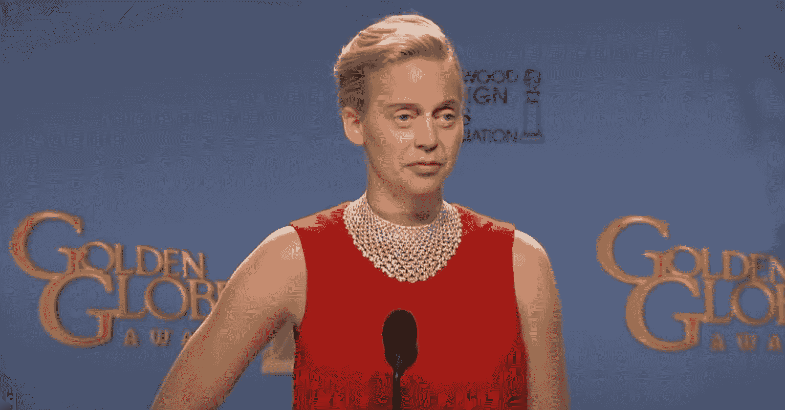
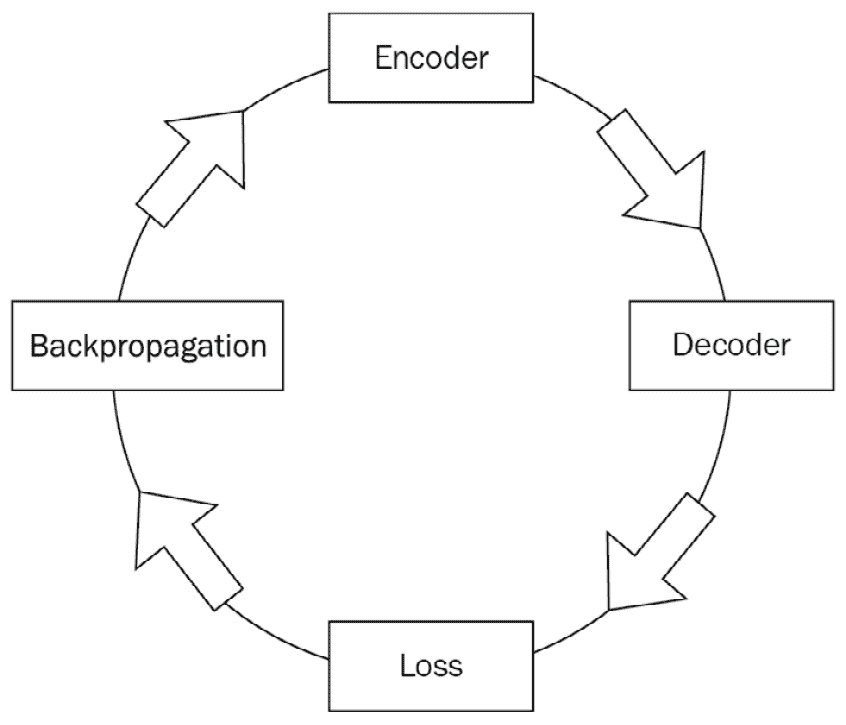
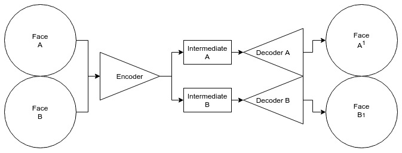
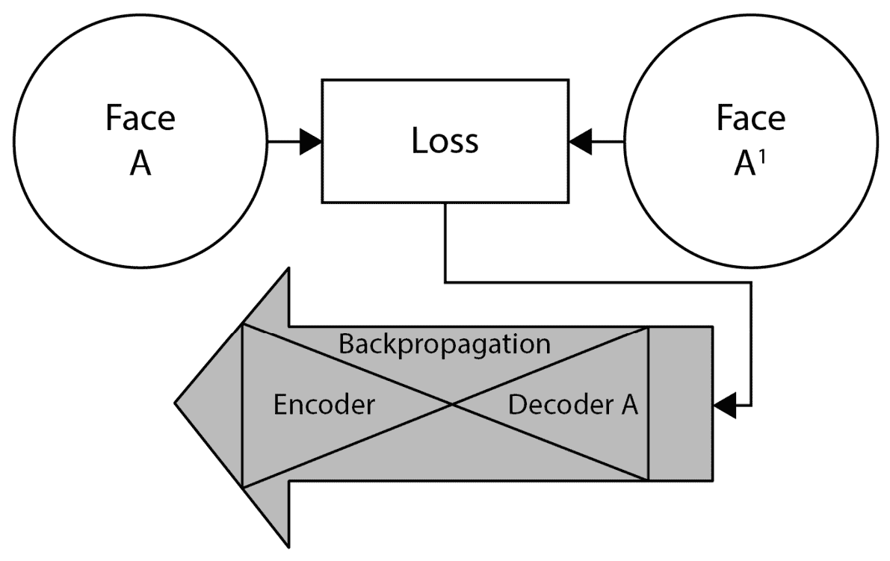
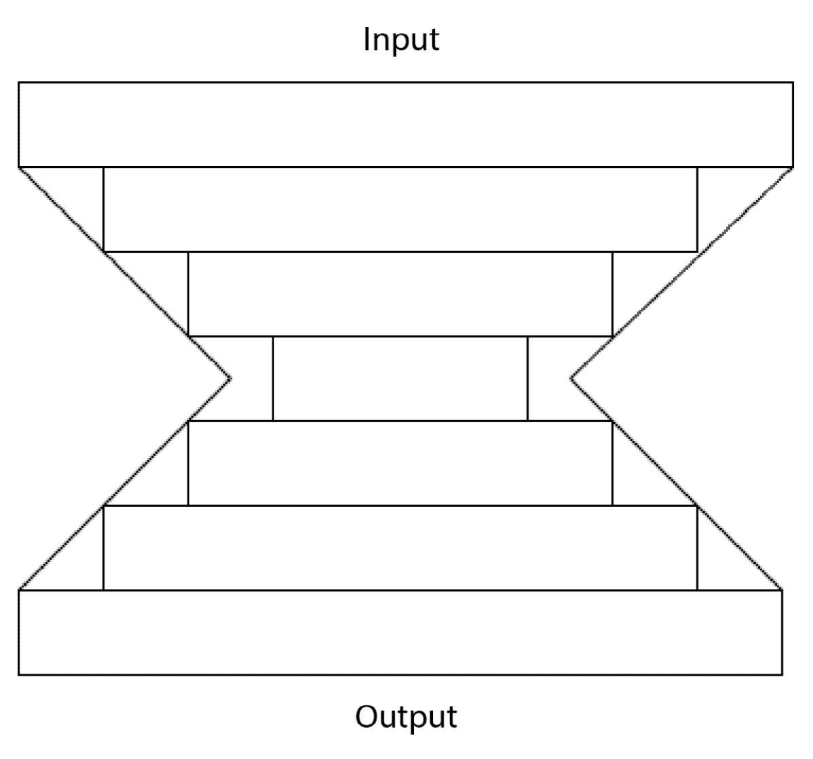

# 1

# 深度伪造调查

理解深度伪造始于了解它们的起源和功能。在本章中，我们将开始探索深度伪造及其运作。我们将讨论使深度伪造工作原理的基础知识，包括**生成自编码器**和**生成对抗网络**（GAN）之间的区别。我们将探讨它们在媒体、教育和广告中的应用。我们将研究它们的局限性，并考虑如何规划和设计你的深度伪造以避免常见的陷阱。最后，我们将检查现有的深度伪造软件，并讨论每种类型能做什么。

我们将在以下章节中介绍：

+   介绍深度伪造

+   探索深度伪造的用途

+   发现深度伪造是如何工作的

+   评估生成式 AI 的限制

+   查看现有的深度伪造软件

# 介绍深度伪造

“深度伪造”这个名字来源于“深度”和“伪造”的合成词，其中“深度”指的是**深度学习**，“伪造”指的是生成的图像并非真实。这个术语最初在流行的网站 Reddit 上被使用，原始作者在那里发布了几个将成人女演员的脸部用其他女性的脸人工替换的深度伪造视频。

注意

深度伪造的伦理问题存在争议，我们将在*第二章**，*考察深度伪造的伦理和危险*中对此进行更深入的探讨。

这种不道德的起点仍然是这项技术最知名的地方，但它并非只能用于此。从那时起，深度伪造已经进入了电影、表情包等领域。汤姆·克鲁斯在“深度汤姆·克鲁斯”先他一步注册 Instagram 之后才注册。史蒂夫·布西米对斯蒂芬·科尔特说，当他的脸被贴在詹妮弗·劳伦斯的脸上，而一个年轻的比尔·奈伊版本被深度伪造到他的老脸上，以电影《侦探皮卡丘》中的“过去”新闻片段时，他“从未看起来这么好”。

在这本书中，我们将对深度伪造有一个相当狭窄的看法，所以现在让我们给它下个定义。深度伪造是使用在两个面部上训练的**神经网络**来替换一个面部为另一个面部。还有其他一些技术可以交换面部，但它们不是深度伪造，还有生成式 AI 可以执行除面部交换之外的其他任务，但将这些都包含在术语中只会使问题复杂化并混淆视听。

# 探索深度伪造的用途

深度伪造的原始用途可能是最不需要想象力的一个。将一个人的脸贴在另一个人身上在各个领域有许多不同的用途。请别把这里提到的想法视为深度伪造能力的全部——肯定有人会想象出新的用途！

## 娱乐

娱乐是大多数人想到深度伪造用途时首先想到的领域。我认为深度伪造在娱乐领域有两个主要的应用领域：*叙事*和*恶搞*。

### 叙事

深度伪造在电影中的效用是显而易见的。想象一下，一个演员的脸被叠加到他们的替身身上，或者一个无法出现的演员被另一个表演者取代，而电影中最终的面部没有任何变化。

虽然深度伪造可能看起来还不够好，但深度伪造已经在今天的好莱坞和其他媒体中得到了应用——从使用深度伪造让比尔·奈伊返老还童的《侦探皮卡丘》，到使用它让演员与罗纳德·里根面对面交流的《为了全人类》，机构和企业特效工作室都在研究如何在他们的工作中使用深度伪造。

这些技术并不特指深度伪造。CGI（在这本书中指 3D 图形）面部替换已经在许多电影中得到了应用。然而，使用 CGI 面部替换既昂贵又复杂，需要以特定的方式拍摄，并捕获大量额外数据供艺术家使用，以便在最终场景中使 CGI 面部看起来很好。这更像是一门艺术而不是科学，需要广泛的技术和知识来完成。深度伪造解决了许多这些问题，使得新的面部替换形式成为可能。

制作深度伪造不需要特殊的拍摄技巧（尽管一些意识会使过程更加顺畅）。与 CGI 面部替换相比，深度伪造也几乎不需要注意或技能。这使得它非常适合低成本面部替换，但也可以是高质量的，因为 AI 考虑到了即使是最专注的艺术家也无法复制的细节。

## 恶搞

恶搞是一种极其流行的社会批评形式，是整个 To PD：电影、电视剧和其他媒体形式的基础。恶搞通常由专业模仿者完成。在某些情况下，那些模仿者看起来（或可以让人看起来）与被模仿的人相似。在其他时候，依赖于他们的表演来使模仿清晰。

Deepfakes 提供了一种改变恶搞艺术的机会，通过深度伪造，模仿者可以看起来像被恶搞的人，而不是仅仅依靠出生的偶然。通过将注意力从基本外观上移开，深度伪造允许直接将焦点放在表演本身上。

深度伪造还使一种全新的恶搞形式成为可能，在这种形式中，由于面部改变，正常情况可以简单地变得具有讽刺意味。这种特定形式由于非常不同面部的独特怪异而变得幽默，而不是预期的交换。

图 1.1 – 通过 birbfakes 将史蒂夫·布西米打造成詹妮弗·劳伦斯

注意

这张图片是在其原始创作者 birbfakes 的允许下包含的。您可以在这里查看原始视频：[`youtu.be/r1jng79a5xc`](https://youtu.be/r1jng79a5xc)。

### 视频游戏

在视频游戏方面，深度伪造提供了一个有趣的机会。这里的想法是，一个计算机生成的角色可以被深度伪造成一个逼真的虚拟形象。这可以应用于游戏中的任何角色，甚至包括玩家的角色。例如，可以制作一个游戏，当玩家的角色照镜子时，他们会看到自己的脸映照回来。另一种可能性是用原始演员的深度伪造来替换非玩家角色，这样可以得到一个更加逼真的外观，而不必制作演员的完整 3D 复制品。

## 教育

教育也可以从深度伪造中受益。想象一下，如果你的历史课有一段亚伯拉罕·林肯本人朗读葛底斯堡演说的视频。或者一个企业培训视频，整个视频都是由公众吉祥物（可能甚至不是真人）主持的，而不必依赖服装或 CGI。甚至可以用来让在显著不同时间拍摄的多个视频或场景看起来更加连贯，仿佛演员在同一时间出现。

许多人是非常视觉化的学习者，看到一个人“活过来”真的可以让人身临其境。使用深度伪造将过去的视频内容“复活”可以带来全新的学习体验。一个例子是达利博物馆，它创建了一系列萨尔瓦多·达利与客人交谈的视频。这是通过训练一个深度伪造模型，将达利的面孔应用到视频上实现的。一旦模型训练完成并设置好，他们就能转换许多视频，与 CGI 解决方案相比，节省了大量时间和精力。

## 广告

广告机构总是在寻找吸引注意力的最新方式，深度伪造可能是一个全新的吸引观众注意力的方式。想象一下，如果你路过一家服装店，你停下来看橱窗里的衣服，突然旁边屏幕上显示了一个演员穿着这件衣服的视频，但脸上是你的脸，让你看到这件衣服在你身上会是什么样子。或者，一个吉祥物角色可以在商业广告中被“复活”。深度伪造为创意使用提供了全新的工具，可以在广告中吸引注意力并提供全新的体验。

现在我们已经对深度伪造的一些潜在用途有了大致的了解，让我们快速了解一下其内部工作原理。

# 发现深度伪造的工作原理

深度伪造是一种独特的生成自编码器变体，用于生成面部交换。这需要一个特殊结构，我们将在本节中解释。

## 生成自编码器

正规深度伪造使用的特定类型的神经网络被称为**生成自编码器**。与**生成对抗网络**（GAN）不同，自编码器不使用判别器或任何“对抗”技术。

所有自动编码器都是通过训练一系列神经网络模型来解决一个问题。在生成型自动编码器的情况下，AI 用于生成一个包含原始图像中没有的新细节的新图像。然而，在普通自动编码器中，问题通常是**分类**（决定图像是什么）、**物体识别**（在图像中找到某物）或**分割**（识别图像的不同部分）。为此，在自动编码器中使用了两种类型的模型 – **编码器**和**解码器**。让我们看看这是如何工作的。

### 深伪影训练周期

训练周期是一个循环过程，模型在图像上持续训练直到停止。这个过程可以分为四个步骤：

+   **编码**面孔成更小的中间表示。

+   **解码**中间表示回面孔。

+   计算原始人脸与模型输出之间的**损失**（即，两者之间的差异）。

+   修改（**反向传播**）模型以趋向正确答案。

图 1.2 – 训练周期图

更详细地说，这个过程如下展开：

+   **编码器**的工作是将两个不同的面孔编码成一个数组，我们称之为中间表示。中间表示比原始图像尺寸小得多，有足够的空间来描述光照、姿势和表情。这个过程类似于压缩，其中不必要的数据被丢弃以适应更小的空间。

+   **解码器**实际上是一对匹配的模型，它们将中间表示转换回面孔。每个输入面孔都有一个解码器，它只在该一个人的面孔图像上训练。这个过程试图创建一个与编码器接收到的原始面孔匹配的新面孔，该面孔被编码到中间表示中。

图 1.3 – 编码器和解码器

+   **损失**是一个根据自动编码器如何重新创建原始人脸而给出的分数。这是通过比较原始图像与编码器-解码器过程的输出来计算的。这种比较可以以多种方式进行，从两者之间的严格差异到包含人类感知作为计算一部分的复杂得多的情况。无论怎样做，结果都是一样的：一个介于 0 到 1 之间的数字，其中 0 是模型返回完全相同图像的分数，1 是完全相反或图像。大多数数字将介于 0 到 1 之间。然而，完美的重建（或其相反）是不可能的。

注意

损失是自动编码器与生成对抗网络（GAN）之间的区别所在。在 GAN 中，比较损失要么被替换，要么由一个额外的网络（通常是一个自动编码器本身）补充，然后该网络产生它自己的损失分数。这个结构的理论依据是，损失模型（称为判别器）可以学会更好地检测生成模型（称为生成器）的输出，而生成器可以学会更好地欺骗判别器。

+   最后，是**反向传播**，这是一个通过沿着生成面孔和解码器以及编码器生成的路径回溯，并推动这些路径向正确答案靠近的过程。

图 1.4 – 损失和反向传播

一旦完成，整个过程就会从编码器重新开始。这会一直重复，直到神经网络完成训练。何时结束训练的决定可以以几种方式发生。它可以在发生了一定数量的重复（称为**迭代**）时发生，当所有数据都经过（称为**一个 epoch**）时，或者当结果达到一定的损失分数时。

### 为什么不是 GANs？

GAN 是目前生成网络中的宠儿之一。它们非常受欢迎，被广泛使用，尤其是在超分辨率（智能放大）、音乐生成，甚至有时是深度伪造。然而，有一些原因使得它们没有被用于所有的深度伪造解决方案。

GAN 之所以受欢迎，是因为它们的“富有想象力”的特性。它们通过生成器和判别器的交互来学习，填补数据中的空白。因为它们可以填补缺失的部分，所以在重建任务或需要新数据的任务中非常出色。

GAN 在创建缺失数据方面的能力对于许多任务来说非常出色，但当用于深度伪造时，它有一个关键的缺陷。在深度伪造中，目标是替换一个面孔为另一个面孔。一个富有想象力的 GAN 可能会学会用另一个面孔的数据来填补一个面孔数据中的空白。这导致了一个我们称之为“身份混合”的问题，即两个面孔没有正确交换；相反，它们混合成了一个既不像任何一个人，又像是两个人混合的面孔。

GAN 创建的深度伪造中的这个缺陷可以纠正或预防，但这需要更加仔细的数据收集和处理。一般来说，使用生成式自动编码器而不是 GAN，更容易实现完全替换而不是混合。

### 自动编码器结构

自动编码器的另一个名字是“沙漏”模型。这是因为编码器的每一层都比前一层小，而解码器的每一层都比前一层大。正因为如此，自动编码器的图在开始时很大，向中间缩小，然后在达到末端时再次变宽：

图 1.5 – 自动编码器的沙漏结构

虽然这些方法具有灵活性并且有众多潜在用途，但它们也存在限制。现在让我们来探讨这些限制。

# 评估生成式 AI 的限制

深度伪造中使用的生成式 AI 并非万能，实际上存在一些显著的限制。然而，通过了解这些限制，它们通常可以通过精心设计来克服或规避。

## 分辨率

深度伪造在可以交换的分辨率上有限制。这是一个硬件和时间限制：更强大的硬件和更多的时间可以提供更高分辨率的交换。然而，这并不是 1:1 的线性增长。将分辨率加倍（例如，从 64x64 到 128x128）实际上将所需的**VRAM**（即 GPU 可以直接访问的内存）数量增加四倍，并且训练所需的时间也大致增加相同的量。因此，分辨率通常是一个权衡，你可能会想要将深度伪造的分辨率降到最低，同时不牺牲结果。

## 每对脸所需的训练

为了提供最佳结果，传统的深度伪造需要你在你希望交换的每一对脸上进行训练。这意味着，如果你想用自己的脸交换你两个朋友的脸，你就必须训练两个不同的模型。这是因为每个模型都有一个编码器和两个解码器，它们只被训练来交换它们所接收到的脸。

对于某些多脸交换，存在一种解决方案。为了交换更多的脸，你可以编写一个具有两个以上解码器的版本，从而允许你交换额外的脸。然而，这是一个不完美的解决方案，因为每个解码器都占用大量的 VRAM，这要求你仔细平衡脸的数量。

可能简单地训练多个对会更好。通过在多台计算机上分配任务，你可以同时训练多个模型，从而一次创建多个脸对。

另一个选项是使用不同类型的 AI 人脸替换。**一阶模型**（在本章的“查看现有深度伪造软件”部分有所介绍）使用不同的技术：它不是采用配对方法，而是使用 AI 来动画化图像以匹配替换者的动作。这种解决方案消除了在每个脸对上重新训练的需求，但代价是交换的质量大大降低。

## 训练数据

生成式 AI 需要大量的训练数据来完成其任务。有时，找到足够的数据或足够高质量的数据是不可能的。例如，当没有威廉·莎士比亚的视频或照片时，一个人如何创建他的深度伪造？这是一个棘手的问题，但可以通过几种方式解决。虽然不幸的是，无法创建英格兰最伟大的剧作家的正确深度伪造，但可以使用看起来像他的肖像的演员，然后深度伪造这位演员成为莎士比亚。

小贴士

我们将在*第三章*，“掌握数据”中更详细地介绍如何处理不良或不足的数据。

寻找足够的数据（或巧妙的工作方案）是任何数据科学家面临的最困难挑战。有时，根本无法获得足够的数据。这时，你可能需要重新审视视频，看看是否有其他拍摄方式来避免数据不足，或者你可能尝试使用其他类似数据来源来填补空白。有时，提前了解限制可以防止问题发生——有时，在最后几分钟的解决方案可能足以挽救一个项目免于失败。

虽然每个人都应该了解数据限制，但了解流程的限制仅限于专家。如果你只是想使用深度伪造，你可能会使用现有的软件。让我们接下来探索这些软件。

# 查看现有的深度伪造软件

已经有许多程序填补了深度伪造的空白；然而，其中很少仍在开发或受到支持。GPU 硬件和 AI 软件的快速发展导致了软件开发中的独特挑战，许多深度伪造程序已经不再可用。然而，仍然有几种深度伪造软件程序，在本节中，我们将介绍主要选项。

重要提示

作者们已经尽最大努力在本节中保持无偏见，但他们也是 Faceswap 的开发者之一。Faceswap 将在*第四章*，“深度伪造工作流程”中更详细地介绍，其中包括通过 Faceswap 软件的深度伪造工作流程的演练。

## Faceswap

Faceswap 是一个**免费和开源**（**FOSS**）的软件程序，用于创建深度伪造。它根据 GPL3 发布，任何人都可以在任何地方使用。它用 Python 编写，在 TensorFlow 后端运行 AI。它支持 NVIDIA、AMD 和 Apple GPU 以加速机器学习模型，或者可以在 CPU 上以较低的速度运行。它提供了 Windows 和 Linux 的安装程序，可以在一个自包含的环境中安装所有需要的库和工具。

它可在[`Faceswap.dev/`](https://Faceswap.dev/)找到。

## DeepFaceLab

DeepFaceLab 最初是 Faceswap 的一个分支，现在主要由 Ivan Perov 开发。DeepFaceLab 是另一个用于深度伪造的开源软件程序，以其更多的实验模型和功能而闻名。它没有图形用户界面，但提供了可以在任何 Jupyter 环境中运行的 Jupyter 笔记本。还有一个 DirectML 版本，为使用 Windows 的用户提供了另一个选项。还有完全封装的构建版本，打包成一个压缩文件，为许多操作系统提供了一个完全工作的软件包。

它可在[`github.com/iperov/DeepFaceLab`](https://github.com/iperov/DeepFaceLab)找到。

## First Order Model

**First Order Model**与 Faceswap 和 DeepFaceLab 的工作方式在本质上不同。它不是将面部交换到新视频中，而是“操纵”面部，使其与视频的动作相匹配，但保持面部不变。此外，它不需要对每一对面部进行训练，这使得制作快速深度伪造变得容易，即使只有一张照片，也可以“动画化”一个人。

需要注意的是，尽管 First Order Model 软件可以免费获得，但它仅限于非商业用途的许可：如果你想在商业环境中使用它，你需要联系作者获取许可。它可在[`github.com/AliaksandrSiarohin/first-order-model`](https://github.com/AliaksandrSiarohin/first-order-model)找到。

## Reface

**Reface**是创建深度伪造的另一种方法。Reface 是闭源和专有软件，因此我们无法确切分析其工作原理，但它使用了一种零样本学习方法，类似于 First Order Model，可以在不要求在成对交换上进行训练的情况下交换面部。Reface 为 Apple iOS 和 Android 提供应用程序，并在云端进行交换，这使得快速获得结果变得更容易，但可能无法交换你想要的精确剪辑，并且可能存在许可问题。

它可在[`reface.ai/`](https://reface.ai/)找到。

# 摘要

深度伪造技术本身并不是什么新或独特的东西。这些技术以各种形式存在，在它们被应用于面部交换之前就已经存在，但深度伪造以一种其他 AI 技术从未真正实现的方式引起了公众的关注。看到面部出现在它不应该出现的地方，看到你认识的演员扮演他们从未扮演过的角色，或者看到你自己的面部做着你从未做过的事情，这些都让人感到非常直观。

虽然构成深度伪造的技术各自之前都存在，但结合起来，它们提供了全新的可能性。深度伪造可以应用于众多用例，从替身演员的替换到广告。这项技术已经存在，随着越来越多的行业找到使用它的方法，其应用将只会增长。

生成式人工智能的能力仍然有限。了解深度伪造不能做什么，与了解它能做什么一样重要。特别是在数据方面，了解如何克服这些限制是获得高质量结果的关键。

我们已经概述了深度伪造技术，包括它们是什么，可以用于什么，如何工作，它们的局限性，以及你可以用来制作它们的现有软件。在下一章中，我们将探讨深度伪造的潜在危险，并讨论这项技术带来的伦理问题。

EBSCOhost - 2023 年 11 月 27 日 上午 6:20 打印。所有使用均受[`www.ebsco.com/terms-of-use`](https://www.ebsco.com/terms-of-use)条款约束。
