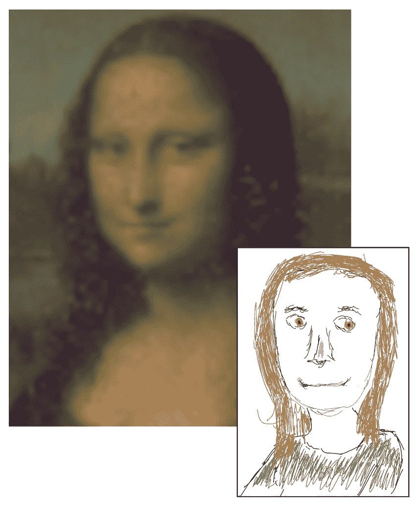
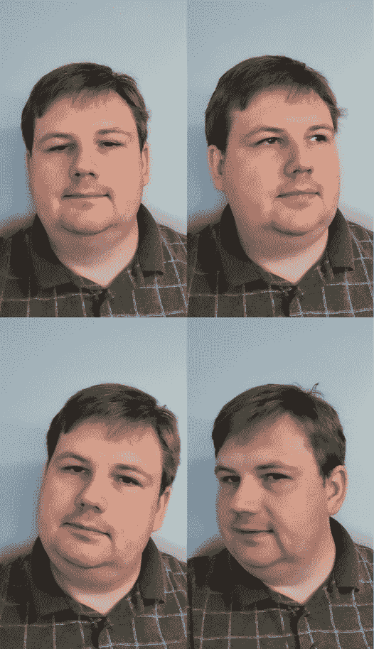
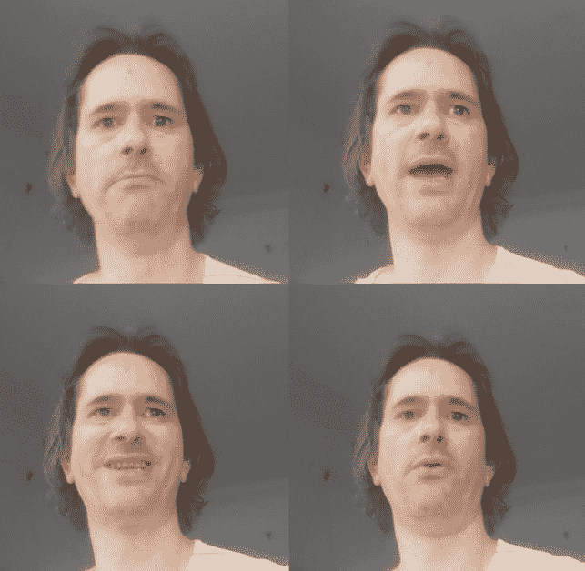

# 第三章：数据获取和处理

数据是任何 AI 任务最重要的部分，深度伪造也不例外。交换的质量受到输入数据的质量限制，选择数据是深度伪造制作者最重要的任务。虽然有一些方法可以自动化数据收集的部分，但这个过程仍然主要是手动的。

在本章中，我们将讨论数据的重要性、什么因素使数据质量好、如何获取数据以及如何改进差数据。这些技能对于深度伪造制作者至关重要，必须加以培养。本章将解释这些技能的基本原理，但它们必须通过实践来完全理解和应用。

# 上采样

我们将涵盖以下部分：

+   为什么数据很重要

+   理解多样性的价值

+   数据来源

+   提升你的数据

+   上采样

# 为什么数据很重要

神经网络通过处理已知数据来训练深度伪造 AI（见*第一章*，*调查深度伪造*，了解整个过程）。我们简单地将这组数据称为**数据集**。为了创建数据集，数据必须经过处理和准备，以便神经网络有东西可以训练。在深度伪造的情况下，我们使用人脸，需要检测、对齐和清理，以创建一个有效的数据集。

没有格式正确且准备好的数据集，神经网络就无法进行训练。对于像深度伪造这样的生成网络，还存在另一个潜在问题——质量差的数据集会导致交换效果差。不幸的是，在开始时很难知道数据集是否会生成好的交换效果。这是一种需要时间来学习的技能，而且在你学习数据的重要性时，你最初的几个深度伪造作品可能不会很好。

花在清理和管理数据上的时间是值得的。虽然深度伪造中最大的时间消耗是训练时间，但那段时间不需要创作者的输入——然而，如果你的数据有缺陷，那么这段时间将完全浪费。因此，大多数深度伪造制作者在投入长时间训练之前，会花大量时间清理和测试他们的数据。

你可能认为**分辨率**（图像中的像素数量）在你的数据集中很重要，但实际上并不是那么重要。可用的超高分辨率深度伪造非常少。视频可能是 4k、8k 甚至更高，但人脸交换将受到 AI 模型、训练计算机的能力以及可用于训练的时间的限制。在深度伪造的世界里，512x512 像素是一个非常高的分辨率，而更高的分辨率则留给最专注和技艺高超的深度伪造制作者。

这并不意味着你不能用较低的分辨率获得好的结果。一种清晰的方式来思考这种差异是**保真度**并不等同于分辨率。保真度衡量的是从原始信息中丢失了多少信息，即图像的逼真程度或真实感。想象一下一幅小缩略图，如*图 3.1*中展示的蒙娜丽莎的画像，它是一个逼真的图像，但分辨率低。在这个例子中，相反的是一位 5 岁孩子（或在这种情况下，作者之一）使用电脑上的高级绘图板绘制的蒙娜丽莎画像。这幅图像分辨率高，但保真度低。随着你的训练，你的深度伪造 AI 将提高其保真度，但分辨率将保持不变。

图 3.1 – 列奥纳多·达·芬奇的“蒙娜丽莎”，高保真但低分辨率图像（UL）；布莱恩·莱昂的“蒙娜丽莎”，高分辨率但低保真度图像（LR）

数据对你的深度伪造非常重要，而多样性是确保良好数据的最有效方式。

# 理解多样性的价值

多样性是良好数据集的最具定义性的特征。最好的数据集都将拥有大量不同的姿势、表情和照明情况，而最差的结果将来自在这些类别中缺乏多样性的数据。在本节中，我们将涵盖的一些多样性领域包括姿势、表情和照明。

## 姿势

姿势是一个简单且易于观察和理解的类别。姿势简单来说就是图像中面部方向和位置。在深度伪造中，只有面部本身的姿势很重要——身体其他部位的姿势被忽略。在深度伪造中，姿势很重要，这样 AI 才能学习到面部所有角度和方向。如果没有足够的姿势数据，AI 将难以匹配面部方向，最终导致结果不佳。

图 3.2 – 不同姿势的示例

一个快速获得完整姿势范围的方法是在被拍摄时简单地移动头部。通过向上、向下和从侧面四处张望（以及这些动作的组合），你为 AI 提供了它所需的所有方向。别忘了用高**焦距**的远摄镜头来放大面部，以及用中性焦距的特写镜头。远摄镜头对远处的面部进行“扁平化”（这种效果正确地称为**镜头压缩**），常在电影中用于戏剧效果，因此你需要匹配你数据中的这种变化。甚至像镜头畸变这样的因素也很重要，它足以影响图像，因此获取各种示例可以帮助获得高质量的数据。

## 表情

表情是另一个容易理解的方面——它是训练期间脸部形成的形状。不幸的是，很难确保你涵盖了全部范围而没有遗漏重要数据。想想一个脸部的表现力可能有多大——快乐、悲伤、愤怒、清醒、惊讶等等——然后想想在数据中错过这些表情的重要子集可能有多容易。

没有简单的方法可以确保你拥有所有需要的多样性，但越多越好。你不想只是让人坐下来，面对镜头拍一个小时，因为你不太可能得到你真正想要的全部表情。要真正获得丰富的表情多样性，你需要确保从不同日期、不同环境和不同情绪刺激中获取数据。一个演员在不同的情境或时间可能会给出截然不同的“悲伤”表情，这种多样性对于人工智能真正理解如何重现这些相同的表情非常重要。

图 3.3 – 不同表情的示例

这里的关键是尽可能多地获取不同的表情。你不可能一次性获取所有数据；如果你这么做，你的数据将会极其有限。如果你有一个优秀的演员作为目标面孔，你可能能够让他们匹配你正在交换的表情，但你可能想要获取一个更加多样化的数据集，以确保你在正确的情境中获取正确的数据。

## 照明

照明可能听起来简单且/或微不足道，但问问任何摄影师或视频制作人员，他们可以永远谈论这个话题。即使不涉及人工智能，照明照片或视频拍摄也是复杂的，但当涉及到深度伪造时，它成为一个巨大的问题。完全获得各种照明是不可能的，但有一些关键点需要考虑。

### “良好的”照明

大多数好莱坞电影都是专业照明管理的例子，整个团队致力于最简单的设置。然而，对于深度伪造的基本照明有一些很好的基本规则。

明亮的照明不能来自单一方向。这会导致眼睛、鼻子旁边以及经常是整个脸部一侧出现深阴影。即使是直接面向镜头的照明也会在边缘产生阴影（更不用说演员眯眼时可能会改变表情）。相反，你需要有良好的**环境**式照明——也就是说，从所有方向均匀照射的照明。拥有大型荧光灯的办公室可能是这种照明的良好例子（尽管灯光的颜色可能不尽如人意）。

### 阴影

然而，环境光线并不是深度伪造所需的唯一照明风格。数据集中需要一些阴影，否则 AI 将永远无法学会如何重现除了完全照亮的面部之外的其他任何东西。对于这种照明，你可以使用普通的顶灯或灯具。这将使 AI 能够捕捉到那些真正有助于将面部深度展现出来的较深阴影。

获取阴影多样性的最佳方式是在照明或主题移动的场景中，这样你就能获得大量的变化阴影，AI 可以从中学习。

### 户外

最后，你将想要获取一些户外图像。太阳在所有其他光源中特别独特。没有任何东西能够完全匹配来自数百万英里之外的燃烧等离子体的自然效果——信不信由你，距离确实很重要，因为它会导致基本上平行的光线。正因为如此，无论你在摄影棚内拍摄多少，获取至少一些户外数据都非常重要。太阳的光线是无法复制的，获取户外拍摄的数据对于补充 AI 的照明数据是必不可少的。

## 将这种多样性结合起来

考虑到多样性的所有方面是很重要的，但实际上你还需要考虑它们一起。你应该获取混合匹配所有三个方面的数据，以确保你获得最佳结果。例如，你所有的不同照明场景都应该有各种各样的表情和姿势。只有通过多样化的数据，AI 才能学会创建一个真正令人信服的深度伪造。

良好的多样性至关重要，但你怎么能实际获取所需的数据呢？

# 数据来源

如果你正在制作深度伪造，那么你可能已经知道你要替换成谁了。希望你是幸运的，正在制作一个可以轻松拍摄或收集数据的深度伪造，涉及两个人，这样你就可以在没有太多麻烦的情况下进行拍摄。不幸的是，并不是每个人都很幸运，大多数时候，你的一个或两个主题可能无法获取定制数据（这也许是你一开始制作深度伪造的原因）。

这两种情况需要非常不同的数据获取方法，有时，即使你能够很好地接触到你的主题，你也可能需要从另一个来源获取一些数据。

## 拍摄自己的数据

拍摄自己的数据源是任何深度伪造者的梦想位置。能够通过将演员置于摄像机前构建完美的数据集是一种解放，但如果你不知道如何捕捉所有需要的内容，这也会是一个浪费的机会。

作者注记

这本书的范围甚至无法触及摄影和电影所涉及的广泛词汇和技术。如果你计划大量拍摄自己的数据，强烈建议你在上片场之前阅读一些摄影或电影制作书籍，观看一些教程，并与该领域的专家交谈，以便充分利用时间。

让**电工**（负责片场照明的负责人）违背他们的所有训练，故意给你提供糟糕的照明，如果你不是专家，可能会感到害怕。告诉演员做出“更悲伤”的表情或做出极端的表情可能会同样尴尬。在拍摄深度伪造时，你需要清楚地告诉剧组，你确实需要他们的常规技能，但你还需要超越常规，进入奇怪、神秘和不舒服的领域。

虽然你可能想确保数据总是近距离拍摄，演员的脸填满整个画面，但不要害怕让脸更小或离摄像机更远；通常不是数据中脸部分辨率的问题会损害结果。

当你拍摄深度伪造时，需要考虑所有方面。即使是在拍摄要替换的视频时，也要考虑深度伪造技术的局限性。例如，侧面这样的角度面部在没有产生不自然效果的情况下特别难以替换。正因为如此，你将希望尽量减少远离摄像机轴线面部数量的最大化。它们不必直接面对摄像机，特别是如果你在训练数据中得到很多角度，但总会有一个点，事情变得过于角度化，以至于 AI 无法提供良好的结果。

一个重要的细节是，随着你技能的发展，你的深度伪造会随着实践而提高。因此，强烈建议你不要依赖你的第一个深度伪造是完美的，如果你有一个即将到来的重要项目需要深度伪造，你可能想要先创建几个练习深度伪造，这样你就可以在拍摄重要的深度伪造时获得必要的经验，以确保你能够获得高质量的数据。

## 从历史资料中获取数据

有时候，你无法拍摄你的主题——例如，如果演员已经去世，或者你正在伪造一个年轻版本的演员。在这些情况下，你无法享受制作自己的数据来满足你情况的优势。这意味着你必须依赖更早的资料来获取所有训练数据。

希望你的主题是最近的，并且有他们的视频和照片。由于周围缺乏原始内容，一些主题无法进行深度伪造——例如，阿尔伯特·爱因斯坦将永远不会制作传统的深度伪造，仅仅是因为没有必要的训练数据。在这种情况下，你最好的选择是使用一定程度的模仿者。这就是达利博物馆用来让达利复活的技术——模仿者和一些有限的艺术家视频访谈。

如果你足够幸运，你的主题有数据，你可以使用任何可用的数据，并且你不需要根据年龄或分辨率进行限制（参见*为什么数据很重要*部分关于分辨率和保真度的讨论）。相反，更多地关注获得多样性。知道在哪里停止可能是一个挑战，但通常，花在收集和管理数据上的时间是值得的。从长远来看，花在数据上的时间不太可能浪费。

电影、访谈甚至人们的随机照片都可以用作深度伪造训练数据。你不希望过度依赖其中任何一个，因为它们在领域上都非常有限。恐怖电影不太可能有很多人笑，你找到的随机照片很可能除了微笑之外什么都没有。在寻找不同类别之间的平衡，以便找到训练所需的多样性，是你必须学会的一项技能。

尤其是处理历史数据时，你经常会发现它们的质量并不像你希望的那样高，那么你如何从有限的数据中获得最大价值？

# 提升你的数据

没有银弹可以神奇地让你的数据变得更好，但有一些方法你可以调整你的数据来改善 AI 的训练。

## 线性色彩

当你拍摄时，你可能会在对数尺度（**log**）色彩下拍摄，其中尺度代表指数变化。这对于在拍摄时存储大量色彩范围非常出色，但并不适合训练深度伪造。为了从你的训练中获得最佳结果，你希望将你的视频转换为**线性**色彩空间（其中某些数字的变化是一致表示的）。这实际上并不重要，但所有你的数据和转换后的视频应该是相同的。由于大多数内容是**Rec.709**，除非你有充分的理由选择不同的色彩空间，否则我们建议你使用它。

作者注记

色彩科学是一个非常稳健的领域，全面考察超出了本书的范围。然而，基本理解可以帮助。**Rec.709**是许多所谓的**色彩空间**之一，这是计算机或电视表示色彩的方式。有许多不同的色彩空间，包括**SRGB**和**Adobe RGB**（以及其他），它们可以显示不同的颜色或以不同的方式表示它们。在深度伪造方面，重要的是在训练和转换时必须保持所有数据在同一个色彩空间。

**高动态范围**（**HDR**）内容也存在问题——至少在商业发布的内容中是这样。消费者 HDR 技术为了将颜色数据放入帧中，会丢弃大量数据。这意味着在一个场景中看起来较暗的东西实际上可能存储得比另一个场景中看起来较亮的东西还要亮。即使映射回线性范围，它也往往变化很大，这对 AI 进行泛化造成了极大的困难，通常会导致深度伪造模型的失败。处理这个问题的最好方法是避免向 AI 模型提供 HDR 内容。这可能会很复杂，因为有时你能获得的最高质量数据就是 HDR。在这种情况下，了解较低分辨率但颜色空间一致的数据将比高分辨率但颜色不一致的数据产生更好的结果是有用的。

使用 RAW 格式记录的专业相机不会像**HDR**那样有问题，因为它们保留了来自传感器的确切数据，并且完整的颜色数据仍然可用。

颜色科学很复杂，有时也不直观。成为所有细节的专家并不必要，但了解颜色空间可能引起问题时很有用。

## 数据匹配

有时候，你可能会在某个主题上对可访问的数据极为有限。在这种情况下，获得一个好的交换可能非常困难。帮助获得所需结果的一种方法是将你的数据尽可能匹配，至少在训练的部分。确保你能够访问的主题与另一个主题的数据尽可能匹配。在单个图像中匹配姿势、表情和照明非常重要。这不必是最终的转换，也不应该是你使用的唯一数据，但拥有匹配的数据有时可以帮助 AI 找到交换两个主题的细节。

在进行数据匹配时，你将希望仅对与你的数据匹配的子集进行非常短时间的训练。你的主题数据集都应该被清理到单个短段，训练应限制在不超过 100 个**周期**（一个周期是 AI 模型在所有数据上完成一次完整训练）。一旦你用那个子集完成训练，你将希望用完整的数据进行训练。你可能希望用你数据的不同子集重复这个过程几次。

# 放大

目前 AI 的一个主要趋势是在**提升**内容。这是一个 AI 的绝佳用途，它可以填补其训练中的缺失数据，特别是**时间感知提升器**，可以通过跟踪物体跨越多个帧来找到缺失数据以获得更多细节。不幸的是，当用作生成 AI（如 deepfakes）的训练数据时，提升的 AI 数据是有问题的，并且容易导致训练失败。即使是非常好的提升 AI 也有故障和伪影。这些伪影可能对肉眼难以察觉，但 deepfake AI 会寻找模式，并且经常会被伪影绊倒，导致训练失败。

通常，处理提升的最佳方式不是提升训练数据，而是提升输出。这在很多方面都更好，因为它可以同时替换缺失的面部数据并提高输出的分辨率。之所以链式 AI 不会导致失败，是因为与 deepfakes 不同，提升器不是在生成数据上训练的。

话虽如此，有很多技术可以安全地用于提升您的训练数据。更多传统或时间相关的解决方案，不涉及 AI 的，也可以用于提升而不会导致训练失败。使用**双三次**或**Lanczos**滤波进行提升也是完全可以接受的。

清理噪声或调整颜色也是可以的，并且是提高数据质量的有效方式，特别是如果提取程序无法在部分数据中找到面部时。

# 摘要

数据对于 deepfakes 至关重要，就像所有 AI 一样。获取最佳数据是一项你必须随着时间的推移来学习的技能。随着你对 deepfakes 越来越有经验，你将在这方面做得越来越好。尽管如此，一些任务可以在不大量投资于过程的情况下学习。清理和组织你的数据很重要——花在这上面的时间可以节省你以后的时间，因为你的 AI 不太可能失败。

录制自己的数据有时是必要的，并且可以给你带来最佳结果，因为这将给你足够的控制来填补缺失的数据或匹配有限的历史数据。当你只有历史数据时，你的选择更有限，可能需要进一步工作来改进你拥有的数据。提升和滤波是可能的，但你必须小心，因为一些技术可能会添加干扰训练的伪影。

最后，数据是训练 deepfake 最重要的部分，因此也是 deepfaker 最重要的工作。如果你想在创建 deepfakes 方面表现出色，你必须花时间和精力学习数据管理的技能。

在下一章中，我们将向您介绍如何使用 Faceswap – 一款免费开源的 deepfake 软件 – 以便您可以生成自己的 deepfakes。

EBSCOhost - 2023 年 11 月 27 日 6:20 AM 打印。所有使用均受[`www.ebsco.com/terms-of-use`](https://www.ebsco.com/terms-of-use)条款约束。
