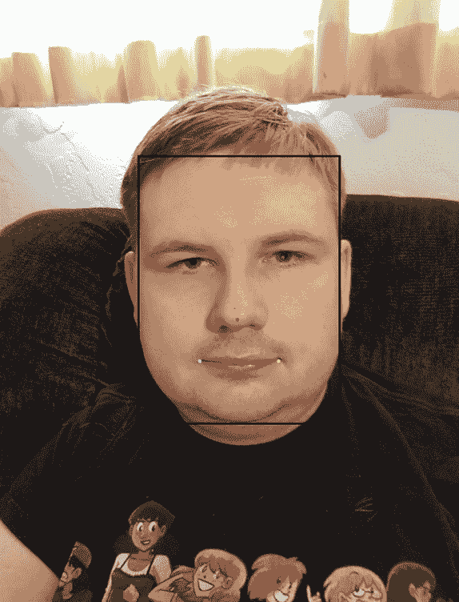
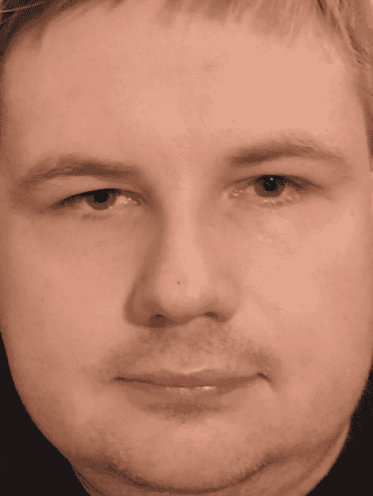
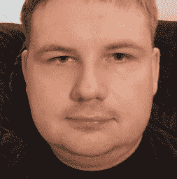
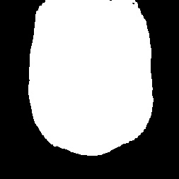
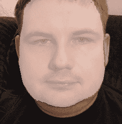

# 提取人脸

在本章中，我们将从代码入手开始我们的动手实践。首先，我们将介绍提取人脸的过程。

提取人脸是涉及许多不同阶段的过程中的一系列步骤，但它是创建 deepfake 的第一个离散阶段。本章将首先讨论如何运行人脸提取脚本，然后我们将动手编写代码，解释每个部分的作用。

在本章中，我们将涵盖以下关键部分：

+   从视频中获取图像文件

+   在帧图像上运行提取操作

+   与代码动手实践

# 技术要求

为了继续，我们建议您从 GitHub 仓库[`github.com/PacktPublishing/Exploring-Deepfakes`](https://github.com/PacktPublishing/Exploring-Deepfakes)下载代码，并按照`readme.md`文件中的说明安装 Anaconda，创建一个包含所有必需库的虚拟环境以运行脚本。该仓库还将包含自本书出版以来发生的任何勘误或更新，因此请检查那里以获取任何更新。

# 从视频中获取图像文件

视频不是为逐帧访问而设计的，如果处理顺序错误可能会导致问题。访问视频文件是一个复杂的过程，不适合像本章这样的入门级章节。因此，第一个任务是转换您想要提取的任何视频，将其转换为单独的帧。最好的方法是使用**FFmpeg**。如果您遵循了*技术要求*部分中的安装说明，您将已安装并准备好使用 FFmpeg。

让我们开始这个过程。

小贴士

当您看到代码或命令示例，例如这里用花括号括起来的文本时，您应该用括号中解释的信息替换该文本。例如，如果它说`cd {包含视频的文件夹}`，并且视频在`c:\Videos\`文件夹中，那么您应该输入`cd c:\Videos`。

将视频放入一个文件夹中，然后打开 Anaconda 提示符并输入以下命令：

```py
cd {Folder with video}
mkdir frames
ffmpeg -i {Video Filename} frames\video_frame_%05d.png
```

这将填充`frames`文件夹，其中包含带有编号的导出帧的图像。

您可以使用 FFmpeg 控制许多选项，从输出图像的分辨率到要跳过的帧数。这些功能超出了本书的范围，但已在其他地方广泛介绍。如果您打算进行比基础操作更多的操作，我们建议您搜索 FFmpeg 命令行选项的指南。

# 在帧图像上运行提取操作

要在视频上运行提取过程，您可以从克隆的`git`仓库文件夹中运行提取程序。为此，只需在 Anaconda 提示符中运行以下命令：

```py
cd {Folder of the downloaded git repo}\
python C5-face_detection.py {Folder of frame images}
```

这将在文件夹中的每个图像上运行面部提取过程，并将提取的图像放入`face_images`文件夹中，默认情况下，该文件夹位于帧图像文件夹内。该文件夹将包含每个检测到的面部的三种类型文件，以及包含所有对齐的文件。

## face_alignments.json

将只有一个这样的文件。这是一个包含在图像中找到的每个面部地标和变形矩阵的 JSON 格式文件。这个文件像任何 JSON 文件一样可读，可以读取或编辑（尽管这可能不是你手动操作的事情）。

### face_landmarks_{filename}_{face number}.png

这是对原始图像的副本，在面部周围画了一个边界框，并写出了五个**地标**点。地标是面部上的常见点。我们将在后面介绍这些地标点的用法，但我们最感兴趣的是眼睛、鼻子和嘴巴的角落。



图 5.1 – face_landmarks_bryan_0.png 示例

作者注记

本节中用于实际演示的所有人物图像均为作者本人。

## face_bbox_{filename}_{face number}.png

这张图像代表在原始图像中找到的原始**边界框**（围绕检测到的面部最小的框）。它将以图像中找到的面部的完整原始大小和角度显示。



图 5.2 – face_bbox_bryan_0.png 示例

## face_aligned_{filename}_{face number}.png

这张图像将是面部的一个较小尺寸（默认为 256x256）图像。这是一个**对齐**的面部图像，其中面部已根据地标对齐。这张图像通常应将面部置于图像中心并垂直对齐。如果边界框图像中的面部在框内歪斜或倾斜，则应在对齐图像中将其拉直。还可能有一个黑色裁剪区域，其中原始框架的边缘切断了数据。

这是最重要的图像，也是用于训练模型的图像。确保对齐的面部是高质量图像对于高质量训练至关重要。这是你想要清理以获得成功深度伪造的数据。



图 5.3 – face_aligned_bryan_0.png 示例

## face_mask_{filename}_{face number}.png

这张图像与对齐图像的大小相匹配。实际上，它在裁剪、旋转和尺寸上与对齐图像相匹配。面具是 AI 预测的面部轮廓，稍后将用于确保面部被正确训练，并帮助将最终的面部换回到图像中。



图 5.4 – face_mask_bryan_0.png 示例

遮罩应该与对齐的人脸完美对齐，显示人脸和边缘的位置。您可以在*图 5.5*中看到遮罩是如何覆盖在人脸上的。



图 5.5 – 遮罩覆盖在对齐人脸上的示例

因此，现在您已经知道了如何运行人脸检测器及其所有输出，让我们进入实践部分，确定它到底在做什么。

# 与代码实践

现在是时候进入代码部分了。我们将详细说明`C5-face_detection.py`文件的功能以及为什么选择每个选项。代码主要分为五个部分：初始化、图像准备、人脸检测、人脸标记/对齐和遮罩。

## 初始化

让我们开始吧。

作者注

为了便于在书中阅读，需要对示例中的间距进行修改。然而，Python 对空白字符敏感，并将空白字符作为语言语法的一部分使用。这意味着从本书中复制代码几乎肯定会包含错误的间距。因此，我们强烈建议您从本书的 Git 仓库[`github.com/PacktPublishing/Exploring-Deepfakes`](https://github.com/PacktPublishing/Exploring-Deepfakes)中获取代码，如果您打算运行它的话。

1.  首先，我们导入所有必需的库：

    ```py
    import os
    import torch
    import cv2
    import json_tricks
    import numpy as np
    from tqdm import tqdm
    from argparse import ArgumentParser
    from face_alignment.detection.sfd import FaceDetector
    from face_alignment import FaceAlignment, LandmarksType
    from skimage.transform._geometric import _umeyama as umeyama
    from lib.bisenet import BiSeNet
    ```

在本节中，我们导入我们将使用的重要库和函数。这些都在代码中使用，将在使用时进行解释，但熟悉任何项目的导入是一个好主意，因为它让您了解正在使用的函数及其来源。

许多这些导入来自 Python 标准库，如果您想了解更多关于它们的信息，您可以在网上找到它们的文档。我们将在我们遇到它们时解释那些不是标准库的部分，包括如何找到它们的文档。

1.  接下来，让我们暂时跳到代码的末尾，看看参数解析：

    ```py
    if __name__ == "__main__":
    """ Process images in a directory into aligned face images
    Example CLI:
    ------------
    python face_detection.py "C:/media_files/"
    """
    parser = ArgumentParser()
    parser.add_argument("path",
      help="folder of images to run detection on")
    parser.add_argument("--cpu", action="store_true",
      help="Force CPU usage")
    parser.add_argument("--size", default=256,
      help="height and width to save the face images")
    parser.add_argument("--max_detection_size", default=1024,
      help="Maximum size of an image to run detection on.
        (If you get memory errors, reduce this size)")
    parser.add_argument("--jpg", action="store_true",
      help="use JPG instead of PNG for image saving
        (not recommended due to artifacts in JPG images)")
    parser.add_argument("--min_size", default=.1,
      help="Minimum size of the face relative to image")
    parser.add_argument("--min_confidence", default=.9,
      help="Minimum confidence for the face detection")
    parser.add_argument("--export-path",
      default="$path/face_images",
      help="output folder (replaces $path with the input)"
    opt = parser.parse_args()
    opt.export_path = opt.export_path.replace('$path',opt.path)
    main(opt)
    ```

在本节中，我们定义了脚本中可用的选项。它允许您在不修改代码的情况下更改许多选项。大多数选项使用默认值即可，但 Python 标准库中的参数解析器为我们提供了一个易于使用的运行时更改这些选项的方法。参数解析器的文档和指南是标准库的一部分，所以我们将跳过基础知识，除了说明我们使用`parser.add_argument`为每个我们想要的参数添加，所有参数都放入`opt`变量中。

我们在这里做的一件特别的事情是在定义后更改`export_path`变量，将变量中的`$path`字符串替换为将输出文件夹放入输入文件夹。如果用户覆盖了默认值，则不需要替换（或者用户可以使用`$path`来指定输入文件夹中的不同子文件夹，如果需要的话）。

注意

Python 规范要求此部分位于文件末尾才能正常工作。然而，在浏览其余代码之前，至少查看此部分非常重要，以便了解它在做什么。

1.  接下来，我们返回以下代码：

    ```py
    def main(opt):
    ```

本节从我们用于执行所有实际工作的主函数开始。

1.  我们首先确保输出文件夹存在：

    ```py
    if not os.path.exists(opt.export_path):
      os.mkdir(opt.export_path)
    ```

如果不存在，这将创建输出文件夹。

1.  然后，如果可用，我们启用**图形处理单元**（**GPU**）加速：

    ```py
    device = "cuda" if torch.cuda.is_available() and not opt.cpu else "cpu"
    ```

在这部分，我们从检查 CUDA 可用性的`PyTorch`开始，并将设备变量保存以供以后使用。

1.  接下来，我们将初始化人脸检测器和对齐器：

    ```py
    face_detector = FaceDetector(device=device, verbose=False)
    face_aligner = FaceAlignment(LandmarksType._2D, device=device, verbose=False)
    ```

这段代码定义了我们将要使用的检测器和对齐器；它指定我们将使用哪些设备，并告诉对齐器使用为`2D`人脸特征点训练的模型。这些类来自[`github.com/1adrianb/face-alignment`](https://github.com/1adrianb/face-alignment)提供的`face_alignment`库。检测器和对齐器都是针对特定用途训练的 AI 模型。检测器在给定图像中找到任何人脸，并通过使用边界框返回它们的位置。对齐器接收这些检测到的人脸并找到我们可以用来将人脸对齐到已知位置的标记点。

1.  接下来，我们定义我们的掩码器并准备它。我们加载预训练的权重，并设置它使用 CUDA（如果启用了 NVIDIA 支持）：

    ```py
    masker = BiSeNet(n_classes=19)
    if device == "cuda":
      masker.cuda()
    model_path = os.path.join(".", "binaries",
      "BiSeNet.pth")
    masker.load_state_dict(torch.load(model_path))
    masker.eval()
    desired_segments = [1, 2, 3, 4, 5, 6, 10, 12, 13]
    ```

我们使用`desired_segments`变量来定义我们想要使用哪些掩码器段。在我们的当前掩码器中，这给我们提供了人脸本身，并丢弃背景、头发和衣服，以便我们的模型只需要学习我们想要交换的信息。

1.  最后，我们获取输入文件夹中的文件列表：

    ```py
    alignment_data = {}
    list_of_images_in_dir = [ file for file in os.listdir(opt.path) if os.path.isfile(os.path.join(opt.path,file)) ]
    ```

这段代码首先准备一个空字典来存储对齐数据。这个字典将存储我们想要存储和与我们将要使用的面部数据一起保存的所有数据。

接下来，它将获取文件夹中所有文件的列表。这假设每个文件是我们想要从中导入人脸的图像。如果有任何非图像文件，它将失败，因此重要的是将额外文件保持在文件夹外。

接下来，列出目录中的文件并检查它们是否为文件，在将它们存储在列表中之前。

## 图像准备

图像准备是下一步。

1.  这加载图像并使它们准备好由其他工具处理：

    ```py
    for file in tqdm(list_of_images_in_dir):
      filename, extension = os.path.splitext(file)
    ```

这是一个循环的开始，它将遍历目录中的每个文件以处理它们。`tqdm`库创建了一个易于阅读的状态栏，包括预测处理过程将花费多长时间。这一行足以了解基础知识，但它还能提供更多功能。您可以在[`github.com/tqdm/tqdm#documentation`](https://github.com/tqdm/tqdm#documentation)查看完整文档。

1.  接下来，我们加载图像并将其转换为 RGB 颜色顺序：

    ```py
    image_bgr = cv2.imread(os.path.join(opt.path,file))
    image_rgb = cv2.cvtColor(image_bgr, cv2.COLOR_BGR2RGB)
    height, width, channels = image_rgb.shape
    ```

OpenCV 是一个用于操作图像的工具库。您可以在[`docs.opencv.org/`](https://docs.opencv.org/)找到它的文档。在这段代码中，我们使用它来打开图像并处理各种图像任务，我们将随着任务的展开进行解释。

OpenCV 以**蓝、绿、红**（**BGR**）的顺序加载图像，这是不寻常的，因此我们必须将其转换为**红、绿、蓝**（**RGB**）的顺序，以便后续处理，因为其他库期望文件以该颜色顺序。如果我们不转换，所有颜色都会错位，许多工具将提供错误的结果。

然后我们获取图像的形状；这将给我们图像的高度和宽度，以及颜色通道的数量（由于我们以彩色图像加载，这将会有三个）。

1.  接下来，我们需要检查是否需要调整图像的大小：

    ```py
    adjustment = opt.max_detection_size / max(height, width)
    if adjustment < 1.0:
      resized_image = cv2.resize(image_rgb, None, fx=adjustment, fy=adjustment)
    else:
      resized_image = image_rgb
      adjustment = 1.0
    ```

当您通过 AI 模型运行图像时，图像的尺寸可以极大地改变使用的内存量。如果它超过了 AI 可用的内存，这可能会导致错误。在这段代码中，我们正在从选项中获取最大尺寸，然后找到我们需要调整以将图像调整到最大尺寸并跟踪该变化，以便可以将面部检测器的结果恢复到在原始图像上工作。这个过程允许我们使用较小的图像进行面部检测 AI，同时仍然使用全尺寸图像中的面部，从而提供最佳分辨率和细节。

## 面部检测

现在是时候检测图像中的面部了。这个过程会遍历每一张图像以检测任何面部。

1.  首先，我们检查调整大小后的图像中是否有任何面部：

    ```py
    faces = face_detector.detect_from_image(resized_image)
    ```

这运行面部检测器以在图像中找到任何面部。该库使这个过程变得非常简单。我们发送调整大小后的图像，并返回一个包含找到的所有面部及其边界框的列表。这些框都是相对于较小的调整大小后的图像的，以确保我们有足够的内存来处理它。

1.  接下来，我们将遍历每个面部：

    ```py
    for idx, face in enumerate(faces):
      top,left,bottom,right = (face[0:4] /
        adjustment).astype(int)
      confidence = face[4]
      if confidence < opt.min_confidence:
        Continue
    ```

作为循环的输入，我们使用内置的 Python 函数`enumerate`，它为我们提供了找到的每个面部的计数。我们使用这个数字来稍后通过编号识别面部。然后，我们提取边界框的大小并将其除以调整大小。这会将检测到的面部边界框恢复到与原始图像匹配，而不是较小的调整大小后的图像。我们将调整后的面部检测存储在变量中，并将它们四舍五入到整数，以便我们可以将其与单个像素对齐。

接下来，使用面部检测 AI 的置信度水平跳过任何低于置信度水平的面部，该置信度水平已在选项中设置。

小贴士

面部检测 AI 的置信度从`0`（无面部）到`1`（绝对确定有面部）。大多数 AI 使用`0`到`1`的范围，因为对于 AI 来说，处理已知范围更容易。如果您在进行 AI 工作时得到您不期望的结果，您可能想要检查它是否已被限制在`0`到`1`的范围内。

1.  接下来，我们确保面部足够大以便使用：

    ```py
    face_height = bottom - top
    face_width = right – left
    face_size = face_height * face_width
    if face_size/(height*width) < opt.min_size:
      continue
    ```

此代码找到面部的高度和宽度，然后使用这些信息来找到整个面部的大小，并将其与最小面部大小进行比较，跳过任何太小的人脸。它使用原始帧的大小来更容易地过滤掉不是主要焦点的面部。这个值设置得比较低，但如果在单张图像中有许多面部，例如在人群场景中，这可能很有用。

1.  接下来，我们将边界框作为图像输出：

    ```py
    detected_face = image_bgr[y1:y2,x1:x2]
    cv2.imwrite(os.path.join( opt.export_path,
                  f"face_bbox_{filename}_{fn}.png"),
                detected_face)
    ```

此代码创建一个只包含图像中适合面部边界框的部分的图像，并将其保存为输出文件夹中的`.png`文件。这可以让您看到检测到的面部；然而，这实际上对于任何后续步骤都不是必需的，因此如果您不想保存这些数据，可以将其删除。

## 面部关键点定位/对齐

下一步是检测面部关键点并将它们对齐到已知位置。

1.  首先，我们将获取对齐：

    ```py
    landmarks = face_aligner.get_landmarks_from_image(
      image_rgb, detected_faces = [face[0:4]/adjustment])
    ```

在这里，我们使用与面部检测相同的库，传递完整的图像和调整后的边界框，以获取面部关键点。该库返回 68 个关键点位置，这些位置基于面部上的特定点。

1.  接下来，我们画一个框：

    ```py
    landmark_image = image_bgr.copy()
    landmark_image = cv2.rectangle(landmark_image,
      (top, left), (bottom, right), thickness=10,
      color=(0, 0, 0))
    ```

在这里，我们以 BGR 颜色格式生成原始图像的新副本，这样我们就可以在不损坏原始副本的情况下在图像上绘制。然后我们使用 OpenCV 绘制一个检测到的面部的矩形。其`厚度`设置为`10`像素，用黑色绘制。

1.  接下来，我们创建用于对齐的关键点：

    ```py
    right_eye = np.mean(landmarks[0][36:42],axis=0)
    left_eye = np.mean(landmarks[0][42:48],axis=0)
    nose_tip = landmarks[0][30]
    right_mouth = landmarks[0][48]
    left_mouth = landmarks[0][54]
    limited_landmarks = np.stack(
      (right_eye,
       left_eye,
       nose_tip,
       right_mouth,
       left_mouth))
    ```

在此代码中，我们将 68 个关键点拆分到只有 5 个。我们使用每个眼睛周围的关键点的平均值来找到平均眼睛位置，然后获取鼻尖和嘴角的拐角，并将它们保存到一个新的数组中。这个减少的关键点集有助于保持对齐的一致性，因为 68 个关键点包含大量的噪声边缘点。

1.  接下来，我们将绘制关键点到图像上：

    ```py
    landmark_image = cv2.rectangle(landmark_image,
      (x1,y1), (x2,y2), thickness=10, color=(0,0,0))
    colors = [[255,0,0], # Blue
              [0,255,0], # Green
              [0,0,255], # Red
              [255,255,0], # Cyan
              [0,255,255]] # Yellow
    for count, landmark in enumerate(limited_landmarks):
      landmark_adjusted = landmark.astype(int)
      landmark_image = cv2.circle(landmark_image,  tuple(landmark_adjusted), radius=10,
      thickness=-1, color=colors[count])
    cv2.imwrite(os.path.join(opt.export_path,
                  f"face_landmarks_{filename}_{idx}.png",
                landmark_image)
    ```

在这里，我们定义一组颜色，然后使用这些颜色为每个关键点位置绘制单独的点。我们将它们保存为输出文件夹中的`.png`图像文件。这些图像用于演示和调试目的，并且以后从未使用过，因此如果您不需要这些调试图像，可以删除它们（以及这个保存调用）。

1.  接下来，我们定义平均面部：

    ```py
    MEAN_FACE = np.array([[0.25, 0.22],
                          [0.75, 0.22],
                          [0.50, 0.51],
                          [0.26, 0.78],
                          [0.74, 0.78]])
    ```

在这里，我们定义另一个数组；这是基于不同关键点的平均面部位置。我们在下一部分中使用它来对齐图像。这些数字基于我们希望面部所在的位置，但可以是任何可以在面部可靠检测到的数字。

1.  接下来，我们生成用于对齐面部的转换矩阵：

    ```py
    warp_matrix = umeyama(limited_landmarks,
      MEAN_FACE * (opt.size*.6)+(opt.size*.2), True)
    ```

这部分内容有点复杂，所以我们将在这里深入探讨。我们使用 Shinji Umeyama 创建的两个点集对齐算法，该算法在`SciKit-Image`库中实现。这个过程需要两组点，一组是已知集（在本例中为`MEAN_FACE`，我们之前定义过）和另一组未知集（在本例中为`limited_landmarks`中保存的五个标记点），并将它们对齐。接下来，我们将标记点乘以我们想要图像最终大小的尺寸，并在人脸周围添加边框，以便人脸居中，边缘周围有额外空间。

`umeyama`算法创建一个矩阵，我们将其保存为`warp_matrix`，该矩阵编码了创建对齐人脸所需的平移。

1.  接下来，我们将标记点和`warp_matrix`添加到对齐数据列表中：

    ```py
    alignment_data[file] = {"landmark": landmarks,
                            "warp_matrix": warp_matrix}
    ```

1.  最后，我们创建并写入对齐的人脸图像：

    ```py
    aligned_face = image_bgr.copy()
    aligned_face = cv2.warpAffine(aligned_face,
      warp_matrix[:2], (opt.size,opt.size))
    cv2.imwrite(os.path.join(opt.export_path,
                  f"face_aligned_{filename}_{idx}.png"),
                aligned_face)
    ```

在这里，代码创建原始图像的新副本，然后使用 OpenCV 库中的`warpAffine`函数应用由`umeyama`算法生成的`warp_matrix`。该矩阵包括所有信息——平移（将图像左右或上下移动）、缩放（调整大小以适应）和旋转——以将人脸与预定义的标记点对齐。最后，它将新对齐的图像保存为文件。

小贴士

虽然 OpenCV 在 BGR 颜色顺序中处理所有图像过程，但对于不依赖于颜色顺序的任务，例如这里的`cv2.warpAffine()`步骤，是可以的。如果你忽略颜色顺序，你必须小心，因为很容易忘记你正在使用哪种颜色顺序，这可能导致颜色完全错误的复杂错误。在这种情况下，由于下一步将是使用`cv2.imwrite()`将图像写入文件，我们可以使用 BGR 颜色顺序的图像。

1.  接下来，我们保存稍后用于重建图像所需的数据：

    ```py
    if file not in alignment_data.keys():
      alignment_data[file] = {"faces": list()}
      alignment_data[file]['faces'].append({
        "landmark": landmarks,"warp_matrix": warp_matrix})
    ```

我们将标记点和变换矩阵保存到字典中，稍后我们将将其保存为 JSON 文件。这些信息对于后续处理步骤非常重要，因此我们必须确保保存它。

1.  接下来，我们将创建一个遮罩图像：

    ```py
    mask_face = cv2.resize(aligned_face, (512, 512))
    mask_face = torch.tensor(mask_face,
      device=device).unsqueeze(0)
    mask_face = mask_face.permute(0, 3, 1, 2) / 255
    if device == "cuda":
      mask_face.cuda()
    segments = masker(mask_face)[0]
    ```

遮罩器是另一个对所提供图像有特定要求的 AI。为了满足这些要求，我们首先必须以某种方式处理人脸图像。首先，遮罩器 AI 期望图像大小为 512x512 像素。由于我们的对齐人脸可能大小不同，我们需要创建一个图像副本，使其大小符合预期的 512x512 像素。

我们将其转换为`PyTorch`张量而不是`Numpy`数组，然后对张量进行`unsqueeze`操作。这添加了一个额外的维度，因为遮罩器在包含一个或多个图像的数组上工作；尽管我们只提供给它一个，我们仍然需要提供包含我们的单个图像的额外维度，以匹配预期的形状。

接下来，masker 期望通道的顺序与我们不同。为此，我们将数组`permute`到正确的顺序。此外，传统上图像存储在`0`-`255`的范围内，这允许每个单独的颜色有`256`种变化，但 masker 期望图像颜色为 0-1 范围内的浮点数。我们通过`255`来除以范围，以获得预期的范围。

接下来，如果启用了 NVIDIA 支持，我们将图像转换为 CUDA 变量，这将其转换为 GPU 也可以使用的格式，并处理将其移动到 GPU。

最后，我们在准备好的图像上运行 masker AI，并将掩码输出保存到新的变量中。masker 输出多个信息数组，但现在对我们有用的只有第一个数组，所以我们只保存这一个，并丢弃所有其他数组。

1.  接下来，我们处理 masker 输出并将其保存到图像文件中：

    ```py
    segments = torch.softmax(segments, dim=1)
    segments = torch.nn.functional.interpolate(segments,
      size=(256, 256),
      mode="bicubic",
      align_corners=False)
    mask = torch.where( torch.sum(
        segments[:,desired_segments,:,:], dim=1) > .7,
      255, 0)[0]
    mask = mask.cpu().numpy()
    cv2.imwrite(os.path.join(opt.export_path,
                  f"face_mask_{filename}_{idx}.png"),
                mask)
    ```

现在 masker 的结果已经返回，我们仍然需要对其进行处理以获得有用的信息。首先，我们使用`softmax`将结果从绝对值转换为相对值。这使得我们可以将掩码视为一个数组，其中每个像素属于特定类别的可能性，而不是模型中的原始值。

接下来，我们使用`interpolate`，这是一个`Pytorch`方法，将数据调整回原始人脸图像大小。我们必须这样做，因为像输入一样，masker 模型的输出是 512x512。我们使用`bicubic`因为它给出了最平滑的结果，但也可以选择其他选项。

接下来，我们使用`sum`和`where`将值设置为`255`或`0`。我们还使用`desired_segments`来移除对我们无用的片段。在这里，我们使用`.7`作为阈值，所以如果我们有 70%的把握认为某个像素应该包含在掩码中，我们就保留它，但如果低于那个 70%的截止值，我们就将该像素丢弃。

接下来，我们将数据移回 CPU（如果它已经在 CPU 上，则没有任何变化）并将其转换为`Numpy`数组。

最后，我们将掩码图像保存为`.png`文件，以便以后使用。

1.  整个提取过程的最后一步是将对齐数据写入文件：

    ```py
    with open(os.path.join(opt.export_path,
      f"face_alignments.json", "w") as alignment_file:
      alignment_file.write(
        json_tricks.dumps(alignment_data, indent=4))
    ```

一旦每个图像都经过处理，文件的最后一步是保存包含所有地标数据的文件，以供以后使用。在这里，我们使用`json_tricks`库，该库有一些将`Numpy`数组写入 JSON 文件的有用功能。该库处理写入和读取 JSON 文件作为`Numpy`数组的一切，因此我们可以简单地传递完整的`dictionary`数组，而无需手动将它们转换为列表或其他 Python 标准库 JSON 可以处理的其他默认 Python 类型。有关完整文档，请访问他们的文档页面[`json-tricks.readthedocs.io/en/latest/`](https://json-tricks.readthedocs.io/en/latest/)。

到目前为止，我们已经从一个充满图像的文件夹中提取了所有面部。我们运行了多个 AI 来获取所需的数据，并将所有这些数据格式化以供以后使用。这些数据现在已准备好进行训练，这将在下一章中介绍。

# 摘要

提取是训练过程的第一步。在本章中，我们检查了后续步骤中需要的数据以及从源图像中提取所需训练数据的过程。我们亲自动手处理这个过程，使用多个 AI 来检测和标记面部并生成掩码，以及处理和保存这些数据的必要步骤。

`C5-face_detection.py` 文件可以处理一个图像目录。因此，我们介绍了如何将视频转换为图像目录以及如何通过脚本处理该目录。该脚本创建了你需要的所有训练文件，以及一些有趣的调试图像，这些图像让你可以可视化检测器处理图像时使用的每个过程。然后我们逐行检查整个过程，以便我们确切地知道脚本内部发生了什么，不仅学习了输出内容，而且确切地了解了输出是如何产生的。

在完成检测过程后，你可以进行数据清理，如第*3 章*中所述的*掌握数据*，以确保你的数据为下一章的主题：训练做好准备。

# 练习

1.  我们使用了现有的库来进行面部检测、地标标记和地标对齐。还有其他提供类似功能的库。并非所有库的工作方式都相同，实现这些差异是一项极其有用的练习。尝试用其他检测面部库替换 `face_alignment` 库，例如 [`github.com/timesler/facenet-pytorch`](https://github.com/timesler/facenet-pytorch) 或 [`github.com/serengil/deepface`](https://github.com/serengil/deepface)。开源有很多有用的库，但学习它们之间的差异以及何时使用一个而不是另一个可能很困难，而在这之间进行转换可能是一种有用的实践。

1.  在本章中，我们使用了 `2D` 地标进行对齐，但可能需要 `3D` 地标。尝试替换以下内容：

    ```py
    face_aligner = FaceAlignment(LandmarksType._2D,
      device=device, verbose=False)
    ```

with:

```py
face_aligner = FaceAlignment(LandmarksType._3D,
  device=device, verbose=False)
```

并相应地调整其余过程。你还需要修改 `MEAN_FACE` 以考虑第三维。

`3D` 地标还包含哪些问题？使用它们你能得到什么好处？

1.  在深度伪造中，我们最感兴趣的是人脸，因此这个过程使用专门针对人脸的技术。想象一下你需要做些什么来提取不同物体的图像。例如，手表、帽子或太阳镜。在[`github.com/ultralytics/yolov5`](https://github.com/ultralytics/yolov5)的仓库中有一个预训练的模型，可以检测数百种不同的物体。尝试提取人脸以外的不同物体。特别思考如何进行对齐：你能利用边缘检测或颜色模式来找到可以对其对齐的点吗？

1.  Umeyama 的方法将与其对齐的每个点视为同等重要，但如果你尝试与所有 68 个地标点对齐而不是仅仅的`5`个点，会发生什么？如果是 2 个点呢？你能找到一个更好的方法吗？一个更快的方法？一个更准确的方法吗？尝试修改脚本以输出`face_landmarks` `.png`文件中的所有 68 个地标点，这样你可以可视化这个过程。

EBSCOhost - 2023 年 11 月 27 日早上 6:20 打印。所有使用均受[`www.ebsco.com/terms-of-use`](https://www.ebsco.com/terms-of-use)条款约束。
