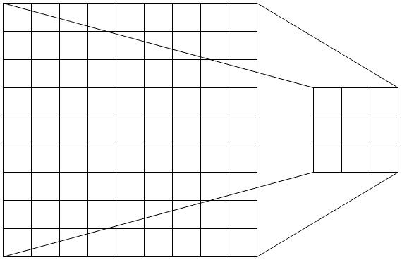
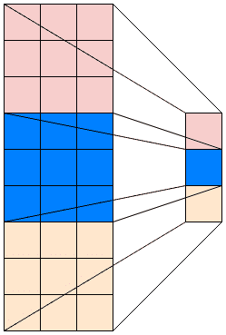
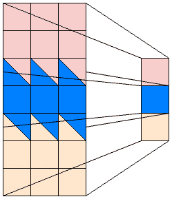
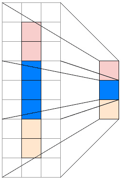
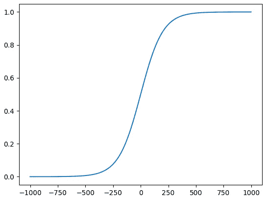

# 训练 Deepfake 模型

训练 deepfake 模型是创建 deepfake 最重要的部分。这是 AI 从你的数据中学习面部的地方，也是最有趣的神经网络操作发生的地方。

在本章中，我们将深入研究训练代码以及实际创建 AI 模型的代码。我们将查看神经网络子模块以及它们如何组合成一个完整的神经网络。然后我们将介绍训练网络所需的一切，最终得到一个可以交换两个面部图像的模型。

本章我们将涵盖以下主题：

+   理解卷积层

+   亲身体验 AI

+   探索训练代码

到本章结束时，我们将设计我们的神经网络，并构建一个能够教会它们交换面部图像的训练管道。

# 技术要求

要运行本章中的任何代码，我们建议您下载我们的官方仓库[`github.com/PacktPublishing/Exploring-Deepfakes`](https://github.com/PacktPublishing/Exploring-Deepfakes)，并按照设置 Anaconda 环境所需的库的说明进行操作。

为了进行训练，你必须拥有两组提取的面部图像。你需要将这两组图像都输入到模型中，它将分别学习这两张脸。确保你为这两张脸都获得了足够的数据，并且种类丰富是很重要的。如果你有疑问，请查阅*第三章*，*掌握数据*，以获取获取最佳数据的建议。

# 理解卷积层

在本章中，我们将最终深入探讨深伪影背后的神经网络的核心。这些网络如何工作的很大一部分是一个称为卷积层的技术。这些层在有效处理图像数据方面极为重要，并且是大多数神经网络的重要基石。

**卷积**是一种改变物体形状的操作。在神经网络的情况下，我们使用**卷积层**，它在一个矩阵上迭代卷积并创建一个新的（通常是较小的）输出矩阵。卷积是一种在同时搜索模式的同时减小图像尺寸的方法。你堆叠的卷积层越多，从原始图像中可以编码的复杂模式就越多。



图 6.1 – 一个卷积缩小完整图像的示例

定义卷积层有几个细节。第一个是维度。在我们的例子中，我们使用 2D 卷积，它在 2D 空间中工作。这意味着卷积在每个通道的 x 和 y 轴上操作。这意味着对于第一次卷积，每个颜色通道都是单独处理的。

接下来是**内核**，它定义了每个卷积考虑的区域大小。内核的数量也会影响输出。例如，如果你有一个 3x9 的矩阵和 3x3 的内核大小，你会得到一个 1x3 的矩阵输出。



图 6.2 – 将 3x9 转换为 1x3 矩阵输出的 3x3 卷积过程的示例

接下来是**步长**，它定义了卷积在矩阵中移动时每次迭代的步长大小。例如，步长为 2 会使我们的 3x3 内核重叠矩阵的一个**条目**。步长在每个维度上都是重复的，所以如果你将示例输入矩阵向左或向右扩展，你也会得到那个方向的重叠。



图 6.3 – 步长小于内核大小导致输出之间的元素共享的示例

最后是`padding_mode`，你可以指定不同的填充类型，例如反射，这将使填充等于它沿填充轴反射的条目，就像输入矩阵边缘的镜子，将每个条目反射回来。



图 6.4 – 将 1x7 填充为 3x9 的示例，在卷积到 1x3 之前

我们堆叠多个卷积层，因为我们正在寻找更大的模式。为了找到所有适当的模式，我们在添加到塔中时增加卷积层的深度。我们从一个有 128 个内核的卷积开始，然后增加到 256、512，最后到 1,024。每一层也有 5 个内核大小、2 个步长和 2 个填充。这有效地将每一层的宽度和高度减半。因此，第一层接收一个 3x64x64 的图像，并输出一个 128x32x32 的矩阵。下一层将其转换为 256x16x16，然后是 512x8x8，最后是 1024x4x4。

接下来，我们将最终深入到 deepfakes 的核心代码——神经网络本身。

小贴士

跟踪卷积层如何改变矩阵的大小可能会令人困惑。计算输出矩阵大小的公式实际上相当简单，但不太直观：`(input_size+2*padding-stride+1)/2`。如果你有正方形矩阵，这个计算将适用于任何维度，但如果你有非正方形矩阵，你必须分别计算这两个维度。

# 亲身体验 AI

我们将首先检查的代码是实际的模型本身。这段代码定义了神经网络的结构以及如何调用它。所有这些都被存储在`lib/models.py`库文件中。

首先，我们加载我们使用的任何库：

```py
import torch
from torch import nn
```

在这种情况下，我们只导入了 PyTorch 及其`nn`子模块。这是因为我们只在这个文件中包含了模型代码，而任何其他库都将调用使用这些函数的文件。

## 定义我们的上采样器

我们模型最重要的部分之一是上采样层。因为这个在上采样器和解码器中都被多次使用，所以我们将其独立出来定义，我们将在下面介绍：

1.  首先，我们定义我们的类：

    ```py
    class Upscale(nn.Module):
      """ Upscale block to double the width/height from depth. """
      def __init__(self, size):
        super().__init__()
    ```

注意，像我们的编码器一样，它继承自`nn.Module`。这意味着我们必须在这个类的初始化中调用父类的初始化。这使我们的类从 PyTorch 获得了许多有用的能力，包括使神经网络工作的反向传播算法。

1.  接下来，我们定义我们的层：

    ```py
    self.conv = nn.Conv2d(size * 2, size * 2 * 2, kernel_size=3,
      padding="same")
    self.shuffle = nn.PixelShuffle(2)
    ```

上采样器只使用两层。第一层是一个卷积层，其输入大小是初始化函数的两倍。我们这样做是因为上采样类接受一个输出大小，并且由于它通过减半深度来增加宽度和高度，它需要输入深度是输出深度的一半。在这种情况下，填充是`same`而不是一个数字。这是一种特殊的方法，使`nn.Conv2d`层输出与输入具有相同宽度和高度的矩阵。对于`3`的核大小，这会创建一个`1`的填充。

`nn.PixelShuffle`是一个层，它接受一个输入矩阵，通过移动条目，将深度层转换为宽度和高度。与前面的卷积层一起，这有效地以可学习和有效的方式“上采样”了图像。我们传递`2`，因为我们希望它将宽度和高度加倍。其他数字可以用于不同的缩放因子，但需要调整卷积层和调用该类的模型。

1.  最后，我们有了我们的前向函数：

    ```py
    def forward(self, x):
      """ Upscale forward pass """
      x = self.conv(x)
      x = self.shuffle(x)
      return x
    ```

这个前向函数只是接受输入，然后通过卷积层和`PixelShuffle`层运行它，然后返回结果。

## 创建编码器

接下来，让我们创建编码器：

1.  首先，我们声明编码器类：

    ```py
    class OriginalEncoder(nn.Module):
        """ Face swapping encoder
        Shared to create encodings for both the faces
        """
    ```

在这里，我们定义了编码器并提供了一段简短的注释。我们将其声明为`nn.Module`类的子类。这使我们的类从 PyTorch 获得了许多有用的能力，包括使神经网络工作的反向传播算法。

作者注记

在这本书中，我们只包括了基本的、原始模型。这是第一个深度伪造模型，几乎在各个方面都被超越，但它很容易理解，所以它非常适合这本书。如果您想探索其他模型，我们建议您查看[`Faceswap.dev`](https://Faceswap.dev)上的 Faceswap，它不断更新最新的模型。

1.  接下来，我们将定义初始化函数：

    ```py
    def __init__(self):
      super().__init__()
    ```

这个函数实际上是构建神经网络层的函数。每个层都在这个函数中定义，以便 PyTorch 可以自动处理权重的细节。我们还调用了父类的`__init__`函数，以准备任何必要的变量或功能。

1.  接下来，我们将开始定义我们的激活函数：

    ```py
    self.activation = nn.LeakyReLU(.1)
    ```

我们使用`LeakyReLU`或**Leaky Rectified Linear Unit**作为我们模型的**激活函数**。激活函数接收一个层的输出并将其带入一个标准化的范围。

如果从后往前分解 Leaky Rectified Linear Unit 的单词，*Leaky Rectified Linear Unit*是什么就很容易理解。*Unit*在这里意味着与函数相同；它接收一个输入并提供一个输出。*Linear*意味着一条线，它在移动时不会改变方向；在这种情况下，它是一个 1:1 的关系，输出与输入匹配（输入为 1 导致输出为 1，输入为 2 导致输出为 2，依此类推）。*Rectified*只是意味着它已经被转换为正数，所以负数变成了 0。*Leaky*实际上使最后一句话有点误导。研究发现，当整个负空间变成 0 时，神经网络实际上工作得并不好。所以这里的 leaky 实际上意味着负数会被缩放到一个几乎低于 0 的范围。

我们在这里使用 0.1，这样任何小于 0 的数字都会乘以 0.1，将其缩小 10 倍。这里可以使用许多不同的值，不同的项目会做出不同的决定。标准值通常位于 0.005 到 0.2 的范围内。

1.  接下来，我们将定义我们的卷积塔：

    ```py
    self.conv_tower = nn.Sequential(
      nn.Conv2d(3, 128, kernel_size=5, stride=2, padding=2),
      self.activation,
      nn.Conv2d(128, 256, kernel_size=5, stride=2, padding=2),
      self.activation,
      nn.Conv2d(256, 512, kernel_size=5, stride=2, padding=2),
      self.activation,
      nn.Conv2d(512, 1024, kernel_size=5, stride=2, padding=2),
      self.activation)
    ```

卷积塔正如其名，是一系列卷积层的堆叠。在每个卷积层之后，我们都包含一个激活函数。这有助于确保模型保持正确的方向，并使卷积更有效。每个情况下的激活都是相同的，并不进行任何“学习”，只是作为一个函数工作，因此我们不需要为每个单独的层创建单独的层，可以使用我们已初始化的相同激活函数。

我们在这里使用`nn.Sequential`来将层堆叠组合成一个单一的层。在 PyTorch 中，序列层实际上是一个非常强大的工具，允许你创建简单的神经网络，而无需为模型编写整个类。我们在这里使用它来组合所有的卷积层，因为每个情况中输入的一端都会穿过所有层。这使得在后续的`forward`函数中使用它更容易。但序列模型会按顺序运行其构成层，并且无法处理条件`if`语句或为 PyTorch 编写的函数。

1.  接下来，我们将定义一个`flatten`层：

    ```py
    self.flatten = nn.Flatten()
    ```

`flatten`层正是其名称所描述的那样；它将前一个层展平到只有一个轴。这在正向传播中用于将卷积塔产生的 1024x4x4 矩阵转换成一个 4,096 个元素的宽单维度层。

1.  接下来，我们将定义我们的密集层：

    ```py
    self.dense1 = nn.Linear(4 * 4 * 1024, 1024)
    self.dense2 = nn.Linear(1024, 4 * 4 * 1024)
    ```

密集层被称为密集层，因为它们是完全连接的。与卷积层不同，矩阵中的每个条目都与前一层的每个输入相连。密集层是原始神经网络层类型，非常强大，但它们也非常占用内存。实际上，这两个层占用了整个深度伪造模型的大部分内存！

我们生成了两个独立的密集层。第一层接受 4,096 个条目的输入并输出一个 1,024 列宽的输出。这是模型的**瓶颈**：模型中数据最少的部分，然后需要重建。第二层接受一个 1,024 维的矩阵输入并输出一个具有 4,096 维的矩阵。这是第一个开始从编码细节重建面部的层。

1.  最后的初始化步骤是定义我们的第一个上采样层：

    ```py
    self.upscale = Upscale(512)
    ```

这一层是我们的第一个上采样器。这一层将接受一个 1024x4x4 的矩阵并将其上采样回 512x8x8 矩阵。所有其他上采样器都将存在于解码器中。这个上采样器最初被放在编码器中，可能是因为作为一个节省内存的尝试，因为第一次上采样很可能根本不需要匹配特定的人，因为它只有最一般的面部模式。

上采样层被赋予了一个输出大小为 512。这意味着输出将深度为 512，但没有定义宽度或高度。这些自然地从输入中得出，每次调用上采样都会使宽度和高度加倍。

1.  接下来，我们将回顾我们的前向函数：

    ```py
    def forward(self, x):
      """ Encoder forward pass """
    ```

前向函数是实际将网络应用于给定矩阵的操作。这既用于训练，也用于训练模型的推理。

1.  首先，我们获取批大小：

    ```py
    batch_size = x.shape[0]
    ```

我们需要在后续过程中保存我们开始的批大小，所以我们立即保存它。

1.  最后，我们将数据通过整个模型：

    ```py
    x = self.conv_tower(x)
    x = self.flatten(x)
    x = self.dense1(x)
    x = self.dense2(x)
    x = torch.reshape(x, [batch_size, 1024, 4, 4])
    x = self.upscale(x)
    x = self.activation(x)
    return x
    ```

在这段代码中，我们依次将输入矩阵通过每一层。这里唯一的惊喜是在最后的`dense`之后调用的`torch.reshape`，这实际上是第一层`dense`之前`flatten`调用的反操作。它将 4096 列宽的矩阵改变形状，使其再次成为 1024x4x4 矩阵。

然后，我们在返回结果之前，将数据通过上采样层和激活函数。

## 构建解码器

解码器负责接收编码的面部数据并尽可能准确地重新创建一个面部。为此，它将遍历成千上万甚至数百万个面部，以更好地将编码转换为面部。同时，编码器也将变得擅长编码面部。

我们在这里使用了复数的“decoders”，但实际上这段代码只定义了一个单一的解码器。这是因为训练代码创建了该解码器类的两个副本。

1.  首先，我们定义并初始化我们的模型：

    ```py
    class OriginalDecoder(nn.Module):
      """ Face swapping decoder
      An instance for each face to decode the shared encodings.
      """
      def __init__(self):
        super().__init__()
    ```

这段代码，就像编码器和上采样器一样，是`nn.Module`的一个实例，需要一个初始化函数，该函数也会调用父类的初始化器。

1.  接下来，我们定义我们的激活函数：

    ```py
    self.activation = nn.LeakyReLU(.1)
    ```

就像我们的编码器的激活一样，我们使用 `LeakeReLu` 并带有 `0.1` 的负缩放。

1.  接下来，我们定义我们的上采样塔：

    ```py
    self.upscale_tower = nn.Sequential(Upscale(256),
      self.activation,
      Upscale(128),
      self.activation,
      Upscale(64),
      self.activation)
    ```

上采样塔与编码器的卷积塔非常相似，但使用上采样块而不是缩小卷积。因为编码器中有一个上采样器，所以实际上这个解码器中上采样更少。就像卷积塔一样，每个上采样之后也有激活函数，以保持范围趋势为正。

1.  接下来，我们定义我们的输出层：

    ```py
    self.output = nn.Conv2d(64, 3, 5, padding="same")
    ```

输出层是特殊的。虽然之前每一层的输出都是前一层深度的一半，但这一层将卷积层的 64 个深度输出转换回一个三通道图像。三通道维度并没有什么特殊之处，但由于训练过程的工作方式，每个都与训练图像的一个颜色通道相关联。

1.  现在，我们定义解码器的正向函数：

    ```py
    def forward(self, x):
      """ Decoder forward pass """
      x = self.upscale_tower(x)
      x = self.output(x)
      x = torch.sigmoid(x)
      return x
    ```

这个正向函数很熟悉，与编码器和上采样层的那些非常相似。这里的主要区别在于，我们在通过上采样塔和输出层传递输入之后，使用了一个 `torch.sigmoid` 层。这是一种另一种类型的激活层。

Sigmoid 与 LeakyReLu 不同，因为它不是线性的。相反，它计算输入的逻辑 sigmoid。这是一个 s 形的输出，其中负输入接近 `0`，正输入接近 `1`，而 `0` 输入的结果为 `0.5`。精确的方程是 `1/(1*e^-input)`。这基本上将结果放在 `0` 和 `1` 之间，极端值被更紧密地压缩，这与高数乘法导致数值更快增长的方式相匹配。这有效地将模型的输出转换为一个 `0-1` 的范围，我们可以轻松地将它转换成图像。



图 6.5 – sigmoid 曲线的示例

接下来，我们将检查训练代码。

# 探索训练代码

现在我们已经定义了我们的模型，我们可以继续在数据上训练神经网络的过程。这是人工智能实际学习不同面部特征以便之后可以在它们之间切换的部分。

1.  首先，我们导入我们的库：

    ```py
    from glob import glob
    import os
    import random
    from argparse import ArgumentParser
    import cv2
    import numpy as np
    from tqdm import tqdm
    import torch
    from lib.models import OriginalEncoder, OriginalDecoder
    ```

就像所有的 Python 程序一样，我们导入我们的库。我们还从我们的模型文件中导入编码器和解码器。这加载了本章前面提到的 AI 模型代码，并允许我们使用这些代码来定义本代码中的模型。Python 真的让导入我们之前编写的代码变得很容易，因为每个 Python 文件都可以直接调用或导入到另一个文件中。

注意，Python 使用一种奇怪的语法来表示文件夹路径。Python 将此语法视为与模块完全相同，因此您使用点来告诉它查看文件夹，然后给出您想要的文件。在这种情况下，我们从位于`lib`文件夹中的`models.py`文件中获取`OriginalEncoder`和`OriginalDecoder`类。

1.  接下来，我们定义我们的参数并调用我们的主函数：

    ```py
    If __name__ == "__main__":
      # Train a deepfake model from two folders of face images.
      #    Example CLI:
      #    ------------
      #    python c6-train.py "C:/media/face1"
                              "C:/media/face2"
    ```

1.  接下来，我们定义我们的参数：

    ```py
    parser = ArgumentParser()
    parser.add_argument("patha",
      help="folder of images of face a")
    parser.add_argument("pathb",
      help="folder of images of face b")
    parser.add_argument("--cpu",
      action="store_true",
      help="Force CPU usage")
    parser.add_argument("--batchsize",
      type=int, default=16,
      help="Number of images to include in a batch")
    parser.add_argument("--iterations", type=int, default=100000,
      help="Number of iterations to process before stopping")
    parser.add_argument("--learning-rate",
      type=float, default=.000001,
      help="Number of images to include in a batch")
    parser.add_argument("--save_freq",
      type=int, default=1000,
      help="Number of iterations to save between")
    parser.add_argument("--out_path",
      default="model/",
      help="folder to place models")
    ```

在这里我们定义我们的参数。这些参数使我们能够更改设置、文件或细节，而无需直接修改源代码。

1.  然后，我们解析所有参数并调用我们的主函数：

    ```py
    opt = parser.parse_args()
    main(opt)
    ```

我们解析我们的参数并将它们传递给我们的主函数。主函数将处理所有训练过程，我们需要给它所有参数。

1.  接下来，我们开始我们的主函数：

    ```py
    def main(opt):
      """ Train a deepfake model from two folders of face images.
      """
      device = "cuda" if torch.cuda.is_available() and not opt.cpu else "cpu"
    os.makedirs(opt.out_path, exist_ok=True)
    ```

在这里我们开始我们的主函数并检查是否应该使用`cuda`。如果是的话，我们启用`cuda`以便我们可以使用**图形处理单元**（**GPU**）来加速训练。然后我们创建我们的导出文件夹，如果尚未创建。这是我们保存模型副本和稍后生成的任何训练预览的地方。

作者注记

虽然可以在没有 GPU 的情况下运行过程的其它部分，但训练要复杂得多，在**中央处理单元**（**CPU**）上运行训练会话将花费非常长的时间。因此，建议至少这部分使用 GPU 运行。如果您本地没有，您可以在任何数量的在线服务中租用。

## 创建我们的模型

在这里我们将创建我们的神经网络模型并将它们填充上权重：

1.  首先，我们将创建之前模型的实例：

    ```py
    encoder = OriginalEncoder()
    decodera = OriginalDecoder()
    decoderb = OriginalDecoder()
    ```

在这段代码中，我们创建我们的 AI 模型。我们创建一个编码器实例和两个独立的解码器。在这里我们称它们为`a`和`b`，但这完全是一个任意的选择，对结果没有影响。默认情况下，我们假设您想要将第二个面部放在第一个上，因此在这种情况下，我们将从`b`中提取的面部放在`a`的框架上。

1.  接下来，我们加载任何先前保存的模型：

    ```py
    if os.path.exists(os.path.join(opt.out_path,"encoder.pth")):
      encoder.load_state_dict( torch.load(
        os.path.join(opt.out_path, "encoder.pth")).state_dict())
      decodera.load_state_dict( torch.load(
        os.path.join(opt.out_path,"decodera.pth")).state_dict())
      decoderb.load_state_dict( torch.load(
        os.path.join(opt.out_path,"decoderb.pth")).state_dict())
    ```

在这里我们检查给定输出文件夹中是否存在任何模型。如果存在，我们将加载这些模型权重到我们在上一部分实例化的模型中。为此，我们让 PyTorch 从磁盘加载权重，然后将权重分配给模型的状态字典。这使得 PyTorch 将权重加载到模型中，并使其准备好训练。

如果没有权重，则跳过此步骤。这意味着模型将使用随机权重初始化，准备好开始新的训练会话。这使得您可以轻松开始，无需自己生成任何随机权重。

1.  接下来，我们获取用于训练的图像列表：

    ```py
    imagesa = glob(os.path.join(opt.patha, "face_aligned_*.png"))
    imagesb = glob(os.path.join(opt.pathb, "face_aligned_*.png"))
    ```

这部分从文件夹中获取所有用于训练的图像列表。我们只从文件夹中加载对齐的图像，因为我们可以从对齐图像的文件名中创建其他图像的文件名。

1.  接下来，我们为图像和掩码创建张量：

    ```py
    img_tensora = torch.zeros([opt.batchsize, 3, 64, 64])
    img_tensorb = torch.zeros([opt.batchsize, 3, 64, 64])
    mask_tensora = torch.zeros([opt.batchsize, 1, 64, 64])
    mask_tensorb = torch.zeros([opt.batchsize, 1, 64, 64])
    ```

在这里，我们创建了将用于训练的图像的张量。对于图像张量，我们创建了一个 64x64 像素宽、3 个通道的张量，用于处理红色、绿色和蓝色通道。我们还向张量中添加了一个**批量大小**维度，这样我们就可以一次性存储那么多图像。批量就是我们将同时处理的图像数量。较大的批量大小有助于训练过程更高效地运行，因为我们能够从能够同时执行多个任务的硬件中受益，同时也能够从 PyTorch 以最佳顺序对任务进行分组中受益。

作者注记

较大的批量大小可以提高训练效率，那么我们为什么不将批量大小设置为 256 或 1024，而不是默认的 16 呢？这是因为批量大小并不是万能的子弹。首先，较大的批量需要更多的内存，因为系统必须同时存储批量的每一项。对于大型模型来说，这可能是不可行的。此外，大批量大小还有一个副作用。这就是经典的“只见树木不见森林”，意味着较大的批量大小可以帮助在大数据集上泛化，但在学习特定细节方面表现较差。因此，选择理想的批量大小可能和任何其他问题一样重要。对于深度伪造来说，一个好的经验法则是将批量大小保持在两位数，100+通常太大，而<10 则应避免，除非你有具体的计划。

1.  接下来，我们定义并设置我们的优化器和损失函数：

    ```py
    encoder_optimizer = torch.optim.Adam(
      encoder.parameters(), lr=opt.learning_rate/2)
    decodera_optimizer = torch.optim.Adam(
      decodera.parameters(), lr=opt.learning_rate)
    decoderb_optimizer = torch.optim.Adam(
      decoderb.parameters(), lr=opt.learning_rate)
    loss_function = torch.nn.MSELoss()
    ```

优化器是 PyTorch 负责训练最重要的部分：反向传播。这个过程是改变模型权重并允许 AI“学习”并更好地重新创建我们用于训练的图像的过程。它不仅负责改变权重，而且还计算应该改变多少。

在这种情况下，我们使用`torch.optim.Adam`优化器。这是经过证明非常有效和灵活的优化器家族的一部分。我们在这里使用它，因为它就是原始深度伪造模型使用的，但即使今天，它仍然是其中最可靠和有用的优化器之一。

我们将我们的选项中的**学习率**传递给每个模型。学习率基本上是优化器应该改变权重的缩放值。较大的数字会改变权重更多，这可能导致训练更快，但代价是微调困难，因为所做的改变很大。较低的学习率可以得到更好的精度，但会导致训练时间更长，因为速度较慢。我们将编码器的学习率减半，因为我们实际上会训练它两次，因为它被用来编码两个面孔。

在这里我们做的最后一件事是定义由 PyTorch 提供的`torch.nn.MSEloss`。这是一个称为**均方误差**（**MSE**）的损失。让我们再次逐字分析这个词。

数学中的*错误*是指函数与完美正确结果之间的差距。在我们的情况下，我们正在重新创建一个面部，因此损失函数将比较生成的面部与原始面部，并计算每个像素与正确答案的差距。这为每个像素提供了一个简单易读的数字。查看每个像素有点困难，所以接下来，我们的损失将所有像素的平均值（均值）计算出来。这给出了 AI 整体偏离程度的一个单一数字。最后，这个数字被平方。这使得大的差异更加突出，并且已经证明这有助于模型更快地达到良好的结果。

还有其他损失函数，如**平均绝对误差**（**MAE**），它去除了 MSE 中的平方，或者**结构相似性**，它使用结构的相似性作为衡量标准。实际上，**生成对抗网络**（**GANs**），这是机器学习领域的热门词汇，只是用一个提供可训练损失函数的另一个模型替换了自编码器的静态损失，并将两个模型放在一个竞争中，看哪个模型能更好地完成其工作。

1.  接下来，如果启用，我们将所有内容移动到 GPU 上：

    ```py
    if device == "cuda":
      encoder = encoder.cuda()
      decodera = decodera.cuda()
      decoderb = decoderb.cuda()
      img_tensora = img_tensora.cuda()
      img_tensorb = img_tensorb.cuda()
      mask_tensora = mask_tensora.cuda()
      mask_tensorb = mask_tensorb.cuda()
    ```

如果之前启用了`cuda`，我们需要将模型和变量移动到 GPU 上，以便我们可以处理它们。因此，在这里，我们检查是否启用了`cuda`，如果是，我们将它们中的每一个移动到 GPU 上。

## 遍历训练

为了训练模型，我们需要遍历所有数据。我们称这个为训练循环。

1.  首先，我们创建一个进度条并开始训练循环：

    ```py
    pbar = tqdm(range(opt.iterations))
    for iteration in pbar:
    ```

我们再次使用`tqdm`来显示进度条。在这里，我们传递一个迭代次数的范围给`tqdm`，以便它可以自动更新进度条，并将进度条分配给一个变量。然后，我们从该变量开始循环，通过调用`tqdm`在变量中暴露的函数来提供更多进度条信息。

1.  接下来，我们加载一组随机图像：

    ```py
    images = random.sample(imagesa, opt.batchsize)
    for imgnum, imagefile in enumerate(images):
      img = cv2.imread(imagefile)
      img = cv2.resize(image, (64, 64))
      mask = cv2.imread(imagefile.replace("aligned", "mask"), 0)
      mask = cv2.resize(mask, (64, 64))
      if np.random.rand() > .5:
        image = cv2.flip(img, 1)
        mask = cv2.flip(mask, 1)
      img_tensor = torch.tensor(img[...,::-1]/255).permute(2,0,1)
      mask_tensor = torch.where(torch.tensor(mask) > 200, 1, 0)
      if device == "cuda":
        img_tensor = img_tensor.cuda()
        mask_tensor = mask_tensor.cuda()
      img_tensora[imgnum] = img_tensor
      mask_tensora[imgnum] = mask_tensor
    ```

这个块从`a`集中加载一系列图像，以便模型进行训练。为此，我们从我们之前生成的文件列表中获取与批处理大小相同的随机样本。

接下来，我们为每个图像遍历一个循环。循环首先读取面部图像并将其调整大小到 64x64。然后，它通过将文件名中的`"aligned"`单词替换为`"mask"`来对掩码图像执行相同的操作，这与掩码文件名相匹配。掩码也被调整大小以匹配训练图像。

接下来，我们随机以 50%的概率水平翻转图像。这是从数据集中获得更多多样性的极其常见的方法。由于人脸通常非常对称，我们通常可以翻转它们。在这里我们使用 50%的概率，这给了图像翻转或不翻转相等的可能性。由于我们有掩码，如果我们翻转图像，我们也必须翻转掩码。

接下来，我们将图像和掩码从图像数组转换为张量。为此，我们将图像从`[...,::-1]`转换。这也可以再次执行以将其转换回 BGR 顺序（我们稍后将会这样做）。掩码比较简单，因为我们不关心它的颜色数据，所以我们只需检查像素数据是否大于 200；如果是，我们在张量中放入`1`；如果不是，我们放入`0`。

接下来，我们检查`cuda`是否启用；如果是，我们将我们刚刚创建的张量移动到 GPU 上。这把所有东西都放在了同一个设备上。

最后，我们将图像移动到我们将用于训练模型的张量中。这使得我们可以批量处理图像以提高效率。

1.  然后，我们对另一组图像做同样的处理：

    ```py
    images = random.sample(imagesb, opt.batchsize)
    for imgnum, imagefile in enumerate(images):
      img = cv2.imread(imagefile)
      img = cv2.resize(image, (64, 64))
      mask = cv2.imread(imagefile.replace("aligned", "mask"), 0)
      mask = cv2.resize(mask, (64, 64))
      if np.random.rand() > .5:
        image = cv2.flip(img, 1)
        mask = cv2.flip(mask, 1)
      img_tensor = torch.tensor(img[...,::-1]/255).permute(2,0,1)
      mask_tensor = torch.where(torch.tensor(mask) > 200, 1, 0)
      if device == "cuda":
        img_tensor = img_tensor.cuda()
        mask_tensor = mask_tensor.cuda()
      img_tensorb[imgnum] = img_tensor
      mask_tensorb[imgnum] = mask_tensor
    ```

这段代码与上一段代码相同，但重复用于`b`集的图像。这为我们创建了第二组图像，准备进行训练。

## 教导网络

现在是执行训练网络的步骤的时候了：

1.  首先，我们清除优化器：

    ```py
    Encoder_optimizer.zero_grad()
    decodera_optimizer.zero_grad()
    ```

PyTorch 在如何让你构建模型和训练过程方面非常灵活。正因为如此，我们需要告诉 PyTorch 清除`a`侧解码器。

1.  然后，我们将图像通过编码器和解码器：

    ```py
    Outa = decodera(encoder(img_tensora))
    ```

这段代码将我们之前创建的图像张量通过编码器，然后通过解码器，并将结果存储以供比较。这实际上是 AI 模型，我们给它一个图像张量，并得到一个图像张量作为输出。

1.  接下来，我们计算损失并将其传递给优化器：

    ```py
    Lossa = loss_function(
      outa * mask_tensora, img_tensora * mask_tensora)
    lossa.backward()
    encoder_optimizer.step()
    decodera_optimizer.step()
    ```

这段代码执行剩余的训练，计算损失，然后让优化器在模型上执行反向传播以更新权重。我们首先将输出图像和原始图像传递给损失函数。

为了应用掩码，我们用掩码乘以图像。我们在这里这样做而不是在将图像传递给模型之前，因为我们可能没有最好的掩码，而且最好是在整个图像上训练神经网络，然后再应用掩码。

接下来，我们在损失变量上调用`backward`。我们可以这样做，因为变量实际上仍然是一个张量，张量会跟踪在训练模式下对其发生的所有操作。这使得损失可以回传到所有步骤，直到原始图像。

最后一步是调用优化器的`step`函数。这会回过头来更新模型权重，以便下一次迭代应该更接近正确的结果。

1.  接下来，我们做同样的事情，但针对`b`解码器：

    ```py
    encoder_optimizer.zero_grad()
    decoderb_optimizer.zero_grad()
    outb = decoderb(encoder(img_tensorb))
    lossb = loss_function(
      outb * mask_tensorb, img_tensorb * mask_tensorb)
    lossb.backward()
    encoder_optimizer.step()
    decoderb_optimizer.step()
    ```

我们再次使用 `b` 图像和解码器进行相同的过程。记住，我们使用相同的编码器为两个模型，所以它实际上在 `b` 解码器训练的同时再次进行训练。这是 deepfakes 可以交换面部的一个关键部分。两个解码器共享一个编码器，这最终为两个解码器提供了重新创建各自面部所需的信息。

1.  接下来，我们使用关于这次迭代数据损失的进度条信息更新进度条：

    ```py
    pbar.set_description(f"A: {lossa.detach().cpu().numpy():.6f} "
      f"B: {lossb.detach().cpu().numpy():.6f}")
    ```

由于损失函数为优化器输出一个数字，我们也可以向用户显示这个数字。有时损失被深度伪造者用作模型训练完成程度的估计。不幸的是，这实际上不能衡量模型将一个面部转换成另一个面部的好坏；它只评估它重新创建给定相同面部的好坏。因此，这是一个不完美的衡量标准，不应该依赖。相反，我们建议稍后生成的预览用于此目的。

## 保存结果

最后，我们将保存我们的结果：

1.  首先，我们将检查是否应该触发保存：

    ```py
    if iteration % opt.save_freq == 0:
      with torch.no_grad():
        outa = decodera(encoder(img_tensora[:1]))
        outb = decoderb(encoder(img_tensorb[:1]))
        swapa = decoderb(encoder(img_tensora[:1]))
        swapb = decodera(encoder(img_tensorb[:1]))
    ```

我们希望定期保存 – 一个迭代可能不到一秒，但保存可能需要几秒钟的磁盘写入时间。因此，我们不想保存每个迭代；相反，我们希望在设置数量的迭代后定期触发保存。不同的计算机运行速度不同，所以我们允许您使用参数设置保存频率。

我们想要与当前权重一起保存的一件事是预览图像，这样我们就可以了解模型在每次保存状态下的表现。因此，我们将使用神经网络，但我们不希望在执行此步骤时进行训练。这正是 `torch` 有 `torch.no_grad` 上下文的原因。通过在这个上下文中调用我们的模型，我们不会进行训练，只是从网络中获取结果。

我们使用来自两个面部的图像样本调用每个解码器。这使我们能够比较重新创建的面部以及生成的交换。由于我们只想预览图像，我们可以丢弃除了第一个图像之外的所有图像，将其用作当前训练阶段的样本。

1.  接下来，我们创建样本图像：

    ```py
    example = np.concatenate([
      img_tensora[0].permute(1, 2, 0).detach().cpu().numpy(),
      outa[0].permute(1, 2, 0).detach().cpu().numpy(),
      swapa[0].permute(1, 2, 0).detach().cpu().numpy(),
      img_tensorb[0].permute(1, 2, 0).detach().cpu().numpy(),
      outb[0].permute(1, 2, 0).detach().cpu().numpy(),
      swapb[0].permute(1, 2, 0).detach().cpu().numpy()
      ],axis=1)
    ```

我们需要从所有部分创建我们的样本图像。为此，我们需要将所有图像张量转换成一个单独的图像。我们使用 `np.concatenate` 沿着宽度轴将它们全部连接成一个数组。为此，我们需要将它们全部按图像顺序排列并转换为 NumPy 数组。我们首先通过选择第一个来丢弃批处理维度。然后我们使用 `permute` 来重新排列每个张量，使得通道是最后一个。然后我们使用 `detach` 从张量中移除任何梯度。然后我们可以使用 `cpu` 将权重带回 CPU。最后，我们使用 `numpy` 完成将它们转换为 NumPy 数组的转换。

1.  接下来，我们写入预览图像：

    ```py
    cv2.imwrite(
      os.path.join(opt.out_path, f"preview_{iteration}.png"),
      example[...,::-1]*255)
    ```

这部分代码使用 OpenCV 的`cv2.imwrite`来将预览图像写入 PNG 文件。我们将其放在输出路径中，并根据这是哪个迭代来命名。这样，我们可以保存每个迭代的预览，并跟踪网络随时间的变化。要实际写入可用的图像，我们必须将颜色空间转换回 OpenCV 期望的 BGR，然后乘以`255`以得到适合整数空间的输出。

1.  接下来，我们将权重保存到文件中：

    ```py
    torch.save(encoder,
      os.path.join(opt.out_path, "encoder.pth"))
    torch.save(decodera,
      os.path.join(opt.out_path, "decodera.pth"))
    torch.save(decoderb,
      os.path.join(opt.out_path, "decoderb.pth"))
    ```

在这里，我们通过调用`torch.save`并指定输出路径和想要用于保存权重的文件名，来保存编码器和两个解码器的权重。PyTorch 会自动以其本地的`pth`格式将它们保存到文件中。

1.  最后，我们再次保存：

    ```py
    torch.save(encoder,
      os.path.join(opt.out_path, "encoder.pth"))
    torch.save(decodera,
      os.path.join(opt.out_path, "decodera.pth"))
    torch.save(decoderb,
      os.path.join(opt.out_path, "decoderb.pth"))
    ```

对于我们的最后一步，我们重复保存代码。但实际上，这是在训练循环之外完成的。这里之所以这样做，只是为了以防训练循环在不会触发保存的迭代次数上结束。这样，无论用户选择了什么参数，模型都至少会被保存一次。

作者注记

对于任何花过时间编码的人来说，这可能看起来很明显，但重复一遍是值得的。你应该始终考虑在开发过程中做出的选择可能会导致的坏结果或意外结果，并在设计中考虑到这些因素。显然，考虑一切是不可能的，但有时即使是在退出前简单复制保存操作，“以防万一”，也能拯救某人的日子（或者在一个非常长的训练会话中，甚至更多时间）。

# 摘要

在本章中，我们训练了一个神经网络来交换面部。为此，我们必须探索卷积层是什么，然后构建一个基础的上采样层。然后我们构建了三个网络。我们构建了编码器，然后是两个解码器。最后，我们训练了模型本身，包括加载和准备图像，并确保我们保存了预览和最终的权重。

首先，我们构建了将要训练以执行面部交换过程的神经网络的模型。这被分解为上采样器、共享编码器和两个解码器。上采样器用于通过将深度转换为更大的图像来增加图像的大小。编码器用于将面部图像编码到更小的编码空间中，然后我们将其传递给解码器，解码器负责重新创建原始图像。我们还研究了激活层，以了解为什么它们是有帮助的。

接下来，我们介绍了训练代码。我们创建了网络模型的实例，将权重加载到模型中，并在有可用的情况下将它们放在 GPU 上。我们探讨了优化器和损失函数，以了解它们在训练过程中的作用。我们加载并处理图像，以便它们可以通过模型进行训练。然后，我们介绍了训练本身，包括如何获取损失并使用优化器将其应用于模型。最后，我们保存了预览图像和模型权重，以便我们可以再次加载它们。

在下一章中，我们将使用我们的训练模型并将其用于“转换”视频，交换面部。

# 练习

1.  选择学习率并不是一个已经解决的问题。没有一种“正确”的学习率。如果你将学习率增加到 10 倍，或者减少到原来的 1/10 会发生什么？如果你从一个大的学习率开始，然后在训练一段时间后减少它呢？

1.  我们使用了与原始代码相同的损失函数和优化器，该代码最初于 2018 年发布，但现在有很多选项当时并不可用。尝试用 PyTorch 广泛的损失函数集合中的其他函数替换损失函数（[`pytorch.org/docs/stable/nn.html#loss-functions`](https://pytorch.org/docs/stable/nn.html#loss-functions)）。其中一些可能不需要任何更改就能工作，但有些可能根本不适合我们的情况。尝试不同的函数，甚至尝试损失函数的组合！

1.  我们定义了一个模型，它从 64x64 像素的图像下采样并重新创建了相同的图像。但通过一些调整，这个相同的架构可以创建 128x128 或 256x256 像素的图像。你将如何修改模型来实现这一点？你应该增加（和大小）卷积塔的层数并保持瓶颈不变，增加瓶颈的大小但保持层数不变，还是改变卷积层的内核大小和步长？甚至可能输入一个 64x64 像素的图像，输出一个 128x128 像素的图像。所有这些技术都有其优点和缺点。尝试每一种，看看它们有何不同。

1.  我们目前只训练了两个面部，但理论上可以做得更多。尝试修改训练代码，使用三个不同的面部而不是两个。你需要做出哪些改变？你将进行哪些修改，以便可以一次性训练任意数量的面部？

1.  自从深度伪造首次发布以来，已经创建了众多不同的模型。Faceswap 实现了许多较新和更高级的模型，但它们是用 Keras 为 Tensorflow 编写的，如果不进行移植，则无法在这个 PyTorch 分支中运行。请查看 GitHub 仓库中的 Faceswap 模型（[`github.com/deepfakes/Faceswap/tree/master/plugins/train/model`](https://github.com/deepfakes/Faceswap/tree/master/plugins/train/model)）。将此模型与`Original.py`中的模型进行比较，后者实现了相同的模型。现在使用它来查看`dfaker.py`的不同之处。残差层通过添加一个额外的卷积层和一个`add`层来工作，这个`add`层只是将两个层组合在一起。你能在本代码库中复制`dfaker`模型吗？其他模型又如何呢？

EBSCOhost - 2023 年 11 月 27 日早上 6:20 打印。所有使用均受[`www.ebsco.com/terms-of-use`](https://www.ebsco.com/terms-of-use)条款约束。
