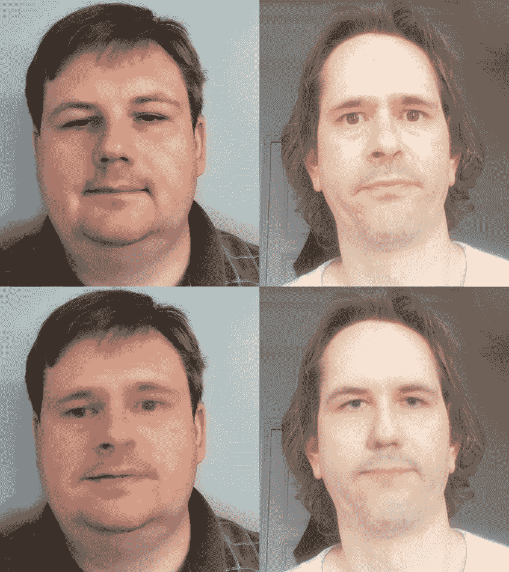

# 将人脸交换回视频

在本章中，我们将通过使用上一章训练的模型将视频转换为交换人脸来完成 deepfake 过程。

转换是 deepfake 的最后一个步骤，这是将新人脸实际放置到现有视频中的部分。这要求你已经有了一个通过提取过程在*第五章*，*提取人脸*中完全处理过的视频，并使用*第六章*，*训练 Deepfake 模型*中训练好的模型。

在本章中，我们将涵盖以下主题：

+   准备转换视频

+   熟悉转换代码

+   从图像创建视频

# 技术要求

对于本章，你需要设置一个`conda`环境。如果你在早期章节中已经设置了这个环境，那么相同的`conda`环境将可以正常工作。要进入`conda`环境，你可以运行以下命令：

```py
conda activate deepfakes
```

如果你还没有创建`conda`环境来运行代码，建议你前往 Git 仓库并遵循那里的说明。你可以在这里找到完整的仓库[`github.com/PacktPublishing/Exploring-Deepfakes`](https://github.com/PacktPublishing/Exploring-Deepfakes)。

# 准备转换视频

转换不仅仅是一个“一次性的”脚本。它要求你将视频转换成一系列帧，并在这些帧上运行`C5-face_detection.py`。这会以正确的形式获取转换过程所需的数据。转换过程将需要提取每个帧的完整信息，以及由提取过程生成的`face_alignments.json`文件：


图 7.1 – 已提取的文件夹示例。注意由提取过程创建的`face_images`文件夹

如果你还没有对你想要转换的视频进行提取过程，那么你应该回到*第五章*，*提取人脸*，并提取视频。

我们需要这样做，因为这是模型知道要将哪些人脸进行转换的方式。AI 可以检测帧中的所有人脸，但不知道哪些应该被交换，这意味着所有的人脸都会被交换。通过运行提取过程并从提取人脸的文件夹中清理掉我们不希望交换的人脸，我们可以控制哪些人脸会被交换。

此外，你可能还想将你要转换的帧包含在你的训练数据中，我们称之为“拟合训练”，这确保你的模型对你要转换的确切帧有一些经验。为此，回到*第六章*，*训练 Deepfake 模型*，并将你的模型的“*A*”侧指向包含你将要用于转换的帧的目录。

作者注记

如果你感兴趣的是“即时”转换过程，该过程交换所有人脸，你可以在本章末尾的练习页面上查看，那里我们提出了那个确切的问题。实际上，本节中的每一章都有一个练习列表，供你亲自动手，编写自己的深度伪造代码以获得经验。

接下来，让我们看看转换代码。

# 亲自动手编写转换代码

就像本节中其他章节的内容一样，我们将逐行分析代码，讨论其工作原理和所执行的操作。

## 初始化

在这里，我们将初始化并准备代码以运行转换过程：

1.  就像所有的 Python 代码一样，我们将从导入开始：

    ```py
    import os
    from argparse import ArgumentParser
    import json_tricks
    import torch
    import cv2
    import numpy as np
    from tqdm import tqdm
    import face_alignment
    from face_alignment.detection.sfd import FaceDetector
    from face_alignment import FaceAlignment, LandmarksType
    from lib.bisenet import BiSeNet
    from lib.models import OriginalEncoder, OriginalDecoder
    ```

这些库都是我们在前面的章节中已经见过的。这是因为转换过程实际上并没有做与我们之前所做太大的不同。当我们通过代码将人脸转换回原始图像时，我们会看到这一点。

1.  接下来，我们将检查我们是否从命令行运行：

    ```py
    If __name__ == "__main__":
      """ Process images, replacing the face with another as trained
          Example CLI:
          ------------
          python C7-convert.py "C:/media_files/"
      """
    ```

此代码实际上并没有做任何事情，但这是设置 Python 文件在调用时运行的常见方式。它允许你将脚本导入到其他脚本中而不运行那些命令。

1.  接下来，我们将解析脚本的参数：

    ```py
      parser = ArgumentParser()
      parser.add_argument("path",
        help="folder of images to convert")
      parser.add_argument("--model-path",
        default="model/",
        help="folder which has the trained model")
      parser.add_argument("--cpu",
        action="store_true",
        help="Force CPU usage")
      parser.add_argument("--swap",
        action="store_true",
        help="Convert to the first face instead of the second")
      parser.add_argument("--json-path",
       default="$path/face_images/face_alignments.json",
       help="path to the json data from the extract")
      parser.add_argument("--export-path",
        default="$path/convert/",
        help="folder to put images (swaps $path with input path)")
    ```

此代码使用 Python 的标准 `ArgumentParser` 库来解析命令行参数。这让我们可以为某些选项设置默认值，并在需要时更改它们：

```py
  Opt = parser.parse_args()
  opt.export_path = opt.export_path.replace("$path", opt.path)
  opt.json_path = opt.json_path.replace("$path", opt.path)
  main(opt)
```

在这里，我们处理参数，添加适用变量的路径，并将这些参数传递给 `main()` 函数，该函数将实际处理转换。

我们调整路径变量以添加默认路径。这让我们可以在数据文件夹的子文件夹中拥有 JSON 和导出文件夹。否则，每个都必须单独指定，并且可能位于非常不同的位置。如果你想要指定特定的文件夹，你仍然可以这样做，但默认设置有助于保持事物组织有序。

1.  我们现在回到主函数的开始部分：

    ```py
    def main(opt):
    ```

再次强调，这只是一个执行工作的主函数。它实际上并没有做任何事情，除了组织我们的代码并允许我们保持正常的“Pythonic”操作。

1.  我们的下一步是确保我们将要写入的文件夹存在：

    ```py
    if not os.path.exists(opt.export_path):
            os.mkdir(opt.export_path)
    ```

本节检查导出路径并确保它已经存在，如果不存在则创建它。

## 加载 AI

下一步是将 AI 加载到它需要运行的设备上：

1.  首先，我们检查 `cuda` 是否可用以及是否给出了 CPU 覆盖：

    ```py
    device = "cuda" if torch.cuda.is_available() and not opt.cpu else "cpu"
    ```

此代码检查 PyTorch 中是否启用了 `cuda`，如果是，并且用户没有通过命令行开关禁用它，那么将相应地启用 `cuda` 以供其余代码使用。

1.  接下来，我们使用以下代码构建 AI 模型：

    ```py
    encoder = OriginalEncoder()
    decoder = OriginalDecoder()
    ```

此代码建立编码器和解码器。与训练时不同，我们只需要一个解码器。这是因为训练需要两个面部才能成功学习，但一旦训练完成，我们只需要用于交换的面部的解码器。

1.  加载模型权重是下一步：

    ```py
    encoder.load_state_dict(torch.load(
      os.path.join( opt.model_path, "encoder.pth")).state_dict())
    if not opt.swap:
      decoder.load_state_dict(torch.load(
       os.path.join(opt.model_path, "decoderb.pth")).state_dict())
    else:
      decoder.load_state_dict(torch.load(
       os.path.join(opt.model_path, "decodera.pth")).state_dict())
    ```

此代码从训练模型中加载权重。我们首先加载编码器权重。这些总是相同的，因此它们从 `encoder.pth` 文件中提取，该文件包含编码器的训练权重。

对于解码器，默认情况下，我们想要加载“b”权重，这些权重存储在 `decoderb.pth` 文件中，但你可能想要将“a”面部交换到“b”图像中，因此我们包含了一个命令行开关，该开关将从 `decodera.pth` 文件中加载“a”权重。这些权重工作方式相同，并且与最初用于训练的面部相关联。由于我们包含了 `swap` 标志，所以确切的顺序并不重要，但只有一个方向可以是默认的，所以“b”面部到“a”图像的假设，除非在这里被覆盖。

无论加载哪个解码器，我们首先加载权重，然后将它们分配给模型的状态字典。PyTorch 处理将字典加载为矩阵以及准备处理张量的所有具体细节。

1.  接下来，我们将模型移动到 GPU：

    ```py
    If device == "cuda":
      encoder = encoder.cuda()
      decoder = decoder.cuda()
    ```

如果设备设置为 `cuda`，我们将模型加载到 GPU 上。为此，我们告诉 PyTorch 在模型上使用 `cuda`，这将处理将模型从 CPU 移动到 GPU 的所有繁琐细节。

## 准备数据

接下来，我们需要将数据加载到 PyTorch 期望的格式中：

1.  首先，我们从文件中加载对齐数据：

    ```py
    with open(os.path.join(json_path), "r", encoding="utf-8") as alignment_file:
      alignment_data = json_tricks.loads( alignment_file.read(), encoding="utf-8")
      alignment_keys = list(alignment_data.keys())
    ```

此代码从提取过程中保存的 JSON 文件中加载对齐数据。此文件包含我们需要的所有信息，以便能够从原始图像中提取面部，将其转换，并将其粘贴回图像。这使用提取信息而不是即时执行，因为当创建训练数据时，该信息已经生成，重新使用这些数据可以节省大量时间，同时还可以实现数据的清理和手动编辑。

您可以指定要加载的 JSON 文件，其中包含您正在转换的图像数据，但如果留空，则将检查默认位置，除非您在提取过程中更改了它，否则应该找到该文件。

我们再次使用 `json_tricks`，因为它对 NumPy 数组的处理非常强大，可以自动将数组加载回正确的数据类型和矩阵形状。

小贴士

虽然编辑这些对齐工具的说明超出了本书的范围，但 Faceswap 项目确实包括高级对齐修改工具，包括一个高级的“手动”工具，该工具允许通过点击和拖动编辑地标和面部。

1.  下一步是获取要转换的图像列表：

    ```py
    list_of_images_in_dir = [file for file in os.listdir(opt.path)
     if os.path.isfile(os.path.join(opt.path, file))
     and file in alignment_keys]
    ```

此代码从文件夹中加载所有图像，然后通过丢弃 JSON 数据文件中加载的对齐数据中不存在的任何图像来过滤图像。这确保了我们拥有转换图像所需的所有信息，因为即使文件夹中添加了新图像，我们也需要提取信息才能转换文件。

## 转换循环

在这里，我们开始循环，逐个处理每个单独的图像以将它们转换：

1.  我们现在进入循环并加载图像。

    ```py
    for file in tqdm(list_of_images_in_dir):
      filename, extension = os.path.splitext(file)
      image_bgr = cv2.imread(os.path.join(opt.path, file))
      image_rgb = cv2.cvtColor(image_bgr, cv2.COLOR_BGR2RGB)
      width, height, channels = image_bgr.shape
      output_image = image_rgb
    ```

此代码加载图像并为其使用做准备。首先，它将文件名和扩展名存储到变量中，以便我们稍后再次使用。然后，它以**蓝、绿、红**（**BGR**）颜色顺序加载文件，并将其转换为 AI 期望的**红、绿、蓝**（**RGB**）顺序的图像。然后，它将宽度、高度和颜色通道存储到变量中，以便我们稍后再次使用。最后，它创建输出图像的工作副本，以便我们可以交换该图像中的任何面部。

1.  接下来，我们开始另一个循环，这次是针对面部的：

    ```py
    for idx, face in enumerate(alignment_data[file]['faces']):
      aligned_face = cv2.warpAffine(image_rgb, face["warp_matrix"][:2], (256, 256))
      aligned_face_tensor = torch.tensor(aligned_face/255,
        dtype=torch.float32).permute(2, 0, 1)
      aligned_face_tensor_small = torch.nn.functional.interpolate(
        aligned_face_tensor.unsqueeze(0), size=(64,64),
        mode='bilinear', align_corners=False)
    if device == "cuda":
      aligned_face_tensor_small = aligned_face_tensor_small.cuda()
    ```

此循环将处理对齐文件中找到的每个面部，并交换其中找到的面部。

它首先使用在对齐文件中保存的预计算变形矩阵从帧中提取面部。这个矩阵使我们能够对齐面部并生成一个 256x256 的图像。

接下来，我们将面部图像转换为张量，并将通道移动到 PyTorch 期望的顺序。张量转换的第一部分是将 0-255 的整数范围转换为 0-1 的标准范围。我们通过除以 255 来实现这一点。然后我们使用`permute`重新排列矩阵，因为 PyTorch 希望通道首先出现，而 OpenCV 将它们放在最后。

接下来，我们创建张量的一个较小的 64x64 副本，这是我们实际上要输入到模型中的。由于我们一次处理一张图像，我们实际上是在处理一个大小为 1 的批次，但我们需要在张量上使用`unsqueeze`来创建张量的批次通道。这仅仅添加了一个大小为 1 的新维度，其中包含我们想要转换的图像。

最后，如果我们使用`cuda`，我们将较小的对齐面部张量移动到 GPU 上，以便我们可以在那里通过模型。

1.  然后，我们将图像通过 AI：

    ```py
    with torch.no_grad():
      output_face_tensor = decoder( encoder(
        aligned_face_tensor_small ))
    ```

此代码执行实际的 AI 交换，它的大小相当令人惊讶。

我们首先通过使用`torch.no_grad()`告诉 PyTorch，我们希望在这一点上运行 AI 而无需跟踪梯度。这样可以节省大量 VRAM 并加快转换速度。这在这里不是严格必要的，但养成这个习惯是好的。

接下来，我们将包含 64x64 面部的张量通过编码器，然后通过解码器来获取交换面部。编码器的输出直接输入到解码器，因为我们不需要对潜在编码做任何事情。

1.  在这里，我们将掩码应用于输出：

    ```py
    output_face_tensor = torch.nn.functional.interpolate(
      output_face_tensor, size=(256,256))
    mask_img = cv2.imread(os.path.join(extract_path,
      f"face_mask_{filename}_{idx}.png"), 0)
    mask_tensor = torch.where(torch.tensor(mask_img) >
      200, 1, 0)
    output_face_tensor = (output_face_tensor.cpu() *
      mask_tensor) + ( aligned_face_tensor.cpu() * (1 –
      mask_tensor))
    ```

我们希望应用这个面具，这样我们就不至于在面部周围交换一个大的方形噪声区域。为此，我们将加载面具图像，并使用它来仅从交换中裁剪出面部。

首先，我们将交换的面部图像调整大小到 256x256 像素。这样做是因为面具是一个 256x256 像素的图像，以更高的分辨率应用它有助于在边缘获得最佳细节，而不是将面具下采样到 64x64 像素。

接下来，我们加载面具图像。为此，我们使用对齐的面部文件名生成面具图像文件名。然后，我们使用 OpenCV 的图像读取器将其作为灰度图像加载：


图 7.2 – 面具图像的一个示例

然后，该图像被转换成一个张量，使用一个截止点，如果灰度面具图像的像素值高于 200（在 0-255 的范围内），则将其视为`1`；否则，将其视为`0`。这给我们提供了一个干净的二进制面具，其中`1`值表示要交换的面部，而`0`表示不重要的背景。然后我们可以使用这个面具将交换的面部粘贴回原始图像。

最后，我们将面具应用到图像上。这是通过将输出面部乘以面具，并将原始面部乘以面具的逆来完成的。实际上，这是将交换结果中的面部与从预交换对齐图像中提取的其余图像结合在一起。

1.  接下来，我们将面部放回到原始图像中：

    ```py
    output_face = (output_face_tensor[0].permute(1,2,0).numpy() *
      255).astype(np.uint8)
    output_image = cv2.warpAffine(output_face,
      face["warp_matrix"][:2], (height, width), output_image,
      borderMode = cv2.BORDER_TRANSPARENT,
      flags = cv2.WARP_INVERSE_MAP)
    ```

这个代码部分完成了面部循环。为此，我们将面部重新应用到输出图像上。

首先，我们将面部张量转换回 OpenCV 可以处理的 NumPy 数组。为此，我们抓取张量中的第一个实例；这实际上移除了批处理大小维度。然后，我们将使用`permute`将通道移动到矩阵的末尾。然后我们必须乘以 255 以进入整数 0-255 的范围。最后，我们将变量转换为整数，使其在 OpenCV 中作为一个合适的图像使用。

然后，我们使用 OpenCV 的`cv2.warpAffine`和一些标志将面部以原始方向复制回原始图像。我们使用的第一个标志是`cv2.BORDER_TRANSPARENT`，这使得只有较小的对齐面部区域被改变；其余图像保持不变。如果没有这个标志，图像将只包括替换的面部方块；其余图像将是黑色。我们使用的另一个标志是`cv2.WARP_INVERSE_MAP`，它告诉`cv2.warpAffine`我们正在将图像复制回原始图像，而不是复制原始图像的一部分。

使用这两个标志，对齐的面部图像被放回到原始全尺寸图像的正确位置。我们这样做是通过原始图像的一个副本来完成的，这样我们就可以在图像上复制多个面部，如果找到了多个面部。

1.  最后，我们输出带有面部交换的新图像：

    ```py
    output_image = cv2.cvtColor(output_image, cv2.COLOR_RGB2BGR)
      cv2.imwrite(os.path.join(opt.export_path,
        f"{filename}.png"), output_image)
    ```

图像循环的最后一步是将图像写入内存中的单独图像文件。为此，我们首先将图像转换回 OpenCV 期望的 BGR 颜色顺序。然后，我们使用相同的原始文件名和 PNG 文件类型将文件写入提取路径。



图 7.3 – 原图（顶部）和交换图（底部）示例，包括布赖恩（左上角）和马特（右上角），作者

现在我们已经对帧进行了转换，我们需要将图像转换回视频。让我们现在就做。

# 从图像创建视频

包含的转换代码会产生交换图像，但如果我们想创建视频，我们需要将输出组合成视频文件。这里有多个选项，具体取决于你想要包含的内容：

+   以下仅包含图像：

    ```py
    ffmpeg -i {path_to_convert}\%05d.png Output.mp4
    ```

此命令行将使用一些默认选项将所有帧转换为视频。`Output.mp4`文件将包含帧，但不会包含任何音频，并且将以默认的每秒 25 帧的帧率。对于来自电影源的视频，如蓝光或 DVD，这应该足够接近准确。如果视频看起来太快或太慢，那么你的帧率是不正确的，你应该查看下一个选项以匹配正确的帧率。

+   在特定帧率下包含图像：

    ```py
    ffmpeg -framerate {framerate} -i {path_to_convert}\%05d.png
      Output.mp4
    ```

此命令行将包括特定帧率的帧。帧率是你需要从原始视频中自己找到的。使用`ffmpeg`的一种方法是运行以下代码：

```py
ffmpeg -i {OriginalVideo.mp4}
```

这将输出大量信息，其中大部分对我们来说可能没有用。我们需要做的是寻找包含“流”信息的行。它看起来可能像这样：

```py
Stream #0:0(eng): Video: hevc (Main) (hvc1 / 0x31637668), yuvj420p(pc, bt470bg/bt470bg/smpte170m), 1920x1080, 13661 kb/s, SAR 1:1 DAR 16:9, 59.32 fps, 59.94 tbr, 90k tbn, 90k tbc (default)
```

这里重要的信息是它说`59.32 fps`。在这种情况下，我们想把`59.32`放入`ffmpeg`命令的帧率中。

此选项仍然不会包含任何音频。

+   在视频中包含音频：

    ```py
    ffmpeg -i {path_to_convert}\%05d.png -i {OriginalVideo.mp4}
      -map 0:v:0 -map 1:a:0 Output.mp4
    ```

此命令将在复制原始视频文件中的音频的同时转换视频。使用与音频完全相同的文件来对齐非常重要。如果音频没有正确对齐，你可能需要检查帧率和帧数。

# 摘要

在本章中，我们在一个包含图像的文件夹上运行了转换过程，使用训练模型替换了人脸。我们还把图像转换回视频，包括对帧率和音频的更改。

我们首先介绍了如何准备视频进行转换。转换过程需要从*第五章*，*提取人脸*，以及从*第六章*，*训练深度伪造模型*中创建的数据和训练好的 AI 模型。有了前几章的所有部分，我们就准备好转换了。

我们随后走过了转换过程的代码。这包括查看初始化部分，其中我们介绍了如何让 Python 脚本准备好运行。然后我们加载了 AI 模型，并在有 GPU 的情况下将它们设置好以在 GPU 上工作。接下来，我们准备好了数据，以便将每一帧中的面部进行转换。最后，我们运行了两个嵌套循环，处理了每一帧中的每一个面部，将它们交换到另一张面部。这一部分给我们留下了一个充满交换面部的文件夹。

之后，我们查看了一些命令，这些命令将交换面部图像文件夹转换成视频格式，这包括将每一帧放入视频中，确保帧率正确，如果需要，则复制音频。

在下一节中，我们将开始探讨 deepfakes 的潜在未来，下一章将探讨将我们学到的 deepfakes 技术应用于解决其他问题。

# 练习

1.  我们使用遮罩从图像中裁剪出交换的面部，并将其复制到对齐的面部上。这意味着对齐图像中不是面部区域的部分也会得到较低的分辨率。一种修复方法是将遮罩应用于原始图像而不是对齐图像。为此，您需要分别对遮罩和对齐图像调用`cv2.warpAffine`，然后使用遮罩仅复制面部。您可能想查看 OpenCV 的`warpAffine`文档，网址为[`docs.opencv.org/3.4/d4/d61/tutorial_warp_affine.html`](https://docs.opencv.org/3.4/d4/d61/tutorial_warp_affine.html)。

请注意，OpenCV 的文档基于 C++实现，Python 库中可能会有所不同。教程页面有一个**Python**按钮，可以切换教程以使用 Python 库。

1.  我们依赖于预先提取的面部来进行转换。这是因为大量数据已经在提取过程中被处理，并且已经可用，允许您过滤掉不需要转换的图像/面部。但是，如果您正在运行大量视频或计划在实时视频上进行转换，允许在运行时进行转换可能是有意义的。为此，您可以将提取过程与转换结合起来，并在转换之前按需运行提取步骤。您可以在`C5-extract.py`中查看代码，并将适当的部分添加到转换过程中，以使其能够直接在图像上工作。

1.  我们完全在图像上操作转换过程，但实际上 Python 可以直接与视频文件工作。为此，尝试安装并使用 PyAV 库，网址为[`github.com/PyAV-Org/PyAV`](https://github.com/PyAV-Org/PyAV)，以直接读取和写入视频文件而不是图像。请记住，您可能需要考虑输出中的音频数据和帧率。

1.  本章中使用的技术有一个问题是，替换进去的人脸在边缘处可能看起来相当明显。这是因为缺乏颜色匹配和边缘混合。这两种技术都可以改善替换的边缘。有许多颜色匹配技术可供选择；一个选项是直方图匹配 ([`docs.opencv.org/3.4/d4/d1b/tutorial_histogram_equalization.html`](https://docs.opencv.org/3.4/d4/d1b/tutorial_histogram_equalization.html))。你需要分别匹配 RGB 通道。边缘混合通常是通过模糊蒙版来完成的；你可以通过使用 OpenCV ([`docs.opencv.org/4.x/d4/d13/tutorial_py_filtering.html`](https://docs.opencv.org/4.x/d4/d13/tutorial_py_filtering.html))来平滑蒙版图像来实现这一点。这可以使替换的锐利边缘变得不那么明显。

1.  我们这里 AI 的结果仅限于 64x64 像素。有更新的模型可以达到更高的分辨率，但仍然受到可用 GPU 内存的严重限制，并且训练时间会更长。为了解决这个问题，你可以在将人脸返回到原始图像之前，通过 AI 放大器，如 ESRGAN ([`github.com/xinntao/Real-ESRGAN`](https://github.com/xinntao/Real-ESRGAN))，或者专门用于人脸修复的工具，如 GFP-GAN ([`github.com/TencentARC/GFPGAN`](https://github.com/TencentARC/GFPGAN))，来运行输出。看看你能否在将人脸返回到原始图像之前，通过这些模型来获得更高的质量结果。

EBSCOhost - 2023 年 11 月 27 日 6:20 AM 打印。所有使用均受[`www.ebsco.com/terms-of-use`](https://www.ebsco.com/terms-of-use)条款约束。

# 第三部分：现在该往哪里去？

就像所有发明一样，深度伪造的发展只是开始。现在你已经知道了深度伪造是如何工作的，你可以将这项知识应用到哪里，以及你可以用它做什么？你可能会对技术的灵活性感到惊讶。

在本部分，我们将探讨一些假设性的项目，以及如何利用深度伪造技术使它们更容易实现，同时解决可能让普通开发者感到棘手的复杂问题（你当然不是那种人——毕竟，你买了这本书！）。然后，我们将提出一个终极问题：未来会带来什么？我们将通过观察生成式 AI 在近期可能的发展方向来尝试回答这个问题，包括考虑这些 AI 技术必须克服的限制和挑战。

本部分包括以下章节：

+   *第八章*，*应用深度伪造的教训*

+   *第九章*，*生成式 AI 的未来*

EBSCOhost - 2023 年 11 月 27 日 6:20 AM 打印。所有使用均受[`www.ebsco.com/terms-of-use`](https://www.ebsco.com/terms-of-use)条款约束。
