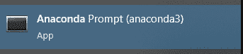
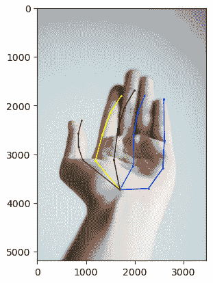
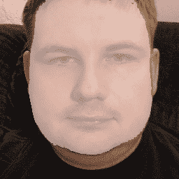

# 应用 Deepfakes 的教训

这本书中的技术可以用于比面部替换更多的用途。在本章中，我们将探讨一些如何将本书的教训和工具应用于其他领域的例子。我们将探讨如何调整和修改这些技术，以便以新的和独特的方式使用结果。

尤其是我们将探讨本书早期的一些技术，看看它们如何以新的方式使用。本章中的例子并不全面，而且总有更多的方式可以实现 deepfakes 带来的能力。在本章中，我们更关注技术而不是具体细节，但在研究技术时，我们将以新的方式探索以下内容：

+   对其他类型的图像进行对齐

+   遮罩图像的力量

+   控制数据

# 技术要求

对于本章，有一个包含少量代码的部分，演示了如何使用非模块 Git 仓库供您自己使用。

虽然这不是本书的动手部分，但我们已包含与库`PeCLR`接口的代码：`PeCLR`。此代码也包含在本书的代码仓库中，并具有一些附加功能，包括可视化点，但仅作为示例，并不打算作为在您自己的项目中使用`PeCLR`的完整 API：

1.  首先，打开 Anaconda 命令提示符。

1.  在 Windows 上，点击*开始*并输入`anaconda`。这应该会显示以下选项：



图 8.1 – Anaconda 命令提示符

点击此处，它将打开一个 Anaconda 提示符，用于以下所有命令。

1.  接下来，我们需要克隆`PeCLR`库的副本：

    ```py
    git clone https://github.com/dahiyaaneesh/peclr.git
    ```

1.  下载模型数据。

该库包含所有预训练模型的副本，可在[`dataset.ait.ethz.ch/downloads/guSEovHBpR/`](https://dataset.ait.ethz.ch/downloads/guSEovHBpR/)找到。在浏览器中打开此链接并下载文件（如果此 URL 失败，请检查`PeCLR`库或书籍仓库中的任何更新链接）。

将文件提取到您本地`PeCLR`仓库中的`data/models/`文件夹内。

1.  创建一个包含所有`PeCLR`要求的`conda`环境：

    ```py
    conda create -n PeCLR
    conda activate PeCLR
    pip install -r requirements.txt
    ```

这将创建一个包含`PeCLR`运行所需所有库的 Anaconda 环境。

此外，这将安装一个 Jupyter 笔记本。Jupyter 笔记本是一个用于实时编码的有用工具。要运行一个单元格，点击它，然后按*Shift + Enter*或点击**播放**三角形按钮。Jupyter 将运行那一块代码，然后停止，让您可以随意更改代码并重新运行。

1.  将`PeCLR.ipynb`文件复制到已克隆的仓库文件夹中。

如果您想跟随 Jupyter Notebook 文件，只需将文件从本书的仓库复制到您之前克隆的`PeCLR`文件夹中即可。这将让您免于重新输入所有内容。

1.  打开 Jupyter Notebook 并使用浏览器访问：

    ```py
    python -m jupyter notebook
    ```

这将运行 Jupyter Notebook。如果你在运行命令的同一台电脑上使用它，它也应该自动打开你的浏览器到正在运行的 Jupyter Notebook 实例，你就可以开始了。如果没有，你可以打开你喜欢的浏览器，并访问 http://<jupyter server ip>:8888/tree 来访问它。

当我们进入下一节的“编写我们自己的界面”和“使用库”部分时，将解释此代码的使用方法。

# 对其他类型图像的对齐

对齐面部是使深度伪造工作的重要工具。没有面部的对齐，我们将面临极长的训练时间和巨大的模型来纠正面部。可以说，没有对齐，现代深度伪造在今天是无法实现的。

对齐通过消除神经网络确定面部在图像中的位置并适应面部可能出现的许多不同位置的需要，从而节省了时间和计算能力。通过预先对齐，AI 甚至不需要学习面部“是什么”就能完成其工作。这允许 AI 专注于学习手头的任务，例如生成逼真的面部表情或语音，而不是试图定位和纠正未对齐的面部。

除了提高训练过程的效率外，对齐面部还有助于提高最终深度伪造的质量和一致性。如果没有适当的对齐，生成的面部可能看起来扭曲或不自然，这可能会降低深度伪造的整体真实感。

事实上，对齐不仅适用于面部。你可以用它来对齐手、人、动物，甚至汽车和家具。实际上，任何你可以用定义的部分检测到的对象都可以进行对齐。为了使其工作，你需要以某种方式找到对齐的点。例如，对于手，这可能是指尖。

虽然这适用于任何对象，但我们将专注于一个单一示例案例。以下是如何对齐手的示例过程。其他对象也可以以相同的方式进行对齐。你只需要遵循相同的步骤，但将手替换为你想要对齐的任何对象。

## 寻找对齐器

首先，我们需要找到一种方法来识别我们想要对齐的手的点的位置。为此，我们需要做一些被称为姿态估计的事情。我们可以使用 YOLO ([`github.com/ultralytics/yolov5`](https://github.com/ultralytics/yolov5)) 或其他对象检测工具来识别某些点，例如手指的尖端。你可能需要做一些启发式的工作来正确地排列它们，以便可以对齐。

然而，与其自己开发，我们可能可以使用一个为我们完成这项工作的库。当我想要找到一个执行特定任务的库或代码时，我首先会查看**Papers with Code**([`paperswithcode.com/`](https://paperswithcode.com/))。这个网站基于各种 AI 任务有各种各样的软件项目。在我们的例子中，他们有一个专门用于手部姿态估计的部分([`paperswithcode.com/task/hand-pose-estimation`](https://paperswithcode.com/task/hand-pose-estimation))，列出了各种基准。这些是代码已经测试过的测试。这让你不仅能看到会做你想要的事情的库，甚至还能看到“最佳”的。

目前，最好的结果是**虚拟视图选择**，位于[`github.com/iscas3dv/handpose-virtualview`](https://github.com/iscas3dv/handpose-virtualview)。不幸的是，这个项目有一个限制性的“禁止商业用途”许可证。因此，我们将跳过它，转到下一个，**AWR：用于 3D 手部姿态估计的自适应加权回归**，可以在[`github.com/Elody-07/AWR-Adaptive-Weighting-Regression`](https://github.com/Elody-07/AWR-Adaptive-Weighting-Regression)找到。这个项目是 MIT 许可的，这是一个开放许可，允许您即使用于商业目的也可以使用软件，但它仅适用于深度图像。“深度”指的是图像中相机与对象之间的距离。这些图像对于手部检测等任务很有用，但不幸的是，它们需要特殊的相机或技术才能正确获取，所以我们也将跳过这个。

许多其他方法也仅处理深度图像。然而，如果我们继续浏览发布的选项，我们应该会遇到**PeCLR：通过等变对比学习从单目 RGB 进行自监督 3D 手部姿态估计**，它拥有 MIT 许可证，并且可以在标准的 RGB（彩色）照片上工作。您可以在[`github.com/dahiyaaneesh/peclr`](https://github.com/dahiyaaneesh/peclr)下载它。

作者注记

虽然在这个部分我们只是使用代码，将其视为库，但实际上，`PeCLR`代码（以及其他列出的项目）是作为学术论文的一部分发布的。作者并不打算贬低这项工作，因为学术工作推动了 AI 领域的许多创新。然而，这本书的这一部分是关于如何*实现*想法的，这意味着使用代码而不必 necessarily 关注创新。如果你对深入了解`PeCLR`具体做了什么感兴趣，我们建议你阅读论文，它链接在 Git 仓库的 readme 中。

## 使用库

`PeCLR`库包含进行手部检测和姿态估计所需的所有模型和工具，但不是所有在外部图像上运行的代码。不幸的是，这在学术研究风格的项目中很常见，这些项目通常更感兴趣的是你能验证他们已经发布的结果，而不是让你在新数据上运行它。因此，我们需要实际编写一些代码来将我们的图像通过他们的模型。

如果他们没有提供易于使用的 API，找到与现有代码接口的最佳位置可能很困难。由于`PeCLR`是一个学术项目，没有易于使用的 API，我们需要找到我们自己的位置来用我们的 API 替代品调用他们的代码。

### 编写我们自己的接口

在验证数据上运行模型的代码对于我们的情况只有部分可用，因为他们使用的数据集期望数据以某种格式存在，这很难用我们的数据重新创建。因此，我们将从头开始，并在我们的代码中调用模型。

让我们开始做这件事：

1.  首先，我们将导入我们使用的所有库：

    ```py
    import torch
    import torchvision.models as models
    import cv2
    from PIL import Image
    from matplotlib import pyplot as plt
    import numpy as np
    import os
    import json
    from easydict import EasyDict as edict
    from src.models.rn_25D_wMLPref import RN_25D_wMLPref
    ```

上述代码导入了我们将需要的所有库。其中大部分是我们之前使用过的标准库，但最后一个是我们使用`PeCLR`进行实际检测所使用的模型。我们已经导入了它，所以我们可以用图像调用它来运行模型。

1.  接下来，我们将从`PeCLR`加载模型：

    ```py
    model_path = 'data/models/rn50_peclr_yt3d-fh_pt_fh_ft.pth'
    model_type = "rn50"
    model = RN_25D_wMLPref(backend_model=model_type)
    checkpoint = torch.load(model_path)
    model.load_state_dict(checkpoint["state_dict"])
    model.eval().cuda()
    ```

上述代码从`PeCLR`提供的模型数据中加载模型。为此，首先，我们定义模型路径和类型。然后，我们将模型类型传递给生成适当的模型。接下来，我们加载检查点并将权重复制到模型中。最后，我们准备模型以进行评估，并将其设置为在 GPU 上运行。

1.  接下来，我们将加载图像并为其准备模型：

    ```py
    image=io.imread(
      "https://source.unsplash.com/QyCH5jwrD_A")
    img = image.astype(np.float32) / 255
    image_mean = np.array([0.485, 0.456, 0.406])
    image_std = np.array([0.229, 0.224, 0.225])
    img = np.divide((img - image_mean), image_std)
    img = cv2.resize(img, (224,224))
    img = torch.from_numpy(img.transpose(2, 0, 1))
    img = img.unsqueeze(0).float().cuda()
    ```

此代码准备图像。它通过首先使用`SciKit`图像加载器来加载图像，与`OpenCV`不同，它可以直接处理 URL 或本地文件。然后，它计算一个调整值，以将模型的坐标恢复到与完整图像大小匹配的坐标。它是通过将 224 除以图像的高度和宽度来做到这一点的。然后，我们将图像数据转换为范围在 0–1 之间的浮点数。然后，我们通过除以标准差并减去平均值来归一化图像。这使图像的范围降低到模型期望的范围。然后，我们将图像调整大小到 224 x 224，这是模型期望的图像大小。然后，我们将图像转换为张量，并按照 Pytorch 使用的顺序，以通道优先的方式获取它。最后，我们在前面添加一个维度来存储批次，并将其转换为 GPU 上的 32 位浮点数。

这一切都是为了准备图像，以便模型可以在其上运行。

1.  接下来，我们在图像上运行模型，并从中获取 2D 坐标：

    ```py
    with torch.no_grad():
        output = model(img, None)
    kp2d = output["kp25d"][:, :21, :2][0]
    height, width = image.shape[:2]
    kp2d[:,0] *= width / 224
    kp2d[:,1] *= height / 224
    ```

此代码首先将图像通过模型，而不生成训练梯度。为此，我们传递图像和`None`值，这将使用默认的相机内参矩阵。

作者注记

*相机内参*是一个术语，但它只是指你的相机的细节。在`PeCLR`的情况下，它需要一个矩阵来详细说明像素空间的大小，以便它可以从 2D 图像中尝试猜测深度信息。我们不需要深度信息，所以我们可以让`PeCLR`创建一个默认矩阵，而不是提供它。

接下来，代码只取了 2D 对齐点。因为我们是在 2D 空间中进行对齐，所以不需要 3D 点。如果我们处理的是深度图像，我们可能需要第三维度，但在这个场景中我们不需要，也不需要它。

接下来，由于模型被给了一个小的 224 x 224 图像，我们将调整这些坐标以匹配原始图像的宽度和高度。为此，我们将坐标除以 224，然后将结果乘以原始图像的大小。

## 使用地标进行对齐

在这种情况下，库将标记每个手指和拇指的关节和尖端以及手“中间”附近的一个点。不幸的是，手中间的点定义得不好，它可以从实际中间到手腕的任何地方，所以我们不想用它来进行对齐。关节和指尖的位置将更一致，因此我们可以使用这些来进行对齐过程：



图 8.2 – 使用 PeCLR 检测并标记的手（原始照片由 Kira auf der Heide 通过 Unsplash 提供）

小贴士

对齐器永远不会完全准确。有些可能变化很大，但这并不是每次都得到完美结果的问题。任何对齐，即使是错误的，对神经网络训练都有好处，因为它将数据规范化为更可靠的形式。在将数据提供给 AI 之前所做的任何工作，意味着 AI 少了一个需要浪费精力去做的任务。

一旦我们可以在图像上获得一些已知点，我们就可以缩放、旋转和裁剪图像，使其处于你想要的朝向，并通过检测器运行它以获得点列表。如果你可以，我建议运行多张图像并平均点。这样，你可以减少手部图像中的任何变化，并获得更好的对齐。

一旦你有了想要对齐的点，你可以使用它们通过**Umeyama**算法生成对齐的图像。该算法只需要两组点，一个已知的“对齐”集和一个你可以转换成对齐集的第二组。Umeyama 返回一个矩阵，你可以将其输入到仿射变换函数中，以获得最终的对齐图像。参见*第五章*，*提取人脸*，以获取如何进行此操作的动手代码示例。

一旦我们有了对齐的手部图像，你就可以用它们做你计划要做的事情，无论是展示它们还是用于你的 AI 任务。甚至可能在你有了对齐数据后，你可以用它来训练你自己的姿态检测模型，以获得更好的对齐结果。这个过程，即使用 AI 处理的数据来喂养模型以使该模型变得更好，被称为**自举**，并且，在适当的监督下，是一种无价的技术。

对齐是深度伪造的关键部分，现在你可以在其他领域使用它们。接下来，我们将探讨如何使用遮罩来获取物体的干净剪影。

# 遮罩图像的力量

当你拍照时，你正在捕捉相机看到的一切。然而，你很可能对图像的每一部分都不感兴趣。如果你在度假，你可能会在瀑布前拍一张自拍照，虽然你重视自己和瀑布，但你可能对图像中的汽车或其他人不那么关心。虽然你无法在不添加东西填补空缺的情况下从你的度假照片中移除汽车，但有时，你可能只对主要主题感兴趣，并可能想要将其从图像的其余部分中剪裁出来。

在深度伪造中，我们可以使用遮罩来帮助我们从图像中移除面部，以便只替换面部而留下图像的其余部分。在其他 AI 任务中，你可能会有类似的需求，但想要剪裁的对象不同：



图 8.3 – 深度伪造过程中使用的遮罩示例

接下来，让我们看看其他类型的遮罩。

## 遮罩类型

在许多任务中，遮罩图像可能很有用。我们只将其用作称为**合成**步骤的一部分。这仅仅是遮罩功能的一部分。它可以用来引导**修复**，这是通过填充图像中的空白来擦除物体的过程。你还可以在图像被喂入 AI 之前对其进行处理，以确保 AI 可以专注于重要的部分。

为了对图像进行遮罩，你需要有一个想法，知道你想要遮罩图像的哪一部分。这被称为**分割**，并且有众多子领域。如果你想根据物体的类型进行分割，那么它被称为**语义分割**。如果你想要根据主题进行图像分割，那么它被称为**实例分割**。如果你有一个稳定的深度图，你甚至可以使用**深度分割**。不幸的是，决定你需要哪种类型的分割需要特别注意，以便找到正确的工具。

## 为你的物体找到可用的遮罩

像**PaddleSeg** ([`github.com/PaddlePaddle/PaddleSeg`](https://github.com/PaddlePaddle/PaddleSeg)) 这样的库有特殊的工具，可以让您进行多种类型的分割。它们甚至有一个交互式分割系统，可以让您像 Photoshop 的魔术棒工具一样“标记”您想要分割的内容。之后，您可能需要使用这些数据来训练一个能够在新的环境中分割特定类型对象的分割模型。

为了找到最佳的方法来分割你感兴趣的对象，你可能需要从搜索你想要分割和标记的项目开始。对于一些对象，如人脸、汽车、人物等，有现成的模型可以分割这些对象。

但是，如果你感兴趣的对象没有分割模型，你不必绝望。较新的模型如**CLIP** ([`github.com/openai/CLIP`](https://github.com/openai/CLIP)) 为我们开辟了全新的机会。CLIP 由一对连接语言和图像的 AI 模型组成。由于 CLIP 的共享性质，我们可以根据对象的文本描述来学习它们之间的差异。这意味着像**CLIPseg** ([`github.com/timojl/clipseg`](https://github.com/timojl/clipseg)) 这样的库可以使用语言提示来分割图像中的对象。

## 检查一个示例

让我们来看一个例子。假设你想要计数停车场停放的汽车，并查看是否有空位，但你只有从上方拍摄的停车场网络摄像头的图像。为了做到这一点，你需要知道图像中哪些部分是汽车，哪些是空停车位。这个任务结合了语义分割和实例分割，但将它们一起使用。

第一步是在图像中标记出每个停车位，以定义您想要查看的位置。您可以在每个停车位中挑选一个单独的位置，或者通过整个区域来定义它们。无论如何，您可能需要手动完成这项工作，因为它们不太可能经常改变，从而证明让计算机来做是有必要的。

现在你已经知道图像中停车位的所在位置，你可以开始寻找汽车了。为了做到这一点，我们可能需要寻找一个训练有素的神经网络来完成这个任务。在我们的例子中，我们可以查看 Kaggle 用户 Tanishq Gautam 提供的这个示例：[`www.kaggle.com/code/ligtfeather/semantic-segmentation-is-easy-with-pytorch`](https://www.kaggle.com/code/ligtfeather/semantic-segmentation-is-easy-with-pytorch)。这个页面提供了预训练模型以及如何分割汽车的详细指南。

虽然这个模型不做实例分割（为每辆车分配不同的“颜色”或标签），但我们仍然可以用它来计数汽车。我们可以这样做，因为我们已经确定我们是在停车场计数汽车，并且我们已经手动标记了每个停车位。

然后，我们可以简单地使用分割模型来检测任何汽车，并查看它们是否与停车位重叠。如果我们只为每个停车位标记一个点，我们就可以简单地检查每个点，看看它是否被分割为“汽车”或“背景”（一个用于我们未分割的任何事物的常用术语）。

如果我们标记了整个停车位区域，那么我们可能希望计算一个最小覆盖面积，以便将停车位视为“占用”。例如，我们希望确保一个停放在停车位上的摩托车被计算在内，但稍微超过线的汽车不应该被计算。你可以设置停车位面积的最小阈值，如果它被一个“汽车”填满超过那个阈值，那么你就可以标记整个停车位为占用。

还可以实现其他功能。例如，你甚至可以通过检查一个标记为“汽车”的区域是否不在停车位内来检测汽车是否在禁止区域。这可以用来自动提醒停车执法官员检查停车场。

现在我们已经很好地掌握了我们的掩码，让我们看看我们如何管理我们的数据。

# 控制数据

在 AI 社区中有一个常见的说法，那就是机器学习科学家的工作只有 10%是机器学习，90%是数据管理。这种说法，就像许多这样的说法一样，并不离真相太远。虽然每个机器学习任务都专注于模型的实际训练，但首先你必须将你的数据整理成可管理的形式，然后你才能开始训练。如果你的数据没有正确准备，数小时的训练可能会完全浪费。

在你开始训练模型之前，你必须决定你要用哪些数据来训练它。这些数据必须被收集、清理、转换为正确的格式，并通常准备好用于训练。通常，这涉及到大量的手动过程和验证。

## 定义你的规则

在手动过程中最重要的事情是确保所有你的数据都符合你的要求，并达到一致的质量水平。为此，你需要确切地定义“好的”数据意味着什么。无论你是标注数据还是收集大量数据，你应该有一个标准的方式来完成你所做的一切。

例如，假设你正在标注狗和猫的数据集，并且你希望将所有图片放入两个桶中的一个，一个桶包含所有狗的图片，另一个桶包含所有猫的图片。如果一个图片中同时包含猫和狗，你会怎么做？你会把它放入更显著的桶中吗？你会从你的数据集中排除它吗？你会编辑图片以移除其中一种动物吗？你会将其裁剪成两张图片，以便两种动物都进入数据集中吗？

在这些情况下，拥有一套一致的规则非常重要。这确保了你的数据适用于这些目的。你不想每次都让这些边缘情况以不同的方式发生，否则当你试图解决问题时，会打乱你的训练并引起混淆。

## 规则的演变

此外，制定一个计划，以应对你更改规则的情况是很重要的。随着你继续进行数据管理，你几乎不可避免地会发现，根据你发现的数据、你的训练过程进行得如何以及你的最终用例是否发生变化，你可能想要对规则进行一些调整或更改。

回顾我们的示例，让我们考虑这样一个情况：你决定排除包含猫和狗的任何图像，但只要图像中也包含猫或狗，其他动物都可以。当你决定想要将兔子添加到你的猫/狗检测器中时，会发生什么？这意味着不仅需要为兔子图像添加一个新的存储桶，而且还需要重新处理你已经检查过的所有现有图像，以确保任何包含兔子的猫或狗图像都被移除。如果你发现你的猫和狗存储桶中的豚鼠被标记为兔子怎么办？在管理你的数据时，这些过程都需要考虑。

## 处理错误

错误是不可避免的，少量不良数据进入你的数据集是不可避免的。然而，在几处无害的错误和足以完全无效化训练的大量错误之间有一条细线。因此，通常最好在标准流程中将数据审查作为第二（或第三）套眼睛。有时，这可能是不可能的，但在任何可能的情况下，它都是无价的。第二套眼睛可能会发现你数据或方法中的缺陷。如果你在狗数据中将一个特别奇怪外观的动物标记为正常，但第二个人将其识别为罕见的猫品种怎么办？

我还建议尽可能自动化你的数据收集。当你能够从循环中去除人类时，你不仅会节省时间，还能防止错误和失误。花在自动化数据过程上的时间几乎总是会在未来带来回报。即使你认为没有一种方法可以使自动化过程比手动操作更快，你也应该考虑你将避免的错误。写得好的自动化代码可以后来用于未来的项目。任何可以重用的东西都应该自动化，这样下次你需要完成它时，就有工具为你处理。

# 摘要

在本章中，我们探讨了如何将深度伪造的教训和技术应用于其他环境。首先，我们以手为例，探讨了如何对齐其他类型的图像。然后，我们考察了不同类型的面具，并考虑在停车场监控解决方案中使用它们。在此之后，我们研究了数据管理，并考虑了如何构建一个用于检测不同动物的数据集。

本章中介绍的新环境中应用技术的方法本身就是一个非常有价值的技巧，它可以帮助你在整个开发生涯中受益，尤其是如果你像现在的 AI 一样，打算在计算机能力的边缘工作。有时，成功项目和不可能的项目之间的唯一区别就是从以前的项目中借用的技术。

在下一章中，我们将探讨深度伪造和其他生成式 AI 的潜力和未来。

EBSCOhost - 2023 年 11 月 27 日 6:20 AM 打印。所有使用均受[`www.ebsco.com/terms-of-use`](https://www.ebsco.com/terms-of-use)条款约束。
