# 1

# 探索亚马逊 Bedrock

全球各地的人们都对生成式 AI 的潜力感到惊讶，全球各地的行业都在寻求通过生成式 AI 在组织中进行创新和解决业务用例。

本章将向您介绍一个名为**亚马逊 Bedrock**的强大生成式 AI 服务。我们将首先提供一个生成式 AI 领域的概述。然后，我们将探讨行业在生成式 AI 方面面临的挑战以及亚马逊 Bedrock 如何有效地解决这些挑战。接下来，我们将探索亚马逊 Bedrock 目前提供的各种**基础模型**（**FMs**），并帮助您评估哪种模型适用于特定场景。此外，我们还将介绍亚马逊在基础模型之外的一些附加生成式 AI 功能。到本章结束时，您将对亚马逊 Bedrock 的生成式 AI 服务、模型选择标准以及亚马逊提供的更广泛的生成式 AI 功能有一个扎实的理解。

本章将涵盖以下主题：

+   理解生成式 AI 领域

+   什么是 FMs？

+   什么是亚马逊 Bedrock？

+   亚马逊 Bedrock 中的 FMs

+   评估和选择合适的 FM

+   亚马逊的生成式 AI 功能

+   使用亚马逊 Bedrock 的生成式 AI 用例

# 理解生成式 AI 领域

自 ChatGPT 问世以来，全球各地的组织都在探索大量生成式 AI 可以为他们解决的问题。他们建立了多个创新团队和数据科学家团队来构建和探索各种用例，包括总结长文档、从文档中提取信息以及执行情感分析以衡量对产品或服务的满意或不满意程度。如果您在**机器学习**（**ML**）或**自然语言处理**（**NLP**）领域工作，您可能熟悉语言模型的工作方式——通过理解文档中单词之间的关系。这些**语言模型**的主要目标是预测句子中的下一个可能的单词。

如果你观察句子 *John loves to eat*，一个自然语言模型正在尝试预测序列中的下一个单词或标记。在这里，下一个可能的单词似乎是 *ice-cream*，概率为 9.4%，如*图 1.1*所示：

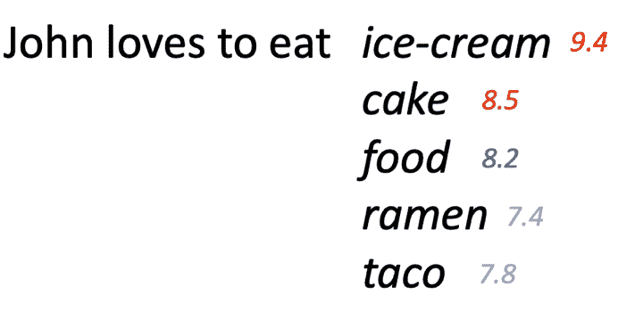

图 1.1 – 句子序列预测

语言模型可以通过将每个单词转换为数值向量，也称为**嵌入**，来实现这一点。在向量空间中，相似的单词会彼此靠近，而不相似的单词在空间上会彼此远离。例如，单词 *phone* 会与单词 *eat* 相距甚远，因为这两个单词的语义意义不同。

早期的自然语言处理技术，如**词袋模型**和**词频-逆文档频率**（**TF-IDF**）评分以及**n-gram**分析，在语言建模任务中存在一些局限性。基于频率确定单词重要性的 TF-IDF 没有考虑句子中的语义上下文。表示相邻单词或字符的 n-gram 对于词汇表外的术语泛化效果不佳。为了推进语言建模，需要一种以捕捉单词的语义意义和单词之间关系的方式来表示单词。

在神经网络中，一种名为**Word2Vec**的词嵌入模型能够从大量文本语料库中学习关联。然而，Word2Vec 模型在处理词汇表外的单词时表现不佳。自 2010 年代以来，研究人员一直在尝试更先进的序列建模技术来解决这一局限性，例如**循环神经网络**（**RNNs**）和**长短期记忆**（**LSTM**）网络。这些模型具有记忆单元，允许它们在预测下一个单词时考虑句子中先前单词的上下文。与 Word2Vec 等模型相比，RNNs 和 LSTMs 可以捕捉更长的依赖关系。虽然这些模型在建模词序列方面非常强大，但它们在计算和内存消耗上更高，这意味着它们根据模型接收到的数据量可以保持有限的范围。因此，当提供包含多页文档时，这些模型无法很好地表现。

在 2017 年，谷歌和多伦多大学的学者们发表了一篇名为 *Attention Is All You Need* ([`arxiv.org/abs/1706.03762`](https://arxiv.org/abs/1706.03762)) 的论文。这篇论文介绍了 **transformer 架构**，它基于自注意力机制，而不是之前模型中使用的循环或卷积层。这种**自注意力机制**允许模型同时学习输入中所有单词（或一组标记）之间的上下文关系。它是通过计算每个单词相对于序列中其他单词的重要性来实现的。这种注意力被应用于推导出用于下游任务（如语言建模或机器翻译）的上下文表示。transformer 架构的一个主要优点是它能够对长序列的单词进行并行计算。这使得 transformer 能够比之前的循环模型更有效地应用于更长的文本和文档。

基于 Transformer 架构的语言模型展现出**最先进**（**SOTA**）和接近人类水平的性能。自从 Transformer 架构出现以来，已经开发了各种模型。这一突破为现代**大型语言模型**（**LLMs**），包括**双向编码器表示的 Transformer**（**BERT**）、**生成式预训练语言模型**（**GPT**）、**文本到文本迁移 Transformer**（**T5**）、**BLOOM**和**Anthropic Claude**铺平了道路。

现在，让我们深入了解一些正在推动生成式 AI 领域发生重大变化的 LLMs。

# 什么是 FM？

目前大多数生成式 AI 模型都由基于 Transformer 的架构驱动。一般来说，这些生成式 AI 模型，也广泛被称为 FM，使用 Transformer 是因为它们能够一次处理一个或整个序列的文本，使用自注意力。FM 在数百万或数十亿参数的大量数据上训练，使它们能够理解上下文中词语之间的关系，以预测后续序列。虽然基于 Transformer 架构的模型目前在领域内占据主导地位，但并非所有 FM 都依赖于这种架构。一些模型使用替代技术构建，例如**生成对抗网络**（**GANs**）或**变分自编码器**。

GANs 利用两个相互竞争的神经网络。第一个网络被称为**生成器**，其任务是生成模仿真实数据的合成样本。例如，生成器可以生成新的图像、文本或音频剪辑。第二个网络被称为**判别器**。其作用是分析示例，包括真实和合成的，以分类哪些是真实的，哪些是人工生成的。

通过这种对抗过程，生成器学会产生越来越令人信服的伪造品，可以欺骗判别器。同时，判别器在检测揭示合成样本的微妙异常方面变得更好。它们的竞争目标推动两个网络不断改进。一个 GAN 的例子可以在[`thispersondoesnotexist.com/`](https://thispersondoesnotexist.com/)找到。通过不断刷新页面，用户会看到一系列新颖的人类面孔。然而，它们都不是真实的——所有这些都是由一个在大量真实人类图像数据库上训练的 GAN 生成的合成肖像。该网站展示了 GAN 如何在许多领域合成高度逼真的输出。

**变分自编码器**是更易于训练的生成式 AI 算法，它也利用两个神经网络——一个**编码器**和一个**解码器**。编码器通过将其映射到低维潜在空间来学习数据中的模式，而解码器使用这些潜在空间中的模式来生成逼真的样本。

虽然这些 FMs（基于 Transformer、GAN 或变分自编码器）是在大量数据集上训练的，这使得它们与其他传统机器学习模型（如逻辑回归、**支持向量机**（SVM）、决策树等）不同。斯坦福大学人类中心化人工智能研究团队提出了“基础模型”这一术语，以区分它们与其他机器学习模型。传统的机器学习模型是在标记数据上训练的，并且只能执行狭窄定义的任务。例如，将有一个用于文本生成的模型，另一个用于摘要的模型，等等。

与之相反，FMs（基础模型）通过在包含数百万或数十亿参数的巨大数据集上进行训练，通过分析单词和句子之间的关系来学习语言中的模式。由于它们拥有庞大的预训练数据集，FMs 往往能够很好地泛化并理解上下文意义，这使得它们能够解决各种用例，例如文本生成、摘要、实体提取、图像生成等。它们的预训练使它们能够作为许多不同应用的极高适应性起点。*图 1.2*突出了传统机器学习模型和 FMs 之间的一些差异：

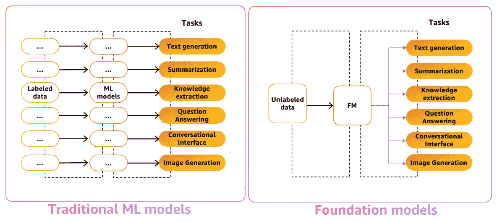

图 1.2 – 传统机器学习模型与 FMs

尽管有各种 FMs 可用，但组织在采用这些模型进行大规模部署时面临几个挑战：

+   **没有单一模型解决方案**：没有单一模型是针对所有任务进行优化的，而且随着新技术的进步，模型也在不断改进。为了应对多个用例，组织可能需要组装几个相互协作的模型。这可能会耗费大量时间和资源。

+   **安全问题**：安全和隐私是主要关注点，因为组织希望保护他们的数据和宝贵的知识产权，他们还希望控制这些模型如何共享和使用他们的数据。

+   **时间和资源管理**：对于文档摘要和虚拟助手等应用，需要特定的模型配置。这包括定义任务、授权访问内部数据源，以及为模型开发执行操作的 API。这需要一个多步骤的过程和复杂的编码。

+   **缺乏无缝集成**：能够无缝集成到现有应用中非常重要，以避免管理大型计算基础设施或承担高昂的成本。组织希望模型在幕后工作，无需任何重负载或费用。

解决这些技术、运营、安全和隐私挑战是组织成功采用和部署 FMs 的企业规模的关键。

这些正是亚马逊 Bedrock 旨在解决的问题。

# 什么是亚马逊 Bedrock？

Amazon Bedrock 是一项完全托管的服务，通过单个 API 提供各种高性能 FM 的选择。*完全托管*意味着用户无需担心创建、部署和运营后端基础设施，因为这一切都由 Amazon 负责。因此，您可以在应用程序或代码内部使用单个 API 调用 Bedrock 上的模型，该 API 包含您的提示。Amazon Bedrock 的一个关键优势是它提供了来自 Amazon 和顶级 AI 公司（如 Anthropic、AI21 Labs、Cohere、Meta、Stability AI 和 Mistral）的广泛选择。

一旦你定义了你的用例，下一步就是选择一个 FM。Amazon Bedrock 提供了一个沙盒体验（一个用于快速实验的 Web 界面），你可以在这里尝试不同的模型和提示。此外，还有一些技术和适用性标准你需要采用，以选择最适合你用例的模型。我们将在接下来的章节中学习如何评估 LLM。

一旦你评估并确定了适用于你的用例的 FM，重点就转向增强其预测能力。Amazon Bedrock 提供以下关键能力来优化模型性能：

+   `告诉我巧克力蛋糕的做法` 或可以详细提示，包含多个示例，具体取决于你试图解决的问题的使用场景。凭借其沙盒体验，Amazon Bedrock 允许你通过快速实验有效地设计和制定提示。我们将讨论这些技术以及提示工程的一些实际方面，详见 *第三章*。

+   **易于微调**：Amazon Bedrock 允许你使用你的数据集轻松定制 FM。这个过程称为**微调**模型，涉及使用你的领域数据集进一步训练模型，以提高特定领域任务的准确性。微调可以直接从 Amazon Bedrock 控制台或通过 API 进行，并通过提供你的数据集在 Amazon **简单存储服务**（**Amazon S3**）存储桶中完成。我们将在 *第四章* 中详细讨论微调 Amazon Bedrock FM。

+   **原生支持 RAG**：**检索增强生成**（**RAG**）是一种强大的技术，可以从语言模型外部获取数据，例如从内部知识库或外部来源，以提供针对特定领域用例的准确响应。当需要超出模型提供的上下文的大型文档时，这种技术非常有用。Amazon Bedrock 提供原生支持 RAG，因此您可以连接您的数据源以进行检索增强。我们将在 *第五章* 中更详细地讨论 RAG。

此外，亚马逊 Bedrock 还提供了额外的功能，例如构建智能**代理**来代表您协调和执行多项任务的能力。代理可以调用各种内部和外部数据源，连接到应用程序，并在多个步骤中运行复杂任务。我们将在*第十章*中深入探讨构建智能代理。

安全性、隐私性和可观察性是亚马逊 Bedrock 的一些关键功能。您在调用 FM 时提供的数据，包括提示和上下文，不会用于保留任何 FM。此外，所有 AWS 安全性和治理功能，包括数据加密、IAM 身份验证和权限策略、VPC 配置等，都适用于亚马逊 Bedrock。因此，您可以在静态和传输中加密您的数据。您可以告诉亚马逊 Bedrock 使用**虚拟私有云**（**VPC**），这样 AWS 托管系统组件之间的流量就不会通过互联网。此外，通过**身份和访问管理**（**IAM**），您可以提供对某些资源或用户的访问权限。此外，指标、日志和 API 调用被推送到 AWS CloudWatch 和 AWS CloudTrail，这样您就可以了解并监控亚马逊 Bedrock 模型的用法。本书的*第三部分*将涵盖模型评估、监控、安全、隐私以及确保安全和负责任的 AI 实践。 

目前，让我们看看亚马逊 Bedrock 提供的不同 FM。

# 亚马逊 Bedrock 中的 FM

通过亚马逊 Bedrock，您可以使用亚马逊和领先 AI 公司（即 AI21、Anthropic、Command、Stability AI 和 Meta）提供的六种 FM，如图*图 1**.3*所示。亚马逊 Bedrock 可能会在未来添加更多 FM 的访问权限：

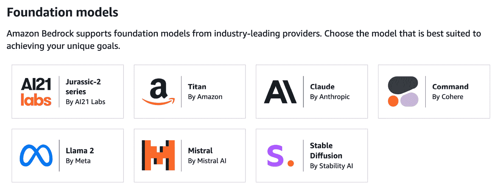

图 1.3 – 亚马逊 Bedrock 上可用的 FM

现在，让我们详细讨论这些模型中的每一个。

## 亚马逊泰坦 FM

**亚马逊泰坦 FM**代表一套由 AWS 通过在大量数据集上进行广泛预训练开发的强大、多用途模型，赋予它们在多个领域广泛适用的能力。此 FM 支持生成文本、问答、摘要、RAG、个性化、图像生成等多种用例。一个简单的例子就是生成文章/博客或撰写电子邮件。

目前在亚马逊 Bedrock 上可用的亚马逊泰坦模型有三种：*泰坦文本生成*、*泰坦图像生成*和*泰坦嵌入*。

### 泰坦文本生成

**泰坦文本生成**是一个为生成文本、摘要等用例设计的 LLM。假设约翰需要给他的电话运营商的客户支持团队写一封电子邮件，要求他们修复他一直面临的开账问题。我们可以向泰坦文本生成模型提供提示。响应将与主题一起生成，如图*图 1**.4*所示：

图 1.4 – Titan Text G1-Express 模型生成的响应

在撰写本文时，Titan 文本生成器提供三种不同的版本 – *Titan Text G1 Lite*、*Titan Text G1 Express* 和 *Titan Text G1 Premier*。主要区别在于 Lite 是一个更经济实惠且规模较小的模型，支持高达 *4,000* 个标记，Express 是一个更大的模型，支持高达 *8,000* 个标记，专为复杂用例设计，而 Premier 是 Titan 最先进的模型，支持高达 32k 个标记，旨在提供卓越的性能。

### Titan 图像生成器

`生成一张瑞士阿尔卑斯山滑雪兔子的图像`。一旦生成图像，我们就可以创建单个图像的变体，甚至编辑图像，如 *图 1.5* 所示：

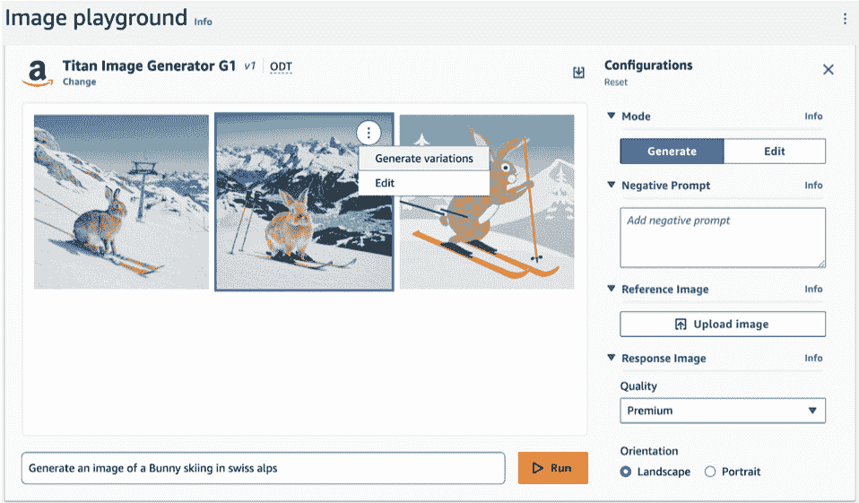

图 1.5 – Titan 图像生成器和其配置

在 *第九章* 中，我们将学习更多关于图像生成的工作原理，并深入了解各种用例。

### Titan Embeddings

**Titan Embeddings** 模型的主要功能是将文本（或图像）转换为数值向量。这些向量以数学方式表示单词，使得相似的单词具有相似的向量。您可以将这些嵌入存储在如 **OpenSearch**、**Aurora pgvector**、**Amazon Kendra** 或 **Pinecone** 等向量数据库中，这些数据库将用于比较文本之间的关系。

在撰写本文时，Titan 嵌入模型提供两种变体 – **Titan Text Embeddings** 和 **Titan Multimodal Embeddings**。主要区别在于 Titan Text Embeddings 将文本转换为嵌入，这使得模型非常适合用于 RAG 和聚类等用例，而 Titan Multimodal Embeddings 可以将文本和图像的组合转换为嵌入，这使得它在图像搜索和提供推荐等用例中非常适用。

虽然 Titan Text Embeddings 支持高达 *8,000* 个标记和超过 25 种语言，但 Titan Multimodal Embeddings 可以支持高达 *128* 个标记，最大图像大小为 25 MB。在这里，英语是唯一支持的语言。

在下一章中，我们将学习如何调用这些模型及其输入配置参数。现在，让我们了解 Amazon Bedrock 提供的一些其他 FM。

## AI21 Labs – Jurassic-2

AI21 Labs 已构建了多个 FM 和特定任务的模型。然而，在撰写本文时，Amazon Bedrock 提供了对 *Jamba-Instruct*、*Jurassic 2 – Ultra* 和 *Jurassic 2 – Mid* FM 的访问。

**Jamba-Instruct** 只支持英语，而 **Jurassic-2** 模型支持多种语言和用例，如高级文本生成、理解、开放式书籍问答、摘要等。

Jamba-Instruct 支持上下文标记长度为 256K，而 **Jurassic-2 Ultra** 和 **Jurassic-2 Mid** 都支持上下文标记长度为 8,192。

例如，提示“给我一些在家种植蔬菜的建议”。输出结果如图 *1.6* 所示：

图 1.6 – 激活 Jurassic-2 模型

## Anthropic Claude

Anthropic 致力于安全负责任的 AI，并提供一系列 Claude 模型。这些模型支持问答、移除 **个人身份信息**（**PII**）、内容生成、角色扮演对话等多种用例。使用 Anthropic Claude 的一大好处是它能够处理更长的文本序列作为提示。截至目前，Claude 的最大上下文窗口为 *200,000* 个标记，它可以理解和回应更广泛的提示。这种更大的上下文允许 Claude 进行更深入的讨论，理解更长的叙述或文档，并生成更连贯的多段回应。

Amazon Bedrock 目前提供访问 Anthropic Claude 语言模型五个版本的权限：

+   **Anthropic Claude 3.5 Sonnet**：这设定了行业新的智能标准，在各种基准测试中优于其前辈和其他顶级 AI 模型。Claude 3.5 Sonnet 在视觉处理、内容生成、客户支持、数据分析、编码等领域表现出色。令人印象深刻的是，它在保持比之前 Anthropic 模型 80% 更高效成本的同时，实现了这种增强的性能，使其成为寻求在较低价格点获得先进 AI 功能企业的理想选择。以下链接突出了基准测试以及与其他模型在不同任务上的比较：https://aws.amazon.com/blogs/aws/anthropics-claude-3-5-sonnet-model-now-available-in-amazon-bedrock-the-most-intelligent-claude-model-yet/

+   **Anthropic Claude 3**：该模型有三个变体 – *Claude 3 Opus*、*Claude 3 Sonnet* 和 *Claude 3 Haiku*。它们是 Amazon Bedrock 上最近和最先进的 Anthropic 模型系列。所有这些模型都具有多模态功能，可以感知和分析图像（jpeg、png），以及其他文件类型，如 .csv、.doc、.docx、.html、.md、.pdf、.txt、.xls、.xlsx、.gif 以及文本输入，上下文窗口为 200K：

    +   **Claude 3 Opus**：这是 Anthropic 到目前为止最强大的模型，拥有 1750 亿个参数。Opus 具有先进的少样本学习能力，只需少量示例即可快速适应各种任务。

    +   **Claude 3 Sonnet**：一个拥有 600 亿个参数的多模态 AI 模型，Sonnet 具有强大的少样本学习能力。其参数高效的架构允许它处理复杂输入，如长文档，同时比 Opus 更具计算效率。

    +   **Claude 3 Haiku**：在 70 亿参数下，Haiku 是 Anthropic 最紧凑和轻量级的模型。它针对效率进行了优化，提供了与其大小相匹配的高性能。其低计算需求使其推理非常快速。

+   **Anthropic Claude 2.1** **和** **Claude 2**：它们也是 Anthropic Claude 家族的先进补充。它们提供了高性能的推理能力和高精度，同时幻觉率较低。它们在对话、创意写作、信息、角色扮演、摘要等用例上表现良好。在上下文长度方面，Claude 2.1 支持高达*200,000*个标记，而 Claude 2 支持高达*100,000*个标记。

+   **Anthropic Claude 1.3**：这是一个较早的版本，具有当时 LLM 的典型功能。它在涉及事实回应、摘要和基本问答的任务上表现出色。在上下文长度方面，Claude 1.3 支持高达*100,000*个标记。

+   **Anthropic Claude Instant 1.2**：与其它 Claude 模型相比，这提供了一个更快、更经济的选项。Claude Instant 模型的延迟大大降低，但性能受到影响。然而，Claude Instant 仍然在许多常见的 NLP 应用中表现出强大的语言技能，这些应用不需要最高水平的推理或细微的回应，并且当速度或成本比绝对最高性能更重要时。在上下文长度方面，Claude Instant 1.2 支持高达*100,000*个标记。

我们将在下一章中通过一些示例来展示如何利用 Anthropic Claude 与 Bedrock 结合使用。

## Cohere

Amazon Bedrock 提供了来自 Cohere 的多个模型：*Command*、*Command R+*、*Command R*、*Command Light*模型、*Embed English*和*Embed Multilingual*。**Cohere Command**，经过 520 亿参数训练，是一个适用于更复杂语言理解的 LLM。**Command Light**，具有 60 亿参数，既经济又快速，对于那些需要为应用提供更轻量级模型的用户来说是一个好选择。**Command R+**，在 1040 亿参数上训练，是 Cohere 在撰写本书时的最强大模型，并设计用于具有 128K 标记上下文窗口大小的任务。**Command R**，在 350 亿参数上训练，也是为具有 128K 标记上下文窗口大小的任务设计的。

Cohere Embed 提供了一系列经过训练以生成高质量嵌入的模型，这些嵌入我们已经知道是文本文档在向量空间中的数值格式表示。Cohere 提供**Embed English**，它仅针对英语文本进行训练，以及**Embed Multilingual**，可以处理多种（超过 100 种）语言。嵌入模型支持的最大标记长度为 512。这些嵌入模型为下游应用开辟了广泛的应用范围，例如语义搜索以查找相关文档、RAG、文本聚类、分类等。

注意以下图示，它突出了在 Amazon Bedrock 文本游乐场中使用 Cohere Command 模型对对话进行摘要的文本生成示例：

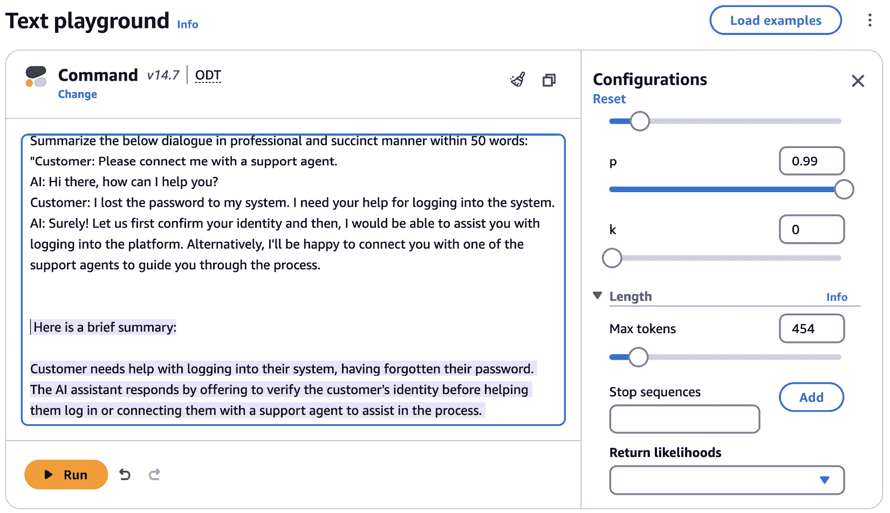

图 1.7 – 在 Amazon Bedrock 文本游乐场中的 Cohere Command 文本生成示例

## Meta Llama 2 和 Llama 3

Meta 在其**Llama 2**和**Llama 3**系列下提供了几个预训练的 LLM，用于聊天机器人应用。其基础 Llama2 模型在超过 2000 万亿个公开在线数据源上进行预训练，此时它通过超过 100 万个人类标注示例进行微调。

通过 Amazon Bedrock，已经提供了四种 Llama2 变体：**Llama 2 Chat 13B**、**Llama 2 Chat 70B**、**Llama 2 13B**和**Llama 2 70B**。13B 模型包含 130 亿参数，其训练过程耗时 368,640 个 GPU 小时。Llama 13B 模型的一个关键优势是能够处理任意长度的输入序列，这使得它非常适合需要分析长文档或网页的任务。更大的 70B 模型变体包含 700 亿参数，其训练过程耗时 1,720,320 个 GPU 小时。70B 模型可用于多任务学习，这意味着它非常适合同时执行多个任务，如图像分类、语音识别和 NLP。与 13B 模型相比，它在多个任务上表现出改进的性能，这可能是由于其相对较大的规模和更高的计算资源。

除了 Llama2 之外，Meta 的 Llama 3 系列变体也已在 Amazon Bedrock 上提供，具体包括**Llama 3 8B Instruct**和**Llama 3 70B Instruct**。Llama 3 8B Instruct 模型针对计算资源有限的场景进行了优化，非常适合边缘设备和应用。它在文本摘要、文本分类、语言翻译和情感分析等任务中表现出色。Llama 3 70B Instruct 模型针对内容创作、对话式人工智能系统、语言理解和企业解决方案进行了定制。它在精确文本摘要、细微文本分类、复杂的情感分析和推理、语言建模、对话系统、代码生成和遵循复杂指令等领域表现出色。

对于希望利用这些模型的开发者，Meta 创建了一个名为*llama-recipes*的开源 GitHub 仓库（[`github.com/facebookresearch/llama-recipes/tree/main`](https://github.com/facebookresearch/llama-recipes/tree/main)），其中包含将 Llama2 模型集成到聊天机器人和虚拟助手中的示例代码和示例。这为研究人员和实践者提供了一个起点，以便他们可以尝试 Llama2 并将其适应自己的对话式人工智能应用。

*图 1**.8* 展示了在 Amazon Bedrock 文本游乐场中使用 Meta Llama 2 Chat 13 B 模型进行实体提取的示例：

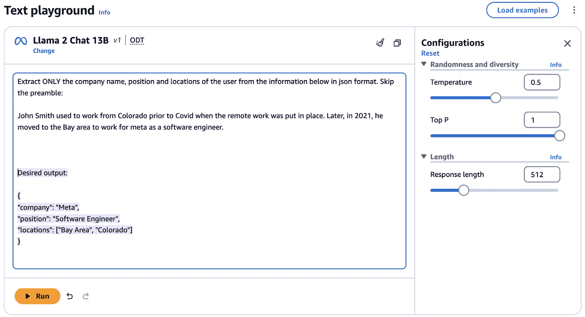

图 1.8 – 在 Amazon Bedrock 文本游乐场中使用 Llama 2 Chat 13B 模型进行实体提取

## Mistral AI

**Mistral AI** 致力于构建计算高效、值得信赖且强大的 AI 模型。这些模型目前在 Amazon Bedrock 上提供四种变体 – *Mistral 7B Instruct*、*Mixtral 8X7B Instruct*、*Mistral Large* 和 *Mistral Small*：

+   **Mistral 7B 指令**：这是一个为教学任务设计的 70 亿参数稠密 Transformer 语言模型。它提供了性能和效率之间的诱人平衡，尽管其相对紧凑的尺寸，但仍然提供了适用于广泛用例的强大功能。Mistral 7B 指令支持处理英语自然语言和代码输入，具有扩展的 32,000 令牌上下文窗口容量。尽管比大型模型更有限，但 Mistral 7B 指令提供了针对教学应用的高质量语言理解、生成和任务执行，同时降低了计算成本。

+   **Mixtral 8X7B**：这是一个 70 亿参数稀疏混合专家语言模型，采用高度参数高效的架构。尽管其总体尺寸相对紧凑，但它为任何给定输入利用了 120 亿个活跃参数，与类似规模的稠密模型（如 Mistral 7B）相比，提供了更强的语言理解和生成能力。这种稀疏模型支持处理多种自然语言以及编码语言，满足广泛的跨语言和编程用例。此外，Mixtral 8X7B 保持扩展的上下文窗口为 32,000 令牌，使其能够有效地在长输入中建模长距离依赖关系。

+   **Mistral 大型**：它能够进行复杂推理、分析、文本生成和代码生成，并在处理英语、法语、意大利语、德语和西班牙语的复杂多语言任务方面表现出色。Mistral 大型支持最大上下文窗口为 32,000 令牌，使其能够处理长文本输入，同时在语言理解、内容创作和需要高级多语言能力的编码应用上提供最先进的性能。

+   **Mistral 小型**：这是一个为效率和成本效益而设计的先进语言模型。它擅长快速且经济高效地处理高容量、低延迟的语言任务。凭借其专业能力，Mistral 小型无缝地解决编码挑战，并在包括英语、法语、德语、西班牙语和意大利语在内的多种语言中流畅运行。Mistral 小型支持最大上下文窗口为 32,000 令牌。

*图 1.9* 展示了在 Amazon Bedrock 文本沙盒中使用 Mistral Large 模型的推理场景：

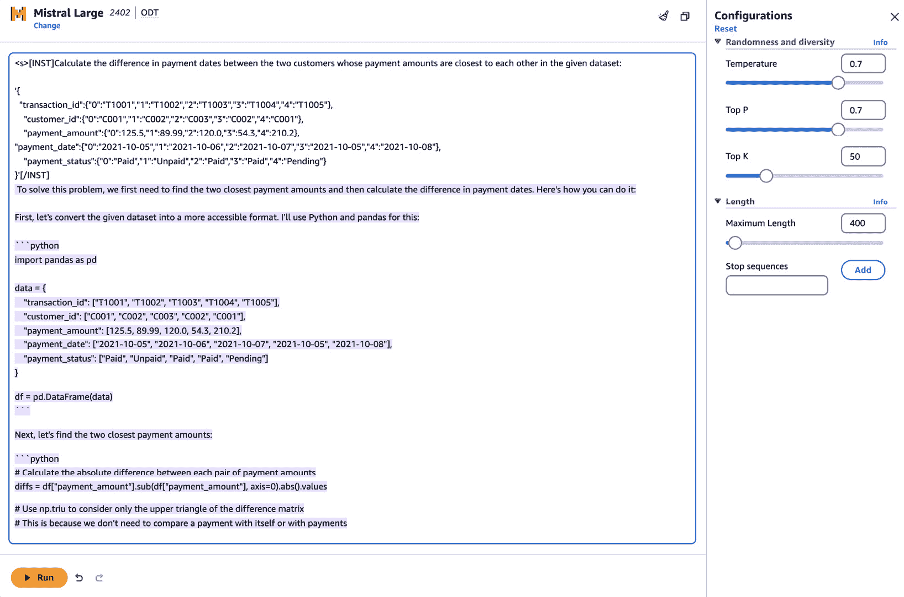

图 1.9 – Amazon Bedrock 文本沙盒中的 Mistral Large

## Stability AI – 稳定扩散

稳定扩散是由 Stability AI 开发的，用于使用在大数据集上训练的扩散模型生成高度逼真图像。稳定扩散背后的核心技术称为**潜在扩散**，它涉及使用正向扩散过程在数据上逐渐添加噪声，以及反向扩散过程逐渐去除噪声并重建原始数据。在图像生成的案例中，这允许模型根据用户提供的文本或图像提示生成新的图像。

Amazon Bedrock 提供了 Stability AI 的 **SDXL 0.8** 和 **SDXL 1.0** 稳定扩散模型。稳定扩散模型旨在根据提供的文本或图像提示生成高度逼真的图像。SDXL 1.0 特别引人注目，因为其模型规模庞大。其基础模型包含超过 *3.5 亿* 个参数，而其集成管道使用两个模型，总参数量达到 *6.6 亿*。通过聚合多个模型的结果，集成方法可以生成更高品质的图像。

通过 Amazon Bedrock，开发者可以利用稳定扩散进行各种图像生成任务。这包括从文本描述生成图像（文本到图像）、基于现有图像生成新图像（图像到图像），以及填充缺失区域（修复）或扩展现有图像（扩展）。我们将在*第九章*中详细探讨这些内容。

让我们通过以下提示在 Amazon Bedrock 文本沙盒中运行一个简单的稳定扩散模型示例：`a dog wearing sunglasses, riding a bike on mars`。

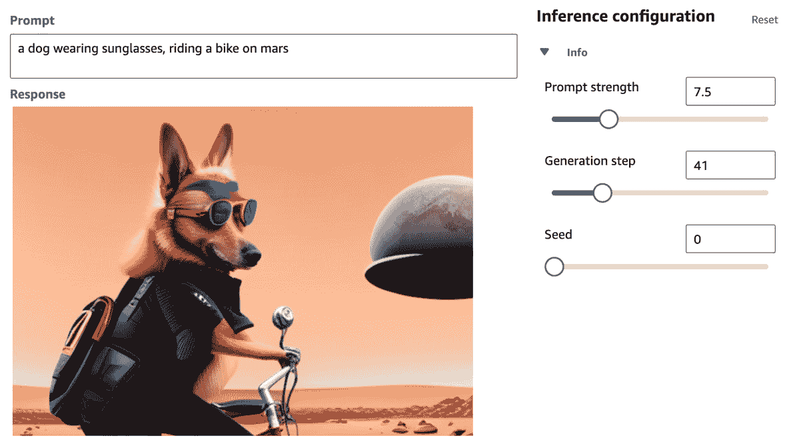

图 1.10 – 使用稳定扩散模型生成图像

自动创建视觉内容的能力在广告、媒体和娱乐以及游戏等众多行业中都有广泛应用。在*第九章*中，我们将探讨稳定扩散在底层的工作原理。我们还将讨论在您的应用程序中利用图像生成模型的最佳实践和架构模式。

# 评估和选择合适的 FM

现在我们已经了解了在 Amazon Bedrock 中可用的不同类型的 FM，我们如何确定哪一个最适合我们的特定项目需求？本节将帮助您学习如何评估模型与您的用例的匹配度。

第一步是明确界定你试图解决的问题或你想要构建的用例。尽可能具体地描述输入、输出、涉及的任务以及其他任何要求。有了明确定义的用例，你可以研究哪些模型已经证明了与你的需求相关的功能。根据功能在最初就缩小选项范围将简化评估过程。

一旦你确定了一些潜在的候选模型，下一步就是检查它们在标准化基准和用例中的表现。Amazon Bedrock 提供了一种评估 FM 的能力，也称为**模型评估作业**。通过模型评估作业，用户可以选择使用自动模型评估或通过人工劳动力进行评估。我们将在接下来的章节中更详细地介绍 Amazon Bedrock 的模型评估。

此外，目前存在几个排行榜和基准，可以帮助进行这种评估，例如以下这些：

+   斯坦福 Helm 排行榜（针对大型语言模型）

+   HuggingFace 的开源排行榜

+   GLUE ([`gluebenchmark.com/`](https://gluebenchmark.com/))

+   SuperGLUE ([`super.gluebenchmark.com/`](https://super.gluebenchmark.com/))

+   MMLU ([`paperswithcode.com/sota/multi-task-language-understanding-on-mmlu`](https://paperswithcode.com/sota/multi-task-language-understanding-on-mmlu))

+   BIG-bench ([`github.com/google/BIG-bench`](https://github.com/google/BIG-bench))

检查每个模型在你相关用例的任务中的排名，可以提供一个对其能力的客观衡量。

除了基准性能外，还需要检查每个模型的每查询成本、处理延迟、是否需要微调的训练参数以及任何其他非功能性需求。正确的模型不仅需要实现你的技术目标，还需要符合你的成本和时间限制。

没有实际操作测试的评估是不完整的。利用 Amazon Bedrock 的文本游乐场或**Amazon Partyrock**来尝试在样本提示、文本生成任务或其他代表你预期用例的示例交互中测试候选者。有关 Amazon Bedrock 的文本游乐场和 Amazon Partyrock 的更多详细信息将在下一章中介绍。这种模型评估机制允许对生成语言质量、保持上下文的能力、响应的可解释性以及与每个模型交互的整体*感觉*等进行更定性的评估。

通过彻底研究能力、性能和需求，以及测试多个选项，你将能够为选择最适合你项目需求的 FM 做好准备。正确的选择将有助于确保项目的成功。

# 亚马逊的生成式 AI 能力

本书主要关注 Amazon Bedrock，但我们想突出亚马逊提供的其他一些生成式 AI 功能，这些功能正在企业中被用于加速开发者生产力、更快地进行创新以及轻松解决他们的用例。

## Amazon SageMaker

**Amazon SageMaker** 是亚马逊的全托管机器学习平台，用于大规模构建、训练和部署机器学习模型。SageMaker 最强大的功能之一是 SageMaker Jumpstart，它提供了一系列预训练的开源 FM，这些 FM 已经准备好部署和使用。

SageMaker Jumpstart 中可用的 FM 示例包括 FLAN-T5 XL，这是 T5 转换器模型的微调 XL 版本，针对自然语言理解进行了优化。此外，Meta Llama2、AI21 Jurassic-2 Ultra 和 Stable Diffusion 模型等额外模型也可在 SageMaker Jumpstart 中找到。

除了直接部署这些预训练的 FM 之外，SageMaker Jumpstart 还提供了用于针对特定用例定制和微调选定模型的工具。例如，用户可以通过调整文本提示来执行提示工程，以更好地控制模型响应。一些模型还支持通过问答任务增强推理能力，以改善 LLM 的常识推理能力。微调功能允许您将语言模型适应特定领域的数据集。

这使得工程师和研究人员可以直接从 Jumpstart 利用这些生成式 AI 模型的力量，从而无需深入的专业知识即可构建新颖的应用程序。SageMaker 平台处理了部署、扩展和管理 ML 模型的所有繁重工作。当您在 SageMaker Studio UI 中打开 SageMaker Jumpstart 时，您将看到不同模型提供商提供的模型。这可以在*图 1.11*中看到：

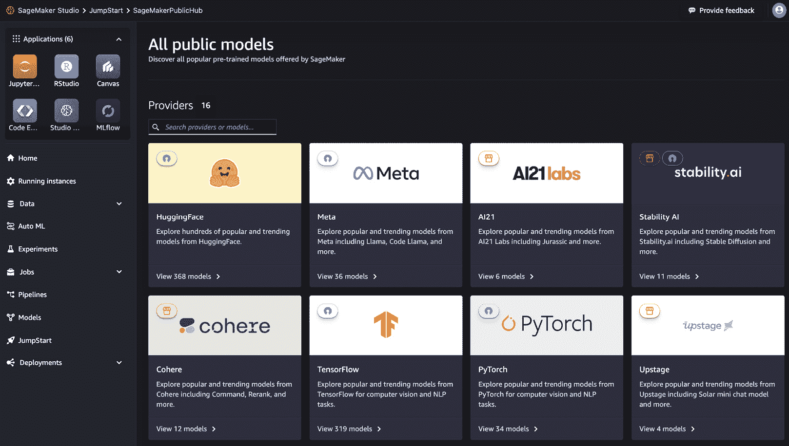

图 1.11 – SageMaker Jumpstart

您可以根据您的用例选择要工作的模型，并将其直接部署到 SageMaker 端点，或者您可以使用自定义数据集对模型进行微调。*图 1.12*显示了 HuggingFace 在 SageMaker Jumpstart 上提供的几个开源模型，展示了在 SageMaker 中通过搜索栏或**过滤器**选项搜索适合特定任务的模型选择的简单性：

图 1.12 – SageMaker Jumpstart HuggingFace 模型

## Amazon Q

**Amazon Q** 是一个基于 Amazon Bedrock 构建的生成式 AI 助手，旨在提高各个领域的生产力和加速决策制定。它可以帮助用户在从软件开发到数据分析再到决策制定的众多任务中。

这里是 Amazon Q 的关键功能概述。

### Amazon Q for Business

**Amazon Q for Business**是一个企业级、由生成式 AI 驱动的助手，旨在简化组织内的运营并提高生产力。如果您有必要的权限，可以使用此工具访问和交互公司的数据存储库，简化任务并加速问题解决过程。以下是 Amazon Q for Business 的一些关键特性：

+   **全面的数据集成**：Amazon Q for Business 可以无缝连接到 40 多个流行的企业数据源，包括 Amazon S3、Microsoft 365 和 Salesforce。它确保基于现有的用户权限和凭证安全访问内容，利用单点登录提供无缝体验。

+   **智能查询处理**：您可以用自然语言提问，Amazon Q for Business 将跨所有连接的数据源进行搜索，逻辑地总结相关信息，分析趋势，并参与交互式对话。这使用户能够获得准确和全面的答案，消除了耗时的人工数据搜索需求。

+   **可定制和安全的**：组织可以通过配置管理护栏、文档丰富化和相关性调整来定制 Amazon Q for Business 以满足其特定需求。这确保了响应与公司指南保持一致，同时保持强大的安全和访问控制。

+   **任务自动化**：Amazon Q for Business 允许用户通过简单的自然语言提示来简化日常任务，例如员工入职请求或费用报告。此外，用户可以创建和共享任务自动化应用程序，进一步提高效率和生产力。

您可以像*图 1.13*所示的那样，只需几步即可设置 Amazon Q for Business 应用程序。

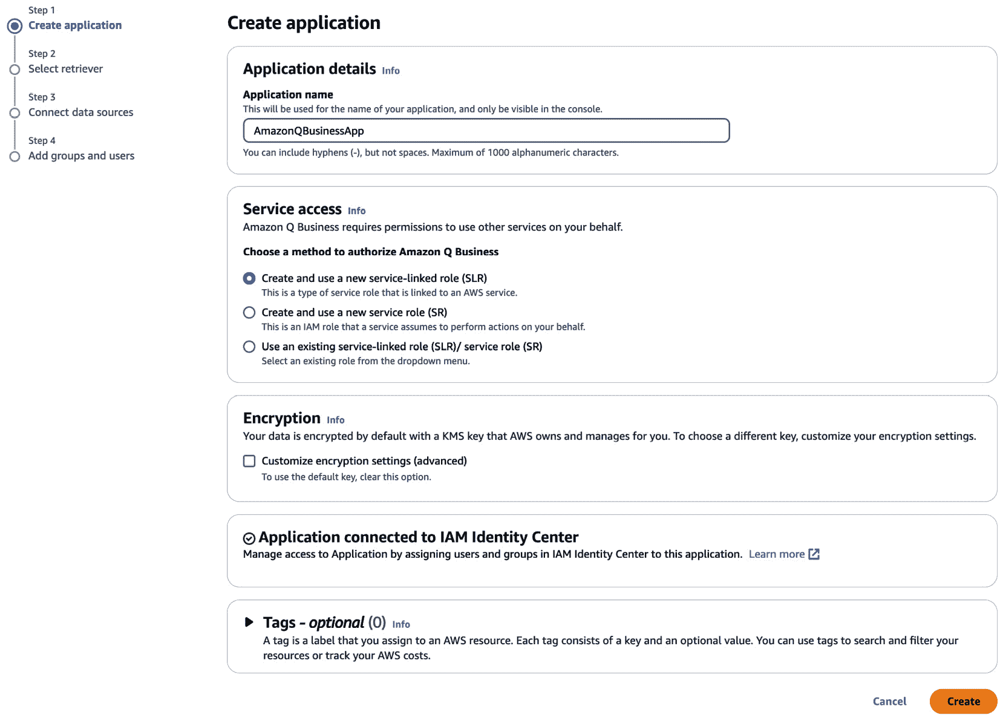

图 1.13 – 设置 Amazon Q for Business

想要了解更多关于设置 Amazon Q for Business 应用程序的详细信息，您可以查看以下链接：[`docs.aws.amazon.com/amazonq/latest/qbusiness-ug/getting-started.html`](https://docs.aws.amazon.com/amazonq/latest/qbusiness-ug/getting-started.html)

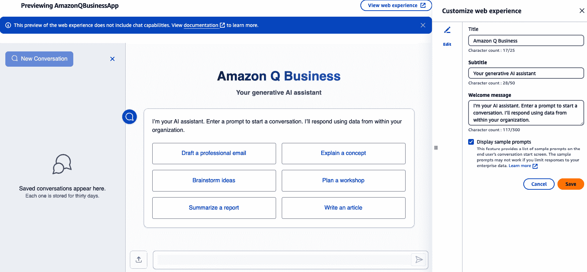

图 1.14 – 自定义 Amazon Q for Business 的网页体验

一旦设置好应用，用户就可以像*图 1.14*所示的那样自定义 Q 商业应用的网页体验。

现在我们来看一下 Amazon Q for QuickSight 的另一个产品。

### Amazon Q for QuickSight

**Amazon Q for QuickSight**是为商业用户和分析人员设计的，旨在更有效地从数据中提取洞察。它利用生成式 AI 的能力来简化数据分析可视化的流程。以下是 Amazon Q for QuickSight 的一些关键特性：

+   **直观的故事讲述**：使用 Amazon Q for QuickSight，业务用户可以通过使用简单的自然语言提示从他们的数据中创建引人注目的叙事。这些故事可以包括视觉元素、图像和文本，使传达洞察和协调利益相关者更容易。

+   **执行摘要**：Amazon Q for QuickSight 可以自动生成执行摘要，突出显示来自您的仪表板的最重要趋势和统计数据。此功能通过提供关键洞察的快速快照来节省时间，消除了浏览多个视觉元素的需求。

+   **自然语言问答**：业务用户可以使用自然语言查询自信地回答有关其数据的问题。Amazon Q 可以理解模糊或一般性的问题，提供不同的观点，并通过叙事摘要提供上下文。

+   **加速仪表板构建**：分析师可以通过使用自然语言描述所需的可视化来显著减少构建仪表板所需的时间。Amazon Q 可以解释这些提示并在几秒钟内生成相应的视觉元素。

### Amazon Q for Developer

**Amazon Q for Developer** 简化了 AWS 上的软件开发生命周期。以下是 Amazon Q for Developers 的一些关键功能：

+   **直观的开发辅助**：在 IDE 中，Amazon Q 可以提供实时代码建议，生成新的代码片段，并提供软件开发最佳实践的指导。这加速了编码过程并提高了生产力。

+   **代码转换**：Amazon Q 可以通过自动转换和优化您的代码到最新的语言版本和框架，帮助您升级和现代化您的遗留代码库。此功能确保您的应用程序保持最新和安全。

+   **故障排除和维护**：Amazon Q 可以帮助您诊断和解决 AWS 应用程序中的错误、bug 和问题。它还可以帮助您更有效地理解和管理工作负载，最小化在复杂控制台中导航的需求。

+   **成本优化**：通过分析您的 AWS 成本数据，Amazon Q 可以提供有关您的云支出模式的宝贵见解，帮助您识别节省成本的机会，并优化您的云基础设施以实现更好的成本效率。

*图 1**.15* 和 *图 1**.16* 展示了 Amazon Q Developer 的一个示例，用于帮助软件工程师或开发者提高生产力。

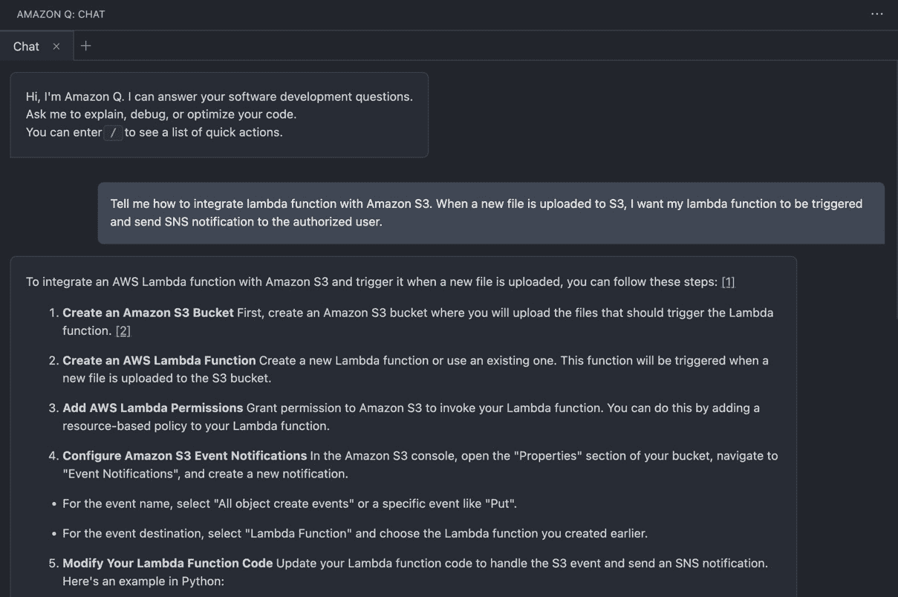

图 1.15 – Amazon Q Developer

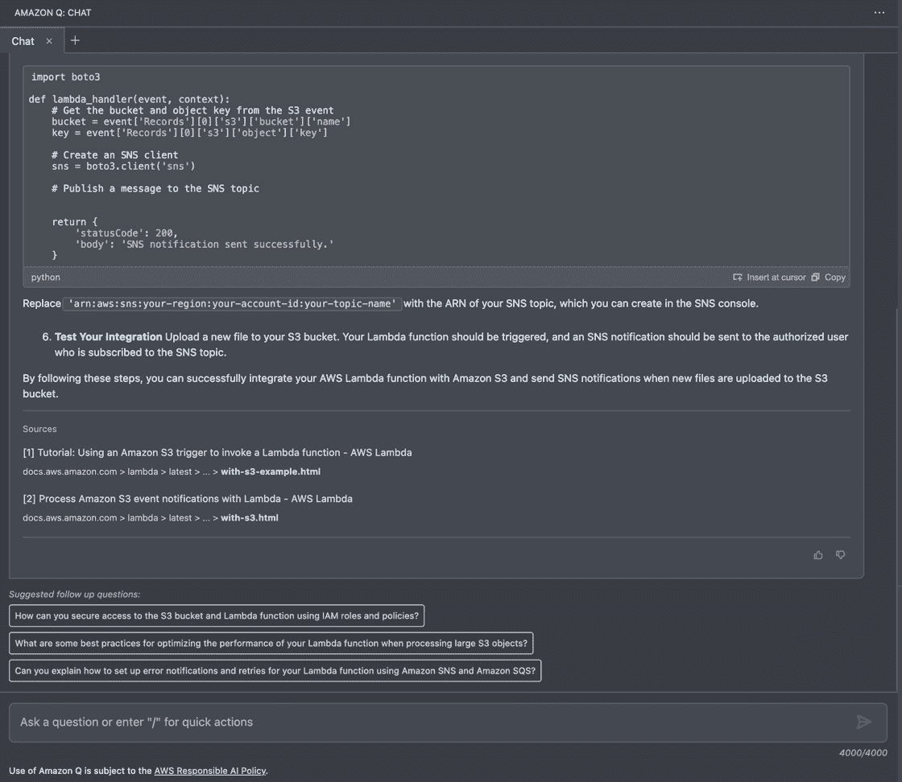

图 1.16 – Amazon Q Developer Lambda 函数

使用 Amazon Q，开发者可以简化他们的工作流程，从规划和发展到测试、部署和维护，最终使他们能够更快、更有信心地交付高质量的应用程序。

# Amazon Bedrock 上的生成式 AI 用例

自从生成 AI 的出现以来，众多组织已经从这种变革性技术的潜在应用中受益，以实现其商业目标。这些组织包括埃森哲、阿迪达斯、Intuit 和 Salesforce，它们已经成功开发了原型，甚至已经使用 Amazon Bedrock 部署了生产就绪的生成 AI 系统。在各个行业中，我们已经看到了许多令人信服的 Amazon Bedrock 生成 AI 用例。让我们更详细地了解一些这些行业：

+   **金融**: 在金融服务领域，组织一直在研究诸如对大量法律文件进行分类和分类、为客户选择最佳融资和投资计划、提供复杂金融文件的见解和简化摘要以及问答，以及检测伪造签名和篡改发票等欺诈活动等用例。此外，组织正在利用 Amazon Bedrock 来理解市场趋势和客户行为，帮助进行明智的决策过程。

+   **医疗保健**: 医疗保健行业在开发 Amazon Bedrock 的生成 AI 应用方面投入了大量资金。在撰写本文时，已宣布 AWS HealthScribe，它由 Amazon Bedrock 驱动（[`aws.amazon.com/healthscribe/`](https://aws.amazon.com/healthscribe/)）。这些应用涵盖了广泛的使用案例，例如自动化医疗索赔和裁决流程，从健康文件和医学研究论文中提取有价值的见解，以及生成患者-医生互动的摘要。通过利用 Amazon Bedrock，医疗保健提供者旨在提升患者护理并推动该领域的创新。

+   **媒体和娱乐**: 在媒体和娱乐行业，组织正在积极探索 Amazon Bedrock 的多样化应用。这包括在体育和广播中生成叙事和剧情，为故事讲述创建字幕、图像和动画，以及为电视节目、电影和其他形式的娱乐提供个性化推荐。通过利用 Amazon Bedrock 生成 AI 的能力，媒体和娱乐公司旨在提升用户体验，创造引人入胜的内容，并保持竞争优势。

这只是众多行业中正在研究的众多用例中的几个例子。在后续章节中，我们将了解通过 Amazon Bedrock 构建行业特定用例的架构模式。

# 摘要

在本章中，我们探讨了生成式 AI 领域的各个方面：从理解语言模型和开发各种自然语言处理（NLP）技术到当前最先进的（SOTA）Transformer 模型的发明。然后，我们讨论了在规模上构建生成式 AI 应用时遇到的工业挑战，以及亚马逊 Bedrock 如何无缝地解决这些挑战。

此外，我们探讨了亚马逊 Bedrock 提供的各种功能模块（FMs），并提供了如何利用各种框架和工具来评估和选择适合您用例的正确 FMs 的见解。我们还研究了亚马逊提供的其他生成式 AI 能力，包括亚马逊 SageMaker 和亚马逊 Q。我们通过揭示亚马逊 Bedrock 在金融服务、医疗保健和媒体娱乐领域的几个生成式 AI 用例来结束本章。

在下一章中，我们将发现几种访问亚马逊 Bedrock 的技术，并通过无服务器服务深入了解各种 API。此外，我们将学习一种实际的方法来调用 Bedrock FMs，这些 FM 可以集成到企业级应用中。
