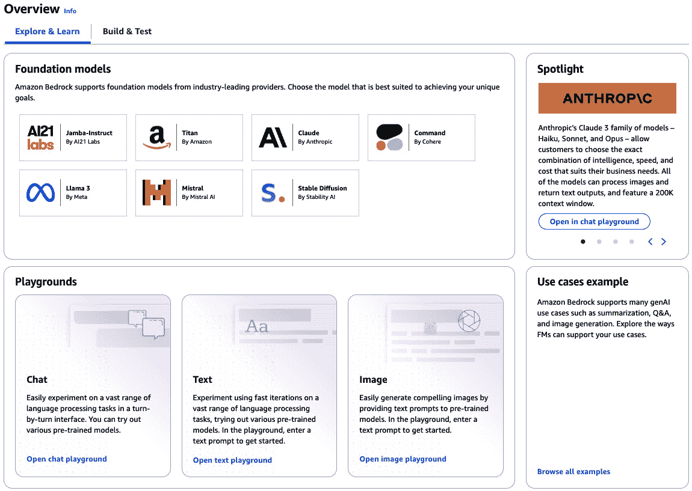
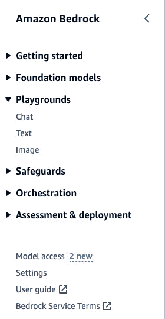
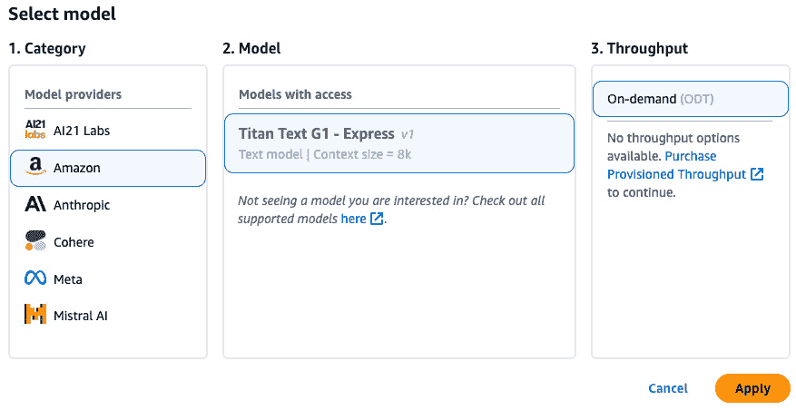
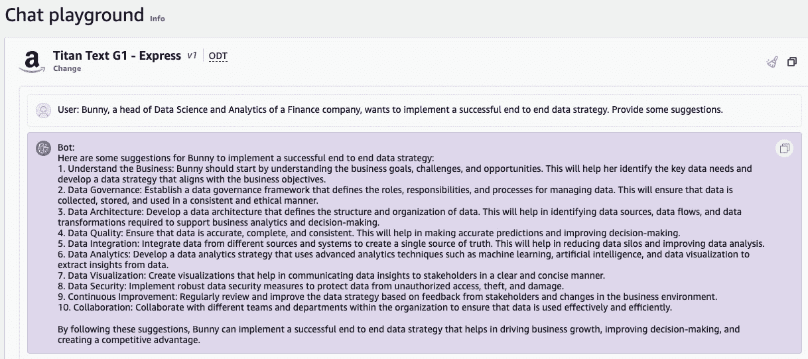
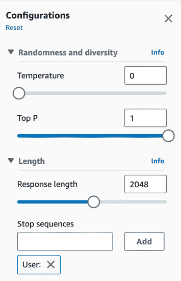
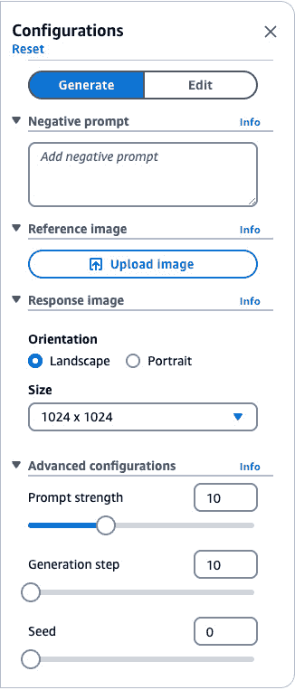
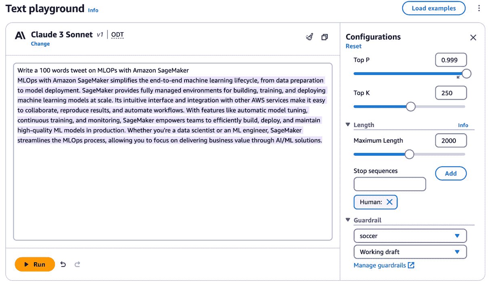
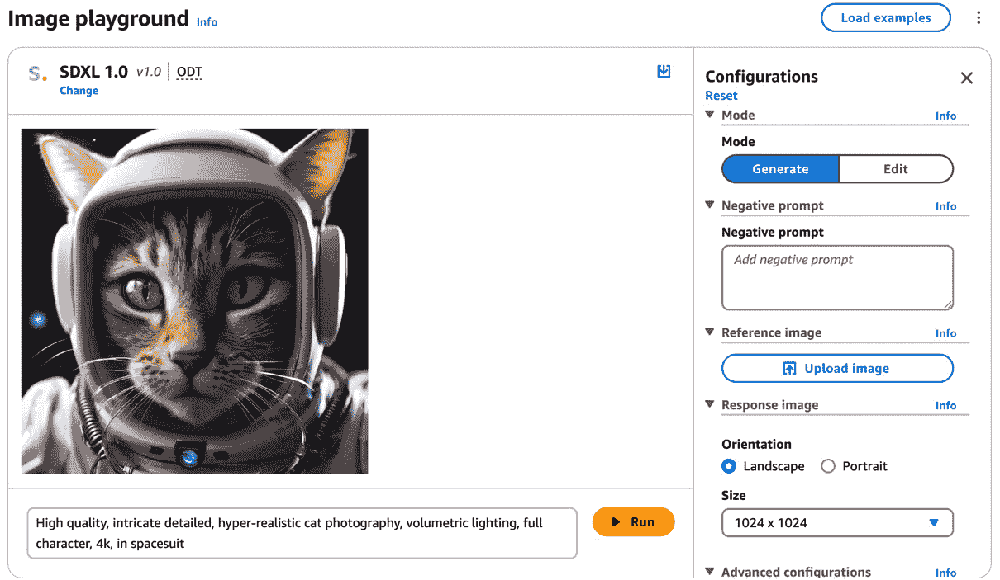
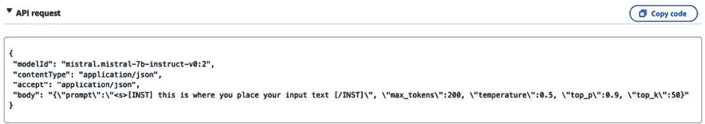
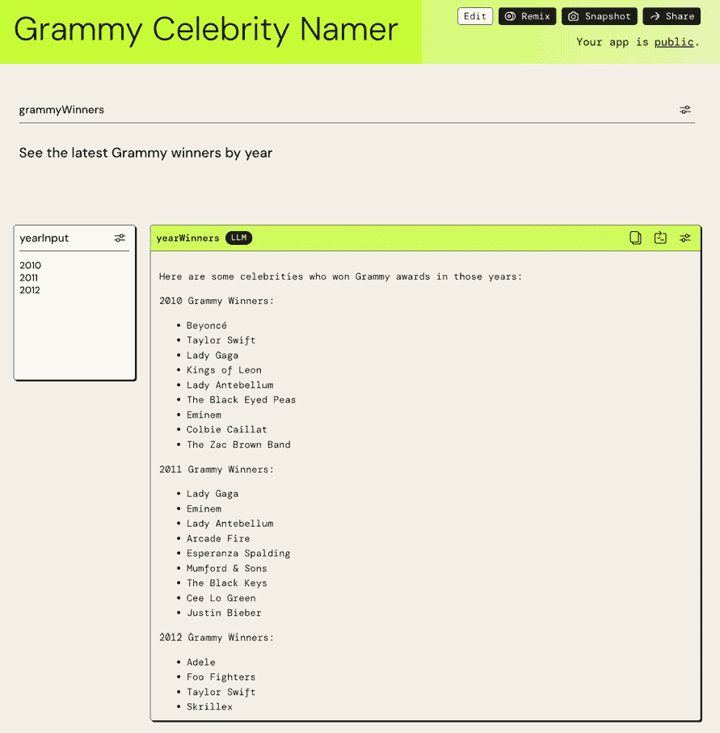

# 2

# 访问和利用 Amazon Bedrock 中的模型

本章提供了一本实用的指南，用于访问 Amazon Bedrock 并揭示其生成式 AI 功能。我们将从介绍调用 Bedrock 模型的不同接口开始，包括控制台游乐场、**命令行界面**（**CLI**）和**软件开发工具包**（**SDK**）。然后，我们将揭示一些核心的 Bedrock API，以及您可以在您的环境中运行的代码片段。最后，我们将展示如何在 LangChain Python 框架中利用 Bedrock 来构建定制化的管道，这些管道将连接多个模型，并深入了解 PartyRock，这是 Amazon Bedrock 的一个强大游乐场。

在本章结束时，您将能够通过利用 Amazon Bedrock 提供的 SOTA FM 来运行和执行应用程序，随着您对每个可用的 FM 的深入了解以及如何利用它们来满足您的需求，您还将能够加速您在构建新的生成式 AI 应用程序方面的创造性思维。随着我们深入构建 PartyRock 中的酷炫应用程序，并学习如何将 Amazon Bedrock 集成到不同的用例中，您将能够做到这一点。

本章将涵盖以下关键主题：

+   访问 Amazon Bedrock

+   使用 Amazon Bedrock API

+   Amazon Bedrock 集成点

# 技术要求

对于本章，您需要访问一个 **Amazon Web Services**（**AWS**）账户。如果您还没有，您可以去 [`aws.amazon.com/getting-started/`](https://aws.amazon.com/getting-started/) 创建一个。

完成此操作后，您需要安装和配置 AWS CLI ([`aws.amazon.com/cli/`](https://aws.amazon.com/cli/))，因为您需要它从您的本地机器访问 Amazon Bedrock FM。由于我们将执行的多数代码块都是基于 Python 的，因此设置 AWS Python SDK（Boto3）([`docs.aws.amazon.com/bedrock/latest/APIReference/welcome.html`](https://docs.aws.amazon.com/bedrock/latest/APIReference/welcome.html)) 将是有益的。您可以通过在本地机器上安装 Python、使用 AWS Cloud9、利用 AWS Lambda 或利用 Amazon SageMaker 来设置 Python。

注意

调用和定制 Amazon Bedrock 的 FM 将产生相关费用。请参阅 [`aws.amazon.com/bedrock/pricing/`](https://aws.amazon.com/bedrock/pricing/) 了解更多信息。

# 访问 Amazon Bedrock

当构建生成式 AI 应用程序时，您将面临令人眼花缭乱的选项。您应该使用哪个 FM？您将如何确保安全和隐私？您是否有支持大规模部署的基础设施？这就是 Amazon Bedrock 的作用。

如您所知，Amazon Bedrock 提供了访问来自该领域领先 AI 公司的 SOTA FM 的选择，包括 AI21 Labs、Anthropic、Cohere、Meta、Stability AI、Amazon 和 Mistral。通过单个 API，您可以访问跨文本、嵌入和图像等模态的尖端生成式 AI。您可以根据需要混合匹配模型以找到最佳匹配。Bedrock 在幕后处理供应、可扩展性和治理。因此，您可以选择最适合您需求的最佳模型，并简单地调用 Bedrock 无服务器 API 将这些模型插入到您的应用程序中。

因此，让我们跳转到 AWS 控制台，看看 Amazon Bedrock 的实际应用。

当您通过访问 https://console.aws.amazon.com/ 并在搜索栏中选择 Bedrock 来在 AWS 控制台中打开 Amazon Bedrock 时，您可以探索不同的 FM，以及一些学习工具，如图 *图 2.1* 所示：



图 2.1 – Amazon Bedrock – 概览

Amazon Bedrock 通过其沙盒界面为用户提供实验各种模型的灵活性。用户可以通过访问 Amazon Bedrock 登录页面并点击 **示例** 来打开沙盒环境，从 AWS 控制台中访问 Bedrock 沙盒。

注意

在撰写此书时，用户将需要首先通过导航到 Bedrock 控制台左侧面板中的 **模型访问** 链接来启用对模型的访问（如图 *图 2.2* 所示）。一旦您到达 **模型访问** 页面视图，您可以通过点击 **管理模型访问**，选择您想要用于用例的基本模型列表，然后点击 **保存更改**。用户将立即获得对这些模型的访问权限。用户还可以查看相邻基本模型的 EULA 协议，以查看其服务条款。

在沙盒中，您可以探索 Bedrock 中可用的不同生成式 AI 模型示例。这允许您在不配置资源或编写任何代码的情况下测试和交互这些模型。总的来说，沙盒为用户提供了一种方便的方式来尝试 Bedrock 生成模型的特性。*图 2.2* 描述了 Amazon Bedrock 控制台中的一些可用功能：



图 2.2 – Amazon Bedrock 的功能

在游乐场内，您可以选择基于**文本**、**聊天**和**图像**的示例进行探索。这使您能够在方便的沙盒环境中亲手实验最新的生成式 AI 模型。从对话聊天机器人到文本和图像生成，选项的广泛性让您能够亲身体验各种 AI 功能。通过提供易于访问的入口点，新兴的生成式 AI 对用户来说变得更加具体和易于理解。现在，让我们更详细地了解每个部分。

## Chat 游乐场

Amazon Bedrock 为您提供了访问聊天模型的方式，您可以在**Chat 游乐场**中进行实验。

**Chat 游乐场**是一个实验性界面，允许您测试通过 Amazon Bedrock 可用的对话式 AI 模型。您可以输入示例提示并查看由所选模型生成的响应。还会显示使用指标以评估模型的表现。还有一个比较模式，可以并排对比最多三个不同模型的输出。

如以下图所示，用户可以选择他们想要使用的模型（*图 2.3*）：



图 2.3 – 选择模型

此后，用户可以在聊天框中输入查询（*图 2.4*）：



图 2.4 – 在 Chat 游乐场中查询聊天模型

运行查询会从所选模型中获取信息。这允许您评估准确性、响应长度、延迟以及适用性等因素。选择最佳模型取决于权衡这些因素与个人需求。

在调用 FM 时，您将看到修改**推理参数**的选项，这样您就可以以某种方式影响模型的响应。虽然一些推理参数在 LLM 中是通用的，但图像模型有一组用户可以调整的独立参数。

让我们看看这些常见参数中的一些。

### LLM 推理参数

*温度*、*Top P*、*Top K*、*响应长度*、*停止序列*和*最大标记数*是我们将在本节中详细了解的推理参数。*图 2.5* 显示了它们在 Amazon Bedrock **Chat 游乐场**屏幕上；它们可以在**配置**窗口中找到：



图 2.5 – 常见 LLM 推理参数

让我们更仔细地看看：

+   **温度**：此参数控制输出中的随机程度。较低的温度会导致更确定性的输出，倾向于最可能的选项。另一方面，较高的温度会促进随机性，导致更广泛和多样化的创意输出。例如，在问答任务中，较低的温度确保了更事实性和简洁的回答，而如果你的用例涉及生成创意和多样化的输出，如创意写作或广告生成，那么增加温度值可能是有益的。

+   **Top K** 和 **Top P**：可以使用如 **Top K** 和 **Top P** 这样的采样技术来增强输出的连贯性和意义感。**Top K** 限制选项数量为指定数量，确保在随机性和连贯性之间保持平衡。另一方面，**Top P** 限制了预测概率低于指定阈值的预测，防止选择高度不可能的选项。这些技术有助于在生成连贯文本和保持一定程度的随机性之间取得平衡，使文本生成过程对读者来说更加自然和吸引人。

    使用这些参数可以平衡新颖性和流畅性。例如，可以将 **Top K** 设置为 70，**Top P** 设置为 0.8。这允许通过 **Top P** 设置使用一些不常见但仍然相关的单词，而 **Top K** 则保持对更常见单词的关注。结果是文本相当流畅，偶尔会混入一些新颖的单词。您可以通过对 **Top K** 和 **Top P** 使用不同的值来实验，以实现特定生成 AI 应用所需的创新性与流畅性之间的平衡。可以从大约 50 到 100 的 **Top K** 值和大约 0.7 到 0.9 的 **Top P** 值作为合理的初始设置开始。最佳值取决于模型大小、数据集和用例等因素。

+   `bedrock`，模型将在生成的文本中遇到单词 *bedrock* 时立即停止生成输出。

+   `用 100 个单词写一句话`。

### 图像模型推理参数

在使用 FM 进行图像生成时，几个关键参数会影响推理过程。例如，在稳定扩散模型的情况下，模型接收一个文本提示和一个随机噪声向量来生成图像。模型的几个配置设置可以影响最终生成的图像，如图 *图 2.6* 所示。6*：



图 2.6 – 图像模型推理参数

让我们更仔细地看看这些参数：

+   **提示强度**：这控制了随机程度。降低 **提示强度** 值会生成更随机的图像，而增加它则会生成更准确提示的表示。

+   **生成步骤**：与 **提示强度** 类似，增加 **生成步骤** 值会生成更复杂和详细的图像，而减少它则会生成更简单的图像。

+   **种子**：**种子**参数控制随机数生成器的初始状态，这会影响生成图像的整体随机性。需要注意的是，这些参数的精确值可能因具体用例和图像保真度与随机性之间的期望权衡而异。

要详细了解这些参数，请查看 Stable Diffusion 文档：[`platform.stability.ai/docs/api-reference#tag/Image-to-Image`](https://platform.stability.ai/docs/api-reference#tag/Image-to-Image)。

如果你正在使用 Amazon Titan Image Generator，你可以使用各种参数。你可以找到完整的列表在 [`docs.aws.amazon.com/bedrock/latest/userguide/model-parameters-titan-image.html`](https://docs.aws.amazon.com/bedrock/latest/userguide/model-parameters-titan-image.html)。

## 文本游乐场

**文本游乐场**为评估 Amazon Bedrock 中的生成文本模型提供了类似的功能。你可以输入文本提示，所选模型将在此基础上扩展或继续作为更长的生成文本段落，反映该提示。模型扩展的文本显示在游乐场的界面上。

然而，**文本游乐场**不管理对话上下文。本质上，它从放置在**文本游乐场**窗口中的文本末尾生成一系列最可能的标记。在**文本游乐场**中展示的行为是聊天行为的基本构建块，当在多个回合中串联起来时，它可以创建聊天体验。

因此，类似于**Chat 游乐场**，用户也可以导航到文本游乐场，选择另一个模型（例如，如*图 2.7*所示，Anthropic Claude 3 Sonnet），更新推理配置，并提示模型为他们的用例生成响应：



图 2.7 – 在文本游乐场中添加提示

## 图像游乐场

在**图像游乐场**中，你可以尝试两种不同的图像模型：Amazon Titan Image Generator 和 Stability AI 的 Stable Diffusion。如果你对这些听起来很陌生，请参阅*第一章*中同名的子章节。这些模型通过文本或图像生成图像，并执行修复、图像编辑等操作。让我们看看一个例子：



图 2.8 – 在图像游乐场中添加提示

如**图 2**.8 所示，当我们提供“**高质量、复杂细致、超现实主义猫摄影、体积光照、全角色、4k、宇航服**”作为提示时，模型会根据提供的文本生成图像。在配置中，您还可以选择提供**否定提示**值，告诉模型它不应该生成的内容。此外，您还可以提供**参考图像**值，模型将使用该图像作为生成图像的参考。在*第九章*中，我们将探讨如何使用 Amazon Bedrock 进行图像生成和编辑。

## 基于 API 的方法

使用统一的推理 API 的一大好处是，它允许您通过相同的界面轻松地尝试来自不同提供商的不同模型。即使新模型版本发布，您也可以通过最小的代码更改在您的端进行替换。

单一 API 抽象层充当绝缘层，保护您的应用程序代码免受底层模型实现细节的影响。这使您摆脱了供应商锁定，并赋予您采用最新模型的灵活性。有了这种一致的 API 来屏蔽这种复杂性，您可以专注于产品创新，而不是工程物流。

Amazon Bedrock 提供了一组可以直接访问和利用的 API，通过 *AWS CLI* 或 *AWS SDK*。

### AWS CLI

`list-foundation-models` API：

```py
$ aws bedrock list-foundation-models
```

同样，要调用模型（例如，Mistral 7B Instruct 模型），您可以调用 `bedrock-runtime` 的 `invoke-model` API。在撰写本文时，用户必须从控制台请求模型访问权限。一旦在系统中获得授权，就可以使用以下代码调用相应的模型：

```py
$ aws bedrock-runtime invoke-model \
  --model-id mistral.mistral-7b-instruct-v0:2 \
  --body "{\"prompt\":\"<s>[INST]100 words tweet on MLOps with
Amazon SageMaker [/INST]\", \"max_tokens\":200, \"temperature\":0.5}" \
  --cli-binary-format raw-in-base64-out \
  output.txt
```

在 `invoke-model` API 调用的 `body` 参数中，我们可以看到它是以特定格式编写的（`"{\"prompt\":\"<s>[INST]text [/INST]\"}`）。在调用模型时，不同的模型可能需要不同的提示结构。如果您在 AWS 控制台中搜索 Amazon Bedrock，可以查看发送给模型的实际 API 请求。按照以下步骤查看 API 请求：

1.  通过导航到 [`console.aws.amazon.com/`](https://console.aws.amazon.com/) 并在搜索栏中选择**Bedrock**，在 AWS 控制台中打开 Amazon Bedrock。

1.  在**入门**下选择**提供商**。

1.  选择您选择的任何提供商和模型。

1.  滚动到**模型**部分并展开**API 请求**。

在**图 2**.9 中，您可以看到来自 *Mistral 7B Instruct* 模型的 API 请求的 JSON 格式。在 API 请求的 `body` 参数中，我们可以看到模型需要的提示格式，以及推理参数：



图 2.9 – Mistral 7B Instruct API 请求

这使得用户输入的格式化和传递到底层 AI 系统的过程具有透明度。总的来说，沙盒允许用户不仅测试提示，还可以检查生成 AI 响应所发出的 API 请求。

### AWS SDK

AWS 为 JavaScript、Python、Java 等多种编程语言提供了 SDK。这些 SDK 提供了包装库，使得将 Bedrock API 调用集成到您的代码中变得容易。使用针对您选择的编程语言量身定制的 SDK 通常是有益的。查阅您选择语言的 SDK 文档可以提供有用的代码示例、使用指南和其他资源，以确保集成过程顺利进行（[`docs.aws.amazon.com/bedrock/latest/APIReference/welcome.html`](https://docs.aws.amazon.com/bedrock/latest/APIReference/welcome.html)）。

您可以通过 AWS SDK 从本地机器调用这些 Bedrock API，或者使用 AWS 服务，如 AWS Lambda、Amazon SageMaker Studio 笔记本、AWS Cloud9 等。使用 Python 的 AWS SDK（Boto3），您可以调用 Bedrock API 来构建 ML 工作流程。让我们看看 Amazon Bedrock 提供的 API 及其在 Python 的 AWS SDK（Boto3）中的使用示例。

到目前为止，我们已经探索了通过 Amazon Bedrock 提供的 FM 系列，通过实验各种提示和调整推理配置来产生期望的输出。我们直接通过 Amazon Bedrock 沙盒使用模型，并检查了利用 AWS CLI 和各种 SDK 来程序化调用 FM。

在建立这个工作知识的基础之后，我们将深入调查 Amazon Bedrock 的 API。下一节将帮助我们利用这些 API 在自定义生成 AI 应用中发挥 FM 的力量，同时为开发者提供更多控制和定制。我们将规划一个端到端的工作流程——从初始化客户端到生成输出——这将使您能够构建由工业级 FM 驱动的强大、可靠的生成应用。

# 使用 Amazon Bedrock API

与其他 AWS 服务一样，Amazon Bedrock 提供了几个 API。这些 API 可以放置在控制平面 API 下，用于管理、训练和部署 FM，以及在运行平面 API 下进行调用或推理请求。一些常见的控制平面 Bedrock API 包括**ListFoundationModels**、**GetFoundationModels**和**CreateModelCustomizationJob**。另一方面，运行平面 API 有两个 API：**InvokeModel**和**InvokeModelWithResponseStream**。

此外，还有与 Amazon Bedrock 的代理相关的单独 API，我们将在*第十章*中更详细地介绍。

您可以在 [`docs.aws.amazon.com/bedrock/latest/APIReference/`](https://docs.aws.amazon.com/bedrock/latest/APIReference/) 找到 Amazon Bedrock 支持的所有 API 调用完整列表，包括您可以执行的所有数据类型和操作。让我们看看一些常用的 Bedrock API 调用。

## ListFoundationModels

要利用 Bedrock 的生成能力，第一步是发现哪些 FM 通过该服务可用。**ListFoundationModels** API 获取有关基础模型的元数据，包括使用该模型生成内容所需的唯一模型 ID。

以下 Python 代码示例演示了如何调用 ListFoundationModels API 来列出可用的基础模型：

```py
import boto3
bedrock_client = boto3.client(service_name='bedrock')
bedrock_client.list_foundation_models()
```

让我们考虑一些目前通过 Amazon Bedrock 提供的基础模型及其相应的模型 ID。您使用模型 ID 作为一种方式来指示基础模型，当用户打算使用 InvokeModel ([`docs.aws.amazon.com/bedrock/latest/APIReference/API_runtime_InvokeModel.html`](https://docs.aws.amazon.com/bedrock/latest/APIReference/API_runtime_InvokeModel.html)) 或 InvokeModelWithResponseStream ([`docs.aws.amazon.com/bedrock/latest/APIReference/API_runtime_InvokeModelWithResponseStream.html`](https://docs.aws.amazon.com/bedrock/latest/APIReference/API_runtime_InvokeModelWithResponseStream.html)) 调用利用任何现有模型时。有了这些信息，就可以选择所需的模型并使用其 ID 调用其他 Bedrock 操作，例如 InvokeModel，以生成满足您应用程序需求的内容。

## GetFoundationModel

通过 Amazon Bedrock，开发者可以通过 **GetFoundationModel** API 调用来访问最先进的生成式 AI 模型。此操作检索有关指定基础模型的详细信息。例如，要返回 Meta 的 Llama 3 70B Instruct 模型的详细信息，您可以在 Python 中运行以下代码：

```py
import boto3
bedrock_client = boto3.client(service_name='bedrock')
bedrock_client.get_foundation_model(modelIdentifier='meta.llama3-70b-instruct-v1:0')
```

## InvokeModel

**InvokeModel** API 简化了机器学习模型的部署。只需几步 API 调用，您就可以安全地将训练好的模型部署到 AWS 基础设施上。这消除了管理复杂部署流程的需求，让您能够专注于 AI 应用程序的核心。

您可以使用请求体中提供的输入调用指定的 Bedrock 模型进行推理。InvokeModel API 允许您为各种模型类型运行推理，包括文本、嵌入和图像模型。这使用户能够通过将数据传递到模型并接收所需输出，利用通过 Amazon Bedrock 提供的预训练模型生成预测和洞察。

这里是一个将文本发送到 Meta 的 Llama 3 70 B 模型的 API 请求示例。推理参数取决于您将要使用的模型。

```py
import boto3
import json
model_id = 'meta.llama3-70b-instruct-v1:0' # change this to use a different version from the model provider
prompt_data = "What is the significance of the number 42?"
# Following the request syntax of invoke_model, you can create request body with the below prompt and respective inference parameters.
payload = json.dumps({
    'prompt': prompt_data,
    'max_gen_len': 512,
    'top_p': 0.5,
    'temperature': 0.5,
})
bedrock_runtime = boto3.client(
    service_name='bedrock-runtime',
    region_name='us-east-1'
)
response = bedrock_runtime.invoke_model(
    body=payload,
    modelId=model_id,
    accept='application/json',
    contentType='application/json'
)
response_body = json.loads(response.get('body').read())
print(response_body.get('generation'))
```

如前述代码块所示，`InvokeModel` 操作允许您对模型进行推理。`modelId` 字段指定了要使用的模型。获取 `modelId` 的过程取决于模型类型。通过利用 `InvokeModel` 操作并指定适当的 `modelId` 值，用户可以利用大量生成式 AI 模型的力量来获取相关的见解。

如果您正在使用 Anthropic Claude 模型，您可以使用 Messages API 创建会话式界面来管理用户与模型之间的聊天。以下是一个可以向 Anthropic Claude Sonnet 3 模型发送的 API 请求示例：

```py
import boto3
import json
bedrock_client = boto3.client('bedrock-runtime',region_name='us-east-1')
prompt = """
Task: Compose an email to customer support team.
Output:
"""
messages = [{ "role":'user', "content":[{'type':'text','text': prompt}]}]
max_tokens=512
top_p=1
temp=0.5
system = "You are an AI Assistant"
body=json.dumps(
        {
            "anthropic_version": "bedrock-2023-05-31",
            "max_tokens": max_tokens,
            "messages": messages,
            "temperature": temp,
            "top_p": top_p,
            "system": system
        }
    )
modelId = "anthropic.claude-3-sonnet-20240229-v1:0"
accept = "application/json"
contentType = "application/json"
response = bedrock_client.invoke_model(body=body, modelId=modelId, accept=accept, contentType=contentType)
response_body = json.loads(response.get('body').read())
print(response_body)
```

API 通过接受一系列交替包含 *用户* 和 *助手* 角色的消息来管理对话的来回流动。要了解更多关于 Messages API 的信息，您可以查看文档：[`docs.anthropic.com/claude/reference/messages_post`](https://docs.anthropic.com/claude/reference/messages_post)。

Amazon Bedrock 还允许您精确配置模型所需的吞吐量，以提供对应用程序的响应性能。使用 **Provisioned Throughput**，您可以选择模型所需的计算能力以满足您的工作负载需求和延迟要求。因此，对于 Amazon 和第三方基础模型，以及定制模型，用户在运行推理之前可以购买 Provisioned Throughput。此功能确保您获得模型所需的保证吞吐量，以实现最佳成本和性能。有关 Provisioned Throughput 的更多详细信息，请参阅此处：[`docs.aws.amazon.com/bedrock/latest/userguide/prov-throughput.html`](https://docs.aws.amazon.com/bedrock/latest/userguide/prov-throughput.html)。

## InvokeModelWithResponseStream

通过 Amazon Bedrock 可用的此流式推理方法允许 FM 生成按需的长篇连贯内容。而不是等待生成完成，应用程序可以流式传输结果。这允许您以更快的块发送来自模型的响应，而不是等待完整的响应。

使用流式处理进行推理时，您可以直接调用 Amazon Bedrock 提供的 `InvokeModelWithResponseStream` 操作。这将使用给定的输入在模型上运行推理，并以流的形式逐步返回生成的内容。

让我们看看 Claude V2 模型如何生成一篇关于量子计算的 500 字博客。

注意

以下代码片段在 Jupyter Notebook 环境中运行时有效。Jupyter Notebook 提供了额外的功能初始化，使得此代码能够正确运行。如果在没有 Jupyter 环境的终端中直接运行此片段，可能会导致错误。为了获得最佳结果，请在 Jupyter Notebook 中而不是在终端中直接运行此代码。

```py
from IPython.display import clear_output, display, display_markdown, Markdown
import boto3, json
brt = boto3.client(service_name='bedrock-runtime', region_name='us-east-1'
)
payload = json.dumps({
    'prompt': '\n\nHuman: write a blog on quantum computing in 500 words.\n\nAssistant:',
    'max_tokens_to_sample': 4096
})
response = brt.invoke_model_with_response_stream(
    modelId='anthropic.claude-v2',
    body=payload,
    accept='application/json',
    contentType='application/json'
)
streaming = response.get('body')
output = []
if streaming:
    for event in streaming:
        chunk = event.get('chunk')
        if chunk:
            chunk_object = json.loads(chunk.get('bytes').decode())
            text = chunk_object['completion']
            clear_output(wait=True)
            output.append(text)
            display_markdown(Markdown(''.join(output)))
```

这将连续打印出由模型产生的生成的博客文本。这种基于流的处理方法允许在 Claude V2 **编写**博客内容时实时显示输出。因此，流式推理为大型生成式模型解锁了新的实时和交互式用例。

在本节中，我们探讨了 Amazon Bedrock 的关键 API，所有这些 API 都允许我们构建生成式 AI 应用程序。我们回顾了如何列出通过 Amazon Bedrock 可用的 FM，并详细说明了如何调用这些模型以生成定制输出。接下来，我们将揭示 Amazon Bedrock 如何与 LangChain 集成以编排和解决复杂用例。通过利用 Bedrock 的 API 和 LangChain 的编排，开发者可以构建复杂的生成式解决方案。

# Converse API

Amazon Bedrock 的 `Converse API` 提供了一种标准化的方法来与通过 Amazon Bedrock 可用的 LLM 进行交互。它促进了用户和生成式 AI 模型之间的回合制通信，并确保支持函数（称为 **函数调用**）的模型具有一致的工具定义。

`Converse` API 的重要性在于其能够简化集成过程。之前，使用 `InvokeModel` API 需要适应来自不同模型提供者的各种 JSON 请求和响应结构。通过 `Converse` API，实现了对所有 Amazon Bedrock 上的 LLM 的请求和响应格式的统一，简化了开发并确保了一致的交互协议。

让我们通过一个使用 `Converse` API 进行文本生成场景的示例来了解其用法，该示例利用了 Anthropic Claude 3 Sonnet 模型。请确保您有调用 `Converse` API 所需的权限，因为您需要 `bedrock:InvokeModel` 操作的权限。

```py
# Install the latest version for boto3 to leverage Converse API. We start with uninstalling the previous version
%pip install boto3==1.34.131
# Import the respective libraries
import boto3
import botocore
import os
import json
import sys
#Ensure you have the latest version of boto3 to invoke Converse API
print(boto3.__version__)
#Create client side Amazon Bedrock connection with Boto3 library
region = os.environ.get("AWS_REGION")
bedrock_client = boto3.client(service_name='bedrock-runtime',region_name=region)
model_id = "anthropic.claude-3-sonnet-20240229-v1:0"
# Inference parameters
top_k = 100
temp = 0.3
# inference model request fields
model_fields = {"top_k": top_k}
# Base inference parameters
inference_configuration = {"temperature": temp}
# Setup the system prompts and messages to send to the model.
system_prompts = [{"text": "You are an expert stylist that recommends different attire for the user based on the occasion."}]
message_1 = {
    "role": "user",
    "content": [{"text": "Give me top 3 trending style and attire recommendations for my son's graduation party"}]
  }
messages = []
# Start the conversation with the 1st message.
messages.append(message_1)
# Send the message.
response = bedrock_client.converse(
        modelId=model_id,
        messages=messages,
        system=system_prompts,
        inferenceConfig=inference_configuration,
        additionalModelRequestFields=model_fields
    )
# Add the response message to the conversation.
output_message = response['output']['message']
print(output_message['content'][0]['text'])
```

请注意，将模型 ID 切换到 Amazon Bedrock 上可用的其他文本生成 FM，允许它使用 `Converse` API 运行。上面的代码示例以及其他 `Converse` API 示例已添加到 GitHub 仓库中，供读者在自己的账户中进行实验。

`Converse` API 还可以处理文档和图像。例如，您可以在消息中发送图像或文档，并使用 `Converse` API 让模型描述其内容。有关 `Converse` API 支持的模型和模型功能的更多详细信息，请访问 [`docs.aws.amazon.com/bedrock/latest/userguide/conversation-inference.html#conversation-inference-call`](https://docs.aws.amazon.com/bedrock/latest/userguide/conversation-inference.html#conversation-inference-call)

同样，**ConverseStream API** 使得向特定的 Amazon Bedrock 模型发送消息并接收连续流中的响应变得容易。它提供了一个统一的界面，该界面适用于 Amazon Bedrock 支持的所有基础模型进行消息传递。

要使用`ConverseStream` API，您可以使用`Converse` API 来调用它。请注意，您需要`bedrock:InvokeModelWithResponseStream`操作权限才能使用`ConverseStream`。

```py
# Send the message.
model_response = bedrock_client.converse_stream(
        modelId=model_id,
        messages=messages,
        system=system_prompts,
        inferenceConfig=inference_config,
        additionalModelRequestFields=additional_model_fields
    )
# # Add the response message to the conversation.
stream = model_response.get('stream')
if stream:
    for event in stream:
        if 'contentBlockDelta' in event:
print(event['contentBlockDelta']['delta']['text'], end="")
```

当您运行上述代码示例时，它将流式传输响应输出。有关`ConverseStream`的更多信息，请参阅[`docs.aws.amazon.com/bedrock/latest/APIReference/API_runtime_ConverseStream.html`](https://docs.aws.amazon.com/bedrock/latest/APIReference/API_runtime_ConverseStream.html)的文档。

# Amazon Bedrock 集成点

当构建端到端生成式 AI 应用时，架构师必须遵循 AWS Well-Architected Framework 支柱中概述的安全、性能、成本优化和延迟降低的最佳实践。这些实践帮助开发者权衡在 AWS 上创建端到端系统时的不同选择和优化。有关 AWS Well-Architected Framework 的更多信息，请参阅[`docs.aws.amazon.com/wellarchitected/latest/framework/welcome.html`](https://docs.aws.amazon.com/wellarchitected/latest/framework/welcome.html)。

许多希望构建聊天机器人、虚拟助手或摘要系统等对话界面的客户将 Amazon Bedrock 的无服务器 API 与其他服务集成。有用的集成点包括 LangChain 和 AWS Step Functions 等编排框架，这些框架可以通过 AWS Lambda 调用 Amazon Bedrock 模型。

随着客户采用 LLMOps 方法来优化企业应用中 LLMs 的构建、扩展和部署，这些集成工具和框架越来越被广泛采用。无服务器 API、编排层和 Lambda 函数创建了一个强大且可扩展的管道，用于提供性能优异且成本效益高的生成式 AI 服务。

## Amazon Bedrock 与 LangChain 集成

现在，让我们通过介绍 LangChain 与 Amazon Bedrock 的集成，将我们对 Amazon Bedrock 和生成式 AI 应用的理解提升到新的水平！

LangChain 是一个革命性的框架，它赋予开发者构建高级语言模型和生成类似人类文本的能力。通过连接各种组件，您可以创建以前难以想象的高级用例。例如，如果您在金融服务行业工作，您可以创建一个应用程序，该应用程序可以提供见解、简化摘要和复杂金融文件的问答，通过使用 LangChain 框架，您可以抽象 API 的复杂性。通过将 Bedrock 和 LangChain 结合在一起，开发者可以同时获得两者的最佳之处。需要 AI 助手、搜索引擎或内容生成器？使用 Bedrock 启动一个强大的模型，然后使用 LangChain 的模板和管道来制作完美的提示并处理输出。这种模块化方法允许极大的灵活性，根据您的需求变化而适应。通过通过 LangChain 创建自定义提示模板，您可以在每次运行时传递不同的输入变量。这允许您生成针对特定用例的内容，无论是响应客户反馈还是制作个性化的营销信息。

开始使用非常简单！LangChain 的 Bedrock API 组件提供了一个简单的方法，在 LangChain 管道内调用 Bedrock API。只需几行代码就可以启动一个请求，将您的输入传递给强大的模型，并返回结果。从那时起，您的应用程序就拥有了一个强大、可扩展的 AI 后端，随时可用。

以下代码片段展示了您如何轻松利用 LangChain 与 Amazon Bedrock。

注意

在运行以下代码之前，请确保您已安装 LangChain 包的最新版本。如果没有，请运行旁边提供的包安装单元格，以在您的环境中安装 LangChain。或者，您可以从[`pypi.org/project/langchain/`](https://pypi.org/project/langchain/)下载该包。

```py
# Installing LangChain
!pip install langchain
#import the respective libraries and packages
import os
import sys
import json
import boto3
import botocore
# You need to specify LLM for LangChain Bedrock class, and can pass arguments for inference.
from langchain.llms.bedrock import Bedrock
#Create boto3 client for Amazon Bedrock-runtime
bedrock_client = boto3.client(service_name="bedrock-runtime", region_name='us-east-1')
#Provide the respective model ID of the FM you want to use
modelId="amazon.titan-tg1-large"
#Pass the Model ID and respective arguments to the LangChain Bedrock Class
llm = Bedrock(
    model_id=modelId,
    model_kwargs={
        "maxTokenCount": 4096,
        "stopSequences": [],
        "temperature": 0,
        "topP": 1,
    },
    client=bedrock_client,
)
#Provide Sample prompt data
prompt_data = "Tell me about LangChain"
#Invoke the LLM
response = llm(prompt_data)
print(response)
```

如前述代码片段所示，用户可以通过利用 LangChain Bedrock 类的 LLM 轻松调用特定模型，并传递相应的 FM 推理参数来使用简单的提示。

## 创建 LangChain 自定义提示模板

通过为提示创建模板，您可以在每次运行时向其传递不同的输入变量。这在您需要生成具有不同输入变量的内容时很有用，这些输入变量可能来自数据库：

```py
#import the respective libraries and packages
import os
import sys
import boto3
import json
import botocore
# You need to specify LLM for LangChain Bedrock class, and can pass arguments for inference.
from langchain_aws import BedrockLLM
#Create boto3 client for Amazon Bedrock-runtime
bedrock_client = boto3.client(service_name="bedrock-runtime", region_name='us-east-1')
from langchain.prompts import PromptTemplate
# Create a prompt template that has multiple input variables
multi_var_prompt = PromptTemplate(
    input_variables=["leasingAgent", "tenantName", "feedbackFromTenant"],
    template="""
<s>[INST] Write an email from the Leasing Agent {leasingAgent} to {tenantName} in response to the following feedback that was received from the customer:
<customer_feedback>
{feedbackFromTenant}
</customer_feedback> [/INST]\
"""
)
# Pass in values to the input variables
prompt_data = multi_var_prompt.format(leasingAgent="Jane",
                                 tenantName="Isabella",
                                 feedbackFromTenant="""Hi Jane,
     I have been living in this apartment for 2 years now, and I wanted to appreciate how lucky I am to be living here. I have hardly faced any issues in my apartment, but when any issue occurs, administration staff is always there to fix the problem, and are very polite. They also run multiple events throughout the year for all the tenants which helps us socialize. The best part of the apartment is it's location and it is very much affordable.
     """)
#Provide the respective model ID of the FM you want to use
modelId = 'mistral.mistral-large-2402-v1:0' # change this to use a different version from the model provider
#Pass the Model ID and respective parameters to the Langchain Bedrock Class
llm = BedrockLLM(
    model_id=modelId,
    model_kwargs={
        "max_tokens": 4096,
        "temperature": 0.5,
        "top_p": 0.5,
        "top_k":50,
    },
    client=bedrock_client,
)
```

现在，我们可以使用提示模板调用 Bedrock，以查看精心挑选的响应：

```py
response = llm(prompt_data)
email = response[response.index('\n')+1:]
print(email)
```

这种集成展示了 LangChain 框架如何促进复杂基于语言的任务的创建。在这个例子中，Bedrock API 充当 LangChain 组件和底层语言模型之间的桥梁。

因此，通过集成 LangChain 和 Amazon Bedrock，开发者可以利用 LangChain 的高级功能，如提示模板、管道和与其他 AI 服务的编排能力，来创建动态和自适应的应用程序。

## PartyRock

现在我们已经讨论了如何使用不同的技术访问和探索 Amazon Bedrock 以用于您的应用程序，让我们看看另一个有趣的功能。Amazon 还通过**PartyRock**（Amazon Bedrock 的强大游乐场）为实验者和爱好者提供了一个快速构建和部署有趣且直观的应用程序的机制。在 PartyRock 中，您可以创建多个应用程序并实验 Amazon Bedrock。例如，您可以为您的 5 岁孩子创建一个优化的派对计划和预算工具。

在**图 2.10**中，我们创建了一个示例应用程序，可以根据用户在应用程序中输入的年份列出不同的格莱美获奖者。用户只需简单地点击提供的链接，并在左侧面板中输入特定的年份（或每行中的年份）。输入特定的年份或几个年份后，系统将在右侧面板中生成格莱美获奖者。您可以在[`partyrock.aws/u/shikharkwtra/jAJQre8A0/Grammy-Celebrity-Namer`](https://partyrock.aws/u/shikharkwtra/jAJQre8A0/Grammy-Celebrity-Namer)查看该应用程序。



图 2.10 – PartyRock 示例 – 格莱美名人命名器

PartyRock 为构建者提供了访问来自 Amazon Bedrock 的 FMs 的权限，以学习提示工程和生成式 AI 的基础知识。鼓励用户使用 PartyRock 构建一些酷炫的应用程序，并进一步了解 Amazon Bedrock。只需简单地导航到[`partyrock.aws/`](https://partyrock.aws/)，点击**Build your own app**，就可以开始你的生成式 AI 应用开发者之旅在 PartyRock 上！

# 摘要

在进入下一章之前，让我们快速回顾一下本章所涵盖的内容。首先，我们探讨了如何通过 AWS 控制台访问 Amazon Bedrock。利用 Bedrock 控制台，我们查询了**文本**、**聊天**和**图像游乐场**API，并实验了各种推理参数以分析它们对模型输出的影响。除了通过 Bedrock 控制台与模型交互之外，我们还研究了通过 AWS CLI 和 AWS SDK 访问 FMs 的方法。

通过利用 CLI 和 SDK，我们能够揭示一些底层的 Bedrock API，这些 API 可以用来列出可用的 FMs，检索它们的详细信息，并调用它们。我们通过查看 Amazon Bedrock 的一些集成点来结束这一章，包括流行的 LangChain 框架，并对 PartyRock 进行了简要概述，它是在 Amazon Bedrock 中测试提示和构建有趣应用程序的强大游乐场。

现在我们对 Amazon Bedrock 有了良好的概念理解，并且能够访问各种 Bedrock 模型，在下一章中，我们将探讨一些在使用 Amazon Bedrock 时可以实施的有效提示工程技巧。
