# 第四章：定制模型以提升性能

当通用模型无法满足你特定领域用例的满意结果时，定制 FM 就变得至关重要。本章将深入探讨定制 FM 的过程，同时使用微调和持续预训练等技术来提升其性能。我们将首先检查定制基础 FM 的理由，并探讨微调的机制。随后，我们将深入研究数据准备技术，以确保我们的数据格式适当，以便使用 AWS 控制台和 API 创建自定义模型。我们将了解模型定制中的各种组件以及你可以从应用程序中调用的不同定制 API。

此外，我们将分析模型的行为并执行推理。最后，我们将通过讨论定制 Bedrock 模型的指南和最佳实践来结束本章。

在本章结束时，你将能够理解为特定领域用例定制模型的重要性和过程。

本章将涵盖以下关键主题：

+   为什么定制 FM 很重要？

+   理解模型定制

+   准备数据

+   创建自定义模型

+   分析结果

+   指南和最佳实践

# 技术要求

对于本章，你需要访问一个 *AWS* 账户。如果你没有，你可以访问 [`aws.amazon.com/getting-started/`](https://aws.amazon.com/getting-started/) 并创建一个 AWS 账户。

一旦你有了 AWS 账户，你需要安装和配置 AWS CLI ([`aws.amazon.com/cli/`](https://aws.amazon.com/cli/))，以便从你的本地机器访问 Amazon Bedrock FM。此外，你还需要设置 AWS Python SDK (Boto3)，因为我们将执行的多数代码单元格都需要它 ([`docs.aws.amazon.com/bedrock/latest/APIReference/welcome.html`](https://docs.aws.amazon.com/bedrock/latest/APIReference/welcome.html))。你可以通过在你的本地机器上安装 Python、使用 AWS Cloud9、利用 AWS Lambda 或利用 Amazon SageMaker 来设置 Python。

注意

使用和定制 Amazon Bedrock 的 FM 将会产生费用。请参阅 [`aws.amazon.com/bedrock/pricing/`](https://aws.amazon.com/bedrock/pricing/) 了解更多信息。

# 为什么定制 FM 很重要？

在上一章中，我们探讨了几个提示工程技术来提高模型性能。正如我们在 *第一章* （如图 *4**.1* 所示）中看到的那样，这些 FM 在海量数据（GBs、TBs 或 PBs）上训练，拥有数百万到数十亿个参数，这使得它们能够理解上下文中词语之间的关系，以预测后续序列：

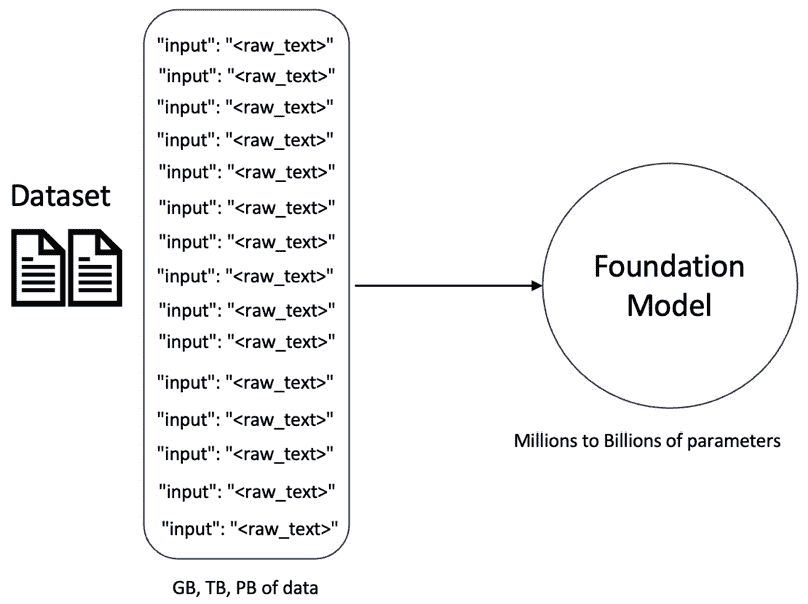

图 4.1 – 训练 FM

*那么，为什么我们需要定制这些模型呢？*

这是一个合理的问题，因为许多用例可以直接通过使用提示工程和 RAG 技术来解决（我们将在*第五章*中介绍）。然而，考虑一种情况，你需要模型遵守特定的写作风格、输出格式或特定领域的术语。例如，你可能需要模型准确地分析财务收益报告或医疗记录。在这种情况下，预训练模型可能没有接触到所需的写作风格或专业词汇，尽管提示工程或 RAG 的实施是有效的，但它们的性能仍然受限。

为了弥合这一差距并增强模型在特定领域的语言理解和生成能力，定制变得至关重要。通过在特定领域数据上微调预训练模型或调整它们以适应所需的写作风格或输出格式，你可以调整其性能以满足你的独特需求，确保更准确和相关的响应：

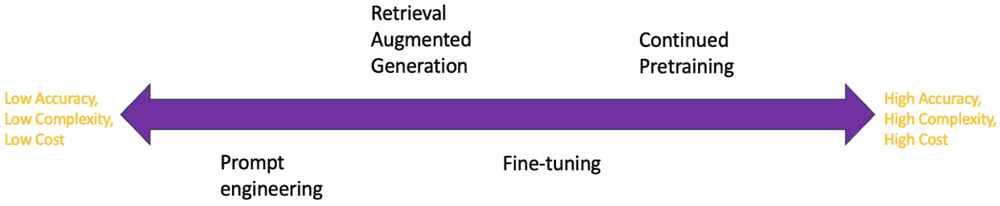

图 4.2 – 生成式 AI 性能技术

如果你查看 *图 4**.2* 中显示的生成式 AI 性能技术谱系，以改进 FM 的性能，它从提示工程到从头开始训练模型。对于特定领域的数据，提示工程技术可能提供较低的准确性，但它们涉及较少的努力且成本效益高。如果你有一个简单的任务且不需要新的特定领域数据集，提示工程是一个更好的选择。如果你想了解提示工程是如何工作的，请回到*第三章*。

在谱系中，随着复杂度、成本和准确性的略微增加，接下来是 RAG 技术。这种技术从语言模型外部获取数据，例如从内部知识库或外部来源。当你拥有大量不适合模型上下文长度的文档语料库时，这是一个特别有用的技术。我们将在*第五章*中更详细地讨论 RAG。

在谱系的进一步位置，定制模型本质上需要更多的时间和成本。然而，它为你的特定用例提供了更高的准确性。

在 Amazon Bedrock 中有两种定制技术：微调和持续预训练。

在**微调**中，模型使用带标签的数据集进行训练——这是一种监督学习方法。您提供的带标签数据集将针对您的特定用例。无论您在医疗保健、金融还是任何其他领域工作，您都可以微调您的模型，使其成为该特定领域的专家。例如，在医疗保健领域，模型可以针对医学专业进行微调，使其能够以更高的准确性理解和解释医疗记录。同样，一个财务分析模型可以针对特定领域的财务分析进行微调，使其能够识别出传统算法可能错过的金融数据中的模式和趋势。

要使用您自己的数据微调模型，您需要拥有足够数量的与您想要执行的任务相关的高质量数据。这些数据应该是标记和注释的，以便为模型提供训练所需的必要信息。如图*4.3*所示，我们可以使用这个标记数据集来微调基础 FM，然后生成一个定制模型。然后，您可以使用这个定制模型生成针对您特定领域和用例的响应：

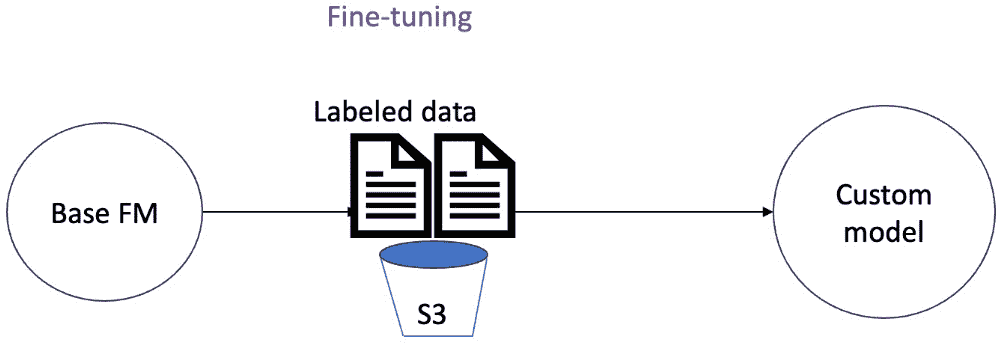

图 4.3 – 微调

例如，假设您在医疗行业工作，并希望总结两位医生讨论患者医疗报告的对话，提取需要放入医疗表格的信息，也许还可以用通俗易懂的语言来撰写。

在这种情况下，基础 FM 可能没有在特定领域的数据集上进行训练。因此，这是一个示例场景，当我们进行微调时，我们将向模型提供标记示例，说明提示和响应应该如何呈现。

在**持续预训练**中，我们适应新的领域或训练模型学习不熟悉领域的术语。这涉及到向 FM 提供额外的连续训练，同时利用大量未标记数据。当我们说未标记数据时，意味着没有目标标签，模型将从提供的文本中学习模式。这与微调形成对比，微调涉及使用较小量的标记数据。*图 4.4*突出了持续预训练和微调所需的标记数据与未标记数据之间的差异：

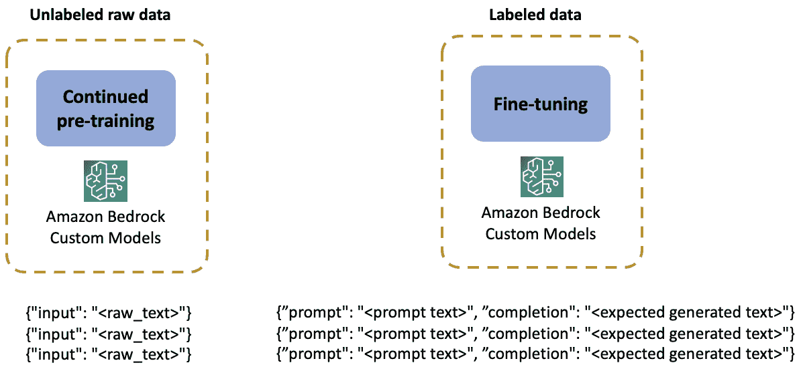

图 4.4 – 未标记数据与标记数据

持续预训练的例子可能包括训练模型学习金融行业的术语，以便它能够理解财务报告，或者通过提供大量来自书籍的信息来训练模型学习量子物理学，这样它将能够以更高的准确性评估/预测与弦理论相关的标记。假设两位物理学家正在讨论弦理论，我们将这个对话作为上下文传递给基础 FM（如图*4.5*所示）：


图 4.5 – 量子物理学家对话和问题

可能的情况是，我们在这里使用的基 FM 对量子物理不熟悉——也就是说，基 FM 尚未在涉及量子物理的数据集上训练过。

因此，当我们向模型提出诸如“E8 x E8 对称群是什么？”这样的问题时，模型会幻想并无法解释这个概念，因为它不了解弦理论。

通过持续的预训练，我们通过向基础 FM 提供大量未标记数据集来在未知领域训练模型。例如，我们可以在*准备数据*部分所述的期望格式上训练关于量子计算的书本模型，从而创建一个自定义模型（如图*图 4**.6*所示）：

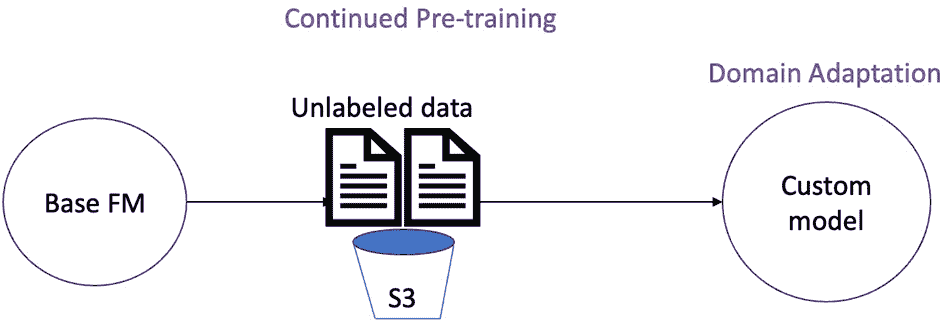

图 4.6 – 持续的预训练

持续的预训练带来了一定的挑战。由于我们正在训练整个模型，权重和偏差需要大量的计算资源和多样化的未标记文本数据。

当您决定是否使用自定义模型而不是其他方法，如提示工程和 RAG 时，有几个因素会发挥作用。这些包括您正在处理的任务、数据的可用性、计算资源和成本。以下是一些指导方针，以帮助您做出明智的决定：

+   **复杂度级别**：当您有复杂任务且需要模型理解复杂细节时，创建自定义模型特别有用。

+   **专业数据**：在创建自定义模型时，拥有足够数量的专业数据将带来显著的结果。在开始训练过程之前，请确保您的数据是干净的（无错误、不一致和重复），并且已经准备好（格式化、转换并分成适当的子集）。

+   **计算资源和成本**：当您创建自定义模型时，您需要购买预留吞吐量，这为您提供了部署模型的专用容量。请确保您根据模型类型和承诺条款审查价格。我们将在本章的*分析结果*部分详细讨论预留吞吐量。

此外，创建自定义模型使您能够更好地控制模型如何响应。您可以精确地根据您的需求进行定制，使其适合需要精细定制的任务，例如以特定的语气、方言或包容性语言进行响应。

在我们开始我们的第一个模型定制工作之前，让我们了解一些模型定制的关键概念。

# 理解模型定制

微调和持续预训练背后的原理来自广泛的概念**迁移学习**，正如其名称所暗示的，它涉及将从一个问题获得的知识转移到其他通常相关但不同的问题上。这种做法在**机器学习**（**ML**）领域被广泛采用，以提高模型在新任务或领域上的性能。

模型定制是一个五步过程：

1.  **确定你的用例和数据**：确定用例/任务以及它是如何解决你组织业务目标的，这是一个关键步骤。你是想总结法律文件，对医疗报告进行问答，还是做其他事情？一旦确定了用例，你必须收集足够的相关数据集，以便你可以用于模型定制。数据集应包含模型可以从中学习复杂细节的示例。记住，你的定制模型在特定任务用例上的表现取决于你为训练提供的训练数据集的质量。

1.  **准备数据集**：一旦收集了数据集，你必须对其进行清理和预处理。对于微调，你需要有**JSON 行**（**JSONL**）格式的标记示例。对于持续预训练，你需要有 JSONL 格式的未标记示例。我们将在*准备数据*部分更详细地讨论这一点。

1.  **选择基础预训练模型**：一旦准备好的数据集，你必须选择一个现有的基础预训练模型，你希望对其进行微调。你可以查看模型提供者的网站来了解模型属性。如果它适合你的用例，尝试提示工程技术来检查哪个模型最接近你想要的结果，并使用 Amazon Bedrock 中的**模型评估**或**模型排行榜**来评估 FM：

    +   *模型评估*：Bedrock 提供了两种不同的评估方法：自动评估和人工评估。自动评估使用预定义的指标，如准确率、鲁棒性和毒性筛选，而人工评估则可以定义自定义指标，如友好性、风格遵循或与品牌声音的一致性。我们将在*第十一章*中对模型评估进行更详细的讨论。

    +   *模型排行榜*：有多个排行榜可以根据模型在各项任务上的性能进行排名，例如文本生成、摘要、情感分析等。其中一些最受欢迎的排行榜包括**通用语言理解评估**（**GLUE**）、SuperGLUE、HELM 和 HuggingFace 的 OpenLLM。

    请注意，虽然通过排行榜了解 FM 的性能是好的，但对于实际应用场景，你必须谨慎，不要仅仅依赖排行榜，因为它们可能缺乏反映现实世界复杂性的鲁棒性。

1.  **配置并启动微调作业**：一旦你确定了基础 FM 并且数据集准备就绪，你可以通过指定超参数、数据集的输入和输出 S3 路径以及存储指标，以及网络和安全设置来配置微调作业。我们将在“*创建自定义模型*”部分更详细地讨论这一点。

1.  **评估和迭代**：一旦模型准备就绪，你可以根据模型存储的指标和日志来评估和分析它。为此，你可以留出一个验证集，它提供了你创建的自定义模型的性能指标。我们将在“*分析结果*”部分更详细地讨论这一点。

当我们定制模型时，Amazon Bedrock 会创建一个基础 FM 的副本，我们实际上是在更新其模型权重。**权重**是**人工神经网络**（**ANNs**）中的关键组件，它们附着在输入（或特征）上。这些权重定义了哪些特征在预测输出和提升特定任务方面是重要的。*图 4.7* 展示了一个简化的 ANN 架构，其中这些输入及其权重通过**求和**和**激活函数**（两者均在模型算法中定义）进行处理，以获得输出（**Y**）。

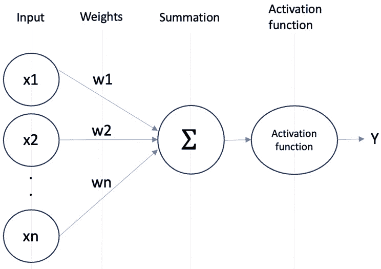

图 4.7 – 简化的人工神经网络

想要深入了解人工神经网络（ANNs），网上有大量的教程和课程可供选择，它们提供了关于神经网络概念、架构和训练技术的深入解释和示例。此外，像《神经网络与深度学习，迈克尔·尼尔森， Determination Press》和《深度学习，伊恩·古德费洛，约书亚·本吉奥，阿隆·库维尔，MIT Press》这样的教科书经典之作，提供了全面的理论和数学基础。

当我们执行模型定制（微调或继续预训练）时，我们会更新模型权重。在更新模型权重时，可能会出现一个常见问题，称为**灾难性遗忘**。这是当模型由于权重修改开始忘记它最初训练的一些信息时，这可能导致在更通用的任务上性能下降。一般来说，这可能是由于训练数据过拟合，这意味着模型对训练数据提供了准确的响应，但不能很好地泛化，并在新信息上提供较差的性能。此外，定制模型可能成本高昂且资源密集，这需要大量的内存使用。

为了克服这些挑战，论文《Parameter-Efficient Transfer Learning for NLP》（[`arxiv.org/pdf/1902.00751`](https://arxiv.org/pdf/1902.00751)）中引入了一种称为**参数高效微调**（**PEFT**）的技术。

注意，在撰写本文时，Bedrock 不支持 PEFT。然而，了解 PEFT 技术是有益的。

## PEFT

在 PEFT 中，你不需要微调所有模型参数，这可能会非常耗时、资源密集且成本高昂。相反，它冻结了模型的大部分权重，而你只需要训练其中的一小部分。这使得它内存和计算效率高，更不容易发生灾难性遗忘，并且存储在硬件上的成本更低。

在微调 LLM 时，各种技术可以减少可训练参数的数量以提高效率。我们可以将这些 PEFT 方法分为三个主要类别：

+   **选择性方法**：这些方法在微调过程中仅更新原始 LLM 的某些组件或层。这允许你专注于模型中最相关的部分。然而，与全量微调相比，它可能导致性能次优。

+   **重新参数化方法**：这些方法引入低秩矩阵以压缩原始权重。例如，**大型语言模型的低秩适应**（LoRA）。这减少了参数数量，同时仍然修改了整个模型。权衡是训练期间内存使用增加。

+   **加性方法**：这些方法保持 LLM 的原始权重不变，并为特定任务的适应添加新的可训练层。例如，**适配器**这样的加性方法会在 transformer 架构的编码器或解码器组件内部添加可训练层。

选择 PEFT 方法时，需要在参数和内存效率与模型质量、训练速度和成本之间进行权衡。选择性更新模型的一部分提供了这种权衡的一端，而适配器和提示则牺牲了一些架构变化以最大化参数效率。

有了这些，我们已经从非常高的层次上涵盖了 PEFT 及其技术。然而，如果你对它感兴趣并想了解更多，请访问[`github.com/huggingface/peft`](https://github.com/huggingface/peft)。此外，*使用大型语言模型进行生成式 AI*课程提供了关于 PEFT 方法的深入信息：[`www.deeplearning.ai/courses/generative-ai-with-llms/`](https://www.deeplearning.ai/courses/generative-ai-with-llms/)。

## 超参数调整

除了 PEFT 这样的微调技术之外，**超参数调整**在确保模型保留其预训练知识方面也起着重要作用。超参数是控制模型训练过程的配置设置，就像可以调整和微调的旋钮一样。模型有多种超参数，包括学习率、训练轮数、批量大小、beta、gamma 等。每个模型可能需要通过实验找到不同的最佳超参数值集，以实现最佳性能和准确性。

**学习率**超参数控制模型适应任务的速度。它还控制模型参数在训练过程中的每次迭代中调整的程度。它决定了模型参数根据计算出的梯度（代表最小化损失函数所需变化的方向和幅度）更新的步长。

让我们考虑一个可能有助于你可视化学习率的类比。

想象一下，你正在尝试在一个多山的景观中找到最低点，但你被蒙上了眼睛。你只能感觉到你站立的斜坡的陡峭程度（梯度）并相应地迈步。学习率决定了这些步子应该有多大或有多小：

+   如果学习率太高，你可能会超出最低点，最终到达山的另一边，不断超出，永远不会收敛到最优解

+   如果学习率太低，你可能会迈出很小的步子，卡在高原上，或者以痛苦缓慢的速度向最低点前进

理想的学习率允许你采取合理大小的步骤，逐渐接近最低点（最优模型参数集），而不会超出或陷入停滞。

在实践中，找到最佳学习率通常是一个实验和调整的问题。不同的模型和数据集可能需要不同的学习率才能有效地收敛。

现在我们已经理解了微调背后的概念，让我们通过准备数据开始定制过程。

# 准备数据

我们已经看到为什么定制模型对于提高其准确性和性能很重要。我们还看到，持续预训练是一种无监督学习方法，需要未标记的数据，而微调是一种监督学习方法，需要标记的数据。

我们提供给模型的数据类型可以改变模型响应的方式。如果数据有偏差或具有高度相关的特征，你可能无法从训练过的定制模型中获得正确的响应。这对于你正在训练的任何机器学习模型都是正确的，因此提供高质量的数据至关重要。虽然我不会在本书中涵盖数据处理和特征工程的概念，但我想要强调它们的重要性。如果你希望了解更多关于这些概念的信息，你可以通过任何机器学习课程和书籍来学习，例如 Aurélien Géron 的《动手机器学习：基于 Scikit-Learn、Keras 和 TensorFlow》和 Alice Zheng 与 Amanda Casari 的《机器学习特征工程》。

你需要用于持续预训练和微调的数据集应采用 JSONL 格式。以下文档解释了 JSONL 格式是什么，其要求，示例，以及验证器：[`jsonlines.org/`](https://jsonlines.org/)。

现在，让我们看看我们可以用于这两种方法的准备数据技术。

持续预训练期望数据以`{"input": "<raw_text>"}`格式提供，而微调期望数据以`{"prompt": "<prompt text>", "completion": "<expected generated text>"}`格式提供。

这里有一些示例：

+   `{"input": "EBITDA stands for Earnings Before Interest, Tax, Depreciation and Amortization"}`

+   `{"prompt": "What's EBITDA?", "completion": "Earnings Before Interest, Tax, Depreciation and Amortization"}`

如果您的数据集包含图像，则可以使用 Titan Image Generator 作为基础模型微调文本到图像或图像到嵌入模型。截至写作时，持续预训练仅支持文本到文本模型，不支持图像生成模型。

对于图像数据，微调期望数据以`{"image-ref": "s3://path/file1.png", "caption": "caption text"}`格式提供。

准备好数据后，您必须将其拆分为训练集和验证集，并将其存储在 Amazon S3 桶中。完成此操作后，您可以创建定制模型。

# 创建定制模型

要通过 AWS 控制台创建定制模型，请转到 Amazon Bedrock 控制台页面上的**定制模型**（[`console.aws.amazon.com/bedrock/home`](https://console.aws.amazon.com/bedrock/home)）。*图 4.8*显示了**定制模型**页面的外观。它提供了有关定制过程的信息，以及两个标签页**模型**和**训练作业**：

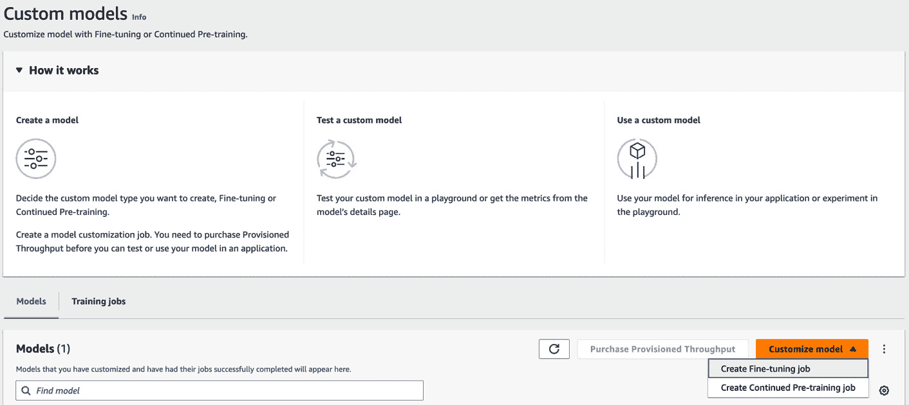

图 4.8 – Bedrock 控制台 – 定制模型

在**模型**标签页下的**定制模型**中，您可以选择**创建微调作业**或**创建持续预训练作业**。选择这两个选项中的任何一个时，您可以在**训练作业**标签页下查看作业的详细信息，包括其状态。

## 模型定制组件

模型定制的主体组件（微调或持续预训练）包括源模型、超参数和输入数据，如*图 4.8*所示。这些输入用于创建训练作业，该作业将输出定制的模型及其指标和日志：

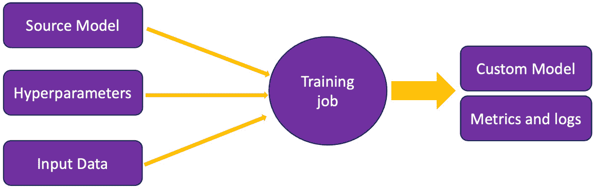

图 4.9 – 定制作业组件

让我们了解更多关于这些内容：

+   **源模型**：任何定制作业的关键组件是选择您希望定制的源模型。您可以在“创建微调作业”和“创建持续预训练作业”页面上的“模型详情”部分找到所有支持模型的列表，如图*图 4.10*所示：

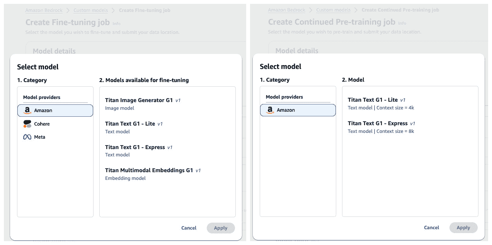

图 4.10 – 为定制作业选择模型

+   **超参数**：除了源模型外，您还可以指定一组超参数。这些参数就像外部旋钮，用于控制模型的训练方式。这些参数与推理参数不同，推理参数是在推理过程中设置的。

+   **输入数据**：用于训练模型的数据集以 JSONL 格式存在，并已准备并存储在 Amazon S3 存储桶中。

+   **训练作业**：输入（源模型、超参数和输入数据）用于创建训练作业。还有其他配置细节，例如 VPC 设置，您可以使用它来安全地控制对 Amazon S3 存储桶中数据的访问，IAM 服务角色，它提供对 Bedrock 的访问权限以写入 S3 存储桶，以及模型加密，您可以使用 KMS 密钥加密静态的定制模型。我们将在 *第十二章* 中介绍 Amazon Bedrock 的安全和隐私。

+   **定制模型**：一旦训练过程完成，定制模型将存储在 AWS Bedrock 服务团队拥有的 AWS 账户中。

+   在 S3 输出路径内的 `step_wise_training_metrics.csv` 和 `validation_metrics.csv` 文件。我们将在 *分析结果* 部分学习如何评估和分析结果。

现在，让我们看看我们可以使用的 API 调用来创建一个定制模型。

## APIs

Amazon Bedrock 提供了多个 API，允许您创建、监控和停止定制作业。本节将探讨其中一些关键 API：**CreateModelCustomizationJob**、**ListModelCustomizationJob**、**GetModelCustomizationJob** 和 **StopModelCustomizationJob**。

让我们更深入地了解每个 API 调用：

+   `customizationType` 设置为 `FINE_TUNING` 或 `CONTINUED_PRE_TRAINING`，`baseModelIdentifier` 为您希望使用的源模型，相关的超参数，以及输入数据（训练和验证数据集）。以下是在 Python SDK（Boto3）中使用作业的示例：

    ```py
    import boto3
    ```

    ```py
    import json
    ```

    ```py
    llm = boto3.client(service_name='bedrock')
    ```

    ```py
    # Setting customization type
    ```

    ```py
    customizationType = "FINE_TUNING"
    ```

    ```py
    # Creating customization job
    ```

    ```py
    llm.create_model_customization_job(
    ```

    ```py
        jobName="fine-tuning-job",
    ```

    ```py
        customModelName="fine-tuned model",
    ```

    ```py
        roleArn="arn:aws:iam::arn-for-MyBedrockModelCustomizationRole",
    ```

    ```py
        baseModelIdentifier="arn:aws:bedrock:us-east-1::foundation-model/foundation-model-id",
    ```

    ```py
        hyperParameters={
    ```

    ```py
            "epochCount": "1",
    ```

    ```py
            "batchSize": "1",
    ```

    ```py
            "learningRate": "0.007",
    ```

    ```py
            "learningRateWarmupSteps": "0"
    ```

    ```py
        },
    ```

    ```py
        trainingDataConfig={"s3Uri": "s3://bucket/path/to/train.jsonl"},
    ```

    ```py
        validationDataConfig={
    ```

    ```py
            "validators": [{
    ```

    ```py
                "s3Uri": "s3://bucket/folder/validation-file.jsonl"
    ```

    ```py
            }]
    ```

    ```py
        },
    ```

    ```py
        outputDataConfig={"s3Uri": "s3://bucket/folder/outputdataconfig/"}
    ```

    ```py
    )
    ```

    一旦运行前面的代码，训练作业将开始。

+   **ListModelCustomizationJob**：您可以使用此 API 调用来检索您正在运行的全部定制作业列表：

    ```py
    import boto3
    ```

    ```py
    llm = boto3.client(service_name='bedrock')
    ```

    ```py
    llm.list_model_customization_jobs()
    ```

+   `IN_PROGRESS`、`STOPPED`、`FAILED` 或 `COMPLETE`。如果模型的状态为 `FAILED`，您将 *不会* 被收费：

    ```py
    import boto3
    ```

    ```py
    llm = boto3.client(service_name='bedrock')
    ```

    ```py
    fine_tune_job = llm.get_model_customization_job(jobIdentifier='arn:aws:bedrock:job-arn-from-create-model-customization')
    ```

    ```py
    print(fine_tune_job['status'])
    ```

    Amazon Bedrock 还与 Amazon EventBridge 集成，您可以在状态发生变化时接收通知。我们将在 *第十一章* 中深入了解 EventBridge 集成。

+   如果您想停止作业，无论出于什么原因，都可以运行此 API 调用：

    ```py
    import boto3
    ```

    ```py
    llm = boto3.client(service_name='bedrock')
    ```

    ```py
    llm.stop_model_customization_job(jobIdentifier='arn:aws:bedrock:job-arn-from-create-model-customization')
    ```

一旦开始定制作业，完成所需的时间将根据您提供的训练数据集的大小而变化。如果您的数据集包含几千条记录，训练作业可能需要大约一个小时，而如果数据集包含数百万条记录，训练作业可能需要几天才能完成。

一旦定制作业完成并创建了一个定制模型，我们就可以分析结果并在我们的模型上执行推理。

# 分析结果

如前所述，在创建定制作业时，我们提供了一个输出 S3 路径，其中训练作业存储了指标和日志。你将在 S3 输出路径中看到`step_wise_training_metrics.csv`和`validation_metrics.csv`文件。在这些文件中，你会看到诸如步骤编号、epoch 编号、损失和复杂度等信息。你将在训练和验证集中看到这些详细信息。尽管提供验证集是可选的，但这样做可以评估创建的定制模型的性能指标。

根据数据集的大小，你可以决定保留多少验证数据集。如果你的数据集较小（例如，包含数百或数千条记录），你可以使用 90%作为训练集，10%作为验证集。如果你的数据集很大（例如，包含数十万条记录），你可以减少验证集的大小。因此，如果你有数十万条记录，你可以使用其中的 99%作为训练集，1%作为验证集。

## 训练和验证的指标

有两种关键的指标类型可以提供关于模型学习效果的宝贵见解：损失和复杂度。让我们更详细地看看：

+   **损失**: 这个值从 0 到无穷大不等。在训练过程中计算的损失值表示模型与训练数据的拟合程度。同时，验证损失显示模型在训练完成后对新、未见过的示例进行泛化的有效性。损失是评估模型在训练期间性能的最常用指标之一。一般来说，较低的损失值更可取，表明模型很好地拟合了数据。较高的损失值表明模型的预测与实际响应相差甚远，并且犯了很多错误。

+   **复杂度**: 这个值从 1 到无穷大不等。它衡量语言模型在序列中准确预测下一个标记的能力。较低的复杂度得分对应着更好的预测和模型的能力。

当使用 Bedrock 训练模型时，损失和复杂度是数据科学家分析的重要指标。一次表现良好的训练运行将显示训练和验证损失值随时间收敛。这种收敛表明模型正在从训练数据中学习，而没有过拟合。

## 推理

一旦作业成功并且我们已经验证了训练和验证指标，我们就可以对模型进行推理。我们首先需要做的是购买预留吞吐量，这为我们提供了部署模型的专用容量。在撰写本文时，自定义 Bedrock 模型只能通过预留吞吐量进行部署。然而，你也可以使用预留吞吐量来部署 Bedrock 支持的基本 FM。

在撰写本文时，Bedrock 提供了三种承诺条款。

+   **无长期承诺**（按小时计费）

+   **1 个月**

+   **6 个月**:

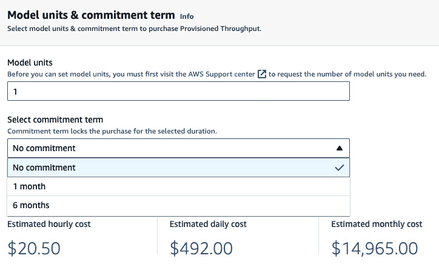

图 4.11 – 模型单元 & 承诺条款

`1`。**模型单元**是一种定义吞吐量的方式，吞吐量以每分钟处理的最大输入和输出标记数来衡量：

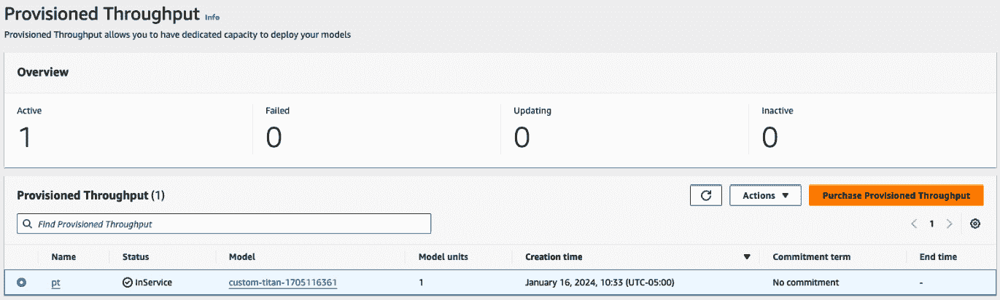

图 4.12 – 已配置吞吐量

购买已配置吞吐量后，您可以在 Bedrock 控制台中查看其详细信息，也可以通过**ListProvisionedModelThroughputs**和**GetProvisionedModelThroughput** API 获取。

一旦已配置吞吐量达到**活动**状态，您创建的定制模型将被部署到端点。此时，您可以使用游乐场体验或通过 API 对模型进行推理。这两种选项将在下文中进行讨论。

### Amazon Bedrock 游乐场

通过游乐场体验进行推理非常简单，与您对基础 FM 进行推理的方式相似。

您可以选择您创建的定制模型而不是使用基础模型，此时您就可以向模型提问或提供提示。*图 4*.13 展示了从 Bedrock 游乐场中选择**custom-titan-1705116361**模型的过程，该模型可以在用户提供的训练数据上进行微调：

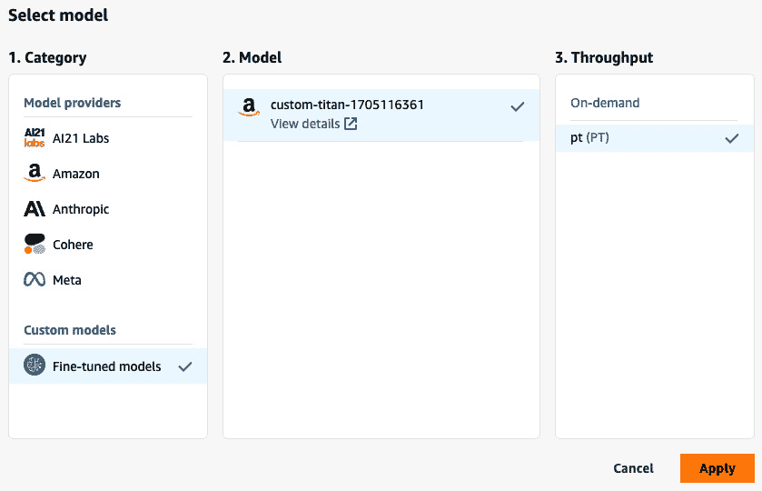

图 4.13 – 选择模型

### Amazon Bedrock API

Bedrock 还提供了`modelId`，我们应该提供已配置端点的`arn`模型。您可以从**Bedrock 控制台 – 已配置吞吐量**选项卡或通过**GetProvisionedModelThroughput** API 获取：

```py
Bedrock_runtime.invoke_model(
    modelId=arn-provisioned-throughput,
    body="""
{
  "inputText": "Classify this statement as Positive, Neutral, or Negative:\\n'I really do not like this!'",
  "textGenerationConfig":{
    "maxTokenCount": 1,
    "stopSequences": [],
    "temperature": 1,
    "topP": 0.9
  }
"""
)
response_body = response["body"].read().decode('utf8')
print(response_body)
print(json.loads(response_body)["results"][0]["outputText"])
```

现在我们已经了解了如何使用 Amazon Bedrock 微调模型并利用已配置吞吐量，让我们学习如何导入选定的定制模型。

### 在 Amazon Bedrock 中导入定制模型

要利用 Amazon Bedrock 中的**导入模型**功能，导航到 Bedrock 控制台。在左侧面板中，在**基础模型**下点击**导入的模型**。

一旦您进入**导入的模型**页面，如图*图 4*.14 所示，您将能够通过直接从 Amazon SageMaker（您可能已经自定义了 FM）导入模型或从 Amazon S3 存储桶导入模型文件来创建一个定制模型：

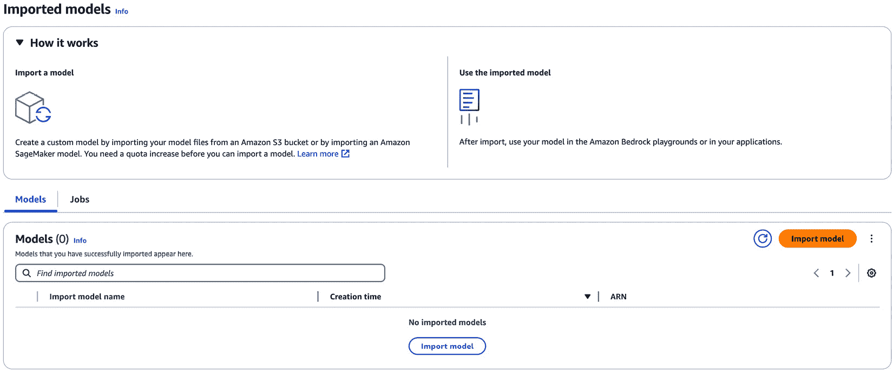

图 4.14 – 导入的模型

在撰写本文时，将模型导入 Amazon Bedrock 会创建一个支持以下模式的定制模型：

+   **持续预训练或微调模型**：如前所述，您可以通过使用专有数据来细化预训练模型，同时保持原始模型配置的结构完整性。

+   **领域自适应**: 你可以将自定义导入的模型调整到特定领域。通过解决领域特定的变化，这种自适应过程将提高模型在目标领域内的性能。例如，可以进行语言自适应，以便生成地区方言或语言，如泰米尔语或葡萄牙语。

+   **从头开始预训练**: 如你所知，这种方法不仅限于自定义权重和词汇表。这种方法为你提供了修改基本模型参数的机会，包括注意力头数量、隐藏层或上下文长度。此外，诸如训练后量化或集成基础和适配器权重等技术，可以进一步优化和改进模型的架构。

要启动“导入模型”作业，你可以提供模型详细信息，包括相关的模型名称、导入作业名称和模型导入设置。

在撰写本书时，导入的模型可以支持 Mistral、Flan、Llama2 和 Llama3 架构。随着生成式人工智能领域的演变，Bedrock 可能会在未来扩展支持模型导入的架构列表。

一旦模型导入作业成功完成，导入的模型将列在“导入模型”页面的“模型”选项卡上。在这里，你可以查看导入模型的关键细节，如其 ARN、模型 ID 和状态。从该页面，你也可以通过 Bedrock API 调用导入的模型进行推理。

关于 Amazon Bedrock 的自定义模型功能支持的模型类型和开源架构的详细信息，可以在[`docs.aws.amazon.com/bedrock/latest/userguide/model-customization-import-model.html#model-customization-import-model-architecture`](https://docs.aws.amazon.com/bedrock/latest/userguide/model-customization-import-model.html#model-customization-import-model-architecture)找到。

注意

请确保您的账户有足够的配额限制来执行“创建模型导入作业”操作。如果没有，将显示以下错误：


图 4.15 – 错误

你可以通过访问[`us-east-1.console.aws.amazon.com/servicequotas/home/services/bedrock/quotas`](https://us-east-1.console.aws.amazon.com/servicequotas/home/services/bedrock/quotas)来请求增加配额限制。

在本章中，我们学习了如何准备数据集、自定义 FM，然后检查其性能和执行推理。现在，让我们看看在尝试自定义模型时需要考虑的一些指南和最佳实践。

# 指南和最佳实践

在自定义模型时，为了获得最佳结果，应考虑以下实践：

+   **提供 dataset**: 在机器学习中，最重要的是 dataset。大多数情况下，您的模型表现如何取决于您提供给训练模型的 dataset。因此，提供与您的用例一致的高质量数据非常重要。如果您在大学学习过机器学习或在这个领域工作过，您可能已经学到了各种特征工程和数据预处理技术，您可以使用这些技术来清理和处理数据。例如，您可以在 dataset 中处理缺失值，确保您不提供有偏见的 data，或者确保 dataset 遵循模型期望的格式。如果您想了解更多关于提供高质量数据的信息，请阅读 Alice Zheng 和 Amanda Casari 的《机器学习特征工程》。这个原则同样适用于生成式 AI，因为它本质上是机器学习的一个子集。

+   **选择合适的 FM**: 接下来，您需要选择您想要定制的基 FM。确保您查看其属性，它支持多少个 token，它训练过什么类型的数据，以及模型的大小。在 Bedrock 控制台中查看模型卡片，阅读这些模型的网站，并使用标准基准（如 GLUE、SuperGLUE、HELMA 和 HuggingFace 的 OpenLLM）来查看它们的性能。然而，请记住，您不应完全依赖这些基准工具，因为它们可能无法代表真实世界应用的复杂性和多样性。

+   **确定超参数**: 一旦您有了高质量的 dataset 并且已经选择了正确的基模型，您需要确定定制的正确超参数。您的目标应该是避免过拟合；模型应该能够很好地泛化到新的未见信息。您可以调整几个超参数，例如 epoch 数量、批量大小、学习率、提前停止等。您可以在[`docs.aws.amazon.com/bedrock/latest/userguide/custom-models-hp.html`](https://docs.aws.amazon.com/bedrock/latest/userguide/custom-models-hp.html)找到所有 Bedrock 模型支持的超参数列表。

+   **评估性能**：一旦你微调了模型，请使用验证数据集评估其性能。**验证数据集**是保留用于训练模型的数据集，用于评估模型。要了解更多关于数据拆分的信息，请访问[`mlu-explain.github.io/train-test-validation/`](https://mlu-explain.github.io/train-test-validation/)。在这里，你可以查看不同的指标，如损失和困惑度，或使用准确度、**双语评估助手**（**BLEU**）和**基于召回的摘要评估助手**（**ROUGE**）分数等技术。为了了解背景，BLEU 分数表示机器生成的翻译与由人工翻译者提供的参考翻译集的质量评估。ROUGE 分数在文本摘要任务中很有用，其中评估是基于机器生成的摘要与由人类创建的相应参考摘要的质量比较。如果模型没有提供期望的性能结果，你必须调整超参数或引入更多数据集。一旦模型准备好使用并提供所需的评估结果，你就可以在模型上执行推理。

+   **针对特定领域调整模型**：将模型定制到商业领域是一种提高生产力和效率的有前景的方法。通过将模型定制为满足特定行业的特定需求，我们可以使其执行以前不可能或效率低下的任务，并创造一个更具竞争力和成功的业务。

采用这些实践可以帮助你充分利用定制 FM 并发挥生成式 AI 的真正力量。

# 摘要

在本章中，我们探讨了两种模型定制技术：微调和持续预训练，以及定制模型的需求，并理解了微调和持续预训练背后的概念。此外，我们准备了我们的数据集，创建了一个自定义模型，评估了模型，并进行了推理。

最后，我们讨论了一些你在定制你的 FM 时需要考虑的指南和最佳实践。

在下一章中，我们将通过使用外部数据源来揭示 RAG 在解决现实世界商业问题中的力量。我们将深入研究各种用例和示例架构，并使用 Amazon Bedrock 实现 RAG。
