# 第五章：利用 RAG 的力量

到目前为止，我们知道 FM 是使用大量数据集进行训练的。然而，用于训练 FM 的数据可能不是最新的，这可能导致模型产生幻觉。在本章中，我们将通过增强模型以外部数据源来利用 RAG 的力量，以克服幻觉的挑战。

我们将探讨 RAG 在生成式 AI 场景中的重要性，RAG 的工作原理及其组件。然后我们将深入研究 RAG 与 Amazon Bedrock 的集成，包括 Amazon Bedrock 提供的完全管理的 RAG 体验，称为知识库。本章将随后以实践方法介绍知识库的实现和使用 API。

我们将探讨一些 RAG 的实际场景，并讨论一些实现 RAG 的解决方案架构。您还将了解到如何使用 Amazon Bedrock、LangChain 调度和其他生成式 AI 系统实现 RAG 框架。最后，我们将探讨在 RAG 的背景下，Amazon Bedrock 的当前局限性和未来研究方向。

到本章结束时，您将能够理解 RAG 的重要性，并能够使用 Amazon Bedrock 来实现它。学习这些方法将使您能够将 RAG 的概念应用于您自己的企业用例，并构建生产级别的应用程序，例如对话界面、问答系统或模块摘要工作流程。

本章将涵盖以下关键主题：

+   解码 RAG

+   使用 Amazon Bedrock 实现 RAG

+   使用其他方法实现 RAG

+   高级 RAG 技术

+   局限性和未来方向

# 技术要求

本章要求您有权访问 AWS 账户。如果您还没有账户，可以访问 [`aws.amazon.com/getting-started/`](https://aws.amazon.com/getting-started/) 创建 AWS 账户。

其次，您需要在创建账户后安装和配置 AWS CLI ([`aws.amazon.com/cli/`](https://aws.amazon.com/cli/))，这将用于从您的本地机器访问 Amazon Bedrock FMs。由于我们将要执行的代码单元格的大部分基于 Python，此时设置 AWS Python SDK (Boto3) ([`docs.aws.amazon.com/bedrock/latest/APIReference/welcome.html`](https://docs.aws.amazon.com/bedrock/latest/APIReference/welcome.html)) 将非常有用。您可以通过以下方式执行 Python 设置：在您的本地机器上安装它，或使用 AWS Cloud9、AWS Lambda，或利用 Amazon SageMaker。

注意

与 Amazon Bedrock 的 FMs 的调用和定制将产生费用。请参阅 [`aws.amazon.com/bedrock/pricing/`](https://aws.amazon.com/bedrock/pricing/) 了解更多信息。

# 解码 RAG

RAG 是一种 NLP 方法，它结合了大规模检索和神经生成模型。关键思想是从大型语料库中检索相关知识并将其纳入文本生成过程。这使得生成模型如 Amazon Titan Text、Anthropic Claude 和**生成预训练 Transformer 3**（**GPT-3**）能够通过在外部知识的基础上进行生成，产生更真实、具体和连贯的文本。

RAG 已成为一种有前途的技术，可以使神经生成模型更加知识渊博和可控。在本节中，我们将概述 RAG，解释它是如何工作的，并讨论关键应用。

## 什么是 RAG？

传统的生成模型，如 BART、T5 或 GPT-4，以自监督的方式在大量的文本数据上进行训练。虽然这使它们能够生成流畅且类似人类的文本，但一个主要的局限性是它们缺乏训练数据之外的世界知识。这可能导致生成文本中的事实不一致、重复和幻觉。

RAG 旨在通过从大型外部语料库中检索相关上下文来将生成内容与知识联系起来。例如，如果模型正在生成关于巴黎的文本，它可能会检索关于巴黎的*维基百科*段落来指导生成。这个检索到的上下文被编码并整合到模型中以指导文本生成。

通过将检索到的知识增强到生成模型中，已经在各种领域产生了更真实、具体和连贯的文本。

RAG 系统的关键组件如下：

+   一个能够生成流畅文本（或多模态）输出的 GenAI 模型——具体来说，是一个 FM 或 LLM。

+   用于从数据集中检索相关信息的数据集（例如，*维基百科*，网页，文档）。

+   检索模块，它编码输入查询并根据与查询的相关性从知识语料库中检索相关段落。

+   重新排序器，通过重新评分和根据与查询的相关性对检索到的段落进行排序来选择最佳上下文信息。（在构建基本的 RAG 系统时，这一步是可选的，但在构建具有高级 RAG 技术的企业级系统时变得至关重要）。

+   融合模块，用于将检索集成到语言模型中。这可能涉及诸如连接或允许语言模型根据相关外部知识进行条件化等技术。

+   其他组件可能还包括查询重写、混合搜索技术和多阶段检索，这些将在本章后面进行介绍。

为了更好地理解 RAG 方法，让我们通过一个简单的例子来了解一下：

+   `What are` `the key events in the life of` `Marie Curie?`

+   将`What are the key events in the life of Marie Curie?`转换成一个密集的向量表示。然后它通过知识语料库（例如，*维基百科*，网页）来查找相关段落。例如，它可能会检索以下内容：

    1.  `玛丽·居里是一位波兰物理学家和化学家，她进行了关于放射性` `的先驱研究...`

    1.  `1903 年，居里因研究` `自发辐射` `而成为第一位获得诺贝尔奖的女性。`

    1.  `居里在 1911 年获得了第二个诺贝尔奖，这次是化学奖，因为她发现了元素镭` `和钋...`

+   **重新排序器**：重新排序器根据与原始查询的相关性使用交叉注意力对检索到的段落进行评分和重新排序。它可能确定段落 *II* 和 *III* 比段落 *I* 更相关。

+   **融合模块**：然后，将最高重新排序的段落（例如，*II* 和 *III*）整合到生成语言模型中，通过连接、总结或允许模型关注检索到的段落的不同部分来实现；也就是说，在生成输出时根据需要关注检索到的段落的不同部分。

    注意，融合步骤的目标是以一种允许对生成的输出进行有效条件化知识的方式，向生成语言模型提供最相关的外部知识，从而产生更准确、信息丰富和有根据的响应。

+   `玛丽·居里的关键事件包括：`

    +   `1903 年，她因研究` `自发辐射` `（放射性）而成为第一位获得诺贝尔奖的女性。`

    +   `1911 年，她因发现元素镭` `和钋而获得了第二个诺贝尔化学奖。`

+   通过从外部语料库检索相关知识和将其整合到语言模型中，RAG 系统可以生成更信息丰富和准确的响应，克服了仅依赖模型训练数据的局限性。

注意

稠密向量表示，也称为密集嵌入或密集向量，是一种将意义和语义关系编码为机器可以有效地处理的数值格式的方法。这允许使用余弦相似度等技术识别语义相关的单词/文本，即使没有精确的关键词匹配。密集向量通过为深度学习模型提供有效的语义表示，为许多现代 NLP 应用（如语义搜索、文本生成、翻译等）提供动力。

我们将在*RAG 组件*部分进一步深入探讨这些组件。既然你现在对 RAG 有了简要的了解，是时候认识到 RAG 在 GenAI 宇宙中的重要性了。

## RAG 的重要性

在我们深入探讨 RAG 的工作原理及其组件之前，了解为什么需要 RAG 是很重要的。随着大型语言模型越来越能够生成流畅和连贯的文本，将它们基于事实知识进行定位并防止潜在的幻觉也变得更加重要。如果你向 LLM 提出与最近事件相关的问题，你可能会注意到模型正在进行幻觉。通过 RAG，你可以将最新知识作为模型的上下文来增强，通过减少事实错误的可能性来提高内容质量。

RAG 的另一个主要优势是克服了模型有限的上下文长度（输入令牌限制）。当提供的文本片段作为上下文，且在模型的令牌限制内时，你可能不需要使用 RAG 并利用上下文提示。然而，如果你想向模型提供一个大型文档集合作为上下文，使用 RAG 将是一个更好的方法。即使文档集合可以放入上下文中，RAG 也有其益处，因为“大海捞针”的问题可能会影响检索准确性。总结来说，RAG 在两个主要用例中特别有用：

+   当文档集合的大小超过上下文长度时

+   当我们想要动态地向模型提供上下文，而不是一次性提供整个文档集合时

RAG 在改善生成式 AI 方面有许多潜在的应用。它可以帮助构建依赖于真实企业数据的上下文聊天机器人。它可以根据用户的历史和偏好实现个性化搜索和推荐。RAG 方法还可以通过检索和压缩关键事实来帮助实时总结大量文档。例如，将 RAG 应用于总结大量的法律文本或学术论文，可以提取和压缩重要信息，提供简洁的总结，捕捉核心要点。总的来说，RAG 是克服当前生成模型某些限制并使其基于事实知识的重要技术。这有助于使生成内容更加有用、可靠和个性化。

## 关键应用

与其他 LLM 定制技术（如提示工程或微调）相比，RAG 提供了几个优势：

+   **知识源的灵活性**：知识库可以根据每个用例进行定制，而无需更改底层 LLM。知识可以轻松添加、删除或更新，无需昂贵的模型重新训练。这对于知识快速发展的组织特别有用。

+   **经济高效**：RAG 允许单个主机 LLM 通过可交换的知识源在许多用例之间共享。无需为每个用例训练定制模型，这意味着更高的成本效率。

+   **自然语言查询**：RAG 依赖于自然语言从知识源检索上下文，与使用僵化提示模板的提示工程不同。这使得用户在与模型工作时更加灵活。

对于大多数拥有定制信息知识库的组织来说，RAG 在成本、灵活性和可用性之间取得了平衡。对于少量上下文，提示工程就足够了，而完整的模型微调则涉及高昂的训练成本和僵化的知识。RAG 允许轻松更新知识库，并在不同用例之间共享 LLM。

例如，RAG 非常适合管理跨多个客户不断演变的文档库的**企业对企业软件即服务（B2B SaaS**）公司。单个托管的大型语言模型（LLM）可以通过交换其上下文文档来处理跨客户的查询，从而消除为每个客户创建模型的需求。

现在我们已经了解了 RAG 在不同场景中的重要性和潜在应用，让我们深入探讨 RAG 的工作原理。

## RAG 是如何工作的？

*图 5.1*提供了 RAG 工作原理的高级概述：

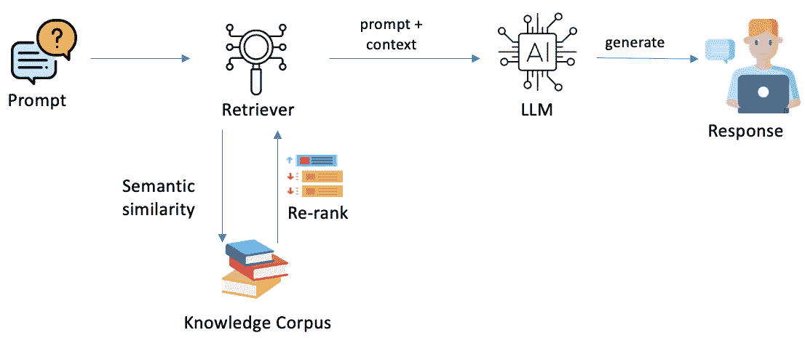

图 5.1 – 简化的 RAG

让我们现在详细理解这些步骤：

1.  给定用户的提示，检索器模块被调用以将输入查询编码为密集向量表示。

1.  检索器模块随后根据查询向量与知识库内容的预计算密集向量表示之间的最大内积相似度（语义相似度），从知识库中找到相关的上下文（段落或文档）。

1.  可选的重新排序模块可以重新评分和重新排序最初检索到的结果，并选择最佳的上下文段落来增强生成。重新排序器有助于突出最相关的段落。

1.  排名最高的检索上下文与输入查询融合，形成增强提示（查询和上下文）。

1.  生成模型，即 FM 或 LLM，随后根据原始查询提示和检索到的相关知识上下文产生输出文本。

1.  在某些 RAG 系统中，检索和重新排序过程可以在生成步骤中重复进行，以便在生成输出时动态检索更多相关知识。

RAG 的关键好处是确保生成的输出基于来自可信外部来源的准确和最新信息，提供源引用以实现透明度，并减少仅从语言模型的训练数据中产生的幻觉或不准确性。

RAG 系统通过适当来源、审查和定制特定用例的基础数据源和模型，满足企业对通用人工智能（GenAI）的需求，如全面性、可信性、透明性和可靠性。

## RAG 的组成部分

如前所述，一旦收到查询，就会从知识源检索相关上下文并将其压缩为上下文文档。然后，将此上下文与原始查询连接起来，输入到 LLM 中以生成最终响应。知识源充当可频繁更新的动态长期记忆，而 LLM 则贡献其强大的语言生成能力。

### 知识库

RAG 模型的一个关键组件是知识库，它包含用于检索的外部知识。知识库以优化快速检索的格式存储信息，例如密集向量或索引。

在 RAG 中使用的流行知识源包括*维基百科*、新闻档案、书籍、科学论文以及专门为 RAG 模型创建的专有知识库。知识可以包括结构化（例如，表格和列表）和非结构化（例如，自由文本）数据。

在典型的 RAG 场景中，构成知识语料库的文档（或网页）的文本内容需要被转换成密集向量表示或嵌入，这些编码数据被分成更小的块。为了在编码时保留表格或列表的结构，使用了更高级的编码技术，这些技术可以将整个表格/列表嵌入为一个单一的向量，同时保留它们的行/列关系。

长的非结构化文本段落通常会被分成更小的文本段或最大长度（例如，200 个标记）的段落。然后，这些块或段落被独立地编码成密集向量表示。

此嵌入过程通常在异步或批量处理中发生，在接收任何用户查询之前，与 RAG 系统分开进行。

在系统部署或用于任何查询回答之前，整个文档语料库的嵌入被预先计算并存储。这一预计算步骤的必要性有以下原因：

+   文档语料库通常可能非常大（例如，*维基百科*有数百万篇文章）

+   在查询时嵌入整个语料库将非常慢且效率低下

+   预计算的嵌入允许在查询时快速进行最大内积搜索

通过提前异步嵌入来源，RAG 系统可以通过比较查询嵌入与预先计算的文档嵌入，使用高效的向量相似性搜索方法（如余弦相似度、欧几里得距离、**无互锁流水级阶段的微处理器**（**MIPS**）或**Facebook AI 相似性搜索**（**FAISS**））快速检索相关文档。鼓励读者回顾论文《关于在神经嵌入上高效处理相似性查询的综述》([`arxiv.org/abs/2204.07922`](https://arxiv.org/abs/2204.07922))，该论文概述了高效处理相似性查询的方法。

注意，知识库的大小和范围对 RAG 系统的能力有重大影响。具有更多样化、高质量知识的更大知识库为模型提供了更多上下文信息，以便根据用户的问题进行抽取。

### 检索模块

检索模块负责为每个特定上下文从知识库中找到和检索最相关的知识。检索模型的输入通常是用户的提示或上下文。

嵌入模型将提示编码成向量表示，并将其与知识库的编码表示进行匹配，以找到最接近的匹配条目。

常见的检索方法包括稀疏方法，如**词频-逆文档频率**（**TF-IDF**）或**最佳匹配 25**（**BM25**），以及密集方法，如从双编码器模型中提取的嵌入表示的语义搜索。检索模型对知识进行排序，并将最相关的* k *个片段返回给生成模型。

检索模型与生成模型之间的集成越紧密，检索结果越好。

### 条件化生成模型

使 RAG 过程成为生成性的关键方面是条件生成模型。该模型将检索到的知识与原始提示一起生成输出文本。

知识可以通过不同的方式提供以条件化生成：

+   将检索到的文本连接到提示中

+   将检索到的文本编码为密集向量

+   在特定位置将检索到的文本插入到输入中

例如，在典型场景中，检索到的知识被输入提示增强，并输入到 LLM 中，以向最终用户提供简洁的响应。这允许 LLM 直接根据相关事实和上下文对文本生成进行条件化。鼓励用户查阅论文《利用生成模型进行开放域问答中的段落检索》（[`arxiv.org/pdf/2007.01282.pdf`](https://arxiv.org/pdf/2007.01282.pdf)），以深入了解问答框架领域中 RAG 的复杂性。

生成模型通常是大型预训练语言模型，如 GPT-4、Anthropic Claude 3、Amazon Titan Text G1 等。如果需要，该模型可以进一步在下游 RAG 任务上进行端到端微调，以优化特定用例中检索知识的集成。现在，让我们深入了解使用 Amazon Bedrock 探索 RAG。

# 使用 Amazon Bedrock 实现 RAG

在响应用户查询之前，系统必须摄入和索引提供的文档。这个过程可以被认为是*步骤 0*，包括以下子步骤：

+   将原始文本文档摄入到知识库中。

+   通过将文档分割成更小的块来预处理文档，以实现更细粒度的检索。

+   使用嵌入模型（如 Amazon Bedrock 的 Titan Text Embeddings 模型）为每个段落生成密集向量表示。这把每个段落的语义意义编码到高维向量空间中。

+   将段落及其对应的向量嵌入索引到一个专门为高效**最近邻**（**NN**）搜索优化的搜索索引中。这些也被称为**向量数据库**，它们以向量的形式存储文本的数值表示。此索引能够快速检索对用户查询最相关的段落。

通过完成此工作流程，系统构建了一个索引语料库，准备好为摄入的文档集合中的自然语言查询提供相关结果。段落分割、嵌入和索引步骤使系统能够实现强大的排名和检索能力。

*图 5.2*中展示的流程图展示了之前描述的 RAG 过程的总体流程：

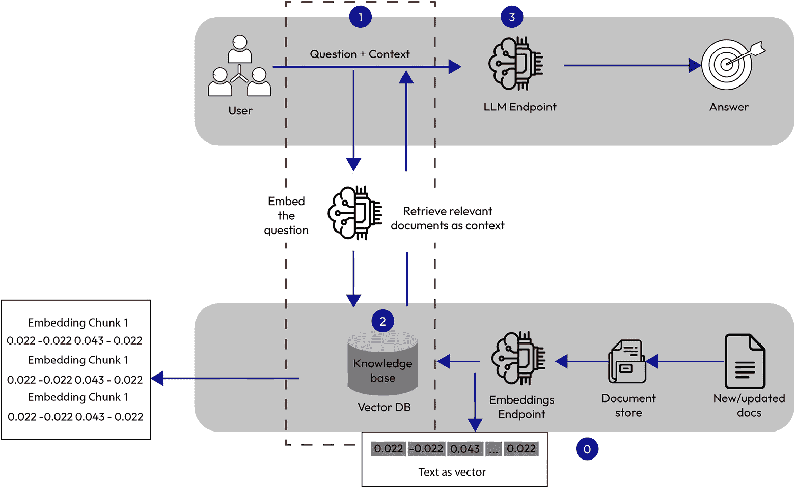

图 5.2 – 使用亚马逊 Bedrock 的 RAG

当文档被正确索引后，系统可以通过以下流程通过自然语言问题提供上下文答案：

+   **步骤 1**：使用嵌入模型（如亚马逊 Titan Text Embeddings 模型或 Cohere 的嵌入模型）将输入问题编码为密集向量表示（嵌入），这些模型都可以通过亚马逊 Bedrock 访问。这捕捉了问题的语义意义。

+   **步骤 2**：使用余弦相似度或其他距离度量比较问题嵌入与索引文档嵌入。这检索到最相关的文档片段。将排名靠前的文档片段附加到提示中作为上下文信息。这为模型提供了相关的背景知识。

+   **步骤 3**：将带有上下文的提示传递给亚马逊 Bedrock 上可用的 LLM，例如 Anthropic Claude 3、Meta Llama 3 或亚马逊 Titan Text G1 - Express。这利用了模型根据检索到的文档生成答案的能力。

最后，返回模型生成的答案，这应该显示出对上下文文档中问题的理解。

因此，系统利用亚马逊 Bedrock FMs 提供基于相关文档和上下文的自然语言问题回答。仔细索引和编码文档使得检索与生成模型的集成无缝，从而提供更明智和准确的答案。

以下是一个使用亚马逊 Bedrock 和亚马逊 OpenSearch Serverless 作为向量引擎的 RAG 实现的示例：[`aws.amazon.com/blogs/big-data/build-scalable-and-serverless-rag-workflows-with-a-vector-engine-for-amazon-opensearch-serverless-and-amazon-bedrock-claude-models/`](https://aws.amazon.com/blogs/big-data/build-scalable-and-serverless-rag-workflows-with-a-vector-engine-for-amazon-opensearch-serverless-and-amazon-bedrock-claude-models/).

现在我们已经讨论了使用亚马逊 Bedrock 实现 RAG 的一些细节，让我们深入探讨通过亚马逊 Bedrock 上的知识库使用 RAG 解决用例。

## 亚马逊 Bedrock 知识库

亚马逊 Bedrock 通过知识库提供完全管理的 RAG 体验，在幕后处理复杂性，同时让你控制你的数据。Bedrock 的知识库功能使能够将多样化的数据源聚合到一个集中的机器可读信息库中。知识库自动从你的数据创建向量嵌入，将它们存储在管理的向量索引中，并处理嵌入、查询、来源归因和生产 RAG 的短期记忆。

亚马逊 Bedrock 中知识库的关键优势包括以下内容：

+   **无缝 RAG 工作流程**：无需自行设置和管理组件。你只需提供你的数据，让亚马逊 Bedrock 处理导入、嵌入、存储和查询。

+   **自定义向量嵌入**：你的数据被导入并转换为针对你的用例定制的向量表示，可以选择嵌入模型。

+   亚马逊 Bedrock 中的`RetrieveAndGenerate` API 提供对源文档的归因，并管理会话历史以进行上下文响应。

+   **灵活集成**：通过 API 访问和集成支持其他 GenAI 工具将 RAG 集成到你的工作流程中。

## 亚马逊 Bedrock 知识库设置

客观地说，以下步骤有助于知识库的创建和集成：

1.  识别和准备用于导入的数据源

1.  将数据上传到**亚马逊简单存储服务**（**Amazon S3**）以实现集中访问

1.  通过 FM 生成数据嵌入并持久化到向量存储中

1.  将应用程序和代理连接到查询并将知识库集成到工作流程中

要创建数据导入作业，请按照以下步骤操作：

1.  **设置你的知识库**：在你可以导入数据之前，你需要创建一个知识库。这涉及到定义知识库的结构和模式，以确保它可以有效地存储和管理数据。

1.  **准备你的** **数据源**：

    +   确保你的数据存储在 Amazon S3 中。数据可以是各种格式，包括结构化（例如，CSV、JSON）和非结构化（例如，文本文件、PDF）。

    +   以便于管理和检索的方式组织你的数据。

1.  **创建一个** **数据导入作业**：

    +   导航到 AWS Bedrock 控制台并转到**知识库**部分。

    +   选择创建新的数据导入作业选项。

    +   提供必要的详细信息，例如作业名称、S3 存储桶位置和数据格式。

    +   配置作业以指定数据应该如何处理并导入到知识库中。

1.  **配置** **同步设置**：

    +   设置同步设置以确保知识库使用最新的数据从你的 S3 位置更新。

    +   你可以配置同步以定期运行（例如，每天或每周）或根据需要手动触发。

    +   确保同步设置已优化以高效处理大量数据。

1.  **运行** **数据导入作业**：

    +   一旦配置了作业，您就可以开始导入过程。

    +   通过 AWS Bedrock 控制台监控作业的进度。您可以查看日志和状态更新，以确保作业运行顺利。

现在我们对导入过程有了基本的了解，让我们彻底地了解这些细节。

为了在 AWS 控制台中启动此管道，用户可以导航到 Amazon Bedrock 页面中的**编排**部分，如图 *5.3* 所示：

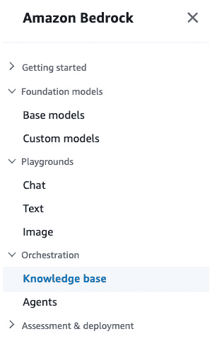

图 5.3 – 知识库

现在，让我们更深入地看看这些步骤：

1.  点击**知识库**并输入您打算创建的知识库的相关详细信息。您可以提供自定义的知识库名称、描述以及创建新的服务角色或利用现有服务角色为知识库设置相应的**身份和访问管理**（**IAM**）权限。您还可以为此资源提供标签，以便于搜索和筛选您的资源，或在知识库详细信息部分跟踪与知识库相关的 AWS 成本。

1.  在下一步中，您将通过指定数据要索引的 S3 位置来设置数据源。您可以指定特定的数据源名称（或利用默认的预填充名称）并提供包含源数据的存储桶的 S3 URI（统一资源标识符），如图 *5.4* 所示：

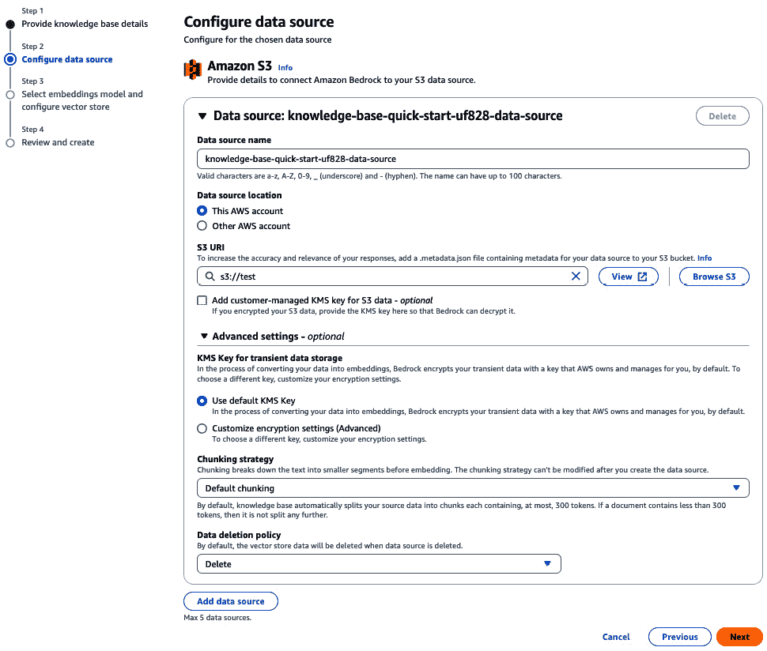

图 5.4 – 知识库：设置数据源

1.  您还可以提供您用于加密 S3 数据的客户管理的**密钥管理服务**（**KMS**）密钥，以便 Bedrock 服务在将给定数据导入向量数据库时解密它。在**高级设置**（如图 *5.5* 所示），用户可以选择默认的 KMS 密钥或通过输入**亚马逊资源名称**（**ARN**）或搜索他们存储的定制密钥（或即时创建新的 AWS KMS 密钥）来自定义加密设置。为通过 Amazon Bedrock 导入的 S3 数据源提供客户管理的 KMS 密钥是为了增强数据安全、合规性和控制。它允许数据主权、密钥轮换/吊销、**职责分离**（**SoD**）、审计/日志功能，并与现有的密钥管理基础设施集成。通过管理自己的加密密钥，您可以获得对数据保护更大的控制权，满足监管要求并与组织的安全策略保持一致，以处理敏感或受监管的数据：

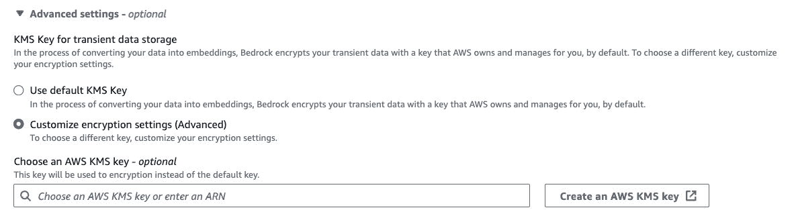

图 5.5 – 知识库：高级设置

在 **分块策略**（如图 *图 5.6* 所示）下，用户可以选择在创建嵌入之前如何将源位置中的文本分解成更小的段。默认情况下，知识库将自动将您的数据分成包含最多 300 个标记的小块。如果一个文档或换句话说，源数据包含少于 300 个标记，则在该情况下不会进一步分割：

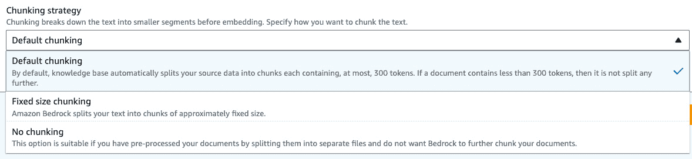

图 5.6 – 知识库：分块策略

或者，您可以选择使用 **固定大小分块** 来自定义块大小，或者如果您已经将源文档预处理为更小的块文件，并且不打算使用 Bedrock 进一步分块文档，则简单地选择 **不进行分块**。

在下一个阶段，用户将选择一个嵌入模型将所选数据转换为嵌入。目前，有四种嵌入模型受到支持，如图 *图 5.7* 所示。此外，在 **向量数据库** 下，用户可以选择推荐路线——即选择快速创建选项，这将自动在所选账户的背景中创建一个 Amazon OpenSearch Serverless 向量存储：

注意

向量嵌入是文本数据的数值表示，它编码语义或上下文意义。在 NLP 管道中，文本文档通过嵌入模型转换，将包括单词等离散标记的块转换为连续向量空间中的密集向量。良好的向量表示允许 **机器学习**（**ML**）模型理解单词和概念之间的相似性、类比以及其他模式。换句话说，如果向量表示（嵌入）在大数据集上训练良好，它们将捕获数据中的有意义关系。这使得使用这些嵌入的 ML 模型能够识别如下事物：

- 哪些单词在意义上相似（例如，*国王* 和 *王后*）

- 哪些概念遵循类比模式（例如，*人* 对 *国王* 就像 *女人* 对 *王后*）

- 在嵌入空间中如何表示概念的其他模式

训练良好的嵌入实际上为 ML 模型提供了数据中固有的关系和模式的数值映射。这使得模型在下游任务训练期间更容易学习和推断这些模式。

因此，简单来说，好的嵌入有助于 ML 模型理解单词和概念之间的相似性和关系，而不仅仅是将它们视为孤立的数据点。

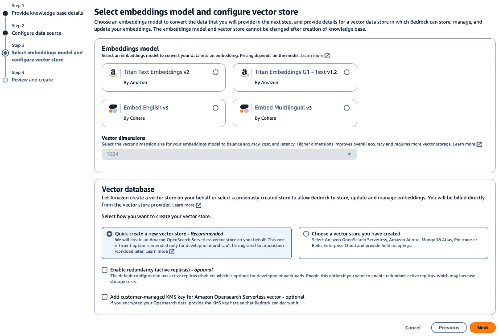

图 5.7 – 知识库：配置向量存储

或者，你可以选择自己的向量存储（如图 *图 5.8* 所示）。在撰写本书时，你可以选择 **Amazon OpenSearch Serverless 向量引擎**、**Amazon Aurora**、**MongoDB Atlas**、**Pinecone** 或 **Redis Enterprise Cloud**。一旦选择，你可以提供字段映射以继续进行知识库创建的最终设置。根据用例，开发人员或团队可能会选择一个向量数据库而不是另一个。你可以在 [`aws.amazon.com/blogs/database/the-role-of-vector-datastores-in-generative-ai-applications/`](https://aws.amazon.com/blogs/database/the-role-of-vector-datastores-in-generative-ai-applications/) 上了解更多关于向量数据存储在 GenAI 应用中的作用：

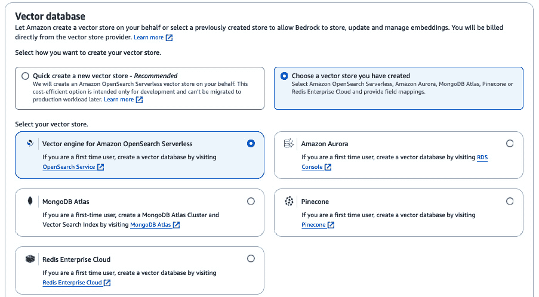

图 5.8 – 知识库：向量数据库

你可以查看 [`aws.amazon.com/blogs/aws/preview-connect-foundation-models-to-your-company-data-sources-with-agents-for-amazon-bedrock/`](https://aws.amazon.com/blogs/aws/preview-connect-foundation-models-to-your-company-data-sources-with-agents-for-amazon-bedrock/) 了解如何使用 Pinecone、OpenSearch Serverless 或 Redis 设置自己的向量存储。

假设你选择了默认路由，涉及创建新的 Amazon OpenSearch Serverless 向量存储，你可以在审查所有提供的信息后继续操作，并点击如图 *图 5.9* 所示的 **创建知识库**：

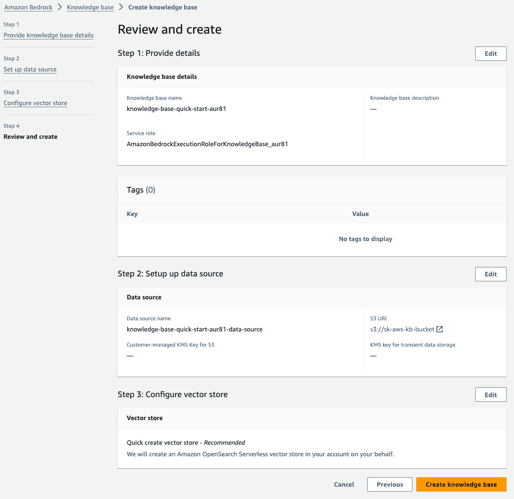

图 5.9 – 知识库：审查和创建

创建完成后，你可以同步信息以确保知识库正在摄取和操作存储在您的 Amazon S3 位置的最新数据。知识库同步完成后，用户可以通过点击 **选择模型** 并选择适合其用例的适当模型来测试该知识库，如图 *图 5.10* 所示：

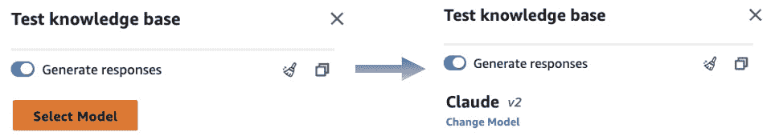

图 5.10 – 测试知识库：选择模型

选择适当的模型后，你可以在文本框中输入特定查询，并接收模型生成的特定响应，如图 *图 5.11* 所示：

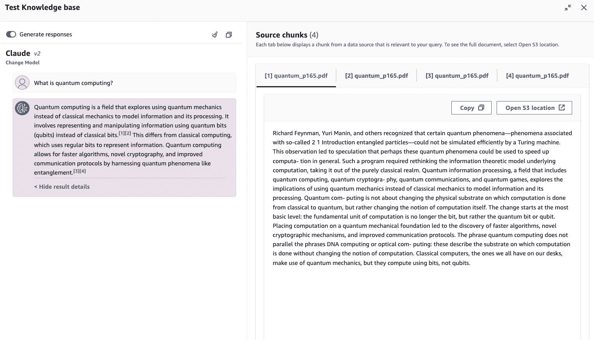

图 5.11 – 测试知识库

在其核心，Amazon Bedrock 将用户的查询转换为意义的向量表示；即嵌入。然后，它使用这些嵌入作为搜索标准在知识库中搜索相关信息。检索到的任何知识都将与为 FM 工程的提示结合，提供必要上下文。FM 将此上下文知识集成到其响应生成中，以回答用户的问题。对于跨越多个回合的对话，Amazon Bedrock 利用其知识库来维护对话上下文和历史，提供越来越相关的结果。

关于测试知识库和检查源块的相关信息，请参阅 [`docs.aws.amazon.com/bedrock/latest/userguide/knowledge-base-test.html`](https://docs.aws.amazon.com/bedrock/latest/userguide/knowledge-base-test.html)。

为了确保您的知识库始终保持最新，自动化同步过程至关重要。这可以通过使用 AWS Lambda 函数或 AWS Step Functions 根据特定事件或计划触发摄取作业来实现。

**AWS Lambda** 是一种无服务器计算服务，允许您在不配置或管理服务器的情况下运行代码。您可以通过创建 Lambda 函数来自动化诸如触发数据摄取作业、处理数据或发送通知等任务。Lambda 函数可以由各种事件触发，包括上传到 Amazon S3 的文件、DynamoDB 表的更改，或使用 Amazon CloudWatch Events 定时的事件。

**AWS Step Functions** 是一种无服务器函数编排器，允许您将多个 AWS 服务协调到业务工作流程中。您可以创建状态机，定义一系列步骤，包括 Lambda 函数、数据处理任务和错误处理逻辑。Step Functions 特别适用于编排复杂的数据摄取管道或机器学习工作流程。

定期监控和管理数据源对于保持其相关性和准确性至关重要。**Amazon CloudWatch** 是一种监控和可观察性服务，它为您的 AWS 资源提供数据和可操作见解。您可以使用 CloudWatch 设置警报和通知，以解决数据同步过程中的任何问题或异常。CloudWatch 可以监控指标，如 Lambda 函数调用、Step Functions 执行和 Amazon S3 存储桶活动，使您能够主动识别和解决潜在问题。

遵循数据管理最佳实践，例如逻辑组织数据、维护数据质量和确保数据安全，至关重要。AWS 提供各种服务和工具来支持数据管理最佳实践：

+   您可以在 Amazon S3 存储桶中组织您的数据，并利用版本控制、生命周期策略和访问控制等功能来维护数据质量和安全性。

+   **AWS Glue** 是一个全托管的 **提取、转换和加载** (**ETL**) 服务，可以帮助您在不同数据存储之间可靠地准备和移动数据。Glue 可以用于在将数据摄入到您的知识库之前清理、转换和丰富您的数据。

+   **AWS Lake Formation** 是一项帮助您在 Amazon S3 上构建、保护和管理工作数据湖的服务。它提供数据编目、访问控制和审计等功能，可以帮助确保数据安全和治理。

应定期审查和更新知识库，以删除过时信息并纳入新的、相关数据。AWS 提供了如 **Amazon Kendra** 和 **Amazon Comprehend** 等服务，可以帮助您分析和理解您的知识库内容，识别过时或不相关信息，并提出更新或改进建议。

跟踪可操作的指标，例如搜索成功率、用户参与度和数据新鲜度，也很重要。这些指标可以帮助持续改进知识库，确保其有效地满足用户的需求。

Amazon CloudWatch 可以用于收集和分析来自各种 AWS 服务（包括您的知识库应用程序）的指标。您可以创建自定义指标、仪表板和警报来监控您知识库的性能和用法。

通过利用 AWS 服务，如 Lambda、Step Functions、CloudWatch、S3、Glue、Lake Formation、Kendra 和 Comprehend，您可以自动化同步过程，监控和管理数据源，遵守数据管理最佳实践，并跟踪可操作的指标，以确保您的知识库保持最新、相关且有效地满足用户的需求。

鼓励读者访问 Amazon Bedrock RAG GitHub 仓库 ([`github.com/aws-samples/amazon-bedrock-rag`](https://github.com/aws-samples/amazon-bedrock-rag))，以探索和实现一个使用 Amazon Bedrock 知识库的完全托管 RAG 解决方案。

## API 调用

对于希望在控制台之外调用 Bedrock 的用户，`RetrieveAndGenerate` API 提供了程序化访问以执行此相同的工作流程。这允许通过 API 调用而不是控制台交互将 Bedrock 的功能紧密集成到自定义应用程序中。`RetrieveAndGenerate` API 为开发者提供了构建针对其特定需求定制的 Amazon Bedrock 解决方案的灵活性。*图 5**.12* 展示了使用 Amazon Bedrock 的 `RetrieveAndGenerate` API 的 RAG 工作流程：

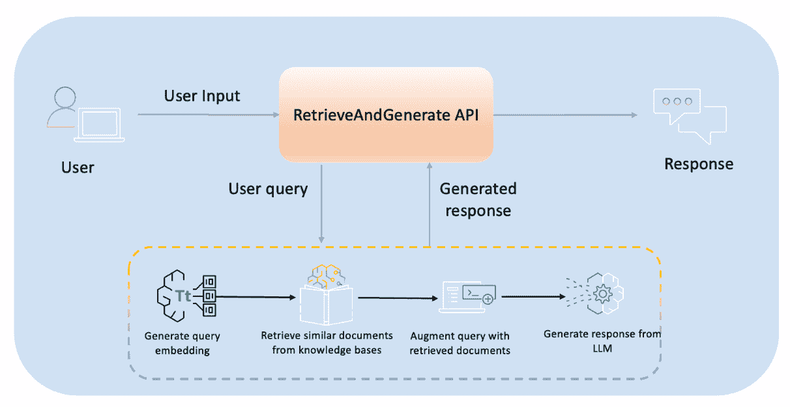

图 5.12 – RetrieveAndGenerate API

在`RetrieveAndGenerate` API 中，生成的响应输出包含三个组件：模型生成的响应本身的文本、来源归属表明 FM 从哪里检索信息，以及作为生成响应一部分从那些来源检索的具体文本摘录。API 通过返回最终输出文本以及支持 FM 响应生成过程的底层源材料和归属，提供了完全的透明度。这使用户能够检查最终输出以及系统在响应生成过程中使用的中间检索文本。

下面的代码示例用于使用 API 运行与控制台展示相同的操作。

注意

在运行下面的代码之前，请确保您拥有`boto3`和`botocore`包的最新版本。如果这些包尚未安装，请在您的 Jupyter 笔记本中运行以下命令。请注意，如果您从 Python 终端运行 Python 代码，则不需要`!`：

`!pip install boto3 botocore`

```py
#import the main packages and libraries
import os
import boto3
import botocore
import json
bedrock_agent_rn = boto3.client(service_name='bedrock-agent-runtime', region_name=os.environ['AWS_REGION'])
#Defining the method to invoke the RetrieveAndGenerate API
def retrieveAndGenerate(input, kb_Id):
    return bedrock_agent_rn.retrieve_and_generate(
        input={
            'text': input
        },
        retrieveAndGenerateConfiguration={
            'type': 'KNOWLEDGE_BASE',
            'knowledgeBaseConfiguration': {
                'knowledgeBaseId': kb_Id,
                'modelArn': 'arn:aws:bedrock:us-east-1::foundation-model/anthropic.claude-instant-v1'
                }
            }
        )
#Invoking the API to generate the desired response
response = retrieveAndGenerate("What is Quantum Computing?", "PG0WBGY0DD")["output"]["text"]
print(response)
```

注意

此脚本假定读者已经根据前述部分中概述的程序创建了知识库并摄取了相关文档。在满足此先决条件后，调用`RetrieveAndGenerate` API 将使系统能够使用提供的代码示例检索相关文档。

提供的代码将打印提取的文本输出，以显示从数据源中根据输入查询提取的相关信息，并按所需格式化。响应是通过将数据源中的相关细节与输入查询的具体内容进行上下文关联而生成的。然后，输出将按请求的结构进行格式化和展示。这允许从源中定制提取和格式化相关数据，以提供针对输入查询的、适合的结构化响应。

注意

请确保您有正确的权限通过导航到 IAM 角色和权限，搜索相应的角色（如果您在 Amazon SageMaker 中运行笔记本，请搜索在创建 Amazon SageMaker 域时分配的执行角色），并附加 Amazon Bedrock 策略以调用 Bedrock 模型和 Bedrock 代理运行时 API。

另一个有用的 Amazon Bedrock API，即`Retrieve` API，允许更高级的处理和利用检索到的文本片段。此 API 将用户查询转换为向量表示，对知识库执行相似度搜索，并返回最相关的结果及其相关性分数。`Retrieve` API 为用户提供更细粒度的控制，以利用语义搜索能力构建自定义管道。通过`Retrieve` API，开发者可以根据搜索结果编排文本生成的后续阶段，实现额外的相关性过滤，或推导其他工作流程优化。*图 5.13*展示了在 Amazon Bedrock RAG 管道中使用`Retrieve` API 的示例：

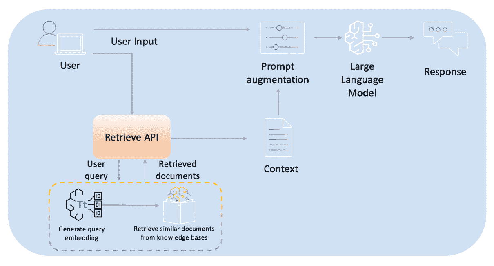

图 5.13 – Retrieve API

在 Amazon Bedrock 控制台中，您可以切换开关再次禁用`什么是量子计算？`。*图 5.14*展示了从知识库检索到的有关量子计算问题的生成响应。请注意，Amazon Bedrock 在生成响应的同时引用了参考文献：

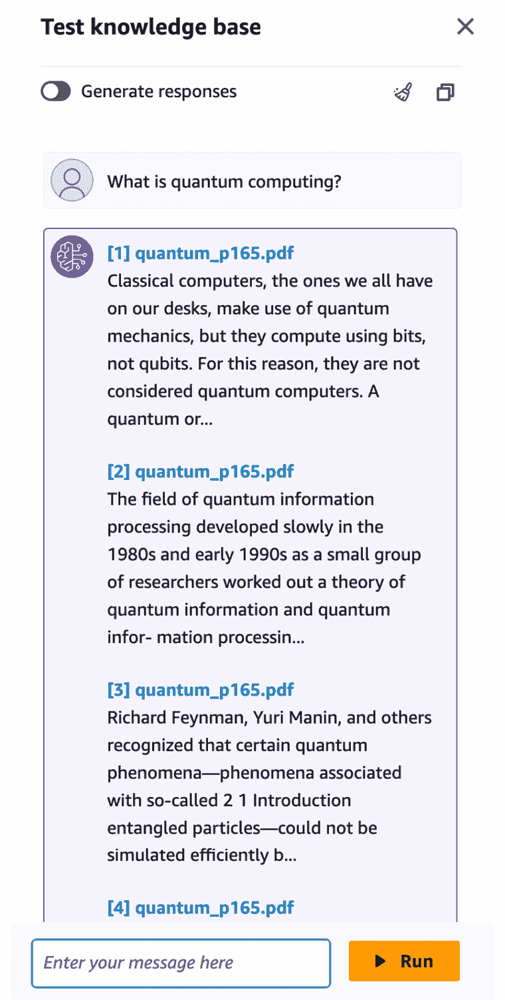

图 5.14 – 测试知识库

这次，与流畅的自然语言响应不同，请注意输出显示了检索到的文本片段以及链接到原始源文档的链接。这种方法通过明确显示从知识库检索到的相关信息及其来源，提供了透明度。

注意

在运行下面展示的代码之前，请确保您拥有`boto3`和`botocore`包的最新版本。如果这些包尚未安装，请在您的 Jupyter 笔记本中运行以下命令。请注意，如果您从 Python 终端运行 Python 代码，则不需要使用`!`：

`!pip install boto3 botocore`

利用`boto3`的`Retrieve` API 看起来是这样的：

```py
#import the main packages and libraries
import os
import boto3
import botocore
bedrock_agent_rn = boto3.client(service_name='bedrock-agent-runtime', region_name = os.environ['AWS_REGION'])
#Defining the method to invoke the RetrieveAndGenerate API
def retrieve(query, kb_Id, number_Of_Results=3):
    return bedrock_agent_rn.retrieve(
        retrievalQuery= {
            'text': query
        },
        knowledgeBaseId=kb_Id,
        retrievalConfiguration= {
            'vectorSearchConfiguration': {
                'numberOfResults': number_Of_Results
            }
        }
    )
#Invoking the API
output_response = retrieve("What is Quantum Computing?", "PG0WBGY0DD")["retrievalResults"]
print(output_response)
```

`Retrieve` API 返回一个包含检索到的文本摘录以及每个摘录来源的元数据的响应。具体来说，响应包括从每个文本片段检索到的源数据的位置类型和 URI。此外，每个检索到的文本片段都伴随着一个相关性分数。这个分数提供了检索到的片段的语义内容与用户输入查询的匹配程度的指示。与低分数片段相比，得分较高的文本片段与查询的相关性更高。通过检查检索到的片段的分数，用户可以专注于`Retrieve` API 返回的最相关摘录。因此，`Retrieve` API 不仅提供了检索到的文本，还提供了有洞察力的元数据，以使 API 响应能够得到有效利用。

通过利用 RAG 框架中的自定义分块和向量存储功能，您可以获得更多细粒度的控制，以了解您的 NLP 工作流程在底层如何运行。熟练地应用这些自定义可以帮助确保 RAG 符合您的特定需求和用例。请注意，在撰写本书时，在创建知识库的数据源时，您可以在 `ChunkingConfiguration` 对象中指定分块策略：

```py
chunking_config = {
    "chunkingStrategy": "FIXED_SIZE", # or "NONE"
    "fixedSizeChunkingConfiguration": {
        "chunkSize": 200 # Chunk size in tokens
    }
}
```

让我们更详细地看看：

+   `FIXED_SIZE` 允许您为分割数据源设置固定大小的令牌块

+   `NONE` 将每个文件视为单个块，让您完全控制预分块数据

在 [`aws.amazon.com/blogs/aws/knowledge-bases-now-delivers-fully-managed-rag-experience-in-amazon-bedrock/`](https://aws.amazon.com/blogs/aws/knowledge-bases-now-delivers-fully-managed-rag-experience-in-amazon-bedrock/) 可以找到有关使用 AWS Python SDK 与 API 的高级信息。

Amazon Bedrock 的知识库简化了 RAG 的复杂性，允许您通过自己的有根知识来增强语言生成。这些能力为构建上下文聊天机器人、问答应用和其他需要生成具体信息的 AI 系统开辟了新的可能性。

让我们进一步探讨如何使用 LangChain 协调器和其他 GenAI 系统实现 RAG 方法。

# 使用其他方法实现 RAG

Amazon Bedrock 不是实现 RAG 的唯一方式，在本节中，我们将了解其他方法。从 LangChain 开始，我们还将探讨一些其他 GenAI 系统。

## 使用 LangChain

LangChain 通过集成检索工具和 LLMs 提供了一个构建 RAG 模型的优秀框架。在本节中，我们将探讨如何使用以下组件使用 LangChain 实现 RAG：

+   **LLMs**：LangChain 通过 Bedrock 的可用 FM 调用 API 与 Amazon Bedrock 的强大 LLM 集成。在审查检索到的文档后，可以使用 Amazon Bedrock 生成流畅的 NL 响应。

+   **嵌入模型**：通过 Amazon Bedrock 可用的文本嵌入模型，例如 Amazon Titan Text Embeddings，生成文本段落的向量表示。这允许比较文本相似性，以便检索相关的上下文信息，以增强输入提示，用于组成最终响应。

+   **文档加载器**：LangChain 提供了一个 PDF 加载器，用于从本地存储中获取文档。这可以被替换为用于检索企业文档的加载器。

+   `pgvector` 可以根据用例进行利用。

+   **索引**：向量索引将输入嵌入与存储的文档嵌入匹配，以找到最相关的上下文。

+   **包装器**：LangChain 提供了一个包装器类，它抽象了底层逻辑，处理检索、嵌入、索引和生成。

通过 LangChain 协调器的 RAG 工作流程如下：

+   将文档集合导入文档加载器

+   使用嵌入模型为所有文档生成嵌入

+   在向量存储中索引所有文档嵌入

+   对于输入问题，使用嵌入模型生成其嵌入

+   使用索引检索最相似的文档嵌入

+   将相关文档传递给 LLM 以生成自然语言答案

通过这种方式编排检索和生成，LangChain 为开发 RAG 模型提供了一个简单而强大的框架。模块化架构提供了灵活性、可扩展性和可伸缩性。有关使用 LangChain 实现 RAG 的更多详细信息，请遵循 Amazon Bedrock 工作坊中的步骤，见 [`github.com/aws-samples/amazon-bedrock-workshop/blob/main/06_OpenSource_examples/01_Langchain_KnowledgeBases_and_RAG_examples/01_qa_w_rag_claude.ipynb`](https://github.com/aws-samples/amazon-bedrock-workshop/blob/main/06_OpenSource_examples/01_Langchain_KnowledgeBases_and_RAG_examples/01_qa_w_rag_claude.ipynb)。

## 其他 GenAI 系统

RAG 模型可以与其他 GenAI 工具和应用集成，以创建更强大和通用的 AI 系统。例如，RAG 的知识检索能力可以与基于 Amazon Bedrock 的对话代理结合使用。这使得代理能够执行多步任务并利用外部知识库生成更具情境相关性的响应。

此外，RAG 知识库检索使 RAG 能够无缝集成到自定义 GenAI 管道中。开发者可以从 RAG 索引中检索知识并将其与 LangChain 的生成能力融合。这解锁了新的用例，例如构建能够提供专家领域知识的同时具备一般对话能力的 AI 助手。

关于 LangChain 检索器的更多信息可以在 [`python.langchain.com/docs/integrations/retrievers`](https://python.langchain.com/docs/integrations/retrievers) 找到。

我们将在 *第十章* 中详细介绍 Amazon Bedrock 的代理，我们将揭示更多基于 RAG 的与 Amazon Bedrock 代理的集成。

通过 Amazon Bedrock 的托管方法，将现实世界知识纳入 FM 已变得比以往任何时候都更容易。现在，让我们揭示一些正在迅速增长的 RAG 技术作为改进当前 RAG 方法的一种机制。

# 高级 RAG 技术

虽然基本的 RAG 管道涉及检索相关文档并直接将其作为上下文提供给 LLM，但高级 RAG 技术采用各种方法来提高生成响应的质量、相关性和事实准确性。这些高级技术超越了简单文档检索和上下文增强的朴素方法，旨在优化 RAG 管道的各个阶段以改善性能。

让我们现在看看高级 RAG 技术关注的几个关键领域。

## 查询处理器 – 查询重构和扩展

一个关键的发展领域是查询重构和扩展。除了依赖用户的初始查询外，高级 RAG 系统采用 NLP 技术生成额外的相关查询。这增加了从知识库中检索更全面的相关信息的机会。查询重构可能涉及以下技术：

+   `"``飓风形成"`

+   *扩展查询*：`“飓风形成” OR “热带气旋生成” OR “热带风暴发展”`

+   `什么原因导致飓风？`*   *重写查询*：`解释导致飓风或热带气旋形成的气象条件和过程。`*   `第一代`iPhone`是什么时候发布的？`*   *提取实体*：`iPhone`*   *扩展查询*：`iPhone AND ("产品发布" OR "发布日期" OR "历史")`*   `美国内战的原因`”*   *生成的查询*：

    +   `导致美国内战的关键政治和经济因素是什么？`

    +   `奴隶制问题是如何导致美国内战爆发的？`

    +   `导致美国内战爆发的主要事件和事件有哪些？`

*图 5.15* 展示了一个带有重写和重新排序机制的查询处理器的概述：

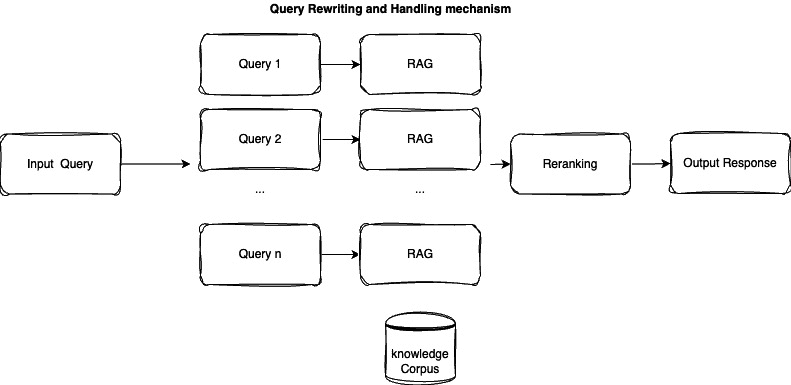

图 5.15 – 带有重写和重新排序机制的查询处理器

通过检索多个重构查询的信息，系统可以收集更丰富的上下文，更好地理解用户的意图，并提供更完整、更准确的响应。

## 混合搜索和检索

高级 RAG 系统通常采用混合检索策略，结合不同的检索方法以利用它们各自的优势。例如，一个系统可能会使用稀疏向量搜索进行初始过滤，然后使用密集向量搜索进行重新排序和展示最相关的文档。其他混合方法包括以下：

+   将关键词匹配与向量相似度搜索相结合

+   为不同类型的数据使用不同的检索方法（例如，结构化与非结构化）

+   层次检索，其中粗粒度检索后跟细粒度重新排序

以下是一个简单的例子，用于说明混合搜索和检索：

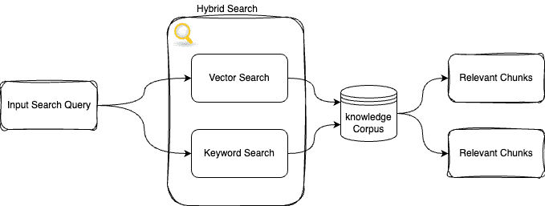

图 5.16 – 混合搜索和检索方法

假设你正在一个销售电子产品和杂货的网站上搜索有关 `apple products` 的信息。

混合搜索方法结合了两种检索方法：

+   `apple products`，它将检索包含单词 `apple` 和 `products` 的文档/页面，例如以下内容：

    +   `在此处购买最新的苹果 iPhone 型号`

    +   `正在销售的苹果 MacBook Pro 笔记本电脑`

    +   `杂货区中的苹果 cider 和苹果汁`

+   `apple products`，它可能会检索到以下文档：

    +   `顶级科技小工具和配件为学生`（与电子产品/产品语义相关）

    +   `适合儿童午餐盒的健康水果和零食`（与苹果作为水果的语义相关）

混合搜索可以随后结合并重新排序来自两种检索方法的结果：

1.  `在此处购买最新的苹果 iPhone 模型`

1.  `促销中的苹果 MacBook Pro 笔记本电脑`

1.  `顶级科技小工具和配件` `为学生`

1.  `杂货区中的苹果醋和苹果汁`

1.  `适合儿童午餐盒的健康水果和零食`

通过结合关键词匹配（用于品牌/产品名称）和语义理解（用于更广泛的上下文），混合方法可以提供比仅使用一种方法更全面和相关的搜索结果。

关键好处是检索到既在词汇上（包含确切的查询关键词）又在语义上（概念上与查询意图相关）相关的文档，从而提高整体搜索质量。

## 嵌入和索引优化

用于检索的向量嵌入和索引的质量可以显著影响 RAG 系统的性能。该领域的先进技术包括以下内容：

+   **嵌入微调**：不是使用通用的预训练嵌入模型，嵌入模型可以在特定领域的数据上进行微调，以更好地捕捉该领域的语义和细微差别。

    例如，如果为医学问答任务构建 RAG 系统，则可以在大型医学文献语料库（如研究论文、临床笔记等）上进一步微调嵌入模型。这允许模型更好地理解特定领域的术语、缩写和上下文关系。

+   **索引结构和分区**：不是将所有文档嵌入存储在单个平面索引中，索引可以以改进检索效率的方式进行结构化或分区；例如，聚类、分层索引和元数据过滤：

    +   **聚类**：可以根据文档的嵌入进行聚类，并为每个聚类创建单独的索引。在查询时，将查询嵌入与聚类中心进行比较，以确定要搜索的相关聚类（们）。

    +   **分层索引**：粗粒度索引首先检索相关的高级主题/类别，然后在那些主题内搜索更细粒度的索引。

    +   **元数据过滤**：如果文档元数据（如类型、来源、日期等）可用，则可以根据该元数据对索引进行分区，以便在向量搜索之前进行过滤。

    *图 5.17* 展示了一个增强元数据的先进检索机制：

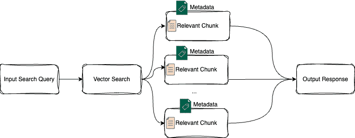

图 5.17 – 增强元数据的检索机制

+   **近似最近邻（ANN）索引**：对于非常大的向量索引，可以使用**分层可导航小世界**（**HNSW**）、FAISS 或**近似最近邻哦，是的**（**Annoy**）等技术来创建 ANN 索引。这允许在检索时间上通过暴力搜索进行大量计算速度的提升，同时牺牲一些准确性。感兴趣的读者可以阅读关于 NN 搜索索引的论文《学习为最近邻搜索索引》(*Learning to Index for Nearest Neighbor Search*) ([`arxiv.org/pdf/1807.02962`](https://arxiv.org/pdf/1807.02962)) 的更多细节。

+   **索引压缩和量化**：可以通过压缩和量化技术减小向量索引的大小，而不会显著影响检索准确性。这包括产品量化、标量量化、残差量化等方法等。

论文《推荐系统中的向量量化：综述与展望》(*Vector Quantization for Recommender Systems: A Review and Outlook*) ([`arxiv.org/html/2405.03110v1`](https://arxiv.org/html/2405.03110v1)) 提供了关于推荐系统中向量量化的详细概述。通过优化嵌入和索引，高级 RAG 系统可以提高检索信息的关联性和全面性，从而提高整体性能。

## 检索重新排序和过滤

即使在初步检索之后，高级 RAG 系统通常还会采用额外的重新排序和过滤技术来展示最相关的信息。这些技术包括以下内容：

+   **交叉注意力重新排序**：可以利用更昂贵的交叉注意力模型来重新评分和重新排序最初检索到的文档，基于它们与查询的相关性。论文《用于深度重新排序的多向量注意力模型》(*Multi-Vector Attention Models for Deep Re-ranking*) ([`aclanthology.org/2021.emnlp-main.443.pdf`](https://aclanthology.org/2021.emnlp-main.443.pdf)) 提供了一种使用多向量注意力模型进行深度重新排序的机制。

+   **学习型重新排序器**：针对重新排序检索文档的任务训练神经网络或其他机器学习模型可以帮助提高带有输入查询的搜索结果。

+   **过滤和修剪**：根据各种启发式方法或模型从初始检索集中移除不太相关或冗余的文档，可以提供上下文优化。

例如，用户可能会提出这样的查询：`美国内战的原因是什么？`

这里有一些通过向量搜索进行初始检索的例子：

+   `奴隶问题是美国内战` `的主要原因...`

+   `南北之间的经济差异导致了` `紧张...`

+   `亚伯拉罕·林肯 1860 年的选举` `触发了分离...`

+   `密苏里妥协未能解决` `奴隶扩张...`

+   `地下铁路帮助奴隶` `逃离...`

这里有一些重新排序的例子：

+   `亚伯拉罕·林肯 1860 年的选举` `触发了分离...`

+   `奴隶问题是美国内战` `的主要原因...`

+   `密苏里妥协未能解决` `奴隶扩张...`

+   `南北之间的经济差异导致了紧张...`

+   `地下铁路帮助奴隶` `逃离...`

这里是前 3 个重新排序和过滤的结果：

+   `亚伯拉罕·林肯在 1860 年的选举` `引发了分离...`

+   `奴隶问题是内战的主要原因...`

+   `密苏里妥协未能解决` `奴隶扩张...`

然后将前 3 个重新排序和过滤的结果作为上下文提供给语言模型，以生成关于内战原因的最终响应，重点关注最相关的信息。

通过重新排序和过滤检索到的信息，高级 RAG 系统可以为 LLM 提供更专注和相关的上下文，从而提高生成响应的质量和事实准确性。

*图 5**.18*展示了使用 Amazon Bedrock 和一些高级 RAG 技术（使用混合搜索机制的重新排序）的完整架构流程，以进一步增强输出响应：

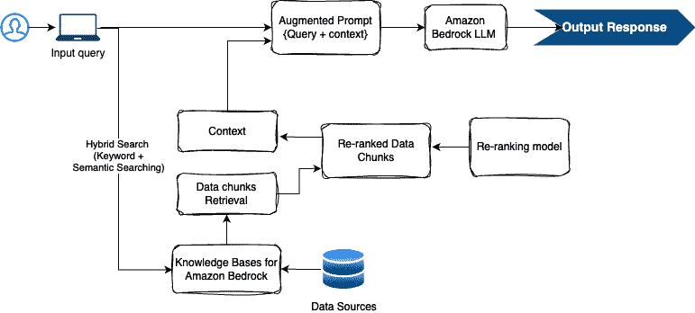

图 5.18 – 使用 Amazon Bedrock 的高级 RAG 方法

如*图 5**.18*所示，在 Amazon Bedrock 的知识库中采用混合搜索（原生可用）可以极大地提高上下文搜索质量。此外，而不是直接将数据块解析到 LLM，将检索到的数据块馈送到一个重新排序模型以对上下文结果进行排序，可以进一步提高输出质量。Cohere Rerank、Meta 的密集段落检索、BERT 用于重新排序，或 Hugging Face（`cross-encoder`/`ms-marco-MiniLM-L6-v2`）的开源模型是一些可以用于此类排名优化任务的重新排序模型示例。最后，一旦创建了带有增强查询和优化上下文的增强提示，其中提示被解析到 Amazon Bedrock LLM 以输出期望的响应。

以这种方式，高级 RAG 技术可以通过将这些技术融入 RAG 管道的各个阶段，旨在通过提高质量、相关性和事实准确性来增强语言模型输出的效果。读者被鼓励访问[`aws.amazon.com/blogs/machine-learning/create-a-multimodal-assistant-with-advanced-rag-and-amazon-bedrock/`](https://aws.amazon.com/blogs/machine-learning/create-a-multimodal-assistant-with-advanced-rag-and-amazon-bedrock/)，了解如何使用高级 RAG 技术通过 Amazon Bedrock 实现**多模态 RAG**（**mmRAG**）。此解决方案还通过利用高级 LangChain 功能，揭示了全面的解决方案。

论文《RQ-RAG：学习用于检索增强生成的查询优化》([`arxiv.org/html/2404.00610v1`](https://arxiv.org/html/2404.00610v1))介绍了另一种高级的 RAG 方法——**针对 RAG 的查询优化**（**RQ-RAG**），它通过提供显式重写、分解和消歧的能力，有助于进一步优化查询。

由于我们已经深入了解了 RAG 的功能、训练以及与 Bedrock 和其他 GenAI 系统的实现，我们还应记住一些局限性和研究问题。这为我们提供了进一步通过 RAG 进行改进和以更具洞察力的思维过程引领 GenAI 路径的机会。一些局限性和未来方向将在下一节中讨论。

# 局限性和未来方向

虽然有前景，但 RAG 模型也带来了挑战和开放的研究问题，包括以下内容：

+   **知识选择**：在 RAG 中，确定从知识库中检索的最相关和显著的知识是一个关键挑战。在大量信息可用的情况下，识别和优先考虑给定上下文中最相关的知识变得至关重要。现有的检索方法可能难以捕捉查询的细微差别和微妙之处，导致检索到不相关或旁枝末节的信息。开发更复杂的查询理解和知识选择机制是研究的关键领域。

+   **知识归一化**：无缝地将检索到的知识整合到生成过程中是一个非平凡的任务。RAG 模型需要理解检索到的知识，对其进行推理，并将其连贯地编织到生成的文本中。这个过程需要高级的**自然语言理解**（**NLU**）和**自然语言生成**（**NLG**）能力，以及对上下文和话语结构的深入理解。未能正确归一化检索到的知识可能导致生成的输出中出现不一致性、不连贯性或事实错误。

+   **训练目标**：RAG（Retrieval Augmented Generation）的一个主要局限性是缺乏用于端到端训练的大规模监督数据集。创建这样的数据集需要大量的人工标注，这既耗时又昂贵。此外，定义合适的训练目标以平衡检索和生成组件是一项挑战。现有的训练目标可能无法充分捕捉任务的复杂性，从而导致性能不佳。

+   **知识库构建**：知识库的质量和覆盖范围在 RAG 模型的有效性中起着至关重要的作用。创建涵盖多个领域和主题的广泛覆盖知识库是一项艰巨的任务。现有的知识库可能不完整、有偏见或过时，限制了模型检索相关信息的能力。此外，确保知识库的准确性和事实正确性是至关重要的，但具有挑战性，尤其是在快速演变或具有争议性的主题上。

+   **多步推理**：RAG 系统通常难以在多个步骤中结合检索到的知识以执行复杂的推理或推断任务。技术领域通常需要多步推理，例如从多个前提中得出结论、遵循复杂的逻辑链或从不同的来源综合信息。当前的 RAG 系统可能缺乏有效整合和推理检索知识的能力，以连贯和逻辑的方式，限制了它们在涉及复杂推理过程的场景中的应用。

+   **评估**：由于任务复杂，评估 RAG 模型的性能具有挑战性。传统的文本生成指标，如困惑度或**双语评估助手**（**BLEU**）分数，可能无法充分捕捉生成输出的事实正确性、连贯性和一致性。开发考虑这些方面以及检索知识质量的稳健评估方法是一个开放的研究问题。鼓励读者查看 Ragas（[`docs.ragas.io/en/v0.1.6/index.html`](https://docs.ragas.io/en/v0.1.6/index.html)），它本质上是一个框架，用于帮助您大规模评估您的 RAG 管道。

尽管存在这些限制，RAG 通过利用外部知识源来增强 GenAI 模型的能力，具有重大的发展潜力。解决这些挑战对于 RAG 在各种应用（如问答、对话系统和内容生成）中的广泛应用和成功至关重要。

未来的关键研究优先事项包括提高检索精度、开发更复杂的融合方法、探索高效的大规模训练技术以及创建更好的评估基准。

**未来方向**

研究人员正在探索诸如密集篇章检索、学习稀疏表示和结合符号和神经方法的混合方法等高级技术。此外，将外部知识源（如结构化数据库或知识图谱）纳入传统语料库之外，可以显著提高检索精度和上下文理解。

开发更复杂的融合方法也是另一个关键的研究领域。虽然当前方法，如检索增强语言模型，已经显示出有希望的结果，但它们通常依赖于简单的连接或注意力机制来融合检索信息与语言模型的生成。研究人员正在研究更先进的融合技术，这些技术可以更好地捕捉检索知识与生成上下文之间的复杂关系，可能利用来自多模态学习、**图神经网络**（**GNNs**）和神经符号推理等领域的技巧。

探索高效的大规模训练技术对于将 RAG 扩展到庞大的知识来源和复杂领域至关重要。由于计算限制，当前系统通常在相对较小的数据集上训练，这限制了它们有效利用庞大知识库的能力。研究人员正在研究分布式训练、知识蒸馏和高效的检索索引等技术，以在保持计算可行性的同时，在大型知识源上进行训练。

最后，创建更好的评估基准对于准确评估 RAG 系统的性能并推动该领域的发展至关重要。现有的基准通常专注于特定的任务或领域，这使得评估这些系统的泛化能力变得具有挑战性。研究人员正在努力开发更全面、更具挑战性的基准，这些基准涵盖更广泛的知识来源、领域和生成任务，并纳入更复杂的评估指标，这些指标超越了传统的度量标准，如困惑度或 BLEU 分数。

通过解决这些关键研究重点，RAG 领域可以继续进步，使开发更强大、更通用的语言生成系统成为可能，这些系统能够有效地利用庞大的知识库来生成高质量、信息丰富且与上下文相关的文本。

# 摘要

RAG 是一种快速发展的技术，通过在相关外部上下文中对神经生成模型进行条件化，克服了这些模型在知识方面的局限性。我们揭示了使用 RAG 方法训练 LLM 的工作原理以及如何使用 Amazon Bedrock、LangChain 编排器和其他 GenAI 系统实现 RAG。我们还进一步探讨了 RAG 方法在 GenAI 领域中的重要性及其局限性。正如所指示的，跨多个领域的早期结果很有希望，并展示了将文本生成基于现实世界知识的潜力。随着研究解决当前的局限性，检索增强可能使 GenAI 系统变得事实性、信息性和安全性。

在下一章中，我们将通过在 Amazon Bedrock 上采用各种方法来深入探讨实际应用。我们将从文本摘要用例开始，然后深入探讨方法和技术的见解。

# 第二部分：Amazon Bedrock 架构模式

在本部分，我们将探讨各种架构模式和利用 Amazon Bedrock 强大功能的用例。这包括文本生成、构建问答系统、实体提取、代码生成、图像创建和开发智能代理。此外，我们将深入探讨现实世界应用，为您提供知识和技能，以便在您的项目中最大化 Amazon Bedrock 的功能。

本部分包含以下章节：

+   *第六章*, *使用 Amazon Bedrock 生成和总结文本*

+   *第七章*, *构建问答系统和对话界面*

+   *第八章*, *使用 Amazon Bedrock 提取实体和生成代码*

+   *第九章*, *使用 Amazon Bedrock 生成和转换图像*

+   *第十章*, *使用 Amazon Bedrock 开发智能代理*
