# 第九章：使用亚马逊 Bedrock 生成和转换图像

到目前为止，我们已经探索了几个能够生成文本响应的 LLMs。本章将探讨使用亚马逊 Bedrock 上可用的选择 FM 生成图像。我们将从图像生成的概述开始，其中我们将检查如 GANs 和**变分自编码器**（**VAEs**）等模型架构。然后，我们将介绍一些图像生成和亚马逊 Bedrock 中可用的多模态模型的实际应用。此外，我们将深入了解几个多模态设计模式，以及亚马逊 Bedrock 提供的伦理考虑和保障措施。

到本章结束时，您将了解如何使用亚马逊 Bedrock 实现图像生成及其设计模式，以应用于实际案例。

本章将涵盖以下关键主题：

+   图像生成概述

+   多模态模型

+   多模态设计模式

+   伦理考虑和保障措施

# 技术要求

本章要求您拥有 AWS 账户访问权限。如果您还没有账户，可以访问[`aws.amazon.com/getting-started/`](https://aws.amazon.com/getting-started/)创建一个。

其次，您需要在[`aws.amazon.com/cli/`](https://aws.amazon.com/cli/)创建账户后安装和配置 AWS CLI，这将用于从您的本地机器访问亚马逊 Bedrock FM。由于我们将执行的多数代码单元都是基于 Python 的，因此在此时设置 AWS Python SDK（Boto3）[`docs.aws.amazon.com/bedrock/latest/APIReference/welcome.html`](https://docs.aws.amazon.com/bedrock/latest/APIReference/welcome.html)将非常有用。您可以通过任何方式执行 Python 设置。在您的本地机器上安装它，或者使用 AWS Cloud9，或者利用 AWS Lambda，或者利用 Amazon SageMaker。

注意

与亚马逊 Bedrock FM 的调用和定制相关将产生费用。请参阅[`aws.amazon.com/bedrock/pricing/`](https://aws.amazon.com/bedrock/pricing/)以获取更多信息。

# 图像生成概述

图像生成是一个令人着迷且快速发展的领域。自从深度学习技术的兴起和计算能力的增强以来，机器已经获得了从零开始或基于文本提示创建高度逼真和复杂的图像的非凡能力。这种能力在各种领域打开了广泛的应用，包括创意产业、媒体和娱乐、广告、产品包装等。

图像生成的历史可以追溯到计算机视觉和模式识别的早期发展。研究人员和科学家长期以来一直在寻求理解和复制人类的视觉感知系统，为图像合成和操纵的初始技术铺平了道路。然而，图像生成的真正突破是在深度学习出现时，特别是 GANs 和 VAEs 的引入。

请注意，我们强调这些技术是为了历史参考。当前的图像生成 FM 并不使用这些技术。

## GANs 和 VAEs 是什么？

GANs（生成对抗网络），由伊恩·古德费洛及其同事于 2014 年提出，彻底改变了图像生成领域。您可以在[`arxiv.org/pdf/1406.2661`](https://arxiv.org/pdf/1406.2661)上了解更多相关信息。GANs 采用了一种独特的训练方法，其中两个神经网络在竞争中相互对抗。第一个网络被称为**生成器**，其任务是生成模仿真实数据的合成样本。例如，生成器可以生成新的图像、文本或音频剪辑。第二个网络被称为**判别器**。其作用是分析示例，包括真实和合成的，以分类哪些是真实的，哪些是人工生成的。

通过这种对抗过程，生成器学会产生越来越令人信服的伪造品，可以欺骗判别器。同时，判别器在检测揭示合成样本的微妙异常方面的能力也在不断进化。它们竞争的目标推动两个网络不断改进。GANs 的演示可以在[`thispersondoesnotexist.com/`](https://thispersondoesnotexist.com/)上看到。通过不断刷新页面，用户会看到一个不断涌现的新颖人脸流。然而，这些面孔都不是真实的——所有这些都是由一个在大量真实人脸图像数据库上训练的 GAN 生成的合成肖像。该网站展示了 GANs 如何在许多领域合成高度逼真的输出。

自 GANs 问世以来，已经实施了许多进步和变化，导致图像生成领域取得了显著成就。如 StyleGAN、BigGAN 和扩散模型等技术推动了图像质量、分辨率和多样性的边界。这些模型可以生成逼真的人脸、风景、物体甚至艺术作品的图像，模糊了人工和真实之间的界限。

另一方面，VAEs（变分自编码器）是训练生成式 AI 算法的一种更简单的方法。它们也利用两个神经网络：**编码器**和**解码器**。编码器通过将其映射到低维潜在空间来学习数据中的模式；解码器使用这些潜在空间中的模式来生成逼真的样本。

图像生成领域最令人兴奋的发展之一就是自然语言处理能力的集成。例如 DALL-E、Stable Diffusion 和 Midjourney 等模型，使得用户只需提供文本描述或提示，就能生成图像。这种语言与视觉的结合为创意表达、快速原型设计和各种机器学习任务的数据增强开辟了新的途径。

虽然图像生成技术的进步令人瞩目，但解决与这项技术相关的伦理考虑和潜在风险至关重要。如深度伪造、偏见和恶意用途等问题必须得到妥善处理，以确保这些强大工具的负责任和道德部署。我们将在本章的“伦理考虑和保障措施”部分详细探讨这一主题。

让我们来看看图像生成模型的一些实际应用。

## 实际应用

图像生成的应用是无限的。以下是图像生成的一些实际应用：

+   **广告和营销**：在广告和营销的世界里，视觉在吸引注意力和有效传达信息方面发挥着至关重要的作用。通过图像生成，你可以通过生产针对特定目标受众的独特、视觉冲击力强的图像来革新营销活动。营销人员可以利用 Bedrock 模型生成个性化的产品广告、社交媒体视觉图像和吸引人的图形，这些图像与他们的目标受众产生共鸣。此外，营销人员可以根据客户偏好创建图像变体，确保营销材料高度相关且具有吸引力。

+   **图形设计和内容创作**：图形设计师和内容创作者在执行之前，常常面临构思和可视化想法的挑战。借助 Bedrock 的图像生成模型，你可以通过依赖这个强大的工具来生成初始概念、插图和视觉资产，从而简化这一过程。设计师可以使用图像生成模型来探索不同的风格、构图和配色方案，促进快速迭代和实验。此外，内容创作者可以利用 Bedrock 模型生成独特且吸引人的图像，用于博客文章、文章或其他营销材料，增强其视觉吸引力并提高参与度。

+   **产品可视化和原型设计**：有效的产品可视化对于迭代设计、收集反馈和展示产品至关重要。借助 Bedrock 图像生成模型，企业可以生成产品设计的逼真可视化，从而在投资物理原型之前进行快速原型设计和评估。Bedrock 模型可以创建产品在不同环境或不同角度的图像，为利益相关者提供产品外观和功能的全面理解。这种能力可以显著加速产品开发周期，并有助于市场营销和销售工作。

+   **游戏和虚拟环境**：游戏和**虚拟现实**（**VR**）行业高度依赖视觉沉浸式体验。Bedrock 的图像生成模型可以赋予开发者创建独特纹理、环境和资产的能力，用于视频游戏、VR 或**增强现实**（**AR**）应用。Bedrock 图像模型可以根据用户规格或游戏叙事生成定制的头像、角色设计和复杂的视觉元素。此外，开发者可以增强其虚拟世界的真实性和多样性，为玩家提供更具吸引力和个性化的体验。

+   **建筑和室内设计**：对于建筑师、室内设计师以及他们的客户来说，可视化建筑设计和室内空间至关重要。Bedrock 图像模型可以生成提议设计的逼真渲染图，使利益相关者在施工或翻新前沉浸于设想的空间。Bedrock 的能力有助于可视化不同的材料、家具布局和照明条件，使建筑师和设计师能够完善他们的概念并向客户或决策者展示有说服力的提案。

+   **时尚和服装**：在时尚和服装行业中，Amazon Bedrock 图像模型可以生成独特的纺织品设计、图案和服装风格，使时尚设计师能够探索新概念并保持对潮流的领先。此外，Bedrock 还可以创建不同体型或不同环境中的服装物品的视觉表示，让客户在购买前预览服装的真实效果。这种能力可以提升购物体验并降低退货率。

+   **科学可视化**：在研究和教育中，有效地传达科学数据、现象和模拟至关重要。Amazon Bedrock 的图像生成模型可以帮助科学家和研究人员创建复杂概念的视觉表示，使它们更加易于获取和理解。Bedrock 模型可以为科学出版物、演示或教育材料生成插图、图表或 3D 模型，促进知识转移并加深对复杂主题的理解。

+   **艺术和创意表达**：艺术家可以利用 Bedrock 图像模型通过基于文本提示或概念框架生成独特和富有想象力的图像来探索新的风格、技术和概念。

+   **电子商务和产品目录**：在电子商务领域，高质量的产品图像对于吸引顾客和推动销售至关重要。Amazon Bedrock 图像模型可以为在线目录或电子商务平台生成吸引人的、准确的产品图像，减少大量拍摄和相关的成本。这些模型还可以根据客户偏好创建定制产品或配置的可视化，增强购物体验并实现大规模个性化。

既然我们已经看到了一些实际应用，让我们探索各种多模态模型及其内部工作原理。

# 多模态模型

到目前为止，在这本书中，我们已经探讨了单模态模型架构模式，例如文本到文本生成，这包括问答、摘要、代码生成等。现在让我们扩展我们的理解，到另一种生成式 AI 模型：多模态模型。

多模态模型是一种可以理解和解释多种模态（如图像、音频和视频）的模型，如图 *9.1* 所示。

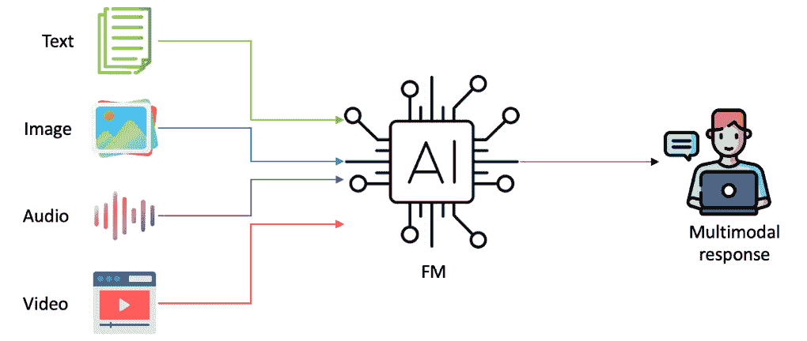

图 9.1 – 多模态

这些模型收到的响应也可以是多模态的。幕后，这些 FM 包含多个处理文本、图像、音频和视频的单模态神经网络。

现在，让我们看看 Amazon Bedrock 内部可用的多模态模型。

## 稳定扩散

**稳定扩散** 是一种在生成式 AI 领域受到广泛关注的最先进的图像生成模型。与许多其他图像生成模型不同，稳定扩散采用了一种独特的基于扩散的方法，使其与其他方法或技术区分开来。

稳定扩散的核心概念是 **扩散**，它涉及正向和反向扩散过程。在 **正向扩散** 中，高斯噪声逐渐添加到图像中，直到它完全随机。然后，模型学习逆转这个过程，逐渐去除噪声以重建原始图像。这种逆转称为 **反向扩散**，是稳定扩散出色性能的关键。

这个扩散过程有几个关键组成部分：

+   **对比语言-图像预训练**（**CLIP**）：CLIP 是在大量图像-文本对数据集上训练的神经网络，使其能够理解视觉和文本表示之间的语义关系。该组件在连接自然语言提示及其相应的视觉表现之间起着至关重要的作用。

+   **U-Net**：这作为图像生成过程的骨干。U-Net 是一个用于图像到图像翻译任务的卷积神经网络，如分割和去噪。分割是将图像分割成多个部分或像素集的过程，以定位对象和边界。去噪是从图像中去除噪声以提高其质量。在稳定扩散的上下文中，U-Net 负责根据输入提示和 CLIP 的引导生成和细化输出图像。

+   **VAE**：这是另一个关键组件，有助于确保生成的图像既连贯又逼真。在稳定扩散中，VAE 将生成的图像编码成一个压缩表示，然后解码以生成最终的输出图像。

如*图 9.2*所示，这里是对整个过程的高级概述：

1.  用户提供一个描述所需图像的自然语言提示。

1.  CLIP 模型分析提示并生成相应的嵌入，表示文本的语义意义。

1.  U-Net 架构将这个嵌入作为输入，以及一个初始的随机噪声图像。

1.  通过一系列卷积和反卷积操作，U-Net 在 CLIP 嵌入的引导下迭代地细化噪声图像，以生成与输入提示匹配的图像。

1.  生成的图像随后通过 VAE，对其进行编码和解码，确保连贯性和逼真性。

1.  生成最终的输出图像，反映了用户的提示。

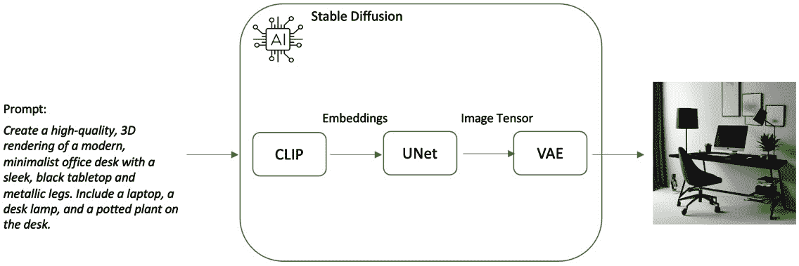

图 9.2 – 稳定扩散过程

通过结合这些架构元素，稳定扩散能够生成高质量、多样化的图像，这些图像不仅视觉上吸引人，而且与输入提示在语义上保持一致。为了理解扩散过程的详细工作原理，鼓励读者阅读研究论文*关于扩散模型设计基础*的综述。可以在[`arxiv.org/pdf/2306.04542.pdf`](https://arxiv.org/pdf/2306.04542.pdf)找到。

本文解释了扩散模型是如何工作的，通过逐渐向训练数据添加噪声，然后学习逆转这一过程以生成新的样本。文章突出了扩散模型广泛的应用范围，包括图像编辑、文本到图像生成和 3D 物体创建。

此外，建议读者探索 DeepLearning.AI 的*扩散模型是如何工作的*课程，[`learn.deeplearning.ai/courses/diffusion-models/`](https://learn.deeplearning.ai/courses/diffusion-models/)。

## 泰坦图像生成器 G1

**Titan 图像生成器 G1**是 Amazon 的一个专有图像生成模型，允许用户从文本生成图像，编辑现有图像，并创建图像的变体。该模型旨在通过根据文本描述生成多个图像选项来简化用户对图像概念的迭代。该模型在多样化的高质量数据集上进行了训练，因此它可以理解包含多个对象的复杂提示并生成逼真的图像。

此模型支持图像编辑功能，例如使用内置分割模型进行基于文本的编辑，生成图像的变体，使用图像遮罩进行修复，以及扩展或更改图像背景的扩展。您可以上传现有的图像并提供指令或提示来修改图像的特定方面。该模型可以智能地改变构图，添加或删除元素，更改颜色，或应用各种艺术风格，同时保持原始图像的整体一致性和现实主义。

我们将在*多模态设计* *模式*部分深入探讨这些功能。

## Titan 多模态嵌入

**Titan 多模态嵌入**模型是 Amazon Titan 模型系列的一部分，专为需要高精度和快速响应的应用场景，如图像搜索和基于相似度的推荐而设计。

Titan 多模态嵌入模型的核心优势在于其能够为文本和视觉数据生成高维向量表示。这些嵌入封装了不同模态之间的语义关系，允许进行高效有效的搜索和检索操作。

该模型支持最多 128 个 token 作为英文输入文本，以及高达 25MB 的图像大小，并将这些转换为向量嵌入。默认的嵌入维度是 1024，提供丰富的表示，能够捕捉细微的细节和复杂的关系。然而，您也可以根据您的具体用例和性能要求配置更小的向量维度以优化速度和成本。

## Anthropic Claude 3 – Sonnet、Haiku 和 Opus

Anthropic Claude 3 模型变体——*Claude 3 Sonnet*、*Claude 3 Haiku*和*Claude 3 Opus*——是 Amazon Bedrock 上可用的 Anthropic Claude 模型中最新的、最先进的系列。所有这些模型都具有多模态能力，这意味着它们能够感知和分析图像以及文本输入，拥有 200K 的上下文窗口。如果您想再次了解它们的详细信息，请参阅*第一章*中的*Anthropic Claude*部分。

现在我们已经了解了 Amazon Bedrock 中可用的多模态模型，让我们来探索一些设计模式。

# 多模态设计模式

通过多模态设计模式，我们整合了不同的模态，如文本、图像、音频等。随着可用的多模态模型，从文本或其他输入模态生成、操作和理解图像的能力在广泛的领域中变得越来越重要，从创意设计到科学可视化等。

可以使用多模态模型创建多种模式。在本节中，我们将介绍一些常见的模式。

## 文本到图像

在文本到图像模式中，您将文本作为提示提供给模型。然后，模型将根据该提示生成图像，如图*图 9.3*所示。

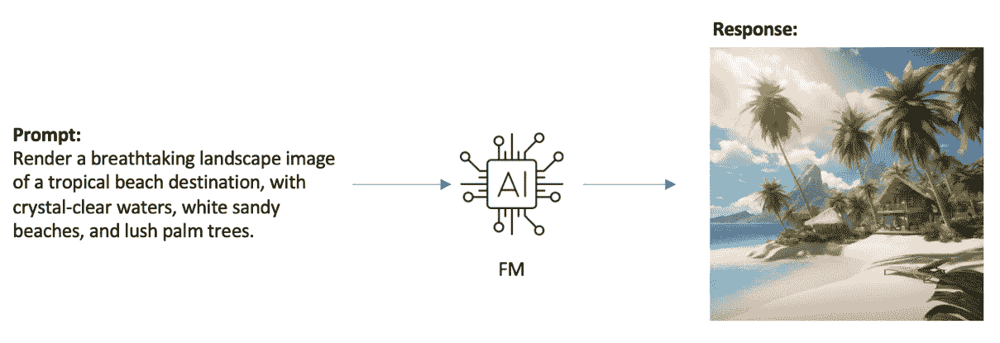

图 9.3 – 文本到图像模式

**参数**

图像生成模型的核心是一组可定制的推理参数和控制，使用户能够从模型中获得所需的图像。让我们看看这些参数：

+   `Cloud`和`seating bench`来排除它们从图像中，如图*图 9.4*所示。

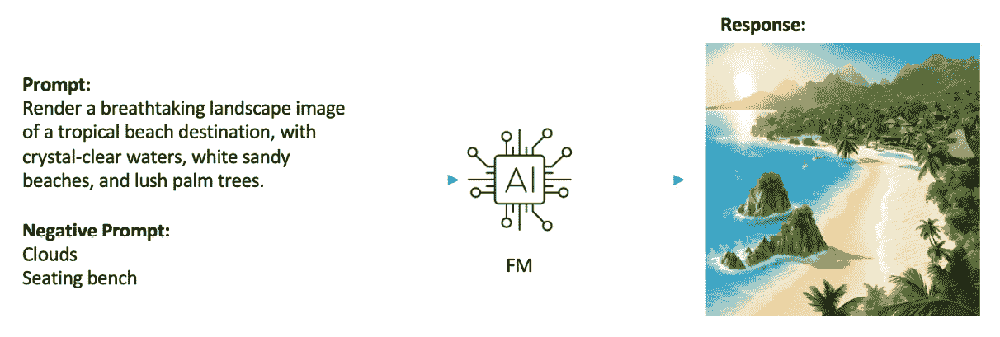

图 9.4 – 带有负面提示的文本到图像模式

+   **参考图像**：这为用户提供将参考图像输入到模型的能力，模型可以利用它作为生成响应（生成图像）的基线。例如，如果我们使用前一个图生成的图像并将其作为参考与提示一起传递，提示可能如下所示：

`一个夜晚的未来城市景观，由玻璃和金属构成的摩天大楼。建筑被蓝色、紫色和粉红色的霓虹灯光照亮。街道上排列着全息广告牌和广告。`

模型将使用参考图像和提示来生成一个新的图像，如图*图 9.5*所示。

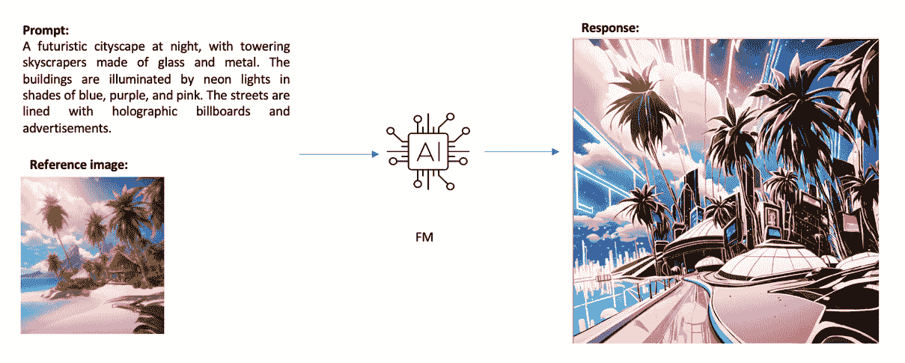

图 9.5 – 使用参考图像的文本到图像模式

+   **提示强度** **(****cfg_scale****)**: 提示强度，也称为**无分类器指导尺度** (*cfg_scale*)，决定了生成的图像遵循提供文本提示的程度。较高的值表示图像生成过程将更紧密地遵循文本提示，而较低的值允许更多的创造性解释和生成图像的多样性。通常建议使用中间的 cfg_scale 值（*10-15*），因为它在忠实代表文本提示和允许艺术表达之间取得了平衡。然而，最佳值可能因您的用例或您所寻找的内容而异，提示的复杂性以及生成图像所需细节的水平。

+   **生成步骤** **(****步骤****)**: 稳定扩散中的*步骤*参数指的是算法从输入文本生成图像所经历的迭代或循环次数。这是一个影响最终图像质量和细节的重要设置。以下是其工作原理：

    +   该过程从随机噪声开始，并且随着每一步的进行，部分噪声被移除，逐渐揭示出预期的图像。

    +   步骤数越多通常会导致图像质量更高，细节更丰富，但也会有一个收益递减的点。

    +   理想步骤数可能因你试图生成的图像的复杂性和个人偏好而异。然而，步骤数过多可能不会显著提高图像质量，但会增加生成时间。

    +   对于简单主题或场景，大约*10-15*步可能就足够了。但对于更复杂或详细的图像，你可能需要增加步骤到*40-50*或更多，具体取决于你想要多详细。

我们所讨论的只是其中的一些参数。以下图例突出了稳定扩散的附加参数。

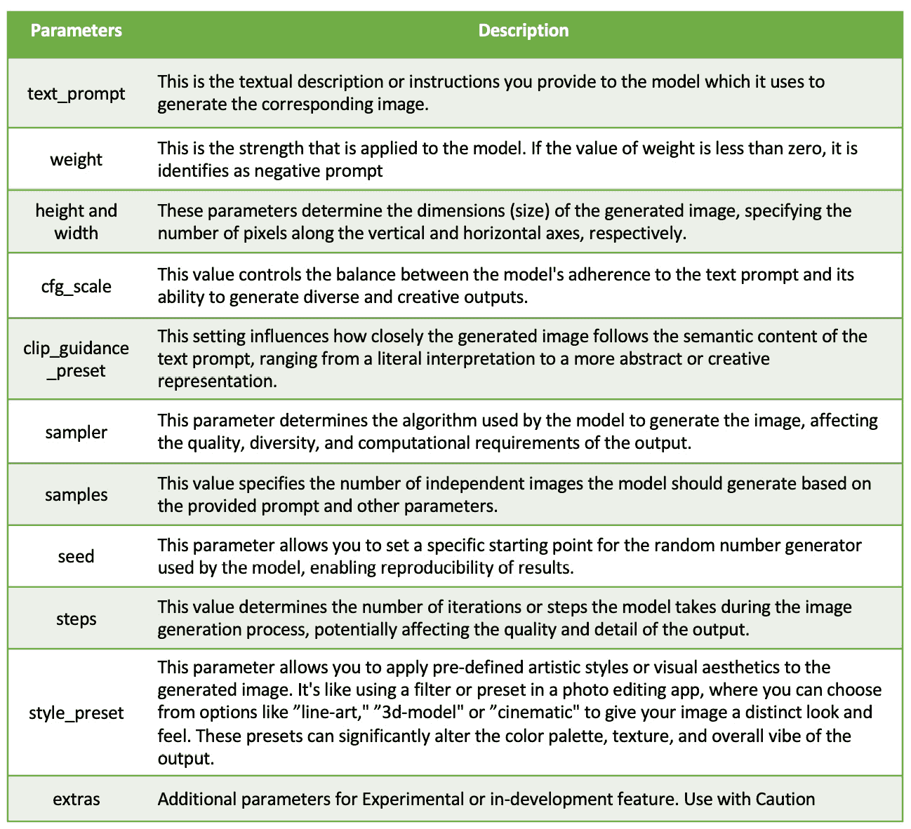

图 9.6 – 稳定扩散文本到图像参数

要详细了解这些参数，你可以查阅[`platform.stability.ai/docs/api-reference#tag/Image-to-Image`](https://platform.stability.ai/docs/api-reference#tag/Image-to-Image)上的稳定扩散文档。

如果你正在使用亚马逊 Titan 图像生成器，以下是你可以使用的参数列表：[`docs.aws.amazon.com/bedrock/latest/userguide/model-parameters-titan-image.html`](https://docs.aws.amazon.com/bedrock/latest/userguide/model-parameters-titan-image.html).

## 图像搜索

图像搜索已成为一种强大的工具，使用户能够探索和利用大量的视觉数据集。通过亚马逊 Bedrock 的 FMs，你可以执行图像搜索以理解和解释视觉内容。你可以识别和理解图像中的各种元素，如物体、场景、颜色、纹理，甚至抽象概念。为了说明图像搜索的力量，让我们考虑一个实际例子。

假设你是一家拥有大量服装商品目录的时尚零售商。使用 Bedrock，你可以上传你的产品图片，并利用图像搜索功能，让客户能够找到视觉上相似的商品。例如，一位客户可以上传一张他们喜欢的连衣裙图片，Bedrock 会从你的目录中返回一组视觉上相似的连衣裙，从而促进更吸引人和个性化的购物体验。

图像搜索的一种强大方法是基于跨模态嵌入，它允许在向量空间中同时表示文本和图像。这些向量捕捉图像的视觉特征和语义信息。然后，这些向量以及如图像路径之类的元数据存储在可搜索的索引向量数据库中，例如 OpenSearch Serverless、FAISS 或 Pinecone。这项技术使您能够使用文本查询搜索图像或根据给定图像（或文本和图像的组合）找到相似图像。

当用户发起搜索时，他们的输入（文本、图像或两者兼有）也会使用相同的跨模态嵌入模型转换为向量表示。然后，搜索向量与索引中的向量进行比较，并根据向量相似度分数检索最相似的向量。这种方法允许灵活直观的图像搜索，因为用户可以使用自然语言描述进行搜索，上传示例图像，或结合文本和图像以获得更精确的结果。例如，您可以搜索“城市街道上的红色跑车”并从其数据存储中返回匹配视觉和文本标准的相关图像。

如您现在可能已经注意到的，这个过程与我们讨论的*第五章*中的 RAG 过程类似。这里的区别在于，模型是从其数据存储中检索图像，而不是生成新图像。以下是一个尝试跨模态嵌入和搜索的绝佳示例：[`github.com/aws-samples/amazon-bedrock-workshop/blob/main/04_Image_and_Multimodal/bedrock-titan-multimodal-embeddings.ipynb`](https://github.com/aws-samples/amazon-bedrock-workshop/blob/main/04_Image_and_Multimodal/bedrock-titan-multimodal-embeddings.ipynb)。

跨模态嵌入的图像搜索在各个领域有众多实际应用。在电子商务平台上，它可以用于增强产品搜索和推荐系统，使客户能够找到视觉上相似的产品或使用自然语言描述或示例图像进行搜索。在媒体和娱乐行业，它可以通过识别相似或重复的图像来协助内容组织、标签建议和版权侵权检测。

## 图像理解

Anthropic Claude 3 模型——Sonnet、Haiku 和 Opus——引入了图像理解能力，通过该能力，模型可以分析图像并根据您想要了解的内容为您提供响应。例如，您可以提供厨房或客厅的图像，并要求模型提供图像的详细描述或根据图像编写虚构故事。

### 示例 1

使用以下提示：“提供此图像的详细描述”。

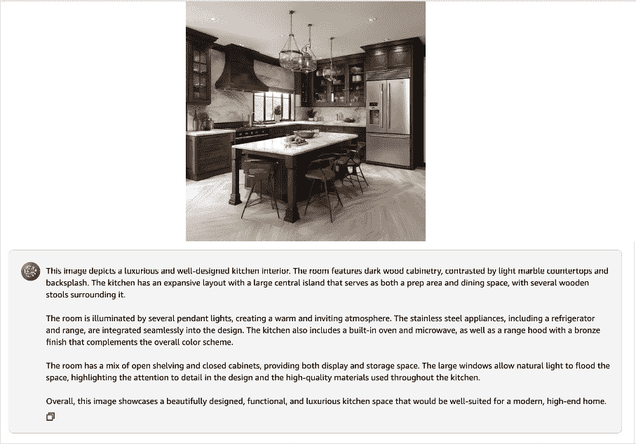

图 9.7 – 输出中的图像理解和详细描述

在 *图 9.7* 中，我们向 Anthropic Claude 3 模型提供了厨房的图像，并要求它提供图像的详细描述。模型能够提供诸如 **房间特征为深色木制橱柜，与浅色大理石台面形成对比** 等细微细节。

### 示例 2

使用以下提示：`根据所附图像编写一个虚构故事`。

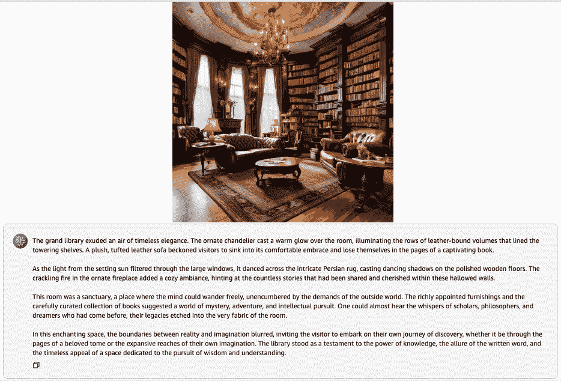

图 9.8 – 使用虚构故事进行图像理解

在 *图 9.8* 中，您可以看到模型根据提供给它的图书馆图像生成了一个虚构故事。

### 示例 3

使用以下提示：`提供图像中存在的物品/对象的列表，并解释每个物品`。

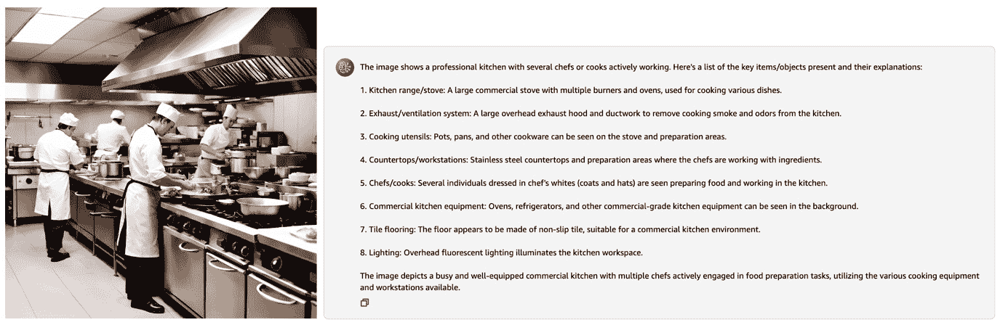

图 9.9 – 使用对象识别进行图像理解

在 *图 9.9* 中，模型能够识别图像中的物品和对象及其详细信息，展示了图像分类/对象识别能力。

Claude 模型的图像理解能力不仅限于前面示例中讨论的内容。它们还可以用于图像标题、创建详细的图像描述、识别主题以及回答有关图像内容的问题。您可以在 [`docs.anthropic.com/claude/docs/use-cases-and-capabilities#vision-capabilities`](https://docs.anthropic.com/claude/docs/use-cases-and-capabilities#vision-capabilities) 查看图像理解的多种用例。

在 Amazon Bedrock 控制台中使用此功能，您可以按照以下步骤操作：[`console.aws.amazon.com/bedrock-`](https://console.aws.amazon.com/bedrock-)

1.  [前往 Amazon Bedrock 控制台](https://console.aws.amazon.com/bedrock-)：https://console.aws.amazon.com/bedrock。

1.  导航到 **Chat Playground**。

1.  点击 **选择模型**。选择 **Anthropic Claude 3 Sonnet**、**Anthropic Claude 3 Haiku** 或 **Anthropic Claude 3 Opus** 模型。

1.  附加您想要分析的图像，并根据您所寻找的内容提供提示，如图 *图 9.10* 所示。

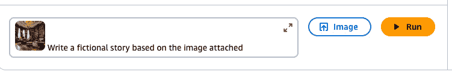

图 9.10 – 如何使用 Anthropic Claude 3 模型分析图像

如果您正在使用 AWS SDK，您可以使用 Anthropic 的 `Messages` API 创建聊天应用程序并提供图像进行理解。以下是一个用于 Claude 3 Sonnet 模型的多模态消息的 AWS Python SDK 示例代码：[`docs.aws.amazon.com/bedrock/latest/userguide/model-parameters-anthropic-claude-messages.html#api-inference-examples-claude-multimodal-code-example`](https://docs.aws.amazon.com/bedrock/latest/userguide/model-parameters-anthropic-claude-messages.html#api-inference-examples-claude-multimodal-code-example)。

## 图像到图像模式

当涉及到图像到图像生成时，模型以现有的图像作为输入，并根据您提供的提示或指令对其进行修改。这与基于文本生成图像不同，后者模型完全从头开始创建一个全新的图像，仅基于文本描述或提示。在图像到图像生成中，模型使用现有的图像作为起点，然后应用必要的更改或转换以生成所需的输出图像。这可能涉及调整颜色、纹理、物体或图像的整体构图等各个方面，所有这些都由提示指导。这就像拥有一个黏土模型，并将其重塑成您期望的形状，而不是从一块原始的黏土开始。修改和操作现有图像的能力为各种创意可能性和用例打开了大门，从增强和编辑照片到创建艺术诠释或可视化。

*图 9.11* 展示了图像到图像生成的一个简单示例。

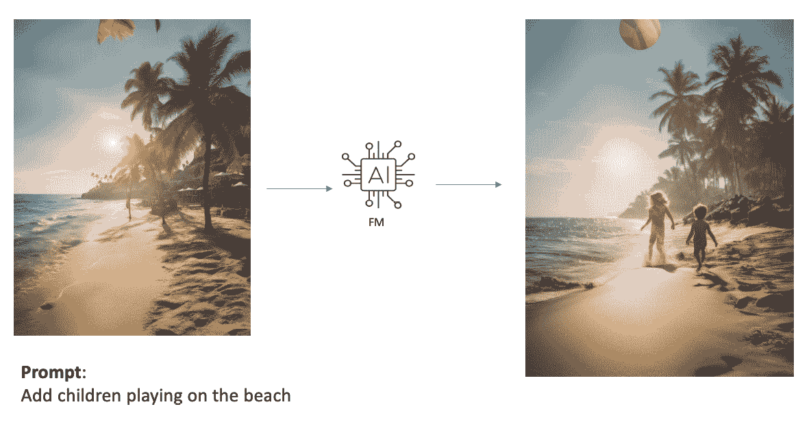

图 9.11 – 简单的图像到图像生成

当使用稳定扩散模型进行图像到图像生成时，除了*图 9.6* 中提到的文本到文本参数外，还有一些额外的参数需要考虑。这些额外的参数在*图 9.12* 中突出显示。

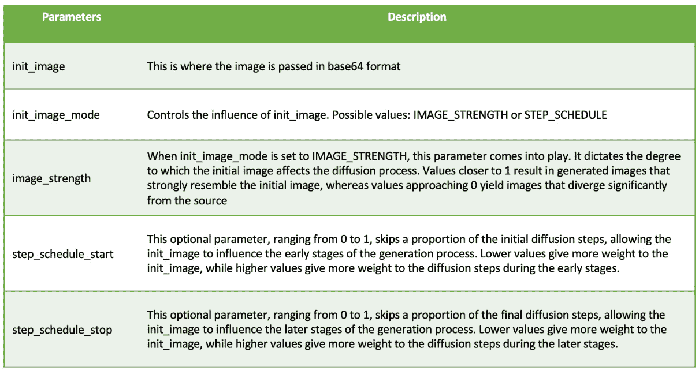

图 9.12 – 稳定扩散图像到图像参数

您可以在此处了解更多信息：[`platform.stability.ai/docs/api-reference#tag/Image-to-Image/operation/imageToImage`](https://platform.stability.ai/docs/api-reference#tag/Image-to-Image/operation/imageToImage)。

接下来，让我们看看一些图像到图像模式。

### 图像变化

**图像变化**，也称为**图像到图像翻译**或**风格迁移**，是生成式人工智能中的一个强大技术，它通过修改现有图像来创建新的独特图像。这个过程涉及获取一个输入图像，并对其应用一个期望的风格或转换，从而生成一个输出图像，该图像结合了原始图像的内容和期望的美学或视觉特征。

一个现实世界的图像变化例子是在时尚设计领域。设计师可以取一个现有的服装或配饰，并应用各种风格、图案或纹理来创建新的创新设计，而无需从头开始。这不仅节省了时间和资源，还允许快速实验和迭代，使设计师能够探索广泛的可能。

在艺术界，图像变化技术也可以用来创建独特和富有表现力的艺术作品。艺术家可以采用简单的照片或绘画，并应用各种艺术风格，如印象派、立体主义或抽象表现主义，以创建完全新的作品，将原始内容与所需的艺术风格融合在一起。这为创造性表达开辟了新的途径，并允许艺术家探索非传统和引人深思的视觉解释。

图像变化在室内设计和建筑可视化领域也有应用。设计师和建筑师可以采用现有的空间或结构，应用不同的材料、纹理或照明条件来可视化空间在不同设计选择下的可能外观。这有助于客户理解和欣赏所提出的设计，同时也使得设计师能够快速迭代和细化他们的概念。

使用 Bedrock，您可以利用 Titan 图像生成器来创建图像变化。让我们尝试以下提示并通过 Titan 图像生成器运行它：

`一种精致的自然图案，细致描绘了鸟类、蝴蝶和叶子的图案，非常适合浪漫波西米亚风格的连衣裙`或围巾`。`

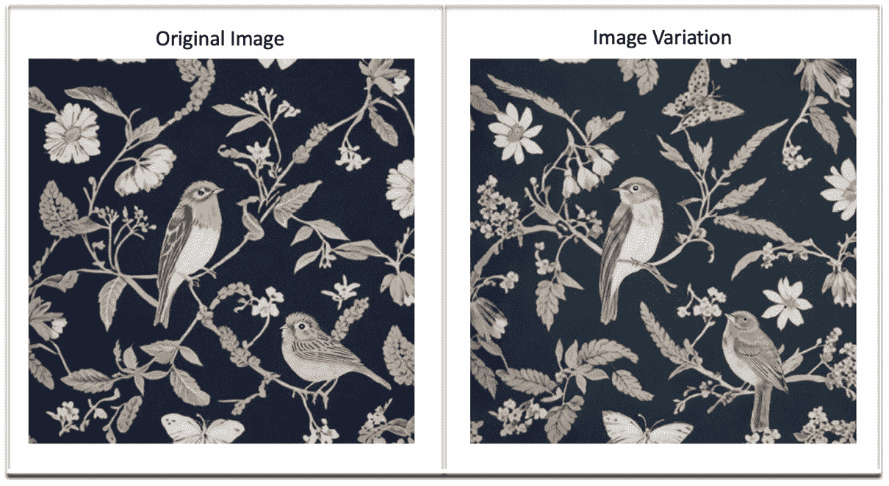

图 9.13 – 图像变化

如*图 9**.13 所示，Titan 图像生成器将创建一个图像（**原始图像**）。您可以使用**原始图像**作为参考来生成图像变化，同时还可以提供可选的提示供模型使用。

### 遮罩

Amazon Bedrock 模型——Amazon Titan Generator 和 Stable Diffusion——提供了两种强大的图像编辑技术：*遮罩*和*绘画*。

使用遮罩，我们定义图像中的特定区域并将其遮罩，要么保留要么重新绘制。这种遮罩可以通过图像文件或提示来完成。

#### 图像遮罩

**图像遮罩**的方法使用一个单独的图像文件，称为**遮罩图像**，来指定要遮罩或保留在原始图像中的像素。遮罩图像必须满足以下要求：

+   **与原始图像相同的尺寸和分辨率**：在应用图像遮罩时，确保遮罩图像与您想要遮罩的原始图像具有完全相同的尺寸和分辨率至关重要。这确保了遮罩图像中的每个像素都与原始图像中的像素相对应，从而实现精确的遮罩。如果尺寸或分辨率不同，遮罩过程可能会产生扭曲或不理想的结果。

    例如，如果您的原始图像分辨率为 1920 x 1080 像素，遮罩图像也必须具有 1920 x 1080 像素的分辨率。任何尺寸或分辨率的差异都可能导致遮罩与原始图像错位，导致不理想的遮罩效果。

+   **无 alpha 通道**：遮罩图像不应包含 alpha 通道，这是某些图像格式中的一个单独组件，用于表示透明度。虽然 PNG 格式通过 alpha 通道支持透明度，但对于图像遮罩目的，遮罩图像应仅依赖于颜色值（**红色、绿色、蓝色**（**RGB**）或灰度）来表示遮罩和未遮罩区域。

    alpha 通道的缺失简化了遮罩过程，并确保遮罩仅基于像素颜色，而不包含任何额外的透明度信息。这种方法通常因其简单性和与广泛图像处理工具和库的兼容性而受到青睐。

+   `0`, `0`, `0`) 作为遮罩区域，而任何非黑色像素都被视为未遮罩区域。

+   `0`（黑色）到`255`（白色）。遮罩过程将值为`0`的像素解释为遮罩区域，而将非零值的像素视为未遮罩区域。

RGB 和灰度色彩模式的选择取决于您的具体用途以及您用于图像遮罩的工具或库。某些工具可能对某种色彩模式有偏好。

例如，假设您在食品和饮料行业工作，并且您想从图像中遮罩掉某些食品项目，以创建菜单设计的透明层。假设您想遮罩下图中芯片碗，并可能将其从菜单中移除。*图 9**.14*显示了原始图像和遮罩图像，其中遮罩是在芯片碗上进行的。

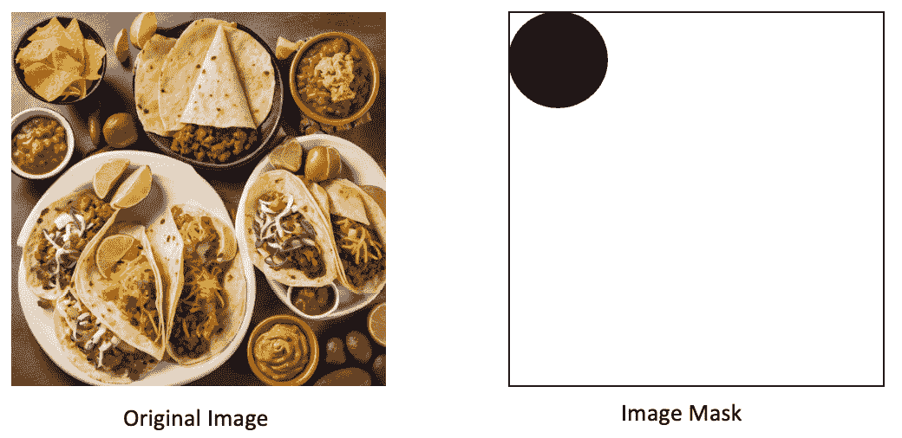

图 9.14 – 图像遮罩

如果您想尝试图像遮罩，您可以使用在线照片编辑工具或应用程序。还有**Python 图像库**（**PIL**），这是一个非常流行的 Python 库，值得在[`pillow.readthedocs.io/en/stable/reference/Image.html`](https://pillow.readthedocs.io/en/stable/reference/Image.html)上查看。

此外，我们建议您尝试来自 Amazon Bedrock 研讨会的工作坊中的以下 GitHub 示例，这些示例展示了图像遮罩和绘画：[`github.com/aws-samples/amazon-bedrock-workshop/tree/main/04_Image_and_Multimodal`](https://github.com/aws-samples/amazon-bedrock-workshop/tree/main/04_Image_and_Multimodal)。

#### 遮罩提示

**遮罩提示**涉及通过使用文本提示来遮罩图像。这些文本提示作为模型的指南，帮助模型理解图像中期望的遮罩区域。

与图像遮罩相比，使用遮罩提示的优点在于其动态性。您只需简单地更改文本提示，就可以轻松地修改遮罩，从而实现快速迭代和实验。这种灵活性使得艺术家、设计师和内容创作者能够探索广泛的视觉概念和叙事，而不会受到传统图像编辑工具的限制。

此外，遮罩提示可以无缝集成到各种工作流程和应用中，实现无缝协作并提高生产力。例如，在视觉叙事领域，作家和导演可以利用此功能来构思和细化他们的愿景，而设计师可以在最终确定最终设计之前快速原型化和迭代视觉概念。

为了确保生成内容的完整性和原创性，Amazon Bedrock 已经实施了强大的措施来防范剽窃和不道德的行为。我们将在下一节讨论道德考虑和保障措施。

让我们以先前的图中的相同例子为例。而不是图像遮罩，我们想要应用遮罩提示。我们将说您想要从原始图像中移除薯片碗。通过遮罩提示，您可以提供`只有薯片碗`的提示，然后进一步进行绘画。

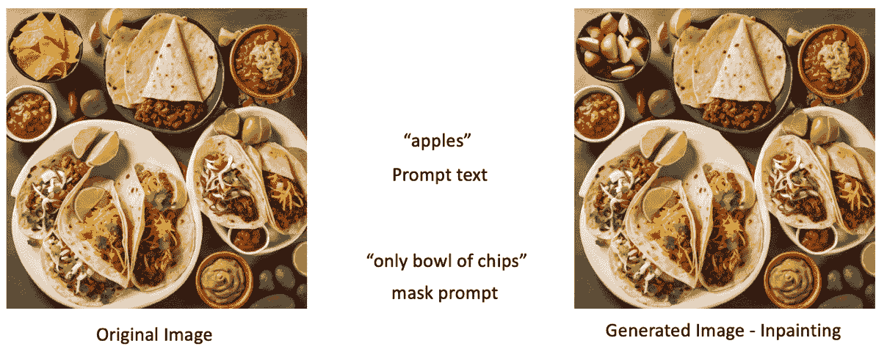

图 9.15 – 遮罩提示

在*图 9.15*中，我们执行了图像替换，将薯片碗改为苹果片碗。让我们更详细地讨论绘画。

### 绘画

**绘画**是一种技术，您可以使用它填充图像中的遮罩区域或使用图像生成模型扩展它。有两种绘画方法：图像修复和扩展绘画。

#### 图像修复

通过**图像修复**，您实际上是在重建或填充图像中缺失、被遮罩或损坏的部分。这种技术在图像已被损坏或遮挡，或者其中包含需要移除或替换的不希望存在的元素的场景中特别有用。通过向图像生成模型提供周围环境和有效的提示，它可以在指定区域智能地生成和融合新内容，无缝地重建遮罩区域。

让我们看看一些例子：

+   `电话线`并提供一个空的提示文本(`""`)。

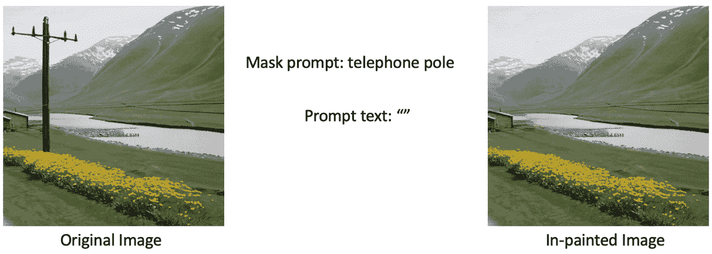

图 9.16 – 图像修复移除

+   **图像替换修复**：假设您想要替换图像中的任何对象或场景。在这种情况下，您可以执行图像替换修复。如图*图 9.17*所示，您可以在提示文本中指定您想要替换的内容。

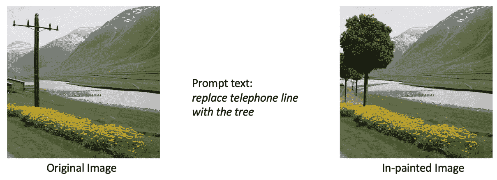

图 9.17 – 图像替换修复

#### 扩展绘画

**扩展绘画**是指将图像扩展到其原始边界之外的过程，换句话说，是在遮罩区域之外进行绘画。扩展绘画在原始图像或艺术品需要通过添加额外的元素、环境或视角进行扩展或增强的场景中非常有用。

让我们看看一个例子。

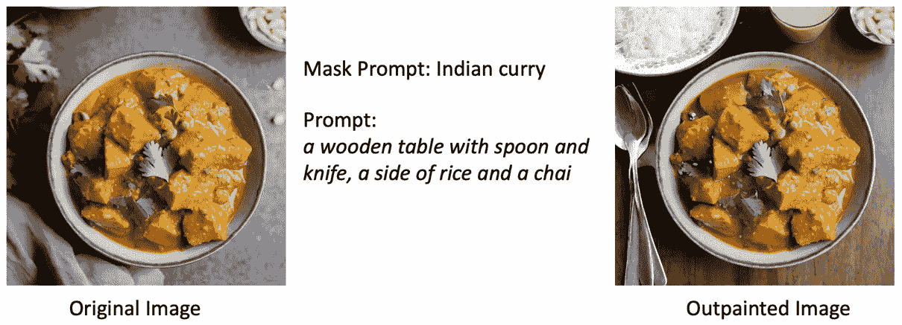

图 9.18 – 扩展绘画

在*图 9.18*中，你可以看到我们在蒙版图像或提示（在这种情况下，`印度咖喱`）之外进行绘画，以添加一些细节。这些包括木质桌子的背景，以及添加勺子、刀子、一碟米饭和一杯奶茶。

如果你想了解 Titan Image Generator 模型的提示工程最佳实践，请查看[`tinyurl.com/titan-image-generator-prompt`](https://tinyurl.com/titan-image-generator-prompt)。

现在我们已经探讨了多模态和图像模式的不同模式，让我们来看看 Amazon Bedrock 中关于伦理考量及可用的安全措施，以确保生成式 AI 的负责任使用。

# 伦理考量与安全措施

生成式 AI 模型，尤其是那些能够生成高度逼真图像的模型，在传播虚假信息和深度伪造方面引发了重大的伦理担忧。随着这些模型变得越来越强大和易于访问，积极应对这些伦理挑战至关重要，以促进这项技术的负责任开发和部署。

围绕图像生成模型的主要伦理担忧之一是创建和传播误导性或操纵性内容的危险。随着从文本提示生成逼真图像的能力，恶意行为者有可能创建和传播虚假或编造的视觉信息。这可能会产生深远的影响，例如损害对媒体的信任、传播虚假信息，甚至影响政治或社会叙事。

为了应对这一主要伦理挑战，对于组织和研究人员来说，优先考虑生成式 AI 生命周期的负责任开发和部署至关重要。当使用 Amazon Bedrock 时，用户可以利用其**水印检测**功能来识别由 Amazon Titan Image Generator 生成的图像。

Amazon Bedrock 中的水印检测功能旨在促进 AI 生成图像使用的透明度和问责制。通过在每个由模型创建的图像中嵌入一个不可见的水印，内容创作者、新闻机构、风险分析师等可以迅速验证图像是否是由 Amazon Titan Image Generator 生成的。

这种方法有两个主要的伦理目的：

+   它通过提供一种验证图像真实性的机制来帮助对抗虚假信息和深度伪造的传播。这有助于在视觉内容中建立信任和信誉，特别是在信息完整性至关重要的领域，如新闻业、执法和科学研究。

+   水印检测功能促进了图像生成模型使用中的透明度和问责制。通过使识别 AI 生成内容变得更加容易，它鼓励内容创作者和利益相关者采取负责任和道德的做法，从而促进围绕这项技术使用的更开放对话。

要尝试水印检测，你只需在 Amazon Bedrock 控制台中导航到**水印检测**并上传一张图像。然后 Amazon Bedrock 会分析图像以检测 Amazon Titan 嵌入的水印。

除了检测水印外，你还将收到一个置信度分数，该分数决定了模型能够以多大程度（或确定性）识别图像是由 Amazon Titan 生成的。通常，当图像几乎没有修改时，你会看到一个高置信度分数。然而，如果你对生成的图像进行了一些修改，你可能会看到一个较低的置信度分数。

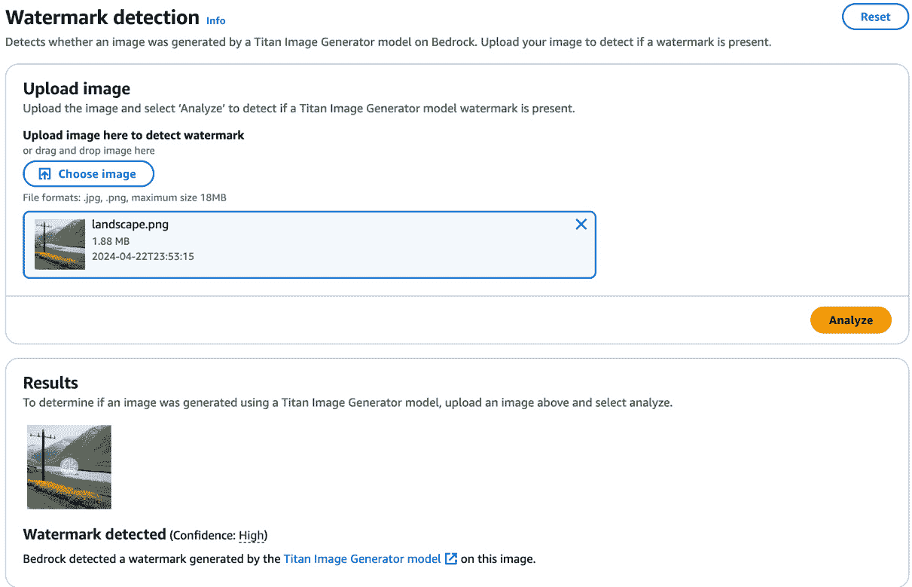

图 9.19 – 水印检测

如**图 9.19**所示，我们已上传由 Amazon Titan 生成的图像。水印检测功能能够分析和检测 Titan 生成的水印。

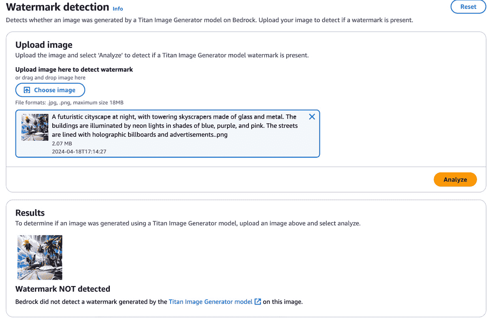

图 9.20 – 水印未检测到

如**图 9.20**所示，我们已上传由 Stable Diffusion 生成的图像。我们可以看到水印未检测到。

如果你想要尝试使用 API，你可以调用 `DetectGeneratedContent` 来验证水印是否存在：

```py
import boto3
import json
import base64
bedrock_runtime = boto3.client(service_name="bedrock-runtime")
image_path = "landscape.png"
with open(image_path, "rb") as image_file:
    input_landscape = image_file.read()
response = bedrock_runtime.detect_generated_content(
    foundationModelId = "amazon.titan-image-generator-v1",
    content = {
        "imageContent": { "bytes": input_landscape }
    }
)
```

这就是响应应该看起来像什么：

```py
response.get("detectionResult")
'GENERATED'
response.get("confidenceLevel")
'HIGH'
```

这里是水印检测的演示：[`www.youtube.com/watch?v=M5Vqb3UoXtc`](https://www.youtube.com/watch?v=M5Vqb3UoXtc)。

虽然水印检测不是解决所有道德问题的方案，但它是在正确方向上迈出的一步。我们将在本书的**第十一章**中更深入地讨论道德和负责任的 AI。你现在应该能够理解使用 Amazon Bedrock 的图像生成和设计模式。

# 摘要

在本章中，我们探讨了图像生成的工作原理。我们还讨论了 Amazon Bedrock 内部多模态模型的工作方式。我们还涵盖了几个现实世界的应用和多模态设计模式，包括文本到图像、图像搜索、图像理解和图像到图像模式，如修复和扩展。我们以对道德考虑的简要概述以及对 Amazon Bedrock 内部水印检测能力的探讨结束本章。在整个章节中，我们更深入地了解了如何利用 Amazon Bedrock 的多模态模型来构建基于文本和图像提示生成、理解和操作图像的应用程序。

在下一章中，我们将探讨使用 Amazon Bedrock 构建智能代理的主题。
