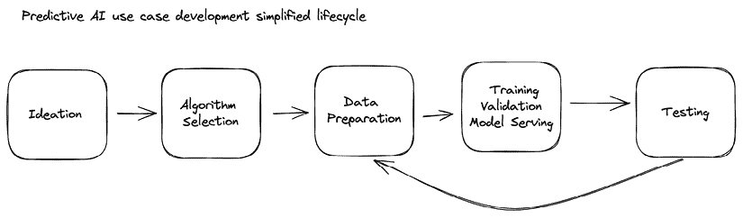
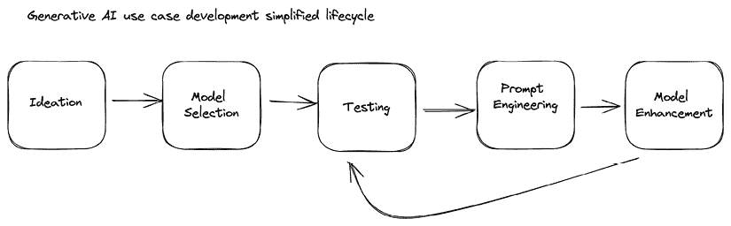
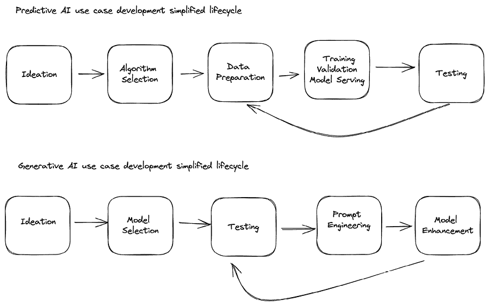

# 生成型 AI 模式简介

本章概述了与生成型 AI 相关的关键概念、技术和集成模式，这将使你能够在实际应用中利用这些能力。

我们将概述生成型 AI 架构，如 transformers 和 diffusion 模型，这些是这些生成模型产生文本、图像、音频等的基础。你将简要了解专门的训练技术，如预训练和提示工程，这些技术将基本语言模型升级为创意 powerhouse。

由于新模型和伦理考虑的持续出现，理解这个领域的创新步伐至关重要。我们将介绍快速实验的策略，同时确保负责任、透明的开发。

本章还介绍了将生成型 AI 连接到实际工作流程的常见集成模式。无论是制作利用实时模型的聊天机器人，还是执行批量数据丰富，我们将介绍原型蓝图以启动构建 AI 驱动系统的过程。

到最后，你将全面了解哪些生成型 AI 模型可用，为什么实验很重要，以及这些集成模式如何帮助你的组织利用生成型 AI 创造价值。

简而言之，以下主要主题将被涵盖：

+   与 AI 交互

+   预测型 AI 与生成型 AI 用例构思

+   范式的转变

+   通用生成型 AI 概念

+   生成型 AI 集成模式简介

# 从 AI 预测到生成型 AI

本节的目的在于提供一个关于人工智能的简要概述，强调我们与它的初步体验。在 2000 年代初，AI 开始对消费者变得更加具体。例如，在 2001 年，谷歌推出了“你是指？”功能([`blog.google/intl/en-mena/product-updates/explore-get-answers/25-biggest-moments-in-search-from-helpful-images-to-ai/`](https://blog.google/intl/en-mena/product-updates/explore-get-answers/25-biggest-moments-in-search-from-helpful-images-to-ai/))，建议拼写纠正。这是谷歌机器学习的第一次应用之一，也是公众大规模体验的早期 AI 功能之一。

在接下来的几年里，AI 系统变得更加复杂，特别是在计算机视觉、语音转文本转换和文本转语音合成等领域。在电信行业的工作使我得以见证由语音转文本驱动的创新。将语音转文本功能集成到**交互式语音响应**（**IVR**）系统中，通过让人们说出他们的请求而不是在键盘上按键，从而提高了用户体验。例如，你可以拨打一家银行，你会听到一条消息，要求你说“余额”来查询余额，“开户”以开户等。如今，我们越来越多地看到 AI 的应用，简化了更复杂和耗时的工作。

可用计算能力的指数级增长，加上训练机器学习模型所需的庞大数据集，释放了新的 AI 能力。在 2010 年代，AI 开始在图像分类等某些严格定义的任务上与人类性能相匹配，甚至超越。

生成式人工智能的出现重新点燃了人们对 AI 领域的兴趣和创新，引入了探索用例和系统集成的新方法。Gemini、PaLM、Claude、DALL-E、OpenAI GPT 和 Stable Diffusion 等模型展示了 AI 系统生成合成文本、图像和其他媒体的能力。这些输出展现了创造力和想象力，吸引了公众的注意。然而，生成模型强大的能力也突显了系统设计和负责任部署方面的新挑战。需要重新思考集成模式和架构，以支持安全、稳健和成本效益的实施。具体来说，需要通过数据集过滤、人机协作系统、增强监控和即时补救等技术来解决关于安全、偏见、毒性和错误信息的问题。

随着生成式人工智能的不断发展成熟，最佳实践和治理框架必须同步演进。行业领导者已经建立了如内容真实性倡议（Content Authenticity Initiative）等伙伴关系，以开发围绕人工智能下一迭代负责任发展的技术标准和政策指导。这种技术令人难以置信的潜力，从加速药物发现到构想新产品，只有通过承诺透明度、伦理和人权才能实现。在创新与谨慎之间保持建设性合作是至关重要的。

生成式人工智能标志着该领域的转折点。这一创造性可能性的浪潮所引起的涟漪才刚刚开始触及组织和社区。围绕能力以及挑战展开的开放、基于证据的对话，为赋予人们权力、解锁新效用和赢得广泛信任的人工智能部署奠定了基础。

我们正在见证生成式人工智能能力前所未有的民主化，这是通过像谷歌、Meta 和亚马逊这样的知名公司以及 Anthropic、Mistral AI、Stability AI 和 OpenAI 等初创公司提供的公开可访问的 API 实现的。下表总结了几个领先的模型，它们为自然语言和图像生成提供了多才多艺的基础。

只需几年前，使用生成式人工智能进行开发需要深度学习方面的专业知识以及访问大量计算资源。现在，Gemini、Claude、GPT-4、DALL-E 和 Stable Diffusion 等模型可以通过简单的 API 调用以近乎零的成本访问。实验的门槛从未如此之低。

这种商品化引发了利用这些预训练模型的新应用爆炸式增长——从内容生成的创意工具到融入人工智能的流程自动化解决方案。预计在未来几个月和几年内，所有行业都将实现与生成式基础的集成。

模型正变得更加知识渊博，具备更广泛的技能和推理能力，这将减少幻觉并提高模型响应的准确性。多模态也在获得关注，模型能够处理和生成文本、图像、音频、视频和 3D 场景的内容。在可扩展性方面，模型大小和上下文窗口正在呈指数级增长；例如，谷歌的 Gemini 1.5 现在支持 1 百万个标记的上下文窗口。

总体而言，展望未来，生成式人工智能将深度融入大多数技术中。这些模型引入了新的效率和自动化潜力，并激发几乎所有可想象行业的创造力。

下表突出了一些最受欢迎的大型语言模型及其提供商。本表的目的在于强调在撰写本书时市场上可用的众多选项。我们预计，到本书出版时，此表将很快过时，并强烈建议读者深入访问模型提供商的网站，以保持对任何新发布的最新信息。

| **模型** | **提供商** | **着陆页** |
| --- | --- | --- |
| Gemini | Google | [`deepmind.google/technologies/gemini`](https://deepmind.google/technologies/gemini) |
| Claude | Anthropic | [`claude.ai/`](https://claude.ai/) |
| ChatGPT | OpenAI | [`openai.com/blog/chatgpt`](https://openai.com/blog/chatgpt) |
| Stable Diffusion | Stability AI | [`stability.ai/`](https://stability.ai/) |
| Mistral | Mistral AI | [`mistral.ai/`](https://mistral.ai/) |
| LLaMA | Meta | [`llama.meta.com/`](https://llama.meta.com/) |

表 1.1：流行的大型语言模型及其提供商概述

# 预测式人工智能与生成式人工智能用例构思

预测 AI 指的是分析数据以识别模式并对未来事件进行预测或分类的系统。相比之下，生成式 AI 模型根据从训练数据中提取的模式创建新的合成内容，如图像、文本或代码。例如，使用预测 AI，你可以自信地识别图像中是否包含猫，而使用生成 AI，你可以根据文本提示创建猫的图像，修改现有的图像以包含原本没有的猫，或者生成关于猫的创意文本摘要。

专注于 AI 的产品创新涉及产品开发生命周期的各个阶段。随着生成式 AI 的出现，范式已经从最初需要编译训练数据来训练传统 ML 模型转变为利用灵活的预训练模型。

像谷歌的 PaLM 2 和 Gemini、OpenAI 的 GPT 和 DALL-E、以及 Stable Diffusion 这样的基础模型提供了广泛的基础，使得快速原型开发成为可能。它们的通用能力降低了尝试新型 AI 应用的门槛。

在以前，从数据整理和从头开始训练模型到评估可行性可能需要数月时间，而现在，在无需微调基础模型的情况下，几天内就可以生成概念验证。

这种生成式方法促进了更迭的迭代概念验证。在快速构建由基线模型驱动的初始原型后，开发者可以收集特定训练数据，并通过蒸馏等技巧进行知识迁移，以定制后续版本；本书稍后将对蒸馏的概念进行深入探讨。模型的主要基础中已经包含了用于启动和迭代新模型的编码模式。

相比之下，预测建模方法需要在任何应用测试之前进行数据收集和训练。这种更线性的进展限制了早期阶段的灵活性。然而，一旦存在大量数据，预测系统可以有效地学习专业相关性，并实现高置信度的推理指标。

利用通用的生成式基础支持快速原型设计和用例探索。但是，后来，定制预测建模在具有足够数据的狭窄任务上提高了性能。结合这些 AI 方法可以在模型部署的生命周期中充分利用它们的互补优势。

除去基础使用——提示工程——之外，还有几个辅助的、更复杂的技巧可以增强基础模型的能力。例如，**思维链**（**CoT**）和**ReAct**，这些技巧使模型不仅能对情况进行推理，还能定义和评估行动方案。

在论文*《ReAct：在语言模型中协同推理和行动》*中提出的 ReAct，解决了 LLMs 在语言理解能力与决策能力之间当前存在的脱节。虽然 LLMs 在理解任务和问答任务上表现出色，但它们的推理和行动技能（例如，生成行动计划或适应不可预见的情况）通常被分开处理。

ReAct 通过提示 LLMs 以交错的方式生成“推理轨迹”，详细说明模型的思维过程，以及特定任务的动作来弥合这一差距。这种紧密耦合允许模型利用推理进行规划、执行监控和错误处理，同时使用行动从外部来源（如知识库或环境）收集更多信息。这种集成方法显著提高了 LLMs 在语言和决策任务上的性能。

例如，在问答和事实核查任务中，ReAct 通过利用简单的维基百科 API 来对抗诸如幻觉和错误传播等常见问题。这种交互使得模型能够生成比缺乏推理或行动组件的方法更透明、更值得信赖的解决方案。LLM 的幻觉被定义为看似合理但实际上没有事实依据的内容。有许多论文旨在解决这个问题。例如，*《大型语言模型中幻觉的综述——原理、分类、挑战和开放性问题》*深入探讨了不仅识别而且减轻幻觉的方法。另一个缓解技术的良好例子可以在论文*《通过验证链减少大型语言模型中的幻觉》*中找到（[`arxiv.org/pdf/2309.11495.pdf`](https://arxiv.org/pdf/2309.11495.pdf)）。在撰写本书时，幻觉是一个变化非常快的领域。

CoT 和 ReAct 都依赖于提示：向 LLM 提供精心设计的指令，以引导其思维过程。CoT，如论文*《思维链提示在大型语言模型中激发推理》*中所述（[`arxiv.org/abs/2201.11903`](https://arxiv.org/abs/2201.11903)），专注于构建推理步骤链，模仿人类思维。想象一下提示模型：“我想烤蛋糕。首先，我需要面粉。我在哪里能找到一些？”模型会回应一个潜在来源，比如你的储藏室。这种一来一往的对话继续进行，构建了一个逻辑上的行动和决策链。

ReAct 将事情推进了一步，将行动整合到推理循环中。把它想象成思维与行动之间的动态舞蹈。LLM 不仅对情况进行推理，而且与世界互动，获取信息或采取具体步骤，然后根据结果更新其推理。这就像模型同时在规划旅行并检查地图以调整路线，如果遇到障碍。

这种推理与行动之间强大的协同作用为 LLM 开辟了新的可能性领域。CoT 和 ReAct 通过允许模型追踪其逻辑并纠正方向来解决挑战，如错误传播（基于错误假设得出错误结论）。它们还提高了透明度，使 LLM 的思维过程变得清晰易懂。

换句话说，**大型语言模型（LLMs**）就像杰出的语言学家，擅长理解和生成文本。但说到需要推理和行动的实际情况，它们往往举步维艰。这正是 CoT 和 ReAct 等技术出现的地方，将 LLM 转变为推理的强大力量。

想象一下 LLM 帮助诊断一种复杂的疾病。CoT 可以引导它通过症状和检查的逻辑链，而 ReAct 可以提示它咨询医学数据库或运行模拟。这不仅导致更准确的诊断，而且使医生能够理解 LLM 的推理，培养信任和协作。

这些未来派应用正是推动我们不断构建和投资这项技术的原因，这非常令人兴奋。在我们深入探讨利用生成式 AI 技术产生商业价值所需的模式之前，让我们退一步，看看一些初步概念。

# 范式的改变

在科技年数中，这感觉像是远古时代，但让我们回顾一下仅仅几年前的时光，那时如果你开始着手解决一个 AI 问题，你不能默认通过网络或托管端点利用预训练模型。这个过程非常细致——你首先必须明确定义具体的用例，确定你有什么可用和可收集的数据来训练定制模型，选择合适的算法和模型架构，使用专用硬件和软件训练模型，并验证输出是否真的有助于解决手头的任务。如果一切顺利，你将拥有一个模型，它将接受预定义的输入并提供预定义的输出。

随着大型语言模型和大型多模态模型的问世，范式发生了根本性的转变。突然之间，你可以访问具有数十亿参数的预训练模型，并立即开始使用这些多才多艺的基础模型进行实验，其中输入和输出都是动态的。在尝试一番之后，你会评估是否需要微调以适应你的需求，而不是从头开始预训练整个模型。而且剧透一下——在大多数情况下，你可能甚至不需要微调基础模型。

另一个关键转变与早期认为一个模型将优于所有其他模型并解决所有任务的信念有关。然而，模型本身只是引擎；你仍然需要一个完整的生态系统打包在一起，以提供完整的解决方案。基础模型确实展示了超出初始预期的某些令人难以置信的能力。但我们还观察到，某些模型更适合某些任务。将相同的提示通过其他模型运行可能会产生非常不同的输出，这取决于底层模型的训练数据集和架构。

因此，新的实验路径通常首先关注提示工程、响应评估，如果存在差距，然后是微调基础模型。这与之前的数据准备、训练和实验流程形成鲜明对比。开始使用人工智能的门槛从未如此之低。

在接下来的章节中，我们将探讨预测人工智能用例和生成人工智能用例开发生命周期的差异。在每个章节中，我们都提供了一个简化开发生命周期的概述性视觉表示以及每种方法的思维过程解释。

## 预测人工智能用例开发——简化生命周期

图 1.1：预测人工智能用例开发简化生命周期

让我们先深入了解开发预测人工智能模型的过程。一切从良好的用例开始，在评估人工智能用例时，投资回报率（ROI）是首要考虑的。想想看，你的业务或行业中哪些痛点可以通过预测结果来解决。始终关注可行性非常重要——例如，你是否能获取所需的数据等。

一旦你确定了一个有吸引力的价值驱动的用例，接下来就是选择算法。在这里你有无数的选择——决策树、神经网络、回归、随机森林，等等。非常重要的一点是不要被对最新和最好的偏好所左右，而要专注于你数据和用例的核心需求，以缩小选项范围。你可以在测试过程中随时调整或添加额外的实验。

计划已经就绪，现在是你动手处理数据的时候了。识别数据源，整理数据，并进行特征工程是一种艺术，而且往往是提高模型结果的关键。不幸的是，这里没有捷径！正如他们所说：“垃圾进，垃圾出”。但一旦你整理好了可以信赖的数据集，接下来就是有趣的部分。

是时候开始与你的模型工作了。事先定义你的评估流程，明智地分割数据，并开始训练各种配置。别忘了根据验证性能进行监控和调整。然后，一旦你得到了你的黄金模型，实施稳健的服务基础设施，以确保它能够顺利扩展。

但等等，别这么快！测试并不在模型投入生产时结束。持续收集性能数据，监控概念漂移，并在需要时重新训练。一个稳固的预测模型需要持续的反馈机制，正如连接**模型增强**到**测试**的箭头在*图 1.1*中所示。在这个领域，没有一劳永逸的事情。

## 生成式 AI 用例开发 - 简化生命周期

图 1.2：生成式 AI 用例开发简化生命周期

生成式 AI 用例开发的流程与预测式 AI 类似，但又不完全相同；有一些共同步骤，但任务顺序不同。

第一步是构思潜在用例。这一选择需要与业务需求相平衡，因为满足这些需求是我们的主要目标。

在明确问题定义之后，对已发布模型基准的广泛分析通常有助于选择最适合该任务的稳健基础模型。在这一步，值得我们自问的问题是：这个用例更适合预测模型吗？

由于基础模型提供即插即用的功能，初始测试在流程中是一个早期步骤。结构化的测试方法有助于揭示特定模型的内在优势、劣势和怪癖。定量指标和定性的人类评估在整个开发生命周期中推动迭代改进。

下一步是转向提示工程的艺术。提示是与 LLMs 交互的机制。像思维链提示、骨架提示和检索增强等技术构建了护栏，使输出更加一致和逻辑。

如果在优化后仍有差距，通过微调和蒸馏进行模型增强提供了一种精确的工具，以使模型更接近目标任务。

在极少数情况下，当没有现有模型能够有效满足用例时，从头开始预训练一个完全定制的模型是必要的。然而，重要的是要记住，由于模型重新训练对数据的大量需求，这项任务对于大多数用例和团队来说可能并不适合；重新训练基础模型需要大量的数据和计算能力，从财务和技术角度来看，这个过程是不切实际的。

首先，评估和模型改进之间的相互作用突出了负责任地推进生成性 AI 的深刻经验性质。测试通常表明，更好的解决方案来自问题框架的创造性，而不仅仅是纯技术进步。

图 1.3：预测性和生成性 AI 开发生命周期并排比较

如前图所示，开发生命周期是一个迭代过程，使我们能够从给定的用例和技术类型中实现价值。在本章的其余部分和本书中，我们将关注生成性 AI 的一般概念，其中一些如果您在预测 AI 方面有经验将会熟悉，而其他则是 AI 这个新领域的特定概念。

# 通用生成性 AI 概念

当将生成性 AI 集成到实际应用中时，了解诸如模型架构和训练等概念非常重要。在本节中，我们将概述一些突出概念，包括 Transformer、扩散模型、预训练和提示工程，这些概念使系统能够生成令人印象深刻的高精度文本、图像、音频等。

理解这些核心概念将使您在选择用例的基础时做出明智的决定。然而，将模型投入生产需要进一步的架构考虑。本书的其余章节和实际示例中，我们将突出这些决策点。

## 生成性 AI 模型架构

生成性 AI 模型基于针对生成任务优化的专用神经网络架构。两个更广为人知的模型是 Transformer 和扩散模型。

**Transformer 模型**不是一个新概念。它们首次由谷歌在 2017 年的一篇名为《Attention Is All You Need》的论文中提出([`arxiv.org/pdf/1706.03762.pdf`](https://arxiv.org/pdf/1706.03762.pdf))。这篇论文解释了**Transformer 神经网络架构**，该架构完全基于使用编码器和解码器概念的注意力机制。这种架构使模型能够识别输入文本中的关系。通过这些关系，模型预测下一个标记，利用其之前的预测作为输入，创建这个递归循环以生成新内容。

**扩散模型**因其基于非平衡热力学物理过程的坚实基础而作为生成模型引起了相当大的兴趣。在物理学中，扩散是指粒子随时间从高浓度区域向低浓度区域的运动。扩散模型试图在其训练过程中模仿这一概念。这些模型通过两个阶段进行训练：**正向扩散**过程向原始训练数据添加“噪声”，随后是**反向条件化**过程，该过程学习如何在反向扩散过程中去除噪声。通过学习这个过程，这些模型可以从纯噪声开始，让反向扩散模型清除不必要的“噪声”，并保留所需的“生成”内容。

其他类型的深度学习架构，如**生成对抗网络**（**GANs**），允许您根据现有数据生成合成数据。GANs 很有用，因为它们利用两个模型：一个用于生成合成输出，另一个试图预测这个输出是真实还是虚假。

通过这个迭代过程，我们可以生成与真实数据难以区分但足够不同的数据，以便用于增强我们的训练数据集。数据生成架构的另一个例子是**变分自编码器**（**VAEs**），它使用编码器-解码器方法来生成与训练数据集相似的新数据样本。

## 可用于优化基础模型的技术

有几种技术被用来开发和优化基础模型，这些技术推动了人工智能能力的显著提升，其中一些在技术和经济方面比其他技术更复杂：

+   **预训练**是指在大型数据集上完全训练一个模型。这允许模型从数十亿个数据点中学习非常广泛的表现形式，这有助于模型适应其他密切相关任务。流行的方法包括在未标记数据上的对比自监督预训练和在大量监督数据（如互联网）上的预训练。

+   **微调**将预训练模型已经学习到的特征表示调整为执行特定任务。这仅调整一些高级模型层，而不是从头开始训练。另一方面，适配器微调为模型配备了小型、轻量级的适配器，这些适配器可以快速调整到新任务，而不会干扰现有功能。这些可插拔的适配器通过学习特定任务的行为同时重用大部分模型权重，以参数高效的方式在多个任务中积累知识。它们有助于减轻对先前任务的遗忘并简化个性化。例如，模型可能首先在数十亿个文本网页上进行预训练，以获取一般语言知识，然后针对更特定领域的数据集进行微调，用于问答、分类等。

+   **蒸馏**使用“教师”模型训练一个较小的“学生”模型，以在较低的成本和延迟下重现较大预训练模型的性能。将大型模型量化并压缩成高效的部署形式也有助于优化性能和成本。

综合预训练后跟随着专门的微调、适配器调整和可移植蒸馏的结合，使得深度学习在各个领域的应用具有前所未有的灵活性。每种方法都智能地重用和转移现有知识，从而实现生成式 AI 的定制和扩展。

## 增强基础模型响应的技术

除了架构和训练的进步之外，生成式 AI 的进展还受到了在推理时如何通过外部数据增强这些模型的方法创新所推动。

**提示工程**调整提供给模型的文本提示，以引导其生成质量、能力和属性。精心设计的提示指导模型产生期望的输出格式，减少歧义，并提供有用的上下文约束。这允许更简单的模型架构通过将人类知识编码到提示中来解决复杂问题。

**检索增强生成**，也称为**RAG**，通过从外部存储中高效检索相关知识来增强文本生成。模型在生成输出之前接收作为“上下文”的上下文信息片段，作为额外的输入。**基于事实学习**LLM（大型语言模型）指的是提供模型特定的实际知识，而不仅仅是模型参数，从而实现更准确、知识渊博和具体的语言生成。

这些方法共同增强了基本的预测语言模型，使其变得更加灵活、健壮和可扩展。它们通过紧密集成人类知识和基于事实的学习来减少脆弱性，而不仅仅是统计模式。RAG 处理信息的广度和实时检索，提示提供深度和规则以指导期望的输出，而基于事实的学习将它们与现实世界联系起来。我们强烈建议读者熟悉这个主题，因为进行 RAG 并将模型基于事实来防止其产生幻觉是行业最佳实践。一个好的起点是以下这篇论文：*检索增强生成对于大型语言模型的调查* ([`arxiv.org/pdf/2312.10997`](https://arxiv.org/pdf/2312.10997))。

# 生成式 AI 领域的持续进化

生成式 AI 领域以不懈的创新和快速进步为特征，涉及模型架构、应用和伦理考量。一旦一种方法或架构显示出有希望的结果，就会有数百种竞争性和互补的方法出现，以进一步推动能力。Transformer 让位于 BERT，而 BERT 又很快被 GPT-3 超越，随后又被像 DALL-E 这样的图像合成器所超越，现在 GPT-4 和 Gemini 正在争夺头把交椅。所有这些都在过去几年内发生。

同时，我们看到了新的模式，如音频、视频和 3D 场景生成，获得了巨大的流行度和可用性。在商业领域，每月都有新的服务推出，针对媒体和娱乐、金融、医疗保健、艺术、代码、音乐等领域。然而，考虑到道德、访问控制和法律问题，以维持公众信任是关键。

一个突破使得更多的突破成为可能，每个突破都释放了额外的潜力。这种自我加速的循环源于 AI 的本质——其递归协助创新的能力。唯一确定的是，几个月内该领域将非常不同，而不是几年。在这种持续的演变中，保持意识、反应性和责任感至关重要。

# 介绍生成式 AI 集成模式

现在假设您已经有一个有希望的应用场景在心中。正如我确信您会同意的那样，在进一步进行之前，明确定义用例至关重要。您已经确定了哪种基础模型能够满足您的需求。因此，现在您开始考虑 GenAI 如何融入应用程序开发过程。

在高层次上，有两种主要的流程用于将应用程序与 GenAI 集成。一种是**实时**，在这种情况下，您通常与最终用户或 AI 代理互动，在提示到来时提供响应。第二种是**批量处理**，其中需求被捆绑成组（批量）进行处理。

一个实时工作流程的典型例子是聊天机器人。在这里，用户的提示被处理，然后发送到模型，并立即返回响应，因为您需要不延迟地消费输出。另一方面，考虑批量处理的数据丰富用例。您可以在一段时间内收集多个数据点，然后在模型批量丰富后进行后续消费。

在这本书中，我们将通过实际例子来探讨这些集成模式。这将帮助您获得与 GenAI 驱动应用程序的动手经验，并允许您在自己的用例中集成这些模式。

通过“集成模式”，我们指的是将技术集成到您的应用程序或系统中的标准化架构方法。在这种情况下，集成模式提供了将生成式 AI 模型连接到现实世界软件的成熟方法。

有几个关键原因说明为什么在处理生成式 AI 时我们需要集成模式：

+   **节省时间**：遵循既定模式允许开发者避免为常见的集成挑战重新发明轮子。这加快了价值实现的进程。

+   **提高质量**：利用集成模式中编码的最佳实践，可以导致更稳健、适用于生产的集成。可扩展性、安全性和可靠性是首要考虑的因素。

+   **降低风险**：定义良好的集成模式使开发者能够减轻性能、成本和其他潜在风险，这些风险可能在集成新技术时出现。

总体而言，集成模式提供了模板和指导方针，因此开发者不必从头开始集成工作。通过依赖经过验证的蓝图，读者可以更有效地集成生成式 AI，同时避免常见的错误。这显著加快了开发周期，并为长期成功奠定了基础。

# 摘要

在本章中，我们概述了与生成式 AI 相关的关键概念、技术和集成模式。现在，您对像 transformers 和扩散模型这样的突出生成式 AI 模型架构有了高级背景知识，以及开发和完善这些模型的各种方法，包括预训练、微调、适配器调整、蒸馏、提示工程、检索增强生成和归一化。

我们讨论了生成式 AI 的快速创新如何导致持续进化，新模型和能力以快速的速度出现。这强调了在确保道德、负责任发展的同时，保持与进步同步的必要性。

最后，我们介绍了将生成式 AI 连接到现实世界应用的常见集成模式，考虑到实时用例，如聊天机器人，以及用于数据丰富化的批量处理。提供了真实示例来展示将生成模型集成到生产系统中的工作流程。

人工智能的创新步伐非常快，需要持续的警觉、迅速的实验和负责任地利用最新进展的方法。这在生成式 AI 领域尤为明显，我们正在见证人工智能应用中的范式转变，这允许更快地进行实验和开发。

出现了各种技术来增强模型的能力和效率。这包括预训练、适配器调整、蒸馏和提示工程，每种技术在不同场景中都有独特的优势。当涉及到将这些 AI 模型集成到实际应用中时，对于实时工作流程，如聊天机器人，以及批量处理任务，如数据丰富化，都出现了关键模式。

设计良好提示的艺术已成为有效约束和引导模型输出的关键。此外，检索增强和扎根等技术在提高 AI 生成内容准确性方面已被证明非常有价值。将预测和生成方法相结合的潜力是一个非常有趣的空间。这种组合利用了两种方法的优势，允许在存在足够数据的情况下进行定制建模，同时利用生成基础来实现快速原型设计和创新。

这些核心概念在构建生成式 AI 系统时，能够支持明智的决策制定。集成模式为将模型连接到不同领域的实际应用提供了蓝图。

利用大型语言模型（LLM）的力量，首先在于识别适合它们发挥价值的正确用例。在下一章中，我们将介绍一个框架和示例，用于根据预期的商业价值对 LLM 用例进行分类。

在下一章中，我们将探讨如何识别可以用生成式 AI 解决的问题。

# 加入我们的 Discord 社区

加入我们的 Discord 空间，与作者和其他读者进行讨论：

[`packt.link/genpat`](https://packt.link/genpat)

