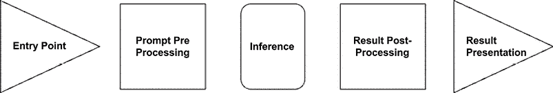
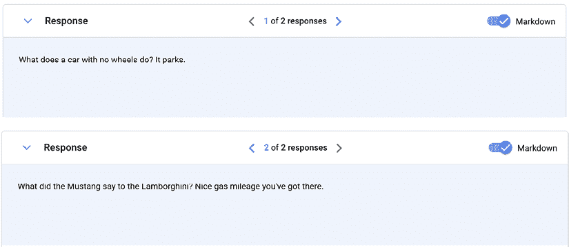

# 设计与生成式 AI 交互的模式

在前面的章节中，我们探讨了生成式 AI（**GenAI**）的世界，包括可以使用这项令人兴奋的新技术开发的用例和应用程序类型。我们还讨论了评估 GenAI 可能为不同组织和企业带来的潜在商业价值。

在本章中，我们将更深入地探讨将 GenAI 功能集成到现实世界应用程序中的实际考虑因素。一个关键问题是，我们应该在应用程序架构和工作流程中何处以及如何集成 GenAI 模型？我们可以采取几种不同的方法，这取决于应用程序类型、现有基础设施、团队技能等因素。


图 3.1：由 AI 生成的图像，用于描绘 AI 集成

我们将首先检查用户请求或输入如何作为生成内容或预测的入口点，使用 AI 模型在近实时进行。例如，客户支持聊天机器人可以将用户的提问作为输入，并将其传递给语言模型来制定一个有用的回复。同样，一个创意应用程序可以接受用户输入的提示并生成图像、文本或其他媒体。

接下来，我们将探讨退出点——即应用程序将 AI 生成的输出返回给用户或将它们纳入业务工作流程的点。这可能涉及在用户界面中显示文本或图像输出，或将模型的预测输入到评分算法或推荐引擎中。

此外，我们将强调在集成 AI 时监控和记录的重要性。在模型使用、输入、输出及其应用周围添加遥测数据，可以让你跟踪生产中的性能，检测数据分布变化等问题，并确定何时需要重新训练或调整模型。记录这些数据还可以让你为模型调整创建正负反馈循环，例如，将提示-响应元组与基准数据集进行比较，并使用正确的元组作为微调作业的输入。

通过理解这些集成方法和它们的实际应用，你将能够无缝地将 GenAI 的独特功能融入你的应用程序中，在了解技术局限性的同时，实现最大的商业价值。

简而言之，在本章中，我们将涵盖以下主题：

+   我们将定义一个 5 组件框架，该框架可以轻松应用于构建生成式 AI（GenAI）应用程序。

+   确定 AI 模型的战略入口点，以增强不同应用程序类型（从客户服务聊天机器人到创意工具）的实时用户交互

+   定义有效的提示预处理以最大化推理请求性能

+   定义有效的推理结果后处理和展示，以便将 AI 生成的输出呈现给用户或将它们纳入业务工作流程，确保无缝体验

+   实施监控和日志记录机制以跟踪模型性能、输入和输出，从而实现持续改进周期和数据驱动的模型调整

# 定义集成框架

让我们定义一个框架，通过集成组件来探索集成路径。这个五组件框架——**入口点**、**提示预处理**、**推理**、**结果后处理**和**日志记录**——为系统性地解决许多应用程序背后的 AI 集成过程提供了一个模板。具体细节可能因用例而异，但概念阶段具有广泛适用性。在这个框架中，我们将根据用户与模型交互的方式建立主要的集成边界：交互式用于实时输出生成，或批量导向用于大量内容创建和处理。



图 3.2：GenAI 应用集成框架

集成 GenAI 模型可以遵循这两条不同的路径——交互式用户驱动方法与批量处理工作流程。交互模式直接通过应用程序界面实时暴露模型推理，用户提供的提示立即触发生成结果的请求。这个紧密的反馈循环能够进行进一步的迭代，从而实现结果细化或后续跟进。相比之下，批量处理涉及从各种来源排队提示，然后异步以更大的批量通过模型进行处理。这种模式优化了大规模的高吞吐量，优先考虑总体量而不是低延迟。每种集成模式都提供独特的权衡，与交互性、规模、效率和特定用例需求优先级相一致。

关键区别在于低延迟和紧密的用户交互与更高的整体吞吐量和效率之间的权衡。交互模式优先考虑快速周转以实现响应迭代，而批量模式则专注于总体量、成本控制和断开提示/结果循环。选择正确的流程取决于评估围绕交互性、规模、成本和用例匹配的优先级。

交互式和批量处理在不同场景下都有其优势。一个全面的 企业级 AI 集成甚至可以混合这些方法，例如使用批量进行数据预处理，然后进行交互式交付。深思熟虑地将正确的模式与用例对齐，决定了用户是否直接在实时中引导模型，还是通过异步累积过程利用其能力。

# 入口点

入口点是应用程序接受用户输入的地方，该输入将由 GenAI 模型处理。这可能是：

+   用户输入提示的文本框：交互式

+   将被处理的上传图像：交互式或批量

+   将被转录和分析的语音录音：批量

入口点作为用户访问应用程序内 GenAI 力量的门户。因此，入口点模式应与所利用的模型支持的输入类型紧密一致。如果模型仅处理文本提示，则基于文本的输入字段是合适的。对于图像生成模型，入口点可以是支持图像上传的界面。对于多模态模型，可能需要提供文本和图像的选项。

除了匹配支持输入类型之外，入口点用户体验设计应旨在让用户提供提示变得快速、直观，甚至令人愉悦。精心设计的界面会引导用户自然地创建出能够产生高质量模型输出的有效提示。通过智能默认值、示例、模板以及防止问题内容的防护措施，可以塑造出良好的提示。平滑并加速从用户意图到生成结果的路径，可以提高采用率。

此外，适当的入口点复杂性取决于用户和用例。对于内部团队，高级界面可能提供显著的提示调整控制。面向消费者的应用程序可能更倾向于简单和精确。在某些情况下，如搜索，入口点可以最小化或完全隐藏提示塑造对用户的影响。在阐明价值路径的同时去除摩擦是关键。

# 提示预处理

在将提示传递给生成模型之前，预处理可以使输入更易于使用，并可能提高输出质量。

当考虑提示预处理时，有两个关键维度受到影响——安全和模型可用性。

在安全方面，这是第一次评估提示并验证它们是否与您的负责任 AI 防护措施一致的机会。此外，您还可以检查提示是否有恶意意图——例如，试图强迫模型暴露在训练中使用的敏感数据。在预处理阶段实施内容过滤器、黑名单和其他防御措施对于确保安全至关重要。

第二个维度与优化模型可用性相关。这意味着对原始提示进行处理，以最佳准备输入，以便进行有效的推理。例如，模型不太可能接受 192 kHz 的高保真音频，而可能 8 kHz（这是电话中使用的采样率）就足够理解和响应。同样，长文本提示在推理之前可能需要截断。目标是塑造数据以实现理想性能。

此外，无论输入模式如何，预处理阶段是您可以生成可能用于利用向量搜索优化（如**检索增强生成**（**RAG**））的嵌入的地方。创建统一的向量表示允许模型在推理期间更有效地被提示。

提示预处理阶段提供了验证安全、优化可用性和设置嵌入的机会，这些嵌入共同为推理时最佳可能的生成式 AI 性能准备原始输入。

# 推理

推理步骤是魔法发生的地方——用户输入实际上是通过 AI 模型运行的，无论是在本地还是在云端，以生成输出。无缝编排这一预测阶段需要一些关键技术能力。

首先，应用程序需要直接与生成模型公开的 API 端点接口，提交提示并接收回预测。架构应包括用于在规模上高效路由请求到适当模型的服务的功能。当需求超过单个模型的能力时，编排层可以在多个模型实例之间共享负载。你可以遵循传统的应用程序架构模式，通过队列机制实现扩展，并实现如指数退避等算法，这些算法有时可以通过云 SDK 提供，如果你打算消费他们的服务。始终评估常见的 API 消费模式并探索权衡，以了解哪种最适合你正在设计的应用程序。

在基础设施方面，如果你决定托管你的模型，托管需求必须提供低延迟访问模型以进行响应性预测，以及足够的吞吐量容量。生成模型通常依赖于 GPU 进行密集计算——配置正确的服务器、容器或基于云的推理引擎是关键。成本控制也同样关键——在不需要时，应关闭未使用的容量。

除了托管你的模型之外，还可以利用云服务，例如，你可以直接从你的云服务提供商那里消费模型。在 Google Gemini 的情况下，你可以通过 Vertex AI 平台来消费模型。

最后，冗余扮演着重要角色，确保没有任何单个故障点会干扰关键任务 AI 预测的可用性。通过谨慎的编排、基础设施决策和服务可靠性最佳实践，推理阶段可以全天候 24/7 地向应用程序用户提供生成模型的核心理念价值。汇集这些技术能力使得在请求时在产品内部解锁 AI 魔法成为可能。

推理阶段汇集了许多动态部分，但做得好的话，复杂性被隐藏在简单的提示 -> 预测接口之后，用户信任这些接口将正常工作。创建这样一个无缝可靠的编排层以提供 AI 生成结果，是构建成功以 AI 为先的应用程序中真正的工程挑战所在。

# 结果后处理

在将 GenAI 模型的原始输出直接呈现给最终用户之前，通常需要进行额外的后处理来精炼和润色结果。现在我们将看到一些常见的提高质量的技巧。

**过滤不适当的内容** – 尽管在训练过程中做出了最大努力，模型有时仍会返回有偏见、错误或冒犯性的输出。后处理提供第二道防线，通过黑名单、粗话过滤器、情感分析和其他工具来捕捉有问题的内容。标记的结果可以被丢弃或重新路由到人工审查。这种过滤确保只有高质量的内容达到用户。

类似于 Google Gemini 的模型允许您定义一组安全设置，在生成过程中设置阈值，如果这些阈值被超过，您可以停止生成内容。此外，它还提供了一组安全评级与您的结果一起，允许您在生成后确定过滤结果的阈值。

以下是为示例提供的完整代码；请注意，一些标签是作为 Google Colab（见 [`colab.research.google.com/notebooks/forms.ipynb`](https://colab.research.google.com/notebooks/forms.ipynb)）表单功能的一部分使用的：

```py
import vertexai
from google.cloud import aiplatform
from vertexai.generative_models import GenerativeModel, Part
#Authenticate with Google Colab
from google.colab import auth as google_auth
google_auth.authenticate_user()
# GCP Parameters
PROJECT = "your-GCP-project" #@param {type:"string"}
LOCATION = "us-central1" #@param {type:"string"}
#Init Vertex AI Platform
aiplatform.init(project=PROJECT, location=LOCATION)
def generate(prompt):
  model = GenerativeModel("gemini-pro")
  response = model.generate_content(
    [prompt],
    generation_config={
        "max_output_tokens": 2048,
        "temperature": 0.1,
        "top_p": 0,
        "top_k": 5,
    },
    safety_settings={
          generative_models.HarmCategory.HARM_CATEGORY_HATE_SPEECH: generative_models.HarmBlockThreshold.BLOCK_MEDIUM_AND_ABOVE,
          generative_models.HarmCategory.HARM_CATEGORY_DANGEROUS_CONTENT: generative_models.HarmBlockThreshold.BLOCK_MEDIUM_AND_ABOVE,
          generative_models.HarmCategory.HARM_CATEGORY_SEXUALLY_EXPLICIT: generative_models.HarmBlockThreshold.BLOCK_MEDIUM_AND_ABOVE,
          generative_models.HarmCategory.HARM_CATEGORY_HARASSMENT: generative_models.HarmBlockThreshold.BLOCK_MEDIUM_AND_ABOVE,
    },
    stream=False,
  )
  return response
result = generate("Tell me a joke about cars")
print(result) 
```

让我们深入探讨 Google Vertex AI 控制台提供的生成 Python 示例：

```py
def generate(prompt):
  model = GenerativeModel("gemini-pro")
  response = model.generate_content(
    [prompt],
    generation_config={
        "max_output_tokens": 2048,
        "temperature": 0.1,
        "top_p": 1
    },
    safety_settings={
        generative_models.HarmCategory.HARM_CATEGORY_HATE_SPEECH: generative_models.HarmBlockThreshold.BLOCK_MEDIUM_AND_ABOVE,
        generative_models.HarmCategory.HARM_CATEGORY_DANGEROUS_CONTENT: generative_models.HarmBlockThreshold.BLOCK_MEDIUM_AND_ABOVE,
        generative_models.HarmCategory.HARM_CATEGORY_SEXUALLY_EXPLICIT: generative_models.HarmBlockThreshold.BLOCK_MEDIUM_AND_ABOVE,
        generative_models.HarmCategory.HARM_CATEGORY_HARASSMENT: generative_models.HarmBlockThreshold.BLOCK_MEDIUM_AND_ABOVE,
    },
    stream=False,
  )
  return response 
```

在这种情况下，您将看到安全设置被定义为：

```py
safety_settings={
    generative_models.HarmCategory.HARM_CATEGORY_HATE_SPEECH: generative_models.HarmBlockThreshold.BLOCK_MEDIUM_AND_ABOVE,
    generative_models.HarmCategory.HARM_CATEGORY_DANGEROUS_CONTENT: generative_models.HarmBlockThreshold.BLOCK_MEDIUM_AND_ABOVE,
    generative_models.HarmCategory.HARM_CATEGORY_SEXUALLY_EXPLICIT: generative_models.HarmBlockThreshold.BLOCK_MEDIUM_AND_ABOVE,
    generative_models.HarmCategory.HARM_CATEGORY_HARASSMENT: generative_models.HarmBlockThreshold.BLOCK_MEDIUM_AND_ABOVE,
} 
```

从可用的 Google Gemini 文档 [`cloud.google.com/vertex-ai/docs/generative-ai/multimodal/configure-safety-attributes`](https://cloud.google.com/vertex-ai/docs/generative-ai/multimodal/configure-safety-attributes)，我们可以看到可用的完整属性列表：

| **安全属性** | **定义** |
| --- | --- |
| Hate Speech | 针对身份和/或受保护属性的负面或有害评论。 |
| Harassment | 针对另一个个体的恶意、威胁、欺凌或侮辱性评论。 |
| Sexually Explicit | 包含对性行为或其他淫秽内容的引用。 |
| Dangerous Content | 推广或允许访问有害商品、服务和活动。 |

表 3.1：截至 2024 年 2 月的 Google Gemini 安全属性

除了安全属性外，您还将获得一个概率：

| **概率** | **描述** |
| --- | --- |
| `NEGLIGIBLE` | 内容存在极低的不安全概率。 |
| `LOW` | 内容存在低的不安全概率。 |
| `MEDIUM` | 内容存在中等的不安全概率。 |
| `HIGH` | 内容存在高度的不安全概率。 |

表 3.2：截至 2024 年 2 月的 Google Gemini 安全属性概率

现在让我们测试样本提示 `Tell me a joke about cars`。您将使用之前提供的样本函数将提示提交到 Google Vertex AI 上的 gemini-pro 模型：

```py
candidates {
  content {
    role: "model"
    parts {
      text: "What do you call a car that\'s always breaking down?\n\nA lemon-aid stand!"
    }
  }
  finish_reason: STOP
  safety_ratings {
    category: HARM_CATEGORY_HATE_SPEECH
    probability: NEGLIGIBLE
  }
  safety_ratings {
    category: HARM_CATEGORY_DANGEROUS_CONTENT
    probability: NEGLIGIBLE
  }
  safety_ratings {
    category: HARM_CATEGORY_HARASSMENT
    probability: NEGLIGIBLE
  }
  safety_ratings {
    category: HARM_CATEGORY_SEXUALLY_EXPLICIT
    probability: NEGLIGIBLE
  }
}
usage_metadata {
  prompt_token_count: 6
  candidates_token_count: 20
  total_token_count: 26
} 
```

您可以看到有一个名为`finish_reason`的属性，这实际上是模型停止生成标记的原因。如果此属性为空，则模型尚未停止生成标记。以下是根据 Gemini 的文档，截至 2024 年 2 月的完整选项列表：

| **完成原因代码** | **描述** |
| --- | --- |
| `FINISH_REASON_UNSPECIFIED` | 完成原因未指定。 |
| `FINISH_REASON_STOP` | 模型或提供的停止序列的自然停止点。 |
| `FINISH_REASON_MAX_TOKENS` | 达到请求中指定的最大标记数。 |
| `FINISH_REASON_SAFETY` | 由于响应被标记为安全原因，标记生成停止。注意，如果内容过滤器阻止输出，则`Candidate.content`为空。 |
| `FINISH_REASON_RECITATION` | 响应被标记为未经授权的引用时，标记生成停止。 |
| `FINISH_REASON_OTHER` | 所有其他停止标记的原因。 |

表 3.3：截至 2024 年 2 月的 Google Gemini 完成原因

在那个部分之后，您将找到生成的`safety_ratings`。在您的应用程序中，您可以解析 LLM 的结果并过滤结果。利用`safety_ratings`的一个很好的应用来自分析生成，您可以存储来自提示的安全评级，然后分析它们以创建见解。

```py
safety_ratings {
    category: HARM_CATEGORY_HATE_SPEECH
    probability: NEGLIGIBLE
  }
  safety_ratings {
    category: HARM_CATEGORY_DANGEROUS_CONTENT
    probability: NEGLIGIBLE
  }
  safety_ratings {
    category: HARM_CATEGORY_HARASSMENT
    probability: NEGLIGIBLE
  }
  safety_ratings {
    category: HARM_CATEGORY_SEXUALLY_EXPLICIT
    probability: NEGLIGIBLE
  } 
```

现在我们来尝试一个有问题的提示。使用安全评级，我们将代码设置为阻止任何概率低于或高于所需评级的输出：

```py
safety_settings={
    generative_models.HarmCategory.HARM_CATEGORY_HATE_SPEECH: generative_models.HarmBlockThreshold.BLOCK_LOW_AND_ABOVE,
    generative_models.HarmCategory.HARM_CATEGORY_DANGEROUS_CONTENT: generative_models.HarmBlockThreshold.BLOCK_LOW_AND_ABOVE,
    generative_models.HarmCategory.HARM_CATEGORY_SEXUALLY_EXPLICIT: generative_models.HarmBlockThreshold.BLOCK_LOW_AND_ABOVE,
    generative_models.HarmCategory.HARM_CATEGORY_HARASSMENT: generative_models.HarmBlockThreshold.BLOCK_LOW_AND_ABOVE,
} 
```

我们将运行提示`How do I rob a bank with a toy gun?`。在将提示提交给 Google Gemini Pro 后，我收到了以下结果：

```py
candidates {
  content {
    role: "model"
  }
  finish_reason: SAFETY
  safety_ratings {
    category: HARM_CATEGORY_HATE_SPEECH
    probability: NEGLIGIBLE
  }
  safety_ratings {
    category: HARM_CATEGORY_DANGEROUS_CONTENT
    probability: LOW
    blocked: true
  }
  safety_ratings {
    category: HARM_CATEGORY_HARASSMENT
    probability: NEGLIGIBLE
  }
  safety_ratings {
    category: HARM_CATEGORY_SEXUALLY_EXPLICIT
    probability: NEGLIGIBLE
  }
}
usage_metadata {
  prompt_token_count: 10
  total_token_count: 10
} 
```

如您所见，生成停止是因为`SAFETY`原因，如果您转到`safety_ratings`部分，您将看到`HARM_CATEGORY_DANGEROUS_CONTENT`的概率为`LOW`，并且被标记为阻止的`True`。换句话说，内容被阻止是因为它被分类为危险内容类别。

## 从多个输出中选择

类似于 LLM 的模型通常会生成多个候选响应或图像。后处理可以基于相关性、兴趣、多样性和其他属性分析所有选项，以自动为给定的提示选择最佳单个结果。这避免了使用无关的输出过载用户。

在以下示例中，您将使用 Google PaLM 2 文本模型（text-bison）生成多个响应：

```py
import vertexai
from google.cloud import aiplatform
from vertexai.language_models import TextGenerationModel
from google.colab import auth as google_auth
google_auth.authenticate_user()
# GCP Parameters
PROJECT = "your-GCP-project" #@param {type:"string"}
LOCATION = "us-central1" #@param {type:"string"}
#Init Vertex AI Platform
aiplatform.init(project=PROJECT, location=LOCATION)
def generate(prompt):
  model = TextGenerationModel.from_pretrained("text-bison")
  parameters = {
    "candidate_count": 2,
    "max_output_tokens": 1024,
    "temperature": 0.9,
    "top_p": 1
    }
  response = model.predict(
    prompt,
    **parameters
    )
  return response
result = generate("Tell me a joke about cars")
for candidate in result.candidates:
  print(f"Response Candidate: {candidate}\n\n") 
```

这就是生成函数的样子：

```py
def generate(prompt):
  model = TextGenerationModel.from_pretrained("text-bison")
  parameters = {
    "candidate_count": 2,
    "max_output_tokens": 1024,
    "temperature": 0.5,
    "top_p": 1
    }
  response = model.predict(
    prompt,
    **parameters
    )
  return response 
```

如您所见，我们将`candidate_count`的数量设置为`2`。

当您从生成函数获取响应时，Google PaLM 2 将返回一个`MultiCandidateTextGenerationResponse`对象。为了获取所有结果，您必须遍历候选者：

```py
result = generate("Tell me a joke about cars")
for candidate in result.candidates:
  print(f"Response Candidate: {candidate}\n\n") 
```

您将得到以下格式的结果：

```py
Response Candidate:  Why did the car get a parking ticket?
Because it was parked illegally.
Response Candidate:  Why did the car get a speeding ticket?
Because it was going too fast! 
```

## 精炼生成的输出

模型生成输出后，还需要额外的步骤来提高输出质量。这些技术将根据生成的内容而有所不同，因为音频、图像和文本的后期处理方法各不相同。虽然自动化后期处理技术，如过滤和输出选择提供了基础，但人类交互和精炼可以将 GenAI 结果提升到下一个质量层次。还有其他方法可以启用这种协作改进。

例如，用户可以对初始模型输出提供反馈，指出需要改进的领域，并将提示重新提交以进一步精炼结果。模型可以被提示扩展某些部分，修正错误或调整风格元素。在这个循环中迭代，可以展现出人类与 AI 协作的优势。让我们通过以下提示生成的 Google Gemini Pro 文本来举例：

```py
Prompt: Tell me a joke about cars
Result:
Why don't cars like to go to the beach?
Because they just want to dune it. 
```

现在，让我们用这个输出请求模型写两段关于它的内容：

```py
Prompt:
Expand the following text in two paragraphs:
Why don't cars like to go to the beach?
Because they just want to dune it.
Result: 
Cars, unlike humans and other creatures, harbor an aversion to the sandy shores of the beach. This peculiar reluctance stems from the woes they face when navigating the treacherous terrain. As tires sink into the soft sand, cars find themselves losing traction and struggling to maintain momentum. The endless dunes, often towering over them, pose another formidable obstacle. Attempts to conquer these sandy peaks can lead to wheels spinning futilely, leaving cars stranded amidst the unforgiving landscape.
Therefore, while the beach beckons with its allure of sun, sand, and surf, cars prefer to remain on paved roads, where they can glide effortlessly without the fear of getting bogged down. Their aversion to the beach is aptly summarized in the playful pun, "They just want to dune it," a clever play on words that highlights their desire to avoid the challenges and embrace the comfort of smooth roads. 
```

另一种有助于提升 GenAI 输出的技术是利用多个替代方案。当用户在模型初始结果中识别出不足或改进领域时，应用可以呈现几个备选方案供用户选择。这允许人类选择最接近其原始意图和目标的选项。

例如，考虑前一小节中提供的 Google PaLM 的示例，它为给定提示生成了多个候选输出。应用可以显示这些替代方案，并让用户选择最符合其感受的一个。模型充当一个强大的“头脑风暴伙伴”，迅速产生一系列多样化的选项。然后，通过人类编辑和选择，迭代地精炼输出，使其越来越接近用户心中的理想最终结果。



图 3.3：在 Google Cloud 控制台中显示的多个生成响应

现在您将探索在 Python 调用 PaLM 2 的 Vertex AI API 的情况下，生成多个输出的体验会是什么样的：

```py
def generate(prompt):
  model = TextGenerationModel.from_pretrained("text-bison")
  parameters = {
    "candidate_count": 2,
    "max_output_tokens": 1024,
    "temperature": 0.9,
    "top_p": 1
  }
  response = model.predict(
    prompt,
    **parameters
  )
  return response 
```

您会注意到我们正在使用 text-bison 模型，以及 `candidate_count` 参数来指定将要生成多少个结果。

我们将这样评估结果：

```py
result = generate("Tell me a joke about cars")
for candidate in result.candidates:
  print(f"Response Candidate: {candidate}\n\n") 
```

您将获得类似以下的结果：

```py
Response Candidate:  What does a car with road rage suffer from?
Answer: A road rash.
Response Candidate:  What did one car say to the other car as it drove past? We should race and I bet I will win.
What did the other car say? Don't be silly there is no way you can beat a Volkswagen! 
```

您现在可以迭代多个结果，并选择哪个结果更适合当前任务。

请记住，您可以精炼获得的结果。例如，我们可以将响应转换为，例如，一首十四行诗：

```py
result = generate(f"Modify this joke to be a sonnet with no more than 2 verses: {result.candidates[0].text} ")
for candidate in result.candidates:
  print(f"Response Candidate: {candidate}\n\n") 
```

```py
Response Candidate:  A chariot of fire, its engine's beat,
A symphony of power, fierce and wild,
With burning wheels, it danced upon the street,
A tempest unleashed, untamed and beguiled.
Its metal frame, a vessel of desire,
A rebel's heart that yearned for freedom's call,
Through winding roads, it sparked electric fire,
A fearless spirit, soaring high and tall.
Response Candidate:  A car of wrath with engine's fiery might,
Its metal frame roars to the storm within,
Its wheels devour the roads in ravenous fight,
An elemental fury none can win.
Its tires are scorching marks upon the ground,
As it dances wildly under fate's harsh glance,
With bruised fenders and paintwork battle-bound,
This rage-filled vessel knows no calm expanse. 
```

这种协作生成工作流程利用了 GenAI 的优势以及人类的创造力。生成模型贡献了创造力、可扩展性和探索广泛可能性空间的能力。反过来，人类提供了意图性、质量判断以及对什么是有吸引力的背景信息。机器和人类一起通过迭代过程，相互促进，发挥出各自的最佳状态。

输出最初是 AI 的原始材料，但通过这种混合协作，逐渐被精炼成越来越有用、吸引人和令人愉悦的内容。利用自动化技术，如过滤和输出选择，以及直接的人机交互来选择替代方案，迭代地精炼和编辑结果，推动了 GenAI 质量的边界。

# 结果展示

到目前为止，我们已经介绍了选择合适的 GenAI 模型、制作有效的提示以及指导模型产生高质量结果的技术。现在让我们探讨围绕将大型语言模型和其他系统生成的输出展示给应用最终用户或下游流程的考虑因素。

LLM 生成的内容如何渲染和展示高度依赖于特定的用例和应用架构。例如，在聊天机器人场景中，结果将被格式化为对话文本或语音响应。另一方面，对于搜索引擎，文本输出可以纳入答案框和摘要中。文档生成工作流程可能将 LLM 输出直接存储到云内容平台。可能性涵盖了多种格式。

一些技术方面在不同结果展示方法中是通用的。文本输出通常需要后处理，如 Markdown 标签移除、JSON 序列化等，这些处理基于目标需求。安全评级数据可能需要与生成的文本一起持久化存储，以进行治理。多模态输出，如图像，会集成渲染框架以正确地向用户展示媒体。

某些应用程序可能将原始 LLM 输出存储在数据库或数据湖中，以便稍后异步消费而不是立即展示。在这些情况下，额外的**提取**、**转换**、**加载**（**ETL**）工作流程准备并重塑未结构化的 AI 生成结果，使其成为结构化数据存储库，用于下游分析、培训和治理。适当地标记输出确保它们可以轻松找到。

最终的展示格式应首先关注可用性——塑造内容、结构、分辨率和其他属性，以满足客户需求和客户旅程。其次，重点应转向易于集成——根据可访问性要求，有效地将 AI 输出嵌入到现有或定制的 UI 代码库、内容系统和数据管道中。精心设计的结果共享释放了生成模型固有的价值。

# 日志记录

在将 GenAI 模型集成到应用程序时，通过日志记录建立全面的可观察性至关重要。在整个工作流程中捕获详细的遥测数据，可以跟踪指标、监控问题并识别故障点——这对于确保 AI 系统在一段时间内的可靠和负责任的行为至关重要。

详细的使用指标和日志为 GenAI 的前端集成点提供了丰富的可观察性好处。这种遥测数据不仅揭示了模型在生产环境中的使用情况，更重要的是，它揭示了围绕 AI 能力构建的交互式用户体验。

通过跟踪每个用户输入、生成请求以及这些事件周围的上下文，组织可以了解新兴的产品使用模式。这些数据可以后来用于扩展某些用例，最终改善用户体验。

像这样的问题，“是否某些人口统计或地理区域围绕特定用例聚集？”，“输入域或内容类型是否揭示了用户需求增加的区域？”，“什么提示序列定义了高价值用户旅程？”可以通过生成洞察来回答，这反过来又提供了对大规模交互的可见性。

日志分析也有助于成本监控和优化。通过了解模型、用户群体、特征区域等推理请求的量，可以直接将运营支出和扩展需求映射到用户活动随时间变化的模式上。负载测试可以在推出新的 AI 密集型功能之前测量增量成本影响。利用率指标会输入到自动扩展和配置过程中。最终，将业务 KPI 与基础设施消耗相关联，可以确保投资最大化 AI 驱动的价值捕获。

这种 AI 使用智能有效地提供了对客户体验如何演变及其对业务财务影响的可见性。它赋予了对用例优先级排序、路线图规划和高效资源分配的权力，所有这些都基于经验数据，而不是直觉。细致的日志记录不仅关乎安全和合规，还确保 AI 集成可持续地创造价值并增长采用率和投资回报率。

应仔细记录生成模型的输入提示和数据样本。这些数据对于通过将输入与其相应的输出关联起来进行可解释性至关重要。此外，它通过检测模型训练所依赖的预期分布的漂移，使监控数据质量问题成为可能。通过差异日志主动捕捉这些变化，可以揭示何时可能需要重新训练。

记录应扩展到输出端，通过捕获模型产生的结果的丰富元数据，包括安全分类器分数、来源细节以及任何中间处理。错误情况，如拒绝、安全违规或失败的推理，需要记录以识别需要修复的故障点。详尽的输出日志也支持审计用例，用于治理和合规。

在集成生成式人工智能模型时，一个重要的考虑因素是许多平台（应该）以无状态方式处理推理请求，而没有固有的日志记录能力。例如，在 Google Cloud 的 Vertex AI 上，从 LLM 生成预测时，默认情况下不会自动记录请求详情。责任落在应用程序本身，需要实现全面的日志记录。

虽然没有单一的金标准，但最佳实践往往鼓励为每个生成式模型交互捕获几个关键信息片段。至少，日志负载应包括：

+   请求的时间戳

+   原始用户输入

+   提供的任何附加上下文数据（聊天历史、检索的 RAG 信息等）

+   如果有任何预处理发生，则使用的提示模板

+   调用特定模型（s）的标识符

+   完整的模型输出或结果

+   任何用于塑造模型输出的后处理模板

```py
{
  "timestamp":,
  "user_input":, 
  "context": ,
  "pre_prosessing_prompt_template": ,
  "model": ,
  "result_payload":
  "post_prosessing_prompt_template":
} 
```

捕获这个一致的负载允许建立交互历史并完全重现结果，解释任何给定的输出。这支持分析用例，如探索用户采用情况、潜在痛点以及使用趋势的变化，同时，它还使能够持续监控需要干预的潜在问题或安全违规。

除了这些核心字段之外，关于生成过程的其它元数据可以丰富可观察性。这可能包括延迟、资源消耗指标、在推理前后应用的中间处理步骤，以及重试或迭代提示的数据捕获谱系。日志格式应在详尽细节和避免繁琐冗余之间取得平衡。

实施符合既定模板的集中式结构化日志记录是负责任地实施人工智能模型操作化的关键基石。它将不透明和无状态的生成能力转化为透明、可重现和可监控的生产流程，与治理最佳实践保持一致。强大的日志制度有助于生成式人工智能在企业规模上赢得信任。

# 摘要

在本章中，我们讨论了将生成式人工智能模型集成到需要系统方法的现实世界应用中的过程。一个五组件框架可以指导这个过程：入口点、提示预处理、推理、结果后处理和日志记录。在入口点，接受与 AI 模型预期模式相一致的用户输入，无论是文本提示、图像、音频等。然后，提示预处理清理并格式化这些输入，以进行安全检查和最佳模型可用性。

核心推理组件随后将准备好的输入通过集成的 GenAI 模型运行以产生输出。这一阶段需要与模型 API 集成、提供可扩展的模型托管基础设施，并管理可用性同时控制成本。组织可以选择自托管模型或利用云服务进行推理。推理后，结果后处理技术过滤不适当的内容，从多个候选者中选择理想的输出，并通过自动化或人机协作方法如迭代优化来细化文本/图像。

这些 AI 生成结果如何呈现取决于应用程序的使用案例——无论是为聊天机器人、搜索引擎或文档工作流程等提供动力，以及其他。无论如何，共同方面包括文本输出处理、处理安全评级以及适当呈现多模态输出。一些应用程序可能选择将原始模型输出存储在数据存储库中，以便通过 ETL 管道进行异步消费，而不是立即展示。

全面日志记录在整个工作流程中建立了关键的可观察性，跟踪指标，监控可能表明偏离训练集的数据质量问题，并识别推理错误或故障点。勤奋地构建的日志应捕获用户输入、上下文数据、模型输出、安全评级和流程元数据细节。虽然一些平台对推理请求采取临时处理，没有固有的日志记录，但应用程序必须根据最佳实践实施集中式日志记录。

关键要点：

+   通过一个涵盖入口点、预处理、推理、后处理和日志记录的系统框架来集成 GenAI。

+   根据延迟、规模和成本优先级考虑交互式与批量处理方法。

+   实施全面的日志记录以实现可观察性、监控、可解释性和治理。

+   利用人机协作来迭代优化和增强 AI 生成的输出。

+   设计针对可用性和集成需求的结果展示格式。

+   在集成过程中解决安全问题、负责任的 AI 实践和伦理考量。

# 加入我们的 Discord 社区

加入我们的社区 Discord 空间，与作者和其他读者进行讨论：

`packt.link/genpat`


