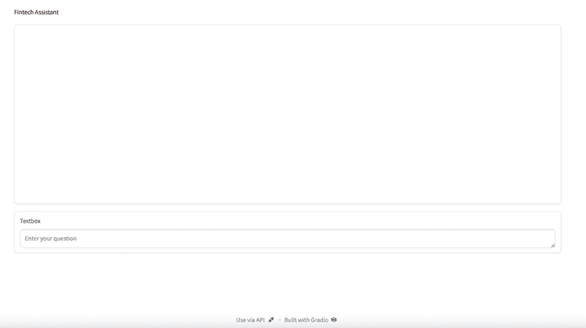
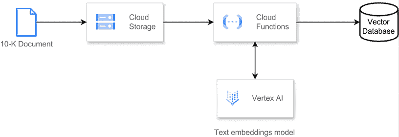
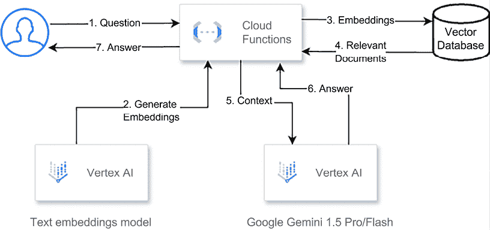

# 生成式 AI 批量与实时集成模式

本章涵盖了围绕**大型语言模型**（**LLMs**）设计系统的两种主要模式——批量和实时。是否架构批量或实时应用程序将取决于你正在处理的使用案例。一般来说，批量用例是围绕生成稍后消费的数据而制定的。例如，你将利用 LLM 从大量数据中提取数据点，然后有一个步骤生成摘要，供业务分析师每天消费。在实时用例的情况下，数据将在可用时使用。例如，你将利用 LLM 作为在线代理，通过聊天或语音界面回答客户或员工的问题。

深入了解批量模式，它涉及批量发送查询以提高吞吐量，但以延迟为代价。这更适合长时间、耗时的生产工作负载和大量数据消费。此外，批量生成的结果不会立即暴露给最终用户，这允许通过额外的管道审查内容。这些管道可以在将提示发送到 LLM 之前集成，以便进行数据清洗和提示工程，或者在接受到 LLM 的响应之后，你可以增强回复以匹配特定格式或添加来自其他数据源的数据。

实时设计模式提供更快的交互式查询体验。尽管吞吐量较低，但实时设计模式提供更快的反馈，并且可以通过多轮记忆机制来增强对 LLM 先前请求的认识。实时推理受延迟要求的影响，用户体验可能会降低，因此审查结果的机会减少。

在这种情况下，你可以在推理时应用一些过滤，并在将其发送到 LLM 之前应用一个**检索增强生成**（**RAG**）管道来增强用户查询。此外，在入口和出口处保持一层过滤可以帮助你保持应用程序的安全。

我们将提供批量查询和实时查询的示例用例，以突出权衡。读者将根据规模、成本和延迟要求等因素了解何时使用每种方法。

在本章中，我们将涵盖以下主要主题：

+   批量和实时集成模式：

    +   批量模式涉及批量发送查询以提高吞吐量，但会增加延迟。它更适合长时间运行的工作负载和大量数据消费。

    +   实时模式以更快的速度提供交互式查询，提供更快的反馈，但吞吐量较低。它更适合低延迟要求。

+   不同的管道架构：

    +   批量与实时对集成管道不同组件的影响，例如入口点、预处理、推理、后处理和结果展示。

+   集成框架中的应用集成模式：

    +   批量和实时模式如何映射到集成框架的不同阶段，包括入口点、提示预处理、推理、结果后处理和结果展示。

+   用例示例 - 由生成人工智能（GenAI）增强的搜索：

    +   使用 GenAI 增强网站搜索的示例用例，其中文档摄取以批量模式进行，而搜索/响应生成以实时模式进行。

# 批量和实时集成模式

评估批量与实时集成方法时的第一个关键决策是关于数据即时性 - 您何时需要 GenAI 输出？这归结为是否需要即时响应式结果，例如处理按需用户查询，还是模型输出的见解可以在一段时间内积累然后再被消费的使用场景。

让我们用一个 RAG 的例子来说明这一点，其中 LLMs 评估搜索结果以制定人性化的查询响应。这是一个实时用例；您需要在对话助手或搜索引擎等应用程序中提供具有最小延迟的 AI 生成的答案，以提供优质的用户体验。数据必须在其产生时立即投入使用。

与自动化内容生成工作流等类似的情况进行对比，例如从产品目录中提取元数据。虽然您仍然希望内容快速生成，但在模型输出被下游摄取的时间上具有更大的灵活性。您可以在可用容量允许的情况下批量运行生成模型，排队提示并异步处理它们。生成的文本随后按照自己的时间表流入您的电子商务数据库。

实时交互集成模式优先考虑低延迟和响应性体验。用户通过请求/响应应用程序接口几乎立即收到 AI 结果。批量模式断开这种耦合，牺牲即时交互以换取更高的整体吞吐量和规模成本效率。运行时间较长的作业优化了跨池化模型的利用率。

因此，批量处理与实时决策取决于分析数据新鲜度的需求。对于需要可感知即时满足感的使用场景，例如查询信息或迭代创意构思，您将需要一个请求范围的交互式架构。但当目标更多是关于通过灵活的延迟容忍度最大化生成模型输出量时，批量提示将带来更好的经济效益。正确实现这种集成模式是利用生成人工智能（GenAI）价值的关键。

# 不同的管道架构

除了集成模式本身之外，实时处理与批处理之间的决策对周围的数据管道和基础设施架构有重大影响。预处理和后处理工作流程具有各自模式优化的非常不同的特征。

对于实时、低延迟用例，如查询回答或对话式 AI，轻量级的即时预处理管道是理想的。这些管道在向生成模型发送单个推理请求之前，以最小的开销处理提示清理、上下文增强和其他步骤。输出随后通过一个专注于安全过滤、响应排名和结果格式的后处理阶段。这些过程需要优化，因为端到端延迟至关重要。

实时管道通常托管在动态可扩展的容器化基础设施或无服务器云环境中。积极的缓存层和负载均衡将请求量分布到可用的推理资源。整个实时架构在所有其他方面都优化了即时响应。

与之相反，批处理管道通过处理更大的数据量来承担更重的预处理工作。这可能包括诸如主题聚类、语义搜索、翻译等任务——所有这些都在提示生成模型之前完成。然后，这些提示流入异步队列系统，将请求累积成批次，以实现更高的模型执行吞吐量。

在输出端，重量级的后处理管道应用内容结构化、摘要、质量过滤、法律合规性扫描以及各种其他丰富任务。临时存储区域，如云存储和数据仓库，暂时存储输出以供分析，然后再异步集成到下游系统中。

由工作流引擎或批量服务管理，这些管道旨在在成本约束下，在较长的时间范围内最大化总数据吞吐量。与实时系统不同，延迟是可接受的权衡，以实现整体更高的可扩展性和并行性，同时降低单位成本。

解耦的缓冲区将上游和下游系统从对 GenAI 模型的直接依赖中隔离出来。这允许在云或本地环境中跨分布式工作池进行线性扩展。自动扩展策略不断将配置的资源与需求相匹配。

尽管在架构上更为复杂，批处理管道能够高效地在结构化的时间表上产生大量 AI 生成数据。成本计算比较了扩展基础设施费用与固定基础设施成本。对于许多大规模用例，尽管管道开销很大，但批处理可以迅速摊销。

在评估权衡时，交互式实时处理与离线批处理之间的决策涵盖了众多架构要求。实时优化低延迟，而批处理在更灵活的时间窗口内提供更高的整体吞吐量。精心设计的管道与数据需求和生成用例相匹配，对于整体系统性能和成本效率至关重要。

# 集成框架中的应用集成模式

以前，我们深入探讨了 GenAI 模型实时和批处理集成方法之间的高层次架构权衡。但这些模式的不同之处如何映射到我们集成框架阶段的不同组件中？以下图表展示了这些步骤：


图 4.1：GenAI 应用集成框架

让我们在下一节中逐一介绍每个步骤。

## 入口点

当谈到入口点阶段时，实时与批处理系统之间的优先级差异很大，这取决于最终用户体验。对于实时交互式应用，提示来源的入口点需要高度精简，考虑到简单性和易用性。毕竟，这些输入将直接暴露给人类用户，并驱动他们收到的即时 AI 响应。

因此，实时提示界面应优化为简洁、用户友好的设计，搜索栏，专注的聊天窗口，直接的语音界面和直观的上传小部件。体验被提炼为其基本信号，没有可能分散响应性的额外复杂性。

这些提示通常也来自不可预测的上下文，因此界面需要在各种设备和使用场景中感觉自然。



图 4.2：第七章“集成模式：实时意图分类”中你将构建的聊天机器人图片

相比之下，批处理入口点在幕后发生，不在最终用户的视线中。这些提示更常见地来自数据管道——无论是来自 API 的 JSON 有效负载、数据库导出文件、云存储中的文档，或其他结构化/非结构化来源。这些界面优化为稳定、高吞吐量的摄入，而不是实时的人机交互。

适用于批处理的常见输入格式包括 JSON/JSONL 流、CSV 上传、Parquet 文件等。这些提示已经预先解析成可消费的形状，可以被另一个模型或其他机制解析和评估，然后发送到下游排队系统进行大规模模型执行。以下是一个 JSONL 文档的示例：

```py
{"name": "Paula", "music_genres": [["blues", "8"], ["rock", "5"]]}
{"name": "John", "music_genres": [["pop", "15"], ["country", "2"]]}
{"name": "Mary", "music_genres": []}
{"name": "Adam", "music_genres": [["pop", "5"]]} 
```

## 提示预处理

提示预处理步骤涉及在将输入提示输入到语言模型进行生成之前对其进行准备和转换。

预处理的需求和约束可能会因系统是设计用于实时处理还是批量处理而大不相同。在实时应用中，例如对话助手或搜索引擎，预处理工作流程中的每一步都会给整体响应时间增加宝贵的几秒钟。这种延迟可能会损害用户体验，尤其是在即时性和响应性至关重要的场景中。

例如，在一个采用 RAG 管道的实时系统中，提示必须在语言模型生成响应之前经历几个耗时的步骤。这些步骤可能包括评估提示以符合安全 AI 的目的、生成提示的嵌入（向量表示）、查询向量存储以检索相关信息，以及可能对检索到的数据进行额外的处理。这些步骤中的每一个都会对整体延迟做出贡献，从而加剧用户所经历的延迟。

相比之下，批量提示预处理工作流程具有更大的灵活性，可以在不影响用户体验的情况下容纳更多计算密集型操作。由于处理不是实时发生的，因此有更多的空间应用更深入的丰富技术，例如通过提取元数据来增强提示、执行查询重写以改善检索信息的质量，或应用高级自然语言处理技术以更好地理解提示背后的意图。

批量处理中的这种灵活性可以使语言模型提供更全面、更准确的响应，因为预处理的提示可以丰富相关上下文信息，并更好地与模型的优势相匹配。然而，在预处理深度和所需计算资源之间取得平衡是很重要的，因为过度的预处理可能会转化为更高的成本，这可能会影响解决方案的整体投资回报率。

## 推理

尽管实时和批量提示预处理工作流程在方法和优先级上有所不同，但核心推理阶段是两者模式汇聚的地方，因为它们最终利用相同的底层生成模型能力。然而，在这个阶段所采用的优化策略在这两种集成模式之间可能存在显著差异。

在实时通用人工智能系统中，主要关注的是最小化延迟并最大化对单个请求的响应速度。这些系统通常一次处理一个推理请求，而不是将多个请求一起批处理。当使用如谷歌的 Gemini、OpenAI 的 ChatGPT 或 Anthropic 的 Claude 等现成模型时，底层基础设施和资源分配对用户来说是抽象的。在这种情况下，提供商处理了为推理正确分配可用资源的复杂性，确保单个请求得到高效处理，同时遵守服务的性能和成本目标。

然而，在组织选择自行托管和部署生成模型的情况下，例如使用谷歌的 Gemma、Meta 的 LLaMA 或其他开源或专有模型时，正确定规基础设施的责任就落在组织自身。这个过程被称为正确定规练习，涉及仔细平衡潜在延迟和成本之间的权衡。

正确定规练习的目标是确定计算资源的最佳配置，例如 GPU 的数量和类型、CPU 核心和内存，这些资源可以有效地处理预期的负载，同时最小化延迟并控制成本。这项练习通常涉及负载测试和基准测试模型在各种资源配置和模拟流量模式下的性能。

模型的大小、复杂性和推理任务（例如，文本生成、问答、摘要）的性质等因素在确定资源需求方面起着至关重要的作用。更大、更复杂的模型通常需要更多的计算能力来实现可接受的推理延迟，这可能会增加部署和运营的整体成本。

组织必须仔细评估在实现低延迟（可能需要过度配置资源）和控制成本（可能涉及接受略微更高的延迟）之间的权衡。找到正确的平衡至关重要，因为过度的延迟会降低用户体验，而过度配置资源可能导致不必要的开支。

另一方面，批处理集成模式优先考虑成本优化和吞吐量，以对大量提示进行批量处理。这些系统不是单独处理请求，而是将多个提示汇总成批次，然后将这些批次发送到生成模型进行推理。通过批量处理提示，可以更有效地利用计算资源，因为与初始化模型和设置推理管道相关的开销被分摊到多个提示上。

这种方法可以带来显著的成本节约，尤其是在处理大量提示时，因为计算资源得到了更有效的利用，整体吞吐量也得到了提升。

然而，需要注意的是，批量处理方法在吞吐量和延迟之间引入了权衡。虽然它优化了成本和整体吞吐量，但单个请求可能会经历更高的延迟，因为它们需要等待足够数量的提示积累起来，然后才能批量处理。正如之前提到的，批量集成模式更适合那些实时响应性不那么关键的场景，例如批量文本生成、文档摘要或其他离线处理任务。

## 结果后处理

在实时应用中，后处理阶段在确保流畅和吸引人的用户体验中发挥着至关重要的作用。由于生成的响应旨在立即交付，后处理工作流程优先考虑那些能够快速响应过滤、排序和渲染的技术。在聊天机器人等对话式 AI 应用中，一种常见的做法是使用 Markdown 等标记语言格式化生成的输出。这种方法允许无缝集成丰富的文本格式，包括标题、列表、代码块和其他结构元素，增强响应的可读性和视觉吸引力。

实时后处理可能包含针对特定用例定制的技术，例如根据情感应用颜色方案作为背景进行情感分析。例如，在客户服务聊天机器人中，可以根据其与客户查询的相关性对响应进行过滤和排序，确保最合适且最有帮助的响应得到优先考虑。

与实时系统相比，GenAI 系统中的批量处理工作流程提供了更多的灵活性和计算资源用于后处理。由于生成的输出并非旨在立即交付，批量后处理可以在将它们持久化到数据存储或下游系统之前，对汇总的输出应用更全面和计算密集型的增强。

一种常见的批量后处理技术是摘要，其中生成的输出被压缩成简洁且连贯的摘要，便于消费和分析。结构提取是另一个有价值的后处理步骤，其中系统从生成的文本中识别并提取相关信息，例如关键实体、关系或事件描述。这些结构化数据可以随后存储在数据库中或用于填充知识图谱，从而实现更高效的查询和分析。

批量后处理还可以结合更深入的质量过滤机制，利用针对质量评估、自然语言推理或事实核查进行微调的语言模型等技术。这些高级过滤方法可以帮助识别并标记低质量或事实错误输出，确保只有高质量和可靠的信息被持久化，以便下游消费。

批量后处理工作流程可能涉及更复杂的转换和增强，例如文本风格化、情感转移或为特定领域或格式生成内容（例如，生成营销文案、产品描述或技术文档）。

## 结果展示

结果展示可以说是两种范式之间最鲜明的差异。实时 UI/API 集成需要即时更新 - 通常是通过服务器渲染或数据绑定框架实现的。在批量模式下，你更有可能通过管道批量导出结果到仓库或运营数据存储，以便在报告、分析、文档系统等进行异步消费。

自然地，日志记录和监控需求与每种模式的系统特性紧密相关。实时处理需要在每个请求的指标周围进行紧密的仪器配置，如延迟、错误和资源使用。批量处理强调吞吐量、管道性能和数据血缘可观察性。

从数据工程的角度来看，实时处理更遵循 lambda 架构，具有优化的速度和路径。批量处理则倾向于使用传统的现代数据管道，利用云存储、Spark 集群、托管工作流程编排器和 MPP 数据仓库目标。

实时集成无缝地与有状态应用程序结合，并提供非常响应式的 UI。批量处理解锁了大型、异步 AI 驱动的操作（如文档生成、报告自动化和对话数据标注）的更高可扩展性。

这两种模式也各自引入了独特的可支持性考虑因素。实时处理依赖于高度冗余、自我修复的服务网格。批量处理则更多地依赖于稳健的恢复编排、幂等重启和自动重试。

如您所见，虽然利用了相同的核心 GenAI 功能，但两种范式在上游/下游架构优先级和交付特性方面存在显著差异。正确的选择取决于评估延迟敏感性、规模目标、成本参数和用例的适用性。许多企业可能会采用结合两种模式特点的混合网格。

# 用例示例 - 由 GenAI 增强的搜索

为了说明实时和批量用例，我们将通过一个公司使用 GenAI 增强其网站搜索体验的例子来工作。在这种情况下，文档摄取将是一个批量过程，而搜索本身将是实时的。

想象一家公司希望通过利用 **GenAI** 技术来增强其网站搜索体验。在这种情况下，公司的目标是向用户提供更全面、更相关的搜索结果，超越简单的关键词匹配，并交付上下文相关和自然语言响应。

文档摄取过程，涉及索引和处理公司的内容语料库（例如，产品描述、知识库文章、产品手册），将是一个批量操作。这一步骤将涉及文本提取、实体识别、主题建模和语义嵌入生成等技术，以处理整个文档语料库。这些嵌入捕捉了文档的语义意义和上下文，然后将被存储在向量数据库或其他适当的数据存储中。

在实时搜索体验中，当用户在公司的网站上提交查询时，该查询将进行提示预处理，这可能包括查询重写、意图检测和嵌入生成。生成的查询嵌入将用于根据语义相似性从向量数据库中检索最相关的文档。这些检索到的文档将作为 GenAI 模型的知识来源。

GenAI 模型将根据检索到的文档和用户的查询生成自然语言响应。这个响应可以是简短的摘要、详细的答案，甚至可以是对话式的对话，具体取决于公司的要求和公司决定设定的语气。

随后，实时后处理阶段将启动，格式化生成的响应以在网站上以最佳方式呈现。这可能涉及响应排序、结果结构化（例如，将响应分解为部分或项目符号）以及使用适当的标记或视觉元素进行渲染。

通过结合文档摄取的批量处理与实时查询处理和生成，公司可以为用户提供无缝且丰富的搜索体验。批量处理确保公司的内容语料库被彻底索引和语义理解，而实时组件利用这些知识提供针对每个用户查询的相关和自然语言响应。

# 批量集成 – 文档摄取

文档摄取管道的批量处理部分在为公司的内容语料库准备有效的搜索和检索方面发挥着关键作用。这一阶段涉及几个步骤，以提取有意义的信息并将其转换为适合高效查询和生成的格式：

1.  **数据提取和预处理**：第一步是从各种来源提取文本数据，例如数据库、内容管理系统或文件存储库。这些数据可能以各种格式（例如，HTML、PDF、Word 文档）存在，需要预处理技术如文本提取、去重和标准化来清洗和标准化输入数据。

1.  **元数据提取**：一旦文本数据经过预处理，就可以应用高级自然语言处理技术，如**命名实体识别**（NER）和实体链接。这些任务可以从预测 AI 模型或 GenAI 模型中执行。这一步识别并提取相关的实体（例如，人物、组织、产品、地点），通过将它们链接到外部知识库或本体，以丰富数据并添加额外的上下文信息。

1.  **嵌入生成**：批量处理阶段的核心是生成每个文档的语义嵌入。这些嵌入是密集的向量表示，能够捕捉文本中的上下文意义和关系。常用的技术包括 Transformer 语言模型（例如 BERT 和 RoBERTa）或专门的嵌入模型（例如，例如 Google Vertex AI 文本嵌入模型和 OpenAI 文本嵌入）用于生成这些嵌入。

1.  **向量数据库索引**：生成的嵌入向量以及提取的实体、主题和元数据存储在专门的向量数据库或其他适合的数据存储中，这些数据存储针对相似搜索和检索进行了优化。这个索引语料库作为实时搜索和生成过程的知识库。



图 4.3：文档摄取

通过执行这些批量处理步骤，公司的内容语料库被转换成一个高度结构化和语义丰富的表示，这使检索变得高效，并为 GenAI 模型在实时搜索体验中产生相关和准确的响应提供了必要的上下文。

## 实时集成 – 搜索

过程的实时部分处理用户的搜索查询，并利用批量处理阶段创建的知识库生成上下文相关的响应。

在高层次上，这些是*图 4.4*中展示的体验的组成部分：

1.  **查询处理**：这如图 4.4 所示，步骤 1。当用户在公司的网站上提交搜索查询时，查询会经过与批量处理阶段中应用的步骤类似的预处理步骤。这可能包括文本归一化、实体识别和使用与文档语料库相同的模型生成的嵌入。在这一步中，您还可以评估查询的安全性。

1.  **语义检索**：如步骤 2 和步骤 3 所示，生成的查询嵌入用于对包含索引文档嵌入的向量数据库进行相似度搜索。这一步根据用户查询的语义相似度从语料库中检索最相关的文档，确保检索到的信息在上下文中是适当的。在这一步中，您还可以根据用例和可用的元数据重新排序结果。

1.  **提示丰富和生成**：在*步骤 4*中，检索到的文档、原始查询以及任何额外的上下文（例如，用户资料或浏览历史）被用来构建一个丰富的提示，供 GenAI 模型使用。可以采用提示工程、上下文增强和 RAG 等技术来创建一个信息丰富且简洁的提示，以捕捉用户信息需求的核心。

1.  **响应生成**：在*步骤 5*和*步骤 6*中，GenAI 模型将丰富的提示作为输入，生成自然语言响应。这个响应可能是一个简洁的摘要、一个详细的答案，甚至是一个对话式对话，具体取决于需求和模型的能力。

1.  **后处理和渲染**：在*步骤 6*中，生成的响应随后进入后处理阶段，这可能涉及格式化、结构提取、结果排序和为了在网站上最佳展示而进行的渲染。这可能包括提取要点或摘要、突出相关实体以及整合多媒体内容的视觉元素，以增强用户体验。



图 4.4：实时搜索架构示例

# 摘要

本章介绍了围绕 LLM（大型语言模型）设计系统的两种主要模式——批处理和实时处理。这个决定取决于您组织的使用案例需求。我们了解到，批处理模式涉及批量发送查询以实现更高的吞吐量，但代价是更高的延迟。它更适合长时间运行的工作负载和大量数据的消费。

结果不会立即向用户展示，允许在模型推理前后进行额外的审查流程。

我们还了解到，实时模式以更快的速度提供双向查询，为用户提供更快的反馈。它具有较低的吞吐量，但更适合低延迟需求，但为了防止延迟增加，减少了审查结果的机会。

在本章中，我们讨论了批处理与实时处理对集成管道不同组件的影响。对于入口点，实时处理优化了简洁的用户提示，而批处理处理数据管道输入。

在预处理中，实时处理采用较轻的技术以最小化延迟，而批处理允许进行更重的丰富。实时推理专注于每个请求的低延迟，而批处理以组的形式处理请求以提高吞吐量。

实时处理的后处理涉及更快的格式化和过滤，但批处理允许进行更复杂的转换。在展示方面，实时处理提供即时的 UI 更新，而批处理异步导出结果。

此外，本章还提供了一个使用 GenAI 增强网站搜索的示例用例，文档摄取以批量模式进行，搜索/响应生成以实时模式进行，从而改变最终用户的使用体验，并获得更相关和个性化的答案。

在下一章中，我们将深入探讨一个利用 GenAI 从 10-K 文档中提取数据的用例。

# 加入我们的 Discord 社区

加入我们的 Discord 空间，与作者和其他读者进行讨论：

`packt.link/genpat`


