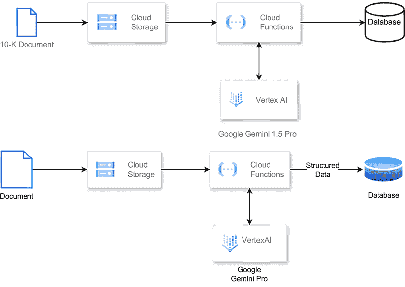
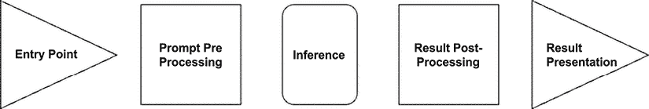

# 集成模式：批量元数据提取

在本章中，我们将探讨一个元数据提取用例，这作为一个理解**生成式人工智能**（**GenAI**）能力的绝佳切入点。这个主题在各个行业中都特别相关，并且富有启发性。

为了说明这个用例，让我们考虑一个场景，其中我们与一家金融服务公司合作，需要从 10-K 报告中提取数据。这些报告由上市公司每年提交给**证券交易委员会**（**SEC**），提供了他们财务表现、运营和重大事件的全面概述。这些是超过 100 页的广泛文件，包含大量信息，结构化地分布在不同的数据模式（表格、文本等）中。

在本章中，我们的目标是确定需要从这庞大的信息库中提取的具体数据集和关键数据点。这个过程需要一种系统性的方法，以精确地定位所需的数据点。

一旦确定了相关数据点，我们将确定这些提取数据的适当存储位置。这可能涉及一个组织内部授权人员可访问的集中式数据库，或者一个基于云的存储库，它促进了团队和地点之间的无缝访问和协作。

不论选择哪种存储解决方案，GenAI 将在整个过程中发挥关键作用。凭借其理解和处理自然语言的能力，GenAI 将在导航金融报告复杂结构、以显著效率和准确性提取关键数据点方面证明其价值。

本章我们将涵盖以下主要主题：

+   **用例定义**：我们将描述一个从金融服务公司的 10-K 报告中提取元数据的示例场景，解释这些报告的结构和重要性。

+   **架构**：我们将概述一个基于云的无服务器架构，使用 Google Cloud 服务处理 10-K 报告，包括存储、消息传递、处理和数据库组件。

+   **切入点**：我们将解释如何通过 Google Cloud Storage 和 Cloud Functions 触发批量处理管道，以启动内容提取过程。

+   **提示预处理**：我们将详细介绍为 AI 模型创建初始提示的过程，利用 SEC 指南来识别从 10-K 报告中提取的关键数据点。

+   **推理**：我们将讨论通过 Vertex AI 将提示提交给 Gemini Pro 1.5，展示模型如何处理和从 10-K 报告中提取信息。

+   **结果后处理**：我们将介绍解析来自**大型语言模型**（**LLM**）的 JSON 输出以及将提取的数据导入数据库的策略，考虑到关系型数据库和文档数据库选项。

+   **结果展示**：我们将考虑如何展示提取的数据，包括使用商业智能工具、数据可视化平台和定制应用程序。

+   **代码示例**：我们将提供一个元数据提取过程的实际实现，包括设置、提示创建、推理和结果处理。

# 用例定义

从 10-K 报告中提取元数据对金融服务公司和其他利益相关者具有重大价值。这些由 SEC 规定的报告是信息宝库，可以提供有关公司财务状况、运营绩效和战略方向的宝贵见解。然而，这些文件的庞大体积、复杂性和公司在构建报告方式上的不一致性，使得手动提取和分析相关数据点变得具有挑战性。

典型的 10-K 报告遵循标准化的结构，包含多个部分，涵盖公司运营的各个方面。这些部分可能包括业务概述、风险因素、管理层讨论与分析、财务报表以及关于公司治理的披露等。虽然结构在公司之间是一致的，但具体的数据点和它们的呈现方式可能有所不同，这使得建立一种适用于所有情况的数据提取方法变得困难。

10-K 报告包括五个不同的部分：

+   **业务**：本节概述了公司的主要运营，包括其产品和服务、关键市场、竞争格局以及与其商业模式和运营相关的其他细节。

+   **风险因素**：在这一节中，公司概述并讨论了它面临的所有风险。这包括可能影响其业绩或未来前景的运营、财务、法律、监管和行业特定风险。

+   **选定的财务数据**：本节展示了公司过去五年的具体财务信息，通常包括关键指标，如收入、净收入、每股收益和其他相关财务数据。

+   **管理层讨论与分析**（**MD&A**）：第四部分提供了高级管理层对公司财务结果的解释和分析，包括对影响其业绩的因素、未来战略、潜在的机会和挑战的详细讨论。

+   **财务报表和补充数据**：最后一部分提供了经审计的财务报表，包括利润表、资产负债表、现金流量表以及相关的注释和披露。本部分提供了公司报告期内财务状况和业绩的全面和详细情况。

这些文档最大的挑战在于具体数据点和其呈现方式可能各不相同，这使得建立一个适用于所有情况的数据提取方法变得非常困难。然而，通过利用通用人工智能的自然语言处理能力，金融服务公司可以高效地导航这种结构化格式，并从每个部分中提取相关数据点，根据每家公司报告的独特特征调整他们的方法。

从这些文档中提取的结构化元数据的可用性为金融服务公司开辟了机会。例如，他们可以对公司的财务绩效进行深入分析，将其与行业同行或历史趋势进行比较。这种分析可以指导投资决策、风险评估和战略规划工作。

另一个机会是利用提取的元数据来开发预测模型，并识别出从手动分析中可能不会立即显现的模式。这些模型可以帮助预测潜在风险，识别新兴趋势，并揭示新的投资机会。

进一步思考，提取的元数据可以集成到现有的数据存储库或商业智能平台中，使组织内部各个团队之间的访问和协作无缝进行。这种集成可以促进跨职能协作，使不同的部门，如投资银行、资产管理、风险管理，能够利用相同的数据进行各自的分析和决策过程。

除了金融服务公司，提取的元数据对于监管机构、学术研究人员以及其他对研究企业绩效、行业趋势和金融市场整体健康状况感兴趣的利益相关者来说也极具价值。

通过利用通用人工智能（GenAI）从 10-K 报告中提取元数据，金融服务公司可以解锁丰富的见解，简化他们的分析流程，并做出更明智的决策，这些决策可以推动业务增长并降低风险。

# 架构

尽管本书的范围不是深入探讨大型语言模型处理架构的复杂性，但我们将简要讨论我们的元数据提取用例可能看起来像的基于云的架构。在这个例子中，我们将利用 Google Cloud 的能力，因为它提供了一个名为 Vertex AI 的本地 AI 平台，允许我们以企业合规的方式无缝集成领先的模型，包括 Google 的 Gemini 和第三方模型，如 Anthropic 的 Claude。

我们将采用适用于处理大量数据的高效和可扩展的批优化架构来处理此用例。此类架构符合云原生原则，是一种无服务器架构，利用了各种 Google Cloud 服务。

该架构将包括一个对象存储（Google Cloud Storage）来存储 10-K 报告，一个消息队列（Google Cloud Pub/Sub）来协调数据流，一个处理组件（Google Cloud Functions）来执行基于 LLM 的元数据提取任务，一个 LLM 模型（例如托管在 Vertex-AI 上的 Google Gemini）来执行实际的提取，以及一个数据库（Google Big-Query）来存储提取的元数据。

下面是对该架构如何运作的更详细分解：

1.  10-K 报告存储在高度可扩展和耐用的对象存储 Google Cloud Storage 中。

1.  云函数会定期触发（例如，每日或每周）以启动元数据提取过程。

1.  云函数将读取来自云存储的 10-K 报告列表，并将消息发布到 Pub/Sub 主题，从而有效地创建一个待处理报告队列。

1.  另一个云函数，订阅了 Pub/Sub 主题，会在队列中与给定报告相关的每条消息触发。

1.  第二个云函数调用托管在 Vertex-AI 上的 LLM 模型（例如，Google Gemini），并将 10-K 报告内容作为输入。

1.  LLM 模型处理报告，利用其自然语言理解能力提取相关元数据。

1.  提取的元数据随后以结构化格式（例如，BigQuery）存储，以便进行进一步分析和消费。

这种无服务器架构提供了几个好处，包括自动扩展、成本效益（按使用付费定价）以及与其他 Google Cloud 服务的无缝集成。



图 5.1：GenAI 文档数据提取管道

以下图表展示了我们将利用的架构，遵循我们在第三章“与生成式 AI 交互的设计模式”中讨论的 GenAI 集成框架：



图 5.2：应用程序集成框架

## 入口点

我们批量处理管道的入口点将是一个在**Google Cloud Storage**（**GCS**）中创建的对象，然后触发一个 Google Cloud Function 以启动处理管道。这种设置使我们能够无缝集成到现有的工作流程中，其中 10-K 报告被上传到指定的 GCS 存储桶。通过利用云函数的事件驱动特性，我们的系统可以在新报告到达存储桶时自动采取行动。

一旦触发，云函数将启动内容提取过程。为此步骤，我们决定采用 Google 的 Gemini Pro 1.5 的强大功能，这是一个支持直接处理 PDF 文档的尖端 GenAI 多模态模型。Gemini Pro 1.5 将分析上传的 10-K 报告，智能地提取不仅包括文本内容，还包括我们感兴趣的相关的数据点，例如财务数据、公司概述和关键绩效指标。

通过利用 Gemini Pro 1.5 的高级自然语言处理和文档理解能力，我们可以获得报告内容的全面记录。这份记录将成为我们管道中进一步分析和处理步骤的基础。此外，提取的数据点将以我们在提示中定义的格式（JSON、标记等）进行结构化和组织，使我们能够无缝地将它们集成到我们的下游系统中，生成有洞察力的摘要、可视化和其他有价值的输出。

## 提示预处理

作为第一步，我们将开始详细阐述一个提示，以提取全面理解 10-K 文件所需的必要数据点。为了指导我们的工作，我们将利用美国证券交易委员会（SEC）本身提供的一项宝贵资源——一份名为《如何阅读 10-K》（*How to Read a 10k*）的文件，该文件可在 SEC 网站上找到（[`www.sec.gov/files/reada10k.pdf`](https://www.sec.gov/files/reada10k.pdf)）。

这份由美国证券交易委员会（SEC）提供的文件是一个非常实用的路线图，概述了投资者和分析师在深入研究公司 10-K 文件时应关注的重点章节和信息。通过仔细研究这份资源，我们可以识别出最相关和有洞察力的关键数据点，确保我们的通用人工智能（GenAI）系统提取出真正重要的信息。

为了启动我们的数据提取过程，我们将为我们的 GenAI 模型创建一个简单而有效的提示。这个初始提示将作为起点，指导模型识别和提取《如何阅读 10-K 文件》（*How to Read a 10k*）文档中概述的具体数据点。虽然这个初始提示可能很简洁，但它将为我们的项目进展中的更复杂提示和微调技术奠定基础。目标是迭代优化我们的提示，利用 GenAI 的力量准确高效地从这些复杂的财务文件中提取最关键的信息。

```py
prompt = """
You are an expert business analyst. Your task is to evaluate documents. 
From the context document generate a JSON template with the important data points to be extracted from the document, also remember to add an attribute for the summary of the section. 
The output should be a well-formed JSON document. 
Context: 
reada10k.pdf
Response: 
""" 
```

以下是从上一个提示生成的示例输出：

```py
{
    "10k_template": {
        "part_I": {
            "item_1_business": {
                "description": "Company's main products and services, subsidiaries, and markets",
                "recent_events": null,
                "competition": null,
                "regulations": null,
                "labor_issues": null,
                "operating_costs": null,
                "seasonal_factors": null,
                "summary": null
            },
            "item_1a_risk_factors": {
                "risk_factors": [],
                "summary": null
            },
            "item_1b_unresolved_staff_comments": {
                "comments": [],
                "summary": null
            },
            "item_2_properties": {
                "properties": [],
                "summary": null
            },
            "item_3_legal_proceedings": {
                "proceedings": [],
                "summary": null
            },
            "item_4": {
                "reserved": true
            }
        },
        "part_II": {
            "item_5_market_for_registrants_common_equity": {
                "market_information": null,
                "number_of_holders": null,
                "dividends": null,
                "stock_repurchases": null,
                "summary": null
            },
            "item_6_selected_financial_data": {
                "financial_data": {},
                "summary": null
            },
            "item_7_managements_discussion_and_analysis": {
                "operations_and_financial_results": null,
                "liquidity_and_capital_resources": null,
                "trends_and_uncertainties": null,
                "critical_accounting_judgments": null,
                "off_balance_sheet_arrangements": null,
                "contractual_obligations": null,
                "summary": null
            },
            "item_7a_quantitative_and_qualitative_disclosures_about_market_risk": {
                "market_risk_exposures": null,
                "risk_management": null,
                "summary": null
            },
            "item_8_financial_statements_and_supplementary_data": {
                "income_statement": null,
                "balance_sheets": null,
                "statement_of_cash_flows": null,
                "statement_of_stockholders_equity": null,
                "notes_to_financial_statements": null,
                "auditors_report": null,
                "summary": null
            },
            "item_9_changes_in_and_disagreements_with_accountants": {
                "changes_in_accountants": null,
                "disagreements": null,
                "summary": null
            },
            "item_9a_controls_and_procedures": {
                "disclosure_controls_and_procedures": null,
                "internal_control_over_financial_reporting": null,
                "summary": null
            },
            "item_9b_other_information": {
                "other_information": null,
                "summary": null
            }
        },
        "part_III": {
            "item_10_directors_executive_officers_and_corporate_governance": {
                "directors_and_executive_officers": [],
                "code_of_ethics": null,
                "board_qualifications": null,
                "summary": null
            },
            "item_11_executive_compensation": {
                "compensation_policies_and_programs": null,
                "executive_compensation": {},
                "summary": null
            },
            "item_12_security_ownership": {
                "ownership_information": {},
                "equity_compensation_plans": null,
                "summary": null
            },
            "item_13_certain_relationships_and_related_transactions": {
                "relationships_and_transactions": [],
                "director_independence": null,
                "summary": null
            },
            "item_14_principal_accountant_fees_and_services": {
                "fees_for_services": {},
                "summary": null
            }
        },
        "part_IV": {
            "item_15_exhibits_financial_statement_schedules": {
                "exhibits": [],
                "financial_statement_schedules": null,
                "summary": null
            }
        }
    } 
```

现在我们有了实际 10-K 中要查找内容的模板，我们可以创建一个提示来提取这些数据点：

```py
You are an expert business analyst specializing in 10-K documents.
Your task is to extract information from 10-K documents; to achieve this task, follow these steps:
Carefully analyze the document provided as context.
Use the template as a reference to understand which data points to extract.
Never make up information; if you don't remember something, go back to read the document. If the data is not available, add "Not available" as the value.
Return a well-formed JSON document following the template.
Always think step by step.
<template>
{
    "10k_template": {
        "part_I": {
            "item_1_business": {
                "description": "Company's main products and services, subsidiaries, and markets",
                "recent_events": null,
                "competition": null,
                "regulations": null,
                "labor_issues": null,
                "operating_costs": null,
                "seasonal_factors": null,
                "summary": null
            },
            "item_1a_risk_factors": {
                "risk_factors": [],
                "summary": null
            },
            "item_1b_unresolved_staff_comments": {
                "comments": [],
                "summary": null
            },
            "item_2_properties": {
                "properties": [],
                "summary": null
            },
            "item_3_legal_proceedings": {
                "proceedings": [],
                "summary": null
            },
            "item_4": {
                "reserved": true
            }
        },
        "part_II": {
            "item_5_market_for_registrants_common_equity": {
                "market_information": null,
                "number_of_holders": null,
                "dividends": null,
                "stock_repurchases": null,
                "summary": null
            },
            "item_6_selected_financial_data": {
                "financial_data": {},
                "summary": null
            },
            "item_7_managements_discussion_and_analysis": {
                "operations_and_financial_results": null,
                "liquidity_and_capital_resources": null,
                "trends_and_uncertainties": null,
                "critical_accounting_judgments": null,
                "off_balance_sheet_arrangements": null,
                "contractual_obligations": null,
                "summary": null
            },
            "item_7a_quantitative_and_qualitative_disclosures_about_market_risk": {
                "market_risk_exposures": null,
                "risk_management": null,
                "summary": null
            },
            "item_8_financial_statements_and_supplementary_data": {
                "income_statement": null,
                "balance_sheets": null,
                "statement_of_cash_flows": null,
                "statement_of_stockholders_equity": null,
                "notes_to_financial_statements": null,
                "auditors_report": null,
                "summary": null
            },
            "item_9_changes_in_and_disagreements_with_accountants": {
                "changes_in_accountants": null,
                "disagreements": null,
                "summary": null
            },
            "item_9a_controls_and_procedures": {
                "disclosure_controls_and_procedures": null,
                "internal_control_over_financial_reporting": null,
                "summary": null
            },
            "item_9b_other_information": {
                "other_information": null,
                "summary": null
            }
        },
        "part_III": {
            "item_10_directors_executive_officers_and_corporate_governance": {
                "directors_and_executive_officers": [],
                "code_of_ethics": null,
                "board_qualifications": null,
                "summary": null
            },
            "item_11_executive_compensation": {
                "compensation_policies_and_programs": null,
                "executive_compensation": {},
                "summary": null
            },
            "item_12_security_ownership": {
                "ownership_information": {},
                "equity_compensation_plans": null,
                "summary": null
            },
            "item_13_certain_relationships_and_related_transactions": {
                "relationships_and_transactions": [],
                "director_independence": null,
                "summary": null
            },
            "item_14_principal_accountant_fees_and_services": {
                "fees_for_services": {},
                "summary": null
            }
        },
        "part_IV": {
            "item_15_exhibits_financial_statement_schedules": {
                "exhibits": [],
                "financial_statement_schedules": null,
                "summary": null
            }
        }
    }
}
</template>
<document>
</document>
Response: 
```

注意，模板对要做什么以及不要做什么有非常具体的说明。这是提示 LLM 的最佳实践，因为这些模型需要这样的具体说明才能有效地提供精确信息。一个好的类比是像指导一年级学生一样引导他们，提供清晰的指示，并尽可能提供多的背景信息。

## 推理

对于推理，我们将提交我们的提示到通过 Vertex-AI 可用的 Gemini Pro 1.5。

Vertex AI Gemini API 是为寻求将 Gemini 模型纳入规模部署的开发者和企业量身定制的。这个企业级产品提供了一套强大的功能，旨在满足现代高性能应用的需求。使用 Vertex AI Gemini API，您可以受益于增强的企业安全措施，确保您的数据和模型得到行业领先的安全保障。此外，它还提供数据驻留选项，允许您遵守区域数据存储和处理法规：

```py
{
    "10k_template": {
        "part_I": {
            "item_1_business": {
                "description": "Company's main products and services, subsidiaries, and markets",
                "recent_events": null,
                "competition": null,
                "regulations": null,
                "labor_issues": null,
                "operating_costs": null,
                "seasonal_factors": null,
                "summary": null
            },
            "item_1a_risk_factors": {
                "risk_factors": [],
                "summary": null
            },
            "item_1b_unresolved_staff_comments": {
                "comments": [],
                "summary": null
            },
            "item_2_properties": {
                "properties": [],
                "summary": null
            },
            "item_3_legal_proceedings": {
                "proceedings": [],
                "summary": null
            },
            "item_4": {
                "reserved": true
            }
        },
        "part_II": {
            "item_5_market_for_registrants_common_equity": {
                "market_information": null,
                "number_of_holders": null,
                "dividends": null,
                "stock_repurchases": null,
                "summary": null
            },
            "item_6_selected_financial_data": {
                "financial_data": {},
                "summary": null
            },
            "item_7_managements_discussion_and_analysis": {
                "operations_and_financial_results": null,
                "liquidity_and_capital_resources": null,
                "trends_and_uncertainties": null,
                "critical_accounting_judgments": null,
                "off_balance_sheet_arrangements": null,
                "contractual_obligations": null,
                "summary": null
            },
            "item_7a_quantitative_and_qualitative_disclosures_about_market_risk": {
                "market_risk_exposures": null,
                "risk_management": null,
                "summary": null
            },
            "item_8_financial_statements_and_supplementary_data": {
                "income_statement": null,
                "balance_sheets": null,
                "statement_of_cash_flows": null,
                "statement_of_stockholders_equity": null,
                "notes_to_financial_statements": null,
                "auditors_report": null,
                "summary": null
            },
            "item_9_changes_in_and_disagreements_with_accountants": {
                "changes_in_accountants": null,
                "disagreements": null,
                "summary": null
            },
            "item_9a_controls_and_procedures": {
                "disclosure_controls_and_procedures": null,
                "internal_control_over_financial_reporting": null,
                "summary": null
            },
            "item_9b_other_information": {
                "other_information": null,
                "summary": null
            }
        },
        "part_III": {
            "item_10_directors_executive_officers_and_corporate_governance": {
                "directors_and_executive_officers": [],
                "code_of_ethics": null,
                "board_qualifications": null,
                "summary": null
            },
            "item_11_executive_compensation": {
                "compensation_policies_and_programs": null,
                "executive_compensation": {},
                "summary": null
            },
            "item_12_security_ownership": {
                "ownership_information": {},
                "equity_compensation_plans": null,
                "summary": null
            },
            "item_13_certain_relationships_and_related_transactions": {
                "relationships_and_transactions": [],
                "director_independence": null,
                "summary": null
            },
            "item_14_principal_accountant_fees_and_services": {
                "fees_for_services": {},
                "summary": null
            }
        },
        "part_IV": {
            "item_15_exhibits_financial_statement_schedules": {
                "exhibits": [],
                "financial_statement_schedules": null,
                "summary": null
            }
        }
    }
} 
```

注意，API 中有可用的配置选项进行测试。您可以在书籍的 GitHub 仓库提供的代码中检查具体的调用。

## 结果后处理

一旦 LLM 处理完 10-K 报告，它将以结构化的 JSON 格式返回结果。这个 JSON 文档将包含提取的数据点，以与 10-K 报告本身的层次结构相一致的方式组织。为了有效地利用这些结果，我们需要解析 JSON 文档并提取相关信息。

我们管道的下一步是将解析后的数据导入数据库，以实现高效存储和检索。具体的导入策略将取决于我们选择的数据库类型。例如，如果我们选择关系型数据库，我们需要将提取的数据点映射到适当的表结构中，确保适当的归一化和遵守数据完整性原则。

或者，如果我们决定使用文档数据库，导入过程将更加直接，因为这些数据库是设计用来存储原生层次数据结构的，例如 JSON 文档。在这种情况下，我们可以直接导入解析后的 JSON 结果，利用数据库高效存储和查询复杂数据结构的能力。

无论选择哪种数据库类型，设计一个确保数据一致性、可扩展性和性能的导入策略至关重要。这可能涉及实施批量导入、索引和分区等策略，以优化数据库的性能并确保高效检索提取的数据点。

除了存储提取的数据点之外，我们还可以考虑为 10-K 报告的各个部分生成嵌入。嵌入是捕获语义意义的文本的向量表示，使高效的相似性搜索和检索成为可能。通过为报告部分生成嵌入，我们可以将我们的数据集与向量搜索管道集成，使用户能够根据语义相似性执行高级查询。

对于深入探讨嵌入生成和向量搜索集成，我们将在专门的章节中介绍**检索增强生成**（**RAG**）示例。本章将提供关于生成嵌入、构建向量数据库和实现高效向量搜索算法的详细见解，使您能够为您的 GenAI 应用程序创建强大的搜索和检索功能。

## 结果展示

当涉及到展示从处理 10-K 报告中获得的结果时，重要的是要考虑这些结果被摄入数据库的事实。这意味着您需要考虑的因素与您在开发利用数据库中可用数据的功能时需要考虑的因素相似。

主要考虑因素之一是需要一个工具或平台，能够有效地聚合和分析存储在数据库中的数据。这可能是一个**商业智能**（**BI**）工具、数据可视化平台，甚至是一个根据您特定需求定制的应用程序。所选工具应提供强大的查询功能，使您能够从数据库中的各种表或集合中提取和组合数据。

此外，展示层应提供一系列可视化选项，如图表、图形和仪表板，以有效地传达从数据中得出的见解。这些可视化应具有交互性，使用户能够从不同角度探索数据，过滤和排序结果，并深入到特定感兴趣的区域。

此外，展示层的设计应考虑可扩展性和性能。随着时间的推移，数据量的增长，处理大型数据集并提供响应式用户体验的能力变得至关重要。这可能涉及实施缓存、索引和优化数据库查询等技术，以确保高效的数据检索和渲染。

在本章的 GitHub 目录中，您将找到完整的代码以及如何将本章中描述的所有层组合在一起的分析。

# 摘要

在本章中，我们探讨了从财务文件中提取元数据，特别是上市公司提交的 10-K 报告。我们回顾了与一家需要从这些庞大的 10-K 年度报告中提取关键数据点的金融服务公司合作的经验，利用 LLMs 的数据提取能力。

我们定义了用例，并利用 GenAI 的力量导航 10-K 报告的结构化部分，根据最佳实践文档的指导，定位和提取最相关的信息颗粒。我们详细介绍了这个过程，首先通过制定一个有效的提示来引导 AI 模型。这涉及到研究 SEC 资源，概述了投资者应关注的重点部分和数据点。有了这些知识，我们可以迭代地改进我们的提示，以确保准确和高效地提取。

然后，我们提出了一个基于 Google Cloud 的云原生、无服务器架构来处理这些文档的批量处理。这个可扩展的设置可以利用各种服务，如云存储、Pub/Sub 和云函数，使我们能够无缝集成 AI 模型并存储提取的数据。

本章还涉及了后处理步骤，例如将提取的数据导入数据库（关系型或基于文档的），可能生成用于向量相似性搜索的嵌入，并通过 BI 工具或带有交互式可视化的自定义应用程序展示结果。

总结来说，本章为您提供了一个利用 GenAI 从复杂金融文档中提取和分析关键信息的实用蓝图。它展示了您如何利用这项技术做出更明智的决策并发现有价值的见解，从而优化您的运营效率和战略能力。

在下一章中，我们将探讨一个摘要用例。这个例子将展示批量处理用例可能的样子。

# 加入我们的 Discord 社区

加入我们社区的 Discord 空间，与作者和其他读者进行讨论：

`packt.link/genpat`


