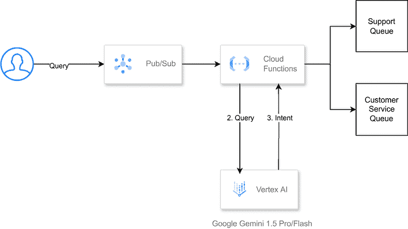
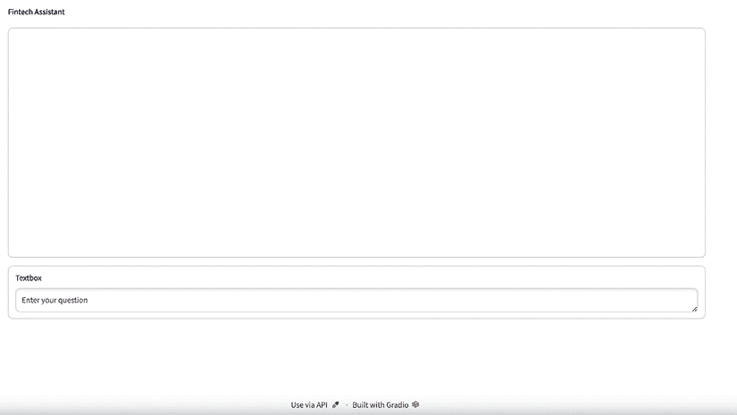

# 集成模式：实时意图分类

在前几章中，我们讨论了批量处理集成模式，我们专注于高效处理大量数据并生成用于下游系统的数据。在本章中，我们将将重点转向**实时集成模式**。

实时交互要求应用针对延迟进行优化，而不是高效处理大量批量请求。换句话说，我们需要确保输出尽可能快地生成，以提供优化的用户体验。这种模式最常见的用例是通过聊天或语音界面暴露的实时代理。

让我们考虑一个意图分类用例，这是聊天机器人常见的场景。在这种情况下，一个**人工智能**（**AI**）系统负责识别用户的意图，例如检查余额、安排预约或进行购买。根据识别到的意图，系统可以执行适当的任务或提供相关响应。

在今天的应用体验中，客户在与企业互动时期望无缝和个性化的体验。实现这一目标的一种方式是实施一个智能系统，该系统能够根据自然语言输入准确解释用户意图。这种能力在客户服务、电子商务和对话式 AI 应用中尤其有价值，在这些应用中，理解用户的意图对于提供相关和上下文相关的响应至关重要。

在本章中，我们将探讨一个实时意图分类用例，利用谷歌的**Gemini Pro**，*一种最先进的*生成式 AI 模型，构建一个能够准确地将用户输入分类到预定义意图的系统。

我们将从头到尾走一遍整个过程，从数据准备到部署以及与下游系统的集成，遵循前几章中讨论的集成框架。

在本章中，我们将涵盖以下内容：

+   用例定义

+   架构

+   入口点

+   提示预处理

+   推理

+   结果后处理

+   结果展示

+   完整代码

# 用例定义

让我们考虑一个场景，我们正在与一家希望改善其客户服务体验的电子商务公司合作。该公司通过各种渠道，如电子邮件、聊天和社交媒体，接收大量客户咨询。目前，这些咨询由客户服务代表团队手动处理，这可能耗时且容易出错。

通过将意图分类集成到客户参与流程中，公司可以优化其客户服务运营。这种高级自然语言处理技术自动将客户咨询分类到预定义的意图中，例如“订单状态”、“产品咨询”、“退货请求”或“一般反馈”。分类层作为客户服务互动的智能入口，使查询的分配更加高效和准确。

这种自动分类是可扩展客户服务基础设施的基础。一旦查询被分类，它就可以无缝地导向最合适的团队或代理，确保客户获得针对其特定需求的专家协助。对于高容量、简单的查询，系统甚至可以触发自动响应，提供对常见问题的即时解决方案。这不仅极大地提高了响应时间，而且通过提供快速、相关的帮助，增强了整体客户满意度。

此外，实施意图分类显著提高了客户服务代表的日常生活质量。

通过接收预先分类的查询，组织可以利用专家代理专注于他们的专业领域，减少在处理不同类型问题之间不断切换的认知负荷。这种专业化使代理能够提供更深入、高质量的支持，从而提高解决率和增加工作满意度。

在分析方面，还有一个额外的优势，因为从意图分类中收集的数据可以提供对客户需求和痛点的宝贵见解，使公司能够不断改进其产品、服务和支持策略，更好地满足客户期望。

在下一节中，我们将深入探讨一种方法，它将帮助您开始使用 GenAI 进行意图分类示例。

# 架构

要构建我们的意图分类系统，我们将利用基于**Google Cloud**（例如：[`cloud.google.com/architecture/serverless-functions-blueprint`](https://cloud.google.com/architecture/serverless-functions-blueprint)）的无服务器、事件驱动架构。这种方法符合云原生原则，并允许与其他云服务无缝集成。



图 7.1：意图分类示例架构图

架构包括以下关键组件：

+   **摄取层**：这一层负责接受来自各种渠道的用户输入，例如网页表单、聊天界面或 API 端点。我们将使用**Google Cloud Functions**作为我们系统的入口点，它可以由**Cloud Storage**、**Pub/Sub**或**Cloud Run**等服务的事件触发。

+   **AI 处理层**：在这一层中，我们将通过**Vertex AI**整合 Google 的 Gemini Pro。Vertex AI 提供了一个托管环境来部署和扩展机器学习模型，确保高可用性和性能。

+   **意图分类模型**：这是我们系统的核心组件，负责分析用户输入并确定相应的意图。我们将利用 Google Gemini Pro 的自然语言理解能力为我们构建意图分类模型。

+   **编排和路由**：根据分类的意图，我们需要将用户输入路由到适当的后端系统或服务。这可能涉及与**客户关系管理**（CRM）系统、知识库或其他企业应用的集成。我们将使用 Cloud Functions 或 Cloud Run 来编排此路由过程。

+   **监控和日志记录**：为确保我们系统的可靠性和性能，我们将实施强大的监控和日志记录机制。我们将利用如**云日志**、**云监控**和**云操作**等服务来了解我们系统的行为，并快速识别和解决任何问题。

通过采用这种架构，意图分类系统不仅可扩展，而且足够灵活，可以适应不同的工作负载和集成需求。我们能够实时处理大量客户咨询，并快速提供一致的反应，从而改善整体客户体验。

这种架构的无服务器特性带来了几个额外的优势。它允许根据需求自动扩展，确保我们能够在无需人工干预的情况下处理客户咨询的突然激增。这种弹性不仅提高了系统可靠性，还优化了成本，因为我们只为实际使用的资源付费。

这种事件驱动的设计促进了与其他系统和服务的轻松集成。随着我们的客户服务生态系统的发展，我们可以轻松地向意图分类系统中添加新的触发器或输出。

这可能包括集成新的通信渠道、连接到额外的后端系统或结合高级分析以深入了解客户行为和偏好。

在接下来的章节中，我们将深入了解我们架构的每个组件，探讨我们将使用的特定 Google Cloud 服务、实施的最佳实践以及优化性能和成本效益的策略。我们还将讨论一个具体的示例，以帮助您开始。

## 入口点

对于实时交互式应用，提示的入口点需要高度精简，考虑到简洁性和易用性。这些提示通常来自不可预测的上下文，因此界面需要在各种设备和使用场景中感觉自然。

在我们的用例中，入口点可能是一个网页表单、聊天界面或 API 端点，客户在此提交他们的咨询。这些输入将被发送到云函数，该函数作为我们系统的摄入层。

让我们从用户查询的示例开始：

```py
#In this case we will simulate the input from a chat interface
message = "I want to open an account" 
```

## 提示预处理

在实时系统中，提示预处理工作流程中的每一步都会向整体响应时间添加宝贵的延迟，通常根据您的应用程序的 SLA 以毫秒或微秒来衡量。高延迟体验可能会损害用户体验。因此，预处理应尽可能保持轻量级。

对于我们的意图分类用例，提示预处理可能涉及简单的文本规范化，例如删除标点符号、转换为小写或处理缩写。此外，我们可能应用一些基本的过滤以移除任何可能有害或不适当的内容，在将提示发送到模型之前。

让我们深入一个示例提示：

```py
#In this section we define the prompt, as the task is to perform intent 
#classification we will identify the intent by exposing
#the possible values to the LLM
prompt_template = """
You are a helpful assistant for an online financial services company that allows users to check their balances, invest in certificates of deposit (CDs), and perform other financial transactions.
Your task is to identify what your customers are trying to do and return a well formed JSON object.
1\. Carefully analyze the content of the message.
2\. Classify what the user is trying to do within these options:
   * New Account: The user is trying to sign up. Return {{"intent": "signup", "content":"null"}}
   * Change Password: The user needs to reset their password. Return {{"intent":"change_password", "content":"null"}}
   * Check Balance: The user needs to check their balance. Return {{"intent": "check_balance", "content":"null"}}
   * Invest in CD: The user wants to invest in a certificate of deposit. Return {{"intent": "invest_cd", "content": "Extract relevant information such as investment amount and term"}}
   * Withdraw Funds: The user wants to withdraw money. Return {{"intent": "withdraw_funds", "content": "Extract information like amount and withdrawal method"}}
   * Transfer Funds: The user wants to transfer money between accounts. Return {{"intent": "transfer_funds", "content": "Extract information like amount, source account, and destination account"}}
   * Account Information: The user wants to access or update their account information. Return {{"intent": "account_info", "content": "Identify the specific information the user needs"}}
   * Lost/Stolen Card: The user wants to report a lost or stolen card. Return {{"intent": "lost_card", "content": "null"}}
   * Support: The user needs help and is not sure what to do. Return {{"intent": "support", "content": "null"}}
   * Other: For other queries, politely decline to answer and clarify what you can help with.
3\. Only return the proper JSON result from your classification.
4\. Always think step by step.
User question: {query}
JSON:
""" 
```

之前的提示定义了意图分类任务的模板。提示提供了上下文，解释了助手正在帮助在线金融服务公司的用户执行各种操作，例如注册、检查余额、投资 CD、提取资金等。

此外，这个提示指示模型仔细分析用户的输入消息，并将意图分类到预定义的类别之一。对于每个意图类别，提示指定应返回的 JSON 对象，包括需要从用户的消息中提取的任何附加信息。

例如，如果用户的意图是投资 CD，助手应返回以下格式的 JSON 对象：

```py
{
   "intent": "invest_cd",
   "content": "Extract relevant information such as investment amount and term"
} 
```

这意味着虚拟助手不仅应将意图识别为`"invest_cd"`，还应从用户的消息中提取相关信息，如投资金额和期限，并将其包含在`"content"`字段中。

提示还提供了处理不属于任何预定义类别（即“其他”情况）的意图的说明。

通过提供这个详细的提示模板，系统可以有效地引导语言模型执行金融服务场景的意图分类任务，确保模型的响应结构化和格式正确。

## 推理

在推理阶段，我们将利用托管在 Vertex AI 上的 Google 的 Gemini Pro 模型。在由用户输入触发的云函数中，我们将调用托管 Gemini Pro 模型的 Vertex AI 端点，将预处理的输入作为提示传递。

Gemini Pro 将处理输入并返回预测的意图，利用其自然语言理解能力。由于我们使用的是现成的模型，因此底层基础设施和资源分配被抽象化，确保单个请求在遵守服务的性能和成本目标的同时高效处理：

```py
generation_config = {
   "max_output_tokens": 8192,
   "temperature": 0,
   "top_p": 0.95,
}
safety_settings = {
   generative_models.HarmCategory.HARM_CATEGORY_HATE_SPEECH: generative_models.HarmBlockThreshold.BLOCK_ONLY_HIGH,
   generative_models.HarmCategory.HARM_CATEGORY_DANGEROUS_CONTENT: generative_models.HarmBlockThreshold.BLOCK_ONLY_HIGH,
   generative_models.HarmCategory.HARM_CATEGORY_SEXUALLY_EXPLICIT: generative_models.HarmBlockThreshold.BLOCK_ONLY_HIGH,
   generative_models.HarmCategory.HARM_CATEGORY_HARASSMENT: generative_models.HarmBlockThreshold.BLOCK_ONLY_HIGH,
}
def generate(prompt):
 vertexai.init(project=PROJECT, location=LOCATION)
 model = GenerativeModel(MODEL)
 responses = model.generate_content(
     [prompt],
     generation_config=generation_config,
     safety_settings=safety_settings,
     stream=False,
 )
 return(responses)
result = generate(prompt_template.format(query=message)) 
```

## 结果后处理

对于我们的意图分类用例，后处理步骤可能涉及将预测的意图格式化为合适的响应格式，例如 JSON 或可读性强的字符串。此外，我们可能应用一些基本的过滤或排序机制，以确保最相关和有帮助的响应被优先考虑。

```py
### Sometimes model return markdown friendly content, in this case we will implement a function to filter this.
def extract_json(text):
 """
 Extracts the JSON portion from a string containing backticks.
 Args:
   text: The string containing JSON data within backticks.
 Returns:
   A dictionary representing the extracted JSON, or None if no valid JSON is found.
 """
 start_index = text.find("```json")

end_index = text.find("```py", start_index + 7)  # +7 to skip "```json"

if start_index != -1 and end_index != -1:

json_string = text[start_index + 7: end_index]  # 提取 JSON 字符串

else:

json_string = text

try:

json_data = json.loads(json_string)

return json_data

except json.JSONDecodeError:

return None

extract_json，该函数旨在处理语言模型输出中包含在反引号内包裹的 JSON 数据的情况：json```py. This is a common practice in Markdown-friendly environments, where backticks are used to delineate code blocks or structured data.
```

`extract_json` 函数接受一个字符串 text 作为输入，并尝试从反引号内提取 JSON 部分。以下是该函数的工作原理的分解：

1.  函数首先查找字符串 ```py`"```json"```py` in the input text using the `find` method. This is the marker that indicates the start of a JSON block.
2.  If the `start` marker is found, the function then looks for the closing `""` marker by searching for it from the end of the `json` marker (`start_index + 7`). If both the start and end markers are found, the function extracts the JSON string by slicing the input text between these markers. If no start or end markers are found, the function assumes that the entire input text is the JSON string.
3.  The function then attempts to parse the extracted JSON string using the `json.loads` method from the `json` module. If the parsing is successful, the function returns the resulting JSON data as a dictionary. If the parsing fails (for example, due to invalid JSON syntax), the function returns `None`. By incorporating this function into the post-processing stage, the system can handle cases where the language model’s output contains JSON data wrapped in backticks. This functionality can be particularly useful when working with Markdown-friendly environments or when integrating the intent classification system with other components that expect JSON-formatted data.
4.  The post-processing stage can then proceed to format the extracted JSON data into a suitable response format, apply filtering or ranking mechanisms, and render the final response for display to the user.

The `process_intent` function is designed to handle the JSON data returned by the intent classification model. It takes a dictionary intent as input, which is expected to have an “intent” key with a value representing the predicted intent category.

```

def process_intent(intent):

if intent["intent"] == "signup":

# 如果用户正在尝试注册，你可以

# 重定向到注册页面等。

return("注册流程")

elif intent["intent"] == "change_password":

# 如果用户正在考虑更改密码，

# 可以通过聊天机器人来完成，

# 或者重定向到密码更改页面。

return("更改密码")

elif intent["intent"] == "check_balance":

# 在这种情况下，你可以有一个函数

# 会查询数据库以获取

# 平衡（只要用户已登录或未登录）

return("检查账户余额")

elif intent["intent"] == "invest_cd":

# 对于投资意图，这可能将重定向

# 转到可以选择投资选项的页面。

return("投资 CD")

elif intent["intent"] == "withdraw_funds":

return("提取资金")

elif intent["intent"] == "transfer_funds":

return("转账")

elif intent["intent"] == "account_info":

return("账户信息")

elif intent["intent"] == "lost_card":

return("报告丢失的卡")

elif intent["intent"] == "support":

return("联系客服")

elif intent["intent"] == "other":

return("其他类型的意图")

else:

return("如果意图被分类为其他内容，你应该调查发生了什么。")

intent = process_intent(extract_json(result.text))

```py

The `process_intent` function checks the value of the `"intent"` key in the input dictionary. Depending on the intent category, the function performs a specific action or returns a corresponding message.

For example, if the intent is `"signup"`, the function returns the string `"Sign up process"`, which could be used to redirect the user to a sign-up page or initiate the sign-up process. Similarly, if the intent is `"change_password"`, the function returns `"Change password"`, which could trigger a password reset process or redirect the user to a password change page.

For intents like `"check_balance"`, `"invest_cd"`, `"withdraw_funds"`, `"transfer_funds"`, `"account_info"`, `"lost_card"`, and `"support"`, the function returns corresponding messages that could be used to initiate the relevant processes or provide instructions to the user.

If the intent is `"other"`, the function returns `"Other kind of intent"`, indicating that the user’s query did not match any of the predefined intent categories.

If the intent does not match any of the cases handled by the function, it returns a message suggesting that further investigation is needed to understand the intent.

Finally, the last line of code `intent = process_intent(extract_json(result.text))` combines the `extract_json` and `process_intent` functions. It first extracts the JSON data from the `result.text` string using `extract_json`. Then, it passes the extracted JSON data to the `process_intent` function, which processes the intent and returns an appropriate message or action.

```

process_intent 函数可以根据应用程序的具体要求扩展或修改，以包含额外的逻辑或操作。

```py

## Result presentation

The result presentation stage for real-time applications demands instantaneous updates, often server-rendered or via data-binding frameworks.

In our use case, the formatted response containing the predicted intent can be sent back to the customer through the channel from which the inquiry originated (for example, web form, chat interface, or API response). This response can then be used to route the inquiry to the appropriate downstream system or provide an automated response for common intents.

In this example, we will use a Gradio interface to render the replies in a visually appealing UI. Gradio ([`www.gradio.app/`](https://www.gradio.app/)) is an open-source Python package that allows you to quickly create easy-to-use, customizable UI components for your ML model, any API, or even an arbitrary Python function using a few lines of code.

You can find more information about Gradio using the following links:

Docs: [`www.gradio.app/docs`](https://www.gradio.app/docs%0D%0A)

GitHub: [`github.com/gradio-app/gradio`](https://github.com/gradio-app/gradio)

The following code provides an example that creates a Gradio interface:

```

import gradio as gr

def chat(message, history):

response = generate(prompt_template.format(query=message))

intent_action = process_intent(extract_json(response.text))

history.append((message, intent_action))

return "", history

with gr.Blocks() as demo:

gr.Markdown("Fintech Assistant")

chatbot = gr.Chatbot(show_label=False)

message = gr.Textbox(placeholder="Enter your question")

message.submit(chat, [message, chatbot],[message, chatbot]  )

demo.launch(debug=True)

```

之前的代码展示了使用 Gradio 库的意图分类系统的结果展示阶段。

在我们的示例中，`chat(message, history)`函数是聊天机器人界面的核心。它接受两个参数：`message`（用户的输入消息）和`history`（包含先前消息和响应的列表）。以下是该函数的功能：

1.  它调用`generate`函数（在提供的代码中未显示）从意图分类模型获取响应，将用户的消息作为提示模板的一部分传递。然后使用`extract_json`函数（未显示）处理模型的响应以提取预测的意图数据。

1.  提取的意图数据传递给`process_intent`函数（此处未显示），以根据预测的意图确定适当的行为或响应。用户的消息和生成的响应被追加到历史列表中，以跟踪对话。

1.  函数返回一个空字符串作为响应消息和更新后的历史记录列表。

1.  然后代码使用`gr.Blocks`上下文管理器创建 Gradio 界面。在上下文中，它执行以下操作：

    +   使用 gr.Markdown 组件显示标题。

    +   创建一个`gr.Chatbot`组件来显示对话历史。

    +   为用户输入消息创建一个`gr.Textbox`组件。

    +   将聊天函数绑定到`Textbox`组件的`submit`事件。当用户提交他们的消息时，聊天函数被调用，并带有用户的消息和当前历史记录作为参数。

    +   分别更新`Textbox`和`Chatbot`组件的新消息和更新后的历史记录。

    +   使用`demo.launch(debug=True)`以调试模式启动 Gradio 界面。

结果是一个交互式的聊天机器人界面，用户可以像*图 7.2*中所示那样输入他们的消息，系统将处理消息，预测意图，并根据`process_intent`函数提供适当的响应。对话历史在`Chatbot`组件中显示，使用户能够跟踪对话流程。



图 7.2：示例 Gradio 界面

## 日志记录和监控

实时系统需要对每个请求的指标进行紧密的监控，例如延迟、错误和资源使用。

在我们的架构中，我们将利用 Cloud Logging ([`cloud.google.com/logging/docs/overview`](https://cloud.google.com/logging/docs/overview)) 和 Cloud Monitoring ([`cloud.google.com/monitoring/docs/monitoring-overview`](https://cloud.google.com/monitoring/docs/monitoring-overview)) 等服务来了解系统的行为，并快速识别和解决任何问题。我们可以监控诸如请求延迟、错误率和资源利用率等指标，并为异常或性能下降设置警报。

通过遵循这种集成模式和利用 Google 的 Gemini Pro 的力量，企业可以解锁生成式 AI 的潜力，构建能够准确分类用户意图、提升客户体验和简化运营的智能系统。

请参阅本章的 GitHub 目录，以获取上述所有组件如何组合在一起的完整代码示例。

# 摘要

在本章中，我们讨论了使用 Google 的 Gemini Pro 生成式 AI 模型构建实时意图分类系统的集成模式。我们首先介绍了实时集成模式的概念，这种模式优先考虑低延迟，而不是效率或数量，与批量处理集成模式形成对比。

我们开发的用例是一家希望通过自动将客户咨询分类到预定义意图（如订单状态、产品咨询、退货请求或一般反馈）来改善其客户服务体验的电子商务公司。这种分类可以用于将咨询路由到适当的团队或为常见问题提供自动响应。

提出的架构是建立在 Google Cloud 上的无服务器、事件驱动架构，包括数据摄取层（Cloud Functions）、AI 处理层（Vertex AI 与 Gemini Pro）、意图分类模型、编排和路由（Cloud Functions 或 Cloud Run）以及监控和日志记录（Cloud Logging、Cloud Monitoring 和 Cloud Operations）。

在下一章中，我们将深入探讨另一个非常重要的实时用例，一个 **检索增强生成**（**RAG**）示例，我们将利用生成式 AI 基于我们提供的文档来回答问题。

# 加入我们的 Discord 社区

加入我们社区的 Discord 空间，与作者和其他读者进行讨论：

`packt.link/genpat`


