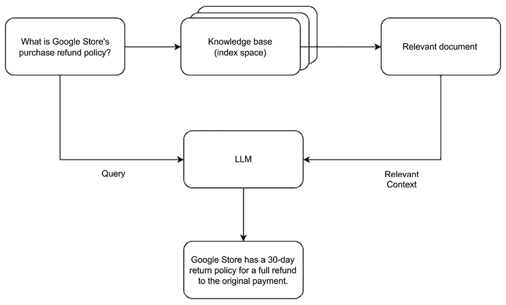
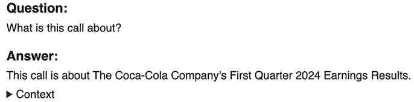

# 第八章：集成模式：实时检索增强生成

在本章中，我们将探讨另一种集成模式，该模式结合了**检索增强生成**（**RAG**）和生成式 AI 模型的力量，以构建一个能够根据 PDF 文件内容回答问题的聊天机器人。这种方法结合了检索系统和生成模型的优势，使我们能够利用现有的知识源，同时生成相关和上下文化的响应。

RAG 方法的一个关键优势是其防止幻觉并提高生成响应上下文的能力。基于广泛数据训练的生成式 AI 模型有时可能会产生事实错误或过时的响应，因为它们的训练数据仅限于某个时间点或它们在推理时可能缺乏适当的上下文。通过将模型的生成过程建立在从文档语料库检索到的相关信息之上，RAG 方法减轻了幻觉的风险，并确保响应准确且上下文相关。

例如，术语*退款*在不同的上下文中可能有不同的含义和影响。在零售银行业的上下文中，退款可能指客户请求退还费用或收费，而在税收的上下文中，退款可能指政府提供的税收退款。通过从文档语料库中检索相关上下文，RAG 驱动的聊天机器人可以生成准确反映*退款*意图含义的响应，基于用户查询的具体上下文。

下图展示了简单的 RAG 流程：



图 8.1：简单的 RAG 流程

继续我们关于金融服务公司的例子，这些公司经常处理大量的文件，包括法律合同、监管文件、产品披露以及内部政策和程序。这些文档存储库可能包含数万甚至数十万页，这使得员工和客户在需要时难以快速找到相关信息。

通过实施基于 RAG 的聊天机器人系统，金融服务公司可以为员工、客户和其他利益相关者提供一个用户友好的界面，让他们能够提出自然语言问题并接收来自大量文档的简洁、相关的答案。RAG 方法允许系统从文档语料库中高效地检索相关信息，然后使用强大的生成式 AI 模型生成上下文化的响应。

例如，客户服务代表可以向聊天机器人询问关于贷款协议中特定条款的问题，系统将检索文档语料库中的相关部分，并生成针对用户查询的简洁解释。同样，投资顾问可以询问与金融产品相关的特定法规或指南，聊天机器人将提供相关文档中的必要信息。

通过利用 RAG 方法，金融服务公司可以极大地提高其文档存储库的可访问性和可用性，实现更快、更准确的信息检索，并减少手动搜索数千页文档所需的时间和精力。

在本章中，我们将介绍以下内容：

+   用例定义（针对金融服务公司）

+   架构（基于 RAG 的聊天机器人系统概述）：

    +   数据摄取层

    +   文档语料库管理

    +   AI 处理层

    +   监控和日志记录

+   入口点（处理各种输入模式的设计）

+   提示预处理和向量数据库集成

+   使用 Vertex AI 的 Gemini 1.5 Flash 模型进行推理过程

+   使用 Markdown 进行结果后处理和展示

+   演示实现（使用 Gradio）

+   RAG 流程的完整代码示例

# 用例定义

让我们考虑一个场景，我们正在与一家处理大量法律合同、监管文件、产品披露、内部政策和程序的大型金融机构合作。这些文件单独可能长达数十页甚至数百页，使得员工、客户和其他利益相关者在需要时难以快速找到相关信息。这些文件在信息报告的方式上也没有一致的格式，这使得像正则表达式语句或普通业务规则这样的非 AI 驱动的文本提取解决方案无效。

该机构希望实施一个聊天机器人系统，可以为用户提供友好的界面，让他们提出自然语言问题，并接收来自组织文档语料库的简洁、相关答案。该系统应利用 RAG 的力量，确保生成的回答准确、上下文相关，并基于文档语料库中的相关信息。

# 建筑学

为了构建我们的基于 RAG 的聊天机器人系统，我们将利用建立在 Google Cloud 之上的无服务器、事件驱动的架构。这种方法与我们之前示例中使用的云原生原则相一致，并允许与其他云服务无缝集成。您可以在以下示例架构中深入了解 Google Cloud 的示例：[`cloud.google.com/architecture/rag-capable-gen-ai-app-using-vertex-ai`](https://cloud.google.com/architecture/rag-capable-gen-ai-app-using-vertex-ai)。

在本例中，架构包括以下关键组件：

+   **摄取层**：这一层负责接受来自各种渠道的用户查询，例如网页表单、聊天界面或 API 端点。我们将使用 Google Cloud Functions 作为我们系统的入口点，它可以由云存储、Pub/Sub 或 Cloud Run 等服务的事件触发。

+   **文档语料库管理**：在这一层，我们将存储代表文档内容的嵌入表示。在这种情况下，我们可以使用从专门构建的向量数据库（如 Chroma DB、Pinecone 或 Weaviate）到知名行业标准（如 Elastic、MongoDB、Redis）的各种解决方案，甚至包括以其他能力著称的数据库，如 PostgreSQL、SingleStore、Google AlloyDB 或 Google BigQuery。

+   **AI 处理层**：在这一层，我们将通过 Vertex AI 集成 Google Gemini。一旦从向量数据库检索到结果，它们将作为上下文与提示一起暴露给 Google Gemini。这个过程可以通过云函数处理。

+   **监控和日志记录**：为确保系统的可靠性和性能，您应实施强大的监控和日志记录机制。我们将利用云日志、云监控和云操作等服务来了解系统行为，并快速识别和解决任何问题。

# 入口点

对于基于 RAG 的聊天机器人系统，入口点被设计成用户友好，允许用户通过各种接口提交他们的自然语言查询，例如网页表单、聊天应用或 API 端点。然而，入口点不应仅限于接受基于文本的输入；它还应处理不同的模态，如音频文件或图像，具体取决于底层语言模型的能力。

对于像 Google Gemini（支持多模态输入）这样的模型，入口点可以直接接受和处理文本、音频、图像，甚至视频。这种多功能性使用户能够以更自然和直观的方式与聊天机器人系统交互，与人类在现实世界场景中的沟通方式相一致。

在语言模型不原生支持多模态输入的情况下，入口点仍然可以通过预处理数据和提取文本内容来适应各种输入模态。这种方法确保了聊天机器人系统易于访问和用户友好，同时利用底层语言模型的能力，满足多样化的输入格式。

对于文本输入，入口点可以直接将查询传递给 RAG 管道的后续阶段。然而，当处理音频或图像输入时，入口点需要执行额外的处理来从这些模态中提取文本内容。

对于音频输入，入口点可以利用语音识别技术，如 Google Chirp、Amazon Transcribe、OpenAI Whisper 或 CMU Sphinx 等开源库，将音频数据转录成文本格式。这个过程涉及将音频信号转换为语言模型可以理解的单词或短语序列。

同样，对于图像输入，入口点可以采用**光学字符识别**（**OCR**）技术从提供的图像中提取文本。这可以通过集成 Google Cloud Vision API、Amazon Textract 或 Tesseract OCR 等开源工具来实现。这些技术利用计算机视觉和机器学习算法来准确识别和从图像中提取文本内容，使聊天机器人系统能够理解和处理以视觉形式呈现的信息。

在这个例子中，我们将利用文本；Python 代码将如下所示：

```py
#In this case we will simulate the input from a chat interface
question = "What is this call about?" 
```

无论输入类型如何，入口点都应该设计成能够处理各种场景和输入格式。它可能需要执行额外的预处理步骤，例如噪声去除、格式转换或数据清理，以确保输入数据适合 RAG 管道后续阶段的格式。此外，运行原始请求通过严格的安全监控管道也是最佳实践，以防止数据泄露或模型中毒，如提示摄入。

以下网站提出了关于多模态场景中提示注入带来的挑战的非常有趣的观点：[`protectai.com/blog/hiding-in-plain-sight-prompt`](https://protectai.com/blog/hiding-in-plain-sight-prompt)。

## 提示预处理

对于我们的例子，我们需要实时构建提示及其必要的上下文和指令。在我们 RAG 管道的这个步骤中，我们将利用向量数据库进行高效的向量相似度搜索。向量数据库是专门的数据存储，用于存储和检索高维向量，能够实现快速和准确的相似度搜索。尽管有众多向量数据库提供商，但我们将在这个特定例子中使用 Chroma DB。

在 RAG 管道中的检索过程相对简单。首先，我们使用预训练的语言模型或嵌入技术从用户的查询中生成嵌入。这些嵌入是查询的数值表示，能够捕捉其语义意义。接下来，我们使用生成的查询嵌入在向量数据库上执行相似度搜索。向量数据库将返回与查询嵌入最相似的向量，以及它们对应的文本信息或上下文。这些向量与之前摄取的文本段落相关联。

可以应用不同的过滤策略来进一步细化搜索结果。具体参数和技术可能因所使用的向量数据库提供商而异。例如，一些向量数据库提供相似度分数，该分数衡量查询嵌入与检索向量之间的接近程度。可以利用此分数来识别和过滤掉低于一定相似度阈值的向量。

另一种常见的过滤策略是限制从向量数据库中获取的结果数量。这种方法在存在对可以传递给语言模型的标记最大数量的限制时特别有用，无论是由于模型施加的标记限制还是为了成本优化目的。通过限制结果数量，我们可以控制提供给语言模型的上下文信息量，确保高效处理和成本效益的运行。

一旦结果被过滤，并获取到相关的文本信息，它就被用来构建将传递给语言模型的提示。在这个例子中，我们使用以下提示模板：

```py
prompt_template = """
You are a helpful assistant for an online financial services company that allows users to check their balances, invest in certificates of deposit (CDs), and perform other financial transactions.
Your task is to answer questions from your customers, in order to do so follow these rules:
1\. Carefully analyze the question you received.
2\. Carefully analyze the context provided.
3\. Answer the question using ONLY the information provided in the context, NEVER make up information
4\. Always think step by step.
{context}
User question: {query}
Answer:
""" 
```

在我们的示例中，我们提交给 LLM 的提示将如下所示：

```py
You are a helpful assistant for an online financial services company that allows users to check their balances, invest in certificates of deposit (CDs), and perform other financial transactions.
Your task is to answer questions from your customers, in order to do so follow these rules:
1\. Carefully analyze the question you received.
2\. Carefully analyze the context provided.
3\. Answer the question using ONLY the information provided in the context, NEVER make up information
4\. Always think step by step.
<context>
---This information is contained in a document called coca_cola_earnings_call_2023.pdf 
 1-877-FACTSET www.callstreet.com
18 Copyright © 2001-2024 FactSet CallStreet, LLC
The Coca-Cola Co. (KO) Q1 2024 Earnings Call
Corrected Transcript 30-Apr-2024
Operator: Ladies and gentlemen, this concludes today's conference call. Thank you for participating. You may now disconnect.
Disclaimer The information herein is based on sources we believe to be reliable but is not guaranteed by us and does not purport to be a complete or error-free statement or summary of the available data. As such, we do not warrant, endorse or guarantee the completeness, accuracy, integrity, or timeliness of the information. You must evaluate, and bear all risks associated with, the use of any information provided hereunder, including any reliance on the accuracy, completeness, safety or usefulness of such information. This information is not intended to be used as the prim ary basis of investment decisions. It should not be construed as advice designed to meet the particular investment needs of any investor. This report is published solely for information purposes, and is not to be construed as financial or other advice or as an offer to sell or the solicitation of an offer to buy any security in any state where such an offer or solicitation would be illegal. Any information expressed herein on this date is subject to change without notice. Any opinions or assertions contained in this information do not represent the opinions or beliefs of FactSet CallStreet, LLC. FactSet CallStreet, LLC, or one or more of its employees, including the writer of this report, may have a position in any of the securities discussed herein.
---
---This information is contained in a document called coca_cola_earnings_call_2023.pdf 
 All participants will be on listen-only mode until the formal question-and-answer portion of the call. I would like to remind everyone that the purpose of this conference is to talk with investors and, therefore, questions from the media will not be addressed. Media participants should contact Coca-Cola's Media Relations department if they have any questions.
. . . 
---
</context>
User question: What is this call about?
Answer: 
```

# 推理

```py
generate() function is responsible for sending the prompt to the Gemini 1.5 Flash model and obtaining the generated response:
```

```py
#This is the section where we submit the full prompt and 
#context to the LLM
result = generate(prompt) 
```

`generate()`函数封装了生成过程所需的配置和设置。它包括两个主要组件：`generation_config`和`safety_settings`。

`generation_config`字典指定了在生成过程中控制语言模型行为的参数。在这个例子中，提供了以下设置：

```py
generation_config = {
   "max_output_tokens": 8192,
   "temperature": 0,
   "top_p": 0.95,
} 
```

来自 Google Gemini 的文档：

+   `max_output_tokens`: 响应中可以生成的最大标记数。一个标记大约是四个字符。100 个标记相当于大约 60-80 个单词。

+   `temperature`: 温度用于在响应生成过程中进行采样，这发生在应用`top_p`和`top_k`时。`temperature`控制了标记选择的随机程度。较低的温度值适用于需要较少开放或创造性的响应的提示，而较高的温度值可能导致更多样化或创造性的结果。温度为 0 表示始终选择概率最高的标记。在这种情况下，对于给定的提示，响应大多是确定性的，但仍可能存在少量变化。

温度为 0 表示模型将根据其训练数据选择最可能的标记，而较高的值会在输出中引入更多的随机性和多样性。

+   `top_p`: 此参数改变模型选择输出标记的方式。标记从最有可能到最不可能依次选择，直到这些标记的概率总和等于 top-p 值。例如，如果标记 A、B 和 C 分别具有 0.3、0.2 和 0.1 的概率，且 top-p 值为 0.5，那么模型将通过温度选择 A 或 B 作为下一个标记，并将 C 排除作为候选。

在这种情况下，它被设置为 0.95，这意味着在生成过程中只考虑概率最高的前 95%的标记。

除了上述内容之外，`safety_settings`字典指定了危害类别及其对应的阈值，用于从生成的输出中过滤可能有害或不适当的内容。在此示例中，提供了以下设置：

```py
safety_settings = {
   generative_models.HarmCategory.HARM_CATEGORY_HATE_SPEECH: generative_models.HarmBlockThreshold.BLOCK_ONLY_HIGH,
   generative_models.HarmCategory.HARM_CATEGORY_DANGEROUS_CONTENT: generative_models.HarmBlockThreshold.BLOCK_ONLY_HIGH,
   generative_models.HarmCategory.HARM_CATEGORY_SEXUALLY_EXPLICIT: generative_models.HarmBlockThreshold.BLOCK_ONLY_HIGH,
   generative_models.HarmCategory.HARM_CATEGORY_HARASSMENT: generative_models.HarmBlockThreshold.BLOCK_ONLY_HIGH,
} 
```

这些设置指示 Gemini 1.5 Flash 模型仅阻止与仇恨言论、危险内容、色情内容和骚扰高度相关的有害内容。任何低于这些类别“高”危害阈值的任何内容都将允许在生成的输出中出现。

`generate()`函数创建了一个`GenerativeModel`类的实例，传递了`MODEL`参数；在此示例中，为 Gemini 1.5 Flash。然后它调用模型实例上的`generate_content()`方法，提供提示、生成配置和安全设置。`stream=False`参数表示生成应在非流模式下进行，这意味着整个响应将一次性生成并返回：

```py
def generate(prompt):
 model = GenerativeModel(MODEL)
 responses = model.generate_content(
     [prompt],
     generation_config=generation_config,
     safety_settings=safety_settings,
     stream=False,
 )
 return(responses) 
```

生成的响应存储在`responses`变量中，然后通过`generate()`函数返回。

通过将格式化的提示提交给 Vertex AI 的 Gemini 1.5 Flash API 端点，利用提供的生成配置和安全设置，此 RAG 管道可以获取一个针对用户查询的上下文化和相关响应，同时遵守指定的参数和内容过滤规则。

# 结果后处理

在收到语言模型的响应后，通常希望以更结构化和视觉上吸引人的格式展示输出。Markdown 是一种轻量级标记语言，允许你添加格式化元素，如标题、列表、代码块等。在此示例中，我们使用 Markdown 格式化来增强问题、答案和上下文的展示：

```py
#In this section you can format the answer for example with markdown
formatted_result = f"###Question:\n{question}\n\n###Answer:\n{result.text}\n\n<details><summary>Context</summary>{context}</details>" 
```

此格式化组件的分解如下：

+   `"###问题:\n{question}"`

此部分为`问题`部分添加了一个 3 级 Markdown 标题（`###`），随后是新的一行上用户的原始查询（`({question}`）。

+   `"\n\n###答案:\n{result.text}"`

在该部分开头添加一个空行（`\n\n`）之后，此部分为`答案`部分创建了一个新的 3 级 Markdown 标题，随后是新的一行上语言模型生成的响应（`{result.text}`）。

+   `"\n\n<details><summary>上下文</summary>{context}</details>"`

此部分利用 Markdown `<details>` 和 `<summary>` 标签创建一个可折叠的显示从向量数据库检索到的上下文信息的部分。`<summary>上下文</summary>` 文本作为可折叠部分的标签，实际上下文文本（`{context}`）被包含在 `<details>` 标签内。

## 结果展示

`IPython.display`模块中的`Markdown`类是一个实用工具，允许你在 Colab 笔记本或其他 IPython 环境中显示格式化的 Markdown 内容。通过将`formatted_result`字符串传递给 Markdown 构造函数，你创建了一个 Markdown 对象，该对象可以通过`display`函数进行渲染：

```py
display(Markdown(formatted_result)) 
```

当你调用`display()`时，笔记本将渲染`formatted_result`字符串中包含的 Markdown 格式化内容。这允许你在笔记本环境中利用 Markdown 的丰富格式化功能。

以下是我们演示的 Markdown 格式化输出示例：



图 8.2：Google Colab 笔记本中格式化结果截图

通过使用`Markdown`类和`display`函数，你可以在 Google Colab 笔记本环境中利用 Markdown 的格式化功能。这包括标题、粗体和斜体文本、列表、代码块、链接等功能。

渲染的输出将在笔记本单元格中显示，提供对问题、答案和上下文信息的视觉吸引力和良好结构化的表示。这可以极大地提高聊天机器人响应的可读性和可用性，使用户或开发者更容易理解和解释结果。

此外，在`context`部分使用的 `<details>` 和 `<summary>` 标签创建了一个可折叠部分，允许用户切换上下文信息的可见性。这在处理大量上下文数据时尤其有用，因为它可以防止主输出混乱，同时仍然提供轻松访问相关信息。

在下一节中，我们将通过用例演示深入探讨所有这些组件是如何协同工作的。

# 用例演示

以下是用 Gradio 构建演示的代码；在这种情况下，我们将使用一个额外的函数来执行 RAG 管道。当你运行此代码时，默认网络浏览器中会打开一个 Gradio 界面，显示三个主要部分：

+   **金融科技助手**标题

+   聊天机器人区域

+   文本输入框

用户可以在输入框中输入问题并提交。聊天功能将被调用，它将使用`answer_question`函数从向量数据库中检索相关上下文，使用 RAG 管道生成答案，并更新聊天机器人界面，显示用户的问题和生成的响应。

Gradio 接口为用户提供了一种用户友好的方式来与 RAG 管道系统交互，使其更容易测试和展示其功能。此外，Gradio 还提供了各种自定义选项和功能，例如支持不同的输入和输出组件、样式和部署选项。我们首先安装 Gradio：

```py
#In this case we will use a Gradio interface to interact 
#with the system
#Install Gradio
!pip install --upgrade gradio 
```

接下来，我们定义两个辅助函数，这些函数基于之前解释的 `generate()` 函数：

```py
import gradio as gr
def answer_question(query, db, number_of_results):
 context = get_context(query, db, number_of_results)
 answer = generate(prompt_template.format(query=query, context=context))
 return(answer.text)
def chat(message, history):
   response = answer_question(message,db, MAX_RESULTS)
   history.append((message, response))
   return "", history 
```

`answer_question(...)` 函数接受三个参数：

+   `query`: 用户的提问

+   `db`: 向量数据库

+   `number_of_results`: 从数据库中检索的最大上下文结果数量

然后调用 `get_context` 函数（在提供的代码中未显示）以检索相关的上下文信息——基于用户的查询和指定的结果数量，从向量数据库中获取。检索到的上下文随后在 `prompt_template` 字符串中格式化，并传递给 `generate` 函数——如前几节所述——以获取答案。

函数执行结束时，生成的答案作为字符串返回。

`chat(...)` 函数接受两个参数：

+   `message`: 用户的提问

+   `history`: 表示对话历史的一个列表

然后调用 `answer_question()` 函数，传入用户的问题、向量数据库（`db`）和最大结果数量（`MAX_RESULTS`）。

生成的响应附加到历史列表中，包括用户的问题。函数返回一个空字符串和更新后的历史列表，该列表将用于更新聊天机器人界面。

## Gradio 应用程序

定义了辅助函数后，我们现在可以创建 Gradio 接口：

```py
with gr.Blocks() as demo:
 gr.Markdown("Fintech Assistant")
 chatbot = gr.Chatbot(show_label=False)
 message = gr.Textbox(placeholder="Enter your question")
 message.submit(chat, [message, chatbot],[message, chatbot]  )
demo.launch(debug=True) 
```

这段代码中发生的事情如下：

+   `with gr.Blocks() as demo` 创建一个名为 `demo` 的 Gradio 接口块。

+   `gr.Markdown(...)` 在聊天机器人界面中显示一个 Markdown 格式的标题。

+   `gr.Chatbot(...)` 创建一个 Gradio 聊天机器人组件，该组件将显示对话历史。

+   `gr.Textbox(...)` 创建一个文本输入框，用户可以在其中输入问题。

+   `message.submit(...)` 设置一个事件处理器，当用户提交问题时会触发。它调用 chat 函数，传入用户输入（消息）和聊天机器人实例，并使用返回的值更新消息和聊天机器人组件。

+   `demo.launch(...)` 以调试模式启动 Gradio 接口，允许您与聊天机器人交互。

请参阅本章的 GitHub 目录，以获取演示上述所有部分如何组合在一起的完整代码。

# 摘要

在本章中，你探索了一种集成模式，它结合了 RAG 和生成 AI 模型，以构建一个能够根据文档语料库回答问题的聊天机器人。你已经了解到 RAG 利用了检索系统和生成模型的优势，使系统能够从现有的知识源中检索相关上下文并生成上下文响应，防止幻觉并确保准确性。

我们提出了一种基于谷歌云的无服务器、事件驱动的架构。它包括一个用于接受用户查询的摄取层，一个用于存储嵌入的文档语料库管理层，一个与 Vertex AI 上的谷歌 Gemini 集成的 AI 处理层，以及监控和日志组件。入口点处理各种输入模式，如文本、音频和图像，并根据需要预处理它们。

你已经了解到 RAG 管道的核心涉及从用户查询生成嵌入，在向量数据库上执行向量相似性搜索（在这个例子中，我们使用了 Chroma DB），检索相关上下文，将其格式化为带有指令的提示，并将其提交给 Vertex AI 上的 Gemini 模型。生成的响应可以后处理，用 Markdown 格式化，并使用 Gradio 等工具在用户友好的界面中展示。

现在，你已经获得了关于实现强大的基于 RAG 的聊天机器人系统的宝贵见解。你已经学会了如何结合检索和生成技术，以提供上下文丰富、无幻觉的响应，利用向量数据库通过内容嵌入进行语义搜索。本章为你提供了改进检索结果和通过提示调整定制用户体验的策略。这些技能将使你能够增强你组织提供准确和上下文化响应的能力，有效地利用现有的文档存储库和生成 AI 的力量。

# 加入我们的 Discord 社区

加入我们社区的 Discord 空间，与作者和其他读者进行讨论：

`packt.link/genpat`


