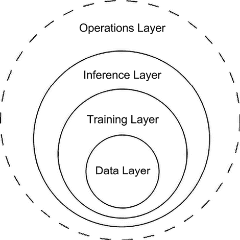

# 第九章：操作化生成式 AI 集成模式

在前面的章节中，我们探讨了各种利用**生成式 AI**（**GenAI**）模型（如 Vertex AI 上的 Google Gemini）的集成模式。我们讨论了根据目标业务用例开发生产级企业架构。在本章中，我们将深入讨论在将您的生成式 AI 集成作为生产级应用操作时需要考虑的最佳实践。随着我们从概念设计过渡到实际应用，可扩展性、可靠性和可维护性等操作挑战将浮出水面。简而言之，在本章中，我们将涵盖以下主题：

+   操作化生成式 AI 集成模式的介绍

+   适用于生成式 AI 操作的四层框架

+   数据层：

    +   数据质量和预处理

    +   数据安全和加密

    +   数据治理和版本控制

    +   监管合规性（例如，GDPR 或 HIPAA）

    +   伦理考量与偏差缓解

+   训练层：

    +   模型适应策略（少样本学习、微调和完整训练）

    +   模型治理和政策制定

    +   性能指标和监控

    +   偏差检测和缓解

    +   **可解释人工智能**（**XAI**）技术

+   推理层：

    +   可扩展性和性能优化

    +   安全性和访问控制

    +   模型部署策略（例如，金丝雀和蓝绿部署）

    +   边缘和分布式推理

+   运营层：

    +   **持续集成和持续部署**（**CI/CD**）用于生成式 AI

    +   MLOps 最佳实践

    +   监控和可观察性：

        +   使用“黄金提示”进行评估和监控

        +   警报系统

        +   分布式跟踪

        +   完整的日志记录实践

        +   成本优化策略

+   真实世界的例子：AI 驱动的语言翻译服务

+   在所有四层中实施

+   在示例背景下每个层的具体考量

# 操作化框架

在生成式 AI 快速发展的领域中，拥有一个结构化的方法来操作您新创建的应用至关重要。我们将探讨的操作框架由四个相互关联的层组成：**数据**、**训练**、**推理**和**运营**。这些层共同为在应用中有效利用生成式 AI 模型潜力提供了一个全面的蓝图。在以下列表中，我们将简要介绍这四个相互关联的层：

1.  **数据层**：任何成功的生成式 AI 应用的基础在于数据的质量和数量。这一层包括数据速度、整理、提示和训练数据预处理以及整体数据管理。

从训练的角度来看，确保数据的相关性、多样性和对目标领域的代表性至关重要。蒸馏和过滤等技术对于提高训练数据质量起着至关重要的作用。从推理的角度来看，正如前几章所述，了解你的数据速度将帮助你定义最适合你的数据的应用模式：批量处理还是实时处理。

1.  **训练层**：一旦数据准备就绪，训练层就专注于模型训练或微调的复杂过程。这一层包括选择合适的训练架构、超参数调整，并利用迁移学习、少样本学习或自监督学习等前沿训练技术。有效管理资源，包括利用分布式训练和硬件加速，对于优化训练或微调过程至关重要。

1.  **推理层**：在模型训练或微调完成后，推理层开始发挥作用。这一层包括在生产环境中部署和提供 GenAI 模型。可扩展性、延迟和资源优化是关键考虑因素。可以采用高级技术，如模型量化、剪枝和蒸馏，以优化模型性能和内存占用，确保大规模高效推理。

1.  **操作层**：操作层专注于对部署的通用人工智能（GenAI）应用的持续监控、维护和改进。这一层包括模型监控、性能跟踪和模型重新训练流程等任务。强大的日志记录和事件管理流程对于确保应用程序的可靠性和弹性至关重要。此外，这一层还处理诸如模型治理、伦理考虑和法规遵从等关键方面。

通过理解和有效实施这个操作化框架的每一层，组织可以释放通用人工智能应用的全部潜力，推动创新并交付卓越的用户体验。在这些层次之间实现无缝集成和协作是实现成功和可扩展的通用人工智能应用的关键。

这四个层次相互依存。要对模型进行推理，你必须使用精心挑选的数据对其进行训练或微调。下方的*图 9.1*突出了这些层次之间的关系。

注意，操作层跨越所有层次，为你提供了一个强大的框架来部署企业级应用：

图 9.1：四个生产化层次之间的相互依赖关系

在以下章节中，我们将深入探讨这个生产化框架的四个层次中的每一个。让我们从数据层开始。

# 数据层

数据层是构建您的通用人工智能系统的基石。这不仅仅是拥有数据；这是关于有效管理数据，以确保信息的质量、安全和道德使用。强大的数据管理流程是不可或缺的。您的通用人工智能系统的好坏取决于它们所交互的数据。例如，如果没有足够的信息背景，**大型语言模型**（**LLMs**）可能会产生幻觉，过多的噪声可能导致模型在中间丢失信息，正如文档《迷失在中间：语言模型如何使用长上下文》中所述（[`arxiv.org/abs/2307.03172`](https://arxiv.org/abs/2307.03172)）。因此，您需要做出有意识的努力来构建和扩展您的数据管道（RAG 和微调），以提供正确级别的细节和内容，以增强您的通用人工智能模型的能力。

我们将概述在准备您的数据时需要考虑的高级组件：

+   **数据质量**：实施严格的程序来清理、验证和预处理您的数据。这包括处理缺失值、异常值、不一致性和潜在的偏见。

+   **数据安全**：保护您的数据免受未经授权的访问和滥用。加密（静态和传输中）、访问控制和定期安全审计是至关重要的。请记住，您的训练数据通常包含需要最高级别保护的秘密信息。

+   **数据治理**：跟踪您的数据集、模型以及用于生成的提示的变化。版本控制让您能够重现过去的结果，追踪系统的发展，并更有效地解决问题。在处理合规性和审计时，这一点尤为重要。

+   **合规性**：了解与您的行业和您处理的数据类型相关的法律环境。例如，在**通用数据保护条例**（**GDPR**）的情况下，如果您处理的是欧盟公民的数据，您必须遵守关于数据收集、处理和存储的严格规则；或者在医疗保健领域的**健康保险可携带性和问责法案**（**HIPAA**），患者数据保护至关重要。

+   **道德考量**：超越法律条文和不断演变的法规。解决算法偏见、确保公平性以及透明地说明您的通用人工智能系统如何使用数据，对于建立用户信任和避免意外的负面后果至关重要。

+   **云数据丢失预防**（**DLP**）：这项服务帮助您在 Google Cloud 资源中发现、分类和保护敏感数据。它可以自动删除**个人身份信息**（**PII**）或提醒您潜在的数据泄露。

+   **云身份和访问管理**（**IAM**）：对谁可以访问什么数据进行细粒度控制是必不可少的。IAM 让您可以非常精确地定义角色和权限。

## 真实世界的例子：第一部分

让我们通过一个例子来探讨一下。想象一下，你正在构建一个用于辅助医生进行诊断的 GenAI 应用程序。你的数据层需要你考虑以下因素：

+   **数据质量**：仔细清理和去标识患者记录，以移除个人信息同时保留数据的医学相关性。这个过程通常包括消除直接标识符（如姓名和地址）、泛化某些信息（例如将确切年龄转换为年龄范围），并仔细审查自由文本字段中可能存在的识别细节。

目标是在保持数据完整性和有用性的同时，最大限度地降低重新识别的风险。一个例子是将包含姓名、确切年龄和具体位置的详细患者记录转换为去标识化的版本，带有编码的 ID、年龄范围和泛化的地区。

+   **数据安全**：始终加密患者数据，实施严格的访问控制，并可能使用 Google Cloud 的 DLP 来检测和保护敏感的健康信息。

+   **数据治理**：遵守 HIPAA 法规，记录所有数据处理活动，并积极解决推理上下文数据中可能存在的偏见，这些偏见可能导致错误的诊断。

# **训练层**

训练层是 GenAI 模型学习如何在客户面前表现的地方，从精选的数据中学习，获取生成有意义输出的所需技能。但这不仅仅是训练；它还涉及到治理、监控、理解和持续改进这些模型。模型治理对于构建可信赖的 AI 是必要的。以下是一些需要考虑的关键策略：

+   **明确的政策和指南**：建立一个框架，定义模型如何开发、部署、监控和更新。解决公平性、透明度和问责制等伦理问题。记录你的模型选择、超参数调整和数据处理的决策过程。

+   **负责任的 AI 实践**：实施检测和减轻训练数据和模型输出中潜在偏见的技术的措施。定期评估你的模型对不同用户群体和利益相关者的影响。考虑使用多元化的团队来评估和审计你的模型。

+   **人工审核**：设计工作流程，允许人工审核人员对模型输出提供反馈和纠正错误，尤其是在医疗或金融等高风险应用中。这有助于你建立一个安全网，并持续改进模型性能。

此外，我们需要将模型视为不是静态的代码片段；它们需要持续的关怀和关注。随着时间的推移，您将看到模型性能的漂移，这是正常的，因为模型在训练时没有看到的新数据现在可用。与传统的机器学习模型相比，LLMs 现在的重大优势是它们在推理时能够非常高效地处理大量信息。这开辟了我们可以用来增强模型性能的新机制，而无需完全重新训练模型：

+   **少量样本学习**解决了训练每个任务类别仅使用少量示例的 AI 模型的挑战。模型不是记住特定的数据点，而是专注于学习如何识别示例之间的相似性和差异性。这使得它能够根据其从少量信息中“学习学习”的能力，泛化到新的、未见过的类别。这在获取大量标记数据困难或昂贵的情况下特别有用。这种“学习”是在推理时进行的，这意味着您将这些示例添加到提示本身中。

+   **微调**解决了将预训练语言模型适应特定任务或领域挑战的问题。与在推理时发生的少量样本学习不同，微调涉及在目标数据集上的额外训练。这个过程允许模型调整其参数，并在特定领域专业化，同时不失其广泛的语料库理解。通过教授模型相关的词汇、上下文和细微差别，微调可以显著提高在特定领域任务上的性能，例如医学文本分析或法律文件处理。当您拥有一定数量的特定任务数据，并希望创建一个比通用提示技术表现更佳的更专业化的模型时，这种方法尤其有价值。最近的发展引入了高效的微调方法，如**低秩适应**（**LoRA**），通过在每个层中添加小的、可训练的秩分解矩阵来减少可训练参数的数量。其他技术，如前缀调整（在输入前添加可训练参数）、提示调整（优化一组连续的任务特定向量）和 AdapterHub（在现有层之间引入小的、可训练的模块），提供了以最小计算开销适应模型的替代方法。这些方法使 LLMs 的更有效和灵活的适应成为可能，使微调更加易于访问和资源友好。特别是使用这些高效技术，微调在从头开始训练模型这一资源密集型过程和使用通用模型进行专用应用的限制之间找到了平衡。

+   **完全训练** LLMs 涉及从头开始训练语言模型或显著修改现有模型的所有层参数的综合过程。这种方法需要大量多样化的文本数据和大量的计算资源，包括高性能的 GPU 或 TPUs。与微调不同，微调是为特定任务调整预训练模型，而完全重新训练旨在创建具有广泛语言理解和生成能力的模型。这种方法允许将新知识、语言或结构变化纳入模型架构。

当开发针对现有大型语言模型（LLMs）中未得到良好代表的语言或领域模型时，或者当旨在减少预训练模型中存在的偏差时，这尤其有用。完全重新训练还允许将新颖的训练技术，如宪法 AI 或高级提示工程方法，纳入训练过程。然而，巨大的计算成本、时间要求以及引入新偏差或错误的可能性使得完全重新训练成为一项具有挑战性的任务，通常由大型科技公司或资源丰富的研究机构承担。

在确定了可用于特定任务训练 LLMs 的选项之后，我们的重点现在转向确保这些模型表现最优并满足我们的期望。这包括：

+   **性能指标**，对于衡量模型的质量、准确性和效率至关重要。定义和跟踪相关指标，监控模型漂移和意外行为的迹象是至关重要的。为了解决这个问题，考虑实施自动监控系统，这些系统随着时间的推移跟踪关键性能指标，使用 A/B 测试比较模型版本，采用交叉验证和自助法技术评估模型稳定性，对基准数据集进行定期重新评估以检测漂移，以及使用置信度评分来识别模型对其预测不确定的情况。

+   **偏差检测**，另一个关键方面，可以通过利用公平性指标（如人口统计学对等性和平等机会）来实现，这些指标在训练期间实施对抗性去偏技术，使用后处理方法调整模型输出以实现公平性，使用多样化的测试集进行定期审计，以及采用如反事实公平性等技术来评估和减轻隐藏的偏差。

+   **幻觉检测**，它解决了 LLMs 产生看似合理但实际上错误的内容的挑战。为了应对这一挑战，考虑实施事实核查算法，这些算法将模型输出与受信任的知识库进行交叉引用，使用集成方法比较多个模型的输出，采用不确定性量化技术，实施人机交互系统用于关键应用，以及使用困惑度分数或其他统计指标来检测异常或可能幻觉的内容。

+   **可解释人工智能**（**XAI**）技术，这对于理解模型为何做出特定预测、建立信任和识别潜在问题至关重要。该领域的选项包括实施**局部可解释模型无关解释**（**LIME**），它为输入空间中的局部区域创建可解释模型，或者**SHapley 加性解释**（**SHAP**），它使用博弈论为特征分配重要性值以进行特征重要性分析，采用注意力可视化技术，使用反事实解释，实施概念激活向量以理解模型学习的高级概念，以及使用层级相关性传播来追踪每个输入对最终预测的贡献。

## 真实世界的例子：第二部分

为了说明我们讨论的概念的实际应用，让我们考虑一个旨在处理客户咨询的 GenAI 聊天机器人。这个例子展示了模型训练、治理、监控和改进的各个方面如何在现实世界的应用中结合起来：

+   **模型适应策略**：为了使我们的客户服务聊天机器人保持有效并保持相关性，考虑将模型适应于新信息或变化的需求至关重要。为此，我们需要根据企业特定的需求和预期变化性质选择最合适的方法。在这里，我们探讨了三种主要策略——少样本学习、微调和全面训练——每种策略都适用于不同的模型适应场景：

    +   **少样本学习**：这种方法非常适合快速适应新的客户咨询类型或产品更新。例如，如果你的公司推出了一款新产品，你可以在提示中为聊天机器人提供一些与产品相关的问题和答案的示例。然后，聊天机器人可以从这些示例中推广，以处理关于新产品的更广泛范围的查询。这种方法快速，不需要任何模型重新训练，因此适合快速响应不断变化的企业需求。然而，对于更复杂或细微的变化，其有效性可能有限。具体的局限性包括难以处理需要深层上下文的问题，不同类型问题的表现不一致，随着主题的增加存在可扩展性问题，可能过度拟合提供的示例，以及无法保留先前交互中的信息。

    +   **微调**：当您有大量新数据或需要将聊天机器人适应到客户服务模式的重要转变时，微调成为一种有价值的选项。例如，如果您的公司进入了一个具有不同文化规范和客户期望的新市场，您可以在特定于该市场的交互数据集上微调聊天机器人。这允许模型调整其语言使用和响应风格，同时保留其一般知识。考虑使用高效的微调方法，如 LoRA，以减少计算需求。

    +   **全面训练**：对于预存聊天机器人来说，全面训练可能不太常见，但如果公司对客户服务的方法有根本性的转变，或者原始模型被发现存在重大限制或偏见，则可能考虑全面训练。例如，如果公司决定完全改造其产品线并改变客户互动方式，或者如果它希望从头开始构建一个与独特品牌声音和价值观深度一致的聊天机器人，全面训练可能是最佳方法。这种方法允许从底层整合公司特定的知识和互动风格，但需要大量的计算资源和高质量的大型数据集。

在实践中，这些方法的组合通常会产生最佳结果。您可能使用少量样本学习进行日常适应，安排定期的微调会议（例如，每月或每季度一次）以整合积累的新数据，并保留全面训练用于重大改造。通过战略性地运用这些不同的适应方法，您可以确保您的客户服务聊天机器人保持最新、有效，并与您的业务目标保持一致，同时高效地管理计算资源。

一旦我们选择了并实施了最合适的适应策略，我们将确保这些变化有效地整合到聊天机器人的持续运营中，如下所述：

+   **模型治理**：为聊天机器人的运营建立一个全面的框架。这包括定义语气指南，确保其与品牌身份和客户期望保持一致。制定一套明确的可接受响应，并为需要人工干预的复杂查询创建升级程序。定期审查对话记录，以确保遵守道德标准并保持高客户满意度。记录模型选择、超参数调整和数据处理的决策过程。在聊天机器人的交互中解决公平性、透明度和问责制等道德问题。考虑使用多元化的团队来评估和审计模型，确保在治理过程中考虑广泛的视角。

+   **模型监控**：实施一个强大的系统来跟踪关键性能指标。这包括响应准确性（聊天机器人提供正确和有用信息的频率）、解决时间（客户查询解决的快速程度）和客户情绪（通过后交互调查或客户响应的情感分析来衡量）。利用像 Vertex AI 模型监控这样的工具来检测用户行为或数据模式的变化，这些变化可能会影响聊天机器人的性能。实施自动监控系统以跟踪这些关键性能指标随时间的变化。使用 A/B 测试比较聊天机器人的不同版本并检测性能变化。采用交叉验证和自助抽样技术来评估模型稳定性。在基准数据集上实施定期再评估，以检测性能或意外行为的漂移。

+   **偏差检测与缓解**：定期评估聊天机器人针对不同用户群体的性能，以确保公平和均衡的服务。利用公平性指标，如人口统计学上的平等和均等机会。在训练期间实施对抗性去偏技术以减少固有偏差。使用后处理方法调整模型输出以实现公平。使用多样化的测试集进行定期审计，以识别响应或处理不同客户群体中可能存在的偏差。

+   **幻觉检测**：实施交叉验证聊天机器人响应与公司政策及产品信息可信知识库的事实核查算法。使用集成方法比较多个模型版本的输出。采用不确定性量化技术标记模型可能不太自信的响应。在关键查询或检测到潜在幻觉时实施人机交互系统。使用困惑度分数或其他统计指标来识别聊天机器人响应中的异常或不正确内容。

+   **可解释人工智能**（**XAI**）：实施理解并解释聊天机器人决策过程的技术。使用 LIME 或 SHAP 进行特征重要性分析，以了解哪些客户查询的部分对生成响应最有影响力。采用注意力可视化技术来查看模型关注的单词或短语。使用反事实解释来了解不同输入如何改变聊天机器人的响应。这不仅有助于调试，还有助于培训客户服务代表与 AI 系统协同工作。

+   **模型更新与持续学习**：为聊天机器人对新客户交互和反馈进行训练建立定期计划。这使它的知识库保持最新，并提高其处理多样化查询的能力。

利用少量学习技术快速适应新的客户查询类型或产品更新，而无需全面重新训练。考虑定期对最近的高质量交互进行微调，以保持最佳性能。实施一个反馈循环，让客户服务代表可以标记不正确或次优的响应，为未来的改进提供宝贵的数据。

通过投资模型管理、监控和持续改进的这些方面，你将构建一个不仅强大而且负责任、可靠，并能适应客户和业务不断变化需求的 GenAI 聊天机器人。这种全面的方法确保你的 AI 驱动的客户服务解决方案始终是你客户参与策略中宝贵、值得信赖和有效的工具。

# 推理层

推理层是 GenAI 模型变得生动的地方，它将输入数据实时转换为有意义的输出。这一层对于向最终用户提供价值并将 AI 能力集成到你的应用程序和业务流程中至关重要。然而，大规模部署和管理 GenAI 模型带来了独特的挑战，需要仔细考虑和规划：

+   **可扩展性和性能优化**：在设计你的 GenAI 系统时，要考虑到可扩展性，利用云提供商提供的无服务器和自动扩展功能。这确保了你的基础设施可以动态调整以适应不同的工作负载，在优化成本的同时保持性能。实施负载测试和容量规划流程，以确保你的系统可以处理预期的流量模式和需求激增。这种主动方法有助于防止中断并保持无缝的用户体验。为了进一步优化资源利用并有效管理成本，探索请求批处理、缓存和负载削减等技术。请求批处理可以通过一起处理多个请求来显著提高吞吐量，而缓存频繁访问的结果可以减少不必要的模型调用。负载削减机制可以在极端流量激增期间优雅地降低服务级别，确保关键功能保持运行。考虑实施排队和缓冲机制来处理流量激增，防止你的 GenAI 模型或下游组件过载。这种方法有助于平滑不规则的流量模式并确保一致的性能。此外，采用模型量化精简等技术来降低模型的计算需求，同时不会显著影响其准确性。

+   **安全与访问控制**：实施强大的安全措施以保护您的生成人工智能系统免受未经授权的访问、数据泄露和其他安全威胁。鉴于人工智能模型处理数据的敏感性，这一点尤为重要。利用云平台提供的身份和访问管理（IAM）功能来控制对您的生成人工智能资源的访问并强制执行最小权限原则。这确保用户和系统只有执行其所需任务所需的权限。实施安全的通信渠道和加密机制以保护数据在传输和静止状态下的安全。这包括对所有 API 端点使用 HTTPS、加密存储在数据库或文件系统中的数据，以及实施适当的关键管理实践。定期审查和更新您的安全政策和程序以应对新兴的威胁和漏洞。这可能涉及定期进行安全审计、执行渗透测试，并了解人工智能领域的最新安全最佳实践。

+   **监控和可观察性**：实施全面的监控和可观察性解决方案，以获得对您的生成人工智能系统性能、健康和用法模式的实时洞察。这包括跟踪关键指标，如推理延迟、吞吐量、错误率和资源利用率。使用分布式跟踪来了解请求通过您系统的流程，并识别瓶颈或不效率。设置警报机制，以便及时通知您的团队任何异常或性能问题。这允许在潜在问题影响最终用户之前快速响应和缓解。考虑在您的推理层中实施 A/B 测试功能，以比较不同模型版本或配置在实际场景中的性能。

+   **合规与治理**：确保您的推理层遵守相关的监管要求和行业标准。这可能包括实施数据保留政策、维护模型预测的审计日志，以及提供人工智能决策过程中的可解释性和透明度机制。制定清晰的模型部署、版本控制和回滚的政策和程序。这有助于保持您人工智能服务的连贯性和可靠性，同时允许快速迭代和改进。实施强大的持续集成/持续部署（CI/CD）管道，包括自动化测试、安全扫描和性能基准测试，以确保只有高质量的、安全的模型版本被部署到生产环境中。

+   **边缘和分布式推理**：考虑在低延迟或离线操作至关重要的场景中实施边缘推理能力。这可能涉及将您的模型优化版本部署到边缘设备或实施混合云-边缘架构。探索联邦学习和分割推理等技术，以在分布式人工智能系统中平衡隐私、性能和资源限制。

通过在您的推理层全面解决这些方面，您将构建出不仅强大且高效，而且安全、可扩展和可靠的生成人工智能系统。这种全面的方法确保了您的 AI 解决方案能够为用户提供持续的价值，同时适应 AI 动态领域不断变化的需求和新兴挑战。

## 真实世界的例子：第三部分

让我们来看一个例子，您的公司部署了一个先进的 AI 驱动的语言翻译服务，该服务旨在提供跨多种语言的实时、高质量翻译，适用于文本、语音和视频内容。这项基于云的服务面向多样化的用户群体，包括企业、政府机构和全球个人，其使用模式在一天中以及不同地区之间差异很大。

该服务部署在具有自动扩展能力的无服务器架构的云平台上，以确保可扩展性和优化性能。这种基础设施允许系统在需求高峰期自动扩展，例如重大国际事件期间，通过按需启动额外的推理实例。对于文本翻译，实现了请求批处理，通过单个模型推理处理多个短翻译以提高吞吐量。频繁请求的翻译被缓存以减少模型调用。对于视频翻译，一个排队系统管理大型翻译作业，确保公平的资源分配并防止系统过载。在需要超低延迟的场景中，可以直接将优化模型部署到边缘设备，实现离线翻译功能。

安全性和访问控制是该服务设计的基本要素。所有 API 请求都需要强大的身份验证，不同用户层级有不同的访问级别。通过加密确保数据保护，无论是在传输中还是在静止状态下。**基于角色的访问控制（RBAC**）允许企业客户精细管理用户权限。一个专门的安全运营中心监控异常模式或潜在的入侵尝试，使用 AI 驱动的异常检测系统来维护强大的安全性。

已实施全面的监控和可观察性系统，以维护服务的性能和可靠性。运维团队使用定制的仪表板显示关键指标，如翻译延迟、准确度评分以及不同语言对和内容类型中的资源利用率。分布式跟踪允许对每个翻译请求进行端到端跟踪，从而快速识别瓶颈或错误。通过 A/B 测试，新模型版本逐步推出，性能始终与当前生产模型进行比较。为各种阈值设置了自动警报，以确保对任何问题都能及时关注。

合规性和治理是该服务运营的核心。实施了严格的数据保留政策，以符合隐私法规，翻译后的用户内容在未明确要求保留的情况下将自动删除。为了合规和计费目的，维护了详细的翻译日志（仅包含元数据，不包含内容）。一个严格的审批流程管理着新模型版本的部署，包括对准确性、偏差和性能的自动化测试。一个可解释性功能可用，突出显示哪些输入部分对翻译输出影响最大，增强了透明度和信任。

该服务的架构集成了边缘和分布式推理能力。为满足对数据主权要求严格的客户，提供本地化解决方案。轻量级版本作为 SDK 提供给移动应用开发者，即使在离线状态下也能提供基本的翻译功能。为了提高罕见语言或特定领域的翻译质量，实施了一个联邦学习系统，允许模型从用户更正中学习，而无需集中收集敏感数据。

该服务保持了一个持续改进的周期。每日自动脚本来分析性能指标和用户反馈。每周对汇总的性能数据进行审查，优先改进最常用的语言对和内容类型。每月进行 A/B 测试以更新模型，成功的改进逐步推出。每季度进行全面的网络安全审计和渗透测试，确保系统对不断发展的威胁保持稳健。

这种多方面的推理层方法确保了 AI 翻译服务始终保持高度可用性和性能，能够处理全球规模，并实现一致的低延迟翻译。该服务安全合规，满足企业客户和监管机构的高要求。它还具有可观察性和适应性，能够快速识别和解决问题，以及持续改进。凭借其边缘能力和分布式学习，该服务能够适应不断变化的市场需求和科技进步，使其成为自然语言处理动态领域中的一个灵活且未来证明的解决方案。

# 运营层

运营层构成了一个强大且高效的通用人工智能（GenAI）系统的骨架，确保其平稳运行、可靠性和成本效益。这一层包括使 AI 模型在生产环境中持续改进、监控和优化的关键流程和工具。

通过关注 CI/CD 和 MLOps、监控和可观察性以及成本优化，操作层弥合了开发和生产之间的差距，使组织能够在适应不断变化的需求的同时，有效地管理资源并保持高性能 AI 系统。精心设计的操作层对于扩展 AI 解决方案、确保其可靠性和最大化 GenAI 技术的投资回报至关重要。该层的核心是 CI/CD 管道，它简化了集成新代码和无缝部署更新模型的过程。让我们更详细地看看这一点。

## CI/CD 和 MLOps

采用 DevOps 原则和实施 CI/CD 管道对于简化 GenAI 系统的开发、测试和部署至关重要。这种方法确保了对 AI 模型、支持基础设施和应用代码的更改得到有效且可靠的集成、测试和部署。通过利用 Cloud Build、Artifact Registry 和 Cloud Deploy 等工具，组织可以自动化构建、测试和部署过程，显著减少人为错误并加速新功能和改进的交付。为了最大限度地提高 GenAI 系统的效率和可靠性，应在 CI/CD 和 MLOps 中实施几个关键实践：

+   **健壮的 CI/CD 管道**：GenAI 系统应包括涵盖单元测试、集成测试和端到端测试的自动化测试框架。单元测试关注系统的单个组件，如特定函数或模块。集成测试验证系统的不同部分是否正确协同工作，而端到端测试模拟实际使用场景，以确保整个系统按预期运行。这些全面的测试策略对于维护 GenAI 系统的可靠性和正确性至关重要，尤其是在 AI 模型行为复杂且往往不可预测的情况下。

+   **模型部署**：为了最小化停机时间并降低引入破坏性变更的风险，组织应考虑实施高级部署策略，例如金丝雀部署和蓝绿部署。金丝雀部署涉及在向整个系统推出之前，先将新版本发布给一小部分用户或服务器，以便进行实际测试，并在发现问题后轻松回滚。蓝绿部署维护两个相同的生产环境，在它们之间切换以发布，这可以实现即时回滚和零停机时间更新。组织还应考虑实施功能标志，以便对新功能或模型版本的推出进行精细控制。

+   **版本控制**：公司应实施通用人工智能系统所有方面的版本控制，包括模型版本、训练数据、超参数和应用代码。这使可追溯性和可重复性成为调试、审计和合规性的基本要求。

+   **模型监控和重新训练管道**：这些管道应自动跟踪模型性能指标，检测数据分布或模型准确性的漂移，并在必要时触发重新训练过程。这确保了人工智能模型随着时间的推移保持准确性和相关性，适应不断变化的数据模式和用户行为。

+   **数据版本控制和血缘追踪**：通过维护每个模型版本所使用数据的清晰记录，组织可以确保可重复性和便于调试模型行为。这在模型决策可能需要审计或解释的监管行业中尤为重要。

最后，组织应专注于在数据科学家、机器学习工程师和运维团队之间营造一种协作文化。这包括建立清晰的沟通渠道、对整个机器学习生命周期的共同责任，以及持续的知识共享。对事故和成功部署的定期事后分析可以帮助团队识别改进领域，并随着时间的推移完善他们的 MLOps 实践。

通过实施这些全面的 CI/CD 和 MLOps 实践，组织可以显著提高其通用人工智能系统的可靠性、效率和有效性。这种方法不仅加快了开发和部署周期，还确保了在数据和使用需求不断变化的情况下，人工智能模型保持准确性、安全性和与业务目标的一致性。

## 监控和可观测性

在通用人工智能系统快速发展的领域中，保持对模型性能和行为的清晰视图至关重要。监控和可观测性为您提供了对 AI 运营的视角，提供了关于系统健康、性能指标和潜在问题的关键见解。本节深入探讨了确保您的通用人工智能模型以最高效率运行的关键组件，同时允许快速识别和解决问题。我们将探讨评估和监控技术以跟踪模型性能，警报系统以及时通知异常，分布式跟踪以理解复杂的系统交互，以及全面的日志记录实践以维护系统行为的详细记录。这些元素共同构成了一个强大的框架，用于维护对通用人工智能系统的监督，使主动管理和持续改进成为可能。

### 评估和监控

确保与生成式人工智能能力集成的应用程序可靠且高效地运行至关重要。全面的监控和可观察性解决方案在实现这一目标中发挥着关键作用，为这些系统的性能、健康和可靠性提供宝贵的见解。通过利用 Google Cloud 强大的监控和可观察性工具，如 Cloud Monitoring、Cloud Logging 和 Cloud Operations，组织可以实时了解其生成式人工智能系统的内部运作。

下面是关于建立监控结果和检测模型更新引入的变化的机制的扩展叙述，包括仪表化、自动批量处理以及利用大型语言模型或其他技术的细节。

监控生成式人工智能系统的一个基本方面是建立一种稳健的机制来监控结果并检测模型更新引入的变化。这种积极主动的方法可以帮助组织提前发现潜在问题，并确保其生成式人工智能系统的持续可靠性和准确性。

这一监控机制的核心是“黄金提示”的概念——精心设计的提示，代表生成式人工智能系统的典型用例或场景。这些提示应与主题专家和利益相关者合作设计，确保它们涵盖多样化的背景、复杂性和预期行为。

为了使这一监控过程得以实施，组织可以利用自动批量处理技术。通过设置计划任务或工作流程，这些黄金提示可以定期和系统地提交给生成式人工智能模型，并将产生的输出捕获和分析，以检测任何偏差或异常。

通过利用评分者大型语言模型或其他自动评估和评分技术，这种分析可以进一步得到增强。评分者大型语言模型可以被微调以评估生成式人工智能模型生成的响应的质量、连贯性和正确性，从而提供性能的定量衡量，并标记任何与预期输出显著偏离的情况。

或者，组织可以采用其他评估技术，例如利用人工评分者或众包平台手动评估生成式人工智能模型输出的质量。虽然这种方法资源消耗更大，但它可以提供宝贵的见解，并从人类视角了解模型的表现。

一个有趣的方法是由**Chatbot Arena**平台（见论文[`arxiv.org/html/2403.04132v1`](https://arxiv.org/html/2403.04132v1)）实施的，该方法引入了一种基于人类偏好的评估 LLM 的新方法。与依赖于静态数据集和事实评估的传统基准不同，Chatbot Arena 利用了众包的成对比较方法。这种方法旨在通过直接将用户偏好纳入现实世界的开放性任务中，捕捉 LLM 的细微和多样化的方面。

Chatbot Arena 的核心是一个交互式网站，用户可以在该网站上提交问题并从两个匿名的 LLM（大型语言模型）那里获得回应。在审查回应后，用户会对提供最佳答案的模型进行投票。这一投票过程是匿名的且随机的，确保了无偏见的评估环境。通过收集来自不同用户群体的成对比较，Chatbot Arena 可以收集丰富的用户提示和人类偏好的数据集，准确反映现实世界 LLM 的应用。

为了根据众包数据可靠地排名 LLM，Chatbot Arena 采用了一套强大的统计技术。这包括 Bradley-Terry 模型和 Vovk 和 Wang 提出的 E-values，使平台能够尽可能可靠和高效地估计模型排名。此外，该平台还结合了专门设计的有效采样算法，以加速排名的收敛同时保持统计有效性。

监控机制还应包含全面的日志记录和审计功能，不仅记录提示、回应和评估分数，还包括元数据，如模型版本、输入数据源以及其他任何相关的上下文信息。这些数据对于根本原因分析、调试以及维护 GenAI 系统性能的全面审计记录至关重要。

此外，组织可以将此监控机制与其现有的警报和通知系统集成，确保任何重大的偏差或异常都能及时标记并传达给适当的团队进行调查和补救。

通过建立一个利用黄金提示、自动化批量处理和高级评估技术（如评分 LLM 或人类评分员）的强大监控机制，组织可以领先于由模型更新引入的潜在问题。这种主动方法不仅增强了 GenAI 系统的可靠性和准确性，而且增强了利益相关者和最终用户的信心，因为他们可以确信系统的性能是持续监控的，任何偏差都会得到及时解决。

### 警报

在此背景下，警报机制是必不可少的，它可以使相关团队在出现任何问题或异常时得到通知。这些警报可以根据预定义的阈值或条件进行配置，例如错误率、延迟或资源利用率的突然激增。通知可以通过各种渠道发送，包括电子邮件、消息平台或专门的故障管理工具，确保适当的团队能够及时得到通知并采取措施减轻问题。

### 分布式追踪

分布式追踪是另一种强大的技术，可以帮助监控和调试生成式人工智能（GenAI）系统。通过在应用程序中应用遥测数据，组织可以追踪请求在系统不同组件中流动的路径。这种端到端的可见性在诊断性能问题、识别瓶颈或调试复杂、分布式系统中的错误时非常有价值。在生成式人工智能（GenAI）的背景下，分布式追踪变得尤为重要，因为 AI 管道通常具有复杂和相互关联的特性。它允许团队：

+   **可视化请求流程**：追踪提供了请求如何通过各种服务、API 和参与 AI 推理或训练过程的微服务传播的清晰图景。

+   **识别延迟问题**：通过分解每个组件花费的时间，追踪有助于确定延迟发生的位置，无论是在数据预处理、模型推理还是后处理步骤中。

+   **检测异常**：在追踪数据中的异常模式可以突出显示潜在问题，在它们升级为重大问题之前，从而实现主动的系统管理。

+   **优化资源分配**：了解不同组件的资源消耗有助于微调资源分配并提高整体系统效率。

+   **调试复杂场景**：在涉及多个 AI 模型或复杂决策树的场景中，追踪有助于了解请求的精确路径以及每一步所做的决策。

+   **确保数据可追溯性**：追踪可以追踪数据在系统中的流动，确保符合数据治理政策，并有助于审计。

通过利用分布式追踪，组织可以更深入地了解其生成式人工智能（GenAI）系统的行为，从而实现更稳健、高效和可靠的 AI 应用程序。

### 记录日志

**应用程序性能管理（APM**）工具，如云操作和云追踪，可以提供有关应用程序指标的具体见解。它们还可以请求追踪和日志记录，从而快速识别和解决性能问题、优化资源利用并确保无缝的用户体验。

完善的日志记录实践对于从 GenAI 系统中捕获和分析相关信息也是必不可少的。通过配置应用程序记录重要事件、错误和诊断信息，并利用云日志等日志管理工具，组织可以集中和分析这些日志，识别模式，追踪问题，并深入了解其 GenAI 系统的行为。

定期审查和分析从 GenAI 系统收集的监控数据可以揭示趋势、模式和潜在的优化或改进领域。通过利用这些信息，组织可以微调其系统，提高性能，并提升用户体验。

实施异常检测机制也有助于自动识别和标记 GenAI 系统中的意外或异常行为。这些机制可以利用机器学习技术分析历史数据，建立基线，并检测与正常模式偏差，使组织能够采取适当的行动。

最后，建立稳健的事件管理和响应流程对于确保任何问题或事件都能得到及时有效的处理至关重要。明确角色和责任、沟通渠道以及升级程序可以促进对可能发生的任何事件的协调和高效响应。

### 成本优化

在通用人工智能（GenAI）系统的领域，平衡性能与成本效益对于可持续运营至关重要。在谷歌云等云平台上运行这些复杂的 AI 系统时，实施稳健的成本优化策略对于管理运营费用至关重要。

组织应利用云提供商提供的各种成本节约机制。承诺使用折扣可以通过承诺在指定期限内使用一定数量的资源来显著降低可预测工作负载的成本。这些承诺可以在基础设施层或通过管理服务批量折扣进行。此外，探索像预占虚拟机（preemptible VMs）这样的选项，用于容错工作负载，或探索像按需虚拟机（spot VMs）这样的选项，用于灵活且可中断的任务，可以带来实质性的节省。

实施全面的成本监控和归因机制对于了解云支出至关重要。这些工具允许组织跟踪不同项目、团队和服务的费用，帮助识别高支出领域和优化机会。云成本管理平台可以提供详细的支出细分、预测能力和对使用或成本异常波动的警报。通过将成本归因于特定功能或模型，团队可以做出关于资源分配的明智决策，并优先考虑在最能产生影响的领域进行优化。

自动扩展和自动关闭机制在优化资源利用和降低低流量期间的成本方面发挥着至关重要的作用。通过根据需求自动调整计算实例的数量，自动扩展确保系统在较安静时期不会过度配置的情况下能够处理峰值负载。在非工作时间实施开发测试环境的自动关闭可以带来显著节省，而不会影响生产力。

优化数据存储和传输成本是管理生成式人工智能系统费用的另一个关键方面。这可能涉及实施分层存储解决方案，有效使用缓存，以及优化数据传输模式以最小化出口费用。对于大规模人工智能训练任务，考虑使用自动优化成本效益的托管服务，例如谷歌云的 Vertex AI，它可以根据工作要求动态调整资源分配。

最后，考虑架构决策的长期成本影响。虽然无服务器架构在每请求的基础上可能看起来更昂贵，但它们通常可以通过消除对持续基础设施管理的需求并允许真正的按使用付费定价来降低总成本。同样，投资于模型优化技术，如量化或蒸馏，虽然可能需要前期开发努力，但可以从长远降低推理成本。

通过解决这些关键考虑因素，并在所有这些层（数据、训练、推理和操作）中实施最佳实践，您可以成功实施您的生成式人工智能集成模式，确保在生产环境中具有可靠性、可扩展性和可维护性。此外，建立稳健的数据管理、模型治理和安全实践将帮助您建立信任并遵守相关法规和行业标准。

# 摘要

在本章中，您已经探索了一个全面框架，用于实施生成式人工智能集成模式。您了解了一个四层方法，该方法解决了部署和维护生产级生成式人工智能应用程序的复杂性，包括数据、训练、推理和操作层。

我们提出了一种全面战略，强调数据质量、安全和治理在数据层的重要性，同时解决法规遵从性和伦理考量。训练层向您介绍了各种模型适应技术，包括少样本学习、微调和全训练，以及模型治理、性能监控和可解释人工智能的关键方面。

你已经了解到推理层专注于可扩展性、性能优化和安全的部署策略，包括边缘和分布式推理能力。关于操作层的章节强调了实施稳健的持续集成/持续部署（CI/CD）管道、MLOps 最佳实践以及全面监控和可观察性系统对于通用人工智能应用程序的重要性。

到本章结束时，你已经对操作通用人工智能系统的复杂性有了宝贵的见解。你学习了如何在确保可扩展性和可靠性的同时，平衡性能、成本效益和伦理考量。本章为你提供了实施黄金提示评估、分布式跟踪和成本优化技术的策略。这些技能将使你能够提高组织部署和维护复杂通用人工智能应用程序的能力，有效地利用云基础设施和人工智能操作的最佳实践。

在下一章中，我们将讨论负责任的 AI 及其在将通用人工智能（GenAI）集成到您的应用程序时的影响。

# 加入我们的 Discord 社区

加入我们社区的 Discord 空间，与作者和其他读者进行讨论：

`packt.link/genpat`

