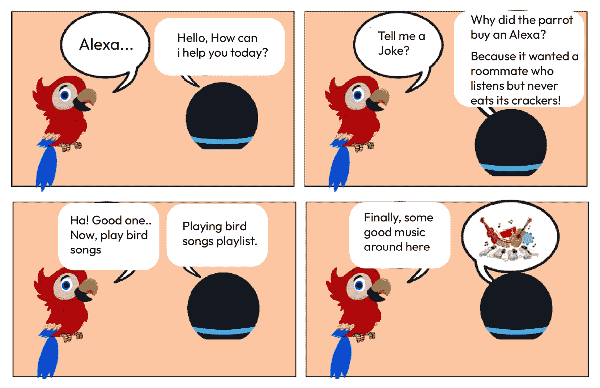
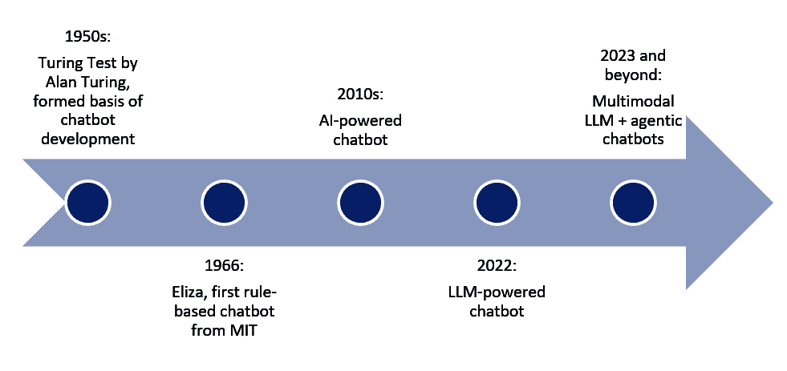
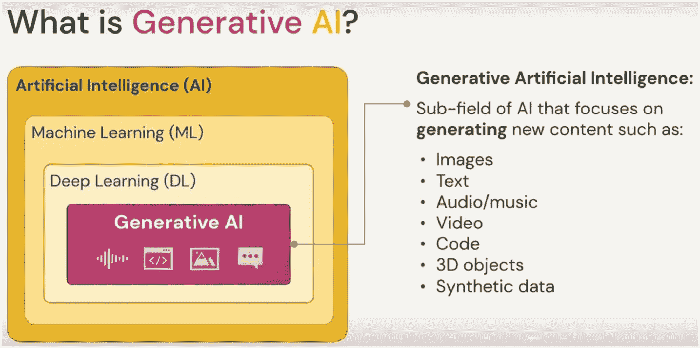
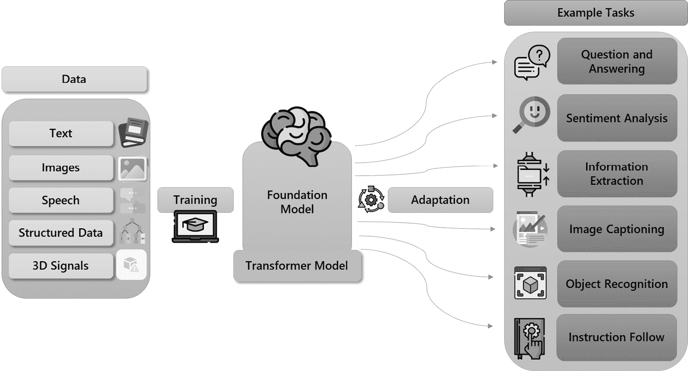
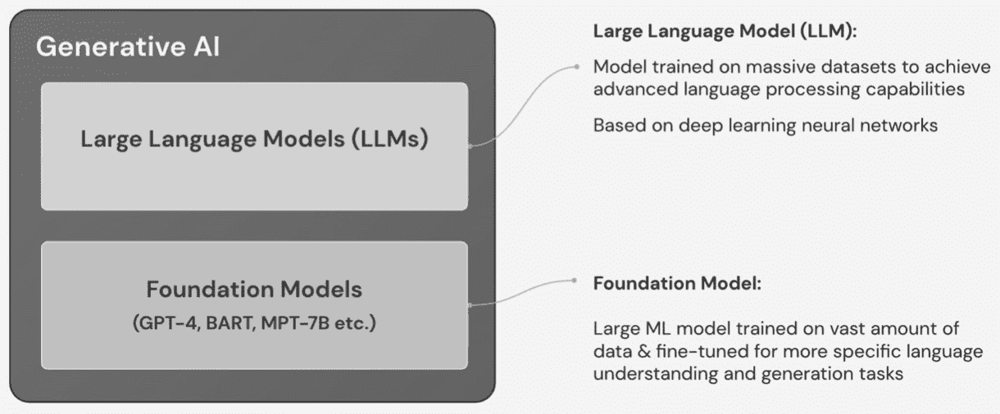
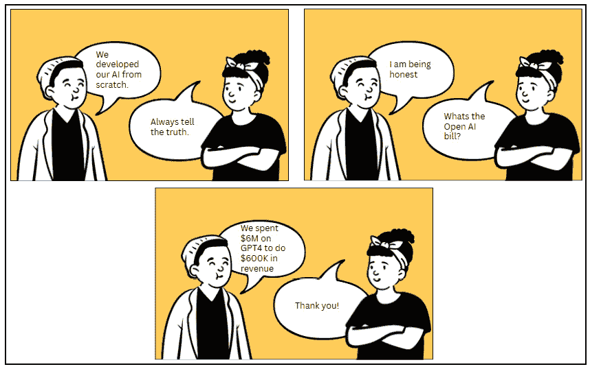
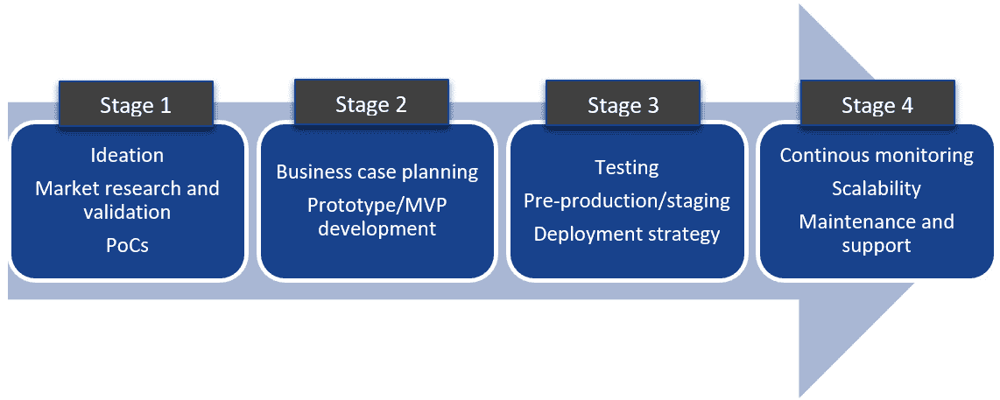

# 1

# 云计算与生成式 AI 的相遇：连接无限可能

在过去几十年里，由于计算（尤其是云计算）的兴起以及数字革命带来的大量数据涌入，人工智能（AI）和机器学习（ML）领域取得了前所未有的进步。2022 年，被称为生成式 AI 的 AI 子集成为了一个重要的转折点。我们已经超过了 AI 的一个拐点，我们相信这将在未来几年中极大地提高社会生产力和增长。这是由大型语言模型（LLMs）驱动的对话式 AI 领域，这是一个令人着迷的范例，其中计算机学习并生成类似人类的文本、图像、音频和视频，以越来越互动和智能的方式与我们互动。以 OpenAI 的基于 GPT 的 ChatGPT 等模型为代表的 LLMs 的变革潜力，标志着我们与技术互动方式的重大转变。生成式 AI 模型现在具有更高的准确性和有效性。几年前对非技术用户来说难以触及的业务用例现在可以轻松实现。此外，开源模型的易于获取，可以根据特定业务需求进行定制，以及通过云计算访问高性能 GPU，在推动生成式 AI 的进步中发挥了关键作用。

本章旨在全面介绍对话式和生成式 AI，并深入探讨其基础和强大功能。ChatGPT 是一个非常强大的对话式 AI 代理，它基于大型语言模型（LLM）；因此，为了完全理解 ChatGPT 的工作原理，以及学习如何在您的应用程序或服务中实现它以利用其力量，了解对话式 AI 系统的演变以及 LLM 的更广泛背景是必要的。

本章将涵盖以下主要内容：

+   对话式 AI 的演变

+   生成式 AI 简介

+   热门模型和商业应用

+   深入探讨：开源模型与闭源模型

+   云计算用于可扩展性、成本优化和自动化

+   从愿景到价值：导航生产之旅

# 对话式 AI 的演变

理解对话式 AI 的演变对于学习生成式 AI 至关重要，因为它提供了基础知识和背景。这一历史视角揭示了人工智能技术是如何从简单的基于规则的系统发展到复杂的机器学习和深度学习模型，这些模型是对话式和生成式 AI 的核心。

本节探讨了对话式 AI 的演变，最终深入探讨了 LLM，这是当代聊天机器人的技术支柱。

## 什么是对话式 AI？

对话式人工智能指的是使机器能够进行类似人类的对话、理解复杂命令并智能回应的技术。这是通过机器学习和自然语言处理能力实现的，使系统能够随着时间的推移进行学习、理解和改进。以下图展示了这样一个对话示例：



图 1.1 – 与 Alexa 的对话

例如，客户与对话式人工智能互动以预订航班。他们可能会说：“我想要下周五去纽约的航班。”系统理解请求，询问任何进一步的详细信息（例如出发城市或首选时间），并交付结果，整个过程无需人工干预。

一些流行的对话式人工智能系统包括微软的 Cortana、亚马逊的 Alexa、苹果的 Siri 和谷歌助手，它们可以响应复杂的命令并智能地做出回应。

## 对话式人工智能的演变

探索对话式人工智能的演变，从基于规则的聊天机器人到人工智能驱动的系统，至关重要，因为它提供了历史背景，突出了从 1960 年代以来的技术进步和历史挑战，并为理解大型语言模型如何革命性地改变自然语言交互奠定了基础。以下图展示了对话式人工智能的时间线：



图 1.2 – 展示聊天机器人演变的时序图

### 基于规则的聊天机器人

最初在 1960 年代开发的聊天机器人基于规则系统。第一个聊天机器人软件 Eliza 是由麻省理工学院人工智能实验室的约瑟夫·魏岑鲍姆在 1966 年创建的。它使用了模式匹配和替换技术。用户通过基于文本的平台与 Eliza 互动，聊天机器人的回应基于脚本模板。与 Eliza 一样，第一代聊天机器人是基于规则的。它们使用模式匹配技术将用户输入与预定的响应对齐。聊天机器人的对话流程由开发者绘制，他们决定如何对预期的客户查询做出回应。响应是根据预定义的规则制定的，并使用如**人工智能标记语言**（**AIML**）、Rivescript、Chatscript 等语言编写。这些聊天机器人通常用作常见问题解答代理，可以回答简单的问题或关于特定情况的一般查询。

然而，基于规则的系统存在重大局限性：

基于规则的系统需要手动设计，迫使开发者编写每个响应的代码

它们只在特定训练的场景中有效

开发者很难预测并编写所有可能的响应

这些聊天机器人无法识别用户输入中的语法或句法错误，通常导致误解

它们无法从交互中学习或生成新的响应，这限制了它们的适应性和智能。

尽管它们速度快，但无法理解上下文或用户意图，使得交互感觉像机械式的而不是对话式的。

这种机械式的交互往往导致用户对无法准确理解和满足其需求的系统感到沮丧。

随着时间的推移，对智能、实时和个性化客户支持服务的需求显著增加。因此，基于规则的聊天机器人已经演变成由 AI 驱动的聊天机器人，它们提供高级功能，如类似人类的语音、意图提取、情感分析、上下文语义搜索、语法分析、随时间学习以及可扩展性，以便与更复杂的应用和服务无缝集成。

### 由 LLM 驱动的聊天机器人——多模态、上下文感知和基于代理的。

与基于规则的系统相比，基于 AI 的系统利用自然语言处理来促进自然对话并从用户输入中提取上下文。它们还可以从过去的交互中学习，即上下文。最近，深度学习在对话式人工智能方面取得了显著进步，甚至在某些任务上超过了人类的表现，这归功于其令人难以置信的推理引擎。这减少了在构建语言服务时对广泛的语言知识和基于规则的技术的依赖。因此，基于 AI 的系统在各个行业得到了广泛应用，包括媒体、娱乐、电信、金融、医疗保健和零售等行业，仅举几例。

当前利用 LLM 如 GPT-4-Turbo 的对话式人工智能系统，在方法和能力上与传统基于规则的系统有显著差异：

而基于规则的系统依赖于预定义的规则和响应，将它们限制在特定的、预期的交互中，而大型语言模型（LLM）利用庞大的数据集和高级推理能力来生成既自然又多样化的响应，同时高度感知上下文。

它们也是多模态的，这意味着它们可以理解和响应多种形式的通信，如文本、语音、图像或视频。

这些卓越的推理能力使它们能够以更高的效率和复杂性处理任务，从而产生与人类互动和理解非常相似的对话。

让我们以客户服务交互的场景为例，来突出传统基于规则的系统和现代使用 LLM（如 GPT-4）的现代对话式人工智能系统之间的差异。

以下是一个基于规则的系统示例：

```py
Customer: "I want to return a gift I received without a receipt. Can you help me?"
Rule-Based Chatbot: "Please enter your order number to proceed with a return."
```

在这种情况下，基于规则的聊天机器人被编程为在其退货流程脚本中请求订单号。它无法处理客户没有收据的情况的细微差别。它陷入了预定义的规则中，无法适应意外的情况。

以下是一个由 LLM 驱动的对话式人工智能示例：

```py
Customer: "I want to return a gift I received without a receipt. Can you help me?"
LLM-Powered Chatbot: "Certainly! Gifts can often be returned without a receipt by verifying the purchaser's details or using a gift return code. Do you have the purchaser's name or email, or a gift return code?"
```

另一方面，由大型语言模型（LLM）驱动的聊天机器人理解没有收据的情境，并提供了退货的替代方法。它不需要客户坚持严格的脚本，而是适应对话的上下文，并提供有用的回应。这展示了 LLM 的高级推理能力，使得对话更加自然、灵活，更接近人类。

LLM 驱动的聊天机器人也存在固有的局限性，包括难以生成准确的信息、容易产生幻觉以及在其训练数据中存在的偏差的再现。我们将在本书中探讨这些局限性，以及减轻和消除这些局限性的策略。

### 聊天机器人和代理

基于 GenAI 的聊天机器人还可以在代理的帮助下执行任务或采取行动。LLM 代理是程序，通过连接到外部工具（如 API 和插件）来增强标准 LLM，并协助规划和执行任务。它们通常与其他软件和数据库交互以执行复杂任务，例如聊天机器人安排会议并需要访问日历和电子邮件。当用户请求会议时，聊天机器人利用其 LLM 理解请求的具体内容，如时间、参与者和目的。然后它自主地与员工的数字日历和电子邮件系统交互，以找到合适的时段，考虑每个人的可用性。一旦确定合适的时段，聊天机器人就会安排会议并通过电子邮件发送邀请，整个过程无需人工干预。这展示了聊天机器人高效执行复杂多步任务的能力，将语言理解和推理与商业环境中的实际行动相结合。我们将在第六章中了解更多关于 LLM 代理的内容。

ChatGPT，由 OpenAI 于 2022 年 11 月推出，由于其先进的语言能力和在各种任务中的广泛应用，仅两个月内就吸引了 1 亿用户。

在接下来的章节中，我们将深入探讨 LLM 作为现代聊天机器人驱动力及其重要性的基础。

# 生成式 AI 简介

生成式 AI 指的是人工智能（如前图所述）的一个领域，该领域专注于创建或生成新的内容，如图像、文本、音乐、视频、代码、3D 对象或合成数据，这些内容不是直接从现有数据中复制或复制的。它涉及训练深度学习模型来理解给定数据集中的模式和关系，然后使用这些知识来生成新颖和独特的内容。以下是对生成式 AI 的可视化：



图 1.3 – 什么是生成式 AI?

这是一个广泛的领域，其主要功能是生成新颖的内容。生成式 AI 模型的例子包括图像生成模型如**DALL-E**和**MidJourney**，文本生成模型如**GPT-4**、**PaLM**和**Claude**，代码生成模型如**Codex**，音频生成工具如**MusicLM**，以及视频生成模型如**SORA**。

## 2022-23 年生成式 AI 的兴起

生成式 AI 在最近达到了一个拐点，这可以归因于三个关键因素：

+   **数据集的大小和多样性**：由于数字革命导致的数据激增对于训练 AI 模型生成类似人类的内容至关重要。

+   **创新的深度学习模型**：在模型架构方面的进步，如**生成对抗网络**（GANs）和基于 transformer 的模型，促进了复杂模式的学习，从而产生了高质量的 AI 生成输出。《Attention Is All You Need》这篇研究论文（[`arxiv.org/abs/1706.03762`](https://arxiv.org/abs/1706.03762)）介绍了 transformer 架构，使得自然语言处理模型更加高效和强大，这成为了高级生成式 AI 模型发展的基础。研究进步也因通过 Hugging Face 社区等平台提供的开源最先进预训练模型而得到显著推动。

+   **强大的计算能力**：硬件方面的进步，如 Nvidia GPU，以及通过云计算获得的计算能力，使得训练复杂的 AI 模型成为可能，推动了生成式 AI 的进步。

存在着各种类型的生成式 AI 模型，它们具有不同的底层架构。其中，**变分自编码器**（VAEs）、**扩散模型**、**GANs**和**自回归模型**特别受欢迎。虽然我们不会深入探讨每个模型架构，因为这超出了本书的范围。在*第二章*中，我们将更详细地讨论 ChatGPT 的 LLM 架构，该架构利用了**基于自回归的****transformer 架构**。

从生成式 AI 的话题转向，我们现在将注意力转向基础模型。这些模型通常与 LLMs 互换使用，是生成式 AI 成功和可能性的驱动力。在基础模型方面取得的显著进步对于推动我们今天在生成式 AI 应用中看到的进步至关重要。它们的发展不仅使 AI 能力更加复杂，还为 AI 创新和可能性的新时代奠定了基础。

## 基础模型

“基础模型”这个术语是由斯坦福大学在 2021 年的论文“On the Opportunities and Risks of Foundation Models”中提出的（[`arxiv.org/pdf/2108.07258.pdf`](https://arxiv.org/pdf/2108.07258.pdf)）。基础模型是一类在大规模数据上预训练的模型，这些数据跨越了各种领域和任务。它们作为进一步微调或适应广泛下游任务的基础，不仅限于语言，还包括视觉、声音和其他模态。术语“基础”意味着这些模型提供了一个基础层级的理解和能力，在之上可以构建专门的模型。它们的特点是能够从训练数据中学习并泛化到各种应用中，有时甚至不需要额外的训练数据。模型如下：.



图 1.4 – 基础模型

## LLMs

另一方面，LLMs 是基础模型的一个子集，专门处理自然语言处理任务。它们在大规模文本语料库中进行训练，旨在以接近人类语言理解的方式理解和生成语言。LLMs 在大量数据上进行训练，例如书籍、文章和互联网。例如，ChatGPT 的基础模型是在 45 TB 的数据上训练的。

例如，GPTs 等 LLMs 使用 transformer 架构来处理文本序列，通过训练自己预测给定序列中的下一个单词。通过接触大量的文本，这些模型根据预测单词和实际单词之间的差异调整其内部权重，这个过程被称为反向传播。随着时间的推移，通过在多个注意力机制层中反复微调这些权重，它们捕捉到语言中的复杂统计模式和依赖关系，使它们能够生成上下文相关的文本。在*第二章*中，我们将更深入地探讨 LLMs 的 transformer 架构，该架构使得 ChatGPT 应用成为可能。

LLMs（大型语言模型）通常指的是处理大规模语言任务的模型；其背后的原理和架构可以，并且正在被扩展到其他领域，如图像生成。这种能力范围的扩展反映了基于 transformer 的模型的多功能和适应性，这些模型既推动了 LLMs，也推动了它们的多模态对应物。

例如，DALL-E 等模型有时被称为 LLMs，因为它们基于最初为语言任务开发的 transformer 架构。然而，DALL-E 更准确地被描述为一个多模态 AI 模型，因为它理解文本和图像，并且可以从文本描述中生成图像。

## LLMs 的核心属性

在创建基于 LLM 的 AI 应用程序的过程中，了解 LLM 的核心属性至关重要，例如模型参数、许可模型、隐私、成本、质量和延迟。需要注意的是，没有完美的模型，为了满足特定应用程序的商业需求，可能需要进行权衡。以下内容仅关注设计 LLM 应用程序时的关键考虑因素。

### 模型参数

+   LLM 中的模型参数是模型用来理解和生成文本的内部设置。这些参数可以是系数、权重和偏差，它们是 LLM 模型背后的复杂数学方程式的一部分。这些参数通过训练进行调整，模型通过学习大量数据来预测句子中的下一个单词，理解上下文，并生成连贯且相关的文本。

    例如，在 LLM 的背景下，模型参数类似于基于学习到的数据模式的预测指导内部笔记。例如，如果一个 LLM 在训练过程中经常遇到“晴朗天气”这个短语，它会调整其参数以加强“晴朗”和“天气”之间的联系。这些调整就像转动旋钮，增加在新句子中预测“天气”在“晴朗”之后的可能性。因此，模型的参数编码了单词之间的关系，使其能够根据其训练生成上下文相关的文本。

+   参数数量表示模型的大小和复杂性，一般来说，较大的模型能够捕捉到语言中更复杂模式和细微差别，但需要更多的计算资源。

+   理解 LLM（大型语言模型）中的参数对于解释模型行为、定制和调整模型、评估和比较不同模型至关重要。

+   相较于大型模型，较小的模型由于参数数量较少，因此更容易微调。

+   在设计应用程序时，了解是否可以通过微调/上下文学习或是否需要较大的模型来满足特定用例的需求至关重要。例如，较小的模型如 GPT-3.5 和 FLAN-T5 通常成本较低，与 GPT-4 相比，它们在微调或上下文学习的情况下往往非常高效，尤其是在像对话摘要这样的特定任务中。

### 许可证

+   开源模型可以直接使用或根据商业和非商业用途进行定制。它们通常比专有 LLM 模型小，成本更低，且更针对特定任务。例如，Whisper 是 Open AI 开发的开源语音转文本模型，而 Facebook 的 Llama 是一个开源模型。

+   专有模型通常是较大的模型，需要获得许可。它们可能仅限于商业用途和修改。例如，GPT-4 是 Open AI 开发的专有模型。

+   在设计应用时，了解它是一个开源模型还是许可模型，以及是否允许商业使用非常重要。这对于确保法律合规性、财务规划、伦理考量、定制可能性以及应用的长期成功至关重要。

### 隐私

+   确保用于微调和提示 LLMs 的数据安全至关重要，尤其是在涉及敏感客户信息时。

+   必须建立护栏以确保在微调模型之前以及在使用它们进行提示时，客户数据被删除。

+   理解数据将被模型如何存储和利用也非常关键。在 ChatGPT 中可以配置数据控制，以防止系统保存聊天记录，从而不允许它们用于训练模型。

### 成本

+   在设计 LLM 应用时，了解获取模型（例如许可费用）、与数据存储、计算、数据传输、微调和维护成本（如监控）相关的基础设施成本非常重要。

### 延迟

+   这对于确保用户交互顺畅至关重要。在决定模型时，您必须判断输出是否需要实时或近实时响应。

+   相比于小型模型，较大的模型 API 可能响应时间略慢且成本更高，但在某些场景下输出质量可能更好。例如，GPT-4 比 GPT 3.5 Turbo 略慢，但在涉及复杂推理的场景中可能表现更佳。

+   要实现低延迟，需要考虑多个因素，例如为自托管开源 LLMs 选择合适的 LLM API 或硬件基础设施，或修改输入和输出的长度。应用缓存和 API 负载均衡等方法可以显著减少响应时间，从而带来流畅的用户体验。

提到的核心属性为根据业务需求筛选模型提供了良好的起点。然而，重要的是要了解某些 LLMs 可能表现出更多的偏见和更高的幻觉倾向。在*第三章*中，我们讨论了行业领先的基准，这将帮助您在考虑这些限制的情况下做出明智的决定。

## 生成式 AI、基础模型和 LLMs 之间的关系

生成式 AI 广泛指的是能够创建新内容的人工智能系统，如文本、图像、音频或视频。基础模型是生成式 AI 的一个子集，其特点在于规模庞大且在多个任务中具有多面性，通常在大量且多样化的数据集上训练。LLMs 作为一种基础模型，特别关注理解和生成人类语言，例如 GPT-3.5-Turbo 和 Llama 2 系统。

基础模型可以应用于多种 AI 任务，而不仅仅是语言，例如图像识别，而 LLM 则专注于与语言相关的任务。

在实践中，当上下文明确涉及语言任务时，这些术语有时可以互换使用，但重要的是要知道，基础模型的概念最初是希望更广泛，并涵盖更广泛的 AI 能力。

然而，现在，随着像 GPT-4 Turbo 这样的 LLM 扩展到多模态能力，基础模型和 LLM 之间的这种差异正在缩小。

生成式 AI 包含了一系列 AI 模型，旨在创建新的、以前未见过的内容，涵盖了从文本和图像到音乐的各个领域。以下图像展示了生成式 AI、LLM 和基础模型之间的关系：



图 1.5 – 什么是 LLM？

### 聊天机器人背后的 LLM

截至 2024 年初，ChatGPT 是 GPT-3.5 和 GPT-4 的一个专门应用，经过微调以适应对话交互。虽然 GPT-3.5/4 是一个通用的语言模型，能够执行各种语言任务，但 ChatGPT 已被专门训练以模仿人类对话的方式响应提示。这个过程从预先在互联网上的大量文本语料库上预训练的基础基础模型 GPT-3.5/4 模型开始。然后，为了创建 ChatGPT，OpenAI 在包含许多人类对话示例的数据集上进行了进一步的训练（微调）。这有助于 ChatGPT 更好地理解和生成对话式响应。本质上，GPT-3.5/4 可以被视为底层技术，而 ChatGPT 则是该技术的具体实现，针对对话进行了优化。

Google 的 Bard（现更名为 Gemini）与 ChatGPT 类似，它基于一个名为 PaLM-2 的 LLM 构建。

来自 Facebook 的 Llama 2 等开源模型最近变得更加流行。但它们与闭源或专有模型有何不同？它们有哪些优势？在下一节中，我们将探讨 LLM 作为开源模型的详细信息和定义。

## 深入探讨 – 开源与闭源/专有模型

近年来，像**Llama 2**、**Mistral**和**Falcon**这样的开源模型变得越来越受欢迎。作为通用人工智能云架构师，作者们见证了在开源和闭源模型之间选择以及确定它们适用场景的激烈辩论。本节深入探讨了这些模型在“揭示什么”和“未揭示什么”方面的基本区别，以及关键的部署差异，借鉴了我们在该领域的见解。

### 闭源 LLM（例如，GPT-4、PaLM-2、Claude-2）

揭示的内容如下：

+   **功能和能力**：用户知道模型能做什么，例如生成文本、回答问题等。

+   **使用指南**：关于如何与模型交互（例如，API）及其预期用例的信息被公开。OpenAI 提供了 GPT 模型的 API 访问，但底层模型并未公开分发。

+   **性能指标**：OpenAI 分享了 GPT 在各项任务和基准测试中的性能细节。

+   **伦理标准**：OpenAI 讨论了在开发过程中遵循的伦理考虑和指南。

+   **一般架构概述**：虽然不是非常详细，但通常会有一些关于模型架构的高级信息。

没有公开的是以下内容：

+   **源代码**：闭源模型的实际代码库不公开提供

+   **模型权重**：访问实际模型权重以实现完全复制的权限受到限制

+   **训练数据细节**：关于训练数据集的具体信息，包括它们的来源和组成，通常不会公开披露

+   **详细模型架构**：模型架构和算法的复杂细节属于专有信息

+   **训练过程**：关于模型如何训练的具体细节，包括超参数和训练时长，并未公开

上述结论是基于 OpenAI 发布的 GPT-4 技术报告([`arxiv.org/pdf/2303.08774.pdf`](https://arxiv.org/pdf/2303.08774.pdf))得出的。在报告中，OpenAI 表示，由于 GPT-4 等大型模型在竞争环境和安全影响方面，它没有透露关于架构的复杂细节，包括模型大小、硬件、训练计算、数据集构建、训练方法或类似内容。

### 开源大型语言模型（例如，Llama 2、Mistral、Falcon）

公开的是以下内容：

+   **源代码**：完整的代码库通常可供公众访问。因此，个人和企业可以在个人电脑和本地或内部服务器上部署开源模型。

+   **模型权重**：模型的权重可以被研究人员和开发者下载和使用。

+   **训练过程细节**：关于模型如何训练的详细信息，包括数据集和超参数。

+   **完整架构细节**：提供了关于模型架构的全面信息。

+   **数据集信息**：尽管存在一些限制，关于训练数据集的更多信息可能可用。

没有公开的是以下内容：

+   **资源需求**：关于训练所需的计算资源的具体细节可能不会完全公开

+   **伦理考虑**：开源项目可能并不总是像某些闭源项目那样拥有相同的伦理监管水平

+   **性能优化秘诀**：在训练过程中可能省略了一些性能优化的细微之处

+   **完整训练数据**：即使在开源模型中，由于数据大小和许可问题，分享整个训练数据可能不切实际

+   **持续更新**：与一些封闭源模型不同，开源模型可能不会收到持续的更新或支持

以下表格详细说明了开源和封闭源模型之间的关键部署差异：

|  | **封闭源模型** | **开源** **LLMs (OSS)** |
| --- | --- | --- |
| 访问、成本和部署端点 | 访问通常限于付费许可证、API 或订阅模式。成本可能成为小型组织或个人开发者的障碍。与这种部署相关的成本通常与提示和完成中的令牌数量相关。例如，截至 2024 年初，OpenAI 对 gpt-4-0125-preview 的提示收费为每 1K 令牌 0.01 美元，对完成收费为每 1K 令牌 0.03 美元。 | 通常，源代码是免费提供的。部署开源模型需要设置计算实例的初始设置，这作为推理端点的基础。该端点可以实时运行或批量处理数据。与此部署策略相关的费用主要涉及计算资源的运营成本。然而，新的定价模式已经出现，例如 MaaS（模型即服务），其收费方式类似于基于 API 的模型，根据使用的令牌数量收费。 |
| 定制化和灵活性 | 由于源代码不可用，定制选项通常仅限于提供商允许的范围。用户可能无法修改模型的内核架构或训练数据集。 | 提供了更大的定制灵活性。开发者可以调整模型，使用特定数据集重新训练，甚至调整底层算法。 |
| 支持和文档 | 通常，它们附带专业的支持和全面的文档，确保更顺畅的部署和故障排除过程。 | 虽然通常有一个支持社区，但正式支持和文档的质量和可用性可能会有所不同。 |
| 集成和兼容性 | 它们可能与同一提供商提供的其他专有工具或平台有更好的集成，但在与广泛技术的兼容性方面可能不太灵活。 | 它们通常设计得更加灵活，并与各种平台和工具兼容，尽管集成可能需要用户付出更多努力。 |
| 安全性和更新 | 安全更新和补丁通常由提供商管理，确保一致的维护水平。 | 安全性依赖于社区和维护者，这可能导致更新在及时性和有效性方面存在不同程度的差异。 |
| 道德、合规性和责任 | 提供商通常负责遵守法规，为商业活动提供一定程度的保障。 | 用户通常需要自行确保合规性，这对于受监管行业的商业活动来说可能是一个重要的考虑因素。 |
| 风险 |

+   由于许可费用可能导致的潜在更高成本

+   与开源相比，定制能力有限，以满足业务需求

+   供应商锁定

+   由于对大型语言模型内部运作的了解有限，透明度降低

|

+   由于是社区驱动的，可能允许恶意使用，存在潜在的安全漏洞

+   由于缺乏集中质量控制，可能导致更新和改进的不一致性

+   依赖社区支持可能导致故障排除和问题解决不一致，影响需要稳定、持续维护的项目

|

图 1.6 – 关键部署差异

组织选择采用开源或闭源模型的决定本质上具有主观性，并取决于它们的独特需求和目标。一个更相关的问题可能是：在进行内部基准测试后，哪个模型成为您特定用例中最有效的？这些基准测试可以在 Hugging Face 上找到（[`huggingface.co/spaces/HuggingFaceH4/open_llm_leaderboard`](https://huggingface.co/spaces/HuggingFaceH4/open_llm_leaderboard)）。

# 流行模型、任务和商业应用趋势

生成式人工智能在各个行业都有广泛的应用，提出了可以为企业带来显著效益的多种用例，并且应用正在以快速的速度增长。在本节中，我们将讨论流行的任务和模型，并检查最近获得显著关注的最新新兴商业应用。

让我们从文本生成模型开始。

## 文本

文本生成模型可以用于各种任务，如本文所述。以下，我们提到了我们与客户合作构建解决方案时看到的最受欢迎的任务：

+   **摘要**：它们可以将长文档，如教科书章节或详细的产品描述，压缩成简洁的摘要，同时保留关键信息。

+   **问答**：这些模型可以提供准确的答案，这在从广泛的知识库内容自动创建常见问题解答文档时特别有用。

+   **分类**：文本生成模型可以对文本进行分类，根据语法正确性或其他预定义类别等标准分配标签。

+   **情感分析**：作为一种专门的分类形式，这些模型可以分析和标记文本的情感，识别诸如快乐和愤怒或一般积极和消极的情绪。

+   **实体提取**：它们可以从更大的文本体中提取特定的信息，如电影名称，从而有助于信息检索和组织。

+   **翻译**：语言模型在翻译方面表现出色，能够快速准确地转换一种语言到另一种语言，利用庞大的数据集来理解和维护上下文和细微差别。代码生成可以被视为一种翻译，其中语言模型将人类语言指令翻译成编程代码。

这些能力使文本生成模型成为无价之宝，并导致了创新应用的创造。以下是我们观察到的一些有趣的商业应用，这些应用是由于文本生成模型的普及而在各个行业中出现的：

+   **企业聊天机器人**：文本生成模型为能够与用户进行自然语言对话的对话代理提供动力，提供客户支持、人力资源支持、学习和开发以及任务协助。我们观察到的最流行的用例是建立在组织数据基础上的企业聊天机器人的实施。

+   **内容创作（文章、博客文章、报告、书籍）**：文本生成模型可以自动生成各种主题的高质量书面内容，为内容创作者节省时间和精力，并使在同一平台上实现无缝问答体验。这在媒体、营销、娱乐和出版行业中已成为提高生产力的主要因素。

+   **房地产列表**：文本生成模型使房地产公司能够通过输入诸如卧室数量、房产年龄、社区信息和其他独特卖点等详细信息，轻松地制作吸引人的房屋列表，显著增强了房产对潜在买家的吸引力。

+   **自动电子邮件草稿**：文本生成模型帮助撰写个性化的、与上下文相关的电子邮件，简化沟通，并提高电子邮件通信中的生产力，例如微软的 Copilot 应用程序。

+   **个性化广告**：这些模型有助于根据个人用户定制营销信息和内容，通过提供更相关和吸引人的内容来提高广告活动的有效性。

+   **提案创建**：它们通过自动化创建**请求提案**（RFP）响应的提案，极大地简化了房地产公司的运营。此工具还促进了 RFP 提交的快速搜索，并在制作和撰写高质量内容方面极大地帮助了营销团队。

+   **广告活动**：在营销和广告活动中，文本生成模型通过提供对长篇内容的精确和高效摘要，提供了强大的优势。此外，这些模型能够在各种语言之间无缝翻译文本，有效地消除语言障碍。这种能力增强了跨文化交流，使营销人员能够更有效地触及和引起不同、全球受众的共鸣。

+   **代码协同**：GitHub Copilot 等产品的出现极大地提高了组织中的开发者生产力。

以下列出了截至 2024 年初在快速发展的领域中领先的文本生成模型：

+   **GPT-4-Turbo**：由 OpenAI 开发，是目前生产中最受欢迎的模型。GPT-4 是一个具有深度学习能力的大型多模态模型，能够生成类似人类的对话文本。它可以接受文本和图像输入以生成类似人类的文本输出。其上下文窗口可以接受 128,000 个 token，接近 300 页文本。

+   **Llama 2**：Llama 2 开源模型在 2000 亿个 token 上进行了训练，并提供了其前代 Llama 1 的两倍上下文长度（约 4K 个 token）。这些模型在各种基准测试中表现出色，包括推理、编码、熟练度和知识测试，并包括在超过一百万个新的人类标注上训练的专用聊天模型。

+   **Mistral**：由前 Meta 和 Google AI 研究人员创立的 Mistral AI 开发，Mistral 是一个具有 73 亿参数的领先开源模型 LLM，能够生成连贯的文本并执行各种自然语言处理任务。它代表了相对于先前模型的重大进步，在各种基准测试中优于许多现有的 AI 模型。

+   **PaLM-2**：由 Google 开发，PaLM-2 代表路径语言模型，是下一代语言模型家族的一部分，该家族在大量数据上训练以进行下一词预测。它展示了改进的多语言、推理和编码能力，并在多语言文本上进行了广泛训练，覆盖超过 100 种语言。

+   **Claude2**：由 Anthropic 开发，Claude2 是其前代产品 Claude 的升级版。这个 LLM 旨在更安全、更强大，具有改进的性能和更长的响应能力。它能够处理高达 100K 个 token 的上下文窗口，使其能够处理大量文档。Claude-2 因其对 AI 安全的关注以及在对话 AI 领域的竞争潜力而备受瞩目。

+   **Gemini 1.5**：Google 最新的模型于 2024 年 2 月发布，具有更高效的架构和增强的性能。它有三种尺寸：Ultra、Pro 和 Nano，上下文窗口可以接受多达一百万个 token。

接下来，让我们探索图像生成模型。

## 图像

在计算机视觉不断发展的领域中，图像生成模型正在进步，关键领域如图像合成和分类已经相对成熟。新兴领域包括视觉问答，它通过解释图像来回答查询，以及图像分割，它将图像分解以进行详细分析。以下详细介绍了关键领域：

+   **图像合成**：根据特定的输入或要求生成新图像或修改现有图像

+   **图像分类**：将图像中的对象识别和分类到预定义的类别中，这对于人脸识别和自动照片标记等应用至关重要

+   **视觉问答（VQA**）：结合图像处理和自然语言理解来回答关于给定图像的问题

+   **图像分割**：将图像分割成片段或部分，以便进行更简单、更有意义的分析

这些能力使图像生成模型成为无价之宝，并导致了创新应用的诞生。以下，我们提到了由于近期图像生成模型的发展，在各个行业中涌现的几个有趣的商业应用：

+   **从文本描述生成图像**：图像生成模型可以接受文本描述作为输入并创建相应的图像。这在生成书籍、文章或产品列表的插图等应用中非常有价值。例如，一个热带海滩场景的文本描述可以转化为该场景的逼真图像，有助于视觉叙事和营销。

+   **故事板制作**：娱乐公司正在利用图像生成模型来制作故事板。这些视觉辅助工具描绘叙事、概念或剧本，为故事动画或表演时的外观提供一瞥。

+   **时尚设计**：图像生成模型正帮助时尚设计师通过生成各种服装设计、图案和色彩组合来创造新的服装设计。设计师可以输入参数或灵感，模型可以生成视觉概念来启发新的系列。

+   **室内设计**：类似地，对于室内设计师来说，这些模型可以根据输入标准生成房间布局、家具排列和装饰理念，从而实现快速和富有创意的设计探索。

+   **自动照片编辑**：图像生成模型可用于自动化和增强照片编辑过程。它们可以智能地调整色彩平衡、对比度和照明，移除不需要的对象或瑕疵，并应用于照片的艺术滤镜或风格。这可以显著减少手动照片编辑任务所需的时间和精力。

+   **创建数字艺术品**：数字艺术家和插图画家可以使用图像生成模型激发他们的创造力。这些模型可以生成抽象或逼真的艺术作品，提供新的设计理念，或协助为各种项目创建概念艺术。艺术家可以使用生成的图像作为他们工作的起点。

+   **医生副驾驶**：这属于多模态类别，其中 LLM 的多样化功能被应用于各种医学影像任务，包括医学视觉问答场景。本质上，这涉及到开发能够响应医生关于 X 光或 CT 扫描的查询以及帮助生成放射学报告的应用程序。

+   **面部识别**：图像生成模型可以通过创建多样化的、高质量的训练数据集来增强面部识别，使算法能够在各种条件下学习并识别广泛的面部特征和表情。此外，它们还可以帮助在图像中重建部分或被遮挡的面部，提高识别系统的准确性和可靠性。

以下列出了截至 2023 年 12 月，在快速发展的领域中领先的图像生成模型：

+   **DALL-E3**：由 OpenAI 开发，DALL-E 3 是一个高级 AI 模型，能够根据文本描述生成详细和富有想象力的图像。

+   **谷歌的 Imagen**：谷歌的 Imagen 是一个文本到图像的扩散 AI 模型，以其能够从文本提示中生成高度逼真的图像而闻名。

+   **Stable Diffusion**：Stable Diffusion 是由 Stability AI 创建的开源模型，是一个文本到图像模型，旨在根据用户提供的文本描述生成高质量的图像。

+   **Midjourney v5.2**：Midjourney v5.2 是由 Midjourney Inc.开发并于 2023 年 6 月推出的，代表了 Midjourney AI 图像生成模型的最新和最复杂版本。这个版本专注于提高生成图像的性能、一致性和质量。与前辈相比，它以更详细、更清晰的结果以及改进的颜色、对比度和构图而闻名。

+   **Segment Anything Model**（**SAM**）：由 Facebook 的 Meta AI 开发的 Segment Anything Model（SAM）不是一个主要的图像生成模型；相反，它是一个图像分割模型。图像分割模型旨在识别和描绘图像中的特定部分或对象，本质上是根据图像中存在的对象将图像分割成不同的区域。我们在这里提到它，因为它属于计算机视觉领域的模型。

    以下图显示了使用 SAM 将纽约天际线分割成不同对象的过程：


图 1.7 – 图像分割示例

让我们继续讨论音频生成模型。

## 音频

音频生成模型是适用于各种应用的通用工具，正如我们在与客户开发解决方案的经验中展示的那样。以下是最受欢迎的任务：

+   **语音合成**：从文本生成类似人类的语音（文本到语音），并用于语音助手、有声读物和各种辅助工具。

+   **说话人识别**：在音频记录中识别和区分不同的说话人，这在安全系统和个性化用户体验中可能很有用。

+   **情感检测**：从语音中识别情感，这可以增强客户服务互动或帮助进行心理健康评估。

+   **声音生成**：使用 AI 创作音乐或音效，这在娱乐、游戏和虚拟现实领域有应用。

+   **声音克隆**：生成与特定人物声音相似的人工合成声音，可用于个性化语音界面或娱乐

+   **语音识别**：将口语语言转换为文本，这在创建转录、自动字幕和语音命令中是基本的

+   **语音翻译**：实时将一种语言的口语翻译成另一种语言，促进跨语言交流

基于音频的 LLM 可以根据文本或其他输入生成各种形式的音频，如语音、音乐和音效。例如，以下我们提到一些基于音频生成模型的值得关注的新兴商业应用：

+   **聊天机器人音频和头像**：基于头像的体验的最近进展导致组织创建具有逼真头像的共飞行员沉浸式音频体验

+   **音乐创作和生产**：这些模型用于创作新的音乐作品，模拟各种音乐风格，并协助作曲家探索新的声音景观和旋律

+   **媒体制作中的音效和福雷**：它们可以生成用于电影、视频游戏和其他多媒体项目的逼真或富有想象力的音效，为传统的福雷艺术提供了一种成本效益高的替代方案

+   **语言学习和发音训练**：通过生成准确且多样化的语音样本，这些模型有助于语言学习应用，帮助用户提高发音和听力理解

+   **辅助应用**：音频生成模型在开发为视障人士的工具中至关重要，将文本和视觉信息转换为音频，从而在各种数字平台上提高可访问性

这个领域正在发展，但在这个领域的发展程度还没有像文本和图像生成模型那样高。以下我们提到来自谷歌和 OpenAI 的几个有趣的音频生成模型：

+   **MusicLM**：来自谷歌研究，这是一个前沿的 AI 模型，使用文本提示来转换音乐创作。它从简单的文本输入中生成跨流派的高质量音乐。这个创新模型利用了复杂的层次序列到序列方法，在 5.5K 个专家制作的音乐-文本对数据集上训练，为研究人员和音乐爱好者提供了宝贵的机会。

+   **Open AI JukeBox**：这个模型由 OpenAI 于 2020 年创建，根据流派、艺术家和歌词等输入生成新的音乐样本（[`github.com/openai/jukebox`](https://github.com/openai/jukebox)）。

最后，我们来看视频生成模型。

## 视频

视频生成模型是高级人工智能形式，旨在创建、操作和分析视频内容，可以执行各种任务。我们客户在这个领域的几个关键新兴任务如下：

+   **视频合成**：从头开始创建或基于文本描述创建新的视频内容，这包括生成逼真的场景、动画或模拟

+   **深度伪造生成**：创建高度逼真且令人信服的视频，其中一个人的形象被另一个人的形象所取代，常用于电影制作、教育或娱乐目的

+   **视频编辑和增强**：自动编辑视频以提高其质量，例如增强分辨率、色彩校正和稳定抖动的画面

+   **视频摘要**：将较长的视频压缩成较短的摘要，同时保留关键内容，这对于快速传达大量视频文件中的信息非常有用

+   **目标跟踪和识别**：在视频序列中识别和跟踪物体或个人，这对于监控、体育分析和自动驾驶汽车至关重要

+   **场景理解**：分析视频以理解上下文、场景或正在发生的事件，这可以应用于视频索引和搜索系统

+   **运动分析**：研究视频中的物体或个人的运动，适用于体育训练、物理治疗和动画

+   **面部表情和手势分析**：解释面部表情和肢体语言以衡量情绪、反应或意图，这在客户服务或行为研究中非常有用

+   **视频转文字转录**：将视频的视觉和听觉成分转换为文本描述，有助于内容的可访问性和可搜索性

+   **交互式视频创作**：生成交互式视频，其中观众可以影响故事情节或结果，增强游戏、教育和营销中的用户参与度

文本到视频模型是一种基于文本描述生成视频内容的 AI 技术。尽管在最近的**文本到视频**（**T2V**）生成技术方面取得了相当大的进步，但这些发展主要集中在创建描绘单一事件且背景单一的短视频片段上，本质上局限于单场景视频。随着视频生成模型的演变，一些令人兴奋的新应用开始出现，为该领域提供了创新的可能性：

+   **视频档案问答**：在媒体和娱乐行业，一个正在兴起的主要用例涉及使用 CLIP 等模型嵌入视频数据，然后在上面创建增强的搜索体验

+   **电影和动画**：这些模型可以帮助快速原型设计和创建短片动画，简化电影和动画制作过程

+   **广告和营销**：企业可以利用视频生成模型为营销活动和广告创建吸引人的内容，这些内容针对特定受众

+   **教育和培训**：它们可以通过制作展示复杂概念或模拟真实场景的定制视频来增强教育内容，从而实现更有效的学习和培训

+   **游戏和虚拟现实**：在游戏中，这些模型可以用来生成动态环境和角色，丰富游戏体验，并减少开发时间

+   **研究和开发**：视频生成模型在可视化科学理论、模拟实验或以交互式格式展示研究结果方面非常有价值

这个领域正在不断发展，视频领域的进步并没有像文本和图像生成模型那样显著。在这里，我们提到了两个在视频领域具有潜力的模型：

+   **稳定的视频扩散**：Stability AI 于 2023 年 11 月宣布，这是一个从文本或单张图像创建高分辨率视频（576 x 1024）的模型。它将之前仅限于 2D 图像的潜在扩散模型推进到视频领域，在每秒 14 或 25 帧的帧率下保持高细节。研究强调了数据整理在提高高分辨率视频生成性能方面的重要性（[`huggingface.co/stabilityai/stable-video-diffusion-img2vid-xt`](https://huggingface.co/stabilityai/stable-video-diffusion-img2vid-xt)）。

+   **GPT-4V**：来自 OpenAI，这是一个多模态 LLM，能够分析视频，但截至 2024 年初尚不能生成视频。

注意

OpenAI 在 2024 年初宣布了 SORA，这是其首个文本到视频生成模型。尽管它尚未向公众发布，因为它正在进行全面的红队测试，但根据 OpenAI 分享的样本，我们认为这一创新是多模态 LLM 的重大飞跃。它允许您将文本提示转换为高质量的一分钟视频。

下面是 SORA 带来的优势：

+   **复杂场景生成**：SORA 在创建包含多个角色、各种动作和精确主题和背景细节的详细场景方面表现出色。该模型不仅理解用户在提示中要求的内容，还理解这些事物在物理世界中的存在方式。

+   **高级语言理解**：凭借其对语言的深刻理解，SORA 可以通过展示各种情绪的角色使提示栩栩如生。此外，它可以在视频中制作多个镜头，保持角色和视觉风格的一致性。

我们已经突出了目前已知的最突出的 LLM。然而，该领域正在迅速发展，新的模型不断涌现。对于最新和趋势性的模型，我们建议定期访问 Hugging Face 网站，该网站维护着这些创新和有影响力的模型的最新列表（[`huggingface.co/models`](https://huggingface.co/models)）。

# 云计算用于可扩展性、成本优化和安全

云计算在将 LLM 带给更广泛的受众方面发挥了关键作用。LLM 使用大规模 GPU 处理来学习和生成类似人类的文本、图像、音频和视频，并以越来越互动和智能的方式参与其中。

本节突出了在云环境中利用 LLM 的几个优势：

+   **可扩展性**：云计算使用户能够根据需求访问高性能计算，如 GPU，以运行 LLM。这使得根据消费需求轻松扩展应用程序变得容易。

    由于 LLM 模型如 GPT 是重量级的 API 驱动工作负载，因此需要 API 管理服务，如 Azure APIM，以帮助实现跨区域的可扩展性、安全性和高可用性。它们还可以捕获遥测数据，有助于确定组织间的令牌使用和错误日志。我们将在*第七章*中讨论 Azure 上的扩展策略。

+   **经济性**：您无需进行大量前期基础设施投资，因为您可以从云中轻松访问计算能力，这使得成本更低。利用按需付费服务，您可以根据需要激活开源模型的实例，并在方便时终止它们，确保您在管理资源时拥有控制和适应性。

+   **数据存储**：LLM 可能需要大量数据用于训练和微调。云服务提供可扩展且经济的存储选项，以管理大量结构化和非结构化数据。

    例如，Azure Blob 存储提供了多种经济且灵活的存储选项，用于存储结构化和非结构化数据，并且可以与 Azure AI 搜索结合使用，以实现具有高级安全功能的向量存储。

+   **可访问性和协作**：云平台使您能够从世界任何地方轻松访问 LLM，这使得研究人员、数据科学家、云架构师和开发者之间的协作变得容易。

+   **托管服务**：云平台提供托管服务，可以简化云上 LLM 的部署和基础设施管理。

    例如，微软的模型即服务允许您将开源模型如 Llama 2 作为按需付费服务部署。Azure 负责基础设施配置，并按令牌使用量向您收费。这消除了为开源模型配置推理计算的管理开销。

+   **速度**：通过访问云，您可以使用高速计算机能力，这为您提供了更多基于 LLM 应用程序延迟需求的选择。

    在 Azure 中，您可以访问多个 GPU 优化的虚拟机大小选项，例如 Nvidia A100s V4 系列和 NCV3 系列([`learn.microsoft.com/en-us/azure/virtual-machines/sizes-gpu`](https://learn.microsoft.com/en-us/azure/virtual-machines/sizes-gpu))。

    不同的 LLM 可能需要不同大小的 GPU 计算能力，这会影响应用程序的延迟和成本。

+   **安全和合规性**：顶级云平台为您提供全面且行业领先的网络安全和合规性服务，从而为您的数据提供身份验证、授权、加密、监控和日志记录功能，以保护您的 AI 基础设施。它们还提供识别潜在越狱攻击的服务。对 LLM 的越狱攻击是绕过或操纵模型的安全和道德指南以诱发出禁止或受限响应的方法。我们将在第八章安全中了解更多关于越狱攻击的内容。

+   **负责任的 AI 解决方案**：随着新一代 AI 应用的兴起，实施强大的防护措施以检测和过滤有害内容变得至关重要。例如，Azure 内容安全工具旨在调节文本和图像内容，帮助维护安全且适当的使用体验。此外，使用安全元提示也发挥着至关重要的作用，这些元提示本质上是在 LLM 的系统消息中嵌入的指导性指令或约束。这些元提示可以指导 LLM 避免生成不适当、有偏见或有害的内容，作为模型道德框架的组成部分，并确保负责任的 AI 使用。

虽然在个人笔记本电脑上部署某些开源模型或在组织内建立专用基础设施是可能的，但这种方法通常会产生大量的前期成本，包括对人才获取的重大投资和持续的管理开销。此外，维护此类基础设施的安全性可能无法与云服务提供商提供的先进水平相匹配。因此，云服务成为更优的解决方案，提供了一系列灵活、安全、可扩展且负责任的选项，用于部署生成式 AI 解决方案。在下一节中，我们将深入探讨将创新想法转化为现实的过程，检查将其部署到云上涉及的各个阶段，并回顾我们在将生成式 AI 部署到各个组织初期阶段作为云解决方案架构师的经验。

# 从愿景到价值——导航生产之旅

将一个想法开发并投入生产是一个多阶段的过程，通常涉及构思、验证、开发、测试和部署。将一个想法开发并投入生产的多阶段过程至关重要，因为它系统地将一个概念转化为可行的产品。

看看以下关于忽视关键方面的图片：



图 1.8 – 两位企业家就忽视开支进行幽默讨论

上述图像讽刺性地展示了某些组织声称从头开始构建 AI，而实际上他们只是利用了像 OpenAI 这样的服务的 API 调用。当被问及 Open AI 账单时，它幽默地揭露了这种夸张，嘲讽了从头开始的概念。

每个阶段都有其独特的作用：创意促进创新，验证确保市场需求和可行性，开发将验证的想法转化为有形产品，测试保证功能性和用户满意度，部署将产品引入市场。这种结构化方法降低了风险，优化了资源的使用，保证了产品质量，并确保了市场适应性。这是一个战略途径，允许进行明智的决策，有效地分配资本，并最大限度地提高商业成功的可能性。以下是一个结构化方法：



图 1.9 – 从创意到部署的阶段

让我们更详细地看看每个阶段。

创意涉及以下步骤：

+   无限制地生成和头脑风暴想法，以鼓励创造力

+   根据可行性、市场潜力和与业务目标的一致性等因素优先考虑想法

黑客马拉松活动：促进生成式 AI 的创新

在我们作为生成式 AI 领域的早期云架构师角色中，我们见证了各种组织之间黑客马拉松活动的激增。这些活动对于创意阶段至关重要，鼓励了快速的问题解决、创新思维和不受通常工作场所限制的自由思想交流。参与者接触到了新的观点和技能，而活动结构促进了快速的开发和想法验证。协作、专注的努力和支持性的社区使黑客马拉松成为创意解决方案和新概念的理想孵化地。

市场研究和验证涉及以下步骤：

+   进行彻底的市场研究，以了解需求和竞争

+   通过客户访谈、调查或焦点小组来验证想法

**概念验证**（PoC）涉及以下步骤：

+   创建一个 PoC 来展示想法的可行性

+   使用 PoC 收集初步反馈并迭代设计

+   确定 PoC 的成功标准

初始 PoC：利用 ChatGPT 进行内部合作飞行员

从我们的经验中汲取，最初的 PoC 通常涉及面向内部使用的合作飞行员，利用 Azure 上的“ChatGPT 在你的数据上”功能，专注于组织数据。这些项目被视为低垂的果实，提供了快速的成功和宝贵的经验教训。

商业案例和规划涉及以下步骤：

+   通过概述价值主张、市场进入策略和财务预测来构建商业案例

+   规划项目，包括时间表、预算、资源和风险评估

+   确定投资回报率

生成式 AI 工作负载的回报率（ROI）

评估生成式 AI 工作负载的回报率（ROI）是一个重大挑战，这不仅涉及端到端解决方案成本的计算，还包括通过自动化和消除手动任务来量化回报。此外，将解决方案作为白标产品提供给其他公司可以显著提高回报率。这种方法开辟了新的收入来源，为客户提供了成本效益，实现了可扩展性，间接提升了品牌知名度，并为产品改进提供了丰富的反馈循环。通过利用白标，企业可以最大化其生成式 AI 解决方案的价值和影响力，使其成为在竞争激烈的市场中增加整体投资回报率的一项战略举措。在*第七章*中，我们讨论了几种公司可以利用的成本优化策略，以降低其生成式 AI 工作负载的整体成本。

原型/最小可行产品（MVP）开发中涉及以下步骤：

+   开发一个比原型更接近产品的原型

+   根据反馈和技术可行性对原型进行迭代

+   开发具有最小必要功能的最小可行产品（MVP）以满足早期采用者

+   MVP 旨在验证产品与市场的匹配度并收集用户反馈

测试和质量保证中涉及以下步骤：

+   执行各种类型的测试（单元、集成、系统、用户验收）

+   确保产品符合质量标准且无严重错误

预生产和预发布中涉及以下步骤：

+   在一个与生产环境非常相似的预发布环境中部署应用程序

+   进行进一步的测试，包括负载和性能测试

部署策略中涉及以下步骤：

+   制定部署策略，例如蓝绿部署和金丝雀发布，以最小化风险

+   在出现故障的情况下计划回滚程序

发布中涉及以下步骤：

+   将产品发布到目标用户群体

+   密切关注产品，以发现任何问题或意外行为

持续监控和反馈循环中涉及以下步骤：

+   通过 LLMOps 建立持续监控、错误记录和性能跟踪的机制

+   为用户提供反馈渠道，以便报告问题或提出改进建议

小贴士

**大型语言模型操作**（**LLMOps**）专注于在生产环境中部署、管理和扩展 LLMs，以确保它们能够无缝集成到应用程序中，以实现最佳性能、安全性和成本效益。这包括持续集成和部署以实现自动化更新、持续监控性能和成本效率、版本控制以实现无中断的更新、合规性的安全措施以及自动扩展以应对需求变化。LLMOps 对于在生产环境中使用 LLMs 的组织至关重要，它简化了运营挑战，以促进创新。关于 LLMOps 的更多内容将在*第六章*中讨论。

迭代改进涉及以下步骤：

+   使用数据和用户反馈对产品进行迭代改进

+   规划定期更新和功能发布

可扩展性涉及以下步骤：

+   确保架构可扩展以处理用户或数据的增长

+   定期审查基础设施并在必要时进行优化

我们建议

这种方法对于保证卓越的用户体验至关重要，确保解决方案的高可用性并纳入灾难恢复措施。我们将在*第七章*中详细讨论这些概念。

维护和支持涉及以下步骤：

+   为用户提供持续维护和支持

+   保持产品与最新的安全补丁和合规标准保持同步

在整个过程中，保持敏捷并准备好根据新的见解和反馈进行转变或做出改变至关重要。定期与所有利益相关者沟通，并确保对开发想法并将其投入生产相关的愿景、进展和挑战有清晰的理解。

# 摘要

本章的目的是突出介绍生成式 AI 在云上构建端到端解决方案所需的历史、核心概念和其他必要信息。我们探讨了从简单的基于规则的聊天机器人系统到多模态、上下文感知和以代理为导向的 LLMs 的演变。我们深入研究了生成式 AI 的兴起，重点关注 LLMs 和基础模型以及它们之间的关系和关键属性。我们考察了开源和闭源模型之间的差异，以及从我们的经验中提炼出的趋势商业应用。在人工智能快速发展的领域中，我们考察了几种领先模型，包括文本、图像、音频和视频生成。这些模型代表了人工智能技术的最前沿，展示了在创建高质量、逼真内容方面的非凡能力。然后我们强调了云计算如何促进安全、可扩展、成本效益和道德的生成式 AI 应用的发展。我们还概述了一个将想法转化为生产就绪解决方案的框架。在下一章中，我们将深入探讨 LLMs 的自然语言处理能力及其 Transformer 架构，这是这些模型运行的基础。

# 参考文献

+   英伟达生成式 AI: [`www.nvidia.com/en-us/glossary/data-science/generative-ai/#:~:text=Generative%20AI%20models%20use%20neural,semi%2Dsupervised%20learning%20for%20training`](https://www.nvidia.com/en-us/glossary/data-science/generative-ai/#:~:text=Generative%20AI%20models%20use%20neural,semi%2Dsupervised%20learning%20for%20training)

+   乔治城大学 CSET: [`cset.georgetown.edu/article/what-are-generative-ai-large-language-models-and-foundation-models/#:~:text=Using%20the%20term%20%E2%80%9Cgenerative%20AI,system%20that%20works%20with%20language`](https://cset.georgetown.edu/article/what-are-generative-ai-large-language-models-and-foundation-models/#:~:text=Using%20the%20term%20%E2%80%9Cgenerative%20AI,system%20that%20works%20with%20language)

+   Databricks 课程: [`microsoft-academy.databricks.com/learn/course/1765/play/12440/llms-and-generative-ai`](https://microsoft-academy.databricks.com/learn/course/1765/play/12440/llms-and-generative-ai)
