# 3

# 微调 - 构建特定领域的大型语言模型（LLM）应用

在开发基于 ChatGPT 的应用时，确保模型的精确性、相关性和与其预期目的的对齐至关重要。随着我们深入探索这项技术的复杂性，很明显，一刀切的方法是不够的。因此，定制模型以适应某些特定领域（如医学、生物技术、法律等）变得必要。本章深入探讨了通过微调和**参数高效微调**（**PEFT**）进行特定应用模型定制。但如何评估我们的改进真正击中目标？我们如何知道它们与人类价值观相一致？通过严格的评估指标和基准测试。通过理解和应用这些关键过程，我们不仅使 ChatGPT 发挥最佳效果，而且紧密遵循本书的愿景：面向云解决方案的生成式 AI。我们必须确保它不仅聪明，而且具有情境意识、有效、诚实、安全，并且与用户的需求产生共鸣。**大型语言模型**（**LLMs**）中的幻觉是指生成事实错误或无意义的信息，仿佛它是真实的。为了减少如幻觉等问题，这些问题可能对社会产生有害影响，本书将讨论三种重要的技术：微调、**检索增强生成**（**RAG**）和提示工程。虽然本章重点讨论微调，但将在后续章节中讨论 RAG 和提示工程。

本章将涵盖以下主要主题：

+   什么是微调以及为什么它很重要？

+   微调模型的技巧

+   **基于人类反馈的强化学习**（**RLHF**） – 使模型与人类价值观对齐

+   如何评估微调模型的表现

+   微调成功的生活实例 – InstructGPT

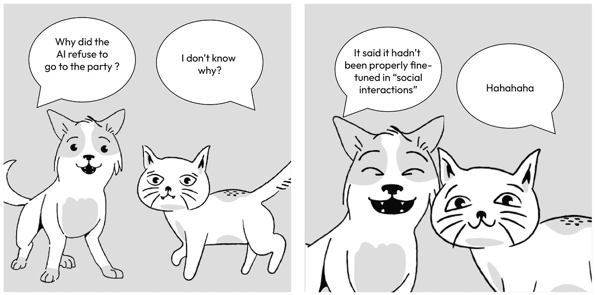

图 3.1 – 未针对社交互动微调的 AI

# 什么是微调以及为什么它很重要？

一般性 LLM（如 GPT-3）固有的问题包括其倾向于产生错误、有毒内容或负面情绪的输出。这归因于 LLM 的训练，其重点在于从庞大的互联网文本中预测后续单词，而不是安全地完成用户的语言任务。本质上，这些模型缺乏与用户目标的对齐。

让我们看看 2023 年上半年我发现的三个案例，这些案例展示了 ChatGPT 的幻觉问题。

**案例 1 – 一位美国法学教授被 ChatGPT 错误指控为性侵犯者**，生成的回复引用了一份不存在的华盛顿新闻报告。如果这种错误信息没有被注意到，可能会对教授的名誉造成严重且无法修复的后果（来源：[`www.firstpost.com/world/chatgpt-makes-up-a-sexual-harassment-scandal-names-real-professor-as-accused-12418552.html`](https://www.firstpost.com/world/chatgpt-makes-up-a-sexual-harassment-scandal-names-real-professor-as-accused-12418552.html))。

**案例 2 – 一位律师在法庭上使用 ChatGPT 并引用了虚假案例**。一位律师使用 ChatGPT 帮助处理一起航空诉讼案件。AI 建议了虚假案例，律师不知情地在法庭上提出了这些案例。这个错误导致一位法官考虑采取制裁措施，并引起了人们对法律环境中 AI“幻觉”的关注（来源：[`www.forbes.com/sites/mollybohannon/2023/06/08/lawyer-used-chatgpt-in-court-and-cited-fake-cases-a-judge-is-considering-sanctions/?sh=2f13a6c77c7f`](https://www.forbes.com/sites/mollybohannon/2023/06/08/lawyer-used-chatgpt-in-court-and-cited-fake-cases-a-judge-is-considering-sanctions/?sh=2f13a6c77c7f))。

**案例 3 – ChatGPT 可以编造信息**。根据 ChatGPT 的说法，1956 年 7 月 10 日，《纽约时报》在题为《机器将能够学习，解决问题，科学家预测》的文章中首次报道了“人工智能”。然而，需要注意的是，虽然回复中提到的 1956 年达特茅斯学院会议是真实的，但该文章本身并不存在；ChatGPT 生成了这些信息。这突显了 ChatGPT 不仅能够提供错误信息，还能编造包括姓名、日期、医学解释、书籍情节、互联网地址，甚至从未发生过的历史事件等细节（来源：[`www.nytimes.com/2023/05/01/business/ai-chatbots-hallucination.html`](https://www.nytimes.com/2023/05/01/business/ai-chatbots-hallucination.html))。

注意

上述的幻觉问题发生在 2023 年上半年度。从那时起，OpenAI 已经采取了严格的措施和幻觉缓解系统。

为了遏制幻觉，除了提示工程和 RAG 技术之外，微调是潜在选项之一，这两者我们将在后续章节中讨论。如前所述，微调针对特定任务或领域定制 LLM。在 LLM 中，权重指的是神经网络参数，这些参数在模型训练过程中学习，并用于根据输入数据计算输出，从而使模型能够做出预测和生成文本。本质上，微调通过使用特定于任务的特定数据来细化这些参数，从而改进预训练模型。

现在，让我们考虑微调的好处：

+   **减少幻觉**：在可信数据上进行的微调减少了模型生成错误或虚构输出的倾向。

+   **更好的任务性能**：由于模型是根据您的特定要求定制的，因此它可以产生更好的响应，这些响应对于您的特定用例是必需的。例如，BioGPT，使用生物医学数据集从 GPT 模型微调，与未微调的 GPT 模型相比，为医学查询提供了改进的答案。

+   **成本效益**：虽然微调时会有初始的前期成本，但一旦模型被微调，您就不需要向提示提供那么多的少样本样本，这导致提示更短，成本更低。我们将在*第五章*中进一步讨论少样本提示技术。

+   **降低延迟**：较小的提示也意味着较低的延迟请求，因为 LLM 处理您的 API 调用所需的资源更少。

+   **一致的结果**：使用特定领域的数据集微调 LLM 可以增强其在该领域内响应的一致性和准确性。例如，使用医学研究论文数据集训练通用语言模型不仅提高了其响应的准确性，还确保了在该领域内多个查询的一致输出。例如，当模型被要求“描述 2 型糖尿病的典型症状”时，微调模型可能会准确且一致地回答，“2 型糖尿病的典型症状包括口渴增加、频繁排尿、饥饿、疲劳和视力模糊。”这种专业训练确保模型为医学查询提供更可靠的信息，并在类似查询中保持这种一致性。

在本节中，我们探讨了微调的“是什么”和“为什么”。现在让我们了解一些现实世界的用例，在这些用例中，微调可以为您的 AI 应用增加价值。

# 微调应用

微调可以应用于广泛的自然语言处理任务，包括以下内容：

+   **文本分类**：这涉及到通过检查其内容或上下文将文本分类到预定义的类别中。例如，在客户评论的情感分析中，我们可以将文本分类为正面、负面或中性。

+   **标记分类**：这涉及到对文本中的单词进行标记，通常是为了识别名称或特定实体。例如，当将命名实体识别应用于文本时，我们可以识别人名、城市等。

+   **问答**：这涉及到以自然语言提供有效的答案。

+   **摘要**：这涉及到提供长文本的简洁摘要——例如，总结新闻文章。

+   **语言翻译**：这涉及到将文本从一种语言转换为另一种语言。例如，将文档从英语翻译成西班牙语。

上述微调任务是其中最受欢迎的。这是一个快速发展的领域，更多任务正在出现，可以在 Hugging Face ([`huggingface.co/docs/transformers/training`](https://huggingface.co/docs/transformers/training)) 和 Azure 的机器学习工作室（模型目录）上找到。

每次都将其通用语言模型精炼为特定任务的专家。模型也可以在不更新其权重的需要下进行定制。这个过程被称为情境学习或少样本学习。我们将在*第五章*中介绍这一内容，该章节专注于提示工程。

在我们深入探讨不同的微调技术之前，了解微调 LLM 模型的前一步骤——预训练——也是至关重要的。这个基础训练阶段为 LLM 奠定了基础，为微调的定制调整做好了准备。在接下来的部分，我们将对比预训练和微调，强调后者独特的优势和改进。

# 检查预训练和微调过程

预训练和微调是训练 GPT-3.5 等语言模型时的两个关键阶段。预训练类似于学生的通识教育，它涵盖广泛的学科以提供基础知识。另一方面，微调则类似于学生在大学后期专注于某一特定学科，为特定领域磨练技能。在 LLM 的背景下，预训练设定了广泛的基础，而微调则将焦点缩小，以在特定任务中表现出色。在本节中，我们将探讨预训练和微调，看看微调是如何增加价值的：

.jpg)

图 3.2 – 两步 LLM 训练过程

让我们概述这两个阶段。

## 预训练过程

预训练是训练语言模型的初始阶段。在这个阶段，模型从大量的文本数据中学习，通常被称为“预训练语料库”。预训练的目标是帮助模型从文本中学习语法、句法、上下文甚至一些世界知识。模型被训练来预测句子中的下一个单词，给定前面的单词。预训练的结果是一个已经学习到语言的一般理解的模型，可以生成连贯的文本。然而，它缺乏特定性和生成目标或领域特定内容的能力。

创建更高级模型的基石在于利用原始且智能的训练数据。以下图显示了用于预训练 OpenAI 的 GPT-3 模型的数据集。这些数据集在用于预训练之前经过了数据准备，以去除重复项并确保多样性和无偏见：

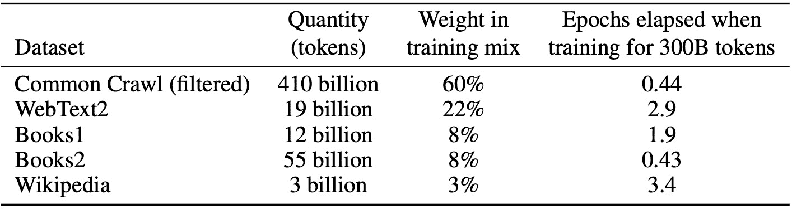

图 3.3 – 用于预训练 OpenAI 的 GPT-3 模型的数据集

例如，Meta 开发的 Llama 模型使用以下公开可用的数据集开发，经过彻底的数据净化和去重：

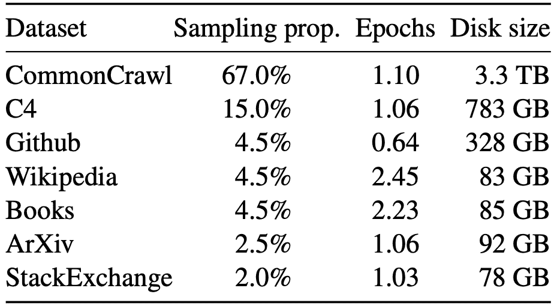

图 3.4 – Llama 模型预训练数据

这个训练数据集在标记化后由 1.4 万亿个标记组成。我们在*第二章*中简要讨论了标记的概念，将在*第五章*中更详细地讨论。

## 微调过程

微调是训练语言模型的第二个阶段，发生在预训练之后。在这个阶段，模型在更具体的数据集上进行训练，这些数据集是经过精心策划和定制的，用于特定的任务或领域。这个数据集通常被称为“微调数据集”。模型被喂入微调数据集的数据，随后预测下一个标记，并将预测与实际或“真实”值进行比较。在这个过程中，它试图最小化损失。通过重复这样做，LLM 就会针对下游任务进行微调：

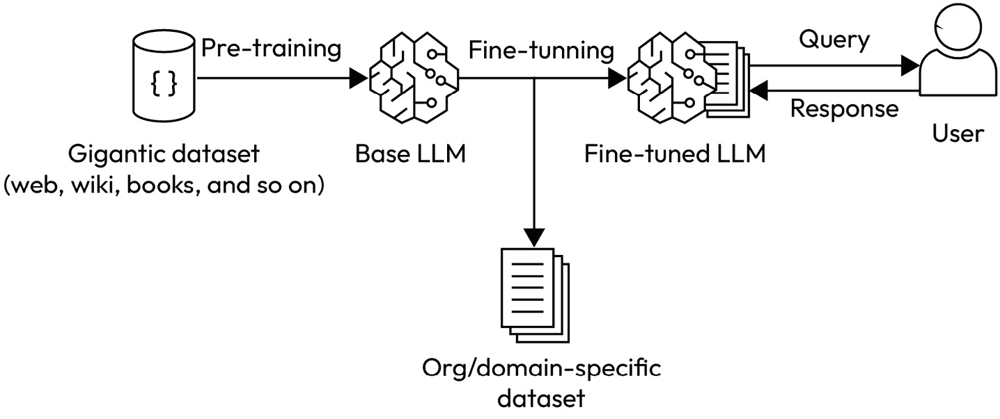

图 3.5 – 微调过程

上述图表描述了语言模型从预训练到微调的过程。最初，它在来自各种互联网文本的广泛数据集上进行训练，这些文本涵盖了各种语言结构、主题和风格。随后，它使用具有特定领域提示和补全的针对性、高质量数据集进行细化。最终，这个微调数据集的数据质量决定了模型的输出精度。最后，微调模型通过查询和响应与用户互动，满足特定的下游任务。如前所述，这些下游任务可能包括文本分类、标记分类、问答、摘要、翻译等等。

到目前为止，我们已经探讨了微调的总体概念，权衡了其优势和局限性。现在，让我们深入了解一些基本的和高级的微调技术。

# 微调模型的技巧

在本节中，我们将讨论两种微调方法：传统的完全微调方法和先进的技巧，如 PEFT，它通过集成优化来实现与完全微调相当的结果，但具有更高的效率和更低的内存和计算成本。

## 完全微调

完全微调是指使用特定任务的数据集调整预训练模型的所有参数/权重的方法。这是一个直接的方法，通常效果良好，但可能需要大量的数据来避免过拟合和计算，尤其是对于大型模型。

通用完全微调方法的挑战包括为每个下游任务更新 LLM 的所有模型参数。以下是一些需要考虑的更多问题：

+   **高计算和内存需求**：全量微调可能会极大地增加计算成本，导致大量内存需求，并需要在最先进的模型中更新数十亿或数万亿个参数，这可能会变得难以管理且效率低下。

+   **灾难性遗忘**：全量微调一旦在新信息上进行微调，就很容易忘记旧信息。

+   **多个 LLM 副本**：微调需要为每个任务（如情感分析、机器翻译和问答任务）构建 LLM 的完整副本，从而增加存储需求。LLM 有时可能达到几 GB 的大小，为不同的下游任务构建多个副本可能需要大量的存储空间。

为了应对这些挑战并使这个过程更加高效，出现了一种新的微调技术，称为 PEFT，它通过训练一小组参数（可能是现有模型参数的子集或一组新添加的参数）来实现与传统微调方法在不同场景下相似或更好的性能。通过这种方式，它几乎提供了相同的结果，但在计算和参数更新方面的成本更低。

在下一节中，我们将讨论不同类型的 PEFT 技术及其之间的权衡。

## PEFT

PEFT 通过训练一组较小的参数集来解决全量微调的挑战。在本节中，我们将讨论各种技术，这些技术通过训练较小的参数集来实现效率。这些参数可以是当前模型参数的子集，也可以是新增的一组参数。这些技术在参数效率、内存效率和训练速度方面有所不同，尽管模型质量和任何潜在额外的推理成本也是这些方法之间区分的因素。PEFT 技术可以大致分为三类：

+   选择性

+   加法

+   重新参数化

下图展示了 2019 年 2 月至 2023 年 2 月间发表的 40 篇研究论文中讨论的 30 种 PEFT 方法：

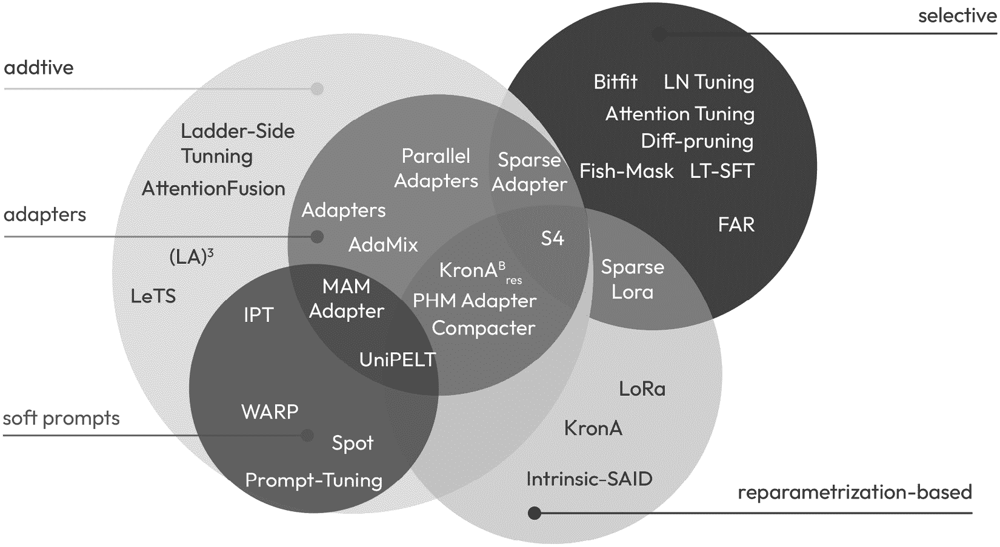

图 3.6 – 2019 年至 2023 年间研究论文中讨论的 PEFT 方法

此图摘自发表在论文《缩小规模以扩大规模：参数高效调优指南》中的调查。

在本节中，我们将深入探讨这些类别，但只涵盖那些已经显示出良好结果的最重要的 PEFT 技术。

### 加法

加性方法的核心概念是通过添加额外的参数或层来微调模型，专门训练这些新参数，并保持原始模型权重冻结。尽管这些技术向网络引入了新的参数，但通过减少梯度和优化器状态的大小，它们有效地减少了训练时间并提高了内存效率。这是 PEFT 方法中最广泛探索的类别。这个类别中的一个突出方法是带软提示的提示调整。

#### 带软提示的提示调整

这种调整涉及冻结模型权重，而不是像模型微调那样更新模型参数，而是更新提示参数。当你冻结模型的权重时，你防止它们在训练过程中被更新。这些权重在整个微调过程中保持不变。与传统的微调相比，这是一种计算和能源效率非常高的技术。提示调整不应与提示工程混淆，我们将在*第五章*中讨论。为了更好地理解提示调整，我们需要了解软提示和嵌入空间的概念。

#### 软提示和嵌入空间

嵌入向量空间是一个高维空间，其中单词、短语或其他类型的数据被表示为向量，使得语义上相似的项目在空间中彼此靠近。在自然语言处理的情况下，这些嵌入捕捉了单词或句子之间的语义含义和关系，允许进行可以推断相似性、类比和其他语言模式的操作。

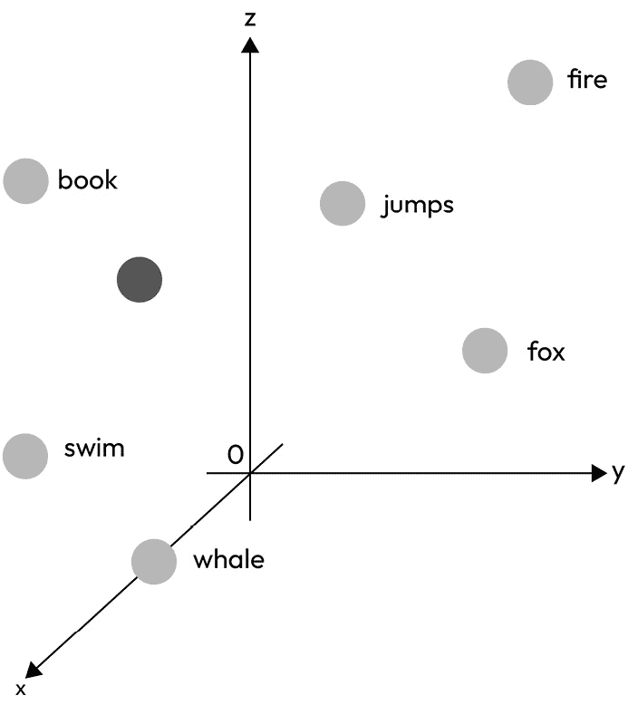

图 3.7 – 软提示与硬提示

上图展示了沿 *X*、*Y* 和 *Z* 轴的 3D 嵌入向量空间。将自然语言通过标记表示被认为是具有挑战性的，因为每个标记都与嵌入向量空间中的一个特定位置相关联。因此，它们也被称为硬提示。另一方面，软提示不受自然语言中固定、离散单词的限制，可以在多维嵌入向量空间中取任何值。在下面的图中，“跳跃”、“狐狸”等单词是硬提示，而未标记的黑色标记是软提示。

#### 提示调整过程

在提示调整中，软提示，也称为虚拟标记，与提示连接；最优值的确定留给监督训练过程。如图所示，这些可训练的软标记被添加到嵌入向量表示之前——在这种情况下，“学生学习科学：”

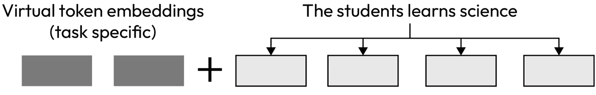

图 3.8 – 软提示连接

下图提供了该过程的更详细表示。向量附加到每个嵌入输入向量的开头，并输入到模型中，预测与目标进行比较以计算损失，错误反向传播以计算梯度，但只更新新的可学习向量，保持核心模型冻结。换句话说，我们正在搜索嵌入空间中 LLM 应接受的提示的最佳表示。尽管我们难以理解以这种方式学习的软提示，但它们可以帮助我们了解如何使用标记数据集完成任务，与手工编写的文本提示做相同的工作，但不受特定单词或短语的限制：

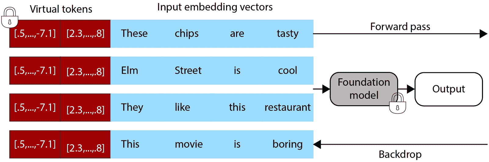

图 3.9 – 提示调整过程（详细）

接下来，我们将比较三种方法：模型调整（全面微调）、提示调整和提示设计（提示工程）。如图 *图 3.10* 所示，Google 进行的研究显示了模型调整、提示调整和提示设计之间的差异（通过学习软提示引导冻结语言模型，QUINTA-FEIRA，2022 年 2 月 10 日，由 Google 研究的 AI 居民 Brian Lester 和高级软件工程师 Noah Constant 发布）。

模型调整（全面微调）：

+   这种方法从预训练模型开始，然后使用额外的输入数据在该特定任务上进行进一步训练（或“调整”）。在这个过程中，模型变得更加专业化。

+   这种方法将“强任务性能”表示为模型与特定任务更加一致。

提示调整：

+   与调整整个模型不同，只调整模型中的提示或输入。主要模型保持“冻结”或不变。

+   这引入了“可调整软提示”的概念，可以通过调整来从模型中获得所需的输出。

+   这种方法结合了预训练模型的一般能力与更具体的任务方法，从而实现“高效的多任务服务”。

提示设计（提示工程）：

+   重点在于设计一个非常具体的输入或提示，以引导预训练模型产生所需的输出。

+   与提示调整类似，主要模型保持“冻结”状态。

+   这种方法是通过精心构建正确的输入来利用预训练模型的广泛知识和能力。如前所述，我们将在*第五章*中详细介绍提示工程。

在提示调整和提示设计中，原始模型权重保持冻结，而在模型调整中，模型参数被更新：

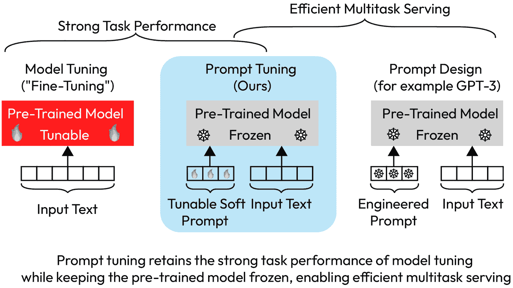

图 3.10 – 模型调整、提示调整和提示设计

下图展示了左侧的模型调整（完全微调）和右侧的提示调整。为特定任务调整模型需要为每个下游任务创建整个预训练模型的特定版本，并且必须使用单独的数据批次进行推理。另一方面，提示调整只需要为每个任务存储一个小型的、特定于任务的提示，允许使用原始预训练模型进行混合任务推理。使用 T5 “XXL” 模型，每个调整后的模型版本需要 110 亿个参数。相比之下，我们的调整提示只需要每个任务 20,480 个参数，假设提示长度为 5 个标记，这减少了超过五个数量级：

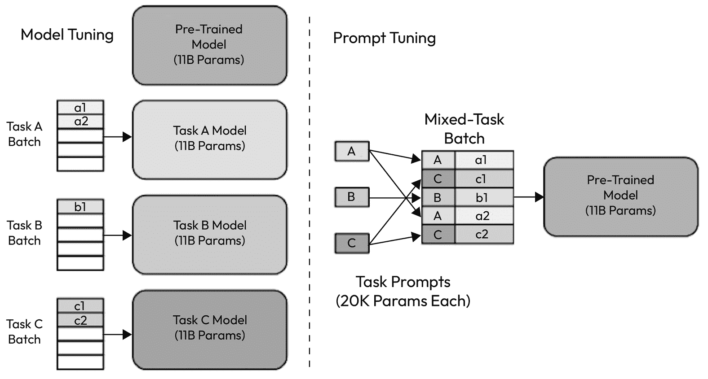

图 3.11 – 模型调整与提示调整

现在，让我们看看与提示工程和模型微调相比，提示调整的优点：

+   与模型微调相比，提示调整不需要为每个任务创建 LLM 的副本，从而减少了存储空间

+   与少样本提示工程相比，提示调整不受上下文长度或有限示例数量的限制

+   而不是精心制作最佳的手动提示以生成所需输出，你可以使用反向传播自动学习一个新的模型

+   对领域变化具有弹性

来自谷歌的论文《参数高效提示调整的规模力量》突出了在 T5 变换器模型上进行的实验（*图 3**.12*）。根据评估，随着规模的增加，T5 模型上的提示调整与模型调整（或微调）的质量相匹配，同时允许所有任务重用单个冻结模型。这种方法在 GPT-3 的少样本提示设计中表现显著。SuperGLUE 是一个基准，旨在全面评估各种自然语言理解模型在一系列具有挑战性的语言任务中的性能。我们将在本章接下来的部分中了解更多关于 SuperGLUE 的信息：

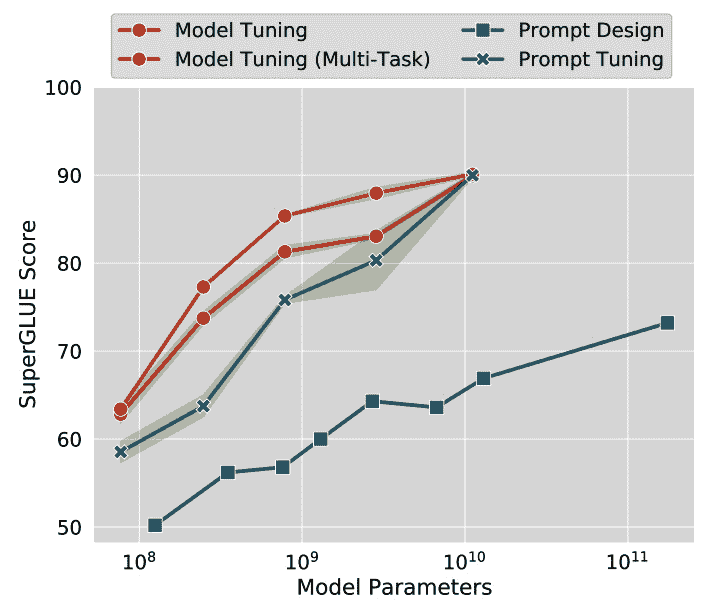

图 3.12 – SuperGLUE 分数与模型参数之间的关系

*图 3**.12 展示了不同微调技术下 SuperGLUE 分数与模型参数之间的关系。随着规模的增加，尽管调整的参数减少了 25,000 次，提示调整与模型调整相匹配*。

以下来自谷歌研究团队的 GitHub 仓库提供了提示调整实验的代码实现：[`github.com/google-research/prompt-tuning`](https://github.com/google-research/prompt-tuning)。

在提示微调的缺点方面，解释软提示可能具有挑战性，因为这些标记不是固定的硬提示，也不代表自然语言。为了理解最接近的含义，必须将嵌入转换回标记，并通过测量余弦相似度确定最接近的 k 个邻居。这是因为最接近的邻居形成一个具有语义相似性的语义组。

### 重参数化

常规全微调，涉及重新训练语言模型中的所有参数，随着模型规模的增加变得不可行。这可能会变得计算成本非常高。因此，研究人员确定了一种新的方法，称为重参数化，这是一种在微调中使用的技巧，旨在减少模型中的可训练参数数量，同时保持其有效性。这些方法使用低秩变换来重新参数化权重，从而减少可训练参数的数量，同时仍然允许该方法与高维矩阵（如网络的预训练参数）一起工作。让我们探讨一个非常流行的重参数化方法，称为**低秩****适应**（**LoRa**）。

#### LoRA

为了提高微调的效率，LoRA 利用了一种方法，通过低秩分解使用两个紧凑的矩阵来表示权重更新。这种方法包括锁定预训练模型权重，并在 Transformer 架构的每一层引入可训练的低秩分解矩阵。低秩分解，通常简称为低秩近似，是一种数学方法，用于用两个低秩矩阵的乘积来近似给定的矩阵。这种技术的首要目标是捕获原始矩阵中包含的最重要信息，同时使用更少的参数或维度。实验结果表明，LoRa 可以将可训练参数的数量减少超过 96%。

下图显示了常规微调和 LoRA 之间的差异。如您所见，在全微调中通过反向传播确定的权重更新 W_delta 在 LoRA 中被分解为两个低秩矩阵。W_a 和 W_b 提供了与原始 W_delta 相同的信息，但以更有效的方式表示：

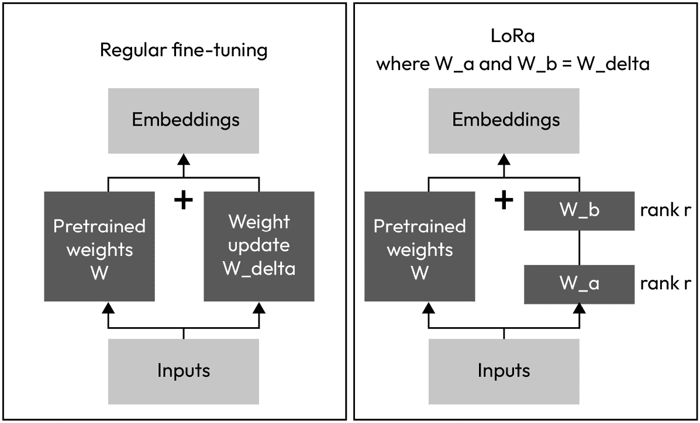

图 3.13 – 比较常规全微调和 LoRA

如下表所示，研究人员发现，通过仅更新可训练参数的 0.02%（37.7M/175,255.8M），LoRa 微调与 GPT-3 的全微调相匹配或优于全微调。使用 LoRA，可训练参数的数量减少到 4.7M 和 37.7M，从全微调的约 175B。评估指标使用了**ROUGE**，我们将在本章后面讨论。

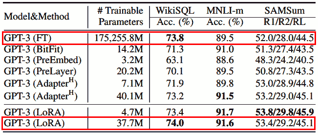

图 3.14 – 使用 LoRA 的微调效率

现在，让我们考虑 LoRA 的好处：

+   LoRA 通过显著减少可训练参数来提高微调效率，因此可以在单个 GPU 上训练，避免了分布式集群 GPU 的需求。

+   原始预训练权重保持不变，允许使用各种轻量级的 LoRA 模型在顶部执行不同的任务。这消除了为每个下游任务创建完整微调模型副本的需要。

+   LoRA 可以与许多其他 PEFT 技术相结合。

+   LoRA 微调模型与完全微调模型的表现相当。

+   使用 LoRA 作为适配器权重与基础模型集成时，没有增加服务延迟，允许快速任务切换。

### 选择性

选择性方法是最简单的微调方法，因为它只涉及网络的顶层。然而，研究人员提到，虽然它们可能在涉及规模较小、模型参数少于 10 亿的数据场景中表现出色，但与传统的微调方法相比，它们可能需要大量的计算资源和内存。因此，在选择 PEFT 方法时，这些方法不应是首选。

**BitFit**是选择性 PEFT 方法之一，仅微调网络的偏差。BitFit 仅更新了 0.05%的模型参数，最初在低中数据场景下展示了与完整微调相当甚至更好的结果，这些 BERT 模型包含的参数少于 10 亿。当评估更大型的网络，如 T0-3B 或 GPT-3 时，BitFit 的性能明显落后于完整微调和其他 PEFT 方法。

其他重要的选择性 PEFT 技术包括 DiffPruning、FishMask、Freeze 和 Reconfigure。

在理解了微调之后，让我们探索一种与微调过程相关的方法：RLHF。这种方法利用人类洞察力进一步调整模型行为和输出，使其更接近人类价值观和期望。让我们深入了解 RLHF 的工作原理及其在微调领域的重要性。

# RLHF – 将模型与人类价值观对齐

微调对于实现特定任务是有益的，从而提高准确性和改进模型适应性，但模型有时可能会表现出不受欢迎的行为。它们可能会产生有害的语言，表现出攻击性，甚至分享有关危险主题（如武器或爆炸物制造）的详细指导。这些行为可能会对社会造成损害。这源于模型是在包含恶意内容的广泛互联网数据上训练的。预训练阶段和微调过程可能会产生反效果、危险或误导的结果。因此，确保模型与人类的伦理和价值观相一致至关重要。额外的细化步骤应整合三个基本的人类原则：**有用性、无害性和诚实性**（**HHH**）。RLHF 是一种训练机器学习模型的方法，特别是在强化学习（RL）的背景下，它使用来自人类的反馈。为了理解 RLHF，我们必须了解 RL 的概念：

+   **RL**：这是一种机器学习类型，其中代理通过在环境中采取行动以最大化某种累积奖励的概念来学习做出决策。代理与环境互动，以奖励或惩罚的形式接收反馈，并相应地调整其行动。例如，一个下棋的 AI 通过赢得棋局获得积分来改进其策略，而犯错误则失去积分。

    RLHF 是一种 RL，其中传统的奖励信号，通常来自环境，被来自人类的反馈所取代或增强。最初，模型被训练来模仿人类行为。然后，而不是完全依赖环境奖励，人类通过比较不同的动作序列或轨迹来提供反馈。这种人类反馈用于训练奖励模型，然后指导代理的学习过程，帮助它在环境中改善其决策和行动。RLHF 的核心组件是奖励模型和 RL 算法。

+   **奖励模型**：在强化学习的背景下，奖励模型是一种根据代理在给定状态下采取的行动提供数值奖励信号给代理的模型。而不是手动设计奖励函数，这可能会很具挑战性和容易出错，奖励模型通常从数据中学习，通常结合人类反馈。

+   **人类反馈**：如图所示，LLM 模型的输出由人类通过评分系统进行排序，然后输入到奖励模型中。在学习过程中，奖励模型通过展示示例或提供交互式反馈，教会代理什么是有帮助的、无害的和诚实的：

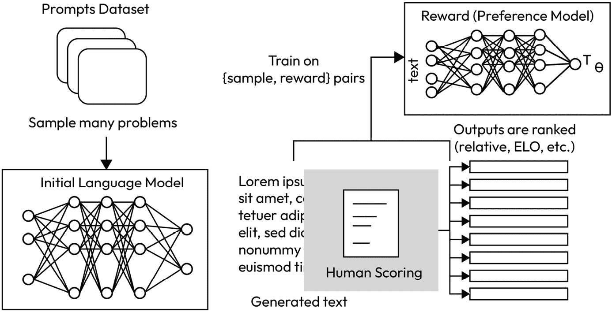

图 3.15 – 来自 Hugging Face 的奖励模型训练过程（来源：[`huggingface.co/blog/rlhf`](https://huggingface.co/blog/rlhf)）

+   **RL 算法**：RL 算法利用奖励模型的输入来改进 LLM，逐步提高奖励分数。一种流行的 RL 算法是近端策略优化。如图所示，首先，LLM 生成一个输出，该输出由奖励模型定量评估，以提供 1.79 的奖励分数。这个奖励被发送到 RL 算法，然后 RL 算法更新 LLM 的权重。最近出现的一种非常流行的 RL 算法是 PPO。理解 PPO 的内部细节超出了本书的范围，但更多信息可以在 Open AI 的研究论文《近端策略优化算法》中找到：

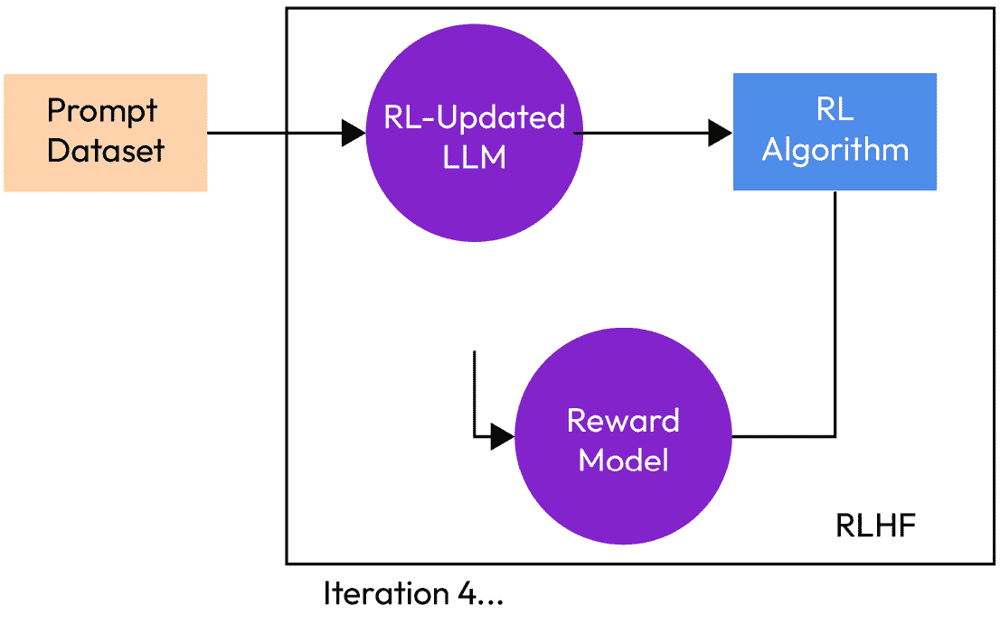

图 3.16 – 使用 RL 算法更新 LLM

+   **潜在风险 - 奖励黑客攻击**：在强化学习中，智能体寻求最大化环境提供的奖励模型。然而，有时智能体会发现未经意料的捷径或漏洞，在不实际解决预期任务的情况下获得高奖励。这被称为“奖励黑客攻击”。这可能导致 RLuUpdated LLM 生成语法错误的句子、无意义的句子或夸张的积极句子以最大化奖励。为了减轻这一点，PPO 通过使用**Kullback-Leibler** (**KL**)-距离来设定策略修改幅度的界限。这种限制是通过使用**Kullback-Leibler**（**KL**）-距离来实现的。

+   **Kullback-Leibler (KL)**: 距离度量一个概率分布与另一个参考分布之间的差异程度。所罗门·库尔巴克和理查德·A·莱布勒于 1951 年将这一概念引入世界。在 PPO 的背景下，KL 距离在引导优化中起着关键作用，确保改进后的策略与其前身保持紧密一致。换句话说，它确保了强化学习对 LLM 的更新不会过于剧烈，并保持在阈值值内。

# 如何评估微调模型性能

到目前为止，我们已经学习了如何微调 LLM 以满足我们的需求，但如何评估一个模型以确保其表现良好？但我们如何知道微调后的模型在特定任务上是否比其前身模型有所改进？有哪些行业标准基准我们可以依赖来评估模型？在本节中，我们将了解 LLM（如 GPT）是如何被评估的，并使用研究人员开发的最流行的基准。

## 评估指标

**双语评估助手**（**BLEU**）和**基于理解评估的召回率助手**（**ROUGE**）都是广泛使用的用于评估机器生成文本质量的指标，尤其是在机器翻译和文本摘要的背景下。它们以不同的方式衡量生成文本的质量。让我们更深入地了解一下。

### ROUGE

ROUGE 是一组用于通过将它们与参考摘要进行比较来评估摘要质量的指标。它主要用于评估文本摘要，但也可以应用于其他任务，如机器翻译。ROUGE 关注生成摘要和参考摘要之间的 n-gram 重叠——即*n*个项目的单词序列。

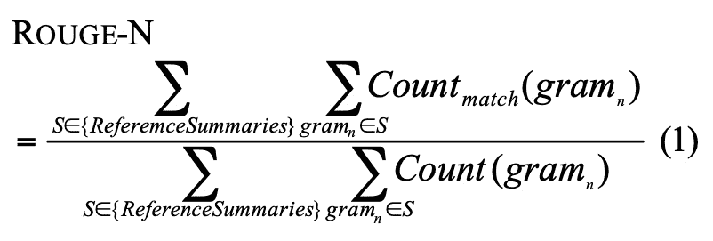

图 3.17 – ROUGE-N 的公式

ROUGE 最常见的变体如下：

+   **ROUGE-N**：此变体衡量 n-gram 的重叠。例如，ROUGE-1 查看 1-gram（单个单词）的重叠，ROUGE-2 考虑 2-gram（两个连续的单词），依此类推。

+   **ROUGE-L**：此变体考虑生成摘要和参考摘要之间的最长公共子序列。它关注两个摘要都共享的最长序列单词集。

+   **ROUGE-S**：此变体衡量跳过双词的重叠，即句子中不考虑顺序的单词对，允许存在间隔。

现在，让我们来看一个例子。

让我们使用专注于单个单词重叠的 ROUGE-1 来举例说明：

+   参考摘要：“男孩跌倒在草地上”

+   生成摘要：“男孩在草地上。”

在这里，除了“was”和“fell”之外，其他每个单词在两个摘要之间都匹配。

参考中的总单词数 = 6

匹配单词 = 5

因此，ROUGE-1 的召回率（参考摘要中有多少单词也出现在生成摘要中）如下：

5/6 = 0.83 或 83%

ROUGE 还可以计算精确度（生成摘要中有多少单词出现在参考摘要中）和 F1 分数（精确度和召回率的调和平均值）。

在这个例子中，我们有以下内容：

+   精度：5/6 = 0.83 或 83%

+   F1 分数：2 * (Precision * Recall) / (Precision + Recall) = 83%

虽然 ROUGE 分数给出了生成文本和参考文本之间重叠的定量度量，但需要注意的是，高 ROUGE 分数并不总是意味着生成的摘要质量高。其他因素，如连贯性和流畅性，并未被 ROUGE 所捕捉。

### BLEU

BLEU 是评估从一种自然语言翻译成另一种自然语言的文本质量的指标。BLEU 背后的核心思想是，如果翻译质量好，翻译中的单词和短语应该与人类制作的参考翻译中的单词和短语以相同的顺序出现。

BLEU 考虑了机器生成翻译中与人工参考翻译（s）相比的 n-gram（文本中连续的*n*个项的序列）的精确度。典型的 BLEU 分数考虑了 1-gram（单个单词）、2-gram（连续单词对）、3-gram 和 4-gram 的精确度，然后通过加权几何平均计算最终分数。它还包含对翻译长度短于其参考的惩罚，称为简短惩罚（来源：BLEU，[`aclanthology.org/P02-1040.pdf`](https://aclanthology.org/P02-1040.pdf))。

注意

ROUGE 和 BLEU 都是简单的指标，可用于诊断目的，但不应该用于模型的全面最终评估。因此，为了进行更全面的评估，我们必须考虑基准方法。这些将在下一节中讨论。

## 基准

基准对于评估同样至关重要。这是一个快速发展的研究领域，因此在本节中，我们重点关注截至 2024 年初的重要基准。基准是用于衡量和比较模型在各个领域（如理解、生成或准确性）性能的测试或任务。它们帮助研究人员和开发者评估模型理解和生成文本的能力，并可用于比较一个大型语言模型（LLM）与另一个 LLM 的性能或跟踪随时间的变化。ROUGE 和 BLEU 等评估指标对 LLM 的能力提供了有限的见解。因此，为了获得 LLM 的更全面视角，我们可以利用 LLM 研究人员开发的现有评估数据集和相关基准。

### GLUE 和 SuperGLUE

**通用语言理解评估**（**GLUE**）是一个用于评估各种任务上自然语言理解（**NLU**）模型性能的基准套件。GLUE 于 2018 年推出，包括九个 NLU 任务，如情感分析、问答和文本蕴含等。它旨在通过提供一套标准任务以促进模型比较和竞赛，并推动 NLU 模型所能达到的边界。

在 GLUE 的基础上，**SuperGLUE**（[`super.gluebenchmark.com`](https://super.gluebenchmark.com)/）是一个后来推出的更具挑战性的基准。它是对原始 GLUE 任务上模型性能快速进步的回应。SuperGLUE 包含一系列更加多样化和困难的任务，旨在进一步推动最先进 NLU 模型的能力，并为未来模型提供一个严格的评估框架。

截至 2024 年初，SuperGLUE ([`arxiv.org/pdf/1905.00537.pdf`](https://arxiv.org/pdf/1905.00537.pdf)) 可以评估 10 个 NLU 任务中的模型。这包括**布尔问题**（**BoolQ**）、**承诺银行**（**CB**）、**合理替代选择**（**COPA**）、**多句阅读理解**（**MultiRC**）、**常识推理阅读理解数据集**（**ReCoRD**）、**识别文本蕴涵**（**RTE**）、**上下文中的词**（**WiC**）、**Winograd 方案挑战**（**WSC**）、广泛覆盖诊断（AX-b）和 Winogender 方案诊断（性别平等/准确率）。让我们更详细地看看：

| **任务** | **描述** | **示例** |
| --- | --- | --- |
| BoolQ | 根据文章回答是/否问题。 | 文章：“海豚以其智慧而闻名。” | 问题：“海豚因智慧而受到认可吗？” | 答案：是。 |
| CB | 预测语句中的承诺程度。 | 前提：“我认为猫可能在大花园里。” | 假设：“猫在大花园里。” | 推论：未知（前提暗示了一种可能性，但并没有坚定地承诺猫在大花园里。） |
| COPA | 在给定的前提中，在两个合理的替代选项之间选择原因或结果。 | 前提：“地面湿了。” | 问题：“是什么导致了这种情况？” | 选项：(a) 下雨了。(b) 晴天。 | 答案：(a) 下雨了。 |
| MultiRC | 回答关于文章中单个句子的提问。 | 文章：“木星是最大的行星。它主要由氢组成。” | 问题：“木星主要由什么组成？” | 答案：氢。 |
| ReCoRD | 使用上下文在文章中填空。 | 文章：“Lara 喜欢阅读。她最喜欢的类型是 ____。她已经读完了所有的侦探小说。” | 填空：神秘。 |
| RTE | 判断前提句子是否蕴涵假设句子。 | 前提：“狗是哺乳动物。” | 假设：“狗是活产。” | 推论：真。 |
| WiC | 判断一个词在两个句子中是否有相同的意思。 | 句子 1：“他使用钥匙打开门。” | 句子 2：“答案是这个谜题的关键。” | 词：“钥匙” | 答案：不同的含义。 |
| WSC | 确定句子中的代词指代哪个名词短语。 | 句子：“奖杯太大，放不进手提箱。” | 问题：“什么太大？” | 答案：奖杯。 |

图 3.18 – SuperGLUE 基准

下图显示了 SuperGLUE 基准排行榜（[`super.gluebenchmark.com/leaderboard`](https://super.gluebenchmark.com/leaderboard)），其中 LLM 模型在各种 NLU 任务中领先：

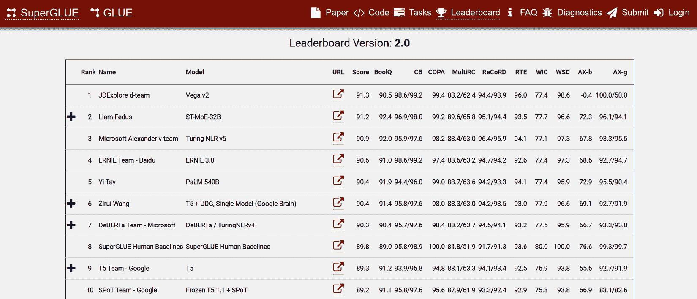

图 3.19 – 2024 年 2 月的 SuperGLUE 基准排行榜快照

### 大规模多任务语言理解（MMLU）

MMLU 于 2021 年建立。这个基准非常适合现代大型语言模型。目标是评估和比较模型在他们的世界知识和问题解决能力方面的表现。该基准涵盖了 57 个主题，从 STEM 和人文到社会科学等领域。其复杂性从基础到专家级别不等，评估了一般知识和分析能力。主题涉及经典领域，如数学和历史，以及更狭窄的领域，如法律和伦理。基准中详细的主题范围和多样性使其非常适合确定模型的弱点。这些任务超越了由 GLUE 和 SuperGLUE 评估的基本语言理解，(来源：MMLU，[`arxiv.org/pdf/2009.03300.pdf`](https://arxiv.org/pdf/2009.03300.pdf)）。

MMLU 基准的排行榜可以在 [`paperswithcode.com/sota/multi-task-language-understanding-on-mmlu`](https://paperswithcode.com/sota/multi-task-language-understanding-on-mmlu) 找到。

### 超越模仿游戏基准（BIG-bench）

BIG-bench 是一个于 2022 年 10 月推出的协作基准。该基准的目标是构建颠覆性的模型，并在超出当前语言模型能力范围的任务上进行评估。它包含超过 204 个多样化的任务，涵盖语言学、儿童发展、数学、常识推理、生物学、物理学、社会偏见、软件开发等领域（来源：BIG-bench，[`arxiv.org/abs/2206.04615`](https://arxiv.org/abs/2206.04615)）。

以下 GitHub 仓库提供了一些代码，以便您可以使用 BIG-bench 评估您的模型：[`github.com/google/BIG-bench#submitting-a-model-evaluation`](https://github.com/google/BIG-bench#submitting-a-model-evaluation)。

### 全面的语言模型评估（HELM）(经典、轻量级和文本到图像)

由斯坦福研究所在 2022 年 11 月推出的 HELM Classic 基准，评估模型在七个关键指标上的表现：准确性、校准、鲁棒性、公平性、偏差、毒性和效率。HELM 框架旨在提高模型的可透明性，并提供了关于哪些模型在特定任务上表现良好的见解。该基准在 51 个场景中测量这七个指标，并揭示了模型与指标之间的权衡。该基准也在不断进化，更多场景、指标和模型正在被添加到该基准中。场景包括用例和示例数据集，例如 **数学思维链**（**MATH**）、**小学数学**（**GSM8K**）、HellaSwag（常识推理）、MMLU、OpenBook QA（问答）等。

要查看场景的完整列表，请查看 HELM Classic 场景页面：[`crfm.stanford.edu/helm/classic/latest/#/scenarios`](https://crfm.stanford.edu/helm/classic/latest/#/scenarios)。

以下链接提供了 HELM 排行榜的最新结果：[`crfm.stanford.edu/helm/lite/latest/#/leaderboard`](https://crfm.stanford.edu/helm/lite/latest/#/leaderboard).

这个 Python 包可以用来评估你的模型与 HELM 基准的对比，并与其他最突出的模型进行比较：[`crfm-helm.readthedocs.io/en/latest/`](https://crfm-helm.readthedocs.io/en/latest/)).

Helm Classic 在 ChatGPT 之前发布，其初始目标是全面评估在各种代表性场景中可用的各种语言模型，例如语言能力、推理技能、知识等，以及一系列指标。然而，它相当庞大，因此发布了一个更轻量级的版本，称为 HELM Lite。它不仅是 Classic 的子集，而且是一个更简化的版本，具有更少的核心场景。

随着多模态大型语言模型（LLMs）的普及，最近，斯坦福大学发布了一个名为 **整体图像模型评估**（**HEIM**）的新基准，该基准从 12 个不同方面评估了适用于现实世界部署的文本到图像模型（[`arxiv.org/abs/2311.04287`](https://arxiv.org/abs/2311.04287)）：

+   图像与文本对齐

+   图像质量

+   美学

+   原创性

+   理解

+   知识

+   偏见

+   毒性

+   公平性

+   健壮性

+   多语言性

+   效率

在本节中，我们深入探讨了 LLMs 的关键基准和评估指标。如果你正在构建企业级的 ChatGPT 应用程序，将 GPT 模型与顶级基准进行比较至关重要，以确保应用程序的有效性、可靠性和安全性。此类基准为此努力提供了良好的基础。

工具，如 Azure AI Studio 和 Azure Prompt Flow，提供了定性和定量解决方案来评估你的模型。它还提供了基准测试功能，帮助你使用行业领先的基准来评估不同的模型。ROUGE-N 和 BLEU 等分数可以使用 Azure Prompt Flow 的开箱即用功能进行计算。

# 微调成功的实际案例

在本节中，我们将探讨 OpenAI 实施的一种微调方法的实际案例，该方法取得了显著成果。

## InstructGPT

OpenAI 的 InstructGPT 是最成功的微调模型故事之一，为 ChatGPT 打下了基础。据说 ChatGPT 是 InstructGPT 的一个兄弟模型。用于微调 ChatGPT 的方法与 InstructGPT 相似。InstructGPT 通过使用 RHLF 对预训练的 GPT-3 模型进行微调而创建。监督微调是 RLHF 中生成符合人类偏好的响应的第一步。

在最初，GPT-3 模型并非最初设计为遵循用户指令。它们的训练侧重于根据大量互联网文本数据预测下一个单词。因此，这些模型通过使用指导数据集和 RLHF 进行了微调，以增强它们在接收到用户指令时生成更符合人类价值观的有用和相关的响应的能力：

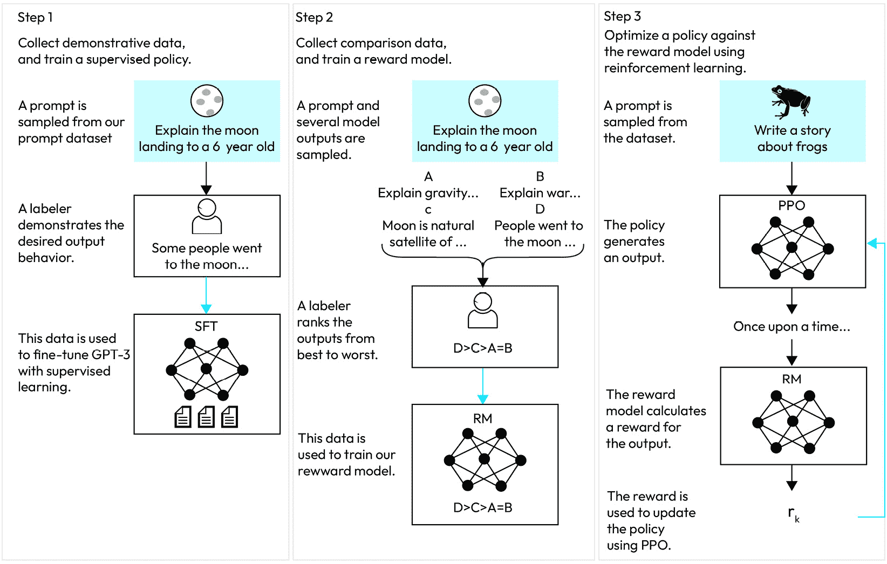

图 3.20 – 使用 RLHF 的微调过程

此图展示了 InstructGPT 微调过程的示意图：（*1*）初始的监督微调，（*2*）训练奖励模型，以及（*3*）使用此建立的奖励模型通过 PPO 执行强化学习。蓝色箭头表示使用这些数据来训练相应模型。在*步骤 2*中，A-D 框是经过标注者排名的模型样本。

下图提供了使用 RLHF 微调的模型、监督微调的模型和通用 GPT 模型响应质量的比较。*Y*轴由李克特量表组成，显示了模型输出在 1-7 尺度上的质量评分（*Y*轴），针对通过 OpenAI API 提交给 InstructGPT 模型的提示，以及各种模型大小（*X*轴）。结果显示，与 GPT-3 模型（无论是少量提示还是无提示）以及经过监督学习微调的模型相比，InstructGPT 的输出获得了标注者显著更高的评分。为此工作雇佣的标注者是独立的，并来自 Scale AI 和 Upwork：

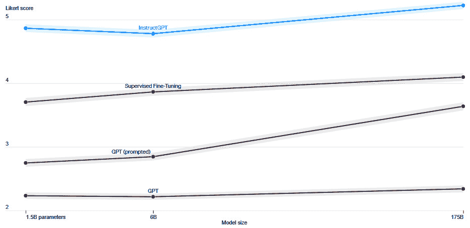

图 3.21 – InstructGPT 的评估（图片版权：Open AI）

InstructGPT 可以在毒性、真实性和适宜性等多个维度进行评估。对于真实问答和适宜性，较高的分数是可取的，而对于毒性和幻觉，则更倾向于较低的分数。幻觉和适宜性的测量是基于我们 API 中提示词的分布进行的。结果会根据不同的模型大小进行汇总：

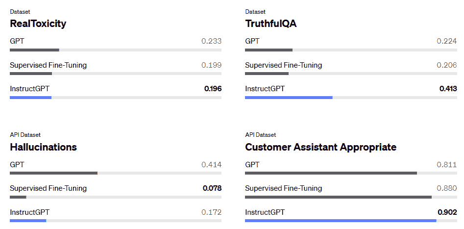

图 3.22 – InstructGPT 的评估

在本节中，我们介绍了微调的概念，并讨论了使用 RLHF 进行微调的成功案例，这导致了 InstructGPT 的开发。

# 摘要

微调是定制模型的一种强大技术，但它可能并不总是必要的。观察发现，它可能耗时且可能存在初始的前期成本。建议从更容易、更快的策略开始，例如使用少量示例的提示工程，然后使用 RAG 进行数据接地。只有当 LLM 的响应仍然次优时，才应考虑微调。我们将在下一章讨论 RAG 和提示工程。

在本章中，我们深入探讨了针对特定任务的关键微调策略。然后，我们探索了一系列评估方法和基准，以评估您精炼后的模型。RLHF 过程确保您的模型与人类价值观保持一致，使其变得有用、诚实和安全。在下一章中，我们将探讨与向量数据库配对的 RAG 方法——这是在 LLM 驱动的应用中定位企业数据并最小化幻觉的关键技术。

# 参考文献

+   [`spotintelligence.com/2023/03/28/transfer-learning-large-language-models/`](https://spotintelligence.com/2023/03/28/transfer-learning-large-language-models/)

+   [`platform.openai.com/docs/guides/fine-tuning`](https://platform.openai.com/docs/guides/fine-tuning)

+   PEFT 研究论文：[`arxiv.org/abs/2303.15647`](https://arxiv.org/abs/2303.15647)

+   BLEU：[`aclanthology.org/P02-1040/`](https://aclanthology.org/P02-1040/)

+   参数高效提示调优的规模力量：[`aclanthology.org/2021.emnlp-main.243.pdf`](https://aclanthology.org/2021.emnlp-main.243.pdf)

+   大型语言模型的低秩自适应：[`arxiv.org/abs/2106.09685`](https://arxiv.org/abs/2106.09685)

+   LLM (GPT) 微调 — PEFT | LoRA | 适配器 | 量化 | by Siddharth vij | 七月，2023 | Medium：[`tinyurl.com/2t8ntxy4`](https://tinyurl.com/2t8ntxy4)

+   InstructGPT：[`arxiv.org/abs/2203.02155`](https://arxiv.org/abs/2203.02155)

+   [`towardsdatascience.com/rag-vs-finetuning-which-is-the-best-tool-to-boost-your-llm-application-94654b1eaba7`](https://towardsdatascience.com/rag-vs-finetuning-which-is-the-best-tool-to-boost-your-llm-application-94654b1eaba7)

+   [`www.fuzzylabs.ai/blog-post/llm-fine-tuning-old-school-new-school-and-everything-in-between`](https://www.fuzzylabs.ai/blog-post/llm-fine-tuning-old-school-new-school-and-everything-in-between)

+   Llama：[`arxiv.org/abs/2302.13971`](https://arxiv.org/abs/2302.13971)

+   GLUE：自然语言理解的多元任务基准和分析平台。在 ICLR 会议论文集：[1804.07461](https://arxiv.org/abs/1804.07461)

+   SuperGLUE：通用语言理解系统的粘性基准：[1905.00537](https://arxiv.org/abs/1905.00537) [`arxiv.org/abs/1905.00537`](https://arxiv.org/abs/1905.00537)

+   MMLU 测量大规模多任务语言理解：[`arxiv.org/pdf/2009.03300.pdf`](https://arxiv.org/pdf/2009.03300.pdf)

+   BIG Bench：[`github.com/google/BIG-bench/blob/main/bigbench/benchmark_tasks/keywords_to_tasks.md#summary-table`](https://github.com/google/BIG-bench/blob/main/bigbench/benchmark_tasks/keywords_to_tasks.md#summary-table)

+   HELM：[`arxiv.org/pdf/2211.09110.pdf`](https://arxiv.org/pdf/2211.09110.pdf)

+   [`cdn.openai.com/papers/Training_language_models_to_follow_instructions_with_human_feedback.pdf`](https://cdn.openai.com/papers/Training_language_models_to_follow_instructions_with_human_feedback.pdf)
