# 4

# RAGs to Riches: 利用外部数据提升 AI

如 GPT 这样的 LLM 存在某些局限性。由于它们的训练知识截止日期，它们可能没有最新的信息。当我们希望我们的 AI 模型提供准确、上下文感知和及时响应时，这构成了一个重大挑战。想象一下，当您向 LLM 提出一个关于最新技术趋势的问题或寻求关于突发新闻事件的实时更新时，传统的语言模型在这些情况下可能会不足。

在本章中，我们将向您介绍一种颠覆性的技术，称为**检索增强生成**（**RAG**），这是 Facebook AI（现在称为 Meta）的研究人员所进行工作的成果。这是赋予 GPT 等语言模型连接其静态知识与动态现实之间差距的秘密配方。有了 RAG，我们将向您展示如何使您的生成式 AI 应用程序具备获取新信息、定位组织数据、交叉验证事实以解决幻觉，并保持上下文意识的能力，这一切都在实时进行。我们还将讨论向量数据库的基础知识，这是一种新的、热门的、新兴的数据库，旨在存储、索引和查询代表高维数据的向量；它们通常用于相似性搜索和机器学习应用，并在构建 RAG 应用程序中至关重要。

让我们了解 RAG 如何将您的语言模型转变为信息丰富的对话助手，确保无论何时提问，它都能始终了解情况。

本章我们将涵盖以下主要内容：

+   深入了解向量数据库的基本知识

+   向量存储

+   向量数据库在检索增强生成（RAG）中的作用

+   分块策略

+   使用 Azure Prompt Flow 评估 RAG

+   案例研究 – 一家跨国组织部署的全球聊天应用程序

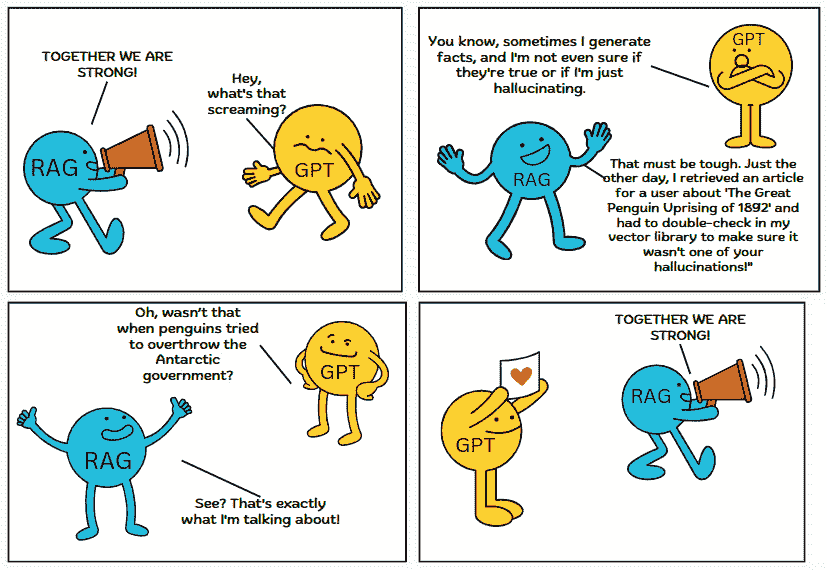

图 4.1 – RAG 的优势

# 深入了解向量数据库的基本知识

要完全理解 RAG，理解向量数据库是至关重要的，因为 RAG 严重依赖于其高效的数据检索以解决查询。向量数据库是一种设计用于存储和高效查询高维向量的数据库，常用于相似性搜索和机器学习任务。向量数据库的设计和机制直接影响 RAG 答案的效率和准确性。

在本节中，我们将介绍向量数据库（向量及其嵌入）的基本组件，在下一节中，我们将深入探讨向量数据库的重要特性，这些特性使得基于 RAG 的生成式 AI 解决方案成为可能。我们还将解释它与常规数据库的不同之处，并将其全部联系起来解释 RAG。

## 向量和向量嵌入

向量是一个具有大小和方向的数学对象，可以用一组有序的数字来表示。在更广泛的意义上，尤其是在计算机科学和机器学习领域，向量可以被看作是一个表示一定维度空间中点的数字数组或列表。以下图像中所示，在二维空间（左侧），一个向量可能表示为[x, y]，而在三维空间（右侧），它可能表示为[x, y, z]：

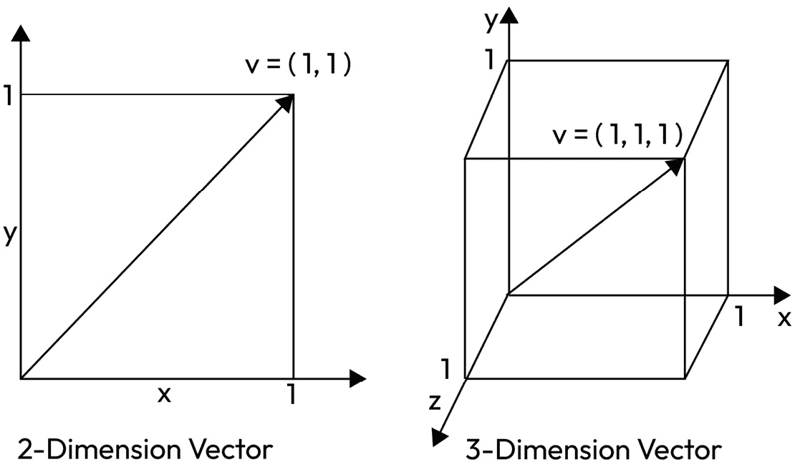

图 4.2 – 2D 和 3D 空间中向量的表示

向量嵌入指的是将对象，如单词、句子，甚至整个文档，在高度维度空间中表示为向量的过程。高度维度空间指的是具有超过三个维度的数学空间，常用于数据分析机器学习中表示复杂的数据结构。想象一下，这是一个你可以向超过三个方向移动的房间，便于描述和分析复杂数据。嵌入过程将单词、句子或文档转换为向量表示，捕捉它们之间复杂的语义关系。因此，具有相似意义的单词在高度维度空间中往往彼此靠近。现在，你可能想知道这如何在设计包含 LLMs 的生成式 AI 解决方案中发挥作用。向量嵌入提供了数据的基础表示。它们是多种类型数据的标准化数值表示，LLMs 使用它来处理和生成信息。这种将单词和句子转换为数值表示的嵌入过程由 OpenAI 的 text-embedding-ada-002 等嵌入模型启动。让我们用一个例子来解释这一点。

以下图像直观地表示了在二维向量嵌入空间中哺乳动物和鸟类的聚类，区分了它们的现实和卡通表现。这幅图像描绘了“现实”和“卡通”表示之间的光谱，进一步分为“哺乳动物”和“鸟类”。在现实方面，有一只哺乳动物（麋鹿）和三只鸟（一只猫头鹰、一只老鹰和一只小鸟）。在卡通方面，有风格化和异想天开的卡通版本，包括一个滑稽的鹿、一只猫头鹰和夸张的鸟类角色。LLMs 使用这样的向量嵌入空间，这些是高度维度空间中对象的数值表示，来理解、处理和生成信息。例如，想象一个旨在教育儿童了解野生动物的教育应用程序。如果学生提示聊天机器人提供卡通风格的鸟类图像，LLM 将搜索并从右下象限生成信息：

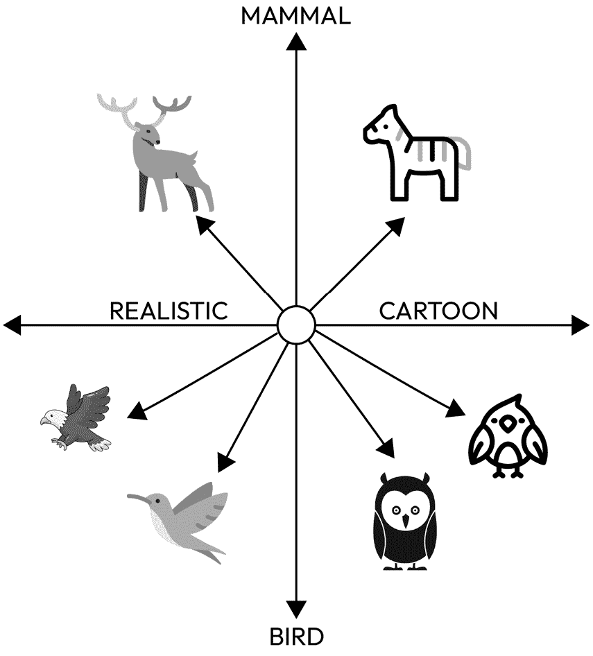

图 4.3 – 在高维空间中具有相似特征的动物的位置，展示了“相关性”

现在，让我们深入了解嵌入模型的演变，这些模型在高度维度的空间中产生嵌入，即对象的数值表示。嵌入模型经历了显著的演变，从最初将离散单词映射到密集向量的方法（如词向量（Word2Vec）、全局单词表示向量（GloVe）和 FastText）过渡到更复杂的基于深度学习架构的上下文嵌入。这些较新的模型，如来自语言模型的嵌入（ELMos），利用基于长短期记忆（LSTM）的结构来提供上下文特定的表示。基于新变压器架构的嵌入模型，如双向编码器表示的变压器（BERT）、生成预训练变压器（GPT）及其后续迭代，在先前的模型上实现了革命性的飞跃。

这些模型以无与伦比的程度捕捉上下文信息，使嵌入能够根据周围上下文表示单词含义的细微差别，从而在各种自然语言处理任务中设定新的标准。

重要提示：

2024 年 1 月，OpenAI 宣布了两种第三代嵌入模型，**text-embedding-3-small**和**text-embedding-3-large**，这是性能更好、成本更低、多语言检索更好以及参数减少，以减少与前辈第二代模型**text-embedding-ada-002**相比的维度总体大小的新模型。另一个关键区别是两代之间的维度数。第三代模型有不同的维度，最高可达 3,072。截至 2024 年 1 月，我们已经看到更多使用 1,536 维度的 text-embedding-ada-002 在生产中的工作负载，OpenAI 建议未来使用第三代模型以获得更好的性能和降低成本。

我们还希望让您知道，虽然 OpenAI 的嵌入模型在文本嵌入方面是最受欢迎的选择之一，但您可以在 Hugging Face 上找到领先嵌入模型的列表（[`huggingface.co/spaces/mteb/leaderboard`](https://huggingface.co/spaces/mteb/leaderboard)）。

以下代码片段给出了生成 Azure OpenAI 端点的示例：

```py
import openai
openai.api_type = "azure"
openai.api_key = YOUR_API_KEY
openai.api_base = "https://YOUR_RESOURCE_NAME.openai.azure.com"
openai.api_version = "YYYY-MM-DD"  ##Replace with latest version
response = openai.Embedding.create (
    input="Your text string goes here",
    engine="YOUR_DEPLOYMENT_NAME"
)
embeddings = response['data'][0]['embedding']
print(embeddings)
```

在本节中，我们强调了向量嵌入的重要性。然而，它们真正的价值在于有效使用时。因此，我们现在将深入探讨索引和向量搜索策略，这对于 RAG 工作流程中的最佳数据检索至关重要。

## 向量搜索策略

向量搜索策略至关重要，因为它们决定了如何高效且准确地查询和检索高维数据（如嵌入）。最佳策略确保返回最相关和上下文适当的搜索结果。在基于向量的搜索中，主要有两种主要策略：**精确搜索**和**近似搜索**。

### 精确搜索

正如术语所暗示的，精确搜索方法直接将查询向量与数据库中的向量相匹配。它使用穷举法来识别最近的邻居，允许最小化或没有错误。

这通常是传统 KNN 方法所采用的。传统的 KNNs 使用穷举法来找到 K 个最近的邻居，这需要对输入向量与数据集中的每个其他向量进行彻底的比较。尽管通常对每个向量的相似性计算很快，但由于需要进行的比较数量庞大，这个过程在大型数据集中会变得耗时且资源密集。例如，如果您有一个包含一百万个向量的数据集，并且想要找到一个输入向量的最近邻居，传统的 KNN 将需要一百万次距离计算。这可以想象为在电话簿中通过逐个检查条目来查找朋友的电话号码，而不是使用更有效的搜索策略来加快这个过程，我们将在下一节中讨论。

### 近似最近邻（ANNs）

在现代向量数据库中，被称为 ANN 的搜索策略因其快速找到高维空间中近似的最近数据点而脱颖而出，这是一种强大的技术，可能会以牺牲一点准确性为代价来换取速度。与 KNN 不同，ANN 优先考虑搜索速度，而牺牲了轻微的准确性。此外，为了有效地运行，必须事先构建一个向量索引。

#### 向量索引的过程

向量索引的过程涉及将嵌入组织到一个称为索引的数据结构中，该结构可以快速遍历以进行检索。许多 ANN 算法有助于形成向量索引，所有这些算法都旨在通过创建一个高效可遍历的数据结构来实现快速查询。通常，它们会压缩原始向量表示，以增强搜索过程。

存在着许多索引算法，这是一个活跃的研究领域。ANNs 可以广泛地分为**基于树的索引**、**基于图的索引**、**基于哈希的索引**和**基于量化的索引**。在本节中，我们将介绍两种最流行的索引算法。在创建 LLM 应用程序时，您不需要深入研究索引过程，因为许多向量数据库已经为您提供了这项服务。但是，选择适合您特定需求的正确类型的索引对于确保高效的数据检索非常重要：

+   **分层可导航小世界**（**HNSW**）：这是一种在高度维空间中进行近似相似性搜索的方法。HNSW 是一种基于图的索引，通过创建一个分层图结构来工作，其中每个节点代表一个数据点，边连接相似的数据点。这种分层结构允许进行高效的搜索操作，因为它可以快速缩小搜索空间。HNSW 非常适合相似性搜索用例，例如基于内容的推荐系统和文本搜索。

    如果你想深入了解其工作原理，我们建议查看这篇研究论文：[`arxiv.org/abs/1603.09320`](https://arxiv.org/abs/1603.09320)。

    以下图像是 HNSW 索引的表示：

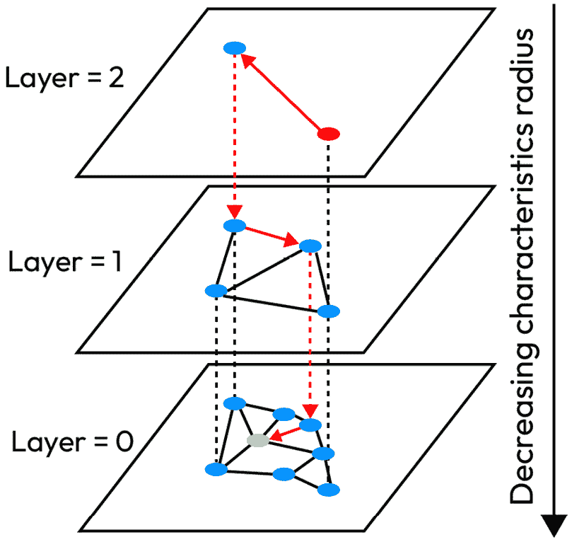

图 4.4 – HNSW 索引的表示

该图像说明了用于高效相似性搜索的 HNSW 图结构。图是分层构建的，从底部到顶部密度逐渐降低。随着我们向上移动，每一层的特征半径减小，创建更稀疏的连接。用红色虚线表示的搜索路径展示了算法的策略；它从最稀疏的顶层开始，快速导航大量数据区域，然后在更密集的底层细化搜索，最小化总体比较并提高搜索效率。

+   **Facebook AI 相似性搜索**（**FAISS**）：由 Facebook AI Research 开发的 FAISS 是一个用于高效相似性搜索和聚类高度维向量的库。它在索引过程中使用产品量化来压缩数据，加速大量数据集中的相似性搜索。这种方法将向量空间划分为称为 Voronoi 单元的区域，每个单元由一个质心表示。主要目的是最小化存储需求并加快搜索速度，尽管这可能会略微降低准确性。为了可视化这一点，请考虑以下图像。Voronoi 单元表示量化区域，这些单元内的标记点是质心或代表性向量。在索引新向量时，它与其最近的质心对齐。对于搜索，FAISS 确定可能包含最近邻的 Voronoi 单元，然后在单元内缩小搜索范围，显著减少距离计算：

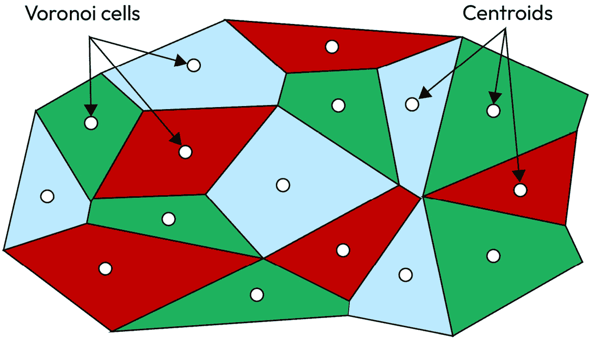

图 4.5 – FAISS 索引的表示

由于其性能优化和内置 GPU 优化，它在图像和视频搜索、推荐系统以及任何涉及在高度维空间中搜索最近邻的任务中表现出色。

在本节中，我们介绍了索引和 ANN 在索引创建中的作用。接下来，我们将探讨相似性度量，它们与索引的不同之处，以及它们对改进数据检索的影响。

## 何时使用 HNSW 与 FAISS

### 使用 HNSW 的情况：

+   在相似度搜索中实现高精度至关重要。

+   数据集规模很大，但尚未达到 HNSW 管理起来变得不切实际的程度。

+   需要实时或接近实时的搜索性能。

+   数据集是动态的，经常更新或插入。

+   适用于涉及文本的用例，如文章推荐系统

### 当使用 FAISS 时：

+   管理极其庞大的数据集（例如，数十亿个向量）。

+   批量处理和 GPU 优化可以显著提高应用性能。

+   需要在搜索速度和准确性之间进行灵活的权衡。

+   数据集相对静态，或批量更新是可以接受的。

+   适用于图像和视频搜索等用例。

注意

选择合适的索引策略取决于几个关键因素，包括数据的性质和结构、要支持的查询类型（例如范围查询、最近邻查询、精确搜索）、数据的体积和增长、数据更新的频率（例如静态与动态）、数据的维度、性能要求（实时、批量）以及资源限制。此外，数据更新的频率、数据的维度、性能要求（实时、批量）和资源限制在决策过程中也发挥着重要作用。

### 相似度度量

相似度度量决定了索引的组织方式，并确保检索到的数据与查询高度相关。例如，在一个旨在检索相似图像的系统设计中，索引可能围绕图像的特征向量构建，而相似度度量将决定哪些图像在该索引空间内是“接近”或“远离”的。这些概念的重要性有两方面：索引显著加快了数据检索速度，相似度度量确保检索到的数据与查询相关，共同提高了数据检索系统的效率和效果。选择合适的距离度量可以显著提高分类和聚类任务的性能。最优的相似度度量是根据数据输入的性质选择的。换句话说，相似度度量定义了两个项目或数据点之间关系的紧密程度。它们可以广泛地分为**距离度量**和**相似度度量**。接下来，我们将探讨构建 AI 应用时前三个最常用的相似度度量：余弦相似度、欧几里得距离和曼哈顿距离。

+   **相似度度量 – 余弦相似度**：余弦相似度是一种相似度度量，它计算两个向量之间角度的余弦值。OpenAI 建议使用它来衡量从 text-embedding-ada-002 中获得的两个嵌入之间的距离。度量值越高，它们越相似：

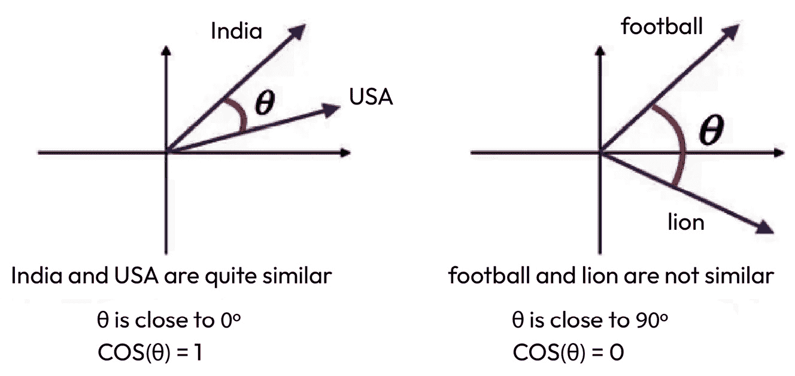

图 4.6 – 通过两个单词之间的余弦相似度展示相关性的插图

前面的图像显示了当印度和美国相关联时，余弦相似度为 1 的情况，因为它们都是国家。在另一幅图像中，相似度为 0，因为足球与狮子不相似。

+   **距离度量 – 欧几里得距离（L2）**：欧几里得距离计算欧几里得空间中两点之间的直线距离。度量值越高，两点之间的相似度越低：

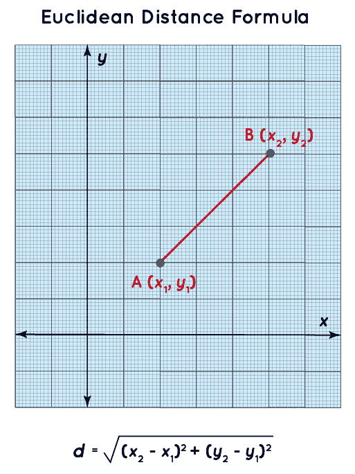

图 4.7 – 欧几里得距离示意图

该图像展示了二维空间中的欧几里得距离公式。它显示了两个点：(x1,y1) 和 (x2,y2)。前面的公式计算了平面上两点之间的直线距离。

+   **距离度量 – 曼哈顿距离（L1）**：曼哈顿距离计算每个维度上绝对差异的总和。度量值越高，差异的相似度越低。以下图像展示了二维空间中两点之间的曼哈顿距离（或 L1 距离），距离是沿着直角轴测量的，类似于在网格状街道布局中导航城市街区：

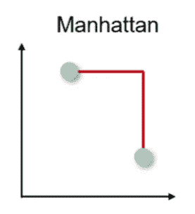

图 4.8 – 曼哈顿距离示意图

你可能会想知道在开发生成式 AI 应用程序时，何时选择一种度量标准而不是另一种。关于使用哪种相似度测量的决定取决于各种元素，例如数据的类型、应用的上下文以及分析结果的定制需求。

当数据向量的幅度相对于方向或数据取向不那么重要时，余弦相似度比曼哈顿和欧几里得距离更受欢迎。例如，在文本分析中，两篇文档可能由表示单词频率的高维向量表示。如果一篇文档是另一篇文档的较长版本，它们的单词频率向量将指向同一方向，但由于单词计数更高，一个向量的幅度（长度）会更大。使用欧几里得或曼哈顿距离会突出这些幅度差异，表明文档不同。然而，使用余弦相似度将捕捉它们在内容（向量的方向）上的相似性，淡化单词计数上的差异。在这种情况下，余弦相似度更合适，因为它关注向量之间的角度，反映了文档的内容重叠，而不是它们的长度或幅度。

当数据向量的幅度和绝对差异至关重要时，例如在具有一致缩放数值数据（例如年龄、身高、体重等）或空间应用（如基于网格的路径查找）中，欧几里得距离和曼哈顿距离比余弦相似度更合适。虽然余弦相似度强调数据向量的方向或模式，这在高维、稀疏数据集中特别有用，但欧几里得距离和曼哈顿距离捕捉数据点之间的实际差异，因此在绝对值偏差显著的场景中更受欢迎，例如比较患者的医学检测结果或找到地球上地理坐标之间的距离。

以下是一个使用 Azure OpenAI 端点通过嵌入模型 text-embedding-ada-002 计算两个句子“你知道多少个国家？”和“你熟悉多少个国家？”之间相似度的代码片段。它给出了 0.95 的分数：

```py
import os
import openai
openai.api_type = "azure"
openai.api_base = "https://ak-deployment-3.openai.azure.com/"
openai.api_version = "2023-07-01-preview" 
##replace "2023-07-01-preview" with latest version
openai.api_key = "xxxxxxxxxxxxxxxxxxxxxxx"
def get_embedding(text, model="text-embedding-ada-002"):
    return openai.Embedding.create(engine=model, input=[text], \
        model=model)['data'][0]['embedding']
embedding1 = get_embedding("What number of countries do you know?", \
    model='text-embedding-ada-002')
embedding2 = get_embedding("How many countries are you familiar \
    with?", model='text-embedding-ada-002')
embedding1_np = np.array(embedding1)
embedding2_np = np.array(embedding2)
similarity = cosine_similarity([embedding1_np], [embedding2_np])
print(similarity)
# [[0.95523639]]
```

现在，让我们通过一个场景来了解为什么在余弦相似度和曼哈顿距离之间，余弦相似度会被优先考虑。

## **文章推荐系统**

让我们考虑一个场景，一个新闻聚合平台旨在推荐与用户当前阅读的文章相似的文章，通过建议相关内容来增强用户参与度。

#### **工作原理**：

+   **预处理和索引**：平台数据库中的文章经过处理以提取文本特征，通常使用 LDA 或基于 transformer 的嵌入（如 text-ada-embedding-002）将其转换为高维向量。然后，使用 HNSW 索引对这些向量进行索引，HNSW 是一种适合高维空间的算法，由于其层次结构，它促进了高效的导航和搜索。

+   **检索时间**：当用户阅读一篇文章时，系统会为这篇文章生成一个特征向量，并查询 HNSW 索引以找到在高维空间中与之接近的向量（以及相应的文章）。可以使用余弦相似度来评估查询文章的向量与索引中的向量之间的相似度，从而识别出内容相似的文章。

+   **结果**：系统根据与当前查看文章的相关性推荐一系列文章。得益于高效的索引和相似度搜索，即使是从庞大的文章数据库中，这些推荐也能快速生成，为用户提供无缝的体验。

现在，让我们通过一个场景来了解为什么在曼哈顿距离和余弦相似度之间，曼哈顿距离会被优先考虑。

#### **拼车应用匹配**

让我们考虑一个场景，一个拼车应用需要高效地将乘客与附近的司机匹配。系统必须快速找到离乘客位置最近的可用司机，以最小化等待时间并优化路线。

### **工作原理**：

+   **预处理和索引**：司机的当前位置不断更新并存储为表示地图的二维空间中的点。这些点可以使用基于树的空間索引技术或针对地理空间数据优化的数据结构（如 R 树）进行索引。

+   **检索时间**：当乘客请求乘车时，应用程序使用乘客的当前位置作为查询点。曼哈顿距离（L1 范数）特别适合城市环境，因为街道和大道的网格状结构限制了移动，模仿了汽车在城市街区中实际行驶的路径。

+   **结果**：系统快速识别最近的可用司机，使用索引数据和曼哈顿距离计算，考虑到城市网格的约束。这个过程确保了快速匹配过程，通过减少等待时间来提高用户体验。

# 向量存储

随着生成式人工智能应用不断推动技术在可能性的边界，向量存储已成为一个关键组件，简化并优化了相关数据的搜索和检索。在我们之前的讨论中，我们深入探讨了向量数据库相对于传统数据库的优势，解开了向量、嵌入、向量搜索策略、近似最近邻（ANNs）和相似度度量的概念。在本节中，我们旨在提供对向量数据库和库中这些概念的综合性理解。

该图像展示了将不同类型的数据——音频、文本和视频——转换为向量嵌入的工作流程。

+   **音频**：音频输入通过“音频嵌入模型”进行处理，产生“音频向量嵌入”。

+   **文本**：文本数据在“文本嵌入模型”中进行处理，导致“文本向量嵌入”。

+   **视频**：视频内容使用“视频嵌入模型”进行处理，生成“视频向量嵌入”。

一旦创建了这些嵌入，它们随后（可能在企业向量数据库系统中）被用于执行“相似度搜索”操作。这意味着向量嵌入可以进行比较以找到相似性，这使得它们对于内容推荐、数据检索等任务非常有价值。

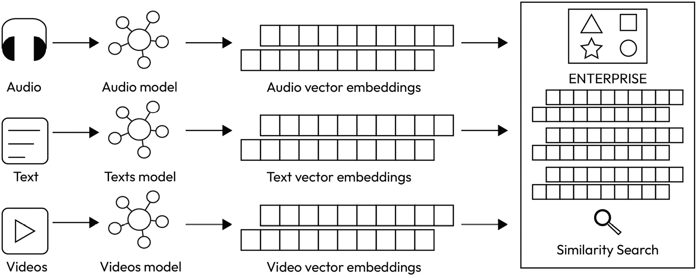

图 4.9 – 人工智能应用中的多模态嵌入过程

## 什么是向量数据库？

**向量数据库**（**向量数据库**）是一种专门设计的数据库，用于处理高度维度的向量，这些向量主要来自文本、图像或音频等复杂数据类型的嵌入。它提供了存储和索引非结构化数据以及增强搜索和检索功能的能力。

满载着先进技术的现代向量数据库能够帮助您构建弹性的企业级解决方案。在此，我们列出在选择向量数据库时需要考虑的 15 个关键特性。并非每个特性对您的用例都至关重要，但这是一个良好的起点。请记住，这个领域发展迅速，未来可能会有更多特性出现：

+   **索引**：如前所述，索引是指以允许高效进行相似度搜索和检索的方式组织高维向量的过程。向量数据库提供内置的索引功能，旨在为快速和有效的基于相似度的搜索和检索排列高维向量。以前，我们讨论了 FAISS 和 HNSW 等索引算法。许多向量数据库原生地集成了这些功能。例如，Azure AI Search 直接集成了 HNSW 索引服务。

+   **搜索和检索**：与传统的数据库依赖精确匹配不同，向量数据库提供向量搜索功能作为服务，例如近似最近邻（ANNs），以快速找到与给定输入大致最接近的向量。为了量化向量之间的接近度或相似度，它们利用诸如余弦相似度或欧几里得距离等相似度度量，从而在大型数据集中实现高效且细致的基于相似度的搜索。

+   **创建、读取、更新和删除**：向量数据库管理高维向量，并提供针对向量数据定制的创建、读取、更新和删除（CRUD）操作。当创建向量时，它们会被索引以实现高效的检索。读取通常意味着执行相似度搜索以检索与给定查询向量最接近的向量，通常使用 ANNs 等方法。向量可以被更新，可能需要重新索引，并且它们也可以被删除，数据库会相应地调整其内部结构以保持效率和一致性。

+   **安全性**：这符合 GDPR、SOC2 Type II 和 HIPAA 规则，可以轻松管理对控制台的访问并使用 SSO。数据在存储和传输过程中都进行加密，这还提供了更细粒度的身份和访问管理功能。

+   **无服务器**：高质量的向量数据库设计为随着数据量激增至数百万或数十亿条记录时优雅地自动扩展，以低管理开销无缝分布在多个节点上。**最佳向量**数据库授予用户根据数据插入、查询频率和底层硬件配置的变化调整系统的灵活性。

+   **混合搜索**：混合搜索结合了传统的基于关键词的搜索方法和其他搜索机制，例如语义或上下文搜索，以从精确匹配的术语和通过理解查询的潜在意图或上下文来检索结果，确保更全面和相关的结果集。

+   **语义重排序**：这是一个次要的排序步骤，用于提高搜索结果的相关性。它根据语言理解对最初由最先进的排序算法（如 BM25 和 RRF）评分的搜索结果进行重新排序。例如，Azure AI 搜索采用基于从 Microsoft Bing 衍生出的多语言、深度学习模型的二级排序，以提高在意义上最相关的结果。

+   **自动向量化/嵌入**：向量数据库中的自动嵌入是指将数据项自动转换为向量表示的过程，以实现高效的相似性搜索和检索，并访问多个嵌入模型。

+   **数据复制**：这确保了数据可用性、冗余和恢复，以防发生故障，保护业务连续性并降低数据丢失风险。

+   **并发用户访问和数据隔离**：向量数据库支持大量用户同时访问，并确保强大的数据隔离，以确保更新保持私密，除非故意共享。

+   **自动分块**：自动分块是将较大的数据集或内容自动分割成更小、更易于管理的块或片段的过程，以便更容易处理或理解。这个过程有助于保留文本的语义相关性，并解决嵌入模型的标记限制。我们将在本章接下来的部分中了解更多关于分块策略的内容。

+   **广泛的交互工具**：突出的向量数据库，如 Pinecone，提供跨语言的灵活 API 和 SDK，确保在集成和管理方面的适应性。

+   **易于集成**：向量数据库提供与 LLM 编排框架和 SDK（如 Langchain 和 Semantic Kernel）以及领先的云服务提供商（如 Azure、GCP 和 AWS）的无缝集成。

+   **用户友好的界面**：这确保了一个直观的平台，具有简单的导航和直接的功能访问，简化了用户体验。

+   **灵活的定价模型**：根据用户需求提供灵活的定价模型，以保持用户成本较低。

+   **低停机时间和高弹性**：向量数据库（或任何数据库）的弹性是指其从故障中快速恢复的能力、维护数据完整性和确保即使在不利条件下（如硬件故障、软件错误或其他意外中断）也能持续可用。

截至 2024 年初，一些突出的开源向量数据库包括 Chroma、Milvus、Quadrant 和 Weaviate，而 Pinecone 和 Azure AI 搜索则是领先的专有解决方案之一。

## 向量数据库局限性

+   **准确性与速度的权衡**：在处理高维数据时，向量数据库在相似性搜索中经常面临速度和准确性的权衡。核心挑战来自于在大数据集中搜索精确最近邻的计算成本。为了提高搜索速度，采用了诸如 ANN 等技术，这些技术快速识别“足够接近”的向量而不是精确匹配。虽然 ANN 方法可以显著提高查询速度，但它们有时可能会牺牲精确度，可能错过真正的最近向量。某些向量索引方法，如产品量化，通过压缩和合并数据来提高存储效率并加速查询，但以牺牲准确性为代价。

+   **嵌入质量**：向量数据库的有效性取决于所使用的向量嵌入的质量。设计不当的嵌入可能导致搜索结果不准确或错过连接。

+   **复杂性**：实现和管理向量数据库可能很复杂，需要关于向量搜索策略、索引和分块策略的专门知识，以优化特定用例。

## 向量库

向量数据库不一定总是必要的。小型应用可能不需要向量数据库提供的所有高级功能。在这些情况下，向量库变得非常有价值。向量库通常足够用于小型、静态数据，并提供在内存中存储、索引和使用相似性搜索策略的能力。然而，它们可能不提供诸如 CRUD 支持、数据复制以及能够在磁盘上存储数据等功能，因此用户在能够查询之前必须等待完整导入。Facebook 的 FAISS 是向量库的一个流行例子。

按照惯例，如果你正在处理数百万/数十亿条记录，存储频繁变化的数据，需要毫秒级响应时间，以及更多长期存储能力在磁盘上，建议使用向量数据库而不是向量库。

## 向量数据库与传统数据库的比较 – 理解关键差异

如前所述，向量数据库已成为关键，尤其是在生成式人工智能时代，因为它们促进了高度维向量的高效存储、查询和检索，而这些向量不过是深度学习模型经常产生的单词或句子的数值表示。传统的标量数据库旨在处理离散和简单的数据类型，这使得它们不适合大规模向量数据的复杂性。相比之下，向量数据库针对向量空间中的相似搜索进行了优化，能够在高维空间中快速识别“接近”或“相似”的向量。与关系数据库等传统数据模型不同，查询通常类似于“检索特定成员借阅的书籍”或“识别当前打折的商品”，向量查询主要基于一个或多个参考向量在向量之间寻找相似性。换句话说，查询可能看起来像“识别与这张照片中的狗最相似的顶级 10 张狗的图像”或“定位我当前位置附近最好的咖啡馆。”在检索时间，向量数据库至关重要，因为它们促进了相关文档嵌入的快速精确检索，以增强生成过程。这种技术也称为 RAG，我们将在后面的章节中了解更多关于它的内容。

假设你有一个水果图像数据库，每个图像都由一个向量（一组数字）表示，该向量描述了其特征。现在，假设你有一张苹果的照片，你想要在数据库中找到类似的水果。你不需要逐个检查每张图片，而是使用与其他水果相同的方法将你的苹果照片转换为向量。有了这个苹果向量，你可以在数据库中搜索与你的苹果向量最相似或最接近的向量（因此是图像）。结果很可能是其他苹果图像或根据向量表示看起来像苹果的水果。

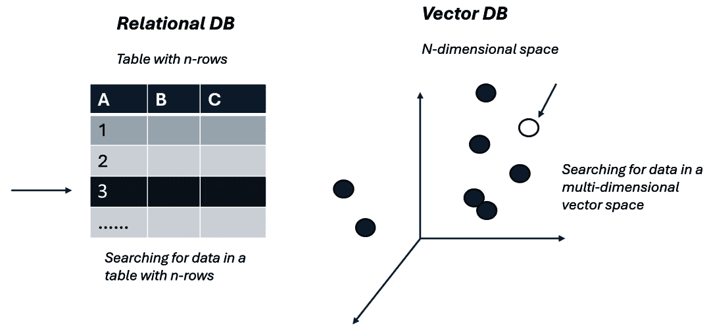

图 4.10 – 向量表示

## 向量数据库示例场景 – 使用向量数据库的音乐推荐系统

让我们考虑一个音乐流媒体平台，该平台旨在根据用户的当前收听习惯提供歌曲推荐。想象一下，一个用户正在平台上收听“歌曲 X”。

在幕后，平台库中的每首歌曲都根据其音乐特征和内容，使用嵌入表示为一个高度维度的向量。“歌曲 X”也有其向量表示。当系统旨在推荐与“歌曲 X”相似的歌曲时，它不会寻找精确匹配（如传统数据库可能做的那样）。相反，它利用向量数据库来搜索与“歌曲 X”的向量非常相似的歌曲。使用 ANN 搜索策略，系统快速筛选数百万首歌曲向量，以找到那些与“歌曲 X”的向量大致最近的向量。一旦确定了潜在的曲目向量，系统就使用相似度度量，如余弦相似度，根据这些歌曲的向量与“歌曲 X”的向量接近程度对它们进行排名。然后，排名最高的歌曲被推荐给用户。

在毫秒内，用户就能获得一系列与“歌曲 X”音乐上相似的歌曲列表，提供无缝且个性化的听觉体验。所有这些基于快速相似性推荐的魔法都是由向量数据库的专用功能驱动的。

# 常见的向量数据库应用

+   **图像和视频相似度搜索**：在图像和视频相似度搜索的背景下，一个向量数据库专门用于高效存储和查询从多媒体内容中提取的高度维度的嵌入。通过深度学习模型处理图像，它们被转换为特征向量，即嵌入，这些向量捕捉了它们的本质特征。对于视频来说，可能需要额外一步来提取帧，然后将它们转换为向量嵌入。来自 OpenAI 的对比语言-图像预训练（CLIP）是嵌入视频和图像的一个非常流行的选择。这些向量嵌入在向量数据库中索引，允许在用户提交查询时快速准确地检索。这种机制为反向图像和视频搜索、内容推荐和基于嵌入相似度比较和排名的重复检测等应用提供了动力。

+   **语音识别**：使用向量的语音识别类似于视频向量化。模拟音频被数字化为短帧，每帧代表一个音频段。这些帧被处理并存储为特征向量，整个音频序列代表诸如说话句子或歌曲之类的事物。对于用户身份验证，可能将向量化的说话短语与存储的录音进行比较。在对话代理中，这些向量序列可以被输入到神经网络中，以识别和分类语音中的说话词并生成响应，类似于 ChatGPT。

+   **长期记忆对于聊天机器人**：虚拟数据库管理系统（VDBMs）可以被用来增强聊天机器人或生成模型的长期记忆能力。许多生成模型在提示响应中只能处理有限的前置文本，这导致它们无法回忆起长时间对话中的细节。由于这些模型没有过去交互的内在记忆，无法区分事实数据和用户特定细节，使用 VDBMs 可以为存储、索引和引用以前的交互提供解决方案，从而提高响应的一致性和上下文感知性。

这是一个非常重要的用例，在实现 RAG 中扮演着关键角色，我们将在下一节中讨论。

# 向量数据库在检索增强生成（RAG）中的作用

要完全理解 RAG 以及向量数据库在其中的关键作用，我们首先必须承认 LLMs 的固有限制，这为基于向量数据库的 RAG 技术的出现铺平了道路。本节将阐明 RAG 旨在克服的具体 LLM 挑战以及向量数据库的重要性。

## 首先，最大的问题——为什么？

在*第一章*中，我们探讨了 LLMs 的限制，包括以下内容：

+   LLMs 拥有由其训练数据决定的固定知识库；截至 2024 年 2 月，ChatGPT 的知识仅限于截至 2023 年 4 月的信息。

+   LLMs can occasionally produce false narratives, spinning tales or facts that aren’t real.

+   它们缺乏个人记忆，完全依赖于输入上下文的长度。例如，以 GPT4-32K 为例；它只能在提示和完成之间处理最多 32K 个标记（我们将在*第五章*中更深入地探讨提示、完成和标记）。

为了应对这些挑战，一个有前景的途径是增强 LLM 生成中的检索组件。这些组件可以从外部知识库中提取相关数据——这个过程被称为 RAG，我们将在本节中进一步探讨。

## 那么，RAG 是什么，它如何帮助 LLMs？

检索增强生成（RAG）首次在 2020 年 11 月由 Facebook AI Research（现 Meta）发表的一篇题为 *检索增强生成*（[Retrieval-Augmented Generation](https://arxiv.org/pdf/2005.11401.pdf)）的论文中提出，用于知识密集型自然语言处理任务（[`arxiv.org/pdf/2005.11401.pdf`](https://arxiv.org/pdf/2005.11401.pdf)）。RAG 是一种结合了大型语言模型（LLMs）的生成能力和检索机制，从大量数据集中提取相关信息的方法。LLMs，如 GPT 变体，能够根据其训练数据中的模式生成类似人类的文本，但缺乏进行实时外部查找或参考特定外部知识库的手段。RAG 通过使用检索模型查询数据集并获取相关信息来解决这个问题，这些信息随后作为生成模型的上下文，以生成详细和有信息量的响应。这也帮助将 LLM 查询与相关信息联系起来，减少了幻觉的可能性。

## 向量数据库的关键作用

向量数据库在促进 RAG 的高效检索方面发挥着关键作用。在这个设置中，数据集中的每一项信息，如文本、视频或音频，都表示为一个高维向量，并在向量数据库中进行索引。当用户查询到来时，它也被转换为类似的向量表示。然后，向量数据库快速搜索与查询向量最接近的数据集中的向量（文档），利用如 ANN 搜索等技术。然后，它将查询与相关内容相关联，并将其发送到 LLMs 以生成响应。这确保了最相关的信息能够快速有效地检索到，为生成模型提供基础。

### RAG 工作流程的示例

让我们以图像中所示为例，一步一步地走一遍。想象一个平台，用户可以询问正在进行的板球比赛，包括最近的表现、统计数据和趣闻：

1.  假设用户问，“维拉特·科赫利在上一场比赛中的表现如何，这场比赛有什么有趣的事实？”由于 LLM 的训练截止到 2023 年 4 月，LLM 可能没有这个答案。

1.  检索模型将嵌入查询并发送到向量数据库。

1.  所有最新的板球新闻都存储在一个使用 HNSW 等 ANN 策略进行适当索引的向量数据库中。向量数据库与索引信息执行余弦相似度，并提供一些相关结果或上下文。

1.  然后将检索到的上下文与查询一起发送到 LLM，以综合信息并提供相关答案。

1.  LLM 提供了相关的答案：“维拉特·科赫利在上一场比赛中 70 球得到 85 分。这场比赛的一个有趣细节是，这是他三年以来在 ODI 比赛中首次击中七个以上的边界。”

下面的图像说明了前面的要点：

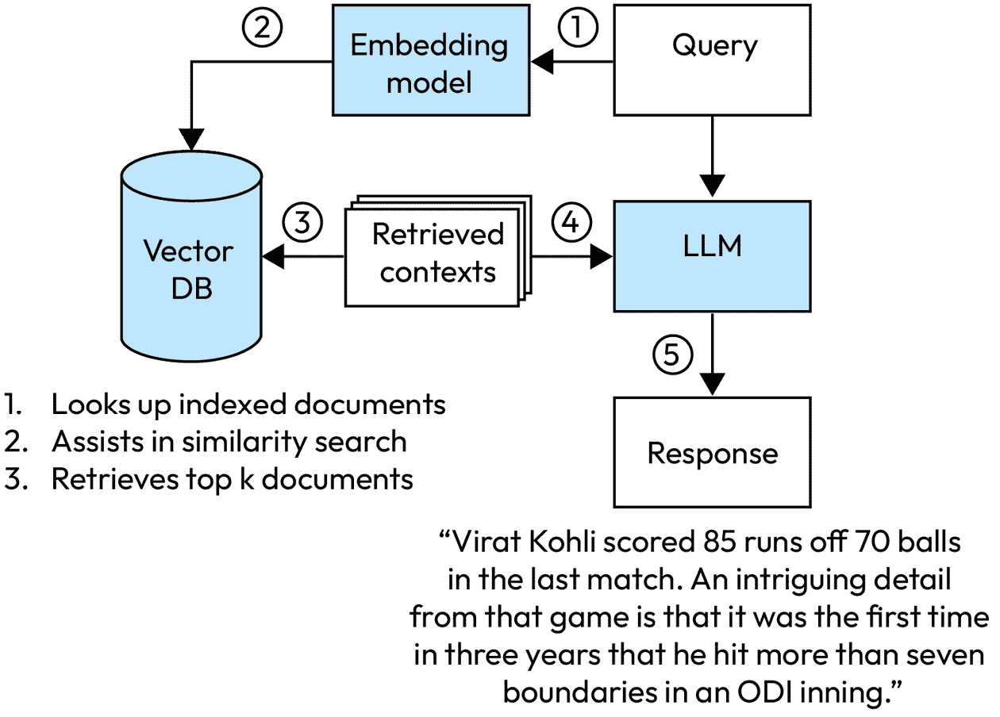

图 4.11 – RAG 工作流程的向量数据库表示

# RAG 的商业应用

在以下列表中，我们根据我们在行业中所见，提到了一些基于 RAG 的流行商业应用：

+   **企业搜索引擎**：RAG 在企业学习和发展的领域中最显著的应用之一是作为员工技能提升的搜索引擎。员工可以就公司、其文化或特定工具提出问题，RAG 迅速提供准确和相关的答案。

+   **法律和合规**：RAG 检索相关的案例法或检查商业实践是否符合法规。

+   **电子商务**：RAG 根据用户行为和查询建议产品或总结评论。

+   **客户支持**：RAG 通过从公司的知识库中提取信息并提供实时解决方案来对客户查询提供精确的答案。

+   **医疗和保健**：RAG 检索相关的医学研究或基于症状的初步建议。

# 分块策略

在我们上次的讨论中，我们深入探讨了向量数据库和 RAG。在深入 RAG 之前，我们需要有效地存储我们的嵌入数据。虽然我们提到了索引方法以加快数据检索，但在那之前还有一个至关重要的步骤：分块。

## 什么是分块？

在使用嵌入模型构建 LLM 应用程序的情况下，分块涉及将一段长文本分割成更小、更易于管理的片段或“块”，这些块适合模型令牌限制。这个过程涉及在将文本发送到嵌入模型之前将其分割成更小的片段。如图所示，分块发生在嵌入过程之前。不同的文档有不同的结构，例如自由流动的文本、代码或 HTML。因此，可以应用不同的分块策略以获得最佳结果。Langchain 等工具为您提供基于文本性质高效分块数据的函数。

下面的图示描绘了一个数据处理工作流程，突出了分块步骤，从原始的“数据源”开始，这些数据源被转换成“文档”。此工作流程的核心是“分块”阶段，其中“文本分割器”将数据分割成更小的片段。然后，这些片段通过“嵌入模型”转换成数值表示，并随后被索引到“向量数据库”中，以实现高效的搜索和检索。检索到的片段相关的文本随后作为上下文发送给大型语言模型（LLMs），然后生成最终响应：

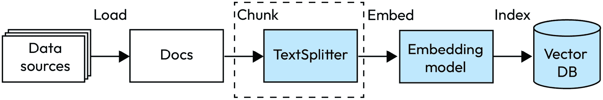

图 4.12 – 分块过程

## 但为什么需要它呢？

分块有两个主要原因至关重要：

+   通过分块策略有策略地划分文档文本，通过嵌入模型增强其理解，并提高从向量数据库检索的内容的相关性。本质上，它提高了从数据库中获取的结果的准确性和上下文。

+   它解决了嵌入模型的标记约束问题。例如，Azure 的 OpenAI 嵌入模型 text-embedding-ada-002 可以处理多达 8,191 个标记，这大约是 6,000 个单词，因为每个标记平均有四个字符。因此，为了获得最佳的嵌入效果，确保我们的文本保持在限制之内至关重要。

## 流行分块策略

+   **固定大小分块**：这是一种非常常见的方法，它定义了一个固定的大小（200 个单词），这足以捕捉段落的意义，并且它将大约 10-15%的重叠作为输入到向量嵌入生成模型。在文本之间有轻微重叠的分块数据确保了上下文的保留。建议开始时使用大约 10%的重叠。以下是一个使用 LangChain 演示固定大小分块的代码片段：

```py
text = "Ladies and Gentlemen, esteemed colleagues, and honored \guests. Esteemed leaders and distinguished members of the \community. Esteemed judges and advisors. My fellow citizens. Last \year, unprecedented challenges divided us. This year, we stand \united, ready to move forward together"
from langchain.text_splitter import TokenTextSplitter
text_splitter = TokenTextSplitter(chunk_size=20, chunk_overlap=5)
texts = text_splitter.split_text(text)
print(texts)
```

输出如下：

```py
['Ladies and Gentlemen, esteemed colleagues, and honored guests. Esteemed leaders and distinguished members', 'emed leaders and distinguished members of the community. Esteemed judges and advisors. My fellow citizens.', '. My fellow citizens. Last year, unprecedented challenges divided us. This year, we stand united,', ', we stand united, ready to move forward together']
```

+   **可变大小分块**：可变大小分块是指将数据或文本动态分割成不同大小的组件，而不是固定大小的分割。这种方法适应了不同类型数据中存在的各种结构和特征。

    +   **句子分割**：句子转换器模型是针对句子级别嵌入优化的神经网络架构。例如，BERT 在句子级别分块时表现最佳。NLTK 和 SpaCy 等工具提供了分割文本中句子的函数。

    +   **专用分块**：例如研究论文等文档具有结构化的章节组织，Markdown 语言独特的语法要求进行专用分块，从而在章节/页面之间实现适当的分离，以产生上下文相关的分块。

    +   **代码分块**：当将代码嵌入到你的向量数据库中时，这种技术可能非常有价值。Langchain 支持多种语言的代码分块。以下是一个分块 Python 代码的代码片段：

```py
from langchain.text_splitter import (
    RecursiveCharacterTextSplitter,
    Language,
)
PYTHON_CODE = """
class SimpleCalculator:
    def add(self, a, b):
        return a + b
    def subtract(self, a, b):
        return a - b
# Using the SimpleCalculator
calculator = SimpleCalculator()
sum_result = calculator.add(5, 3)
diff_result = calculator.subtract(5, 3)
"""
python_splitter = RecursiveCharacterTextSplitter.from_language(
    language=Language.PYTHON, chunk_size=50, chunk_overlap=0
)
python_docs = python_splitter.create_documents([PYTHON_CODE])
python_docs
```

输出如下：

```py
[Document(page_content='class SimpleCalculator:\n    def add(self, a,                                                              b):'),
 Document(page_content='return a + b'),
 Document(page_content='def subtract(self, a, b):'),
 Document(page_content='return a - b'),
 Document(page_content='# Using the SimpleCalculator'),
 Document(page_content='calculator = SimpleCalculator()'),
 Document(page_content='sum_result = calculator.add(5, 3)'),
 Document(page_content='diff_result = calculator.subtract(5, 3)')]
```

## 分块注意事项

分块策略根据**数据类型**、**格式**和**选择的嵌入模型**而有所不同。例如，与无结构化文本相比，代码需要一种不同的分块方法。虽然像 text-embedding-ada-002 这样的模型在 256 和 512 个标记大小的分块上表现出色，但我们对分块的理解是不断发展的。此外，预处理在分块之前起着至关重要的作用，你可以通过删除不必要的文本内容（如停用词、特殊符号等）来优化你的内容，这些内容会增加噪声。对于最新的技术，我们建议定期检查 LangChain 文档中的文本分割器部分，确保你使用最适合你需求的最佳策略。

（由 Langchain 的标记分割：[`python.langchain.com/docs/modules/data_connection/document_transformers/split_by_token`](https://python.langchain.com/docs/modules/data_connection/document_transformers/split_by_token)）。

# 使用 Azure Prompt Flow 对 RAG 的评估

到目前为止，我们讨论了弹性 RAG 应用的开发。然而，问题随之而来：我们如何确定这些应用程序是否按预期运行，以及它们检索的上下文是否相关？虽然手动验证——将 LLM 生成的响应与事实真相进行比较——是可能的，但这种方法证明是劳动密集型、成本高昂且难以在大规模上执行。因此，探索便于大规模自动评估的方法至关重要。最近的研究深入探讨了利用“LLM 作为评判者”来评估输出的概念，这是 Azure Prompt Flow 在其服务中采用的一种策略。

Azure Prompt Flow 内置了结构和元提示模板，具有全面的防护措施，以评估您的输出与事实真相的一致性。以下提到四个可以帮助您在 Prompt Flow 中评估 RAG 解决方案的指标：

+   **基础性**：衡量模型答案与输入源的一致性，确保模型生成的响应不是虚构的。在回答用户查询时，模型必须始终从提供的“上下文”中提取信息。

+   **相关性**：衡量模型生成的响应与上下文和用户查询的紧密程度。

+   **检索分数**：衡量模型检索的文档与给定问题的相关性和直接相关性。

+   **自定义指标**：虽然上述三个指标对于评估 RAG 应用程序最为重要，但 Prompt Flow 允许您使用自定义指标。将您自己的 LLM 作为评判者，并通过修改现有的 metaprompts 定义自己的指标。这还允许您使用如 Llama 这样的开源模型，并使用 Python 函数从代码中构建自己的指标。上述评估更适合无代码或低代码环境；然而，对于更专业的代码环境，可以使用 azureml-metrics SDK，例如 ROUGE、BLEU、F1 分数、精确度和准确度等。

该领域正在快速发展，因此我们建议定期检查 Azure ML Prompt Flow 的最新评估指标更新。从 Prompt Flow 中的“手动评估”功能开始，以获得对 LLM 性能的基本理解。使用多种指标进行彻底评估，以捕捉语义和句法本质，而不仅仅依赖于单一指标来比较响应与实际的事实真相。

# 案例研究 - 跨国组织部署的全球聊天应用程序

一家全球公司最近推出了一款具有问答支持聊天机器人的先进内部聊天应用程序。这个创新工具部署在多个 Azure 区域，集成了包括专门金融模型 BloombergGPT 在内的几个大型语言模型。为了满足特定的组织要求，开发了定制插件。它集成了 Service Now，使聊天机器人能够简化票据生成并监督事件操作。

在数据精炼方面，公司仔细预处理了其知识库（KB）信息，消除了重复项、特殊符号和停用词。KB 包括常见问题的答案以及各种支持相关问题的通用信息。他们在将数据嵌入到 Azure AI 搜索之前，采用了固定的分块方法，探索了不同的分块大小。他们的方法利用了 Azure OpenAI 的 text-ada-embedding-002 模型，与余弦相似度指标和 Azure AI 搜索的向量搜索功能相结合。

在广泛的测试中，他们发现 512 个标记大小和 10%重叠的最佳结果。此外，他们采用了基于余弦相似度的 ANN 向量搜索方法。他们还结合了包含关键词和语义搜索的混合搜索，并使用语义重排器。他们的 RAG 工作流程从 Azure 向量搜索和 GPT 3.5 Turbo-16K 模型中提取上下文，有效地生成对客户支持查询的响应。他们使用 Azure Cache Redis 进行缓存技术，并使用 Azure API Management 进行速率限制策略，以优化成本。

支持问答聊天机器人的集成显著简化了跨国公司的运营，提供全天候、一致性和即时的查询响应，从而提高了用户满意度。这不仅通过减少人工干预实现了显著的成本节约，还确保了可扩展性以应对全球需求。通过自动化如票据生成等任务，公司对用户互动有了更深入的了解，从而实现了服务的持续改进和优化。[详情](https://arxiv.org/pdf/2309.11322.pdf)

# 摘要

在本章中，我们探讨了 RAG 方法，这是一种强大的利用数据来创造个性化体验的方法，在减少 LLM 固有的训练限制的同时，也解决了幻觉问题。我们的旅程从检查基础概念，如向量和数据库开始，特别关注向量数据库。我们理解了向量数据库在基于 RAG 的应用开发中的关键作用，并强调了它们如何通过有效的分块策略增强 LLM 的响应。讨论还涵盖了构建引人入胜的 RAG 体验的实用见解，通过提示流进行评估，并包括 GitHub 上可用的动手实验室，以应用我们所学的知识。

在下一章中，我们将介绍另一种旨在最小化幻觉并更容易引导 LLM 响应的流行技术。我们将涵盖提示工程策略，让您充分利用 LLM 的能力，并更有效地与 AI 互动。这次探索将为您提供工具和知识，以增强您与 AI 的互动，确保更可靠和上下文相关的输出。

# 参考文献

1.  向量数据库管理系统：基本概念、用例和当前挑战：[`arxiv.org/pdf/2309.11322.pdf`](https://arxiv.org/pdf/2309.11322.pdf)

1.  两分钟 NLP — 您应该了解的 11 个词嵌入模型 | 作者：Fabio Chiusano | NLPlanet | Medium - [`medium.com/nlplanet/two-minutes-nlp-11-word-embeddings-models-you-should-know-a0581763b9a9`](https://medium.com/nlplanet/two-minutes-nlp-11-word-embeddings-models-you-should-know-a0581763b9a9)

1.  如何为您选择合适的嵌入模型 | 作者：Chebbah Mehdi | Medium：`medium.com/@mehdi_chebbah/how-to-choose-the-right-embedding-model-for-you-1fc917d14517`

1.  向量数据库简介 | Weaviate - 向量数据库 - [`weaviate.io/blog/what-is-a-vector-database`](https://weaviate.io/blog/what-is-a-vector-database)

1.  向量库与向量数据库 | Weaviate - 向量数据库 - [`weaviate.io/blog/vector-library-vs-vector-database#feature-comparison---library-versus-database`](https://weaviate.io/blog/vector-library-vs-vector-database#feature-comparison---library-versus-database)

1.  使用分层可导航小世界图进行高效且鲁棒的近似最近邻搜索 - [`arxiv.org/abs/1603.09320`](https://arxiv.org/abs/1603.09320)

1.  Milvus v2.0.x 文档介绍：[`milvus.io/docs/v2.0.x/overview.md`](https://milvus.io/docs/v2.0.x/overview.md)

1.  5 个最佳向量数据库 | 带有示例的列表 | DataCamp - [`www.datacamp.com/blog/the-top-5-vector-databases`](https://www.datacamp.com/blog/the-top-5-vector-databases)

1.  向量库与向量数据库 | Weaviate - 向量数据库 - [`weaviate.io/blog/vector-library-vs-vector-database#feature-comparison---library-versus-database`](https://weaviate.io/blog/vector-library-vs-vector-database#feature-comparison---library-versus-database)

1.  RAG：[`milvus.io/docs/v2.0.x/overview.md`](https://milvus.io/docs/v2.0.x/overview.md)

1.  在向量搜索中分块文档 - Azure 认知搜索 | Microsoft Learn - [`learn.microsoft.com/en-us/azure/search/vector-search-how-to-chunk-documents`](https://learn.microsoft.com/en-us/azure/search/vector-search-how-to-chunk-documents)

1.  LLM 应用中的分块策略 | Pinecone - [`www.pinecone.io/learn/chunking-strategies/`](https://www.pinecone.io/learn/chunking-strategies/)

1.  产品量化：通过压缩高维向量实现 97%的压缩率 | Pinecone：[`www.pinecone.io/learn/series/faiss/product-quantization/`](https://www.pinecone.io/learn/series/faiss/product-quantization/)

1.  生成式 AI 的评估和监控指标 - Azure AI Studio | Microsoft Learn - [`learn.microsoft.com/en-us/azure/ai-studio/concepts/evaluation-metrics-built-in`](https://learn.microsoft.com/en-us/azure/ai-studio/concepts/evaluation-metrics-built-in)

1.  用于知识密集型 NLP 任务的检索增强生成：[`arxiv.org/abs/2005.11401`](https://arxiv.org/abs/2005.11401)
