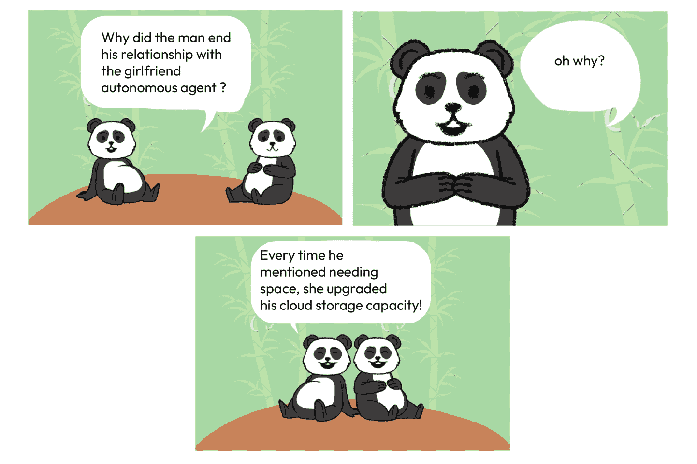
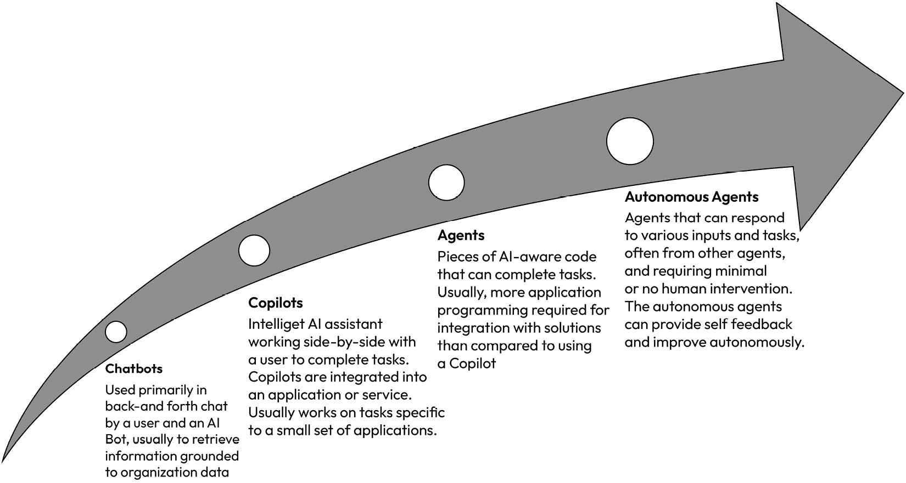
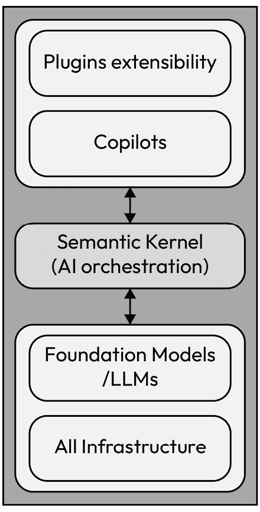
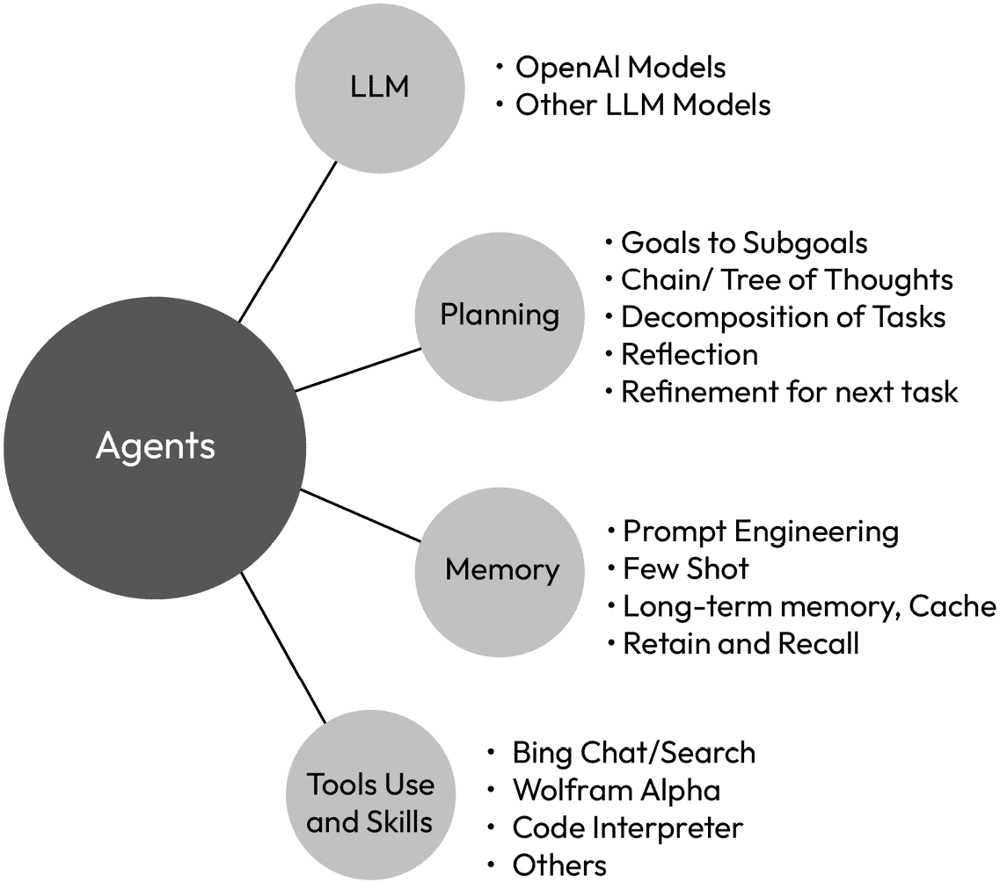
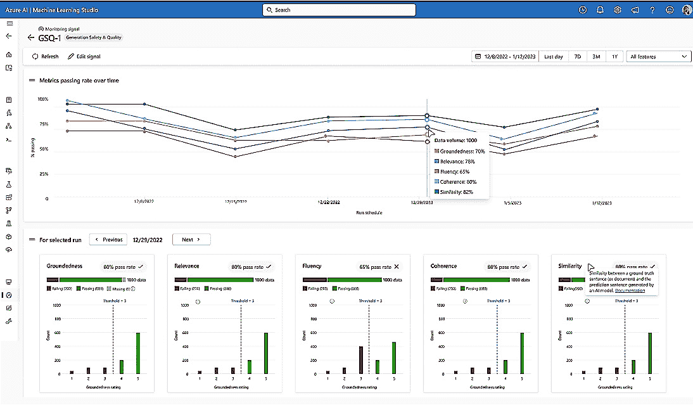
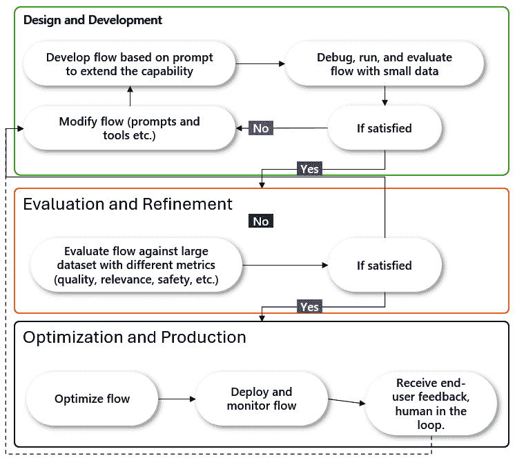
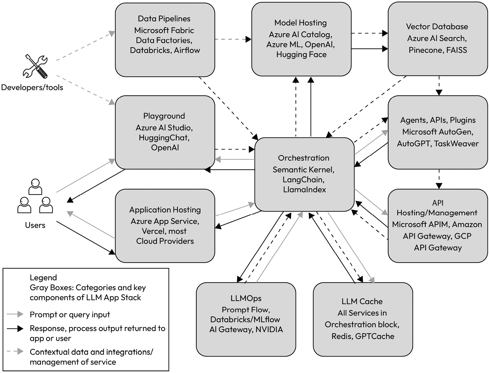

# 基于 LLM 的应用的开发与实施：探索开发框架和 LLMOps

你听说过 GitHub Copilot、Anthropic 的 Claude 还是 Jasper 吗？

如果没有，这些解决方案都是集成了生成式 AI 的应用程序。也就是说，他们通过使用 LLM 来创建与用户和其他应用程序的更具吸引力和更有意义的交互，在我们的 AI 之旅中迈出了下一步。这只是几个例子，每天都有许多、许多新的生成式 AI 应用程序进入市场！

由于你已经从本书的开头学到了一些内容，生成式 AI 是一种关注使用现有数据创建新内容或增强内容的 AI 分支。当然，生成式 AI 可以生成文本、图像、音频、视频或任何其他可以数字表示的数据，你知道已经有无数可用的生成式 AI **大型语言模型**（**LLMs**），每天都有新的模型被添加。一些模型非常特定于某些任务，例如 DALL-E，它只是根据你的文本提示输入生成基于该提示输入的实际图像。

然而，对于几乎所有的公司、大学、政府实体或任何规模的组织来说，他们的业务需求和技术需求远不止于简单的文本输入来生成图像，或者使用简单的沙盒来剪切粘贴一些提示以查看它们的完成情况。

本章主要关注生成式 AI 应用的发展与实施可能包含许多新的概念和技术，尤其是对于那些不从事软件开发的人来说。我们首先将介绍一些概念，例如协同编程器和代理。然后，我们将讨论如何使用与生成式 AI 相关的流行应用程序编程框架，如 **语义内核**（**SK**）、**LangChain** 和 **LlamaIndex**，将这些概念转化为战术解决方案。这些编程框架通过代理和工作流程使额外的 LLM 工具化成为可能，允许开发者以更简单、更强大的方式构建感知生成式 AI 的智能应用程序和服务。然后，我们将介绍一个非常激动人心的主题，我们认为这将把 AI 推向下一个水平，即代理协作框架，这些框架可以帮助你构建 **自主代理**，例如 **Autogen**、**Taskweaver** 和 **AutoGPT**。

最后一节将重点关注在生产中实施生成式 AI 应用。我们将概述一种系统方法来利用生成式 AI 的广泛能力，满足组织的复杂需求，利用一种称为**大型语言模型操作**（**LLMOps**）的过程。理解采用 LLMOps 的必要性至关重要；它是简化操作和成功开发生成式 AI 感知应用的关键要素。本节将重申利用生成式 AI 广泛能力并满足组织需求的方法，强调 LLMOps 对高效操作和成功应用开发的重要性。

在本书中，我们将涵盖以下主要主题：

+   共同飞行员和代理

+   生成式 AI 应用开发框架

+   自主代理

+   代理协作框架

+   LLM LLMOps – 在生产中实施 LLM 应用

+   LLMOps – 案例研究和最佳实践

图 6.1 – 自主世界中的关系

在我们深入现代 AI 应用开发框架之前，我们需要了解两个在前几章中未涉及的概念：代理和共同飞行员。

# 共同飞行员和代理

传统的聊天机器人经历了显著的演变，过渡到更复杂的形态，如共同飞行员、代理和自主代理。在本节中，我们旨在比较和对比这些高级聊天机器人类型，探讨它们在当代应用中的作用和利用。

图 6.2 – 从聊天机器人到自主代理的演变

**代理**是熟练的助手，在所描述的上下文中，它们是具备 AI 能力的代码片段。它们被设计成通过与用户通过应用程序或其他界面交互来完成任务。最初，它们从用户那里收集信息，随后利用这些数据**执行动作**，这可能包括将其输入到 LLM 或一系列 LLM 中，以及其他可能性。

例如，一个数据分析代理可以通过请求您的原始 Excel 文件和可能的其他问题来分析您的 Excel 表格；然后，它将智能地生成自己的行动计划，执行这些行动，并为您提供关于您数据的最终见解。

**共同飞行员**是集成到应用程序中的聊天机器人形式的协作工具，它们使用 LLM 协助用户执行特定于该应用程序的任务，并获得即时生产力提升。它们代表了代理更广泛类别中的一个专业子集。

共同飞行员，如 GitHub Copilot 和 Power BI Copilot，被集成到应用程序中以协助用户完成任务，例如根据自然语言查询生成代码或提供故障排除建议。

微软广泛地使用共飞行员，将它们集成到下一代 AI 集成产品中，如 Microsoft 365 应用。这些共飞行员结合了 LLM、用户数据和微软的其他应用，使用我们在下一节中讨论的语义内核（SK）框架。共飞行员与用户并肩工作，在诸如起草文档或生成代码等任务中提供 AI 辅助。想象一下，它们就像飞机驾驶舱中的有益共飞行员，协助飞行员。通过使用语义内核框架，开发者可以访问与微软共飞行员在他们的应用中使用相同的 AI 集成和编排模式。有关微软如何利用 AI 模型和 SK 在共飞行员中的更多信息，请参阅 Kevin Scott 在 2023 年 Microsoft Build 会议上的演讲，*AI 共飞行员时代*。

现在，让我们了解如何使用诸如语义内核、Langchain 和 Llamaindex 等框架将这些概念（代理、共飞行员、RAG 这在第四章中讨论过）转化为战术解决方案。

# 生成式人工智能应用开发框架

在本节中，我们将关注开发者今天在他们的应用中使用的一些流行的基于生成式人工智能的应用开发框架，因为它们为大型语言模型添加了功能性和可扩展性。

但为什么我们首先需要将现有的机器学习应用现代化，以便使用智能生成式人工智能呢？让我们比较和对比没有生成式人工智能的应用特性和融入生成式人工智能的现代化应用。

当前的机器学习应用有一些常见的特性限制：

+   它们在交互上**受限**，尤其是与生成式人工智能服务交互时。

+   它们是**硬编码**的，通常有一个**固定数据集**。例如，可以利用某些数据集来训练某些机器学习模型，而这些模型是固定的。

+   如果他们想要在应用中更改模型，或者他们想要**完全更改数据集**，他们需要再次重新训练模型，这由于成本增加和完成时间延长而成为一个挑战。

+   重新训练模型涉及添加**增强或功能**，这**相当复杂**，而且也**耗时**且**昂贵**。

然而，使用本章中描述的技术构建的智能生成式人工智能应用，你可以做到以下事情：

+   **使用自然语言交互**。我们在 ChatGPT 和其他应用中看到了这一点，在那里人们可以开始聊天，就像有一个真实的人类或助手一样。除了仅仅使用自然语言与生成式人工智能应用交互之外，你还可以在交互会话中轻松地根据自己的个性化体验，如角色和情感调调。

+   **生成数据驱动**和**个性化体验**，这些体验针对用户或一组用户量身定制。此外，这些应用可以随着时间的推移而改进，自主地使用过去的经验。

+   与传统软件开发中更长、耗时更长的过程相比，您可以**快速交付新功能和****产品增强**。

如您所见，智能生成式 AI 应用正在使我们能够创造前所未有的解决方案并解决以前从未遇到的问题，而且是以我们以前从未见过的速度。现在让我们将注意力转向一些现代的应用开发框架，这些框架可以帮助我们实现新的和复杂的功能。

## 语义内核

语义内核，或 SK，是一个轻量级、开源的**软件开发工具包**（**SDK**）；它是一个现代的 AI 应用开发框架，使软件开发者能够构建 AI 编排以构建代理，编写可以与代理交互的代码，并支持生成式 AI 工具和概念，例如**自然语言处理**（**NLP**），这在*第二章*中有所介绍。

### “内核”是所有事物的核心！

语义内核围绕“内核”这一概念展开，这一概念至关重要，并配备了执行本地代码和 AI 服务所需的服务和插件，使其成为几乎所有 SDK 组件的核心元素。

在语义内核中执行的每个提示或代码都会通过这个内核，为开发者提供了一个统一的平台来配置和监控他们的 AI 应用程序。

例如，当通过内核调用提示时，它承担了选择最佳 AI 服务的流程，根据提示模板构建提示，将提示派发到服务，并在将其返回给应用程序之前处理响应。此外，内核允许在各个阶段集成事件和中间件，从而简化诸如日志记录、用户更新和实施负责任 AI 实践等任务，所有这些都可以从称为“内核”的单个集中位置完成。

此外，SK 允许开发者定义自然语言表达式的语法和语义，并将它们用作代码中的变量、函数或数据结构。SK 还提供了从代码解析、分析和生成自然语言的工具，反之亦然，从 NLP 生成代码。

**您可以使用语义内核 SDK 构建复杂和复杂的代理，而无需成为 AI 专家！**在语义内核中构建代理的基本构建块是**插件、规划器和****角色**。

### 基本组件

让我们逐一深入了解它们，并理解每个的含义。

+   **插件**通过允许您集成额外的代码来增强您的代理功能。这使得将新功能集成到插件中成为可能，可以使用如 C#或 Python 等本地编程语言。此外，插件可以通过提示与 LLMs 交互或通过 REST API 调用连接到外部服务。例如，考虑一个用于日历应用的虚拟助手插件，它允许它安排约会、提醒即将发生的事件或取消会议。如果您使用过 ChatGPT，您可能熟悉插件的概念，因为它们已经集成其中（例如，“代码解释器”或“必应搜索插件”）。

+   **规划者**：为了有效地利用插件并将其与后续操作集成，系统必须首先设计一个计划，这是一个规划者帮助的过程。这就是规划者发挥作用的地方。规划者是一组复杂的指令，使代理能够为完成特定任务制定策略，通常封装在一个简单的提示中，引导代理通过函数调用来实现目标。

+   例如，以开发 MeetingEventPlanner 为例。这个规划者将引导代理通过组织会议的详细过程。它包括审查与会者日历的可用性、发送确认电子邮件、起草议程，最后安排会议等步骤。每个步骤都经过精心规划，以确保代理全面处理所有必要的会议准备工作。

+   **角色**：角色是一组指令，通过赋予它们独特的个性来塑造代理的行为。通常被称为“元提示”，这些指南赋予代理从友好和专业到幽默等不同的人物角色。此外，它们指导代理生成何种类型的响应，这可以从冗长到简洁不等。我们在*第五章*中详细探讨了元提示；这个概念与之密切相关。

然而，现在让我们退一步，理解为什么我们要使用 SK 以及为什么要创建自然语言界面、聊天机器人或自然语言编程系统。将 LLMs 视为推动生成式 AI 应用的引擎，而 SK 则充当装配线，整合各种生成式 AI 服务。对于软件开发者来说，代码的可重用性——无论是函数还是代码片段——对于简化开发流程至关重要。此外，对于广泛的组织应用，高效管理提示、完成和其他代理特定数据不仅是一种操作偏好，而且是基本业务需求。SK 作为一个关键框架，通过无缝集成这些基本要素，使构建耐用和全面的生成式 AI 应用成为可能。

重要提示

对于 LLM 来说，仅仅依靠引擎本身已经无法满足这些商业需求，就像没有油、汽油或电的引擎无法满足驾驶员提供交通的需求一样。您需要额外的软件代码来提供解决方案，而不仅仅是 LLM 和生成式 AI 编程框架，如 SK，允许您实现这一点。您是在围绕引擎构建以提供交通，您是在围绕 LLM 构建以提供生成式 AI 解决方案。

以微软公司为例，作为一个现实世界的例子。如前所述，微软本身在其整个组织中采用了 SK 框架，展示了其广泛的应用性和有效性。这种集成在他们下一代 AI 集成产品“Copilots”中尤为明显。这些 Copilots 利用了 LLM 的能力，以及您的数据和微软的其他应用程序，包括 Microsoft 365 套件（Word、Excel 等）。所有这些组件都通过 SK 框架无缝集成，展示了 AI 增强型生产力工具的复杂和强大示例。

此外，在本章的后面部分，我们将展示一个实际的案例，说明一家财富 500 强公司如何将他们的开发团队及其应用程序转变为最先进、现代、适用于生成式 AI 的应用程序和解决方案，使用的是 SK。

如果您想了解更多关于 SK 的详细信息，您可以访问以下链接：*microsoft/semantic-kernel: 快速轻松地将最前沿的 LLM 技术集成到您的应用程序中 (*[github.com](http://github.com)*)*，[`github.com/microsoft/semantic-kernel`](https://github.com/microsoft/semantic-kernel)。

*图 6.3* 提供了 SK 作为 AI 编排者在微软 Copilot 系统中在 LLM、AI 基础设施、Copilots 和插件之间角色的高级视觉描述演示：

图 6.3 – SK 在微软 Copilot 系统中的 AI 编排角色

### 助手 API

助手 API（由 Open AI 于 2023 年底推出）允许您在 OpenAI 的聊天完成模型上用最少的代码构建 AI 代理。这是一个即将集成到语义内核的 API，以构建类似代理的体验，正如微软在一篇博客中提到的（[`devblogs.microsoft.com/semantic-kernel/assistants-the-future-of-semantic-kernel/`](https://devblogs.microsoft.com/semantic-kernel/assistants-the-future-of-semantic-kernel/))。

此 API 帮助开发者在其自己的应用程序中构建高质量的类似 Copilot 的体验。如前所述，Copilots 是集成到应用程序中的 AI 助手，用于帮助解决疑问或提供指导步骤，以帮助用户完成更复杂的任务。

以前，创建定制的 AI 助手需要大量的工作，即使是对于熟练的开发者来说也是如此。OpenAI 的聊天完成 API 易于使用且功能强大，但它不是有状态的（没有状态），这意味着开发人员和/或运维人员必须管理会话状态和聊天线程、工具集成、文档检索以及管理索引，所有这些都要在手动运行代码的同时完成。在 OpenAI 的演变过程中，助手 API 是聊天完成 API 的有状态版本，并提供了解决这些问题的方案。

现在构建可定制的、特定的生成式 AI 应用程序和服务比以往任何时候都要容易，这些应用程序和服务可以搜索数据、提出解决方案并自动化任务。助手 API 支持持久和无限（无限长）的线程。这意味着您不需要创建线程状态管理系统或处理模型上下文窗口的限制，作为开发者。您只需向线程添加新消息，用户就会回复（提示/完成）。助手 API 还可以在创建助手或作为线程的一部分时访问不同格式的文件。助手还可以根据需要访问多个工具。以下是一些示例工具：

+   **函数调用**：助手 API 可以调用现有的函数或代码子程序。通过助手 API，您的助手可以学习您的应用程序或外部 API 的功能，选择合适的时机调用这些函数，并使用这些函数作为对消息或其他行为的响应。

+   **代码解释器**：使用来自 OpenAI/Azure OpenAI 服务的代码解释器工具，您可以在单独的环境中编写和执行代码，例如 Python 代码。您可以用它来完成各种目的，例如逐步解决困难的代码和数学问题、对用户添加的不同格式的文件进行高级数据分析，以及创建数据可视化，如报告、图表和图形。助手 API 可以根据需要或根据指示集成和运行代码解释器。

## LangChain

与 SK 一样，LangChain 是另一个开源的 SDK 应用程序开发框架和工具包，用于使用 LLMs 构建现代 AI 应用程序。它提供了现成的库和模板，以开发、生产化和部署您的应用程序。

LangChain 围绕“**链式**”的概念展开

LangChain 的一个显著特点是它使用“**链**”，这与之前讨论的以内核为中心的 SK 形成对比。在 LangChain 中，一个组件的输出作为下一个组件的输入，允许在激活之前按顺序连接提示、模型和解析器等元素。开发者可以利用 LangChain 组装新的提示链，使多个 LLM 能够按顺序集成，其中一个 LLM 的输出流入下一个；因此，术语 LangChain。此外，LangChain 还包括允许 LLM 在不重新训练的情况下纳入新数据集的功能，类似于 SK。

应用程序开发者的好处

我们在以下列表中提到了 LangChain 提供的众多好处中的一些：

+   **将 LLM 与数据源链接**：最后，LangChain 为 AI 开发者提供了将语言模型与任何数据源链接的工具。它包括不同类型的解析器和文档加载功能，有助于无缝连接到任何数据源。

+   **简化 RAG 实现**：开发团队可以构建复杂的应用程序，访问公司内部信息和数据以改进模型响应。换句话说，您可以在提示过程中为语言模型添加上下文信息的**检索增强生成**（**RAG**）工作流程。正如您在*第四章*中学习的，使用如 RAG 的上下文感知工作流程可以减少模型错误并提高响应质量。

+   **使用库和模板加速开发**：开发者可以自定义序列以轻松构建复杂的应用程序。软件团队无需编写业务逻辑，可以修改 LangChain 提供的现有模板和库，以减少开发时间。

虽然 Semantic Kernel 和 LangChain 都是开源的且免费使用，但截至本文撰写时，LangChain 的使用更为广泛，LangChain 确实提供了与许多公开模型存储库上可用的开源模型更好的兼容性，例如 Hugging Face。另一方面，根据一些使用真实世界应用的经验和测试，Semantic Kernel 在大型商业应用中表现更好。我们并不是建议使用一个服务而不是另一个，但了解每个框架都有其优点和缺点是有用的。两者在您创建下一代生成式 AI 应用的旅程中同样关键。

如果您想了解更多关于 LangChain 及其为开发者提供的众多好处，我们建议查看以下链接：

+   langchain-ai/langchain：通过可组合性构建 LLM 应用程序（github.com） – [`github.com/langchain-ai/langchain`](https://github.com/langchain-ai/langchain)

+   [`python.langchain.com/docs/expression_language/get_started/`](https://python.langchain.com/docs/expression_language/get_started/)

## LlamaIndex

与语义内核和 LangChain 类似，LlamaIndex 是一个用于使用 LLM 的应用程序的编程数据框架，允许用户使用自然语言摄取、管理和检索不仅限于特定领域的数据（如行业特定数据），还可以是私有数据。LlamaIndex 基于 Python。

LlamaIndex 有两个主要阶段：索引阶段和查询阶段，它们可以集成到 LLMOps 流程中，我们将在稍后进行介绍：

+   **索引阶段**：在这个阶段，LlamaIndex 为您的私有数据创建一个向量索引。这使得您能够搜索自己组织的特定领域知识库。您可以输入文本文档、数据库记录、知识图谱和其他数据类型。

+   **查询阶段**：在这个阶段，RAG 管道根据用户的查询找到最相关的信息。然后，将此信息连同查询一起传递给 LLM，以生成更准确的响应。

最后，LlamaIndex 有三个主要组件：

+   **数据连接器**：它们允许您从数据存储的任何地方提取数据，例如 API、PDF、数据库或外部应用程序，如 Meta 或 X。

+   **数据索引**：数据索引组件组织您的数据，以便它们随时可用。

+   **引擎**：这是核心的引擎组件，它使您能够使用自然语言与数据交互并创建应用程序、代理和工作流程。我们将在下一节中详细说明代理和工作流程是什么。

现在，问题来了：**何时应该使用哪一个？**SK、Langchain 和 LlamaIndex 在架构上各不相同。SK 和 Langchain 是更广泛的框架，在需要与代理进行更复杂交互以及构建聊天机器人时添加 AI 编排层方面表现出色。

相反，LlamaIndex 在基于 RAG 的搜索重点应用程序中脱颖而出，因为它针对快速和高效的搜索能力进行了优化。采用独特的索引方法显著提高了数据检索的速度。

如果您想了解更多关于 LlamaIndex 的详细信息，您可以访问以下链接：[`docs.llamaindex.ai/en/stable/`](https://docs.llamaindex.ai/en/stable/)。

# 自主代理

**自主代理**是标准代理（在上一节中提到）的更高级实现，并且正在快速发展。自主代理将代理的概念推进了一步。这些代理可以是能够执行各种任务并自动管理其他代理的代理团队，它们可以自主协作，无需用户输入或指导。它们具有提供自我反馈并自主改进的能力。

例如，在一家创意公司中，可以利用自主代理作为团队协作的概念来简化和增强创意过程。

以下是一个示例场景：

图 6.4 – AI 自主代理团队

想象一个场景，一家创意机构被委托创建一个创新的广告活动。团队由六名成员组成，所有成员都是组织在等级制度中的自主代理，由一位也是自主代理的经理管理。以下是各种 AI 代理如何共同工作以实现这一目标的概述。过程将从人类用户提出初始主题开始，然后触发以下后续步骤：

+   **趋势分析代理**：这个 AI 代理自主分析互联网、社交媒体和数据源，以检测当前消费者趋势、流行文化和行业动态，识别与目标受众产生共鸣的主题，从而指导活动的创意方向。

+   **概念生成代理**：利用趋势分析代理的洞察力，这个 AI 为活动生成一系列创意概念。它使用在成功的广告活动、艺术、文学和电影上训练的生成式 AI 模型，提出与识别的趋势相一致的创新和吸引人的想法。

+   **设计和可视化代理**：一旦选定了概念，这个代理就会创建广告材料的视觉草图。使用在图形设计和多媒体制作上训练的生成式 AI 模型产生高质量的图像、视频和其他创意资产，使概念栩栩如生。

+   **文案代理**：同时，一个文案 AI 代理为活动生成引人入胜的文案。它构建能够捕捉活动精髓的信息，确保它们针对目标受众的语言和情感触发点进行定制。这个代理使用自然语言生成技术来产生各种文案选项，从标题到详细的产品描述。

+   **反馈和迭代代理**：这个代理收集来自团队、利益相关者和可能选定的受众样本对创意输出的反馈。它使用情感分析和反馈循环来了解反应，并建议对概念、设计或文案进行修改，以提高活动的有效性。

+   **整合和策略代理**（经理）：最后，一个整合代理负责将所有创意元素组装成一个统一的广告活动。它确保策略与公司的品牌和营销目标一致，调整活动在各个渠道的部署以实现最大影响。

在这个创意公司场景中，自主 AI 代理为创意过程带来了效率和创新。通过利用他们在趋势分析、概念生成、设计、文案和策略方面的专业技能，他们使公司能够快速开发并迭代与目标受众产生深刻共鸣的突破性广告活动。

现在我们已经了解了代理的概念，让我们在下一节中了解如何通过应用开发框架和多对话代理框架将其变为现实。

# 代理协作框架

在本章中，我们通过介绍编程开发框架以及与这一概念相关的许多概念，从开发者和运维的角度介绍了生成式 AI，包括智能体的概念。我们认为智能体是一个非常令人兴奋的研究领域，一个全新的革命，即生成式 AI 革命，将把人类带到我们以前从未见过的高度，甚至只能梦想（也许在科幻小说中！）一年或两年前。

在*第二章*中，我们简要地提到了令人兴奋的自主智能体概念，在本节中，我们将进一步探讨这个概念，但首先，让我们回顾一下“智能体”是什么。回想一下，在生成式 AI 的语境中，“智能体”是指具有 AI 意识的软件代码，它可以完成诸如通过应用程序或其他模型从用户那里检索和收集信息等任务；然后它使用这些信息执行某些操作，例如将其输入到 LLM 或一系列 LLMs 中，仅举一个例子。

让我们直观地描述一下智能体是什么，而不仅仅是代码片段，因为智能体完成其工作需要一些基本组件：

图 6.5 – 什么造就了一个智能体？

根据 Ben Tossell，Ben’s Bites AI Newsletter 的创始人所说，“*AI 智能体将无处不在。价值数十亿美元的公司将来自一个小团队，该团队部署了* *ai 智能体*。”

这真是一个相当的说法！然而，我们认为它非常准确，并同意这个说法。然而，让我们再进一步。在智能体的通用术语中，这个智能体必须等待某种由人类发起的交互或指示，很可能是通过代码。这限制了智能体在等待（宝贵的时间被浪费）和遵循只有人类知道的事情方面的能力。

如同其名“自主智能体”所暗示的，这种由 AI 驱动的代码现在可以自行完成事情，从通过采取行动完成任务到创建新任务，并且它们会一直这样做，直到任务完成。此外，自主智能体可以提供自我反馈，并随后自主改进，允许自我成长和提升！与此同时，这些自主智能体可以与其他自主智能体进行通信和协作，构建一个自主网络并解决最复杂的任务，几乎不需要任何人类交互！当然，这需要所有必要的护栏和保护措施，以防止对社会造成伤害。

现在让我们看看两个流行的框架：微软的 AutoGen 和 Mindstream 的 AutoGPT。

## AutoGen

**Autogen**，由微软研究院引入的智能体协作框架，是 AI 领域的又一重大突破。它是一个开源平台，用于构建使用 LLMs 自主工作的多智能体系统，我们相信这将在未来几个月和几年内在生成式 AI 领域产生最显著的影响([`arxiv.org/abs/2308.08155`](https://arxiv.org/abs/2308.08155)).

AutoGen 可以帮助构建通过使用各种提示工程技术执行推理、规划、任务分解、反思、自我批评、自我改进、自我评估、记忆、个性化以及通信等任务的智能体，仅举几个领域为例。当然，如上所述，自主智能体可以调用其他自主智能体来帮助解决最复杂的问题或情况。

当一项任务非常复杂且规模极大时，例如建造曲速驱动器这样的任务，如果 AutoGen 创建的自主智能体与其他专业智能体协作将多么令人兴奋；尽管这是一个玩笑般的场景（或者也许不是），仅凭人类自身是无法应对这些极端、极其复杂用例的，就像为推进器建造曲速驱动器以使飞船超过光速的例子一样！

然而，正如你可能已经得出的结论，一旦我们理解了多个大型语言模型与 AutoGen 以不同方式协同工作，例如以分层方式对齐、有序地网络化或集群在一起，所有这些都有助于提高计算和推理能力以解决极其复杂的问题，包括可能今天甚至不存在的问题，那么可能性将是无限的！

Autogen 可以自主执行的某些任务包括代码生成、执行和调试的自动化任务解决，以及从群聊中自动进行数据可视化。更多令人兴奋的例子可以在以下链接中看到：[`microsoft.github.io/autogen/docs/Examples#automated-multi-agent-chat`](https://microsoft.github.io/autogen/docs/Examples#automated-multi-agent-chat).

如果你想要测试 Autogen，可以查看微软开发的 Autogen studio：[`autogen-studio.com/autogen-studio-ui`](https://autogen-studio.com/autogen-studio-ui).

此外，为了了解更多关于 AutoGen 的信息，我们建议查看这个链接：AutoGen | AutoGen (microsoft.github.io) – [`microsoft.github.io/autogen/`](https://microsoft.github.io/autogen/).

## TaskWeaver

**TaskWeaver**是微软开发的另一个用于构建自主智能体的框架，但它采用代码优先的方法，而不是 Autogen 采用的基于模板的方法。

TaskWeaver 通过将用户请求转换为可执行代码，并将用户定义的插件视为可调用的函数来区别于其他产品。

要了解更多关于 TaskWeaver 的信息，我们建议阅读这篇研究论文：[`arxiv.org/pdf/2311.17541.pdf`](https://arxiv.org/pdf/2311.17541.pdf).

## AutoGPT

在自主代理领域受到广泛关注的应用之一是 Mindstream 的**AutoGPT**。AutoGPT 是一个开源应用，旨在让 AI 对每个人开放。目前，它使用 GPT-4 模型，并且也被设计用来通过自主代理完成自主任务，类似于 AutoGen。AutoGPT 可以完成的任务示例包括研究、编码或内容创作。

由 GPT-4 驱动的 AutoGPT 将 LLM 的思想串联起来以实现其目标，同时也允许扩展性。扩展性的一个例子是，可以通过插件或软件附加组件来扩展这些自主代理的功能，进一步增强自主代理的能力，这允许在数据收集、与网络平台的交互和多模态功能方面有更多样性。

与非自主代理相比，AutoGPT 在自主代理领域是一个重大进步，丰富了 AI 应用和代理。

虽然自主代理的概念可能会引起一些焦虑，但这已经不再是一个概念，而是一个现实。它已经开始了，现在正在发生。一些人担心自主代理的使用可能会导致技术奇点，“*一个假设的未来时间点，届时技术增长变得无法控制且不可逆转，对人类文明产生不可预见的影响*”，正如维基百科所定义的：[`en.wikipedia.org/wiki/Technological_singularity`](https://en.wikipedia.org/wiki/Technological_singularity)。

然而，我们感觉将会有重大的安全措施来避免这样的奇点。我们想到的一个令人愉快的概念是有一个“工头”自主代理，或者代理们，它们监督其他自主代理的任务，或者它们的“船员”，监控它们的活动并采取必要的纪律措施来防止任何恶意行为。这个工头将负责所有其他代理，这与建筑工地上工头监督建筑工人和船员的活动并无不同。

如果你想了解更多关于 AutoGPT 的信息，我们建议查看以下两个链接：

+   Significant-Gravitas/AutoGPT：AutoGPT 是让每个人都能使用和基于其构建的通用 AI 的愿景。我们的使命是提供工具，让你能专注于重要的事情。（github.com） - [`github.com/Significant-Gravitas/AutoGPT`](https://github.com/Significant-Gravitas/AutoGPT)

+   AutoGPT 文档：[`docs.agpt.co/`](https://docs.agpt.co/)

在我们探索的这一阶段，我们已经深入探讨了各种概念，例如 RAG、微调、提示工程和代理，这些概念是构建前沿生成式 AI 应用的基石。现在，让我们将注意力转向运营方面，旨在探讨如何将这些概念无缝地过渡到生产环境中。我们的目标是提高效率和自动化，确保我们建立的理论基础可以在实际、现实场景中得到应用。

# LLMOps – 在生产中运营 LLM 应用

在本节中，我们旨在理解 LLMOps 的含义。然后我们将探讨 LLM 的生命周期、LLMOps 的基本组件、其优势以及它与传统 MLOps 实践的对比。此外，我们还将讨论 Azure 的 Prompt Flow 平台，它有助于将这一概念转化为战术解决方案：

## 什么是 LLMOps？

+   **定义**：LLMOps 或大型语言模型运营是一系列工具和实践的集合，专注于管理生成式 AI 模型的生命周期，包括 LLM、小型语言模型（SLM）以及生产环境中的相关工件。

+   LLMOps 的**目标是确保生成式 AI 模型及其在生产中的应用的持续质量、可靠性、安全性和道德标准，同时提高效率和自动化**。

+   **LLM 生命周期活动**：它包含一个全面的流程，包括一系列关键活动，如初始数据准备、模型创建和调整、提示工程、设置评估框架、部署、监控、更新，以及最终在 LLM（大型语言模型）被弃用时退役。它旨在成为一个可扩展且高效的 LLM 管理方法。

+   **编排和自动化**：这些活动通常通过独立的、可重复的管道执行，然后通过称为编排的过程系统地整合。这种编排确保工作流程的每个组件都能有效地与其他组件通信，从而实现从一个阶段到下一个阶段的无缝过渡。通过这样做，它使得对 LLM 的生命周期进行管理的方法更加结构化和高效，从开发到部署以及更远。

+   **部署**：LLMOps 通过 CI/CD 实践自动化编排，涉及将代码和训练/微调的模型集成到生产中，以系统化的方式进行 LLM 应用的测试、发布和监控，根据工具、流程的成熟度和应用的具体要求，结合自动和手动流程。

## 我们为什么需要 LLMOps？

+   LLMOps 的需求源于部署和管理生成式 AI 模型的复杂性和规模。

+   与其前辈——机器学习操作（MLOps）和开发者操作（DevOps）——进行类比，LLMOps 旨在简化部署关键方面的集成：人员、流程和技术。

+   这个集成旨在自动化复杂的手动过程，以加速 LLM 注入软件的交付，并最大化对组织的价值。LLMOps 作为桥梁，结合工具和流程来管理基于生成 AI 和 LLM 的创建、发布和维护的全生命周期。

要掌握 LLMOps 的精髓，首先了解管理 LLM 生命周期的相关过程是至关重要的。这个总体过程为 LLMOps 的启用奠定了基础，提供了一个结构化的框架，通过这个框架我们可以理解 LLM 开发、部署和维护的复杂步骤。

## LLM 生命周期管理

LLM 生命周期管理是一个相对较新的概念；然而，有一点是事实，LLM 生命周期涵盖了相当多的学科领域。它是一个迭代过程，而不是线性过程，反映了现实世界应用的多面性，这些关键要素包括：构思、开发、部署和管理。

这里有一个视觉图表，有助于我们讨论过程流程；这与 LLM 和最终 LLMOps 相关：

图 6.6 – 真实世界中的 LLM 生命周期

在上面的图像中，三个较大的圆圈代表了管理/开发 LLM 的端到端生命周期阶段，类似于我们在传统应用生命周期中可能看到的。如前所述，这些阶段不是线性的，所以让我们描述一下这里发生的情况，每个圆圈代表一个阶段，从左到右移动。

+   **第一阶段**：在最左边，我们首先尝试理解**业务需求**，并在这一初始阶段开始探索和构思。在这个阶段，我们可以称之为第一阶段，我们将完成的一些任务包括使用基准、模型卡片等找到一些基础或其他 LLM，并对这些 LLM 运行一些提示以测试一些基本业务需求，并测试一些基于我们对业务需求理解的假设。通常，在这个初始阶段，我们还可以根据早期探索修改业务需求。

+   **第二阶段**：当我们进入下一个阶段，即第二阶段时，我们现在正在构建和增强我们的 LLM，使用本书前面介绍的技术，如 RAG、提示工程或微调。如果在第二阶段的 LLM 生命周期过程中存在任何错误，或者 RAG 没有优化，微调没有提供正确的结果，我们就可以回退到第一阶段，尝试找到其他现有的 LLM 或重试不同的假设（甚至改变我们现有的假设），并重新开始 LLM 生命周期。我们还将采用我们在*第五章*中讨论的全面评估技术来评估模型。

+   **第三阶段**：一旦我们成功完成第二阶段，我们就可以进入 LLM 生命周期的第三和最终阶段，即运营 LLM，将其作为应用程序部署，或将 LLM 应用程序集成到现有服务中。此外，在这个生命周期中，我们还需要解决额外的运营领域：监控、配额和成本管理、安全推出/分阶段以及内容过滤（我们将在接下来的章节中更详细地介绍监控、内容安全和配额方面）。我们还可以考虑来自最终用户的任何额外反馈，并将其带回到第二阶段，在那里我们可能需要进行额外的微调或使用 RAG 对我们的数据进行更多的基础训练。

所有这些阶段和活动都受管理/管理循环的总体管理，该循环侧重于治理、安全和合规性，我们将在下一两章中介绍。为了总结这部分内容，当我们理解了前面的 LLM 生命周期阶段，我们就理解了如何在满足业务需求的同时，在敏捷性和遵守标准之间取得平衡。

重要提示

LLM 的生命周期中出现的第四个阶段解决了 LLM 不再满足业务需求或变得过时的生命终结阶段。这个阶段包括安全地退役过时的 LLM，可能用更新、更先进的模型来替换它。关键行动包括将 API 和其他集成迁移到新模型，确保无缝过渡。这一增加标志着循环过程的开始，重新从部署全新 LLM 的初始阶段开始。

让我们来看看构成 LLMOps 策略的关键活动。

## LLMOps 的基本组成部分

在本节中，我们将讨论 LLMOps 的一些关键组成部分，这些组成部分涉及之前解释的过程：

图 6.7 – LLM 生命周期的流程

企业 LLMOps 策略必须包括以下基本步骤：

### 数据准备

+   **初始化和数据整理**：这一步骤有助于创建可重复和版本化的数据集。它包括转换、聚合和去重数据，以及开发用于查询 LLMs 的结构化和可靠的提示。此外，还会进行探索性分析，以了解数据的性质，并添加任何必要的信息。

### 发现和调整

+   **实验**：这一步骤侧重于通过研究和发现可能符合您用例的 LLMs 来识别最合适的 LLM 解决方案。它涉及通过快速迭代测试各种技术，包括提示工程、信息检索优化、相关性增强、模型选择、微调和超参数调整进行审计。

+   **评估和改进**：这是一个定义定制指标的过程，并在关键点选择方法来比较结果与这些指标，从而对整体解决方案性能做出贡献。这是一个迭代过程，以查看变化如何影响解决方案性能，例如在 RAG 实现的信息检索过程中优化搜索索引，或通过提示工程改进少样本示例。

### 部署

+   **验证和部署**：这一步骤包括严格的模型验证，以评估在生产环境中的性能，以及 A/B 测试，以评估新和现有解决方案，然后在各种环境中部署性能最佳的解决方案。

+   **推理和服务**：这一步骤涉及提供针对一致、可靠、低延迟和高吞吐量响应进行优化的模型，并支持批量处理。启用 CI/CD 来自动化预生产流程。服务通常通过 REST API 调用完成。

### 人工反馈监控

+   **监控模型**：在 LLM 或 LLMOps 中进行监控是确保 LLM 在一段时间内整体健康的关键组成部分。例如，**模型数据漂移**，当与 LLM 一起使用的数据集的分布随时间变化时发生，可能导致模型退化并影响性能。这在进行任何预测分析时尤其如此，因为输入数据可能是不正确的，从而导致错误的结果。幸运的是，商业服务中存在一些功能，例如 Azure 机器学习，可以帮助处理和监控数据漂移。

    下面的图像来自微软关于 LLMOps 的博客，展示了一个仪表板，该仪表板监控与质量相关的几个评估指标，例如对于生成式 AI 应用的基础性、相关性、流畅性、相似性和连贯性，说明了它们随时间的变化：

图 6.8 – Azure Prompt Flow 上 LLMOps 仪表板的概述

+   **基础设施监控**：在任何综合运营计划中，监控始终是一个关键组成部分。

    监控程序涵盖了评估和报告系统性能和健康状况的工具和实践。监控区域包括 API 延迟和吞吐量（每秒请求数和每秒令牌数），以确保最佳用户体验。这可以通过我们在下一章中讨论的 Azure API Management 实现。

    跟踪资源利用的指标，对问题或异常或任何数据隐私泄露（如越狱攻击、注入攻击等）发出实时警报，并评估问题（如不适当的响应）的查询和响应。我们在第 *8* 章和第 *9* 章讨论了与安全、安全和负责任的 AI 相关的此类指标。

    最后，大多数现代监控系统还可以自动提出故障和工单，以便于人类干预和审查，对于任何警报、异常或问题。

### 重新训练

+   **收集反馈**：这一关键步骤使得收集用户反馈或捕获用户提供的用于洞察的数据的机制更加无缝，这些数据随后被用于丰富验证数据集，以改进 LLM 解决方案的性能。

前面列出的组件和活动可以被开发成可重复的管道。然后，这些管道可以像之前讨论的那样高效地编排成一个连贯的工作流程。通过进一步提高运营效率，这个编排的工作流程可以自动化，并无缝集成到**持续集成/持续部署**（**CI/CD**）工作流程中。这些管道可以使用 Python 和框架（如 Langchain 或 Semantic Kernel）轻松开发，然后在 Azure Prompt Flow 上编排和自动化。

## LLMOps 的益处

+   **自动化和效率**：在将新用例引入生产时，自动化显著减少了重复劳动。包括数据摄入、准备、微调、部署和监控在内的整个工作流程会自动触发。这种简化使得整合另一个用例的整个过程更加高效。

+   **敏捷性**：LLMOps 加速了模型和管道的开发，提高了模型的质量，并加快了部署到生产，为数据团队营造了一个更加敏捷的环境。

+   **可重现性**：它促进了 LLM 管道的可重现性，确保数据团队之间协作的无缝性，最小化与 DevOps 和 IT 的冲突，并提高发布速度。

+   **风险缓解**：LLMOps 增强了透明度和对监管审查的响应能力，确保政策遵守度更高，从而降低风险。

+   **可扩展性管理**：提供广泛的可扩展性和管理能力，允许对数千个模型进行监督、控制、管理和监控，以实现持续集成、交付和部署。

## 比较 MLOps 和 LLMOps

虽然很明显，MLOps 是机器学习的，LLMOps 是 LLMs 的，但 LLMOps 与 MLOps 有很多相似之处**并且有一些不同之处**。虽然一些读者可能已经熟悉机器学习和使用 MLOps，但在 LLMOps 中，我们不必经历昂贵的模型训练，因为 LLM 模型已经预训练。然而，在我们的 LLMOps 过程中，如“发现和调整”部分所述，我们仍然有发现过程（以确定哪个 LLM 模型或模型适合我们的用例），使用提示工程或提示调整调整提示，以及在必要时，对模型进行领域特定微调。

在本章的后面，我们将探讨一个真实世界的用例，其中 LLMOps 在一个大型组织管理 LLMs 中发挥了关键作用；然而，目前，在图表（*图 6.9*）中并列比较这两个可能是有益的，以了解它们如何相关以及它们在哪里有所不同：

|  | **传统 MLOps** | **LLMOps** |
| --- | --- | --- |
| 典型目标受众 | 机器学习工程师数据科学家运营人员 | 机器学习工程师应用开发者运营人员数据工程师 |
| 要共享的资产，或“交付成果” | 模型、数据、环境、特征 | 实际的 LLM 模型、代理、插件、提示、链和 API |
| 模型选择 | 选择模型版本或让**自动机器学习（AutoML**）选择一个参见本章末尾的参考链接*什么是 AutoML？* | 根据模型卡片、基准、快速评估等选择可以适应您用例的预训练基础模型 |
| 模型训练 | 使用选定的机器学习算法(s)训练模型 | 微调现有的基础模型，使用 RAG 模式，并针对您自己的数据或执行提示工程 |
| 模型验证和指标 | 使用准确率、AUC 和 F1 分数等指标评估和验证机器学习模型 | 使用人类反馈和/或其他 LLMs 评估提示响应：质量：准确性、相似性。危害：偏见、毒性。正确性：扎根性。成本：每请求的令牌数。延迟：响应时间。困惑度：如*第三章*（B21443_03.xhtml#_idTextAnchor052）中讨论的 BLEU 或 ROUGE 等指标。流行的评估基准，如 MMLU、困惑度、ARC、HellaSwag、TruthfulQA 等。 |
| 模型部署 | 允许通过自动化流程和管道打包和部署机器学习模型 | 部署打包在应用程序中，并包括额外的组件，如包含 LLM 生命周期技术的向量数据库 |
| 模型监控 | 监控模型性能监控 ML 模型中的任何漂移 | 监控实际提示和完成情况，内容过滤以防止有害内容，提示注入攻击或越狱（参考*第八章*以获取有关此类攻击的更多详细信息）。此外，监控性能和模型漂移 |

图 6.9 – 比较 MLOps 和 LLMOps

希望这个总结表格能为您提供一些关于 MLOps 和 LLMOps 哪些组件相似以及存在差异的见解。

现在，您应该已经对 LLMOps 及其核心组件——LLM 生命周期有了基础的了解。如前所述，尽管这些流程和程序可能看起来有些繁琐，但从中获得的收益是可重复的、安全的人工智能实践。团队可以实现更快的模型和管道部署，同时提供更高品质的生成式 AI 应用和服务。

对于那部分“繁琐”的部分，有一些服务可以简化 LLMOps 流程。其中一种服务被称为 Azure Prompt Flow。

## 平台 – 使用 Prompt Flow 进行 LLMOps

微软的**Azure Prompt Flow**简化了您组织的 LLMOps 集成，流线化了 LLM 应用和协作者开发的运营。它为客户提供对私有数据的稳健控制和安全访问，包括提示工程、持续集成和部署（CI/CD）、迭代实验。此外，它支持版本控制、可重复性、部署，并包含一个用于安全且负责任的人工智能层。在本节中，我们将介绍 Azure Prompt Flow 如何帮助您实施 LLMOps 流程：

图 6.10 – LLMOps Azure AI Prompt Flow 图

让我们描述一下前面的，*图 6.10*，来描述 Prompt Flow 的阶段：

+   在最顶部的部分，**设计和开发**阶段是机器学习专业人士和应用开发者创建和开发提示的地方。在这个区域，您通过与 LLM 进行测试和尝试不同的提示，并使用高级逻辑和控制流来制作有效的提示来与 LLM 合作。使用 Prompt Flow，开发者可以通过清晰的、可视化的图表连接 LLM、提示和 Python 工具，创建可执行的流程。

+   在中间的**评估和改进**阶段，您会评估提示的实用性、公平性、扎根性和内容安全性等因素。在这里，您还会使用标准化的指标建立和衡量提示的质量和有效性。Prompt flow 允许您通过大规模测试构建提示变体，并评估和比较它们的结果，使用预构建和自定义评估。

+   在图像底部的最终阶段，在**优化和生产**阶段，你可以跟踪和优化你的提示以实现安全和性能。你还需要与他人合作以获取反馈。Prompt Flow 可以通过将你的流程作为实时推理的端点来协助，使用样本数据测试该端点，监控遥测以检测延迟，并持续跟踪与关键评估指标的性能。

尽管前面的图像是对如何接近 Prompt Flow 和了解它的简化视图，但让我们看看 Prompt Flow，并追踪其在一个组织内部的部署步骤。在以下来自微软公共网站的信息图形图像中，*LLMOps 与 Prompt Flow 和 GitHub*（本章末尾的参考链接），有一个 Prompt Flow 部署活动的图形描述。

Prompt Flow 中涉及到的步骤相当多，这里不会过多详细说明，留给你一个链接去进一步探索（这里有一个链接到微软官方网站以获取更多文档，以及 GitHub 网站，其中有一个引人入胜的动手练习，你可以跟随学习）。

图 6.11 – Prompt Flow CI/CD 部署序列概览

如从前面图像的健壮性中可以看出，Prompt Flow 使你和你所在的组织能够自信地开发、严格测试、微调和部署 CI/CD 流程，从而创建与 LLMOps 一致的可靠和高级生成式 AI 解决方案。

在前面的图像中，有三个主要环境：**PR**、**Dev**和**Prod**。**PR**环境，或**pull request**，是一个短暂存在的环境，包含需要审查才能合并到**Dev**和/或**Prod**环境中的更改。通常，PR 环境被称为**测试**环境。你可以在预生产环境中的审查拉取请求中获取有关设置 PR 和其他环境的更详细信息。

LLMOps Prompt Flow 部署涉及多个步骤：

+   初始化阶段是在一个阶段/测试环境中准备 LLMOps 数据的地方，例如数据准备和整个环境设置。

+   与任何帮助创建 CI/CD 管道的开发者工具一样，然后你可以从功能分支拉取请求到开发分支，这将执行前面图像中描述的实验流程。

+   一旦获得批准，生成式 AI 代码将从 Dev 分支合并到主分支，上述图像中间和右侧的 Dev 环境和 Prod 环境也会重复相同的过程。

+   所有 CI/CD 处理都通过 Azure Machine Learning 模型注册环境进行，这使得跟踪和组织各种模型变得容易，从生成式 AI 模型到传统 ML 模型，这还连接到其他模型注册库/存储库，如 Hugging Face。

LLMOps CI/CD 步骤都可以使用 Azure DevOps 或 GitHub 进行管理。有许多步骤和细节需要通过实践来更好地理解。在我们的 GitHub 存储库上使用 Prompt Flow 动手实验室构建此流程将为您提供所需的实践、更好的理解和经验。查看部署您的 Prompt Flow CICD 管道的此加速器：[`github.com/microsoft/llmops-promptflow-template`](https://github.com/microsoft/llmops-promptflow-template)。

重要提示

尽管我们已经讨论了各种 LLMOps 实践，但由于该领域的创新性和目前生产中基于代理的应用数量有限，我们尚未深入探讨自主代理的集成。许多此类应用仍处于研究阶段。然而，我们预计自主代理将很快成为 LLMOps 实践的一个重要方面。

# 整合一切

在我们到达本章的最后一大节，查看实际案例研究和最佳实践之前，我们认为将所有生成式 AI 类别放在一起，了解数据如何从一个流向另一个，反之亦然，是有帮助的。

之前，我们分享了在 LLMOps 结构中使用 Prompt Flow 的 CI/CD 管道流程。现在，我们将从宏观角度审视，而不仅仅是 LLM，LLM 应用程序开发堆栈的消息如何在生成式 AI 生态系统中流动，使用类别来组织产品和服务。

尽管我们不推荐任何特定的服务或技术，除了我们的雇主，我们的目标在这里是展示如何使用各种生成式 AI 工具集/产品/服务来呈现典型的 LLM 流程。我们已按类别组织每个工作负载，以浅灰色框表示，并在每个类别中提供一些产品或服务作为示例。然后，我们使用箭头显示典型的流量流向，从用户提交的查询到返回给用户的输出，以及开发者提供的上下文数据到条件化 LLM 输出。上下文数据可能包括微调、RAG 和其他技术，例如单次、少量等：

图 6.12 – 带服务的 LLM 端到端流程

# LLMOps – 案例研究和最佳实践

在美国的一家财富 50 强公司，该公司的业务领域是专业服务，他们已经与 AI 工具合作，并在云中使用 Azure OpenAI 和 Azure ML 大约一年了。该组织正在全球范围内扩大其成功的生成式 AI 试点项目，并需要一个可重复的方式来开发、测试和部署 LLM，供其内部员工使用。以下是我们想要分享的步骤，以便其他人知道在将 LLMOps 策略应用于组织内现有的生成式 AI 生态系统时可以期待什么：

## LLMOps 领域案例研究

+   **执行愿景和 LLMOps 策略**：对于任何组织来说，要成功使用 LLMOps/生成式 AI/AI，领导层的认可和支持对于业务部门和团队构建可重复的框架至关重要。我们之前已经经历了手动部署模型的旅程，因此接下来，我们帮助 CIO 及其直接团队根据本章前面描述的指南制定了一个稳固的 LLMOps 策略。我们帮助审查公司最有益的生成式 AI 项目，并提供建议，通过使用 LLMOps 自动化大部分流程来提升业务绩效和成就。

+   **演示、演示和更多演示**：为了帮助创建愿景和创意，我们进行了一系列演示，包括生成式 AI 和与一些新技术的 LLM 模型互动，以及为他们的 ML 数据科学家和软件开发人员进行的 LLMOps 演示，使用 Prompt Flow 进行演示。

+   **培训**：为了全面理解使用生成式 AI 工具的概念，并帮助提高客户的知识和技能，我们建议对那些对生成式 AI 主题较新的人来说进行生成式 AI 和 Azure OpenAI 的培训，并确保这个客户的内部团队具备使用、实施和管理这些技术的技能和知识。这也包括为开发团队定制的 LLMOps 培训，以及 Microsoft Semantic Kernel 的培训，因为 LLMOps 和 SK 对于该组织来说都非常新。他们渴望使用一个编排平台来使他们的生成式 AI 方法更加敏捷，同时减少他们已经部署的大型技术堆栈的繁琐管理。Semantic Kernel 和 LLMOps 允许采用更精细的生成式 AI 部署方法。

+   **动手黑客马拉松**：为了在工具和技术上建立信心，我们设立了一个动手的“黑客马拉松”，我们选取了一些现有的业务挑战，其中他们的当前流程在非现有情况下不起作用，并在多天的集体设置中解决了这些问题。

+   **LLMOps 试点**：接下来，我们协助了两个不同团队，他们负责组织的发展和运营支持，以帮助试点 LLMOps 策略和流程。我们吸取了很多学习经验、行为和反馈，并改进了流程。回想一下，LLMOps 不仅仅是人员和技术/平台，它还关乎流程。为了成功实施 LLMOps，我们需要组织内的这些不同团队定义和采用这些新达成的流程。幸运的是，这个组织已经建立了一个良好的 DevOps 和 Mops 流程，因此采用 LLMOps 策略并应用这些流程并没有对业务造成剧烈的干扰。

总结来说，这家财富 500 强组织从黑客松活动中的首次设计和开发阶段，到试点阶段的最终评估和改进，一直享受着 LLMOps 提供的流程简化服务。

## LLMOps 最佳实践

在我们结束这个最后的部分时，我们知道成功导航生成式 AI 和 LLM 领域需要有效的实践。由于生成式 AI 空间仍然相对较新且不断增长，因此学到的经验和最佳实践列表也在不断丰富。我们提供了一些遵循有效 LLMOps 实践的指南：

+   **为企业和可扩展性而构建**：为了确保平稳部署和增长，组织应该围绕适用于企业的工具和企业级基础设施来构建他们的 LLMOps 需求。幸运的是，许多超大规模云服务提供商使这一点变得非常简单，因为你可以使用经过测试和验证的方法来构建你的生成式 AI 应用程序和服务。此外，这些超大规模云服务提供商还提供适当的安全性和护栏，以确保你的生成式 AI 项目取得成功。我们将在下一章中详细介绍适用于企业的、可扩展的环境。

+   **保持灵活并使用敏捷性**：世界进入 LLMOps 的旅程才刚刚开始。我们已经在本章中提供了这方面的详细信息，但随着新的创新和挑战的出现，保持灵活并随着这一主要范式转变而发展是至关重要的。根据你在本章中学到的概念和技术，制定 LLMOps 策略，但不要僵化，因为这个策略也需要随着 LLM/生成式 AI 技术的发展而发展。

+   **关注数据质量**：关注数据质量意味着将资源投入到可靠的数据中，应用坚实的数据管理实践，并采用坚实的审查实践。组织需要使用相关、准确且无偏见的优质数据来正确训练和微调 LLM。这一点也融入了本章前面学到的 LLM 生命周期阶段。几乎可以肯定的是，组织会使用版本控制和标准化的开发工具以及清洁的数据管道来准备和管理数据，因此拥有高质量的数据是必须的。

+   **在增强的同时改进实验**：LLMOps 生命周期，包括 LLM 开发和部署，是持续的。对新数据和改进行为的需求是持续的。几乎所有用于实验和改进的工具都可以自动化，但始终要有人工智能在回路中，以确保质量控制与业务成果保持一致。

# 摘要

在本章中，我们介绍了生成式 AI 与软件开发交叉的基础知识。我们介绍了三个流行的编程生成式 AI 应用框架：Semantic Kernel、LangChain 和 LlamaIndex。我们还介绍了 LLMOps，这是一个用于管理生成式 AI 生态系统生命周期的全面框架，以及如何通过 Prompt Flow 简化 LLMOps 策略的管理；所有这些组件共同构成了一个用于开发和部署生成式 AI 应用程序和服务的全面框架。

我们还描述了 LLM 模型本身的生命周期，以完善生命周期讨论。

当我们关注可扩展性和自动化时，我们深入研究了代理和自主代理的世界，例如 AutoGen 和 AutoGPT，它们可以通过使用一些技术如链式或网络化 LLM 进行协作来自主地解决极其复杂的问题。

最后，我们研究了一个大型组织及其如何采用 LLMOps 的实际案例研究。据此，我们以一些 LLMOps 最佳实践结束了本章。

尽管编程语言框架、工具和代理的景观几乎每天都在不断得到增强，但我们可以一致认为，您迄今为止学到的概念为企业拥抱生成式 AI 和 LLM 铺平了道路，并能够轻松且大规模地管理和操作工具和流程。

现在我们对如何使用编程语言框架创建 LLM 模型以及如何通过 LLMOps 使其更高效有了更清晰的了解，让我们稍微改变一下下一章的焦点。在下一章中，让我们更深入地探讨云的运营方面，并从架构设计角度扩展我们对 LLM 模型（如 ChatGPT）如何大规模部署的理解。我们还将了解在云中用于此类大规模部署的扩展策略。

# 参考文献

+   微软构建会议：凯文·斯科特的演讲 *AI 时代协作伙伴*：[`build.microsoft.com/en-US/sessions/bb8f9d99-0c47-404f-8212-a85fffd3a59d`](https://build.microsoft.com/en-US/sessions/bb8f9d99-0c47-404f-8212-a85fffd3a59d)

+   *什么是自动化机器学习（**AutoML**）？* [`learn.microsoft.com/en-us/azure/machine-learning/concept-automated-ml`](https://learn.microsoft.com/en-us/azure/machine-learning/concept-automated-ml)

+   *在 *GitHub* 上使用 *prompt flow* 进行 *LLMOps*：[`learn.microsoft.com/en-us/azure/machine-learning/prompt-flow/how-to-end-to-end-llmops-with-prompt-flow`](https://learn.microsoft.com/en-us/azure/machine-learning/prompt-flow/how-to-end-to-end-llmops-with-prompt-flow)

+   *在预生产环境中* *审查拉取请求*：[`learn.microsoft.com/en-us/azure/static-web-apps/review-publish-pull-requests`](https://learn.microsoft.com/en-us/azure/static-web-apps/review-publish-pull-requests)

+   *技术奇点* *定义*，维基百科。[`zh.wikipedia.org/wiki/技术奇点`](https://zh.wikipedia.org/wiki/技术奇点)

+   *使用语义内核构建 AI 应用程序*：[`devblogs.microsoft.com/semantic-kernel/architecting-ai-apps-with-semantic-kernel/`](https://devblogs.microsoft.com/semantic-kernel/architecting-ai-apps-with-semantic-kernel/)

+   *Azure OpenAI 助手功能* *调用*：[`learn.microsoft.com/en-us/azure/ai-services/openai/how-to/assistant-functions`](https://learn.microsoft.com/en-us/azure/ai-services/openai/how-to/assistant-functions)

+   *LLMOps 简介：使用 Azure ML 运营和管理大型语言模型（**microsoft.com**）：[`techcommunity.microsoft.com/t5/ai-machine-learning-blog/an-introduction-to-llmops-operationalizing-and-managing-large/ba-p/3910996`](https://techcommunity.microsoft.com/t5/ai-machine-learning-blog/an-introduction-to-llmops-operationalizing-and-managing-large/ba-p/3910996)

+   *什么是* *LLMOPs*？ [`www.databricks.com/glossary/llmops`](https://www.databricks.com/glossary/llmops)

+   *Azure Prompt Flow CICD 模板*：[`github.com/microsoft/llmops-promptflow-template`](https://github.com/microsoft/llmops-promptflow-template)
