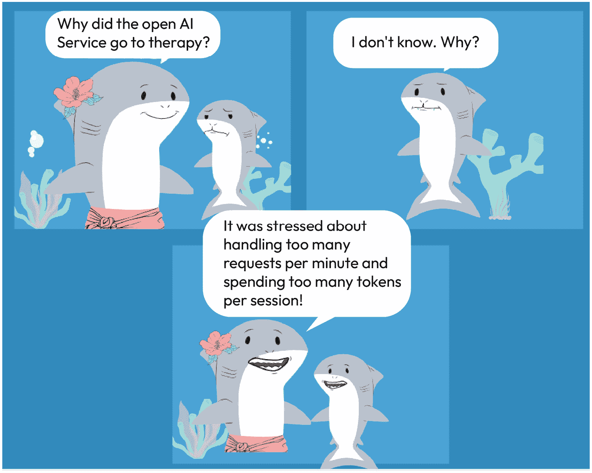
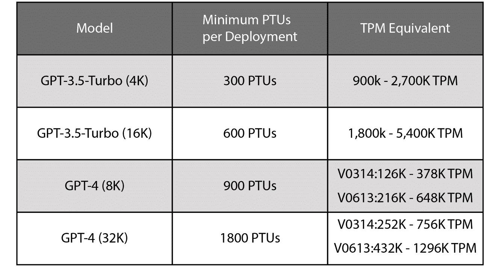
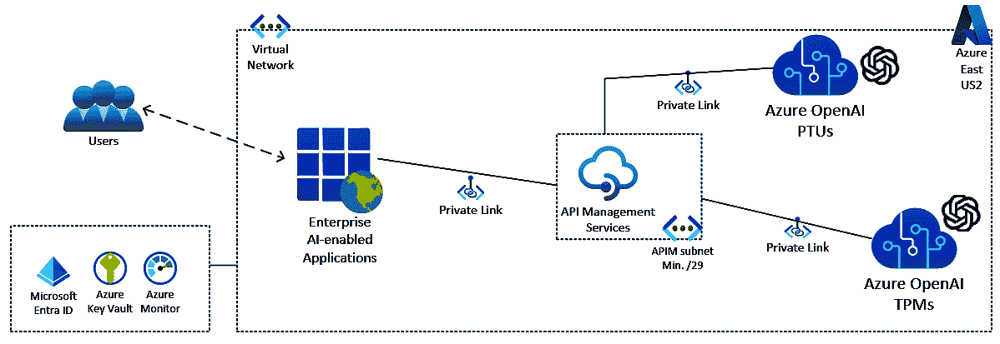
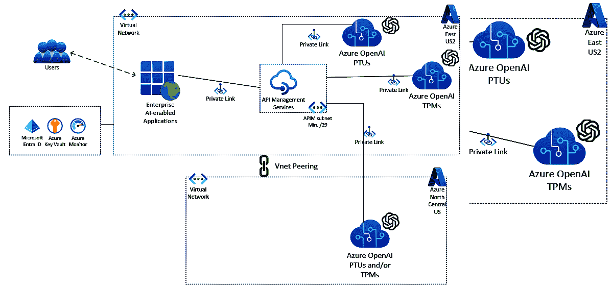

# 在云中部署 ChatGPT：架构设计和扩展策略

在前面的章节中，你学习了更多关于如何微调 LLMs 和添加外部数据的方法。你还深入了解了提示和响应在底层是如何工作的。然后，你学习了如何使用各种 LLMs 的流行编程框架开发应用程序。随着我们继续在 GenAI/ChatGPT 云解决方案的学习中前进，我们将意识到这些云服务在处理提示和完成令牌时存在限制。大规模部署需要“企业就绪”，我们必须利用云来提供必要的服务和支持，以实现企业解决方案，而无需从头开始创建服务，这样我们付出的努力会更少。例如，安全（这个主题将在下一章中更详细地介绍）和身份等服务已经预置在云服务中，因此在我们试图构建的云解决方案中也是如此。然而，云服务提供商施加了限制，我们必须了解这些限制，并围绕它们设计以实现成功的云解决方案。

在本章中，我们将专注于理解 GenAI 可以扩展以支持成千上万的用户，拥有大量的并发连接，并提交提示。这不仅限于 GenAI 的用户，还可以包括应用程序和其他 LLMs 等，仅举几例。整个解决方案，从架构设计、部署、扩展、性能调整、监控和日志记录，都结合在一起，为 ChatGPT 提供了一个强大、可扩展的云解决方案。

在本章中，我们将涵盖以下主题：

+   理解限制

+   云扩展、设计模式和错误处理

+   监控、日志记录和 HTTP 响应代码

+   成本、培训和支援



图 7.1 – 请求过多和令牌过多

# 理解限制

任何大规模云部署都需要“企业就绪”，确保最终用户体验可接受，并且满足业务目标和要求。“可接受”是一个相对宽泛的术语，可能因用户和负载而异。为了了解如何扩展以满足任何用户或业务需求，随着对服务的需求增加，我们必须首先了解基本限制，例如令牌限制。我们在*第五章*中涵盖了大多数常见生成式 AI GPT 模型的相关限制，然而，我们在这里将快速回顾它们。

随着组织使用企业级服务（如 Azure OpenAI）进行扩展，提示+完成请求中令牌的处理速度存在速率限制。由于每个模型在单个提示+完成中可以消耗的令牌限制，因此可以发送的文本提示数量有限。重要的是要注意，速率限制的令牌总体大小包括提示（发送到 AOAI 模型的文本）大小以及返回的完成（模型返回的响应）大小，并且根据模型的不同，模型上的令牌限制也会有所不同。也就是说，每个提示使用的最大令牌数将取决于所使用的通用人工智能模型。

您可以在 Azure OpenAI 概览页面或 OpenAI 账户页面查看您的速率限制。您还可以在 HTTP 响应头中查看有关速率限制的重要信息，例如剩余请求数、令牌和其他元数据。请参阅本章末尾的参考链接，了解这些头字段包含的详细信息。

下面是一些不同 GPT 模型的令牌限制：

| **模型** | **令牌限制** |
| --- | --- |
| GPT-3.5-turbo 0301 | 4,096 |
| GPT-3.5-turbo-16k | 16,385 |
| GPT-3.5-turbo-0613 | 4,096 |
| GPT-3.5-turbo-16k-0613 | 16,384 |
| GPT-4 | 8,192 |
| GPT-4-0613 | 32,768 |
| GPT-4-32K | 32,768 |
| GPT-4-32-0613 | 32,768 |
| GPT-4-Turbo | 128,000（上下文）和 4,096（输出） |

图 7.2 – 一些通用人工智能模型的令牌限制

尽管我们已经在本书前面讨论了提示优化技术，但在本章中，我们将探讨一些其他方法来扩展企业级云通用人工智能服务，以适应那些可以轻松超过特定模型令牌限制的应用和服务。

# 云扩展和设计模式

由于您在上一节中已经了解了 Azure OpenAI 和 OpenAI 施加的一些限制，我们现在将探讨如何克服这些限制。

通过精心设计的架构或设计模式克服这些限制对于企业来说至关重要，以确保它们满足任何内部**服务级别协议**（**SLAs**），并提供一个没有太多延迟或延迟的用户或应用体验的强大服务。

## 什么是扩展？

正如我们之前所描述的，任何云架构都会受到限制，就像您的笔记本电脑（RAM 或磁盘空间）上存在硬件限制一样，本地数据中心等。资源是有限的，因此我们已经在云服务中期待这些限制。然而，我们可以使用一些技术来克服这些限制，以满足我们的业务需求或用户行为和需求。

## 理解 TPM、RPM 和 PTUs

随着我们扩展，我们需要了解一些额外的术语，例如**每分钟令牌数**（**TPM**）、**每分钟请求数**（**RPM**）和**已配置吞吐量单位**（**PTUs**），以及其他一些附加服务，例如**Azure API 管理**（**APIM**），这些服务支持 Azure 中的云环境。

### TPMs

使用像微软 Azure 这样的云提供商，Azure OpenAI 的配额管理服务内置在 Azure AI Studio 中，使你能够为你的部署分配配额限制，上限为指定的限制金额——即你的“配额”。你可以在每个区域、每个模型的基础上，以 TPM 为单位为 Azure 订阅分配配额。TPM 的计费组件也称为按量付费，其中定价将基于按量付费的消费模式，每个部署的模型类型都有特定的单价。请参阅*图 7**.2*以了解一些模型及其令牌限制列表。

当你在订阅内创建 Azure OpenAI 服务时，你将收到默认的 TPM 配额大小。然后你可以调整 TPM 到那个部署或你创建的任何其他部署，此时该模型的总体**可用**配额将减少相应数量。TPMs/按量付费也是 Azure OpenAI（AOAI）服务中的默认计费机制。我们将在稍后讨论一些成本，但有关 AOAI 配额管理的更多详细信息，请参阅本章末尾提供的链接。

如果你直接使用 OpenAI，扩展操作非常相似——在 OpenAI 模型中，你可以通过在高级选项下将 TPM 滑块调整到“最大”来扩展。

现在，让我们来看一个例子，并深入了解 TPMs。

例如，在微软 Azure 云中，Azure 东部美国地区 GPT-35-Turbo 的整体限制（配额）为 240,000 TPM。这意味着每个 Azure OpenAI 账户可以有一个 240K TPM 的*单个部署*，*两个各 120K TPM 的部署*，或者在一个或多个部署中任意数量的部署，只要 TPM 总数不超过 240K（或更少）。

因此，*一种扩展的方法是通过添加额外的（Azure）OpenAI 账户*。有了额外的 AOAI 账户，你可以堆叠或合并限制。所以，在这个例子中，我们不是只有一个 240K 的 GPT-35-Turbo 限制，我们可以添加额外的 240K 倍 *X*，其中 *X* 是 30 或更少。

每个 Azure 订阅在每个区域中每个 Azure OpenAI 账户（或资源）的最大数量（截至写作时）为 30，并且也取决于区域容量的*可用性*。我们预计这个数字会随着时间的推移而增加，因为基于 GPU 的额外容量将继续被提供。

### RPM

超过 TPM 限制后，还会实施 RPM 速率限制，其中模型可用的 RPM 数量按比例设置，使用 1,000 TPM 对应 6 RPM 的比率。

RPM 不是一个直接的计费组件，但它是速率限制的一部分。需要注意的是，尽管 AOAI 的计费基于令牌（TPM），但实际触发速率限制的两个触发器如下：

按每秒计算，而不是按每分钟计费级别。

速率限制将在每秒**令牌数**（**TPS**）或 RPM（在短时间段内评估，1-10 秒）发生。也就是说，如果您超过特定模型的 TPS 总和，则将应用速率限制。如果您在短时间内超过 RPM，则也会应用速率限制，返回限制错误代码（429）。

可以通过缩放特殊配方以及遵循本章后面描述的一些最佳实践轻松管理节流速率限制。

您可以在本章末尾的“管理 Azure OpenAI 服务”链接中了解更多关于配额管理和 TPM/RPM 速率限制的详细信息。

### PTUs

微软 Azure 云最近在今年的早些时候引入了使用预留容量，或 PTUs，为 AOAI 的能力。除了上述默认的 TPMs 之外，这项新的 Azure OpenAI 服务功能，PTUs，定义了使用预留资源处理提示和生成完成内容的模型处理能力。

*PTUs 是企业可以扩展以满足业务需求的一种方式，因为它们可以为您的最苛刻和复杂的* *提示/完成场景* *提供预留容量。*

可提供不同类型的 PTUs，这些 PTUs 的大小以较小的增量或较大的 PTU 单位增量提供。例如，PTUs 的第一个版本，我们将称之为经典 PTUs，以及较新的 PTU 产品，如“管理”PTUs，其大小提供不同，以便以更可预测的方式适应各种大小的工作负载。

PTUs 作为每月承诺购买，具有自动续订选项，这将在 Azure 订阅中使用特定模型在特定 Azure 区域中*预留* AOAI 容量。假设您为 GPT 3.5 Turbo 配置了 300 PTUs。PTUs 仅针对 GPT 3.5 Turbo 部署在特定 Azure 订阅中配置，不适用于 GPT 4。您可以为 GPT 4 拥有单独的 PTUs，以下表格中描述了经典 PTUs 的最小 PTUs。还有管理 PTUs，其最小大小可能不同。

请记住，虽然预留容量可以提供一致的延迟、可预测的性能和吞吐量，但这种吞吐量量高度依赖于您的场景 – 即吞吐量将受到一些因素的影响，包括*提示和生成令牌的数量和比率、并发请求数量以及使用的模型类型和版本*。以下表格描述了有关 PTUs 的*大致*TPMs 预期值。吞吐量可能会有所不同，因此提供了一个近似范围：



图 7.3 – 经典 PTUs 的大致吞吐量范围

由于您可以通过创建多个（Azure）OpenAI 账户进行扩展，因此您也可以通过增加 PTU 的数量进行扩展。为了扩展目的，您可以乘以您应用程序或服务所需的最小 PTU 数量。

下表描述了经典 PTU 的这种扩展：

| **模型** | **创建部署所需的最小经典 PTU 数量** | **部署增量扩展所需的经典 PTU 数量** | **示例部署大小（PTU）** |
| --- | --- | --- | --- |
| GPT-3.5-Turbo (4K) | 300 | 100 | 300, 400, 500… |
| GPT-3.5-Turbo (16K) | 600 | 200 | 600, 800, 1,000... |
| GPT-4 (8K) | 900 | 300 | 900, 1,200, 1,500… |
| GPT-4 (32K) | 1,800 | 600 | 1,800, 2,400, 3,000… |

图 7.4 – PTU 最小值和增量扩展（经典 PTU）

注意

PTU 的大小和类型正在不断演变。上面的两个表格只是为了给出 PTU 相对于 TPM 的近似规模以及它如何根据模型和版本而有所不同。有关更多信息，您可以访问“已配置吞吐量单元（PTU）入门指南”。

现在我们已经了解了用于扩展目的的基本组件，如 TPM、RPM 和 PTU。现在让我们深入了解扩展策略以及如何使用我们为大型和全球企业级应用程序量身定制的特殊扩展方法来规避这些限制。

## 扩展设计模式

我们尚未涉及的一个领域是，这些基于多个 TPM 或 PTU 的 Azure OpenAI 账户如何协同工作。也就是说，一旦您设置了多个 AOAI 账户，您将如何向每个账户发送提示？或者，如果您一次发送了太多的提示，您如何管理错误/响应代码？

答案是通过使用 Azure APIM 服务。API 是 APIM 服务实例的基础。每个 API 都由一组应用程序开发者可以使用的操作组成。每个 API 都有一个链接到后端服务的链接，其操作对应于后端操作。APIM 中的操作有许多配置选项，包括对 URL 映射、查询和路径参数、请求和响应内容以及操作响应缓存的控制。我们不会在本章中涵盖这些附加功能，如 URL 映射和响应缓存，但您可以在本章末尾的参考链接中了解更多关于 APIM 的信息。

*使用 APIM 是帮助组织扩展以满足业务和用户需求的另一种方式。*

例如，你也可以创建一个“溢出”场景，其中你可能正在向已启用部署 AOAI 账户的 PTU 发送提示。然后，如果你超过了 PTU 限制，你可以溢出到一个用于按量付费模型的 TPM 启用 AOAI 账户。

下图显示了基本设置，但此架构可以扩展并包括许多其他 Azure 云资源。然而，为了简单和专注，这里只描绘了相关的服务：



图 7.5 – 单个 Azure 区域中的 AOAI 和 APIM

如在单个区域场景中所述，您可以使用 APIM 将提示排队并发送到任何 AOAI 端点，只要这些端点可以访问。在以下图例的多区域示例中，我们有一个区域中的两个 AOAI 账户（一个 PTU 和一个 TPM），然后在另一个 Azure 区域中有一个第三个 Azure OpenAI 账户。

因此，单个 APIM 服务可以轻松扩展并支持许多 AOAI 账户，甚至跨多个区域，如以下所述：



图 7.6 – 使用单个 APIM 服务的多区域 AOAI 部署

如您所见，单个 APIM 服务可以为多个 AOAI 账户提供服务，无论是在同一 Azure 区域，还是在多个区域。

在我们继续“扩展”之旅的过程中，提到 APIM 有三个生产级层级：基本、标准和高级。使用高级层级，您可以在所需的任意多个 Azure 区域中使用单个 APIM 实例，只要 APIM 可以访问其他区域（s）中的 AOAI 端点。当您创建 APIM 服务时，实例在单个 Azure 区域（主区域）中只有一个单元。这提供了什么？如果您有一个多区域 Azure OpenAI 部署，这意味着您也必须拥有多区域（高级）SKU 的 APIM 吗？不，不一定。如前所述的多区域架构所示，单个 APIM 服务实例可以支持多区域、多 AOAI 账户。当使用该服务的应用程序位于同一区域且您不需要**灾难** **恢复**（**DR**）时，拥有单个 APIM 服务是有意义的。

然而，由于本章是关于企业级扩展，我们建议使用多个 APIM 服务账户，以使用 APIM 高级 SKU 覆盖 DR 场景。

高级 SKU 允许您将一个区域设为主要区域，并将任意数量的区域设为辅助区域。在这种情况下，您可以在不同的场景中使用辅助区域，或多个辅助区域——例如，如果您正在计划任何灾难恢复（DR）场景，这对于任何企业架构来说都是推荐的。请注意，您的企业应用程序也应设计为使用 DR 策略实现数据弹性。另一个例子是如果您正在监控 APIM 服务。如果您看到极端的密集使用，并且可以将您的应用程序（s）扩展到多个区域，那么您可能希望在不同区域部署 APIM 服务实例。

有关如何将 APIM 服务实例部署到多个 Azure 区域的更多信息，请参阅如何将 Azure API 管理服务实例部署到多个 Azure 区域：[https://](https://learn.microsoft.com/en-us/azure/api-management/api-management-howto-deploy-multi-region)https://learn.microsoft.com/en-us/azure/api-management/api-management-howto-deploy-multi-region

## 指数退避重试——扩展的特殊配方

那么，当我们使用多个 Azure OpenAI 实例（账户）时，如何控制（或排队）消息？我们如何高效地管理返回的错误代码以优化 AOAI 体验？

作为最佳实践，Microsoft 和任何其他云服务提供商都会建议在使用云服务时使用“重试逻辑”或“重试模式”。当在云应用程序中使用此重试模式时，有助于应用程序处理暂时性（瞬态）故障，同时尝试重新建立与服务之间的连接，或重新连接，以在该服务上执行请求，从而自动重复失败的操作，而无需额外的用户干预。由于云服务是基于云的，而应用程序或用户对基于云的服务是远程的，因此此重试模式至关重要。这种重试逻辑可以提高应用程序的稳定性并提供更好的最终用户体验。

使用基于云的服务，例如 Azure OpenAI 上的 ChatGPT，尤其是在通过应用程序进行扩展时，也不例外。

虽然你可以在应用程序中直接添加一些重试逻辑，但随着企业规模的扩大，你的选择相当有限。你现在是否在每个应用程序中都重复使用重试逻辑？如果应用程序是由第三方编写的呢？在这种情况下，你通常无法直接编辑代码。

相反，为了实现稳定性和高可扩展性，使用之前描述的 APIM 服务将提供必要的重试模式/逻辑。例如，如果您的应用程序发送提示，而服务器过于繁忙或发生其他错误，APIM 将能够重新发送相同的提示，而无需任何额外的最终用户交互。这一切都将无缝发生。

APIM 允许我们通过使用扩展的特殊配方——即“指数退避重试”的概念，轻松地做到这一点，这允许极高的并发用户负载。

指数退避重试是一种尝试操作的方法，等待时间呈指数增长，直到达到最大重试次数（指数退避）。这种技术接受这样一个事实，即云资源可能由于任何原因在几秒钟内无法访问，这被称为瞬态错误，或者如果由于大规模部署中每秒处理的令牌过多而返回错误。

这可以通过 APIM 的重试策略来实现。以下是一个示例：

```py
<retry condition="@(context.Response.StatusCode == 429 || context.Response.StatusCode >= 500)" interval="1" delta="1" max-interval="30" count="3">
```

在这个例子中，错误是针对一个等于 429 的 HTTP 响应状态码的，这是“服务器忙碌”的返回代码。这表明向特定模型发送了太多的并发请求，以每秒的速率来衡量。这可能会在企业组织扩展到大量用户时发生。

下面是 APIM 策略声明的详细值和解释：

```py
<retry
    condition="Boolean expression or literal"
    count="number of retry attempts"
    interval="retry interval in seconds"
    max-interval="maximum retry interval in seconds"
    delta="retry interval delta in seconds"
    first-fast-retry="boolean expression or literal">
        <!-- One or more child policies. No restrictions. -->
</retry>
```

格式和每个值的含义相当明显，然而，为了更深入的了解，你可以通过阅读本章末尾提供的文档链接来了解更多关于参数的信息。

需要理解和掌握的主要且极为重要的观点是，当 APIM 的间隔、最大间隔和 delta 参数被指定，就像前面示例中那样，那么 APIM 会自动应用一个指数间隔重试算法。这就是我们所说的“扩展特殊配方”——也就是说，使用任何组合的多个 AOAI 账户来满足最苛刻的业务/用户需求的指数间隔重试特殊配方。

对于那些对背后的数学逻辑感兴趣的人，以下是 APIM 用于指数间隔重试公式的计算方法：

```py
interval + 2^(count - 1) * random(delta * 0.8, delta * 1.2), up to the maximum interval (max-interval)
```

没有扩展的特殊配方（APIM 使用指数退避的重试），一旦达到初始速率限制，比如说由于太多并发用户发送了太多的提示，那么就会返回一个 429 错误返回代码（服务器忙碌）。

此外，随着更多后续提示/完成的发送，问题可能会迅速恶化，因为返回了更多的 429 错误，错误率进一步增加。正是通过指数退避的重试，你才能以非常低的错误响应率扩展数千个并发用户，为 AOAI 服务提供可扩展性。

除了使用指数退避的重试之外，APIM 还支持基于内容的路由。这就是在运行时根据消息的内容来确定消息路由端点。你可以利用这一点向多个 AOAI 账户发送 AOAI 提示，包括 PTUs 和 TPMs，以满足进一步的扩展需求。例如，如果你的模型 API 请求指定了特定的版本，比如 gpt-35-turbo-16k，你可以将此请求路由到你的 GPT 3.5 Turbo (16K) PTUs 部署。无论是在同一区域还是多区域部署，这都是适用的。

我们可以写一本书来介绍 APIM 提供的所有奇妙扩展功能，但关于 APIM 的更多详细信息，请查看本章末尾的 APIM 链接。或者，你可以参考由 Packt Publishing 出版的由 Luis Weir 编写的优秀书籍《企业 API 管理》。

## Azure API Management 中的速率限制策略

Azure API Management 中的速率限制是一种策略，限制用户在特定时间段内对 API 发起请求的数量，确保成本控制、公平使用，并保护 API 免受过度使用和滥用。正如我们在上面讨论的 TPM 和 RPM 级别上的速率限制一样，我们也可以在 Azure API 管理中设置速率限制策略。这有几个好处，如下所述——

+   **防止过度使用**：确保没有单个用户可以通过发起过多请求而垄断 API 资源。

+   **管理资源**：帮助均匀分配服务器资源，以维护服务可靠性。

+   **控制成本**：避免使用量意外激增，可能导致更高的运营成本。

+   **增强安全性**：通过限制请求速率，作为防御层对抗攻击，例如拒绝服务（DoS）攻击。

+   **确保服务质量**：保证所有用户之间公平的资源分配，以维持预期的服务级别。

+   **促进操作稳定性**：通过允许有效的资源规划，有助于 API 的稳定性和可预测性。

现在我们已经很好地掌握了 Azure API Management 中扩展的基本组件和策略，让我们将注意力转向监控和日志记录功能，这些功能可以帮助构建 Gen AI 应用程序的遥测，帮助你测量关键指标，以确定应用程序的性能和可用性。

# 监控、日志记录和 HTTP 返回代码

正如我们在前面的章节中学到的，限制以及我们如何使用各种扩展技术来管理这些限制，可以帮助我们为成千上万的用户/要求严格的业务应用提供强大、企业级、高度可扩展的云通用人工智能（GenAI）服务。

但与任何好的企业级服务一样，配置和部署监控和日志记录提供的基本遥测数据对于确保最佳性能和问题发生时的及时通知非常重要。

## 监控和日志记录

对于任何旨在企业就绪的强大企业服务或解决方案，最关键的运营类别之一是解决方案的监控/仪表化/可观察性和日志记录。

这些组件对于任何企业级服务都是必需的，你可能已经熟悉这些概念，或者在这些领域有很多经验，所以我们不会对此进行深入探讨，只介绍监控和日志记录如何与运行基于 GenAI/ChatGPT 的云服务相关，以及一些最佳实践。

任何企业级监控解决方案都可以用于健康检查应用程序和服务，以及设置警报，以便在达到或超过某些阈值时收到通知，例如防止自动化和大量滥用或其他与异常使用模式相关的异常。两个非常广泛使用的服务，Azure 监控和 DataDog，都提供了与 OpenAI/Azure OpenAI 一起使用的操作模块。这些企业工具知道哪些指标对于收集、显示和警报以实现云 GenAI 服务的成功和最佳健康状态是重要的。

监控事务性事件，例如 **TokenTransaction**、**Latency** 或 **TotalError** 等等，可以提供有关您的 Cloud ChatGPT 服务运行情况的宝贵见解，或者在设置或条件不在您理想参数范围内时发出警报。这些可用指标的警报和通知是高度可配置的。您可以在以下位置找到完整的指标列表：[`learn.microsoft.com/en-us/azure/ai-services/openai/how-to/monitoring#azure-openai-metrics`](https://learn.microsoft.com/en-us/azure/ai-services/openai/how-to/monitoring#azure-openai-metrics)。

有关 Datadog 对 OpenAI 的监控更多信息，请查看 [`www.datadoghq.com/solutions/openai/`](https://www.datadoghq.com/solutions/openai/)。

相关的是，应用程序日志对于实时或事件发生后审查事件的成功至关重要。之前描述的所有指标都可以收集和存储，实时报告以进行历史分析，并使用 Azure 中的日志分析工作区等可视化工具输出，例如 Fabric（Power BI）。

每个云 GenAI 应用程序都将有不同的日志要求，由业务/组织定义。因此，微软创建了一份监控和日志 AOAI 最佳实践指南，您可以在本章末尾找到该指南的链接。

## HTTP 返回代码

HTTP 返回代码，有时被称为“错误代码”，在上一节中简要提及，提供了一种验证方式。这是一个许多网络开发者会很容易识别的标准网络模式。

记住，当您的应用程序发送提示时，它是通过 HTTP API 调用来实现的。

如在“指数退避重试 – 规模化特殊酱料”部分所述，您可以根据 APIM 重试策略文档对任何 429 错误使用指数退避重试。

然而，作为最佳实践，您应该首先配置有关提示大小与该提示旨在使用的模型大小的错误检查。例如，对于 GPT-4（8k），此模型支持每个提示+完成的最多 8,192 个请求令牌。如果您的提示大小为 10K 令牌，则这会导致整个提示因令牌大小过大而失败。您可以继续重试，但结果将相同——任何后续的重试都会失败，因为令牌限制大小已经超过。作为最佳实践，确保在将提示发送到 AOAI 服务之前，立即确保提示的大小不超过最大请求令牌限制。再次强调，以下是每个模型的令牌大小限制：

| **HTTP** **响应代码** | **原因** | **补救措施** | **备注** |
| --- | --- | --- | --- |
| 200 | 处理了提示。无错误完成 | N/A | 成功完成 |
| 429 (v0613 AOAI Models) | 服务器忙碌（请求达到速率限制）。 | APIM – 带指数退避的重试 | 当指定 APIM 的间隔、最大间隔和增量时，将自动应用指数间隔重试算法 |
| 424 (v0301 AOAI Models) | 服务器忙碌（请求达到速率限制） | APIM – 带指数退避的重试 | 与上面相同 |
| 408 | 请求超时 | APIM 重试，带间隔 | 发生超时的原因有很多，例如网络连接/短暂错误 |
| 50x | 由于短暂的后端服务错误导致的内部服务器错误。 | APIM 重试，带间隔 | 重试策略：[`learn.microsoft.com/en-us/azure/api-management/retry-policy`](https://learn.microsoft.com/en-us/azure/api-management/retry-policy) |
| 400 | 与提示本身相关的问题，例如提示大小对于模型类型过大 | 使用 APIM 逻辑或应用逻辑立即返回自定义错误，而无需将其发送到模型进行进一步处理 | 立即评估提示后，发送回响应，因此不需要进一步处理 |

图 7.7 – HTTP 返回代码

上表列出了最常见的 HTTP 返回代码，以便您可以根据响应程序化地管理和处理每个返回代码，从而更好地处理生成式 AI 服务行为的大多数扩展方面。

接下来，我们将了解在您的生成式 AI 扩展之旅中应考虑的一些额外因素。

# 成本、培训和支援

为了结束本章关于在云中部署 ChatGPT 的架构设计和扩展策略，与扩展的企业服务相关联的三个额外领域是：成本、培训和支援。

## 成本

在本章中，我们讨论了许多用于强大、企业级云 ChatGPT 服务的服务。虽然我们希望关注架构设计和扩展策略的技术方面，但成本问题（以及它应该被讨论）将（并且应该）被讨论，这是一个从投资回报率的角度来看至关重要的因素，高管们不可避免地会权衡。认识到其重要性，本节致力于理解影响成本的各种因素，同时讨论在不同架构层——即模型、数据、应用和基础设施层——上的成本优化策略。

任何服务的成本都有变化，并且这些成本也会随时间而变化。这是任何商业的本质，不仅仅是像 ChatGPT 这样的基于技术的解决方案。我们不会在这里列出确切的价格，因为一旦这本书出版，价格可能已经改变，甚至更早！相反，我们想提到在定价解决方案时需要考虑的一些类别。这取决于供应商，您的企业解决方案的大小，以及许多其他因素。

您必须明白，需要考虑的不仅仅是 GenAI/LLM 模型的定价，每个模型都有其版本和类型，还需要考虑您希望这些处理有多快，以及成本根据成本模型的不同而变化——如我们之前在本章中讨论的 TPMs 和 PTUs，即按量付费或按时间单位付费。

当然，还有支持您的企业级 GenAI 部署的任何辅助服务的成本，以及之前在本节中描述的培训和支持成本，还有设计、部署、管理和运营强大企业云解决方案的员工成本。

下面，我们列出成本考虑事项和一些优化最佳实践，以帮助降低成本或减少资源：

### 模型和数据层

+   **模型选择**：选择一个与您的任务需求紧密对齐的预训练模型。这可以减少对大量微调和数据收集的需求，节省时间和资源。使用在*第三章*中讨论的流行基准来缩小特定任务的模型范围。对于低影响、内部（非客户）面向的应用程序和批量任务，考虑小型语言模型和开源模型以降低成本，在这些情况下，质量和性能不是最重要的。

+   **数据效率**：利用数据增强技术从现有的数据集中创建更多的训练数据。这可以帮助您用更少的数据实现更好的结果，从而降低存储和处理成本。教科书质量的数据可以帮助您用更少的标记创建更多高性能的模型。例如，使用教科书质量的合成数据集创建了 2.7B 参数的 Phi-2 模型。它在复杂的基准测试中优于其 25 倍大小的模型。

+   **早期停止**: 在训练期间实施早期停止以防止过拟合并减少训练时间。这有助于您找到良好的模型，而无需在不必要的迭代上浪费资源。

+   **模型优化**: 通过剪枝或量化您的模型来减小其大小和计算需求。这可以导致更快的训练和推理，降低云成本。模型量化导致内存减少、计算更快、能源效率更高、网络效率更高，从而降低成本。

### 应用层

+   **API 参数**: 这些是可以配置的设置或值，用于自定义 API 的行为，允许用户控制数据处理、请求格式和响应内容等方面。设置适当的参数确保资源的有效利用和与 API 的最优交互。

    +   **标记大小**: 总是设置 max_tokens 参数以控制每个 API 调用中的标记大小。

    +   **批量请求**: 考虑发送批量请求而不是单个请求，以降低整体成本。

+   **缓存**: 对于可能频繁产生相同输出的应用程序，实现缓存机制可以通过提供缓存结果而不是重新生成它们来节省计算成本。

+   **提示指南**: 提供一个示例提示指南/集合，以指导用户制作有效的提示。这种方法确保用户可以在最少迭代次数内实现预期结果。

+   **上下文窗口**: 尽管在大型语言模型（LLM）中上下文窗口长度已上升至百万级别，但在每个实例中默认使用全部长度仍然至关重要。特别是在 RAG 应用中，战略性地优化以仅使用最小数量的标记对于成本效率至关重要。

### 基础设施层

+   **云基础设施**: 利用提供灵活定价选项和按需付费模式的云平台。这允许您根据需求调整资源的大小，避免不必要的成本。考虑使用自动扩展等托管服务，并在空闲时终止计算实例。

+   **Spot VM 或可抢占 VM**: 如果不使用 PaaS 服务，那么在模型训练或微调时寻找 Spot 或低优先级 VM，以从较低的价格中受益。

+   **预留实例**: 如果您有可预测的、稳定的负载，购买预留实例可以在承诺一年或三年期限的情况下，与按需定价相比提供显著的节省。这对于需要可预测性能的客户面负载来说是有益的。例如，Azure PTUs。

+   **速率限制**: Azure API Management 中的速率限制是一种策略，用于控制客户端在指定时间周期内处理的请求数量，确保公平使用并防止 API 滥用。这也有助于控制成本。

+   **监控和日志记录**：持续监控您模型的表现和资源使用情况。这有助于您识别优化区域和潜在的节省成本。您可以使用 Azure API Management 和 Azure Cost Monitor 构建这种遥测。

注意：

我们建议尽早实施遥测解决方案来监控您的应用程序的提示和完成时的令牌使用情况。这允许您在负载增长时在 PTU 和按量付费之间做出明智的决定。通过逐步扩大解决方案到生产环境，采用逐步增加的方法进行成本效益管理是推荐的。

+   **数据传输成本/出口成本**：在多云和/或跨区域设置中，监控出口使用情况和费用对于有效管理总解决方案成本至关重要。传统的可观察性

+   **数据存储**：在可能的情况下，将您的训练数据集或由 AI 应用程序生成的文件存储在成本更低的对象存储中，如 Azure Blob、S3 或 Google Cloud Storage。利用压缩技术来降低存储成本。

## 训练

您已经开始了为 ChatGPT 和 OpenAI 进行训练的旅程，尤其是如果您已经阅读了这本书。我们已经了解了许多学习与训练的形式，但关键点是，了解 ChatGPT 服务本身以及其他相关服务是非常重要的。我们在上一章中提到了这些其他服务的一些，例如 APIM 服务、企业监控、仪表化、日志记录、应用和 Web 开发与管理，以及数据科学和分析等。

训练的另一个方面可能包括数据库管理培训，特别是像 Azure CosmosDB 这样的 NoSQL 类型的企业服务。为什么？通常，一个大型的组织会希望保存他们的提示和完成历史记录，例如，以便他们可以在以后检索它或进行搜索，而无需再次发送相同的提示。这确实为 ChatGPT 云服务提供了一个高度高效和优化的解决方案，以及 NoSQL 数据库（如 CosmosDB）可以提供的所有好处——例如，高性能、低成本和全球可扩展的服务。**根据我们的经验，我们发现 CosmosDB 对于对话生成 AI 应用的缓存和会话管理是有益的**。

当然，没有人能够独立运行一个企业解决方案，因此您不需要了解每个服务的复杂细节和任务——这正是企业云团队的工作……并且是以团队的形式完成的！然而，在服务规划生命周期的早期就确定您将运行的企业服务的培训需求，并识别任何差距，这是高度推荐的最佳实践。

## 支持

就像训练是设计和扩展云解决方案中的 ChatGPT 的关键部分一样，支持这个企业解决方案/服务也同样重要。

需要考虑许多支持方面：为可能使用您的企业级服务的最终用户提供内部技术支持，以及各种工作负载所有者提供的内部支持，包括前面描述的主要和辅助服务。

然而，这不仅仅是内部支持，还包括您需要考虑的任何外部、第三方和供应商云支持。OpenAI 和 Azure 都提供了许多支持层级，无论是免费至低成本的自助论坛，社区相互支持，还是由受过培训的人员提供的付费支持，他们可以快速解决企业问题，并且他们有接受过服务所有方面（组件）培训的人员。这些付费支持服务可以根据您基于内部 SLA 希望解决方案解决速度的快慢提供多个支持层级。

在设计和扩展云解决方案中的 ChatGPT 时，确保“支持”是您成功、稳健部署的项目清单中的项目。这个类别不能被忽视或跳过。

# 摘要

在本章中，我们学习了如何在云中部署 GenAI，如何设计和扩展一个强大、企业级就绪的 GenAI 云解决方案。我们涵盖了每个模型中存在的限制以及如何通过添加额外的（Azure）OpenAI 账户和/或使用 Azure APIM 服务来克服这些限制。

APIM，凭借其非常重要的指数间隔重试设置，是帮助组织扩展以满足业务和用户需求的另一种方式。

预留容量，在 Microsoft Azure 中称为 PTUs，是企业扩展以满足业务需求的另一种方式。我们描述了如何通过增加 PTUs 的数量来添加和扩展额外的 PTUs。

在我们的云扩展之旅中，我们学会了如何在多个地理区域或多个区域进行扩展，以支持全球更广泛的规模，同时支持我们的企业灾难恢复场景。

我们现在了解如何在调用我们的生成式 AI 模型时处理各种响应和错误代码，我们还了解了一些最佳实践，例如首先配置错误检查提示的大小，以针对该提示旨在使用的模型，以获得更优化的体验。

然后，你了解了扩展的秘诀，这是一种洞察力强的技术，通过使用称为指数退避的重试模式，确保了大规模和无缝的体验。使用这种技术，可以实现极大规模的用户和提示计数下的扩展。

当我们结束时，我们描述了监控/仪表化/可观察性如何通过提供警报通知和对服务操作方面的更深入了解，在整体解决方案中发挥关键作用。日志进一步支持企业的运营需求，例如使用日志进行实时分析或历史数据，以便可以在报告中展示。

最后，我们讨论了在设计可扩展和稳健的企业 ChatGPT 云解决方案时需要进一步调查的类别——培训、支持和成本。

在下一章中，我们将学习对于想要在云端扩展和部署 ChatGPT 的企业来说的一个重要方面：安全性。我们将探讨部署 ChatGPT 用于云解决方案的一些关键安全考虑或担忧，以及如何最好地解决这些问题，以保持持续稳健、适用于企业的云解决方案。

# 参考文献

+   管理 Azure OpenAI 服务配额：[`learn.microsoft.com/en-us/azure/ai-services/openai/how-to/quota?tabs=rest`](https://learn.microsoft.com/en-us/azure/ai-services/openai/how-to/quota?tabs=rest)

+   OpenAI 头部中的速率限制：[`platform.openai.com/docs/guides/rate-limits/rate-limits-in-headers`](https://platform.openai.com/docs/guides/rate-limits/rate-limits-in-headers)

+   什么是 Azure API Management？：[`learn.microsoft.com/en-us/azure/api-management/api-management-key-concepts`](https://learn.microsoft.com/en-us/azure/api-management/api-management-key-concepts)

+   Azure API Management 重试策略：[`learn.microsoft.com/en-us/azure/api-management/retry-policy`](https://learn.microsoft.com/en-us/azure/api-management/retry-policy)

+   如何将 Azure API Management 服务实例部署到多个 Azure 区域：[`learn.microsoft.com/en-us/azure/api-management/api-management-howto-deploy-multi-region`](https://learn.microsoft.com/en-us/azure/api-management/api-management-howto-deploy-multi-region)

+   Azure OpenAI 中每个模型的令牌大小限制：[`learn.microsoft.com/en-us/azure/ai-services/openai/concepts/models`](https://learn.microsoft.com/en-us/azure/ai-services/openai/concepts/models)

+   配置吞吐量单位（PTU）入门指南：[`learn.microsoft.com/en-us/azure/ai-services/openai/how-to/provisioned-get-started`](https://learn.microsoft.com/en-us/azure/ai-services/openai/how-to/provisioned-get-started)

+   Azure OpenAI 监控和日志最佳实践指南：[`techcommunity.microsoft.com/t5/fasttrack-for-azure/optimizing-azure-openai-a-guide-to-limits-quotas-and-best/ba-p/4076268`](https://techcommunity.microsoft.com/t5/fasttrack-for-azure/optimizing-azure-openai-a-guide-to-limits-quotas-and-best/ba-p/4076268)

+   Azure OpenAI 定价：[`azure.microsoft.com/en-us/pricing/details/cognitive-services/openai-service/`](https://azure.microsoft.com/en-us/pricing/details/cognitive-services/openai-service/)

# 第四部分：构建安全可靠的 AI——安全和伦理考虑

本部分将涵盖您需要了解的关于创建既安全又可靠，并且以负责任的人工智能优先思维构建的 AI 应用的所有内容。我们将探讨与生成式 AI 相关的安全风险，包括深度伪造的危险，并讨论应对这些问题的策略，例如红队战术。我们将介绍负责任 AI 的原则，突出该领域的新兴初创生态系统，并审视围绕 AI 的当前全球法规。此外，我们还将探讨组织如何为这些监管环境做好最佳准备。

本部分包含以下章节：

+   *第八章*，*生成式 AI 的安全和隐私考虑：构建安全可靠的 LLMs*

+   *第九章*，*负责任地开发 AI 解决方案：以诚信和关怀构建*
