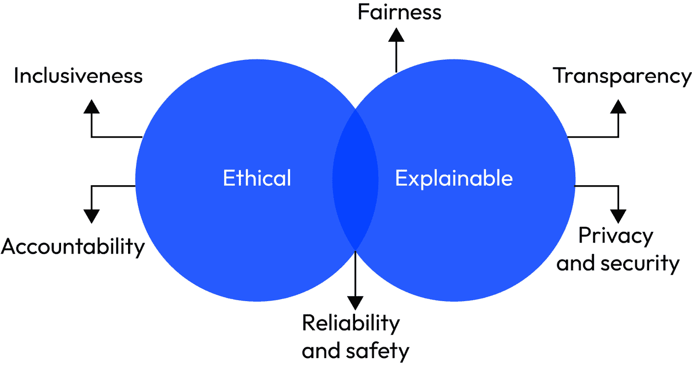
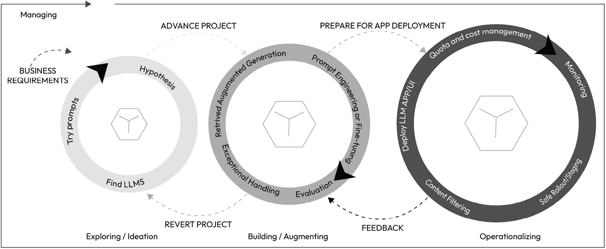
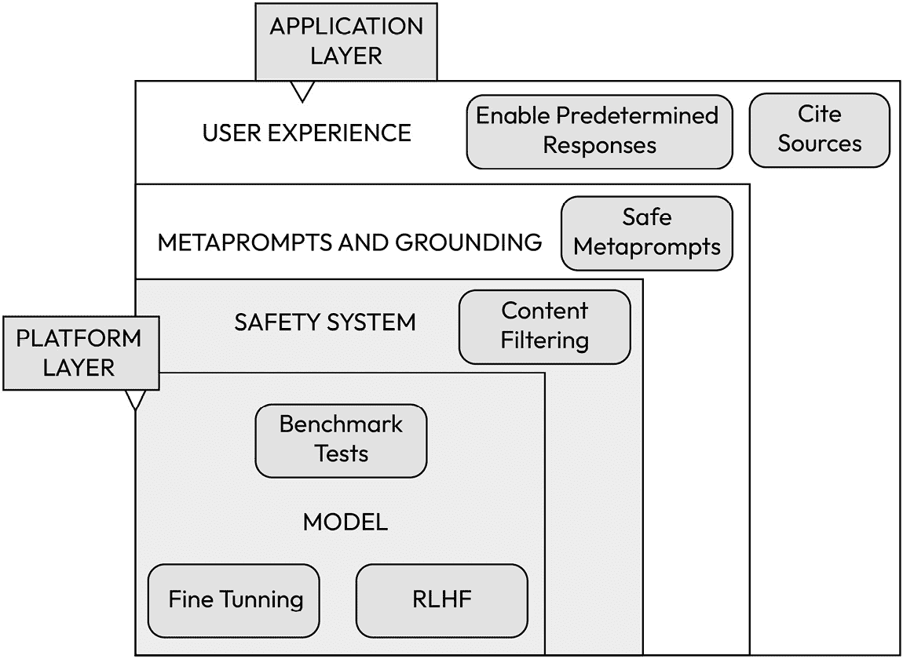
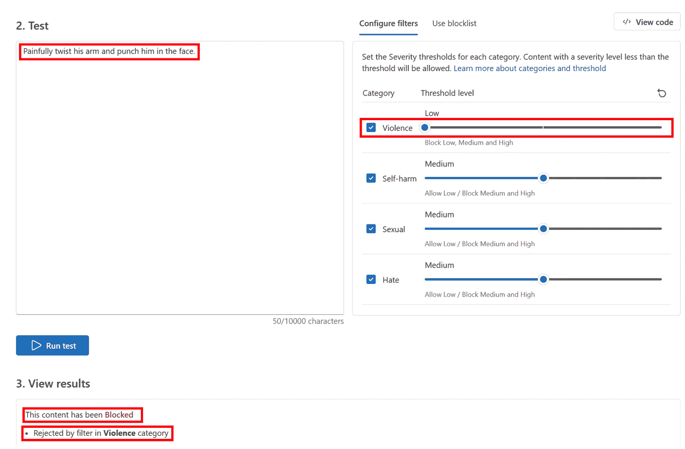
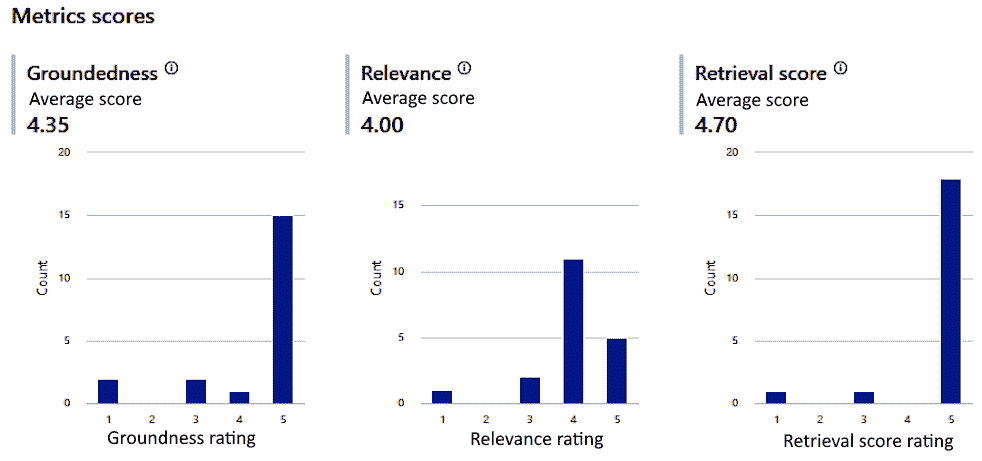
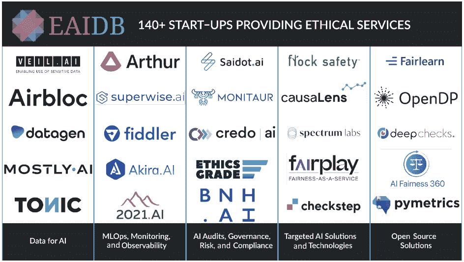

# 第九章：负责任的 AI 解决方案开发：以诚信和关怀为基础

在现代技术的领域，**人工智能**（AI）已成为一种变革力量，重塑产业、提高效率和提升用户体验。作为云和 AI 架构师，我们站在 AI 革命的尖端，掌握着塑造 AI 驱动解决方案未来的力量。然而，权力越大，责任越大。将负责任的 AI 实践融入 AI 解决方案的设计和部署，不仅是一个道德或伦理的要求，而且是一个战略要求，它直接影响着组织在 AI 领域的成功、声誉和可持续性。

忽视负责任的 AI（RAI）原则可能对人类生活产生深远影响。一篇来自麻省理工学院的引人深思的文章《AI 将人们送进监狱——并且犯错了》，探讨了 AI 和算法在刑事司法系统中的应用。它强调了警察和法官使用的面部识别系统和预测算法由于训练数据存在偏见，可能导致影响人类生活的错误决策。研究人员一直表明，面部识别系统在识别深色皮肤的个人方面尤其容易出错。在司法系统中使用的预测模型可能偏向于某一群体的人，导致错误的判断。此类事件（以及其他我们将在这本书中探讨的事件）强调了以诚信和关怀开发 AI 解决方案的紧迫需求。

在本章中，我们深入探讨负责任的人工智能（RAI）的基本要素，从 AI 设计的核心原则开始，并解决由大型语言模型（LLMs）带来的独特挑战。随着我们对深度伪造日益增长的担忧，这些深度伪造是超逼真的数字操纵，常用于创建虚假视频或图像，我们明显地认识到强大的 AI 架构和积极领导的重要性，突显了进行道德和负责任 AI 开发的需求。本章还考察了 AI、云计算和法律框架之间的关系，强调了法律合规性和道德考量的重要性。此外，我们提供了对最流行的 RAI 工具的见解，提供了它们应用的实用指导。到本章结束时，您将全面了解指导 RAI 的原则、应对 LLM 挑战的策略、对深度伪造影响的意识、了解 AI 在云计算和法律环境中的作用，以及熟悉基本 RAI 工具，这将使您能够负责任和道德地参与 AI 领域。

本章我们将涵盖以下主要内容：

+   理解负责任的 AI 设计

+   RAI 的关键原则

+   使用 RAI 原则解决 LLM 挑战

+   深度伪造的担忧日益增加

+   使用负责任的 AI 优先方法构建应用程序

+   AI、云和法规——理解合规性和法规

+   RAI 领域的创业生态系统

# 理解负责任的 AI 设计

在本节中，我们将探讨负责任的 AI 的真正含义，并深入探讨在架构生成式 AI 解决方案时应考虑的基本设计原则。

## 什么是负责任的 AI？

如微软的公共文档所述，“*负责任的 AI* *(负责任的 AI)是一种以安全、可信和道德的方式开发、评估和部署 AI 系统的方法。”这就像以安全、公平和道德的方式构建和使用智能计算机程序（AI 系统）。将 AI 系统视为由人们创建的工具，这些人会做出很多关于这些工具应该如何工作的选择。负责任的 AI 是关于谨慎做出这些选择，以确保 AI 以对所有人都有益和公平的方式行事。这就像引导 AI 始终考虑对人们及其需求最有利的事情。这包括确保 AI 是可靠的、公平的，并且对其工作方式是透明的。以下是一些正在这个领域开发中的工具类型：

+   **公平招聘工具**：公司用来帮助选择求职候选人的 AI 工具。负责任的 AI 将确保这个 AI 不会偏向某一群体，从而使得招聘过程对所有求职者都是公平的。例如，**BeApplied**，一家位于 RAI 领域的初创公司，开发了一款旨在通过减少偏见来提高招聘质量和增加多样性的道德招聘软件。它与传统的人才跟踪系统不同，将公平、包容和多样性作为其核心原则。该平台基于行为科学，提供匿名申请和基于技能的预测性评估，以确保招聘过程的公正性。其功能包括多元化人才池的来源分析工具、包容性职位描述创建、匿名技能测试以进行客观评估，以及基于数据的筛选以专注于技能。BeApplied 旨在通过一次招聘创造一个更公平的招聘世界。他们目前有一些值得注意的客户，例如联合国儿童基金会和英格兰及威尔士板球。

+   **透明的推荐系统**: 想象一下一家推荐电影的流媒体服务。负责任的人工智能会使这个系统清楚地说明为什么推荐某些电影，确保它不是出于不公平的原因来推广某些电影。例如，**LinkedIn**是一家专注于透明和可解释人工智能系统的公司，尤其是在其推荐系统中。他们的方法确保人工智能系统的行为和任何相关组件都是可理解的、可解释的和可解释的。他们优先考虑人工智能的透明度，以使他们的系统值得信赖，避免有害的偏见，同时尊重隐私。例如，他们开发了**CrystalCandle**，这是一个面向客户的模型解释器，它创建易于理解的解释和见解，反映了模型预测背后的逻辑。该工具与业务预测模型集成，通过将复杂的机器学习输出转换为用户清晰、可操作的故事，帮助销售和营销。

+   **医疗保健**: 在医疗保健行业，越来越重视开发符合伦理的人工智能工具，以确保人工智能驱动决策中的公平性、透明度和问责制。这些工具旨在最小化偏见，保护患者数据隐私，并提高人工智能算法的可解释性和可靠性。在医疗保健领域，符合伦理的人工智能至关重要，因为它有助于提供个性化护理，改善患者结果，并维持高伦理标准。将伦理考量嵌入人工智能系统有助于预防潜在的负面影响，解决健康不平等问题，并与患者和社区建立信任，从而积极影响公共健康和福祉。医疗保健领域这样一个符合伦理的人工智能工具的突出例子是**Merative**（前身为 IBM Watson Health）。它通过提供基于证据的、个性化的治疗建议，并注重透明度和可解释性，支持医疗保健专业人员。该平台还优先考虑符合医疗保健法规（如 HIPAA）的患者数据保护，并通过使用多样化的数据集来训练其人工智能模型，旨在减少偏见。IBM Watson Health 的这种做法展示了人工智能改善医疗保健决策流程的潜力，同时强调患者安全、数据隐私和不同患者群体之间的公平性。

+   **金融业**：在金融行业，正在开发符合伦理的 AI 工具，以应对复杂伦理考量，如数据隐私和算法偏见，并确保 AI 驱动过程中的透明度和问责制。在金融行业，如**Zest AI**这样的符合伦理的 AI 工具正在通过增强信贷决策中的公平性和透明度，革新金融机构的贷款方式。Zest AI 利用机器学习来提高信用评分的准确性并减少偏见，从而促进金融包容性。它对可解释性的关注确保了贷款人能够理解和证明 AI 驱动的决策，符合监管合规并增强借款人的信任。这个例子强调了金融行业致力于整合负责任的 AI 实践，使机构和客户都受益，并遵守伦理标准。

+   **刑事司法**：在刑事司法系统中，开发符合伦理的 AI 工具正日益成为关注焦点，旨在提高公平性、减少偏见并改善法律结果的准确性。这些工具旨在支持决策过程，如预测警务、保释和判决的风险评估以及证据分析。刑事司法中符合伦理的 AI 工具的一个例子是**矫正犯人管理配置文件用于替代制裁（COMPAS）**。COMPAS 是一个风险评估工具，法院用它来评估被告再犯的可能性。COMPAS 考虑了诸如过去的逮捕、年龄和就业状况等因素，为再犯生成风险评分，然后法官使用这些评分来决定判决，短期监禁或长期监禁。研究发现，黑人被告被错误地归类为“高风险”未来犯罪的比率是白人被告的两倍。公司对这些说法进行了反驳，声称算法按设计工作（[`tinyurl.com/bdejxubh`](https://tinyurl.com/bdejxubh)）。然而，自那时以来，已经进行了持续的改进。尽管其实施引发了关于潜在偏见的辩论，但它突出了该行业在保释、判决和假释方面应用 AI，以做出基于信息、数据驱动的决策的尝试。为了应对伦理担忧，正在努力通过整合公平性算法、提高透明度和定期审计来识别和减轻偏见，以改进此类工具。这些进步反映了更广泛地致力于在刑事司法中发展 AI，以维护伦理标准并促进更公平的法律体系。

# RAI 的关键原则

图 9.1 – 负责任 AI 原则

微软已经建立了一个**负责任的 AI 标准**，提供了一个指导人工智能系统开发的全面框架。这个框架基于六个关键原则：**公平性**、**可靠性和安全性**、**隐私和安全**、**包容性**、**透明度**和**问责制**，如前所述。他们遵循两个指导原则：**道德和可解释性**。这些原则构成了微软对负责任和值得信赖的 AI 方法的承诺的基础。随着 AI 越来越多地融入我们日常使用的产品和服务中，这种方法变得越来越重要。在我看来，微软的这个框架对于生成式 AI 解决方案的设计非常全面，因此在设计此类解决方案时始终应是一个首要考虑因素。一个记住这些原则的好方法是“**F**riendly **R**obots **S**afeguard **P**rivacy, **I**nspire **T**rust, **A**ssure **S**afety”，或者称为**FAST-P**a**IRS**。

让我们借助实例深入探讨这些原则的每一个。

## 道德和可解释性

从道德角度来看，AI 应该做到以下几点：

+   确保其声明和任务中的公平性和包容性

+   对其选择承担责任/问责

+   避免对各种种族、残疾或背景进行歧视

人工智能中的可解释性为数据科学家、审计人员和商业领导者提供了决策过程的清晰度，使他们能够理解和证明系统的结论。它还确保遵守企业政策、行业标准法规要求。

## 公平性和包容性

这一原则确保人工智能系统不会歧视，不对某些群体或个人有偏见，并为所有人提供平等的机会。

+   例如，设计具有适应残疾人士功能的人工智能系统，例如能够理解和响应用户语音障碍的语音激活助手，或者由人工智能驱动的可由视障人士导航的网页界面。

+   这篇来自《纽约时报》的文章，标题为《数千美元的代价，却是因为我没有做的事情》讨论了一个非洲裔美国人因错误的面部识别匹配而被错误地指控和罚款的案件。这一事件突出了基于 AI 的面部识别系统在准确识别深色皮肤色调的人方面的局限性。此类事件需要人工智能系统中公平性和包容性原则的需求。

## 可靠性和安全性

这一点关注的是人工智能系统必须可靠，并且不会对用户造成任何伤害。

例如，用于自动驾驶汽车的人工智能系统必须可靠和安全。它应该持续做出正确的驾驶决策，例如在红灯处停车和避开障碍物，以确保乘客和行人的安全。

## 透明度

这一原则要求明确人工智能系统如何做出决策或得出结论。

例如，一个信用评分 AI 系统应该对其用于确定某人信用评分的因素保持透明。这意味着用户应该能够理解哪些财务行为正在影响他们的评分，无论是正面还是负面。

## 隐私和安全

这确保了 AI 系统使用的个人数据得到保护，不会被滥用。

例如，一个通过跟踪用户的身体活动和健康指标来提供健康应用的 AI，必须保护这些敏感和个人的信息。该应用应具备强大的安全措施以防止数据泄露，并且应清楚地说明它如何使用和共享用户数据。

## 责任制

这个原则是关于对 AI 系统结果承担责任，包括解决任何负面影响。

例如，如果一个 AI 驱动的新闻推荐系统无意中传播了假新闻，系统的创造者必须承担责任。他们应该识别算法中的失败，纠正问题，并采取措施防止未来发生此类事件。

# 使用 RAI 原则解决 LLM 挑战

如前所述，我们在 LLM 输出方面面临三个主要挑战：幻觉、毒性和知识产权问题。现在让我们深入了解每个挑战，看看我们如何使用 RAI 原则来应对它们。

## 知识产权问题（透明度和责任制）

解决知识产权（IP）问题的 RAI 原则被称为“透明度和责任制”。这一原则确保 AI 系统在其操作中是透明的，并且其创造者和操作者对其设计和使用负责。这包括防止剽窃并确保遵守版权法。

透明度涉及明确披露所使用的数据来源、算法和训练方法，这可能对知识产权产生影响。

例如，如果一个 AI 系统是在版权材料上训练的或包含了专有算法，那么拥有适当的许可并承认这些来源以避免知识产权侵权至关重要。我们相信在未来的几年里，将出现新的法规来防止生成式 AI 应用中的知识产权问题。

此外，正在进行研究以过滤或阻止与受保护内容非常相似的反应。例如，如果用户请求生成式 AI 生成一个类似于流行幻想小说的叙事，AI 将分析请求并要么显著改变输出以避免直接相似性，要么完全拒绝请求，确保不侵犯小说的知识产权。

**机器反学习**是机器学习和人工智能领域的一个相对较新的概念，它涉及到从训练模型的知识中有效移除特定数据的能力，而无需从头开始重新训练。这个过程在隐私和数据保护方面尤其相关，尤其是在 GDPR 等法规下，这些法规倡导“被遗忘的权利”。传统的机器学习将训练数据嵌入到模型参数中，使得选择性数据移除变得困难。机器反学习通过开发减少或逆转某些数据点对模型影响的方法来解决这个问题，从而允许遵守隐私法律，并在数据管理方面提供更大的灵活性。然而，在不妨碍模型性能的情况下有效地实施这一过程是一个复杂且持续的研究领域。

## 幻觉（可靠性和安全性）

针对人工智能模型中幻觉问题的责任 AI 原则通常是“可靠性和安全性”。这一原则侧重于确保 AI 系统在各种条件下可靠且安全地运行，并且不会产生未预期的、有害的或误导性的结果。

人工智能中的幻觉指的是 AI 模型生成虚假或无意义信息的情况，这通常是由于在嘈杂、有偏见或数据不足的训练数据上进行的。确保可靠性和安全性意味着对 AI 系统进行严格测试，以检测和减轻这些问题，确保它们按预期运行，并且不会产生错误输出，如幻觉，这可能导致错误信息或有害决策。我们已在第三章、第四章和第五章中讨论了通过提示工程、RAG 技术和微调来减轻幻觉的方法。

此外，用户必须通过生成式 AI 应用了解幻觉的可能性。此外，还应考虑在 LLM 响应中增强源引用。

## 毒性（公平性和包容性）

人工智能中的毒性可能表现为基于种族、性别、性取向或其他特征的偏见、冒犯性或有害输出，这些输出可能不成比例地影响某些群体。专门针对 AI 系统中毒性的责任 AI 原则是“公平性和包容性”。这一原则确保 AI 系统不会持续、放大或引入偏见和歧视性做法，包括生成或加强有毒内容。

可以使用以下方法来减轻毒性：

+   **多样化和代表性数据收集**：利用大型语言模型（LLMs）生成广泛范围的训练数据，确保它涵盖各种群体，以实现更包容的代表性。这种方法有助于减少偏见并减轻有毒输出。

+   **全球标注员团队**：聘请来自不同种族和背景的全球人类标注员团队。这些人类标注员提供全面指南，以确保准确标注训练数据，强调包容性和无偏见判断的重要性。

+   **主动偏见检测和修复**：实施系统流程，主动识别和解决人工智能系统中的偏见。这一持续努力对于防止和减少有毒行为的发生至关重要。

+   **包容性设计和严格测试**：在人工智能系统的设计和测试阶段，涉及广泛的利益相关者。这种包容性方法对于在开发早期阶段发现和解决与毒性及偏见相关的问题至关重要。

+   **补充的护栏模型**：开发和训练专门设计用于过滤掉不适当或不希望的内容的额外模型。这些模型作为额外的防御层，确保整体人工智能系统保持高质量和适当的内容标准。

此外，“透明度和问责制”的原则在解决毒性问题中也发挥作用。通过使人工智能系统更加透明，利益相关者可以更好地理解某些输出是如何以及为什么被生成的，这有助于识别和纠正有毒行为。问责制确保那些设计和部署人工智能系统的人对解决任何有毒结果负责。

# 深度伪造技术日益引起关注

深度伪造技术近年来已成为一个日益关注的问题，这主要归因于人工智能和机器学习的进步，使得其比以往任何时候都更容易、更令人信服。这些技术进步使得创建高度逼真且难以检测的伪造视频和图像成为可能。这种日益增长的逼真性和可访问性增加了虚假信息、隐私侵犯以及在政治、个人攻击和欺诈中恶意使用的风险。在本节中，我们将讨论深度伪造是什么，一些真实世界的示例，它对社会造成的有害影响，以及我们可以采取哪些措施来减轻其影响。

图 9.2 – 被线框覆盖的脸，用于创建深度伪造内容

## 什么是深度伪造？

深度伪造是一种利用人工智能创建或修改视频、图像和音频记录的技术，使其看起来像某人说了或做了他们实际上没有做的事情。这通常涉及操纵某人的肖像或声音。

## 一些深度伪造的真实世界示例

以下是一些早期真实世界的深度伪造示例，它们引发了重大关注并加剧了预防其发生的必要性：

+   2019 年，一家英国能源公司的首席执行官在接到他认为是老板的电话后，被骗转走了 22 万欧元。打电话的人使用了深度伪造技术来模仿老板的声音，说服首席执行官请求的合法性（[`www.forbes.com/sites/jessedamiani/2019/09/03/a-voice-Deepfake-was-used-to-scam-a-ceo-out-of-243000/?sh=4721eb412241`](https://www.forbes.com/sites/jessedamiani/2019/09/03/a-voice-Deepfake-was-used-to-scam-a-ceo-out-of-243000/?sh=4721eb412241)）。

+   编辑过的视频和演讲也被深度伪造。例如，Facebook 的马克·扎克伯格谈论拥有数十亿人数据的力量的被操纵视频，以及比利时总理关于将冠状病毒大流行与气候变化联系起来的虚假演讲，都是深度伪造应用的例子（[`www.cnn.com/2019/06/11/tech/zuckerberg-Deepfake/index.html`](https://www.cnn.com/2019/06/11/tech/zuckerberg-Deepfake/index.html)）。

+   由于深度伪造成人视频对女性的物化，人们对此表示担忧。AI 生成的非法使用女性面部而未经其同意的色情内容的普遍存在，尤其是在知名影响者和直播者的在线世界中，越来越令人不安。这个问题在 1 月份浮出水面，当时拥有 190 万 Twitch 粉丝的英国知名直播者“Sweet Anita”发现，一组非法的色情视频在网上被分享，这些视频非法展示了各种 Twitch 直播者的面孔。Sweet Anita 因其在 Twitch 上的游戏内容和与观众的互动而闻名（[`www.nbcnews.com/tech/internet/Deepfake-twitch-porn-atrioc-qtcinderella-maya-higa-pokimane-rcna69372`](https://www.nbcnews.com/tech/internet/Deepfake-twitch-porn-atrioc-qtcinderella-maya-higa-pokimane-rcna69372)）。

+   在 2024 年初，泰勒·斯威夫特的 AI 生成深度伪造图像在社交媒体平台上广泛传播，其中一些图像具有性暗示内容，导致 X（前身为 Twitter）等平台封锁了对她名字的搜索，并再次呼吁加强 AI 立法。这些被数百万人看到的图像促使社交媒体公司采取行动，并引发了关于对 AI 技术滥用进行法律和监管回应的讨论。

## 对社会造成的负面影响

以下是一些深度伪造可能对社会造成有害影响的负面后果：

+   **虚假信息和信任侵蚀**：深度伪造可以创造出高度可信但虚假的个体说或做他们从未做过的事情的表征，导致虚假信息和侵蚀公众对媒体和机构的信任。例如，深度伪造已被用于创建政治家的虚假视频，这可能会误导选民并破坏民主进程。

+   **利用和骚扰**：深度伪造可以被用来创建非自愿的露骨内容或诽谤性材料，针对个人进行骚扰或勒索。有案例表明，深度伪造技术被用来将名人或私人个体的面部叠加到露骨内容上，而没有他们的同意，这导致了个人痛苦和声誉损害。

+   **安全威胁**：深度伪造通过使欺诈和假冒成为可能，构成了安全威胁。它们可以用来模仿声音或面部，以绕过生物识别安全措施或创建令人信服的骗局。之前提供了一个例子，关于一个现实世界的案例，其中深度伪造被用来模仿首席执行官的声音，诱骗经理转移大量资金，正如《福布斯》报道的那样。

+   **法律和伦理挑战**：深度伪造的兴起创造了法律和伦理困境，挑战了现有的关于同意、隐私和言论自由的法律。技术模糊了真实与虚构之间的界限，使得难以区分真伪，并引发了关于此类内容创作合法性的问题。

在我看来，对人类生活最大的威胁是能够导致巨大规模痛苦和死亡的国家之间的核战争。想象一下这样的场景：一个深度伪造的视频错误地显示世界领导人宣布战争或发表煽动性言论，导致国际紧张局势甚至冲突。这突出了深度伪造被恶意使用时的潜在地缘政治影响，以及教育人们如何识别深度伪造和其他缓解策略的必要性。

## 如何识别深度伪造

深度伪造的识别是一个日益增长的研究领域。在此，我们提到一些你可以用来识别深度伪造内容的技巧：

+   **面部不一致性**：寻找面部表情中的异常，例如不自然的眨眼、不寻常的唇部动作，或者看起来扭曲或未正确对齐的面部特征。

+   **音频-视觉不匹配**：检查音频和视觉元素之间是否存在不匹配。例如，声音可能不会与唇部动作完美同步，或者音调和口音可能不符合个人的已知说话模式。

+   **不自然的肤色或质感**：深度伪造可能表现出肤色或质感的问题。这可以包括过于光滑的皮肤、缺乏自然的瑕疵，或者与周围环境相比面部照明的不一致。

+   **背景异常**：注意视频的背景。寻找奇怪的人工制品、照明的不一致性或其他似乎不合适或扭曲的元素。

+   **眨眼不足或过度眨眼**：在早期的深度伪造中，眨眼通常是不规则或缺失的。尽管较新的深度伪造有所改进，但眨眼的异常仍然可能是一个线索。

+   **检测软件的使用**：存在各种软件工具和应用程序，旨在通过分析视频中的细微不一致性来检测深度伪造，这些不一致性对人类肉眼来说不易察觉。流行的深度伪造检测工具包括 Sentinel（[`thesentinel.ai/`](https://thesentinel.ai/)）和英特尔 FakeCatcher。

+   **检查来源可信度**：验证视频或音频的来源。如果它来自未经验证或可疑的来源，则需要进行进一步审查。

## 缓解策略

在本节中，我们将探讨几种关键的缓解策略，以应对深度伪造技术相关的风险。了解这些技术是领导力教育的重要方面，为领导者以及公众提供应对和对抗这一先进技术带来的挑战的必要工具：

+   **公众意识和教育**：教育公众关于深度伪造的存在和潜在滥用可以提高人们对他们所消费的媒体的批判性。这可以包括提高人们对如何识别深度伪造的认识的活动，我们已在前面章节中讨论过。

+   **深度伪造检测技术**：开发和实施能够识别深度伪造的高级检测算法至关重要。这些技术通常使用机器学习来分析视频或音频中的不一致性或异常，这些不一致性或异常对人类肉眼来说不易察觉。一些流行的深度伪造检测工具包括 Sentinel 和英特尔深度伪造检测工具。

+   **法律和监管措施**：政府和监管机构可以制定法律和法规，对恶意深度伪造的创建和分发进行处罚。这包括定义解决同意、隐私和深度伪造技术滥用的法律框架。美国总统拜登的办公室于 2023 年 10 月 30 日发布了一项行政命令（EO），这是在人工智能中实施安全标准和法规的重大一步。我们将在下一节中讨论这一行政命令。

+   **区块链和数字水印**：实施区块链和数字水印等技术可以帮助验证数字内容的真实性。这可以创建一个可追溯、篡改明显的媒体记录，确保其完整性。例如，2023 年 8 月，谷歌的 DeepMind 推出了一款用于 AI 生成图像的水印工具。2023 年 11 月，谷歌报告称，他们将在其 AI 生成音乐中使用不可闻的水印，因此可以检测谷歌的 AI 技术是否被用于创建一首曲目（[`www.theverge.com/2023/11/16/23963607/google-deepmind-synthid-audio-watermarks`](https://www.theverge.com/2023/11/16/23963607/google-deepmind-synthid-audio-watermarks)）。

+   **平台责任**：社交媒体平台和内容分发商发挥着至关重要的作用，并应实施政策和算法来检测和从其平台上移除深度伪造内容。2023 年 11 月，Meta 宣布他们将实施严格的政策，要求政治广告商将 AI 生成的内容标记为 AI 生成内容，作为减轻通过深度伪造传播错误信息的蔓延的步骤。

    通过结合这些策略，社会可以更好地减轻与深度伪造技术相关的风险，保护个人并维护对数字媒体的信任。

深度伪造检测是一个快速发展的研究领域，主要是由生成对抗网络（GANs）的进步所驱动。这些复杂的 AI 算法由两部分组成：生成器，负责创建合成数据，和判别器，负责评估其真实性。判别器在深度伪造检测中的作用尤为重要。作为生产逼真伪造图像和视频的尖端技术，理解和分析 GAN 的判别器方面对于开发有效的策略来识别和对抗深度伪造内容至关重要。我们对 GAN 机制的掌握越深，就越擅长构建能够检测它们生成的日益复杂的深度伪造的系统。虽然深入探讨 GAN 的复杂性超出了本书的范围，但我们强烈建议关注这一领域的发展，因为这些进展可能会在塑造未来的深度伪造检测技术中发挥重要作用。

# 使用负责任的人工智能优先方法构建应用

在本节中，我们将探讨采用负责任的人工智能优先方法开发生成式人工智能应用。在*第六章*中，我们深入探讨了大型语言模型（LLMs）的生命周期；然而，现在我们将通过负责任人工智能的视角来审视这一点。我们的目标是讨论如何将这些原则整合到开发的各个阶段，即构思/探索、构建/增强和实施。实现这种整合需要研究、合规性和工程团队之间的紧密合作，有效地将人员、流程和技术结合起来。这确保了数据使用的道德性，消除了 LLM 响应中的偏见，并从初始设计阶段到部署和生产以及更远的地方保持透明度。部署后的持续监控和可观察性确保这些模型随着时间的推移保持相关性和道德合规性。

图 9.3 – LLM 应用开发生命周期

我们已经讨论了**大型语言模型应用开发生命周期**（**LLMADL**），如*第六章*所示。因此，我们不会再深入其细节。以下图像展示了应用层和平台层中的缓解层，这对于构建一个安全的 AI 系统至关重要。在本节中，我们将探讨如何将这些缓解层纳入 LLMADL 流程中：

图 9.4 – 通用人工智能应用缓解层

## 灵感/探索循环

第一个循环涉及灵感和探索，重点是确定一个用例，制定假设，选择合适的 LLM，并创建符合安全和伦理标准的提示变体。这一阶段强调将 LLM 的用例与伦理指南对齐的重要性，以防止偏见或伤害。例如，在开发用于心理健康支持的 LLM 驱动的聊天机器人时，使用多样化和包容性的数据集，避免刻板印象和偏见，并实施防止有害建议的机制至关重要。在此阶段制定的假设应优先考虑公平性、问责制、透明度和伦理，例如通过使用具有性别和少数群体对话平等代表性的数据集来训练 LLM，以确保平衡和公平的响应：

+   **模型层**：在模型层实施缓解层的决策是在这个阶段做出的。这个过程包括识别符合 RAI 原则的模型。通常，这些安全缓解措施通过微调和从人类反馈中进行强化学习（RLHF）纳入模型中；此外，一些基准可以为此决策提供指导。我们在*第三章*中介绍了 RLHF 和基准，强调它们是开发诚实、有用且无害的模型的有效技术。例如，斯坦福研究机构对语言模型（HELMs）的整体评估基准使用七个关键指标评估不同任务：**准确性**、**校准**、**鲁棒性**、**公平性**、**偏见**、**毒性**和**效率**。可以通过以下链接找到不同模型的指标；这些可以作为基于 RAI 原则筛选模型的初步评估中的潜在第一步：[`crfm.stanford.edu/helm/classic/latest/#/leaderboard`](https://crfm.stanford.edu/helm/classic/latest/#/leaderboard)。由**Hugging Face**和**Azure AI 模型目录**提供的与 LLM 关联的模型卡片也可以帮助您进行初步的 RAI 评估。

+   **安全系统**：对于许多应用来说，仅仅依赖模型内集成的安全机制是不够的。大型语言模型可能会出错，并且容易受到攻击，如越狱尝试。因此，在您的应用程序中实施一个强大的内容过滤系统来防止有害或偏见内容的生成和传播非常重要。一旦激活了此安全系统，就变得至关重要，要应用如*第八章*中概述的涉及人类参与的红色团队测试方法。这是为了保证这一安全层的稳健性和其无漏洞。红色团队专家在检测潜在危害并随后协助部署测量策略以确认实施的缓解措施的有效性方面发挥着至关重要的作用。

+   **Azure 内容安全**是一个内容过滤应用程序，可以帮助您检测和过滤掉有害的用户生成或 AI 生成的内容，这可能包括文本或图像。它还可以提供对越狱尝试的保护。此外，它还可以提供关于毒性严重程度的级别以及诸如暴力、自残、性和仇恨等分类。您还可以为您的应用程序启用对大量提示和完成的大数据集的批量评估。例如，如*图 9.4*所示，当测试提示“痛苦地扭动他的手臂，然后打他的脸”时，内容被拒绝，因为右侧的强烈过滤器设置用于过滤暴力内容。

图 9.5 – Azure 内容安全的结果

## 构建/增强循环

这个阶段是第二循环的一部分。在团队确定了所需的模型之后，在这个阶段，目标是通过对数据进行提示工程和归一化来根据业务需求调整模型：

+   **元提示和归一化**：如*第五章*所述，提示工程和元提示可以提高检索准确性。在这个阶段，重要的是要整合处理以下四个关键组件的元提示：有害内容、归一化、版权问题和越狱预防，以提高安全性。我们已经在*第五章*中通过示例探讨了这些元提示组件，因此在此不再深入细节。然而，这个领域正在不断演变，你可以期待随着时间的推移出现更多模板。在处理归一化时，确保从 Vector DB 检索的数据符合负责任的 AI 原则至关重要。这意味着数据不仅应该是无偏见的，而且关于检索系统中使用的数据来源的透明度也应该存在，确保它们是道德来源的。在客户数据的情况下，数据隐私被赋予最高优先级。

+   **评估**：在将 LLM 模型部署到生产之前进行评估非常重要。基础性、相关性和检索分数等指标可以帮助您确定模型的性能。此外，您可以使用 GPT-4 等 LLM 创建自定义指标，并使用它们来评估您的模型。Azure Prompt Flow 通过提供开箱即用的指标并允许您创建自定义指标来帮助您实现这一点。以下图显示了使用 Prompt Flow 进行的实验快照，以及相关的评估分数。*图 9.6*展示了在评估数据集上进行的测试的可视化。将 LLM 的响应与实际答案进行了评估，对于基础性、检索分数和相关性，平均评分为 4 或更高，表明应用程序表现良好：

图 9.6 – Azure Prompt Flow 评估指标（可视化）

## 操作化/部署循环

此阶段标志着最终循环，从开发过渡到生产，包括设计持续评估指标的监控流程。这些指标提供了对特定类型漂移的更清晰指示。例如，如果数据是基础性的或变得过时，模型的基础性可能会随时间减弱。此阶段还涉及集成持续集成/持续部署（CI/CD）流程以促进自动化。此外，与用户体验（UX）团队合作对于确保创建安全用户体验至关重要：

+   **用户体验**：在这一层中，通过简单的机制（如点赞和踩不点赞系统）将人类反馈循环纳入评估 LLM 模型的响应至关重要。此外，为不适当的问题设置预定义的响应可以增加很大价值。例如，如果用户询问如何制造炸弹，系统会自动拦截并给出预设的响应。此外，提供集成了 RAI 原则的提示指南，并在响应中包含引用，这是一种有效的策略，以确保响应的可靠性。

+   **监控**：持续模型监控是 LLMOps 的关键组成部分，确保 AI 系统在面对不断变化的社会规范和数据趋势时保持相关性。Azure Prompt Flow 提供了在生产环境中监控应用程序安全性和性能的高级工具。这种设置简化了使用预定义指标（如基础性、相关性、连贯性、流畅性和相似性）或针对您用例的定制指标的监控。我们已经在*第四章*中进行了实验室研究，重点关注评估 RAG 工作流程，其中我们讨论了这些指标。

在所有这些阶段，与包括多元化的用户群体在内的利益相关者进行合作，了解大型语言模型的影响，并确保其被负责任地使用是非常重要的。此外，记录每个阶段的过程和决策，以实现问责制和透明度，是负责任的人工智能实践的关键部分。

## 人工智能架构师和领导层的角色

人工智能架构师和领导者在构建组织内部负责任的人工智能实践中发挥着关键作用。他们的行动和决策可以设定人工智能开发、部署和管理的方式。以下是他们可以采取的一些关键角色和行动：

+   **建立伦理准则和标准**：架构师和领导者应在组织内部制定和执行人工智能开发和使用的伦理准则。这包括关于公平性、透明度、隐私和问责制的原则。

+   **促进透明度和可解释性**：他们应倡导人工智能系统的透明度，确保利益相关者了解人工智能决策是如何做出的。这包括促进可解释人工智能模型的发展。

+   **确保数据隐私和安全**：领导者必须优先考虑数据隐私和安全，实施强大的政策和实践来保护敏感信息，并遵守相关的数据保护法规。

+   **培养包容和多元化的 AI 文化**：鼓励人工智能团队和数据集的多元化至关重要。多元化的视角有助于减少人工智能系统中的偏见，并使它们更加公平。

+   **实施持续监控和评估**：定期监控人工智能系统的性能、公平性和意外后果是至关重要的。领导者应建立人工智能系统持续评估和审计的协议。

+   **投资于负责任的 AI 教育和培训**：为员工提供关于负责任的人工智能实践培训和资源有助于营造道德人工智能使用的文化。这包括教育团队关于潜在的偏见以及如何减轻它们。

+   **鼓励协作和利益相关者参与**：与包括用户、伦理学家和行业专家在内的各种利益相关者进行合作，可以提供关于人工智能解决方案潜在影响的多元化见解。

+   **风险评估和管理**：进行彻底的风险评估，以了解人工智能的潜在负面影响，并实施减轻这些风险的策略是至关重要的。

+   **建立问责结构**：在组织内部为人工智能决策制定明确的问责线有助于维护伦理标准并解决任何出现的问题。

+   **促进可持续的 AI 实践**：确保人工智能实践是可持续的，并且不会对环境或社会产生不利影响是一个重要的考虑因素。

+   **支持法规和合规性**：了解并遵守国际、国家和特定行业 AI 法规和标准对于负责任地部署 AI 至关重要。

通过采取这些行动，架构师和领导者可以引导他们的组织走向负责任的 AI 实践，确保 AI 技术以道德、公平、可靠、包容、安全、安全且对所有利益相关者都有益的方式被使用。

# AI、云和法规——理解合规性和法规

在本节中，我们将讨论在云上负责任地构建 AI 解决方案的合规性问题，因为这确保了 AI 系统与法律、伦理和社会规范保持一致。合规性作为一种保障措施，可以防止风险，如偏见、隐私泄露和意外后果，在用户和利益相关者之间建立信任。它促进了 AI 操作的透明度和问责制，鼓励采用最佳实践和行业标准化。此外，通过解决公众关注的问题和预测未来的挑战，合规性讨论有助于塑造不仅技术先进，而且在社会上负责任且有益的 AI 技术。这在全球背景下尤为重要，因为 AI 的影响跨越国界和文化差异。

## 合规性考虑因素

在云上架构生成式 AI 解决方案时，有几个合规性考虑因素需要牢记：

+   **数据隐私法规**：这些法规符合全球数据保护法，如 GDPR（欧洲）、CCPA（加利福尼亚）等，具体取决于您服务的地理位置和范围。**通用数据保护条例**（**GDPR**）是欧盟的一项全面数据保护法，为欧盟个人信息的收集和处理设定了指导方针。遵守 GDPR 至关重要，因为它确保了个人数据的保护，与客户建立了信任，避免了因不遵守规定而导致的重大罚款，从而维护了公司在全球市场的声誉和法律地位。**加利福尼亚消费者隐私法案**（**CCPA**）是美国加利福尼亚州的一项州法律，旨在增强加利福尼亚居民的隐私权和消费者保护。遵守 CCPA 法规很重要，因为它确保了符合加利福尼亚严格的隐私法规，通过保护个人数据建立消费者信任，并有助于避免因不遵守规定而导致的重大财务处罚。

+   **行业特定法规**：一些行业特定法规的例子包括美国和加拿大的医疗保健数据方面的**健康保险可携带性和问责法案**（HIPAA）、支付卡信息方面的**支付卡行业数据安全标准**（PCI DSS）以及教育记录方面的 FERPA。**FERPA**代表**家庭教育权利和隐私法案**。这是一项美国联邦法律，旨在保护学生教育记录的隐私，并赋予家长对其子女教育记录的具体权利。

+   **服务组织控制（SOC）报告**：确保符合 SOC 2，该标准侧重于安全性、可用性、处理完整性、机密性和系统的隐私。SOC 2 合规性更多地关乎信任和保证，而不是法律义务，但其影响在安全性、商业关系和整体市场声誉方面是显著的。

+   **云安全措施**：云解决方案必须安全，以保护敏感数据免受泄露。这包括启用加密、访问控制和定期安全审计。

+   **可审计性和报告**：能够跟踪和报告人工智能系统如何做出决策对于合规性和透明度可能很重要。

+   **数据本地化/居住地法律**：某些司法管辖区要求数据存储在原始国家，这可能影响云服务选择和架构。

+   **业务连续性和灾难恢复**：遵守确保业务连续性和灾难恢复的标准，例如 ISO/IEC 22301。

顶级云服务提供商，如微软，拥有强大的合规组合，以协助其客户。他们提供必要的工具，如 Microsoft Purview 和全面的文档，以帮助客户在其合规之旅上。要获取完整列表，我们建议您查看微软的合规产品：[`learn.microsoft.com/en-us/compliance/regulatory/offering-home`](https://learn.microsoft.com/en-us/compliance/regulatory/offering-home)。

## 全球和美国人工智能监管格局

当前的全球人工智能监管格局以多样化的方法和新兴趋势为特征。人工智能能力的加速，包括大型语言模型、面部识别和高级认知处理，已推动人工智能监管在政策制定者中的突出地位。

欧洲在人工智能监管的旅途中一直处于领先地位。欧盟法案在成为法律方面取得了重大进展，截至 2024 年 2 月 2 日，已获得欧盟成员国的无异议批准。它为人工智能技术设定了全球标准，强调创新与安全之间的平衡。欧盟人工智能法案引入了一个细致的监管框架，根据人工智能系统的风险水平对它们进行分类，以确保适当的监管。那些造成“**不可接受的风险**”的系统，例如那些能够进行认知操纵或基于某些受保护特征实施社会评分的系统，以及生物识别和人分类系统，被明确禁止，仅在严格条件下对执法有狭窄的例外。对于影响安全或基本权利的“**高风险**”人工智能系统，将进行严格的评估和注册要求，涵盖从关键基础设施管理、法律解释辅助和教育到执法的广泛应用。同时，“**通用和生成式人工智能**”，例如 ChatGPT，必须遵守透明度指令，包括披露人工智能生成的内容以及防止非法和有害内容的生产和发布版权数据的摘要。被认为“**低风险**”的系统应遵守最低透明度要求。这包括具有图像、音频或视频生成模型的应用，帮助用户做出明智的决定。这种分层方法旨在平衡人工智能的创新潜力及其潜在危害的必要保障（[`www.europarl.europa.eu/news/en/headlines/society/20230601STO93804/eu-ai-act-first-regulation-on-artificial-intelligence`](https://www.europarl.europa.eu/news/en/headlines/society/20230601STO93804/eu-ai-act-first-regulation-on-artificial-intelligence))。

相反，印度最初选择不进行人工智能监管，专注于政策和基础设施以促进人工智能增长，但后来考虑了一个针对算法偏见和版权的监管框架。美国尚未朝着全面的联邦人工智能立法迈进，但已经看到来自国家标准与技术研究院（NIST）、联邦贸易委员会（FTC）和食品药品监督管理局（FDA）等机构的监管反应，这些反应针对的是公众对人工智能技术的担忧。

全球范围内正在发展监管框架，以平衡人工智能的益处与风险。EY 对八个司法管辖区（加拿大、中国、欧盟、日本、韩国、新加坡、英国和美国）的分析反映了各种监管方法。规则和政策倡议受到了经合组织（OECD）经济合作与发展组织人工智能政策观察站的启发。

经济合作与发展组织（OECD）是一个由 38 个成员国组成的国际组织，旨在通过为民主市场经济国家提供一个讨论政策、分享经验、协调全球问题的平台来促进经济进步和世界贸易。

根据安永公司于 2023 年 9 月发布的研究，全球出现了五个常见的监管趋势：

+   **与关键人工智能原则的一致性**：正在评估的人工智能监管和指导与经济合作与发展组织（OECD）和二十国集团（G20）支持的人权尊重、可持续性、透明度和稳健的风险管理的关键人工智能原则保持一致。二十国集团（G20）是一个由 19 个国家以及欧盟组成的国际论坛，专注于解决全球经济问题，并代表世界主要经济体。

+   **基于风险的方法**：这些司法管辖区采用基于风险的方法来监管人工智能，这意味着他们根据人工智能对基本价值观（如隐私、非歧视、透明度和安全）造成的风险来定制他们的 AI 规则。

+   **行业和行业无关的规则**：由于人工智能的多样化应用，某些司法管辖区强调在更普遍的行业无关规则之外，特定行业监管的重要性。

+   **数字优先领域**：在其他数字优先领域，如网络安全、数据隐私和知识产权，司法管辖区正在推进其创建特定于人工智能的法规，欧盟在采用全面战略方面处于领先地位。

+   **与私营部门和政策制定者的合作**：许多司法管辖区采用监管沙盒，允许私营部门与政策制定者合作制定规则，这些规则既确保了安全、道德的人工智能，又满足了更高风险人工智能创新可能需要更密切监管的需求。

## 比登总统关于人工智能的行政命令

2023 年 10 月 30 日，美国总统乔·拜登发布了一项行政命令，我们认为这是美国监管人工智能的重大一步。该行政命令内容全面，同时确保人类安全、负责任地使用人工智能，并在国内促进公平竞争，并在全球舞台上提升领导地位。该行政命令涵盖了八个主要议题：

+   **人工智能安全和安全的新标准**：行政命令要求强大人工智能系统的开发者与美国政府分享安全测试结果。它建立标准和测试，以确保在公开发布之前人工智能系统是安全和可靠的，解决使用人工智能处理生物材料的风险，并打击人工智能驱动的欺诈和欺骗。还将开发一个高级网络安全计划，利用人工智能来保护软件和网络。它指示国家安全委员会和白宫幕僚长制定国家安全备忘录，指导进一步的 AI 和安全行动，确保美国军事和情报社区安全、道德和有效地使用人工智能，并概述应对对手军事人工智能应用的措施。

+   **保护美国人的隐私**：该命令强调通过加速人工智能中隐私保护技术的开发和利用来保护隐私。它包括为隐私技术提供研究资金，并为联邦机构制定评估这些技术有效性的指南，特别是在人工智能系统中。

+   **推进公平和民权**：这涉及到公平和包容性的负责任原则。为了对抗人工智能中的歧视和偏见，该命令为房东和联邦项目提供指导，通过培训和专业技术援助来解决算法歧视，并旨在通过制定人工智能使用的最佳实践来确保刑事司法系统的公平性。

+   **为消费者、患者和学生挺身而出**：这包括在医疗保健中推进负责任的人工智能使用，例如开发负担得起的药物和为涉及人工智能的医疗实践建立安全计划。它还涉及创建资源以支持使用人工智能教育工具的教育者。

+   **支持工人**：该命令指导制定原则和最佳实践，以最大化人工智能对工人的利益，解决诸如就业转移、劳动标准和职场公平等问题。它还包括发布一份关于人工智能对劳动力市场潜在影响的报告。

+   **促进创新和竞争**：行动包括在全国范围内催化人工智能研究，通过为小型开发者提供资源来促进竞争性的人工智能生态系统，并扩大有技能的移民在美国人工智能相关领域工作的能力。

+   **推进美国在国外的领导地位**：该政府将与其他国家合作，支持全球部署和使用安全可靠的人工智能。这包括扩大合作以在人工智能上进行合作，与国际伙伴制定人工智能标准，并推广负责任的人工智能发展以应对全球挑战。

+   **确保人工智能在政府中的负责任和有效使用**：该命令旨在使联邦人工智能基础设施现代化，并确保政府在人工智能的负责任部署。这包括为机构发布人工智能使用指南，加快人工智能专业人员的招聘，并为政府员工提供人工智能培训。

总结来说，虽然合规性在培养更安全、更负责任的人工智能系统中发挥着关键作用，但它确实是一把双刃剑。过度的合规性要求可能会扼杀创新，可能阻碍一个国家在全球舞台上的竞争优势。因此，当制定法规和标准时，监管机构必须充分了解并与人工智能专家进行彻底的协商至关重要。这种平衡的方法确保人工智能以安全、道德的方式发展，同时仍然允许技术进步和竞争成功所需的灵活性和创造力。

# 负责任人工智能领域的创业生态系统

在本节中，我们将讨论一些在负责任人工智能领域崭露头角并构建以负责任人工智能为核心产品的初创公司。

+   **Parity AI**：由 Rumman Chowdhury 创立，Parity AI 专注于人工智能风险管理，并提供用于审计 AI 模型是否存在偏见或符合法律规定的工具，并提供解决这些问题的建议（[`www.get-parity.com/`](https://www.get-parity.com/))。

+   **Fiddler**：由 Krishna Gade 创立，Fiddler 专注于人工智能的可解释性，帮助使 AI 模型决策更加透明。它帮助数据科学团队监控其模型的表现，并从结果中生成管理摘要。如果一个模型的准确性下降或表现出偏见，Fiddler 将协助识别原因。Gade 认为，模型监控和增强清晰度是更谨慎地进行人工智能开发和部署的关键初始步骤（[`www.fiddler.ai/ai-observability`](https://www.fiddler.ai/ai-observability))。

+   **Arthur**：成立于 2019 年，Arthur 是一家专注于人工智能性能的公司，通过性能监控和优化、提供可解释性和减轻偏见，帮助企业客户最大限度地发挥其人工智能的潜力。

+   **Weights and Biases**：成立于 2017 年，Weights and Biases 专注于机器学习模型实验的可重复性方面。在我看来，可重复性在人工智能中至关重要，因为它构成了科学信任和验证的基础。它允许对结果进行独立验证，促进错误更正并建立在研究发现之上。关键的是，在人工智能从研究快速过渡到实际应用的背景下，可重复性确保了 AI 模型是稳健的、无偏见的和安全的。它还有助于通过允许更广泛地理解模型如何工作来解决人工智能“黑盒”问题。这在医疗保健、执法和公共互动等高风险领域尤为重要，在这些领域，人工智能的影响是直接和重大的。

+   **Datagen**：Datagen 专注于计算机视觉和面部数据，确保他们的数据集在肤色、发型、性别和角度等方面具有多样性，以减少面部识别技术中的偏见（[`datagen.tech/`](https://datagen.tech/))。

+   **Galileo 和 Snorkel AI**：Galileo 和 Snorkel AI 专注于保持高质量的数据；Galileo 通过自动调整非结构化数据中的偏差来实现这一点，而 Snorkel AI 确保公平、自动化的标记，以及数据版本控制和审计服务（[`www.rungalileo.io/`](https://www.rungalileo.io/)，[`snorkel.ai/`](https://snorkel.ai/))。

前面的列表并不全面。这个领域正在发展，有许多新的初创企业在这个领域取得了重大突破。

图 9.7 – 负责任人工智能（RAI）的初创企业生态系统

前面的图表，参考自 BGV（[`benhamouglobalventures.com/ai-ethics-boom-150-ethical-ai-startups-industry-trends/`](https://benhamouglobalventures.com/ai-ethics-boom-150-ethical-ai-startups-industry-trends/)），展示了五个类别中提供道德人工智能服务的几个知名初创企业：数据隐私、人工智能监控和可观察性、人工智能审计、治理、风险、合规、针对人工智能的解决方案和技术、开源解决方案。

# 摘要

总结来说，更高级的人工智能系统的发展和实现**通用人工智能**（**AGI**）的旅程需要坚定不移地承诺遵守 RAI 原则。忽视这些原则可能导致人工智能对人类构成重大风险。在本章中，我们深入探讨了负责任的人工智能原则，揭示了它们的理论和实践意义，特别是在 LLMs 和 Deepfake 技术领域。我们强调了道德警觉性以及架构和领导在引导人工智能向有益应用发展中的作用，同时分析了塑造人工智能演变的当前监管格局。我们的探索还扩展到了负责任的人工智能工具和动态的初创企业生态系统，强调了新公司如何影响并适应这些人工智能趋势。这些见解至关重要，因为它们使我们能够负责任地利用人工智能的力量，确保其与道德标准和 societal benefits 保持一致。展望未来，在最后一章中，我们将讨论 ChatGPT 的未来，我们将深入探讨新兴趋势和潜在进步，突出那些将重新定义我们与人工智能和社会互动的创新用途。

# 参考文献

+   人工智能正在将人们送进监狱——并且犯下了错误：[`www.technologyreview.com/2019/01/21/137783/algorithms-criminal-justice-ai/`](https://www.technologyreview.com/2019/01/21/137783/algorithms-criminal-justice-ai/)

+   为我没有做的事情支付数千美元：[`www.nytimes.com/2023/03/31/technology/facial-recognition-false-arrests.html?login=ml&auth=login-ml`](https://www.nytimes.com/2023/03/31/technology/facial-recognition-false-arrests.html?login=ml&auth=login-ml)

+   刑事司法系统的 AI 能真正公平吗？：[`tinyurl.com/bdejxubh`](https://tinyurl.com/bdejxubh)

+   建立一个可解释的 AI 驱动推荐系统以帮助 LinkedIn 上销售效率的扩展之旅：[`www.linkedin.com/blog/engineering/recommendations/the-journey-to-build-an-explainable-ai-driven-recommendation-sys`](https://www.linkedin.com/blog/engineering/recommendations/the-journey-to-build-an-explainable-ai-driven-recommendation-sys)

+   推动招聘未来的力量：7 个 AI 招聘工具引领光明的 2023 - HyScaler：[`hyscaler.com/insights/ai-hiring-tools-7-trends-2023/`](https://hyscaler.com/insights/ai-hiring-tools-7-trends-2023/)

+   担心你公司的 AI 伦理？这些初创公司在这里帮助你。 | MIT 技术评论：[`www.technologyreview.com/2021/01/15/1016183/ai-ethics-startups/`](https://www.technologyreview.com/2021/01/15/1016183/ai-ethics-startups/)

+   人工智能伦理的繁荣：150 家伦理人工智能初创公司和行业趋势 - BGV：[`benhamouglobalventures.com/ai-ethics-boom-150-ethical-ai-startups-industry-trends/`](https://benhamouglobalventures.com/ai-ethics-boom-150-ethical-ai-startups-industry-trends/)

+   负责任的 AI 工具包：[`odsc.medium.com/15-open-source-responsible-ai-toolkits-and-projects-to-use-today-fbc1c2ea2815`](https://odsc.medium.com/15-open-source-responsible-ai-toolkits-and-projects-to-use-today-fbc1c2ea2815)

+   深度伪造，解释 | MIT Sloan：[`mitsloan.mit.edu/ideas-made-to-matter/deepfakes-explained`](https://mitsloan.mit.edu/ideas-made-to-matter/deepfakes-explained)

+   监管环境：[`www.goodwinlaw.com/en/insights/%20publications/2023/04/04_12-us-artificial-intelligence-regulations`](https://www.goodwinlaw.com/en/insights/%20publications/2023/04/04_12-us-artificial-intelligence-regulations)

+   人工智能监管，全球趋势 | EY - 美国：[`www.ey.com/en_us/ai/how-to-navigate-global-trends-in-artificial-intelligence-regulation#:~:text=,rapidly%20evolving%20AI%20regulatory%20landscape`](https://www.ey.com/en_us/ai/how-to-navigate-global-trends-in-artificial-intelligence-regulation#:~:text=,rapidly%20evolving%20AI%20regulatory%20landscape)

+   在你的 LLMOps 中融入负责任的 AI 工具和实践 | 微软 Azure 博客：[`azure.microsoft.com/en-us/blog/infuse-responsible-ai-tools-and-practices-in-your-llmops/`](https://azure.microsoft.com/en-us/blog/infuse-responsible-ai-tools-and-practices-in-your-llmops/)

# 第五部分：生成式 AI – 接下来是什么？

这一部分深入探讨了生成式人工智能的未来前景，特别是多模态人工智能的进步，详细审视了具有视觉能力的 GPT-4 Turbo。它还考察了**小型语言模型**（**SLMs**）的出现及其对边缘计算的重大影响，这一趋势促进了更快速、更高效的 AI 处理，更接近数据源。此外，我们还将探讨其他新兴趋势、未来预测以及生成式人工智能与机器人技术的集成，突出这些技术之间的协同作用。通过量子计算的无比计算能力实现**通用人工智能**（**AGI**）的旅程也将被讨论，描绘出实现 AGI 的潜在路线图和所需的技术飞跃。

本部分包含以下章节：

+   *第十章*，*生成式人工智能的未来：趋势和新兴用例*
