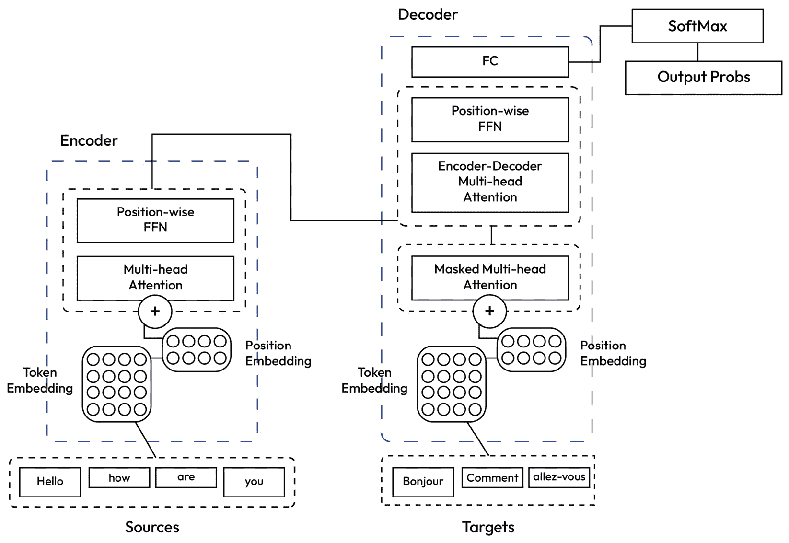
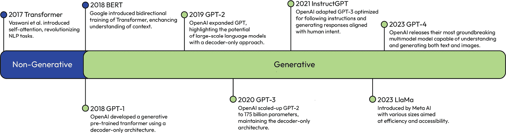

# 第三章：跟踪自然语言处理的基础及其对Transformer的影响

Transformer架构是支撑大多数现代生成语言模型的关键进步。自2017年引入以来，它已成为自然语言处理（NLP）的基础部分，使得如**生成预训练Transformer 4**（GPT-4）和Claude等模型在文本生成能力上取得了显著进步。对Transformer架构的深入理解对于掌握现代**大型语言模型**（LLMs）的机制至关重要。

在上一章中，我们探讨了生成建模技术，包括**生成对抗网络**（GANs）、扩散模型和**自回归**（AR）Transformer。我们讨论了如何利用Transformer从文本生成图像。然而，Transformer不仅仅是在众多生成方法中的一种；它是几乎所有最先进生成语言模型的基础。

在本章中，我们将介绍导致Transformer架构出现的NLP演变。我们无法涵盖所有关键的前进步骤，但我们将尝试涵盖主要里程碑，从早期的语言分析技术和统计语言建模开始，接着是**循环神经网络**（RNNs）和**卷积神经网络**（CNNs）的进步，这些进步突出了深度学习（DL）在NLP中的潜力。我们的主要目标是介绍Transformer——其在深度学习中的基础、其自注意力架构以及其快速演变，这些演变导致了LLMs以及我们称之为**生成****人工智能**（GenAI）的现象。

理解Transformer架构的起源和机制对于认识其开创性影响至关重要。Transformer引入的原则和建模能力被所有基于此框架的现代语言模型所继承。我们将通过历史背景和动手实践来建立对Transformer的直觉，因为这种基础理解对于理解GenAI的未来至关重要。

# NLP的早期方法

在**神经网络**（**NNs**）在语言处理中得到广泛应用之前，自然语言处理（NLP）主要基于计数单词的方法。其中两种特别显著的技术是**计数向量**和**词频-逆文档频率**（**TF-IDF**）。本质上，计数向量统计了每个单词在文档中出现的频率。在此基础上，Dadgar等人于2016年将TF-IDF算法（历史上用于信息检索）应用于文本分类。这种方法根据单词在单个文档中的重要性相对于整个文档集合中出现的频率来分配权重。这些基于计数的方 法在搜索和分类等任务中取得了成功。然而，它们存在一个关键限制，即无法捕捉单词之间的语义关系，这意味着它们无法解释单词在上下文中的细微含义。这一挑战为探索神经网络铺平了道路，提供了一种更深入、更细微的方式来理解和表示文本。

## 神经语言模型的兴起

2003年，蒙特利尔大学的Yoshua Bengio团队引入了**神经网络语言模型**（**NNLM**），这是一种新颖的语言技术方法。NNLM旨在根据先前单词预测序列中的下一个单词，使用特定类型的**神经网络**（**NN**）。其设计突出显示了学习词嵌入的隐藏层，这些嵌入是紧凑的向量表示，能够捕捉单词的核心语义含义。这一点在基于计数的方 法中是缺失的。然而，NNLM在解释较长序列和处理大型词汇方面的能力仍然有限。尽管存在这些限制，NNLM仍然激发了在语言建模中广泛探索神经网络的热情。

神经网络语言模型（NNLM）的引入突显了神经网络在语言处理中的潜力，尤其是在使用词嵌入方面。然而，它在处理长序列和大型词汇方面的局限性表明了进一步研究的必要性。

## 分布式表示

随着神经网络语言模型（NNLM）的诞生，自然语言处理（NLP）研究被推动着向构建高质量的词向量表示方向发展。这些表示最初可以从大量的未标记文本数据中学习，后来可以应用于各种任务的下游模型。这一时期见证了两种突出方法的兴起：**Word2Vec**（由 Mikolov 等人于 2013 年引入）和 **全局向量**（**GloVe**，由 Pennington 等人于 2014 年引入）。这些方法将 **分布式表示** 应用于构建高质量的词向量表示。分布式表示将诸如词语之类的项目不是作为唯一的标识符，而是作为连续值或向量的集合。在这些向量中，每个值对应于项目的一个特定特征或特性。与传统的表示不同，其中每个项目都有一个唯一的符号，分布式表示允许这些项目与其他项目共享特征，从而能够更智能地捕捉数据中的潜在模式。

让我们进一步阐明这个概念。假设我们根据两个特征来表示词语：**Formality** 和 **Positivity**。我们可能会有以下向量：

`Formal: [1, 0]`

`Happy: [0, 1]`

`Cheerful: [0, 1]`

在这个例子中，向量中的每个元素对应于这些特征中的一个。在 `Formal` 的向量中，位于 *Formality* 下的 `1` 元素表明该词是正式的，而位于 *Positivity* 下的 `0` 元素表明在积极方面是中性的。同样，对于 `Happy` 和 `Cheerful`，位于 *Positivity* 下的 `1` 元素表明这些词具有积极的含义。这样，分布式表示通过向量捕捉了词的精髓，允许不同词之间共享特征，从而理解数据中的潜在模式。

Word2Vec 采用了一种相对直接的方法，其中神经网络被用来预测数据集中每个目标词周围的词语。通过这个过程，神经网络为每个目标词确定了值或“权重”。这些权重形成了一个向量，代表每个词在 **连续向量空间** 中的一个向量——这是一个数学空间，其中每个点代表向量可能取的某个可能值。在自然语言处理（NLP）的背景下，这个空间中的每个维度对应一个特征，而一个词在这个空间中的位置捕捉了它与其他词的语义或语言关系。

这些向量形成了一个 **基于特征的表示**——一种表示类型，其中每个维度代表对词的意义有贡献的不同特征。与将每个词表示为唯一符号的符号表示不同，基于特征的表示从共享特征的角度捕捉词的语义本质。

另一方面，GloVe采用了一种不同的方法。它分析**全局共现统计**——一个计数，表示单词在一个大型文本语料库中一起出现的频率。GloVe通过在整个语料库中分析这些计数来学习向量表示，这些表示捕捉了单词之间的关系。这种方法还导致单词在连续向量空间中的分布式表示，捕捉**语义相似性**——衡量两个单词在意义上相似程度的度量。在连续向量空间中，我们可以将语义相似性视为表示单词的向量之间的简单几何邻近性。

为了进一步说明，假设我们有一个包含以下句子的微小文本语料库：

“咖啡很热。”

“冰淇淋很冷。”

从这个语料库中，GloVe会注意到“*咖啡*”与“*热*”共现，“*冰淇淋*”与“*冷*”共现。通过其优化过程，它会试图以反映这些关系的方式为这些词创建向量。在这个过于简化的例子中，GloVe可能会产生如下向量：

`咖啡: [1, 0]`

`热: [0.9, 0]`

`冰淇淋: [0, 1]`

`冷: [0, 0.9]`

在这个空间中，“*咖啡*”和“*热*”的向量之间的接近程度（以及类似地，“*冰淇淋*”和“*冷*”）反映了语料库中观察到的共现关系。在向量空间中，“*咖啡*”和“*热*”之间的向量差异可能与“*冰淇淋*”和“*冷*”之间的向量差异相似，以几何方式捕捉向量空间内对比温度关系。

Word2Vec和GloVe都擅长封装关于单词的相关语义信息，以表示一种有效的**编码**——一种紧凑地表示信息的方式，同时捕捉完成任务所需的基本特征，同时减少数据的维度和复杂性。

这些创建有意义的向量表示的方法为在自然语言处理（NLP）中采用**迁移学习**迈出了第一步。这些向量提供了一个共享的语义基础，促进了在不同任务之间学习关系的迁移。

## 迁移学习

GloVe和其他推导分布式表示的方法为自然语言处理中的迁移学习铺平了道路。通过创建包含语义关系的丰富向量表示，这些方法提供了对文本的基础理解。这些向量作为共享的知识基础，可以应用于不同的任务。当模型最初在一个任务上训练后，用于另一个任务时，预先学习的向量表示有助于保留语义理解，从而减少新任务所需的数据或训练。这种转移已获得的知识的做法已成为高效解决一系列自然语言处理任务的基础。

考虑一个训练用于理解电影评论中情感（正面或负面）的模型。通过训练，这个模型已经学会了词语的分布式表示，捕捉了与情感相关的细微差别。现在，假设有一个新的任务：理解产品评论中的情感。而不是从头开始训练一个新的模型，迁移学习允许我们使用电影评论任务中的分布式表示来启动产品评论任务的训练。这可能导致更快的训练和更好的性能，尤其是在产品评论任务数据有限的情况下。

迁移学习的有效性，得益于GloVe等方法的分布式表示，凸显了利用现有知识进行新任务的潜力。它是神经网络在NLP中集成的先导，突出了在任务间利用学习到的表示的优势。神经网络在NLP中的兴起带来了能够学习更丰富表示的模型，进一步放大了迁移学习的影响和范围。

## NLP 中神经网络（NNs）的兴起

神经网络在NLP中的兴起标志着该领域在理解和处理语言能力方面的重大转变。在Word2Vec、GloVe等方法的基石上，以及迁移学习实践的基础上，神经网络引入了更高层次的抽象和学习能力。与以往依赖手工特征的方法不同，神经网络能够自动从数据中学习复杂的模式和关系。这种从数据中学习的能力推动了NLP进入一个新时代，模型能够在众多与语言相关的任务上实现前所未有的性能水平。卷积神经网络（CNNs）和循环神经网络（RNNs）的兴起，以及革命性的transformer架构的出现，展示了神经网络在解决复杂NLP挑战方面的非凡适应性和有效性。这一转变不仅加速了创新的步伐，也扩展了在计算上理解人类语言所能实现的范围。

### 使用RNN进行语言建模

尽管这些分布式词向量在编码局部语义关系方面表现出色，但建模长距离依赖需要更复杂的网络架构。这导致了RNNs的使用。RNNs（最初由Elman在1990年提出）是一种NN架构，通过迭代序列中的每个元素并保持一个动态内部状态来处理数据序列，该状态捕获了先前元素的信息。与处理每个输入独立的传统**前馈网络**（FNNs）不同，RNNs引入了迭代，允许信息从一个序列步骤传递到下一个步骤，使它们能够捕捉数据中的时间依赖性。NNs中的迭代处理和动态更新使它们能够学习和表示文本中的关系。这些网络可以捕捉句子或甚至整个文档中的上下文联系和相互依赖性。

然而，标准RNNs在处理长序列时存在技术限制。这导致了**长短期记忆**（LSTM）网络的发展。LSTMs最早由Hochreiter和Schmidhuber在1997年提出。它们是一类特殊的RNNs，旨在解决**梯度消失**问题，即随着序列变长，网络无法从序列的早期部分学习。LSTMs应用了一种独特的门控架构来控制网络内部的信息流动，使它们能够在不遭受梯度消失问题的前提下，在长序列中保持和访问信息。

“**长短期记忆**”这个名字指的是网络在处理短序列和长序列数据时跟踪信息的能力：

+   **短期**：LSTMs能够记住最近的信息，这对于理解当前上下文很有用。例如，在语言建模中，知道最后几个单词对于预测下一个单词至关重要。考虑一个短语，例如，“The cat, which already ate a lot, was not hungry.” 当LSTM处理文本时，当它到达单词“not”时，最近的信息即猫“eat a lot”对于准确预测下一个单词“hungry”至关重要。

+   **长期**：与标准RNNs不同，LSTMs还能够保留序列中很多步骤之前的信息，这对于处理长距离依赖特别有用，因为在句子中较早的信息可能对理解序列中较晚的部分的单词很重要。在同一个短语中，关于“The cat”是句子主语的信息是在一开始就引入的。这些信息在稍后理解“was not hungry”时至关重要，因为它处理句子的后半部分。

LSTM中的**M**或**记忆**通过一种独特的架构来维持，该架构采用三个门控机制——输入门、输出门和遗忘门。这些门控机制控制网络中的信息流，决定在每个序列步骤中应该保留、丢弃或使用哪些信息，使LSTMs能够在长序列中维持和访问信息。实际上，这些门控机制和网络状态允许LTSMs在时间步长之间携带“记忆”，确保在整个序列处理过程中保留了有价值的信息。

最终，LSTMs在许多语言建模和文本分类基准测试中获得了最先进的结果。由于它们能够捕捉短距离和长距离的上下文关系，LSTMs成为了NLP任务的占主导地位的NN架构。

LSTM的成功展示了神经网络架构在捕捉语言中固有的复杂关系方面的潜力，极大地推动了NLP领域的发展。然而，对更高效和有效模型的持续追求使社区转向探索其他NN架构。

### CNN的兴起

大约在2014年，NLP领域见证了CNN在处理NLP任务时受欢迎程度的上升，这一显著的转变是由Yoon Kim引领的。CNN（最初由LeCun等人提出用于图像识别）基于卷积层，通过移动过滤器（或核）在输入数据上扫描，在每个位置计算过滤器权重与输入数据的点积。在NLP中，这些层在局部n-gram窗口（连续的*n*个单词序列）上工作，以识别模式或特征，如文本中的特定单词或字符序列。通过在局部n-gram窗口上使用卷积层，CNN扫描和分析数据以检测初始模式或特征。随后，池化层被用来降低数据的维度，这有助于减少计算复杂度并关注卷积层识别的最显著特征。

通过结合卷积和池化层，CNN可以提取层次特征。这些特征通过结合更简单、低级的特征来形成更复杂、高级的特征，从而代表不同抽象层次的信息。在NLP中，这个过程可能从检测初始层中的基本模式开始，例如常见的词对或短语，然后发展到识别更高层次的概念，如语义关系。

为了比较，我们再次考虑一个场景，其中使用CNN来分析和分类客户评论为正面、负面或中性情感：

+   **低级特征（初始层）**：CNN可能在初始层识别基本模式，例如常见的词对或短语。例如，它可能识别到短语如“优质服务”、“糟糕的经历”或“不高兴”。

+   **中间层特征（中间层）**：随着数据在网络中传递，中间层可能会开始识别更复杂的模式，例如否定（“不好”）或对比（“好但贵”）。

+   **高级特征（后续层）**：CNNs（卷积神经网络）可以在后续层识别抽象概念，例如整体情感。例如，它可能从“优秀的服务”或“喜欢氛围”之类的短语中推断出积极情感，而从“最糟糕的经历”或“糟糕的食物”之类的短语中推断出消极情感。

以这种方式，CNNs（卷积神经网络）本质上学习了文本的高级抽象表示。尽管它们缺乏RNNs（循环神经网络）的序列处理特性，但它们由于固有的**并行性**或同时处理数据多个部分的能力，提供了计算上的优势。与RNNs不同，RNNs是迭代处理序列，并且需要在进行下一步之前完成前一步，而CNNs可以并行处理输入数据的各个部分，从而显著加快训练时间。

虽然 CNNs（卷积神经网络）效率高，但它们的卷积操作存在局限性，该操作仅处理来自较小或附近区域的局部数据，从而错过了整个输入数据中更大部分的关系，这被称为全局信息。这导致了结合自注意力与卷积的注意力增强卷积网络的出现，以解决这一局限性。自注意力最初用于序列和生成建模，后来被用于视觉任务，如图像分类，使网络能够处理和捕获整个输入数据中的关系。然而，结合卷积和自注意力的注意力增强产生了最佳结果。这种方法保留了CNNs的计算效率并捕获了全局信息，标志着图像分类和目标检测任务中的进步。我们将在后面详细讨论自注意力，因为它成为了transformer的关键组成部分。

CNNs（卷积神经网络）能够同时处理数据的多个部分，这标志着计算效率的显著提升，为NLP（自然语言处理）中NN（神经网络）架构的进一步创新铺平了道路。随着该领域的发展，随着注意力增强型NNs的出现，发生了一个关键的转变，引入了模型处理序列数据的新范式。

# 高级语言模型中Transformer的出现

2017年，受CNN的能力和注意力机制的创新应用启发，Vaswani等人发表了开创性论文《Attention is All You Need》，在其中引入了变压器架构。原始的变压器应用了多种新颖的方法，特别强调了注意力的重要性。它采用了**自注意力机制**，允许输入序列中的每个元素专注于序列的不同部分，以结构化的方式捕捉依赖关系，无论它们在序列中的位置如何。在“自注意力”中的“自”指的是注意力机制是如何应用于输入序列本身的，意味着序列中的每个元素都会与其他每个元素进行比较，以确定其注意力分数。

要真正理解变压器架构的工作原理，我们可以描述其架构中的组件如何处理特定任务。假设我们需要我们的变压器将英语句子“*Hello, how are you?*”翻译成法语：“*Bonjour, comment ça va?*”。让我们一步一步地走过这个过程，检查和阐明变压器可能如何完成这项任务。目前，我们将详细描述每个步骤，稍后我们将使用Python实现完整的架构。

## 变压器架构的组件

在深入探讨如何使变压器模型完成我们的翻译任务之前，我们需要了解其中涉及的步骤。完整的架构相当密集，因此我们将将其分解为小、逻辑性强且易于消化的组件。

首先，我们讨论变压器模型架构设计的两个核心组件：编码器栈和解码器栈。我们还将解释数据如何在这些层栈中流动，包括标记的概念，以及如何使用诸如自注意力机制和前馈神经网络（FFNs）等关键技术来捕捉和细化标记之间的关系。

然后，我们过渡到变压器模型的训练过程。在这里，我们回顾了批处理、掩码、训练循环、数据准备、优化器选择以及提高性能的策略等基本概念。我们将解释变压器如何使用损失函数来优化性能，这对于塑造模型学习翻译的方式至关重要。

在训练过程之后，我们讨论模型推理，即我们的训练模型如何生成翻译。本节指出在翻译过程中各个模型组件的操作顺序，并强调每个步骤的重要性。

正如所讨论的，变压器核心的两个关键组件通常被称为编码器栈和解码器栈。

### 编码器栈和解码器栈

在Transformer模型的背景下，**堆叠**指的是**层**的层次排列。在这个上下文中，每一层实际上是一个类似于我们在经典深度学习模型中遇到的NN层。虽然层是模型中发生特定计算操作的级别，但堆叠则指的是多个这样的层按顺序排列。

#### 编码器堆叠

考虑我们的示例句子“*Hello, how are you?*”。我们首先将其转换为标记。每个标记通常代表一个单词。在我们的示例句子中，标记化会将它分解成单独的标记，结果如下：

`[“Hello”，“，”，“how”，“are”，“``you”，“？”]`

在这里，每个单词或标点符号代表一个不同的标记。然后，这些标记被转换成数值表示，也称为**嵌入**。这些嵌入向量捕捉了单词的语义意义和上下文，使模型能够有效地理解和处理输入数据。通过这一系列层间的转换，嵌入有助于捕捉原始英语输入句子中的复杂关系和上下文。

这个堆叠由多个层组成，其中每一层对其输入数据（我们将在稍后详细描述）应用自注意力和FFN计算。嵌入通过这一系列层间的转换迭代地捕捉原始英语输入句子中的复杂关系和上下文。

#### 解码器堆叠

一旦编码器完成了其任务，输出向量——即包含输入句子上下信息的输入句子的嵌入——就会被传递到解码器。在解码器堆叠中，多个层按顺序工作，从嵌入中生成法语翻译。

该过程首先将第一个嵌入转换为法语短语“*Bonjour*”。随后的层使用以下嵌入和之前生成的单词的上下文来预测法语句子中的下一个单词。这个过程通过堆叠中的所有层重复进行，每一层都使用输入嵌入和生成的单词来定义和细化翻译。

解码器堆叠通过这种迭代过程逐步构建（或解码）翻译句子，最终到达“*Bonjour, comment* *ça va?*”。

在对编码器-解码器结构有一个整体理解之后，我们的下一步是揭示每个堆叠中复杂的操作。然而，在深入探讨自注意力机制和FFN之前，有一个至关重要的组件我们需要理解——位置编码。位置编码对于Transformer的性能至关重要，因为它为Transformer模型提供了对单词顺序的感觉，这是堆叠中后续操作所缺乏的。

### 位置编码

句子中的每个单词都包含两种类型的信息——其含义和在句子更大上下文中的角色。上下文角色通常源于单词在单词排列中的位置。例如，“*你好，你好吗？*”这样的句子是有意义的，因为单词的顺序是特定的。如果将其改为“*你是，如何你好？*”，则意义变得不清楚。

因此，Vaswani等人引入了**位置编码**以确保transformer能够将每个单词编码为包含其句子中位置额外数据的附加信息。位置编码是通过在不同频率上使用正弦和余弦函数的混合来计算的，这为序列中的每个位置生成一组独特的值。然后，这些值被添加到标记的原始嵌入中，为模型提供了一种捕捉单词顺序的方法。这些增强的嵌入随后准备好在transformer模型的后续层中由自注意力机制进行处理。

### 自注意力机制

当我们的输入句子“*你好，你好吗？*”的每个标记通过编码堆栈的每一层时，它都会通过自注意力机制进行转换。

如其名所示，自注意力机制允许每个标记（单词）关注（或聚焦于）其他重要标记，以理解句子中的完整上下文。在编码特定单词之前，这种注意力机制解释了序列中每个单词与其他单词之间的关系。然后，根据它们与当前正在处理的单词的相关性，为不同的单词分配不同的注意力分数。

再次考虑我们的输入句子“*你好，你好吗？*”。当自注意力机制处理最后一个单词“*你*”时，它不仅仅关注“*你*”。相反，它考虑整个句子：它查看“*你好*”，瞥了一眼“*如何*”，反思了“*是*”，当然，聚焦于“*你*”。

在这样做的时候，它为每个单词分配了不同级别的注意力。你可以将注意力（*图3**.1*）想象为连接“*你*”到每个其他单词的线条。连接到“*你好*”的线条可能很粗，表示很多注意力，代表着“*你好*”对“*你*”编码的影响。连接“*你*”和“*如何*”的线条可能较细，表明对“*如何*”的关注较少。连接到“*是*”和“*你*”的线条会有其他厚度，这取决于它们在为“*你*”提供上下文方面的帮助：


图3.1：自注意力机制

这样，当编码“*你*”时，会考虑整个句子的加权混合，而不仅仅是单个单词。而定义这种混合的权重就是我们所说的注意力分数。

自注意力机制通过以下步骤实现：

1.  初始时，每个输入单词被表示为一个向量，这是我们通过词嵌入获得的。

1.  这些向量随后通过学习变换映射到新的向量，称为查询、键和值向量。

1.  然后通过将单词的查询向量与每个其他单词的键向量进行点积，并随后进行SoftMax操作（我们将在后面描述），来计算每个单词的注意力分数。

1.  这些分数表示在编码每个单词时，对输入句子其他部分的关注程度。

1.  最后，根据这些分数计算值向量的加权总和，以给出我们的最终输出向量，或自注意力输出。

重要的是要注意，这种计算是对句子中的每个单词进行的。这确保了对句子上下文的全面理解，同时考虑句子中的多个部分。这个概念使Transformer与几乎所有之前的模型都区分开来。

与只运行一次自注意力机制（或“单头注意力”）不同，Transformer在并行中多次复制自注意力机制。每个副本或头都操作相同的输入，但有自己的独立学习参数集来计算注意力分数。这使得每个头可以学习单词之间的不同上下文关系。这种并行过程被称为**多头注意力**（**MHA**）。

再次想象我们的句子“*你好，你好吗？*”。一个头可能专注于“*你好*”与“*你*”之间的关系，而另一个头可能更多地关注“*你好吗*”与“*你*”之间的关系。每个头都有自己的查询、键和值权重集，这进一步使它们能够专门化并学习不同的事物。然后，将这些多个头的输出连接起来并转换，以产生传递到堆叠中下一层的最终值。

这种多头方法允许模型从相同的输入单词中捕捉更广泛的信息。这就像对同一个句子有多个视角，每个视角都提供独特的见解。

到目前为止，对于我们的输入句子“*你好，你好吗？*”，我们已经将每个单词转换成标记表示，然后使用MHA机制进行上下文化。通过并行自注意力，我们的Transformer可以考虑到句子中每个单词与句子中其他每个单词之间的全部交互范围。我们现在有一组多样化和上下文丰富的单词表示，每个表示都包含对单词在句子中角色纹理化的理解。然而，这种包含在注意力机制中的上下文理解只是我们Transformer模型中信息处理的一个组成部分。接下来，通过位置感知前馈网络（FFN）的另一个层次进行解释。FFN将为这些表示添加更多的细微差别，使它们对我们的翻译任务更有信息和价值。

在下一节中，我们讨论了变压器训练序列的一个关键方面：掩码。具体来说，变压器在解码器的自我注意力过程中应用因果（或前瞻）掩码，以确保每个输出标记预测只依赖于先前生成的标记，而不是未来的未知标记。

### 掩码

变压器在训练过程中应用两种类型的掩码。第一种是预处理步骤，以确保输入句子长度相同，从而实现高效的批量计算。第二种是前瞻（或因果）掩码，允许模型选择性地忽略序列中的未来标记。这种掩码发生在解码器的自我注意力机制中，防止模型在序列中向前窥视未来的标记。例如，当将单词 “*Hello*” 翻译成法语时，前瞻掩码确保模型无法访问随后的单词 “*how*”、“*are*” 或 “*you*”。这样，模型学会根据当前和前面的单词生成翻译，遵循翻译任务的自然进程，模仿人类的翻译方式。

通过对数据准备和掩码化的更清晰理解，我们现在转向训练过程中的另一个重要方面：超参数。与从数据中学习到的参数不同，超参数是在训练之前设置的配置，用于控制模型优化过程并指导学习过程。下一节将探讨各种超参数及其在训练过程中的作用。

### SoftMax

要理解 FFN 的作用，我们可以描述其两个主要组件——线性变换和激活函数：

+   **线性变换** 实质上是矩阵乘法。可以将它们视为重塑或调整输入数据的工具。在 FFN 中，这些变换发生两次，使用两种不同的权重（或矩阵）。

+   在这两个变换之间应用 **ReLU**（修正线性单元）函数。ReLU 函数的作用是在模型中引入非线性。简单来说，ReLU 函数允许模型捕捉输入数据中的非严格成比例的图案，即非线性，这是 **自然语言**（NL）数据的特点。

FFN 被称为 **位置敏感**，因为它将句子中的每个单词单独处理（逐个位置），而不考虑序列。这与同时考虑整个序列的自我注意力机制形成对比。

因此，让我们尝试可视化这个过程：想象我们的单词 “*Hello*” 在经过自我注意力机制后到达这里。它携带有关其自身身份的信息，以及关于 “*how*”、“*are*” 和 “*you*” 的上下文参考。这种综合信息存在于一个描述 “*Hello*” 的向量中。

当“*Hello*”进入FFN时，可以将其想象为一个有两个门的隧道。在第一个门（或线性层）处，“*Hello*”通过矩阵乘法操作被转换，改变了其表示。之后，它遇到了ReLU函数——这使得表示变得非线性。

之后，“*Hello*”通过第二个门（另一个线性层），在另一侧再次被转换。虽然“*Hello*”的核心身份保持不变，但现在它被赋予了更多的上下文，这是通过FFN精心校准和调整的。

一旦输入通过门，还有一个额外的步骤。转换后的向量仍然必须被转换成可以解释为我们最终翻译任务预测的形式。

这就引出了使用SoftMax函数，这是transformer解码器中的最终转换。在向量通过FFN之后，它们会进一步通过一个最终的线性层进行处理。然后，结果被输入到SoftMax函数中。

SoftMax充当将我们模型输出转换为可解释为概率的机制。本质上，SoftMax函数将来自我们最终线性层的输出（可能是一组实数）转换成一个概率分布，表示每个单词成为我们输出序列中下一个单词的可能性。例如，如果我们的目标词汇包括“*Bonjour*”，“*Hola*”，“*Hello*”和“*Hallo*”，SoftMax函数将为这些单词中的每一个分配一个概率，并且具有最高概率的单词将被选择作为“*Hello*”的输出翻译。我们可以用这个过于简化的输出概率表示来展示：

`[ Bonjour: 0.4, Hola: 0.3, Hello: 0.2, Hallo: 0.1 ]`

*图3**.2* 展示了通过架构的信息流的一个更完整的（尽管过于简化的）视图。



图3.2：transformer的简化示意图

现在我们已经介绍了transformer的架构组件，我们准备了解其组件是如何协同工作的。

## 序列到序列学习

Transformer的组件通过称为**序列到序列**（**Seq2Seq**）学习（**SL**）的机制一起学习数据，这是**监督学习**（**SL**）的一个子集。回想一下，SL是一种使用标记数据来训练模型以准确预测结果的技术。在Seq2Seq学习中，我们向transformer提供包含输入和相应正确输出的训练数据，在这种情况下，是正确的翻译。Seq2Seq学习特别适合像机器翻译这样的任务，其中输入和输出都是单词序列。

学习过程中的第一步是将短语中的每个词转换为标记，然后将其转换为数值嵌入。这些嵌入携带每个词的语义本质。计算位置编码并将其添加到这些嵌入中，以赋予它们位置意识。

当这些丰富的嵌入通过编码器堆栈时，在每个层中，自注意力机制通过聚合整个短语中的上下文信息来细化嵌入。在自注意力之后，每个词的嵌入在位置感知FFNs中进行进一步转换，调整嵌入以捕获更复杂的关系。

当编码器退出时，嵌入现在包含丰富的语义和上下文信息混合。它们被传递到解码器堆栈，其目的是将短语翻译成另一种语言（即目标序列）。与编码器一样，解码器中的每一层也使用自注意力和位置感知前馈网络（FFNs），但增加了一个与编码器输出交互的交叉注意力层。这种交互有助于对齐输入和输出短语，这是翻译的一个关键方面。

随着嵌入通过解码器层移动，它们逐渐被细化以表示模型将预测的翻译短语。解码器的最后一层通过线性变换和SoftMax函数处理嵌入，以在目标词汇上产生一个概率分布。这个分布定义了模型在每个步骤上对每个潜在下一个标记的预测可能性。然后，解码器从这个分布中采样，选择具有最高预测概率的标记作为其下一个输出。通过根据预测分布迭代采样最可能的下一个标记，解码器可以自回归地逐个生成完整的翻译输出序列标记。

然而，为了使transformer能够从预测的下一个标记分布中可靠地采样以生成高质量的翻译，它必须通过迭代成千上万的输入-输出对来逐步学习。在下一节中，我们将更详细地探讨模型训练。

### 模型训练

正如所讨论的，训练阶段的主要目标是细化模型的参数，以促进从一种语言到另一种语言的准确翻译。但是，参数的细化意味着什么，为什么它是关键的？

参数是模型用于生成翻译的内部变量。最初，这些参数被赋予随机值，并在每次训练迭代中进行调整。再次，模型被提供包含成千上万输入数据示例及其对应正确输出的训练数据，在这种情况下，是正确的翻译。然后，它使用一个错误（或损失）函数将其预测的输出标记与正确的（或实际）目标序列进行比较。

根据损失，模型更新其参数，逐渐提高其在解码的每一步中选择正确项目的能力。这逐渐细化了概率分布。

在数千次训练迭代中，模型学习源语言和目标语言之间的关联。最终，它获得了足够的知识，可以通过在训练期间发现的模式来解码从未见过的输入中的一致、类似人类的翻译。因此，训练推动了模型从预测词汇分布中产生准确目标序列的能力。

在训练了足够的翻译对之后，transformer达到了可靠的翻译性能。训练好的模型可以接受新的输入序列，并通过对新数据的泛化来输出翻译序列。

例如，以我们的示例句子“*Hello, how are you?*”及其法语翻译“*Bonjour, comment ça va?*”为例，英语句子作为输入，法语句子作为目标输出。训练数据由许多翻译对组成。每次模型处理一批数据时，它都会为翻译生成预测，将它们与实际的目标翻译进行比较，然后调整其参数以减少预测翻译和实际翻译之间的差异（或最小化损失）。这个过程会重复使用大量的数据批次，直到模型的翻译足够准确。

### 超参数

再次强调，与模型从训练数据中学习的参数不同，超参数是预先设置的配置，它控制着训练过程和模型的架构。它们是设置成功训练运行的关键部分。

在transformer模型背景下，一些关键的超参数包括以下内容：

+   **学习率**：这个值决定了优化器更新模型参数的步长。较高的学习率可能会加快训练速度，但可能导致超过最佳解。较低的学习率可能会导致更精确地收敛到最佳解，尽管代价是更长的训练时间。我们将在下一节中详细讨论优化器。

+   **批大小**：单个批次中处理的数据示例数量会影响训练期间的计算精度和内存需求。

+   **模型维度**：模型的大小（例如，编码器和解码器的层数、嵌入的维度等）是一个关键的超参数，它影响着模型的学习能力和泛化能力。

+   **优化器设置**：选择优化器及其设置，例如Adam优化器的初始学习率、beta值等，也被认为是超参数。我们将在下一节中进一步探讨优化器。

+   **正则化项**：如dropout率这样的正则化项是超参数，通过在训练过程中添加某种形式的随机性或约束来帮助防止过拟合。

选择合适的超参数值对于训练过程至关重要，因为它会显著影响模型的表现和效率。这通常涉及到超参数调整，它包括实验和细化，以找到给定任务中产生可靠性能的超参数值。超参数调整可以说是一种艺术和科学。我们将在后面的章节中进一步探讨这一点。

在对超参数有了一定的了解之后，我们将继续探讨优化器的选择，这对于控制模型如何有效地从训练数据中学习至关重要。

### 优化器的选择

优化器是训练过程中的一个基本组成部分，负责更新模型的参数以最小化错误。不同的优化器有不同的策略来导航参数空间，找到一组参数值，以产生低损失（或更少的错误）。优化器的选择可以显著影响训练过程的速度和质量。

在变压器模型的背景下，Adam优化器由于其效率和在训练深度网络中的经验成功，通常是被选用的优化器。Adam在训练过程中会调整学习率。为了简化，我们不会探索所有可能的优化器，而是描述它们的目的。

优化器的主要任务是微调模型的参数，以减少翻译错误，逐步引导模型达到期望的性能水平。然而，过于激进的优化可能会导致模型记住训练数据，无法很好地泛化到未见过的数据。为了减轻这一点，我们采用正则化技术。

在下一节中，我们将探讨正则化——这是一种与优化相结合的技术，确保模型在学会最小化翻译错误的同时，也能适应新的、未见过的数据。

### 正则化

正则化技术被用来防止模型记住训练数据（这种现象称为过拟合），并促进在新的、未见过的数据上的更好表现。过拟合发生在模型为了最小化错误，学习到训练数据到这种程度，以至于它捕获了无用的模式（或噪声）以及实际的模式。这种在学习训练数据上的过度精确导致模型在接触到新数据时性能下降。

让我们回顾一下我们的简单场景，其中我们训练一个模型将英语问候语翻译成法语问候语，使用的数据集包括单词“*Hello*”及其翻译“*Bonjour*”。如果模型过拟合，它可能会记住训练数据中的确切短语，而没有理解更广泛的翻译模式。

在过拟合的情况下，假设模型以1.0的概率学习将“*Hello*”翻译为“*Bonjour*”，因为在训练数据中它遇到的最频繁。当遇到新的、未见过的数据时，它可能会遇到之前未见过的变化，例如“*Hi*”，这也应该翻译为“*Bonjour*”。然而，由于过拟合，模型可能无法从“*Hello*”泛化到“*Hi*”，因为它过于关注训练期间看到的精确映射。

几种正则化技术可以减轻过拟合问题。这些技术在对模型参数进行训练时施加某些约束，鼓励模型学习数据的更一般化表示，而不是记住训练数据集。

这里有一些在transformer模型背景下使用的标准正则化技术：

+   **Dropout**：在基于NN的模型（如transformer）的背景下，术语“神经元”指的是模型内部协同工作以从数据中学习和进行预测的各个独立元素。每个神经元从数据中学习特定的方面或特征，使模型能够理解和翻译文本。在训练过程中，dropout随机地使一部分这些神经元失活或“丢弃”，暂时从网络中移除。这种随机失活鼓励模型将学习分散到许多神经元上，而不是过度依赖少数几个神经元。通过这样做，dropout有助于模型更好地将学习泛化到未见过的数据上，而不是仅仅记住训练数据（即过拟合）。

+   **层归一化**：层归一化是一种技术，它对每个训练示例中的层的神经元激活进行归一化，而不是对示例批次进行归一化。这种归一化有助于稳定训练过程，并作为一种正则化形式，防止过拟合。

+   **L1或L2正则化**：L1正则化，也称为Lasso，添加一个等于系数绝对值的惩罚，促进参数稀疏性。L2正则化，或称为Ridge，添加一个基于系数平方的惩罚，以防止过拟合而避免大值。尽管这些技术有助于控制模型复杂性和增强泛化，但它们并非transformer初始设计的一部分。

通过采用这些正则化技术，模型被引导学习数据中的更一般化模式，这提高了它在未见过的数据上表现良好的能力，从而使模型在翻译新的文本输入时更加可靠和稳健。

在整个训练过程中，我们提到了损失函数，并讨论了优化器如何利用它来调整模型的参数，目的是最小化预测误差。损失函数量化了模型的表现。我们讨论了正则化如何惩罚损失函数以防止过拟合，鼓励模型学习更简单、更可泛化的模式。在下一节中，我们将更深入地探讨损失函数本身的微妙作用。

### 损失函数

损失函数在训练转换器模型中至关重要，它量化了模型预测与实际数据之间的差异。在语言翻译中，这种错误是在训练数据集中生成的翻译与实际翻译之间的误差。这个任务的一个常见选择是交叉熵损失，它衡量了模型在目标词汇表上的预测概率分布与实际分布之间的差异，其中正确单词的概率为1，其余单词的概率为0。

转换器通常采用一种称为标签平滑交叉熵损失的变体。标签平滑在训练过程中调整目标概率分布，略微降低正确类的概率，并增加其他所有类的概率，这有助于防止模型对其预测过于自信。例如，假设目标词汇包括“*Bonjour*”、“*Hola*”、“*Hello*”和“*Hallo*”，并且“*Bonjour*”是正确的翻译，标准交叉熵损失的目标是概率分布为`Bonjour: 1.0`，`Hola: 0.0`，`Hello: 0.0`，`Hallo: 0.0`。然而，标签平滑交叉熵损失会略微调整这些概率，如下所示：

`[ “Bonjour”: 0.925, “Hola”: 0.025, “Hello”: 0.025, “Hallo”:` `0.025 ]`

平滑降低了模型的信心，并促进了更好的泛化到未见过的数据。在更清楚地理解损失函数的作用后，我们可以继续到推理阶段，在那里训练好的模型为新的、未见过的数据生成翻译。

### 推理

经过遍历训练景观，我们的训练模型现在已经熟练掌握优化参数，可以应对翻译任务。在推理阶段，这些学习到的参数被用来翻译新的、未见过的文本。我们将继续使用示例短语“*Hello, how are you?*”来阐明这一过程。

推理阶段是训练模型在新的数据上的实际应用。经过训练过程中的多次迭代后，训练好的参数现在被用来将一种语言的文本翻译成另一种语言。推理步骤可以描述如下：

1.  **输入准备**：最初，我们的短语“Hello, how are you?”被标记化并编码成模型可以处理的形式，类似于训练阶段中的准备步骤。

1.  **通过模型传递**：编码后的输入随后通过模型传递。在导航通过编码器和解码器堆栈时，训练好的参数指导输入数据的转换，每一步都使翻译更准确。

1.  **输出生成**：在解码器堆栈的最终阶段，模型为输入文本中的每个单词在目标词汇表上生成一个概率分布。对于单词“*Hello*”，在目标词汇表（在我们的例子中是法语单词）上形成一个概率分布，选择概率最高的单词作为翻译。这个过程为短语中的每个单词重复进行，生成翻译输出“*Bonjour, comment* *ça va?*”。

现在我们已经了解了模型如何产生最终输出，我们可以逐步实现一个transformer模型，以巩固我们讨论的概念。然而，在我们深入代码之前，我们可以简要概述端到端架构流程：

1.  **输入分词**：初始英语短语“*Hello, how are you?*”被分词成更小的单元，如“*Hello*”，“*,*”，“*how*”等。

1.  **嵌入**：这些标记随后通过嵌入层映射到连续的向量表示。

1.  **位置编码**：为了保持序列的顺序，将位置编码添加到嵌入中。

1.  **编码器自注意力机制**：嵌入的输入序列在编码器的自注意力层序列中导航。在这里，每个单词评估每个其他单词的相关性，以理解完整的上下文。

1.  **FFN**：随后，每个编码器层内的位置wise FFN对表示进行细化。

1.  **编码器输出**：编码器生成捕捉输入序列本质的上下文表示。

1.  **解码器注意力机制**：逐步地，解码器构建输出序列，仅对前面的单词使用自注意力以保持序列顺序。

1.  **编码器-解码器注意力机制**：解码器评估编码器的输出，在生成输出序列中的每个单词时，集中于相关的输入上下文。

1.  **输出层**：解码器将其输出馈送到线性层和SoftMax层，以产生“*Bonjour, comment* *ça va?*”。

在本章结束时，我们将将原始transformer（黄等人，2022）的最佳实现改编成一个最小示例，该示例可以后来在各种下游任务上进行训练。这将作为一个理论练习，以进一步巩固我们的理解。在实践中，我们将依赖预训练或基础模型，我们将在后面的章节中学习如何实现。

然而，在我们开始我们的实践项目之前，我们可以追溯其对当前GenAI领域的影响。我们跟随架构早期应用的轨迹（例如，**来自Transformers的双向编码表示**（**BERT**））到第一个GPT。

# 语言模型的发展——AR Transformer 及其在生成人工智能中的作用

在[*第 2 章*](B21773_02.xhtml#_idTextAnchor045)中，我们回顾了一些应用基于 Transformer 方法的生成范式。在此，我们更详细地追踪了 Transformer 的发展，概述了一些从 2017 年的初始 Transformer 到更近期的最先进模型的最具影响力的基于 Transformer 的语言模型，这些模型展示了在人工智能快速发展的领域中涉及的扩展性、多功能性和社会考虑（如图 *3.3* 所示）：



图 3.3：从原始 Transformer 到 GPT-4

+   **2017 – Transformer**：Vaswani 等人提出的 Transformer 模型在 NLP 中实现了范式转变，其特征是能够并行处理整个数据序列的自注意力层。这种架构使得模型能够评估句子中每个词相对于所有其他词的重要性，从而增强了模型捕捉上下文的能力。

+   **2018 – BERT**：Google 的 BERT 模型通过在其编码器层中使用双向上下文在预训练期间进行了创新。它是第一个基于整个句子（包括左右两侧）理解词的上下文的模型之一，显著提高了在广泛 NLP 任务上的性能，特别是那些需要深入理解上下文的任务。

+   **2018 – GPT-1**：OpenAI 的 GPT-1 模型是自然语言处理（NLP）的一个里程碑，采用了仅使用 Transformer 解码器模型的生成预训练方法。它在多样化的文本数据语料库上进行了预训练，并针对各种任务进行了微调，使用了一种从左到右顺序生成文本的单向方法，这对于生成文本应用特别适合。

+   **2019 – GPT-2**：GPT-2 在 GPT-1 奠定的基础上进行了扩展，保持了其仅使用解码器架构，但在数据集和模型规模上显著扩大。这使得 GPT-2 能够在更广泛的主题上生成更连贯和上下文相关的文本，展示了扩大 Transformer 模型的力量。

+   **2020 – GPT-3**：OpenAI 的 GPT-3 将 Transformer 模型的规模边界推进到 1750 亿个参数，使得在最小输入的情况下执行各种任务成为可能，通常使用**零样本学习**（**ZSL**）或**少样本学习**（**FSL**）。这表明 Transformer 可以跨任务和数据类型进行泛化，通常无需大量特定任务数据或微调。

+   **2021 – InstructGPT**：InstructGPT 是 GPT-3 的优化变体，专门针对遵循用户指令和生成一致响应进行微调，其输出中包含强调安全性和相关性的反馈循环。这代表了创建能够更准确地解释和响应人类提示的 AI 模型的关注点。

+   **2023 – GPT-4**: GPT-4是OpenAI的transformer模型在多模态空间中的进化，能够理解和生成基于文本和图像的内容。此模型旨在产生更安全、更具有情境细微差别的响应，展示了模型在处理复杂任务和生成创意内容能力上的显著进步。

+   **2023 – LLaMA 2**: Meta AI的LLaMA 2是一系列关注效率和可访问性的模型的组成部分，允许在更高效资源使用的同时实现高性能的语言建模。此模型旨在促进AI社区更广泛的研究和应用开发。

+   **2023 – Claude 2**: Anthropic的Claude 2在Claude 1的基础上取得了进步，增加了其标记上下文窗口，并提高了其推理和记忆能力。它旨在更接近人类价值观，为开放域问答和其他对话式AI应用提供负责任和细微的生成能力，标志着在道德AI开发方面的进步。

展示的时间线突出了过去几年基于transformer的语言模型的显著进步。最初作为一种引入自注意力概念的架构，它迅速演变成具有数十亿参数的模型，能够生成连贯的文本、回答问题，并在高性能水平上执行各种智力任务。GPT-4等模型规模和可访问性的增加为AI应用开辟了新的可能性。同时，最近的研究表明，模型更加关注安全和伦理，并为用户提供更细微、更有帮助的响应。

在下一节中，我们通过使用Python实现原始transformer架构的关键组件，为对自然语言处理领域感兴趣的从业者完成了一个仪式。这有助于更全面地理解启动这一切的机制。

# 实现原始Transformer

下面的代码演示了如何实现一个用于Seq2Seq翻译任务的简化transformer模型，主要翻译英语文本到法语。代码结构分为多个部分，从数据加载到模型训练和翻译，处理了各种方面。

## 数据加载和准备

最初，代码加载了一个数据集并为其训练做准备。数据从CSV文件中加载，然后分为英语和法语文本。为了演示目的，文本限制为100个字符以减少训练时间。CSV文件包含几千个示例数据点，可以在本书的GitHub仓库（[https://github.com/PacktPublishing/Python-Generative-AI](https://github.com/PacktPublishing/Python-Generative-AI)）中找到，包括完整的代码：

```py
import pandas as pd
import numpy as np
# Load demo data
data = pd.read_csv("./Chapter_3/data/en-fr_mini.csv")
# Separate English and French lexicons
EN_TEXT = data.en.to_numpy().tolist()
FR_TEXT = data.fr.to_numpy().tolist()
# Arbitrarily cap at 100 characters for demonstration to avoid long training times
def demo_limit(vocab, limit=100):
    return [i[:limit] for i in vocab]
EN_TEXT = demo_limit(EN_TEXT)
FR_TEXT = demo_limit(FR_TEXT)
# Establish the maximum length of a given sequence
MAX_LEN = 100
```

## 分词

接下来，在文本数据上训练了一个分词器。分词器对于将文本数据转换为模型可以输入的数值数据至关重要：

```py
from tokenizers import Tokenizer
from tokenizers.models import WordPiece
from tokenizers.trainers import WordPieceTrainer
from tokenizers.pre_tokenizers import Whitespace
def train_tokenizer(texts):
    tokenizer = Tokenizer(WordPiece(unk_token="[UNK]"))
    tokenizer.pre_tokenizer = Whitespace()
    trainer = WordPieceTrainer(
        vocab_size=5000,
        special_tokens=["[PAD]", "[UNK]", "[CLS]", "[SEP]", "[MASK]", 
            "<sos>", "<eos>"],
    )
    tokenizer.train_from_iterator(texts, trainer)
    return tokenizer
en_tokenizer = train_tokenizer(EN_TEXT)
fr_tokenizer = train_tokenizer(FR_TEXT)
```

## 数据张量化

文本数据随后被张量化，这涉及到将文本数据转换为张量格式。这一步对于使用`PyTorch`进行训练数据准备至关重要：

```py
import torch
from torch.nn.utils.rnn import pad_sequence
def tensorize_data(text_data, tokenizer):
    numericalized_data = [
        torch.tensor(tokenizer.encode(text).ids) for text in text_data
    ]
    padded_data = pad_sequence(numericalized_data,
        batch_first=True)
    return padded_data
src_tensor = tensorize_data(EN_TEXT, en_tokenizer)
tgt_tensor = tensorize_data(FR_TEXT, fr_tokenizer)
```

## 数据集创建

创建了一个自定义数据集类来处理数据。这个类对于在训练期间分批加载数据至关重要：

```py
from torch.utils.data import Dataset, DataLoader
class TextDataset(Dataset):
    def __init__(self, src_data, tgt_data):
        self.src_data = src_data
        self.tgt_data = tgt_data
    def __len__(self):
        return len(self.src_data)
    def __getitem__(self, idx):
        return self.src_data[idx], self.tgt_data[idx]
dataset = TextDataset(src_tensor, tgt_tensor)
```

## 嵌入层

嵌入层将每个标记映射到连续的向量空间。这一层对于模型理解和处理文本数据至关重要：

```py
import torch.nn as nn
class Embeddings(nn.Module):
    def __init__(self, d_model, vocab_size):
        super(Embeddings, self).__init__()
        self.embed = nn.Embedding(vocab_size, d_model)
    def forward(self, x):
        return self.embed(x)
```

## 位置编码

位置编码层将位置信息添加到嵌入中，这有助于模型理解序列中标记的顺序：

```py
import math
class PositionalEncoding(nn.Module):
    def __init__(self, d_model, dropout=0.1,
                 max_len=MAX_LEN
    ):
        super(PositionalEncoding, self).__init__()
        self.dropout = nn.Dropout(p=dropout)
        pe = torch.zeros(max_len, d_model)
        position = torch.arange(0.0, max_len).unsqueeze(1)
        div_term = torch.exp(
            torch.arange(0.0, d_model, 2) * - \
                (math.log(10000.0) / d_model)
        )
        pe[:, 0::2] = torch.sin(position * div_term)
        pe[:, 1::2] = torch.cos(position * div_term)
        pe = pe.unsqueeze(0)
        self.register_buffer("pe", pe)
    def forward(self, x):
        x = x + self.pe[:, : x.size(1)]
        return self.dropout(x)
```

## 多头自注意力

**多头自注意力**（**MHSA**）层是Transformer架构的关键部分，它允许模型在生成输出序列时关注输入序列的不同部分：

```py
class MultiHeadSelfAttention(nn.Module):
    def __init__(self, d_model, nhead):
        super(MultiHeadSelfAttention, self).__init__()
        self.attention = nn.MultiheadAttention(d_model, nhead)
    def forward(self, x):
        return self.attention(x, x, x)
```

## FFN

FFN是一个简单的**全连接神经网络**（**FCNN**），它独立地对每个位置进行操作：

```py
class FeedForward(nn.Module):
    def __init__(self, d_model, d_ff):
        super(FeedForward, self).__init__()
        self.linear1 = nn.Linear(d_model, d_ff)
        self.dropout = nn.Dropout(0.1)
        self.linear2 = nn.Linear(d_ff, d_model)
    def forward(self, x):
        return self.linear2(self.dropout(torch.relu(self.linear1(x))))
```

## 编码器层

编码器层由一个MHSA机制和一个简单的FFNN组成。这种结构通过堆叠重复，形成完整的编码器：

```py
class EncoderLayer(nn.Module):
    def __init__(self, d_model, nhead, d_ff):
        super(EncoderLayer, self).__init__()
        self.self_attn = MultiHeadSelfAttention(d_model, nhead)
        self.feed_forward = FeedForward(d_model, d_ff)
        self.norm1 = nn.LayerNorm(d_model)
        self.norm2 = nn.LayerNorm(d_model)
        self.dropout = nn.Dropout(0.1)
    def forward(self, x):
        x = x.transpose(0, 1)
        attn_output, _ = self.self_attn(x)
        x = x + self.dropout(attn_output)
        x = self.norm1(x)
        ff_output = self.feed_forward(x)
        x = x + self.dropout(ff_output)
        return self.norm2(x).transpose(0, 1)
```

## 编码器

编码器是一个具有MHSA机制和FFN的相同层的堆栈：

```py
class Encoder(nn.Module):
    def __init__(self, d_model, nhead, d_ff, num_layers, vocab_size):
        super(Encoder, self).__init__()
        self.embedding = Embeddings(d_model, vocab_size)
        self.pos_encoding = PositionalEncoding(d_model)
        self.encoder_layers = nn.ModuleList(
            [EncoderLayer(d_model, nhead, d_ff) for _ in range(
                num_layers)]
        )
        self.feed_forward = FeedForward(d_model, d_ff)
    def forward(self, x):
        x = self.embedding(x)
        x = self.pos_encoding(x)
        for layer in self.encoder_layers:
            x = layer(x)
        return x
```

## 解码器层

类似地，解码器层由两个MHA机制组成——一个自注意力和一个交叉注意力——随后是一个FFN：

```py
class DecoderLayer(nn.Module):
    def __init__(self, d_model, nhead, d_ff):
        super(DecoderLayer, self).__init__()
        self.self_attn = MultiHeadSelfAttention(d_model, nhead)
        self.cross_attn = nn.MultiheadAttention(d_model, nhead)
        self.feed_forward = FeedForward(d_model, d_ff)
        self.norm1 = nn.LayerNorm(d_model)
        self.norm2 = nn.LayerNorm(d_model)
        self.norm3 = nn.LayerNorm(d_model)
        self.dropout = nn.Dropout(0.1)
    def forward(self, x, memory):
        x = x.transpose(0, 1)
        memory = memory.transpose(0, 1)
        attn_output, _ = self.self_attn(x)
        x = x + self.dropout(attn_output)
        x = self.norm1(x)
        attn_output, _ = self.cross_attn(x, memory, memory)
        x = x + self.dropout(attn_output)
        x = self.norm2(x)
        ff_output = self.feed_forward(x)
        x = x + self.dropout(ff_output)
        return self.norm3(x).transpose(0, 1)
```

## 解码器

解码器也是一个相同层的堆栈。每个层包含两个MHA机制和一个FFN：

```py
class Decoder(nn.Module):
    def __init__(self, d_model, nhead, d_ff, num_layers, vocab_size):
        super(Decoder, self).__init__()
        self.embedding = Embeddings(d_model, vocab_size)
        self.pos_encoding = PositionalEncoding(d_model)
        self.decoder_layers = nn.ModuleList(
            [DecoderLayer(d_model, nhead, d_ff) for _ in range(
                num_layers)]
        )
        self.linear = nn.Linear(d_model, vocab_size)
        self.softmax = nn.Softmax(dim=2)
    def forward(self, x, memory):
        x = self.embedding(x)
        x = self.pos_encoding(x)
        for layer in self.decoder_layers:
            x = layer(x, memory)
        x = self.linear(x)
        return self.softmax(x)
```

这种堆叠层模式继续构建Transformer架构。每个块在处理输入数据和生成输出翻译方面都有特定的作用。

## 完整的Transformer

Transformer模型封装了之前定义的编码器和解码器结构。这是用于训练和翻译任务的主要类：

```py
class Transformer(nn.Module):
    def __init__(
        self,
        d_model,
        nhead,
        d_ff,
        num_encoder_layers,
        num_decoder_layers,
        src_vocab_size,
        tgt_vocab_size,
    ):
        super(Transformer, self).__init__()
        self.encoder = Encoder(d_model, nhead, d_ff, \
            num_encoder_layers, src_vocab_size)
        self.decoder = Decoder(d_model, nhead, d_ff, \
            num_decoder_layers, tgt_vocab_size)
    def forward(self, src, tgt):
        memory = self.encoder(src)
        output = self.decoder(tgt, memory)
        return output
```

## 训练函数

`train`函数遍历epoch和批次，计算损失，并更新模型参数：

```py
def train(model, loss_fn, optimizer, NUM_EPOCHS=10):
    for epoch in range(NUM_EPOCHS):
        model.train()
        total_loss = 0
        for batch in batch_iterator:
            src, tgt = batch
            optimizer.zero_grad()
            output = model(src, tgt)
            loss = loss_fn(output.view(-1, TGT_VOCAB_SIZE),
                tgt.view(-1))
            loss.backward()
            optimizer.step()
            total_loss += loss.item()
        print(f"Epoch {epoch}, 
            Loss {total_loss / len(batch_iterator)}")
```

## 翻译函数

`translate`函数使用训练好的模型将源文本翻译成目标语言。它逐个生成翻译标记，并在生成**序列结束**（**EOS**）标记或达到最大目标长度时停止：

```py
def translate(model, src_text, src_tokenizer,
              tgt_tokenizer, max_target_length=50
):
    model.eval()
    src_tokens = src_tokenizer.encode(src_text).ids
    src_tensor = torch.LongTensor(src_tokens).unsqueeze(0)
    tgt_sos_idx = tgt_tokenizer.token_to_id("<sos>")
    tgt_eos_idx = tgt_tokenizer.token_to_id("<eos>")
    tgt_tensor = torch.LongTensor([tgt_sos_idx]).unsqueeze(0)
    for i in range(max_target_length):
        with torch.no_grad():
            output = model(src_tensor, tgt_tensor)
        predicted_token_idx = output.argmax(dim=2)[0, -1].item()
        if predicted_token_idx == tgt_eos_idx:
            break
        tgt_tensor = torch.cat((tgt_tensor,
            torch.LongTensor([[predicted_token_idx]])),
            dim=1)
    translated_token_ids = tgt_tensor[0, 1:].tolist()
    translated_text = tgt_tokenizer.decode(translated_token_ids)
    return translated_text
```

## 主执行

在脚本的主体块中，定义了超参数，实例化了标记化器和模型，并启动了训练和翻译过程：

```py
if __name__ == "__main__":
    NUM_ENCODER_LAYERS = 2
    NUM_DECODER_LAYERS = 2
    DROPOUT_RATE = 0.1
    EMBEDDING_DIM = 512
    NHEAD = 8
    FFN_HID_DIM = 2048
    BATCH_SIZE = 31
    LEARNING_RATE = 0.001
    en_tokenizer = train_tokenizer(EN_TEXT)
    fr_tokenizer = train_tokenizer(FR_TEXT)
    SRC_VOCAB_SIZE = len(en_tokenizer.get_vocab())
    TGT_VOCAB_SIZE = len(fr_tokenizer.get_vocab())
    src_tensor = tensorize_data(EN_TEXT, en_tokenizer)
    tgt_tensor = tensorize_data(FR_TEXT, fr_tokenizer)
    dataset = TextDataset(src_tensor, tgt_tensor)
    model = Transformer(
        EMBEDDING_DIM,
        NHEAD,
        FFN_HID_DIM,
        NUM_ENCODER_LAYERS,
        NUM_DECODER_LAYERS,
        SRC_VOCAB_SIZE,
        TGT_VOCAB_SIZE,
    )
    loss_fn = nn.CrossEntropyLoss()
    optimizer = optim.Adam(model.parameters(), lr=LEARNING_RATE)
    batch_iterator = DataLoader(
        dataset, batch_size=BATCH_SIZE,
        shuffle=True, drop_last=True
    )
    train(model, loss_fn, optimizer, NUM_EPOCHS=10)
    src_text = "hello, how are you?"
    translated_text = translate(
        model, src_text, en_tokenizer, fr_tokenizer)
    print(translated_text)
```

此脚本从加载数据到训练Transformer模型，最终从英语翻译到法语进行机器翻译任务。最初，它加载一个数据集，处理文本，并建立标记化器以将文本转换为数值数据。随后，它定义了`PyTorch`中Transformer模型的架构，详细说明了从嵌入的自注意力机制到编码器和解码器堆栈的每个组件。

脚本进一步将数据组织成批次，设置训练循环，并定义翻译函数。在提供的英语和法语句子上训练模型，教会它将一个语言的序列映射到另一个语言。最后，它将一个示例句子从英语翻译成法语，以展示模型的能力。

# 摘要

Transformer的出现极大地推动了NLP领域的发展，成为今天尖端生成语言模型的基础。本章概述了NLP的发展历程，为这一关键创新铺平了道路。最初的统计技术，如计数向量和TF-IDF，擅长提取基本的词模式，但它们在把握语义细微差别方面有所不足。

将神经语言模型纳入其中，标志着通过词嵌入向更深层次表示迈进的一大步。然而，循环网络在处理较长的序列时遇到了障碍。这激发了CNN的出现，它通过并行性引入了计算效率，尽管是以牺牲全局上下文意识为代价。

注意力机制的引入成为了一个基石。2017年，Vaswani等人进一步扩展了这些进展，揭幕了Transformer架构。Transformer的标志性自注意力机制以并行化的方式促进了跨广泛序列的上下文建模。层叠的编码器-解码器结构精心细化表示，以辨别翻译等努力不可或缺的关系。

Transformer凭借其可并行化和可扩展的自注意力设计，在性能上设定了新的基准。其核心原则是当代高性能生成语言模型（如GPT）的建筑基石。

在下一章中，我们将讨论如何将预训练的生成模型从原型应用到生产中。

# 参考文献

本参考部分作为本书中引用的资源的存储库；您可以探索这些资源，以进一步加深对主题的理解和知识：

+   Bahdanau, D., Cho, K., and Bengio, Y. (2014). *Neural machine translation by jointly learning to align and translate*. arXiv preprint arXiv:1409.0473.

+   Bengio, Y., Ducharme, R., and Vincent, P. (2003). *A neural probabilistic language model. The Journal of Machine Learning Research*, 3, 1137-1155.

+   Dadgar, S. M. H., Araghi, M. S., and Farahani, M. M. (2016). *Improving text classification performance based on TFIDF and LSI index*. 2016 IEEE International Conference on Engineering & Technology (ICETECH).

+   Elman, J. L. (1990). *Finding structure in time. Cognitive science*, 14(2), 179-211.

+   Hochreiter, S., and Schmidhuber, J. (1997). *Long short-term memory. Neural computation*, 9(8), 1735-1780.

+   Kim, Y. (2014). *Convolutional neural networks for sentence classification*. arXiv preprint arXiv:1408.5882.

+   Mikolov, T., Sutskever, I., Chen, K., Corrado, G. S., and Dean, J. (2013). *词和短语的分布式表示及其组合性。神经信息处理系统进展*，26.

+   Pennington, J., Socher, R., and Manning, C. (2014). *GloVe：全局词表示。2014年自然语言处理实证方法会议（**EMNLP**）论文集，1532-1543。

+   Vaswani, A., Shazeer, N., Parmar, N., Uszkoreit, J., Jones, L., Gomez, A. N., ... and Polosukhin, I. (2017). *注意即一切。神经信息处理系统进展*，30.
