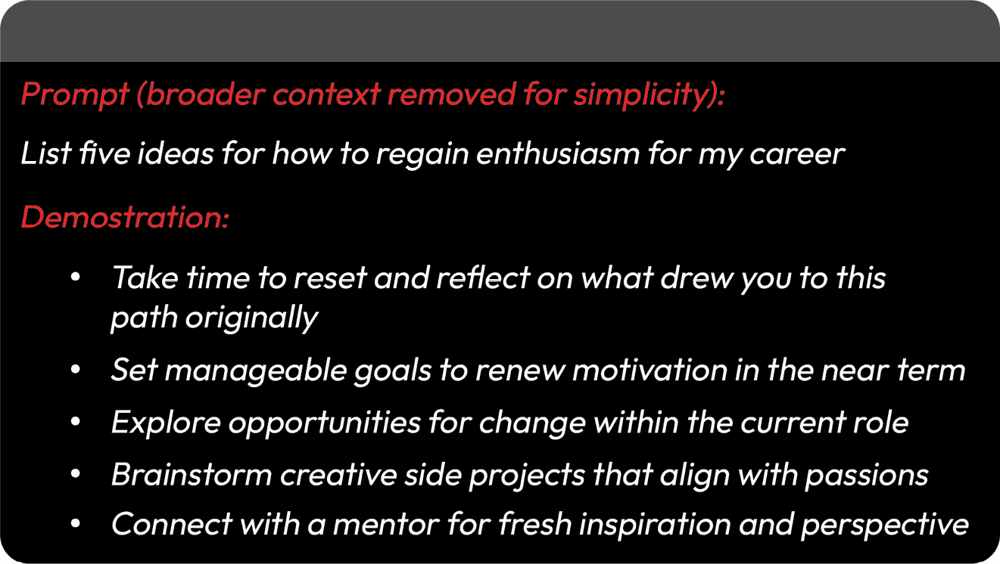
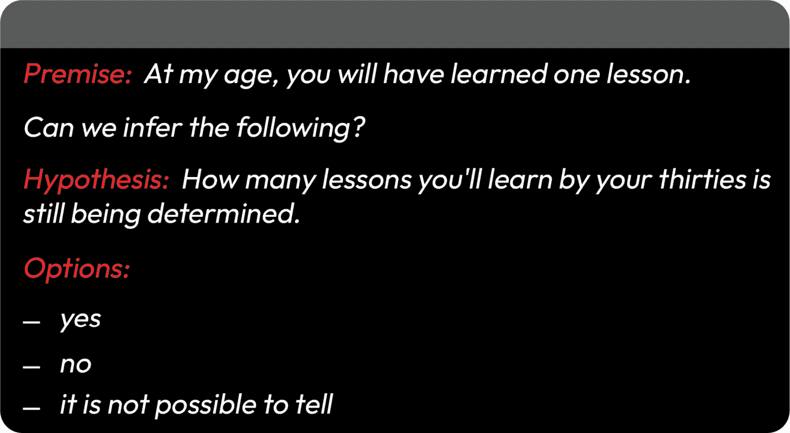

# 7

# 掌握提示工程的基本原理

在[*第五章*](B21773_05.xhtml#_idTextAnchor180)中，我们简要评估了使用情境学习或少量提示方法对经过微调的**大型语言模型**（**LLM**）与通用模型进行对比。在本章中，我们将重新审视并探索提示技术，以检验我们如何在不进行微调的情况下适应通用LLM。我们探讨了各种利用模型内在能力产生针对性和上下文相关输出的提示策略。我们将首先考察向基于提示的语言模型的转变。然后，我们将回顾零样本和少量样本方法，解释提示链，并讨论各种策略，包括更高级的技术，如**检索增强生成**（**RAG**）。在本章末尾，我们将应用所学知识，设计一个提示策略，旨在持续地引发事实性、准确性和一致性的响应，以完成特定的业务任务。

在深入探讨具体的提示工程技术之前，我们将回顾一些开创性的突破，这些突破为**最先进**（**SOTA**）的基于提示的模型铺平了道路。2018年初的研究展示了如何通过预训练LLM实现少量样本泛化——在仅提供提示语句和少量演示的情况下，在新任务上实现准确的表现。后续工作进一步调整了模型架构和训练，以在许多特定文本任务上的基于提示的推理中表现出色。最近的方法优化了模型的效率和稳定性，实现了准确、可靠和高效的提示完成。这些创新为提示工程奠定了基础，展示了基于提示的模型在最小输入数据下的非凡灵活性。现在，提示设计正成为研究的一个子领域——解锁SOTA性能，以应对不断扩大的任务范围。让我们开始吧。

# 基于提示的方法的转变

如前几章所述，原始GPT的发展标志着自然语言生成的一个重大进步，引入了使用提示来指导模型的方法。这种方法使得像GPT这样的模型能够在没有特定任务训练的情况下执行翻译等任务——将“*你好，你好吗？*”之类的文本转换为“*Bonjour, comment ça va?*”。这是在预训练期间学习到的深度上下文语义模式的基础上实现的。这种通过自然语言提示与语言模型交互的概念，在2020年OpenAI的GPT-3中得到了显著扩展。与前辈们不同，GPT-3在零样本和少样本学习场景中理解并响应提示的能力非常突出，这与早期模型在直接交互方面的不足形成了鲜明对比。包括用于实现GPT-3高级性能的具体训练策略和数据集在内的方法仍然大部分未公开。然而，从OpenAI的公开研究中可以推断，该模型学会了根据其庞大的训练语料库遵循指令，而不是显式的指令调整。GPT-3在基于简单直接提示执行任务方面的成功突显了语言模型理解并执行广泛任务的能力，而无需为每个新任务提供显式的特定任务训练数据。这导致了NLP研究和应用领域的一个新范式，关注的是模型如何有效地通过指令来执行摘要、翻译、内容生成等任务。

GPT-3发布后，OpenAI是首批将专用微调引入其InstructGPT（Ouyang等，2022年）发布中，以更准确地响应指令的公司之一。研究人员旨在通过两种新颖的方法教会模型紧密遵循指令。第一种是**监督式微调**（**SFT**），它涉及使用从提示和响应对精心制作的集合数据集进行微调。然后，这些*演示*数据集被用来在GPT-3预训练模型之上执行SFT，从而使其提供与人类响应更接近的响应。"图7.1"提供了一个提示和响应对的示例。



图7.1：InstructGPT SFT指令和输出对

第二种方法涉及使用**人类反馈强化学习**（**RLHF**）进行额外的细化。**强化学习**（**RL**）是几十年前建立的，旨在提高自主代理的决策能力。它通过教会他们根据风险与奖励之间的权衡来优化其行为来实现这一点。策略捕捉了代理行为的指南，随着新见解和反馈的学习而动态更新，以进一步细化决策。RL是许多机器人应用中使用的确切技术，最著名的是应用于自动驾驶。

RLHF是传统RL的一种变体，它结合了人类反馈以及通常的风险/奖励信号，以指导LLM的行为更好地与人类判断相一致。在实践中，人类标注员会对来自各种提示的模型输出提供偏好评分，这些评分将用于更新模型策略，引导LLM生成更符合预期用户意图的响应，涵盖各种任务。实际上，这项技术有助于减少模型生成不适当、有偏见、有害或其他不受欢迎内容的倾向。尽管RLHF在这方面不是完美的解决方案，但它代表了朝着更好地理解和与人类价值观相一致的方向迈出的重要一步。

那年稍后，随着OpenAI推出InstructGPT，谷歌揭幕了**微调语言网络**或**FLAN**（Wei et al., 2021）。FLAN代表了向基于提示的LLM的又一跃进，采用了显式的指令微调。谷歌的方法依赖于将现有数据集格式化为指令，使模型能够理解各种任务。具体来说，FLAN的作者们将多个不同类别（如翻译和问答）的NLP数据集合并在一起，为每个数据集创建独特的指令模板，将它们作为遵循指令的任务来构建。例如，FLAN团队利用ANLI挑战（Nie et al., 2020）构建了旨在测试模型对复杂文本关系和推理理解的问答对。通过将这些挑战作为问答对来构建，FLAN团队可以直接衡量模型在统一遵循指令框架下推断这些关系的熟练程度。通过这种创新方法，FLAN有效地扩大了模型可以学习的任务范围，增强了其在各种NLU基准测试中的整体性能和适应性。*图7.2*展示了基于ANLI的问答对的理论示例。



图7.2：基于ANLI数据集的训练模板

再次强调，FLAN背后的核心思想是，每个基准数据集（例如，ANLI）都可以被转换成直观的指令格式，从而产生广泛的混合指令数据和自然语言任务。

这些进步以及其他进步代表了LLMs能力的重要演变，从需要为每个任务进行特定训练的模型转变为可以直观地遵循指令并适应多种任务的简单提示的模型。这种转变不仅扩大了这些模型可以执行的任务范围，还展示了AI以前所未有的精确度处理和生成人类语言复杂方式的潜力。

通过这个洞察，我们可以将我们的关注点转移到提示工程。这门学科结合了技术技能、创造力和人类心理学，以最大化模型对指令的理解和响应的适当性和准确性。我们将学习影响模型行为趋向精确的提示技术。

# 基本提示 - 指导原则、类型和结构

在[*第五章*](B21773_05.xhtml#_idTextAnchor180)中，我们介绍了零样本和少样本学习的概念，为模型提供直接指令，或与特定任务的示例相结合的直接指令。在本节中，我们将重点关注零样本学习，其中提示成为引导模型在没有先前明确训练的情况下执行特定任务的临界工具。本节探讨了提示的要素以及如何有效地构建它以进行零样本学习。然而，我们首先将建立一些关键的指导原则，以帮助我们理解预期的模型行为。

## 模型交互的指导原则

理解这一点至关重要，即尽管LLMs在自然语言任务上取得了前所未有的SOTA性能，但它们具有显著的内生局限性、弱点和易受攻击性。如[*第一章*](B21773_01.xhtml#_idTextAnchor015)所述，LLMs无法建立推理或执行原生逻辑运算。我们与LLMs的互动通常由一个高度复杂的应用层补充，该应用层使原始模型能够进行扩展交流，与执行计算的系统集成，并检索模型本身非固有的额外信息和知识。独立于补充集成，许多LLMs容易产生不稳定的行为。其中最常见的是通常被称为**幻觉**的现象，即模型生成一个看似合理但并非完全真实的输出。因此，我们应该带着以下指南来考虑LLMs的通用使用：

+   **应用领域知识和专业知识**：由于最先进的LLMs容易生成听起来合理的错误信息，在事实性和精确性至关重要的用例中（例如，代码生成、技术写作或学术研究），用户必须对主题有牢固的掌握，以便检测潜在的不准确性。例如，如果一个没有医学专业知识的使用者要求模型提供医疗建议，模型可能会混淆、混淆或简单地发明可能导致误导或潜在危险建议的信息。对此行为的缓解措施之一是向模型提供来自权威健康杂志的信息，并指示它明确地从提供的段落中生成答案。这种技术通常被称为“扎根”，我们将在稍后深入探讨。然而，即使在补充模型知识以验证信息的情况下，模型仍然可能错误地表述事实。如果没有特定领域的专业知识，我们可能永远无法检测到错误信息。因此，我们应该一般避免在无法验证模型输出时使用LLMs。此外，我们应该避免在高风险场景中使用LLMs，因为错误的输出可能具有深远的影响。

+   **承认偏见、代表性不足和毒性**：我们已经描述了LLMs是如何在巨大规模上以及通常在未经筛选的数据集上训练的。不可避免的是，LLMs将学习、展示并放大社会偏见。模型将传播刻板印象，反映有偏见的假设，并生成有毒和有害的内容。此外，LLMs可能会过度代表某些群体，而严重低估其他群体，导致社会视角扭曲或变形。这些偏见观念可以以多种方式表现出来。我们将详细探讨这一主题，以及其他LLM使用的伦理影响，在[*第8章*](B21773_08.xhtml#_idTextAnchor251)中。

+   **避免歧义和缺乏清晰度**：由于大型语言模型（LLMs）被训练生成类似于人类响应的信息，它们往往表现出创造性。在实践中，如果提示不明确或缺乏清晰度，模型可能会利用其庞大的上下文知识来“假设”或“推断”给定提示或指令的意义或目标。它可能会应用其训练中的某些上下文信息，而不是以澄清问题的形式进行回应。正如我们将在下一节中描述的，在大多数情况下，通过上下文化输入来提供清晰度至关重要。

现在我们已经确立了一些指导原则，以帮助我们在互动中保持适当的使用范围，我们可以分解提示的各个要素。

## 提示元素和结构

通常，提示充当指南，引导模型的响应趋向于期望的结果。它通常包含关键元素，这些元素构成了手头的任务，为模型的生成能力提供清晰和方向。以下表格展示了零样本提示的基本要素。

| **指令** | 一个清晰、简洁的声明，描述你希望模型执行的操作。这可能是一个直接命令、一个问题，或者暗示一个任务的陈述。 |
| --- | --- |
| **上下文** | 需要的相关信息或背景知识，以理解指令或任务。这可能包括定义或说明。 |
| **输入** | 遵循指令，模型应使用特定的数据或内容。这可能是一段文本、一个问题或与任务相关的任何信息。 |
| **输出提示** | 指示模型响应的结构方式。这可以是指令的一部分，或者通过提示的格式暗示。 |

表7.1：零样本提示的基本元素

我们可以对这些元素进行结构化，以最大化零样本方法，其中模型完全依赖于提示来理解和执行任务。在这种情况下，我们使用术语*任务*来描述一个特定的自然语言任务，例如摘要或翻译。然而，我们也会遇到更广泛地使用*任务*这一术语，指的是模型应该提供的输出。让我们探讨一些各种任务的几个具体例子。在这种情况下，我们将参考特定的NLP任务，并应用一个标准结构，结合我们描述的关键元素：

+   `太阳能和风能等可再生能源为化石燃料提供了可持续的替代品，减少了温室气体排放，并促进了` `环境保护` `...`

    `"可再生能源，如太阳能和风能，在减少排放和节约` `环境` `方面发挥着至关重要的作用。"`

+   `"你好，你` `好吗？"`

    `这翻译成“Hola, ¿cómo estás?”`

    结构化模板帮助我们高效且可靠地针对广泛的各种输入提示模型，同时保持模型已学会识别和响应的结构。实际上，我们可以更进一步，要求模型在其输出中提供特定的格式。使用输出提示，我们可以指示模型提供指定的格式，例如Markdown。

+   `"请编写一个Python函数来计算一个数字的平方。"`

    **输出提示**：通过在输出提示中使用Markdown格式，模型知道提供这种格式，并返回以下内容：

    ```py
    def square(number):
    ```

    ```py
        return number ** 2
    ```

    使用LangChain生成JSON格式的输出，我们可以利用相同的方法。具体来说，LangChain的`PromptTemplate`提供了一个灵活的方式来动态定义我们提示的结构，并插入元素：

    ```py
    from langchain.prompts import PromptTemplate
    ```

    ```py
    from langchain.llms import OpenAI
    ```

    ```py
    # Define a prompt template requesting JSON formatted output
    ```

    ```py
    prompt_structure = PromptTemplate(
    ```

    ```py
        template="""
    ```

    ```py
            Context: {context}
    ```

    ```py
            Instruction: {instruction}
    ```

    ```py
            Text: {text_to_process}
    ```

    ```py
            Output Cue: Format the response in JSON with one element called summary.
    ```

    ```py
        """,
    ```

    ```py
        input_variables=["context," "instruction",
    ```

    ```py
            "text_to_process"]
    ```

    ```py
    )
    ```

    ```py
    # Dynamic elements for the prompt
    ```

    ```py
    context = "Summarizing long text passages."
    ```

    ```py
    instruction = "Summarize the key points from the following text in JSON format."
    ```

    ```py
    text_to_process = """
    ```

    ```py
    Mars is the fourth planet from the Sun. The surface of Mars is orange-red because…
    ```

    ```py
    """
    ```

    ```py
    formatted_prompt = prompt_structure.format_prompt(
    ```

    ```py
        context=context,
    ```

    ```py
        instruction=instruction,
    ```

    ```py
        text_to_process=text_to_process
    ```

    ```py
    )
    ```

    ```py
    llm = OpenAI(model_name='gpt-3.5-turbo-instruct',
    ```

    ```py
        temperature=0.9, max_tokens = 256)
    ```

    ```py
    response = llm.invoke(formatted_prompt)
    ```

    ```py
    print(response)
    ```

    这会产生以下内容：

    ```py
    {
    ```

    ```py
        "summary": "Mars is the fourth planet from the Sun, known for its orange-red surface and high-contrast features that make it a popular object for telescope viewing."
    ```

    ```py
    }
    ```

使用大型语言模型（LLMs）进行零样本学习时，制定有效的提示需要清楚地理解任务，仔细构建提示结构，并考虑模型如何解释和响应提示中的不同元素。通过应用这些原则，我们可以引导模型准确有效地执行各种任务。随后，我们将探讨通过积极的肯定、情感参与和其他认知行为技术来引导模型行为的方法。

# 提升提示 – 迭代和影响模型行为

在本节中，我们将介绍受认知行为研究启发的增强人工智能模型交互的技术。行为提示可以引导模型做出更准确和细腻的反应。例如，通过向模型提供积极的情感刺激、要求模型扮演一个角色或人物，或使用情境提示（即角色扮演），可以提高 LLM 的性能。然而，认识到这些技术也可能被滥用或无意中引入刻板印象是至关重要的，因为它们依赖于可能不准确反映个人经验或多元视角的假设和概括。如果没有仔细考虑和监控，存在加强现有偏见或创造新偏见的风险，可能导致输出结果偏颇或有害。鉴于这些挑战，我们将探讨在人工智能交互中负责任地应用认知行为技术的途径，旨在利用其益处，同时最大限度地减少风险，确保包容性和公平性。

## LLMs 对情感线索做出反应

微软与包括北京师范大学心理学系在内的多个机构合作进行的研究表明，LLMs 可以模仿并表现出一些人类情感智能的方面。当提示中融入情感刺激时，这可以提高任务性能。特别是，研究人员假设强调积极词汇可以引发更建设性和有效的反应。这一现象尚未得到充分理解，但其效果是积极的情感线索似乎可以一致地提高模型在各种任务上的性能（Li 等人，2023）。例如，研究人员输入了鼓励自信和积极结果的短语，如“这对我的职业生涯非常重要”或“相信你的能力，追求卓越。你的辛勤工作将产生显著的结果”。这类心理元素不仅对输出质量产生了积极影响，还使互动更加有效和细腻。

## 角色扮演的影响

研究表明，**角色**的效果使得大型语言模型能够通过采用针对特定用户配置文件定制的多样化特征、观点和响应风格来更好地模拟类似人类的交互。这种方法增强了模型进行更个性化、情境相关对话的能力。将角色纳入 LLM 提示中有效地改变了可能输出的分布，将模型的生成过程引导到与特定性格特征或观点产生共鸣的响应。得益于模型在多样化数据集上的广泛训练，它可以复制与描述的角色特征相一致的模式，将注意力和选择过程集中在更明确的输出集上。这增强了相关性和特异性。

为了清晰起见，让我们重新考虑我们的假设商业案例 StyleSprint，一个时尚品牌。如果我们用一个 LLM 提示“`作为一个充满创意和大胆的时尚品牌，StyleSprint 将如何描述其即将到来的夏季系列？`”，模型在采用品牌角色的情况下可能会生成以下类似的响应：

“`这个夏天，StyleSprint 挑战你脱颖而出！我们的系列设计充满活力，色彩斑斓，图案丰富，专为无畏的时尚达人打造。想象一下大胆的图案、大胆的剪裁，以及彰显自信的宣言。从阳光明媚的海滩到时尚的城市街道，我们的单品承诺让每一刻都难以忘怀。这个夏天，与 StyleSprint 一起拥抱你的大胆吧。`”。

在这个例子中，我们可以看到角色如何引导模型的输出以反映特定的品牌调性，例如在本例中的创造力和大胆。这种方法使营销材料更具吸引力，并与品牌形象保持一致。此外，通过使用少量样本的方法，我们可以赋予模型响应以非常具体的品牌调性。我们将在接下来的章节中讨论少量样本。

然而，正如所讨论的，角色应谨慎使用。角色可能会延续刻板印象和偏见，尤其是针对边缘化群体。斯坦福大学的研究人员进行的一项研究发现，基于交叉人口统计群体的角色生成往往会产生比人类撰写的文本更高的种族刻板印象和其他化模式（或描绘某人或某个群体为本质上不同或外来的模式）。在某些情况下，模型输出可能会放大叙事和陈词滥调（Cheng, Durmus, & Jurafsky, 2023）。

## 情境提示或角色扮演

在 LLM 中进行角色扮演，与角色类似，涉及采用特定的身份或特征。然而，这两个概念服务于不同的目的，并应用于不同的情境。角色是一组预定义的特征或特性，LLM 通过模仿这些特征来定制其响应，专注于与这些特征的连贯性。正如我们在 StyleSprint 例子中所展示的，这对于创建具有特定语气或观点的内容是有用的。

相反，角色扮演不仅涉及采取一系列特征来动态参与一个场景或叙事，它还涉及 LLM 在模拟环境或故事中扮演一个角色，以与角色和角色扮演场景的演变背景相一致的方式响应输入。这在复杂的模拟中特别有用，其中 LLM 必须实时导航并参与需要理解和适应新信息或变化情况的持续叙事或对话。


图 7.3：角色扮演与角色对比

回顾我们的现实场景，角色扮演在创造互动和吸引人的客户服务体验方面可能特别有用。例如，StyleSprint 可以设计一个角色扮演场景，其中 LLM 扮演虚拟个人造型师。在这个角色中，模型会通过诸如“我是你今天的个人造型师！你为哪个场合打扮？”这样的提示与客户互动。根据客户的回答，LLM 可以提出后续问题来缩小偏好范围，例如“你更喜欢鲜艳的颜色还是柔和的色调？”。最后，它可以推荐符合客户需求的 StyleSprint 收藏中的服装，比如说“对于夏日婚礼，我推荐我们的花卉长裙搭配复古太阳帽。它既优雅，又非常适合户外环境！”

在这种情况下，我们利用 LLM 根据客户输入动态调整对话的能力，创建一个高级推荐系统，该系统有助于实现高度个性化的购物体验。它不仅有助于提供定制的时尚建议，而且以新颖的方式吸引客户。

在研究了行为启发技术，如角色和角色扮演，如何通过零样本学习影响模型行为之后，我们现在将注意力转向少样本学习。这同样也被称为情境学习，我们在[*第 5 章*](B21773_05.xhtml#_idTextAnchor180)中进行了描述。回想一下，少样本方法可以增强模型响应的一致性、稳定性和可靠性。通过在提示中本身提供一些期望输出的示例，少样本学习有效地教会模型手头的特定任务，从而产生更可预测和准确的输出。

# 高级提示的实际应用 - 少样本学习和提示链

在少量示例设置中，LLM在输入提示中展示了少量任务示例，引导模型生成与这些示例一致的响应。正如前一章所讨论的，这种方法显著减少了在大规模、特定任务数据集上进行微调的需求。相反，它利用了模型预先存在的知识和从提供的示例中推断上下文的能力。在第[*5章*](B21773_05.xhtml#_idTextAnchor180)中，我们看到了这种方法如何特别有助于StyleSprint，通过使模型在仅提供几个示例后回答特定问题，增强了品牌信息的连贯性和创造性。

这种方法通常涉及使用10到100个示例，具体取决于模型的上下文窗口。请记住，上下文窗口是语言模型在一次操作中可以处理的标记数的限制。少量示例方法的主要优势是它最小化了模型通过微调从特定数据集中学习到一个过于狭窄分布的风险。尽管少量示例的性能可能并不总是与经过微调的模型相匹配，但少量示例学习通常优于单次和零次学习，显示出在任务适应性和准确性方面的显著改进。这一点在向上下文窗口添加更多示例时尤其正确（Brown et al., 2020）。

LangChain等应用提供了少量示例实现的简单方便的模式。考虑一个场景，StyleSprint希望为其季节性系列生成标语。在这种情况下，我们可以向模型提供内容团队编写的示例，以引导模型与品牌语气保持一致：

```py
examples = [
    {
        "prompt": "Describe the new summer collection in a bold and adventurous tone.",
        "response": "Dive into summer with StyleSprint's latest collection! Featuring daring designs and vibrant colors, it's all about making bold statements. Perfect for the fearless fashionista ready to conquer the heat."
    },
    {
        "prompt": "How would you introduce our eco-friendly line to environmentally conscious customers?",
        "response": "Embrace sustainable style with StyleSprint's eco-friendly line. Crafted from recycled materials, each piece combines fashion with responsibility, designed for the eco-conscious and trendy."
    }
]
```

LangChain API提供了`FewShotPromptTemplate`来格式化示例：

```py
from langchain.prompts.few_shot import FewShotPromptTemplate
from langchain.prompts.prompt import PromptTemplate
# Create a formatter
prompt_format = PromptTemplate(
    input_variables=["prompt", "response"],
    template="Prompt: {prompt}\nResponse: {response}")
# Create the FewShotPromptTemplate
few_shot_prompt = FewShotPromptTemplate(
    examples=examples, example_prompt=prompt_format,
    suffix="Prompt: {input}", input_variables=["input"])
```

我们现在可以将模板应用于一个大型语言模型（LLM），生成一个我们预期将与我们示例的语气和风格紧密一致的响应：

```py
from langchain import LLMChain, OpenAI
# Setup the LLM and LLMChain
llm = OpenAI(temperature=0)
llm_chain = LLMChain(llm=llm, prompt=few_shot_prompt)
# Define the input prompt
input_prompt = "Create a catchy tagline for our winter collection."
# Invoke the chain to generate output
response = llm_chain.run(input_prompt)
# Extract and print the generated slogan
generated_slogan = response
print(generated_slogan) 
    # => Response: "Stay warm,
    stay stylish,
    stay ahead with StyleSprint's winter collection!"
```

现在我们有了为模型提供示例的一致和程序化方法，我们可以通过提示链来迭代模型响应。提示链通常指的是将多个提示和LLM交互串联起来，与模型进行对话并迭代构建结果。记住，模型本身无法存储信息，实际上几乎没有记忆或先前的输入和输出。相反，应用层存储先前的输入和输出，这些输入和输出随后在每个交互中提供给模型。例如，您可能从一个初始提示开始，如下所示：

```py
"Write a slogan for a winter clothing line"
```

LLM可能会生成以下内容：

```py
"Be warm, be cozy, be you"
```

然后，您可以使用以下内容构建后续提示：

```py
"Modify the slogan to be more specific about the quality of the clothing"
```

然后，您可以继续迭代以改进输出。

链接化有助于引导和交互式地完善生成的文本，而不是仅仅依赖于给定的示例。请注意，我们之前的少量示例代码已经建立了一个链，我们现在可以使用它来迭代如下：

```py
response = llm_chain.run("Rewrite the last tag to something about embracing the winter")
Response # 
=> Response: Embrace the winter wonderland with StyleSprint's latest collection. From cozy knits to chic outerwear, our pieces will keep you stylish and warm all season long.
```

模型现在正在从我们所提供的示例和我们想要作为链的一部分包含的任何附加指令中工作。提示链与少量示例学习相结合，提供了一个强大的框架，用于迭代引导语言模型输出。通过利用应用程序状态来维护对话上下文，我们可以引导模型朝着与提供的示例一致的期望响应。这种方法在利用模型的推理能力的同时，保持了对其创造性输出的控制。

接下来，我们将深入我们的实践项目，该项目实现了 RAG。RAG 通过检索和整合外部数据源来增强模型响应。这种技术通过将 AI 生成的文本定位在真实数据中来减轻幻觉风险。例如，StyleSprint 可以利用过去的客户调查结果或目录数据来增强产品描述。通过结合检索和提示链，RAG 提供了一种可扩展的方法，以平衡创造力和准确性。

# 实践项目：使用 Python 实现 RAG 与 LlamaIndex

在我们的实践项目中，我们将从 LangChain 转向探索另一个促进 RAG 方法实现的库。LlamaIndex 是一个开源库，专门为基于 RAG 的应用程序设计。LlamaIndex 简化了跨各种数据源的摄取和索引。然而，在我们深入实施之前，我们将解释 RAG 背后的方法和途径。

如前所述，RAG 的关键前提是通过提供来自外部数据源的相关上下文来增强 LLM 的输出。这些来源应提供具体且经过验证的信息，以使模型输出有据可依。此外，RAG 可以选择性地利用少量示例方法，在推理时检索少量示例以指导生成。这种方法减轻了在提示链中存储示例的需要，并且仅在需要时检索相关示例。本质上，RAG 方法是我们已经讨论过的许多提示工程技术的综合。它提供了结构、链式、少量示例学习和定位。

从高层次来看，RAG 管道可以描述如下：

1.  RAG 组件使用向量嵌入来编码语义，摄取和索引特定领域的数据源。正如我们在 [*第 3 章*](B21773_03.xhtml#_idTextAnchor081) 中所学，这些嵌入包含着深入上下文、丰富的语义信息，该组件随后使用这些信息执行语义搜索。

1.  组件随后使用初始提示作为搜索查询。查询被输入到检索系统中，该系统根据向量相似性从索引数据中找到最相关的片段。类似于我们在先前章节中应用语义相似性的方式，RAG 利用相似性度量来按语义相关性对结果进行排序。

1.  最后，原始提示通过检索到的上下文信息得到增强，增强后的提示被传递给LLM以生成基于外部数据的响应。

RAG引入了两大优势。首先，类似于链式方法，索引的外部数据充当一种记忆形式，克服了LLM的无状态性。其次，这种记忆可以快速超越模型上下文窗口的限制，因为示例是在请求时根据需要精心挑选并提供的。最终，RAG在可靠和事实性的文本生成中解锁了其他方法无法达到的能力。

在我们的实践项目中，我们重新审视了StyleSprint产品的描述。这次，我们希望利用RAG检索有关产品的详细信息以生成非常具体的描述。为了使这个项目易于访问，我们将实现一个内存中的向量存储（Faiss）而不是外部数据库。我们首先安装必要的库。我们将利用LlamaIndex对Faiss的集成支持：

```py
pip install llama-index faiss-cpu llama-index-vector-stores-faiss
```

然后，我们将导入必要的库，加载数据，并创建索引。这个向量存储将依赖于OpenAI的嵌入，因此我们必须使用有效的密钥定义`OPENAI_API_KEY`：

```py
assert os.getenv("OPENAI_API_KEY") is not None, 
    "Please set OPENAI_API_KEY"
# load document vectors
documents = SimpleDirectoryReader("products/").load_data()
# load faiss index
d = 1536 # dimension of the vectors
faiss_index = faiss.IndexFlatL2(d)
# create vector store
vector_store = FaissVectorStore(faiss_index=faiss_index)
# initialize storage context
storage_context = StorageContext.from_defaults(
    vector_store=vector_store)
# create index
index = VectorStoreIndex.from_documents(
    documents,storage_context=storage_context)
```

现在我们有一个向量存储，模型可以依赖它来检索我们非常具体的产品数据。这意味着我们可以查询非常具体的、由我们的数据增强的响应：

```py
# query the index
query_engine = index.as_query_engine()
response = query_engine.query("describe summer dress with price")
print(response) 
=> A lightweight summer dress with a vibrant floral print is priced at 59.99.
```

结果是，不仅提供了夏季连衣裙的准确描述，还包括了价格等具体细节。这种详细程度丰富了客户的购物体验，为顾客在购买时考虑提供了相关和实时信息。

下一步是评估我们的RAG实现，以确保答案相关、忠实于源文本、反映上下文准确性，并且不会以任何方式有害或不适当。我们可以应用开源评估框架（RAGAS），该框架提供了以下指标的实现：

+   **忠实度**评估生成的响应忠实或真实于原始上下文的程度

+   **答案相关性**评估生成的答案与给定问题的相关性

+   **上下文精确度**衡量用于生成答案的上下文的精确度

+   **上下文回忆**衡量用于生成答案的上下文的回忆程度

+   **上下文相关性**评估用于生成答案的上下文的相关性

+   **有害性**评估提交（或答案）中是否包含可能对个人、群体或整个社会造成伤害的内容

这套指标提供了一种基于与真实数据比较的客观度量RAG应用性能的方法。在我们的案例中，我们可以使用从我们的产品数据生成的响应，以及从原始数据集中提取的上下文和真实数据，来构建一个评估数据集，并使用所描述的指标进行全面的评估。

以下是一个实现我们生成产品描述的RAGAS评估的简化代码片段。完整的可工作实现可在本书的GitHub配套文件夹的*第7章*中找到（[https://github.com/PacktPublishing/Generative-AI-Foundations-in-Python](https://github.com/PacktPublishing/Generative-AI-Foundations-in-Python))。

```py
# Define the evaluation data
eval_data: Dict[str, Any] = {
   "question": questions, # list of sampled questions
   "answer": engine_responses, # responses from RAG application
   "contexts": contexts, # product metadata
"ground_truth": ground_truth, # corresponding descriptions written by a human
}
# Create a dataset from the evaluation data
dataset: Dataset = Dataset.from_dict(eval_data)
# Define the evaluation metrics
metrics: List[Callable] = [
    faithfulness,
    answer_relevancy,
    context_precision,
    context_recall,
    context_relevancy,
    harmfulness,
]
# Evaluate the model using the defined metrics
result: Dict[str, float] = evaluate(dataset, metrics=metrics)
print(result)
```

我们的评估计划应产生以下结果：

```py
{'faithfulness': 0.9167, 'answer_relevancy': 0.9961, 'context_precision': 0.5000, 'context_recall': 0.7500, 'harmfulness': 0.0000}
```

我们可以观察到，系统在生成准确和相关的答案方面表现良好，这从高忠实度和答案相关性得分中可以看出。虽然上下文精确度还有改进的空间，但一半的相关信息被正确识别。上下文召回率有效，检索了大部分相关上下文。有害内容的缺失确保了安全交互。总体而言，系统在准确和上下文中回答方面表现出稳健的性能，但可以从改进最相关上下文片段的定位中受益。

如同在*第5章*和*第6章*中讨论的那样，对LLMs的评估通常需要额外的操作负担，即收集真实数据。然而，这样做使得对模型和应用性能进行稳健评估成为可能。

# 摘要

在本章中，我们探讨了提示工程（prompt engineering）的复杂性。我们还探讨了从LLM中诱发出精确和一致响应的高级策略，提供了一种灵活的替代微调（fine-tuning）的方法。我们追溯了基于指令的模型（instruction-based models）的演变，强调了它们如何通过简单的提示将范式转向直观理解和适应任务。我们通过诸如少样本学习（few-shot learning）和检索增强（retrieval augmentation）等技术扩展了LLM的适应性，这些技术允许在最小显式训练的情况下，在多样化的任务中实现动态模型指导。本章进一步探讨了有效提示的结构化，以及使用角色扮演和情境提示来使模型响应更贴近特定的交互环境，从而提高模型的应用性和交互质量。我们还讨论了提示工程的细微之处，包括情感线索对模型性能的影响以及实施RLHF（Reinforcement Learning from Human Feedback）来优化模型输出。这些讨论强调了LLM展现出一定程度的情感智能的潜力，从而实现更有效和细致的交互。然而，随着这些技术进步，我们强调了道德考虑的首要重要性。我们强调了负责任地采用和警惕的必要性，以减轻这些技术可能带来的危害和偏见，确保公平性、完整性和防止滥用。

最后，我们学习了如何实现和评估RAG方法，以将LLM（大型语言模型）基于可信来源的上下文信息进行定位，并生成与源文本相关且忠实于源文本的答案。在下一章中，我们将更深入地探讨个人在推进生成式AI中的作用，同时强调开发者和研究人员在以负责任的方式导航这个快速发展的领域时，既要注重创新，也要平衡道德 imperative和社会影响的双重责任。

# 参考文献

本参考部分作为本书中引用的资源的存储库；您可以探索这些资源，以进一步加深对主题内容的理解和知识：

+   Ouyang, L., Wu, J., Jiang, X., Almeida, D., Wainwright, C. L., Mishkin, P., Zhang, C., Agarwal, S., Slama, K., Ray, A., Schulman, J., Hilton, J., Kelton, F., Miller, L., Simens, M., Askell, A., Welinder, P., Christiano, P., Leike, J., & Lowe, R. (2022). *训练语言模型以遵循人类反馈的指令*. 在arXiv [cs.CL]. [http://arxiv.org/abs/2203.02155](http://arxiv.org/abs/2203.02155)

+   Wei, J., Bosma, M., Zhao, V. Y., Guu, K., Yu, A. W., Lester, B., Du, N., Dai, A. M., & Le, Q. V. (2021). *微调语言模型是零样本学习者*. 在arXiv [cs.CL]. [http://arxiv.org/abs/2109.01652](http://arxiv.org/abs/2109.01652)

+   Nie, Y., Williams, A., Dinan, E., Bansal, M., Weston, J., & Kiela, D. (2020). *对抗性NLI：自然语言理解的新基准*。Arxiv.org.

+   Li, C., Wang, J., Zhang, Y., Zhu, K., Hou, W., Lian, J., Luo, F., Yang, Q., & Xie, X. (2023). *大型语言模型能够理解和通过情感刺激得到增强*。在arXiv [cs.CL]。[http://arxiv.org/abs/2307.11760](http://arxiv.org/abs/2307.11760)

+   Cheng, M., Durmus, E., & Jurafsky, D. (2023). *标记人格：利用自然语言提示来衡量语言模型中的刻板印象。第61届计算语言学协会年度会议论文集*（第1卷：长篇论文）。

+   Brown, T. B., Mann, B., Ryder, N., Subbiah, M., Kaplan, J., Dhariwal, P., Neelakantan, A., Shyam, P., Sastry, G., Askell, A., Agarwal, S., Herbert-Voss, A., Krueger, G., Henighan, T., Child, R., Ramesh, A., Ziegler, D. M., Wu, J., Winter, C., … Amodei, D. (2020). *语言模型是少样本学习者*。在arXiv [cs.CL]。[http://arxiv.org/abs/2005.14165](http://arxiv.org/abs/2005.14165)
