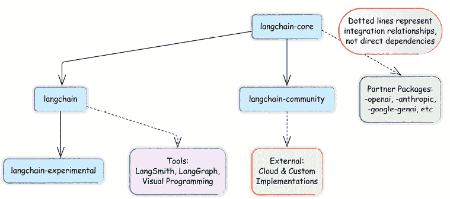
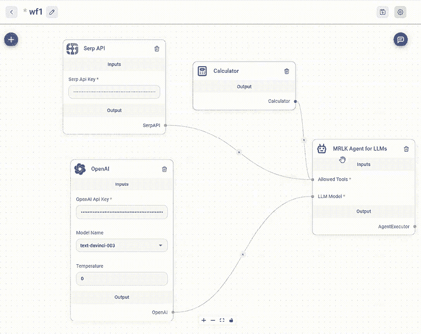

# 生成式 AI 的崛起：从语言模型到智能体

实验性和生产就绪智能体之间的差距非常明显。根据 LangChain 的智能体状态报告，性能质量是 51%使用智能体的公司最关心的问题，但只有 39.8%的公司实施了适当的评估系统。我们的书籍从两个前沿领域弥合了这一差距：首先，通过展示 LangChain 和 LangSmith 如何提供强大的测试和可观察性解决方案；其次，通过展示 LangGraph 的状态管理如何使复杂、可靠的智能体系统成为可能。您将找到经过生产测试的代码模式，这些模式利用每个工具的优势，以企业规模实施，并将基本的 RAG 扩展到强大的知识系统。

LangChain 通过提供现成的构建块、统一的供应商 API 和详细的教程，加速了产品的上市时间。此外，LangChain 和 LangSmith 的调试和跟踪功能简化了复杂智能体行为的分析。最后，LangGraph 在执行其智能体 AI 背后的哲学方面表现出色——它允许开发者对工作流程中的**大型语言模型**（**LLM**）进行部分控制流（以及管理 LLM 应拥有的控制级别），同时仍然使智能体工作流程可靠且性能良好。

在本章中，我们将探讨 LLM 如何演变成智能体 AI 系统的基石，以及像 LangChain 和 LangGraph 这样的框架如何将这些模型转化为生产就绪的应用。我们还将检查现代 LLM 的格局，了解原始 LLM 的限制，并介绍构成本书中我们将要解决的手动开发基础的智能体应用的核心概念。

简而言之，本书将涵盖以下主题：

+   现代 LLM 格局

+   从模型到智能体应用

+   介绍 LangChain

# 现代 LLM 格局

**人工智能**（**AI**）长期以来一直是人们着迷和研究的话题，但最近在生成式 AI 方面的进步已经推动了其主流的采用。与传统的 AI 系统不同，这些系统对数据进行分类或做出预测，生成式 AI 可以通过利用大量的训练数据来创建新的内容——文本、图像、代码等等。

生成式 AI 革命是由 2017 年引入的 transformer 架构所催化的，它使模型能够以前所未有的对上下文和关系的理解来处理文本。随着研究人员将这些模型从数百万参数扩展到数十亿参数，他们发现了一些令人瞩目的事情：更大的模型不仅仅是渐进式地更好——它们还表现出全新的涌现能力，如少样本学习、复杂推理和创造性生成，这些能力并非明确编程。最终，2022 年 ChatGPT 的发布标志着转折点，向公众展示了这些能力，并引发了广泛的应用。

在 Llama 和 Mistral 等模型引领的开源革命中，格局再次发生转变，将强大的 AI 访问权民主化，超越了主要科技公司。然而，这些高级功能伴随着重大的局限性——模型无法可靠地使用工具，通过复杂问题进行推理，或在交互过程中保持情境。这种原始模型力量和实际效用之间的差距产生了对像 LangChain 这样的专用框架的需求，这些框架将这些模型从令人印象深刻的文本生成器转变为功能齐全、生产就绪的代理，能够解决现实世界的问题。

**关键术语**

**工具**：AI 模型可以用来与世界交互的外部实用程序或函数。工具允许代理执行搜索网络、计算值或访问数据库等操作，以克服 LLMs 固有的局限性。

**记忆**：允许 AI 应用在交互过程中存储和检索信息的系统。通过跟踪之前的输入、输出和重要信息，记忆使对话和复杂工作流程具有情境意识。

**基于人类反馈的强化学习（RLHF**）：一种训练技术，其中 AI 模型从直接的人类反馈中学习，优化其性能以符合人类偏好。RLHF 有助于创建更帮助性、更安全且与人类价值观一致的模型。

**代理**：能够感知其环境、做出决策并采取行动以实现目标的 AI 系统。在 LangChain 中，代理使用 LLMs 来解释任务、选择适当的工具，并在最小化人工干预的情况下执行多步骤过程。

| **年** | **发展** | **关键特性** |
| --- | --- | --- |
| 1990 年代 | IBM 对齐模型 | 统计机器翻译 |
| 2000 年代 | 网络规模数据集 | 大规模统计模型 |
| 2009 | 统计模型主导 | 大规模文本摄入 |
| 2012 | 深度学习获得动力 | 神经网络优于统计模型 |
| 2016 | 神经机器翻译（NMT） | Seq2seq 深度 LSTMs 取代统计方法 |
| 2017 | Transformer 架构 | 自注意力革命性地改变了 NLP |
| 2018 | BERT 和 GPT-1 | 基于 Transformer 的语言理解和生成 |
| 2019 | GPT-2 | 大规模文本生成，公众意识提高 |
| 2020 | GPT-3 | 基于 API 的访问，最先进的性能 |
| 2022 | ChatGPT | LLMs 的广泛应用 |
| 2023 | 大型多模态模型（LMMs） | AI 模型处理文本、图像和音频 |

|

2024

| OpenAI o1 | 更强的推理能力 |
| --- | --- |
| 2025 | DeepSeek R1 | 开放式、大规模 AI 模型 |

表 1.1：语言模型主要发展的时间线

LLMs 领域正在迅速发展，多个模型在性能、能力和可访问性方面展开竞争。每个提供商都带来独特的优势，从 OpenAI 的高级通用人工智能到 Mistral 的开源、高效模型。了解这些模型之间的差异有助于实践者在将 LLMs 集成到其应用程序时做出明智的决定。

## 模型比较

以下要点概述了比较不同 LLMs 时需要考虑的关键因素，重点关注其可访问性、规模、能力和专业化：

+   **开源模型与闭源模型**：开源模型如 Mistral 和 LLaMA 提供透明度和本地运行的能力，而闭源模型如 GPT-4 和 Claude 则可以通过 API 访问。开源 LLMs 可以被下载和修改，使开发人员和研究人员能够调查和基于其架构进行构建，尽管可能适用特定的使用条款。

+   **规模和能力**：较大的模型通常提供更好的性能，但需要更多的计算资源。这使得较小的模型非常适合在计算能力或内存有限的设备上使用，并且使用成本可以显著降低。**小型语言模型（SLMs**）的参数数量相对较少，通常使用数百万到数十亿个参数，而大型语言模型（LLMs）可以拥有数百亿甚至数千亿的参数。

+   **专用模型**：一些大型语言模型（LLMs）针对特定任务进行了优化，例如代码生成（例如，Codex）或数学推理（例如，Minerva）。

语言模型规模的增加是它们令人印象深刻的性能提升的主要驱动力。然而，最近在架构和训练方法上出现的变化导致了在性能方面的参数效率的提高。

**模型缩放定律**

经验推导的缩放定律根据给定的训练预算、数据集大小和参数数量预测 LLMs 的性能。如果这是真的，这意味着高度强大的系统将集中在大型科技公司手中，然而，我们在最近几个月看到了显著的转变。

Kaplan 等人提出的**KM 缩放定律**，通过经验分析和拟合模型性能与不同数据大小、模型大小和训练计算之间的关系，呈现幂律关系，表明模型性能与模型大小、数据集大小和训练计算等因素之间存在强烈的相互依赖性。

Google DeepMind 团队提出的**Chinchilla 缩放定律**涉及对更广泛范围的模型大小和数据大小的实验。它建议对计算预算进行最优分配，以适应模型大小和数据大小，这可以通过在约束下优化特定的损失函数来确定。

然而，未来的进步可能更多地取决于模型架构、数据清洗和模型算法创新，而不是单纯的大小。例如，phi 模型，首次在*《教科书都是你需要的一切》*（2023 年，Gunasekar 等人）中提出，大约有 10 亿个参数，表明模型即使规模较小，也能在评估基准上实现高精度。作者建议提高数据质量可以显著改变扩展定律的形状。

此外，还有关于简化模型架构的研究，这些模型具有显著更少的参数，并且仅略微降低精度（例如，*只需要一个宽前馈网络*，Pessoa Pires 等人，2023 年）。此外，微调、量化、蒸馏和提示技术等技术可以使较小的模型利用大型基础模型的能力，而无需复制其成本。为了弥补模型限制，搜索引擎和计算器等工具已被纳入代理中，多步推理策略、插件和扩展可能越来越多地被用来扩展功能。

未来可能会看到大型通用模型与较小且更易于访问的模型的共存，这些模型提供更快、更便宜的培训、维护和推理。

让我们讨论一下各种 LLM 的比较概述，突出它们的关键特性和差异化因素。我们将探讨开源与闭源模型、模型大小和能力以及专用模型等方面。通过了解这些区别，您可以选择最适合您特定需求和应用的 LLM。

## LLM 提供商格局

您可以通过 OpenAI、谷歌和 Anthropic 等主要提供商的网站或 API 访问 LLM，以及其他越来越多的提供商。随着对 LLM 的需求增长，许多提供商已进入该领域，每个都提供具有独特功能和权衡的模型。开发者需要了解可用于将强大模型集成到其应用程序中的各种访问选项。提供商的选择将显著影响开发体验、性能特征和运营成本。

下表提供了领先的大型语言模型（LLM）提供商及其提供的模型示例的比较概述：

| **提供商** | **知名模型** | **关键特性和优势** |
| --- | --- | --- |
| **OpenAI** | GPT-4o, GPT-4.5；o1；o3-mini | 强大的通用性能，专有模型，高级推理；在实时跨文本、音频、视觉和视频中进行多模态推理 |
| **Anthropic** | Claude 3.7 Sonnet; Claude 3.5 Haiku | 在实时响应和扩展的“思考”阶段之间切换；在编码基准测试中优于 OpenAI 的 o1 |
| **谷歌** | Gemini 2.5, 2.0（闪存和专业版），Gemini 1.5 | 低延迟和成本，大上下文窗口（高达 2M 个标记），多模态输入和输出，推理能力 |
| **Cohere** | Command R，Command R Plus | 检索增强生成，企业 AI 解决方案 |
| **Mistral AI** | Mistral Large；Mistral 7B | 开放权重，高效推理，多语言支持 |
| **AWS** | Titan | 企业级 AI 模型，优化用于 AWS 云 |

|

**DeepSeek**

| R1 | 以数学为先：解决奥林匹克级别的难题；成本效益高，优化用于多语言和编程任务 |
| --- | --- |
| **Together AI** | 运行开源模型的基础设施 | 具有竞争力的定价；模型市场正在增长 |

表 1.2：主要 LLM 提供商及其用于 LangChain 实现的旗舰模型的比较概述

其他组织开发 LLM，但并不一定通过**应用程序编程接口**（**APIs**）向开发者提供。例如，Meta AI 开发了非常有影响力的 Llama 模型系列，该系列具有强大的推理和代码生成能力，并以开源许可证发布。

你可以通过 Hugging Face 或其他提供商访问一系列开源模型。你甚至可以下载这些开源模型，微调它们，或完全训练它们。我们将在*第二章*中实际尝试这一点。

一旦你选择了合适的模型，下一个关键步骤就是了解如何控制其行为以满足你特定的应用需求。虽然访问模型为你提供了计算能力，但生成参数的选择将把原始模型的力量转化为适用于你应用程序中不同用例的定制输出。

现在我们已经了解了 LLM 提供商的格局，让我们讨论 LLM 实施中的另一个关键方面：许可证考虑。不同模型的许可证条款在很大程度上影响了你在应用程序中使用它们的方式。

## 许可证

LLM 在不同的许可证模型下可用，这影响了它们在实际中的使用方式。开源模型如 Mixtral 和 BERT 可以自由使用、修改并集成到应用程序中。这些模型允许开发者本地运行它们，研究其行为，并在研究和商业目的上在此基础上构建。

相比之下，像 GPT-4 和 Claude 这样的专有模型只能通过 API 访问，其内部工作原理保持私密。虽然这确保了性能的一致性和定期更新，但也意味着依赖于外部服务，并且通常会产生使用费用。

一些模型，如 Llama 2，采取折中方案，为研究和商业用途提供宽松的许可证，同时保持某些使用条件。有关特定模型许可证及其影响的详细信息，请参阅每个模型的文档或咨询模型开放框架：[`isitopen.ai/`](https://isitopen.ai/).

**模型开放框架**（**MOF**）根据诸如访问模型架构细节、训练方法及超参数、数据来源和处理信息、开发决策的文档、评估模型运作、偏见和局限性的能力、代码模块化、发布的模型卡片、可服务模型的可用性、本地运行选项、源代码可用性和再分发权利等标准评估语言模型。

通常，开源许可促进了对模型的广泛采用、协作和创新，这对研究和商业开发都有益。专有许可通常给予公司独家控制权，但可能限制学术研究进展。非商业许可通常限制商业用途，同时允许研究。

通过使知识和知识工作更加易于获取和适应，生成式 AI 模型有可能使竞争场域公平，并为各行各业的人创造新的机会。

人工智能的演变使我们达到了一个关键时刻，AI 系统不仅可以处理信息，还可以采取自主行动。下一节将探讨从基本语言模型到更复杂，最终到完全代理应用的转变。

关于 AI 模型许可提供的信息仅用于教育目的，并不构成法律建议。许可条款差异很大且发展迅速。组织应咨询合格的法律顾问，以了解其 AI 实施的具体许可决策。

# 从模型到代理应用

如前所述，LLMs 已经在自然语言处理中展现出非凡的流畅性。然而，尽管它们令人印象深刻，但它们仍然本质上是**反应性的**而不是**主动性的**。它们缺乏采取独立行动、有意义地与外部系统交互或自主实现复杂目标的能力。

为了解锁 AI 能力的下一阶段，我们需要超越被动的文本生成，转向**代理 AI**——能够规划、推理并采取行动以最小化人类干预完成任务的系统。在探索代理 AI 的潜力之前，首先了解 LLMs 的核心局限性，这些局限性是这种演变所必需的。

## 传统 LLMs 的局限性

尽管 LLMs 具有高级的语言能力，但它们固有的限制限制了它们在现实世界应用中的有效性：

1.  **缺乏真正的理解**：大型语言模型（LLMs）通过根据训练数据中的统计模式预测下一个最可能出现的单词来生成类似人类的文本。然而，它们并不像人类那样理解意义。这导致幻觉——自信地将错误信息当作事实陈述——以及生成看似合理但实际上错误、误导或不合逻辑的输出。正如 Bender 等人（2021）所描述的，LLMs 作为“随机鹦鹉”——重复模式而没有真正的理解。

1.  **在复杂推理和问题解决上的挑战**：虽然 LLMs 在检索和重新格式化知识方面表现出色，但它们在多步推理、逻辑谜题和数学问题解决上存在困难。它们通常无法将问题分解为子任务或在不同上下文中综合信息。没有像思维链推理这样的明确提示技术，它们推断或推理的能力仍然不可靠。

1.  **知识过时和外部访问有限**：LLMs 是在静态数据集上训练的，并且没有实时访问当前事件、动态数据库或实时信息源。这使得它们不适合需要最新知识的任务，例如财务分析、突发新闻摘要或需要最新发现的科学研究。

1.  **没有原生的工具使用或行动能力**：LLMs 在独立状态下运行——它们无法与 API 交互、检索实时数据、执行代码或修改外部系统。这种缺乏工具集成使得它们在需要现实世界行动的场景中效果较差，例如进行网络搜索、自动化工作流程或控制软件系统。

1.  **偏见、伦理担忧和可靠性问题**：由于 LLMs 从可能包含偏见的庞大数据集中学习，它们可能会无意中加强意识形态、社会或文化偏见。重要的是，即使对于开源模型，对于大多数从业者来说，访问和审计完整训练数据以识别和减轻这些偏见仍然具有挑战性。此外，它们可能会在没有理解其输出伦理影响的情况下生成误导性或有害信息。

1.  **计算成本和效率挑战**：大规模部署和运行 LLMs 需要**大量**的计算资源，这使得它们成本高昂且能耗密集。更大的模型也可能引入延迟，减慢实时应用的响应时间。

为了克服这些限制，AI 系统必须从被动的文本生成器进化为能够规划、推理并与环境交互的主动代理。这正是代理 AI 发挥作用的地方——将 LLMs 与工具使用、决策机制和自主执行能力集成，以增强其功能。

虽然像 LangChain 这样的框架为 LLMs 的局限性提供了全面的解决方案，但理解基本的提示工程技术仍然很有价值。像少样本学习、思维链和结构化提示这样的方法可以显著提高模型在特定任务上的性能。第三章将详细介绍这些技术，展示 LangChain 如何帮助标准化和优化提示模式，同时最大限度地减少在每个应用中需要定制提示工程的需求。

下一节将探讨代理 AI 如何扩展传统 LLMs 的功能，并为自动化、问题解决和智能决策解锁新的可能性。

## 理解 LLM 应用

LLM 应用代表了原始模型能力与实际商业价值之间的桥梁。虽然 LLM 拥有令人印象深刻的语言处理能力，但它们需要深思熟虑的整合才能提供现实世界的解决方案。这些应用大致分为两大类：复杂集成应用和自主代理。

**复杂集成应用**通过将大型语言模型（LLM）整合到现有流程中，增强了人类工作流程，包括：

+   提供分析和建议的决策支持系统

+   具有人类审查的内容生成管道

+   增强人类能力的交互式工具

+   在人类监督下的工作流程自动化

**自主代理**在最小的人为干预下运行，通过 LLM 的整合进一步增强了工作流程。例如：

+   执行定义工作流程的任务自动化代理

+   信息收集和分析系统

+   用于复杂任务协调的多代理系统

LangChain 为集成应用和自主代理提供框架，提供灵活的组件，支持各种架构选择。本书将探讨这两种方法，展示如何构建符合您特定要求的可靠、生产就绪的系统。

代理的自主系统可能非常强大，因此值得进一步探索。

## 理解 AI 代理

有时人们开玩笑说 AI 只是 ML 的华丽辞藻，或者 AI 是穿着西装的 ML，如图所示；然而，这背后还有更多内容，我们将看到。

图 1.1：穿着西装的 ML。由 replicate.com 上的模型生成，Diffusers Stable Diffusion v2.1

一个 AI 代理代表了从原始认知能力到实际行动的桥梁。虽然 LLM 拥有庞大的知识和处理能力，但它仍然缺乏主动性，本质上仍然是反应性的。AI 代理通过结构化的工作流程将这种被动能力转化为主动效用，这些工作流程解析需求、分析选项并执行行动。

代理式 AI 使自主系统能够在最小的人为干预下做出决策和独立行动。与遵循固定规则的确定性系统不同，代理式 AI 依赖于模式和可能性来做出明智的选择。它通过一个称为代理的自主软件组件网络来运行，这些代理从用户行为和大量数据集中学习，以随着时间的推移不断改进。

AI 中的*代理*指的是系统独立行动以实现目标的能力。真正的代理意味着 AI 系统可以通过学习交互和反馈来感知其环境、做出决策、行动并适应。原始 AI 与代理之间的区别与知识和专业知识之间的区别相似。考虑一位理解复杂理论的杰出研究人员，但在实际应用上却遇到困难。代理系统增加了有目的行动的关键要素，将抽象能力转化为具体成果。

在 LLM 的背景下，代理 AI 涉及开发能够自主行动、理解情境、适应新信息并与人类协作解决复杂挑战的系统。这些 AI 代理利用 LLM 来处理信息、生成响应并根据定义的目标执行任务。

尤其是 AI 代理通过整合记忆、工具使用和决策框架来扩展 LLM 的能力。这些代理可以：

+   在交互中保留和回忆信息。

+   利用外部工具、API 和数据库。

+   规划和执行多步骤工作流程。

代理的价值在于减少对持续人类监督的需求。而不是为每个请求手动提示 LLM，代理可以主动执行任务，对新数据进行反应，并与现实世界应用集成。

AI 代理是代表用户行动的系统，利用 LLM 以及外部工具、记忆和决策框架。AI 代理背后的希望是它们可以自动化复杂的工作流程，减少人力，同时提高效率和准确性。通过允许系统自主行动，代理承诺在 AI 驱动应用中解锁新的自动化水平。但这些希望是合理的吗？

尽管它们具有潜力，但 AI 代理面临着重大的挑战：

+   **可靠性**：确保代理在无监督的情况下做出正确、情境感知的决策是困难的。

+   **泛化**：许多代理在狭窄领域表现良好，但在开放性、多领域任务上却遇到困难。

+   **缺乏信任**：用户必须相信代理将负责任地行动，避免意外行为，并尊重隐私限制。

+   **协调复杂性**：多代理系统在协作执行任务时往往效率低下，存在沟通不畅的问题。

适用于生产的代理系统必须解决不仅仅是理论上的挑战，还包括实际实施障碍，如：

+   速率限制和 API 配额

+   令牌上下文溢出错误

+   幻觉管理

+   成本优化

LangChain 和 LangSmith 为这些挑战提供了稳健的解决方案，我们将在*第八章*和*第九章*中深入探讨。这两章将涵盖如何构建可靠、可观察的 AI 系统，这些系统能在企业规模上运行。

因此，在开发基于代理的系统时，需要仔细考虑几个关键因素：

+   **价值创造**：代理必须提供明确的效用，其成本（包括设置、维护和必要的人类监督）低于其价值。这通常意味着从定义明确、价值高的任务开始，自动化可以明显改善结果。

+   **信任和安全**：随着代理承担更多责任，建立和维护用户信任变得至关重要。这包括技术可靠性和透明的操作，使用户能够理解和预测代理的行为。

+   **标准化**：随着代理生态系统的增长，标准化的接口和协议对于互操作性变得至关重要。这类似于网络标准的开发，这些标准促进了互联网应用程序的增长。

虽然早期的 AI 系统专注于模式匹配和预定义模板，但现代 AI 代理展示了涌现能力，如推理、问题解决和长期规划。今天的 AI 代理将 LLM 与交互式环境集成，使其能够在复杂领域自主运行。

基于代理的 AI 的发展是从统计模型到深度学习，再到基于推理的系统的一种自然演进。现代 AI 代理利用多模态能力、强化学习和记忆增强架构来适应各种任务。这种演进标志着从预测模型到真正自主的系统，这些系统能够进行动态决策的转变。

展望未来，AI 代理将继续完善其在结构和非结构化环境中的推理、规划和行动能力。开放权重模型的出现，结合基于代理的 AI 的进步，很可能会推动 AI 下一个创新浪潮，扩大其在科学、工程和日常生活中的应用。

使用像 LangChain 这样的框架，开发者可以构建复杂且具有代理能力的结构化系统，克服原始 LLM 的局限性。它提供了内置的内存管理、工具集成和多步推理解决方案，与这里提出的生态系统模型相一致。在下一节中，我们将探讨 LangChain 如何促进生产就绪 AI 代理的开发。

# 介绍 LangChain

LangChain 作为一个开源框架和风险投资支持的公司存在。该框架由 Harrison Chase 于 2022 年推出，通过支持包括 Python、JavaScript/TypeScript、Go、Rust 和 Ruby 在内的多种编程语言，简化了 LLM 驱动应用程序的开发。

LangChain 框架背后的公司 LangChain, Inc. 位于旧金山，并通过多轮融资获得了显著的风险投资，包括 2024 年 2 月的 A 轮融资。拥有 11-50 名员工，该公司维护和扩展框架，同时提供企业级 LLM 应用程序开发解决方案。

虽然核心框架仍然是开源的，但公司为商业用户提供额外的企业功能和支持。两者拥有相同的使命：通过提供强大的工具和基础设施来加速 LLM 应用开发。

现代 LLMs 无疑是强大的，但它们在生产应用中的实际效用受到几个固有局限性的限制。理解这些挑战对于理解为什么像 LangChain 这样的框架成为 AI 开发者不可或缺的工具至关重要。

## 原始 LLMs 的挑战

尽管它们的性能令人印象深刻，但大型语言模型（LLMs）面临着一些基本限制，这些限制为开发者构建现实世界应用设置了重大障碍：

1.  **上下文窗口限制**：LLMs 将文本作为令牌（子词单元）处理，而不是完整的单词。例如，“LangChain”可能被处理为两个令牌：“Lang”和“Chain”。每个 LLM 都有一个固定的上下文窗口——它一次可以处理的令牌最大数量——通常在 2,000 到 128,000 个令牌之间。这带来了几个实际挑战：

    1.  **文档处理**：长文档必须有效地分块，以适应上下文限制

    1.  **对话历史**：在长时间对话中保持信息需要仔细的记忆管理

    1.  **成本管理**：大多数提供商根据令牌数量收费，因此高效使用令牌成为一项商业必要条件

这些限制直接影响了应用架构，使得像 RAG（我们将在*第四章*)这样的技术对于生产系统变得至关重要。

1.  **有限的工具编排**：虽然许多现代 LLMs 提供了原生的工具调用功能，但它们缺乏发现适当工具、执行复杂工作流程和管理跨多个回合的工具交互的基础设施。没有这个编排层，开发者必须为每个集成构建定制的解决方案。

1.  **任务协调挑战**：使用 LLMs 管理多步骤工作流程需要结构化的控制机制。没有这些机制，涉及顺序推理或决策的复杂过程难以可靠地实施。

工具在此上下文中指的是扩展 LLM 功能的能力：用于搜索互联网的网页浏览器、用于精确数学的计算机、用于执行程序的编码环境或用于访问外部服务和数据库的 API。没有这些工具，LLMs 将局限于在其训练知识范围内操作，无法执行现实世界的行动或访问当前信息。

这些基本限制为使用原始 LLM API 的开发者带来了三个关键挑战，如下表所示。

| **挑战** | **描述** | **影响** |
| --- | --- | --- |
| **可靠性** | 检测幻觉并验证输出 | 可能需要人工验证的不一致结果 |
| **资源管理** | 处理上下文窗口和速率限制 | 实现复杂性和潜在的成本超支 |
| **集成复杂性** | 建立与外部工具和数据源的联系 | 延长的开发时间和维护负担 |

表 1.3：三个关键的开发者挑战

LangChain 通过提供具有测试解决方案的结构化框架，简化了 AI 应用开发，并使更复杂的使用案例成为可能。

## LangChain 如何实现代理开发

LangChain 通过其模块化架构和可组合模式，为构建复杂的 AI 应用提供了基础基础设施。随着版本 0.3 的演进，LangChain 对其创建智能系统的方法进行了优化：

+   **可组合工作流程**：**LangChain 表达式语言**（**LCEL**）允许开发者将复杂任务分解为模块化组件，这些组件可以组装和重新配置。这种可组合性通过多个处理步骤的编排，实现了系统性的推理。

+   **集成生态系统**：LangChain 为所有生成式 AI 组件（LLMs、嵌入、向量数据库、文档加载器、搜索引擎）提供了经过实战检验的抽象接口。这使得您能够构建可以轻松在提供者之间切换而无需重写核心逻辑的应用程序。

+   **统一模型访问**：该框架为各种语言和嵌入模型提供了一致的接口，允许在保持应用程序逻辑的同时，在提供者之间无缝切换。

虽然 LangChain 的早期版本直接处理内存管理，但版本 0.3 采用了更专业的方法来开发应用程序：

+   **内存和状态管理**：对于需要跨交互持久上下文的应用程序，LangGraph 现在作为推荐解决方案。LangGraph 使用专门设计的持久机制维护对话历史和应用程序状态。

+   **代理架构**：尽管 LangChain 包含代理实现，但 LangGraph 已成为构建复杂代理的首选框架。它提供：

    +   基于图的复杂决策路径工作流程定义

    +   多次交互中的持久状态管理

    +   处理过程中的实时反馈流支持

    +   人工验证和校正能力

与其配套项目如 LangGraph 和 LangSmith 一起，LangChain 形成了一个全面的生态系统，将 LLM 从简单的文本生成器转变为能够执行复杂现实任务的系统，结合了强大的抽象和针对生产使用优化的实用实现模式。

## 探索 LangChain 架构

LangChain 的哲学核心在于可组合性和模块化。它不是将 LLM 视为独立的服务，而是将其视为可以与其他工具和服务结合以创建更强大系统的组件。这种方法基于几个原则：

+   **模块化架构**：每个组件都设计为可重用和可互换的，使开发者能够无缝地将 LLMs 集成到各种应用中。这种模块化不仅限于 LLMs，还包括开发复杂生成式 AI 应用程序的大量构建块。

+   **支持代理工作流程**：LangChain 提供了业界领先的 API，允许您快速开发复杂的代理。这些代理可以做出决策，使用工具，并以最小的开发开销解决问题。

+   **生产就绪**：该框架提供了内置的跟踪、评估和部署生成式 AI 应用程序的能力，包括管理交互中内存和持久性的强大构建块。

+   **广泛的供应商生态系统**：LangChain 为所有生成式 AI 组件（LLMs、嵌入、向量数据库、文档加载器、搜索引擎等）提供了经过实战检验的抽象接口。供应商开发自己的集成，以符合这些接口，允许您在任意第三方提供商之上构建应用程序，并轻松地在它们之间切换。

值得注意的是，自从本书第一版撰写时 LangChain 版本 0.1 以来，已经发生了重大变化。虽然早期版本试图处理所有事情，但 LangChain 版本 0.3 专注于在特定功能上表现出色，而伴随项目则处理专门需求。LangChain 负责模型集成和工作流程管理，LangGraph 负责有状态的代理，LangSmith 提供可观察性。

LangChain 的内存管理也经历了重大变化。基 LangChain 库内的内存机制已被弃用，转而使用 LangGraph 进行持久化，尽管存在代理，但在版本 0.3 中，LangGraph 是创建代理的首选方法。然而，模型和工具仍然是 LangChain 功能的基础。在 *第三章* 中，我们将探讨 LangChain 和 LangGraph 的内存机制。

为了将模型设计原则转化为实用工具，LangChain 开发了一个全面的库、服务和应用程序生态系统。这个生态系统为开发者提供了构建、部署和维护复杂 AI 应用程序所需的一切。让我们来审视构成这个繁荣环境的组件，以及它们如何在整个行业中得到采用。

### 生态系统

LangChain 已经实现了令人印象深刻的生态系统指标，显示出强大的市场采用度，月下载量超过 2000 万次，并支持超过 10 万个应用。其开源社区蓬勃发展，由 10 万多个 GitHub 星标和来自 4000 多名开发者的贡献所证明。这种采用规模使 LangChain 成为 AI 应用开发领域的领先框架，尤其是在构建以推理为重点的 LLM 应用方面。该框架的模块化架构（如 LangGraph 用于代理工作流程和 LangSmith 用于监控）显然与各行各业构建生产级 AI 系统的开发者产生了共鸣。

**核心库**

+   LangChain（Python）：构建 LLM 应用的可重用组件

+   LangChain.js：框架的 JavaScript/TypeScript 实现

+   LangGraph（Python）：构建 LLM 代理作为编排图的工具

+   LangGraph.js：用于代理工作流程的 JavaScript 实现

**平台服务**

+   LangSmith：用于调试、测试、评估和监控 LLM 应用的平台

+   LangGraph：部署和扩展 LangGraph 代理的基础设施

**应用和扩展**

+   ChatLangChain：框架问答文档助手

+   Open Canvas：基于文档和聊天的代码/Markdown 编写 UX（TypeScript）

+   OpenGPTs：OpenAI 的 GPTs API 的开源实现

+   邮件助手：用于电子邮件管理的 AI 工具（Python）

+   社交媒体代理：内容整理和排程代理（TypeScript）

该生态系统为构建以推理为重点的 AI 应用提供了一套完整的解决方案：从核心构建块到部署平台再到参考实现。这种架构允许开发者独立使用组件，或将它们堆叠以获得更全面和完整的解决方案。

来自客户评价和公司合作，LangChain 正在被 Rakuten、Elastic、Ally 和 Adyen 等企业采用。组织报告称，他们使用 LangChain 和 LangSmith 来确定 LLM 实施的优化方法，提高开发人员生产力，并加速开发工作流程。

LangChain 还提供了一套完整的 AI 应用开发栈：

+   **构建**：使用可组合框架

+   **运行**：使用 LangGraph 平台部署

+   **管理**：使用 LangSmith 进行调试、测试和监控

基于我们使用 LangChain 构建的经验，以下是一些我们认为特别有帮助的益处：

+   **加速开发周期**：LangChain 通过现成的构建块和统一的 API，显著缩短了上市时间，消除了数周集成工作。

+   **卓越的可观察性**：LangChain 与 LangSmith 的结合为复杂代理行为提供了无与伦比的可见性，使成本、延迟和质量之间的权衡更加透明。

+   **受控代理平衡**: LangGraph 对代理式 AI 的方法特别强大——允许开发者赋予 LLMs 对工作流程的部分控制流，同时保持可靠性和性能。

+   **生产就绪模式**: 我们的实施经验证明，LangChain 的架构提供了企业级解决方案，有效减少了幻觉并提高了系统可靠性。

+   **未来兼容的灵活性**: 框架的供应商无关设计创建的应用程序可以随着 LLM 领域的发展而适应，防止技术锁定。

这些优势直接源于 LangChain 的架构决策，这些决策优先考虑了模块化、可观察性和实际应用的部署灵活性。

### 模块化设计和依赖管理

LangChain 发展迅速，每天大约合并 10-40 个拉取请求。这种快速的开发节奏，加上框架广泛的集成生态系统，带来了独特的挑战。不同的集成通常需要特定的第三方 Python 包，这可能导致依赖项冲突。

LangChain 的包架构是作为对扩展挑战的直接回应而演化的。随着框架迅速扩展以支持数百个集成，原始的单体结构变得不可持续——迫使用户安装不必要的依赖项，造成维护瓶颈，并阻碍了贡献的可达性。通过划分为具有依赖项懒加载的专用包，LangChain 优雅地解决了这些问题，同时保持了统一的生态系统。这种架构允许开发者仅导入他们需要的部分，减少版本冲突，为稳定与实验性功能提供独立的发布周期，并极大地简化了社区开发者针对特定集成的工作贡献路径。

LangChain 的代码库遵循一个组织良好的结构，在分离关注点的同时保持一个统一的生态系统：

**核心结构**

+   `docs/`: 为开发者提供的文档资源

+   `libs/`: 包含 monorepo 中的所有库包

**库组织**

+   `langchain-core/`: 定义框架的基础抽象和接口

+   `langchain/`: 包含核心组件的主要实现库：

+   `vectorstores/`: 与向量数据库（Pinecone、Chroma 等）的集成

+   `chains/`: 为常见工作流程预构建的链实现

其他用于检索器、嵌入等组件的组件目录

+   `langchain-experimental/`: 正在开发中的前沿特性

+   **langchain-community**: 由 LangChain 社区维护的第三方集成。这包括大多数针对 LLMs、向量存储和检索器的集成。依赖项是可选的，以保持轻量级的包。

+   **合作伙伴包**：流行的集成被分离到专门的包中（例如，**langchain-openai**，**langchain-anthropic**）以增强独立支持。这些包位于 LangChain 存储库之外，但在 GitHub “langchain-ai” 组织内（见 [github.com/orgs/langchain-ai](https://github.com/langchain-ai)）。完整列表可在 [python.langchain.com/v0.3/docs/integrations/platforms/](https://python.langchain.com/docs/integrations/providers/) 上找到。

+   **外部合作伙伴包**：一些合作伙伴独立维护他们的集成包。例如，来自 Google 组织的几个包（[github.com/orgs/googleapis/repositories?q=langchain](https://github.com/orgs/googleapis/repositories?q=langchain)），如 `langchain-google-cloud-sql-mssql` 包，是在 LangChain 生态系统之外开发和维护的。

图 1.2：集成生态系统图

关于数十个可用模块和包的详细信息，请参阅全面的 LangChain API 参考文档：[`api.python.langchain.com/`](https://api.python.langchain.com/). 此外，还有数百个代码示例展示了实际应用场景：[`python.langchain.com/v0.1/docs/use_cases/`](https://python.langchain.com/v0.1/docs/use_cases/).

### LangGraph、LangSmith 和配套工具

LangChain 的核心功能通过以下配套项目得到扩展：

+   **LangGraph**：一个用于构建具有状态、多参与者应用的编排框架，使用 LLMs。虽然它与 LangChain 集成顺畅，但也可以独立使用。LangGraph 促进了具有循环数据流的复杂应用程序，并支持流式传输和人工交互。我们将在*第三章*中更详细地讨论 LangGraph。

+   **LangSmith**：一个通过提供强大的调试、测试和监控功能来补充 LangChain 的平台。开发者可以检查、监控和评估他们的应用程序，确保持续优化和自信部署。

这些扩展以及核心框架提供了一套全面的生态系统，用于开发、管理和可视化 LLM 应用程序，每个都具有独特的功能，增强了功能和用户体验。

LangChain 还拥有广泛的工具集成，我们将在*第五章*中详细讨论。新集成定期添加，扩展了框架在各个领域的功能。

### 第三方应用程序和可视化工具

许多第三方应用都是基于 LangChain 构建的。例如，LangFlow 和 Flowise 引入了 LLM 开发的可视化界面，具有允许将 LangChain 组件拖放到可执行工作流程中的 UI。这种可视化方法使得快速原型设计和实验成为可能，降低了创建复杂管道的门槛，如下面的 Flowise 截图所示：

图 1.3：使用 LLM、计算器和搜索工具的代理的 Flowise UI（来源：https://github.com/FlowiseAI/Flowise）

在上面的 UI 中，你可以看到一个连接到搜索界面（Serp API）、LLM 和计算器的代理。LangChain 和类似工具可以使用 Chainlit 等库在本地部署，或者在包括 Google Cloud 在内的各种云平台上部署。

总结来说，LangChain 通过其模块化设计、广泛的集成和支持性生态系统简化了 LLM 应用的开发。这使得它成为开发者构建复杂人工智能系统而不必重新发明基本组件的无价之宝。

# 摘要

本章介绍了现代 LLM 的格局，并将 LangChain 定位为构建生产就绪人工智能应用的有力框架。我们探讨了原始 LLM 的限制，然后展示了这些框架如何将模型转化为可靠、智能的系统，能够解决复杂现实世界问题。我们还考察了 LangChain 生态系统架构，包括其模块化组件、包结构和支持完整开发生命周期的配套项目。通过理解 LLM 及其扩展框架之间的关系，你现在可以构建超越简单文本生成的应用。

在下一章中，我们将设置我们的开发环境，并使用 LangChain 迈出第一步，将本章的概念理解转化为实际代码。你将学习如何连接到各种 LLM 提供商，创建你的第一个链，并开始实现构成企业级人工智能应用基础的模式。

# 问题

1.  原始 LLM 的三个主要限制是什么，它们如何影响生产应用，以及 LangChain 如何解决每一个问题？

1.  从部署选项、成本考虑和使用案例等方面比较开源和闭源 LLM。你可能在什么情况下选择每种类型？

1.  LangChain 链和 LangGraph 代理之间的区别是什么？在什么情况下你会选择其中一个而不是另一个？

1.  解释 LangChain 模块化架构如何支持人工智能应用的快速开发。提供一个例子说明这种模块化如何使企业用例受益。

1.  LangChain 生态系统的关键组件是什么，它们是如何协同工作以支持从构建到部署再到监控的开发生命周期的？

1.  代理式 AI 与传统 LLM 应用有何不同？描述一个代理相对于简单链能提供显著优势的商业场景。

1.  在为生产应用程序选择 LLM 提供商时，应考虑哪些因素？请列出至少三个除了模型性能之外的考虑因素。

1.  LangChain 如何帮助解决所有 LLM 应用程序都面临的常见挑战，如幻觉、上下文限制和工具集成？

1.  解释 LangChain 包结构（`langchain-core`，`langchain`，`langchain-community`）如何影响应用程序中的依赖管理和集成选项。

1.  LangSmith 在生产 LangChain 应用程序的生命周期中扮演什么角色？
