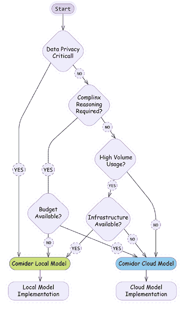
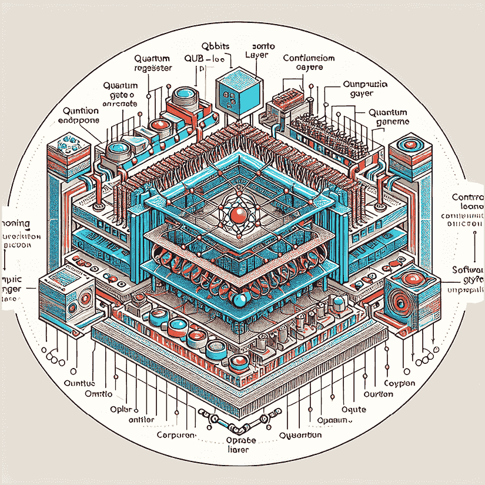

# 第三章：LangChain 的第一步

在上一章中，我们探讨了大型语言模型（LLMs）并介绍了 LangChain 作为构建 LLM 驱动的应用程序的强大框架。我们讨论了 LLMs 如何通过理解上下文、生成类似人类的文本和执行复杂推理的能力而彻底改变了自然语言处理。虽然这些功能令人印象深刻，但我们还考察了它们的局限性——幻觉、上下文限制和缺乏最新知识。

在本章中，我们将通过构建我们的第一个 LangChain 应用程序，从理论转向实践。我们将从基础开始：设置合适的发展环境，理解 LangChain 的核心组件，并创建简单的链。从那里，我们将探索更高级的功能，包括为了隐私和成本效益运行本地模型，以及构建结合文本和视觉理解的跨模态应用程序。到本章结束时，你将拥有 LangChain 构建块的良好基础，并准备好在后续章节中创建越来越复杂的 AI 应用程序。

总结来说，本章将涵盖以下主题：

+   设置依赖项

+   探索 LangChain 的构建块（模型接口、提示和模板以及 LCEL）

+   运行本地模型

+   跨模态 AI 应用程序

由于 LangChain 和更广泛的 AI 领域都在快速发展，我们在 GitHub 仓库中维护了最新的代码示例和资源：[`github.com/benman1/generative_ai_with_langchain`](https://github.com/benman1/generative_ai_with_langchain)。

如有疑问或需要故障排除帮助，请在 GitHub 上创建一个问题或加入我们的 Discord 社区：[`packt.link/lang`](https://packt.link/lang)。

# 为本书设置依赖项

本书提供了多种运行代码示例的选项，从零配置的云笔记本到本地开发环境。选择最适合你经验和偏好的方法。即使你熟悉依赖项管理，也请阅读这些说明，因为本书中的所有代码都将依赖于此处概述的正确环境安装。

如果不需要本地设置，我们为每一章提供现成的在线笔记本：

+   **Google Colab**：使用免费 GPU 访问运行示例

+   **Kaggle 笔记本**：在集成数据集上进行实验

+   **梯度笔记本**：访问高性能计算选项

你在这本书中找到的所有代码示例都可以在 GitHub 上以在线笔记本的形式找到，网址为 [`github.com/benman1/generative_ai_with_langchain`](https://github.com/benman1/generative_ai_with_langchain)。

这些笔记本没有预先配置所有依赖项，但通常只需要几个安装命令就可以开始。这些工具允许你立即开始实验，无需担心设置。如果你更喜欢在本地工作，我们建议使用 conda 进行环境管理：

1.  如果你还没有安装 Miniconda，请先安装。

1.  从[`docs.conda.io/en/latest/miniconda.html`](https://docs.conda.io/en/latest/miniconda.html)下载它。

1.  使用 Python 3.11 创建一个新的环境：

    ```py
    conda create -n langchain-book python=3.11
    ```

1.  激活环境：

    ```py
    conda activate langchain-book
    ```

1.  安装 Jupyter 和核心依赖项：

    ```py
    conda install jupyter
    pip install langchain langchain-openai jupyter
    ```

1.  启动 Jupyter Notebook：

    ```py
    jupyter notebook
    ```

这种方法为使用 LangChain 提供了一个干净、隔离的工作环境。对于有固定工作流程的资深开发者，我们还支持：

+   **pip with venv**：GitHub 仓库中的说明

+   **Docker 容器**：GitHub 仓库中提供的 Dockerfile

+   **Poetry**：GitHub 仓库中可用的配置文件

选择你最舒适的方法，但请记住，所有示例都假设有一个 Python 3.10+环境，并具有 requirements.txt 中列出的依赖项。

对于开发者来说，Docker，通过容器提供隔离，是一个不错的选择。缺点是它占用大量磁盘空间，并且比其他选项更复杂。对于数据科学家，我推荐使用 Conda 或 Poetry。

Conda 在处理复杂依赖项方面效率很高，尽管在大环境中可能会非常慢。Poetry 很好地解决依赖项并管理环境；然而，它不捕获系统依赖项。

所有工具都允许从配置文件中共享和复制依赖项。你可以在书的 GitHub 仓库[`github.com/benman1/generative_ai_with_langchain`](https://github.com/benman1/generative_ai_with_langchain)中找到一组说明和相应的配置文件。

完成后，请确保你已经安装了 LangChain 版本 0.3.17。你可以使用命令`pip show langchain`来检查。

随着 LLM 领域的创新步伐加快，库的更新很频繁。本书中的代码是用 LangChain 0.3.17 测试的，但新版本可能会引入变化。如果你在运行示例时遇到任何问题：

+   在我们的 GitHub 仓库创建一个问题

+   在[`packt.link/lang`](https://packt.link/lang)上的 Discord 加入讨论

+   在书的 Packt 页面上检查勘误表

这种社区支持确保你能够成功实施所有项目，无论库的更新如何。

## API 密钥设置

LangChain 的无提供商方法支持广泛的 LLM 提供商，每个都有其独特的优势和特点。除非你使用本地 LLM，否则要使用这些服务，你需要获得适当的认证凭据。

| **提供商** | **环境变量** | **设置 URL** | **免费层** |
| --- | --- | --- | --- |
| OpenAI | `OPENAI_API_KEY` | [platform.openai.com](https://platform.openai.com/) | 否 |
| HuggingFace | `HUGGINGFACEHUB_API_TOKEN` | [huggingface.co/settings/tokens](https://huggingface.co/settings/tokens) | 是 |
| Anthropic | `ANTHROPIC_API_KEY` | [console.anthropic.com](https://console.anthropic.com) | 否 |
| Google AI | `GOOGLE_API_KEY` | [ai.google.dev/gemini-api](https://ai.google.dev/gemini-api) | 是 |
| Google VertexAI | `应用程序默认凭证` | [cloud.google.com/vertex-ai](https://cloud.google.com/vertex-ai) | 是（有限制） |
| Replicate | `REPLICATE_API_TOKEN` | [replicate.com](https://replicate.com) | 否 |

表 2.1：API 密钥参考表（概述）

大多数提供商需要 API 密钥，而像 AWS 和 Google Cloud 这样的云提供商也支持其他身份验证方法，如 **应用程序默认凭证**（**ADC**）。许多提供商提供免费层，无需信用卡详细信息，这使得入门变得容易。

要在环境中设置 API 密钥，在 Python 中，我们可以执行以下行：

```py
import os
os.environ["OPENAI_API_KEY"] = "<your token>"
```

在这里，`OPENAI_API_KEY` 是适用于 OpenAI 的环境密钥。在您的环境中设置密钥的优点是，每次使用模型或服务集成时，无需将它们作为参数包含在您的代码中。

您也可以从终端在您的系统环境中暴露这些变量。在 Linux 和 macOS 中，您可以使用 `export` 命令从终端设置系统环境变量：

```py
export OPENAI_API_KEY=<your token>
```

要在 Linux 或 macOS 中永久设置环境变量，您需要将前面的行添加到 `~/.bashrc` 或 `~/.bash_profile` 文件中，然后使用命令 `source ~/.bashrc` 或 `source ~/.bash_profile` 重新加载 shell。

对于 Windows 用户，您可以通过在系统设置中搜索“环境变量”来设置环境变量，编辑“用户变量”或“系统变量”，并添加 `export` `OPENAI_API_KEY=your_key_here`。

我们的选择是创建一个 `config.py` 文件，其中存储所有 API 密钥。然后我们从该模块导入一个函数，将这些密钥加载到环境变量中。这种方法集中管理凭证，并在需要时更容易更新密钥：

```py
import os
OPENAI_API_KEY =  "... "
# I'm omitting all other keys
def set_environment():
    variable_dict = globals().items()
 for key, value in variable_dict:
 if "API" in key or "ID" in key:
             os.environ[key] = value
```

如果您在 GitHub 仓库中搜索此文件，您会注意到它缺失。这是故意的 - 我已经使用 `.gitignore` 文件将其排除在 Git 跟踪之外。`.gitignore` 文件告诉 Git 在提交更改时要忽略哪些文件，这对于：

1.  防止敏感凭证被公开暴露

1.  避免意外提交个人 API 密钥

1.  保护自己免受未经授权的使用费用

要自行实现此功能，只需将 `config.py` 添加到您的 `.gitignore` 文件中：

```py
# In .gitignore
config.py
.env
**/api_keys.txt
# Other sensitive files
```

您可以在 `config.py` 文件中设置所有您的密钥。此函数 `set_environment()` 将所有密钥加载到环境变量中，如前所述。任何您想要运行应用程序的时候，您都可以导入此函数并像这样运行它：

```py
from config import set_environment
set_environment()
```

对于生产环境，考虑使用专用的密钥管理服务或运行时注入的环境变量。这些方法提供了额外的安全性，同时保持了代码和凭证之间的分离。

虽然 OpenAI 的模型仍然具有影响力，但 LLM 生态系统已经迅速多元化，为开发者提供了多种应用选项。为了保持清晰，我们将 LLM 与其提供访问权限的模型网关分开。

+   **关键 LLM 家族**

    +   **Anthropic Claude**：在推理、长文本内容处理和视觉分析方面表现出色，具有高达 200K 个 token 的上下文窗口

    +   **Mistral 模型**：功能强大的开源模型，具有强大的多语言能力和卓越的推理能力

    +   **Google Gemini**：具有行业领先的 1M 个 token 上下文窗口和实时信息访问的高级多模态模型

    +   **OpenAI GPT-o**：具有领先的跨模态能力，接受文本、音频、图像和视频，并具有增强的推理能力

    +   **DeepSeek 模型**：专注于编码和技术推理，在编程任务上具有最先进的性能

    +   **AI21 Labs Jurassic**：在学术应用和长文本内容生成方面表现强劲

    +   **Inflection Pi**：针对对话 AI 优化，具有卓越的情感智能

    +   **Perplexity 模型**：专注于为研究应用提供准确、有引用的答案

    +   **Cohere 模型**：针对企业应用，具有强大的多语言能力

+   **云提供商网关**

    +   **Amazon Bedrock**：通过 AWS 集成提供 Anthropic、AI21、Cohere、Mistral 和其他模型的一站式 API 访问

    +   **Azure OpenAI 服务**：提供企业级访问 OpenAI 和其他模型，具有强大的安全性和微软生态系统集成

    +   **Google Vertex AI**：通过无缝的 Google Cloud 集成访问 Gemini 和其他模型

+   **独立平台**

    +   **Together AI**：托管 200 多个开源模型，提供无服务器和专用 GPU 选项

    +   **Replicate**：专注于部署按使用付费的多模态开源模型

    +   **HuggingFace 推理端点**：具有微调能力的数千个开源模型的量产部署

在本书中，我们将与通过不同提供商访问的各种模型一起工作，为您提供选择最适合您特定需求和基础设施要求的最佳选项的灵活性。

我们将使用 OpenAI 进行许多应用，但也会尝试来自其他组织的 LLM。请参考本书末尾的*附录*了解如何获取 OpenAI、Hugging Face、Google 和其他提供商的 API 密钥。

有两个主要的集成包：

+   `langchain-google-vertexai`

+   `langchain-google-genai`

我们将使用 LangChain 推荐的`langchain-google-genai`包，对于个人开发者来说，设置要简单得多，只需一个 Google 账户和 API 密钥。对于更大的项目，建议迁移到`langchain-google-vertexai`。此集成提供了企业功能，如客户加密密钥、虚拟私有云集成等，需要具有计费功能的 Google Cloud 账户。

如果你已经按照上一节中指示的 GitHub 上的说明操作，那么你应该已经安装了`langchain-google-genai`包。

# 探索 LangChain 的构建块

为了构建实际的应用程序，我们需要了解如何与不同的模型提供者合作。让我们探索从云服务到本地部署的各种选项。我们将从 LLM 和聊天模型等基本概念开始，然后深入到提示、链和记忆系统。

## 模型接口

LangChain 提供了一个统一的接口来处理各种 LLM 提供者。这种抽象使得在保持一致代码结构的同时轻松地在不同模型之间切换变得容易。以下示例演示了如何在实际场景中实现 LangChain 的核心组件。

请注意，用户几乎应该只使用较新的聊天模型，因为大多数模型提供者已经采用了类似聊天的界面来与语言模型交互。我们仍然提供 LLM 接口，因为它作为字符串输入、字符串输出非常容易使用。

### LLM 交互模式

LLM 接口代表传统的文本完成模型，它接受字符串输入并返回字符串输出。在 LangChain 中越来越多的用例仅使用 ChatModel 接口，主要是因为它更适合构建复杂的工作流程和开发代理。LangChain 文档现在正在弃用 LLM 接口，并推荐使用基于聊天的接口。虽然本章演示了这两个接口，但我们建议使用聊天模型，因为它们代表了 LangChain 的当前标准，以便保持最新。

让我们看看 LLM 接口的实际应用：

```py
from langchain_openai import OpenAI
from langchain_google_genai import GoogleGenerativeAI
# Initialize OpenAI model
openai_llm = OpenAI()
# Initialize a Gemini model
gemini_pro = GoogleGenerativeAI(model="gemini-1.5-pro")
```

```py
# Either one or both can be used with the same interface
response = openai_llm.invoke("Tell me a joke about light bulbs!")
print(response)
```

请注意，当你运行此程序时，你必须设置你的环境变量为提供者的密钥。例如，当运行此程序时，我会首先通过调用`set_environment()`从`config`文件开始：

```py
from config import set_environment
set_environment()
```

我们得到以下输出：

```py
Why did the light bulb go to therapy?
Because it was feeling a little dim!
```

对于 Gemini 模型，我们可以运行：

```py
response = gemini_pro.invoke("Tell me a joke about light bulbs!")
```

对于我来说，Gemini 提出了这个笑话：

```py
Why did the light bulb get a speeding ticket?
Because it was caught going over the watt limit!
```

注意我们如何无论提供者如何都使用相同的`invoke()`方法。这种一致性使得在实验不同模型或在生产中切换提供者变得容易。

### 开发测试

在开发过程中，你可能想在不实际进行 API 调用的情况下测试你的应用程序。LangChain 提供了`FakeListLLM`用于此目的：

```py
from langchain_community.llms import FakeListLLM
# Create a fake LLM that always returns the same response
fake_llm = FakeListLLM(responses=["Hello"])
result = fake_llm.invoke("Any input will return Hello")
print(result)  # Output: Hello
```

### 与聊天模型合作

聊天模型是针对模型与人类之间多轮交互进行微调的 LLM。如今，大多数 LLM 都是针对多轮对话进行微调的。而不是向模型提供输入，例如：

```py
human: turn1
ai: answer1
human: turn2
ai: answer2
```

在我们期望它通过继续对话生成输出时，这些天模型提供者通常提供一个 API，该 API 期望每个回合作为有效载荷中格式良好的独立部分。模型提供者通常不会在服务器端存储聊天历史，他们每次都从客户端接收完整的历史记录，并在服务器端仅格式化最终提示。

LangChain 与 ChatModels 采用了相同的模式，通过具有角色和内容的结构化消息处理对话。每条消息包含：

+   角色（谁在说话），由消息类（所有消息都继承自 BaseMessage）定义

+   内容（所说的内容）

消息类型包括：

+   `SystemMessage`：设置模型的行为和上下文。例如：

    ```py
    SystemMessage(content="You're a helpful programming assistant")
    ```

+   `HumanMessage`：表示用户输入，如问题、命令和数据。例如：

    ```py
    HumanMessage(content="Write a Python function to calculate factorial")
    ```

+   `AIMessage`：包含模型响应

让我们看看这个动作：

```py
from langchain_anthropic import ChatAnthropic
from langchain_core.messages import SystemMessage, HumanMessage
chat = ChatAnthropic(model="claude-3-opus-20240229")
messages = [
```

```py
    SystemMessage(content="You're a helpful programming assistant"),
    HumanMessage(content="Write a Python function to calculate factorial")
]
response = chat.invoke(messages)
print(response)
```

克劳德提出了一个函数、解释和调用函数的示例。

这里是一个计算给定数字阶乘的 Python 函数：

```py
```python

def factorial(n):

if n < 0:

raise ValueError("负数没有定义阶乘。")

elif n == 0:

return 1

else:

        result = 1

for i in range(1, n + 1):

            result *= i

return result

```py
Let's break that down. The factorial function is designed to take an integer n as input and calculate its factorial. It starts by checking if n is negative, and if so, it raises a ValueError since factorials aren't defined for negative numbers. If n is zero, the function returns 1, which makes sense because, by definition, the factorial of 0 is 1.
When dealing with positive numbers, the function kicks things off by setting a variable result to 1\. From there, it enters a loop that runs from 1 to n, inclusive, thanks to the range function. During each step of the loop, it multiplies the result by the current number, gradually building up the factorial. Once the loop completes, the function returns the final calculated value. You can call this function by providing a non-negative integer as an argument. Here are a few examples:
```python

print(factorial(0))  # 输出：1

print(factorial(5))  # 输出：120

print(factorial(10))  # 输出：3628800

print(factorial(-5))  # 抛出 ValueError：负数没有定义阶乘。

```py
```

```py
Note that the factorial function grows very quickly, so calculating the factorial of large numbers may exceed the maximum representable value in Python. In such cases, you might need to use a different approach or a library that supports arbitrary-precision arithmetic.
```

同样，我们也可以询问 OpenAI 的模型，如 GPT-4 或 GPT-4o：

```py
from langchain_openai.chat_models import ChatOpenAI
chat = ChatOpenAI(model_name='gpt-4o')
```

### 推理模型

Anthropic 的 Claude 3.7 Sonnet 引入了一种名为 *扩展思考* 的强大功能，允许模型在提供最终答案之前展示其推理过程。这一功能代表了开发者如何利用 LLMs 进行复杂推理任务的重大进步。

这是如何通过 ChatAnthropic 类配置扩展思考的：

```py
from langchain_anthropic import ChatAnthropic
from langchain_core.prompts import ChatPromptTemplate
# Create a template
template = ChatPromptTemplate.from_messages([
    ("system", "You are an experienced programmer and mathematical analyst."),
    ("user", "{problem}")
])
# Initialize Claude with extended thinking enabled
chat = ChatAnthropic(
    model_name="claude-3-7-sonnet-20240326",  # Use latest model version
    max_tokens=64_000,                        # Total response length limit
    thinking={"type": "enabled", "budget_tokens": 15000},  # Allocate tokens for thinking
)
# Create and run a chain
chain = template | chat
# Complex algorithmic problem
problem = """
```

```py
Design an algorithm to find the kth largest element in an unsorted array
with the optimal time complexity. Analyze the time and space complexity
of your solution and explain why it's optimal.
"""
# Get response with thinking included
response = chat.invoke([HumanMessage(content=problem)])
print(response.content)
```

响应将包括克劳德关于算法选择、复杂度分析和优化考虑的逐步推理，在呈现最终解决方案之前。在先前的例子中：

+   在 64,000 个令牌的最大响应长度中，最多可以使用 15,000 个令牌用于克劳德的思考过程。

+   剩余的 ~49,000 个令牌可用于最终响应。

+   克劳德并不总是使用全部的思考预算——它只使用特定任务所需的预算。如果克劳德用完了思考令牌，它将过渡到最终答案。

虽然 克劳德 提供了显式的思考配置，但你也可以通过不同的技术通过其他提供商获得类似（但不完全相同）的结果：

```py
from langchain_openai import ChatOpenAI
from langchain_core.prompts import ChatPromptTemplate
template = ChatPromptTemplate.from_messages([
    ("system", "You are a problem-solving assistant."),
    ("user", "{problem}")
])
# Initialize with reasoning_effort parameter
chat = ChatOpenAI(
    model="o3-mini","
    reasoning_effort="high"  # Options: "low", "medium", "high"
)
chain = template | chat
response = chain.invoke({"problem": "Calculate the optimal strategy for..."})
```

```py
chat = ChatOpenAI(model="gpt-4o")
chain = template | chat
response = chain.invoke({"problem": "Calculate the optimal strategy for..."})
```

`reasoning_effort` 参数通过消除对复杂推理提示的需求，允许你在速度比详细分析更重要时通过减少努力来调整性能，并有助于通过控制推理过程所需的处理能力来管理令牌消耗。

DeepSeek 模型还通过 LangChain 集成提供显式的思考配置。

### 控制模型行为

理解如何控制大型语言模型（LLM）的行为对于调整其输出以满足特定需求至关重要。如果没有仔细调整参数，模型可能会产生过于创意、不一致或冗长的响应，这些响应不适合实际应用。例如，在客户服务中，你希望得到一致、事实性的答案，而在内容生成中，你可能希望得到更多创意和促销的输出。

LLMs 提供了一些参数，允许对生成行为进行精细控制，尽管具体的实现可能因提供商而异。让我们探讨其中最重要的几个：

| **参数** | **描述** | **典型范围** | **最佳用途** |
| --- | --- | --- | --- |
| **温度** | 控制文本生成的随机性 | 0.0-1.0（OpenAI，Anthropic）0.0-2.0（Gemini） | 较低（0.0-0.3）：事实性任务，问答 | 较高（0.7+）：创意写作，头脑风暴 |
| **Top-k** | 限制标记选择为 k 个最可能的标记 | 1-100 | 较低值（1-10）：更聚焦的输出 | 较高值：更多样化的完成 |
| **Top-p（核采样）** | 考虑标记直到累积概率达到阈值 | 0.0-1.0 | 较低值（0.5）：更聚焦的输出 | 较高值（0.9）：更具探索性的响应 |

|

**最大标记数**

| 限制最大响应长度 | 模型特定 | 控制成本和防止冗长输出 |
| --- | --- | --- |
| **存在/频率惩罚** | 通过惩罚已出现的标记来阻止重复 | -2.0 到 2.0 | 长内容生成，其中重复是不希望的 |
| **停止序列** | 告诉模型何时停止生成 | 自定义字符串 | 控制生成的确切结束点 |

表 2.2：LLM 提供的参数

这些参数共同塑造模型输出：

+   **温度 + Top-k/Top-p**：首先，Top-k/Top-p 过滤标记分布，然后温度影响过滤集内的随机性。

+   **惩罚 + 温度**：较高的温度和较低的惩罚可以产生创意但可能重复的文本。

LangChain 为在不同 LLM 提供商之间设置这些参数提供了一个一致的接口：

```py
from langchain_openai import OpenAI
# For factual, consistent responses
factual_llm = OpenAI(temperature=0.1, max_tokens=256)
# For creative brainstorming
creative_llm = OpenAI(temperature=0.8, top_p=0.95, max_tokens=512)
```

一些建议的特定提供商考虑因素：

+   **OpenAI**：以在 0.0-1.0 范围内温度的一致行为而闻名

+   **Anthropic**：可能需要较低的温度设置才能达到与其他提供商相似的创意水平。

+   **Gemini**：支持高达 2.0 的温度，允许在较高设置下实现更极端的创意

+   **开源模型**：通常需要与商业 API 不同的参数组合。

### 为应用选择参数

对于需要一致性和准确性的企业应用，通常更倾向于使用较低的温度（0.0-0.3）和适中的 top-p 值（0.5-0.7）。对于创意助手或头脑风暴工具，较高的温度会产生更多样化的输出，尤其是在搭配较高的 top-p 值时。

记住参数调整通常是经验性的——从提供商的建议开始，然后根据您的具体应用程序需求和观察到的输出进行调整。

## 提示和模板

提示工程是 LLM 应用程序开发的关键技能，尤其是在生产环境中。LangChain 提供了一个强大的系统来管理提示，其功能解决了常见的开发挑战：

+   **模板系统**以动态生成提示

+   **提示管理和版本控制**以跟踪更改

+   **少量示例管理**以提高模型性能

+   **输出解析和验证**以获得可靠的结果

LangChain 的提示模板将静态文本转换为具有变量替换的动态提示——比较这两种方法以查看关键差异：

1.  静态使用——在规模上存在问题：

    ```py
     def generate_prompt(question, context=None):
     if context:
     return f"Context information: {context}\n\nAnswer this question concisely: {question}"
     return f"Answer this question concisely: {question}"
     # example use:
          prompt_text = generate_prompt("What is the capital of France?")
    ```

1.  PromptTemplate – 生产就绪：

    ```py
    from langchain_core.prompts import PromptTemplate
    # Define once, reuse everywhere
    question_template = PromptTemplate.from_template( "Answer this question concisely: {question}" )
    question_with_context_template = PromptTemplate.from_template( "Context information: {context}\n\nAnswer this question concisely: {question}" )
    # Generate prompts by filling in variables
    prompt_text = question_template.format(question="What is the capital of France?")
    ```

模板很重要——原因如下：

+   **一致性**：它们在您的应用程序中标准化提示。

+   **可维护性**：它们允许您在一个地方更改提示结构，而不是在整个代码库中。

+   **可读性**：它们清楚地分离了模板逻辑和业务逻辑。

+   **可测试性**：单独对提示生成进行单元测试比从 LLM 调用中分离出来更容易。

在生产应用程序中，您通常会需要管理数十或数百个提示。模板提供了一种可扩展的方式来组织这种复杂性。

### 聊天提示模板

对于聊天模型，我们可以创建更多结构化的提示，这些提示融合了不同的角色：

```py
from langchain_core.prompts import ChatPromptTemplate
from langchain_openai import ChatOpenAI
template = ChatPromptTemplate.from_messages([
    ("system", "You are an English to French translator."),
    ("user", "Translate this to French: {text}")
])
chat = ChatOpenAI()
formatted_messages = template.format_messages(text="Hello, how are you?")
response = chat.invoke(formatted_messages)
print(response)
```

让我们从**LangChain 表达式语言**（**LCEL**）开始，它提供了一种干净、直观的方式来构建 LLM 应用程序。

## LangChain 表达式语言 (LCEL)

LCEL 代表了我们构建使用 LangChain 的 LLM 应用程序方式的重大进步。于 2023 年 8 月推出，LCEL 是构建复杂 LLM 工作流的一种声明式方法。LCEL 不关注*如何*执行每个步骤，而是让您定义*想要完成什么*，从而允许 LangChain 在幕后处理执行细节。

在其核心，LCEL 作为一个极简代码层，使得连接不同的 LangChain 组件变得非常容易。如果您熟悉 Unix 管道或 pandas 等数据处理库，您会认识到直观的语法：组件通过管道运算符（|）连接以创建处理管道。

如我们在*第一章*中简要介绍的，LangChain 一直使用“链”的概念作为其连接组件的基本模式。链代表将输入转换为输出的操作序列。

最初，LangChain 通过特定的 `Chain` 类如 `LLMChain` 和 `ConversationChain` 实现了此模式。虽然这些遗留类仍然存在，但它们已被弃用，转而采用更灵活、更强大的 LCEL 方法，该方法建立在可运行接口之上。

Runnable 接口是现代 LangChain 的基石。Runnable 是指任何可以以标准化的方式处理输入并产生输出的组件。每个使用 LCEL 构建的组件都遵循此接口，它提供了一致的方法，包括：

+   `invoke()`: 同步处理单个输入并返回输出

+   `stream()`: 以生成时的形式输出流

+   `batch()`: 高效并行处理多个输入

+   `ainvoke()`、`abatch()`、`astream()`：上述方法的异步版本

这种标准化意味着任何 Runnable 组件——无论是 LLM、提示模板、文档检索器还是自定义函数——都可以连接到任何其他 Runnable，从而创建一个强大的可组合性系统。

每个 Runnable 实现了一组一致的方法，包括：

+   `invoke()`: 同步处理单个输入并返回输出

+   `stream()`: 以生成时的形式输出流

这种标准化非常强大，因为它意味着任何 Runnable 组件——无论是 LLM、提示模板、文档检索器还是自定义函数——都可以连接到任何其他 Runnable。此接口的一致性使得可以从更简单的构建块构建复杂的应用程序。

LCEL 提供了几个优势，使其成为构建 LangChain 应用程序的首选方法：

+   **快速开发**：声明性语法使得快速原型设计和复杂链的迭代变得更快。

+   **生产就绪功能**：LCEL 提供了对流、异步执行和并行处理的内置支持。

+   **可读性提高**：管道语法使得可视化数据流通过你的应用程序变得容易。

+   **无缝生态系统集成**：使用 LCEL 构建的应用程序可以自动与 LangSmith 进行监控和 LangServe 进行部署。

+   **可定制性**：使用 RunnableLambda 轻松将自定义 Python 函数集成到你的链中。

+   **运行时优化**：LangChain 可以自动优化 LCEL 定义的链的执行。

当需要构建复杂的应用程序，这些应用程序结合了多个组件在复杂的流程中时，LCEL 真正大放异彩。在接下来的章节中，我们将探讨如何使用 LCEL 构建实际的应用程序，从基本的构建块开始，并逐步引入更高级的模式。

管道操作符（|）是 LCEL 的基石，允许你按顺序连接组件：

```py
# 1\. Basic sequential chain: Just prompt to LLM
basic_chain = prompt | llm | StrOutputParser()
```

在这里，`StrOutputParser()`是一个简单的输出解析器，它从 LLM 中提取字符串响应。它将 LLM 的结构化输出转换为普通字符串，使其更容易处理。这个解析器在只需要文本内容而不需要元数据时特别有用。

在底层，LCEL 使用 Python 的操作符重载将这个表达式转换成一个 RunnableSequence，其中每个组件的输出流向下一个组件的输入。管道（|）是语法糖，它覆盖了`__or__`隐藏方法，换句话说，`A | B`等价于`B.__or__(A)`。

管道语法等价于程序性地创建一个`RunnableSequence`：

```py
chain = RunnableSequence(first= prompt, middle=[llm], last= output_parser)
LCEL also supports adding transformations and custom functions:
with_transformation = prompt | llm | (lambda x: x.upper()) | StrOutputParser()
```

对于更复杂的工作流程，你可以结合分支逻辑：

```py
decision_chain = prompt | llm | (lambda x: route_based_on_content(x)) | {
 "summarize": summarize_chain,
 "analyze": analyze_chain
}
```

非 Runnable 元素，如函数和字典，会自动转换为适当的 Runnable 类型：

```py
# Function to Runnable
length_func = lambda x: len(x)
chain = prompt | length_func | output_parser
# Is converted to:
chain = prompt | RunnableLambda(length_func) | output_parser
```

LCEL 的灵活和可组合特性将使我们能够用优雅、可维护的代码解决实际的 LLM 应用挑战。

### 使用 LCEL 的简单工作流程

正如我们所见，LCEL 提供了一个声明性语法，用于使用管道操作符组合 LLM 应用程序组件。与传统的命令式代码相比，这种方法大大简化了工作流程构建。让我们构建一个简单的笑话生成器来查看 LCEL 的实际应用：

```py
from langchain_core.prompts import PromptTemplate
from langchain_core.output_parsers import StrOutputParser
from langchain_openai import ChatOpenAI
# Create components
prompt = PromptTemplate.from_template("Tell me a joke about {topic}")
llm = ChatOpenAI()
output_parser = StrOutputParser()
```

```py
# Chain them together using LCEL
chain = prompt | llm | output_parser
#  Execute the workflow with a single call
result = chain.invoke({"topic": "programming"})
print(result)
```

这产生了一个编程笑话：

```py
Why don't programmers like nature?
It has too many bugs!
```

没有 LCEL，相同的流程等同于单独的函数调用，并手动传递数据：

```py
formatted_prompt = prompt.invoke({"topic": "programming"})
llm_output = llm.invoke(formatted_prompt)
result = output_parser.invoke(llm_output)
```

如你所见，我们已经将链式构建与其执行分离。

在生产应用中，当处理具有分支逻辑、错误处理或并行处理的复杂工作流程时，这种模式变得更加有价值——这些内容我们将在*第三章*中探讨。

### 复杂链示例

虽然简单的笑话生成器展示了基本的 LCEL 使用，但现实世界的应用通常需要更复杂的数据处理。让我们通过一个故事生成和分析示例来探索高级模式。

在这个例子中，我们将构建一个多阶段工作流程，展示如何：

1.  使用一次 LLM 调用生成内容

1.  将该内容输入到第二次 LLM 调用

1.  在整个链中保留和转换数据

```py
from langchain_core.prompts import PromptTemplate
from langchain_google_genai import GoogleGenerativeAI
from langchain_core.output_parsers import StrOutputParser
# Initialize the model
llm = GoogleGenerativeAI(model="gemini-1.5-pro")
```

```py
# First chain generates a story
story_prompt = PromptTemplate.from_template("Write a short story about {topic}")
story_chain = story_prompt | llm | StrOutputParser()
# Second chain analyzes the story
analysis_prompt = PromptTemplate.from_template(
 "Analyze the following story's mood:\n{story}"
)
analysis_chain = analysis_prompt | llm | StrOutputParser()
```

我们可以将这两个链组合在一起。我们的第一个简单方法直接将故事管道输入到分析链中：

```py
# Combine chains
story_with_analysis = story_chain | analysis_chain
# Run the combined chain
story_analysis = story_with_analysis.invoke({"topic": "a rainy day"})
print("\nAnalysis:", story_analysis)
```

我得到了一个长的分析。这是它的开始：

```py
Analysis: The mood of the story is predominantly **calm, peaceful, and subtly romantic.** There's a sense of gentle melancholy brought on by the rain and the quiet emptiness of the bookshop, but this is balanced by a feeling of warmth and hope.
```

虽然这可行，但我们已经失去了结果中的原始故事——我们只得到了分析！在生产应用中，我们通常希望在整个链中保留上下文：

```py
from langchain_core.runnables import RunnablePassthrough
# Using RunnablePassthrough.assign to preserve data
enhanced_chain = RunnablePassthrough.assign(
    story=story_chain  # Add 'story' key with generated content
).assign(
    analysis=analysis_chain  # Add 'analysis' key with analysis of the story
)
# Execute the chain
```

```py
result = enhanced_chain.invoke({"topic": "a rainy day"})
print(result.keys())  # Output: dict_keys(['topic', 'story', 'analysis'])  # dict_keys(['topic', 'story', 'analysis'])
```

为了对输出结构有更多控制，我们也可以手动构建字典：

```py
from operator import itemgetter
# Alternative approach using dictionary construction
manual_chain = (
    RunnablePassthrough() |  # Pass through input
    {
 "story": story_chain,  # Add story result
 "topic": itemgetter("topic")  # Preserve original topic
    } |
    RunnablePassthrough().assign(  # Add analysis based on story
        analysis=analysis_chain
    )
)
result = manual_chain.invoke({"topic": "a rainy day"})
print(result.keys())  # Output: dict_keys(['story', 'topic', 'analysis'])
```

我们可以使用 LCEL 缩写进行字典转换来简化这个过程：

```py
# Simplified dictionary construction
simple_dict_chain = story_chain | {"analysis": analysis_chain}
result = simple_dict_chain.invoke({"topic": "a rainy day"}) print(result.keys()) # Output: dict_keys(['analysis', 'output'])
```

这些例子比我们的简单笑话生成器更复杂的是什么？

+   **多次 LLM 调用**：而不是单一的提示！[](img/Icon.png)LLM！[](img/Icon.png)解析流程，我们正在链式多个 LLM 交互

+   **数据转换**：使用`RunnablePassthrough`和`itemgetter`等工具来管理和转换数据

+   **字典保留**：在整个链中维护上下文，而不仅仅是传递单个值

+   **结构化输出**：创建结构化输出字典而不是简单的字符串

这些模式对于需要在生产应用中进行以下操作的情况至关重要：

+   跟踪生成内容的来源

+   结合多个操作的结果

+   结构化数据以进行下游处理或显示

+   实现更复杂的错误处理

虽然 LCEL 以优雅的方式处理许多复杂的工作流程，但对于状态管理和高级分支逻辑，您可能希望探索 LangGraph，我们将在 *第三章* 中介绍。

虽然我们之前的示例使用了基于云的模型，如 OpenAI 和 Google 的 Gemini，但 LangChain 的 LCEL 和其他功能也与本地模型无缝协作。这种灵活性允许您根据特定需求选择正确的部署方法。

# 运行本地模型

当使用 LangChain 构建 LLM 应用时，您需要决定模型将运行在哪里。

+   本地模型的优点：

    +   完全的数据控制和隐私

    +   无 API 成本或使用限制

    +   无网络依赖

    +   控制模型参数和微调

+   云模型的优点：

    +   无硬件要求或设置复杂性

    +   访问最强大、最前沿的模型

    +   无需基础设施管理即可弹性扩展

    +   无需手动更新即可持续改进模型

+   选择本地模型的时候：

    +   对数据隐私要求严格的应用

    +   开发和测试环境

    +   边缘或离线部署场景

    +   对成本敏感的应用，具有可预测的高容量使用

让我们从最符合开发者友好的本地模型运行选项之一开始。

## 开始使用 Ollama

Ollama 提供了一种开发者友好的方式来本地运行强大的开源模型。它提供了一个简单的界面来下载和运行各种开源模型。如果您已遵循本章中的说明，`langchain-ollama` 依赖项应该已经安装；然而，我们仍然简要地介绍一下：

1.  安装 LangChain Ollama 集成：

    ```py
    pip install langchain-ollama
    ```

1.  然后拉取一个模型。从命令行，例如 bash 或 WindowsPowerShell 终端，运行：

    ```py
    ollama pull deepseek-r1:1.5b
    ```

1.  启动 Ollama 服务器：

    ```py
    ollama serve
    ```

这是如何将 Ollama 与我们探索的 LCEL 模式集成的：

```py
from langchain_ollama import ChatOllama
from langchain_core.prompts import PromptTemplate
from langchain_core.output_parsers import StrOutputParser
# Initialize Ollama with your chosen model
local_llm = ChatOllama(
    model="deepseek-r1:1.5b",
    temperature=0,
)
# Create an LCEL chain using the local model
prompt = PromptTemplate.from_template("Explain {concept} in simple terms")
local_chain = prompt | local_llm | StrOutputParser()
# Use the chain with your local model
result = local_chain.invoke({"concept": "quantum computing"})
print(result)
```

这个 LCEL 链与我们的云模型示例功能相同，展示了 LangChain 的模型无关设计。

请注意，由于您正在运行本地模型，您不需要设置任何密钥。答案非常长——尽管相当合理。您可以自己运行并查看您会得到什么答案。

现在我们已经看到了基本的文本生成，让我们看看另一个集成。Hugging Face 提供了一种易于使用的方法来本地运行模型，并可以访问庞大的预训练模型生态系统。

## 在本地使用 Hugging Face 模型

使用 Hugging Face，您可以选择在本地（HuggingFacePipeline）或 Hugging Face Hub（HuggingFaceEndpoint）上运行模型。在这里，我们讨论的是本地运行，因此我们将重点关注 `HuggingFacePipeline`。让我们开始吧：

```py
from langchain_core.messages import SystemMessage, HumanMessage
from langchain_huggingface import ChatHuggingFace, HuggingFacePipeline
# Create a pipeline with a small model:
llm = HuggingFacePipeline.from_model_id(
    model_id="TinyLlama/TinyLlama-1.1B-Chat-v1.0",
    task="text-generation",
    pipeline_kwargs=dict(
        max_new_tokens=512,
        do_sample=False,
        repetition_penalty=1.03,
    ),
)
chat_model = ChatHuggingFace(llm=llm)
# Use it like any other LangChain LLM
messages = [
    SystemMessage(content="You're a helpful assistant"),
    HumanMessage(
        content="Explain the concept of machine learning in simple terms"
    ),
]
ai_msg = chat_model.invoke(messages)
print(ai_msg.content)
```

这可能需要相当长的时间，尤其是第一次，因为模型需要先下载。为了简洁，我们省略了模型响应。

LangChain 还支持通过其他集成在本地运行模型，例如：

+   **llama.cpp**：这个高性能的 C++实现允许在消费级硬件上高效运行基于 LLaMA 的模型。虽然我们不会详细介绍设置过程，但 LangChain 提供了与 llama.cpp 的简单集成，用于推理和微调。

+   **GPT4All**：GPT4All 提供轻量级模型，可以在消费级硬件上运行。LangChain 的集成使得在许多应用程序中将这些模型作为云 LLM 的即插即用替代变得容易。

当你开始使用本地模型时，你会想要优化它们的性能并处理常见的挑战。以下是一些基本的技巧和模式，这些将帮助你从 LangChain 的本地部署中获得最大收益。

## 本地模型的技巧

当使用本地模型时，请记住以下要点：

1.  **资源管理**：本地模型需要仔细配置以平衡性能和资源使用。以下示例演示了如何配置 Ollama 模型以实现高效操作：

    ```py
    #  Configure model with optimized memory and processing settings
    from langchain_ollama import ChatOllama
    llm = ChatOllama(
      model="mistral:q4_K_M", # 4-bit quantized model (smaller memory footprint)
      num_gpu=1, # Number of GPUs to utilize (adjust based on hardware)
     num_thread=4 # Number of CPU threads for parallel processing
    )
    ```

让我们看看每个参数的作用：

+   **model="mistral:q4_K_M"**：指定 Mistral 模型的 4 位量化版本。量化通过使用更少的位来表示权重，以最小的精度换取显著的内存节省。例如：

    +   完整精度模型：需要约 8GB RAM

    +   4 位量化模型：需要约 2GB RAM

+   **num_gpu=1**：分配 GPU 资源。选项包括：

    +   0：仅 CPU 模式（较慢但无需 GPU 即可工作）

    +   1: 使用单个 GPU（适用于大多数桌面配置）

    +   较高值：仅适用于多 GPU 系统

+   **num_thread=4**：控制 CPU 并行化：

    +   较低值（2-4）：适合与其他应用程序一起运行

    +   较高值（8-16）：在专用服务器上最大化性能

    +   最佳设置：通常与 CPU 的物理核心数相匹配

1.  **错误处理**：本地模型可能会遇到各种错误，从内存不足到意外的终止。一个健壮的错误处理策略是必不可少的：

```py
def safe_model_call(llm, prompt, max_retries=2):
 """Safely call a local model with retry logic and graceful
    failure"""
    retries = 0
 while retries <= max_retries:
 try:
 return llm.invoke(prompt)
 except RuntimeError as e:
 # Common error with local models when running out of VRAM
 if "CUDA out of memory" in str(e):
 print(f"GPU memory error, waiting and retrying ({retries+1}/{max_retries+1})")
                time.sleep(2)  # Give system time to free resources
                retries += 1
 else:
 print(f"Runtime error: {e}")
 return "An error occurred while processing your request."
 except Exception as e:
 print(f"Unexpected error calling model: {e}")
 return "An error occurred while processing your request."
 # If we exhausted retries
 return "Model is currently experiencing high load. Please try again later."
# Use the safety wrapper in your LCEL chain
from langchain_core.prompts import PromptTemplate
```

```py
from langchain_core.runnables import RunnableLambda
prompt = PromptTemplate.from_template("Explain {concept} in simple terms")
safe_llm = RunnableLambda(lambda x: safe_model_call(llm, x))
safe_chain = prompt | safe_llm
response = safe_chain.invoke({"concept": "quantum computing"})
```

你可能会遇到以下常见的本地模型错误：

+   **内存不足**：当模型需要的 VRAM 超过可用量时发生

+   **模型加载失败**：当模型文件损坏或不兼容时

+   **超时问题**：在资源受限的系统上推理时间过长

+   **上下文长度错误**：当输入超过模型的最大令牌限制时

通过实施这些优化和错误处理策略，你可以创建健壮的 LangChain 应用程序，有效地利用本地模型，即使在出现问题时也能保持良好的用户体验。



图 2.1：选择本地和基于云模型的决策图

在探讨了如何使用 LangChain 构建基于文本的应用程序之后，我们现在将扩展我们对多模态功能的理解。随着人工智能系统越来越多地与多种形式的数据一起工作，LangChain 提供了生成图像和理解视觉内容的接口——这些功能补充了我们已经涵盖的文本处理，并为更沉浸式的应用程序开辟了新的可能性。

# 多模态人工智能应用

人工智能系统已经超越了仅处理文本的阶段，开始处理多种数据类型。在当前环境中，我们可以区分两种关键能力，这两种能力经常被混淆，但代表了不同的技术方法。

多模态理解代表了模型能够同时处理多种类型的输入以进行推理和生成响应的能力。这些先进系统可以理解不同模态之间的关系，接受输入如文本、图像、PDF、音频、视频和结构化数据。它们的处理能力包括跨模态推理、情境感知和复杂的信息提取。Gemini 2.5、GPT-4V、Sonnet 3.7 和 Llama 4 等模型体现了这种能力。例如，一个多模态模型可以分析图表图像和文本问题，以提供关于数据趋势的见解，在单个处理流程中将视觉和文本理解结合起来。

相比之下，内容生成能力专注于创建特定类型的媒体，通常具有非凡的质量但更专业的功能。文本到图像模型从描述中创建视觉内容，文本到视频系统从提示中生成视频片段，文本到音频工具生成音乐或语音，图像到图像模型转换现有的视觉内容。例如，Midjourney、DALL-E 和 Stable Diffusion 用于图像；Sora 和 Pika 用于视频；Suno 和 ElevenLabs 用于音频。与真正的多模态模型不同，许多生成系统针对其特定的输出模态进行了专门化，即使它们可以接受多种输入类型。它们在创作方面表现出色，而不是在理解方面。

随着大型语言模型（LLMs）的发展超越文本，LangChain 正在扩展以支持多模态理解和内容生成工作流程。该框架为开发者提供了工具，使他们能够将高级功能集成到应用程序中，而无需从头开始实现复杂的集成。让我们从根据文本描述生成图像开始。LangChain 提供了多种通过外部集成和包装器实现图像生成的方法。我们将探索多种实现模式，从最简单的开始，逐步过渡到更复杂的技巧，这些技巧可以集成到您的应用程序中。

## 文本到图像

LangChain 与各种图像生成模型和服务集成，允许您：

+   从文本描述生成图像

+   根据文本提示编辑现有图像

+   控制图像生成参数

+   处理图像变化和风格

LangChain 包括对流行的图像生成服务的包装和模型。首先，让我们看看如何使用 OpenAI 的 DALL-E 模型系列生成图像。

### 通过 OpenAI 使用 DALL-E

LangChain 为 DALL-E 提供的包装简化了从文本提示生成图像的过程。该实现底层使用 OpenAI 的 API，但提供了一个与其他 LangChain 组件一致的标准化接口。

```py
from langchain_community.utilities.dalle_image_generator import DallEAPIWrapper
dalle = DallEAPIWrapper(
   model_name="dall-e-3",  # Options: "dall-e-2" (default) or "dall-e-3"
   size="1024x1024",       # Image dimensions
    quality="standard",     # "standard" or "hd" for DALL-E 3
    n=1 # Number of images to generate (only for DALL-E 2)
)
# Generate an image
image_url = dalle.run("A detailed technical diagram of a quantum computer")
# Display the image in a notebook
from IPython.display import Image, display
display(Image(url=image_url))
# Or save it locally
import requests
response = requests.get(image_url)
```

```py
with open("generated_library.png", "wb") as f:
    f.write(response.content)
```

这是我们的图像：



图 2.2：由 OpenAI 的 DALL-E 图像生成器生成的图像

你可能会注意到，在这些图像中的文本生成不是这些模型的优势之一。你可以在 Replicate 上找到许多图像生成模型，包括最新的 Stable Diffusion 模型，因此我们现在将使用这些模型。

### 使用 Stable Diffusion

Stable Diffusion 3.5 Large 是 Stability AI 在 2024 年 3 月发布的最新文本到图像模型。它是一个 **多模态扩散变换器**（**MMDiT**），能够生成具有显著细节和质量的超高分辨率图像。

此模型使用三个固定的、预训练的文本编码器，并实现了查询-键归一化以改善训练稳定性。它能够从相同的提示生成多样化的输出，并支持各种艺术风格。

```py
from langchain_community.llms import Replicate
# Initialize the text-to-image model with Stable Diffusion 3.5 Large
text2image = Replicate(
    model="stability-ai/stable-diffusion-3.5-large",
    model_kwargs={
 "prompt_strength": 0.85,
 "cfg": 4.5,
 "steps": 40,
 "aspect_ratio": "1:1",
 "output_format": "webp",
 "output_quality": 90
    }
)
# Generate an image
image_url = text2image.invoke(
 "A detailed technical diagram of an AI agent"
)
```

新模型推荐参数包括：

+   **prompt_strength**：控制图像与提示的匹配程度（0.85）

+   **cfg**：控制模型遵循提示的严格程度（4.5）

+   **steps**：更多步骤会产生更高质量的图像（40）

+   **aspect_ratio**：设置为 1:1 以获得方形图像

+   **output_format**：使用 WebP 以获得更好的质量与尺寸比

+   **output_quality**：设置为 90 以获得高质量输出

这是我们的图像：


图 2.3：由 Stable Diffusion 生成的图像

现在让我们探索如何使用多模态模型分析和理解图像。

## 图像理解

图像理解指的是人工智能系统以类似于人类视觉感知的方式解释和分析视觉信息的能力。与传统的计算机视觉（专注于特定任务，如目标检测或人脸识别）不同，现代多模态模型可以对图像进行一般推理，理解上下文、关系，甚至视觉内容中的隐含意义。

Gemini 2.5 Pro 和 GPT-4 Vision 等模型可以分析图像并提供详细的描述或回答有关它们的问题。

### 使用 Gemini 1.5 Pro

LangChain 通过相同的 `ChatModel` 接口处理多模态输入。它接受 `Messages` 作为输入，一个 `Message` 对象有一个 `content` 字段。IA `content` 可以由多个部分组成，每个部分可以代表不同的模态（这允许你在提示中混合不同的模态）。

你可以通过值或引用发送多模态输入。要按值发送，你应该将字节编码为字符串，并构建一个格式如下所示的`image_url`变量，使用我们使用 Stable Diffusion 生成的图像：

```py
import base64
from langchain_google_genai.chat_models import ChatGoogleGenerativeAI
from langchain_core.messages.human import HumanMessage
with open("stable-diffusion.png", 'rb') as image_file:
    image_bytes = image_file.read()
    base64_bytes = base64.b64encode(image_bytes).decode("utf-8")
prompt = [
   {"type": "text", "text": "Describe the image: "},
   {"type": "image_url", "image_url": {"url": f"data:image/jpeg;base64,{base64_bytes}"}},
]
llm = ChatGoogleGenerativeAI(
    model="gemini-1.5-pro",
    temperature=0,
)
response = llm.invoke([HumanMessage(content=prompt)])
print(response.content)
The image presents a futuristic, stylized depiction of a humanoid robot's upper body against a backdrop of glowing blue digital displays. The robot's head is rounded and predominantly white, with sections of dark, possibly metallic, material around the face and ears.  The face itself features glowing orange eyes and a smooth, minimalist design, lacking a nose or mouth in the traditional human sense.  Small, bright dots, possibly LEDs or sensors, are scattered across the head and body, suggesting advanced technology and intricate construction.
The robot's neck and shoulders are visible, revealing a complex internal structure of dark, interconnected parts, possibly wires or cables, which contrast with the white exterior. The shoulders and upper chest are also white, with similar glowing dots and hints of the internal mechanisms showing through. The overall impression is of a sleek, sophisticated machine.
```

```py
The background is a grid of various digital interfaces, displaying graphs, charts, and other abstract data visualizations. These elements are all in shades of blue, creating a cool, technological ambiance that complements the robot's appearance. The displays vary in size and complexity, adding to the sense of a sophisticated control panel or monitoring system. The combination of the robot and the background suggests a theme of advanced robotics, artificial intelligence, or data analysis.
```

由于多模态输入通常具有很大的体积，将原始字节作为请求的一部分发送可能不是最佳选择。你可以通过指向 blob 存储来按引用发送它，但具体的存储类型取决于模型的提供者。例如，Gemini 接受多媒体输入作为对 Google Cloud Storage 的引用——这是由 Google Cloud 提供的一个 blob 存储服务。

```py
prompt = [
   {"type": "text", "text": "Describe the video in a few sentences."},
   {"type": "media", "file_uri": video_uri, "mime_type": "video/mp4"},
]
response = llm.invoke([HumanMessage(content=prompt)])
print(response.content)
```

如何构建多模态输入的详细说明可能取决于 LLM 的提供者（以及相应的 LangChain 集成相应地处理`content`字段的一部分的字典）。例如，Gemini 接受一个额外的`"video_metadata"`键，可以指向要分析的视频片段的开始和/或结束偏移量：

```py
offset_hint = {
 "start_offset": {"seconds": 10},
 "end_offset": {"seconds": 20},
       }
prompt = [
   {"type": "text", "text": "Describe the video in a few sentences."},
   {"type": "media", "file_uri": video_uri, "mime_type": "video/mp4", "video_metadata": offset_hint},
]
response = llm.invoke([HumanMessage(content=prompt)])
print(response.content)
```

当然，这样的多模态部分也可以进行模板化。让我们用一个简单的模板来演示，该模板期望一个包含编码字节的`image_bytes_str`参数：

```py
prompt = ChatPromptTemplate.from_messages(
   [("user",
    [{"type": "image_url",
 "image_url": {"url": "data:image/jpeg;base64,{image_bytes_str}"},
      }])]
)
prompt.invoke({"image_bytes_str": "test-url"})
```

### 使用 GPT-4 Vision

在探索了图像生成之后，让我们看看 LangChain 如何使用多模态模型处理图像理解。GPT-4 Vision 功能（在 GPT-4o 和 GPT-4o-mini 等模型中可用）使我们能够在文本旁边分析图像，使能够“看到”并对视觉内容进行推理的应用成为可能。

LangChain 通过提供多模态输入的一致接口简化了与这些模型的工作。让我们实现一个灵活的图像分析器：

```py
from langchain_core.messages import HumanMessage
from langchain_openai import ChatOpenAI
def analyze_image(image_url: str, question: str) -> str:
    chat = ChatOpenAI(model="gpt-4o-mini", max_tokens=256)

    message = HumanMessage(
        content=[
            {
 "type": "text",
 "text": question
            },
            {
 "type": "image_url",
 "image_url": {
 "url": image_url,
 "detail": "auto"
                }
            }
```

```py
        ]
    )

    response = chat.invoke([message])
 return response.content
# Example usage
image_url = "https://replicate.delivery/yhqm/pMrKGpyPDip0LRciwSzrSOKb5ukcyXCyft0IBElxsT7fMrLUA/out-0.png"
questions = [
 "What objects do you see in this image?",
 "What is the overall mood or atmosphere?",
 "Are there any people in the image?"
]
for question in questions:
 print(f"\nQ: {question}")
 print(f"A: {analyze_image(image_url, question)}")
```

该模型为我们生成的城市景观提供了丰富、详细的分析：

```py
Q: What objects do you see in this image?
A: The image features a futuristic cityscape with tall, sleek skyscrapers. The buildings appear to have a glowing or neon effect, suggesting a high-tech environment. There is a large, bright sun or light source in the sky, adding to the vibrant atmosphere. A road or pathway is visible in the foreground, leading toward the city, possibly with light streaks indicating motion or speed. Overall, the scene conveys a dynamic, otherworldly urban landscape.
Q: What is the overall mood or atmosphere?
A: The overall mood or atmosphere of the scene is futuristic and vibrant. The glowing outlines of the skyscrapers and the bright sunset create a sense of energy and possibility. The combination of deep colors and light adds a dramatic yet hopeful tone, suggesting a dynamic and evolving urban environment.
Q: Are there any people in the image?
A: There are no people in the image. It appears to be a futuristic cityscape with tall buildings and a sunset.
```

这种能力为 LangChain 应用开辟了众多可能性。通过将图像分析与我们在本章早期探索的文本处理模式相结合，你可以构建跨模态推理的复杂应用。在下一章中，我们将在此基础上创建更复杂的多模态应用。

# 摘要

在设置我们的开发环境并配置必要的 API 密钥后，我们已经探索了 LangChain 开发的基础，从基本链到多模态功能。我们看到了 LCEL 如何简化复杂的工作流程，以及 LangChain 如何与文本和图像处理集成。这些构建块为我们下一章中更高级的应用做好了准备。

在下一章中，我们将扩展这些概念，以创建具有增强控制流、结构化输出和高级提示技术的更复杂的多模态应用。你将学习如何将多种模态结合到复杂的链中，整合更复杂的错误处理，并构建充分利用现代 LLM 全部潜力的应用。

# 复习问题

1.  LangChain 解决了原始 LLM 的哪三个主要限制？

    +   内存限制

    +   工具集成

    +   上下文约束

    +   处理速度

    +   成本优化

1.  以下哪项最能描述 LCEL (LangChain 表达语言) 的目的？

    +   LLM 的编程语言

    +   组成 LangChain 组件的统一接口

    +   提示模板系统

    +   LLMs 的测试框架

1.  列出 LangChain 中可用的三种内存系统类型

1.  比较 LangChain 中的 LLMs 和聊天模型，它们的接口和使用案例有何不同？

1.  Runnables 在 LangChain 中扮演什么角色？它们如何有助于构建模块化的 LLM 应用程序？

1.  当在本地运行模型时，哪些因素会影响模型性能？（选择所有适用的）

    +   可用 RAM

    +   CPU/GPU 功能

    +   互联网连接速度

    +   模型量化级别

    +   操作系统类型

1.  比较以下模型部署选项，并确定每个选项最合适的场景：

    +   基于云的模型（例如，OpenAI）

    +   使用 llama.cpp 的本地模型

    +   GPT4All 集成

1.  使用 LCEL 设计一个基本的链，该链将：

    +   针对一个产品的用户问题进行提问

    +   查询数据库以获取产品信息

    +   使用 LLM 生成响应

1.  提供一个概述组件及其连接方式的草图。

1.  比较以下图像分析方法，并提及它们之间的权衡：

    +   方法 A

        ```py
        from langchain_openai import ChatOpenAI
        chat = ChatOpenAI(model="gpt-4-vision-preview")
        ```

    +   方法 B

        ```py
        from langchain_community.llms import Ollama
        local_model = Ollama(model="llava")
        ```

# 订阅我们的每周通讯简报

订阅 AI_Distilled，这是 AI 专业人士、研究人员和创新者的首选通讯简报，请访问 [`packt.link/Q5UyU`](https://packt.link/Q5UyU)。


