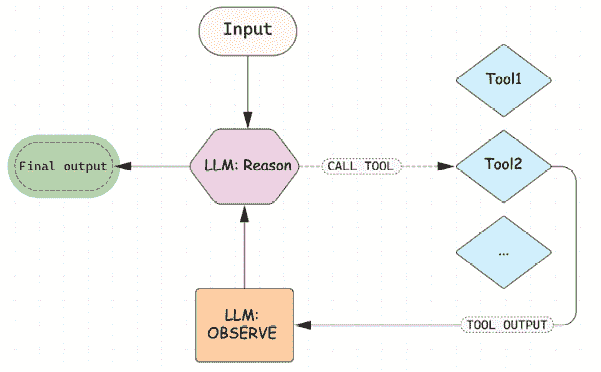
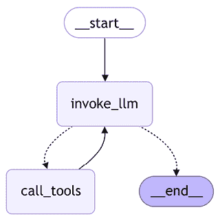
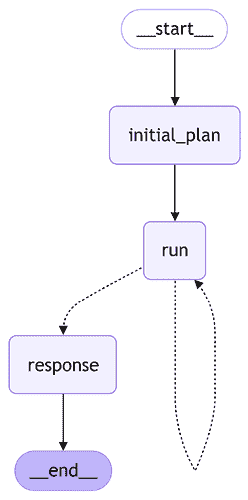

# 5

# 构建智能代理

随着生成式 AI 的采用率增长，我们开始使用 LLM 来完成更多开放和复杂的任务，这些任务需要了解新鲜事件或与世界交互。这通常被称为代理应用。我们将在本章后面定义代理是什么，但您可能已经在媒体上看到了这个短语：*2025 年是代理 AI 的年份*。例如，在最近引入的 RE-Bench 基准测试中，它由复杂的开放性任务组成，在某些设置（例如，有 30 分钟的思考预算）或某些特定类别的任务（如编写 Triton 内核）中，AI 代理的表现优于人类。

为了理解这些代理能力在实际中的构建方式，我们将首先讨论使用 LLM 进行工具调用以及如何在 LangChain 上实现，我们将详细探讨 ReACT 模式，以及 LLM 如何使用工具与外部环境交互并提高在特定任务上的性能。然后，我们将讨论在 LangChain 中定义工具以及哪些预构建工具可用。我们还将讨论开发自己的自定义工具、处理错误和使用高级工具调用功能。作为一个实际例子，我们将探讨如何使用工具与模型提供者提供的内置功能相比，使用 LLM 生成结构化输出。

最后，我们将讨论代理是什么，并在开发我们的第一个 ReACT 代理之前，使用 LangGraph 探讨构建代理的更高级模式——ReACT 代理是一种遵循计划-求解设计模式的代理，并使用诸如网络搜索、*arXiv*和*维基百科*等工具。

简而言之，本章将涵盖以下主题：

+   什么是工具？

+   定义内置 LangChain 工具和自定义工具

+   高级工具调用功能

+   将工具集成到工作流程中

+   什么是代理？

您可以在本书 GitHub 仓库的`chapter5/`目录中找到本章的代码。请访问[`github.com/benman1/generative_ai_with_langchain/tree/second_edition`](https://github.com/benman1/generative_ai_with_langchain/tree/second_edition)以获取最新更新。

请参阅*第二章*以获取设置说明。如果您在运行代码时遇到任何问题或有任何疑问，请在 GitHub 上创建问题或在 Discord 上加入讨论，链接为[`packt.link/lang`](https://packt.link/lang)。

让我们从工具开始。与其直接定义代理是什么，不如首先探索如何通过工具增强 LLM 在实际中是如何工作的。通过逐步进行，您将看到这些集成如何解锁新的功能。那么，工具究竟是什么，它们是如何扩展 LLM 所能做到的事情的？

# 什么是工具？

LLMs 是在庞大的通用语料库数据（如网络数据和书籍）上训练的，这使它们拥有广泛的知识，但在需要特定领域或最新知识的任务中限制了它们的有效性。然而，由于 LLMs 擅长推理，它们可以通过工具与外部环境交互——API 或接口允许模型与外部世界交互。这些工具使 LLMs 能够执行特定任务并从外部世界获得反馈。

当使用工具时，大型语言模型（LLMs）执行三个特定的生成任务：

1.  通过生成特殊标记和工具名称来选择要使用的工具。

1.  生成要发送给工具的有效载荷。

1.  根据初始问题和与工具的交互历史（针对这次特定运行）生成对用户的响应。

现在是时候弄清楚 LLMs 如何调用工具以及我们如何使 LLMs 具备工具意识了。考虑一个有些人为但具有说明性的问题：*当前美国总统年龄的平方根乘以 132 是多少*？这个问题提出了两个具体挑战：

+   它引用了截至 2025 年 3 月的信息，这很可能超出了模型训练数据。

+   它需要一个精确的数学计算，LLMs 可能无法仅通过自回归标记生成正确回答。

我们不会强迫 LLM 仅基于其内部知识生成答案，而是将两个工具：搜索引擎和计算器，提供给 LLM。我们期望模型确定它需要哪些工具（如果有的话）以及如何使用它们。

为了清晰起见，让我们从一个更简单的问题开始，并通过创建始终给出相同响应的虚拟函数来模拟我们的工具。在本章的后面部分，我们将实现完全功能性的工具并调用它们：

```py
question = "how old is the US president?"
raw_prompt_template = (
 "You have access to search engine that provides you an "
 "information about fresh events and news given the query. "
 "Given the question, decide whether you need an additional "
 "information from the search engine (reply with 'SEARCH: "
 "<generated query>' or you know enough to answer the user "
 "then reply with 'RESPONSE <final response>').\n"
 "Now, act to answer a user question:\n{QUESTION}"
)
prompt_template = PromptTemplate.from_template(raw_prompt_template)
result = (prompt_template | llm).invoke(question)
print(result,response)
>> SEARCH: current age of US president
```

让我们确保当 LLM 拥有足够的内部知识时，它可以直接回复用户：

```py
question1 = "What is the capital of Germany?"
result = (prompt_template | llm).invoke(question1)
print(result,response)
>> RESPONSE: Berlin
```

最后，让我们通过将其纳入提示来提供工具的输出：

```py
query = "age of current US president"
search_result = (
 "Donald Trump ' Age 78 years June 14, 1946\n"
```

```py
 "Donald Trump 45th and 47th U.S. President Donald John Trump is an American "
 "politician, media personality, and businessman who has served as the 47th "
 "president of the United States since January 20, 2025\. A member of the "
 "Republican Party, he previously served as the 45th president from 2017 to 2021\. Wikipedia"
)
raw_prompt_template = (
 "You have access to search engine that provides you an "
 "information about fresh events and news given the query. "
 "Given the question, decide whether you need an additional "
 "information from the search engine (reply with 'SEARCH: "
 "<generated query>' or you know enough to answer the user "
 "then reply with 'RESPONSE <final response>').\n"
 "Today is {date}."
 "Now, act to answer a user question and "
 "take into account your previous actions:\n"
 "HUMAN: {question}\n"
 "AI: SEARCH: {query}\n"
 "RESPONSE FROM SEARCH: {search_result}\n"
)
prompt_template = PromptTemplate.from_template(raw_prompt_template)
result = (prompt_template | llm).invoke(
  {"question": question, "query": query, "search_result": search_result,
 "date": "Feb 2025"})
print(result.content)
>>  RESPONSE: The current US President, Donald Trump, is 78 years old.
```

作为最后的观察，如果搜索结果不成功，LLM 将尝试细化查询：

```py
query = "current US president"
search_result = (
 "Donald Trump 45th and 47th U.S."
)
```

```py
result = (prompt_template | llm).invoke(
  {"question": question, "query": query, 
 "search_result": search_result, "date": "Feb 2025"})
print(result.content)
>>  SEARCH: Donald Trump age
```

通过这一点，我们已经展示了工具调用的原理。请注意，我们仅为了演示目的提供了提示示例。另一个基础 LLM 可能需要一些提示工程，我们的提示只是作为一个示例。好消息是：使用工具比这些示例看起来要简单得多！

如你所见，我们在提示中描述了所有内容，包括工具描述和工具调用格式。如今，大多数 LLM 都提供了更好的工具调用 API，因为现代 LLM 在帮助它们在这些任务上表现出色的数据集上进行过后训练。LLM 的创造者知道这些数据集是如何构建的。这就是为什么，通常情况下，你不需要在提示中自己包含工具描述；你只需提供提示和工具描述作为单独的参数，它们将在提供商的一侧组合成一个单一的提示。一些较小的开源 LLM 期望工具描述是原始提示的一部分，但它们会期望一个定义良好的格式。

LangChain 使得开发一个 LLM 调用不同工具并提供访问许多有用内置工具的管道变得容易。让我们看看 LangChain 中工具处理是如何工作的。

## LangChain 中的工具

对于大多数现代 LLM，要使用工具，你可以提供一个工具描述列表作为单独的参数。在 LangChain 中，每个特定的集成实现都将接口映射到提供商的 API。对于工具，这通过 LangChain 的`tools`参数到`invoke`方法（以及我们将在本章中学习的其他一些有用的方法，如`bind_tools`等）来实现。

当定义一个工具时，我们需要以 OpenAPI 格式指定其模式。我们提供工具的**标题**和**描述**，并指定其参数（每个参数都有一个**类型**、**标题**和**描述**）。我们可以从各种格式继承这样的模式，LangChain 将其转换为 OpenAPI 格式。随着我们进入下一节，我们将展示如何从函数、文档字符串、Pydantic 定义或通过从`BaseTool`类继承并直接提供描述来完成这项工作。对于 LLM 来说，任何具有 OpenAPI 规范的东西都可以被视为工具——换句话说，它可以被某种外部机制调用。

LLM 本身并不关心这个机制，它只产生何时以及如何调用工具的指令。对于 LangChain 来说，工具也是当我们执行程序时可以调用（我们将在后面看到工具是从`Runnables`继承的）的东西。 

你在**标题**和**描述**字段中使用的措辞非常重要，你可以将其视为提示工程练习的一部分。更好的措辞有助于 LLM 在何时以及如何调用特定工具方面做出更好的决策。请注意，对于更复杂的工具，编写这样的模式可能会变得繁琐，我们将在本章后面看到一种更简单的方式来定义工具：

```py
search_tool = {
 "title": "google_search",
 "description": "Returns about fresh events and news from Google Search engine based on a query",
 "type": "object",
 "properties": {
 "query": {
 "description": "Search query to be sent to the search engine",
 "title": "search_query",
 "type": "string"},
   },
 "required": ["query"]
}
result = llm.invoke(question, tools=[search_tool])
```

如果我们检查`result.content`字段，它将是空的。这是因为 LLM 已经决定调用一个工具，输出消息对此有一个提示。在底层发生的事情是 LangChain 将模型提供商的特定输出格式映射到一个统一的工具调用格式：

```py
print(result.tool_calls)
>> [{'name': 'google_search', 'args': {'query': 'age of Donald Trump'}, 'id': '6ab0de4b-f350-4743-a4c1-d6f6fcce9d34', 'type': 'tool_call'}]
```

请记住，一些模型提供者即使在工具调用的案例中也可能返回非空内容（例如，可能有模型决定调用工具的原因的推理痕迹）。你需要查看模型提供者规范来了解如何处理此类情况。

如我们所见，一个 LLM 返回了一个工具调用字典的数组——每个字典都包含一个唯一标识符、要调用的工具的名称以及要提供给此工具的参数字典。让我们进行下一步，再次调用模型：

```py
from langchain_core.messages import SystemMessage, HumanMessage, ToolMessage
tool_result = ToolMessage(content="Donald Trump ' Age 78 years June 14, 1946\n", tool_call_id=step1.tool_calls[0]["id"])
step2 = llm.invoke([
   HumanMessage(content=question), step1, tool_result], tools=[search_tool])
assert len(step2.tool_calls) == 0
print(step2.content)
>> Donald Trump is 78 years old.
```

`ToolMessage` 是 LangChain 上的一个特殊消息，允许你将工具执行的结果反馈给模型。此类消息的 `content` 字段包含工具的输出，一个特殊的字段 `tool_call_id` 将其映射到模型生成的特定工具调用。现在，我们可以将整个序列（包括初始输出、工具调用步骤和输出）作为一个消息列表发送回模型。

总是向 LLM 传递工具列表可能有些奇怪（因为，通常，对于给定的工作流程，这样的列表是固定的）。因此，LangChain 的 `Runnables` 提供了一个 `bind` 方法，该方法会记住参数并将它们添加到每个后续调用中。请看以下代码：

```py
llm_with_tools = llm.bind(tools=[search_tool])
llm_with_tools.invoke(question)
```

当我们调用 `llm.bind(tools=[search_tool])` 时，LangChain 会创建一个新的对象（此处分配给 `llm_with_tools`），该对象会自动将 `[search_tool]` 包含在后续对初始 `llm` 的每个副本的调用中。本质上，你不再需要在每个 `invoke` 方法中传递工具参数。因此，调用前面的代码与以下操作相同：

```py
llm.invoke(question, tools=[search_tool)
```

这是因为 `bind` 已经“记住”了你的工具列表，以便在所有未来的调用中使用。这主要是一个便利功能——如果你想要一组固定的工具用于重复调用，而不是每次都指定它们，那么它非常理想。现在让我们看看我们如何更有效地利用工具调用，并提高 LLM 的推理能力！

## ReACT

如你所想，LLM 在生成最终回复给用户之前可以调用多个工具（下一个要调用的工具或发送给此工具的有效负载可能取决于之前工具调用的结果）。这是 2022 年由普林斯顿大学和谷歌研究团队提出的一种 ReACT 方法（*推理和行动*）[`arxiv.org/abs/2210.03629`](https://arxiv.org/abs/2210.03629) 所提出的。这个想法很简单——我们应该让 LLM 通过工具访问外部环境，并让 LLM 在循环中运行：

+   **推理**：生成关于当前情况的文本输出和解决任务的计划。

+   **行动**：根据上述推理采取行动（通过调用工具与环境交互，或响应用户）。

已经证明，与我们在 *第三章* 中讨论的 CoT 提示相比，ReACT 可以帮助降低幻觉率。



图 5.1：ReACT 模式

让我们亲自构建一个 ReACT 应用程序。首先，让我们创建模拟的搜索和计算工具：

```py
import math
def mocked_google_search(query: str) -> str:
 print(f"CALLED GOOGLE_SEARCH with query={query}")
 return "Donald Trump is a president of USA and he's 78 years old"
```

```py
def mocked_calculator(expression: str) -> float:
 print(f"CALLED CALCULATOR with expression={expression}")
 if "sqrt" in expression:
 return math.sqrt(78*132)
 return 78*132
```

在下一节中，我们将看到我们如何构建实际工具。现在，让我们为计算器工具定义一个模式，并让 LLM 了解它可以使用这两个工具。我们还将使用我们已熟悉的构建块——`ChatPromptTemplate` 和 `MessagesPlaceholder`——在调用我们的图时预先添加一个预定系统消息：

```py
from langchain.prompts import ChatPromptTemplate, MessagesPlaceholder
calculator_tool = {
 "title": "calculator",
 "description": "Computes mathematical expressions",
 "type": "object",
 "properties": {
 "expression": {
 "description": "A mathematical expression to be evaluated by a calculator",
 "title": "expression",
 "type": "string"},
  },
 "required": ["expression"]
}
prompt = ChatPromptTemplate.from_messages([
   ("system", "Always use a calculator for mathematical computations, and use Google Search for information about fresh events and news."), 
   MessagesPlaceholder(variable_name="messages"),
])
llm_with_tools = llm.bind(tools=[search_tool, calculator_tool]).bind(prompt=prompt)
```

现在我们已经有一个可以调用工具的 LLM，让我们创建我们需要的节点。我们需要一个调用 LLM 的函数，另一个调用工具并返回工具调用结果（通过将 `ToolMessages` 添加到状态中的消息列表中）的函数，以及一个将确定协调器是否应该继续调用工具或是否可以将结果返回给用户的函数：

```py
from typing import TypedDict
from langgraph.graph import MessagesState, StateGraph, START, END
def invoke_llm(state: MessagesState):
 return {"messages": [llm_with_tools.invoke(state["messages"])]}
def call_tools(state: MessagesState):
   last_message = state["messages"][-1]
   tool_calls = last_message.tool_calls
   new_messages = []
 for tool_call in tool_calls:
 if tool_call["name"] == "google_search":
       tool_result = mocked_google_search(**tool_call["args"])
       new_messages.append(ToolMessage(content=tool_result, tool_call_id=tool_call["id"]))
 elif tool_call["name"] == "calculator":
       tool_result = mocked_calculator(**tool_call["args"])
       new_messages.append(ToolMessage(content=tool_result, tool_call_id=tool_call["id"]))
 else:
 raise ValueError(f"Tool {tool_call['name']} is not defined!")
 return {"messages": new_messages}
def should_run_tools(state: MessagesState):
   last_message = state["messages"][-1]
 if last_message.tool_calls:
 return "call_tools"
 return END
```

现在，让我们在 LangGraph 工作流程中将所有这些整合在一起：

```py
builder = StateGraph(MessagesState)
builder.add_node("invoke_llm", invoke_llm)
builder.add_node("call_tools", call_tools)
builder.add_edge(START, "invoke_llm")
builder.add_conditional_edges("invoke_llm", should_run_tools)
builder.add_edge("call_tools", "invoke_llm")
graph = builder.compile()
question = "What is a square root of the current US president's age multiplied by 132?"
result = graph.invoke({"messages": [HumanMessage(content=question)]})
print(result["messages"][-1].content)
>> CALLED GOOGLE_SEARCH with query=age of Donald Trump
CALLED CALCULATOR with expression=78 * 132
CALLED CALCULATOR with expression=sqrt(10296)
The square root of 78 multiplied by 132 (which is 10296) is approximately 101.47.
```

这展示了 LLM 如何通过多次调用处理复杂问题——首先调用 `Google Search`，然后两次调用 `Calculator`——并且每次都使用之前接收到的信息来调整其行为。这就是 ReACT 模式在起作用。

通过构建它，我们已经详细了解了 ReACT 模式的工作原理。好消息是 LangGraph 提供了预构建的 ReACT 模式实现，因此您不需要自己实现它：

```py
from langgraph.prebuilt import create_react_agent
agent = create_react_agent(
  llm=llm,
  tools=[search_tool, calculator_tool],
  prompt=system_prompt)
```

在 *第六章* 中，我们将看到一些可以使用 `create_react_agent` 函数进行的额外调整。

# 定义工具

到目前为止，我们已经将工具定义为 OpenAPI 模式。但为了端到端运行工作流程，LangGraph 应该能够在执行过程中自己调用工具。因此，在本节中，让我们讨论我们如何将工具定义为 Python 函数或可调用对象。

LangChain 工具有三个基本组件：

+   `名称`：工具的唯一标识符

+   `描述`：帮助 LLM 理解何时以及如何使用工具的文本

+   `有效载荷模式`：工具接受的输入的结构化定义

它允许 LLM 决定何时以及如何调用工具。LangChain 工具的另一个重要区别是它可以由协调器（如 LangGraph）执行。工具的基本接口是 `BaseTool`，它本身继承自 `RunnableSerializable`。这意味着它可以像任何 `Runnable` 一样被调用或批处理，或者像任何 `Serializable` 一样被序列化或反序列化。

## 内置 LangChain 工具

LangChain 已经在各个类别中提供了许多工具。由于工具通常由第三方供应商提供，一些工具需要付费 API 密钥，一些是完全免费的，还有一些提供免费层。一些工具被分组在工具包中——当处理特定任务时应该一起使用的工具集合。让我们看看一些使用工具的例子。

工具给 LLM 提供了访问搜索引擎，如 Bing、DuckDuckGo、Google 和 Tavily。让我们看看 `DuckDuckGoSearchRun`，因为这个搜索引擎不需要额外的注册和 API 密钥。

请参阅*第二章*以获取设置说明。如果您在运行代码时有任何问题或遇到问题，请在 GitHub 上创建问题或在 Discord 上加入[`packt.link/lang`](https://packt.link/lang)的讨论。

与任何工具一样，这个工具有一个名称、描述和输入参数的架构：

```py
from langchain_community.tools import DuckDuckGoSearchRun
search = DuckDuckGoSearchRun()
print(f"Tool's name = {search.name}")
```

```py
print(f"Tool's name = {search.description}")
print(f"Tool's arg schema = f{search.args_schema}")
>> Tool's name = fduckduckgo_search
Tool's name = fA wrapper around DuckDuckGo Search. Useful for when you need to answer questions about current events. Input should be a search query.
Tool's arg schema = class 'langchain_community.tools.ddg_search.tool.DDGInput'
```

参数架构 `arg_schema` 是一个 Pydantic 模型，我们将在本章后面看到它为什么有用。我们可以通过程序方式或通过访问文档页面来探索其字段——它期望只有一个输入字段，一个查询：

```py
from langchain_community.tools.ddg_search.tool import DDGInput
print(DDGInput.__fields__)
>> {'query': FieldInfo(annotation=str, required=True, description='search query to look up')}
```

现在我们可以调用这个工具并返回一个字符串输出（来自搜索引擎的结果）：

```py
query = "What is the weather in Munich like tomorrow?"
search_input = DDGInput(query=query)
result = search.invoke(search_input.dict())
print(result)
```

我们还可以使用工具调用 LLM，并确保 LLM 调用搜索工具而不是直接回答：

```py
result = llm.invoke(query, tools=[search])
print(result.tool_calls[0])
>> {'name': 'duckduckgo_search', 'args': {'query': 'weather in Munich tomorrow'}, 'id': '222dc19c-956f-4264-bf0f-632655a6717d', 'type': 'tool_call'}
```

我们的工具现在是一个 LangGraph 可以程序调用的可调用函数。让我们把所有东西放在一起，创建我们的第一个代理。当我们流式传输我们的图时，我们得到状态的更新。在我们的情况下，这些只是消息：

```py
from langgraph.prebuilt import create_react_agent
agent = create_react_agent(model=llm, tools=[search])
```



图 5.2：LangGraph 上的预构建 ReACT 工作流程

这正是我们之前看到的——一个 LLM 调用工具，直到它决定停止并返回答案给用户。让我们测试一下！

当我们流式传输 LangGraph 时，我们得到更新图状态的新的事件。我们对状态的 `message` 字段感兴趣。让我们打印出新添加的消息：

```py
for event in agent.stream({"messages": [("user", query)]}):
 update = event.get("agent", event.get("tools", {}))
 for message in update.get("messages", []):
    message.pretty_print()
>> ================================ Ai Message ==================================
Tool Calls:
  duckduckgo_search (a01a4012-bfc0-4eae-9c81-f11fd3ecb52c)
 Call ID: a01a4012-bfc0-4eae-9c81-f11fd3ecb52c
  Args:
    query: weather in Munich tomorrow
================================= Tool Message =================================
Name: duckduckgo_search
The temperature in Munich tomorrow in the early morning is 4 ° C… <TRUNCATED>
================================== Ai Message ==================================
```

```py
The weather in Munich tomorrow will be 5°C with a 0% chance of rain in the morning.  The wind will blow at 11 km/h.  Later in the day, the high will be 53°F (approximately 12°C).  It will be clear in the early morning.
```

由于我们的代理由消息列表表示，因为这是 LLM 期望的输入和输出。当我们深入研究代理架构时，我们将在下一章中再次看到这个模式。现在，让我们简要地提到 LangChain 上已经可用的其他类型工具：

+   **除了使用搜索引擎外，增强 LLM 知识的工具**：

    +   学术研究：arXiv 和 PubMed

    +   知识库：维基百科和 Wikidata

    +   财务数据：Alpha Vantage、Polygon 和 Yahoo Finance

    +   天气：OpenWeatherMap

    +   计算：Wolfram Alpha

+   **增强您生产力的工具**：您可以与 Gmail、Slack、Office 365、Google Calendar、Jira、Github 等进行交互。例如，`GmailToolkit` 给您提供了访问 `GmailCreateDraft`、`GmailSendMessage`、`GmailSearch`、`GmailGetMessage` 和 `GmailGetThread` 工具的权限，这些工具允许您使用 Gmail 账户搜索、检索、创建和发送消息。正如您所看到的，您不仅可以为 LLM 提供关于用户的额外上下文，而且通过一些这些工具，LLM 可以采取实际影响外部环境的行为，例如在 GitHub 上创建拉取请求或在 Slack 上发送消息！

+   **提供 LLM 访问代码解释器的工具**：这些工具通过远程启动隔离容器并允许 LLM 访问该容器，使 LLM 能够访问代码解释器。这些工具需要来自提供沙箱的供应商的 API 密钥。LLM 在编码方面特别擅长，因此请求 LLM 通过编写解决复杂任务的代码来解决问题，而不是生成表示任务解决方案的标记，这是一种广泛使用的模式。当然，您应该谨慎执行由 LLM 生成的代码，这就是为什么隔离沙箱扮演着巨大角色的原因。以下是一些示例：

    +   代码执行：Python REPL 和 Bash

    +   云服务：AWS Lambda

    +   API 工具：GraphQL 和 Requests

    +   文件操作：文件系统

+   **通过编写和执行 SQL 代码使 LLM 访问数据库的工具**：例如，`SQLDatabase`包括获取有关数据库及其对象的信息和执行 SQL 查询的工具。您还可以使用`GoogleDriveLoader`访问 Google Drive，或使用`FileManagementToolkit`中的常规文件系统工具执行操作。

+   **其他工具**：这些包括集成第三方系统的工具，允许 LLM 收集更多信息或执行操作。还有一些工具可以集成从 Google Maps、NASA 和其他平台和组织的数据检索。 

+   **使用其他 AI 系统或自动化的工具**：

    +   图片生成：DALL-E 和 Imagen

    +   语音合成：Google Cloud TTS 和 Eleven Labs

    +   模型访问：Hugging Face Hub

    +   工作流程自动化：Zapier 和 IFTTT

任何具有 API 的外部系统都可以被封装成工具，如果它能增强像这样的 LLM（大型语言模型）：

+   为用户或工作流程提供相关的领域知识

+   允许 LLM 代表用户执行操作

当将此类工具与 LangChain 集成时，请考虑以下关键方面：

+   **身份验证**：确保外部系统的安全访问

+   **有效载荷模式**：定义适当的输入/输出数据结构

+   **错误处理**：计划失败和边缘情况

+   **安全考虑**：例如，在开发 SQL 到文本代理时，限制只读操作以防止意外修改

因此，一个重要的工具包是`RequestsToolkit`，它允许用户轻松封装任何 HTTP API：

```py
from langchain_community.agent_toolkits.openapi.toolkit import RequestsToolkit
from langchain_community.utilities.requests import TextRequestsWrapper
toolkit = RequestsToolkit(
   requests_wrapper=TextRequestsWrapper(headers={}),
   allow_dangerous_requests=True,
)
```

```py
for tool in toolkit.get_tools():
 print(tool.name)
>> requests_get
requests_post
requests_patch
requests_put
requests_delete
```

让我们使用一个免费的开放源代码货币 API（[`frankfurter.dev/`](https://frankfurter.dev/)）。这是一个仅用于说明目的的随机免费 API，只是为了向您展示您如何将任何现有的 API 封装成工具。首先，我们需要根据 OpenAPI 格式创建一个 API 规范。我们截断了规范，但您可以在我们的 GitHub 上找到完整版本：

```py
api_spec = """
openapi: 3.0.0
info:
 title: Frankfurter Currency Exchange API
 version: v1
 description: API for retrieving currency exchange rates. Pay attention to the base currency and change it if needed.
servers:
 - url: https://api.frankfurter.dev/v1
paths:
 /v1/latest:
   get:
     summary: Get the latest exchange rates.
     parameters:
       - in: query
         name: symbols
         schema:
           type: string
         description: Comma-separated list of currency symbols to retrieve rates for. Example: CHF,GBP
       - in: query
         name: base
         schema:
```

```py
           type: string
         description: The base currency for the exchange rates. If not provided, EUR is used as a base currency. Example: USD
   /v1/{date}:
   ...
"""
```

现在我们来构建和运行我们的 ReACT 代理；我们将看到 LLM 可以查询第三方 API 并提供关于货币汇率的最新答案：

```py
system_message = (
 "You're given the API spec:\n{api_spec}\n"
 "Use the API to answer users' queries if possible. "
)
agent = create_react_agent(llm, toolkit.get_tools(), state_modifier=system_message.format(api_spec=api_spec))
query = "What is the swiss franc to US dollar exchange rate?"
events = agent.stream(
   {"messages": [("user", query)]},
   stream_mode="values",
)
for event in events:
   event["messages"][-1].pretty_print()
>> ============================== Human Message =================================
What is the swiss franc to US dollar exchange rate?
================================== Ai Message ==================================
Tool Calls:
  requests_get (541a9197-888d-4ffe-a354-c726804ad7ff)
 Call ID: 541a9197-888d-4ffe-a354-c726804ad7ff
  Args:
    url: https://api.frankfurter.dev/v1/latest?symbols=CHF&base=USD
```

```py
================================= Tool Message =================================
Name: requests_get
{"amount":1.0,"base":"USD","date":"2025-01-31","rates":{"CHF":0.90917}}
================================== Ai Message ==================================
The Swiss franc to US dollar exchange rate is 0.90917.
```

注意到，这次我们使用了`stream_mode="values"`选项，在这个选项中，每次我们都会从图中获取完整当前状态。

已经有超过 50 个工具可用。您可以在文档页面上找到完整的列表：[`python.langchain.com/docs/integrations/tools/`](https://python.langchain.com/docs/integrations/tools/)。

## 自定义工具

我们探讨了 LangGraph 提供的内置工具的多样性。现在，让我们讨论如何创建自己的自定义工具，除了我们之前在用 `RequestsToolkit` 封装第三方 API 时提供的 API 规范的例子。让我们开始吧！

### 将 Python 函数封装成工具

任何 `Python` 函数（或可调用对象）都可以被封装成工具。正如我们所记得的，LangChain 上的工具应该有一个名称、一个描述和一个参数架构。让我们基于 Python 的 `numexr` 库（一个基于 NumPy 的快速数值表达式评估器）构建自己的计算器——[`github.com/pydata/numexpr`](https://github.com/pydata/numexpr)。我们将使用一个特殊的 `@tool` 装饰器来将我们的函数封装成工具：

```py
import math
from langchain_core.tools import tool
import numexpr as ne
@tool
def calculator(expression: str) -> str:
 """Calculates a single mathematical expression, incl. complex numbers.

```

```py
   Always add * to operations, examples:
     73i -> 73*i
     7pi**2 -> 7*pi**2
   """
   math_constants = {"pi": math.pi, "i": 1j, "e": math.exp}
   result = ne.evaluate(expression.strip(), local_dict=math_constants)
   return str(result)
```

让我们探索一下我们拥有的计算器对象！请注意，LangChain 自动从文档字符串和类型提示中继承了名称、描述和 args 架构。请注意，我们使用了少样本技术（在第 *第三章* 中讨论）来教 LLM 如何通过在文档字符串中添加两个示例来为我们的工具准备有效负载：

```py
from langchain_core.tools import BaseTool
assert isinstance(calculator, BaseTool)
print(f"Tool schema: {calculator.args_schema.model_json_schema()}")
>> Tool schema: {'description': 'Calculates a single mathematical expression, incl. complex numbers.\n\nAlways add * to operations, examples:\n  73i -> 73*i\n  7pi**2 -> 7*pi**2', 'properties': {'expression': {'title': 'Expression', 'type': 'string'}}, 'required': ['expression'], 'title': 'calculator', 'type': 'object'}
```

让我们尝试使用我们的新工具来评估一个包含复数的表达式，这些复数通过一个特殊的虚数单位 `i` 扩展了实数，该单位具有属性 `i**2=-1`：

```py
query = "How much is 2+3i squared?"
agent = create_react_agent(llm, [calculator])
for event in agent.stream({"messages": [("user", query)]}, stream_mode="values"):
   event["messages"][-1].pretty_print()
>> ===============================Human Message =================================
How much is 2+3i squared?
================================== Ai Message ==================================
Tool Calls:
```

```py
  calculator (9b06de35-a31c-41f3-a702-6e20698bf21b)
 Call ID: 9b06de35-a31c-41f3-a702-6e20698bf21b
  Args:
    expression: (2+3*i)**2
================================= Tool Message =================================
Name: calculator
(-5+12j)
================================== Ai Message ==================================
(2+3i)² = -5+12i.
```

只需几行代码，我们就成功地扩展了我们的 LLM 的能力，使其能够处理复数。现在我们可以将我们开始时的例子组合起来：

```py
question = "What is a square root of the current US president's age multiplied by 132?"
system_hint = "Think step-by-step. Always use search to get the fresh information about events or public facts that can change over time."
agent = create_react_agent(
   llm, [calculator, search],
   state_modifier=system_hint)
for event in agent.stream({"messages": [("user", question)]}, stream_mode="values"):
   event["messages"][-1].pretty_print()
print(event["messages"][-1].content)
>> The square root of Donald Trump's age multiplied by 132 is approximately 101.47.
```

我们没有在这里提供完整的输出（您可以在我们的 GitHub 上找到），但如果您运行此代码片段，您应该会看到 LLM 能够逐步查询工具：

1.  它使用查询 `"current US president"` 调用搜索引擎。

1.  然后，它再次使用查询 `"donald trump age"` 调用搜索引擎。

1.  作为最后一步，LLM 使用表达式 `"sqrt(78*132)"` 调用计算器工具。

1.  最后，它向用户返回了正确的答案。

在每个步骤中，LLM 都基于之前收集到的信息进行推理，然后使用适当的工具采取行动——这就是 ReACT 方法的关键。

### 从可运行对象创建工具

有时，LangChain 可能无法从一个函数中推导出通过的描述或 args 架构，或者我们可能正在使用一个复杂的可调用对象，难以用装饰器封装。例如，我们可以使用另一个 LangChain 链或 LangGraph 图作为工具。我们可以通过显式指定所有需要的描述来从任何 `Runnable` 创建工具。让我们以另一种方式创建一个计算器工具，并且我们将调整重试行为（在我们的情况下，我们将重试三次，并在连续尝试之间添加指数退避）：

请注意，我们使用与上面相同的函数，但去掉了 `@tool` 装饰器。

```py
from langchain_core.runnables import RunnableLambda, RunnableConfig
from langchain_core.tools import tool, convert_runnable_to_tool
def calculator(expression: str) -> str:
   math_constants = {"pi": math.pi, "i": 1j, "e": math.exp}
   result = ne.evaluate(expression.strip(), local_dict=math_constants)
 return str(result)
calculator_with_retry = RunnableLambda(calculator).with_retry(
   wait_exponential_jitter=True,
   stop_after_attempt=3,
)
calculator_tool = convert_runnable_to_tool(
   calculator_with_retry,
   name="calculator",
```

```py
   description=(
 "Calculates a single mathematical expression, incl. complex numbers."
 "'\nAlways add * to operations, examples:\n73i -> 73*i\n"
 "7pi**2 -> 7*pi**2"
   ),
   arg_types={"expression": "str"},
)
```

注意，我们定义我们的函数的方式与定义 LangGraph 节点的方式类似——它接受一个状态（现在是一个 Pydantic 模型）和一个配置。然后，我们将这个函数包装成 `RunnableLambda` 并添加了重试机制。如果我们想保持我们的 Python 函数作为一个函数而不使用装饰器包装，或者如果我们想包装外部 API（因此，描述和参数模式不能从文档字符串中自动继承），这可能是有用的。我们可以使用任何可运行的（例如，一个链或一个图）来创建一个工具，这使我们能够构建多智能体系统，因为现在一个基于 LLM 的工作流程可以调用另一个基于 LLM 的工作流程。让我们将我们的可运行对象转换为工具：

```py
calculator_tool = convert_runnable_to_tool(
   calculator_with_retry,
   name="calculator",
   description=(
 "Calculates a single mathematical expression, incl. complex numbers."
 "'\nAlways add * to operations, examples:\n73i -> 73*i\n"
 "7pi**2 -> 7*pi**2"
   ),
   arg_types={"expression": "str"},
)
```

让我们用 LLM 测试我们新的 `calculator` 函数：

```py
llm.invoke("How much is (2+3i)**2", tools=[calculator_tool]).tool_calls[0]
>> {'name': 'calculator',
 'args': {'__arg1': '(2+3*i)**2'},
 'id': '46c7e71c-4092-4299-8749-1b24a010d6d6',
 'type': 'tool_call'}
```

正如你所注意到的，LangChain 并没有完全继承 `args` 模式；这就是为什么它为参数创建了如 `__arg1` 这样的人工名称。让我们以定义 LangGraph 节点类似的方式修改我们的工具，以接受一个 Pydantic 模型：

```py
from pydantic import BaseModel, Field
from langchain_core.runnables import RunnableConfig
class CalculatorArgs(BaseModel):
   expression: str = Field(description="Mathematical expression to be evaluated")
def calculator(state: CalculatorArgs, config: RunnableConfig) -> str:
   expression = state["expression"]
   math_constants = config["configurable"].get("math_constants", {})
   result = ne.evaluate(expression.strip(), local_dict=math_constants)
 return str(result)
```

现在完整的模式是一个合适的模式：

```py
assert isinstance(calculator_tool, BaseTool)
print(f"Tool name: {calculator_tool.name}")
print(f"Tool description: {calculator_tool.description}")
print(f"Args schema: {calculator_tool.args_schema.model_json_schema()}")
>> Tool name: calculator
Tool description: Calculates a single mathematical expression, incl. complex numbers.'
Always add * to operations, examples:
73i -> 73*i
7pi**2 -> 7*pi**2
Args schema: {'properties': {'expression': {'title': 'Expression', 'type': 'string'}}, 'required': ['expression'], 'title': 'calculator', 'type': 'object'}
```

让我们与 LLM 一起测试它：

```py
tool_call = llm.invoke("How much is (2+3i)**2", tools=[calculator_tool]).tool_calls[0]
print(tool_call)
>> {'name': 'calculator', 'args': {'expression': '(2+3*i)**2'}, 'id': 'f8be9cbc-4bdc-4107-8cfb-fd84f5030299', 'type': 'tool_call'}
```

我们可以在运行时调用我们的计算器工具并将其传递给 LangGraph 配置：

```py
math_constants = {"pi": math.pi, "i": 1j, "e": math.exp}
config = {"configurable": {"math_constants": math_constants}}
calculator_tool.invoke(tool_call["args"], config=config)
>> (-5+12j)
```

通过这样，我们已经学会了如何通过向 LangChain 提供额外的详细信息，轻松地将任何可运行对象转换为工具，以确保 LLM 可以正确处理这个工具。

### 继承 StructuredTool 或 BaseTool

定义工具的另一种方法是创建一个通过继承 `BaseTool` 类的自定义工具。与其他方法一样，你必须指定工具的名称、描述和参数模式。你还需要实现一个或两个抽象方法：`_run` 用于同步执行，如果需要，`_arun` 用于异步行为（如果它与简单地包装同步版本不同）。这个选项特别有用，当你的工具需要保持状态（例如，维护长期连接客户端）或者其逻辑过于复杂，不能作为一个单一函数或 `Runnable` 实现。

如果你想要比 `@tool` 装饰器提供的更多灵活性，但又不想实现自己的类，有一个中间方法。你还可以使用 `StructuredTool.from_function` 类方法，它允许你仅用几行代码显式指定工具的元参数，如描述或 `args_schema`：

```py
from langchain_core.tools import StructuredTool
calculator_tool = StructuredTool.from_function(
   name="calculator",
   description=(
 "Calculates a single mathematical expression, incl. complex numbers."),
   func=calculator,
   args_schema=CalculatorArgs
)
tool_call = llm.invoke(
 "How much is (2+3i)**2", tools=[calculator_tool]).tool_calls[0]
```

在这一点上，关于同步和异步实现还有一个最后的注意事项。如果除了你的工具之外，还有一个底层函数是同步函数，LangChain 将通过在单独的线程中启动它来为工具的异步实现包装它。在大多数情况下，这并不重要，但如果你关心创建单独线程的额外开销，你有两个选择——要么从 `BaseClass` 继承并覆盖异步实现，要么创建你函数的单独异步实现并将其作为 `coroutine` 参数传递给 `StructruredTool.from_function`。你也可以只提供异步实现，但那样的话，你将无法以同步方式调用你的工作流程。

总结来说，让我们再看看我们创建 LangChain 工具的三个选项，以及何时使用每个选项。

| **创建工具的方法** | **何时使用** |
| --- | --- |
| @tool 装饰器 | 你有一个具有清晰文档字符串的函数，并且这个函数在你的代码中没有被使用 |
| 将可运行对象转换为工具 | 你有一个现有的可运行对象，或者你需要更详细地控制如何将参数或工具描述传递给 LLM（在这种情况下，你通过 `RunnableLambda` 包装现有的函数） |
| 从 StructuredTool 或 BaseTool 继承 | 你需要完全控制工具描述和逻辑（例如，你想要以不同的方式处理同步和异步请求） |

表 5.1：创建 LangChain 工具的选项

当 LLM 生成负载并调用工具时，它可能会出现幻觉或犯其他错误。因此，我们需要仔细考虑错误处理。

## 错误处理

我们已经在 *第三章* 中讨论了错误处理，但当你增强一个 LLM 并使用工具时，它变得更加重要；你需要记录日志、处理异常等等。一个额外的考虑是，你是否希望你的工作流程在某个工具失败时继续执行并尝试自动恢复。LangChain 有一个特殊的 `ToolException`，它允许工作流程通过处理异常来继续执行。

`BaseTool` 有两个特殊标志：`handle_tool_error` 和 `handle_validation_error`。当然，由于 `StructuredTool` 继承自 `BaseTool`，你可以将这些标志传递给 `StructuredTool.from_function` 类方法。如果设置了此标志，LangChain 就会在工具执行过程中发生 `ToolException` 或 Pydantic `ValidationException`（当验证输入负载时）时构造一个字符串作为工具执行的结果。

为了理解发生了什么，让我们看看 LangChain 源代码中 `_handle_tool_error` 函数的实现：

```py
def _handle_tool_error(
    e: ToolException,
    *,
    flag: Optional[Union[Literal[True], str, Callable[[ToolException], str]]],
) -> str:
 if isinstance(flag, bool):
        content = e.args[0] if e.args else "Tool execution error"
 elif isinstance(flag, str):
        content = flag
 elif callable(flag):
        content = flag(e)
 else:
        msg = (
 f"Got an unexpected type of `handle_tool_error`. Expected bool, str "
 f"or callable. Received: {flag}"
        )
 raise ValueError(msg)  # noqa: TRY004
 return content
```

正如我们所见，我们可以将此标志设置为布尔值、字符串或可调用（将 `ToolException` 转换为字符串）。基于此，LangChain 将尝试处理 `ToolException` 并将字符串传递到下一阶段。我们可以将此反馈纳入我们的工作流程并添加自动恢复循环。

让我们来看一个例子。我们通过移除一个替换`i->j`（从数学中的虚数单位到 Python 中的虚数单位的替换）来调整我们的`calculator`函数，并且我们还让`StructuredTool`自动继承文档字符串中的描述和`arg_schema`：

```py
from langchain_core.tools import StructuredTool
def calculator(expression: str) -> str:
 """Calculates a single mathematical expression, incl. complex numbers."""
 return str(ne.evaluate(expression.strip(), local_dict={}))
```

```py
calculator_tool = StructuredTool.from_function(
   func=calculator,
   handle_tool_error=True
)
agent = create_react_agent(
   llm, [calculator_tool])
for event in agent.stream({"messages": [("user", "How much is (2+3i)²")]}, stream_mode="values"):
   event["messages"][-1].pretty_print()
>> ============================== Human Message =================================
How much is (2+3i)²
================================== Ai Message ==================================
Tool Calls:
  calculator (8bfd3661-d2e1-4b8d-84f4-0be4892d517b)
 Call ID: 8bfd3661-d2e1-4b8d-84f4-0be4892d517b
  Args:
    expression: (2+3i)²
================================= Tool Message =================================
Name: calculator
Error: SyntaxError('invalid decimal literal', ('<expr>', 1, 4, '(2+3i)²', 1, 4))
 Please fix your mistakes.
================================== Ai Message ==================================
(2+3i)² is equal to -5 + 12i.  I tried to use the calculator tool, but it returned an error. I will calculate it manually for you.
(2+3i)² = (2+3i)*(2+3i) = 2*2 + 2*3i + 3i*2 + 3i*3i = 4 + 6i + 6i - 9 = -5 + 12i
```

如我们所见，现在我们的计算器执行失败，但由于错误描述不够清晰，LLM 决定自行响应而不使用工具。根据你的用例，你可能想要调整行为；例如，从工具提供更有意义的错误，强制工作流程尝试调整工具的有效载荷等。

LangGraph 还提供了一个内置的`ValidationNode`，它通过检查图的状态中的`messages`键来获取最后一条消息，并检查是否有工具调用。如果是这样，LangGraph 将验证工具调用的模式，如果它不符合预期的模式，它将抛出一个包含验证错误（以及默认的修复命令）的`ToolMessage`。你可以添加一个条件边，使其循环回 LLM，然后 LLM 会重新生成工具调用，类似于我们在*第三章*中讨论的模式。

现在我们已经了解了什么是工具，如何创建一个工具，以及如何使用内置的 LangChain 工具，是时候看看你可以传递给 LLM 的关于如何使用工具的额外指令了。

# 高级工具调用功能

许多 LLM 在工具调用上提供了一些额外的配置选项。首先，一些模型支持并行函数调用——具体来说，一个 LLM 可以同时调用多个工具。LangChain 原生支持这一点，因为`AIMessage`的`tool_calls`字段是一个列表。当你将`ToolMessage`对象作为函数调用结果返回时，你应该仔细匹配`ToolMessage`的`tool_call_id`字段与生成的有效载荷。这种对齐是必要的，以便 LangChain 和底层 LLM 在执行下一个回合时可以将它们匹配起来。

另一项高级功能是强制 LLM 调用一个工具，甚至调用特定的工具。一般来说，LLM 决定是否调用工具，如果应该调用，则从提供的工具列表中选择哪个工具。通常，这是通过传递给`invoke`方法的`tool_choice`和/或`tool_config`参数来处理的，但实现取决于模型的提供者。Anthropic、Google、OpenAI 和其他主要提供者有略微不同的 API，尽管 LangChain 试图统一参数，但在这种情况下，你应该通过模型的提供者仔细检查细节。

通常，以下选项是可用的：

+   `"auto"`: 一个 LLM 可以响应或调用一个或多个工具。

+   `"any"`: LLM 被迫通过调用一个或多个工具来响应。

+   `"tool"`或`"any"`与提供的工具列表：LLM 被迫通过调用受限列表中的工具来响应。

+   `"None"`: LLM 被迫响应而不调用任何工具。

另一个需要记住的重要事情是，模式可能变得相当复杂——例如，它们可能有可空字段或嵌套字段，包括枚举，或引用其他模式。根据模型提供者的不同，一些定义可能不受支持（你将看到警告或编译错误）。尽管 LangChain 旨在使跨供应商的切换无缝，但对于一些复杂的流程，这可能并不适用，因此请注意错误日志中的警告。有时，将提供的模式编译为模型提供者支持的模式的编译是在尽力而为的基础上进行的——例如，如果底层 LLM 不支持具有工具调用的`Union`类型，则具有`Union[str, int]`类型的字段将编译为`str`类型。你会收到警告，但在迁移过程中忽略此类警告可能会不可预测地改变应用程序的行为。

最后一点值得注意的是，一些提供者（例如，OpenAI 或 Google）提供自定义工具，例如代码解释器或 Google 搜索，模型本身可以调用这些工具，并且模型将使用工具的输出来准备最终的生成。你可以将其视为提供方侧的 ReACT 代理，其中模型根据它调用的工具接收增强的响应。这种方法减少了延迟和成本。在这些情况下，你通常需要向 LangChain 包装器提供一个使用提供者 SDK 创建的自定义工具，而不是使用 LangChain 构建的工具（即不继承自`BaseTool`类的工具），这意味着你的代码无法跨模型迁移。

# 将工具融入工作流程

现在我们知道了如何创建和使用工具，让我们讨论如何将工具调用范式更深入地融入到我们正在开发的流程中。

## 受控生成

在*第三章*中，我们开始讨论了一种*受控生成*，即当你希望一个 LLM 遵循特定模式时。我们可以通过创建更复杂和可靠的解析器，以及更严格地强制 LLM 遵循某种模式来改进我们的解析工作流程。调用一个工具需要受控生成，因为生成的有效负载应该遵循特定模式，但我们可以退一步，用强制调用遵循预期模式的工具来替换我们期望的模式。LangChain 有一个内置机制来帮助实现这一点——一个 LLM 有`with_structured_output`方法，它接受一个作为 Pydantic 模型的模式，将其转换为工具，通过强制它调用这个工具来使用给定的提示调用 LLM，并通过编译到相应的 Pydantic 模型实例来解析输出。

在本章的后面部分，我们将讨论一个计划-解决代理，所以让我们开始准备一个构建块。让我们要求我们的 LLM 为给定的动作生成一个计划，但不是解析这个计划，而是将其定义为 Pydantic 模型（`Plan`是一个`Steps`列表）:

```py
from pydantic import BaseModel, Field
class Step(BaseModel):
 """A step that is a part of the plan to solve the task."""
   step: str = Field(description="Description of the step")
class Plan(BaseModel):
 """A plan to solve the task."""
   steps: list[Step]
```

请记住，我们使用嵌套模型（一个字段引用另一个字段），但 LangChain 会为我们编译一个统一的模式。让我们组合一个简单的流程并运行它：

```py
prompt = PromptTemplate.from_template(
 "Prepare a step-by-step plan to solve the given task.\n"
 "TASK:\n{task}\n"
)
result = (prompt | llm.with_structured_output(Plan)).invoke(
 "How to write a bestseller on Amazon about generative AI?")
```

如果我们检查输出，我们会看到我们得到了一个 Pydantic 模型作为结果。我们不再需要解析输出；我们直接得到了一系列特定的步骤（稍后，我们将看到如何进一步使用它）：

```py
assert isinstance(result, Plan)
print(f"Amount of steps: {len(result.steps)}")
for step in result.steps:
 print(step.step)
 break
>> Amount of steps: 21
**1\. Idea Generation and Validation:**
```

### 供应商提供的受控生成

另一种方式是供应商依赖的。一些基础模型提供商提供了额外的 API 参数，可以指示模型生成结构化输出（通常是 JSON 或枚举）。你可以像上面一样使用 `with_structured_output` 强制模型使用 JSON 生成，但提供另一个参数，`method="json_mode"`（并确保底层模型提供商支持受控的 JSON 生成）：

```py
plan_schema = {
 "type": "ARRAY",
 "items": {
 "type": "OBJECT",
 "properties": {
 "step": {"type": "STRING"},
         },
     },
}
query = "How to write a bestseller on Amazon about generative AI?"
result = (prompt | llm.with_structured_output(schema=plan_schema, method="json_mode")).invoke(query)
```

注意，JSON 模式不包含字段的描述，因此通常，你的提示应该更加详细和具有信息性。但作为输出，我们得到了一个完整的 Python 字典：

```py
assert(isinstance(result, list))
print(f"Amount of steps: {len(result)}")
print(result[0])
>> Amount of steps: 10
{'step': 'Step 1: Define your niche and target audience. Generative AI is a broad topic. Focus on a specific area, like generative AI in marketing, art, music, or writing. Identify your ideal reader (such as  marketers, artists, developers).'}
```

你可以直接指示 LLM 实例遵循受控生成指令。请注意，特定的参数和功能可能因模型提供商而异（例如，OpenAI 模型使用 `response_format` 参数）。让我们看看如何指导 Gemini 返回 JSON：

```py
from langchain_core.output_parsers import JsonOutputParser
llm_json = ChatVertexAI(
  model_name="gemini-1.5-pro-002", response_mime_type="application/json",
  response_schema=plan_schema)
result = (prompt | llm_json | JsonOutputParser()).invoke(query)
assert(isinstance(result, list))
```

我们也可以让 Gemini 返回一个枚举值——换句话说，从一组值中只返回一个值：

```py
from langchain_core.output_parsers import StrOutputParser
response_schema = {"type": "STRING", "enum": ["positive", "negative", "neutral"]}
prompt = PromptTemplate.from_template(
 "Classify the tone of the following customer's review:"
 "\n{review}\n"
)
review = "I like this movie!"
llm_enum = ChatVertexAI(model_name="gemini-1.5-pro-002", response_mime_type="text/x.enum", response_schema=response_schema)
result = (prompt | llm_enum | StrOutputParser()).invoke(review)
print(result)
>> positive
```

LangChain 通过 `method="json_mode"` 参数或允许将自定义 `kwargs` 传递给模型来抽象模型提供商实现细节。一些受控生成功能是模型特定的。检查你的模型文档以了解支持的架构类型、约束和参数。

## ToolNode

为了简化代理开发，LangGraph 内置了诸如 `ToolNode` 和 `tool_conditions` 等功能。`ToolNode` 检查 `messages` 中的最后一条消息（你可以重新定义键名）。如果这条消息包含工具调用，它将调用相应的工具并更新状态。另一方面，`tool_conditions` 是一个条件边，用于检查是否应该调用 `ToolNode`（或者以其他方式完成）。

现在，我们可以在几分钟内构建我们的 ReACT 引擎：

```py
from langgraph.prebuilt import ToolNode, tools_condition
def invoke_llm(state: MessagesState):
 return {"messages": [llm_with_tools.invoke(state["messages"])]}
builder = StateGraph(MessagesState)
builder.add_node("invoke_llm", invoke_llm)
builder.add_node("tools", ToolNode([search, calculator]))
builder.add_edge(START, "invoke_llm")
builder.add_conditional_edges("invoke_llm", tools_condition)
builder.add_edge("tools", "invoke_llm")
graph = builder.compile()
```

## 工具调用范式

工具调用是一种非常强大的设计范式，它需要改变你开发应用程序的方式。在许多情况下，与其进行多轮提示工程和多次尝试改进你的提示，不如考虑是否可以要求模型调用工具。

假设我们正在开发一个处理合同取消的代理，它应该遵循某些业务逻辑。首先，我们需要了解合同的开始日期（处理日期可能很困难！）！如果你尝试提出一个可以正确处理此类情况的提示，你会发现这可能相当困难：

```py
examples = [
 "I signed my contract 2 years ago",
 "I started the deal with your company in February last year",
 "Our contract started on March 24th two years ago"
]
```

相反，强迫模型调用一个工具（也许甚至通过一个 ReACT 代理！）例如，Python 中有两个非常本地的工具——`date`和`timedelta`：

```py
from datetime import date, timedelta
@tool
def get_date(year: int, month: int = 1, day: int = 1) -> date:
 """Returns a date object given year, month and day.
```

```py
     Default month and day are 1 (January) and 1.
     Examples in YYYY-MM-DD format:
       2023-07-27 -> date(2023, 7, 27)
       2022-12-15 -> date(2022, 12, 15)
       March 2022 -> date(2022, 3)
       2021 -> date(2021)
   """
 return date(year, month, day).isoformat()
@tool
def time_difference(days: int = 0, weeks: int = 0, months: int = 0, years: int = 0) -> date:
 """Returns a date given a difference in days, weeks, months and years relative to the current date.

   By default, days, weeks, months and years are 0.
   Examples:
     two weeks ago -> time_difference(weeks=2)
     last year -> time_difference(years=1)
   """
   dt = date.today() - timedelta(days=days, weeks=weeks)
   new_year = dt.year+(dt.month-months) // 12 - years
   new_month = (dt.month-months) % 12
 return dt.replace(year=new_year, month=new_month)
```

现在它工作得像魔法一样：

```py
from langchain_google_vertexai import ChatVertexAI
llm = ChatVertexAI(model="gemini-1.5-pro-002")
agent = create_react_agent(
   llm, [get_date, time_difference], prompt="Extract the starting date of a contract. Current year is 2025.")
for example in examples:
 result = agent.invoke({"messages": [("user", example)]})
 print(example, result["messages"][-1].content)
```

```py
>> I signed my contract 2 years ago The contract started on 2023-02-07.
I started the deal with your company in February last year The contract started on 2024-02-01.
Our contract started on March 24th two years ago The contract started on 2023-03-24
```

我们学习了如何使用工具或函数调用来增强 LLMs 在复杂任务上的性能。这是代理背后的基本架构模式之一——现在是我们讨论代理是什么的时候了。

# 代理是什么？

代理是目前生成式 AI 最热门的话题之一。人们经常谈论代理，但关于代理的定义有很多不同的说法。LangChain 本身将代理定义为“*一个使用 LLM 来决定应用程序控制流的系统*。”虽然我们认为这是一个很好的定义，值得引用，但它遗漏了一些方面。

作为 Python 开发者，你可能熟悉鸭子类型，通过所谓的鸭子测试来确定对象的行为：“*如果它像鸭子走路，它像鸭子嘎嘎叫，那么它一定是一只鸭子*。”带着这个概念，让我们在生成式 AI 的背景下描述一些代理的性质：

+   代理帮助用户解决复杂的非确定性任务，而无需给出如何做的明确算法。高级代理甚至可以代表用户行动。

+   为了解决一个任务，代理通常执行多个步骤和迭代。它们*推理*（根据可用上下文生成新信息），*行动*（与外部环境互动），*观察*（整合外部环境的反馈），以及*通信*（与其他代理或人类互动和/或协作）。

+   代理利用 LLMs 进行推理（和解决问题）。

+   虽然代理具有一定的自主性（并且在某种程度上，它们甚至可以通过与环境互动思考和学习的最佳方式来解决任务），但在运行代理时，我们仍然希望保持对执行流程的一定程度的控制。

控制代理的行为——一个代理工作流程——是 LangGraph 背后的核心概念。虽然 LangGraph 为开发者提供了一套丰富的构建块（例如内存管理、工具调用和具有递归深度控制的循环图），但其主要设计模式侧重于管理 LLMs 在执行任务时发挥的流程和自主程度。让我们从一个例子开始，并开发我们的代理。

## 计划并解决代理

当我们面临一个复杂的任务时，我们作为人类通常会做什么？我们制定计划！在 2023 年，雷万特等人证明了计划并解决提示可以提高 LLM 的推理能力。也有多项研究表明，随着提示的复杂性（特别是长度和指令的数量）的增加，LLMs 的性能往往会下降。

因此，需要记住的第一个设计模式是*任务分解*——将复杂任务分解成一系列更小的任务，使提示简单并专注于单一任务，并且不要犹豫在提示中添加示例。在我们的案例中，我们将开发一个研究助理。

面对复杂任务时，让我们首先让 LLM 提出一个详细的计划来解决这个任务，然后使用同一个 LLM 在每一步执行。记住，最终，LLM 根据输入令牌自回归地生成输出令牌。像 ReACT 或计划-求解这样的简单模式帮助我们更好地利用它们的隐式推理能力。

首先，我们需要定义我们的规划器。这里没有什么新的；我们正在使用我们已经讨论过的构建块——聊天提示模板和 Pydantic 模型的控制生成：

```py
from pydantic import BaseModel, Field
from langchain_core.prompts import ChatPromptTemplate
class Plan(BaseModel):
 """Plan to follow in future"""
   steps: list[str] = Field(
       description="different steps to follow, should be in sorted order"
   )
system_prompt_template = (
 "For the given task, come up with a step by step plan.\n"
 "This plan should involve individual tasks, that if executed correctly will "
 "yield the correct answer. Do not add any superfluous steps.\n"
 "The result of the final step should be the final answer. Make sure that each "
 "step has all the information needed - do not skip steps."
)
planner_prompt = ChatPromptTemplate.from_messages(
   [("system", system_prompt_template),
```

```py
    ("user", "Prepare a plan how to solve the following task:\n{task}\n")])
planner = planner_prompt | ChatVertexAI(
   model_name="gemini-1.5-pro-002", temperature=1.0
).with_structured_output(Plan)
```

对于步骤执行，让我们使用内置工具的 ReACT 代理——DuckDuckGo 搜索、来自 arXiv 和 Wikipedia 的检索器，以及我们在本章早期开发的自定义`calculator`工具：

```py
from langchain.agents import load_tools
tools = load_tools(
 tool_names=["ddg-search", "arxiv", "wikipedia"],
 llm=llm
) + [calculator_tool]
```

接下来，让我们定义我们的工作流程状态。我们需要跟踪初始任务和最初生成的计划，并让我们将`past_steps`和`final_response`添加到状态中：

```py
class PlanState(TypedDict):
   task: str
   plan: Plan
   past_steps: Annotated[list[str], operator.add]
   final_response: str
   past_steps: list[str]
def get_current_step(state: PlanState) -> int:
 """Returns the number of current step to be executed."""
 return len(state.get("past_steps", []))

def get_full_plan(state: PlanState) -> str:
 """Returns formatted plan with step numbers and past results."""
 full_plan = []
 for i, step in enumerate(state["plan"]):
   full_step = f"# {i+1}. Planned step: {step}\n"
 if i < get_current_step(state):
     full_step += f"Result: {state['past_steps'][i]}\n"
   full_plan.append(full_step)
 return "\n".join(full_plan)
```

现在，是时候定义我们的节点和边了：

```py
from typing import Literal
from langgraph.graph import StateGraph, START, END
final_prompt = PromptTemplate.from_template(
 "You're a helpful assistant that has executed on a plan."
 "Given the results of the execution, prepare the final response.\n"
 "Don't assume anything\nTASK:\n{task}\n\nPLAN WITH RESUlTS:\n{plan}\n"
 "FINAL RESPONSE:\n"
)
async def _build_initial_plan(state: PlanState) -> PlanState:
 plan = await planner.ainvoke(state["task"])
 return {"plan": plan}
async def _run_step(state: PlanState) -> PlanState:
 plan = state["plan"]
 current_step = get_current_step(state)
 step = await execution_agent.ainvoke({"plan": get_full_plan(plan), "step": plan.steps[current_step], "task": state["task"]})
 return {"past_steps": [step["messages"][-1].content]}
async def _get_final_response(state: PlanState) -> PlanState:
 final_response = await (final_prompt | llm).ainvoke({"task": state["task"], "plan": get_full_plan(state)})
 return {"final_response": final_response}
def _should_continue(state: PlanState) -> Literal["run", "response"]:
 if get_current_step(plan) < len(state["plan"].steps):
 return "run"
 return "final_response"
```

然后组合最终的图：

```py
builder = StateGraph(PlanState)
builder.add_node("initial_plan", _build_initial_plan)
builder.add_node("run", _run_step)
```

```py
builder.add_node("response", _get_final_response)
builder.add_edge(START, "initial_plan")
builder.add_edge("initial_plan", "run")
builder.add_conditional_edges("run", _should_continue)
builder.add_edge("response", END)
graph = builder.compile()
from IPython.display import Image, display
display(Image(graph.get_graph().draw_mermaid_png()))
```



图 5.3：计划-求解代理工作流程

现在我们可以运行工作流程：

```py
task = "Write a strategic one-pager of building an AI startup"
result = await graph.ainvoke({"task": task})
```

您可以在我们的 GitHub 上看到完整的输出，我们鼓励您亲自尝试。与给定任务的单一 LLM 提示相比，您可能更喜欢这个结果。

# 摘要

在本章中，我们探讨了如何通过集成工具和工具调用设计模式（包括 ReACT 模式）来增强 LLM。我们首先从头开始构建了一个 ReACT 代理，然后展示了如何使用 LangGraph 仅用一行代码创建一个定制的代理。

接下来，我们深入探讨了控制生成的先进技术——展示如何强制 LLM 调用任何工具或特定工具，并指示它以结构化格式（如 JSON、枚举或 Pydantic 模型）返回响应。在这种情况下，我们介绍了 LangChain 的`with_structured_output`方法，该方法将您的数据结构转换为工具模式，提示模型调用工具，解析输出，并将其编译为相应的 Pydantic 实例。

最后，我们使用 LangGraph 构建了我们第一个计划-求解代理，应用了我们迄今为止学到的所有概念：工具调用、ReACT、结构化输出等等。在下一章中，我们将继续讨论如何开发代理，并探讨更多高级架构模式。

# 问题

1.  使用工具与 LLM 的关键好处是什么，为什么它们很重要？

1.  LangChain 的 ToolMessage 类如何促进 LLM 和外部环境之间的通信？

1.  解释 ReACT 模式。它包含哪两个主要步骤？它是如何提升 LLM 性能的？

1.  你会如何定义一个生成式 AI 代理？这与 LangChain 的定义有何关联或区别？

1.  与直接使用受控生成相比，使用 with_structured_output 方法有哪些优缺点？

1.  你如何在 LangChain 中程序化定义一个自定义工具？

1.  解释 LangChain 中 Runnable.bind() 和 bind_tools() 方法的用途。

1.  LangChain 如何处理工具执行过程中发生的错误？有哪些选项可以配置这种行为？

# 订阅我们的每周通讯

订阅 AI_Distilled，这是人工智能专业人士、研究人员和革新者的首选通讯，请访问 `packt.link/Q5UyU`。


