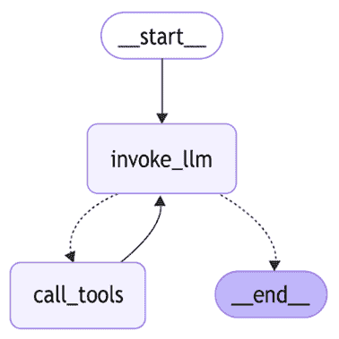
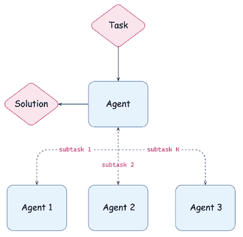
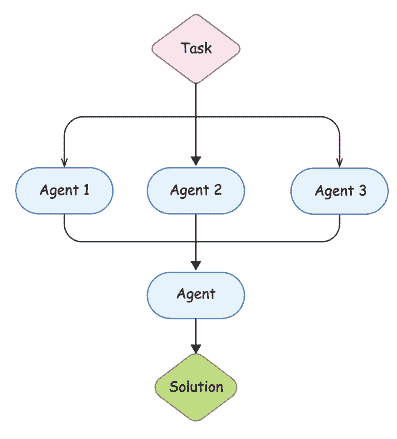
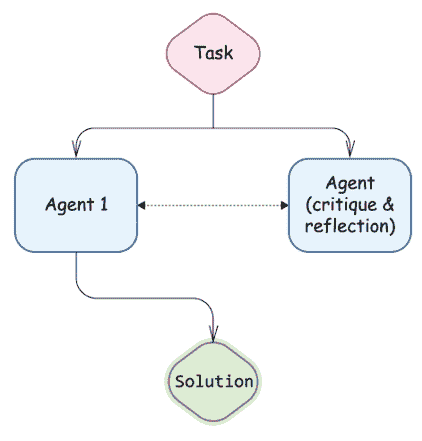
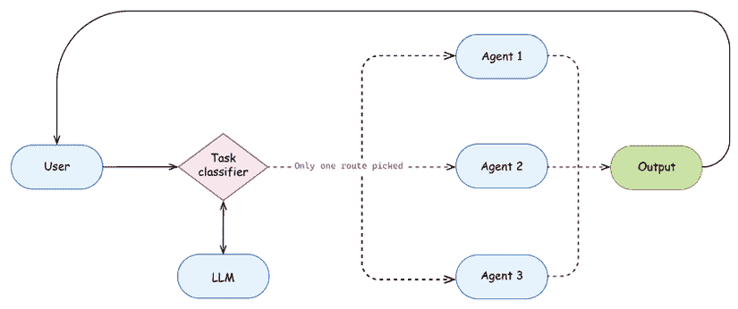
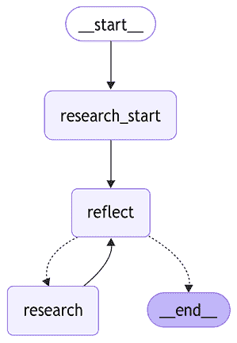
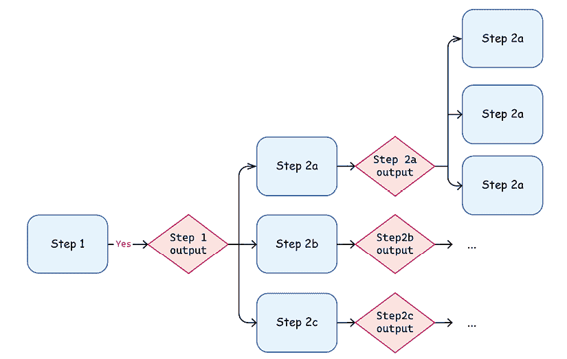
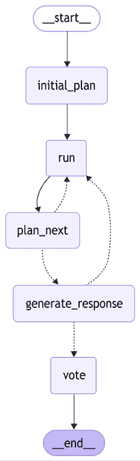
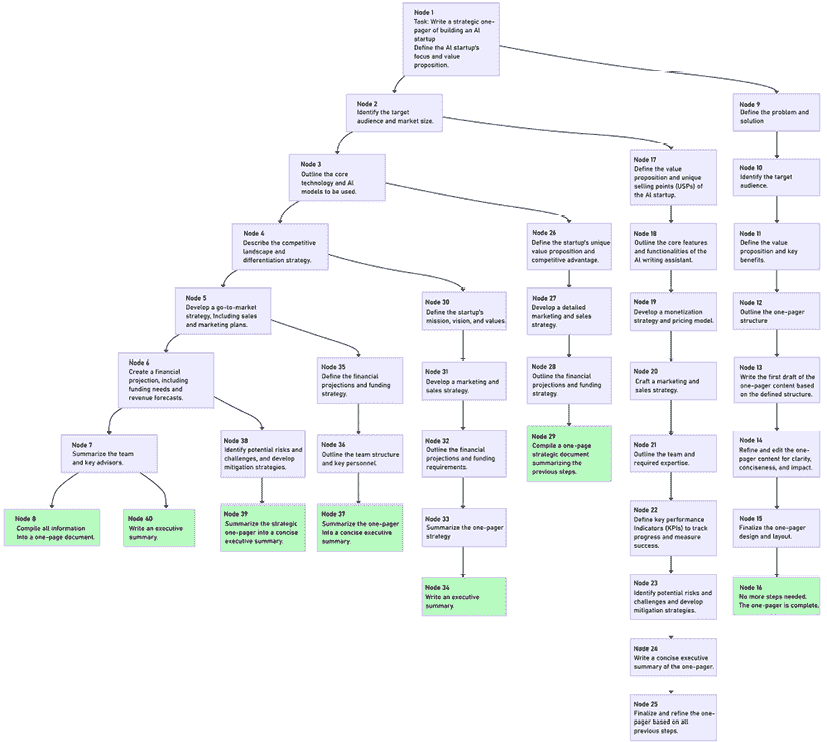

# 6

# 高级应用和多智能体系统

在上一章中，我们定义了什么是智能体。但我们是如何设计和构建一个高性能的智能体的呢？与之前探索的提示工程技巧不同，开发有效的智能体涉及到几个独特的模式，每个开发者都应该熟悉。在本章中，我们将讨论智能体 AI 背后的关键架构模式。我们将探讨多智能体架构以及组织智能体之间通信的方式。我们将开发一个具有自我反思能力的先进智能体，使用工具来回答复杂的考试问题。我们还将了解 LangChain 和 LangGraph API 的附加功能，这些功能在实现智能体架构时很有用，例如关于 LangGraph 流式传输的细节以及实现高级控制流中交接的方式。

然后，我们将简要介绍 LangGraph 平台，并讨论如何通过将人类纳入循环来开发自适应系统，以及 LangGraph 为此提供的预建构建块。我们还将探讨**思维树**（**ToT**）模式，并开发自己的 ToT 智能体，进一步讨论通过实现高级修剪机制来改进它的方法。最后，我们将了解 LangChain 和 LangGraph 上的高级长期记忆机制，例如缓存和存储。

总之，在本章中，我们将涉及以下主题：

+   智能体架构

+   多智能体架构

+   构建自适应系统

+   探索推理路径

+   智能体内存

# 智能体架构

正如我们在*第五章*中学到的，智能体帮助人类解决问题。构建智能体涉及到平衡两个要素。一方面，它与应用程序开发非常相似，因为您正在结合 API（包括调用基础模型）以生产就绪的质量。另一方面，您正在帮助 LLM 思考和解决问题。

正如我们在*第五章*中讨论的那样，智能体没有特定的算法要遵循。我们给予 LLM 部分控制执行流程的权限，但为了引导它，我们使用各种技巧，这些技巧有助于我们人类进行推理、解决问题和清晰思考。我们不应假设 LLM 可以神奇地自己解决所有问题；在当前阶段，我们应该通过创建推理工作流程来引导它。让我们回顾一下我们在*第五章*中学到的 ReACT 智能体，这是一个工具调用模式的例子：



图 6.1：LangGraph 上的预建 REACT 工作流程

让我们看看一些相对简单的设计模式，这些模式有助于构建性能良好的智能体。您将在不同领域和智能体架构中看到这些模式的各种组合：

+   **工具调用**：LLM 被训练通过工具调用进行受控生成。因此，在适当的时候，将问题包装为工具调用问题，而不是创建复杂的提示。请记住，工具应该有清晰的描述和属性名称，并且对它们的实验是提示工程练习的一部分。我们已在*第五章*中讨论了这种模式。

+   **任务分解**：保持您的提示相对简单。提供具有少量示例的具体指令，并将复杂任务分解成更小的步骤。您可以给予 LLM 对任务分解和规划过程的有限控制，通过外部协调器管理流程。我们在*第五章*中使用了这种模式，当时我们构建了一个计划并解决代理。

+   **合作与多样性**：在多个启用 LLM 的代理实例之间引入合作可以改善复杂任务的最终输出。沟通、辩论和分享不同的观点有助于提高效率，通过为您的代理启动不同的系统提示、可用的工具集等，您还可以从各种技能集中受益。自然语言是此类代理进行沟通的本地方式，因为 LLM 是在自然语言任务上训练的。

+   **反思与适应**：添加隐式循环的反思通常可以提高复杂任务端到端推理的质量。LLM 通过调用工具（这些调用可能会失败或产生意外结果）从外部环境获取反馈，但与此同时，LLM 可以继续迭代并从错误中自我恢复。作为夸张的说法，请记住我们经常使用同一个 LLM 作为评判者，所以当我们要求 LLM 评估其自身的推理并找出错误时，添加循环通常有助于其恢复。我们将在本章后面学习如何构建自适应系统。

+   **模型是非确定性的，可以生成多个候选方案**：不要专注于单个输出；当 LLM 与外部环境互动寻找解决方案时，通过扩展潜在选项的维度来探索不同的推理路径。我们将在下面的章节中更详细地研究这种模式，当我们讨论 ToT 和**语言代理树搜索**（**LATS**）示例时。

+   **以代码为中心的问题框架**：编写代码对于 LLM 来说非常自然，因此如果可能的话，尽量将问题框架为代码编写问题。这可能成为一种非常强大的任务解决方式，特别是如果您将其包装在代码执行沙盒中，基于输出的改进循环，访问各种强大的数据分析或可视化库，以及之后的生成步骤。我们将在*第七章*中更详细地介绍这一点。

两个重要的评论：首先，开发与最佳软件开发实践一致的代理，并使它们敏捷、模块化且易于配置。这将允许您将多个专业代理组合在一起，并使用户能够根据其特定任务轻松调整每个代理。

第二，我们想再次强调（再次！）评估和实验的重要性。我们将在*第九章*中更详细地讨论评估。但重要的是要记住，没有一条明确的成功之路。不同的模式在不同的任务类型上效果更好。尝试新事物，进行实验，迭代，并不要忘记评估您工作的结果。数据，如任务和预期输出，以及模拟器，这是 LLMs 与工具安全交互的一种方式，是构建真正复杂和有效的代理的关键。

现在我们已经创建了一个各种设计模式的思维导图，我们将通过讨论各种代理架构和查看示例来更深入地探讨这些原则。我们将首先通过代理方法增强我们在*第四章*中讨论的 RAG 架构。

## 代理 RAG

LLMs 使开发能够处理复杂、非重复性任务，这些任务难以描述为确定性工作流程的智能代理成为可能。通过以不同的方式将推理分解为步骤并在相对简单的方式下编排它们，代理可以在复杂开放任务上展示出显著更高的任务完成率。

这种基于代理的方法可以应用于众多领域，包括我们在*第四章*中讨论的 RAG 系统。作为提醒，*代理 RAG*究竟是什么？记住，RAG 系统的经典模式是根据查询检索块，将它们组合到上下文中，然后根据系统提示、组合上下文和问题让 LLM 生成答案。

我们可以使用上面讨论的原则（分解、工具调用和适应）来改进这些步骤：

+   **动态检索**将检索查询生成的工作交给 LLM。它可以自己决定是否使用稀疏嵌入、混合方法、关键字搜索或网络搜索。您可以将检索作为工具封装，并以 LangGraph 图的形式编排它们。

+   **查询扩展**任务要求 LLM 根据初始查询生成多个查询，然后您根据互惠融合或其他技术结合搜索输出。

+   **对检索块推理分解**允许你要求一个 LLM 评估给定问题（如果它不相关则过滤掉）的每个单独块，以补偿检索的不准确性。或者你可以要求 LLM 通过仅保留为输入问题提供的信息来总结每个块。无论如何，你首先并行执行许多较小的推理步骤，而不是将一大块上下文抛给 LLM。这不仅可以通过自身提高 RAG 质量，还可以通过降低相关性阈值来增加最初检索到的块的数量，或者通过扩展每个单独的块及其邻居来扩展每个单独的块。换句话说，你可以通过 LLM 推理克服一些检索挑战。这可能会提高你应用程序的整体性能，但当然，这也伴随着延迟和潜在的成本影响。

+   **反思步骤和迭代**要求 LLM 在每次迭代后评估输出，以动态地对检索和查询扩展进行迭代。你还可以将额外的接地和归因工具作为工作流程中的单独步骤使用，并根据这些工具判断你是否需要继续工作在答案上，或者答案可以返回给用户。

根据前几章的定义，当你与 LLM 共享对执行流程的部分控制时，RAG 变为代理 RAG。例如，如果 LLM 决定如何检索、反思检索到的块并根据答案的第一个版本进行调整，它就变成了代理 RAG。从我们的角度来看，此时开始迁移到 LangGraph 是有意义的，因为它专门设计用于构建此类应用程序，但当然，你可以继续使用 LangChain 或任何你喜欢的其他框架（比较我们在*第三章*中分别使用 LangChain 和 LangGraph 实现 map-reduce 视频摘要的方式）。

# 多代理架构

在*第五章*中，我们了解到将复杂任务分解成更简单的子任务通常会增加 LLM 的性能。我们构建了一个计划并解决代理，它比 CoT 更进一步，鼓励 LLM 生成一个计划并遵循它。在某种程度上，这种架构是多代理的，因为研究代理（负责生成和遵循计划）调用了另一个专注于不同类型任务的代理——使用提供的工具解决非常具体的任务。多代理工作流程协调多个代理，使它们能够相互增强，同时保持代理模块化（这使得测试和重用它们更容易）。

在本章的剩余部分，我们将探讨几个核心的代理架构，并介绍一些重要的 LangGraph 接口（如流细节和交接），这些接口对于开发代理非常有用。如果你感兴趣，你可以在 LangChain 文档页面上找到更多示例和教程，网址为[`langchain-ai.github.io/langgraph/tutorials/#agent-architectures`](https://langchain-ai.github.io/langgraph/tutorials/#agent-architectures)。我们将从讨论多代理系统中专业化的重要性开始，包括共识机制是什么以及不同的共识机制。

## 代理角色和专业化

当处理复杂任务时，我们知道，通常，拥有一个技能和背景多样化的团队是有益的。研究和实验的大量证据表明，这一点也适用于生成式 AI 代理。事实上，开发专门的代理为复杂 AI 系统提供了几个优点。

首先，专业化提高了特定任务上的性能。这允许你：

+   为每种任务类型选择最佳的工具集。

+   设计定制的提示和工作流程。

+   微调特定上下文中的超参数，例如温度。

其次，专门的代理有助于管理复杂性。当前的 LLM 在同时处理太多工具时会有所挣扎。作为最佳实践，限制每个代理使用 5-15 种不同的工具，而不是将所有可用工具都加载到一个代理上。如何分组工具仍然是一个开放性问题；通常，将它们分组到工具集中以创建连贯的专门代理是有帮助的。



图 6.2：监督模式

除了成为*专门化*的，还要保持你的代理*模块化*。这样，维护和改进这些代理会变得更容易。此外，通过处理企业助手用例，你最终会在你的组织内部拥有许多不同的代理，这些代理可供用户和开发者使用，并可以组合在一起。因此，请记住，你应该使这些专门化的代理可配置。

LangGraph 允许你通过将它们包含为较大图中的子图来轻松组合图。有两种方法可以做到这一点：

+   将代理作为图编译，并在定义另一个代理的节点时传递它作为可调用对象：

    ```py
    builder.add_node("pay", payments_agent)
    ```

+   使用 Python 函数包装子代理的调用，并在父节点定义中使用它：

    ```py
    def _run_payment(state):
      result = payments_agent.invoke({"client_id"; state["client_id"]})
     return {"payment status": ...}
    ...
    builder.add_node("pay", _run_payment)
    ```

注意，你的代理可能有不同的模式（因为它们执行不同的任务）。在第一种情况下，父代理在调用它时会在模式中传递给子代理相同的键。反过来，当子代理完成时，它会更新父代理的状态，并发送回匹配键的值。同时，第二种选项让你完全控制如何构建传递给子代理的状态，以及如何更新父代理的状态。有关更多信息，请参阅[`langchain-ai.github.io/langgraph/how-tos/subgraph/`](https://langchain-ai.github.io/langgraph/how-tos/subgraph/)上的文档。

## 共识机制

我们可以让多个代理并行处理相同的任务。这些代理可能具有不同的“个性”（由它们的系统提示引入；例如，其中一些可能更好奇和探索，而另一些可能更严格和重实际）或甚至不同的架构。每个代理都会独立工作，为问题找到解决方案，然后你使用共识机制从几个草案中选择最佳解决方案。



图 6.3：具有最终共识步骤的任务并行执行

我们在*第三章*中看到了一个基于多数投票实现共识机制的例子。你可以将其封装为一个单独的 LangGraph 节点，并且有其他方式在多个代理之间达成共识：

+   让每个代理看到其他解决方案，并按 0 到 1 的比例对每个解决方案进行评分，然后选择得分最高的解决方案。

+   使用替代投票机制。

+   使用多数投票。它通常适用于分类或类似任务，但如果你有自由文本输出，实施多数投票可能很困难。这是最快且最便宜（在 token 消耗方面）的机制，因为你不需要运行任何额外的提示。

+   如果存在，请使用外部预言机。例如，在解决数学方程时，你可以轻松验证解决方案是否可行。计算成本取决于问题，但通常较低。

+   使用另一个（可能更强大）的 LLM 作为裁判来挑选最佳解决方案。你可以要求 LLM 为每个解决方案给出一个分数，或者你可以通过展示所有解决方案并要求它选择最佳方案来将其分配给一个多类分类问题。

+   开发另一个擅长从一组解决方案中选择最佳解决方案的通用任务的代理。

值得注意的是，共识机制有一定的延迟和成本影响，但通常与解决任务本身的成本相比可以忽略不计。如果您将相同的任务分配给 N 个代理，您的令牌消耗量会增加 N 倍，而共识机制在上述差异之上增加了一个相对较小的开销。

您还可以实现自己的共识机制。当您这样做时，请考虑以下因素：

+   在使用 LLM 作为评判者时，使用少量样本提示。

+   添加示例，展示如何评分不同的输入-输出对。

+   考虑包含针对不同类型响应的评分标准。

+   在不同的输出上测试该机制以确保一致性。

关于并行化的重要注意事项——当您让 LangGraph 并行执行节点时，更新将按照您向图中添加节点的顺序应用到主状态。

## 通信协议

第三种架构选项是让代理在任务上相互通信并协作。例如，代理可能从通过系统提示配置的各种个性中受益。将复杂任务分解成更小的子任务也有助于您保持对应用程序和代理通信的控制。



图 6.4：反射模式

代理可以通过提供批评和反思来在任务上协作工作。从自我反思开始，代理分析自己的步骤并确定改进领域（但如上所述，您可能需要使用略有不同的系统提示来启动反思代理）；交叉反思，当您使用另一个代理（例如，使用另一个基础模型）时；甚至反思，这包括**人机交互**（**HIL**）在关键检查点上（我们将在下一节中看到如何构建此类自适应系统）。

您可以保留一个代理作为监督者，允许代理在网络中进行通信（允许它们决定向哪个代理发送消息或任务），引入一定的层次结构，或开发更复杂的工作流程（为了获得灵感，请查看 LangGraph 文档页面上的某些图表[`langchain-ai.github.io/langgraph/concepts/multi_agent/`](https://langchain-ai.github.io/langgraph/concepts/multi_agent/)）。

设计多代理工作流程仍然是研究和实验的开放领域，您需要回答很多问题：

+   我们应该在系统中包含哪些代理以及多少个？

+   我们应该将这些代理分配哪些角色？

+   每个代理应该有权访问哪些工具？

+   代理应该如何相互交互以及通过哪种机制？

+   我们应该自动化工作流程的哪些具体部分？

+   我们如何评估我们的自动化，以及我们如何收集用于此评估的数据？此外，我们的成功标准是什么？

现在我们已经探讨了关于多代理通信的一些核心考虑因素和开放性问题，让我们来探讨两种实用的机制来结构和促进代理交互：*语义路由*，根据任务的内容智能地指导任务，以及*组织交互*，详细说明了代理可以用来有效交换信息的特定格式和结构。

### 语义路由器

在真正的多代理设置中，组织代理之间通信的许多不同方式中，一个重要的是语义路由器。想象一下开发一个企业助手。通常它变得越来越复杂，因为它开始处理各种类型的问题——通用问题（需要公共数据和一般知识）、关于公司的问题（需要访问专有的公司数据源），以及特定于用户的问题（需要访问用户本身提供的数据）。很快，将这样的应用程序作为一个单一代理来维护就变得非常困难。再次强调，我们可以应用我们的设计模式——分解和协作！

假设我们已经实现了三种类型的代理——一种基于公共数据的通用问题回答者，另一种基于公司范围内的数据集并了解公司具体情况，第三种专注于处理用户提供的少量文档。这种专业化有助于我们使用诸如少样本提示和控制生成等模式。现在我们可以添加一个语义路由器——第一个要求 LLM 对问题进行分类，并根据分类结果将其路由到相应的代理。每个代理（或其中一些）甚至可能使用我们学到的自我一致性方法，如第三章中所述，以提高 LLM 分类的准确性。



图 6.5：语义路由器模式

值得注意的是，一个任务可能属于两个或更多类别——例如，我可以问，“*X 是什么，我该如何做 Y？*”这种情况在助手环境中可能并不常见，你可以决定在这种情况下如何处理。首先，你可能只是通过回复一个解释来教育用户，告诉他们每次只让应用程序处理一个问题。有时开发者可能会过于专注于尝试通过编程来解决所有问题。但是，一些产品特性相对容易通过用户界面来解决，并且用户（尤其是在企业环境中）愿意提供他们的输入。也许，与其在提示中解决分类问题，不如在用户界面中添加一个简单的复选框，或者让系统在置信度低时进行双重检查。

你还可以使用工具调用或其他我们了解的控制生成技术来提取目标和将执行路由到两个具有不同任务的专用代理。

语义路由的另一个重要方面是，您应用程序的性能在很大程度上取决于分类的准确性。您可以使用我们在书中讨论的所有技术来提高它——包括动态的少样本提示（few-shot prompting），结合用户反馈，采样等。

### 组织交互

在多代理系统中组织通信有两种方式：

+   代理通过特定的结构进行通信，这些结构迫使他们将思想和推理痕迹以特定形式表达出来，正如我们在上一章的*计划-解决*示例中所看到的。我们看到了我们的规划节点是如何通过一个结构良好的计划（这反过来又是 LLM 受控生成的结果）的 Pydantic 模型与 ReACT 代理进行通信的。

+   另一方面，LLMs 被训练以接受自然语言作为输入，并以相同格式产生输出。因此，通过消息进行通信对他们来说是非常自然的方式，您可以通过将不同代理的消息应用于共享的消息列表来实现通信机制！

当使用消息进行通信时，您可以通过所谓的*草稿板*——一个共享的消息列表来共享所有消息。在这种情况下，您的上下文可能会相对快速地增长，您可能需要使用我们在*第三章*中讨论的一些机制来修剪聊天内存（如准备运行摘要）。但作为一般建议，如果您需要在多个代理之间的通信历史中过滤或优先处理消息，请采用第一种方法，让他们通过受控输出进行通信。这将使您在任何给定时间点对工作流程的状态有更多的控制。此外，您可能会遇到一个复杂的消息序列，例如，*[系统消息，人类消息，AI 消息，工具消息，AI 消息，AI 消息，系统消息，…]*。根据您使用的底层模型，请务必检查模型提供商是否支持此类序列，因为之前，许多提供商只支持相对简单的序列——系统消息后跟交替的人类消息和 AI 消息（如果决定调用工具，则可能用工具消息代替人类消息）。

另一个选择是只共享每个执行的最终结果。这使消息列表相对较短。

现在是时候看看一个实际例子了。让我们开发一个研究代理，该代理使用工具来回答基于公共 MMLU 数据集（我们将使用高中地理问题）的复杂多项选择题。首先，我们需要从 Hugging Face 获取一个数据集：

```py
from datasets import load_dataset
ds = load_dataset("cais/mmlu", "high_school_geography")
ds_dict = ds["test"].take(2).to_dict()
print(ds_dict["question"][0])
>> The main factor preventing subsistence economies from advancing economically is the lack of
```

这些是我们的答案选项：

```py
print(ds_dict["choices"][0])
>> ['a currency.', 'a well-connected transportation infrastructure.', 'government activity.', 'a banking service.']
```

让我们从 ReACT 代理开始，但让我们偏离默认的系统提示，并编写我们自己的提示。让我们将这个代理专注于创造性和基于证据的解决方案（请注意，我们使用了 CoT 提示的元素，我们在*第三章*中讨论过）：

```py
from langchain.agents import load_tools
from langgraph.prebuilt import create_react_agent
research_tools = load_tools(
  tool_names=["ddg-search", "arxiv", "wikipedia"],
  llm=llm)
system_prompt = (
 "You're a hard-working, curious and creative student. "
 "You're preparing an answer to an exam quesion. "
 "Work hard, think step by step."
 "Always provide an argumentation for your answer. "
 "Do not assume anything, use available tools to search "
 "for evidence and supporting statements."
)
```

现在，让我们创建代理本身。由于我们为代理提供了一个自定义提示，我们需要一个包含系统消息、格式化第一个用户消息的模板（基于提供的问题和答案）以及用于添加到图状态的进一步消息占位符的提示模板。我们还通过从`AgentState`继承并添加额外的键来重新定义默认代理的状态：

```py
from langchain_core.prompts import ChatPromptTemplate, PromptTemplate
from langgraph.graph import MessagesState
from langgraph.prebuilt.chat_agent_executor import AgentState
raw_prompt_template = (
 "Answer the following multiple-choice question. "
 "\nQUESTION:\n{question}\n\nANSWER OPTIONS:\n{option}\n"
)
prompt = ChatPromptTemplate.from_messages(
   [("system", system_prompt),
    ("user", raw_prompt_template),
    ("placeholder", "{messages}")
    ]
)
class MyAgentState(AgentState):
 question: str
 options: str
research_agent = create_react_agent(
  model=llm_small, tools=research_tools, state_schema=MyAgentState,
  prompt=prompt)
```

我们本可以在这里停止，但让我们更进一步。我们使用了一个基于 ReACT 模式的专业研究代理（并对其默认配置进行了轻微调整）。现在让我们向其中添加一个反思步骤，并为将实际批评我们“学生”工作的代理使用另一个角色配置文件：

```py
reflection_prompt = (
 "You are a university professor and you're supervising a student who is "
 "working on multiple-choice exam question. "
 "nQUESTION: {question}.\nANSWER OPTIONS:\n{options}\n."
 "STUDENT'S ANSWER:\n{answer}\n"
```

```py
 "Reflect on the answer and provide a feedback whether the answer "
 "is right or wrong. If you think the final answer is correct, reply with "
 "the final answer. Only provide critique if you think the answer might "
 "be incorrect or there are reasoning flaws. Do not assume anything, "
 "evaluate only the reasoning the student provided and whether there is "
 "enough evidence for their answer."
)
class Response(BaseModel):
 """A final response to the user."""
   answer: Optional[str] = Field(
       description="The final answer. It should be empty if critique has been provided.",
       default=None,
   )
   critique: Optional[str] = Field(
       description="A critique of the initial answer. If you think it might be incorrect, provide an actionable feedback",
       default=None,
   )
reflection_chain = PromptTemplate.from_template(reflection_prompt) | llm.with_structured_output(Response)
```

现在我们需要另一个研究代理，它不仅接受问题和答案选项，还包括之前的答案和反馈。研究代理的任务是使用工具来改进答案并回应批评。我们创建了一个简单且具有说明性的例子。你可以通过添加错误处理、Pydantic 验证（例如，检查是否提供了答案或批评）或处理冲突或模糊的反馈（例如，结构化提示以帮助代理在存在多个批评时优先考虑反馈点）来不断改进它。

注意，我们为我们的 ReACT 代理使用了一个能力较弱的 LLM，只是为了展示反思方法的力量（否则图可能在单次迭代中就完成了，因为代理可能会在第一次尝试中就找到正确答案）：

```py
raw_prompt_template_with_critique = (
 "You tried to answer the exam question and you get feedback from your "
 "professor. Work on improving your answer and incorporating the feedback. "
 "\nQUESTION:\n{question}\n\nANSWER OPTIONS:\n{options}\n\n"
 "INITIAL ANSWER:\n{answer}\n\nFEEDBACK:\n{feedback}"
)
prompt = ChatPromptTemplate.from_messages(
   [("system", system_prompt),
    ("user", raw_prompt_template_with_critique),
    ("placeholder", "{messages}")
    ]
)
class ReflectionState(ResearchState):
 answer: str
 feedback: str
research_agent_with_critique = create_react_agent(model=llm_small, tools=research_tools, state_schema=ReflectionState, prompt=prompt)
```

在定义我们图的状态时，我们需要跟踪问题和答案选项、当前答案和批评。此外，请注意，我们跟踪学生和教授之间的交互次数（以避免他们之间的无限循环）并为此使用自定义的 reducer（它总结每次运行中的旧步骤和新步骤）。让我们定义完整的状态、节点和条件边：

```py
from typing import Annotated, Literal, TypedDict
from langchain_core.runnables.config import RunnableConfig
from operator import add
from langchain_core.output_parsers import StrOutputParser
class ReflectionAgentState(TypedDict):
   question: str
```

```py
   options: str
   answer: str
   steps: Annotated[int, add]
   response: Response
def _should_end(state: AgentState, config: RunnableConfig) -> Literal["research", END]:
   max_reasoning_steps = config["configurable"].get("max_reasoning_steps", 10)
 if state.get("response") and state["response"].answer:
 return END
 if state.get("steps", 1) > max_reasoning_steps:
 return END
 return "research"
reflection_chain = PromptTemplate.from_template(reflection_prompt) | llm.with_structured_output(Response)
def _reflection_step(state):
   result = reflection_chain.invoke(state)
 return {"response": result, "steps": 1}
def _research_start(state):
 answer = research_agent.invoke(state)
 return {"answer": answer["messages"][-1].content}
def _research(state):
 agent_state = {
 "answer": state["answer"],
 "question": state["question"],
 "options": state["options"],
 "feedback": state["response"].critique
 }
 answer = research_agent_with_critique.invoke(agent_state)
 return {"answer": answer["messages"][-1].content}
```

让我们把所有这些都放在一起，创建我们的图：

```py
builder = StateGraph(ReflectionAgentState)
builder.add_node("research_start", _research_start)
builder.add_node("research", _research)
builder.add_node("reflect", _reflection_step)
builder.add_edge(START, "research_start")
builder.add_edge("research_start", "reflect")
builder.add_edge("research", "reflect")
builder.add_conditional_edges("reflect", _should_end)
graph = builder.compile()
display(Image(graph.get_graph().draw_mermaid_png()))
```



图 6.6：具有反思功能的研究代理

让我们运行它并检查发生了什么：

```py
question = ds_dict["question"][0]
options = "\n".join(
  [f"{i}. {a}" for i, a in enumerate(ds_dict["choices"][0])])
async for _, event in graph.astream({"question": question, "options": options}, stream_mode=["updates"]):
 print(event)
```

我们在这里省略了完整的输出（欢迎您从我们的 GitHub 仓库中获取代码并自行实验），但第一个答案是错误的：

```py
Based on the DuckDuckGo search results, none of the provided statements are entirely true.  The searches reveal that while there has been significant progress in women's labor force participation globally,  it hasn't reached a point where most women work in agriculture, nor has there been a worldwide decline in participation.  Furthermore, the information about working hours suggests that it's not universally true that women work longer hours than men in most regions. Therefore, there is no correct answer among the options provided.
```

经过五次迭代后，能力较弱的 LLM 能够找到正确答案（请记住，“教授”只评估推理本身，并没有使用外部工具或自己的知识）。请注意，从技术角度讲，我们实现了交叉反思而不是自我反思（因为我们用于反思的 LLM 与用于推理的不同）。以下是第一轮提供的反馈示例：

```py
The student's reasoning relies on outside search results which are not provided, making it difficult to assess the accuracy of their claims. The student states that none of the answers are entirely true, but multiple-choice questions often have one best answer even if it requires nuance. To properly evaluate the answer, the search results need to be provided, and each option should be evaluated against those results to identify the most accurate choice, rather than dismissing them all. It is possible one of the options is more correct than the others, even if not perfectly true. Without the search results, it's impossible to determine if the student's conclusion that no answer is correct is valid. Additionally, the student should explicitly state what the search results were.
```

接下来，让我们讨论一种适用于多代理设置的替代通信风格，即通过共享消息列表。但在那之前，我们应该讨论 LangGraph 交接机制，并深入了解 LangGraph 的流式传输细节。

## LangGraph 流式传输

LangGraph 流式传输有时可能引起混淆。每个图不仅有一个 `stream` 和相应的异步 `astream` 方法，还有一个 `astream_events`。让我们深入了解它们之间的区别。

`Stream` 方法允许你在每个超级步骤之后流式传输图状态的更改。记住，我们在 *第三章* 中讨论了超级步骤是什么，但为了简洁起见，它是对图的单次迭代，其中并行节点属于单个超级步骤，而顺序节点属于不同的超级步骤。如果你需要实际的流式传输行为（例如在聊天机器人中，以便用户感觉有事情发生，模型实际上在思考），你应该使用 `astream` 与 `messages` 模式。

你有五种 `stream/astream` 方法模式（当然，你可以组合多个模式）：

| **Mode** | **描述** | **输出** |
| --- | --- | --- |
| updates | 仅流式传输由节点产生的图更新 | 一个字典，其中每个节点名称映射到其对应的状态更新 |
| values | 在每个超级步骤之后流式传输图的完整状态 | 包含整个图状态的字典 |
| debug | 在调试模式下尝试尽可能多地流式传输信息 | 包含时间戳、任务类型以及每个事件所有对应信息的字典 |
| custom | 使用 StreamWriter 流式传输节点发出的事件 | 从节点写入到自定义编写器的字典 |
| messages | 如果可能的话，在流式节点中流式传输完整事件（例如，ToolMessages）或其块（例如，AI Messages） | 包含标记或消息段以及包含节点元数据的字典 |

表 6.1：LangGraph 的不同流式传输模式

让我们看看一个例子。如果我们使用上面章节中使用的 ReACT 代理并以 `values` 模式进行流式传输，我们将得到每个超级步骤之后返回的完整状态（你可以看到消息总数总是在增加）：

```py
async for _, event in research_agent.astream({"question": question, "options": options}, stream_mode=["values"]):
 print(len(event["messages"]))
>> 0
1
3
4
```

如果我们切换到 `update` 模式，我们将得到一个字典，其键是节点的名称（记住，并行节点可以在单个超级步骤内被调用）以及由该节点发送的相应状态更新：

```py
async for _, event in research_agent.astream({"question": question, "options": options}, stream_mode=["updates"]):
 node = list(event.keys())[0]
 print(node, len(event[node].get("messages", [])))
>> agent 1
tools 2
agent 1
```

LangGraph 的 `stream` 总是输出一个元组，其中第一个值是流模式（因为你可以通过将它们添加到列表中来传递多个模式）。

然后，你需要一个 `astream_events` 方法，该方法流式传输节点内发生的事件——不仅仅是 LLM 生成的标记，而是任何可用于回调的事件：

```py
seen_events = set([])
async for event in research_agent.astream_events({"question": question, "options": options}, version="v1"):
 if event["event"] not in seen_events:
   seen_events.add(event["event"])
print(seen_events)
>> {'on_chat_model_end', 'on_chat_model_stream', 'on_chain_end', 'on_prompt_end', 'on_tool_start', 'on_chain_stream', 'on_chain_start', 'on_prompt_start', 'on_chat_model_start', 'on_tool_end'}
```

你可以在 [`python.langchain.com/docs/concepts/callbacks/#callback-events`](https://python.langchain.com/docs/concepts/callbacks/#callback-events) 找到事件的完整列表。

## 交接

到目前为止，我们已经了解到 LangGraph 中的节点执行一部分工作并向公共状态发送更新，而边控制着流程——它决定下一个要调用的节点（以确定性的方式或基于当前状态）。在实现多代理架构时，您的节点不仅可以是函数，还可以是其他代理或子图（具有它们自己的状态）。您可能需要结合状态更新和流程控制。

LangGraph 允许您使用 `命令` 来实现这一点——您可以通过传递一个自定义状态来更新您图的状态，并同时调用另一个代理。这被称为 *移交* ——因为一个代理将控制权移交给另一个代理。您需要传递一个 `update` ——一个包含当前状态更新的字典，以便发送到您的图——以及 `goto` ——要移交控制权的节点名称（或名称列表）：

```py
from langgraph.types import Command
def _make_payment(state):
  ...
 if ...:
 return Command(
     update={"payment_id": payment_id},
     goto="refresh_balance"
  )
  ...
```

目标代理可以是当前图或父图（`Command.PARENT`）中的一个节点。换句话说，您只能在当前图中更改控制流，或者将其传递回启动此图的流程（例如，您不能通过 ID 将控制权传递给任何随机的流程）。您还可以从工具中调用 `命令`，或将 `命令` 包装为工具，然后 LLM 可以决定将控制权移交给特定的代理。在 *第三章* 中，我们讨论了 map-reduce 模式和 `Send` 类，它们允许我们通过传递特定的输入状态来调用图中的节点。我们可以将 `Command` 与 `Send` 一起使用（在这个例子中，目标代理属于父图）：

```py
from langgraph.types import Send
def _make_payment(state):
  ...
 if ...:
 return Command(
     update={"payment_id": payment_id},
     goto=[Send("refresh_balance", {"payment_id": payment_id}, ...],
     graph=Command.PARENT
  )
  ...
```

### 通过共享消息列表进行通信

在几章之前，我们讨论了两个代理如何通过受控输出（通过发送特殊的 Pydantic 实例给对方）进行通信。现在让我们回到通信主题，并说明代理如何使用本地的 LangChain 消息进行通信。让我们以具有交叉反射的研究代理为例，使其与共享的消息列表一起工作。首先，研究代理本身看起来更简单——它有一个默认状态，因为它接收一个用户的问题作为 HumanMessage：

```py
system_prompt = (
 "You're a hard-working, curious and creative student. "
 "You're working on exam quesion. Think step by step."
 "Always provide an argumentation for your answer. "
 "Do not assume anything, use available tools to search "
 "for evidence and supporting statements."
)
research_agent = create_react_agent(
  model=llm_small, tools=research_tools, prompt=system_prompt)
```

我们还需要稍微修改一下反思提示：

```py
reflection_prompt = (
 "You are a university professor and you're supervising a student who is "
 "working on multiple-choice exam question. Given the dialogue above, "
 "reflect on the answer provided and give a feedback "
 " if needed. If you think the final answer is correct, reply with "
 "an empty message. Only provide critique if you think the last answer "
 "might be incorrect or there are reasoning flaws. Do not assume anything, "
 "evaluate only the reasoning the student provided and whether there is "
 "enough evidence for their answer."
)
```

节点本身看起来更简单，但我们会在反思节点后添加 `Command`，因为我们决定使用节点本身来调用什么。此外，我们不再将 ReACT 研究代理作为节点进行包装：

```py
from langgraph.types import Command
question_template = PromptTemplate.from_template(
 "QUESTION:\n{question}\n\nANSWER OPTIONS:\n{options}\n\n"
)
def _ask_question(state):
 return {"messages": [("human", question_template.invoke(state).text)]}
def _give_feedback(state, config: RunnableConfig):
 messages = event["messages"] + [("human", reflection_prompt)]
 max_messages = config["configurable"].get("max_messages", 20)
 if len(messages) > max_messages:
 return Command(update={}, goto=END)
 result = llm.invoke(messages)
 if result.content:
 return Command(
     update={"messages": [("assistant", result.content)]},
     goto="research"
 )
 return Command(update={}, goto=END)
```

图本身看起来也非常简单：

```py
class ReflectionAgentState(MessagesState):
 question: str
 options: str
builder = StateGraph(ReflectionAgentState)
builder.add_node("ask_question", _ask_question)
builder.add_node("research", research_agent)
builder.add_node("reflect", _give_feedback)
builder.add_edge(START, "ask_question")
```

```py
builder.add_edge("ask_question", "research")
builder.add_edge("research", "reflect")
graph = builder.compile()
```

如果我们运行它，我们会看到在每一个阶段，图都在操作同一个（并且不断增长的）消息列表。

## LangGraph 平台

如您所知，LangGraph 和 LangChain 是开源框架，但 LangChain 作为一家公司提供了 LangGraph 平台——一个商业解决方案，可以帮助您开发、管理和部署代理应用程序。LangGraph 平台的一个组件是 LangGraph Studio ——一个 IDE，可以帮助您可视化并调试您的代理——另一个是 LangGraph Server。

你可以在官方网站（[`langchain-ai.github.io/langgraph/concepts/#langgraph-platform`](https://langchain-ai.github.io/langgraph/concepts/#langgraph-platform)）上了解更多关于 LangGraph 平台的信息，但让我们讨论几个关键概念，以便更好地理解开发代理的含义。

在你开发代理之后，你可以将其包装成 HTTP API（使用 Flask、FastAPI 或其他任何 Web 框架）。LangGraph 平台为你提供了一种原生的方式来部署代理，并且它将它们包装在一个统一的 API 中（这使得你的应用程序使用这些代理变得更容易）。当你将你的代理构建为 LangGraph 图对象时，你部署的是一个*助手*——一个特定的部署，包括你的图实例与配置一起。你可以在 UI 中轻松地版本化和配置助手，但保持参数可配置（并将它们作为`RunnableConfig`传递给你的节点和工具）是很重要的。

另一个重要的概念是*线程*。不要混淆，LangGraph 线程与 Python 线程是不同的概念（并且当你你在`RunnableConfig`中传递`thread_id`时，你传递的是 LangGraph 线程 ID）。当你思考 LangGraph 线程时，想想对话或 Reddit 线程。线程代表你的助手（具有特定配置的图）与用户之间的会话。你可以使用我们在*第三章*中讨论的检查点机制来为每个线程添加持久化。

*运行*是对助手的调用。在大多数情况下，运行是在一个线程上执行的（用于持久化）。LangGraph 服务器还允许你安排无状态的运行——它们不会被分配到任何线程，因此交互历史不会被持久化。LangGraph 服务器允许你安排长时间运行的运行、计划中的运行（也称为 cron）等，并且它还提供了一套丰富的机制来处理运行附加的 webhooks 和将结果轮询回用户。

我们不会在本书中讨论 LangGraph 服务器 API。请查看文档。

# 构建自适应系统

适应性是代理的一个优秀属性。它们应该适应外部和用户反馈，并据此纠正其行为。正如我们在*第五章*中讨论的那样，生成式 AI 代理通过以下方式实现适应性：

+   **工具交互**：它们在规划下一步（如我们的 ReACT 代理根据搜索结果进行调整）时，会整合来自先前工具调用及其输出的反馈（通过包含表示工具调用结果的`ToolMessages`）。

+   **显式反思**：它们可以被指示分析当前结果并故意调整其行为。

+   **人类反馈**：它们可以在关键决策点整合用户输入。

## 动态行为调整

我们看到了如何向我们的计划-解决代理添加一个反思步骤。给定初始计划，以及到目前为止执行步骤的输出，我们将要求 LLM 反思计划并调整它。再次强调，我们继续重复关键思想——这种反思可能不会自然发生；您可能将其作为单独的任务（分解）添加，并通过设计其通用组件来保持对执行流程的部分控制。

## 人类在回路中

此外，在开发具有复杂推理轨迹的代理时，在某个点上引入人类反馈可能是有益的。代理可以要求人类批准或拒绝某些操作（例如，当它调用不可逆的工具时，如支付工具），向代理提供额外的上下文，或者通过修改图的状态来给出特定的输入。

想象我们正在开发一个代理，该代理搜索工作职位，生成申请，并发送这个申请。我们可能在提交申请之前要求用户，或者逻辑可能更复杂——代理可能正在收集有关用户的数据，并且对于某些工作职位，它可能缺少关于过去工作经验的相关上下文。它应该询问用户，并将此知识持久化到长期记忆中，以实现更好的长期适应。

LangGraph 具有特殊的 `interrupt` 函数以实现 **HIL**-type 交互。您应该在节点中包含此函数，并在第一次执行时，它会抛出 `GraphInterrupt` 异常（其值将展示给用户）。为了恢复图的执行，客户端应使用我们在此章中之前讨论过的 `Command` 类。LangGraph 将从相同的节点开始，重新执行它，并返回节点调用 `interrupt` 函数的结果（如果您的节点中有多个 `interrupt`，LangGraph 会保持顺序）。您还可以使用 `Command` 根据用户的输入路由到不同的节点。当然，只有当向图提供检查点器时，您才能使用 `interrupt`，因为其状态应该被持久化。

让我们构建一个非常简单的图，其中只有一个节点要求用户输入他们的家庭地址：

```py
from langgraph.types import interrupt, Command
class State(MessagesState):
   home_address: Optional[str]
def _human_input(state: State):
   address = interrupt("What is your address?")
 return {"home_address": address}
builder = StateGraph(State)
builder.add_node("human_input", _human_input)
builder.add_edge(START, "human_input")
checkpointer = MemorySaver()
graph = builder.compile(checkpointer=checkpointer)
config = {"configurable": {"thread_id": "1"}}
for chunk in graph.stream({"messages": [("human", "What is weather today?")]}, config):
 print(chunk)
>> {'__interrupt__': (Interrupt(value='What is your address?', resumable=True, ns=['human_input:b7e8a744-b404-0a60-7967-ddb8d30b11e3'], when='during'),)}
```

图返回一个特殊的 `__interrupt__` 状态并停止。现在我们的应用程序（客户端）应该询问用户这个问题，然后我们可以继续。请注意，我们正在提供相同的 `thread_id` 从检查点恢复：

```py
for chunk in graph.stream(Command(resume="Munich"), config):
 print(chunk)
>> {'human_input': {'home_address': 'Munich'}}
```

注意，图继续执行 human_input 节点，但这次 `interrupt` 函数返回了结果，并且图的状态已更新。

到目前为止，我们已经讨论了几种架构模式，说明了如何开发代理。现在让我们看看另一个有趣的模式，它允许 LLM 在寻找解决方案的同时运行多个模拟。

# 探索推理路径

在*第三章*中，我们讨论了 CoT 提示。但是，使用 CoT 提示时，LLM 在单次回复中创建一个推理路径。如果我们通过将这个推理拆分成片段来结合分解模式和适应性模式会怎样呢？

## 思维树

Google DeepMind 和普林斯顿大学的研究人员在 2023 年 12 月介绍了**思维树（ToT）**技术。他们推广了 CoT 模式，并使用思维作为探索全局解决方案过程中的中间步骤。

让我们回到上一章中构建的计划-解决代理。让我们利用 LLM 的非确定性来改进它。我们可以在计划的每一步生成多个候选动作（我们可能需要增加底层 LLM 的温度）。这将帮助代理更具适应性，因为生成的下一个计划将考虑前一步的输出。

现在，我们可以构建一个各种选项的树，并使用深度优先搜索或广度优先搜索方法来探索这棵树。最后，我们将得到多个解决方案，并使用上面讨论的一些共识机制来选择最好的一个（例如，LLM 作为裁判）。



图 6.7：使用 ToT 的解决方案路径探索

请注意，模型的提供者应支持在响应中生成多个候选方案（并非所有提供者都支持此功能）。

我们想强调（并且我们在这个章节中反复这样做并不感到疲倦）的是，ToT 模式中没有任何全新的东西。你只是将已经在其他领域使用过的算法和模式拿过来，并用它们来构建有能力的代理。

现在是时候进行一些编码了。我们将采用我们在*第五章*中开发的计划-解决代理的相同组件——一个创建初始计划的规划器和`execution_agent`，这是一个可以访问工具并在计划中的特定步骤上工作的研究代理。由于我们不需要自定义状态，我们可以使我们的执行代理更简单：

```py
execution_agent = prompt_template | create_react_agent(model=llm, tools=tools)
```

我们还需要一个`replanner`组件，它将负责根据之前的观察调整计划，并为下一步生成多个候选方案：

```py
from langchain_core.prompts import ChatPromptTemplate
class ReplanStep(BaseModel):
 """Replanned next step in the plan."""
   steps: list[str] = Field(
       description="different options of the proposed next step"
   )
llm_replanner = llm.with_structured_output(ReplanStep)
replanner_prompt_template = (
 "Suggest next action in the plan. Do not add any superfluous steps.\n"
 "If you think no actions are needed, just return an empty list of steps. "
 "TASK: {task}\n PREVIOUS STEPS WITH OUTPUTS: {current_plan}"
)
replanner_prompt = ChatPromptTemplate.from_messages(
   [("system", "You're a helpful assistant. You goal is to help with planning actions to solve the task. Do not solve the task itself."),
    ("user", replanner_prompt_template)
   ]
)
replanner = replanner_prompt | llm_replanner
```

这个`replanner`组件对我们 ToT 方法至关重要。它接受当前的计划状态并生成多个潜在的下一步，鼓励探索不同的解决方案路径，而不是遵循单一的线性序列。

为了跟踪我们的探索路径，我们需要一个树形数据结构。下面的`TreeNode`类帮助我们维护它：

```py
class TreeNode:
 def __init__(
```

```py
       self,
       node_id: int,
       step: str,
       step_output: Optional[str] = None,
       parent: Optional["TreeNode"] = None,
 ):
 self.node_id = node_id
 self.step = step
 self.step_output = step_output
 self.parent = parent
 self.children = []
 self.final_response = None
 def __repr__(self):
   parent_id = self.parent.node_id if self.parent else "None"
 return f"Node_id: {self.node_id}, parent: {parent_id}, {len(self.children)} children."
 def get_full_plan(self) -> str:
 """Returns formatted plan with step numbers and past results."""
   steps = []
   node = self
 while node.parent:
     steps.append((node.step, node.step_output))
     node = node.parent
   full_plan = []
 for i, (step, result) in enumerate(steps[::-1]):
 if result:
       full_plan.append(f"# {i+1}. Planned step: {step}\nResult: {result}\n")
 return "\n".join(full_plan)
```

每个`TreeNode`跟踪其标识、当前步骤、输出、父节点关系和子节点。我们还创建了一个方法来获取格式化的完整计划（我们将用它替换提示模板），为了使调试更加方便，我们重写了`__repr__`方法，该方法返回节点的可读描述。

现在我们需要实现代理的核心逻辑。我们将以深度优先搜索模式探索我们的动作树。这正是 ToT 模式真正发挥威力的地方：

```py
async def _run_node(state: PlanState, config: RunnableConfig):
 node = state.get("next_node")
 visited_ids = state.get("visited_ids", set())
 queue = state["queue"]
 if node is None:
 while queue and not node:
     node = state["queue"].popleft()
 if node.node_id in visited_ids:
       node = None
 if not node:
 return Command(goto="vote", update={})
 step = await execution_agent.ainvoke({
 "previous_steps": node.get_full_plan(),
 "step": node.step,
 "task": state["task"]})
 node.step_output = step["messages"][-1].content
 visited_ids.add(node.node_id)
 return {"current_node": node, "queue": queue, "visited_ids": visited_ids, "next_node": None}
async def _plan_next(state: PlanState, config: RunnableConfig) -> PlanState:
 max_candidates = config["configurable"].get("max_candidates", 1)
 node = state["current_node"]
 next_step = await replanner.ainvoke({"task": state["task"], "current_plan": node.get_full_plan()})
 if not next_step.steps:
 return {"is_current_node_final": True}
 max_id = state["max_id"]
 for step in next_step.steps[:max_candidates]:
   child = TreeNode(node_id=max_id+1, step=step, parent=node)
   max_id += 1
   node.children.append(child)
   state["queue"].append(child)
```

```py
 return {"is_current_node_final": False, "next_node": child, "max_id": max_id}
async def _get_final_response(state: PlanState) -> PlanState:
 node = state["current_node"]
 final_response = await responder.ainvoke({"task": state["task"], "plan": node.get_full_plan()})
 node.final_response = final_response
 return {"paths_explored": 1, "candidates": [final_response]}
```

`_run_node`函数执行当前步骤，而`_plan_next`生成新的候选步骤并将它们添加到我们的探索队列中。当我们达到最终节点（不需要进一步步骤的节点）时，`_get_final_response`通过从多个候选方案（来自不同探索的解决方案路径）中选择最佳方案来生成最终解决方案。因此，在我们的代理状态中，我们应该跟踪根节点、下一个节点、要探索的节点队列以及我们已经探索的节点：

```py
import operator
from collections import deque
from typing import Annotated
class PlanState(TypedDict):
   task: str
   root: TreeNode
   queue: deque[TreeNode]
   current_node: TreeNode
   next_node: TreeNode
   is_current_node_final: bool
   paths_explored: Annotated[int, operator.add]
   visited_ids: set[int]
   max_id: int
   candidates: Annotated[list[str], operator.add]
   best_candidate: str
```

这种状态结构跟踪了我们所需的一切：原始任务、我们的树结构、探索队列、路径元数据和候选解决方案。注意使用自定义 reducer（如`operator.add`）来正确合并状态值的特殊`Annotated`类型。

需要记住的一个重要事情是，LangGraph 不允许你直接修改`state`。换句话说，如果我们在一个节点内执行如下操作，它不会对代理状态中的实际队列产生任何影响：

```py
def my_node(state):
  queue = state["queue"]
  node = queue.pop()
  ...
  queue.append(another_node)
 return {"key": "value"}
```

如果我们想要修改属于状态本身的队列，我们应该要么使用自定义的 reducer（如我们在*第三章*中讨论的）或者返回要替换的队列对象（因为底层，LangGraph 在传递给节点之前总是创建了状态的深拷贝）。

我们现在需要定义最终步骤——基于多个生成的候选方案选择最终答案的共识机制：

```py
prompt_voting = PromptTemplate.from_template(
 "Pick the best solution for a given task. "
 "\nTASK:{task}\n\nSOLUTIONS:\n{candidates}\n"
)
def _vote_for_the_best_option(state):
 candidates = state.get("candidates", [])
 if not candidates:
 return {"best_response": None}
 all_candidates = []
 for i, candidate in enumerate(candidates):
   all_candidates.append(f"OPTION {i+1}: {candidate}")
 response_schema = {
 "type": "STRING",
 "enum": [str(i+1) for i in range(len(all_candidates))]}
 llm_enum = ChatVertexAI(
     model_name="gemini-2.0-flash-001", response_mime_type="text/x.enum",
     response_schema=response_schema)
 result = (prompt_voting | llm_enum | StrOutputParser()).invoke(
     {"candidates": "\n".join(all_candidates), "task": state["task"]}
```

```py
 )
 return {"best_candidate": candidates[int(result)-1]}
```

这种投票机制向模型展示所有候选解决方案，并要求它选择最佳方案，利用模型评估和比较选项的能力。

现在，让我们添加代理的剩余节点和边。我们需要两个节点——一个用于创建初始计划，另一个用于评估最终输出。在这些节点旁边，我们定义了两个相应的边，用于评估代理是否应该继续探索以及是否准备好向用户提供最终响应：

```py
from typing import Literal
from langgraph.graph import StateGraph, START, END
from langchain_core.runnables import RunnableConfig
from langchain_core.output_parsers import StrOutputParser
from langgraph.types import Command
final_prompt = PromptTemplate.from_template(
 "You're a helpful assistant that has executed on a plan."
 "Given the results of the execution, prepare the final response.\n"
 "Don't assume anything\nTASK:\n{task}\n\nPLAN WITH RESUlTS:\n{plan}\n"
 "FINAL RESPONSE:\n"
)
responder = final_prompt | llm | StrOutputParser()
async def _build_initial_plan(state: PlanState) -> PlanState:
 plan = await planner.ainvoke(state["task"])
 queue = deque()
 root = TreeNode(step=plan.steps[0], node_id=1)
 queue.append(root)
 current_root = root
 for i, step in enumerate(plan.steps[1:]):
   child = TreeNode(node_id=i+2, step=step, parent=current_root)
   current_root.children.append(child)
   queue.append(child)
   current_root = child
 return {"root": root, "queue": queue, "max_id": i+2}
```

```py
async def _get_final_response(state: PlanState) -> PlanState:
 node = state["current_node"]
 final_response = await responder.ainvoke({"task": state["task"], "plan": node.get_full_plan()})
 node.final_response = final_response
 return {"paths_explored": 1, "candidates": [final_response]}
def _should_create_final_response(state: PlanState) -> Literal["run", "generate_response"]:
 return "generate_response" if state["is_current_node_final"] else "run"
def _should_continue(state: PlanState, config: RunnableConfig) -> Literal["run", "vote"]:
 max_paths = config["configurable"].get("max_paths", 30)
 if state.get("paths_explored", 1) > max_paths:
 return "vote"
 if state["queue"] or state.get("next_node"):
 return "run"
 return "vote"
```

这些函数通过定义初始计划创建、最终响应生成和流程控制逻辑来完善我们的实现。`_should_create_final_response`和`_should_continue`函数确定何时生成最终响应以及何时继续探索。所有组件就绪后，我们构建最终的状态图：

```py
builder = StateGraph(PlanState)
builder.add_node("initial_plan", _build_initial_plan)
builder.add_node("run", _run_node)
builder.add_node("plan_next", _plan_next)
builder.add_node("generate_response", _get_final_response)
builder.add_node("vote", _vote_for_the_best_option)
builder.add_edge(START, "initial_plan")
builder.add_edge("initial_plan", "run")
builder.add_edge("run", "plan_next")
builder.add_conditional_edges("plan_next", _should_create_final_response)
builder.add_conditional_edges("generate_response", _should_continue)
builder.add_edge("vote", END)
```

```py
graph = builder.compile()
from IPython.display import Image, display
display(Image(graph.get_graph().draw_mermaid_png()))
```

这就创建了我们完成的代理，具有完整的执行流程。图从初始规划开始，经过执行和重新规划步骤，为完成的路径生成响应，并通过投票选择最佳解决方案。我们可以使用 Mermaid 图表生成器来可视化流程，从而清楚地了解我们的代理的决策过程：



图 6.8：LATS 代理

我们可以控制超级步骤的最大数量，探索树中路径的最大数量（特别是生成最终解决方案候选人的最大数量），以及每一步的候选人数量。潜在地，我们可以扩展我们的配置并控制树的最大深度。让我们运行我们的图：

```py
task = "Write a strategic one-pager of building an AI startup"
result = await graph.ainvoke({"task": task}, config={"recursion_limit": 10000, "configurable": {"max_paths": 10}})
print(len(result["candidates"]))
print(result["best_candidate"])
```

我们还可以可视化已探索的树：



图 6.9：已探索执行树的示例

我们限制了候选人的数量，但我们可以潜在地增加它并添加额外的修剪逻辑（这将修剪没有希望的叶子）。我们可以使用相同的 LLM 作为裁判的方法，或者使用其他启发式方法进行修剪。我们还可以探索更高级的修剪策略；我们将在下一节中讨论其中之一。

## 使用 MCTS 修剪 ToT

一些你可能还记得 AlphaGo——这是第一个在围棋游戏中击败人类的计算机程序。谷歌 DeepMind 在 2015 年开发了它，并使用**蒙特卡洛树搜索**（**MCTS**）作为核心决策算法。这里有一个简单的工作原理。在游戏中进行下一步之前，算法构建一个决策树，其中包含潜在的未来移动，节点代表你的移动和对手可能的回应（这个树会迅速扩展，就像你可以想象的那样）。为了防止树扩展得太快，他们使用了 MCTS 来搜索通向游戏更好状态的最有希望的路径。

现在，回到我们在上一章中学到的 ToT 模式。考虑这样一个事实，我们在上一节中构建的 ToT 的维度可能会增长得非常快。如果在每个步骤中都生成 3 个候选人，并且工作流程中只有 5 个步骤，我们将最终有 3⁵=243 个步骤需要评估。这会带来很多成本和时间。我们可以以不同的方式修剪维度，例如，使用 MCTS。它包括选择和模拟组件：

+   **选择**帮助你在分析树时选择下一个节点。你通过平衡探索和利用来实现这一点（你估计最有希望的节点，但在这个过程中添加一些随机性）。

+   在通过添加一个新的子节点来扩展树之后，如果它不是一个终端节点，你需要模拟它的后果。这可能只是随机地玩所有后续移动直到结束，或者使用更复杂的模拟方法。在评估子节点后，你需要通过调整它们在下一轮选择中的概率分数，将结果回传给所有父节点。

我们的目标不是深入细节并教你 MCTS。我们只想展示如何将现有的算法应用到智能体工作流程中以提高其性能。一个例子是 Andy Zhou 及其同事在 2024 年 6 月在其论文《Language Agent Tree Search Unifies Reasoning, Acting, and Planning in Language Models》中提出的**LATS**方法。我们不打算过多深入细节（欢迎你查看原始论文或相应的教程），作者在 ToT 之上添加了 MCTS，并通过在 HumanEval 基准测试中获得第一名，展示了在复杂任务上的性能提升。

关键思想是，他们不是探索整个树，而是使用一个 LLM 来评估你在每一步得到的解决方案的质量（通过查看这些特定推理步骤上所有步骤的序列以及你迄今为止得到的输出）。

现在，随着我们讨论了一些更高级的架构，这些架构允许我们构建更好的智能体，还有一个最后的组件需要简要提及——记忆。帮助智能体保留和检索长期交互中的相关信息，有助于我们开发更高级、更有帮助的智能体。

# 智能体记忆

我们在第*第三章*中讨论了记忆机制。为了回顾，LangGraph 通过`Checkpointer`机制具有短期记忆的概念，它将检查点保存到持久存储中。这就是所谓的线程持久化（记住，我们在这章中之前讨论过，LangGraph 中的线程概念类似于对话）。换句话说，智能体记得我们在给定会话中的互动，但每次都是从零开始。

如你所想，对于复杂的智能体，这种记忆机制可能由于两个原因而效率低下。首先，你可能会丢失关于用户的重要信息。其次，在探索阶段寻找解决方案时，智能体可能会学到关于环境的重要信息，但每次都会忘记——这看起来并不高效。这就是为什么有**长期记忆**的概念，它帮助智能体积累知识，从历史经验中获益，并使其在长期内持续改进。

在实践中如何设计和使用长期记忆仍然是一个未解之谜。首先，你需要提取出有用的信息（同时也要考虑到隐私要求；更多关于这一点的内容可以在*第九章*中找到），这些信息是你希望在运行时存储的，然后你需要在下一次执行中提取它。提取过程与我们在讨论 RAG 时提到的检索问题相似，因为我们只需要提取与给定上下文相关的知识。最后一个组件是内存压缩——你可能希望定期自我反思你所学到的内容，优化它，并忘记无关紧要的事实。

这些是需要考虑的关键因素，但我们还没有看到任何针对代理工作流程的长期记忆的出色实际实现。在实践中，如今人们通常使用两个组件 – 内置的 **缓存**（一种缓存 LLM 响应的机制）、内置的 **存储**（一个持久化的键值存储）以及自定义缓存或数据库。当使用以下自定义选项时：

+   您需要额外的灵活性来组织内存 – 例如，您可能希望跟踪所有内存状态。

+   当与这种内存一起工作时，您需要高级的读写访问模式。

+   您需要保持内存分布式并在多个工作者之间，并且您希望使用除 PostgreSQL 之外的数据库。

## 缓存

缓存允许您保存和检索键值。想象一下，您正在开发一个企业级问答辅助应用程序，在 UI 中，您询问用户是否喜欢这个答案。如果答案是肯定的，或者如果您有一个针对最重要主题的问答对精选数据集，您可以将这些存储在缓存中。当稍后再次（或类似地）提出相同（或类似）的问题时，系统可以快速返回缓存的响应，而不是从头开始重新生成。

LangChain 允许您以以下方式设置 LLM 响应的全局缓存（在您初始化缓存之后，LLM 的响应将被添加到缓存中，如下所示）：

```py
from langchain_core.caches import InMemoryCache
from langchain_core.globals import set_llm_cache
cache = InMemoryCache()
set_llm_cache(cache)
llm = ChatVertexAI(model="gemini-2.0-flash-001", temperature=0.5)
llm.invoke("What is the capital of UK?")
```

LangChain 中的缓存工作方式如下：每个供应商的 `ChatModel` 实现都继承自基类，基类在生成过程中首先尝试在缓存中查找值。cache 是一个全局变量，我们预期（当然，只有在其初始化之后）。它根据由提示的字符串表示和 LLM 实例的字符串表示（由 `llm._get_llm_string` 方法产生）组成的键来缓存响应。

这意味着 LLM 的生成参数（例如 `stop_words` 或 `temperature`）包含在缓存键中：

```py
import langchain
print(langchain.llm_cache._cache)
```

LangChain 支持内存和 SQLite 缓存（它们是 `langchain_core.caches` 的一部分），并且还有许多供应商集成 – 通过 [`python.langchain.com/api_reference/community/cache.html`](https://python.langchain.com/api_reference/community/cache.html) 中的 `langchain_community.cache` 子包或通过特定的供应商集成（例如，`langchain-mongodb` 为 MongoDB 提供缓存集成：[`langchain-mongodb.readthedocs.io/en/latest/langchain_mongodb/api_docs.html`](https://langchain-mongodb.readthedocs.io/en/latest/langchain_mongodb/api_docs.html))。

我们建议引入一个单独的 LangGraph 节点，该节点击中实际的缓存（基于 Redis 或其他数据库），因为它允许您控制是否希望使用我们在讨论 RAG 时提到的嵌入机制（*第四章*）来搜索类似的问题。

## 存储

正如我们之前所学的，`Checkpointer`机制允许您通过线程级持久内存来增强您的流程；通过线程级，我们指的是对话级持久。每个对话都可以从停止的地方开始，并且工作流程执行之前收集的上下文。

`BaseStore`是一个持久键值存储系统，它通过命名空间（类似于文件夹的字符串路径的分层元组）组织您的值。它支持标准操作，如`put`、`delete`和`get`操作，以及一个实现不同语义搜索能力的`search`方法（通常基于嵌入机制），并考虑了命名空间的分层性质。

让我们初始化一个存储并添加一些值到它中：

```py
from langgraph.store.memory import InMemoryStore
in_memory_store = InMemoryStore()
in_memory_store.put(namespace=("users", "user1"), key="fact1", value={"message1": "My name is John."})
in_memory_store.put(namespace=("users", "user1", "conv1"), key="address", value={"message": "I live in Berlin."})
```

我们可以轻松查询值：

```py
in_memory_store.get(namespace=("users", "user1", "conv1"), key="address")
>>  Item(namespace=['users', 'user1'], key='fact1', value={'message1': 'My name is John.'}, created_at='2025-03-18T14:25:23.305405+00:00', updated_at='2025-03-18T14:25:23.305408+00:00')
```

如果我们通过命名空间的局部路径查询它，我们将不会得到任何结果（我们需要一个完全匹配的命名空间）。以下将不会返回任何结果：

```py
in_memory_store.get(namespace=("users", "user1"), key="conv1")
```

在另一方面，当使用`search`时，我们可以使用部分命名空间路径：

```py
print(len(in_memory_store.search(("users", "user1", "conv1"), query="name")))
print(len(in_memory_store.search(("users", "user1"), query="name")))
>> 1
2
```

如您所见，我们通过使用部分搜索，能够检索存储在内存中的所有相关事实。

LangGraph 内置了`InMemoryStore`和`PostgresStore`实现。代理内存机制仍在不断发展。您可以从可用组件中构建自己的实现，但我们应该在接下来的几年甚至几个月内看到大量的进展。

# 摘要

在本章中，我们深入探讨了 LLM 的高级应用以及使它们成为可能的架构模式，利用 LangChain 和 LangGraph。关键要点是，有效地构建复杂的 AI 系统不仅需要简单地提示 LLM；它还需要对工作流程本身进行仔细的架构设计，工具使用，并给予 LLM 对工作流程的部分控制。我们还讨论了不同的代理 AI 设计模式以及如何开发利用 LLM 的工具调用能力来解决复杂任务的代理。

我们探讨了 LangGraph 流的工作原理以及如何在执行期间控制要流回的信息。我们讨论了流状态更新和部分流答案标记之间的区别，了解了命令接口作为将执行传递给当前 LangGraph 工作流程内或外的特定节点的方式，查看了 LangGraph 平台及其主要功能，并讨论了如何使用 LangGraph 实现 HIL。我们还讨论了 LangGraph 上的线程与传统 Python 定义（线程在某种程度上类似于对话实例）之间的区别，并学习了如何通过跨线程持久性为我们的工作流程按线程添加内存。最后，我们学习了如何利用 LangChain 和 LangGraph 的高级功能，扩展基本 LLM 应用，并构建强大、自适应和智能的系统。

在下一章中，我们将探讨生成式 AI 如何通过协助代码开发和数据分析来改变软件工程行业。

# 问题

1.  在构建生成式 AI 代理时，至少列出三种需要考虑的设计模式。

1.  在代理 RAG 的背景下解释“动态检索”的概念。

1.  代理之间的合作如何提高复杂任务的输出？如何增加合作代理的多样性，这可能会对性能产生什么影响？

1.  描述在多个代理输出之间达成共识的例子。

1.  使用 LangGraph 在多代理系统中组织通信的主要两种方式是什么？

1.  解释 LangGraph 中 stream、astream 和 astream_events 之间的区别。

1.  LangGraph 中的命令是什么，它与 handoffs 有何关联？

1.  解释 LangGraph 平台中线程的概念。它与 Pythonic 线程有何不同？

1.  解释 Tree of Thoughts (ToT) 技术背后的核心思想。ToT 与分解模式有何关联？

1.  在代理系统的背景下描述短期记忆和长期记忆的区别。

# 订阅我们的每周通讯。

订阅 AI_Distilled，这是 AI 专业人士、研究人员和革新者的首选通讯，请访问 `packt.link/Q5UyU`。


