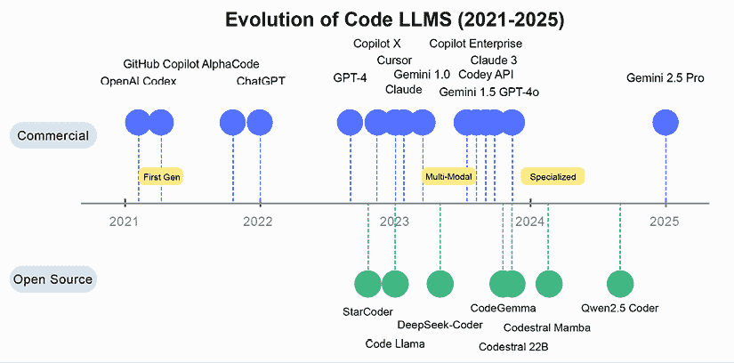
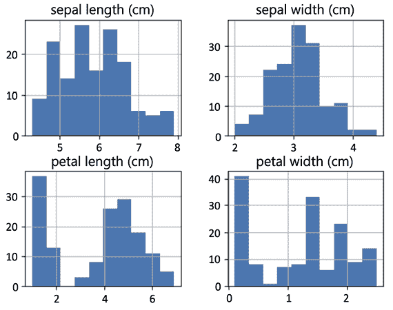

# 软件开发与数据分析代理

本章探讨了自然语言——无论是我们日常使用的英语还是你与 LLM 交互时偏好的任何语言——如何成为编程的强大界面，这是一种范式转变，当其被推向极致时，被称为*振动编码*。开发者现在可以用自然语言表达他们的意图，而将这些想法转化为健壮、可投入生产的代码的任务留给高级 LLMs 和框架，如 LangChain。此外，尽管传统的编程语言对于生产系统仍然是必不可少的，但 LLMs 正在创造新的工作流程，这些工作流程补充了现有实践，并可能提高可访问性。这种演变代表了从早期代码生成和自动化尝试的重大转变。

我们将具体讨论大型语言模型（LLMs）在软件开发中的位置以及性能、模型和应用的最新状态。我们将了解如何使用 LLM 链和代理来帮助代码生成、数据分析、训练机器学习模型以及提取预测。我们将涵盖使用 LLMs 编写代码，并通过 Google 的生成式 AI 服务、Hugging Face 或 Anthropic 等不同模型给出示例。在此之后，我们将转向使用代理和 RAG 进行文档编写或代码仓库的更高级方法。

我们还将应用 LLM 代理于数据科学：我们首先在数据集上训练一个模型，然后分析和可视化数据集。无论你是开发者、数据科学家还是技术决策者，本章将帮助你清晰地理解 LLMs 如何重塑软件开发和数据分析，同时保持传统编程语言的基本作用。

本章将涵盖以下主题：

+   LLMs 在软件开发中的应用

+   使用 LLMs 编写代码

+   应用 LLM 代理进行数据科学

# LLMs 在软件开发中的应用

自然语言与编程之间的关系正在经历重大的转变。在软件开发中，传统的编程语言仍然是必不可少的——C++和 Rust 用于性能关键的应用，Java 和 C#用于企业系统，Python 用于快速开发、数据分析以及机器学习工作流程。然而，自然语言，尤其是英语，现在成为了一种强大的界面，用于简化软件开发和数据科学任务，它补充而不是取代这些专门的编程工具。

高级 AI 助手让你只需保持“在感觉”中，就能简单地构建软件，而无需编写或甚至想象一行代码。这种开发风格被称为 vibe coding，在 2025 年初由 Andrej Karpathy 普及。你不必用编程术语来界定任务或与语法搏斗，而是用普通的对话描述所需的行为、用户流程或结果。然后模型在幕后协调数据结构、逻辑和集成。在 vibe coding 中，你不是调试，而是重新调整感觉。这意味着，你通过用自然语言重申或细化需求来迭代，让助手重塑系统。结果是纯粹直观的设计优先工作流程，完全抽象出所有编码细节。

出现了诸如 Cursor、Windsurf（原名 Codeium）、OpenHands 和 Amazon Q Developer 等工具，以支持这种开发方法，每个工具都为 AI 辅助编码提供了不同的功能。在实践中，这些界面正在使软件开发民主化，同时让经验丰富的工程师从重复性任务中解放出来。然而，在速度、代码质量和安全性之间保持平衡仍然至关重要，尤其是在生产系统中。

软件开发领域长期以来一直在通过各种抽象层使编程更加易于访问。早期的努力包括旨在简化语法的第四代语言，允许开发者用更少的代码行表达逻辑。这种演变继续与现代低代码平台的发展，它们引入了带有预构建组件的可视编程，以使应用开发超越传统的编码专家。最新的、也许是最具变革性的演变是自然语言编程，通过 LLM 将人类用普通语言表达的意思解释成功能性代码。

当前这一演变之所以特别显著，是因为它从根本上不同于以往的方法。我们不是为人类创造新的学习的人工语言，而是将智能工具适应于理解自然的人类交流，显著降低了入门门槛。与传统低代码平台往往导致专有实现不同，自然语言编程生成标准代码，没有供应商锁定，保护了开发者的自由，并与现有生态系统兼容。也许最重要的是，这种方法在整个范围内提供了前所未有的灵活性，从简单任务到复杂应用，既服务于寻求快速解决方案的新手，也服务于希望加速工作流程的资深开发者。

## 开发的未来

国际数据公司（IDC）的分析师预测，到 2028 年，自然语言将用于创建 70%的新数字解决方案（IDC FutureScape，*全球开发者与 DevOps 2025 预测*）。但这并不意味着传统编程会消失；相反，它正在演变成一个双层系统，其中自然语言作为高级接口，而传统编程语言处理精确的实现细节。

然而，这种演变并不意味着传统编程语言的终结。虽然自然语言可以简化设计阶段并加速原型设计，但像 Python 这样的语言的精确性和确定性对于构建可靠、可生产的系统仍然是必不可少的。换句话说，英语（或普通话，或任何最适合我们认知过程的自然语言）并不是完全取代代码，而是在作为高级层，将人类意图与可执行逻辑连接起来。

对于软件开发人员、数据科学家和技术决策者来说，这种转变意味着接受一个混合工作流程，其中由 LLM 和 LangChain 等框架驱动的自然语言指令与传统的代码共存。这种集成方法为更快地创新、个性化的软件解决方案以及最终更易于开发的过程铺平了道路。

## 实施考虑因素

对于生产环境，当前的演变以多种方式体现，正在改变开发团队的工作方式。自然语言界面使原型设计更快，减少了编写样板代码的时间，而传统编程对于复杂功能的优化和实现仍然是必不可少的。然而，最近的一项独立研究显示，当前 AI 编码能力存在重大局限性。

2025 年 OpenAI *SWE-Lancer*基准研究显示，即使是表现最好的模型也只完成了从现实世界自由职业项目中抽取的个别工程任务的 26.2%。研究确定了具体挑战，包括表面问题解决、跨多个文件有限的上下文理解、测试不足和边缘情况处理不当。

尽管存在这些限制，许多组织报告称，在使用 AI 编码助手时，如果目标明确，则可以提升生产力。最有效的方法似乎是协作——利用 AI 加速日常任务，同时将人类专业知识应用于 AI 仍存在挑战的领域，例如架构决策、全面测试和情境理解业务需求。随着技术的成熟，自然语言与传统编程的成功整合可能取决于明确界定各自的优势，而不是假设 AI 可以自主处理复杂的软件工程挑战。

代码维护已经通过人工智能辅助方法得到发展，开发者使用自然语言来理解和修改代码库。虽然 GitHub 报告称，在控制实验中，Copilot 用户完成特定编码任务的速度提高了 55%，但独立的现场研究表明，生产力的提升更为适度，范围在 4-22%之间，这取决于具体情境和测量方法。同样，Salesforce 报告称，他们内部的 CodeGenie 工具有助于提高生产力，包括自动化代码审查和安全扫描的某些方面。除了速度的提升之外，研究一致表明，人工智能编码助手可以减轻开发者的认知负担并提高满意度，尤其是在重复性任务中。然而，研究也突出了重要的局限性：生成的代码通常需要大量的人工验证和修改，一些独立研究报道了人工智能辅助代码中更高的错误率。证据表明，这些工具是有价值的助手，可以简化开发工作流程，同时仍然需要人类专业知识来确保质量和安全性。

代码调试领域得到了增强，因为自然语言查询通过解释错误信息、建议潜在修复并提供意外行为的背景信息，帮助开发者更快地识别和解决问题。AXA 部署的“AXA Secure GPT”，该模型在内部政策和代码库上进行了训练，显著减少了常规任务的周转时间，使开发团队能够专注于更具战略性的工作（AXA，*AXA 向员工提供安全的生成式人工智能*）。

当涉及到理解复杂系统时，开发者可以使用大型语言模型（LLMs）生成复杂架构、遗留代码库或第三方依赖关系的解释和可视化，从而加速入职和系统理解。例如，Salesforce 的系统景观图显示了他们的 LLM 集成平台如何连接到各种服务，尽管最近的收益报告表明，这些人工智能项目尚未对其财务结果产生重大影响。

系统架构本身正在演变，因为应用程序越来越多地需要考虑使用自然语言界面进行设计，无论是为了开发还是潜在的用户交互。宝马报告称，他们实施了一个平台，该平台使用生成式人工智能通过聊天界面产生实时洞察，将数据摄入到可操作建议的时间从几天缩短到几分钟。然而，这种架构转型反映了更广泛的行业趋势，即咨询公司已成为生成式人工智能繁荣的主要财务受益者。最近的行业分析显示，像埃森哲这样的咨询巨头从生成式人工智能服务中获得的收入（年度预订额为 36 亿美元）比大多数生成式人工智能初创公司总和还要多，这引发了关于价值交付和实施有效性的重要问题，组织在规划其人工智能架构策略时必须考虑这些问题。

对于软件开发人员、数据科学家和决策者来说，这种集成意味着更快的迭代、更低的成本，以及从想法到部署的更平滑过渡。虽然 LLM 有助于生成样板代码和自动化常规任务，但人类监督对于系统架构、安全和性能仍然至关重要。正如案例研究所示，将自然语言界面集成到开发和运营管道中的公司已经在实现可衡量的商业价值的同时，保持了必要的人类指导。

## 代码 LLM 的演变

代码专用 LLM 的发展自其诞生以来就遵循了快速发展的轨迹，经历了三个不同的阶段，这些阶段已经改变了软件开发实践。第一个 *基础阶段*（2021 年至 2022 年初）引入了第一个可行的代码生成模型，证明了该概念是可行的。这随后是 *扩展阶段*（2022 年末至 2023 年初），在这一阶段，推理能力和上下文理解能力得到了显著提升。最近，*多样化阶段*（2023 年中至 2024 年）见证了先进商业产品和越来越强大的开源替代品的出现。

这种演变的特点是在专有和开源生态系统中都存在并行的发展轨迹。最初，商业模型主导了市场，但开源替代品最近已经获得了巨大的动力。在整个这一过程中，几个关键里程碑标志着能力上的转型性变化，为不同编程语言和任务上的 AI 辅助开发开辟了新的可能性。这一演变的历史背景为理解使用 LangChain 的实施方法提供了重要的见解。



图 7.1：代码 LLM 的演变（2021–2024）

*图 7.1* 展示了代码专用语言模型在商业（上轨）和开源（下轨）生态系统中的发展进程。关键里程碑被突出显示，展示了从早期概念验证模型到越来越专业化的解决方案的转变。时间线从早期的商业模型如 Codex 到最近的进步如谷歌的 Gemini 2.5 Pro（2025 年 3 月）以及如 Mistral AI 的 Codestral 系列这样的专用代码模型。

近年来，我们见证了针对编码专门定制的 LLM（大型语言模型）的爆炸式增长，通常被称为代码 LLM。这些模型正在迅速发展，每个模型都有其独特的优势和局限性，并正在重塑软件开发格局。它们为加速软件开发任务范围内的开发工作流程提供了希望：

+   **代码生成**：将自然语言需求转换为代码片段或完整函数。例如，开发者可以根据项目规范生成样板代码或整个模块。

+   **测试生成**：从预期行为的描述中创建单元测试，以提高代码可靠性。

+   **代码文档**：从现有代码或规范中自动生成 docstrings、注释和技术文档，这显著减少了在快速开发环境中经常被优先级降低的文档负担。

+   **代码编辑和重构**：自动建议改进、修复错误和重构代码以提高可维护性。

+   **代码翻译**：在不同编程语言或框架之间转换代码。

+   **调试和自动化程序修复**：识别大型代码库中的错误并生成补丁以解决问题。例如，SWE-agent、AutoCodeRover 和 RepoUnderstander 等工具通过导航存储库、分析抽象语法树和应用有针对性的更改来迭代优化代码。

代码专用 LLM 的领域正变得越来越多样化和复杂。这种演变对在生产环境中实施这些模型的开发者提出了关键问题：哪种模型最适合特定的编程任务？不同模型在代码质量、准确性和推理能力方面如何比较？开源和商业选项之间的权衡是什么？这正是基准测试成为评估和选择关键工具的地方。

## 代码 LLM 的基准测试

目标基准测试提供了标准化的方法，用于比较各种编码任务、语言和复杂程度下的模型性能。它们有助于量化那些否则可能保持主观印象的能力，从而允许基于数据的实施决策。

对于 LangChain 开发者来说，理解基准测试结果具有以下优势：

+   **信息化的模型选择**：根据可量化的性能指标选择特定用例的最佳模型，而不是基于营销声明或不完整的测试

+   **适当的工具**：设计 LangChain 管道，根据已知的模型优势和局限性，平衡模型能力和增强技术

+   **成本效益分析**：评估高级商业模型是否比免费或自托管替代方案在特定应用中的费用合理

+   **性能预期**：设定关于不同模型集成到更大系统时可以实现的真实预期。

代码生成型大型语言模型（LLM）在既定基准测试中展现出不同的能力，其性能特征直接影响其在 LangChain 实现中的有效性。最近对领先模型进行的评估，包括 OpenAI 的 GPT-4o（2024 年）、Anthropic 的 Claude 3.5 Sonnet（2025 年）以及如 Llama 3 等开源模型，在标准基准测试中显示出显著的进步。例如，OpenAI 的 o1 在 HumanEval（*关于代码生成的大型语言模型的调查*, 2025 年）上实现了 92.4%的 pass@1，而 Claude 3 Opus 在同一基准测试上达到 84.9% (*Claude 3 模型家族：Opus, Sonnet, Haiku*, 2024 年)。然而，性能指标揭示了受控基准环境与生产 LangChain 应用复杂需求之间的重要区别。

标准基准为 LangChain 实现中模型能力的洞察提供了有用的但有限的见解：

+   **HumanEval**：此基准通过 164 个 Python 编程问题评估功能正确性。HumanEval 主要测试的是隔离的函数级生成，而不是 LangChain 应用中典型的复杂、多组件系统。

+   **MBPP**（**大多数基本编程问题**）：包含大约 974 个入门级 Python 任务。这些问题缺乏生产环境中存在的依赖关系和上下文复杂性。

+   **ClassEval**：这个较新的基准测试类级别代码生成，解决了函数级测试的一些局限性。Liu 等人（*在类级别代码生成中评估大型语言模型*, 2024 年）的最新研究显示，与函数级任务相比，性能降低了 15-30%，突显了在方法之间维护上下文依赖关系方面的挑战——这对于管理状态的 LangChain 组件来说是一个关键考虑因素。

+   **SWE-bench**：更贴近现实世界开发，此基准评估模型在来自实际 GitHub 仓库的 bug 修复任务上的表现。即使是表现最顶尖的模型，成功率也只有 40-65%，正如 Jimenez 等人（*SWE-bench：语言模型能否解决现实世界的 GitHub 问题？*, 2023 年）所发现的那样，这表明了合成基准与真实编码挑战之间的巨大差距。

## 基于 LLM 的软件工程方法

在 LangChain 框架内实现代码生成型 LLM 时，会出现几个关键挑战。

需要理解多个文件、依赖关系和上下文级别的仓库问题提出了重大挑战。使用 ClassEval 基准（Xueying Du 及其同事，*在类级别代码生成中评估大型语言模型*, 2024 年）的研究表明，LLM 发现类级别代码生成“比生成独立函数具有显著挑战性”，在管理方法之间的依赖关系时，性能始终低于如 HumanEval 之类的函数级基准。

尽管存在固有的挑战，LLMs 可以用来理解存储库级别的代码上下文。以下实现演示了使用 LangChain 分析多文件 Python 代码库的实用方法，将存储库文件作为上下文加载到模型中，以便在实现新功能时考虑。这种模式通过直接向 LLM 提供存储库结构来帮助解决上下文限制问题：

```py
from langchain_openai import ChatOpenAI
from langchain.prompts import ChatPromptTemplate
from langchain_community.document_loaders import GitLoader
# Load repository context
repo_loader = GitLoader( clone_url="https://github.com/example/repo.git", branch="main", file_filter=lambda file_path: file_path.endswith(".py") ) documents = repo_loader.load()
# Create context-aware prompt
system_template = """You are an expert Python developer. Analyze the following repository files and implement the requested feature. Repository structure: {repo_context}"""
human_template = """Implement a function that: {feature_request}"""
prompt = ChatPromptTemplate.from_messages([ ("system", system_template), ("human", human_template) ])
# Create model with extended context window
model = ChatOpenAI(model="gpt-4o", temperature=0.2)
```

此实现使用 GPT-4o 生成代码，同时通过拉入相关的 Python 文件来考虑整个存储库的上下文，以理解依赖关系。这种方法解决了上下文限制问题，但需要为大型代码库进行仔细的文档分块和检索策略。

生成的代码表面上看起来是正确的，但往往包含微妙的错误或安全漏洞，这些漏洞在初始检测中可能被忽略。Uplevel Data Labs 的研究（*Can GenAI Actually Improve Developer Productivity?*）分析了近 800 名开发者，发现与没有访问 AI 编码辅助工具的开发者相比，能够访问 AI 编码辅助工具的开发者产生的代码中“显著更高的错误率”。这一点进一步得到了 BlueOptima 在 2024 年对超过 218,000 名开发者进行的全面分析（*Debunking GitHub’s Claims: A Data-Driven Critique of Their Copilot Study*）的支持，该分析揭示了 88%的专业人士在代码投入生产前需要对其进行大量重写，通常是由于“异常编码模式”而这些模式并不立即明显。

安全研究人员已经确定了一个持续存在的风险，即 AI 模型无意中通过复制其训练数据中的不安全模式引入安全漏洞，这些漏洞在初始语法和编译检查中经常被忽略（*Evaluating Large Language Models through Role-Guide and Self-Reflection: A Comparative Study*, 2024，以及*HalluLens: LLM Hallucination Benchmark*, 2024）。这些发现强调了在投入生产部署之前对 AI 生成的代码进行彻底的人类审查和测试的至关重要性。

以下示例演示了如何创建一个专门的验证链，该链系统性地分析生成的代码以查找常见问题，作为对抗微妙错误和漏洞的第一道防线：

```py
from langchain.prompts import PromptTemplate
validation_template = """Analyze the following Python code for:
1\. Potential security vulnerabilities
2\. Logic errors
3\. Performance issues
4\. Edge case handling

Code to analyze:
```python

`{generated_code}`

提供详细的分析，包括具体问题和推荐的修复方案。

`validation_prompt = PromptTemplate(input_variables=["generated_code"], template=validation_template)`

`validation_chain = validation_prompt | llm`

```py

This validation approach creates a specialized LLM-based code review step in the workflow, focusing on critical security and quality aspects.

Most successful implementations incorporate execution feedback, allowing models to iteratively improve their output based on compiler errors and runtime behavior. Research on Text-to-SQL systems by Boyan Li and colleagues (*The Dawn of Natural Language to SQL: Are We Fully Ready?*, 2024) demonstrates that incorporating feedback mechanisms significantly improves query generation accuracy, with systems that use execution results to refine their outputs and consistently outperform those without such capabilities.

When deploying code-generating LLMs in production LangChain applications, several factors require attention:

*   **Model selection tradeoffs**: While closed-source models such as GPT-4 and Claude demonstrate superior performance on code benchmarks, open-source alternatives such as Llama 3 (70.3% on HumanEval) offer advantages in cost, latency, and data privacy. The appropriate choice depends on specific requirements regarding accuracy, deployment constraints, and budget considerations.
*   **Context window management**: Effective handling of limited context windows remains crucial. Recent techniques such as recursive chunking and hierarchical summarization (Li et al., 2024) can improve performance by up to 25% on large codebase tasks.
*   **Framework integration** extends basic LLM capabilities by leveraging specialized tools such as LangChain for workflow management. Organizations implementing this pattern establish custom security policies tailored to their domain requirements and build feedback loops that enable continuous improvement of model outputs. This integration approach allows teams to benefit from advances in foundation models while maintaining control over deployment specifics.
*   **Human-AI collaboration** establishes clear divisions of responsibility between developers and AI systems. This pattern maintains human oversight for all critical decisions while delegating routine tasks to AI assistants. An essential component is systematic documentation and knowledge capture, ensuring that AI-generated solutions remain comprehensible and maintainable by the entire development team. Companies successfully implementing this pattern report both productivity gains and improved knowledge transfer among team members.

## Security and risk mitigation

When building LLM-powered applications with LangChain, implementing robust security measures and risk mitigation strategies becomes essential. This section focuses on practical approaches to addressing security vulnerabilities, preventing hallucinations, and ensuring code quality through LangChain-specific implementations.

Security vulnerabilities in LLM-generated code present significant risks, particularly when dealing with user inputs, database interactions, or API integrations. LangChain allows developers to create systematic validation processes to identify and mitigate these risks. The following validation chain can be integrated into any LangChain workflow that involves code generation, providing structured security analysis before deployment:

```

从`typing`导入`List`

从`langchain_core.output_parsers`导入`PydanticOutputParser`

从`langchain_core.prompts`导入`PromptTemplate`

从`langchain_openai`导入`ChatOpenAI`

从`pydantic`导入`BaseModel`, `Field`

# 定义 Pydantic 模型以进行结构化输出

`class SecurityAnalysis(BaseModel):`

```安全分析生成的代码结果。```

    `vulnerabilities: List[str] = Field(description="已识别的安全漏洞列表")`

mitigation_suggestions: List[str] = Field(description="针对每个漏洞的建议修复")

    risk_level: str = Field(description="总体风险评估：低，中，高，危急")

# 使用 Pydantic 模型初始化输出解析器

parser = PydanticOutputParser(pydantic_object=SecurityAnalysis)

# 使用解析器的格式说明创建提示模板

security_prompt = PromptTemplate.from_template(

    template="""分析以下代码的安全漏洞：{code}

考虑：

SQL 注入漏洞

跨站脚本 (XSS) 风险

不安全直接对象引用

身份验证和授权弱点

敏感数据泄露

缺少输入验证

命令注入机会

不安全依赖使用

{format_instructions}"""

```py

```

input_variables=["code"],

    partial_variables={"format_instructions": parser.get_format_instructions()}

)

# 初始化语言模型

llm = ChatOpenAI(model="gpt-4", temperature=0)

# 使用 LCEL 组合链

security_chain = security_prompt | llm | parser

```py

The Pydantic output parser ensures that results are properly structured and can be programmatically processed for automated gatekeeping. LLM-generated code should never be directly executed in production environments without validation. LangChain provides tools to create safe execution environments for testing generated code.

To ensure security when building LangChain applications that handle code, a layered approach is crucial, combining LLM-based validation with traditional security tools for robust defense. Structure security findings using Pydantic models and LangChain’s output parsers for consistent, actionable outputs. Always isolate the execution of LLM-generated code in sandboxed environments with strict resource limits, never running it directly in production. Explicitly manage dependencies by verifying imports against available packages to avoid hallucinations. Continuously improve code generation through feedback loops incorporating execution results and validation findings. Maintain comprehensive logging of all code generation steps, security findings, and modifications for auditing. Adhere to the principle of least privilege by generating code that follows security best practices such as minimal permissions and proper input validation. Finally, utilize version control to store generated code and implement human review for critical components.

## Validation framework for LLM-generated code

Organizations should implement a structured validation process for LLM-generated code and analyses before moving to production. The following framework provides practical guidance for teams adopting LLMs in their data science workflows:

*   **Functional validation** forms the foundation of any assessment process. Start by executing the generated code with representative test data and carefully verify that outputs align with expected results. Ensure all dependencies are properly imported and compatible with your production environment—LLMs occasionally reference outdated or incompatible libraries. Most importantly, confirm that the code actually addresses the original business requirements, as LLMs sometimes produce impressive-looking code that misses the core business objective.
*   **Performance assessment** requires looking beyond mere functionality. Benchmark the execution time of LLM-generated code against existing solutions to identify potential inefficiencies. Testing with progressively larger datasets often reveals scaling limitations that weren’t apparent with sample data. Profile memory usage systematically, as LLMs may not optimize for resource constraints unless explicitly instructed. This performance data provides crucial information for deployment decisions and identifies opportunities for optimization.
*   **Security screening** should never be an afterthought when working with generated code. Scan for unsafe functions, potential injection vulnerabilities, and insecure API calls—issues that LLMs may introduce despite their training in secure coding practices. Verify the proper handling of authentication credentials and sensitive data, especially when the model has been instructed to include API access. Check carefully for hardcoded secrets or unintentional data exposures that could create security vulnerabilities in production.
*   **Robustness testing** extends validation beyond the happy path scenarios. Test with edge cases and unexpected inputs that reveal how the code handles extreme conditions. Verify that error handling mechanisms are comprehensive and provide meaningful feedback rather than cryptic failures. Evaluate the code’s resilience to malformed or missing data, as production environments rarely provide the pristine data conditions assumed in development.
*   **Business logic verification** focuses on domain-specific requirements that LLMs may not fully understand. Confirm that industry-specific constraints and business rules are correctly implemented, especially regulatory requirements that vary by sector. Verify calculations and transformations against manual calculations for critical processes, as subtle mathematical differences can significantly impact business outcomes. Ensure all regulatory or policy requirements relevant to your industry are properly addressed—a crucial step when LLMs may lack domain-specific compliance knowledge.
*   **Documentation and explainability** complete the validation process by ensuring sustainable use of the generated code. Either require the LLM to provide or separately generate inline comments that explain complex sections and algorithmic choices. Document any assumptions made by the model that might impact future maintenance or enhancement. Create validation reports that link code functionality directly to business requirements, providing traceability that supports both technical and business stakeholders.

This validation framework should be integrated into development workflows, with appropriate automation incorporated where possible to reduce manual effort. Organizations embarking on LLM adoption should start with well-defined use cases clearly aligned with business objectives, implement these validation processes systematically, invest in comprehensive staff training on both LLM capabilities and limitations, and establish clear governance frameworks that evolve with the technology.

## LangChain integrations

As we’re aware, LangChain enables the creation of versatile and robust AI agents. For instance, a LangChain-integrated agent can safely execute code using dedicated interpreters, interact with SQL databases for dynamic data retrieval, and perform real-time financial analysis, all while upholding strict quality and security standards.

Integrations range from code execution and database querying to financial analysis and repository management. This wide-ranging toolkit facilitates building applications that are deeply integrated with real-world data and systems, ensuring that AI solutions are both powerful and practical. Here are some examples of integrations:

*   **Code execution and isolation:** Tools such as the Python REPL, Azure Container Apps dynamic sessions, Riza Code Interpreter, and Bearly Code Interpreter provide various environments to safely execute code. They enable LLMs to delegate complex calculations or data processing tasks to dedicated code interpreters, thereby increasing accuracy and reliability while maintaining security.
*   **Database and data handling:** Integrations for Cassandra, SQL, and Spark SQL toolkits allow agents to interface directly with different types of databases. Meanwhile, JSON Toolkit and pandas DataFrame integration facilitate efficient handling of structured data. These capabilities are essential for applications that require dynamic data retrieval, transformation, and analysis.
*   **Financial data and analysis:** With FMP Data, Google Finance, and the FinancialDatasets Toolkit, developers can build AI agents capable of performing sophisticated financial analyses and market research. Dappier further extends this by connecting agents to curated, real-time data streams.
*   **Repository and version control integration:** The GitHub and GitLab toolkits enable agents to interact with code repositories, streamlining tasks such as issue management, code reviews, and deployment processes—a crucial asset for developers working in modern DevOps environments.
*   **User input and visualization:** Google Trends and PowerBI Toolkit highlight the ecosystem’s focus on bringing in external data (such as market trends) and then visualizing it effectively. The “human as a tool” integration is a reminder that, sometimes, human judgment remains indispensable, especially in ambiguous scenarios.

Having explored the theoretical framework and potential benefits of LLM-assisted software development, let’s now turn to practical implementation. In the following section, we’ll demonstrate how to generate functional software code with LLMs and execute it directly from within the LangChain framework. This hands-on approach will illustrate the concepts we’ve discussed and provide you with actionable examples you can adapt to your own projects.

# Writing code with LLMs

In this section, we demonstrate code generation using various models integrated with LangChain. We’ve selected different models to showcase:

*   LangChain’s diverse integrations with AI tools
*   Models with different licensing and availability
*   Options for local deployment, including smaller models

These examples illustrate LangChain’s flexibility in working with various code generation models, from cloud-based services to open-source alternatives. This approach allows you to understand the range of options available and choose the most suitable solution for your specific needs and constraints.

Please make sure you have installed all the dependencies needed for this book, as explained in *Chapter 2*. Otherwise, you might run into issues.

Given the pace of the field and the development of the LangChain library, we are making an effort to keep the GitHub repository up to date. Please see [`github.com/benman1/generative_ai_with_langchain`](https://github.com/benman1/generative_ai_with_langchain).

For any questions or if you have any trouble running the code, please create an issue on GitHub or join the discussion on Discord: [`packt.link/lang`](https://packt.link/lang).

## Google generative AI

The Google generative AI platform offers a range of models designed for instruction following, conversion, and code generation/assistance. These models also have different input/output limits and training data and are often updated. Let’s see if the Gemini Pro model can solve **FizzBuzz**, a common interview question for entry-level software developer positions.

To test the model’s code generation capabilities, we’ll use LangChain to interface with Gemini Pro and provide the FizzBuzz problem statement:

```

from langchain_google_genai import ChatGoogleGenerativeAI

question = """

给定一个整数 n，返回一个字符串数组 answer（1 索引）：

answer[i] == "FizzBuzz" 如果 i 能被 3 和 5 整除。

answer[i] == "Fizz" 如果 i 能被 3 整除。

answer[i] == "Buzz" 如果 i 能被 5 整除。

answer[i] == i (作为字符串) 如果没有上述任何条件。

"""

llm = ChatGoogleGenerativeAI(model="gemini-1.5-pro")

print(llm.invoke(question).content)

```py

Gemini Pro immediately returns a clean, correct Python solution that properly handles all the FizzBuzz requirements:

```

```pypython
    answer = []

 for i in range(1, n+1):
 if i % 3 == 0 and i % 5 == 0:
            answer.append("FizzBuzz")
 elif i % 3 == 0:
            answer.append("Fizz")
 elif i % 5 == 0:
            answer.append("Buzz")
 else:
            answer.append(str(i))

 return answer
```

```py

The model produced an efficient, well-structured solution that correctly implements the logic for the FizzBuzz problem without any errors or unnecessary complexity. Would you hire Gemini Pro for your team?

## Hugging Face

Hugging Face hosts a lot of open-source models, many of which have been trained on code, some of which can be tried out in playgrounds, where you can ask them to either complete (for older models) or write code (instruction-tuned models). With LangChain, you can either download these models and run them locally, or you can access them through the Hugging Face API. Let’s try the local option first with a prime number calculation example:

```

from langchain.llms import HuggingFacePipeline

from transformers import AutoModelForCausalLM, AutoTokenizer, pipeline

# 选择一个更新的模型

checkpoint = "google/codegemma-2b"

# 加载模型和分词器

model = AutoModelForCausalLM.from_pretrained(checkpoint)

tokenizer = AutoTokenizer.from_pretrained(checkpoint)

# 创建文本生成管道

pipe = pipeline(

    task="text-generation",

    model=model,

    tokenizer=tokenizer,

    max_new_tokens=500

)

# 将管道与 LangChain 集成

llm = HuggingFacePipeline(pipeline=pipe)

# 定义输入文本

text = """

def calculate_primes(n):

    \"\"\"创建从 2 到 N 的连续整数列表。

    例如：

    >>> calculate_primes(20)

    输出：[2, 3, 5, 7, 11, 13, 17, 19]

    \"\"\"

```py

```

"""

# 使用 LangChain LLM 生成文本

output = llm(text)

print(output)

```py

When executed, CodeGemma completes the function by implementing the Sieve of Eratosthenes algorithm, a classic method for finding prime numbers efficiently. The model correctly interprets the docstring, understanding that the function should return all prime numbers up to n rather than just checking whether a number is prime. The generated code demonstrates how specialized code models can produce working implementations from minimal specifications.

Please note that the downloading and loading of the models can take a few minutes.

If you’re getting an error saying you “`cannot access a gated repo`" when trying to use a URL with LangChain, it means you’re attempting to access a private repository on Hugging Face that requires authentication with a personal access token to view or use the model; you need to create a Hugging Face access token and set it as an environment variable named `"HF_TOKEN"` to access the gated repository. You can get the token on the Hugging Face website at [`huggingface.co/docs/api-inference/quicktour#get-your-api-token`](https://huggingface.co/docs/api-inference/quicktour#get-your-api-token).

When our code from the previous example executes successfully with CodeGemma, it generates a complete implementation for the prime number calculator function. The output looks like this:

```

def calculate_primes(n):

"""创建从 2 到 N 的连续整数列表。

    例如：

    >>> calculate_primes(20)

    输出：[2, 3, 5, 7, 11, 13, 17, 19]

    """

    primes = []

for i in range(2, n + 1):

if is_prime(i):

            primes.append(i)

返回素数

```py

```

def is_prime(n):

"""返回 True 如果 n 是素数。

if n < 2:

返回 False

for i in range(2, int(n ** 0.5) + 1):

if n % i == 0:

return False

return True

def main():

"""获取用户输入并打印素数列表。

    n = int(input("输入一个数字："))

    primes = calculate_primes(n)

print(primes)

if __name__ == "__main__":

    main()

<|file_separator|>

```py

Notice how the model not only implemented the requested `calculate_primes()` function but also created a helper function, `is_prime()`, which uses a more efficient algorithm checking divisibility only up to the square root of the number. The model even added a complete `main()` function with user input handling, demonstrating its understanding of Python programming patterns.

Instead of downloading and running models locally, which requires significant computational resources, we can also run models directly on Hugging Face’s infrastructure using their Inference API. This approach is simpler to set up and doesn’t require powerful hardware. Here’s how to implement the same example using Hugging Face’s hosted services:

```

from langchain.llms import HuggingFaceHub

# 选择一个适合代码生成的轻量级模型

repo_id = "bigcode/starcoder"

# 初始化 HuggingFaceHub LLM

llm = HuggingFaceHub(

    repo_id=repo_id,

```py

```

    task="text-generation",

    model_kwargs={

"temperature": 0.5,

"max_length": 1000

    }

)

# 使用 LangChain LLM 生成文本

output = llm.invoke(text)

print(output)

```py

When executed, this code connects to Hugging Face’s servers to run the StarCoder model, a specialized code generation model trained on a vast corpus of source code. The expected output would be similar to our previous example—a complete implementation of the prime number calculator—but potentially with different algorithmic approaches since we’re using a different model. This hosted approach trades some flexibility and control for convenience and reduced local resource requirements, making it ideal for quick prototyping or when working on hardware with limited capabilities.

## Anthropic

Anthropic Claude series models have been particularly good in coding-related tasks. Let’s see how Claude does at a coding task:

```

from langchain_anthropic import ChatAnthropic

from langchain_core.prompts.prompt import PromptTemplate

template = """问题：{question}

让我们一步一步地思考。

答案：

"""

prompt = PromptTemplate(template=template, input_variables=["question"])

llm = ChatAnthropic(model='claude-3-opus-20240229')

llm_chain = prompt | llm

print(llm_chain.invoke(text))

```py

We get an algorithm and a very detailed explanation:

```

要计算给定数字 N 的素数，我们可以遵循埃拉托斯特尼筛法。以下是解决问题的逐步方法：

```pypython
def calculate_primes(n):
    """Create a list of consecutive integers from 2 up to N."""
    # Create a list of consecutive integers from 2 to N
    numbers = list(range(2, n + 1))
    # Initialize an empty list to store the prime numbers
    primes = []
    while numbers:
        # Take the first number as prime
        prime = numbers[0]
        primes.append(prime)
        # Remove all multiples of the prime number from the list
        numbers = [num for num in numbers if num % prime != 0]
    return primes
```

逐步解释：

我们使用`range()`函数创建一个名为`numbers`的列表，其中包含从 2 到 N 的连续整数。

我们初始化一个名为`primes`的空列表，用于存储我们将要计算的素数。

我们开始一个循环，只要`numbers`列表中还有数字，循环就会继续。

在循环内部，我们从`numbers`列表中取出第一个数字，将其视为一个素数。我们将这个素数添加到`primes`列表中。

我们使用列表推导从`numbers`列表中删除所有素数的倍数。列表推导创建了一个新列表，其中只包含不能被当前素数整除的数字。

```py

```

我们重复步骤 4 和 5，直到`numbers`列表变为空。这确保了我们考虑了所有从 1 到 N 的数字，并从中识别出素数。

最后，我们返回包含所有从 1 到 N 的素数的`primes`列表。

```py

Let’s test the function with the given example:

```

```pypython
print(calculate_primes(20))
```

输出：

```py
[2, 3, 5, 7, 11, 13, 17, 19]
```

```py

The function correctly returns the list of prime numbers up to 20\. This implementation follows the Sieve of Eratosthenes algorithm again.

## Agentic approach

We can also create an LLM agent that can execute Python code to solve problems:

```

from langchain_openai import ChatOpenAI

from langchain.agents import load_tools, initialize_agent, AgentType

from langchain_experimental.tools import PythonREPLTool

tools = [PythonREPLTool()]   # 使代理能够运行 Python 代码

llm = ChatOpenAI()

# 使用必要的工具和模型设置代理

agent = initialize_agent(

    工具

    llm,  # 语言模型以驱动代理

    agent=AgentType.ZERO_SHOT_REACT_DESCRIPTION,

    verbose=True # 显示代理的思考过程

)  # 代理无需示例即可做出决策

result = agent("What are the prime numbers until 20?")

print(result)

```py

The agent will:

1.  Determine what it needs to write Python code.
2.  Use `PythonREPLTool` to execute the code.
3.  Return the results.

When run, it will show its reasoning steps and code execution before giving the final answer. We should be seeing an output like this:

```

> 进入新的 AgentExecutor 链...

我可以编写一个 Python 脚本来查找 20 以内的素数。

行动：Python_REPL

行动输入：def is_prime(n):

    if n <= 1:

        return False

    for i in range(2, int(n**0.5) + 1):

        if n % i == 0:

            return False

    return True

primes = [num for num in range(2, 21) if is_prime(num)]

print(primes)

观察：[2, 3, 5, 7, 11, 13, 17, 19]

我现在知道了最终答案

最终答案：[2, 3, 5, 7, 11, 13, 17, 19]

> 完成链。

{'input': 'What are the prime numbers until 20?', 'output': '[2, 3, 5, 7, 11, 13, 17, 19]'}

```py

## Documentation RAG

What is also quite interesting is the use of documents to help write code or to ask questions about documentation. Here’s an example of loading all documentation pages from LangChain’s website using `DocusaurusLoader`:

```

from langchain_community.document_loaders import DocusaurusLoader

import nest_asyncio

nest_asyncio.apply()

```py

```

# 从 LangChain 文档中加载所有页面

loader = DocusaurusLoader("https://python.langchain.com")

documents[0]

nest_asyncio.apply() 启用 Jupyter 笔记本中的异步操作。加载器获取所有页面。

```py

`DocusaurusLoader` automatically scrapes and extracts content from LangChain’s documentation website. This loader is specifically designed to navigate Docusaurus-based sites and extract properly formatted content. Meanwhile, the `nest_asyncio.apply()` function is necessary for a Jupyter Notebook environment, which has limitations with asyncio’s event loop. This line allows us to run asynchronous code within the notebook’s cells, which is required for many web-scraping operations. After execution, the documents variable contains all the documentation pages, each represented as a `Document` object with properties like `page_content` and metadata. We can then set up embeddings with caching:

```

从 langchain.embeddings 导入 CacheBackedEmbeddings

从 langchain_openai 导入 OpenAIEmbeddings

从 langchain.storage 导入 LocalFileStore

# 本地缓存嵌入以避免重复的 API 调用

store = LocalFileStore("./cache/")

underlying_embeddings = OpenAIEmbeddings(model="text-embedding-3-large")

embeddings = CacheBackedEmbeddings.from_bytes_store(

    underlying_embeddings, store, namespace=underlying_embeddings.model

)

```py

Before we can feed our models into a vector store, we need to split them, as discussed in *Chapter 4*:

```

从 langchain_text_splitters 导入 RecursiveCharacterTextSplitter

text_splitter = RecursiveCharacterTextSplitter(

    chunk_size=1000,

    chunk_overlap=20,

    length_function=len,

    is_separator_regex=False,

)

splits = text_splitter.split_documents(documents)

```py

Now we’ll create a vector store from the document splits:

```

从 langchain_chroma 导入 Chroma

# 存储文档嵌入以实现高效检索

vectorstore = Chroma.from_documents(documents=splits, embedding=embeddings)

```py

We’ll also need to initialize the LLM or chat model:

```

从 langchain_google_vertexai 导入 VertexAI

llm = VertexAI(model_name="gemini-pro")

```py

Then, we set up the RAG components:

```

从 langchain 导入 hub

retriever = vectorstore.as_retriever()

# 使用社区创建的 RAG 提示模板

prompt = hub.pull("rlm/rag-prompt")

```py

Finally, we’ll build the RAG chain:

```

从 langchain_core.runnables 导入 RunnablePassthrough

def format_docs(docs):

return "\n\n".join(doc.page_content for doc in docs)

# 链结合上下文检索、提示和响应生成

rag_chain = (

    {"context": retriever | format_docs, "question": RunnablePassthrough()}

    | prompt

    | llm

    | StrOutputParser()

)

```py

Let’s query the chain:

```

response = rag_chain.invoke("什么是任务分解？")

```py

Each component builds on the previous one, creating a complete RAG system that can answer questions using the LangChain documentation.

## Repository RAG

One powerful application of RAG systems is analyzing code repositories to enable natural language queries about codebases. This technique allows developers to quickly understand unfamiliar code or find relevant implementation examples. Let’s build a code-focused RAG system by indexing a GitHub repository.

First, we’ll clone the repository and set up our environment:

```

导入 os

从 git 导入 Repo

从 langchain_community.document_loaders.generic 导入 GenericLoader

从 langchain_community.document_loaders.parsers 导入 LanguageParser

从 langchain_text_splitters 导入 Language, RecursiveCharacterTextSplitter

# 从 GitHub 克隆书籍仓库

repo_path = os.path.expanduser("~/Downloads/generative_ai_with_langchain")  # 此目录尚不存在！

repo = Repo.clone_from("https://github.com/benman1/generative_ai_with_langchain", to_path=repo_path)

```py

After cloning the repository, we need to parse the Python files using LangChain’s specialized loaders that understand code structure. LanguageParser helps maintain code semantics during processing:

```

loader = GenericLoader.from_filesystem(

    repo_path,

    glob="**/*",

    suffixes=[".py"],

    parser=LanguageParser(language=Language.PYTHON, parser_threshold=500),

)

documents = loader.load()

python_splitter = RecursiveCharacterTextSplitter.from_language(

    language=Language.PYTHON, chunk_size=50, chunk_overlap=0

)

# 将文档分割成块以进行嵌入和向量存储

texts = python_splitter.split_documents(documents)

```py

This code performs three key operations: it clones our book’s GitHub repository, loads all Python files using language-aware parsing, and splits the code into smaller, semantically meaningful chunks. The language-specific splitter ensures we preserve function and class definitions when possible, making our retrieval more effective.

Now we’ll create our RAG system by embedding these code chunks and setting up a retrieval chain:

```

# 创建向量存储和检索器

db = Chroma.from_documents(texts, OpenAIEmbeddings())

retriever = db.as_retriever(

    search_type="mmr",  # 最大边际相关度用于多样化结果

    search_kwargs={"k": 8}  # 返回 8 个最相关的片段

)

# 设置 Q&A 链

prompt = ChatPromptTemplate.from_messages([

    ("system", "基于上下文回答：\n\n{context}"),

    ("placeholder", "{chat_history}"),

    ("user", "{input}"),

])

# 创建链组件

document_chain = create_stuff_documents_chain(ChatOpenAI(), prompt)

qa = create_retrieval_chain(retriever, document_chain)

```py

Here, we’ve built our complete RAG pipeline: we store code embeddings in a Chroma vector database, configure a retriever to use maximal marginal relevance (which helps provide diverse results), and create a QA chain that combines retrieved code with our prompt template before sending it to the LLM.

Let’s test our code-aware RAG system with a question about software development examples:

```

question = "What examples are in the code related to software development?"

result = qa.invoke({"input": question})

print(result["answer"])

在给定上下文中，以下是一些与软件开发相关的代码示例：

```py

```

1. 软件开发的任务规划器和执行器：这表明代码包括与软件开发相关的任务规划和执行功能。

2. 调试你的代码：这表明如果在软件开发过程中发生错误，建议调试代码。

这些示例提供了对上下文中描述的软件开发过程的见解。

```py

The response is somewhat limited, likely because our small chunk size (50 characters) may have fragmented code examples. While the system correctly identifies mentions of task planning and debugging, it doesn’t provide detailed code examples or context. In a production environment, you might want to increase the chunk size or implement hierarchical chunking to preserve more context. Additionally, using a code-specific embedding model could further improve the relevance of retrieved results.

In the next section, we’ll explore how generative AI agents can automate and enhance data science workflows. LangChain agents can write and execute code, analyze datasets, and even build and train ML models with minimal human guidance. We’ll demonstrate two powerful applications: training a neural network model and analyzing a structured dataset.

# Applying LLM agents for data science

The integration of LLMs into data science workflows represents a significant, though nuanced, evolution in how analytical tasks are approached. While traditional data science methods remain essential for complex numerical analysis, LLMs offer complementary capabilities that primarily enhance accessibility and assist with specific aspects of the workflow.

Independent research reveals a more measured reality than some vendor claims suggest. According to multiple studies, LLMs demonstrate variable effectiveness across different data science tasks, with performance often declining as complexity increases. A study published in PLOS One found that “the executability of generated code decreased significantly as the complexity of the data analysis task increased,” highlighting the limitations of current models when handling sophisticated analytical challenges.

LLMs exhibit a fundamental distinction in their data focus compared to traditional methods. While traditional statistical techniques excel at processing structured, tabular data through well-defined mathematical relationships, LLMs demonstrate superior capabilities with unstructured text. They can generate code for common data science tasks, particularly boilerplate operations involving data manipulation, visualization, and routine statistical analyses. Research on GitHub Copilot and similar tools indicates that these assistants can meaningfully accelerate development, though the productivity gains observed in independent studies (typically 7–22%) are more modest than some vendors claim. BlueOptima’s analysis of over 218,000 developers found productivity improvements closer to 4% rather than the 55% claimed in controlled experiments.

Text-to-SQL capabilities represent one of the most promising applications, potentially democratizing data access by allowing non-technical users to query databases in natural language. However, the performance often drops on the more realistic BIRD benchmark compared to Spider, and accuracy remains a key concern, with performance varying significantly based on the complexity of the query, the database schema, and the benchmark used.

LLMs also excel at translating technical findings into accessible narratives for non-technical audiences, functioning as a communication bridge in data-driven organizations. While systems such as InsightLens demonstrate automated insight organization capabilities, the technology shows clear strengths and limitations when generating different types of content. The contrast is particularly stark with synthetic data: LLMs effectively create qualitative text samples but struggle with structured numerical datasets requiring complex statistical relationships. This performance boundary aligns with their core text processing capabilities and highlights where traditional statistical methods remain superior. A study published in JAMIA (*Evaluating Large Language Models for Health-Related Text Classification Tasks with Public Social Media Data*, 2024) found that “LLMs (specifically GPT-4, but not GPT-3.5) [were] effective for data augmentation in social media health text classification tasks but ineffective when used alone to annotate training data for supervised models.”

The evidence points toward a future where LLMs and traditional data analysis tools coexist and complement each other. The most effective implementations will likely be hybrid systems leveraging:

*   LLMs for natural language interaction, code assistance, text processing, and initial exploration
*   Traditional statistical and ML techniques for rigorous analysis of structured data and high-stakes prediction tasks

The transformation brought by LLMs enables both technical and non-technical stakeholders to interact with data effectively. Its primary value lies in reducing the cognitive load associated with repetitive coding tasks, allowing data scientists to maintain the flow and focus on higher-level analytical challenges. However, rigorous validation remains essential—independent studies consistently identify concerns regarding code quality, security, and maintainability. These considerations are especially critical in two key workflows that LangChain has revolutionized: training ML models and analyzing datasets.

When training ML models, LLMs can now generate synthetic training data, assist in feature engineering, and automatically tune hyperparameters—dramatically reducing the expertise barrier for model development. Moreover, for data analysis, LLMs serve as intelligent interfaces that translate natural language questions into code, visualizations, and insights, allowing domain experts to extract value from data without deep programming knowledge. The following sections explore both of these areas with LangChain.

## Training an ML model

As you know by now, LangChain agents can write and execute Python code for data science tasks, including building and training ML models. This capability is particularly valuable when you need to perform complex data analysis, create visualizations, or implement custom algorithms on the fly without switching contexts.

In this section, we’ll explore how to create and use Python-capable agents through two main steps: setting up the Python agent environment and configuring the agent with the right model and tools; and implementing a neural network from scratch, guiding the agent to create a complete working model.

### Setting up a Python-capable agent

Let’s start by creating a Python-capable agent using LangChain’s experimental tools:

```

from langchain_experimental.agents.agent_toolkits.python.base import create_python_agent

from langchain_experimental.tools.python.tool import PythonREPLTool

from langchain_anthropic import ChatAnthropic

from langchain.agents.agent_types import AgentType

agent_executor = create_python_agent(

    llm=ChatAnthropic(model='claude-3-opus-20240229'),

    tool=PythonREPLTool(),

```py

```

    verbose=True,

    agent_type=AgentType.ZERO_SHOT_REACT_DESCRIPTION,

)

```py

This code creates a Python agent with the Claude 3 Opus model, which offers strong reasoning capabilities for complex programming tasks. `PythonREPLTool` provides the agent with a Python execution environment, allowing it to write and run code, see outputs, and iterate based on results. Setting `verbose=True` lets us observe the agent’s thought process, which is valuable for understanding its approach and debugging.

**Security caution**

PythonREPLTool executes arbitrary Python code with the same permissions as your application. While excellent for development and demonstrations, this presents significant security risks in production environments. For production deployments, consider:

*   Using restricted execution environments such as RestrictedPython or Docker containers
*   Implementing custom tools with explicit permission boundaries
*   Running the agent in a separate isolated service with limited permissions
*   Adding validation and sanitization steps before executing generated code

The `AgentExecutor`, on the other hand, is a LangChain component that orchestrates the execution loop for agents. It manages the agent’s decision-making process, handles interactions with tools, enforces iteration limits, and processes the agent’s final output. Think of it as the runtime environment where the agent operates.

### Asking the agent to build a neural network

Now that we’ve set up our Python agent, let’s test its capabilities with a practical ML task. We’ll challenge the agent to implement a simple neural network that learns a basic linear relationship. This example demonstrates how agents can handle end-to-end ML development tasks from data generation to model training and evaluation.

The following code instructs our agent to create a single-neuron neural network in PyTorch, train it on synthetic data representing the function `y=2x`, and make a prediction:

```

result = agent_executor.run(

"""理解，用 PyTorch 编写一个单一神经元神经网络。

使用 y=2x 的合成数据。训练 1000 个 epoch，每 100 个 epoch 打印一次。

返回 x = 5 的预测"""

)

print(result)

```py

This concise prompt instructs the agent to implement a full neural network pipeline: generating PyTorch code for a single-neuron model, creating synthetic training data that follows `y=2x`, training the model over 1,000 epochs with periodic progress reports, and, finally, making a prediction for a new input value of `x=5`.

### Agent execution and results

When we run this code, the agent begins reasoning through the problem and executing Python code. Here’s the abbreviated verbose output showing the agent’s thought process and execution:

```

> 进入新的 AgentExecutor 链...

这是一个在 PyTorch 中训练的单一神经元神经网络，用于合成数据 y=2x，每 100 个 epoch 打印一次损失，并返回 x=5 的预测结果：

行动：Python_REPL

行动输入：

import torch

import torch.nn as nn

# 创建合成数据

X = torch.tensor([[1.0], [2.0], [3.0], [4.0]])

y = torch.tensor([[2.0], [4.0], [6.0], [8.0]])

# 定义模型

[...] # 省略了创建模型的代码以节省篇幅

观察：

Epoch [100/1000], 损失：0.0529

[...] # 省略了 200-900 个 epoch 的训练进度以节省篇幅

```py

```

Epoch [1000/1000], 损失：0.0004

对于 x=5 的预测：9.9659

总结：

- 我使用 nn.Linear(1, 1) 在 PyTorch 中创建了一个单一神经元神经网络模型

- 我生成了 y=2x 的合成数据进行训练

- 我定义了 MSE 损失函数和 SGD 优化器

- 我训练了模型 1000 个 epoch，每 100 个 epoch 打印一次损失

- 训练后，我为 x=5 进行了预测

对于 x=5 的最终预测为 9.9659，非常接近预期的 10（因为 y=2x）。

因此，总的来说，我能够训练一个简单的单一神经元 PyTorch 模型，使其很好地拟合合成数据 y=2x，并对新的输入 x=5 进行准确的预测。

最终答案：训练好的单一神经元 PyTorch 模型预测 x=5 的值为 9.9659。

> 链接完成。

最终输出确认我们的代理成功构建并训练了一个学习 y=2x 关系的模型。对于 x=5 的预测值约为 9.97，非常接近预期的 10。

```py

The results demonstrate that our agent successfully built and trained a neural network. The prediction for x=5 is approximately 9.97, very close to the expected value of 10 (since 2×5=10). This accuracy confirms that the model effectively learned the underlying linear relationship from our synthetic data.

If your agent produces unsatisfactory results, consider increasing specificity in your prompt (e.g., specify learning rate or model architecture), requesting validation steps such as plotting the loss curve, lowering the LLM temperature for more deterministic results, or breaking complex tasks into sequential prompts.

This example showcases how LangChain agents can successfully implement ML workflows with minimal human intervention. The agent demonstrated strong capabilities in understanding the requested task, generating correct PyTorch code without reference examples, creating appropriate synthetic data, configuring and training the neural network, and evaluating results against expected outcomes.

In a real-world scenario, you could extend this approach to more complex ML tasks such as classification problems, time series forecasting, or even custom model architectures. Next, we’ll explore how agents can assist with data analysis and visualization tasks that build upon these fundamental ML capabilities.

## Analyzing a dataset

Next, we’ll demonstrate how LangChain agents can analyze structured datasets by examining the well-known `Iris` dataset. The `Iris` dataset, created by British statistician Ronald Fisher, contains measurements of sepal length, sepal width, petal length, and petal width for three species of iris flowers. It’s commonly used in machine learning for classification tasks.

### Creating a pandas DataFrame agent

Data analysis is a perfect application for LLM agents. Let’s explore how to create an agent specialized in working with pandas DataFrames, enabling natural language interaction with tabular data.

First, we’ll load the classic Iris dataset and save it as a CSV file for our agent to work with:

```

from sklearn.datasets import load_iris

df = load_iris(as_frame=True)["data"]

df.to_csv("iris.csv", index=False)

```py

Now we’ll create a specialized agent for working with pandas DataFrames:

```

from langchain_experimental.agents.agent_toolkits.pandas.base import

create_pandas_dataframe_agent

from langchain import PromptTemplate

PROMPT = (

"如果你不知道答案，就说你不知道。\n"

"一步一步思考。\n"

"\n"

"以下是对查询的描述。\n"

```py

```

"查询：{query}\n"

)

prompt = PromptTemplate(template=PROMPT, input_variables=["query"])

llm = OpenAI()

agent = create_pandas_dataframe_agent(

    llm, df, verbose=True, allow_dangerous_code=True

)

```py

**Security warning**

We’ve used `allow_dangerous_code=True`, which permits the agent to execute any Python code on your machine. This could potentially be harmful if the agent generates malicious code. Only use this option in development environments with trusted data sources, and never in production scenarios without proper sandboxing.

The example above works well with small datasets like Iris (150 rows), but real-world data analysis often involves much larger datasets that exceed LLM context windows. When implementing DataFrame agents in production environments, several strategies can help overcome these limitations.

Data summarization and preprocessing techniques form your first line of defense. Before sending data to your agent, consider extracting key statistical information such as shape, column names, data types, and summary statistics (mean, median, max, etc.). Including representative samples—perhaps the first and last few rows or a small random sample—provides context without overwhelming the LLM’s token limit. This preprocessing approach preserves critical information while dramatically reducing the input size.

For datasets that are too large for a single context window, chunking strategies offer an effective solution. You can process the data in manageable segments, run your agent on each chunk separately, and then aggregate the results. The aggregation logic would depend on the specific analysis task—for example, finding global maximums across chunk-level results for optimization queries or combining partial analyses for more complex tasks. This approach trades some global context for the ability to handle datasets of any size.

Query-specific preprocessing adapts your approach based on the nature of the question. Statistical queries can often be pre-aggregated before sending to the agent. For correlation questions, calculating and providing the correlation matrix upfront helps the LLM focus on interpretation rather than computation. For exploratory questions, providing dataset metadata and samples may be sufficient. This targeted preprocessing makes efficient use of context windows by including only relevant information for each specific query type.

### Asking questions about the dataset

Now that we’ve set up our data analysis agent, let’s explore its capabilities by asking progressively complex questions about our dataset. A well-designed agent should be able to handle different types of analytical tasks, from basic exploration to statistical analysis and visualization. The following examples demonstrate how our agent can work with the classic Iris dataset, which contains measurements of flower characteristics.

We’ll test our agent with three types of queries that represent common data analysis workflows: understanding the data structure, performing statistical calculations, and creating visualizations. These examples showcase the agent’s ability to reason through problems, execute appropriate code, and provide useful answers.

First, let’s ask a fundamental exploratory question to understand what data we’re working with:

```

agent.run(prompt.format(query="What's this dataset about?"))

```py

The agent executes this request by examining the dataset structure:

```

输出：

> 进入新的 AgentExecutor 链...

思考：我需要理解数据集的结构和内容。

操作：python_repl_ast

操作输入：print(df.head())

花瓣长度 (cm)  花瓣宽度 (cm)  花萼长度 (cm)  花萼宽度 (cm)

0                5.1               3.5                1.4               0.2

1                4.9               3.0                1.4               0.2

2                4.7               3.2                1.3               0.2

```py

```

3                4.6               3.1                1.5               0.2

4                5.0               3.6                1.4               0.2

该数据集包含四个特征（花瓣长度、花瓣宽度、花萼长度和花萼宽度）和 150 个条目。

最终答案：根据观察，这个数据集很可能是关于花卉特征的测量。

> 链接完成。

'根据观察，这个数据集很可能是关于花卉特征的测量。'

```py

This initial query demonstrates how the agent can perform basic data exploration by checking the structure and first few rows of the dataset. Notice how it correctly identifies that the data contains flower measurements, even without explicit species labels in the preview. Next, let’s challenge our agent with a more analytical question that requires computation:

```

agent.run(prompt.format(query="Which row has the biggest difference between petal length and petal width?"))

```py

The agent tackles this by creating a new calculated column and finding its maximum value:

```

> 进入新的 AgentExecutor 链...

思考：首先，我们需要找到每行花瓣长度和花瓣宽度之间的差异。然后，我们需要找到差异最大的行。

操作：python_repl_ast

操作输入：df['petal_diff'] = df['petal length (cm)'] - df['petal width (cm)']

            df['petal_diff'].max()

观察：4.7

操作：python_repl_ast

操作输入：df['petal_diff'].idxmax()

观察：122

```py

```

最终答案：第 122 行花瓣长度和花瓣宽度之间的差异最大。

> 链接完成。

'第 122 行花瓣长度和花瓣宽度之间的差异最大。'

```py

This example shows how our agent can perform more complex analysis by:

*   Creating derived metrics (the difference between two columns)
*   Finding the maximum value of this metric
*   Identifying which row contains this value

Finally, let’s see how our agent handles a request for data visualization:

```

agent.run(prompt.format(query="Show the distributions for each column visually!"))

```

对于这个可视化查询，代理生成了创建每个测量列适当图表的代码。代理决定使用直方图来展示数据集中每个特征的分布，提供与之前查询的数值分析相补充的视觉洞察。这展示了我们的代理如何生成代码以创建有助于理解数据集特征的信息性数据可视化。

这三个示例展示了我们的数据分析代理在处理不同类型分析任务中的多功能性。通过逐步增加查询的复杂性——从基本探索到统计分析与可视化——我们可以看到代理如何有效地使用其工具来提供关于数据的实质性见解。

当设计自己的数据分析代理时，考虑为他们提供覆盖数据科学工作流程全谱系的分析工具：探索、预处理、分析、可视化和解释。



图 7.2：我们的 LLM 代理可视化著名的 Iris 数据集

在存储库中，你可以看到一个包裹数据科学代理的用户界面。

数据科学代理代表了 LangChain 能力的强大应用。这些代理可以：

+   生成和执行用于数据分析和机器学习的 Python 代码

+   基于简单的自然语言指令构建和训练模型

+   通过分析和可视化回答关于数据集的复杂问题

+   自动化重复的数据科学任务

虽然这些代理尚未准备好取代人类数据科学家，但它们可以通过处理常规任务和提供数据快速洞察来显著加速工作流程。

让我们结束本章！

# 摘要

本章探讨了通过自然语言界面，大型语言模型（LLMs）如何重塑软件开发和数据分析实践。我们追溯了从早期的代码生成模型到今天复杂系统的演变，分析了揭示能力和局限性的基准测试。独立研究显示，尽管在受控环境中 55%的生产力提升并不能完全转化为生产环境，但仍有 4-22%的实质性改进正在实现，尤其是在人类专业知识引导 LLM 实施的情况下。

我们的实际演示展示了通过 LangChain 集成 LLMs 的多种方法。我们使用了多个模型来生成代码解决方案，构建了 RAG 系统以增强 LLMs 的文档和存储库知识，并创建了需要最小人工干预就能训练神经网络和分析数据集的代理。在这些实现过程中，我们考虑了关键的安全因素，提供了对生产部署至关重要的验证框架和风险缓解策略。

在探索了软件和数据工作流程中 LLMs 的能力和集成策略后，我们现在转向确保这些解决方案在生产中可靠工作。在*第八章*中，我们将深入研究评估和测试方法，这些方法有助于验证 AI 生成的代码并保护系统性能，为构建真正生产就绪的应用程序奠定基础。

# 问题

1.  什么是 vibe 编码，它如何改变编写和维护代码的传统方法？

1.  传统低代码平台与基于 LLM 的开发方法之间存在哪些关键差异？

1.  如何区分独立研究关于人工智能编码助手生产力提升的发现与供应商的声明，以及哪些因素可能解释这种差异？

1.  哪些具体的基准指标表明，与函数级任务相比，大型语言模型（LLMs）在类级代码生成方面遇到更多困难，为什么这种区别对实际应用很重要？

1.  描述章节中提出的用于 LLM 生成代码的验证框架。评估的六个关键领域是什么，为什么每个领域对生产系统都很重要？

1.  以章节中的 RAG 示例库为例，解释你将如何修改实现以更好地处理包含数千个文件的庞大代码库。

1.  在数据集分析示例中，哪些模式出现，展示了 LLMs 在结构化数据分析任务与无结构化文本处理中的表现？

1.  如神经网络训练示例中所示，数据科学的代理方法与传统编程工作流程有何不同？这种方法揭示了哪些优势和局限性？

1.  LangChain 中的 LLM 集成如何使软件开发和数据分析更加有效？

1.  组织在实施基于 LLM 的开发或分析工具时应考虑哪些关键因素？
