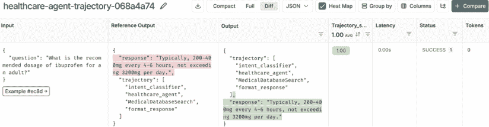

# 评估和测试

正如我们在本书中迄今为止所讨论的，LLM 代理和系统在各个行业都有广泛的应用。然而，将这些复杂的神经网络系统从研究转移到实际部署面临着重大的挑战，并需要强大的评估策略和测试方法。

在 LangChain 中评估 LLM 代理和应用程序带来了新的方法和指标，这些可以帮助确保优化、可靠和道德上合理的成果。本章深入探讨了评估 LLM 代理的复杂性，包括系统级评估、评估驱动设计、离线和在线评估方法以及使用 Python 代码的实践示例。

到本章结束时，您将全面了解如何评估 LLM 代理并确保其与预期目标和治理要求保持一致。总的来说，本章将涵盖：

+   评估的重要性

+   我们评估的内容：核心代理能力

+   我们如何评估：方法和途径

+   实践中评估 LLM 代理

+   离线评估

您可以在本书 GitHub 仓库的`chapter8/`目录中找到本章的代码。鉴于该领域的快速发展以及 LangChain 库的更新，我们致力于保持 GitHub 仓库的更新。请访问[`github.com/benman1/generative_ai_with_langchain`](https://github.com/benman1/generative_ai_with_langchain)以获取最新更新。

请参阅*第二章*以获取设置说明。如果您在运行代码时遇到任何问题或有任何疑问，请在 GitHub 上创建问题或在 Discord 上加入讨论，详情请见[`packt.link/lang`](https://packt.link/lang)。

在开发 LLM 代理的领域，评估在确保这些复杂的系统在实际应用中可靠和有效方面发挥着关键作用。让我们开始讨论为什么严格的评估是不可或缺的！

# 评估的重要性

LLM 代理代表了一类新的 AI 系统，这些系统结合了语言模型、推理、决策和工具使用能力。与传统具有可预测行为的软件不同，这些代理具有更高的自主性和复杂性，因此在部署前进行彻底的评估至关重要。

考虑现实世界的后果：与传统具有确定性行为的软件不同，LLM 代理会做出复杂、依赖上下文的决策。如果在实施前未经评估，客户支持中的 AI 代理可能会提供误导性信息，损害品牌声誉，而医疗助手可能会影响关键的治疗决策——这突显了为什么彻底的评估是必不可少的。

在深入研究具体的评估技术之前，区分两种根本不同的评估类型非常重要：

**LLM 模型评估：**

+   专注于基础语言模型的原始能力

+   使用受控提示和标准化基准

+   评估内在能力，如推理、知识回忆和语言生成

+   通常由模型开发者或研究人员进行，比较不同的模型

**LLM 系统/应用评估：**

+   评估包括 LLM 以及附加组件在内的完整应用程序

+   通过实际用户查询和场景检验现实世界的性能

+   评估组件如何协同工作（检索、工具、记忆等）

+   衡量解决用户问题的端到端有效性

虽然这两种类型的评估都很重要，但本章重点介绍系统级评估，因为使用 LangChain 构建 LLM 代理的实践者更关注整体应用性能，而不是比较基础模型。一个基础模型较弱，但具有出色的提示工程和系统设计，可能在现实应用中优于一个集成较差但能力更强的模型。

## 安全与契合度

在 LLM 的背景下，契合度有两个含义：作为一个过程，指的是用于确保模型行为符合人类期望和价值观的培训后技术；作为一个结果，衡量模型行为符合预期的人类价值观和安全指南的程度。与关注准确性和完整性的任务相关性能不同，契合度解决的是系统对人类行为标准的根本校准。虽然微调可以提高模型在特定任务上的性能，但契合度专门针对道德行为、安全性和有害输出的减少。

这种区分至关重要，因为一个模型可能能力很强（经过良好微调），但与人类价值观的契合度差，可能会产生违反伦理规范或安全指南的复杂输出。相反，一个模型可能与人类价值观契合良好，但在某些领域的特定任务能力上可能不足。与人类价值观的契合度对于负责任的 AI 部署是基本的。评估必须验证代理在多个维度上与人类期望的一致性：敏感领域的客观准确性、伦理边界识别、响应的安全性以及价值一致性。

契合度评估方法必须针对特定领域的关注点进行定制。在金融服务领域，契合度评估侧重于符合 GDPR 和欧盟 AI 法案等框架的监管合规性，特别是关于自动化决策。金融机构必须评估欺诈检测系统中的偏差，实施适当的人类监督机制，并记录这些流程以满足监管要求。在零售环境中，契合度评估集中在道德个性化实践上，平衡推荐的相关性与客户隐私关注，并在生成个性化内容时确保透明的数据使用政策。

制造环境需要关注安全参数和操作边界的对齐评估。人工智能系统必须识别潜在的危险操作，维护适当的人类干预协议以进行质量控制，并遵守行业标准。对齐评估包括测试预测性维护系统是否适当地将关键安全问题升级给人类技术人员，而不是自主决定关键设备的安全维护计划。

在教育环境中，对齐评估必须考虑学生年龄组的发育适宜性，不同学生群体中的公平评估标准，以及适当的透明度水平。教育人工智能系统需要评估其提供复杂话题平衡视角的能力，避免在学习示例中强化刻板印象，并在敏感或微妙问题上适当尊重人类教育者的意见。这些特定领域的对齐评估对于确保人工智能系统不仅技术上表现良好，而且在其应用环境中符合适当的伦理和安全边界至关重要。

## 性能和效率

类似于早期软件测试中的挑战，通过标准化实践得到解决，智能体评估也面临着类似的障碍。这些包括：

+   **过拟合**：系统仅在测试数据上表现良好，但在实际场景中表现不佳

+   **游戏基准**：针对特定测试场景进行优化，而不是通用性能

+   **评估数据集中缺乏多样性**：未能测试系统将在实际场景中遇到的各种情况下的性能，包括边缘情况和意外输入

从软件测试和其他领域汲取经验教训，全面的评估框架需要衡量不仅准确性，还包括可扩展性、资源利用率和 LLM 智能体的安全性。

*性能评估*决定智能体是否能可靠地实现其预期目标，包括：

+   在各种场景中完成任务**的准确性**

+   处理与评估示例不同的新颖输入时的**鲁棒性**

+   **对对抗性输入或操纵的**抵抗

+   **资源效率**在计算和运营成本方面

严格的评估可以识别出各种实际场景中可能出现的故障模式和风险，正如现代基准和竞赛所证明的那样。确保智能体能够在实际条件的变化中安全可靠地运行至关重要。评估策略和方法持续发展，通过迭代改进提高智能体设计的效果。

有效的评估通过平衡准确性与资源效率，防止采用不必要的复杂和昂贵解决方案。例如，DSPy 框架优化了成本和任务性能，突出了评估如何引导资源有效解决方案。LLM 代理也受益于类似的优化策略，确保其计算需求与其收益相匹配。

## 用户和利益相关者价值

评估有助于量化 LLM 代理在实际环境中的实际影响。在 COVID-19 大流行期间，世界卫生组织实施筛查聊天机器人的举措展示了人工智能如何通过用户依从性和信息质量等指标实现有意义的实际成果。在金融服务领域，摩根大通（JPMorgan Chase）的 COIN（合同智能）平台通过每年减少 36 万小时的手动审查工作展示了价值，评估重点在于与传统方法相比的准确率和成本节约。同样，丝芙兰（Sephora）的美容机器人通过提高转化率（比传统渠道高出 6%）和更高的平均订单价值，证明了在多个维度上的利益相关者价值。

用户体验是成功部署人工智能的基石。像 Alexa 和 Siri 这样的系统会经历严格的易用性和参与度评估，这些评估有助于设计改进。同样，评估用户与 LLM 代理的交互有助于优化界面并确保代理满足或超越用户期望，从而提高整体满意度和采用率。

现代人工智能系统的一个关键方面是理解人类干预如何影响结果。在医疗保健环境中，评估显示了人类反馈如何增强聊天机器人在治疗环境中的性能。在制造业中，一家主要汽车制造商部署的预测性维护 LLM 代理通过减少停机时间（提高了 22%）、延长设备使用寿命以及维护技术人员对系统可解释性和有用性的积极反馈，展示了价值。对于 LLM 代理，评估中融入人类监督揭示了决策过程方面的见解，并突出了优势和需要改进的领域。

完整的代理评估需要解决多个利益相关者在代理生命周期中的不同观点和优先事项。部署的评估方法应反映这种多样性，并针对每个群体的主要关注点定制指标。

最终用户主要通过实际任务完成和交互质量来评估智能代理。他们的评估围绕代理理解并准确满足请求的能力（任务成功率）、提供相关信息（答案相关性）、保持对话连贯性以及以合理的速度操作（响应时间）。这一群体最重视满意度指标，在对话环境中，用户满意度评分和沟通效率尤为重要。在特定应用领域，如网络导航或软件工程中，用户可能会优先考虑特定领域的成功指标——例如，电子商务代理是否成功完成购买或编码代理是否正确解决软件问题。

技术利益相关者需要更深入地评估代理的内部流程，而不仅仅是结果。他们关注规划的质量（计划可行性、计划最优性）、推理的连贯性、工具选择的准确性以及遵守技术约束。对于 SWE 代理，代码正确性和测试用例通过率等指标至关重要。技术团队还密切监控计算效率指标，如令牌消耗、延迟和资源利用率，因为这些直接影响到运营成本和可扩展性。他们的评估还扩展到代理的鲁棒性——衡量它如何处理边缘情况、从错误中恢复以及在不同负载下的表现。

商业利益相关者通过直接关联到组织价值的指标来评估智能代理。除了基本的投资回报率计算之外，他们跟踪特定领域的 KPIs，这些指标展示了可衡量的影响：客户服务代理减少呼叫中心工作量、零售应用提高库存准确性或制造代理减少停机时间。他们的评估框架包括代理与战略目标的契合度、竞争优势以及在整个组织中的可扩展性。在金融等行业，将技术性能与业务成果连接起来的指标——例如，在保持客户便利性的同时减少欺诈损失——特别有价值。

监管利益相关者，尤其是在高风险领域如医疗保健、金融和法律服务中，通过严格的合规性和安全性视角来评估智能代理。他们的评估包括代理遵守特定领域法规的情况（如医疗保健中的 HIPAA 或银行中的金融法规）、偏见检测措施、对抗性输入的鲁棒性以及决策过程的全面文档记录。对于这些利益相关者来说，安全测试的彻底性和代理在定义的安全轨道内的一致表现比纯效率或能力指标更为重要。随着自主代理的更广泛部署，这一监管评估维度变得越来越关键，以确保道德操作并最小化潜在危害。

对于组织决策者来说，评估应包括成本效益分析，特别是在部署阶段尤为重要。在医疗保健领域，比较 AI 干预与传统方法的成本和效益确保了经济可行性。同样，评估 LLM 代理部署的财务可持续性涉及分析运营成本与实现效率，确保可扩展性而不牺牲有效性。

## 构建 LLM 评估的共识

由于 LLM 具有开放性本质和主观的、依赖上下文的“良好”性能定义，评估 LLM 代理带来重大挑战。与具有明确指标的传统软件不同，LLM 可能会被说服是错误的，而且人们对它们质量的判断各不相同。这需要一种以建立组织共识为中心的评估策略。

有效的评估基础在于优先考虑用户结果。开发者不应从技术指标开始，而应确定从用户角度构成成功的因素，理解代理应提供的价值以及潜在的风险。这种基于结果的方法确保评估优先级与实际影响相一致。

解决 LLM 评估的主观性质需要建立稳健的评估治理。这包括创建由技术专家、领域专家和用户代表组成的跨职能工作组，以定义和记录正式的评估标准。明确不同评估维度和解决分歧的决策框架至关重要。维护评估标准的版本控制确保随着理解的演变保持透明度。

在组织环境中，平衡不同利益相关者的观点至关重要。评估框架必须适应技术性能指标、特定领域的准确性和以用户为中心的有用性。有效的治理通过加权评分系统、定期跨职能审查等机制促进这种平衡，确保所有观点都被考虑。

最终，评估治理作为组织学习的机制。良好的框架有助于识别特定的失败模式，为开发提供可操作的见解，使系统能够进行定量比较，并通过集成反馈循环支持持续改进。建立一个由所有利益相关者群体代表组成的“模型治理委员会”可以帮助审查结果，解决争议，并指导部署决策。不仅记录结果，还要记录围绕它们的讨论，可以捕捉到用户需求和系统局限性的宝贵见解。

总之，严格和规范化的评估是 LLM 代理开发生命周期的重要组成部分。通过实施考虑技术性能、用户价值和组织一致性的结构化框架，团队可以确保这些系统有效地提供利益，同时减轻风险。接下来的章节将深入探讨评估方法，包括与使用 LangChain 等工具的开发者相关的具体示例。

建立在 LLM 代理评估的基本原则和建立稳健治理的重要性之上，我们现在转向评估的实际情况。开发可靠的代理需要清楚地了解其行为哪些方面需要衡量，以及如何应用有效技术来量化其性能。接下来的章节将提供评估 LLM 代理的“什么”和“如何”的详细指南，分解你应该关注的核心理念，以及你可以采用的各种方法来为你的应用程序构建全面的评估框架。

# 我们评估的内容：核心代理能力

在最基本层面上，LLM 代理的价值直接与其成功完成其设计任务的能力相关联。如果一个代理无法可靠地完成其核心功能，无论其底层模型或工具多么复杂，其效用都将严重受限。因此，这项任务表现评估构成了代理评估的基础。在下一小节中，我们将探讨衡量任务成功的细微差别，考虑与评估你的代理在现实场景中如何有效地执行其主要功能相关的因素。

## 任务表现评估

任务表现构成了代理评估的基础，衡量代理如何有效地完成其既定目标。成功的代理展示了高任务完成率，同时产生相关、事实准确的响应，直接满足用户需求。在评估任务表现时，组织通常评估最终输出的正确性和实现该输出所使用过程的效率。

TaskBench（Shen 及其同事，2023）和 AgentBench（Liu 及其同事，2023）提供了由 LLM 驱动的代理的标准化多阶段评估。TaskBench 将任务分为分解、工具选择和参数预测，然后报告说，像 GPT-4 这样的模型在单工具调用上的成功率超过 80%，但在端到端任务自动化上的成功率降至约 50%。AgentBench 的八个交互式环境同样显示，顶级专有模型远远优于较小的开源模型，突显了跨领域泛化挑战。

金融服务业应用展示了实际中的任务性能评估，尽管我们应该对行业报告的指标持适当的怀疑态度。虽然许多机构声称文档分析系统具有高准确率，但独立的学术评估在现实条件下记录了显著较低的性能。在受监管行业中，一个特别重要的维度是智能体正确识别其缺乏足够信息的情况的能力——这是一个需要特定评估协议的临界安全功能，而不仅仅是简单的准确度测量。

## 工具使用评估

工具使用能力——智能体选择、配置和利用外部系统的能力——已成为区分高级智能体和简单问答系统的关键评估维度。有效的工具使用评估涵盖了多个方面：智能体为给定子任务选择适当工具的能力，提供正确的参数，正确解释工具输出，并将这些输出整合到连贯的解决方案策略中。

由刘及其同事（2023 年）开发的 T-Eval 框架，将工具使用分解为可区分的可测量能力：规划工具调用的顺序，推理下一步行动，从可用选项中检索正确的工具，理解工具文档，正确格式化 API 调用，以及审查响应以确定是否达到目标。这种细粒度方法允许组织识别其智能体工具处理能力的具体弱点，而不仅仅是观察整体失败。

近期基准测试，如 ToolBench 和 ToolSandbox，表明即使在动态环境中，最先进的智能体在使用工具方面也面临挑战。在生产系统中，评估越来越关注效率指标，同时兼顾基本正确性——衡量智能体是否避免了冗余的工具调用，最小化了不必要的 API 使用，并选择了最直接的方法来解决用户问题。尽管行业实施往往声称有显著的效率提升，但同行评审的研究表明，收益更为适度，优化后的工具选择通常在受控研究中将计算成本降低 15-20%，同时保持结果质量。

## RAG 评估

RAG 系统评估代表了智能体评估的一个专业但至关重要的领域，专注于智能体检索和整合外部知识的有效性。四个关键维度构成了全面 RAG 评估的基础：检索质量、上下文相关性、忠实生成和信息综合。

*检索质量*衡量系统从其知识库中找到最合适信息的能力。而不是使用简单的相关性评分，现代评估方法通过不同排名的精确度和召回率来评估检索，同时考虑检索文档的绝对相关性及其覆盖用户查询所需信息的范围。学术研究已经开发了带有专家注释的标准测试集合，以实现不同检索方法之间的系统比较。

另一方面，*上下文相关性*考察检索到的信息与查询中表达的具体信息需求匹配的精确程度。这涉及到评估系统是否能够区分表面上相似但上下文不同的信息请求。最近的研究已经开发了针对金融环境中歧义消除能力的专门评估方法，在这些环境中，相似的术语可能适用于根本不同的产品或法规。这些方法具体衡量检索系统区分使用相似语言但具有不同信息需求的查询的能力。

*忠实生成*——代理的响应准确反映检索到的信息而不添加细节的程度——可能是 RAG 评估中最关键的部分。最近的研究发现，即使是优化良好的 RAG 系统仍然显示出非微不足道的幻觉率，在复杂领域为 3-15%，突显了这一领域的持续挑战。研究人员已经开发了各种评估协议，包括来源归属测试和矛盾检测机制，这些机制系统地比较生成内容与检索到的源材料。

最后，*信息综合*质量评估代理将来自多个来源的信息整合成连贯、结构良好的响应的能力。而不仅仅是简单地将单个文档连接或改写，高级代理必须调和可能冲突的信息，呈现平衡的视角，并逻辑地组织内容。这里的评估不仅超越了自动化指标，还包括专家对代理如何有效地将复杂信息综合成易于理解、准确且保持适当细微差别的总结的有效性评估。

## 规划和推理评估

规划和推理能力构成了认知基础，使代理能够解决复杂的多步骤问题，这些问题不能通过单一操作来解决。评估这些能力需要超越简单的输入输出测试，以评估代理思维过程和问题解决策略的质量。

计划可行性衡量提议的计划中的每个动作是否尊重领域的先决条件和约束。使用 PlanBench 套件，Valmeekam 及其同事在 2023 年的论文*PlanBench: 用于评估大型语言模型在规划和关于变化推理上的可扩展基准*中表明，在零样本条件下，GPT-4 仅在约 34%的经典 IPC 风格领域中正确生成完全可执行的计划——远低于可靠的阈值，并强调了持续未能考虑环境动态和逻辑先决条件的失败。

计划最优性将评估扩展到基本可行性之外，以考虑效率。这个维度评估智能体是否不仅能识别任何可行的解决方案，而且能识别实现目标的最有效方法。Recipe2Plan 基准通过测试智能体是否能在时间限制下有效多任务处理来具体评估这一点，这反映了现实世界的效率要求。当前最先进的模型显示出显著的改进空间，已发表的研究表明，即使是能力最强的系统，最优规划率也在 45%到 55%之间。

逻辑一致性评估了智能体问题解决方法的逻辑结构——是否每个推理步骤逻辑上相连，结论是否从前提中得出，以及智能体在复杂分析中是否保持一致性。与只关注最终输出的传统软件测试不同，智能体评估越来越多地检查中间推理步骤，以识别可能被正确最终答案掩盖的逻辑进展中的失败。多项学术研究表明，这种方法的重要性，并且有几个研究小组开发了用于推理跟踪分析的标准化方法。

近期研究（*CoLadder: 在多级抽象中通过分层代码生成支持程序员*，2023 年，以及*通过任务分解和 RAG 生成低代码完整工作流*，2024 年）表明，将代码生成任务分解为更小、定义良好的子任务——通常使用分层或按需规划——在基准测试和实际工程环境中都能显著提高代码质量、开发人员生产力和系统可靠性。

在 LLM 智能体评估的基础原则和建立稳健治理的重要性基础上，我们现在转向评估的实际现实。开发可靠的智能体需要清楚地了解需要衡量其行为的哪些方面以及如何应用有效的技术来量化其性能。

确定要评估的核心能力是第一步关键。接下来是确定如何有效地测量它们，考虑到与传统的软件相比，LLM 代理固有的复杂性和主观方面。依赖于单一指标或方法是不够的。在下一小节中，我们将探讨评估代理性能的稳健、可扩展和有洞察力的各种方法和途径。我们将涵盖自动化指标在一致性方面的作用、主观评估中人类反馈的必要性、系统级分析对集成代理的重要性，以及如何将这些技术结合成一个实用的评估框架，以推动改进。

# 我们如何评估：方法和途径

LLM 代理，尤其是那些使用灵活框架（如 LangChain 或 LangGraph）构建的代理，通常由不同的功能部分或*技能*组成。代理的整体性能不是一个单一的单一指标；它是它执行这些个别能力以及它们如何有效协作的结果。在下一小节中，我们将深入研究这些区分有效代理的核心能力，概述我们应该评估的具体维度，以了解我们的代理在哪些方面表现优异，在哪些方面可能存在不足。

## 自动评估方法

自动评估方法提供了对代理能力可扩展、一致的评估，使得在不同版本或实现之间进行系统比较成为可能。虽然没有任何单一指标可以捕捉到代理性能的所有方面，但结合互补的方法可以实现全面的自动化评估，这有助于补充人工评估。

基于参考的评估将每个代理输出与一个或多个黄金标准答案或轨迹进行比较。虽然 BLEU/ROUGE 和早期的嵌入度量（如 BERTScore / **通用句子编码器**（**USE**））是重要的第一步，但今天的最佳实践依赖于学习指标（BLEURT、COMET、BARTScore）、基于问答的框架（QuestEval）和由 LLM 驱动的评委，所有这些都由大量人工评分数据集支持，以确保稳健、语义感知的评估。

与直接字符串比较相比，现代评估越来越多地采用基于标准的评估框架，这些框架通过检查规划、推理、工具选择、参数形成和结果解释等多阶段过程来评估工具的使用情况。这种结构化方法可以精确地识别出在哪个环节代理可能会失败，提供比简单的成功/失败指标多得多的可操作见解。

LLM-as-a-judge approaches represent a rapidly evolving evaluation methodology where powerful language models serve as automated evaluators, assessing outputs according to defined rubrics. Research by Zheng and colleagues (*Judging LLM-as-a-Judge with MT-Bench and Chatbot Arena*, 2023) demonstrates that with carefully designed prompting, models like GPT-4 can achieve substantial agreement with human evaluators on dimensions like factual accuracy, coherence, and relevance. This approach can help evaluate subjective qualities that traditional metrics struggle to capture, though researchers emphasize the importance of human verification to mitigate potential biases in the evaluator models themselves.

## 人类在环评估

人类评估对于评估自动化指标无法完全捕捉的代理性能的主观维度仍然至关重要。有效的人类在环评估需要结构化的方法来确保一致性并减少偏见，同时利用人类判断在最有价值的地方。

专家评审提供了来自领域专家的深入定性评估，他们可以识别细微错误、评估推理质量并评估与特定领域最佳实践的符合程度。与现代专家评审相比，现代专家评审采用标准化的评分标准，将评估分解为特定的维度，通常使用李克特量表或比较排名。在医疗和金融领域的研究已经开发了专家评估的标准协议，特别是用于评估在复杂监管环境中的代理响应。

用户反馈捕捉了与代理在现实环境中互动的最终用户的观点。通过嵌入的评分机制（例如，点赞/踩，1-5 星评级）进行结构化反馈收集提供了关于用户满意度的定量数据，而自由文本评论则提供了对特定优势或弱点的定性见解。对话代理有效性的学术研究越来越多地实施系统性的反馈收集协议，其中用户评分被分析以识别不同查询类型、用户群体或时间跨度的代理性能模式。

A/B 测试方法通过随机将用户路由到不同的实现并测量性能差异，允许对不同的代理版本或配置进行受控比较。这种实验方法在评估代理提示、工具集成或检索机制的变化方面尤其有价值。在实施 A/B 测试时，研究人员通常定义主要指标（如任务完成率或用户满意度）以及帮助解释观察到的差异的次要指标（例如响应长度、工具使用模式或对话持续时间）。

学术研究在对话代理优化方面已经证明了控制实验在识别特定改进代理配置方面的有效性。

## 系统级评估

对于复杂的 LLM 代理，尤其是 RAG 系统，系统级评估至关重要，因为测试单个组件是不够的。研究表明，相当一部分失败（在某些研究中超过 60%）源于在独立运行时功能正常的组件之间的集成问题。例如，问题可能源于检索到的文档未正确使用，查询重构改变了原始意图，或上下文窗口在交接过程中截断信息。系统级评估通过检查组件之间的信息流以及代理作为统一系统的表现来解决此问题。

系统级评估的核心方法包括使用诊断框架来追踪整个管道中的信息流，以识别故障点，例如 RAG 诊断工具。追踪和可观察性工具（如 LangSmith、Langfuse 和 DeepEval）提供了对代理内部工作的可见性，使开发者能够可视化推理链并确定错误发生的位置。端到端测试方法使用全面的场景来评估整个系统如何处理歧义、挑战性输入以及在多个回合中保持上下文，使用 GAIA 等框架。

对 LLM 应用的有效评估需要运行多个评估。而不是呈现抽象概念，这里有一些实用的步骤！

+   **定义业务指标**：首先确定对您的组织重要的指标。关注功能性方面，如准确性、完整性，技术因素，如延迟和令牌使用，以及用户体验元素，包括有用性和清晰度。每个应用都应具有具体的标准，并采用明确的测量方法。

+   **创建多样化的测试数据集**：开发涵盖常见用户查询、具有挑战性的边缘情况和潜在合规问题的全面测试数据集。系统性地分类示例以确保广泛的覆盖。随着发现新的使用模式或故障模式，持续扩展您的数据集。

+   **结合多种评估方法**：使用多种评估方法进行彻底的评估。对事实准确性和正确性的自动检查应与特定领域的标准相结合。在评估响应时，考虑来自领域专家的定量指标和定性评估。

+   **逐步部署**：采用分阶段部署方法。从针对离线基准的开发测试开始，然后进行针对小用户子集的有限生产发布。只有在满足性能阈值后，才全面推出。这种谨慎的方法有助于在影响大多数用户之前识别问题。

+   **监控生产性能**：在实时环境中实施持续监控。跟踪关键性能指标，如响应时间、错误率、令牌使用量和用户反馈。为可能表明性能下降或意外行为的异常设置警报。

+   **建立改进周期**：创建结构化的流程，将评估洞察转化为具体的改进。当发现问题时，调查根本原因，实施特定解决方案，并通过重新评估验证更改的有效性。记录问题和成功解决方案的模式，供未来参考。

+   **促进跨职能协作**：在评估过程中包含不同的观点。技术团队、领域专家、业务利益相关者和合规专家都带来了有价值的见解。与这些跨职能团队定期进行审查会议有助于确保对 LLM 应用的全面评估。

+   **维护活文档**：保留评估结果、改进措施和成果的集中记录。这些文档构建了组织知识，并帮助团队从过去的经验中学习，最终加速更有效的 LLM 应用的开发。

现在是时候将理论付诸实践，深入到评估 LLM 代理的细节中。让我们开始吧！

# 实践中评估 LLM 代理

LangChain 为不同的评估标准提供了几个预定义的评估器。这些评估器可以用于根据特定的评分标准或标准集评估输出。一些常见的标准包括简洁性、相关性、正确性、连贯性、有用性和争议性。

我们还可以使用不同的方法，从成对字符串比较、字符串距离和嵌入距离开始，将 LLM 或代理的结果与参考结果进行比较。评估结果可用于根据输出比较确定首选的 LLM 或代理。还可以计算置信区间和 p 值，以评估评估结果的可靠性。

让我们回顾一些基础知识，并应用有用的评估策略。我们将从 LangChain 开始。

## 评估结果的正确性

让我们考虑一个例子，我们想要验证 LLM 的答案是否正确（或者它偏离多远）。例如，当被问及美联储的利率时，您可能会使用精确匹配和字符串距离评估器将输出与参考答案进行比较。

```py
from langchain.evaluation import load_evaluator, ExactMatchStringEvaluator
prompt = "What is the current Federal Reserve interest rate?"
reference_answer = "0.25%" # Suppose this is the correct answer.
# Example predictions from your LLM:
prediction_correct = "0.25%"
prediction_incorrect = "0.50%"
# Initialize an Exact Match evaluator that ignores case differences.
exact_evaluator = ExactMatchStringEvaluator(ignore_case=True)
# Evaluate the correct prediction.
exact_result_correct = exact_evaluator.evaluate_strings(
    prediction=prediction_correct, reference=reference_answer
)
print("Exact match result (correct answer):", exact_result_correct)
# Expected output: score of 1 (or 'Y') indicating a perfect match.
# Evaluate an incorrect prediction.
exact_result_incorrect = exact_evaluator.evaluate_strings(
    prediction=prediction_incorrect, reference=reference_answer
)
print("Exact match result (incorrect answer):", exact_result_incorrect)
# Expected output: score of 0 (or 'N') indicating a mismatch.
```

现在，显然如果输出以不同的格式出现，或者我们想要衡量答案偏离多远，这将不会很有用。在存储库中，您可以找到一个自定义比较的实现，该实现可以解析“它是 0.50%”和“四分之一百分比”之类的答案。

一种更通用的方法是使用 LLM 作为裁判来评估正确性。在这个例子中，我们不是使用简单的字符串提取或精确匹配，而是调用一个评估 LLM（例如，一个中高端模型如 Mistral），它解析并评分提示、预测和参考答案，然后返回一个数值评分和推理。这在预测可能措辞不同但仍正确的情况下有效。

```py
from langchain_mistralai import ChatMistralAI
from langchain.evaluation.scoring import ScoreStringEvalChain
```

```py
# Initialize the evaluator LLM
llm = ChatMistralAI(
    model="mistral-large-latest",
    temperature=0,
    max_retries=2
)
# Create the ScoreStringEvalChain from the LLM
chain = ScoreStringEvalChain.from_llm(llm=llm)
# Define the finance-related input, prediction, and reference answer
finance_input = "What is the current Federal Reserve interest rate?"
finance_prediction = "The current interest rate is 0.25%."
finance_reference = "The Federal Reserve's current interest rate is 0.25%."
# Evaluate the prediction using the scoring chain
result_finance = chain.evaluate_strings(
 input=finance_input,
    prediction=finance_prediction,
)
print("Finance Evaluation Result:")
print(result_finance)
```

输出展示了 LLM 评估者如何通过细腻的推理来评估响应质量：

```py
Finance Evaluation Result:
{'reasoning': "The assistant's response is not verifiable as it does not provide a date or source for the information. The Federal Reserve interest rate changes over time and is not static. Therefore, without a specific date or source, the information provided could be incorrect. The assistant should have advised the user to check the Federal Reserve's official website or a reliable financial news source for the most current rate. The response lacks depth and accuracy. Rating: [[3]]", 'score': 3}
```

这次评估突出了 LLM 作为裁判方法的一个重要优势：它可以识别简单匹配可能遗漏的微妙问题。在这种情况下，评估者正确地指出，该响应缺少重要的上下文。以 5 分为满分，LLM 裁判给出了比二元正确/错误评估更细腻的评估，为开发者提供了可操作的反馈，以改善金融应用中的响应质量，在这些应用中准确性和适当的归属至关重要。

下一个示例展示了如何使用 Mistral AI 评估模型预测与参考答案的匹配情况。请确保设置你的`MISTRAL_API_KEY`环境变量并安装所需的包：`pip install langchain_mistralai`。如果你遵循了第二章中的说明，这个包应该已经安装好了。

当你有真实响应并想评估模型输出与预期答案的匹配程度时，这种方法更为合适。它特别适用于有明确、正确答案的事实性问题。

```py
from langchain_mistralai import ChatMistralAI
from langchain.evaluation.scoring import LabeledScoreStringEvalChain
# Initialize the evaluator LLM with deterministic output (temperature 0.)
llm = ChatMistralAI(
    model="mistral-large-latest",
    temperature=0,
    max_retries=2
)
# Create the evaluation chain that can use reference answers
labeled_chain = LabeledScoreStringEvalChain.from_llm(llm=llm)
# Define the finance-related input, prediction, and reference answer
finance_input = "What is the current Federal Reserve interest rate?"
finance_prediction = "The current interest rate is 0.25%."
finance_reference = "The Federal Reserve's current interest rate is 0.25%."
# Evaluate the prediction against the reference
labeled_result = labeled_chain.evaluate_strings(
 input=finance_input,
    prediction=finance_prediction,
    reference=finance_reference,
)
print("Finance Evaluation Result (with reference):")
print(labeled_result)
```

输出显示了提供参考答案如何显著改变评估结果：

```py
{'reasoning': "The assistant's response is helpful, relevant, and correct. It directly answers the user's question about the current Federal Reserve interest rate. However, it lacks depth as it does not provide any additional information or context about the interest rate, such as how it is determined or what it means for the economy. Rating: [[8]]", 'score': 8}
```

注意，当我们提供一个参考答案时，分数从先前的 3 分（在上一个示例中）急剧上升到 8 分。这证明了在评估中真实信息的重要性。没有参考，评估者关注的是缺乏引用和时间戳。有了确认事实准确性的参考，评估者现在专注于评估完整性和深度，而不是可验证性。

这两种方法都利用了 Mistral 的 LLM 作为评估者，它可以提供比简单的字符串匹配或统计方法更细腻和上下文感知的评估。当使用`temperature=0`时，这些评估的结果应该是一致的，尽管由于提供方的变化，输出可能与书中所示的不同。

你的输出可能与书中示例不同，这可能是由于模型版本差异和 LLM 响应（根据温度）的固有变化。

## 评估语气和简洁性

除了事实准确性之外，许多应用程序还需要满足某些风格标准的响应。例如，医疗保健应用程序必须以友好、可接近的方式提供准确的信息，而不会让患者感到不必要的细节过多。以下示例演示了如何使用 LangChain 的评估器来评估简洁性和语气，使开发者能够评估响应质量的这些主观但关键方面：

我们首先导入评估加载器和用于评估的聊天 LLM（例如 GPT-4o）：

```py
from langchain.evaluation import load_evaluator
from langchain.chat_models import ChatOpenAI
evaluation_llm = ChatOpenAI(model="gpt-4o", temperature=0)
```

我们的示例提示和获得的答案是：

```py
prompt_health = "What is a healthy blood pressure range for adults?"
# A sample LLM output from your healthcare assistant:
prediction_health = (
    "A normal blood pressure reading is typically around 120/80 mmHg. "
    "It's important to follow your doctor's advice for personal health management!"
)
```

现在，让我们使用内置的`conciseness`标准来评估简洁性：

```py
conciseness_evaluator = load_evaluator(
 "criteria", criteria="conciseness", llm=evaluation_llm
)
conciseness_result = conciseness_evaluator.evaluate_strings(
    prediction=prediction_health, input=prompt_health
)
print("Conciseness evaluation result:", conciseness_result)
```

结果包括一个分数（0 或 1）、一个值（“Y”或“N”）和一个推理思维链：

```py
Conciseness evaluation result: {'reasoning': "The criterion is conciseness. This means the submission should be brief, to the point, and not contain unnecessary information.\n\nLooking at the submission, it provides a direct answer to the question, stating that a normal blood pressure reading is around 120/80 mmHg. This is a concise answer to the question.\n\nThe submission also includes an additional sentence advising to follow a doctor's advice for personal health management. While this information is not directly related to the question, it is still relevant and does not detract from the conciseness of the answer.\n\nTherefore, the submission meets the criterion of conciseness.\n\nY", 'value': 'Y', 'score': 1}
```

关于友好性，让我们定义一个`custom`标准：

```py
custom_friendliness = {
 "friendliness": "Is the response written in a friendly and approachable tone?"
}
# Load a criteria evaluator with this custom criterion.
friendliness_evaluator = load_evaluator(
```

```py
 "criteria", criteria=custom_friendliness, llm=evaluation_llm
)
friendliness_result = friendliness_evaluator.evaluate_strings(
    prediction=prediction_health, input=prompt_health
)
print("Friendliness evaluation result:", friendliness_result)
```

评估者应返回语气是否友好（`Y`/`N`）以及推理。事实上，这正是我们得到的：

```py
Friendliness evaluation result: {'reasoning': "The criterion is to assess whether the response is written in a friendly and approachable tone. The submission provides the information in a straightforward manner and ends with a suggestion to follow doctor's advice for personal health management. This suggestion can be seen as a friendly advice, showing concern for the reader's health. Therefore, the submission can be considered as written in a friendly and approachable tone.\n\nY", 'value': 'Y', 'score': 1}
```

这种评估方法对于医疗保健、客户服务和教育领域中的应用尤其有价值，在这些领域中，沟通方式的重要性与事实内容相当。评估者提供的明确推理有助于开发团队了解哪些响应元素导致了其语气，这使得调试和改进响应生成更加容易。虽然二进制的`Y`/`N`评分对于自动质量门很有用，但详细的推理为持续改进提供了更细微的见解。对于生产系统，考虑结合多个标准评估器来创建一个全面的质量评分，该评分反映了您应用程序通信要求的各个方面。

## 评估输出格式

当与 LLM 一起生成结构化数据（如 JSON、XML 或 CSV）时，格式验证变得至关重要。金融应用程序、报告工具和 API 集成通常依赖于正确格式的数据结构。一个技术上完美的响应，如果未能遵守预期的格式，可能会破坏下游系统。LangChain 提供了用于验证结构化输出的专用评估器，以下示例展示了使用 JSON 验证财务报告：

```py
from langchain.evaluation import JsonValidityEvaluator
# Initialize the JSON validity evaluator.
```

```py
json_validator = JsonValidityEvaluator()
valid_json_output = '{"company": "Acme Corp", "revenue": 1000000, "profit": 200000}'
invalid_json_output = '{"company": "Acme Corp", "revenue": 1000000, "profit": 200000,}'
# Evaluate the valid JSON.
valid_result = json_validator.evaluate_strings(prediction=valid_json_output)
print("JSON validity result (valid):", valid_result)
# Evaluate the invalid JSON.
invalid_result = json_validator.evaluate_strings(prediction=invalid_json_output)
print("JSON validity result (invalid):", invalid_result)
```

我们将看到一个分数，表示 JSON 有效：

```py
JSON validity result (valid): {'score': 1}
```

对于无效的 JSON，我们得到一个分数，表示 JSON 无效：

```py
JSON validity result (invalid): {'score': 0, 'reasoning': 'Expecting property name enclosed in double quotes: line 1 column 63 (char 62)'}
```

这种验证方法在生产系统中特别有价值，其中 LLM 与其他软件组件交互。`JsonValidityEvaluator`不仅识别无效输出，还提供详细的错误消息，指明格式错误的准确位置。这有助于快速调试，并可以集成到自动化测试管道中，以防止格式相关的失败。考虑为您的应用程序可能生成的其他格式实现类似的验证器，例如 XML、CSV 或金融交易中的 FIX 协议等特定领域的格式。

## 评估代理轨迹

复杂智能体需要在三个关键维度上进行评估：

+   **最终响应评估**：评估提供给用户的最终输出（事实准确性、有用性、质量和安全性）

+   **轨迹评估**：检查智能体达到结论所采取的路径

+   **单步评估**：单独分析决策点

虽然最终响应评估侧重于结果，但轨迹评估则考察流程本身。这种方法对于使用多个工具、推理步骤或决策点来完成任务的复杂智能体尤其有价值。通过评估所采取的路径，我们可以精确地识别智能体成功或失败的确切位置和方式，即使最终答案是错误的。

轨迹评估将智能体实际采取的步骤序列与预期序列进行比较，根据正确完成预期步骤的数量计算得分。即使智能体没有达到正确最终答案，也会对遵循一些正确步骤的智能体给予部分信用。

让我们为响应药物问题的医疗智能体实现一个`自定义轨迹`评估器：

```py
from langsmith import Client
# Custom trajectory subsequence evaluator
def trajectory_subsequence(outputs: dict, reference_outputs: dict) -> float:
 """Check how many of the desired steps the agent took."""
 if len(reference_outputs['trajectory']) > len(outputs['trajectory']):
 return False

    i = j = 0
 while i < len(reference_outputs['trajectory']) and j < len(outputs['trajectory']):
 if reference_outputs['trajectory'][i] == outputs['trajectory'][j]:
            i += 1
        j += 1

 return i / len(reference_outputs['trajectory'])
# Create example dataset with expected trajectories
client = Client()
trajectory_dataset = client.create_dataset(
 "Healthcare Agent Trajectory Evaluation",
    description="Evaluates agent trajectory for medication queries"
)
# Add example with expected trajectory
```

```py
client.create_example(
    inputs={
 "question": "What is the recommended dosage of ibuprofen for an adult?"
    },
    outputs={
 "trajectory": [
 "intent_classifier",
 "healthcare_agent",
 "MedicalDatabaseSearch",
 "format_response"
        ],
 "response": "Typically, 200-400mg every 4-6 hours, not exceeding 3200mg per day."
    },
    dataset_id=trajectory_dataset.id
)
```

请记住设置您的`LANGSMITH_API_KEY`环境变量！如果您遇到`使用旧版 API 密钥`错误，您可能需要从 LangSmith 仪表板生成新的 API 密钥：[`smith.langchain.com/settings`](https://smith.langchain.com/settings)。您始终希望使用 LangSmith 包的最新版本。

为了评估智能体的轨迹，我们需要捕捉实际采取的步骤序列。使用 LangGraph，我们可以利用流式处理能力来记录每个节点和工具调用：

```py
# Function to run graph with trajectory tracking (example implementation)
async def run_graph_with_trajectory(inputs: dict) -> dict:
 """Run graph and track the trajectory it takes along with the final response."""
    trajectory = []
    final_response = ""

 # Here you would implement your actual graph execution
 # For the example, we'll just return a sample result
    trajectory = ["intent_classifier", "healthcare_agent", "MedicalDatabaseSearch", "format_response"]
```

```py
    final_response = "Typically, 200-400mg every 4-6 hours, not exceeding 3200mg per day."
 return {
 "trajectory": trajectory,
 "response": final_response
    }
# Note: This is an async function, so in a notebook you'd need to use await
experiment_results = await client.aevaluate(
    run_graph_with_trajectory,
    data=trajectory_dataset.id,
    evaluators=[trajectory_subsequence],
    experiment_prefix="healthcare-agent-trajectory",
    num_repetitions=1,
    max_concurrency=4,
)
```

我们还可以在数据集上分析结果，这些数据集我们可以从 LangSmith 下载：

```py
results_df = experiment_results.to_pandas()
print(f"Average trajectory match score: {results_df['feedback.trajectory_subsequence'].mean()}")
```

在这种情况下，这是不合逻辑的，但这是为了说明这个想法。

以下截图直观地展示了在 LangSmith 界面中轨迹评估结果的外观。它显示了完美的轨迹匹配得分（**1.00**），这验证了智能体遵循了预期的路径：



图 8.1：LangSmith 中的轨迹评估

请注意，LangSmith 将实际轨迹步骤与参考轨迹并排显示，并且它包括实际的执行指标，如延迟和令牌使用。

轨迹评估提供了超越简单通过/失败评估的独特见解：

+   **识别失败点**：精确地指出智能体偏离预期路径的位置

+   **流程改进**：识别智能体是否采取了不必要的绕路或不高效的路线

+   **工具使用模式**：了解智能体如何利用可用工具，以及它们何时做出次优选择

+   **推理质量**：评估智能体的决策过程，独立于最终结果

例如，一个代理可能提供了正确的药物剂量，但通过不适当的轨迹（绕过安全检查或使用不可靠的数据源）达到它。轨迹评估揭示了结果导向评估会错过的这些流程问题。

考虑结合使用轨迹评估和其他评估类型，对代理的性能进行全面评估。这种方法在开发和调试阶段尤其有价值，在这些阶段，理解代理行为背后的“为什么”与衡量最终输出质量一样重要。

通过实施连续轨迹监控，您可以跟踪随着您细化提示、添加工具或修改底层模型，代理行为如何演变，确保一个领域的改进不会导致代理整体决策过程的退化。

## 评估 CoT 推理

现在假设我们想评估代理的推理。例如，回到我们之前的例子，代理不仅必须回答“当前利率是多少？”还必须提供其答案背后的推理。我们可以使用`COT_QA`评估器进行思维链评估。

```py
from langchain.evaluation import load_evaluator
# Simulated chain-of-thought reasoning provided by the agent:
agent_reasoning = (
 "The current interest rate is 0.25%. I determined this by recalling that recent monetary policies have aimed "
 "to stimulate economic growth by keeping borrowing costs low. A rate of 0.25% is consistent with the ongoing "
 "trend of low rates, which encourages consumer spending and business investment."
)
```

```py
# Expected reasoning reference:
expected_reasoning = (
 "An ideal reasoning should mention that the Federal Reserve has maintained a low interest rate—around 0.25%—to "
 "support economic growth, and it should briefly explain the implications for borrowing costs and consumer spending."
)
# Load the chain-of-thought evaluator.
cot_evaluator = load_evaluator("cot_qa")
result_reasoning = cot_evaluator.evaluate_strings(
 input="What is the current Federal Reserve interest rate and why does it matter?",
    prediction=agent_reasoning,
    reference=expected_reasoning,
)
print("\nChain-of-Thought Reasoning Evaluation:")
print(result_reasoning)
```

返回的分数和推理使我们能够判断代理的思维过程是否合理和全面：

```py
Chain-of-Thought Reasoning Evaluation:
{'reasoning': "The student correctly identified the current Federal Reserve interest rate as 0.25%. They also correctly explained why this rate matters, stating that it is intended to stimulate economic growth by keeping borrowing costs low, which in turn encourages consumer spending and business investment. This explanation aligns with the context provided, which asked for a brief explanation of the implications for borrowing costs and consumer spending. Therefore, the student's answer is factually accurate.\nGRADE: CORRECT", 'value': 'CORRECT', 'score': 1}
```

请注意，在此评估中，代理在提供答案的同时提供详细的推理。评估者（使用思维链评估）将代理的推理与预期的解释进行比较。

# 离线评估

离线评估涉及在部署前在受控条件下评估代理的性能。这包括基准测试以建立一般性能基线，以及基于生成的测试用例的更针对性测试。离线评估提供关键指标、错误分析和受控测试场景的通过/失败总结，建立基线性能。

虽然人类评估有时被视为黄金标准，但它们难以扩展，并且需要精心设计以避免来自主观偏好或权威语调的偏见。基准测试涉及将 LLMs 的性能与标准化测试或任务进行比较。这有助于识别模型的优点和缺点，并指导进一步的开发和改进。

在下一节中，我们将讨论在 RAG 系统评估的背景下创建有效的评估数据集。

## 评估 RAG 系统

之前讨论的 RAG 评估维度（检索质量、上下文相关性、忠实生成和信息综合）为理解如何衡量 RAG 系统有效性提供了基础。了解 RAG 系统的失败模式有助于创建更有效的评估策略。Barnett 及其同事在 2024 年的论文《在构建检索增强生成系统时七个失败点》中确定了 RAG 系统在生产环境中失败的一些不同方式：

+   首先，**内容缺失** **失败**发生在系统未能检索出知识库中存在的相关信息时。这可能是由于分割相关信息的块化策略、遗漏语义连接的嵌入模型或知识库本身的内容差距导致的。

+   其次，**排名失败**发生在相关文档存在但排名不够高以至于不能包含在上下文窗口中时。这通常源于次优嵌入模型、查询与文档之间的词汇不匹配或较差的块划分粒度。

+   **上下文窗口限制**在关键信息分布在超过模型上下文限制的多个文档中时，又产生了一种故障模式。这迫使在包含更多文档和保持每个文档足够细节之间做出困难的权衡。

+   可能最重要的是，**信息提取失败**发生在相关信息被检索出来但 LLM 未能正确综合它的情况下。这可能是由于无效的提示、复杂的信息格式或文档之间的冲突信息导致的。

为了有效地评估和解决这些特定的故障模式，我们需要一个结构化和全面的评估方法。以下示例演示了如何在 LangSmith 中构建一个精心设计的评估数据集，该数据集允许在金融咨询服务背景下测试这些故障模式中的每一个。通过创建具有预期答案和相关信息元数据的真实问题，我们可以系统地识别哪些故障模式最频繁地影响我们的特定实现：

```py
# Define structured examples with queries, reference answers, and contexts
financial_examples = [
    {
 "inputs": {
 "question": "What are the tax implications of early 401(k) withdrawal?",
 "context_needed": ["retirement", "taxation", "penalties"]
        },
 "outputs": {
 "answer": "Early withdrawals from a 401(k) typically incur a 10% penalty if you're under 59½ years old, in addition to regular income taxes. However, certain hardship withdrawals may qualify for penalty exemptions.",
 "key_points": ["10% penalty", "income tax", "hardship exemptions"],
 "documents": ["IRS publication 575", "Retirement plan guidelines"]
        }
    },
    {
 "inputs": {
 "question": "How does dollar-cost averaging compare to lump-sum investing?",
 "context_needed": ["investment strategy", "risk management", "market timing"]
        },
 "outputs": {
 "answer": "Dollar-cost averaging spreads investments over time to reduce timing risk, while lump-sum investing typically outperforms in rising markets due to longer market exposure. DCA may provide psychological benefits through reduced volatility exposure.",
 "key_points": ["timing risk", "market exposure", "psychological benefits"],
```

```py
 "documents": ["Investment strategy comparisons", "Market timing research"]
        }
    },
 # Additional examples would be added here
]
```

此数据集结构服务于多个评估目的。首先，它确定了应该检索的具体文档，从而允许评估检索准确性。然后，它定义了应该出现在响应中的关键点，从而能够评估信息提取。最后，它将每个示例与测试目标相连接，使得诊断特定系统能力变得更加容易。

在实际应用此数据集时，组织通常将这些示例加载到评估平台如 LangSmith 中，以允许对他们的 RAG 系统进行自动化测试。结果揭示了系统性能中的特定模式——可能是强大的检索能力但合成能力较弱，或者简单事实问题的出色表现但复杂视角查询的困难。

然而，实施有效的 RAG 评估不仅仅是创建数据集；它需要使用诊断工具来精确地确定系统管道中失败发生的具体位置。借鉴研究，这些诊断识别出特定的故障模式，例如较差的文档排名（信息存在但未优先考虑）或较差的上下文利用（代理忽略了相关检索到的文档）。通过诊断这些问题，组织可以获得可操作的见解——例如，一致的排名失败可能表明需要实施混合搜索，而上下文利用问题可能导致改进的提示或结构化输出。

RAG 评估的最终目标是推动持续改进。取得最大成功的组织遵循一个迭代周期：运行全面的诊断以找到特定的故障模式，根据其频率和影响优先处理修复，实施有针对性的更改，然后重新评估以衡量改进。通过系统地诊断问题并利用这些见解进行迭代，团队可以构建更准确、更可靠的 RAG 系统，并减少常见错误。

在下一节中，我们将看到如何使用**LangSmith**，LangChain 的配套项目，来对数据集上的系统性能进行基准测试和评估。让我们通过一个示例来逐步操作！

## 在 LangSmith 中评估基准

正如我们提到的，全面的基准测试和评估，包括测试，对于安全性、鲁棒性和预期行为至关重要。LangSmith，尽管是一个旨在测试、调试、监控和改进 LLM 应用的平台，但提供了评估和数据集管理的工具。LangSmith 与 LangChain Benchmarks 无缝集成，为开发和评估 LLM 应用提供了一个统一的框架。

我们可以在 LangSmith 中运行针对基准数据集的评估，正如我们接下来将要看到的。首先，请确保您在这里创建 LangSmith 的账户：[`smith.langchain.com/`](https://smith.langchain.com/)。

您可以在环境中获取一个 API 密钥，并将其设置为`LANGCHAIN_API_KEY`。我们还可以设置项目 ID 和跟踪的环境变量：

```py
# Basic LangSmith Integration Example
import os
# Set up environment variables for LangSmith tracing
os.environ["LANGCHAIN_TRACING_V2"] = "true"
os.environ["LANGCHAIN_PROJECT"] = "LLM Evaluation Example"
print("Setting up LangSmith tracing...")
```

此配置建立了与 LangSmith 的连接，并将所有跟踪信息导向特定的项目。当没有明确定义项目 ID 时，LangChain 将对默认项目进行日志记录。`LANGCHAIN_TRACING_V2`标志启用了 LangSmith 跟踪功能的最新版本。

在配置好环境后，我们可以开始记录与我们的 LLM 应用的交互。每次交互都会在 LangSmith 中创建一个可追踪的记录：

```py
from langchain_openai import ChatOpenAI
from langsmith import Client
# Create a simple LLM call that will be traced in LangSmith
llm = ChatOpenAI()
response = llm.invoke("Hello, world!")
print(f"Model response: {response.content}")
print("\nThis run has been logged to LangSmith.")
```

当此代码执行时，它与 ChatOpenAI 模型进行简单交互，并自动将请求、响应和性能指标记录到 LangSmith。这些日志出现在 LangSmith 项目仪表板中，网址为[`smith.langchain.com/projects`](https://smith.langchain.com/projects)，允许对每个交互进行详细检查。

我们可以使用`create_example_from_run()`函数从现有的代理运行中创建一个数据集，或者从任何其他东西中创建。以下是如何使用一组问题创建数据集的方法：

```py
from langsmith import Client
client = Client()
# Create dataset in LangSmith
dataset_name = "Financial Advisory RAG Evaluation"
dataset = client.create_dataset(
    dataset_name=dataset_name,
    description="Evaluation dataset for financial advisory RAG systems covering retirement, investments, and tax planning."
)
# Add examples to the dataset
for example in financial_examples:
    client.create_example(
        inputs=example["inputs"],
        outputs=example["outputs"],
        dataset_id=dataset.id
    )
print(f"Created evaluation dataset with {len(financial_examples)} examples")
```

此代码在 LangSmith 中创建一个新的评估数据集，包含财务咨询问题。每个示例都包括一个输入查询和一个预期的输出答案，建立了一个参考标准，我们可以据此评估我们的 LLM 应用响应。

我们现在可以使用类似这样的函数来定义我们的 RAG 系统：

```py
def construct_chain():
 return None
```

在完整的实现中，你会准备一个包含相关财务文件的向量存储，创建适当的提示模板，并配置检索和响应生成组件。构建健壮 RAG 系统的概念和技术在*第四章*中进行了广泛讨论，该章节提供了关于文档处理、嵌入创建、向量存储设置和链构建的逐步指导。

我们可以对链进行更改，并在应用中评估更改。这个更改是否改善了结果？更改可以出现在我们应用的任何部分，无论是新模型、新提示模板、新链或新代理。我们可以用相同的输入示例运行两个版本的应用，并保存运行的结果。然后我们通过并排比较来评估结果。

要在数据集上运行评估，我们可以指定一个 LLM，或者为了并行处理，使用构造函数为每个输入初始化模型或 LLM 应用。现在，为了评估与我们的数据集的性能，我们需要定义一个评估器，就像我们在上一节中看到的那样：

```py
from langchain.smith import RunEvalConfig
# Define evaluation criteria specific to RAG systems
evaluation_config = RunEvalConfig(
    evaluators=[
 # Correctness: Compare response to reference answer
        RunEvalConfig.LLM(
            criteria={
 "factual_accuracy": "Does the response contain only factually correct information consistent with the reference answer?"
            }
        ),
 # Groundedness: Ensure response is supported by retrieved context
        RunEvalConfig.LLM(
            criteria={
 "groundedness": "Is the response fully supported by the retrieved documents without introducing unsupported information?"
            }
        ),
 # Retrieval quality: Assess relevance of retrieved documents
        RunEvalConfig.LLM(
            criteria={
```

```py
 "retrieval_relevance": "Are the retrieved documents relevant to answering the question?"
            }
        )
    ]
)
```

这展示了如何为 RAG 系统配置多维度评估，使用基于 LLM 的评委来评估事实准确性、扎根性和检索质量。标准由一个字典定义，其中标准作为键，检查问题的问句作为值。

现在，我们将数据集以及评估配置和评估器一起传递给`run_on_dataset()`以生成指标和反馈：

```py
from langchain.smith import run_on_dataset
results = run_on_dataset(
    client=client,
    dataset_name=dataset_name,
    dataset=dataset,
    llm_or_chain_factory=construct_chain,
    evaluation=evaluation_config
)
```

同样，我们可以将数据集和评估器传递给`run_on_dataset()`以异步生成指标和反馈。

这种实际实现提供了一个你可以根据特定领域进行调整的框架。通过创建一个全面的评估数据集，并在多个维度（正确性、扎根性和检索质量）上评估你的 RAG 系统，你可以确定具体的改进领域，并在你改进系统时跟踪进度。

在实现这种方法时，考虑将来自你应用日志的真实用户查询（适当匿名化）纳入其中，以确保你的评估数据集反映了实际的用法模式。此外，定期用新的查询和更新信息刷新你的数据集有助于防止过拟合，并确保你的评估随着用户需求的变化而保持相关。

让我们使用 HuggingFace 的数据集和评估库来检查编码 LLM 解决编程问题的方法。

## 使用 HF 数据集和 Evaluate 评估基准

提醒一下：`pass@k`指标是评估 LLM 在解决编程练习中性能的一种方式。它衡量了 LLM 在至少一个正确解决方案在排名前`k`的候选人中生成的情况下，这些练习的比例。更高的`pass@k`分数表示更好的性能，因为它意味着 LLM 能够在排名前`k`的候选人中更频繁地生成正确解决方案。

Hugging Face 的`Evaluate`库使得计算`pass@k`和其他指标变得非常容易。以下是一个示例：

```py
from datasets import load_dataset
from evaluate import load
from langchain_core.messages import HumanMessage
human_eval = load_dataset("openai_humaneval", split="test")
code_eval_metric = load("code_eval")
test_cases = ["assert add(2,3)==5"]
candidates = [["def add(a,b): return a*b", "def add(a, b): return a+b"]]
pass_at_k, results = code_eval_metric.compute(references=test_cases, predictions=candidates, k=[1, 2])
print(pass_at_k)
```

我们应该得到如下输出：

```py
{'pass@1': 0.5, 'pass@2': 1.0}
```

要使此代码运行，您需要将`HF_ALLOW_CODE_EVAL`环境变量设置为 1。请谨慎行事：在您的机器上运行 LLM 代码存在风险。

这展示了如何使用 HuggingFace 的`code_eval`指标评估代码生成模型，该指标衡量模型产生功能代码解决方案的能力。这很好。让我们看看另一个示例。

## 评估电子邮件提取

让我们展示如何使用它来评估 LLM 从保险索赔文本中提取结构化信息的能力。

我们首先将使用 LangSmith 创建一个合成数据集。在这个合成数据集中，每个示例由一个原始保险索赔文本（输入）及其对应的预期结构化输出（输出）组成。我们将使用此数据集运行提取链并评估您的模型性能。

我们假设您已经设置了您的 LangSmith 凭证。

```py
from langsmith import Client
# Define a list of synthetic insurance claim examples
example_inputs = [
    (
 "I was involved in a car accident on 2023-08-15\. My name is Jane Smith, Claim ID INS78910, "
 "Policy Number POL12345, and the damage is estimated at $3500.",
        {
 "claimant_name": "Jane Smith",
 "claim_id": "INS78910",
 "policy_number": "POL12345",
 "claim_amount": "$3500",
 "accident_date": "2023-08-15",
 "accident_description": "Car accident causing damage",
 "status": "pending"
        }
    ),
    (
 "My motorcycle was hit in a minor collision on 2023-07-20\. I am John Doe, with Claim ID INS112233 "
 "and Policy Number POL99887\. The estimated damage is $1500.",
        {
 "claimant_name": "John Doe",
 "claim_id": "INS112233",
 "policy_number": "POL99887",
 "claim_amount": "$1500",
 "accident_date": "2023-07-20",
 "accident_description": "Minor motorcycle collision",
```

```py
 "status": "pending"
        }
    )
]
```

我们可以将此数据集上传到 LangSmith：

```py
client = Client()
dataset_name = "Insurance Claims"
# Create the dataset in LangSmith
dataset = client.create_dataset(
    dataset_name=dataset_name,
    description="Synthetic dataset for insurance claim extraction tasks",
)
# Store examples in the dataset
for input_text, expected_output in example_inputs:
    client.create_example(
        inputs={"input": input_text},
        outputs={"output": expected_output},
        metadata={"source": "Synthetic"},
        dataset_id=dataset.id,
    )
```

现在，让我们在 LangSmith 上运行我们的`InsuranceClaim`数据集。我们首先为我们的索赔定义一个模式：

```py
# Define the extraction schema
from pydantic import BaseModel, Field
class InsuranceClaim(BaseModel):
    claimant_name: str = Field(..., description="The name of the claimant")
    claim_id: str = Field(..., description="The unique insurance claim identifier")
    policy_number: str = Field(..., description="The policy number associated with the claim")
    claim_amount: str = Field(..., description="The claimed amount (e.g., '$5000')")
```

```py
    accident_date: str = Field(..., description="The date of the accident (YYYY-MM-DD)")
    accident_description: str = Field(..., description="A brief description of the accident")
    status: str = Field("pending", description="The current status of the claim")
```

现在我们将定义我们的提取链。我们将其保持得非常简单；我们只需请求一个遵循`InsuranceClaim`模式的 JSON 对象。提取链是通过 ChatOpenAI LLM 定义的，函数调用绑定到我们的模式上：

```py
# Create extraction chain
from langchain.chat_models import ChatOpenAI
from langchain.output_parsers.openai_functions import JsonOutputFunctionsParser
instructions = (
 "Extract the following structured information from the insurance claim text: "
 "claimant_name, claim_id, policy_number, claim_amount, accident_date, "
 "accident_description, and status. Return the result as a JSON object following "
 "this schema: " + InsuranceClaim.schema_json()
)
llm = ChatOpenAI(model="gpt-4", temperature=0).bind_functions(
    functions=[InsuranceClaim.schema()],
    function_call="InsuranceClaim"
)
output_parser = JsonOutputFunctionsParser()
extraction_chain = instructions | llm | output_parser | (lambda x: {"output": x})
```

最后，我们可以在我们的样本保险索赔上运行提取链：

```py
# Test the extraction chain
sample_claim_text = (
 "I was involved in a car accident on 2023-08-15\. My name is Jane Smith, "
```

```py
 "Claim ID INS78910, Policy Number POL12345, and the damage is estimated at $3500\. "
 "Please process my claim."
)
result = extraction_chain.invoke({"input": sample_claim_text})
print("Extraction Result:")
print(result)
```

这展示了如何使用 Pydantic 模式标准化提取和 LangSmith 评估性能，来评估从保险索赔文本中提取结构化信息。

# 摘要

在本章中，我们概述了评估 LLM 应用的关键策略，确保在生产部署前性能稳健。我们提供了评估的重要性、架构挑战、评估策略和评估类型的概述。然后，我们通过代码示例展示了实际的评估技术，包括使用精确匹配和 LLM 作为裁判方法的正确性评估。例如，我们展示了如何实现`ExactMatchStringEvaluator`来比较关于联邦储备利率的答案，以及如何使用`ScoreStringEvalChain`进行更细致的评估。示例还涵盖了使用`JsonValidityEvaluator`进行 JSON 格式验证以及评估医疗场景中代理轨迹的方法。

类似于 LangChain 这样的工具为简洁性和相关性等标准提供预定义的评估器，而像 LangSmith 这样的平台则允许进行全面的测试和监控。本章展示了使用 LangSmith 创建和评估数据集的代码示例，展示了如何根据多个标准评估模型性能。展示了使用 Hugging Face 的 Evaluate 库实现`pass@k`指标的方法，用于评估代码生成能力。我们还通过使用结构化模式和 LangChain 的评估能力，展示了评估保险索赔文本提取的示例。

既然我们已经评估了我们的 AI 工作流程，在下一章中，我们将探讨如何部署和监控它们。让我们来讨论部署和可观察性！

# 问题

1.  描述在评估 AI 代理时使用的三个关键指标。

1.  在线评估和离线评估有何区别？

1.  系统级和应用级评估是什么，它们之间有何区别？

1.  如何使用 LangSmith 比较 LLM 应用的不同版本？

1.  思维链评估与传统输出评估有何不同？

1.  为什么轨迹评估对于理解代理行为很重要？

1.  评估 LLM 代理进行生产部署时，有哪些关键考虑因素？

1.  在使用语言模型作为评估器时，如何减轻偏差？

1.  标准化基准在评估 LLM 代理中扮演什么角色，我们如何为 LLM 代理评估创建基准数据集？

1.  如何在生产系统中平衡自动化评估指标与人工评估？
